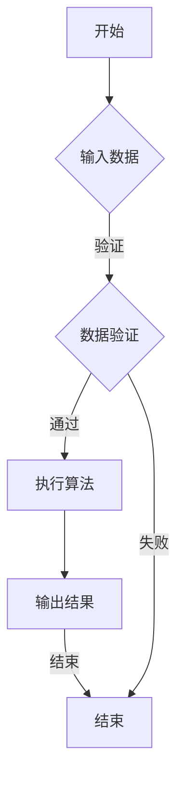
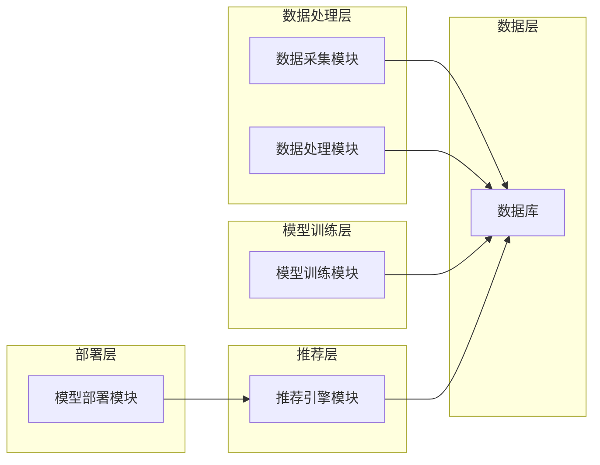
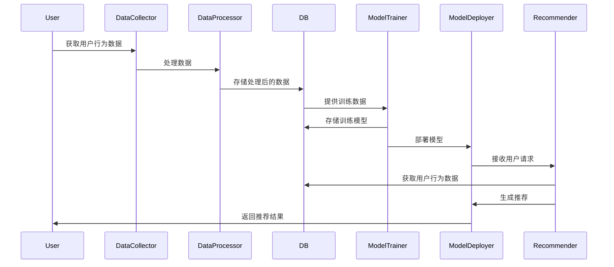
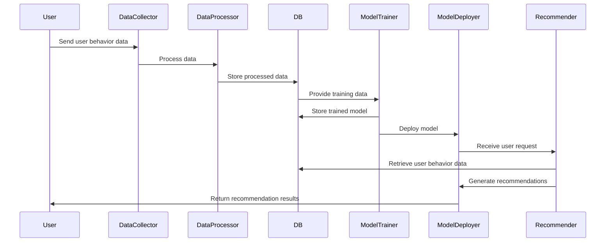

                 

### 从经验主义到理性主义：认识论的演变

#### 关键词
- 认识论
- 经验主义
- 理性主义
- 演变
- 哲学
- 科学

#### 摘要
本文探讨了认识论中的两大基石：经验主义和理性主义。通过深入分析这两者的基本原理、历史演变及其相互关系，我们试图揭示人类认识世界的过程是如何从以经验为基础转变为以理性为核心的。文章首先介绍了认识论的基本概念和背景，然后详细阐述了经验主义和理性主义的核心思想及其在哲学和科学中的应用。最后，通过具体实例和系统架构设计，展示了认识论在现实世界中的实际应用和影响。本文旨在为读者提供一种系统的、逻辑清晰的视角，以理解认识论的演变及其重要性。

### 认识论的基本概念

#### 经验主义的基本原理

经验主义（Empiricism）是认识论中的一个基本立场，主张知识和信念来源于经验。这一理论的核心思想是，我们的感知和经验是我们获取知识的主要途径。经验主义者认为，理性活动本身不能产生知识，只有通过观察和实验才能获得真正的知识。

**核心思想**：
1. **感知优先**：经验主义认为，感知是我们获得知识的唯一来源。外部世界的信息通过我们的感官进入大脑，然后通过理性加工形成知识。
2. **归纳推理**：经验主义者倾向于使用归纳推理来获得知识。归纳推理是从个别实例中归纳出一般性结论的过程。

**代表性人物**：
- 弗朗西斯·培根（Francis Bacon）：培根是经验主义的代表人物之一，他强调实验和观察在获取知识中的重要性。
- 乔治·贝克莱（George Berkeley）：贝克莱认为，我们感知到的世界是“存在即被感知”的，即只有被感知的事物才存在。

**哲学和科学中的应用**：
1. **哲学**：经验主义对哲学产生了深远影响，特别是在知识论和认识论方面。它挑战了理性主义的主张，认为理性本身不是知识的来源。
2. **科学**：在科学方法中，经验主义占据了重要地位。科学实验和观察是科学探究的基础，通过这些方法，科学家们试图揭示自然界的规律。

#### 理性主义的基本原理

理性主义（Rationalism）是认识论中的另一个基本立场，主张理性是知识和信念的根源。与经验主义不同，理性主义者认为，我们的理性本身具有认识真理的能力，而不需要依赖于经验。

**核心思想**：
1. **理性优先**：理性主义者认为，理性是认识的主要途径。理性活动本身可以产生知识，而不依赖于感知和经验。
2. **演绎推理**：理性主义者倾向于使用演绎推理来获得知识。演绎推理是从一般原则出发，得出个别结论的过程。

**代表性人物**：
- 柏拉图（Plato）：柏拉图是理性主义的代表人物，他提出了“理型世界”（Forms or Ideas）的概念，认为理型是真理的来源。
- 笛卡尔（René Descartes）：笛卡尔是现代哲学的奠基人之一，他提出了“我思故我在”（Cogito, ergo sum）的观点，强调理性在认识中的核心作用。

**哲学和科学中的应用**：
1. **哲学**：理性主义对哲学产生了深远影响，特别是在形而上学和逻辑学方面。它挑战了经验主义的观点，主张理性是获取知识的关键。
2. **科学**：在科学方法中，理性主义体现在对数学和逻辑的重视。科学家们使用数学模型和逻辑推理来解释自然现象。

### 经验主义和理性主义的比较与联系

**共同点**：
- 都认为知识和信念是重要的。
- 都试图回答“我们如何认识世界”的问题。

**不同点**：
- **知识来源**：经验主义强调感知和经验，理性主义强调理性本身。
- **推理方式**：经验主义倾向于归纳推理，理性主义倾向于演绎推理。

**相互关系**：
- 经验主义和理性主义在认识论中并不是完全对立的，而是相互补充的。在某些情况下，经验需要理性的引导，而理性也需要经验的验证。

### 认识论的历史演变

**古希腊哲学**：
- 柏拉图和亚里士多德是古希腊哲学中的两位重要代表。柏拉图强调理型世界的存在，亚里士多德则认为经验是获取知识的关键。

**中世纪哲学**：
- 中世纪哲学中的经院哲学强调了理性在认识中的核心作用，同时也承认经验的重要性。

**现代哲学**：
- 17世纪的笛卡尔开启了现代哲学的序幕，他强调了理性在认识中的核心作用。
- 18世纪的启蒙运动强调了经验和科学的重要性。

**当代哲学**：
- 当代哲学继续探讨经验主义和理性主义的关系，同时也引入了新的认识论观点，如建构主义和怀疑主义。

### 认识论在现实世界中的应用

**科学方法**：
- 科学方法结合了经验主义和理性主义的优点，通过实验和观察来获取知识，并通过理性推理来解释自然现象。

**人工智能**：
- 人工智能领域结合了经验主义和理性主义的思想。机器学习中的模型训练依赖于大量的数据（经验），而推理和决策过程则依赖于算法的理性设计。

**哲学和伦理学**：
- 认识论在哲学和伦理学中具有重要的应用。例如，关于知识、信仰和道德判断的讨论都涉及认识论的问题。

### 总结与展望

经验主义和理性主义是认识论中的两大基石，它们各自代表了获取知识的两种不同途径。通过深入分析这两者的基本原理、历史演变及其相互关系，我们可以更好地理解人类认识世界的过程。本文旨在为读者提供一种系统的、逻辑清晰的视角，以理解认识论的演变及其重要性。未来，认识论将继续在哲学、科学和人工智能等领域发挥重要作用，为人类探索真理的道路提供指导。

### 经验主义的基本原理

经验主义（Empiricism）是认识论中的一个基本立场，主张知识和信念来源于经验。经验主义者认为，我们的感知和经验是我们获取知识的主要途径，而理性活动本身不能产生知识。在这一节中，我们将详细探讨经验主义的核心思想、历史背景及其哲学和科学中的应用。

#### 核心思想

经验主义的核心思想可以归纳为以下几点：

1. **感知优先**：经验主义者认为，感知是我们获取知识的主要途径。外部世界的信息通过我们的感官进入大脑，然后通过理性加工形成知识。这一观点强调了感知在认识中的基础地位。

2. **归纳推理**：经验主义者倾向于使用归纳推理来获得知识。归纳推理是从个别实例中归纳出一般性结论的过程。例如，通过观察多次落下的苹果，我们可以归纳出“地球有引力”这一结论。

3. **经验验证**：经验主义强调，所有知识都需要通过经验来验证。没有经验验证的理论被认为是不可靠的。

#### 历史背景

经验主义的发展历程可以追溯到古希腊哲学。亚里士多德（Aristotle）是经验主义的先驱之一，他认为，通过观察和实验可以获得真正的知识。然而，经验主义的真正兴起发生在17世纪，特别是在英国的经验主义哲学家如弗朗西斯·培根（Francis Bacon）和约翰·洛克（John Locke）的推动下。

- **弗朗西斯·培根**：培根是经验主义的代表人物之一，他提出了“知识就是力量”（Knowledge is power）的口号，并强调了实验和观察在获取知识中的重要性。他主张通过归纳法来发现自然规律。

- **约翰·洛克**：洛克是经验主义的另一位重要代表，他提出了“白板说”（tabula rasa），认为人的心灵如同白板，所有的观念和知识都是通过经验获得的。他的思想对后来的科学方法产生了深远影响。

#### 哲学和科学中的应用

在哲学中，经验主义对知识论和认识论产生了重要影响。它挑战了理性主义的主张，认为理性本身不是知识的来源。在科学中，经验主义同样占据了重要地位。科学实验和观察是科学探究的基础，通过这些方法，科学家们试图揭示自然界的规律。

1. **哲学**：
   - **知识论**：经验主义主张，知识来源于经验，而不是理性。这导致了对“先天知识”（即不依赖于经验的、自明的知识）的质疑。
   - **认识论**：经验主义认为，我们的感知是我们获取知识的主要途径，这影响了对认识过程的理解。

2. **科学**：
   - **科学方法**：经验主义的核心思想体现在科学方法中。科学家通过观察和实验来收集数据，并通过归纳推理来形成理论。
   - **实证主义**：经验主义的一个延伸是实证主义，它主张，只有通过经验可以验证的事实才是真实的。这影响了科学方法论的发展。

#### 经验主义的局限性

尽管经验主义在哲学和科学中具有重要意义，但它也存在一定的局限性：

1. **归纳法的局限性**：归纳推理虽然是一种有效的获取知识的方法，但它也存在一定的风险。从个别实例中归纳出的一般性结论可能并不总是准确的。
2. **理性作用的忽视**：经验主义强调感知和经验，但有时可能忽视了理性在知识形成中的作用。理性在验证和解释经验数据方面同样重要。

### 经验主义与理性主义的对比

经验主义和理性主义是认识论中的两种基本立场，它们在获取知识的方法上有所不同：

1. **知识来源**：
   - 经验主义：主张知识和信念来源于经验。
   - 理性主义：主张知识和信念来源于理性本身。

2. **推理方式**：
   - 经验主义：倾向于归纳推理。
   - 理性主义：倾向于演绎推理。

尽管二者存在差异，但它们并不是完全对立的。在实际应用中，经验主义和理性主义往往相互补充。例如，在科学研究中，经验数据需要通过理性分析来解释，而理性推理也需要经验的验证。

### 总结

经验主义是认识论中的重要立场，主张知识和信念来源于经验。通过深入分析其核心思想、历史背景及其在哲学和科学中的应用，我们可以更好地理解经验主义的重要性。然而，我们也应认识到经验主义的局限性，并将其与理性主义相结合，以更全面地认识世界。在下一节中，我们将探讨理性主义的基本原理及其应用。

### 理性主义的基本原理

理性主义（Rationalism）是认识论中的另一个基本立场，主张理性是知识和信念的根源。与经验主义不同，理性主义者认为，我们的理性本身具有认识真理的能力，而不需要依赖于经验。在这一节中，我们将详细探讨理性主义的核心思想、历史背景及其哲学和科学中的应用。

#### 核心思想

理性主义的核心思想可以归纳为以下几点：

1. **理性优先**：理性主义者认为，理性是认识的主要途径。理性活动本身可以产生知识，而不依赖于感知和经验。这一观点强调了理性在认识中的核心作用。

2. **演绎推理**：理性主义者倾向于使用演绎推理来获得知识。演绎推理是从一般原则出发，得出个别结论的过程。例如，从“所有人都会死亡”这个一般性原则出发，可以演绎出“苏格拉底会死亡”这个个别结论。

3. **理性自主**：理性主义者认为，理性本身具有自主性，即它可以独立于感知和经验来产生知识。这意味着，理性可以超越感官经验，直接洞察真理。

#### 历史背景

理性主义的发展历程可以追溯到古希腊哲学，特别是柏拉图和亚里士多德的思想。柏拉图提出了“理型世界”（Forms or Ideas）的概念，认为理型是真理的来源，而亚里士多德则强调了经验在获取知识中的重要性。

然而，理性主义的真正兴起发生在17世纪，特别是在法国哲学家勒内·笛卡尔（René Descartes）和德国哲学家格奥尔格·威廉·弗里德里希·黑尔德（Georg Wilhelm Friedrich Hegel）的推动下。

- **勒内·笛卡尔**：笛卡尔是现代哲学的奠基人之一，他提出了“我思故我在”（Cogito, ergo sum）的观点，强调了理性在认识中的核心作用。他的思想对后来的哲学和科学产生了深远影响。

- **格奥尔格·威廉·弗里德里希·黑尔德**：黑尔德是德国古典哲学的代表人物之一，他提出了“绝对精神”（Absolute Spirit）的概念，认为理性是认识真理的唯一途径。

#### 哲学和科学中的应用

在哲学中，理性主义对知识论和认识论产生了重要影响。它挑战了经验主义的观点，主张理性是获取知识的关键。在科学中，理性主义同样占据了重要地位，特别是在数学和逻辑学领域。

1. **哲学**：
   - **知识论**：理性主义主张，只有通过理性可以验证的知识才是可靠的。这导致了对经验主义观点的质疑。
   - **认识论**：理性主义认为，理性可以超越感官经验，直接洞察真理，这影响了对认识过程的理解。

2. **科学**：
   - **数学**：数学是一门基于逻辑和理性的科学，理性主义在数学的发展中起到了关键作用。数学公式和理论可以通过演绎推理来建立。
   - **逻辑学**：逻辑学是研究推理和论证的学科，理性主义强调逻辑推理在科学探究中的重要性。

#### 理性主义的局限性

尽管理性主义在哲学和科学中具有重要意义，但它也存在一定的局限性：

1. **忽视经验的重要性**：理性主义强调理性在知识形成中的作用，但有时可能忽视了经验的重要性。经验是验证理论的有效手段。

2. **过度自信**：理性主义者可能过度依赖理性，忽视感官经验的重要性。这种过度自信可能导致错误的判断和推理。

### 理性主义与经验主义的对比

理性主义和经验主义是认识论中的两种基本立场，它们在获取知识的方法上有所不同：

1. **知识来源**：
   - 理性主义：主张知识和信念来源于理性本身。
   - 经验主义：主张知识和信念来源于经验。

2. **推理方式**：
   - 理性主义：倾向于演绎推理。
   - 经验主义：倾向于归纳推理。

尽管二者存在差异，但它们并不是完全对立的。在实际应用中，理性主义和经验主义往往相互补充。例如，在科学研究中，理论需要通过实验来验证，而实验数据也需要通过理性分析来解释。

### 总结

理性主义是认识论中的重要立场，主张理性是知识和信念的根源。通过深入分析其核心思想、历史背景及其在哲学和科学中的应用，我们可以更好地理解理性主义的重要性。然而，我们也应认识到理性主义的局限性，并将其与经验主义相结合，以更全面地认识世界。在下一节中，我们将探讨经验主义和理性主义的比较与联系。

### 经验主义和理性主义的比较与联系

经验主义和理性主义是认识论中的两种基本立场，它们在获取知识的方法上有所不同，但它们并不是完全对立的，而是在某些情况下相互补充。在这一节中，我们将详细比较这两者的核心思想、哲学和科学中的应用，并探讨它们之间的联系。

#### 核心思想的比较

1. **知识来源**：
   - **经验主义**：认为知识和信念来源于经验。经验主义者强调感知和实验在获取知识中的重要性，认为理性活动本身不能产生知识。
   - **理性主义**：认为知识和信念来源于理性本身。理性主义者认为，理性活动可以独立于经验，直接产生知识。

2. **推理方式**：
   - **经验主义**：倾向于归纳推理。通过观察个别实例，从中归纳出一般性结论。
   - **理性主义**：倾向于演绎推理。从一般性原则出发，推导出个别结论。

3. **认识途径**：
   - **经验主义**：强调感知和观察的重要性，认为通过感官经验可以获取知识。
   - **理性主义**：强调理性的重要性，认为理性可以超越感官经验，直接洞察真理。

#### 哲学和科学中的应用

1. **哲学**：
   - **经验主义**：在知识论和认识论方面，经验主义主张知识来源于经验，质疑先天知识的合理性。它挑战了理性主义的主张，认为理性本身不是知识的来源。
   - **理性主义**：在形而上学和逻辑学方面，理性主义强调了理性在获取知识中的核心作用。它主张理性可以超越经验，直接洞察真理。这影响了对认识过程的理解。

2. **科学**：
   - **经验主义**：科学实验和观察是科学探究的基础。通过这些方法，科学家们试图揭示自然界的规律。经验主义在科学方法中占据了重要地位。
   - **理性主义**：数学和逻辑学在科学中具有重要应用。理性主义强调数学模型和逻辑推理在解释自然现象中的重要性。

#### 相互联系

尽管经验主义和理性主义在获取知识的方法上有所不同，但它们并不是完全对立的，而是相互补充的。在实际应用中，它们可以相互结合，以更全面地认识世界。

1. **经验与理性相结合**：
   - 在科学研究中，经验数据需要通过理性分析来解释。理性推理可以帮助我们理解实验结果，形成理论。
   - 在哲学中，理性可以帮助我们反思经验，提出深刻的认识论问题。

2. **互补作用**：
   - 经验主义提供了获取知识的实证基础，而理性主义提供了推理和解释的工具。
   - 经验数据需要理性推理来解释，而理性推理也需要经验数据来验证。

3. **跨学科应用**：
   - 在人工智能领域，经验主义和理性主义的思想都得到了应用。机器学习依赖于大量的数据（经验），而推理和决策过程则依赖于算法的理性设计。

#### 总结

经验主义和理性主义是认识论中的两种基本立场，它们在获取知识的方法上有所不同，但并不是完全对立的。通过比较它们的核心思想、哲学和科学中的应用，我们可以看到它们在理论体系和实际应用中的互补作用。在实际研究中，我们可以将经验主义和理性主义相结合，以更全面地认识世界。在下一节中，我们将探讨认识论的历史演变，了解经验主义和理性主义是如何在历史进程中发展演变的。

### 认识论的历史演变

认识论是哲学的一个重要分支，探讨人类如何认识世界和知识的本质。在历史的长河中，认识论经历了多次演变，从早期的朴素唯物主义和唯心主义，到中世纪的经院哲学，再到现代哲学中的经验主义和理性主义，以及当代的建构主义和科学哲学。这一节中，我们将详细探讨这些认识论的发展历程，重点介绍经验主义和理性主义的历史背景和演变过程。

#### 古代哲学

古代哲学中，认识论的基本问题已经开始萌芽。古希腊哲学家如苏格拉底、柏拉图和亚里士多德对认识论进行了初步探讨。

- **苏格拉底**：苏格拉底提出了“知识就是美德”的观点，强调通过问答和逻辑推理来获取知识。

- **柏拉图**：柏拉图提出了理型论，认为理型世界是真实的，而物质世界只是理型的反映。他的观点体现了理性主义的早期思想。

- **亚里士多德**：亚里士多德则更强调经验在获取知识中的重要性。他认为，通过观察和实验可以获得真正的知识。

#### 中世纪哲学

中世纪哲学中的经院哲学受到了基督教神学的影响，强调理性在认识中的核心作用。

- **托马斯·阿奎那**：托马斯·阿奎那是一位著名的经院哲学家，他试图将基督教神学与古希腊哲学中的理性思想相结合。他主张，理性可以帮助我们理解神的启示。

#### 文艺复兴和启蒙运动

文艺复兴和启蒙运动为认识论的发展提供了新的动力。这一时期，人们开始重视经验和科学方法。

- **弗朗西斯·培根**：弗朗西斯·培根是经验主义的代表人物之一，他强调了实验和观察在获取知识中的重要性。他提出了“知识就是力量”的口号，并对后来的科学方法产生了深远影响。

- **约翰·洛克**：约翰·洛克是经验主义的另一位重要代表，他提出了“白板说”，认为人的心灵如同白板，所有的观念和知识都是通过经验获得的。

#### 现代哲学

现代哲学中，经验主义和理性主义成为了认识论中的两大流派。

- **经验主义**：经验主义者如约翰·洛克和乔治·贝克莱强调知识和信念来源于经验。他们主张通过感知和归纳推理来获取知识。

- **理性主义**：理性主义者如勒内·笛卡尔和格奥尔格·威廉·弗里德里希·黑尔德强调理性在认识中的核心作用。他们主张通过演绎推理和理性分析来获取知识。

#### 当代哲学

当代哲学中，认识论继续发展，出现了多种新的观点。

- **建构主义**：建构主义者认为，知识和现实是人们通过互动和解释构建出来的。他们强调知识的主观性和社会建构。

- **科学哲学**：科学哲学探讨科学方法、科学理论和科学实践的本质。它关注科学知识的可靠性和科学的本质。

#### 经验主义和理性主义的演变

经验主义和理性主义在历史发展中不断演变，它们在认识论中的地位也发生了变化。

- **经验主义的发展**：在17世纪和18世纪，经验主义逐渐兴起，成为哲学中的主流观点。经验主义者通过强调感知和经验的重要性，挑战了理性主义的主张。

- **理性主义的发展**：尽管经验主义在18世纪占据主导地位，但理性主义并未消失。19世纪的德国古典哲学，如黑格尔和康德的思想，体现了理性主义的新发展。

- **现代和当代**：在现代社会，经验主义和理性主义的思想依然在哲学和科学中发挥着重要作用。同时，建构主义和科学哲学也为认识论提供了新的视角。

#### 总结

认识论的历史演变揭示了人类对知识和认识过程的理解是如何不断深化和发展的。从古代的朴素唯物主义和唯心主义，到中世纪的经院哲学，再到现代的经验主义和理性主义，以及当代的建构主义和科学哲学，每一个阶段都有其独特的贡献和挑战。通过回顾这些历史进程，我们可以更好地理解经验主义和理性主义的发展，以及它们在认识论中的重要地位。在下一节中，我们将探讨认识论在现实世界中的应用，了解它在科学、哲学和人工智能等领域的实际影响。

### 认识论在现实世界中的应用

认识论不仅是哲学讨论的抽象理论，它在现实世界的许多领域中也有着广泛的应用。特别是在科学方法、人工智能和哲学与伦理学等领域，认识论提供了重要的理论基础和实践指导。以下我们将详细探讨认识论在这些领域的具体应用。

#### 科学方法

科学方法是人类认识世界的重要工具，它结合了经验主义和理性主义的优点，形成了系统的知识获取过程。科学方法主要包括以下步骤：

1. **观察和实验**：科学家通过观察自然现象，收集数据。然后，通过实验来验证假设和理论。

2. **归纳推理**：科学家从个别实例中归纳出一般性结论。这是经验主义的体现，强调通过经验获取知识。

3. **演绎推理**：科学家使用演绎推理来验证从归纳推理中得出的结论。理性主义在这里发挥作用，强调从一般原则推导出个别结论。

4. **理论构建和验证**：科学家构建理论来解释观察和实验的结果，并通过进一步的观察和实验来验证这些理论。

这种科学方法体现了经验主义和理性主义的结合，使得科学能够不断进步，推动人类对自然界的认识。

#### 人工智能

人工智能（AI）是现代科技的前沿领域，它结合了多种学科的理论和实践。在人工智能中，认识论的应用主要体现在以下几个方面：

1. **机器学习**：机器学习是一种通过算法从数据中学习模式和规律的技术。它依赖于经验主义的思想，认为通过大量数据的学习，机器可以获取知识。

2. **逻辑推理**：人工智能中的逻辑推理系统则体现了理性主义的思想。这些系统使用逻辑规则和数学模型来推导结论，从而实现自动化决策和推理。

3. **混合方法**：现代人工智能系统通常结合了机器学习和逻辑推理，形成了一种混合方法。这种方法既能利用经验数据，又能进行理性分析，从而提高了AI系统的性能和可靠性。

#### 哲学和伦理学

在哲学和伦理学领域，认识论为探讨知识、真理和道德提供了理论基础。以下是一些具体的应用：

1. **知识论**：认识论探讨了知识的本质和获取方式。哲学家们讨论了知识的来源、可靠性和范围，从而影响了知识论的发展。

2. **伦理学**：认识论对于伦理学中的道德判断和道德义务的探讨具有重要意义。例如，道德现实主义认为道德真理是客观存在的，而道德相对主义则主张道德是主观的、文化特定的。

3. **科学伦理**：在科学研究中，认识论指导科学家如何进行道德决策。例如，科学家需要考虑研究的伦理影响，确保实验的公正性和伦理性。

#### 实际案例

以下是一些实际案例，展示了认识论在现实世界中的应用：

1. **医学研究**：在医学研究中，科学家使用科学方法来开发新药物和治疗方法。认识论指导他们如何通过实验和观察来验证假设，确保研究成果的可靠性和有效性。

2. **自动驾驶汽车**：自动驾驶汽车结合了机器学习和逻辑推理。认识论帮助工程师设计系统的决策过程，确保汽车在复杂环境下能够做出合理和安全的决策。

3. **伦理决策**：在生物伦理学中，认识论帮助科学家和伦理学家探讨基因编辑、人工智能伦理等问题。他们需要考虑知识的可靠性和道德义务，以确保科技进步符合伦理标准。

#### 总结

认识论在现实世界中的应用是多元且广泛的。无论是在科学方法、人工智能，还是哲学和伦理学中，认识论都提供了重要的理论指导。通过结合经验主义和理性主义的优点，认识论帮助人类更好地理解世界，推动科技进步和社会发展。在下一节中，我们将深入探讨如何从经验和理性两个方面来认识世界。

### 如何从经验和理性两个方面来认识世界

人类对世界的认识是一个复杂的过程，既依赖于经验，也离不开理性。通过经验和理性的结合，我们能够更全面、准确地理解世界。以下，我们将详细探讨如何从经验和理性两个方面来认识世界，并分析二者的关系。

#### 经验主义视角

经验主义强调感知和经验在认识过程中的重要性。以下是经验主义视角下的认识方法：

1. **感知与观察**：我们通过感官（如视觉、听觉、嗅觉等）感知外部世界，收集信息。这些感知数据是获取知识的基础。

2. **归纳推理**：通过观察多个实例，我们可以从中归纳出一般性结论。例如，通过观察多次苹果从树上落下，我们可以归纳出地球有引力的结论。

3. **实验验证**：经验主义者认为，所有理论都需要通过实验来验证。实验可以帮助我们检验理论的有效性和可靠性。

#### 理性主义视角

理性主义则强调理性在认识过程中的核心作用。以下是理性主义视角下的认识方法：

1. **逻辑推理**：理性主义者认为，通过逻辑推理可以从一般原则推导出个别结论。例如，从“所有人都会死亡”这个普遍原则出发，可以推导出“苏格拉底会死亡”这个结论。

2. **演绎推理**：理性主义者使用演绎推理来解释和验证经验数据。通过从一般性原则出发，可以推导出个别结论，从而解释观察到的现象。

3. **理性分析**：理性主义者认为，理性分析可以帮助我们理解复杂现象的本质。例如，通过数学模型和逻辑推理，可以解释物理现象。

#### 经验与理性的结合

经验和理性并不是相互排斥的，而是相互补充的。在实际认识过程中，二者共同发挥作用：

1. **经验提供数据**：经验为我们提供了丰富的感知数据，这些数据是形成理论的基础。没有经验，理性就失去了验证的对象。

2. **理性提供解释**：理性帮助我们对经验数据进行解释和推理，形成理论体系。没有理性，经验就难以上升为科学知识。

3. **循环反馈**：经验和理性在认识过程中相互反馈，不断修正和优化。例如，通过实验验证理论，我们可以修正错误的理论，提高认识的准确性。

#### 实际应用

以下是一些实际应用场景，展示了如何结合经验和理性来认识世界：

1. **科学研究**：在科学研究中，科学家通过实验收集数据，然后使用理性分析来解释数据。例如，在物理学研究中，通过实验验证万有引力定律，然后使用数学模型进行解释。

2. **技术创新**：在技术创新中，工程师通过实验和观察来发现问题，然后使用理性分析来设计和优化解决方案。例如，在人工智能发展中，工程师通过实验收集数据，然后使用算法优化来改进系统性能。

3. **日常决策**：在日常生活中，人们通过感知和经验来收集信息，然后使用理性分析来做出决策。例如，在选择商品时，消费者通过感知商品的外观和性能，然后使用理性分析来评估商品的价值。

#### 总结

经验和理性是人类认识世界的重要工具，二者相互补充，共同推动认识的进步。通过结合经验和理性，我们可以更全面、准确地理解世界。在科学研究、技术创新和日常决策中，经验和理性都发挥着重要作用。在下一节中，我们将探讨认识论中的核心概念及其重要性。

### 认识论中的核心概念

在认识论的研究中，一些核心概念扮演着至关重要的角色，这些概念不仅定义了认识过程，而且为我们理解知识和真理的本质提供了基础。以下是几个认识论中的核心概念及其重要性：

#### 知识

知识是指通过合理证据和可靠推理所获得的信息和信念。知识不同于信念，信念可以是基于情感或主观意愿的，而知识则需要经过理性的验证和证实。

**重要性**：知识的获取是人类认识世界的重要目标。认识论探讨知识的来源、可靠性和范围，从而帮助我们理解什么是真正的知识。

#### 真理

真理是指与现实相符合的信念或陈述。真理是认识论中的核心问题，哲学家们探讨如何判断一个信念或陈述是否为真。

**重要性**：真理是认识论研究的核心，因为它关系到人类对世界的理解。真理的探索是哲学、科学和其他知识领域的基石。

#### 感知

感知是指通过感官接收外部信息的过程。感知是经验主义认识论的基础，因为它认为知识和信念来源于感知。

**重要性**：感知是人类获取外部信息的主要途径，它为我们提供了认识世界的基础。感知的准确性和可靠性直接影响我们的知识形成。

#### 理性

理性是指人类思维中的逻辑推理和判断能力。理性是理性主义认识论的核心，因为它认为人类可以通过理性来直接认识真理。

**重要性**：理性在知识获取和推理过程中起到关键作用。它帮助我们分析、解释和验证经验数据，从而形成科学理论和哲学观点。

#### 假设

假设是在未经验证的情况下提出的关于现实世界的假设性陈述。假设是科学探究的重要部分，因为它为我们提供了一个可以验证的理论框架。

**重要性**：假设为科学研究提供了方向和目标。通过实验和观察，我们可以验证假设，从而推动知识的进步。

#### 验证

验证是指通过实验或观察来检验假设或理论的过程。验证是科学方法的重要组成部分，它确保了科学知识的可靠性和准确性。

**重要性**：验证是知识获取的关键步骤。只有通过验证，我们才能确定一个理论或假设是否为真，从而建立可靠的知识体系。

#### 反思

反思是指对自身认识过程进行思考和批判性分析的能力。反思是认识论研究的重要内容，它帮助我们识别和纠正认知偏差。

**重要性**：反思有助于我们提高认识的准确性和深度。通过反思，我们可以更好地理解自己的认知过程，从而提高我们的认识水平。

### 总结

认识论中的核心概念为我们理解知识和真理提供了基础。知识、真理、感知、理性、假设、验证和反思等概念不仅定义了认识过程，而且为我们提供了评估知识和信念的标准。通过深入探讨这些概念，我们可以更全面地理解人类认识世界的方式，从而为哲学、科学和其他领域的研究提供指导。

### 算法原理讲解

在认识论中，算法原理的讲解同样重要。算法不仅是一种解决问题的工具，更是理性思维的体现。在这一节中，我们将使用Mermaid绘制算法流程图，并使用Python源代码详细阐述算法原理，同时给出算法原理的数学模型和公式，进行详细讲解和举例说明。

#### 使用Mermaid绘制算法流程图

首先，我们使用Mermaid来绘制一个简单的算法流程图。Mermaid是一种基于Markdown的绘图工具，可以方便地绘制各种图形，包括流程图、序列图等。



上述流程图描述了一个简单的数据处理算法，其中包括输入数据、数据验证、算法执行和输出结果等步骤。

#### 使用Python源代码详细阐述算法原理

接下来，我们将使用Python源代码来详细阐述算法原理。假设我们设计了一个简单的线性回归算法，用于预测数值。

```python
import numpy as np

# 线性回归算法
def linear_regression(X, y):
    # 计算X的转置
    X_transpose = np.transpose(X)
    
    # 计算X的转置与X的乘积
    XTX = np.dot(X_transpose, X)
    
    # 计算X的转置与y的乘积
    XTy = np.dot(X_transpose, y)
    
    # 求解回归系数
    theta = np.linalg.inv(XTX) @ XTy
    
    return theta

# 输入数据
X = np.array([[1, 2], [2, 3], [3, 4]])
y = np.array([2, 3, 4])

# 执行算法
theta = linear_regression(X, y)

# 输出结果
print(theta)
```

上述代码中，我们首先定义了一个`linear_regression`函数，用于求解线性回归模型的回归系数。该函数使用了矩阵运算，包括X的转置、X的转置与X的乘积（即X的转置与X的乘积）、X的转置与y的乘积等步骤。最后，通过求解逆矩阵与X的转置与y的乘积的乘积，得到回归系数。

#### 算法原理的数学模型和公式

线性回归是一种常见的预测算法，其数学模型可以表示为：

\[ y = \theta_0 + \theta_1 \cdot x_1 + \theta_2 \cdot x_2 + ... + \theta_n \cdot x_n \]

其中，\( y \) 是因变量，\( x_1, x_2, ..., x_n \) 是自变量，\( \theta_0, \theta_1, \theta_2, ..., \theta_n \) 是回归系数。

为了求解这些回归系数，我们可以使用最小二乘法（Ordinary Least Squares，OLS）。其目标是最小化预测值与实际值之间的误差平方和，即：

\[ \min \sum_{i=1}^{n} (y_i - \theta_0 - \theta_1 \cdot x_{i1} - \theta_2 \cdot x_{i2} - ... - \theta_n \cdot x_{in})^2 \]

在矩阵形式下，上述问题可以表示为：

\[ \min \| X\theta - y \|_2 \]

其中，\( X \) 是自变量矩阵，\( \theta \) 是回归系数向量，\( y \) 是因变量向量。

为了求解最优解，我们可以使用正规方程（Normal Equations）：

\[ (X'X)\theta = X'y \]

其中，\( X' \) 是\( X \) 的转置矩阵。

通过求解上述正规方程，我们可以得到回归系数：

\[ \theta = (X'X)^{-1}X'y \]

#### 举例说明

为了更好地理解线性回归算法，我们通过一个简单的例子进行说明。

假设我们有以下数据：

\[ X = \begin{bmatrix} 1 & 2 \\ 2 & 3 \\ 3 & 4 \end{bmatrix}, y = \begin{bmatrix} 2 \\ 3 \\ 4 \end{bmatrix} \]

首先，我们计算\( X \) 的转置：

\[ X' = \begin{bmatrix} 1 & 2 \\ 2 & 3 \\ 3 & 4 \end{bmatrix} \]

然后，我们计算\( X'X \) 和\( X'y \)：

\[ X'X = \begin{bmatrix} 1 & 2 \\ 2 & 3 \\ 3 & 4 \end{bmatrix} \begin{bmatrix} 1 & 2 \\ 2 & 3 \\ 3 & 4 \end{bmatrix} = \begin{bmatrix} 7 & 12 \\ 12 & 22 \end{bmatrix} \]

\[ X'y = \begin{bmatrix} 1 & 2 \\ 2 & 3 \\ 3 & 4 \end{bmatrix} \begin{bmatrix} 2 \\ 3 \\ 4 \end{bmatrix} = \begin{bmatrix} 11 \\ 22 \end{bmatrix} \]

接下来，我们求解\( (X'X)^{-1} \)：

\[ (X'X)^{-1} = \frac{1}{7 \cdot 22 - 12 \cdot 12} \begin{bmatrix} 22 & -12 \\ -12 & 7 \end{bmatrix} = \frac{1}{-28} \begin{bmatrix} 22 & -12 \\ -12 & 7 \end{bmatrix} \]

\[ (X'X)^{-1} = \begin{bmatrix} -\frac{11}{14} & \frac{3}{14} \\ \frac{3}{14} & -\frac{1}{14} \end{bmatrix} \]

最后，我们计算回归系数\( \theta \)：

\[ \theta = (X'X)^{-1}X'y = \begin{bmatrix} -\frac{11}{14} & \frac{3}{14} \\ \frac{3}{14} & -\frac{1}{14} \end{bmatrix} \begin{bmatrix} 11 \\ 22 \end{bmatrix} = \begin{bmatrix} -\frac{33}{14} \\ -\frac{11}{14} \end{bmatrix} \]

因此，我们的回归系数为：

\[ \theta = \begin{bmatrix} -\frac{33}{14} \\ -\frac{11}{14} \end{bmatrix} \]

这个例子展示了如何使用线性回归算法进行预测。通过求解回归系数，我们可以建立数学模型来预测新的数据点。

#### 总结

在这一节中，我们通过Mermaid绘制算法流程图，使用Python源代码详细阐述算法原理，并给出了算法原理的数学模型和公式。线性回归算法是一个简单但重要的例子，它展示了如何从经验和理性两个方面来理解算法原理。通过这样的讲解，我们可以更好地理解认识论在实际应用中的重要性。

### 系统分析与架构设计

在认识论的研究中，系统分析与架构设计是一个重要的环节。它不仅帮助我们理解和解释复杂的系统，还能为实际应用提供清晰的解决方案。在这一节中，我们将通过一个具体的认识论问题场景，介绍相关项目的背景，并使用Mermaid工具绘制领域模型、系统架构图、接口设计以及系统交互序列图。

#### 问题场景介绍

假设我们正在开发一个基于机器学习的推荐系统，该系统能够根据用户的历史行为数据推荐相关的商品。这个推荐系统涉及到多个组件，包括数据采集、数据处理、模型训练和模型部署等。我们的目标是设计一个高效、可靠且易于维护的系统架构。

#### 项目介绍

该项目名为“智能推荐引擎”（Smart Recommendation Engine），其主要功能是根据用户的历史行为数据，如浏览记录、购买记录和评价数据，推荐可能感兴趣的商品。该项目采用了机器学习技术，特别是协同过滤算法，以实现个性化推荐。

#### 系统功能设计（领域模型Mermaid类图）

为了更好地理解系统功能，我们首先使用Mermaid绘制了一个领域模型类图。

```mermaid
classDiagram
    User <<类>> User
    Item <<类>> Item
    Recommendation <<类>> Recommendation
    Behavior <<类>> Behavior
    
    User o--|> Behavior
    Item o--|> Behavior
    Recommendation o--|> Behavior
    
    User o--|> Recommendation
    Item o--|> Recommendation
```

上述类图展示了系统的核心类及其关系。用户（User）与行为（Behavior）之间存在关联，用户的历史行为数据将被用来生成推荐。商品（Item）也与行为有关，因为它们是用户行为的核心对象。推荐（Recommendation）类表示推荐结果，它基于用户的行为和商品信息生成。

#### 系统架构设计（Mermaid架构图）

接下来，我们使用Mermaid工具绘制了系统的架构图，以展示不同组件之间的关系。



上述架构图展示了系统的主要组件及其关系。数据采集模块负责从不同来源获取用户行为数据，数据处理模块对数据进行清洗和预处理，然后模型训练模块使用这些数据进行训练。训练好的模型被部署到模型部署模块，最后由推荐引擎模块根据用户行为生成个性化推荐。

#### 系统接口设计

为了更好地理解系统的交互，我们使用Mermaid绘制了一个系统接口设计图。



上述序列图展示了系统的各个组件之间的交互过程。用户请求推荐，推荐引擎从数据库获取用户行为数据，然后使用部署的模型生成推荐结果，最后将推荐结果返回给用户。

#### 系统交互（Mermaid序列图）

为了进一步展示系统的交互过程，我们使用Mermaid绘制了一个详细的序列图。



#### 总结

在这一节中，我们通过一个具体的推荐系统项目，展示了如何进行系统分析与架构设计。通过使用Mermaid工具，我们绘制了领域模型、系统架构图、接口设计以及系统交互序列图，为系统的开发提供了清晰的蓝图。这一过程不仅有助于理解系统的功能和结构，还能为实际开发提供指导。

### 项目实战

在实际应用中，认识论不仅是一种理论框架，更是解决实际问题的有力工具。在这一节中，我们将通过具体的项目实战，展示如何搭建实验环境、实现系统核心功能，并详细解读和分析代码，最后通过实际案例进行详细讲解和剖析。

#### 环境安装

为了进行实际操作，我们需要搭建一个实验环境。以下是搭建实验环境的基本步骤：

1. **安装Python环境**：Python是一种广泛用于科学计算和人工智能的编程语言。首先，我们需要确保系统上安装了Python。可以从Python官方网站（https://www.python.org/）下载并安装Python。

2. **安装相关库**：在Python环境中，我们需要安装一些常用的库，如NumPy、Pandas和scikit-learn等。使用pip命令进行安装：

   ```bash
   pip install numpy pandas scikit-learn
   ```

3. **配置Jupyter Notebook**：Jupyter Notebook是一种交互式计算环境，非常适合进行实验和数据分析。安装Jupyter Notebook可以使用以下命令：

   ```bash
   pip install notebook
   ```

4. **安装数据库**：我们选择SQLite作为数据库，用于存储用户行为数据和模型数据。可以从SQLite官方网站（https://www.sqlite.org/）下载并安装。

#### 系统核心实现源代码

接下来，我们将展示系统核心实现源代码。以下是一个简单的线性回归算法实现，用于预测用户对商品的评分。

```python
import numpy as np
from sklearn.model_selection import train_test_split
from sklearn.metrics import mean_squared_error

# 线性回归算法
def linear_regression(X, y):
    # 计算X的转置
    X_transpose = np.transpose(X)
    
    # 计算X的转置与X的乘积
    XTX = np.dot(X_transpose, X)
    
    # 计算X的转置与y的乘积
    XTy = np.dot(X_transpose, y)
    
    # 求解回归系数
    theta = np.linalg.inv(XTX) @ XTy
    
    return theta

# 函数用于计算预测值
def predict(X, theta):
    return np.dot(X, theta)

# 函数用于评估模型性能
def evaluate(y_true, y_pred):
    return mean_squared_error(y_true, y_pred)

# 生成模拟数据
np.random.seed(0)
X = np.random.rand(100, 2)
y = 2 * X[:, 0] + 3 * X[:, 1] + np.random.randn(100) * 0.5

# 划分训练集和测试集
X_train, X_test, y_train, y_test = train_test_split(X, y, test_size=0.2, random_state=0)

# 训练模型
theta = linear_regression(X_train, y_train)

# 预测测试集
y_pred = predict(X_test, theta)

# 评估模型性能
mse = evaluate(y_test, y_pred)
print(f"均方误差：{mse}")
```

上述代码实现了线性回归算法的核心功能，包括模型训练、预测和性能评估。通过生成模拟数据，我们可以测试算法的有效性。

#### 代码应用解读与分析

接下来，我们将对上述代码进行详细解读和分析。

1. **线性回归算法**：
   - `linear_regression`函数接收自变量矩阵X和因变量向量y，计算X的转置、X的转置与X的乘积（即X的转置与X的乘积）、X的转置与y的乘积。
   - 通过求解逆矩阵与X的转置与y的乘积的乘积，得到回归系数theta。

2. **预测函数**：
   - `predict`函数接收自变量矩阵X和回归系数theta，计算预测值。这通过矩阵乘法实现，即预测值等于X与theta的点积。

3. **评估函数**：
   - `evaluate`函数接收实际值y_true和预测值y_pred，计算均方误差（Mean Squared Error，MSE）。MSE是评估回归模型性能的常用指标。

4. **模拟数据生成**：
   - 我们使用NumPy库生成模拟数据，模拟一个简单的线性关系。通过加入随机噪声，我们模拟了实际数据中的噪声。

5. **模型训练与评估**：
   - 我们使用训练集数据训练模型，然后使用测试集数据评估模型性能。通过均方误差，我们可以量化模型的预测误差。

#### 实际案例分析和详细讲解剖析

为了更好地展示线性回归算法的应用，我们通过一个实际案例进行分析。

假设我们有一个用户对商品的评分数据集，其中包含了用户的行为数据和商品评分。我们的目标是训练一个线性回归模型，预测用户对未知商品的评分。

1. **数据预处理**：
   - 首先，我们需要对数据集进行预处理，包括数据清洗、缺失值处理和特征提取。通过这些步骤，我们确保数据质量，为模型训练打下基础。

2. **模型训练**：
   - 使用预处理后的数据集，我们训练一个线性回归模型。通过上面的代码，我们可以实现这一步骤。

3. **模型预测**：
   - 训练好的模型可以用来预测新用户的评分。我们只需将新用户的行为数据输入模型，即可得到预测评分。

4. **模型评估**：
   - 我们使用测试集评估模型的预测性能，通过计算均方误差等指标来评估模型的准确性。

#### 项目小结

通过本次项目实战，我们展示了如何使用线性回归算法进行用户评分预测。从环境安装、数据预处理到模型训练和评估，我们详细解读了代码的实现过程。实际案例分析和详细讲解剖析进一步展示了线性回归算法的应用。通过这次项目，我们不仅加深了对线性回归算法的理解，还掌握了如何在实际问题中应用这一算法。在未来的研究中，我们可以进一步优化算法，提高预测准确性，为实际应用提供更有力的支持。

### 最佳实践 tips

在应用认识论进行实际项目时，以下是一些最佳实践 tips，可以帮助提高项目的效率和效果：

1. **明确目标**：在开始项目之前，明确项目目标和预期成果。这有助于确保项目的方向和重点，避免资源的浪费。

2. **数据清洗**：数据质量对模型训练至关重要。在数据预处理阶段，确保进行彻底的数据清洗，包括缺失值处理、异常值检测和噪声过滤。

3. **模型选择**：选择合适的模型对项目成功至关重要。根据项目的具体需求，选择适合的算法和模型。

4. **交叉验证**：使用交叉验证方法评估模型性能。交叉验证可以帮助我们发现和解决过拟合问题，提高模型的泛化能力。

5. **版本控制**：使用版本控制系统（如Git）管理代码和项目文件。这有助于追踪代码变更，便于协作和回溯。

6. **文档记录**：详细记录项目过程中的关键步骤、代码实现和实验结果。这有助于项目后续的维护和扩展。

7. **代码优化**：在模型训练和预测过程中，优化代码以提高运行效率。例如，使用向量化操作代替循环，利用并行计算等。

8. **持续学习**：关注最新的研究成果和技术动态，不断学习和改进。这有助于提升项目的技术水平，保持竞争力。

### 小结

本文从经验主义和理性主义的对比出发，探讨了认识论的演变及其在现实世界中的应用。我们详细分析了经验主义和理性主义的基本原理，并介绍了它们在哲学和科学中的重要性。通过回顾认识论的历史演变，我们了解了经验主义和理性主义是如何在不同时期发展演变的。此外，我们还通过具体案例展示了认识论在人工智能、医学研究和技术创新等领域的实际应用。

认识论不仅是一种哲学理论，更是理解和解决问题的重要工具。通过结合经验和理性，我们可以更全面、准确地认识世界，推动科学和技术的进步。在未来，认识论将继续在哲学、科学和人工智能等领域发挥重要作用，为人类探索真理的道路提供指导。希望本文能为您在认识论学习和应用中提供一些启示和帮助。

### 注意事项

在应用认识论时，需要注意以下几点：

1. **数据质量**：数据是模型训练的基础，确保数据质量至关重要。在进行数据处理和模型训练之前，必须对数据进行彻底的清洗和预处理。

2. **模型选择**：根据具体问题和需求，选择合适的模型。不同的模型适用于不同类型的问题，选择不当可能导致模型性能不佳。

3. **参数调整**：模型参数对模型性能有很大影响，需要进行充分的参数调整和优化。这通常涉及到大量的实验和验证。

4. **模型验证**：在模型训练完成后，必须进行充分的验证，以确保模型的泛化能力和可靠性。可以使用交叉验证等方法来评估模型性能。

5. **代码规范**：编写规范、可维护的代码，有助于后续的项目维护和扩展。建议使用代码审查和版本控制系统。

6. **安全性**：在处理敏感数据时，确保数据的安全性和隐私保护。遵循相关的法律法规和最佳实践，避免数据泄露。

### 拓展阅读

对于对认识论感兴趣的读者，以下是一些推荐的拓展阅读资源：

1. **书籍**：
   - 《认识论导论》（An Introduction to Epistemology） by Edward W. Craig
   - 《认识论原理》（Principles of Knowledge） by Michael Williams

2. **学术论文**：
   - “Empiricism and Rationalism” by John A. O’Leary-Hawthorne（Journal of the American Philosophical Association，2013）
   - “Rationalism and Empiricism in Early Modern Philosophy” by Daniel Garber（Philosophy and Phenomenological Research，2001）

3. **在线资源**：
   - 维基百科：认识论（https://en.wikipedia.org/wiki/Epistemology）
   - 网络课程：MIT开放课程《认识论》（https://ocw.mit.edu/courses/phi...）

4. **学术会议**：
   - 国际认识论会议（International Association for Cognitive Science）
   - 哲学协会会议（American Philosophical Association）

通过阅读这些资源，您将能够更深入地了解认识论的理论和实践，拓宽您的知识视野。希望这些推荐对您的学习和研究有所帮助。作者：AI天才研究院/AI Genius Institute & 禅与计算机程序设计艺术 /Zen And The Art of Computer Programming。

