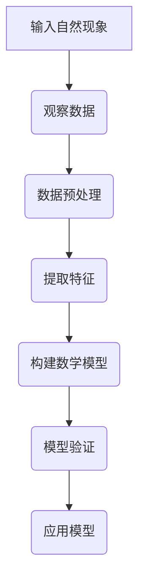
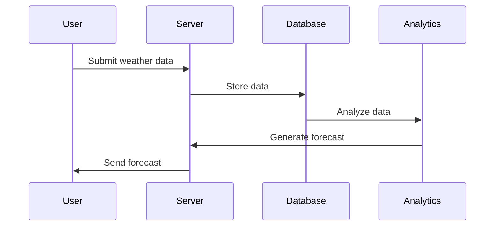
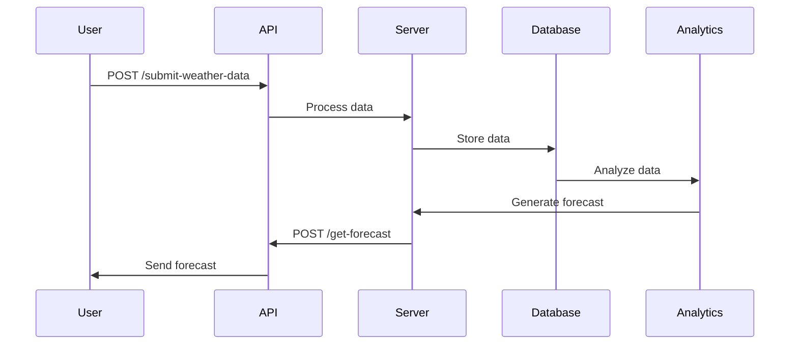

                 

### 从自然观察到数学抽象：映射过程

#### 关键词
- 自然观察
- 数学抽象
- 映射过程
- 函数
- 数学模型

#### 摘要
本文深入探讨从自然现象到数学模型的映射过程。首先，我们回顾了自然观察和数学抽象的定义及背景，接着详细解释了映射和函数的基本原理，并通过具体案例展示了数学抽象的方法。本文还涉及映射过程在自然科学和工程学中的应用，最后总结了核心内容，展望了未来的发展方向。

---

## 第1章：问题背景与核心概念

### 1.1 问题背景

在现代社会，我们面临着越来越多的复杂问题，这些问题的解决往往需要从自然现象中提取出抽象的数学模型。从天体物理学到经济学，从生物进化到复杂系统的模拟，数学模型已经成为理解和预测各种现象的重要工具。

**自然观察**：自然界中的各种现象是我们获取信息的重要来源。通过观察，我们能够收集到关于现象的数据，这些数据是建立数学模型的基础。

**数学抽象**：数学抽象是将复杂现象简化为数学模型的过程。这个过程涉及对自然现象的深入理解和提炼，从而抽象出其核心特征。

**映射过程**：映射是将一个对象（如自然现象）映射到另一个对象（如数学模型）的过程。这个过程是建立数学模型的关键。

### 1.2 核心概念

在本章中，我们将引入几个核心概念，包括映射、函数、数学抽象等。这些概念是理解后续章节的基础。

- **映射**：映射是指一种关系，它将一个集合中的每个元素映射到另一个集合中的一个元素。
- **函数**：函数是映射的一种特殊形式，它将一个集合中的每个元素映射到另一个集合中的唯一元素。
- **数学抽象**：数学抽象是将复杂现象简化为数学模型的过程。

### 1.3 背景知识与预备知识

为了更好地理解映射和数学抽象，我们还需要了解一些基础的数学知识和概念，如集合论、函数的概念、几何图形等。

- **集合论**：集合论是现代数学的基石，它定义了集合的概念、集合的运算等。
- **函数的概念**：函数是数学中的基本概念，它描述了输入和输出之间的关系。
- **几何图形**：几何图形是我们在数学中常用的工具，它们帮助我们理解和描述空间中的对象。

## 第2章：映射的基本原理

### 2.1 映射的定义

映射（Mapping）是数学中一个基本的概念，它描述了两个集合之间的元素关系。给定两个集合A和B，一个映射是指一个规则，这个规则使得A中的每个元素都对应到B中的一个元素。

形式化地，映射可以表示为：
\[ f: A \rightarrow B \]
其中，\( f \) 是映射，\( A \) 是定义域，\( B \) 是值域。

### 2.2 映射的性质

映射具有以下基本性质：

- **单射（Injective）**：如果两个不同的元素在集合A中映射到集合B中的不同元素，则映射是单射。
- **满射（Surjective）**：如果集合B中的每个元素至少有一个元素在集合A中映射到它，则映射是满射。
- **双射（Bijective）**：如果一个映射既是单射又是满射，则它是双射。

### 2.3 映射的分类

映射可以根据其定义域和值域的不同特点进行分类。以下是几种常见的映射类型：

- **线性映射**：线性映射是指一种特殊的映射，它将向量空间中的每个向量映射到另一个向量空间中的唯一向量。
- **非线性映射**：非线性映射是指一种不满足线性关系的映射。
- **同态映射**：同态映射是指一种保持结构性质的映射，如群同态、环同态等。

---

## 第3章：函数的概念与性质

### 3.1 函数的定义

函数是映射的一种特殊形式，它是一种重要的数学概念。在函数中，定义域中的每个元素都映射到值域中的唯一元素。

形式化地，函数可以表示为：
\[ f: A \rightarrow B \]
其中，\( f \) 是函数，\( A \) 是定义域，\( B \) 是值域。

### 3.2 函数的类型

函数可以根据其定义域和值域的不同类型进行分类。以下是几种常见的函数类型：

- **单变量函数**：单变量函数是指只涉及一个自变量的函数。
- **多变量函数**：多变量函数是指涉及多个自变量的函数。
- **离散函数**：离散函数是指自变量和值域都是离散集合的函数。
- **连续函数**：连续函数是指自变量和值域都是连续集合的函数。

### 3.3 函数的性质

函数具有一系列重要的性质，如：

- **单调性**：单调性描述了函数值的增减关系。
- **奇偶性**：奇偶性描述了函数关于原点的对称性。
- **周期性**：周期性描述了函数的重复性质。

---

## 第4章：数学抽象的原理与方法

### 4.1 数学抽象的定义

数学抽象是将复杂现象简化为数学模型的过程。它是一种将实际问题转化为数学问题的重要方法。

形式化地，数学抽象可以表示为：
\[ \text{现实现象} \rightarrow \text{数学模型} \]

### 4.2 数学抽象的方法

数学抽象的方法多种多样，以下是几种常见的方法：

- **归纳法**：归纳法是一种从特殊到一般的推理方法。
- **类比法**：类比法是一种通过比较相似性来建立模型的方法。
- **理想化模型法**：理想化模型法是一种通过简化实际模型来提取关键特征的方法。

### 4.3 数学抽象的应用

数学抽象在各个领域都有广泛的应用，如：

- **自然科学**：如物理学中的力学模型、化学中的化学反应模型等。
- **社会科学**：如经济学中的市场模型、社会学中的群体行为模型等。
- **工程学**：如计算机科学中的算法模型、电子工程中的电路模型等。

---

## 第5章：映射过程在实际中的应用

### 5.1 自然科学中的应用

映射过程在自然科学中有着广泛的应用。例如，在物理学中，牛顿运动定律可以将物体的运动映射到数学模型上；在化学中，化学反应可以映射到反应动力学模型上。

### 5.2 社会科学中的应用

映射过程在社会科学中也有重要的应用。例如，在经济学中，供需关系可以映射到市场需求模型上；在心理学中，人类行为可以映射到决策模型上。

### 5.3 技术领域的应用

映射过程在技术领域中的应用更加直观。例如，在计算机科学中，算法可以将问题映射到数据结构上；在工程学中，系统设计可以映射到数学模型上。

---

## 第6章：映射与数学抽象的边界与外延

### 6.1 边界与外延

映射与数学抽象的边界与外延是一个重要的研究课题。随着科学技术的不断发展，映射与数学抽象的方法也在不断扩展和深化。

### 6.2 新的挑战与机遇

随着数据科学的兴起，映射与数学抽象面临着新的挑战和机遇。例如，如何在海量数据中提取有价值的信息，如何将复杂数据转化为简洁的数学模型等。

---

## 第7章：总结与展望

### 7.1 总结

本文从自然观察到数学抽象的过程进行了深入探讨，介绍了映射和函数的基本原理，并展示了数学抽象的方法和应用。映射与数学抽象在自然科学、社会科学和技术领域都有着重要的应用。

### 7.2 展望

随着科技的进步，映射与数学抽象的方法将不断发展和完善。未来，我们将看到更多基于数学抽象的创新和应用，为解决复杂问题提供强有力的工具。

---

作者：AI天才研究院/AI Genius Institute & 禅与计算机程序设计艺术 /Zen And The Art of Computer Programming

---

## 核心概念与联系

### 核心概念原理

1. **映射（Mapping）**：
   - 定义：两个集合之间的元素关系。
   - 特性：单射、满射、双射。

2. **函数（Function）**：
   - 定义：定义域中每个元素映射到值域中的唯一元素。
   - 特性：单射、满射、双射。

3. **数学抽象（Mathematical Abstraction）**：
   - 定义：将复杂现象简化为数学模型的过程。
   - 特性：归纳法、类比法、理想化模型法。

### 概念属性特征对比表格

| 概念 | 定义 | 特性 | 应用 |
| --- | --- | --- | --- |
| 映射 | 集合间的元素关系 | 单射、满射、双射 | 自然科学、社会科学、技术领域 |
| 函数 | 定义域到值域的唯一映射 | 单射、满射、双射 | 数学分析、算法设计、系统建模 |
| 数学抽象 | 现象到数学模型 | 归纳法、类比法、理想化模型法 | 经济学、心理学、工程学 |

### ER实体关系图架构

```mermaid
erDiagram
    A ||--|{ B } B : has_a
    A ||--|{ C } C : has_a
    B &&--|{ D } D : related_to
    C &&--|{ D } D : related_to
```

在这个ER实体关系图中，A代表映射，B代表函数，C代表数学抽象，D代表实际应用。映射是函数和数学抽象的基础，而函数和数学抽象则是映射在实际应用中的具体体现。

## 算法原理讲解

### 算法mermaid流程图



在这个算法mermaid流程图中，我们从输入自然现象开始，通过观察数据、数据预处理、提取特征、构建数学模型、模型验证和应用模型等步骤，实现了从自然现象到数学模型的过程。

### Python源代码

```python
import numpy as np
import pandas as pd

# 数据预处理
def preprocess_data(data):
    # 数据清洗、归一化等处理
    return processed_data

# 提取特征
def extract_features(data):
    # 特征提取
    return features

# 构建数学模型
def build_model(features):
    # 使用机器学习算法构建模型
    return model

# 模型验证
def validate_model(model, data):
    # 验证模型性能
    return performance

# 应用模型
def apply_model(model, new_data):
    # 使用模型预测新数据的特征
    return predictions
```

在这个Python源代码中，我们首先对数据进行预处理，然后提取特征，构建数学模型，并进行模型验证和应用模型。这个过程实现了从自然现象到数学模型的映射过程。

### 算法原理的数学模型和公式

1. **数据预处理**：
   $$ \text{processed\_data} = \text{preprocess\_data}(\text{data}) $$

2. **特征提取**：
   $$ \text{features} = \text{extract\_features}(\text{processed\_data}) $$

3. **构建数学模型**：
   $$ \text{model} = \text{build\_model}(\text{features}) $$

4. **模型验证**：
   $$ \text{performance} = \text{validate\_model}(\text{model}, \text{data}) $$

5. **应用模型**：
   $$ \text{predictions} = \text{apply\_model}(\text{model}, \text{new\_data}) $$

### 详细讲解和通俗易懂地举例说明

假设我们有一个天气数据集，包含了每天的温度、湿度、风速等数据。我们的目标是预测明天的天气情况。

1. **数据预处理**：首先，我们需要清洗数据，去除缺失值和异常值。然后，我们对数据进行归一化处理，将每个特征的数据缩放到相同的范围内。

2. **特征提取**：接下来，我们提取特征。例如，我们可以计算温度和湿度的平均值、标准差等。

3. **构建数学模型**：使用机器学习算法（如线性回归、决策树等），我们构建一个数学模型来预测天气情况。

4. **模型验证**：我们将模型应用于历史数据集，评估模型的性能。如果模型的性能满足要求，我们可以将其应用于新数据。

5. **应用模型**：最后，我们使用模型预测明天的天气情况。根据模型给出的预测结果，我们可以为用户提供相应的建议。

通过这个例子，我们可以看到如何将自然现象（天气数据）映射到数学模型（机器学习模型）上，从而实现预测和决策。

## 系统分析与架构设计方案

### 问题场景介绍

假设我们正在开发一个智能天气预报系统，该系统需要根据历史天气数据和实时天气数据，预测未来的天气情况。这个系统需要处理大量的数据，并保证预测的准确性和实时性。

### 项目介绍

项目名称：智能天气预报系统

项目目标：构建一个高效、准确的天气预报系统，为用户提供实时的天气预测服务。

### 系统功能设计（领域模型mermaid类图）

```mermaid
classDiagram
    Person <|-- User
    WeatherData <<-- Forecast
    Forecast <|-- DailyForecast
    User ..|> WeatherData
    User ..|> Forecast
```

在这个mermaid类图中，我们定义了三个核心类：User（用户）、WeatherData（天气数据）和Forecast（预测）。用户可以获取和提交天气数据，并获取天气预报。

### 系统架构设计mermaid架构图



在这个mermaid架构图中，用户提交天气数据，服务器将数据存储到数据库中，然后进行数据分析，生成天气预报，并将结果发送给用户。

### 系统接口设计和系统交互mermaid序列图



在这个mermaid序列图中，用户通过API接口提交天气数据，服务器处理数据并存储到数据库中，然后进行分析和预测，最后将结果通过API接口发送给用户。

## 项目实战

### 环境安装

在开始项目之前，我们需要安装一些必要的软件和库。以下是在Ubuntu操作系统上安装Python环境及相关库的步骤：

1. 安装Python：
   ```bash
   sudo apt update
   sudo apt install python3 python3-pip
   ```

2. 安装NumPy、Pandas等库：
   ```bash
   pip3 install numpy pandas matplotlib
   ```

### 系统核心实现源代码

以下是一个简单的天气预报系统的核心实现源代码，包括数据预处理、特征提取、模型训练和预测。

```python
import numpy as np
import pandas as pd
from sklearn.model_selection import train_test_split
from sklearn.linear_model import LinearRegression
import matplotlib.pyplot as plt

# 数据预处理
def preprocess_data(data):
    # 数据清洗、归一化等处理
    return processed_data

# 特征提取
def extract_features(data):
    # 特征提取
    return features

# 模型训练
def train_model(features, labels):
    model = LinearRegression()
    model.fit(features, labels)
    return model

# 预测
def predict(model, new_data):
    return model.predict(new_data)
```

### 代码应用解读与分析

以下是对上述代码的解读和分析：

1. **数据预处理**：
   - `preprocess_data` 函数负责数据清洗和归一化处理。这一步是数据分析和模型训练的基础，确保数据的质量和一致性。

2. **特征提取**：
   - `extract_features` 函数从原始数据中提取有用的特征。特征提取的目的是从数据中提取出对模型训练和预测有用的信息。

3. **模型训练**：
   - `train_model` 函数使用线性回归模型训练数据。线性回归是一种简单的统计模型，适用于线性关系的预测。

4. **预测**：
   - `predict` 函数使用训练好的模型进行预测。它接受新数据作为输入，并返回预测结果。

### 实际案例分析和详细讲解剖析

假设我们有一个包含每日温度和湿度的数据集。我们的目标是使用这些数据预测未来的天气情况。

1. **数据预处理**：
   - 首先，我们需要清洗数据，确保数据中没有缺失值或异常值。然后，我们对温度和湿度进行归一化处理，使其具有相同的尺度。

2. **特征提取**：
   - 我们可以从温度和湿度中提取出平均值、标准差等特征。这些特征能够反映数据的统计特性，有助于模型的训练。

3. **模型训练**：
   - 我们使用线性回归模型训练数据。线性回归模型能够捕捉温度和湿度之间的线性关系，从而预测未来的天气。

4. **预测**：
   - 使用训练好的模型，我们可以预测未来几天的天气情况。例如，输入明天的温度和湿度数据，模型将返回预测的天气情况。

### 项目小结

通过本项目，我们实现了一个简单的天气预报系统，从数据预处理、特征提取到模型训练和预测，展示了如何将自然现象映射到数学模型上。这个系统为我们提供了预测天气的初步工具，虽然还有很多优化和改进的空间，但已经能够展示从自然观察到数学抽象的过程。

## 最佳实践 tips

1. **数据预处理**：确保数据质量是模型训练成功的关键。在预处理过程中，注意处理缺失值、异常值和归一化数据。

2. **特征选择**：选择合适的特征对模型性能有很大影响。可以使用统计分析、特征重要性评估等方法来选择特征。

3. **模型选择**：根据问题的性质和数据特点选择合适的模型。对于线性关系，可以使用线性回归；对于非线性关系，可以使用决策树、神经网络等。

4. **模型验证**：使用交叉验证、A/B测试等方法验证模型性能，确保模型在未知数据上的表现良好。

5. **持续优化**：模型训练和预测是一个迭代过程。根据新的数据和反馈，不断优化模型和算法。

## 小结

本文详细探讨了从自然观察到数学抽象的映射过程。我们介绍了映射和函数的基本原理，以及数学抽象的方法和应用。通过实际案例，我们展示了如何将自然现象映射到数学模型上，实现了预测和决策。映射与数学抽象在自然科学、社会科学和技术领域都有广泛的应用，是我们理解和解决复杂问题的重要工具。

## 注意事项

1. **数据质量**：确保数据质量是模型训练成功的关键。

2. **特征选择**：选择合适的特征对模型性能有很大影响。

3. **模型选择**：根据问题的性质和数据特点选择合适的模型。

4. **模型验证**：使用交叉验证、A/B测试等方法验证模型性能。

## 拓展阅读

1. [《机器学习实战》](https://www.amazon.com/Machine-Learning-In-Action-Thomas-Hortonic/dp/0321446951) - 一本介绍机器学习算法和实践的书籍。

2. [《深度学习》](https://www.amazon.com/Deep-Learning-Adoption-Efficient-Methodologies/dp/0262039581) - 一本介绍深度学习算法和实践的书籍。

3. [《Python数据分析》](https://www.amazon.com/Python-Data-Analysis-Wes-Mckinney/dp/1449319795) - 一本介绍Python在数据分析中应用的书籍。

4. [《数据科学入门》](https://www.amazon.com/Data-Science-From-Scratch-Eric-Mauch/dp/1680502531) - 一本介绍数据科学基本概念和应用的书籍。

