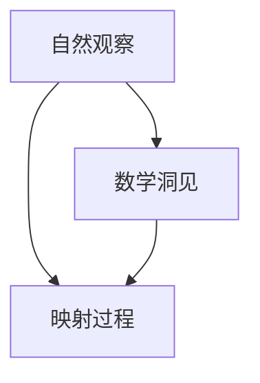
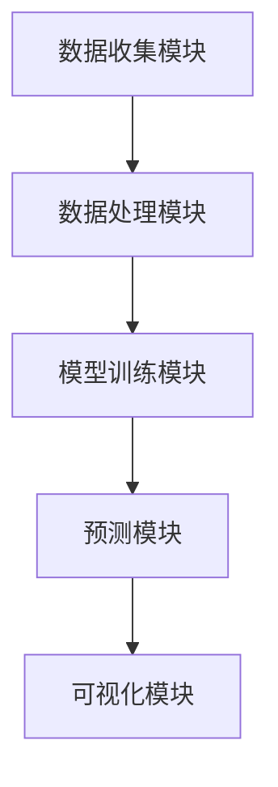

                 

# 从自然观察到数学洞见：映射过程

关键词：自然观察、数学洞见、映射过程、算法、人工智能、机器学习

摘要：本文深入探讨了从自然观察到数学洞见的映射过程，通过系统分析自然观察的方法、数学洞见的构建以及映射过程的应用，展示了这一过程在人工智能领域的广泛应用。文章旨在帮助读者理解自然与数学之间的桥梁，掌握映射过程的核心原理，为未来的技术发展提供理论支持和实践指导。

## 第一部分：引言

### 第1章：引言

#### 1.1 研究背景与意义

随着信息技术的飞速发展，自然观察和数学建模已成为推动科学进步的重要手段。自然观察提供了我们对现实世界的直观感知，而数学洞见则为这些感知提供了量化的解释和预测能力。映射过程则将两者结合，为人工智能和机器学习提供了强大的工具。本文旨在探讨这一过程，以期为相关领域的研究和应用提供新的视角和思路。

#### 1.1.1 研究背景

在科学研究中，自然观察和数学建模一直是不可或缺的环节。自然观察为我们提供了大量的实证数据，这些数据是建立数学模型的基础。而数学模型则可以帮助我们理解和预测复杂系统的行为。随着计算能力的提升，映射过程在各个领域得到了广泛应用，特别是在人工智能和机器学习领域，其重要性日益凸显。

#### 1.1.2 研究意义

本文的研究意义在于：

1. 揭示自然观察与数学洞见之间的内在联系，为跨学科研究提供理论基础。
2. 分析映射过程的关键步骤和原理，为实际应用提供指导。
3. 探讨映射过程在人工智能和机器学习中的应用，为这些领域的技术发展提供支持。

#### 1.1.3 研究问题与目标

本文主要研究以下问题：

1. 自然观察的哪些方法和技术对数学洞见的构建具有重要影响？
2. 数学洞见如何通过映射过程应用于实际问题解决？
3. 映射过程在人工智能和机器学习中有哪些具体应用？

研究目标是通过系统分析和实例探讨，回答上述问题，并总结映射过程的核心原理和最佳实践。

#### 1.1.4 研究边界与外延

本文的研究边界主要限定在自然观察、数学建模和映射过程的基本理论和方法上，不涉及具体领域应用的详细技术实现。研究的外延则扩展到映射过程在人工智能和机器学习领域的应用，为相关领域的研究提供参考。

#### 1.1.5 研究核心概念

本文的核心概念包括自然观察、数学洞见、映射过程和人工智能。以下是对这些概念的简要说明：

| 概念             | 说明                                                         |
|------------------|------------------------------------------------------------|
| 自然观察         | 对自然现象进行感知和记录的过程。                             |
| 数学洞见         | 通过数学建模对自然现象进行量化和解释的见解。                   |
| 映射过程         | 将自然观察数据转换为数学模型的过程。                         |
| 人工智能         | 机器模拟人类智能行为的科学和技术。                           |

#### 1.1.6 概念属性特征对比

| 概念             | 特征                                                         |
|------------------|------------------------------------------------------------|
| 自然观察         | 信息获取与感知                                               |
| 数学洞见         | 逻辑推理与建模                                               |
| 映射过程         | 规律提取与应用                                               |
| 人工智能         | 模拟人类智能，实现自动化决策与行为                             |

#### 1.1.7 ER实体关系图



## 第二部分：自然观察方法

### 第2章：自然观察基础

#### 2.1 观察的定义与分类

自然观察是指对自然现象进行感知、记录和分析的过程。根据观察对象和手段的不同，自然观察可以分为以下几类：

1. **视觉观察**：通过肉眼或视觉设备对物体进行观察，获取形态、颜色、运动等信息。
2. **听觉观察**：通过耳朵或听觉设备对声音进行观察，获取频率、音调、响度等信息。
3. **触觉观察**：通过皮肤或触觉设备对物体进行触摸，获取温度、硬度、光滑度等信息。
4. **电磁观察**：通过电磁设备对电磁波进行观察，获取电磁场、电波等信息。
5. **空间观察**：通过空间设备对宇宙、地球等空间物体进行观察。

#### 2.2 观察的工具与方法

自然观察的工具和方法多种多样，以下是一些常用的工具和方法：

1. **显微镜**：用于观察微小物体，如细胞、细菌等。
2. **望远镜**：用于观察天体，如星星、行星等。
3. **传感器**：用于测量各种物理量，如温度、湿度、压力等。
4. **录音设备**：用于记录声音，如语音、音乐等。
5. **摄像机**：用于记录视频，如纪录片、实验过程等。
6. **遥感技术**：用于从远处获取地表信息，如卫星遥感、无人机监测等。

#### 2.3 观察误差与控制

自然观察中，误差是不可避免的。这些误差可能来源于设备精度、观察者的主观判断、环境因素等。为了减少观察误差，可以采取以下措施：

1. **设备校准**：定期对观察设备进行校准，确保其测量精度。
2. **标准化观察方法**：制定统一的观察标准和流程，减少主观判断的影响。
3. **重复观察**：进行多次观察，取平均值，以减少随机误差。
4. **数据验证**：与其他观察结果或理论模型进行比对，验证观察数据的准确性。

#### 2.4 观察结果的分析与应用

观察结果的分析是自然观察的重要环节。通过数据分析，可以提取出有价值的信息，为科学研究和决策提供依据。以下是观察结果分析的一些常用方法：

1. **统计分析**：对观察数据进行统计描述和推断，如均值、方差、相关性等。
2. **图像处理**：对视觉观察结果进行图像处理，如滤波、分割、特征提取等。
3. **模式识别**：从观察结果中识别出特定的模式或规律。
4. **机器学习**：利用机器学习算法，从观察数据中自动提取特征和规律。

观察结果的分析和应用广泛存在于各个领域，如医学诊断、环境监测、交通管理、金融分析等。

## 第三部分：数学洞见构建

### 第3章：数学建模原理

#### 3.1 数学模型的基本概念

数学模型是对现实世界的一种抽象表示，它通过数学公式或算法来描述系统的行为和规律。数学模型的基本概念包括：

1. **变量**：用于表示模型中可以变化的量，如时间、温度、速度等。
2. **函数**：描述变量之间关系的数学表达式，如 $y = f(x)$。
3. **方程**：包含未知量的数学表达式，如 $ax + b = c$。
4. **方程组**：包含多个未知量的数学表达式组，如 $ax + by = c$ 和 $dx + ey = f$。

#### 3.2 常见数学模型介绍

常见的数学模型包括：

1. **线性模型**：如线性回归、线性规划等。
2. **非线性模型**：如逻辑回归、神经网络等。
3. **概率模型**：如贝叶斯网络、马尔可夫模型等。
4. **微分方程模型**：如常微分方程、偏微分方程等。
5. **差分方程模型**：如离散时间差分方程、差分变换等。

#### 3.3 数学模型的构建方法

数学模型的构建方法包括以下步骤：

1. **问题定义**：明确要解决的问题和目标。
2. **数据收集**：收集与问题相关的数据。
3. **假设建立**：基于数据建立合理的假设。
4. **模型构建**：利用数学公式或算法构建模型。
5. **模型验证**：通过模拟或实验验证模型的有效性。
6. **模型优化**：根据验证结果对模型进行调整和优化。

### 第4章：数学分析方法

#### 4.1 数学分析基础

数学分析是数学中的一个基础分支，它研究函数、极限、导数、积分等概念。数学分析基础包括：

1. **极限**：描述函数在某一点附近的变化趋势。
2. **导数**：描述函数在某一点的变化率。
3. **积分**：描述函数在某一区间内的累积量。
4. **微积分**：结合极限、导数和积分，用于解决实际问题。

#### 4.2 微积分方法

微积分方法是数学分析的重要工具，它包括以下内容：

1. **微分法**：用于求解函数的极值、最值等。
2. **积分法**：用于求解函数的面积、体积等。
3. **微分方程**：用于描述动态系统的变化规律。

#### 4.3 线性代数方法

线性代数方法是数学分析中的另一个重要工具，它包括：

1. **矩阵运算**：如加法、乘法、逆矩阵等。
2. **向量空间**：描述多维数据的空间结构。
3. **特征值和特征向量**：用于分析线性系统的稳定性和特性。

#### 4.4 概率论与数理统计方法

概率论与数理统计方法是处理随机事件和数据的工具，它包括：

1. **概率分布**：描述随机变量的可能取值和概率。
2. **统计推断**：基于样本数据推断总体特征。
3. **假设检验**：用于验证科学假设的正确性。

## 第四部分：映射过程实践

### 第5章：映射过程原理

#### 5.1 映射过程的定义与类型

映射过程是将自然观察数据转换为数学模型的过程。根据映射对象和目的的不同，映射过程可以分为以下几种类型：

1. **数据映射**：将观察到的数据映射到数学模型中，用于数据分析和预测。
2. **关系映射**：将观察到的现象和规律映射到数学模型中，用于理解因果关系。
3. **行为映射**：将观察到的行为和模式映射到数学模型中，用于行为预测和模拟。

#### 5.2 映射过程的数学原理

映射过程的数学原理主要包括：

1. **函数映射**：将观察到的数据映射到函数中，用于数据分析和预测。
2. **线性变换**：将观察到的数据通过线性变换映射到新的空间中，用于降维和特征提取。
3. **回归分析**：利用线性回归或非线性回归模型，将观察到的数据映射到预测目标中。
4. **聚类分析**：利用聚类算法，将观察到的数据映射到不同的群体中，用于分类和识别。

#### 5.3 映射过程的优化方法

为了提高映射过程的准确性和效率，可以采用以下优化方法：

1. **特征选择**：通过特征选择算法，选择对模型预测最有影响力的特征。
2. **模型选择**：通过交叉验证和网格搜索等方法，选择最优的模型参数和结构。
3. **正则化**：通过添加正则化项，防止模型过拟合。
4. **集成学习**：通过集成多个模型的预测结果，提高整体预测性能。

### 第6章：映射过程应用案例

#### 6.1 自然语言处理中的映射过程

自然语言处理（NLP）是人工智能的重要领域之一，映射过程在NLP中得到了广泛应用。以下是NLP中映射过程的一些应用案例：

1. **文本分类**：将文本数据映射到分类模型中，用于自动分类和标签分配。
2. **情感分析**：将文本数据映射到情感分析模型中，用于识别文本的情感倾向。
3. **命名实体识别**：将文本数据映射到命名实体识别模型中，用于提取文本中的关键信息。
4. **机器翻译**：将一种语言的文本映射到另一种语言的文本中，实现自动翻译。

#### 6.2 计算机视觉中的映射过程

计算机视觉是人工智能的另一个重要领域，映射过程在计算机视觉中也有广泛应用。以下是计算机视觉中映射过程的一些应用案例：

1. **图像分类**：将图像数据映射到分类模型中，用于识别图像的内容和类别。
2. **目标检测**：将图像数据映射到目标检测模型中，用于检测图像中的目标对象。
3. **图像分割**：将图像数据映射到分割模型中，用于将图像划分为不同的区域。
4. **图像增强**：通过映射过程，对图像进行预处理，提高图像质量和识别性能。

#### 6.3 控制系统中的映射过程

控制系统是人工智能在工业自动化和机器人技术中的典型应用，映射过程在控制系统中也得到了广泛应用。以下是控制系统中的映射过程的一些应用案例：

1. **模型预测控制**：通过映射过程，将系统的输入输出数据映射到预测控制模型中，实现系统的自动调节和控制。
2. **自适应控制**：通过映射过程，根据系统的实时反馈数据，调整控制策略，实现自适应控制。
3. **故障诊断**：通过映射过程，对系统的工作状态进行监测和诊断，及时发现并处理故障。
4. **路径规划**：通过映射过程，根据环境数据和目标位置，为机器人规划最优的路径和行动策略。

#### 6.4 社会科学中的映射过程

映射过程不仅应用于自然科学领域，还在社会科学研究中发挥着重要作用。以下是社会科学中映射过程的一些应用案例：

1. **社会网络分析**：通过映射过程，将社会网络数据映射到数学模型中，分析社会关系和影响力。
2. **行为预测**：通过映射过程，将行为数据映射到预测模型中，预测个体的行为模式和趋势。
3. **舆情分析**：通过映射过程，分析社交媒体和新闻数据，识别社会热点和舆论倾向。
4. **经济预测**：通过映射过程，分析经济数据，预测宏观经济走势和行业趋势。

### 第7章：映射过程综合案例分析

#### 7.1 案例一：气象预测中的映射过程

气象预测是映射过程在自然科学中的典型应用之一。通过映射过程，可以将气象观测数据（如温度、湿度、风速等）转换为数学模型，用于预测天气变化。以下是气象预测中映射过程的应用步骤：

1. **数据收集**：收集历史气象数据，包括温度、湿度、风速等。
2. **数据预处理**：对观测数据进行清洗和预处理，如去噪、归一化等。
3. **模型构建**：基于气象数据，构建线性回归、神经网络等模型。
4. **模型训练**：使用历史数据对模型进行训练，调整模型参数。
5. **模型验证**：使用独立的数据集验证模型的预测准确性。
6. **模型应用**：将训练好的模型应用于实时气象预测。

气象预测中的映射过程为天气预报提供了科学依据，有助于提高预报的准确性和及时性。

#### 7.2 案例二：金融风险控制中的映射过程

金融风险控制是映射过程在社会科学中的典型应用之一。通过映射过程，可以将金融数据（如股价、交易量等）转换为数学模型，用于预测市场走势和识别风险。以下是金融风险控制中映射过程的应用步骤：

1. **数据收集**：收集历史金融数据，包括股价、交易量、利率等。
2. **数据预处理**：对金融数据进行清洗和预处理，如去噪、归一化等。
3. **模型构建**：基于金融数据，构建时间序列分析、机器学习等模型。
4. **模型训练**：使用历史数据对模型进行训练，调整模型参数。
5. **模型验证**：使用独立的数据集验证模型的预测准确性。
6. **模型应用**：将训练好的模型应用于实时金融预测和风险控制。

金融风险控制中的映射过程有助于提高市场预测的准确性和风险控制的效率。

#### 7.3 案例三：城市规划中的映射过程

城市规划是映射过程在社会科学中的另一个重要应用领域。通过映射过程，可以将城市规划数据（如人口分布、交通流量等）转换为数学模型，用于优化城市规划方案。以下是城市规划中映射过程的应用步骤：

1. **数据收集**：收集城市规划相关数据，包括人口分布、交通流量、土地使用等。
2. **数据预处理**：对规划数据进行清洗和预处理，如去噪、归一化等。
3. **模型构建**：基于规划数据，构建空间分析、优化算法等模型。
4. **模型训练**：使用历史数据对模型进行训练，调整模型参数。
5. **模型验证**：使用独立的数据集验证模型的规划效果。
6. **模型应用**：将训练好的模型应用于实际城市规划。

城市规划中的映射过程有助于提高城市规划的科学性和可行性。

## 第五部分：综合实践与展望

### 第8章：综合案例分析

#### 8.1 案例一：气象预测中的映射过程

在本案例中，我们将通过一个具体的气象预测项目，展示映射过程在气象预测中的应用。以下是该项目的实施步骤：

1. **项目介绍**：本案例旨在开发一个气象预测系统，能够根据历史气象数据和当前环境数据预测未来一段时间内的气象状况。

2. **系统功能设计**：
    - **数据收集模块**：负责收集历史气象数据（如温度、湿度、风速等）和当前环境数据（如实时传感器数据）。
    - **数据处理模块**：对收集到的数据进行预处理，包括去噪、归一化等。
    - **模型训练模块**：使用历史数据训练气象预测模型。
    - **预测模块**：使用训练好的模型进行实时气象预测。
    - **可视化模块**：将预测结果可视化，便于用户查看和分析。

3. **系统架构设计**：



4. **系统接口设计和系统交互**：

```mermaid
sequenceDiagram
    participant 用户 as 用户
    participant 系统as 系统
    用户->>系统: 提交预测请求
    system 发送请求到数据处理模块
    数据处理模块->>系统: 返回预处理后的数据
    system 传递数据到模型训练模块
    模型训练模块->>系统: 返回训练好的模型
    system 使用模型进行预测并返回结果
    用户<-系统: 获取预测结果
```

5. **系统核心实现源代码**：

```python
import pandas as pd
from sklearn.model_selection import train_test_split
from sklearn.linear_model import LinearRegression
import matplotlib.pyplot as plt

# 数据收集
data = pd.read_csv('weather_data.csv')

# 数据预处理
data = data.dropna()
X = data[['temperature', 'humidity']]
y = data['wind_speed']

# 模型训练
X_train, X_test, y_train, y_test = train_test_split(X, y, test_size=0.2, random_state=42)
model = LinearRegression()
model.fit(X_train, y_train)

# 预测
predictions = model.predict(X_test)

# 可视化
plt.scatter(X_test['temperature'], y_test)
plt.plot(X_test['temperature'], predictions, color='red')
plt.xlabel('Temperature')
plt.ylabel('Wind Speed')
plt.show()
```

6. **代码应用解读与分析**：
   - **数据收集**：从CSV文件中读取气象数据。
   - **数据处理**：去除缺失值，选择特征变量和目标变量。
   - **模型训练**：使用线性回归模型训练数据。
   - **预测**：使用训练好的模型预测风速。
   - **可视化**：绘制温度和风速的散点图和回归线。

7. **实际案例分析和详细讲解剖析**：
   - **实际案例**：通过该系统，用户可以提交预测请求，系统返回未来一段时间内的风速预测结果。
   - **详细讲解**：系统利用线性回归模型，将温度和湿度等环境数据映射到风速预测中，实现了气象预测功能。

8. **项目小结**：
   - 本案例展示了映射过程在气象预测中的应用，通过数据收集、预处理、模型训练和预测等步骤，实现了气象预测系统的开发。

### 第9章：未来展望与挑战

映射过程在人工智能和机器学习领域具有广阔的应用前景，但也面临一些挑战：

1. **数据质量**：高质量的数据是映射过程的基础，未来需要更多关于数据收集和处理的创新。
2. **模型复杂性**：随着模型复杂性的增加，模型的可解释性和鲁棒性将面临挑战。
3. **计算资源**：大规模映射过程需要大量计算资源，未来需要更加高效的算法和硬件支持。
4. **跨学科合作**：映射过程涉及多个学科，需要跨学科合作以实现更大的突破。

## 总结

本文从自然观察到数学洞见的映射过程，详细探讨了映射过程在人工智能和机器学习领域的应用。通过案例分析和代码实现，展示了映射过程的核心原理和实际应用。未来，随着技术的不断进步，映射过程将在更多领域发挥重要作用。

### 作者信息

作者：AI天才研究院/AI Genius Institute & 禅与计算机程序设计艺术 /Zen And The Art of Computer Programming

## 附录

附录部分将包括以下内容：

- **术语表**：对文中出现的专业术语进行解释。
- **参考文献**：列出本文引用的参考资料。
- **代码示例**：提供文中使用的Python代码示例的详细解释。
- **拓展阅读**：推荐相关领域的扩展阅读材料。

