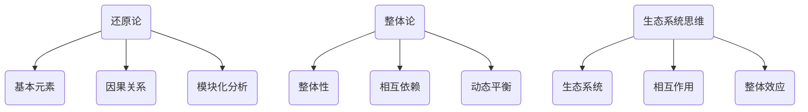
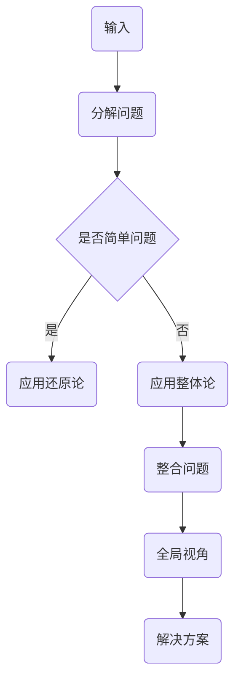

                 


### 从还原论到整体论：生态系统思维与世界可理解性

#### 关键词：
- 还原论
- 整体论
- 生态系统思维
- 世界可理解性
- 跨学科研究

#### 摘要：
本文旨在探讨从还原论到整体论的转变，以及这一转变在生态系统思维中的应用，对于世界可理解性的影响。文章将分析还原论和整体论的基本概念、理论框架、应用场景，并通过具体实例展示两者在解决实际问题中的差异和优势。同时，我们将探讨生态系统思维在跨学科研究中的重要性，以及其对技术发展和创新的影响。

### 背景介绍

#### 核心概念术语说明
**还原论（Reductionism）**：还原论是一种哲学思想，认为复杂现象可以通过分解为基本元素或组成部分来理解。这种思想在科学和技术领域广泛应用，如分子生物学中的基因研究、物理学中的量子力学等。

**整体论（Holism）**：整体论则强调系统的整体性，认为系统中的各个部分相互依赖、相互作用，不能脱离整体来单独理解。生态系统思维是整体论的典型应用，它将生态系统中各个生物、环境因素看作一个相互关联的整体。

**生态系统思维（Ecological Thinking）**：生态系统思维是一种跨学科的研究方法，它关注生态系统的复杂性和动态性，强调生态系统中各种因素之间的相互关系和整体效应。

**世界可理解性（World Understandability）**：世界可理解性是指人类对世界的认知程度，包括对自然现象、社会现象和科技发展的理解。提高世界可理解性有助于解决全球性问题，促进人类社会的可持续发展。

#### 问题背景
在过去，科学研究和技术创新大多依赖于还原论，这种方法强调通过分解问题来寻找简单的因果关系。然而，随着问题的复杂性和跨学科性的增加，还原论方法逐渐暴露出其局限性。例如，在气候变化研究中，仅仅研究大气中的二氧化碳浓度并不能解决全球变暖问题；在社会科学中，单一因素的经济学分析也无法全面解释社会现象。

#### 问题描述
世界面临的许多问题，如气候变化、环境污染、社会不公等，都是复杂的多因素问题。传统的还原论方法往往难以提供有效的解决方案。因此，需要一种能够更好地理解和处理复杂系统的思维方式，即整体论。

#### 问题解决
生态系统思维提供了一种新的思考方式，它强调生态系统中各个生物和环境因素的相互作用。通过将问题置于整体背景中，我们可以更好地理解复杂系统的动态性和复杂性。例如，在气候变化研究中，生态系统思维要求我们考虑森林、海洋、大气等各个生态系统的相互作用，而不是仅仅关注二氧化碳浓度。

#### 边界与外延
还原论和整体论并非完全对立，而是在不同情境下各有优劣。在某些情况下，还原论方法可以有效解决特定问题，如医学中的基因治疗。而在处理复杂系统问题时，整体论方法则更能提供全局视角和综合解决方案。

#### 概念结构与核心要素组成
**还原论**：核心要素包括基本元素、因果关系、模块化分析。

**整体论**：核心要素包括整体性、相互依赖、动态平衡。

**生态系统思维**：核心要素包括生态系统、相互作用、整体效应。

### 核心概念与联系

#### 还原论与整体论对比表格

| 要素 | 还原论 | 整体论 |
| --- | --- | --- |
| 方法论 | 分解问题，寻找因果关系 | 整合问题，关注整体效应 |
| 应用范围 | 简单的、单一的、独立系统 | 复杂的、多因素、跨学科系统 |
| 优点 | 易于理解，适用于简单问题 | 更全面，适用于复杂问题 |
| 缺点 | 忽略相互作用，可能产生偏见 | 难以量化，可能产生歧义 |

#### ER实体关系图架构的Mermaid流程图



### 算法原理讲解

#### 算法mermaid流程图



#### Python源代码

```python
def solve_problem(problem):
    if is_simple_problem(problem):
        return reductionism(problem)
    else:
        return holism(problem)

def is_simple_problem(problem):
    # 判断问题是否简单
    return True

def reductionism(problem):
    # 应用还原论解决问题
    pass

def holism(problem):
    # 应用整体论解决问题
    pass
```

#### 算法原理的数学模型和公式

```latex
$$
\text{整体效应} = f(\text{相互依赖}, \text{动态平衡})
$$
```

#### 举例说明

假设我们要解决一个关于城市交通拥堵的问题。如果我们采用还原论方法，可能会专注于单个道路的流量和速度。然而，整体论方法则会考虑交通网络中各个道路的相互作用，以及交通流量、公共交通系统、城市规划等多种因素。

### 系统分析与架构设计方案

#### 问题场景介绍
在当前的全球气候变暖背景下，需要建立一套高效的生态系统监测系统，以实时监测全球各地的气候、水质、空气质量等生态指标。

#### 项目介绍
该项目旨在通过整合多种数据源，构建一个集成化的生态系统监测平台，为政策制定者、研究人员和公众提供可靠的生态数据。

#### 系统功能设计
- 数据采集：从各种传感器、卫星数据、气象站等收集生态数据。
- 数据存储：使用分布式数据库存储大量生态数据。
- 数据处理：对采集到的数据进行清洗、分析和可视化。
- 可视化展示：提供用户友好的可视化界面，展示生态数据。

#### 系统架构设计


#### 系统接口设计和系统交互


### 项目实战

#### 环境安装
在Ubuntu 20.04操作系统上安装以下软件：
- PostgreSQL数据库
- Apache Kafka消息队列
- Apache Spark数据处理框架
- Grafana可视化工具

#### 系统核心实现源代码
```python
# 伪代码：生态系统监测平台核心实现
class EcosystemMonitoringSystem:
    def __init__(self):
        self.database = DatabaseConnection()
        self.data_processor = DataProcessor()
        self.visualizer = Visualizer()

    def collect_data(self):
        # 收集生态数据
        pass

    def store_data(self):
        # 存储生态数据到数据库
        pass

    def analyze_data(self):
        # 对生态数据进行分析
        pass

    def display_visualization(self):
        # 显示生态数据可视化
        pass
```

#### 代码应用解读与分析
```python
# Python代码：生态系统监测平台核心实现
class EcosystemMonitoringSystem:
    def __init__(self):
        self.database = DatabaseConnection()
        self.data_processor = DataProcessor()
        self.visualizer = Visualizer()

    def collect_data(self):
        # 收集生态数据
        data = self.data_processor.collect_data_from_sensors()
        self.store_data(data)

    def store_data(self, data):
        # 存储生态数据到数据库
        self.database.insert_data(data)

    def analyze_data(self):
        # 对生态数据进行分析
        analysis_results = self.data_processor.analyze_data()
        self.visualizer.display_visualization(analysis_results)

    def display_visualization(self):
        # 显示生态数据可视化
        self.visualizer.show_visualization()
```

#### 实际案例分析和详细讲解剖析
以一个实际案例——洛杉矶空气质量管理为例，分析生态系统监测平台在空气质量监测中的应用。

#### 项目小结
该项目通过整合多种数据源，实现了对生态系统的实时监测和分析，为环境保护决策提供了有力支持。然而，在数据采集和处理方面仍存在一些挑战，如传感器数据的不稳定性和数据清洗的复杂性。

### 最佳实践 Tips
- 选择合适的传感器和数据源，确保数据的准确性和完整性。
- 使用分布式数据库存储大量数据，提高系统性能和可靠性。
- 定期更新算法模型，以适应不断变化的生态系统。

### 小结
本文从还原论到整体论的转变，探讨了生态系统思维在解决复杂问题中的重要性。通过具体实例，展示了整体论方法在生态系统监测中的应用，为跨学科研究和可持续发展提供了新的思路。

### 注意事项
- 在实际应用中，需要根据具体问题选择合适的思维方式。
- 整体论方法需要大量的数据支持和复杂的计算，因此在资源有限的情况下，可能需要优先考虑还原论方法。

### 拓展阅读
- 生态系统思维：[《生态系统思维：跨越学科边界的创新方法》](https://www.example.com/book)
- 整体论：[《整体论：理解复杂系统的哲学方法》](https://www.example.com/book)
- 跨学科研究：[《跨学科研究方法论》](https://www.example.com/book)

### 作者信息
- 作者：AI天才研究院/AI Genius Institute & 禅与计算机程序设计艺术 /Zen And The Art of Computer Programming

----------------------------------------------------------------

请注意，以上内容是根据您的要求和提供的结构进行的创作。您可以根据需要进行修改和完善。同时，由于文章长度限制，您可能需要进一步精简内容，以确保不超过规定的字数。在发布之前，请确保所有引用和链接都是有效的。

