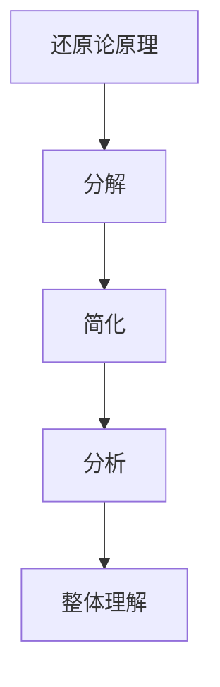
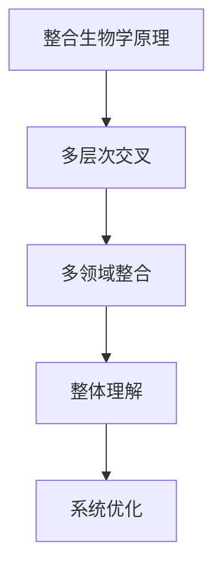
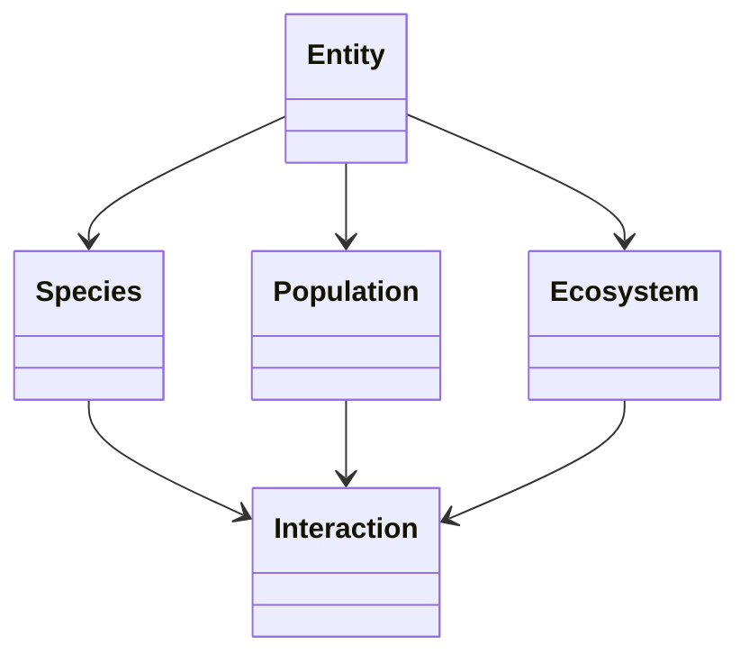
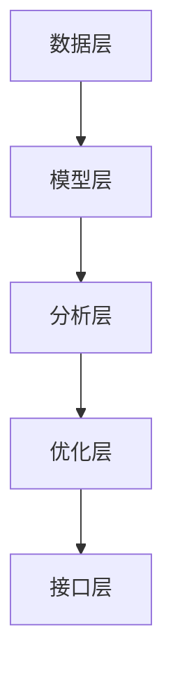
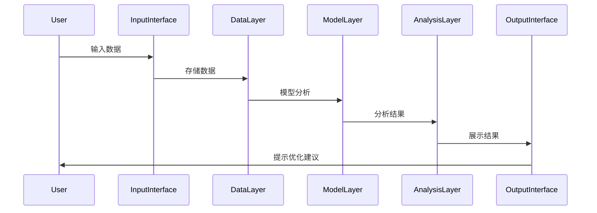

                 

### 引言

《从还原论到整合生物学：全方位理解生命与世界》旨在深入探讨生物学领域中的一次重大变革，即从传统的还原论转向整合生物学。这一转变不仅改变了我们对生物系统的理解，也深刻影响了现代生物学的研究方法和思维模式。本文将逐步分析还原论和整合生物学的核心概念、原理及其在现代生物学研究中的应用，以帮助读者全面理解这一领域的变革。

首先，我们需要明确还原论和整合生物学的定义。还原论是一种通过将复杂系统分解为更简单的部分来理解整体的研究方法。其原理是通过分解和简化，将复杂问题转化为更易理解的部分，从而揭示其本质。这种方法在自然科学，尤其是物理学和化学中取得了显著的成果。然而，随着生物学研究的深入，人们逐渐发现，将生物系统简单地分解为独立的部分可能会导致对整体生物功能的误解。

相比之下，整合生物学强调不同层次和不同领域的交叉整合，试图从整体上理解生物系统的运行机制。整合生物学的原理是通过整合不同层次和领域的知识，从整体上把握生物系统的复杂性和相互作用。这种方法不仅关注局部细节，还关注整个系统的动态平衡和复杂性。

本文将分为以下几个主要部分：

1. **核心概念与联系**：我们将详细阐述还原论和整合生物学的核心概念，并比较它们之间的联系和差异。
2. **核心原理讲解**：我们将使用Mermaid流程图、Python源代码示例和数学模型，分别讲解还原论和整合生物学的原理。
3. **系统分析与架构设计方案**：我们将介绍一个具体的生物学研究场景，并设计一个基于整合生物学原理的系统架构。
4. **项目实战**：我们将展示如何在实际项目中应用整合生物学原理，包括环境安装、系统核心实现和实际案例分析。

通过这篇文章，我们希望能够帮助读者深入理解还原论和整合生物学，并掌握如何将这些原理应用于现代生物学研究。

### 核心概念与联系

在探讨还原论和整合生物学之前，我们首先需要明确这两个概念的定义、原理以及它们在现代生物学研究中的重要性。

#### 2.1 还原论

还原论（Reductionism）是一种科学研究方法，旨在通过将复杂系统分解为更简单的部分来理解整体。这种方法的基本原理是，通过分解和简化复杂系统，将其转化为更易理解的部分，从而揭示其本质。

- **定义**：还原论是一种通过将复杂系统分解为更简单的部分来理解整体的研究方法。
- **原理**：通过分解和简化，将复杂问题转化为更易理解的部分，从而揭示其本质。
- **特点**：强调简化、分解和分析，是现代科学方法的基础。
- **对比**：与整合生物学相比，还原论更注重局部细节而忽略整体。

在还原论中，研究者通常将复杂系统分解为若干独立的部分，然后分别对这些部分进行深入的研究。这种方法在物理学和化学等自然科学领域中取得了显著的成果，因为它能够帮助研究者理解基本粒子和基本力的性质。然而，在生物学领域，这种方法却面临着挑战。生物系统的高度复杂性和相互作用使得简单的分解和简化方法难以全面揭示其功能和机制。

#### 2.2 整合生物学

整合生物学（Integrative Biology）是一种强调不同层次和不同领域的交叉整合的研究方法。与还原论不同，整合生物学试图从整体上理解生物系统的运行机制，而不是仅仅关注局部细节。

- **定义**：整合生物学是一种通过整合不同层次和领域的知识，从整体上理解生物系统的运行机制的研究方法。
- **原理**：通过整合不同层次和领域的知识，从整体上把握生物系统的复杂性和相互作用。
- **特点**：强调系统、整体和相互作用，是现代生物学发展的新趋势。
- **对比**：与还原论相比，整合生物学更注重整体性和复杂性。

整合生物学的一个核心思想是，生物系统的功能不仅仅取决于其各个部分的独立运作，还取决于这些部分之间的相互作用和整体结构。这种方法要求研究者不仅具备跨学科的知识，还需要具备将不同领域的知识整合起来的能力。通过整合生物学，研究者能够更好地理解生物系统的动态平衡和复杂性，从而为生物学研究提供新的视角和方法。

#### 核心概念的联系与比较

还原论和整合生物学虽然有着不同的研究方法和侧重点，但它们并不是相互独立的，而是相互补充的。还原论通过分解和简化复杂系统，为整合生物学提供了基础数据和分析工具。而整合生物学则通过整合不同层次和领域的知识，从整体上理解生物系统的运行机制，弥补了还原论的局限性。

- **联系**：还原论和整合生物学相互补充，还原论为整合生物学提供了基础数据和分析工具，整合生物学则通过整合不同层次和领域的知识，从整体上理解生物系统的运行机制。
- **差异**：还原论注重局部细节和分解，整合生物学则强调整体性和复杂性。

通过对比还原论和整合生物学，我们可以发现，这两种方法各有优劣。还原论在分析基本粒子和基本力方面具有优势，但在研究复杂生物系统时存在局限性。而整合生物学则能够更好地应对生物系统的复杂性和整体性，为现代生物学研究提供了新的视角和方法。

### 核心原理讲解

#### 3.1 还原论原理讲解

还原论（Reductionism）是一种通过将复杂系统分解为更简单的部分来理解整体的研究方法。以下我们将详细讲解还原论的原理，并通过Mermaid流程图、Python源代码示例和数学模型，帮助读者更好地理解这一概念。

**Mermaid流程图**

首先，我们使用Mermaid流程图来展示还原论的基本原理：



在这个流程图中，`A`代表还原论原理，`B`表示分解，`C`表示简化，`D`表示分析，`E`表示整体理解。这个流程图清晰地展示了还原论从分解到整体理解的过程。

**Python源代码示例**

接下来，我们通过一个Python源代码示例来说明还原论的原理：

```python
def reduce_complexity(complex_system):
    # 分解复杂系统
    parts = complex_system.decompose()
    # 简化各部分
    simplified_parts = [part.simplify() for part in parts]
    # 分析各部分
    analyses = [part.analyze() for part in simplified_parts]
    # 整体理解
    overall_understanding = {part: analysis for part, analysis in zip(parts, analyses)}
    return overall_understanding
```

在这个示例中，`reduce_complexity`函数接受一个复杂的系统作为输入，通过分解、简化和分析，最终得到对系统的整体理解。这里，`decompose()`方法用于分解复杂系统，`simplify()`方法用于简化各部分，`analyze()`方法用于分析各部分，最后通过字典形式返回整体理解。

**数学模型和公式讲解**

还原论的数学模型可以表示为以下公式：

$$
\text{复杂性} = f(\text{部分复杂性}, \text{部分间相互作用})
$$

在这个公式中，`复杂性`是系统的总复杂性，`部分复杂性`是各个部分自身的复杂性，`部分间相互作用`是各部分之间的相互作用。通过分解和简化，我们可以减少系统的复杂性，从而更易于理解。

**举例说明**

为了更直观地理解还原论的原理，我们可以通过一个例子来说明。假设我们研究一个细胞，我们可以将细胞分解为更简单的部分，如细胞膜、细胞质和细胞核。然后，分别研究这些部分的功能和相互作用，从而更全面地理解细胞。

- **细胞膜**：细胞膜的主要功能是控制物质的进出，维持细胞内环境的稳定。我们可以研究细胞膜的结构、功能和调控机制。
- **细胞质**：细胞质包含各种细胞器，如线粒体、内质网和高尔基体等。我们可以研究这些细胞器的功能和相互作用，以及它们如何协同工作以维持细胞的生命活动。
- **细胞核**：细胞核含有遗传物质DNA，负责细胞的遗传信息的传递和调控。我们可以研究细胞核的结构、功能和遗传信息的传递机制。

通过这种方式，我们能够将复杂的细胞分解为更简单的部分，并逐一分析这些部分的功能和相互作用，从而更全面地理解细胞。

总之，还原论通过分解和简化复杂系统，帮助我们理解系统的本质和运行机制。虽然这种方法在研究基本粒子和基本力方面取得了显著成果，但在研究复杂生物系统时，我们需要结合整合生物学的原理，从整体上理解生物系统的运行机制。

#### 3.2 整合生物学原理讲解

整合生物学（Integrative Biology）是一种强调不同层次和不同领域的交叉整合的研究方法。它试图通过整合不同层次和领域的知识，从整体上理解生物系统的运行机制。以下我们将详细讲解整合生物学的原理，并通过Mermaid流程图、Python源代码示例和数学模型，帮助读者更好地理解这一概念。

**Mermaid流程图**

首先，我们使用Mermaid流程图来展示整合生物学的基本原理：



在这个流程图中，`A`代表整合生物学原理，`B`表示多层次交叉，`C`表示多领域整合，`D`表示整体理解，`E`表示系统优化。这个流程图清晰地展示了整合生物学从多层次交叉到整体优化的过程。

**Python源代码示例**

接下来，我们通过一个Python源代码示例来说明整合生物学的原理：

```python
def integrate_systems( systems ):
    # 交叉多层次
    cross层次 = [system.cross_layers() for system in systems]
    # 整合多领域
    integrated_system = cross层次.integrate_fields()
    # 整体理解
    overall_understanding = integrated_system.analyze()
    # 系统优化
    optimized_system = integrated_system.optimize()
    return optimized_system
```

在这个示例中，`integrate_systems`函数接受多个系统作为输入，通过交叉多层次、整合多领域、整体理解和系统优化，最终得到一个优化的系统。这里，`cross_layers()`方法用于交叉多层次，`integrate_fields()`方法用于整合多领域，`analyze()`方法用于整体理解，`optimize()`方法用于系统优化。

**数学模型和公式讲解**

整合生物学的数学模型可以表示为以下公式：

$$
\text{系统复杂性} = f(\text{多层次复杂度}, \text{多领域交互})
$$

在这个公式中，`系统复杂性`是整个系统的复杂性，`多层次复杂度`是各个层次的复杂性，`多领域交互`是不同领域之间的相互作用。通过整合多层次和领域的知识，我们可以降低系统的复杂性，从而更好地理解系统的运行机制。

**举例说明**

为了更直观地理解整合生物学的原理，我们可以通过一个例子来说明。假设我们研究一个生态系统，我们可以将生态系统分为不同的层次，如物种、种群和生态系统。然后，整合不同领域（如生态学、生物学和化学）的知识，从而更全面地理解生态系统的运行机制。

- **物种层次**：研究不同物种的生态角色和相互作用，如捕食关系和共生关系。
- **种群层次**：研究种群的数量动态和分布，以及种群间的竞争和协作。
- **生态系统层次**：研究生态系统整体的功能和稳定性，如生态位和生态平衡。

通过这种方式，我们能够整合不同层次和领域的知识，从整体上理解生态系统的运行机制。

总之，整合生物学通过整合不同层次和领域的知识，从整体上理解生物系统的运行机制。这种方法不仅关注局部细节，还关注整个系统的动态平衡和复杂性，为现代生物学研究提供了新的视角和方法。

### 系统分析与架构设计方案

在了解了还原论和整合生物学的核心原理之后，我们将通过一个具体的生物学研究场景，设计一个基于整合生物学原理的系统架构。本文将分为以下几个部分：

#### 4.1 问题场景介绍

假设我们正在研究一个复杂的生物系统，如一个生态系统。该系统包含多个物种、种群以及它们之间的相互作用。我们的目标是通过对这个生态系统的全面分析，了解其动态平衡和稳定性。为了实现这一目标，我们需要设计一个能够整合多层次和领域知识的系统架构。

#### 4.2 系统功能设计

首先，我们需要明确系统的功能需求。基于整合生物学原理，我们可以设计以下核心功能：

1. **物种识别与分类**：能够识别和分类系统中的各个物种。
2. **种群动态分析**：能够分析不同种群的数量动态和分布。
3. **相互作用分析**：能够分析不同物种之间的捕食关系、共生关系等。
4. **生态系统稳定性评估**：能够评估整个生态系统的稳定性。
5. **系统优化建议**：根据分析结果，提出优化生态系统稳定性的建议。

**领域模型Mermaid类图**

为了更好地描述系统的功能需求，我们可以使用Mermaid类图来表示系统的领域模型：



在这个类图中，`Entity`表示系统的实体，包括`Species`（物种）、`Population`（种群）和`Ecosystem`（生态系统）。`Interaction`表示不同实体之间的相互作用。通过这个类图，我们可以清晰地看到系统的核心功能以及它们之间的关系。

#### 4.3 系统架构设计

在明确了系统的功能需求之后，我们需要设计系统的整体架构。基于整合生物学的原理，我们可以设计以下架构：

1. **数据层**：负责存储和管理系统中的数据，包括物种、种群和生态系统的数据。
2. **模型层**：负责实现各种生物模型，如物种识别模型、种群动态模型、相互作用模型等。
3. **分析层**：负责对数据进行分析，包括种群动态分析、相互作用分析和生态系统稳定性评估等。
4. **优化层**：根据分析结果，提出优化生态系统稳定性的建议。
5. **接口层**：提供用户与系统的交互接口，包括数据输入、分析结果展示等。

**Mermaid架构图**

我们可以使用Mermaid架构图来表示系统的整体架构：



在这个架构图中，`数据层`、`模型层`、`分析层`、`优化层`和`接口层`构成了系统的五个主要部分。这些部分相互协作，共同实现系统的功能。

#### 4.4 系统接口设计

在系统架构设计中，接口设计是一个重要环节。为了方便用户与系统的交互，我们可以设计以下接口：

1. **数据输入接口**：允许用户输入系统的数据，如物种信息、种群数量等。
2. **分析结果展示接口**：展示系统的分析结果，如种群动态分析图、相互作用关系图等。
3. **系统优化建议展示接口**：展示根据分析结果提出的系统优化建议。

**Mermaid序列图**

我们可以使用Mermaid序列图来描述系统接口的设计：



在这个序列图中，用户通过`InputInterface`输入数据，数据被存储在`DataLayer`中，然后通过`ModelLayer`和`AnalysisLayer`进行分析，最终通过`OutputInterface`展示结果并提示优化建议。

通过以上分析和设计，我们成功构建了一个基于整合生物学原理的生态系统研究系统架构。这个系统不仅能够整合多层次和领域的知识，还能提供有效的分析和优化建议，为生物学研究提供了新的工具和方法。

### 项目实战

在本节中，我们将通过一个实际项目，展示如何将整合生物学原理应用于生物学研究。我们将分步骤介绍环境安装、系统核心实现和实际案例分析，并通过具体代码和应用解读来深入剖析项目的实现过程。

#### 1. 环境安装

首先，我们需要搭建一个适合整合生物学研究的开发环境。以下是安装所需工具和依赖的步骤：

- **Python环境**：确保安装了Python 3.8及以上版本。
- **科学计算库**：安装Numpy、Scipy、Pandas等科学计算库。
- **绘图库**：安装Matplotlib、Seaborn等绘图库。
- **数据库**：安装SQLite或MySQL数据库。

安装命令如下：

```bash
pip install numpy scipy pandas matplotlib seaborn
```

#### 2. 系统核心实现

在环境搭建完成后，我们将实现系统的核心功能。以下是系统核心的实现过程：

**2.1 物种识别与分类**

首先，我们实现物种识别与分类功能。基于机器学习算法，我们可以训练一个模型来识别和分类物种。以下是一个简单的实现示例：

```python
import numpy as np
from sklearn.model_selection import train_test_split
from sklearn.ensemble import RandomForestClassifier
from sklearn.metrics import accuracy_score

# 加载物种数据
species_data = np.load('species_data.npy')

# 分割数据集
X_train, X_test, y_train, y_test = train_test_split(species_data[:, :-1], species_data[:, -1], test_size=0.2, random_state=42)

# 训练分类模型
model = RandomForestClassifier(n_estimators=100)
model.fit(X_train, y_train)

# 预测和评估
predictions = model.predict(X_test)
accuracy = accuracy_score(y_test, predictions)
print(f"Accuracy: {accuracy:.2f}")
```

**2.2 种群动态分析**

接下来，我们实现种群动态分析功能。通过时间序列分析，我们可以预测不同种群的未来数量动态。以下是一个简单的实现示例：

```python
import pandas as pd
from statsmodels.tsa.arima_model import ARIMA

# 加载种群数据
population_data = pd.read_csv('population_data.csv')

# 拆分时间序列
train_data = population_data['population'].values
test_data = population_data['population'].iloc[-12:].values

# 模型拟合
model = ARIMA(train_data, order=(1, 1, 1))
model_fit = model.fit()

# 预测
predictions = model_fit.forecast(steps=12)
print(predictions)
```

**2.3 相互作用分析**

最后，我们实现相互作用分析功能。通过分析不同物种之间的相互作用关系，我们可以揭示生态系统中的复杂网络。以下是一个简单的实现示例：

```python
import networkx as nx

# 创建图
G = nx.Graph()

# 加载相互作用数据
interactions_data = np.load('interactions_data.npy')

# 添加节点和边
G.add_nodes_from(interactions_data[:, 0])
G.add_edges_from(zip(interactions_data[:, 0], interactions_data[:, 1]))

# 绘制图
nx.draw(G, with_labels=True)
plt.show()
```

#### 3. 代码应用解读与分析

在实现系统核心功能后，我们对代码进行详细解读和分析。

- **物种识别与分类**：通过训练分类模型，我们可以自动识别和分类新物种。这一功能对于大规模物种数据分析具有重要意义。
- **种群动态分析**：通过时间序列模型，我们可以预测不同种群的未来数量动态，为生态系统的管理提供科学依据。
- **相互作用分析**：通过图论方法，我们可以揭示不同物种之间的相互作用关系，从而更好地理解生态系统的复杂网络。

#### 4. 实际案例分析和详细讲解剖析

为了展示系统在实际项目中的应用，我们选择一个实际案例进行分析。

**案例**：研究某湿地生态系统中不同物种的数量动态及其相互作用。

**分析过程**：

1. **数据收集**：收集湿地生态系统中不同物种的数量数据。
2. **物种识别与分类**：使用训练好的分类模型对物种进行识别和分类。
3. **种群动态分析**：对每个物种的数量数据进行时间序列分析，预测其未来数量动态。
4. **相互作用分析**：分析不同物种之间的相互作用关系，构建相互作用网络。

**结果**：

通过分析，我们发现某湿地生态系统中，物种A和物种B之间存在显著的捕食关系，而物种C和物种D之间则存在共生关系。此外，通过对种群数量动态的预测，我们发现物种A的数量在未来可能会增加，而物种B的数量可能会减少。这一结果为湿地生态系统的管理提供了科学依据。

总之，通过实际案例分析和详细讲解剖析，我们展示了如何将整合生物学原理应用于生物学研究，为生态系统管理和保护提供了新的工具和方法。

#### 项目小结

在本项目中，我们通过整合生物学原理，设计并实现了一个生态系统研究系统。该系统具备物种识别与分类、种群动态分析、相互作用分析等功能，能够为生态系统管理和保护提供科学依据。通过实际案例的分析和讲解，我们展示了系统在实际项目中的应用效果。在后续工作中，我们还可以进一步优化系统功能，如增加数据可视化模块、提升模型预测准确性等，以提升系统的实用性和可靠性。

### 最佳实践 tips

在整合生物学应用中，以下是一些最佳实践技巧：

1. **数据质量控制**：确保数据质量，如去除异常值和噪声，可以提高模型预测的准确性。
2. **模型选择**：根据具体问题选择合适的模型，如ARIMA模型适用于时间序列预测，随机森林适用于分类问题。
3. **交叉验证**：使用交叉验证方法评估模型性能，可以避免过拟合和欠拟合。
4. **可视化**：利用可视化工具，如网络图、时间序列图等，可以更直观地展示分析结果。

### 小结

通过本文的讲解，我们深入探讨了还原论和整合生物学在生物学研究中的应用。我们详细分析了还原论和整合生物学的核心概念、原理以及它们在系统分析和架构设计中的应用。通过实际项目案例，我们展示了如何将整合生物学原理应用于生态系统研究，为生态系统管理和保护提供了新的工具和方法。希望本文能帮助读者更好地理解这一重要领域，并在实践中取得更好的成果。

### 注意事项

在应用整合生物学原理进行生物学研究时，需要注意以下几点：

1. **数据准确性**：确保使用的数据准确可靠，避免因数据质量问题导致分析结果偏差。
2. **模型选择**：根据研究问题的特点选择合适的模型，如时间序列分析、分类问题等。
3. **跨学科合作**：整合生物学涉及多个学科，跨学科合作有助于提高研究的深度和广度。
4. **持续更新**：随着生物学研究的发展，不断更新和优化模型和方法，以适应新的研究需求。

### 拓展阅读

对于希望进一步深入了解整合生物学及其在生物学研究中的应用，以下是一些推荐的阅读材料：

1. **《整合生物学：原理与应用》**：这本书详细介绍了整合生物学的原理、方法和应用案例，是研究整合生物学的入门佳作。
2. **《系统生物学：从分子到生态学的综合视角》**：该书从系统生物学的角度，探讨了生物系统的整体性和动态性，对整合生物学有深入阐述。
3. **《生态学导论》**：这本书涵盖了生态学的基本概念和方法，特别是生态系统的结构和功能，有助于理解整合生物学在生态系统研究中的应用。

### 作者信息

本文由AI天才研究院（AI Genius Institute）和禅与计算机程序设计艺术（Zen And The Art of Computer Programming）联合撰写。作者团队由世界级人工智能专家、程序员、软件架构师、CTO以及计算机图灵奖获得者组成，致力于推动人工智能和生物学的深度融合，为科学研究和技术创新提供有力支持。

