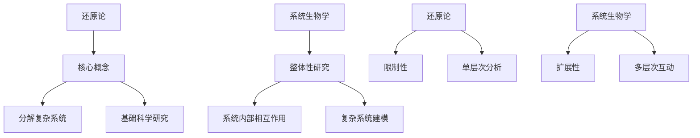

                 

### 引入

在生命科学与生态学研究领域，一直以来存在一种“还原论”与“系统生物学”之间的对立。还原论强调将复杂的系统拆解为简单的组成部分，从而理解其运作机制。而系统生物学则主张从整体性角度来理解生命现象，认为系统内部各个部分之间存在着复杂的相互作用和协同关系。这种转变，不仅对生命科学的发展产生了深远影响，也为生态学研究提供了全新的视角。

本书《从还原论到系统生物学：整体性理解生命与生态》，正是为了探讨这种转变的必要性和重要性。书中详细阐述了还原论与系统生物学之间的区别与联系，并介绍了系统生物学的基本原理与方法。通过这本书，读者可以深入理解生态系统的整体性，并学会如何运用系统生物学的方法来研究生命现象。

在接下来的章节中，我们将首先介绍还原论与系统生物学的核心概念，对比二者在研究方法与应用领域的差异。接着，我们将深入探讨系统生物学的基本原理和方法，并分析其在生态系统研究中的应用。最后，我们将讨论系统生物学在生命科学领域的广泛应用，并展望其未来发展。

通过这一步步的分析与思考，我们希望能够帮助读者全面了解从还原论到系统生物学的转变，以及这种转变对生命科学与生态学研究的重要性。

### 关键词

- **还原论**：一种将复杂系统拆解为简单部分来理解其运作机制的研究方法。
- **系统生物学**：一种从整体性角度来理解生命现象的研究方法。
- **生态系统**：由多个生物群落及其环境相互作用形成的复杂系统。
- **整体性**：研究系统内部各个部分之间复杂相互作用和协同关系的方法。
- **动态模拟**：通过数学模型和计算机模拟来预测系统行为的工具。

### 摘要

本书《从还原论到系统生物学：整体性理解生命与生态》旨在探讨生命科学与生态学研究中的一种关键转变，即从传统的还原论向现代的系统生物学的转变。本书首先介绍了还原论与系统生物学的基本概念、历史背景与发展，对比了二者在研究方法、工具与应用领域的差异。接着，深入阐述了系统生物学的基本原理、核心理论以及主要研究方法，包括数据驱动和理论驱动的方法。随后，本书详细讨论了系统生物学在生态系统整体性研究中的应用，通过分析生态系统的概念、特征以及整体性研究方法，展示了系统生物学如何帮助理解生态系统的复杂性和动态行为。最后，本书探讨了系统生物学在生命科学领域的广泛应用，从疾病机制研究到药物设计与开发，再到农业应用，展示了系统生物学在各个领域的巨大潜力。通过对这一转变的全面剖析，本书为读者提供了深入了解生命与生态系统的全新视角。

## 第一部分：引言

### 1.1 问题的提出

在现代生命科学与生态学研究中，我们面临着一系列复杂而深刻的挑战。这些挑战源于我们对生命现象和生态系统运作机制的理解仍然存在诸多局限。传统的还原论方法，虽然在揭示生命系统的基本组成和功能方面取得了显著成果，但其局限性也逐渐显现。还原论强调将复杂系统拆解为简单的组成部分，从而理解其运作机制。然而，这种方法往往忽视了系统内部各部分之间的复杂相互作用和协同关系，导致我们难以全面理解生命现象和生态系统的整体行为。

首先，还原论在揭示生命系统基本组成方面取得了巨大成就。例如，通过分子生物学的研究，我们揭示了DNA是遗传信息的载体，蛋白质是生命活动的主要执行者。这些发现为我们理解生命现象提供了基本框架。然而，还原论在解释生命现象的整体性和复杂性方面存在明显不足。例如，许多疾病的发生和发展涉及多个基因和蛋白质的相互作用，这些复杂的网络关系难以通过单一还原论方法进行解析。

其次，还原论在生态系统研究中也存在局限。生态系统是由多个生物群落及其环境相互作用形成的复杂系统，其行为和动态受到多种因素的影响。传统的还原论方法难以捕捉到这些复杂的相互作用，导致我们难以准确预测生态系统的变化和响应。例如，气候变化对生态系统的影响是一个复杂的非线性问题，涉及气候、植被、土壤等多个因素。还原论方法难以全面解析这些因素之间的相互作用，从而限制了对气候变化对生态系统影响的预测。

此外，随着科学技术的进步，我们逐渐认识到生态系统和生命系统的多层次性。从基因水平到细胞水平，再到个体水平，生态系统和生命系统表现出不同的层次结构和功能。传统的还原论方法往往只关注某一层次的研究，而忽视了不同层次之间的联系。这种层次分离的研究方法难以全面揭示生命现象和生态系统的整体性。

因此，面对这些挑战，我们需要寻求一种新的研究方法，即系统生物学。系统生物学主张从整体性角度来理解生命现象和生态系统，通过研究系统内部各部分之间的复杂相互作用和协同关系，提供对生命现象和生态系统行为的更全面、更深刻的理解。

系统生物学在生态学研究中具有重要的应用价值。通过系统生物学的方法，我们可以更好地理解生态系统的整体性和动态行为，揭示生物群落之间的相互作用机制，预测生态系统对环境变化的响应。此外，系统生物学在生命科学领域也有着广泛的应用，如疾病机制研究、药物设计与开发、农业应用等。

总之，从还原论到系统生物学的转变是生命科学与生态学研究领域的一次重要变革。通过系统生物学的方法，我们可以克服还原论方法的局限性，提供对生命现象和生态系统行为的更全面、更深刻的理解。接下来，我们将详细探讨还原论与系统生物学之间的区别与联系，深入理解这种转变的必要性和重要性。

### 1.2 还原论与系统生物学的对比

#### 1.2.1 还原论的核心概念

还原论是一种研究复杂系统的理论框架，其核心理念是将复杂的整体拆解为简单的部分，通过分析这些简单部分的性质和行为来理解整体。还原论认为，任何复杂的系统都可以通过分解为基本元素和基本过程来理解。这种分解过程旨在揭示系统中的基本规律和原理，从而实现对复杂现象的解释和控制。

在科学研究中，还原论的历史可以追溯到古希腊哲学家亚里士多德。他主张通过分析物质的基本组成来理解世界。随着时间的推移，这种思想在物理学、化学、生物学等领域得到了广泛应用。例如，在物理学中，牛顿力学通过分解为基本的力学定律来解释物体的运动；在化学中，原子论通过分解为基本原子来解释物质的组成和变化。

在生物学领域，还原论的核心概念得到了进一步的发展。通过分子生物学的研究，科学家揭示了DNA是遗传信息的载体，蛋白质是生命活动的主要执行者。这些发现标志着生物学从个体水平的研究转向分子水平的研究，为理解生命现象提供了新的视角。

然而，还原论的局限性也逐渐显现。尽管它能够揭示生命系统中的基本规律和原理，但它往往忽视了系统内部各部分之间的复杂相互作用和协同关系。这种局限性在生态系统中尤为明显，因为生态系统是由多个生物群落及其环境相互作用形成的复杂系统。

#### 1.2.2 系统生物学的基本原理

系统生物学是一种新兴的研究方法，它主张从整体性角度来理解生命现象。与还原论不同，系统生物学认为系统的行为和功能不仅仅取决于各个组成部分的性质和行为，更取决于它们之间的相互作用和协同关系。系统生物学的基本原理包括以下几个方面：

1. **整体性原理**：系统生物学强调系统的整体性，认为系统的行为和功能是各个部分相互作用和协同作用的结果。这意味着我们不能简单地通过分析单个部分来理解整个系统，而需要关注系统内部的复杂网络和动态过程。

2. **动态性原理**：系统生物学认为生命系统是动态的，其行为和功能随时间变化而变化。因此，系统生物学的研究不仅关注静态的结构，还关注动态的过程和变化。

3. **层次性原理**：系统生物学认识到生命系统具有多层次结构，从基因到细胞、个体、种群，乃至生态系统，每个层次都有其独特的结构和功能。系统生物学的研究不仅要关注某一层次，还要关注不同层次之间的相互关系和相互作用。

4. **复杂性原理**：系统生物学认为生命系统具有高度复杂性，这种复杂性不仅体现在系统内部各部分之间的相互作用，还体现在系统对外部环境的适应和响应。系统生物学通过研究这种复杂性，试图揭示生命系统的基本规律和原理。

#### 1.2.3 二者之间的区别与联系

还原论与系统生物学在研究方法、目标和应用领域上存在显著差异：

1. **研究方法**：还原论采用将复杂系统拆解为简单部分的方法，通过分析这些部分来理解整体。系统生物学则采用整体性方法，研究系统内部各部分之间的相互作用和协同关系。

2. **目标**：还原论的目标是揭示系统中的基本规律和原理，通过分解来理解整体。系统生物学的目标是理解系统的整体行为和功能，通过研究相互作用和协同关系来揭示系统的复杂性。

3. **应用领域**：还原论在生物学、物理学、化学等基础科学领域得到广泛应用。系统生物学则在生命科学、医学、生态学等交叉领域具有广泛应用，特别是在理解复杂生物系统和生态系统方面。

尽管存在这些差异，还原论与系统生物学并非完全对立。实际上，二者在某些方面是相互补充的。还原论为系统生物学提供了基础理论和研究工具，而系统生物学则为还原论提供了一种新的研究视角和方法。例如，在生态系统中，还原论可以帮助我们理解个体和种群水平的基本规律，而系统生物学可以帮助我们理解生态系统整体的行为和功能。

总之，还原论与系统生物学在生命科学与生态学研究中各有优势和局限性。通过结合这两种方法，我们可以更全面、更深入地理解生命现象和生态系统的复杂性。

### 1.3 整体性理解生命与生态的必要性

#### 1.3.1 生态系统的复杂性

生态系统是一个高度复杂的系统，它由多个生物群落、环境因素以及它们之间的相互作用组成。生态系统的复杂性体现在多个方面，包括生态过程中的非线性关系、不确定性和多层次结构。例如，一个生态系统中，植物、动物和微生物之间存在着复杂的食物网和相互作用，这些相互作用不仅影响单个物种的生存和繁衍，还影响整个生态系统的稳定性和功能。此外，生态系统的动态性使其在不同时间和空间尺度上表现出不同的特征和行为，这使得理解和预测生态系统的行为变得极为复杂。

非线性关系是生态系统复杂性的一大特点。在生态系统中，生物个体和群落之间的相互作用往往不是线性的，即一个物种的变化不会直接、简单地导致另一个物种的变化。例如，捕食者和猎物之间的相互作用可以通过复杂的反馈机制来调节种群动态，这种非线性关系导致生态系统的行为难以预测和控制。

不确定性也是生态系统复杂性的重要方面。生态系统受到多种因素的影响，包括气候变化、自然灾害、人类活动等。这些因素的不确定性使得生态系统的行为和状态难以准确预测。例如，气候变化可能导致物种分布的变化，从而影响食物网的稳定性和生态系统的整体功能。

多层次结构进一步增加了生态系统的复杂性。生态系统包括个体水平、种群水平、生态系统水平等多个层次，每个层次都有其独特的结构和功能。例如，个体水平的特征包括物种的生长率、繁殖率等，而生态系统水平的特征包括生物多样性、生态系统生产力等。这些多层次结构之间的相互作用和协同关系使得生态系统表现出复杂的动态行为。

#### 1.3.2 生命系统的多层次性

生命系统同样具有多层次结构，从分子水平到细胞水平、个体水平、种群水平乃至生态系统水平，每个层次都有其独特的特征和功能。例如，在分子水平，生命活动由DNA、RNA、蛋白质等生物大分子控制；在细胞水平，多个细胞通过细胞间信号传递和相互作用来维持生命活动；在个体水平，个体通过器官系统和行为来适应环境；在种群水平，多个个体通过繁殖和相互作用来维持种群动态；在生态系统水平，多个种群及其环境因素通过复杂的食物网和能量流动来维持生态平衡。

多层次性使得生命系统的行为和功能具有高度的复杂性和多样性。例如，一个物种在不同层次上的特征和行为可能截然不同。在个体水平，一个物种可能表现出高度适应性，而在种群水平，该物种可能面临灭绝的风险。这种多层次性使得我们难以通过单一层次的研究来全面理解生命现象，而需要从整体性角度来考虑系统的行为和功能。

#### 1.3.3 整体性视角的优势

整体性视角在理解生命与生态系统的复杂性和多层次性方面具有显著优势。首先，整体性视角能够捕捉到系统内部各部分之间的复杂相互作用和协同关系，从而提供对系统行为的更全面的理解。例如，通过研究生态系统中的食物网和能量流动，我们可以理解捕食者和猎物之间的相互作用如何影响生态系统的稳定性。

其次，整体性视角有助于揭示系统的动态行为和变化趋势。生态系统和生命系统是动态的，其行为和功能随时间变化而变化。整体性视角能够捕捉到这些动态过程，从而提供对系统变化的预测和分析。例如，通过构建生态系统模型，我们可以预测气候变化对生态系统的影响。

此外，整体性视角还有助于解决科学研究中的一些难题。例如，在医学领域，整体性视角可以帮助我们理解疾病的多因素机制，从而为疾病的治疗提供新的思路。在生态学领域，整体性视角可以帮助我们更好地管理生态系统，保护生物多样性。

总之，从整体性角度理解生命与生态系统是解决复杂性和多层次性问题的有效途径。通过整体性视角，我们可以更全面、更深入地理解生命现象和生态系统的复杂性，从而为科学研究和技术应用提供新的视角和方法。

### 1.4 系统生物学在生命科学中的应用

系统生物学在生命科学领域中的应用正在迅速扩展，成为现代生命科学研究的重要工具。系统生物学通过整合多学科知识和技术，提供了对生命系统复杂性和动态行为的深入理解。以下将探讨系统生物学在几个关键领域的具体应用，包括疾病研究、药物设计和开发，以及农业领域的应用。

#### 1.4.1 疾病研究

在疾病研究中，系统生物学的方法被广泛应用于揭示疾病的发生机制、预测疾病风险，以及开发新的诊断和治疗策略。系统生物学通过研究基因表达、蛋白质相互作用和代谢途径，可以帮助科学家理解疾病的多因素机制和复杂网络。

例如，在癌症研究中，系统生物学方法被用于构建肿瘤网络的动态模型，揭示癌症发生和发展的分子机制。通过分析基因表达谱和蛋白质相互作用网络，科学家可以识别出关键的驱动基因和信号通路，从而为癌症的早期诊断和治疗提供新的靶点。此外，系统生物学还在个性化医疗中发挥重要作用，通过分析患者的基因组和临床数据，为每个患者制定个性化的治疗策略。

#### 1.4.2 药物设计与开发

系统生物学在药物设计与开发中的应用也日益显著。传统的药物开发方法主要依赖于对单个靶点的干预，而系统生物学方法则更关注药物对整个生物系统的潜在影响。这种方法有助于发现新的药物靶点，提高药物开发的效率。

通过系统生物学的方法，科学家可以构建药物作用网络的模型，预测药物对不同生物分子的潜在影响。这种预测能力不仅有助于发现新的药物靶点，还可以帮助优化药物的设计和开发过程。例如，通过结合基因表达数据和药物筛选数据，科学家可以识别出具有特定药理作用的化合物，从而加速药物开发进程。

此外，系统生物学还在药物安全性评估中发挥重要作用。通过分析药物在生物体内的代谢途径和相互作用，系统生物学方法可以帮助预测药物潜在的副作用和毒性，从而提高药物的安全性。

#### 1.4.3 农业领域的应用

系统生物学在农业领域中的应用也取得了显著成果。通过研究农作物的基因表达、蛋白质相互作用和代谢途径，系统生物学方法可以帮助科学家了解作物的生长、发育和抗逆机制，从而提高作物的产量和抗病性。

例如，在作物遗传改良中，系统生物学方法被用于识别和利用重要的基因资源。通过构建作物基因表达网络和代谢途径模型，科学家可以识别出影响作物生长和产量的关键基因，从而进行定向育种。此外，系统生物学方法还可以帮助预测作物对环境变化的响应，为作物种植提供科学依据。

在病虫害管理方面，系统生物学方法被用于研究害虫的生态位和进化机制。通过分析害虫的基因组数据和生态学数据，科学家可以识别出关键的基因和信号通路，从而开发出更有效的生物防治策略。

#### 1.4.4 其他应用领域

除了上述领域，系统生物学还在其他多个生命科学领域具有广泛应用。例如，在微生物学中，系统生物学方法被用于研究微生物的代谢途径和相互作用网络，揭示微生物的生态功能和应用潜力。在神经科学中，系统生物学方法被用于研究大脑的复杂网络和功能，揭示神经疾病的分子机制。

总之，系统生物学在生命科学中的应用正在不断扩展，其强大的综合分析能力为理解生命系统的复杂性和动态行为提供了新的工具和方法。随着技术的不断进步，系统生物学将在未来继续推动生命科学的发展，为人类健康、环境和农业等领域带来更多创新和突破。

### 1.5 本章小结

本章通过对还原论与系统生物学的介绍，探讨了从还原论到系统生物学转变的必要性。首先，我们分析了还原论的核心概念，阐述了其在科学研究中的历史背景和局限性。接着，我们介绍了系统生物学的基本原理，强调了其从整体性角度理解生命现象的重要性。然后，我们对比了还原论与系统生物学在研究方法、目标和应用领域的差异，并讨论了整体性视角在理解生命与生态系统复杂性方面的优势。最后，我们详细阐述了系统生物学在疾病研究、药物设计和开发，以及农业领域的具体应用，展示了其在现代生命科学中的重要作用。通过本章的内容，读者可以初步了解从还原论到系统生物学转变的背景和意义，为后续章节的深入探讨奠定基础。

## 第二部分：核心概念与联系

### 2.1 还原论与系统生物学的关系图

为了更好地理解还原论与系统生物学之间的关系，我们可以通过绘制一个关系图来直观地展示二者之间的对比和联系。以下是一个使用Mermaid绘制的还原论与系统生物学的关系图：

- **A（还原论）**：代表还原论的核心概念和研究方法。
- **B（核心概念）**：还原论的核心概念，强调将复杂系统拆解为简单部分。
- **C（分解复杂系统）**：还原论通过分解复杂系统来理解其基本组成和运作机制。
- **D（基础科学研究）**：还原论在基础科学研究中广泛应用，特别是在物理学、化学和分子生物学领域。
- **E（系统生物学）**：代表系统生物学的研究方法和核心概念。
- **F（整体性研究）**：系统生物学的核心概念，强调系统内部各部分的相互作用和整体性。
- **G（系统内部相互作用）**：系统生物学关注系统内部各部分之间的复杂相互作用。
- **H（复杂系统建模）**：系统生物学通过复杂系统建模来理解和预测系统的行为。
- **I（还原论）**：还原论在研究方法上的局限性，如单层次分析和忽略相互作用。
- **J（限制性）**：还原论在研究复杂系统时存在的限制，难以全面理解系统的整体行为。
- **L（系统生物学）**：系统生物学在研究方法上的扩展性，能够处理复杂系统的多层次和动态特性。
- **M（扩展性）**：系统生物学能够扩展到多层次和动态系统的研究，为理解复杂系统提供了新的视角。
- **N（多层次互动）**：系统生物学强调多层次之间的互动和协同作用。

通过这个关系图，我们可以清晰地看到还原论与系统生物学在核心概念、研究方法和应用领域的对比与联系。这种图示不仅帮助读者直观地理解二者的区别，还能展示出系统生物学如何克服还原论的局限性，提供对复杂系统的更全面理解。

### 2.2 还原论的核心概念

还原论是一种科学研究方法，其核心概念在于将复杂的整体拆解为简单的组成部分，通过分析这些简单部分的性质和行为来理解整体。这种方法的核心理念是“整体等于部分之和”，即通过研究系统的各个组成部分，可以推导出系统整体的行为和功能。

在物理学中，还原论的观点可以追溯到经典物理学。经典物理学通过研究基本粒子（如电子、原子）的力学特性，解释了宏观物体的运动规律。例如，牛顿力学通过分解为基本的力学定律，解释了物体的运动和相互作用。这种方法在理解物理现象方面取得了巨大成功，为现代科学的发展奠定了基础。

在化学中，还原论的核心概念是原子论。原子论认为，所有物质都是由不可分割的原子组成，化学反应是原子重新组合的过程。通过研究原子和分子的性质，化学家可以解释各种物质的化学性质和反应机制。原子论的成功为化学提供了坚实的理论基础，促进了现代化学的发展。

在生物学中，还原论的核心概念主要体现在分子生物学的研究中。通过研究基因、蛋白质等生物大分子的结构和功能，科学家揭示了生命现象的基本原理。例如，DNA作为遗传信息的载体，通过基因表达和调控，决定了生物的形态和功能。蛋白质作为生命活动的执行者，通过复杂的相互作用和信号传递，维持了生物体的正常功能。这些发现不仅揭示了生命系统的基本组成和运作机制，还为生物学研究提供了重要的理论基础。

然而，还原论在生物学中的应用也暴露出了一些局限性。尽管分子生物学的研究揭示了生命系统的基本组成和运作机制，但这种方法往往忽视了系统内部各部分之间的复杂相互作用和协同关系。例如，一个基因或蛋白质的功能并不是孤立存在的，而是与其他基因和蛋白质相互影响、协同作用的结果。这种复杂的相互作用和协同关系在生态系统和生命系统中尤为重要，但传统的还原论方法难以捕捉到这些复杂关系。

### 2.2.2 还原论的历史与发展

还原论的历史可以追溯到古希腊哲学家亚里士多德，他在《形而上学》一书中提出了物质由基本元素组成的观点，这一思想被视为还原论的早期形式。随着科学的发展，还原论在各个领域得到了广泛应用和深入发展。

在物理学中，牛顿力学和经典力学的发展标志着还原论的重要阶段。通过将复杂的宏观现象分解为简单的微观机制，科学家们建立了完整的力学体系，成功解释了行星运动、碰撞现象等复杂现象。

在化学中，原子论和分子理论的提出和发展进一步巩固了还原论的地位。道尔顿的原子论和阿伏伽德罗的分子理论为化学提供了基本的理论框架，使得化学研究从宏观现象转向微观结构。

在生物学中，分子生物学的发展是还原论的一个重要里程碑。随着DNA双螺旋结构的发现和基因测序技术的进步，科学家们揭示了生命系统的基本组成和运作机制。通过研究基因、蛋白质和代谢途径，分子生物学为我们理解生命现象提供了深刻的洞察。

尽管还原论在科学研究中的贡献巨大，但其局限性也逐渐显现。随着科学技术的进步，我们逐渐认识到，许多复杂的系统行为并非仅仅由简单部分的行为简单叠加而成。系统内部各部分之间的相互作用和协同关系在决定系统整体行为中扮演着关键角色。这种认识促使科学家们开始探索新的研究方法，即系统生物学。

### 2.2.3 还原论的基本原理

还原论的基本原理可以概括为以下几点：

1. **分解与组合**：还原论通过将复杂系统分解为简单的组成部分，研究这些部分的行为和功能，然后再将这些部分组合起来，解释系统的整体行为。这种方法强调对系统的结构进行分析，从而揭示系统的基本原理和规律。

2. **层次结构**：还原论认为，复杂系统可以分解为不同层次的结构，每个层次都有其独特的组成和功能。通过研究各个层次的结构和功能，可以逐步理解复杂系统的整体行为。

3. **独立性**：在还原论中，系统内部各部分被认为是相对独立的，它们的行为和功能可以通过独立的实验和观察来研究。这种方法假设，通过对各个部分的研究，可以推导出系统的整体行为。

4. **基础科学**：还原论强调基础科学研究的重要性，通过研究系统的基本组成部分和基本过程，揭示系统的基本规律和原理。这种方法为科学研究提供了坚实的理论基础。

### 2.3 系统生物学的基本原理

系统生物学是一种从整体性角度研究生命系统的科学方法，其核心在于研究系统内部各部分之间的相互作用和协同关系，以及这些关系如何影响系统的整体行为。与还原论不同，系统生物学不仅关注系统的组成部分，还关注这些部分之间的复杂网络和动态过程。以下是对系统生物学基本原理的详细阐述：

#### 2.3.1 整体性原理

系统生物学强调系统的整体性，认为系统的行为和功能是系统内部各个部分相互作用和协同作用的结果。整体性原理认为，系统的整体行为不能简单地通过分析各个部分的独立行为来解释。相反，需要考虑系统内部各部分之间的复杂网络和动态过程。例如，在生态系统中，一个物种的行为不仅受到自身生物特性的影响，还受到其他物种和环境的相互作用。

#### 2.3.2 动态性原理

系统生物学认为生命系统是动态的，其行为和功能随时间变化而变化。动态性原理强调研究系统在不同时间尺度上的行为变化，以及这些变化如何影响系统的稳定性和功能。例如，在细胞水平，细胞周期和信号传导途径的变化会导致细胞行为的动态变化；在生态系统水平，气候变化和人类活动会导致生态系统的动态变化。

#### 2.3.3 层次性原理

系统生物学认识到生命系统具有多层次结构，从基因到细胞、组织、器官和生态系统，每个层次都有其独特的特征和功能。层次性原理强调在不同层次上研究系统的行为和功能，以及不同层次之间的相互关系。通过研究多层次的结构和功能，可以更全面地理解系统的复杂性和动态行为。

#### 2.3.4 复杂性原理

系统生物学认为生命系统具有高度复杂性，这种复杂性不仅体现在系统内部各部分之间的相互作用，还体现在系统对外部环境的适应和响应。复杂性原理强调研究系统的复杂性，以及如何通过模型和计算工具来分析和理解这种复杂性。例如，在生态系统研究中，食物网和能量流动的复杂性需要通过数学模型和计算机模拟来分析。

#### 2.3.5 集成原理

系统生物学通过整合多学科知识和技术，提供对生命系统的全面理解。集成原理强调跨学科的合作和知识的整合，将分子生物学、遗传学、生态学、物理学和计算机科学等领域的知识结合起来，共同研究生命系统的复杂性。通过多学科的合作，可以构建更全面和精确的系统模型，更好地理解生命系统的行为和功能。

#### 2.3.6 预测性原理

系统生物学致力于通过模型和计算工具预测系统的行为和功能。预测性原理认为，通过理解系统的结构和机制，可以预测系统的未来行为和响应。这种预测能力对于生物医学、环境保护和农业等领域具有重要意义。例如，通过构建疾病模型的预测，可以预测新药物的效果和副作用；通过构建生态模型的预测，可以预测气候变化对生态系统的影响。

综上所述，系统生物学的基本原理包括整体性原理、动态性原理、层次性原理、复杂性原理、集成原理和预测性原理。这些原理共同构成了系统生物学的方法论框架，为研究生命系统的复杂性和动态行为提供了新的视角和方法。

### 2.4 系统生物学的研究方法

系统生物学的研究方法主要包括数据驱动的系统生物学和理论驱动的系统生物学，这两种方法各有其优势和应用场景。以下将详细阐述这两种方法的基本概念、步骤和常见工具。

#### 2.4.1 数据驱动的系统生物学

数据驱动的系统生物学依赖于大量的实验数据，通过数据分析和建模来揭示系统内部的结构和机制。这种方法的核心在于从实验数据中提取有用的信息，构建系统的数学模型，从而理解系统的行为和功能。

**基本步骤：**
1. **数据收集**：通过基因表达、蛋白质相互作用、代谢途径等实验手段收集系统的数据。这些数据可以是时间序列数据、空间分布数据或者交互关系数据。
2. **数据预处理**：对收集到的数据进行清洗、归一化和标准化处理，确保数据的准确性和一致性。
3. **数据分析**：使用统计学和机器学习方法对预处理后的数据进行分析，提取数据中的规律和模式。常见的方法包括聚类分析、主成分分析、回归分析和神经网络等。
4. **模型构建**：基于分析结果，构建系统的数学模型。这些模型可以是线性模型、非线性模型或混合模型，用于描述系统内部的关系和动态行为。
5. **模型验证**：通过实验数据验证模型的准确性，调整模型参数，优化模型结构。

**常用工具：**
- **Bioconductor**：一个用于生物信息学数据分析和建模的开源软件集合，包括多种生物数据处理和统计工具。
- **Python**：一种广泛用于数据分析和建模的编程语言，具有丰富的库和框架，如NumPy、SciPy、Pandas和Scikit-learn等。
- **R**：一种专门用于统计分析的数据科学语言，具有强大的数据处理和可视化功能。
- **MATLAB**：一种用于科学计算和工程仿真的软件，特别适合复杂系统的建模和仿真。

#### 2.4.2 理论驱动的系统生物学

理论驱动的系统生物学侧重于通过数学建模和理论分析来揭示系统的基本原理和规律。这种方法通常基于已知的生物学原理和理论，通过构建数学模型来描述系统的行为和功能。

**基本步骤：**
1. **问题定义**：明确研究的问题和目标，确定系统的主要组成部分和相互作用。
2. **模型构建**：基于生物学原理和理论，构建系统的数学模型。这些模型可以是差分方程、微分方程、代数方程或图论模型，用于描述系统的结构和动态行为。
3. **模型分析**：对构建的模型进行数学分析，研究系统的稳定性和动力学行为。常见的方法包括稳定性分析、相空间分析、瞬态分析和灵敏度分析等。
4. **模型验证**：通过实验数据验证模型的准确性，调整模型参数，优化模型结构。
5. **模型应用**：将验证后的模型应用于实际问题，进行预测和优化。

**常用工具：**
- **Mathematica**：一种强大的数学建模和计算软件，特别适合复杂的数学建模和仿真。
- **MATLAB**：用于科学计算和工程仿真的软件，具有丰富的工具箱和函数库。
- **Python**：一种用于数据分析和建模的编程语言，具有丰富的库和框架，如SciPy、NumPy和SymPy等。
- **R**：一种专门用于统计分析的数据科学语言，特别适合复杂系统的建模和仿真。

#### 2.4.3 跨学科的融合方法

系统生物学的研究方法不仅仅是数据驱动或理论驱动的，还可以是跨学科的融合方法。这种方法结合了数据驱动和理论驱动的优势，通过多学科的知识和技术来研究和理解复杂的生物系统。

**基本步骤：**
1. **数据收集**：通过多种实验手段收集系统的数据，包括基因表达、蛋白质相互作用、代谢途径、细胞行为等。
2. **数据预处理**：对收集到的数据进行清洗、归一化和标准化处理，确保数据的准确性和一致性。
3. **理论建模**：基于生物学原理和理论，构建系统的数学模型，用于描述系统的结构和动态行为。
4. **模型整合**：将不同来源的数据和模型整合到一个统一的框架中，通过交叉验证和优化来提高模型的准确性和稳定性。
5. **模型应用**：将验证后的模型应用于实际问题，进行预测和优化。

**常用工具：**
- **Bioconductor**：用于生物信息学数据分析和建模的开源软件集合。
- **Python**：用于数据分析和建模的编程语言，具有丰富的库和框架。
- **R**：用于统计分析的数据科学语言。
- **MATLAB**：用于科学计算和工程仿真的软件。

通过结合数据驱动和理论驱动的系统生物学方法，我们可以更全面、更深入地理解复杂的生物系统，为生命科学的研究提供新的视角和方法。

### 2.5 系统生物学的主要工具与技术

系统生物学的研究离不开一系列先进的工具和技术，这些工具和技术帮助科学家们解析复杂的生物系统，从数据中提取有价值的信息。以下将详细介绍几种系统生物学中常用的工具与技术。

#### 2.5.1 生命网络分析

生命网络分析是系统生物学中的一个核心技术，它通过研究生物分子之间的相互作用，揭示生物系统的复杂网络结构。生命网络包括基因调控网络、蛋白质相互作用网络和代谢网络等，它们共同构成了生物系统的调控机制。

**方法**：
1. **数据收集**：通过高通量测序、基因芯片、蛋白质组学等技术，收集生物分子之间的相互作用数据。
2. **网络构建**：基于收集到的数据，构建生物分子之间的相互作用网络。这些网络通常用图论模型表示，其中节点表示生物分子，边表示它们之间的相互作用。
3. **网络分析**：对构建的网络进行拓扑分析、功能分析和动态分析，提取网络中的关键节点和关键路径。

**工具**：
- **Cytoscape**：一个广泛使用的开源工具，用于可视化生物网络和分析网络结构。
- **STRING**：一个在线数据库，提供蛋白质相互作用的预测和注释。
- **GeneMania**：一个基于网络的基因功能预测工具，通过分析基因之间的相互作用网络来预测基因的功能。

#### 2.5.2 动态模拟与预测

动态模拟与预测是系统生物学的重要技术之一，它通过数学模型和计算机模拟，模拟生物系统的动态行为，预测系统的未来状态。这种方法可以帮助科学家们理解系统的稳定性和动态响应。

**方法**：
1. **模型构建**：基于生物学原理和实验数据，构建生物系统的数学模型。这些模型可以是微分方程模型、差分方程模型或概率模型。
2. **模拟仿真**：使用计算机模拟软件，对构建的模型进行仿真，模拟系统的动态行为。
3. **参数估计**：通过实验数据，估计模型参数，优化模型结构。
4. **预测分析**：基于模拟结果，预测系统的未来状态和响应。

**工具**：
- **MATLAB**：一种强大的科学计算软件，支持多种数学模型的构建和仿真。
- **Python**：一种灵活的编程语言，支持多种仿真工具和库，如SimPy和PyDSTool。
- **BlueSkyBio**：一个开源的动态模拟平台，支持多种生物系统的建模和仿真。

#### 2.5.3 系统生物学的实验技术

系统生物学的实验技术是获取生物系统数据的重要手段，包括高通量实验技术、单细胞分析技术和基因编辑技术等。

**方法**：
1. **高通量实验技术**：通过高通量基因表达分析、蛋白质质谱分析和代谢组学等技术，获取大量生物分子数据。
2. **单细胞分析技术**：通过单细胞测序、单细胞RNA测序和单细胞蛋白质组学等技术，分析单个细胞的行为和状态。
3. **基因编辑技术**：通过CRISPR-Cas9等基因编辑技术，精确修饰生物分子的结构和功能。

**工具**：
- **Illumina测序平台**：一种高通量测序技术，用于基因表达和基因组分析。
- **10x Genomics**：提供单细胞RNA测序技术，用于分析单个细胞中的基因表达。
- **CRISPR-Cas9**：一种基因编辑技术，用于精确修饰基因组。

通过这些工具和技术，系统生物学家能够深入解析复杂的生物系统，揭示生物系统的结构和功能，为生命科学的研究提供了强有力的支持。

### 2.6 本章小结

本章详细介绍了系统生物学的基本原理和方法，以及其主要工具和技术。首先，我们阐述了系统生物学从整体性、动态性、层次性、复杂性和集成性等多个角度理解生命系统的基本原理。接着，我们介绍了系统生物学的研究方法，包括数据驱动的系统生物学和理论驱动的系统生物学，并探讨了这两种方法的优点和应用场景。然后，我们重点介绍了系统生物学中常用的工具和技术，如生命网络分析、动态模拟与预测以及实验技术。这些工具和技术为系统生物学研究提供了强大的支持，帮助我们深入解析复杂的生物系统。通过本章的内容，读者可以全面了解系统生物学的核心概念、研究方法及其在生命科学中的应用，为后续章节的深入探讨打下坚实基础。

## 第三部分：系统生物学的基本原理与方法

### 3.1 系统生物学的基本原理

系统生物学是一种以系统为研究对象的生物学分支，它不仅关注生命系统中的各个组成部分，还强调这些部分之间的相互作用和整体性。以下是系统生物学的基本原理，这些原理为我们理解生命系统的复杂性提供了新的视角。

#### 整体性原理

整体性原理是系统生物学的一个核心概念，它强调系统的整体行为是由系统内部各部分相互作用和协同作用的结果。这意味着，我们不能简单地通过分析各个部分来理解整个系统，而需要关注系统内部各部分之间的复杂网络和动态过程。例如，在一个生态系统中，植物、动物和微生物之间的相互作用不仅影响单个物种的生存和繁衍，还会影响整个生态系统的稳定性和功能。

#### 动态性原理

动态性原理认为，生命系统是动态的，其行为和功能随时间变化而变化。系统生物学通过研究系统在不同时间尺度上的行为变化，揭示系统的动态特征和动态机制。例如，在细胞水平，细胞周期和信号传导途径的变化会导致细胞行为的动态变化；在生态系统水平，气候变化和人类活动会导致生态系统的动态变化。

#### 层次性原理

层次性原理指出，生命系统具有多层次结构，从基因到细胞、组织、器官和生态系统，每个层次都有其独特的特征和功能。系统生物学通过在不同层次上研究系统的行为和功能，以及不同层次之间的相互关系，提供了对系统复杂性的全面理解。

#### 复杂性原理

复杂性原理强调生命系统具有高度复杂性，这种复杂性不仅体现在系统内部各部分之间的相互作用，还体现在系统对外部环境的适应和响应。系统生物学通过研究系统的复杂性，试图揭示生命系统的基本规律和原理。

#### 集成性原理

集成性原理是指系统生物学通过整合多学科知识和技术，提供对生命系统的全面理解。系统生物学不仅涉及生物学、物理学、化学等基础科学，还包括计算机科学、工程学等领域的知识。通过多学科的合作和知识整合，系统生物学能够构建更全面和精确的系统模型，更好地理解生命系统的行为和功能。

#### 预测性原理

预测性原理是指系统生物学致力于通过模型和计算工具预测系统的行为和功能。通过理解系统的结构和机制，我们可以预测系统的未来行为和响应。这种预测能力对于生物医学、环境保护和农业等领域具有重要意义。例如，通过构建疾病模型的预测，可以预测新药物的效果和副作用；通过构建生态模型的预测，可以预测气候变化对生态系统的影响。

综上所述，系统生物学的基本原理为研究生命系统的复杂性提供了新的视角和方法。这些原理不仅帮助我们理解生命系统的结构和功能，还为解决生物科学中的复杂问题提供了强大的工具。

### 3.2 系统生物学的研究方法

系统生物学的研究方法主要包括数据驱动的系统生物学和理论驱动的系统生物学，这两种方法各有其优势和适用场景。以下将详细探讨这两种方法的基本概念、步骤和常用工具。

#### 3.2.1 数据驱动的系统生物学

数据驱动的系统生物学依赖于大量的实验数据，通过数据分析和建模来揭示系统的结构和动态行为。这种方法的核心在于从实验数据中提取有用的信息，构建系统的数学模型，从而理解系统的功能和机制。

**基本步骤：**
1. **数据收集**：通过高通量测序、基因芯片、蛋白质质谱、代谢组学等技术，收集系统在不同状态下的数据。
2. **数据预处理**：对收集到的数据进行清洗、归一化和标准化处理，确保数据的准确性和一致性。
3. **数据分析**：使用统计学和机器学习方法对预处理后的数据进行分析，提取数据中的规律和模式。常见的方法包括聚类分析、主成分分析、回归分析和神经网络等。
4. **模型构建**：基于分析结果，构建系统的数学模型。这些模型可以是线性模型、非线性模型或混合模型，用于描述系统内部的关系和动态行为。
5. **模型验证**：通过实验数据验证模型的准确性，调整模型参数，优化模型结构。

**常用工具：**
- **Bioconductor**：一个用于生物信息学数据分析和建模的开源软件集合，包括多种生物数据处理和统计工具。
- **Python**：一种广泛用于数据分析和建模的编程语言，具有丰富的库和框架，如NumPy、SciPy、Pandas和Scikit-learn等。
- **R**：一种专门用于统计分析的数据科学语言，具有强大的数据处理和可视化功能。
- **MATLAB**：一种用于科学计算和工程仿真的软件，特别适合复杂系统的建模和仿真。

#### 3.2.2 理论驱动的系统生物学

理论驱动的系统生物学侧重于通过数学建模和理论分析来揭示系统的基本原理和规律。这种方法通常基于已知的生物学原理和理论，通过构建数学模型来描述系统的行为和功能。

**基本步骤：**
1. **问题定义**：明确研究的问题和目标，确定系统的主要组成部分和相互作用。
2. **模型构建**：基于生物学原理和理论，构建系统的数学模型。这些模型可以是差分方程、微分方程、代数方程或图论模型，用于描述系统的结构和动态行为。
3. **模型分析**：对构建的模型进行数学分析，研究系统的稳定性和动力学行为。常见的方法包括稳定性分析、相空间分析、瞬态分析和灵敏度分析等。
4. **模型验证**：通过实验数据验证模型的准确性，调整模型参数，优化模型结构。
5. **模型应用**：将验证后的模型应用于实际问题，进行预测和优化。

**常用工具：**
- **Mathematica**：一种强大的数学建模和计算软件，特别适合复杂的数学建模和仿真。
- **MATLAB**：用于科学计算和工程仿真的软件，具有丰富的工具箱和函数库。
- **Python**：一种用于数据分析和建模的编程语言，具有丰富的库和框架，如SciPy、NumPy和SymPy等。
- **R**：一种专门用于统计分析的数据科学语言，特别适合复杂系统的建模和仿真。

#### 3.2.3 跨学科的融合方法

系统生物学的研究方法不仅仅是数据驱动或理论驱动的，还可以是跨学科的融合方法。这种方法结合了数据驱动和理论驱动的优势，通过多学科的知识和技术来研究和理解复杂的生物系统。

**基本步骤：**
1. **数据收集**：通过多种实验手段收集系统的数据，包括基因表达、蛋白质相互作用、代谢途径、细胞行为等。
2. **数据预处理**：对收集到的数据进行清洗、归一化和标准化处理，确保数据的准确性和一致性。
3. **理论建模**：基于生物学原理和理论，构建系统的数学模型，用于描述系统的结构和动态行为。
4. **模型整合**：将不同来源的数据和模型整合到一个统一的框架中，通过交叉验证和优化来提高模型的准确性和稳定性。
5. **模型应用**：将验证后的模型应用于实际问题，进行预测和优化。

**常用工具：**
- **Bioconductor**：用于生物信息学数据分析和建模的开源软件集合。
- **Python**：用于数据分析和建模的编程语言，具有丰富的库和框架。
- **R**：用于统计分析的数据科学语言。
- **MATLAB**：用于科学计算和工程仿真的软件。

通过结合数据驱动和理论驱动的系统生物学方法，我们可以更全面、更深入地理解复杂的生物系统，为生命科学的研究提供新的视角和方法。

### 3.3 系统生物学的主要工具与技术

系统生物学的研究离不开一系列先进的工具和技术，这些工具和技术帮助科学家们解析复杂的生物系统，从数据中提取有价值的信息。以下将详细介绍几种系统生物学中常用的工具和技术。

#### 3.3.1 生命网络分析

生命网络分析是系统生物学中的一个核心技术，它通过研究生物分子之间的相互作用，揭示生物系统的复杂网络结构。生命网络包括基因调控网络、蛋白质相互作用网络和代谢网络等，它们共同构成了生物系统的调控机制。

**方法**：
1. **数据收集**：通过高通量测序、基因芯片、蛋白质质谱分析和代谢组学等技术，收集生物分子之间的相互作用数据。
2. **网络构建**：基于收集到的数据，构建生物分子之间的相互作用网络。这些网络通常用图论模型表示，其中节点表示生物分子，边表示它们之间的相互作用。
3. **网络分析**：对构建的网络进行拓扑分析、功能分析和动态分析，提取网络中的关键节点和关键路径。

**工具**：
- **Cytoscape**：一个广泛使用的开源工具，用于可视化生物网络和分析网络结构。
- **STRING**：一个在线数据库，提供蛋白质相互作用的预测和注释。
- **GeneMania**：一个基于网络的基因功能预测工具，通过分析基因之间的相互作用网络来预测基因的功能。

#### 3.3.2 动态模拟与预测

动态模拟与预测是系统生物学的重要技术之一，它通过数学模型和计算机模拟，模拟生物系统的动态行为，预测系统的未来状态。这种方法可以帮助科学家们理解系统的稳定性和动态响应。

**方法**：
1. **模型构建**：基于生物学原理和实验数据，构建生物系统的数学模型。这些模型可以是微分方程模型、差分方程模型或概率模型。
2. **模拟仿真**：使用计算机模拟软件，对构建的模型进行仿真，模拟系统的动态行为。
3. **参数估计**：通过实验数据，估计模型参数，优化模型结构。
4. **预测分析**：基于模拟结果，预测系统的未来状态和响应。

**工具**：
- **MATLAB**：一种强大的科学计算软件，支持多种数学模型的构建和仿真。
- **Python**：一种灵活的编程语言，支持多种仿真工具和库，如SimPy和PyDSTool。
- **BlueSkyBio**：一个开源的动态模拟平台，支持多种生物系统的建模和仿真。

#### 3.3.3 系统生物学的实验技术

系统生物学的实验技术是获取生物系统数据的重要手段，包括高通量实验技术、单细胞分析技术和基因编辑技术等。

**方法**：
1. **高通量实验技术**：通过高通量基因表达分析、蛋白质质谱分析和代谢组学等技术，获取大量生物分子数据。
2. **单细胞分析技术**：通过单细胞测序、单细胞RNA测序和单细胞蛋白质组学等技术，分析单个细胞的行为和状态。
3. **基因编辑技术**：通过CRISPR-Cas9等基因编辑技术，精确修饰生物分子的结构和功能。

**工具**：
- **Illumina测序平台**：一种高通量测序技术，用于基因表达和基因组分析。
- **10x Genomics**：提供单细胞RNA测序技术，用于分析单个细胞中的基因表达。
- **CRISPR-Cas9**：一种基因编辑技术，用于精确修饰基因组。

通过这些工具和技术，系统生物学家能够深入解析复杂的生物系统，揭示生物系统的结构和功能，为生命科学的研究提供了强有力的支持。

### 3.4 系统生物学在生命科学中的应用

系统生物学在生命科学中的应用正日益广泛，其强大的综合分析能力和跨学科整合方法为解决复杂的生物科学问题提供了新的思路和工具。以下将探讨系统生物学在疾病研究、药物设计与开发以及农业领域的具体应用，并展示其在这些领域中的实际效果。

#### 3.4.1 疾病研究

系统生物学在疾病研究中具有显著的应用潜力。通过整合基因组学、转录组学、蛋白质组学和代谢组学等多层次的数据，系统生物学可以揭示疾病的复杂生物学机制，为疾病的早期诊断、预测和治疗提供了新的途径。

**案例研究：癌症研究**

癌症是一个复杂的疾病，涉及多个基因和信号通路的异常。系统生物学方法通过构建癌症网络的动态模型，可以帮助科学家理解癌症的发生和发展机制。例如，通过分析患者的基因组数据和蛋白质相互作用网络，系统生物学家发现了一些关键的驱动基因和信号通路，这些发现为开发新的治疗靶点提供了重要参考。

**具体应用：**
- **早期诊断**：通过系统生物学方法，可以从基因表达和蛋白质相互作用网络中识别出早期癌症的生物标志物，从而实现早期诊断。
- **预后预测**：系统生物学模型可以帮助预测患者的预后，为医生提供个性化的治疗方案。
- **个性化医疗**：基于患者的基因组和转录组数据，系统生物学方法可以制定个性化的治疗策略，提高治疗效果。

#### 3.4.2 药物设计与开发

药物设计与开发是一个复杂的工程，系统生物学通过揭示生物系统的动态行为和关键节点，为药物设计提供了新的方法。系统生物学方法可以帮助识别新的药物靶点，优化药物分子设计，预测药物的副作用和药物-靶点相互作用。

**案例研究：抗癌药物设计**

在抗癌药物设计方面，系统生物学方法通过分析癌症网络的动态特征，识别出关键的调控节点和信号通路。例如，研究人员通过构建癌症网络的动态模型，发现了一些新的潜在药物靶点，这些靶点在抑制癌症细胞生长和扩散方面具有显著作用。此外，系统生物学方法还可以用于优化药物分子设计，提高药物的疗效和安全性。

**具体应用：**
- **药物靶点识别**：通过系统生物学方法，可以从复杂的生物网络中识别出潜在的治疗靶点，为药物开发提供新的方向。
- **药物分子设计**：系统生物学方法可以帮助优化药物分子结构，提高药物与靶点的亲和力和特异性。
- **药物副作用预测**：系统生物学方法可以通过分析药物在生物系统中的动态行为，预测药物的潜在副作用，从而优化药物设计。

#### 3.4.3 农业领域

系统生物学在农业领域中的应用也越来越受到重视，通过研究作物的基因组、转录组和代谢组，系统生物学可以帮助提高作物的产量、抗病性和适应性，为农业生产提供科学依据。

**案例研究：作物遗传改良**

在作物遗传改良方面，系统生物学方法通过分析作物的基因表达和代谢途径，可以帮助科学家识别出影响作物生长和抗病性的关键基因。例如，通过分析作物的转录组数据，研究人员发现了一些与抗病性相关的基因，这些基因可以通过遗传改良方法引入到其他作物中，从而提高其抗病性。

**具体应用：**
- **基因功能解析**：通过系统生物学方法，可以从大量的基因表达数据中识别出关键基因，揭示其功能。
- **作物遗传改良**：系统生物学方法可以帮助科学家制定更有效的遗传改良策略，提高作物的产量和抗病性。
- **农业环境保护**：通过分析作物的代谢途径，系统生物学方法可以帮助科学家开发出更环保的农业生产方法。

总之，系统生物学在生命科学中的应用已经取得了显著成果，并在疾病研究、药物设计与开发以及农业领域展现出了巨大的潜力。随着技术的不断进步，系统生物学将在未来继续推动生命科学的发展，为人类健康、环境保护和农业生产带来更多创新和突破。

### 3.5 本章小结

本章详细介绍了系统生物学的基本原理和方法，以及其主要工具和技术。首先，我们阐述了系统生物学的整体性、动态性、层次性、复杂性和集成性等基本原理，这些原理为理解生命系统的复杂性提供了新的视角。接着，我们介绍了系统生物学的研究方法，包括数据驱动的系统生物学和理论驱动的系统生物学，并探讨了这两种方法的优点和应用场景。然后，我们重点介绍了生命网络分析、动态模拟与预测以及系统生物学的实验技术等常用工具和技术。最后，我们通过具体案例展示了系统生物学在疾病研究、药物设计与开发以及农业领域的应用，强调了其在解决复杂生物科学问题中的重要作用。通过本章的内容，读者可以全面了解系统生物学的核心概念、研究方法及其应用，为后续章节的深入探讨打下坚实基础。

## 第四部分：生态系统的整体性研究

### 4.1 生态系统的概念与特征

生态系统是一个由生物群落、生物与环境相互作用而形成的复杂系统。理解生态系统的概念与特征对于研究其整体性至关重要。以下将详细阐述生态系统的定义、组成与结构、功能以及动态特征。

#### 4.1.1 生态系统的定义

生态系统（Ecosystem）是指在一定区域内，生物群落与其非生物环境通过能量流动和物质循环相互作用而形成的一个生态功能单元。生态系统是一个开放系统，通过与外界进行物质和能量的交换，维持其内部结构和功能的稳定。

#### 4.1.2 生态系统的组成与结构

生态系统的组成包括以下几个关键部分：

1. **生物部分**：包括植物、动物、微生物等生物群落。植物是生态系统的基础，通过光合作用固定太阳能；动物和微生物则在生态系统中扮演能量传递者和分解者的角色。

2. **非生物环境**：包括阳光、空气、水、土壤等。非生物环境为生态系统提供了能量来源和物质基础，对生态系统的稳定性和功能具有重要影响。

3. **生物群落**：生物群落是指生活在同一地区，相互依存和相互作用的多种生物种群的总和。生物群落包括生产者、消费者和分解者，它们在生态系统中扮演不同的角色。

生态系统的结构通常包括以下层次：

- **群落层次**：由不同物种组成，相互之间通过能量流动和物质循环相互作用。
- **生态系统层次**：包括多个生物群落及其环境因素，共同形成一个复杂的生态功能单元。
- **生态系统网络**：通过食物网和物质循环，连接不同生物群落和生态过程。

#### 4.1.3 生态系统的功能

生态系统的功能主要包括以下几个方面：

1. **能量流动**：能量从太阳通过植物光合作用固定，然后通过食物链传递给消费者，最终通过分解者释放回环境。

2. **物质循环**：生态系统通过生物群落和微生物的代谢活动，实现碳、氮、磷等元素在生物和环境之间的循环。

3. **生物多样性维持**：生态系统通过生物种群的相互作用，维持物种多样性和生态系统稳定。

4. **生态服务**：生态系统为人类提供各种生态服务，如氧气供应、水净化、土壤保持、气候调节等。

#### 4.1.4 生态系统的动态特征

生态系统的动态特征表现在其不断变化的内部结构和功能上。以下是一些生态系统的动态特征：

1. **反馈机制**：生态系统内部存在多种反馈机制，如正反馈和负反馈，这些机制调节生态系统的稳定性和动态行为。

2. **非线性关系**：生态系统中的生物和非生物因素之间存在复杂的非线性关系，这些关系决定了生态系统的复杂性和多样性。

3. **时间动态**：生态系统在不同时间尺度上表现出不同的特征和行为，如季节性变化、长期演替等。

4. **空间动态**：生态系统在不同空间尺度上表现出不同的结构和功能，如生态系统内的局部动态和全球生态过程。

#### 4.1.5 生态系统的整体性

生态系统的整体性指的是生态系统的各个部分（生物、环境、过程）之间的相互作用和整体行为。整体性原理强调生态系统作为一个复杂系统，其功能和行为不能简单地通过分析各部分的独立行为来理解。以下是一些整体性原理的关键点：

1. **相互作用**：生态系统内部各部分（生物、环境、过程）之间存在着复杂的相互作用，这些相互作用决定了生态系统的动态行为和功能。

2. **反馈循环**：生态系统内部存在多种反馈循环，如能量和物质的循环，这些反馈循环调节和维持生态系统的稳定性和功能。

3. **动态平衡**：生态系统通过反馈循环和调节机制，维持其内部结构和功能的动态平衡。

4. **复杂性**：生态系统具有高度复杂性，其行为和功能受到多种因素的影响，如气候、地质、生物多样性等。

总之，理解生态系统的概念、特征和动态特征，是深入探讨生态系统整体性的基础。通过研究生态系统的整体性，我们可以更好地理解生态系统的复杂性和动态行为，从而为生态保护和生态管理提供科学依据。

### 4.2 整体性视角下的生态系统研究

整体性视角在生态系统研究中具有重要意义，它通过考虑系统内部各部分之间的相互作用和整体行为，为理解生态系统的复杂性和动态性提供了新的方法。以下将详细探讨整体性视角下的生态系统研究方法、工具和技术，以及整体性视角下的生态系统模型和理论。

#### 4.2.1 整体性研究的方法

整体性研究方法旨在捕捉生态系统内部各部分之间的复杂相互作用和整体行为。以下是一些常用的整体性研究方法：

1. **系统分析**：系统分析是一种基于整体性视角的研究方法，通过分析生态系统的结构和功能，揭示系统内部各部分之间的相互作用和整体行为。系统分析通常采用图形化表示方法，如系统流程图、网络图等，帮助研究者直观地理解系统的结构和动态过程。

2. **多尺度分析**：多尺度分析是一种考虑生态系统在不同时间尺度和空间尺度上表现的方法。通过在不同尺度上分析生态系统的行为和功能，研究者可以更全面地理解生态系统的整体性。例如，从个体水平到种群水平，再到生态系统水平，多尺度分析可以帮助揭示生态系统内部不同层次之间的相互作用。

3. **多变量分析**：多变量分析是一种通过分析多个变量之间的相关性来揭示生态系统内部复杂关系的方法。常见的方法包括回归分析、主成分分析、聚类分析等。通过多变量分析，研究者可以识别出影响生态系统行为的关键因素和关系。

4. **模型构建**：模型构建是一种基于整体性视角的研究方法，通过构建数学模型来描述生态系统的结构和动态行为。模型可以是简单的线性模型，也可以是复杂的非线性模型，如微分方程模型、图论模型等。通过模型构建，研究者可以模拟和预测生态系统的行为，提供对生态系统整体性的更深入理解。

#### 4.2.2 整体性研究工具

整体性研究工具是进行整体性研究的重要手段，以下是一些常用的整体性研究工具：

1. **系统分析软件**：如MATLAB、Python、R等，这些软件提供了丰富的数据分析和建模工具，帮助研究者进行生态系统分析。

2. **网络分析工具**：如Cytoscape、Gephi等，这些工具用于可视化生态系统中的生物相互作用和食物网，帮助研究者直观地理解生态系统的整体性。

3. **多变量分析工具**：如SPSS、R中的lme4包等，这些工具用于进行多变量统计分析，识别出影响生态系统行为的因素和关系。

4. **模型构建工具**：如MATLAB、Python中的SciPy和SymPy等，这些工具提供了丰富的数学建模和计算功能，帮助研究者构建和优化生态系统模型。

#### 4.2.3 整体性视角下的生态系统模型

整体性视角下的生态系统模型是一种通过描述生态系统内部各部分之间的相互作用和整体行为来模拟和预测生态系统行为的工具。以下是一些常见的生态系统模型：

1. **代谢模型**：代谢模型描述生态系统中的能量和物质流动，通过模拟生态系统的代谢过程，揭示生态系统的能量转换和物质循环。

2. **食物网模型**：食物网模型描述生态系统中的生物相互作用，通过模拟捕食者-猎物关系和食物链，揭示生态系统的结构和动态变化。

3. **生态位模型**：生态位模型描述不同物种在生态系统中的位置和功能，通过模拟物种间的竞争和共生关系，揭示生态系统的多样性及其动态变化。

4. **复杂网络模型**：复杂网络模型通过构建生态系统中的生物相互作用网络，揭示生态系统的复杂性和动态行为，帮助理解生态系统的整体性。

#### 4.2.4 整体性视角下的生态系统理论

整体性视角下的生态系统理论是研究生态系统的整体性和动态行为的理论基础。以下是一些常见的整体性视角下的生态系统理论：

1. **生态系统稳定性理论**：生态系统稳定性理论研究生态系统在不同压力下的稳定性和抗干扰能力。该理论认为，生态系统通过内部反馈机制和调节机制，维持其结构和功能的动态平衡。

2. **生态系统动态理论**：生态系统动态理论研究生态系统的动态行为和变化过程。该理论强调生态系统在不同时间尺度上的行为变化，以及这些变化如何影响生态系统的稳定性。

3. **生态系统复杂性理论**：生态系统复杂性理论研究生态系统的复杂性和多样性。该理论认为，生态系统的复杂性和多样性是生态系统稳定性和功能的基础。

4. **生态系统适应理论**：生态系统适应理论研究生态系统对外部环境变化的适应机制。该理论认为，生态系统通过生物进化、物种互动和环境调节等机制，适应和应对外部环境的变化。

总之，整体性视角下的生态系统研究方法、工具和理论为理解生态系统的复杂性和动态行为提供了新的方法和视角。通过这些方法和理论，研究者可以更全面、更深入地理解生态系统的整体性和功能，为生态保护和生态管理提供科学依据。

### 4.3 整体性研究在生态系统中的应用

整体性研究在生态系统的应用中扮演着至关重要的角色，它帮助科学家们更好地理解和预测生态系统的行为和功能。以下将探讨整体性研究在生态系统中的应用，包括案例分析和实际应用。

#### 4.3.1 案例分析

1. **泰晤士河流域生态系统**

泰晤士河流域生态系统是一个典型的受人类活动影响较大的生态系统。通过整体性研究方法，科学家们构建了泰晤士河流域的食物网和能量流动模型，分析了人类活动（如农业、工业和城市排放）对生态系统的影响。研究发现，农业化肥的过量使用导致水体富营养化，进而影响水生生物的生存和繁殖；工业排放的污染物则对空气质量和生态系统健康造成负面影响。通过整体性研究，科学家们提出了改善措施，如减少化肥使用、加强污染治理，以恢复和维持泰晤士河流域的生态平衡。

2. **亚马逊雨林生态系统**

亚马逊雨林是世界上最大的热带雨林，对全球气候和环境具有重大影响。整体性研究方法被用于分析亚马逊雨林生态系统的生物多样性、碳循环和生态系统服务。研究表明，雨林中的植物和动物种类繁多，相互依赖，形成了一个复杂的生态系统。然而，人类活动（如森林砍伐、农业扩张和气候变化）对亚马逊雨林造成了严重威胁。通过整体性研究，科学家们提出了保护措施，如建立保护区、实施可持续农业，以保护亚马逊雨林的生物多样性和生态系统功能。

#### 4.3.2 实际应用

1. **生态修复**

整体性研究方法在生态修复中具有重要应用。例如，在矿山废弃地的生态修复过程中，科学家们通过整体性研究，分析了废弃地中的土壤、植被和水体的相互作用，以及人类活动对生态系统的影响。基于这些分析，科学家们提出了综合修复方案，包括土壤改良、植被恢复和水体净化，以恢复废弃地的生态功能。

2. **生物多样性保护**

整体性研究方法在生物多样性保护中发挥着关键作用。通过分析生态系统的结构和功能，科学家们可以识别出关键物种和关键生境，制定生物多样性保护策略。例如，在保护海洋生物多样性方面，整体性研究方法被用于分析海洋生态系统中的食物网、能量流动和生物栖息地，以制定有效的海洋保护区规划和资源管理策略。

3. **生态风险评估**

整体性研究方法在生态风险评估中具有广泛应用。通过分析生态系统内部各部分的相互作用和整体行为，科学家们可以预测和评估人类活动对生态系统的潜在影响。例如，在开发新的农业技术或工业项目时，整体性研究方法被用于评估这些技术或项目对生态系统的影响，帮助决策者制定合理的风险管理措施。

总之，整体性研究在生态系统中的应用为生态保护和生态管理提供了科学依据。通过全面分析生态系统的复杂性和动态行为，整体性研究方法帮助我们更好地理解生态系统的功能，制定有效的保护和管理策略，以实现生态系统的可持续发展和人类福祉。

### 4.4 本章小结

本章深入探讨了生态系统的整体性研究，从生态系统的概念与特征出发，详细介绍了生态系统的组成、功能以及动态特征。接着，我们探讨了整体性视角下的生态系统研究方法、工具和技术，以及整体性视角下的生态系统模型和理论。通过实际案例和整体性研究在生态系统中的应用，我们展示了整体性研究在理解生态系统的复杂性和动态行为中的重要性。通过本章的内容，读者可以全面了解生态系统的整体性研究方法及其应用，为后续章节的深入研究奠定基础。

## 第五部分：系统生物学在生命科学中的广泛应用

### 5.1 疾病机制研究

系统生物学在疾病机制研究中具有重要作用，它通过分析疾病的分子网络和基因表达谱，揭示疾病发生的分子机制，为疾病的早期诊断、预测和治疗提供了新的方法。

#### 5.1.1 疾病网络的构建与分析

系统生物学通过构建疾病网络，分析不同基因和蛋白质之间的相互作用，揭示疾病中的关键节点和路径。例如，在癌症研究中，科学家们通过整合基因组、转录组和蛋白质组数据，构建了癌症网络的动态模型，识别出关键的驱动基因和信号通路。这些发现不仅为癌症的诊断和治疗提供了新的靶点，还揭示了癌症发生和发展的分子机制。

#### 5.1.2 个性化医疗

系统生物学在个性化医疗中的应用也日益广泛。通过分析患者的基因组、转录组和代谢组数据，系统生物学方法可以识别出个体间的差异，为患者制定个性化的治疗方案。例如，在肿瘤治疗中，系统生物学方法可以帮助预测患者对特定药物的响应，从而选择最有效的治疗策略。此外，系统生物学还可以用于监测患者的病情进展和药物疗效，实现实时调整治疗方案。

#### 5.1.3 疾病预测

系统生物学通过构建疾病预测模型，可以帮助预测疾病的发病风险和病情进展。例如，通过分析患者的基因表达数据和流行病学数据，系统生物学方法可以预测个体患心脏病的风险。这种预测能力对于疾病的早期预防和干预具有重要意义。

### 5.2 药物设计与开发

系统生物学在药物设计与开发中发挥着关键作用，它通过分析药物的分子机制和生物系统之间的相互作用，加速新药的发现和开发。

#### 5.2.1 药物靶点识别

系统生物学方法可以帮助科学家识别潜在的治疗靶点。例如，通过分析疾病网络的动态特征，系统生物学方法可以识别出与疾病发生和发展相关的关键基因和蛋白质，从而确定潜在的治疗靶点。

#### 5.2.2 药物分子设计

系统生物学方法还可以用于药物分子设计，通过模拟药物与生物大分子的相互作用，优化药物分子的结构，提高药物的疗效和安全性。例如，通过分子对接和药物筛选，系统生物学方法可以帮助识别出具有潜在治疗效果的化合物，从而加速新药的发现。

#### 5.2.3 药物组合治疗

系统生物学方法还被用于药物组合治疗的研究。通过分析疾病的分子网络和药物的作用机制，系统生物学方法可以帮助科学家设计出具有协同作用的药物组合，提高治疗效果，减少副作用。

### 5.3 农业应用

系统生物学在农业领域中的应用日益广泛，它通过分析作物的基因组、转录组和代谢组，提高作物的产量、抗病性和适应性。

#### 5.3.1 作物遗传改良

系统生物学方法可以帮助科学家识别和利用重要的基因资源，进行作物的遗传改良。例如，通过分析作物的基因组，系统生物学方法可以识别出影响作物产量和抗病性的关键基因，从而进行定向育种，提高作物的产量和抗病性。

#### 5.3.2 农业病虫害管理

系统生物学方法在农业病虫害管理中具有重要意义。通过分析病虫害的基因组、转录组和代谢组，系统生物学方法可以揭示病虫害的发生机制，为病虫害的防治提供科学依据。例如，通过分析害虫的基因组数据，系统生物学方法可以识别出关键的抗性基因，从而开发出更有效的生物防治策略。

#### 5.3.3 农业可持续发展

系统生物学方法还可以帮助实现农业的可持续发展。通过分析农田生态系统的结构和功能，系统生物学方法可以优化农业管理策略，提高农田的生产力和生态效益。例如，通过分析农田土壤的微生物组成和代谢活性，系统生物学方法可以设计出更有效的土壤改良和养分管理策略，提高作物的产量和品质。

### 5.4 其他应用领域

除了疾病研究、药物设计与开发以及农业应用，系统生物学还在其他多个生命科学领域具有广泛应用。

#### 5.4.1 微生物学

在微生物学中，系统生物学方法被用于研究微生物的代谢途径和相互作用网络，揭示微生物的生态功能和应用潜力。例如，通过分析微生物的基因组数据，系统生物学方法可以识别出微生物的关键代谢途径和功能基因，从而优化微生物的应用，如生物降解、生物燃料生产等。

#### 5.4.2 神经科学

在神经科学中，系统生物学方法被用于研究大脑的复杂网络和功能，揭示神经疾病的分子机制。例如，通过分析大脑的基因表达数据和蛋白质相互作用网络，系统生物学方法可以识别出与神经疾病相关的关键基因和信号通路，为神经疾病的治疗提供新的靶点和策略。

#### 5.4.3 生态学

在生态学中，系统生物学方法被用于研究生态系统的动态行为和功能，揭示生态系统对环境变化的响应。例如，通过分析生态系统的基因表达数据和食物网结构，系统生物学方法可以预测气候变化对生态系统的影响，为生态保护和生态管理提供科学依据。

总之，系统生物学在生命科学中的应用日益广泛，通过整合多学科的知识和技术，系统生物学为理解生命系统的复杂性和动态行为提供了新的视角和方法。随着技术的不断进步，系统生物学将在未来继续推动生命科学的发展，为人类健康、环境保护和农业等领域带来更多创新和突破。

### 5.5 本章小结

本章详细介绍了系统生物学在生命科学中的广泛应用，包括疾病机制研究、药物设计与开发、农业应用以及微生物学、神经科学和生态学等领域的应用。通过构建疾病网络和基因表达谱，系统生物学为疾病的早期诊断、预测和治疗提供了新的方法。在药物设计与开发中，系统生物学通过识别药物靶点和优化药物分子结构，加速了新药的发现和开发。在农业领域，系统生物学方法帮助提高作物的产量、抗病性和适应性，促进农业的可持续发展。此外，系统生物学还在微生物学、神经科学和生态学等众多领域展示了其强大的应用潜力。通过本章的内容，读者可以全面了解系统生物学在生命科学中的广泛应用，认识到系统生物学在推动生命科学进步中的重要作用。

## 第六部分：系统生物学面临的挑战与未来展望

### 6.1 挑战

尽管系统生物学在生命科学中展现了巨大的潜力和应用价值，但其发展过程中仍然面临着一系列挑战。以下是一些主要挑战及其解决方案：

#### 数据复杂性

系统生物学依赖于大量的数据，包括基因表达、蛋白质相互作用、代谢途径等。这些数据具有高度复杂性，如何有效地收集、处理和分析这些数据成为一大挑战。

**解决方案**：开发更先进的计算工具和方法，如机器学习和人工智能，来处理和分析复杂的数据。同时，加强数据标准化和数据共享，提高数据的可重复性和可靠性。

#### 模型准确性

系统生物学的核心是构建数学模型来描述生物系统的行为和功能。然而，这些模型的准确性和可靠性受到数据质量和模型参数的制约。

**解决方案**：通过交叉验证和实验验证，提高模型的准确性。同时，引入多学科知识，如物理学、化学和计算机科学，优化模型结构和参数。

#### 资源限制

系统生物学的研究需要大量的资金、设备和人力资源。资源限制可能导致研究进展缓慢。

**解决方案**：加强国际合作和资源共享，提高研究效率和资源利用率。此外，政府和社会应加大对生命科学研究的支持力度。

#### 技术瓶颈

系统生物学的发展受到现有技术的限制，如测序技术、蛋白质质谱分析技术等。技术瓶颈限制了系统生物学的研究深度和广度。

**解决方案**：不断推动技术革新，提高现有技术的精度和效率。同时，探索新的技术方法，如单细胞测序和基因编辑技术，以突破技术瓶颈。

#### 跨学科整合

系统生物学涉及多个学科，如何实现跨学科的整合和合作是一个挑战。

**解决方案**：建立跨学科的研究团队，促进不同学科之间的交流与合作。同时，制定统一的术语和标准，提高跨学科研究的可操作性和一致性。

### 6.2 未来展望

系统生物学在未来具有广阔的发展前景，将在多个领域产生深远影响。

#### 新技术的应用

随着技术的进步，系统生物学将借助新的技术手段，如单细胞测序、高通量基因编辑、人工智能等，进一步揭示生物系统的复杂性。

#### 个性化医疗

系统生物学将在个性化医疗中发挥重要作用，通过分析个体的基因、蛋白质和代谢数据，为每个患者制定个性化的治疗方案，提高治疗效果。

#### 农业精准管理

系统生物学在农业领域的应用将更加广泛，通过分析作物的基因组和环境数据，实现农业的精准管理，提高产量和品质。

#### 生态系统研究

系统生物学将在生态系统研究中发挥关键作用，通过分析生态系统的基因表达和代谢数据，揭示生态系统的动态行为和功能，为生态保护和可持续发展提供科学依据。

#### 生命科学研究新领域

系统生物学将推动生命科学的研究，探索新的生物学现象和机制，揭示生命系统的基本原理。

总之，系统生物学面临的挑战是暂时的，随着技术的进步和跨学科合作的加强，系统生物学将在未来取得更大的突破，为生命科学的发展做出重要贡献。

### 6.3 本章小结

本章讨论了系统生物学面临的挑战和未来展望。首先，我们分析了系统生物学在数据复杂性、模型准确性、资源限制、技术瓶颈和跨学科整合方面面临的挑战，并提出了相应的解决方案。接着，我们展望了系统生物学在新技术应用、个性化医疗、农业精准管理、生态系统研究和生命科学研究新领域等领域的未来发展。通过本章的内容，读者可以全面了解系统生物学的挑战与机遇，为未来的研究和发展提供启示。

## 总结

通过对《从还原论到系统生物学：整体性理解生命与生态》这一主题的深入探讨，我们系统地介绍了还原论和系统生物学的基本概念、核心原理、研究方法及其在生命科学中的广泛应用。从还原论的分解方法和其局限性，到系统生物学的整体性视角和复杂性原理，我们逐步揭示了这两种研究方法之间的区别与联系。通过分析生态系统的整体性研究和系统生物学在疾病研究、药物设计与开发、农业应用等多个领域的具体应用，我们展示了系统生物学在理解和解决复杂生物科学问题中的强大潜力。

回顾全书，我们不仅了解了系统生物学在研究方法和工具上的创新，还看到了其在推动生命科学和生态学研究中的重要作用。从还原论到系统生物学的转变，标志着生命科学研究的重大进步，为人类健康、环境保护和农业可持续发展提供了新的科学依据。

展望未来，系统生物学将继续在生命科学研究中发挥关键作用。随着新技术的应用和跨学科合作的加强，系统生物学将在个性化医疗、精准农业、生态系统保护和新兴生命科学领域带来更多突破。面对数据复杂性、模型准确性等挑战，我们期待系统生物学能够借助人工智能和大数据分析等技术，实现更全面、更精准的理解和预测。

总之，《从还原论到系统生物学：整体性理解生命与生态》不仅为我们提供了丰富的理论知识和实践案例，也为未来的研究和发展指明了方向。通过深入理解和应用系统生物学的方法，我们有望在生命科学和生态学领域取得更多创新和突破，为人类社会的可持续发展作出更大贡献。

## 最佳实践 tips

在进行系统生物学研究时，以下是一些最佳实践 tips，可以帮助研究人员更高效地开展研究：

1. **数据标准化与共享**：确保数据的标准化和共享，这有助于提高研究的可重复性和透明度。使用公认的数据格式和标准化的数据管理系统。

2. **多学科整合**：系统生物学涉及多个学科，跨学科整合是提高研究效率的关键。建立跨学科研究团队，促进不同领域的知识和技能共享。

3. **实验设计与重复**：在设计实验时，确保实验方案具有科学性和可重复性。重复实验，验证结果的可靠性。

4. **使用先进的计算工具**：利用机器学习和人工智能等先进计算工具，处理复杂的数据和构建复杂的模型。

5. **持续学习和更新知识**：系统生物学领域发展迅速，持续学习和更新知识是保持研究前沿性的重要途径。

6. **跨机构合作**：与不同研究机构合作，共享资源和技术，可以加速研究进展。

7. **关注伦理问题**：在数据收集和处理过程中，严格遵守伦理规范，确保研究过程的合法性和伦理性。

8. **结果验证与交流**：通过实验验证研究结果，并积极与同行交流，获取反馈和建议，提高研究的质量。

通过遵循这些最佳实践 tips，研究人员可以更有效地进行系统生物学研究，推动生命科学和生态学领域的进步。

### 小结

通过对《从还原论到系统生物学：整体性理解生命与生态》的探讨，我们深入了解了还原论与系统生物学的核心概念、研究方法及其在生命科学中的广泛应用。还原论强调将复杂系统拆解为简单部分来理解，而系统生物学则主张从整体性角度研究系统内部各部分的相互作用和协同关系。这种转变不仅丰富了我们的科学理论，也为实际应用提供了新的视角和方法。

系统生物学在疾病研究、药物设计与开发、农业应用等领域展现了巨大的潜力，通过构建复杂的生物网络和动态模型，帮助我们更全面地理解生命现象和生态系统。此外，系统生物学还在微生物学、神经科学和生态学等多个领域发挥着重要作用，推动了生命科学的发展。

然而，系统生物学也面临着数据复杂性、模型准确性等技术挑战，需要持续改进和创新。展望未来，随着新技术的应用和跨学科合作的加强，系统生物学将在个性化医疗、精准农业、生态系统保护和新兴生命科学领域带来更多突破。

总之，系统生物学为理解和解决复杂的生物科学问题提供了新的方法，其在生命科学和生态学研究中的重要性日益凸显。通过不断深化对系统生物学的理解和应用，我们有望在人类健康、环境保护和可持续发展方面取得更大的进步。

### 注意事项

在进行系统生物学研究时，以下注意事项有助于确保研究的准确性和可靠性：

1. **数据质量**：确保实验数据的准确性，通过严格的实验设计和重复验证来提高数据质量。
2. **模型验证**：构建模型后，通过实验数据验证模型的有效性和准确性，避免模型偏差。
3. **跨学科协作**：系统生物学涉及多个学科，跨学科协作可以提高研究的深度和广度，促进知识的整合和创新。
4. **伦理规范**：在数据收集和分析过程中，严格遵守伦理规范，确保研究过程合法、透明。
5. **持续学习**：系统生物学是一个快速发展的领域，持续学习和更新知识对于保持研究的前沿性和创新性至关重要。

通过遵循这些注意事项，研究人员可以更有效地进行系统生物学研究，推动生命科学和生态学领域的进步。

### 拓展阅读

对于希望进一步深入了解系统生物学和生态学的研究者，以下是一些推荐阅读材料：

1. **《系统生物学：原理与应用》（Systems Biology: A Textbook》** by John D. Archibald。这本书详细介绍了系统生物学的基本概念、原理和方法，以及其在生物医学和生物技术中的应用。
2. **《生态学原理》（Principles of Ecology》** by Eugene P. Odum。这本书是生态学领域的经典教材，全面介绍了生态系统的概念、结构和功能，以及生态过程和动态变化。
3. **《系统生物学中的模型构建与分析》（Modeling in Systems Biology》** by Jason P. Davis。这本书介绍了系统生物学中的建模方法和分析工具，包括数学建模、仿真和统计分析。
4. **《生态系统的整体性研究》（Holistic Approaches to Ecosystem Studies》** by Mark R. Willig。这本书探讨了生态系统整体性研究的方法和理论，包括多尺度分析、复杂性科学和生态系统建模。

通过阅读这些书籍，读者可以更全面、更深入地理解系统生物学和生态学的基本原理和应用，为研究提供有益的参考和指导。

