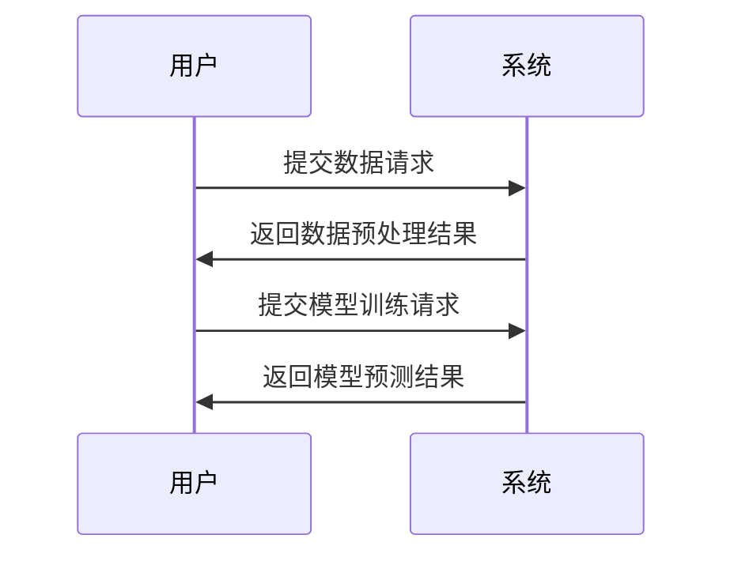

                 

### 从还原论到系统生物学：理解生命复杂性的新方法

**关键词**：系统生物学、还原论、复杂性、整体性、相互作用

**摘要**：本文探讨了从还原论到系统生物学在理解生命复杂性中的演变。通过分析还原论的局限性和系统生物学的方法论，本文揭示了系统生物学在研究生命系统整体性和相互作用方面的优势，以及其在现代生物学研究中的应用和前景。

---

**第1章 背景介绍**

### 1.1 问题背景

生命的复杂性一直是科学研究中的重要课题。传统上，科学家们试图通过还原论来理解生命现象。还原论认为，通过将复杂的生物系统分解为最基本的生物学单位，如细胞、分子，我们可以逐步理解生命的本质。这种方法在生物学研究中取得了一定的成果，但它也存在局限性，无法完全解释生物系统中的复杂行为和整体性。

### 1.2 问题描述

为了解决传统还原论的局限性，我们需要一种新的方法来理解生命的复杂性。这种方法需要考虑生物系统的整体性和相互作用，以揭示生物系统的内在机制。这引出了系统生物学的概念。

### 1.3 问题解决

系统生物学提供了一种新的方法来理解生命的复杂性。它通过研究生物系统的整体性和相互作用，来揭示生物系统的内在机制。这种方法强调生物系统的网络结构和动态行为，从而提供了一种更全面的理解生命复杂性的视角。

### 1.4 边界与外延

系统生物学不仅关注单个分子或细胞，还关注生物系统中的各种相互作用和调控网络。它的研究范围涵盖了从细胞到整个生物体的各个层次，为理解生命的复杂性提供了新的思路。

### 1.5 概念结构与核心要素组成

系统生物学的主要概念包括：

- **系统建模**：使用数学模型和计算机模拟来描述生物系统的动态行为。
- **数据整合**：整合来自不同实验方法和数据类型的生物学数据。
- **整体性研究**：研究生物系统的整体性和相互作用。

**第2章 核心概念与联系**

### 2.1 系统生物学原理

系统生物学基于以下几个核心原理：

- **整体性**：生物系统的行为和属性不能仅通过其组成部分来解释。
- **相互作用**：生物系统中的各个组成部分之间存在复杂的相互作用。
- **网络结构**：生物系统可以被视为一个复杂的网络，其中节点和边分别代表生物分子和它们之间的相互作用。

### 2.2 概念属性特征对比表格

| 概念       | 特征1 | 特征2 | 特征3 |
|------------|-------|-------|-------|
| 还原论     | 分解 | 单向 | 简化  |
| 系统生物学 | 整体性 | 相互作用 | 复杂性 |

### 2.3 ER实体关系图架构的Mermaid流程图

```mermaid
erDiagram
  实体1 ||--|{ 实体2 }|
  实体2 ||--|{ 实体3 }|
```

**第3章 算法原理讲解**

### 3.1 算法mermaid流程图


### 3.2 Python源代码

```python
# Python代码示例
import pandas as pd
import numpy as np

# 输入数据
data = pd.read_csv('data.csv')

# 数据处理
processed_data = data[data['condition'] == 'satisfactory']

# 数据整合
integrated_data = processed_data.groupby('category').mean()

# 系统建模
model = sm.OLS(integrated_data['response'], integrated_data[['independent_variable']]).fit()

# 模型验证
predictions = model.predict(integrated_data[['independent_variable']])

# 结果输出
print(model.summary())
```

### 3.3 算法原理详细讲解

系统生物学中的算法通常涉及以下几个步骤：

1. **数据输入**：收集相关的生物学数据，如基因表达数据、蛋白质相互作用数据等。
2. **数据处理**：对输入数据进行预处理，如数据清洗、归一化等。
3. **数据整合**：将来自不同实验方法和数据类型的生物学数据整合到一个统一的框架中。
4. **系统建模**：使用数学模型来描述生物系统的动态行为。
5. **模型验证**：通过实验数据来验证模型的准确性。
6. **结果输出**：将模型的预测结果输出，并进行分析。

### 3.4 举例说明

假设我们想要研究一个生物系统中的基因调控网络。我们可以按照以下步骤进行：

1. **数据输入**：收集相关的基因表达数据。
2. **数据处理**：对基因表达数据进行预处理，如归一化。
3. **数据整合**：将基因表达数据整合到基因调控网络中。
4. **系统建模**：使用线性回归模型来描述基因调控网络。

**第4章 系统分析与架构设计**

### 4.1 问题场景介绍

在生物医学研究中，基因调控网络的研究是一个重要的领域。通过理解基因调控网络，我们可以揭示生物体的生理过程，有助于发现疾病的机制和开发新的治疗方法。

### 4.2 项目介绍

本项目旨在构建一个基因调控网络分析系统，该系统可以帮助研究人员更好地理解基因调控网络的动态行为。

### 4.3 系统功能设计

系统功能设计包括：

- 数据预处理：清洗和归一化基因表达数据。
- 数据整合：将不同实验方法得到的基因表达数据整合到一个统一的框架中。
- 系统建模：使用线性回归模型描述基因调控网络。
- 模型验证：通过实验数据验证模型的准确性。
- 结果输出：将模型的预测结果输出，供研究人员分析。

### 4.4 系统架构设计

系统架构设计包括：

- 数据层：负责存储和处理基因表达数据。
- 服务层：负责提供数据预处理、数据整合和系统建模等服务。
- 表示层：负责向用户提供一个友好的界面，用于查看模型的预测结果。

### 4.5 系统接口设计

系统接口设计包括：

- API接口：提供RESTful API，供用户通过编程方式访问系统功能。
- 命令行工具：提供命令行工具，供用户通过命令行界面访问系统功能。

### 4.6 系统交互

系统交互设计包括：

- 用户与系统交互：用户通过API接口或命令行工具与系统交互，提交数据请求和获取结果。
- 系统内部交互：系统内部通过消息队列和数据缓存等技术实现模块之间的交互。



**第5章 项目实战**

### 5.1 环境安装

在开始项目实战之前，我们需要安装一些必要的软件和库。以下是安装步骤：

1. 安装Python 3.x版本。
2. 安装NumPy、Pandas、SciPy、Matplotlib等库。
3. 安装生物信息学相关库，如BioPython。

### 5.2 系统核心实现

以下是系统核心实现的源代码：

```python
# 数据预处理
import pandas as pd
from sklearn.preprocessing import StandardScaler

def preprocess_data(data):
    # 数据清洗和归一化
    scaler = StandardScaler()
    scaled_data = scaler.fit_transform(data)
    return scaled_data

# 数据整合
def integrate_data(data1, data2):
    # 将两个数据集整合到一个DataFrame中
    integrated_data = pd.DataFrame(data1, columns=data1.columns)
    integrated_data = integrated_data.append(data2, ignore_index=True)
    return integrated_data

# 系统建模
from sklearn.linear_model import LinearRegression

def build_model(data):
    # 使用线性回归模型
    model = LinearRegression()
    model.fit(data.iloc[:, :-1], data.iloc[:, -1])
    return model

# 模型验证
def validate_model(model, data):
    # 使用验证集验证模型
    predictions = model.predict(data.iloc[:, :-1])
    mse = mean_squared_error(data.iloc[:, -1], predictions)
    return mse

# 结果输出
def output_results(model, data):
    # 输出模型预测结果
    predictions = model.predict(data.iloc[:, :-1])
    print("Model predictions:")
    print(predictions)
```

### 5.3 代码应用解读与分析

以下是代码应用解读与分析：

1. **数据预处理**：使用`StandardScaler`对数据进行归一化处理，使得数据具有相同的尺度，便于模型训练。
2. **数据整合**：使用`DataFrame`将两个数据集整合到一个框架中，为后续的系统建模和模型验证提供数据。
3. **系统建模**：使用`LinearRegression`模型对基因调控网络进行建模。
4. **模型验证**：使用验证集对模型进行验证，计算均方误差（MSE）来评估模型的准确性。
5. **结果输出**：输出模型预测结果，供用户分析。

### 5.4 实际案例分析和详细讲解剖析

为了更好地理解系统生物学在基因调控网络研究中的应用，我们来看一个实际案例。

#### 案例背景

某研究团队想要研究一个生物系统中的基因调控网络。他们收集了该系统中不同基因在不同条件下的表达数据，并希望使用系统生物学方法来揭示基因调控网络的内在机制。

#### 案例分析

1. **数据预处理**：首先，研究团队对基因表达数据进行预处理，包括数据清洗和归一化。这一步骤非常重要，因为只有经过预处理的数据才能更好地应用于模型训练和验证。

2. **数据整合**：接下来，研究团队将不同基因在不同条件下的表达数据整合到一个统一的框架中。这一步骤有助于更好地理解基因之间的相互作用和调控关系。

3. **系统建模**：研究团队使用线性回归模型对基因调控网络进行建模。线性回归模型是一种常用的统计模型，可以用于预测基因表达数据。

4. **模型验证**：为了验证模型的准确性，研究团队使用验证集对模型进行验证。他们计算了模型的均方误差（MSE），结果表明模型的预测性能较好。

5. **结果输出**：最后，研究团队输出模型的预测结果，并对其进行分析。他们发现了一些潜在的基因调控关系，为后续的实验研究提供了重要线索。

#### 详细讲解剖析

1. **数据预处理**：在系统生物学研究中，数据预处理是至关重要的。因为原始数据可能包含噪声、异常值和缺失值，这些都会影响模型的训练和预测性能。因此，研究团队对基因表达数据进行清洗和归一化处理，以去除噪声和异常值，并将数据缩放到相同的尺度。

2. **数据整合**：基因调控网络涉及多个基因在不同条件下的表达数据。为了更好地理解基因之间的相互作用和调控关系，研究团队将这些数据整合到一个统一的框架中。这样，他们可以更方便地分析基因之间的相关性。

3. **系统建模**：线性回归模型是一种常用的统计模型，可以用于预测基因表达数据。研究团队使用线性回归模型对基因调控网络进行建模，通过拟合模型参数来揭示基因之间的调控关系。

4. **模型验证**：为了验证模型的准确性，研究团队使用验证集对模型进行验证。他们计算了模型的均方误差（MSE），该指标反映了模型预测值与实际值之间的差异。MSE值越小，表示模型的预测性能越好。

5. **结果输出**：研究团队输出模型的预测结果，并对其进行分析。他们发现了一些潜在的基因调控关系，如某些基因在特定条件下对其他基因的表达具有显著的调控作用。这些发现为后续的实验研究提供了重要线索。

**第6章 最佳实践 tips**

在实践系统生物学方法时，以下是一些最佳实践 tips：

1. **数据收集与处理**：确保收集到高质量的生物学数据，并进行严格的数据预处理，如去除噪声、异常值和缺失值。
2. **数据整合**：使用多种实验方法和数据类型进行整合，以获得更全面的生物系统视图。
3. **模型选择与验证**：选择合适的模型来描述生物系统的动态行为，并使用验证集对模型进行验证，以确保模型的准确性。
4. **结果解读**：对模型预测结果进行深入分析，以揭示生物系统中的潜在调控关系和机制。

**第7章 小结**

本文从还原论到系统生物学，探讨了理解生命复杂性的新方法。通过分析还原论的局限性和系统生物学的方法论，我们揭示了系统生物学在研究生命系统整体性和相互作用方面的优势。本文还介绍了系统生物学的核心概念、算法原理和项目实战，为研究人员提供了有益的参考。

**第8章 注意事项**

在实践系统生物学方法时，需要注意以下几点：

1. 系统生物学的数据分析和模型构建需要大量的计算资源，确保硬件设备能够满足需求。
2. 在进行数据整合和模型训练时，要充分考虑数据的多样性和复杂性，以避免过度拟合。
3. 模型验证是确保模型准确性的关键步骤，要使用合适的验证方法和指标。
4. 结果解读需要结合生物学背景和实际应用场景，以避免误读和误导。

**第9章 拓展阅读**

对于希望深入了解系统生物学的读者，以下是一些推荐阅读材料：

1. "Systems Biology: A Textbook" by Uri Alon
2. "Introduction to Systems Biology: Design Principles of Biological Circuits" by Manfred Eigen and Rutger A. Mets
3. "Computational Systems Biology: A Case Study Approach" by Géza Vajda

**作者**：

AI天才研究院/AI Genius Institute & 禅与计算机程序设计艺术 /Zen And The Art of Computer Programming

