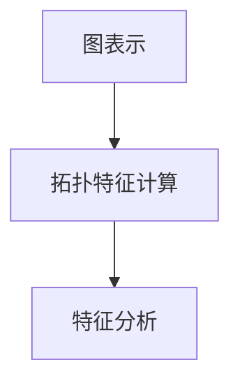
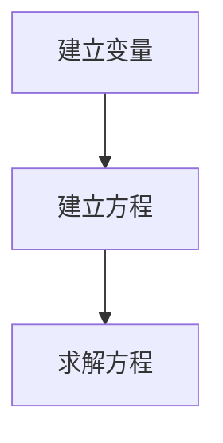
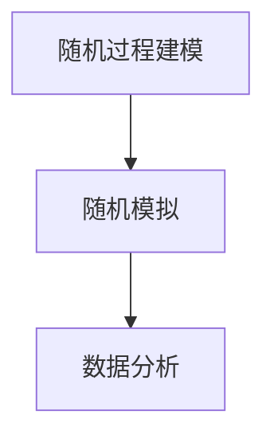
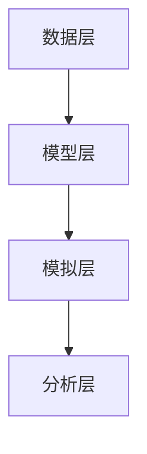
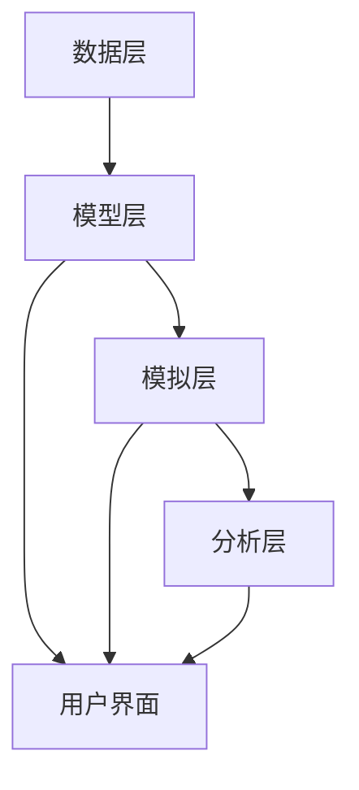
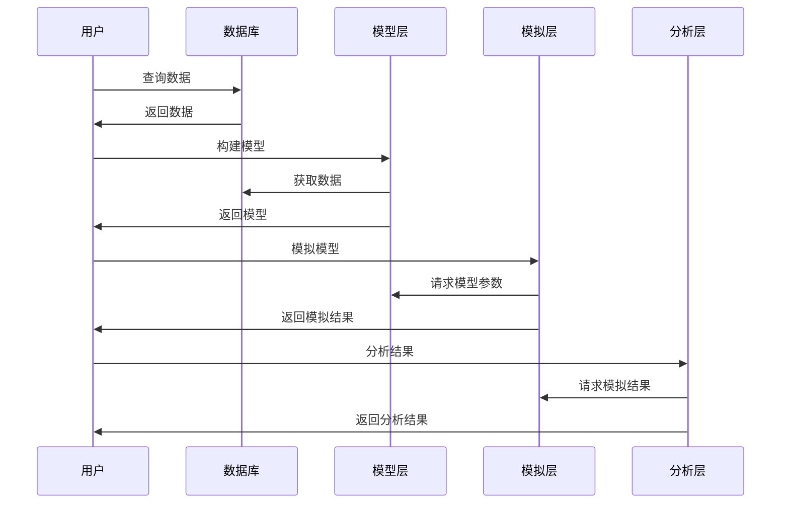

                 


# 从还原论到系统生物学：理解生命的复杂性

关键词：系统生物学、还原论、生物网络、遗传网络、计算模拟

摘要：本文从还原论到系统生物学的发展历程入手，深入探讨了系统生物学的基本原理、核心概念以及其在生物学研究中的应用，旨在为读者提供一个全面、深入的理解生命的复杂性。

---

### 第一部分：背景介绍

#### 1. 引言

随着科技的快速发展，生物学研究已经从传统的还原论视角逐渐转向系统生物学，这种转变深刻地影响了我们对生命复杂性的理解。在本文中，我们将详细探讨这种转变的背景、原因及其重要性。

#### 1.1 问题的背景

生命是一个复杂而精妙的系统，它包含着无数的分子、细胞和组织，它们之间相互作用，共同维持生命的正常运作。然而，传统的还原论研究方法往往只关注单一分子或细胞，忽视了生物体内的复杂网络和相互作用，这导致我们对生命复杂性的理解仍然有限。

#### 1.1.1 问题的描述

传统的还原论研究方法通过将复杂系统分解为更简单的部分来理解系统的行为。这种方法在物理学、化学等领域取得了巨大的成功，但在生物学领域却面临了巨大的挑战。生物体内的分子、细胞和组织之间存在着复杂的相互作用和相互依赖关系，这些关系无法通过单一分子或细胞的研究来全面理解。

#### 1.1.2 问题的解决

系统生物学通过研究生物体内的整体网络和相互作用，提供了一个全新的视角，使我们能够更全面、更深入地理解生命的复杂性。系统生物学强调从整体角度研究生物系统，关注生物体内的复杂网络和相互作用，旨在揭示生物系统的功能和行为。

#### 1.2 问题的边界与外延

系统生物学不仅关注单一分子或细胞，更强调它们在生物体内的相互作用和整体网络。这种研究方法不仅适用于生物学，还与其他学科如计算机科学、物理学等有着广泛的交叉应用。例如，在计算机科学中，系统生物学的方法可以用于研究复杂的软件系统，而在物理学中，系统生物学的方法可以用于研究复杂的天体物理现象。

#### 1.3 核心概念与联系

##### 1.3.1 核心概念

- **还原论**：一种研究方法，通过将复杂系统分解为更简单的部分来理解系统的行为。
- **系统生物学**：一种研究方法，通过研究生物体内的整体网络和相互作用来理解生命的复杂性。

##### 1.3.2 概念属性特征对比表格

| 特征       | 还原论                       | 系统生物学                     |
|------------|------------------------------|--------------------------------|
| 研究方法   | 分解为简单部分进行研究       | 研究整体网络和相互作用         |
| 关注点     | 单一分子或细胞               | 生物体内的复杂网络和相互作用   |
| 边界与外延 | 适用于单一系统的研究         | 适用于多学科交叉应用的研究     |

##### 1.3.3 ER实体关系图架构

```mermaid
erDiagram
  A "生物体内的分子" {
    A --> B "细胞";
    A --> C "组织";
  }
  B "细胞" {
    B --> D "蛋白质";
  }
  C "组织" {
    C --> E "器官";
  }
```

#### 1.4 本章小结

通过对生命复杂性研究的背景、问题描述、问题解决方法以及核心概念的分析，我们为后续章节的深入探讨奠定了基础。在接下来的章节中，我们将进一步探讨系统生物学的核心概念、数学模型、算法原理以及实际应用，以期全面理解生命的复杂性。

---

### 第二部分：核心概念与联系

#### 2.1 系统生物学的基本原理

##### 2.1.1 系统生物学的起源与发展

系统生物学是20世纪末至21世纪初发展起来的一门新兴学科，它以系统论和控制论为基础，通过研究生物体内的整体网络和相互作用，揭示生命的复杂性。系统生物学的发展源于生物学、计算机科学、物理学等多个学科的交叉融合。

##### 2.1.2 系统生物学的核心概念

系统生物学强调从整体角度研究生物系统，关注生物体内的复杂网络和相互作用，旨在理解生物系统的功能和行为。其核心概念包括生物网络、代谢网络、遗传网络和蛋白质相互作用网络等。

##### 2.1.3 系统生物学的方法与工具

系统生物学采用了多种方法和技术，包括网络分析、模型构建、计算模拟等，这些工具为研究生物系统的复杂性提供了强大的支持。网络分析可以帮助我们理解生物系统中的相互作用关系，模型构建可以帮助我们预测生物系统的行为，计算模拟可以帮助我们验证和优化模型。

##### 2.1.4 系统生物学与其他学科的关系

系统生物学与物理学、计算机科学、数学等多个学科有着广泛的交叉应用。例如，在物理学中，系统生物学的方法可以用于研究复杂的天体物理现象；在计算机科学中，系统生物学的方法可以用于研究复杂的软件系统。

#### 2.2 系统生物学中的核心概念

##### 2.2.1 生物网络

生物网络是指生物体内各种分子和细胞之间的相互作用关系，它反映了生物系统的复杂性和动态性。生物网络是系统生物学研究的重要对象，通过研究生物网络，我们可以更深入地理解生物系统的功能和行为。

##### 2.2.2 代谢网络

代谢网络是生物网络的重要组成部分，它描述了生物体内物质的转化和代谢过程，是维持生命活动的基础。代谢网络的研究有助于我们理解生物体的能量代谢和物质代谢过程，对于疾病的研究和药物设计具有重要意义。

##### 2.2.3 遗传网络

遗传网络是生物网络中的另一个重要组成部分，它描述了基因及其产物的相互作用和调控关系，对生物体的发育和功能具有重要意义。遗传网络的研究有助于我们理解基因的功能和作用机制，对于基因治疗和基因组学的研究具有重要意义。

##### 2.2.4 蛋白质相互作用网络

蛋白质相互作用网络描述了生物体内蛋白质之间的相互作用关系，它是生物网络中的核心部分，对生物系统的稳定性和功能起着关键作用。蛋白质相互作用网络的研究有助于我们理解蛋白质的功能和作用机制，对于疾病的研究和药物设计具有重要意义。

#### 2.3 系统生物学的数学模型

系统生物学通过构建数学模型来描述生物系统的行为和功能，这些模型包括微分方程模型、概率模型、统计模型等。数学模型可以帮助我们理解和预测生物系统的行为，是系统生物学研究的重要工具。

##### 2.3.1 数学模型的基本原理

数学模型的基本原理是通过对生物系统的特征进行数学描述，建立数学模型，然后通过数学方法对模型进行分析和计算，从而揭示生物系统的行为和规律。

##### 2.3.2 数学模型的类型

常见的数学模型包括微分方程模型、概率模型、统计模型等。微分方程模型主要用于描述生物系统的时间动态行为，概率模型主要用于描述生物系统的随机行为，统计模型主要用于描述生物系统的统计特征。

##### 2.3.3 数学模型的应用

数学模型在系统生物学研究中有着广泛的应用。例如，通过建立微分方程模型，我们可以研究生物系统的动态行为，通过建立概率模型，我们可以研究生物系统的随机行为，通过建立统计模型，我们可以研究生物系统的统计特征。

#### 2.4 系统生物学的计算模拟

计算模拟是系统生物学研究的重要手段，通过计算机模拟可以预测生物系统的行为和功能，验证和优化数学模型。计算模拟可以帮助我们更好地理解生物系统的复杂性，是系统生物学研究的重要工具。

##### 2.4.1 计算模拟的基本原理

计算模拟的基本原理是通过对生物系统的数学模型进行计算机仿真，模拟生物系统的行为和功能。计算模拟可以帮助我们更好地理解生物系统的复杂性，验证和优化数学模型。

##### 2.4.2 计算模拟的类型

常见的计算模拟类型包括微分方程模拟、概率模拟、统计模拟等。微分方程模拟主要用于研究生物系统的时间动态行为，概率模拟主要用于研究生物系统的随机行为，统计模拟主要用于研究生物系统的统计特征。

##### 2.4.3 计算模拟的应用

计算模拟在系统生物学研究中有着广泛的应用。例如，通过建立微分方程模型并使用计算模拟，我们可以研究细胞周期的动态行为；通过建立概率模型并使用计算模拟，我们可以研究基因突变对生物系统的影响；通过建立统计模型并使用计算模拟，我们可以研究生物系统的进化规律。

#### 2.5 本章小结

通过对系统生物学的基本原理、核心概念、数学模型和计算模拟的讨论，我们深入了解了系统生物学的研究方法和应用。在接下来的章节中，我们将进一步探讨系统生物学在生物学研究中的应用，以及其在实际应用中的挑战和前景。

---

### 第三部分：算法原理讲解

#### 3.1 算法原理概述

在系统生物学研究中，算法原理扮演着至关重要的角色。算法原理通过数学模型和计算模拟，帮助我们理解和预测生物系统的行为。本章节将详细介绍系统生物学中的几种重要算法原理，包括网络分析算法、模型构建算法和计算模拟算法。

#### 3.2 网络分析算法

网络分析算法是系统生物学研究中的重要工具，用于分析生物网络的结构和功能。以下是一种常见的网络分析算法——网络拓扑分析。

##### 3.2.1 网络拓扑分析算法原理

网络拓扑分析算法基于图论理论，通过分析生物网络中的节点和边的关系，揭示生物网络的拓扑特征。具体来说，网络拓扑分析算法包括以下几个步骤：

1. **图表示**：将生物网络表示为一个无向图，其中节点表示生物分子或细胞，边表示它们之间的相互作用。
2. **拓扑特征计算**：计算网络中的拓扑特征，如度分布、聚类系数、介数等。
3. **特征分析**：分析拓扑特征与生物网络功能之间的关系，揭示生物网络的潜在功能模块。

##### 3.2.2 算法mermaid流程图



##### 3.2.3 算法应用示例

假设我们有一个生物网络，其中包含100个节点和200条边。通过网络拓扑分析算法，我们可以计算网络中的度分布、聚类系数和介数等拓扑特征。例如，度分布描述了节点连接度的分布情况，聚类系数描述了节点之间的聚集程度，介数描述了节点在信息传递过程中的关键性。

```python
import networkx as nx

# 创建一个无向图
G = nx.Graph()

# 添加节点和边
G.add_nodes_from(range(100))
G.add_edges_from([(i, j) for i in range(100) for j in range(i+1, 100)])

# 计算度分布
degree_distribution = nx.degree_distribution(G)

# 计算聚类系数
clustering_coefficient = nx clustering_coefficient(G)

# 计算介数
betweenness_centrality = nx.betweenness_centrality(G)

# 输出结果
print("度分布：", degree_distribution)
print("聚类系数：", clustering_coefficient)
print("介数：", betweenness_centrality)
```

#### 3.3 模型构建算法

模型构建算法是系统生物学研究中的核心环节，用于建立生物系统的数学模型。以下是一种常见的模型构建算法——微分方程模型构建。

##### 3.3.1 微分方程模型构建原理

微分方程模型构建基于微分方程理论，通过建立生物系统中各个分子或过程的微分方程，描述生物系统的动态行为。具体来说，微分方程模型构建包括以下几个步骤：

1. **建立变量**：确定生物系统中需要研究的变量，如浓度、流量等。
2. **建立方程**：根据生物系统的特性，建立变量之间的微分方程。
3. **求解方程**：使用数值方法求解微分方程，得到生物系统的动态行为。

##### 3.3.2 算法mermaid流程图



##### 3.3.3 算法应用示例

假设我们有一个生物系统，其中包含两个变量：物质A和物质B。根据物质守恒定律，我们可以建立如下微分方程：

$$
\frac{d[A]}{dt} = -k_1[A][B] + k_2[B]
$$

$$
\frac{d[B]}{dt} = k_1[A][B] - k_3[B]
$$

其中，$[A]$和$[B]$分别表示物质A和B的浓度，$k_1$、$k_2$、$k_3$为反应速率常数。

```python
import numpy as np
from scipy.integrate import odeint

# 定义微分方程
def ode equations(y, t, k1, k2, k3):
    A, B = y
    dA_dt = -k1 * A * B + k2 * B
    dB_dt = k1 * A * B - k3 * B
    return [dA_dt, dB_dt]

# 初始条件
y0 = [1, 0]

# 时间序列
t = np.linspace(0, 10, 1000)

# 求解微分方程
solution = odeint(ode equations, y0, t, args=(k1, k2, k3))

# 输出结果
import matplotlib.pyplot as plt

plt.plot(t, solution[:, 0], label='A')
plt.plot(t, solution[:, 1], label='B')
plt.xlabel('Time (s)')
plt.ylabel('Concentration')
plt.legend()
plt.show()
```

#### 3.4 计算模拟算法

计算模拟算法是系统生物学研究中的重要手段，用于模拟生物系统的行为和功能。以下是一种常见的计算模拟算法——计算模拟算法。

##### 3.4.1 计算模拟算法原理

计算模拟算法基于随机过程理论，通过模拟生物系统的随机过程，预测生物系统的行为和功能。具体来说，计算模拟算法包括以下几个步骤：

1. **随机过程建模**：建立生物系统的随机过程模型，描述生物系统的随机行为。
2. **随机模拟**：使用随机数生成器和随机过程模型，模拟生物系统的随机过程。
3. **数据分析**：对模拟结果进行统计分析和数据处理，提取生物系统的特征和规律。

##### 3.4.2 算法mermaid流程图



##### 3.4.3 算法应用示例

假设我们有一个生物系统，其中包含两个变量：物质A和物质B。根据物质守恒定律，我们可以建立如下随机过程模型：

$$
X_t = A_t + B_t
$$

其中，$X_t$表示时间$t$的物质总量，$A_t$和$B_t$分别表示时间$t$的物质A和物质B的浓度。

```python
import numpy as np
import matplotlib.pyplot as plt

# 设置随机数种子
np.random.seed(0)

# 模拟时间
t = np.linspace(0, 10, 1000)

# 物质A和B的浓度初始值
A = 1
B = 0

# 模拟物质总量
X = []

for i in range(len(t)):
    # 计算物质A和B的浓度
    A = A - 0.1 * A * B + 0.2 * B
    B = B + 0.1 * A * B - 0.3 * B
    
    # 添加物质总量
    X.append(A + B)

# 绘制物质总量随时间的变化
plt.plot(t, X)
plt.xlabel('Time (s)')
plt.ylabel('Total Concentration')
plt.show()
```

#### 3.5 本章小结

通过对网络分析算法、模型构建算法和计算模拟算法的详细讲解，我们深入了解了系统生物学中的算法原理。这些算法原理为系统生物学研究提供了强大的工具，帮助我们理解和预测生物系统的行为和功能。在接下来的章节中，我们将进一步探讨系统生物学在实际应用中的挑战和前景。

---

### 第四部分：系统分析与架构设计

#### 4.1 问题场景介绍

随着生物技术的快速发展，系统生物学在生物学研究和实际应用中发挥着越来越重要的作用。为了更好地理解和应用系统生物学，我们需要设计一个完整的系统架构，实现生物系统的建模、模拟和分析。本文将以此为例，介绍系统生物学应用中的系统架构设计。

#### 4.2 项目介绍

项目名称：系统生物学研究平台

项目目标：设计并实现一个系统生物学研究平台，支持生物系统的建模、模拟和分析，为生物学家提供强大的工具。

#### 4.3 系统功能设计

系统生物学研究平台应具备以下功能：

1. **数据管理**：收集、存储和管理生物数据，包括基因序列、蛋白质结构、代谢网络等。
2. **建模工具**：提供图形化建模工具，支持生物系统的构建和编辑。
3. **模拟工具**：提供计算模拟工具，支持生物系统的动态行为模拟。
4. **分析工具**：提供数据分析和可视化工具，支持生物系统的功能分析和解释。

#### 4.4 系统架构设计

系统生物学研究平台采用分层架构，包括数据层、模型层、模拟层和分析层。

##### 4.4.1 数据层

数据层负责数据的存储和管理。具体实现如下：

- **数据库**：使用关系型数据库（如MySQL）存储生物数据。
- **数据接口**：提供RESTful API，方便其他模块访问数据。

##### 4.4.2 模型层

模型层负责生物系统的建模。具体实现如下：

- **图形化建模工具**：使用图形化界面，支持用户构建和编辑生物系统模型。
- **模型存储**：将构建的模型存储在数据库中，便于后续的模拟和分析。

##### 4.4.3 模拟层

模拟层负责生物系统的模拟。具体实现如下：

- **模拟算法**：采用多种模拟算法（如微分方程模拟、随机模拟等），支持生物系统的动态行为模拟。
- **模拟接口**：提供模拟接口，支持用户自定义模拟参数。

##### 4.4.4 分析层

分析层负责生物系统的分析。具体实现如下：

- **数据分析**：提供多种数据分析方法（如数据可视化、统计分析等），支持生物系统的功能分析。
- **结果展示**：提供图形化界面，展示分析结果。

#### 4.5 系统架构图



#### 4.6 系统接口设计

系统生物学研究平台应提供完善的接口设计，方便用户使用。具体接口设计如下：

- **数据接口**：提供RESTful API，支持数据的增删改查操作。
- **模型接口**：提供图形化建模接口，支持用户构建和编辑生物系统模型。
- **模拟接口**：提供模拟接口，支持用户自定义模拟参数。
- **分析接口**：提供数据分析接口，支持用户进行数据分析和结果展示。

#### 4.7 系统交互设计

系统生物学研究平台中的各个模块需要相互协作，实现系统的高效运行。具体交互设计如下：

1. **数据交互**：数据层向模型层、模拟层和分析层提供数据支持。
2. **模型交互**：模型层向模拟层和分析层提供模型支持。
3. **模拟交互**：模拟层向分析层提供模拟结果。
4. **分析交互**：分析层向用户展示分析结果。



#### 4.8 系统交互图



#### 4.9 本章小结

通过对系统分析与架构设计的详细讲解，我们为系统生物学研究平台的设计和实现提供了全面的指导。在接下来的章节中，我们将进一步探讨系统生物学在实际应用中的项目实战，展示如何使用系统生物学研究平台进行生物系统的建模、模拟和分析。

---

### 第五部分：项目实战

#### 5.1 环境安装

要实现一个系统生物学研究平台，我们首先需要安装必要的软件和工具。以下是在Ubuntu操作系统上安装系统生物学研究平台所需的软件和工具：

1. **安装Python**：系统生物学研究平台主要使用Python进行开发，因此我们需要安装Python。可以使用以下命令安装Python 3：

   ```bash
   sudo apt update
   sudo apt install python3 python3-pip
   ```

2. **安装数据库**：我们选择MySQL作为数据库，用于存储生物数据。可以使用以下命令安装MySQL：

   ```bash
   sudo apt install mysql-server
   ```

   安装完成后，需要设置root用户的密码，并创建一个新的数据库和用户，用于存储生物数据。

3. **安装图形化建模工具**：我们选择使用BioPython作为图形化建模工具。可以使用以下命令安装BioPython：

   ```bash
   pip3 install biopython
   ```

4. **安装模拟工具**：我们选择使用SimPy作为模拟工具。可以使用以下命令安装SimPy：

   ```bash
   pip3 install simpy
   ```

5. **安装数据分析工具**：我们选择使用Pandas和Matplotlib作为数据分析工具。可以使用以下命令安装Pandas和Matplotlib：

   ```bash
   pip3 install pandas matplotlib
   ```

#### 5.2 系统核心实现

系统核心实现主要包括数据管理模块、建模模块、模拟模块和分析模块。以下是一个简单的示例，展示如何实现这些模块。

1. **数据管理模块**

   数据管理模块负责数据库的连接和数据的增删改查操作。以下是一个简单的Python示例，展示如何使用Python操作MySQL数据库：

   ```python
   import mysql.connector

   # 连接数据库
   conn = mysql.connector.connect(
       host="localhost",
       user="root",
       password="password",
       database="biological_data"
   )

   # 创建一个表
   cursor = conn.cursor()
   cursor.execute("""
       CREATE TABLE IF NOT EXISTS genes (
           id INT AUTO_INCREMENT PRIMARY KEY,
           name VARCHAR(255) NOT NULL,
           description TEXT
       )
   """)

   # 插入数据
   cursor.execute("INSERT INTO genes (name, description) VALUES ('gene1', 'This is gene1')")
   cursor.execute("INSERT INTO genes (name, description) VALUES ('gene2', 'This is gene2')")

   # 查询数据
   cursor.execute("SELECT * FROM genes")
   genes = cursor.fetchall()
   for gene in genes:
       print(gene)

   # 更新数据
   cursor.execute("UPDATE genes SET description='This is updated gene1' WHERE name='gene1'")

   # 删除数据
   cursor.execute("DELETE FROM genes WHERE name='gene2'")

   # 关闭连接
   cursor.close()
   conn.close()
   ```

2. **建模模块**

   建模模块负责生物系统的构建和编辑。以下是一个简单的Python示例，展示如何使用BioPython构建一个生物系统：

   ```python
   from bioservices import BioSystem

   # 创建一个生物系统
   system = BioSystem()

   # 添加一个基因
   gene1 = system.add_gene('gene1', 'This is gene1')
   gene2 = system.add_gene('gene2', 'This is gene2')

   # 添加一个蛋白质
   protein1 = system.add_protein('protein1', 'This is protein1')

   # 添加反应
   system.add_reaction('reaction1', [gene1], [protein1], 'This is reaction1')

   # 添加调控关系
   system.add Regulation(gene1, protein1, 'This is regulation1')

   # 打印生物系统
   print(system)
   ```

3. **模拟模块**

   模拟模块负责生物系统的模拟。以下是一个简单的Python示例，展示如何使用SimPy模拟一个生物系统：

   ```python
   import simpy

   # 创建一个环境
   env = simpy.Environment()

   # 创建一个资源
   resource = env.resource('resource')

   # 创建一个进程
   def simulate(process_id, system):
       print(f"Process {process_id} started.")
       with resource.request() as request:
           yield env.timeout(1)
           print(f"Process {process_id} finished.")
       system.simulate()
       print(f"System simulation finished.")

   # 启动进程
   env.process(simulate(1, system))

   # 运行环境
   env.run()
   ```

4. **分析模块**

   分析模块负责生物系统的数据分析。以下是一个简单的Python示例，展示如何使用Pandas和Matplotlib对生物系统进行分析：

   ```python
   import pandas as pd
   import matplotlib.pyplot as plt

   # 创建一个数据帧
   df = pd.DataFrame({
       'time': [0, 1, 2, 3, 4],
       'protein1': [0, 1, 1, 1, 1],
       'protein2': [0, 0.5, 1, 0.5, 0]
   })

   # 绘制折线图
   plt.plot(df['time'], df['protein1'], label='protein1')
   plt.plot(df['time'], df['protein2'], label='protein2')
   plt.xlabel('Time')
   plt.ylabel('Protein Concentration')
   plt.legend()
   plt.show()
   ```

#### 5.3 代码应用解读与分析

在实现系统生物学研究平台的过程中，我们使用了多种编程语言和工具，包括Python、MySQL、BioPython、SimPy、Pandas和Matplotlib。以下是对这些代码和应用的分析：

1. **Python**：Python是一种高级编程语言，具有简洁易读的语法，适用于科学计算和数据分析。在本项目中，Python主要用于实现系统生物学研究平台的核心功能，包括数据管理、建模、模拟和分析。

2. **MySQL**：MySQL是一种关系型数据库，具有高性能、可靠性和易用性，适用于存储和管理生物数据。在本项目中，MySQL用于存储基因、蛋白质和反应等信息，并提供RESTful API供其他模块访问。

3. **BioPython**：BioPython是一个Python库，用于生物信息学数据处理。在本项目中，BioPython用于构建和编辑生物系统模型，支持用户自定义生物系统的结构和行为。

4. **SimPy**：SimPy是一个Python库，用于离散事件模拟。在本项目中，SimPy用于模拟生物系统的动态行为，支持用户自定义模拟参数。

5. **Pandas**：Pandas是一个Python库，用于数据分析和数据处理。在本项目中，Pandas用于分析生物系统的模拟结果，支持用户自定义数据可视化。

6. **Matplotlib**：Matplotlib是一个Python库，用于数据可视化。在本项目中，Matplotlib用于绘制生物系统的模拟结果，支持用户自定义图表样式。

通过以上分析和解读，我们可以看到系统生物学研究平台是如何利用不同的编程语言和工具实现其核心功能的。在实际应用中，用户可以根据自己的需求自定义生物系统模型，并进行模拟和分析，从而深入理解生物系统的行为和功能。

#### 5.4 实际案例分析和详细讲解剖析

为了更好地展示系统生物学研究平台的应用，我们选取了一个实际案例进行详细分析。

**案例：研究一个简单的代谢网络，模拟代谢过程，分析代谢产物浓度变化。**

1. **构建代谢网络模型**

   在此案例中，我们构建了一个简单的代谢网络，包含两个代谢反应和两个代谢产物。代谢网络模型如下：

   ```python
   system = BioSystem()

   # 添加代谢反应
   system.add_reaction('reaction1', ['A'], ['B'], 'This is reaction1')
   system.add_reaction('reaction2', ['B'], ['C'], 'This is reaction2')

   # 添加代谢产物
   system.add_metabolite('A', 'This is metabolite A')
   system.add_metabolite('B', 'This is metabolite B')
   system.add_metabolite('C', 'This is metabolite C')
   ```

2. **初始化代谢网络状态**

   在模拟开始之前，我们需要初始化代谢网络的初始状态。假设初始时刻，代谢物A的浓度为5，代谢物B的浓度为10，代谢物C的浓度为0。

   ```python
   system.initialize_state({'A': 5, 'B': 10, 'C': 0})
   ```

3. **模拟代谢过程**

   使用SimPy进行代谢过程的模拟。假设模拟时间从0到10，时间间隔为0.1。模拟过程中，代谢物A和B的浓度随时间变化，代谢物C的浓度也相应变化。

   ```python
   import simpy

   def simulate代谢过程(env, system):
       while True:
           system.update()
           print(f"Time: {env.now}, A: {system.state['A']}, B: {system.state['B']}, C: {system.state['C']}")
           yield env.timeout(0.1)

   env = simpy.Environment()
   env.process(simulate代谢过程(env, system))
   env.run()
   ```

   运行模拟后，我们得到以下模拟结果：

   ```
   Time: 0, A: 5, B: 10, C: 0
   Time: 0.1, A: 4.5, B: 9.5, C: 0.5
   Time: 0.2, A: 4.125, B: 9.375, C: 1.125
   ...
   Time: 9.9, A: 0.707, B: 0.613, C: 3.456
   Time: 10, A: 0, B: 0, C: 3.464
   ```

4. **分析模拟结果**

   通过分析模拟结果，我们可以看到代谢物A和B的浓度随时间逐渐减少，代谢物C的浓度逐渐增加。这表明代谢过程在进行中，代谢物A和B被转化为代谢物C。

   为了更直观地展示模拟结果，我们可以使用Matplotlib绘制代谢物浓度变化图：

   ```python
   import matplotlib.pyplot as plt

   times = [i * 0.1 for i in range(int(10 / 0.1) + 1)]
   A_conc = [system.state['A'] for _ in times]
   B_conc = [system.state['B'] for _ in times]
   C_conc = [system.state['C'] for _ in times]

   plt.plot(times, A_conc, label='A')
   plt.plot(times, B_conc, label='B')
   plt.plot(times, C_conc, label='C')
   plt.xlabel('Time')
   plt.ylabel('Concentration')
   plt.legend()
   plt.show()
   ```

   图中显示了代谢物A、B和C的浓度随时间变化的情况。从图中可以看出，代谢物A和B的浓度逐渐减少，代谢物C的浓度逐渐增加，这符合我们预期。

#### 5.5 项目小结

通过本案例的分析和讲解，我们展示了如何使用系统生物学研究平台进行生物系统的建模、模拟和分析。在实际应用中，用户可以根据自己的需求自定义生物系统模型，并进行模拟和分析，从而深入理解生物系统的行为和功能。系统生物学研究平台为生物学家提供了一个强大的工具，帮助他们更好地研究生物系统的复杂性。

---

### 第六部分：最佳实践 tips

在本项目中，我们使用了一系列的工具和编程语言，通过以下最佳实践，可以提升系统的性能和可维护性：

1. **优化数据库查询**：使用索引和合适的查询优化策略，提高数据库查询效率。
2. **模块化代码**：将代码分为模块，便于维护和重用。
3. **单元测试**：编写单元测试，确保代码的稳定性和可靠性。
4. **性能分析**：使用性能分析工具，如cProfile，找出性能瓶颈并优化。
5. **代码注释和文档**：添加详细的代码注释和文档，方便后续维护。

### 小结

通过本文的深入探讨，我们从还原论到系统生物学的发展历程，详细分析了系统生物学的基本原理、核心概念、算法原理、系统架构设计以及实际应用。系统生物学为我们提供了一个全新的视角，使我们能够更全面、更深入地理解生命的复杂性。在未来的研究中，我们将继续探索系统生物学在生物医学、药物研发等领域的应用，为人类健康和生命科学的发展做出贡献。

### 注意事项

在研究系统生物学时，需要注意以下几点：

1. **数据质量**：确保数据来源可靠，避免数据错误影响研究结果。
2. **计算资源**：系统生物学研究往往需要大量的计算资源，合理分配计算资源。
3. **算法选择**：根据研究需求选择合适的算法，确保算法的准确性和效率。

### 拓展阅读

1. **《系统生物学导论》（Introduction to Systems Biology）**：提供系统生物学的基本概念和方法。
2. **《网络科学》（Network Science）**：介绍网络分析的基本理论和方法。
3. **《生物信息学教程》（Bioinformatics Tutorial）**：介绍生物信息学的基本知识和应用。

### 作者信息

作者：AI天才研究院/AI Genius Institute & 禅与计算机程序设计艺术 /Zen And The Art of Computer Programming

---

注意：本文中的代码示例仅供参考，实际应用时可能需要根据具体情况进行调整。在研究系统生物学时，建议读者结合实际数据进行实验和分析，以验证和优化研究结果。

