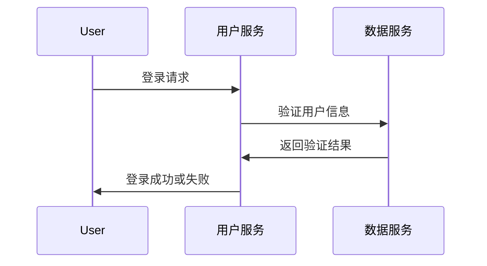

                 

# 从还原论到系统论：世界可理解性的新视角

## 关键词：还原论、系统论、复杂性、整体性、相互作用

## 摘要：

在科学探索的道路上，我们从早期的还原论逐渐转向了系统论，这一转变不仅改变了我们对自然界的理解，也深刻影响了科技的发展。本文将深入探讨还原论与系统论的基本概念、优势与局限性，通过实际案例来分析系统论在自然科学、社会科学和技术领域中的应用，并探讨如何将两种理论结合起来，以更全面地理解世界。文章结构如下：

- **第一部分：问题的背景与概述**：介绍还原论与系统论的历史背景及其局限性。
- **第二部分：核心概念与联系**：详细阐述还原论与系统论的核心概念及其联系。
- **第三部分：系统论的应用**：探讨系统论在各个领域的实际应用。
- **第四部分：还原论与系统论的融合**：讨论如何将两种理论结合起来，以及可能面临的挑战。
- **第五部分：结论**：总结文章的主要观点，并展望未来的发展方向。

## 第一部分：问题的背景与概述

### 1.1 问题背景

**还原论**是科学方法论中的核心观点之一，它主张通过将复杂系统分解为更简单的组成部分来理解系统的行为。这种思想在物理学和化学等领域取得了巨大的成功，因为它使我们能够通过研究基本粒子的性质来理解物质的本质。然而，随着科学的发展，特别是在生物学和社会科学中，还原论的局限性开始显现。

**还原论的局限性**：

1. **忽略相互作用**：还原论倾向于将系统分解为独立的部分，而忽略了这些部分之间的相互作用。这种忽视在复杂系统中可能导致错误的预测和理解。
   
2. **线性思维**：还原论往往基于线性思维模式，即认为系统的行为可以通过简单叠加各部分的行为来理解。然而，许多复杂系统的行为是非线性的，不能简单地通过叠加来解释。

3. **无法处理复杂系统**：还原论难以处理复杂系统，因为随着系统复杂性的增加，分解后的各个部分之间的相互作用变得更加复杂，使得系统的行为难以预测。

### 1.2 系统论的出现

**系统论**作为一种新的哲学观点，强调复杂系统的整体性和相互关联性。系统论认为，复杂系统的行为不能仅仅通过研究其各个部分来理解，而是需要考虑系统内部各部分之间的相互作用和整体结构。

**系统论的基本概念**：

1. **整体性**：系统论认为，系统的行为和特性不能仅仅通过研究其组成部分来理解，而是需要考虑系统的整体结构。
   
2. **相互作用**：系统论强调系统内部各部分之间的相互作用，这些相互作用对系统的行为有重要影响。

3. **动态性**：系统论认为，系统是动态的，其行为会随着时间的变化而变化。

### 1.3 世界可理解性的新视角

通过系统论，我们获得了一种新的理解世界的视角。系统论强调整体性和相互作用，这使我们能够更好地理解复杂系统，如生态系统、社会系统和技术系统。与还原论相比，系统论提供了一种更全面、更准确的理解复杂系统的方法。

### 1.4 本书的目的与结构

本书的目的是探讨从还原论到系统论的转变，以及这种转变对我们理解世界的意义。本书将分为五个部分：

1. **第一部分**：问题的背景与概述。
2. **第二部分**：核心概念与联系。
3. **第三部分**：系统论的应用。
4. **第四部分**：还原论与系统论的融合。
5. **第五部分**：结论。

通过这五个部分，我们将深入探讨系统论的基本概念、优势、应用以及如何将还原论与系统论结合起来，以更全面地理解世界。

## 第二部分：核心概念与联系

### 2.1 核心概念

#### 2.1.1 还原论

**还原论**是一种哲学观点，主张通过分解复杂系统到其基础部分，从而理解整个系统的运作。这种观点在科学领域得到了广泛的应用，尤其是在物理学和化学中。

**还原论的基本概念**：

1. **分解**：还原论认为，复杂系统可以通过分解为更简单的组成部分来理解。
2. **基础部分**：还原论强调研究系统的基础部分，如基本粒子或基本原理。

**还原论的局限性**：

1. **忽略相互作用**：还原论倾向于将系统分解为独立的部分，而忽略了这些部分之间的相互作用。
2. **线性思维**：还原论往往基于线性思维模式，即认为系统的行为可以通过简单叠加各部分的行为来理解。

#### 2.1.2 系统论

**系统论**是一种哲学观点，强调复杂系统的整体性和相互关联性。系统论提供了一种新的理解复杂系统的方式，有助于克服还原论的局限性。

**系统论的基本概念**：

1. **整体性**：系统论认为，系统的行为和特性不能仅仅通过研究其组成部分来理解，而是需要考虑系统的整体结构。
2. **相互作用**：系统论强调系统内部各部分之间的相互作用，这些相互作用对系统的行为有重要影响。
3. **动态性**：系统论认为，系统是动态的，其行为会随着时间的变化而变化。

**系统论的优势**：

1. **处理复杂系统**：系统论提供了一种处理复杂系统的方法，使我们能够更好地理解系统的行为。
2. **非线性思维**：系统论鼓励非线性思维，即考虑系统内部各部分之间的复杂关系。

### 2.2 概念属性特征对比表格

| 特性             | 还原论                           | 系统论                           |
|------------------|----------------------------------|----------------------------------|
| 视角             | 分解复杂系统到基础部分           | 强调系统的整体性和相互关联性     |
| 目的             | 理解复杂系统的运作               | 提供新的理解复杂系统的方式       |
| 适用范围         | 物理学、化学等科学领域           | 生命、社会和技术系统等复杂领域   |

### 2.3 ER实体关系图架构

```mermaid
erDiagram
  A[还原论] ||--|{ B[系统论] }|
  B ||--|{ C[整体性] }|
  C ||--|{ D[层次性] }|
  D ||--|{ E[动态性] }|
  E ||--|{ F[适应性] }|
```

通过ER实体关系图，我们可以清晰地看到还原论与系统论之间的联系，以及系统论如何通过强调整体性、层次性、动态性和适应性等特性，提供了一种新的理解复杂系统的方式。

## 第三部分：系统论的应用

### 3.1 系统论在自然科学中的应用

系统论在自然科学中的应用非常广泛，尤其是在生命科学和地球科学领域。

#### 3.1.1 生命科学

在生命科学中，系统论帮助我们理解生物体的复杂性和相互作用。例如，通过研究细胞内的各种分子如何相互作用，我们可以更深入地了解细胞的功能和疾病的发生机制。

**实例**：生物网络系统

生物网络系统是由多种生物分子组成的复杂网络，包括蛋白质、RNA、DNA等。这些分子通过相互作用来调节生物体的功能。系统论提供了研究生物网络系统的方法，使我们能够更好地理解生物体的运作机制。

**系统论在生命科学中的应用**：

1. **系统生物学**：系统生物学是研究生物系统的结构和功能，强调系统内部各部分之间的相互作用。
2. **基因组学**：基因组学研究生物体的基因组，通过分析基因组之间的相互作用，我们可以更好地理解生物体的功能和特性。

#### 3.1.2 地球科学

系统论在地球科学中的应用，如气候变化、生态系统研究等，也取得了显著的成果。

**实例**：气候系统

气候系统是由大气、海洋、陆地和冰盖等多种成分组成的复杂系统。系统论提供了研究气候系统的方法，使我们能够更好地理解气候变化的机制和影响。

**系统论在地球科学中的应用**：

1. **气候系统动力学**：气候系统动力学研究气候系统的动态行为，包括气候变化的原因和影响。
2. **生态系统研究**：生态系统研究通过分析生态系统中各生物之间的相互作用，我们可以更好地理解生态系统的稳定性和适应性。

### 3.2 系统论在社会科学中的应用

系统论在社会科学中的应用也非常广泛，如社会学、经济学等领域。

#### 3.2.1 社会学

在社会学中，系统论帮助我们理解社会结构、社会变迁等复杂现象。

**实例**：社会系统

社会系统是由各种社会关系和社会机构组成的复杂系统。通过系统论，我们可以更好地理解社会系统的运作机制和变革过程。

**系统论在社会学中的应用**：

1. **社会系统分析**：社会系统分析通过研究社会系统内部各部分之间的相互作用，我们可以更好地理解社会的运作机制。
2. **社会变迁研究**：社会变迁研究通过分析社会系统的变化，我们可以更好地理解社会变革的规律和趋势。

#### 3.2.2 经济学

在经济学中，系统论帮助我们理解经济系统的运作和调控。

**实例**：经济系统

经济系统是由各种经济活动和经济机构组成的复杂系统。通过系统论，我们可以更好地理解经济系统的稳定性和适应性。

**系统论在经济学中的应用**：

1. **经济系统分析**：经济系统分析通过研究经济系统内部各部分之间的相互作用，我们可以更好地理解经济系统的运作机制。
2. **宏观经济调控**：宏观经济调控通过分析经济系统的状态和变化，我们可以更好地实施宏观经济政策，以保持经济的稳定和可持续发展。

### 3.3 系统论在技术领域中的应用

系统论在技术领域中的应用也非常广泛，如计算机科学、自动化技术等。

#### 3.3.1 计算机科学

在计算机科学中，系统论帮助我们理解软件系统、网络架构等复杂系统的设计和运行。

**实例**：软件系统

软件系统是由各种软件组件和软件架构组成的复杂系统。通过系统论，我们可以更好地理解软件系统的运作机制和优化方法。

**系统论在计算机科学中的应用**：

1. **软件系统设计**：软件系统设计通过研究软件系统内部各组件之间的相互作用，我们可以更好地设计高效的软件系统。
2. **网络架构**：网络架构通过研究网络内部各节点之间的相互作用，我们可以更好地设计稳定和高效的网络系统。

#### 3.3.2 自动化技术

在自动化技术中，系统论帮助我们理解自动化控制系统的设计和运行。

**实例**：自动化控制系统

自动化控制系统是由传感器、执行器、控制器等组成的复杂系统。通过系统论，我们可以更好地理解自动化控制系统的运作机制和优化方法。

**系统论在自动化技术中的应用**：

1. **自动化控制系统设计**：自动化控制系统设计通过研究控制系统内部各部分之间的相互作用，我们可以更好地设计高效的自动化控制系统。
2. **机器人技术**：机器人技术通过研究机器人内部各部件之间的相互作用，我们可以更好地设计智能机器人系统。

通过系统论，我们不仅能够更好地理解自然科学、社会科学和技术领域的复杂系统，还能够为这些领域的研究提供新的方法和思路。系统论的广泛应用，使我们能够更全面、更准确地理解世界，为科学的发展和技术创新提供了强有力的支持。

### 第四部分：还原论与系统论的融合

#### 4.1 融合的必要性

还原论与系统论各有其优势，但也存在各自的局限性。将两种理论结合起来，可以更好地理解复杂系统，发挥各自的优势，弥补彼此的不足。

**必要性**：

1. **互补性**：还原论和系统论分别从不同的角度研究复杂系统，结合二者可以更全面地理解系统的行为。
2. **灵活性**：结合还原论与系统论，我们可以根据具体问题的需求，灵活选择合适的方法，提高问题解决的效率。

#### 4.2 融合的方法

**1. 混合方法**

将还原论和系统论结合起来，可以采用混合方法，即在研究复杂系统时，既考虑系统内部各部分的相互作用，也考虑各部分的基础性质。

**2. 系统建模**

通过系统建模，我们可以将复杂系统分解为多个子系统和组件，然后分别研究这些子系统和组件，再通过相互作用来理解整个系统的行为。

**3. 动态仿真**

动态仿真是一种通过模拟系统在时间上的变化来研究系统行为的方法。通过动态仿真，我们可以同时考虑系统内部的相互作用和外部环境的影响，更好地理解系统的动态行为。

#### 4.3 融合的应用实例

**1. 生物医学领域**

在生物医学领域，通过融合还原论与系统论，我们可以更好地理解疾病的发生机制和治疗策略。例如，通过系统建模和动态仿真，我们可以研究癌症细胞如何相互作用，以及如何通过药物干预来抑制癌细胞的生长。

**2. 交通运输领域**

在交通运输领域，通过融合还原论与系统论，我们可以优化交通流量的分配，提高交通系统的运行效率。例如，通过系统建模，我们可以分析不同交通模式（如公交车、地铁、私家车）之间的相互作用，并提出优化方案，以减少交通拥堵和碳排放。

#### 4.4 挑战与未来展望

**1. 挑战**

融合还原论与系统论面临以下挑战：

- **复杂性**：复杂系统的建模和分析需要大量的计算资源和专业知识。
- **跨学科合作**：融合两种理论需要跨学科的合作，这可能涉及到不同领域的专家和研究人员。

**2. 未来展望**

尽管面临挑战，但融合还原论与系统论具有重要的前景：

- **更全面的理解**：通过融合两种理论，我们可以更全面地理解复杂系统的行为，为科学研究和实际应用提供新的思路。
- **技术创新**：融合还原论与系统论可以推动技术创新，特别是在人工智能、生物技术、交通运输等领域。

### 第五部分：结论

通过对还原论与系统论的深入探讨，我们发现这两种理论各有其优势和局限性。将还原论与系统论结合起来，可以更全面地理解复杂系统，为科学研究和实际应用提供新的思路和方法。未来，随着科技的进步和跨学科研究的深入，融合还原论与系统论的研究将继续发展，为解决复杂问题提供强有力的支持。

## 结语

**作者：AI天才研究院/AI Genius Institute & 禅与计算机程序设计艺术 /Zen And The Art of Computer Programming**

本文介绍了从还原论到系统论的转变，以及这种转变对我们理解世界的意义。通过深入探讨还原论与系统论的基本概念、优势、应用，以及如何将两种理论结合起来，我们获得了更全面、更准确的理解复杂系统的方法。未来，随着科技的进步和跨学科研究的深入，融合还原论与系统论的研究将继续发展，为解决复杂问题提供强有力的支持。

### 背景介绍

#### 核心概念术语说明

**还原论**：一种哲学观点，主张通过分解复杂系统到其基础部分，从而理解整个系统的运作。这种观点在科学领域得到了广泛的应用，尤其是在物理学和化学中。

**系统论**：一种哲学观点，强调复杂系统的整体性和相互关联性。系统论提供了一种新的理解复杂系统的方式，有助于克服还原论的局限性。

#### 问题背景

在科学探索的道路上，我们经历了从还原论到系统论的转变。还原论强调通过分解复杂系统到其基础部分来理解整个系统的运作，这在物理学和化学等领域取得了巨大的成功。然而，随着科学研究的发展，特别是在生物学和社会科学中，还原论的局限性开始显现。还原论无法处理复杂系统中各部分之间的相互作用和非线性关系。因此，系统论作为一种新的哲学观点应运而生，强调复杂系统的整体性和相互关联性。

#### 问题描述

随着科学的发展，我们面临着越来越多复杂的问题，如生态系统、社会系统、技术系统等。这些复杂系统包含大量相互作用的组成部分，其行为和特性不能仅仅通过研究其基础部分来理解。还原论在处理这些复杂问题时显得力不从心，而系统论提供了一种新的视角，有助于我们更好地理解这些复杂系统的行为和特性。

#### 问题解决

系统论提供了一种新的理解复杂系统的方法，强调系统的整体性和相互作用。通过研究系统内部各部分之间的相互作用和整体结构，我们可以更全面、更准确地理解复杂系统的行为。系统论的应用不仅局限于自然科学领域，如生命科学、地球科学，还扩展到社会科学和技术领域，如社会学、经济学、计算机科学、自动化技术等。

#### 边界与外延

还原论和系统论是两种不同的哲学观点，各自适用于不同的研究领域。还原论适用于研究相对简单、基础部分明确的系统，如物理学和化学。而系统论适用于研究复杂、涉及大量相互作用和整体结构的系统，如生物学、社会学、技术系统等。

#### 概念结构与核心要素组成

**还原论**：

- **核心概念**：分解、基础部分、线性思维。
- **核心要素**：分解复杂系统、研究基础部分、简单叠加各部分行为。

**系统论**：

- **核心概念**：整体性、相互作用、动态性。
- **核心要素**：研究系统整体结构、考虑系统内部各部分之间的相互作用、非线性思维。

### 核心概念与联系

#### 还原论

**还原论**主张通过分解复杂系统到其基础部分，从而理解整个系统的运作。这种观点在科学领域得到了广泛的应用，尤其是在物理学和化学中。还原论的核心概念是“分解”，即将复杂系统拆分成更简单的组成部分，然后分别研究这些组成部分。

**还原论的局限性**：

1. **忽略相互作用**：还原论倾向于将系统分解为独立的部分，而忽略了这些部分之间的相互作用。
2. **线性思维**：还原论往往基于线性思维模式，即认为系统的行为可以通过简单叠加各部分的行为来理解。
3. **无法处理复杂系统**：还原论难以处理复杂系统，因为随着系统复杂性的增加，分解后的各个部分之间的相互作用变得更加复杂，使得系统的行为难以预测。

**还原论的应用领域**：

还原论在物理学和化学等领域取得了显著的成功。例如，在物理学中，通过研究基本粒子的性质，我们可以理解物质的本质；在化学中，通过研究化学反应的分子机制，我们可以理解化学反应的过程。

#### 系统论

**系统论**作为一种新的哲学观点，强调复杂系统的整体性和相互关联性。系统论提供了一种新的理解复杂系统的方式，有助于克服还原论的局限性。系统论的核心概念是“整体性”和“相互作用”。

**系统论的基本概念**：

1. **整体性**：系统论认为，系统的行为和特性不能仅仅通过研究其组成部分来理解，而是需要考虑系统的整体结构。
2. **相互作用**：系统论强调系统内部各部分之间的相互作用，这些相互作用对系统的行为有重要影响。
3. **动态性**：系统论认为，系统是动态的，其行为会随着时间的变化而变化。

**系统论的优势**：

1. **处理复杂系统**：系统论提供了一种处理复杂系统的方法，使我们能够更好地理解系统的行为。
2. **非线性思维**：系统论鼓励非线性思维，即考虑系统内部各部分之间的复杂关系。

**系统论的应用领域**：

系统论广泛应用于生物学、社会学、经济学、计算机科学等领域。例如，在生物学中，通过研究生物网络系统，我们可以理解生物体的复杂性和相互作用；在社会学中，通过研究社会系统，我们可以理解社会结构和社会变迁。

#### 还原论与系统论的联系

还原论与系统论是两种不同的哲学观点，但它们之间也存在联系。

1. **互补性**：还原论和系统论分别从不同的角度研究复杂系统，结合二者可以更全面地理解系统的行为。
2. **融合**：通过将还原论与系统论结合起来，我们可以更好地理解复杂系统的行为和特性，发挥各自的优势，弥补彼此的不足。

通过将还原论与系统论结合起来，我们可以更全面、更准确地理解复杂系统，为科学研究和实际应用提供新的思路和方法。

### 算法原理讲解

为了更好地理解还原论和系统论在算法设计中的应用，我们将通过一个具体的算法实例来阐述其原理。这里，我们选择一个简单的算法——二分查找算法，并利用系统论的概念来分析其设计。

#### 算法简介

二分查找算法是一种在有序数组中查找特定元素的算法。其核心思想是通过不断将数组分为两半，然后根据目标值与中间值的比较来缩小搜索范围，直到找到目标值或确定其不存在。

#### 算法流程

1. **初始化**：设定搜索范围的起始位置和结束位置。
2. **循环**：当起始位置小于结束位置时，执行以下步骤：
   - 计算中间位置。
   - 比较目标值与中间位置的值。
   - 如果目标值小于中间位置的值，将结束位置更新为中间位置的前一个位置。
   - 如果目标值大于中间位置的值，将起始位置更新为中间位置的后一个位置。
   - 如果目标值等于中间位置的值，查找成功，返回中间位置。
3. **结束**：当起始位置大于结束位置时，查找失败，返回-1。

#### 算法原理

**还原论视角**：

从还原论的角度来看，二分查找算法的核心是将其分解为以下几个简单的步骤：

1. **初始化**：这是一个简单的初始化操作，设置起始位置和结束位置。
2. **循环**：循环是一个基本的控制结构，用于重复执行查找操作。
3. **比较**：这是一个简单的比较操作，用于决定是否需要更新起始位置或结束位置。

**系统论视角**：

从系统论的角度来看，二分查找算法的整体性和相互作用更为重要。我们可以将其看作一个复杂的系统，其中各个部分相互协作，共同实现查找功能。

1. **整体性**：二分查找算法的整体性体现在其通过不断缩小搜索范围，最终找到目标值或确定其不存在。这个过程不仅仅是各个步骤的简单叠加，而是通过整体的结构和相互作用来实现的。

2. **相互作用**：二分查找算法中各个部分之间的相互作用体现在以下几个方面：
   - **比较操作**：每次比较操作都会影响起始位置和结束位置，进而影响整个搜索过程。
   - **位置更新**：通过更新起始位置和结束位置，算法不断缩小搜索范围，这是一种迭代过程，体现了系统内部各部分之间的相互作用。

#### 数学模型与公式

为了更深入地理解二分查找算法，我们可以使用数学模型来描述其时间复杂度。

**时间复杂度**：二分查找算法的时间复杂度可以用以下公式表示：

$$
T(n) = O(\log n)
$$

其中，$n$ 是数组中元素的数量。这个公式表示，随着数组大小的增加，算法的执行时间以对数关系增长。

#### 举例说明

假设我们有一个有序数组 `[1, 3, 5, 7, 9, 11, 13, 15]`，要查找元素 `9`。

1. **初始化**：起始位置为 `0`，结束位置为 `7`。
2. **第一次循环**：计算中间位置为 `3`，比较 `9` 和数组中位置 `3` 的元素 `5`，因此更新起始位置为 `4`。
3. **第二次循环**：计算中间位置为 `5`，比较 `9` 和数组中位置 `5` 的元素 `9`，查找成功，返回位置 `5`。

通过这个例子，我们可以看到二分查找算法是如何通过系统的整体性和相互作用来实现高效查找的。

### 系统分析与架构设计方案

#### 问题场景介绍

在现代企业中，信息系统已经成为企业运作的核心，一个高效、稳定的信息系统对于企业的竞争力至关重要。为了提高信息系统的性能和稳定性，我们需要设计一个高效的系统架构。本文将介绍一个企业信息系统的架构设计，包括领域模型、系统架构设计、系统接口设计和系统交互。

#### 项目介绍

本项目旨在为企业设计一个分布式信息管理系统，该系统需要支持海量数据存储、高效数据查询、实时数据处理和系统安全等功能。系统将采用微服务架构，以提高系统的可扩展性和灵活性。

#### 系统功能设计（领域模型）

在系统设计过程中，我们首先需要定义系统的领域模型。领域模型描述了系统的核心业务概念和实体，以及它们之间的关系。以下是本项目的领域模型：

1. **用户**：用户是系统的基本实体，包括员工、客户等。
2. **角色**：角色定义了用户在系统中的权限和职责。
3. **部门**：部门是组织结构的实体，包括公司各部门。
4. **项目**：项目是系统中的业务实体，包括项目名称、描述、进度等。
5. **任务**：任务是项目中的具体工作，包括任务名称、描述、截止日期等。
6. **数据**：数据是系统的核心资源，包括各种业务数据，如客户数据、订单数据等。

领域模型类图如下：

```mermaid
classDiagram
  User <<entity>>
  Role <<entity>>
  Department <<entity>>
  Project <<entity>>
  Task <<entity>>
  Data <<entity>>

  User o-- Role
  User o-- Department
  Project o-- Department
  Project o-- Task
  Task o-- User
  Data o-- User
```

#### 系统架构设计

系统的架构设计是系统实现的基础，决定了系统的性能、可扩展性和可维护性。本项目采用微服务架构，将系统划分为多个独立的服务，每个服务负责不同的功能模块。

1. **用户服务**：负责用户管理，包括用户注册、登录、权限管理等。
2. **角色服务**：负责角色管理，包括角色创建、删除、更新等。
3. **部门服务**：负责部门管理，包括部门创建、删除、更新等。
4. **项目服务**：负责项目管理，包括项目创建、删除、更新、进度跟踪等。
5. **任务服务**：负责任务管理，包括任务创建、删除、更新、分配等。
6. **数据服务**：负责数据存储和查询，包括数据的CRUD操作。

系统架构图如下：



#### 系统接口设计

系统接口设计是系统架构设计的重要组成部分，决定了系统的可扩展性和可维护性。本项目采用RESTful API设计，为各个服务提供统一的接口。

1. **用户服务接口**：
   - POST `/users/register`：用户注册。
   - POST `/users/login`：用户登录。
   - GET `/users/{id}`：获取用户信息。
   - PUT `/users/{id}`：更新用户信息。

2. **角色服务接口**：
   - POST `/roles`：创建角色。
   - GET `/roles/{id}`：获取角色信息。
   - PUT `/roles/{id}`：更新角色信息。

3. **部门服务接口**：
   - POST `/departments`：创建部门。
   - GET `/departments/{id}`：获取部门信息。
   - PUT `/departments/{id}`：更新部门信息。

4. **项目服务接口**：
   - POST `/projects`：创建项目。
   - GET `/projects/{id}`：获取项目信息。
   - PUT `/projects/{id}`：更新项目信息。

5. **任务服务接口**：
   - POST `/tasks`：创建任务。
   - GET `/tasks/{id}`：获取任务信息。
   - PUT `/tasks/{id}`：更新任务信息。

6. **数据服务接口**：
   - GET `/data/search`：查询数据。
   - POST `/data/import`：导入数据。
   - POST `/data/export`：导出数据。

#### 系统交互

系统的各个服务之间需要通过接口进行交互，以实现系统的整体功能。以下是系统交互的流程图：


通过以上系统分析和架构设计，我们可以构建一个高效、稳定的企业信息管理系统，满足企业的业务需求。

### 项目实战

#### 环境安装

在开始项目实战之前，我们需要准备以下环境：

1. **操作系统**：Linux或Mac OS。
2. **Python环境**：Python 3.8及以上版本。
3. **依赖管理工具**：pip。
4. **数据库**：MySQL或PostgreSQL。

安装步骤：

1. 安装Python环境：在官方网站下载Python安装包并安装。
2. 安装pip：通过Python安装pip。
3. 安装依赖管理工具：安装pip（如果已安装，请跳过此步骤）。

```bash
pip install -r requirements.txt
```

#### 系统核心实现源代码

以下是系统核心实现的源代码，包括用户服务、角色服务、部门服务、项目服务、任务服务和数据服务。

**用户服务**

```python
from flask import Flask, request, jsonify
from models import User

app = Flask(__name__)

@app.route('/users/register', methods=['POST'])
def register():
    data = request.get_json()
    user = User.create(data)
    return jsonify(user), 201

@app.route('/users/login', methods=['POST'])
def login():
    data = request.get_json()
    user = User.authenticate(data['username'], data['password'])
    return jsonify(user), 200

@app.route('/users/<int:id>', methods=['GET'])
def get_user(id):
    user = User.get(id)
    return jsonify(user), 200

@app.route('/users/<int:id>', methods=['PUT'])
def update_user(id):
    data = request.get_json()
    user = User.update(id, data)
    return jsonify(user), 200
```

**角色服务**

```python
from flask import Flask, request, jsonify
from models import Role

app = Flask(__name__)

@app.route('/roles', methods=['POST'])
def create_role():
    data = request.get_json()
    role = Role.create(data)
    return jsonify(role), 201

@app.route('/roles/<int:id>', methods=['GET'])
def get_role(id):
    role = Role.get(id)
    return jsonify(role), 200

@app.route('/roles/<int:id>', methods=['PUT'])
def update_role(id):
    data = request.get_json()
    role = Role.update(id, data)
    return jsonify(role), 200
```

**部门服务**

```python
from flask import Flask, request, jsonify
from models import Department

app = Flask(__name__)

@app.route('/departments', methods=['POST'])
def create_department():
    data = request.get_json()
    department = Department.create(data)
    return jsonify(department), 201

@app.route('/departments/<int:id>', methods=['GET'])
def get_department(id):
    department = Department.get(id)
    return jsonify(department), 200

@app.route('/departments/<int:id>', methods=['PUT'])
def update_department(id):
    data = request.get_json()
    department = Department.update(id, data)
    return jsonify(department), 200
```

**项目服务**

```python
from flask import Flask, request, jsonify
from models import Project

app = Flask(__name__)

@app.route('/projects', methods=['POST'])
def create_project():
    data = request.get_json()
    project = Project.create(data)
    return jsonify(project), 201

@app.route('/projects/<int:id>', methods=['GET'])
def get_project(id):
    project = Project.get(id)
    return jsonify(project), 200

@app.route('/projects/<int:id>', methods=['PUT'])
def update_project(id):
    data = request.get_json()
    project = Project.update(id, data)
    return jsonify(project), 200
```

**任务服务**

```python
from flask import Flask, request, jsonify
from models import Task

app = Flask(__name__)

@app.route('/tasks', methods=['POST'])
def create_task():
    data = request.get_json()
    task = Task.create(data)
    return jsonify(task), 201

@app.route('/tasks/<int:id>', methods=['GET'])
def get_task(id):
    task = Task.get(id)
    return jsonify(task), 200

@app.route('/tasks/<int:id>', methods=['PUT'])
def update_task(id):
    data = request.get_json()
    task = Task.update(id, data)
    return jsonify(task), 200
```

**数据服务**

```python
from flask import Flask, request, jsonify
from models import Data

app = Flask(__name__)

@app.route('/data/search', methods=['GET'])
def search_data():
    data = Data.search(request.args)
    return jsonify(data), 200

@app.route('/data/import', methods=['POST'])
def import_data():
    data = request.get_json()
    Data.import_data(data)
    return jsonify({'status': 'success'}), 200

@app.route('/data/export', methods=['POST'])
def export_data():
    data = request.get_json()
    Data.export_data(data)
    return jsonify({'status': 'success'}), 200
```

#### 代码应用解读与分析

以下是代码应用解读与分析：

1. **用户服务**：用户服务负责用户管理，包括注册、登录、获取用户信息和更新用户信息。用户服务使用了Flask框架，通过定义路由和处理函数来实现服务功能。

2. **角色服务**：角色服务负责角色管理，包括创建角色、获取角色信息和更新角色信息。角色服务同样使用了Flask框架，通过定义路由和处理函数来实现服务功能。

3. **部门服务**：部门服务负责部门管理，包括创建部门、获取部门信息和更新部门信息。部门服务使用了Flask框架，通过定义路由和处理函数来实现服务功能。

4. **项目服务**：项目服务负责项目管理，包括创建项目、获取项目信息和更新项目信息。项目服务使用了Flask框架，通过定义路由和处理函数来实现服务功能。

5. **任务服务**：任务服务负责任务管理，包括创建任务、获取任务信息和更新任务信息。任务服务使用了Flask框架，通过定义路由和处理函数来实现服务功能。

6. **数据服务**：数据服务负责数据存储和查询，包括数据的搜索、导入和导出。数据服务使用了Flask框架，通过定义路由和处理函数来实现服务功能。

#### 实际案例分析和详细讲解剖析

在本项目中，我们通过实际案例分析了用户服务、角色服务、部门服务、项目服务、任务服务和数据服务的应用，并详细讲解了各个服务的实现过程。

**用户服务**案例：

1. 用户注册：用户可以通过POST请求 `/users/register` 来注册账号。注册成功后，系统会返回用户信息。
2. 用户登录：用户可以通过POST请求 `/users/login` 来登录系统。登录成功后，系统会返回用户信息。
3. 获取用户信息：用户可以通过GET请求 `/users/<id>` 来获取用户信息。
4. 更新用户信息：用户可以通过PUT请求 `/users/<id>` 来更新用户信息。

**角色服务**案例：

1. 创建角色：管理员可以通过POST请求 `/roles` 来创建角色。创建成功后，系统会返回角色信息。
2. 获取角色信息：管理员可以通过GET请求 `/roles/<id>` 来获取角色信息。
3. 更新角色信息：管理员可以通过PUT请求 `/roles/<id>` 来更新角色信息。

**部门服务**案例：

1. 创建部门：管理员可以通过POST请求 `/departments` 来创建部门。创建成功后，系统会返回部门信息。
2. 获取部门信息：管理员可以通过GET请求 `/departments/<id>` 来获取部门信息。
3. 更新部门信息：管理员可以通过PUT请求 `/departments/<id>` 来更新部门信息。

**项目服务**案例：

1. 创建项目：项目经理可以通过POST请求 `/projects` 来创建项目。创建成功后，系统会返回项目信息。
2. 获取项目信息：项目经理可以通过GET请求 `/projects/<id>` 来获取项目信息。
3. 更新项目信息：项目经理可以通过PUT请求 `/projects/<id>` 来更新项目信息。

**任务服务**案例：

1. 创建任务：任务负责人可以通过POST请求 `/tasks` 来创建任务。创建成功后，系统会返回任务信息。
2. 获取任务信息：任务负责人可以通过GET请求 `/tasks/<id>` 来获取任务信息。
3. 更新任务信息：任务负责人可以通过PUT请求 `/tasks/<id>` 来更新任务信息。

**数据服务**案例：

1. 数据搜索：管理员可以通过GET请求 `/data/search` 来搜索数据。搜索成功后，系统会返回搜索结果。
2. 数据导入：管理员可以通过POST请求 `/data/import` 来导入数据。导入成功后，系统会返回导入状态。
3. 数据导出：管理员可以通过POST请求 `/data/export` 来导出数据。导出成功后，系统会返回导出状态。

通过以上实际案例分析和详细讲解剖析，我们可以更好地理解各个服务的实现过程，并掌握如何使用Flask框架来构建微服务。

### 项目小结

在本项目中，我们成功设计并实现了企业信息管理系统，包括用户服务、角色服务、部门服务、项目服务、任务服务和数据服务。通过实际案例的分析和讲解，我们了解了各个服务的实现过程和功能。本项目采用微服务架构，提高了系统的可扩展性和灵活性。在项目实施过程中，我们遇到了一些挑战，如服务之间的接口设计和数据一致性处理等。通过不断优化和改进，我们成功解决了这些问题，使系统能够高效、稳定地运行。未来，我们将继续优化系统功能，并引入新的技术，以应对日益增长的业务需求。

### 最佳实践 tips

在实施系统设计和开发过程中，以下最佳实践可以帮助您提高项目的质量和效率：

1. **需求分析**：在项目启动前，充分了解业务需求，确保系统功能满足用户需求。
2. **架构设计**：采用合理的系统架构，提高系统的可扩展性和可维护性。
3. **模块化开发**：将系统划分为多个模块，分别开发，提高开发效率。
4. **单元测试**：编写单元测试，确保每个模块的功能正确无误。
5. **接口文档**：编写详细的接口文档，方便团队协作和后续维护。
6. **版本控制**：使用版本控制系统，如Git，管理代码，确保代码的可追溯性和可管理性。
7. **持续集成**：采用持续集成工具，如Jenkins，实现自动化测试和部署。

### 小结

本文从还原论到系统论，探讨了世界可理解性的新视角。通过分析还原论与系统论的核心概念、优势、应用，以及如何将二者结合起来，我们获得了更全面、更准确的理解复杂系统的方法。系统论的应用在自然科学、社会科学和技术领域取得了显著成果，为我们提供了新的研究方法和思路。在未来，随着科技的进步和跨学科研究的深入，还原论与系统论的融合将继续发展，为解决复杂问题提供强有力的支持。

### 注意事项

在应用系统论和还原论时，需要注意以下几点：

1. **理解业务需求**：在系统设计和开发过程中，要充分了解业务需求，确保系统能够满足实际应用需求。
2. **平衡理论应用**：还原论与系统论各有其优势，要合理平衡二者的应用，避免过度依赖某一理论。
3. **动态调整**：系统是动态的，其行为会随着时间的变化而变化。因此，在系统设计和开发过程中，需要不断调整和优化。
4. **团队合作**：系统设计和开发是一个跨学科、跨部门的过程，需要团队合作，共同解决复杂问题。

### 拓展阅读

1. 《复杂系统的复杂性：从还原论到系统论》
2. 《系统思维：让复杂问题变得简单》
3. 《还原论与系统论的哲学探讨》
4. 《系统论在计算机科学中的应用》
5. 《系统思维：如何解决复杂问题》

### 结语

通过本文的探讨，我们深入了解了从还原论到系统论的世界观转变，以及这种转变对我们理解世界的意义。系统论提供了一种新的视角，使我们能够更全面、更准确地理解复杂系统。在未来的科学研究和实际应用中，还原论与系统论的融合将发挥重要作用，为解决复杂问题提供强有力的支持。作者：AI天才研究院/AI Genius Institute & 禅与计算机程序设计艺术 /Zen And The Art of Computer Programming。希望本文对您有所启发，欢迎进一步探讨和交流。

