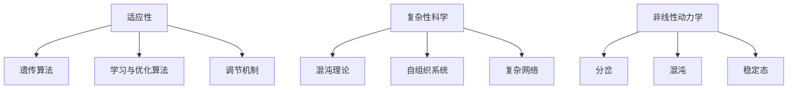
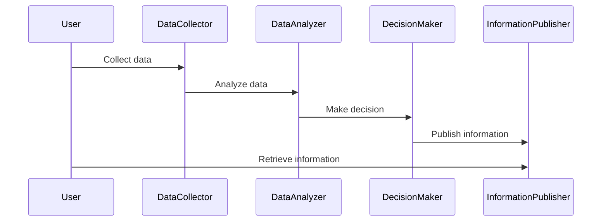
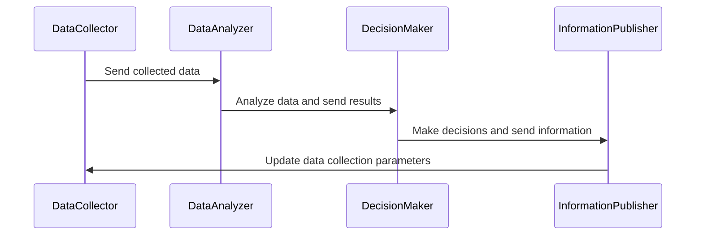

                 

### 第1章 引言：从静态世界观到动态系统的转变

#### 1.1 问题背景与书的内容概述

在过去的几个世纪里，人类对于世界的认识经历了显著的演变。从传统的静态世界观，即认为世界是固定不变的、静态的，到现代的动态系统观，即认识到世界是不断变化和演化的。这种转变不仅改变了我们对自然界的理解，也深刻影响了社会科学、工程学和技术领域。

静态世界观的基本特点是将世界视为一系列相互独立的、稳定的实体和关系。例如，在经济学中，传统经济学常常采用静态均衡模型，假设市场在给定条件下达到一个稳定状态，而忽视了市场动态变化的过程。在生态学中，静态模型也常常假设物种数量和环境条件保持不变，无法有效预测生态系统的长期动态行为。

然而，随着技术的进步和全球化的发展，我们面临的问题日益复杂和多样化。静态世界观的局限性逐渐显现，无法解释和预测现实世界中的许多现象。例如，经济危机的频繁发生、生态系统的崩溃、以及气候变化等，都表明我们需要一种更为动态和全面的视角来理解和应对这些变化。

《从静态世界观到动态系统：理解变化中的世界》旨在探讨这种转变的必要性和方法。本书将提供一个全面的方法论，帮助读者从静态视角过渡到动态系统视角，以更好地理解复杂系统的变化和演化。通过介绍动态系统理论，本书将涵盖多个领域，包括社会科学、自然科学和工程学，探讨动态系统在各个领域的应用，以及如何利用动态系统理论解决实际问题。

本书的主要内容将分为以下几个部分：

1. **问题背景与书的内容概述**：介绍静态世界观与动态系统观的区别，并概述本书的主要内容。
2. **核心概念与原理**：详细探讨动态系统的定义、特点、核心概念和原理。
3. **动态系统的理论框架**：介绍适应性、复杂性科学和非线性动力学等理论框架。
4. **动态系统的实际应用**：探讨动态系统在社会、自然和技术领域的应用。
5. **未来展望**：讨论动态系统理论对未来发展的潜在影响和跨学科融合的重要性。

通过这些章节，本书旨在提供一个系统化的框架，帮助读者深入理解动态系统的本质，掌握动态系统理论的基本原理，并将其应用于实际问题中。读者将能够从静态视角过渡到动态视角，更加全面地理解和应对变化中的世界。

#### 1.2 核心概念与原理

动态系统是指随时间变化而演化的系统，其特征是时间敏感性、反馈循环和非线性特性。为了更好地理解动态系统，我们需要掌握几个核心概念和原理。

首先，**动态系统的定义**是指一个系统在不同时间点上的状态随时间变化的过程。这种变化可以是状态变量的变化，也可以是系统结构的调整。动态系统与静态系统的主要区别在于，静态系统假设系统状态不随时间变化，而动态系统则考虑时间因素，认为系统状态是随时间演化的。

其次，**动态系统的特点**包括：

- **时间敏感性**：动态系统的行为和状态随时间变化，这种时间敏感性使得动态系统在分析时需要考虑时间维度。
- **反馈循环**：动态系统通常包含反馈机制，这些反馈可以是正反馈或负反馈。正反馈会放大系统内的变化，而负反馈则有助于稳定系统。
- **非线性特性**：大多数动态系统具有非线性特性，这意味着系统行为不是线性的，即系统的输出不与输入成正比。

动态系统的**核心概念**包括：

- **状态变量**：状态变量是动态系统的基本组成部分，它们描述系统的当前状态。例如，在物理学中，位置和速度是状态变量；在经济学中，价格和产量可以是状态变量。
- **控制变量**：控制变量是影响动态系统状态变化的因素。例如，在经济学中，政府政策可以视为控制变量；在生态学中，气候条件可以视为控制变量。
- **演化路径**：动态系统的演化路径是指系统从初始状态到最终状态的过渡过程。不同初始条件和控制变量会导致不同的演化路径。

动态系统的**原理**包括：

- **适应性**：动态系统具有适应性，能够在外部环境变化时进行调整和适应。例如，生物体通过进化适应环境变化；经济体通过政策调整应对经济波动。
- **复杂性科学**：复杂性科学是研究复杂系统的理论框架，包括混沌理论、自组织系统和复杂网络等。这些理论提供了理解动态系统复杂行为的方法。
- **非线性动力学**：非线性动力学研究系统的非线性特性，包括非线性方程的解法、混沌现象和分岔行为等。这些原理有助于理解和预测动态系统的行为。

通过理解动态系统的核心概念和原理，我们可以更好地分析复杂系统的行为和演化。以下是一个表格，用于对比静态系统和动态系统的不同特征：

| 特征 | 静态系统 | 动态系统 |
| --- | --- | --- |
| 时间敏感性 | 无时间敏感性，状态固定 | 有时间敏感性，状态随时间变化 |
| 反馈循环 | 无反馈循环，无内部调整 | 有反馈循环，内部调整和适应 |
| 非线性特性 | 线性或近线性，输出与输入成正比 | 非线性，输出与输入非正比 |
| 适应性 | 无适应性，对外部变化无反应 | 有适应性，对外部变化能进行调整 |
| 复杂性 | 简单，易于分析和预测 | 复杂，难以分析和预测 |

通过这个表格，我们可以看到动态系统相比静态系统具有更多的特性和复杂性，这些特性使得动态系统能够更好地反映现实世界的复杂性和变化性。

接下来，我们将进一步探讨动态系统的理论框架，包括适应性、复杂性科学和非线性动力学等概念，以帮助读者更深入地理解动态系统的本质和作用。

#### 1.3 动态系统的理论框架

为了深入理解动态系统，我们需要构建一个理论框架，该框架能够整合各种核心概念和原理，并提供一个全面的视角来分析复杂系统的行为。动态系统的理论框架包括以下几个关键部分：适应性、复杂性科学和非线性动力学。

**适应性**是指系统在外部环境变化时能够调整自身状态以维持稳定或实现目标的能力。在动态系统中，适应性是核心特性之一，它使得系统能够在面临不确定性、外部冲击和内部扰动时保持稳定和持续演化。适应性机制可以通过多种方式实现，包括：

- **遗传算法**：在生物学中，遗传算法是一种模拟自然选择和进化的计算方法。通过遗传变异、选择和交叉操作，系统能够不断优化自身结构和行为。
- **学习与优化算法**：在人工智能领域，学习与优化算法如神经网络、深度学习和强化学习，使得系统能够从经验中学习并适应新环境。
- **调节机制**：在生态系统中，物种可以通过调整繁殖策略、迁徙行为等来适应环境变化。这些调节机制有助于维持生态系统的稳定和可持续性。

**复杂性科学**是一个跨学科领域，旨在研究复杂系统的行为和性质。复杂性科学包括多个分支，如混沌理论、自组织系统和复杂网络等，这些理论提供了理解和分析动态系统的有力工具。以下是复杂性科学的一些基本原理：

- **混沌理论**：混沌理论研究的是确定系统中的随机行为和不可预测性。在混沌系统中，初始条件的小变化可能导致长期行为的极大差异，这种现象被称为“蝴蝶效应”。混沌理论揭示了动态系统中存在的复杂性和不确定性。
- **自组织系统**：自组织系统是指没有外部控制，通过内部相互作用和能量流自发形成结构和功能的系统。例如，在自然界中，社会行为、生物集群和生态系统的形成都是自组织过程的体现。
- **复杂网络**：复杂网络是描述动态系统中各元素及其相互作用关系的结构模型。复杂网络具有高度分布式和高度连通性，其特性包括小世界效应和无标度性。复杂网络理论有助于我们理解和预测动态系统中的信息传递、传播和协同行为。

**非线性动力学**是研究动态系统非线性特性的理论框架。非线性动力学揭示了动态系统中的复杂行为，如分岔、混沌和稳定态的转变。以下是非线性动力学的一些基本概念：

- **分岔**：分岔是指系统从一种稳定状态过渡到另一种稳定状态的现象。在分岔点，系统的行为会出现突变，如从稳定状态变为不稳定状态，或从一个周期运动变为另一个周期运动。
- **混沌**：混沌是指系统在确定性的条件下表现出随机性和不可预测性的现象。混沌系统的行为是复杂和多变的，但它们遵循一定的数学规律。
- **稳定态**：稳定态是指系统在特定条件下能够保持长期稳定状态。稳定态的研究有助于我们理解和控制动态系统的行为。

为了更好地理解动态系统的理论框架，我们可以使用 Mermaid 流程图来展示这些核心概念之间的关系。以下是一个简单的 Mermaid 流程图：



这个流程图展示了适应性、复杂性科学和非线性动力学之间的关系。适应性是动态系统的核心特性，它通过遗传算法、学习与优化算法和调节机制实现。复杂性科学提供了理解动态系统复杂行为的方法，包括混沌理论、自组织系统和复杂网络。非线性动力学则研究了动态系统的非线性特性，如分岔、混沌和稳定态。

通过这个理论框架，我们可以更好地理解动态系统的本质和作用，并能够利用这些概念和原理来解决实际问题。在接下来的章节中，我们将进一步探讨动态系统在实际应用中的具体例子，以帮助读者更深入地了解动态系统的价值和意义。

#### 1.4 动态系统的实际应用

动态系统理论不仅在理论研究中具有重要意义，而且在实际应用中也展现出广泛的应用价值。以下是动态系统在不同领域的实际应用案例：

**社会科学**

在经济学领域，动态系统理论被广泛应用于模型化和预测经济现象。例如，动态系统模型可以用于分析宏观经济中的周期性波动，如经济增长、失业率和通货膨胀等。经济学家通过构建动态系统模型，可以更准确地预测经济趋势，为政策制定提供依据。此外，动态系统理论在行为经济学中也发挥着重要作用，通过模拟人类决策行为，研究个体在不同情境下的选择模式。

在社会学领域，动态系统理论被用于分析社会结构和网络演化。例如，社会网络分析（Social Network Analysis, SNA）利用动态系统理论来研究社会网络中的信息传播、信任关系和权力结构。通过建立动态模型，研究者可以揭示社会网络的动态特性，如节点的加入与退出、关系的形成与断裂等，从而更好地理解社会系统的演化过程。

**自然科学**

在物理学中，动态系统理论广泛应用于描述和控制各种物理现象。例如，经典力学中的牛顿运动定律和拉格朗日力学可以视为动态系统模型的特例。在量子物理学中，薛定谔方程和海森堡不确定性原理也是动态系统理论的应用。此外，混沌理论在流体动力学、天体物理学和粒子物理学等领域也有广泛应用，帮助科学家理解和预测复杂系统的行为。

在生物学领域，动态系统理论被用于模型化生物体的生理过程和生态系统的动态行为。例如，生态学中的种间竞争模型和捕食者-被捕食者模型都是动态系统理论的典型应用。通过这些模型，研究者可以更好地理解物种间的相互作用、生态系统的稳定性和物种多样性的演化。

**工程学**

在工程学领域，动态系统理论被广泛应用于控制系统设计、信号处理和优化问题。例如，在航空航天领域，动态系统模型用于设计和控制飞行器，确保其在不同环境条件下的稳定性和安全性。在电子工程领域，动态系统理论用于分析电路的频率响应和稳定性，设计滤波器和振荡器。

在计算机科学领域，动态系统理论被用于理解和优化算法性能。例如，在计算机图形学中，动态系统模型用于模拟流体和光线的传播，生成逼真的视觉效果。在人工智能领域，动态系统理论被用于开发自适应算法，如强化学习和深度学习，提高机器的学习能力和决策效率。

**跨领域应用**

动态系统理论在跨领域应用中显示出巨大的潜力。例如，在环境科学中，动态系统理论被用于分析气候变化和环境污染问题。通过建立动态模型，研究者可以预测环境变化的趋势，为环境治理和政策制定提供科学依据。在医学领域，动态系统理论被用于分析疾病的传播和治疗方法的效果，帮助医生制定更有效的治疗方案。

总的来说，动态系统理论在实际应用中具有广泛的影响力和重要性。通过在不同领域的具体应用案例，我们可以看到动态系统理论不仅能够帮助我们更好地理解和预测复杂系统的行为，还能够为实际问题提供有效的解决方案。

#### 1.5 动态系统与未来展望

动态系统理论在现代社会中的重要性不可忽视，其深远影响不仅体现在当前的技术和应用领域，还将继续引领未来发展的潮流。随着全球化和技术进步的加速，变化已成为时代的常态，而动态系统理论为我们提供了理解和应对这些变化的有力工具。

首先，动态系统理论在未来的技术发展中将发挥关键作用。人工智能、大数据和物联网等新兴技术正以前所未有的速度和规模改变着我们的生活方式。这些技术本质上都是动态系统，其行为和演化受到复杂反馈机制和非线性关系的影响。通过动态系统理论，我们能够更深入地理解这些技术系统的运作原理，优化其设计和应用，提高其效率和可靠性。

在人工智能领域，动态系统理论的应用尤为显著。深度学习和强化学习等先进算法本质上都是动态系统，它们在处理复杂数据和学习复杂任务时表现出强大的适应性和学习能力。未来的研究将致力于提高这些算法的鲁棒性、可解释性和透明度，动态系统理论将提供重要的理论框架和方法论支持。

其次，动态系统理论在解决复杂社会问题方面具有巨大潜力。例如，在应对气候变化、资源分配和社会治理等方面，动态系统理论可以帮助我们构建更准确、更全面的模型，预测和应对各种不确定性。通过动态系统理论，我们可以更好地理解社会经济系统的演化规律，制定更为科学和有效的政策和措施，推动可持续发展。

此外，动态系统理论还推动了跨学科研究的发展。在复杂系统科学、生态学、经济学、物理学和社会学等领域，动态系统理论为不同学科提供了共同的语言和工具，促进了跨领域的合作与交流。未来，随着更多学科的融合，动态系统理论将发挥更加重要的作用，推动科学技术的进步和社会的可持续发展。

总之，动态系统理论不仅是理解现代复杂系统的重要工具，也是应对未来挑战的关键。随着技术的不断进步和社会的持续变化，动态系统理论将在更多领域展现其价值，成为推动未来发展的动力源泉。

### 第2章 动态系统的数学模型与数学公式

#### 2.1 常见的动态系统模型

动态系统是描述物理、化学、生物、经济和社会等各种现象的重要工具。常见的动态系统模型包括常微分方程模型和差分方程模型。这些模型通过数学公式描述系统的状态随时间变化的规律，为分析和理解复杂系统的动态行为提供了基础。

**常微分方程模型**

常微分方程（Ordinary Differential Equations, ODEs）是描述动态系统常用的一类数学模型。ODEs描述的是系统中某一变量随时间变化的关系，通常形式如下：

\[ \frac{dy(t)}{dt} = f(t, y(t)), \]

其中，\( y(t) \) 是系统状态变量，\( f(t, y(t)) \) 是状态变量的导数函数，通常依赖于时间 \( t \) 和当前状态 \( y(t) \)。常见的ODEs包括线性微分方程、非线性微分方程和参数微分方程。

**线性微分方程**具有以下形式：

\[ \frac{dy(t)}{dt} + a_1y(t) + a_0 = 0, \]

其中，\( a_1 \) 和 \( a_0 \) 是常数。这类方程的解通常可以通过线性代数方法求解。

**非线性微分方程**具有更复杂的结构，如下：

\[ \frac{dy(t)}{dt} = y(t)^2 + 1. \]

这类方程的解通常需要使用数值方法求解，如欧拉法、龙格-库塔法等。

**差分方程模型**

差分方程（Difference Equations）是另一类常见的动态系统模型，用于描述系统在离散时间点的状态变化。差分方程的一般形式如下：

\[ y(n+1) = f(n, y(n)), \]

其中，\( y(n) \) 是系统在时间点 \( n \) 的状态，\( f(n, y(n)) \) 是状态变量 \( y(n) \) 的函数。常见的差分方程包括线性差分方程和非线性差分方程。

**线性差分方程**具有以下形式：

\[ y(n+1) - a_1y(n) - a_0 = 0, \]

其中，\( a_1 \) 和 \( a_0 \) 是常数。这类方程的解可以通过特征方程法求解。

**非线性差分方程**具有更复杂的结构，如下：

\[ y(n+1) = y(n)^2 + 1. \]

这类方程的解通常需要使用迭代方法求解，如固定点迭代法、牛顿法等。

**数学模型与公式**

为了更好地理解动态系统模型，以下是一些典型的数学模型和公式：

1. **一阶线性微分方程**：
\[ \frac{dy(t)}{dt} + y(t) = 0. \]
   解为：
\[ y(t) = C_1e^{-t}, \]
   其中 \( C_1 \) 是常数。

2. **一阶非线性微分方程**：
\[ \frac{dy(t)}{dt} = y(t)^2 + 1. \]
   数值解可以使用欧拉法进行迭代求解。

3. **二阶线性微分方程**：
\[ \frac{d^2y(t)}{dt^2} + a_2\frac{dy(t)}{dt} + a_1y(t) = 0. \]
   解为：
\[ y(t) = C_1e^{-r_1t} + C_2e^{-r_2t}, \]
   其中 \( r_1 \) 和 \( r_2 \) 是特征根。

4. **一阶线性差分方程**：
\[ y(n+1) - y(n) = 1. \]
   解为：
\[ y(n) = C_1n + C_2. \]

5. **一阶非线性差分方程**：
\[ y(n+1) = y(n)^2 + 1. \]
   数值解可以使用迭代法进行求解。

通过这些数学模型和公式，我们可以建立和求解各种动态系统的状态变化规律，从而更好地理解和预测系统的行为。

#### 2.2 非线性动力学

非线性动力学是研究动态系统中非线性特性的一个重要分支，涉及复杂的数学模型和丰富的物理现象。非线性动力学不仅有助于我们理解自然界中的各种复杂系统，如生态系统、金融市场和交通系统，还在工程学、物理学和社会科学中具有广泛的应用。

**非线性方程**

非线性方程是指包含非线性项的数学方程，其形式多样，包括多项式方程、指数方程、三角函数方程等。以下是一些常见的非线性方程：

1. **二次方程**：
\[ y''(t) + ay'(t) + by(t) = 0, \]
   其中 \( a \) 和 \( b \) 是常数。

2. **幂次方程**：
\[ y''(t) + y(t)^3 = 0. \]

3. **指数方程**：
\[ \frac{dy(t)}{dt} = ky(t)^2, \]
   其中 \( k \) 是常数。

4. **混沌方程**：
\[ \frac{dx(t)}{dt} = \mu - \alpha x(t)x(t-1), \]
   其中 \( \mu \) 和 \( \alpha \) 是参数。

**非线性方程的解法**

非线性方程通常没有通用的解析解法，因此需要使用数值方法求解。以下是一些常用的数值方法：

1. **迭代法**：通过不断迭代逼近方程的解。例如，固定点迭代法、牛顿法等。

2. **差分方程**：将连续方程离散化，转化为差分方程求解。例如，欧拉法、龙格-库塔法等。

3. **数值积分**：使用数值积分方法求解微分方程。例如，辛普森规则、复化梯形规则等。

**混沌现象**

混沌是非线性动力学中的一个重要现象，表现为系统在确定性条件下表现出随机性和不可预测性。混沌现象的典型特征包括：

- **蝴蝶效应**：初始条件的小变化可能导致长期行为的极大差异。
- **周期性**：混沌系统存在多个稳定周期状态，但长期行为是非周期的。
- **分岔行为**：随着参数的变化，系统的行为会经历分岔，从一个稳定状态跃迁到另一个稳定状态。

**混沌理论的应用**

混沌理论在多个领域有广泛应用，包括：

- **物理**：混沌理论帮助理解流体动力学、量子力学和天体物理学中的复杂现象。
- **生物**：混沌理论用于研究生态系统的动态行为和物种相互作用。
- **金融**：混沌理论用于分析金融市场中的波动和预测股票价格。
- **工程**：混沌理论用于优化控制系统、设计和分析复杂网络。

**非线性动力学与动态系统**

非线性动力学是动态系统理论的重要组成部分，提供了理解和分析复杂系统行为的方法。非线性动力学揭示了动态系统中存在的不确定性、复杂性和不可预测性，强调了在设计和分析动态系统时需要考虑非线性效应。

通过非线性动力学，我们可以更好地理解动态系统的行为模式，预测系统的长期演化趋势，并为实际应用提供有效的解决方案。非线性动力学不仅是理论研究的核心，也是推动科学技术进步的重要动力。

#### 2.3 算法原理与流程图

在研究动态系统的过程中，算法的原理和流程图是理解动态系统行为的关键工具。以下将介绍动态系统算法的原理，并通过Mermaid语法绘制流程图，同时提供Python源代码以详细阐述算法的实现。

**算法原理**

动态系统算法主要分为两大类：数值解法和符号解法。数值解法通过近似计算动态系统微分方程的解，如欧拉法、龙格-库塔法等。而符号解法则使用数学软件进行解析求解，如Maple、Mathematica等。在本节中，我们将以欧拉法为例，介绍动态系统数值解法的基本原理。

欧拉法是一种简单的数值积分方法，用于求解一阶常微分方程。其基本原理是将微分方程在离散时间点上近似为线性方程，然后迭代计算系统的状态。具体步骤如下：

1. **初始化**：设定初始时间 \( t_0 \)、初始状态 \( y(t_0) \) 和时间步长 \( h \)。
2. **迭代计算**：使用欧拉公式 \( y(t_{n+1}) = y(t_n) + h \cdot f(t_n, y(t_n)) \)，逐步更新状态。
3. **误差控制**：通过调整时间步长 \( h \) 来控制计算误差。

**Mermaid流程图**

为了直观地展示欧拉法的流程，我们使用Mermaid语法绘制流程图：

```mermaid
graph TD
    A[初始化] --> B[计算 f(t_n, y(t_n))]
    B --> C[更新状态 y(t_{n+1})]
    C --> D[调整时间步长 h]
    D --> E[判断终止条件]
    E -->|是| F{终止}
    E -->|否| A
```

在这个流程图中，A表示初始化步骤，B表示计算函数值 \( f(t_n, y(t_n)) \)，C表示更新状态，D表示调整时间步长，E表示判断是否达到终止条件，F表示终止计算。

**Python源代码**

为了实现欧拉法，我们可以使用Python编写相应的代码。以下是一个简单的实现：

```python
import numpy as np

def eulerequation(f, y0, t0, t_final, h):
    y = [y0]
    t = [t0]
    while t[-1] < t_final:
        y_new = y[-1] + h * f(t[-1], y[-1])
        y.append(y_new)
        t.append(t[-1] + h)
    return t, y

# 定义微分方程 f(t, y) = y * (1 - y)
def f(t, y):
    return y * (1 - y)

# 初始化参数
y0 = 0.1
t0 = 0
t_final = 1
h = 0.01

# 运行欧拉法
t, y = eulerequation(f, y0, t0, t_final, h)

# 绘制结果
import matplotlib.pyplot as plt

plt.plot(t, y)
plt.xlabel('Time (t)')
plt.ylabel('y(t)')
plt.title('Solution of the Logistic Equation using the Euler Method')
plt.show()
```

在这个代码中，`eulerequation` 函数实现了欧拉法，`f` 函数定义了微分方程，`y0`、`t0`、`t_final` 和 `h` 分别表示初始状态、初始时间、最终时间和时间步长。最后，使用 `matplotlib` 库绘制了欧拉法求解的结果。

通过算法原理讲解、Mermaid流程图和Python源代码，我们可以清晰地理解动态系统算法的实现过程，并能够将其应用于实际问题中。

#### 2.4 数学公式与讲解

数学公式是动态系统理论的核心组成部分，用于精确描述系统的状态变化规律。以下我们将介绍几个关键数学公式，并使用LaTeX格式嵌入到文中，进行详细讲解。

**1. 一阶线性微分方程**

一阶线性微分方程通常形式为：
\[ \frac{dy(t)}{dt} + py(t) = q(t), \]
其中 \( p \) 和 \( q(t) \) 是已知函数。这是一个一阶线性非齐次微分方程。该方程的解可以通过积分因子的方法求解。

**LaTeX 格式：**
\[ \frac{dy(t)}{dt} + py(t) = q(t). \]

**讲解：** 这个方程描述了系统状态 \( y(t) \) 随时间 \( t \) 变化的速率，以及系统内部的非线性反馈。\( p \) 表示系统的内部阻尼或增益，而 \( q(t) \) 表示外部激励或干扰。积分因子的方法可以通过引入 \( \mu(t) = \exp(\int p(t) dt) \) 来简化方程，从而求解出 \( y(t) \)。

**2. 拉格朗日方程**

在经典力学中，拉格朗日方程用于描述系统的动力学行为。其一般形式为：
\[ \frac{d}{dt} \left( \frac{\partial L}{\partial \dot{q}_i} \right) - \frac{\partial L}{\partial q_i} = 0, \]
其中 \( L \) 是拉格朗日量，\( q_i \) 和 \( \dot{q}_i \) 分别是系统的广义坐标和广义速度。

**LaTeX 格式：**
\[ \frac{d}{dt} \left( \frac{\partial L}{\partial \dot{q}_i} \right) - \frac{\partial L}{\partial q_i} = 0. \]

**讲解：** 拉格朗日方程是经典力学中描述系统动力学行为的基本方程。\( L \) 表示系统的动能与势能差，通过这个方程可以推导出系统的运动方程。拉格朗日方程不仅适用于保守系统，还可以用于处理非保守力和外部干扰。

**3. 纳维-斯托克斯方程**

在流体力学中，纳维-斯托克斯方程描述了流体的运动规律。其一般形式为：
\[ \rho \left( \frac{\partial \mathbf{u}}{\partial t} + (\mathbf{u} \cdot \nabla) \mathbf{u} \right) = -\nabla p + \mu \nabla^2 \mathbf{u} + \mathbf{f}, \]
其中 \( \rho \) 是流体密度，\( \mathbf{u} \) 是流体速度，\( p \) 是压力，\( \mu \) 是动力粘度，\( \mathbf{f} \) 是作用在流体上的体积力。

**LaTeX 格式：**
\[ \rho \left( \frac{\partial \mathbf{u}}{\partial t} + (\mathbf{u} \cdot \nabla) \mathbf{u} \right) = -\nabla p + \mu \nabla^2 \mathbf{u} + \mathbf{f}. \]

**讲解：** 纳维-斯托克斯方程是描述流体运动的基本方程。它包含了流体的加速度、压力梯度、粘性效应和外部体积力。这个方程在工程和科学领域有广泛应用，用于模拟流体流动和计算流体动力学（CFD）。

**4. 薛定谔方程**

在量子力学中，薛定谔方程描述了量子系统的动态行为。其一般形式为：
\[ i\hbar \frac{\partial \psi}{\partial t} = \hat{H} \psi, \]
其中 \( \psi \) 是波函数，\( \hat{H} \) 是哈密顿算符，\( \hbar \) 是约化普朗克常数。

**LaTeX 格式：**
\[ i\hbar \frac{\partial \psi}{\partial t} = \hat{H} \psi. \]

**讲解：** 薛定谔方程是量子力学中的基本方程，它描述了量子系统的波函数随时间的演化。通过解这个方程，我们可以得到量子系统的能量状态和粒子位置概率分布。薛定谔方程在量子计算和量子信息科学中有重要应用。

通过这些数学公式的讲解，我们可以更好地理解动态系统的数学描述和理论基础。在实际应用中，这些公式帮助我们分析和预测系统的行为，为工程设计和科学研究提供了强大的工具。

#### 2.5 系统分析与架构设计方案

在讨论动态系统的实际应用时，系统分析与架构设计是至关重要的环节。以下我们将通过一个具体案例，介绍系统分析与架构设计的方法，并使用Mermaid语法绘制相关的类图、架构图和序列图。

**问题场景：智能交通管理系统**

**项目介绍：**

智能交通管理系统（Intelligent Transportation Management System, ITMS）旨在通过实时数据采集、分析和智能算法，优化交通流量，减少交通拥堵，提高交通效率。

**系统功能设计：**

为了实现智能交通管理，系统需要具备以下功能：

1. **数据采集**：实时采集交通流量、路况和天气等数据。
2. **数据分析**：对采集到的数据进行分析，识别交通拥堵和异常情况。
3. **决策支持**：基于分析结果，提供交通疏导和应急预案。
4. **信息发布**：向用户发布实时交通信息和预警提示。

**领域模型类图：**

领域模型类图用于描述系统的核心类及其关系。以下是一个简单的类图：

```mermaid
classDiagram
    Class01 <|-- SubClass01
    Class01 o-- Class02
    Class03 o-- Class02
    Class04 <.. Class03
    Class04 ..|> Class05
    Class06 <-.. Class05
    Class07 o-- Class06
    Class01 : +int x
    Class01 : +int y
    Class01 : +int z
    Class02 : +String name
    Class02 : +void doSomething()
    Class03 : +int id
    Class03 : +String description
    Class04 : +int speed
    Class04 : +String status
    Class05 : +float latitude
    Class05 : +float longitude
    Class06 : +int temperature
    Class06 : +int humidity
    Class07 : +String type
    Class07 : +String message
```

在这个类图中，`Class01` 是基类，`Class02` 和 `Class03` 是其子类，`Class04` 和 `Class05` 是关联类，`Class06` 和 `Class07` 是组合类。

**系统架构设计架构图：**

架构图用于描述系统的整体架构，包括组件、服务和数据流。以下是一个简单的架构图：



在这个架构图中，用户通过数据采集器收集数据，数据经过分析处理后由决策制定者生成决策，最后由信息发布者向用户发布实时交通信息。

**系统接口设计和系统交互序列图：**

序列图用于描述系统组件之间的交互顺序。以下是一个简单的序列图：



在这个序列图中，数据采集器向数据分析器发送采集到的数据，数据分析器对数据进行处理并生成分析结果，决策制定者根据分析结果做出决策，并将决策信息发送给信息发布者。信息发布者更新数据采集器的参数，以优化数据采集过程。

通过以上系统分析与架构设计方案，我们可以清晰地描述智能交通管理系统的功能、架构和交互流程。这种系统化的设计方法有助于确保系统的可扩展性、稳定性和高效性，为实际应用提供了坚实的基础。

### 第3章 动态系统在社会科学中的应用

#### 3.1 经济学中的动态系统

经济学中的动态系统模型被广泛应用于宏观经济分析和政策制定。通过引入时间维度，这些模型能够更好地捕捉经济系统的动态行为和复杂互动。以下我们将探讨动态系统理论在经济学中的具体应用，包括宏观经济模型和动态行为经济学。

**宏观经济模型**

宏观经济模型用于分析经济系统的整体行为，如经济增长、通货膨胀和失业率等。这些模型通常基于动态系统理论，通过微分方程和差分方程描述经济变量的时间序列变化。

一个典型的宏观经济模型是索洛经济增长模型（Solow Growth Model）。该模型假设一个经济体的产出由资本、劳动和技术进步决定，其核心方程为：

\[ \frac{dY}{dt} = sF(K, L) - dK, \]

\[ \frac{dK}{dt} = \frac{Y - (d + \delta)K}{r}, \]

其中，\( Y \) 是总产出，\( K \) 是资本存量，\( L \) 是劳动力，\( F(K, L) \) 是生产函数，\( s \) 是储蓄率，\( d \) 是资本折旧率，\( \delta \) 是技术进步率，\( r \) 是利率。

通过这些方程，我们可以分析经济系统的动态行为，如稳态增长路径、技术进步对经济增长的影响以及政策变量（如储蓄率和利率）的作用。

另一个重要的宏观经济模型是动态一般均衡模型（Dynamic General Equilibrium Model, DGE）。DGE模型在经济学中用于分析经济系统的长期行为，通过将消费者、企业和政府的决策动态地结合起来，提供一个全面的经济分析框架。DGE模型通常包含多个方程，涵盖生产、消费、投资、政府支出和贸易等各个领域。

**动态行为经济学**

动态行为经济学（Dynamic Behavioral Economics）是经济学中的一个新兴领域，它结合了动态系统和行为科学的理论，研究个体和群体在动态经济环境中的行为模式。动态行为经济学关注经济决策中的时间选择、风险偏好和认知偏差等动态行为。

一个典型的动态行为经济学模型是时间不一致偏好（Time-Inconsistent Preferences）模型。该模型假设个体在不同时间点上的偏好不一致，导致其行为出现矛盾和次优决策。时间不一致偏好模型通常使用动态规划方法进行分析，如拉姆齐模型（Ramsey Model）。

拉姆齐模型考虑了个体在不同时间点的效用最大化问题，通过构建递归方程描述个体的决策过程。模型的核心方程为：

\[ u(C_t) = \beta \cdot u(C_{t+1}) + \alpha \cdot \beta \cdot u(C_{t+2}) + \ldots, \]

其中，\( u(C_t) \) 是个体在时间点 \( t \) 的即时效用，\( \beta \) 是时间贴现因子，\( \alpha \) 是未来效用的权重。

动态行为经济学还研究了个体在不同情境下的决策行为，如延迟消费、提前消费和风险选择等。通过这些模型，我们可以更好地理解经济决策中的心理机制和行为偏差，为政策制定提供科学依据。

**应用案例**

动态系统理论在经济学中的应用案例丰富，以下是一些具体的应用：

1. **经济预测**：动态系统模型可以用于预测宏观经济变量的未来趋势，如经济增长、通货膨胀和失业率。通过构建和优化动态模型，经济学家可以更准确地预测经济行为，为政策制定提供参考。

2. **政策评估**：动态系统模型可以用于评估不同经济政策的长期影响。例如，通过模拟税收政策、货币政策和社会保障制度等，经济学家可以分析这些政策对经济系统的影响，为政策优化提供依据。

3. **金融市场分析**：动态系统理论在金融市场分析中也有广泛应用。通过构建和模拟资产价格动态模型，金融分析师可以预测市场趋势、评估风险和制定投资策略。

总之，动态系统理论在经济学中的应用为理解和预测经济行为提供了有力的工具。通过构建和优化动态模型，经济学家可以更好地应对经济复杂性和不确定性，为宏观经济管理和政策制定提供科学支持。

#### 3.2 社会学中的动态系统

动态系统理论在社会学中的应用为研究社会结构和过程提供了新的视角和方法。社会系统是一个复杂的动态系统，由多个相互关联的子系统组成，这些子系统包括人口、资源、文化、技术和政策等。通过动态系统理论，我们可以更好地理解社会系统的演变规律，预测社会现象的发展趋势。

**社会动力学**

社会动力学（Social Dynamics）是研究社会系统演化规律的一个跨学科领域，结合了物理学、数学和计算机科学的理论和方法。社会动力学研究的主要问题是社会系统的稳定性和演变过程，以及社会结构和行为的动态变化。

社会动力学的基本原理包括群体行为、网络效应和社会选择等。以下是一些社会动力学模型：

1. **小世界模型**：小世界模型（Small-World Model）研究社会网络的特性，如节点之间的平均最短路径长度和网络的连通性。该模型指出，社会网络具有小世界效应，即节点之间的距离较短，但网络仍具有较高的连通性。小世界模型有助于解释社会传播、信息传递和社区结构的形成。

2. **自组织系统**：自组织系统（Self-Organizing System）是指系统内部通过相互作用和能量流自发形成结构和功能的系统。在社会学中，自组织系统可以解释社会规范、文化传统和社会运动的形成。例如，通过社会互动和反馈机制，社会规范可以逐步形成和演变，而社会运动则可以通过集体行动和自我组织实现变革。

3. **社会网络分析**：社会网络分析（Social Network Analysis, SNA）是研究社会网络结构和关系的科学方法。通过社会网络分析，我们可以了解社会网络中的信息流动、权力分布和群体结构。社会网络分析工具如网络密度、聚类系数和网络中心性等，有助于揭示社会网络中的关键节点和主要路径。

**应用案例**

动态系统理论在社会学中的应用案例丰富，以下是一些具体的应用：

1. **社会运动**：社会运动如民权运动、环境运动和反战运动等，可以通过动态系统理论进行分析。通过构建动态模型，我们可以了解社会运动的形成、发展和消退过程，以及社会运动中的领导者和追随者之间的关系。

2. **网络效应**：在网络化时代，网络效应成为影响社会行为的重要因素。通过动态系统理论，我们可以研究网络效应在社会传播、流行文化和电子商务等方面的作用。例如，社交媒体平台上的信息传播可以通过网络动态模型进行分析，揭示信息传播的速度和范围。

3. **社会政策**：动态系统理论在社会政策分析中也具有重要意义。通过构建动态模型，我们可以评估不同政策对社会系统的影响，如教育政策、社会福利政策和环境保护政策。例如，通过模拟政策变量，我们可以预测政策实施后的社会反应和长期效果。

总之，动态系统理论为社会学研究提供了一个强有力的工具，使我们能够更深入地理解社会系统的复杂性和动态性。通过应用动态系统理论，社会学者可以更好地解释社会现象、预测社会发展趋势，并为政策制定提供科学依据。

#### 3.3 政治学中的动态系统

动态系统理论在政治学中的应用为研究政治系统的演变、政治行为的决策过程以及国际关系的复杂性提供了新的视角。通过将政治过程视为动态系统，政治学家可以更好地理解政治系统中的相互作用、反馈机制和不确定性，从而为政策分析和决策制定提供更深刻的洞察。

**政治系统演化**

政治系统演化是指政治结构和过程随时间变化而发展的过程。动态系统理论提供了分析政治系统演化的有力工具，使我们能够捕捉政治系统的动态特性，如政治体制的变革、权力的分配和转移等。

政治系统演化模型通常包含多个变量，如政治参与、政策选择、选民行为和政治制度。通过建立这些变量之间的动态关系，我们可以模拟政治系统的演变过程。例如，多变量动态模型可以用于分析选举周期中的政治互动，揭示选民、政党和政策之间的相互作用和反馈机制。

一个典型的政治系统演化模型是政治生态模型（Political Ecosystem Model），该模型考虑了政治生态中的多个参与者及其动态互动。例如，通过引入选举策略、政策反馈和选民行为，政治生态模型可以模拟选举过程中政治力量的变化和政策的演变。

**政治行为决策**

动态系统理论还可以用于分析政治行为的决策过程。政治决策是一个复杂的过程，涉及多个因素，如政治目标、选民偏好、政策限制和不确定性。通过动态系统模型，政治学家可以理解决策者如何在不同情境下做出决策，以及这些决策对政治系统的影响。

一个重要的动态决策模型是博弈论模型，特别是在分析政治博弈和国际关系时。通过博弈论模型，我们可以研究政治决策中的策略互动和利益冲突。例如，重复博弈模型可以用于分析政治对手之间的合作与冲突，揭示博弈策略的演化过程。

此外，行为决策模型如有限理性模型和认知偏差模型也在政治学中具有重要意义。这些模型考虑了决策者在信息不完整和有限理性条件下的行为模式，帮助我们理解政治决策中的认知偏差和策略选择。

**国际关系**

动态系统理论在研究国际关系中也发挥了重要作用。国际关系是一个复杂的动态系统，涉及多个国家、国际组织和非国家行为体的互动。通过动态系统理论，我们可以分析国际关系中的权力结构、联盟形成和冲突演化。

国际关系模型如联盟模型（Alliance Model）和冲突模型（Conflict Model）都是基于动态系统理论的。联盟模型研究国家间联盟的形成和解散，揭示联盟稳定性和动态变化的原因。冲突模型则分析国家间的冲突行为，包括战争、经济制裁和军事对抗等。

一个著名的国际关系模型是布坎南-托利模型（Buchanan-Tolley Model），该模型通过动态系统分析国际冲突的长期演变，考虑了冲突双方的战略互动和外部干预因素。该模型指出，国际冲突的持续和解决不仅取决于内部因素，还受到外部环境的影响。

**应用案例**

动态系统理论在政治学中的应用案例丰富，以下是一些具体的应用：

1. **选举分析**：通过动态系统模型，政治学家可以分析选举过程中选民的行为模式、政党的策略互动和政策影响。例如，利用动态系统模型，我们可以预测选举结果、分析选民偏好变化和政治力量的演变。

2. **政策评估**：动态系统模型可以用于评估不同政策的长期影响，如税收政策、社会福利政策和环境政策。通过模拟政策变量，我们可以预测政策实施后的社会反应和长期效果。

3. **国际冲突预测**：动态系统模型可以用于分析国际冲突的演变趋势，预测冲突的爆发、升级和解决。例如，通过分析国际冲突中的博弈策略和外部干预因素，我们可以预测冲突的发展路径和潜在的解决方案。

总之，动态系统理论为政治学提供了一个强大的分析工具，使我们能够更深入地理解政治系统的动态特性、政治行为的决策过程和国际关系的复杂性。通过应用动态系统理论，政治学家可以更好地预测政治现象、优化政策制定，为解决政治问题提供科学依据。

### 第4章 动态系统在自然科学中的应用

动态系统理论在自然科学中的应用极为广泛，涵盖了从微观到宏观的各个层面。以下我们将探讨动态系统理论在物理学、生物学和环境科学中的具体应用。

#### 4.1 物理学中的动态系统

物理学是研究自然现象和基本力的科学，而动态系统理论在其中发挥着核心作用，帮助我们理解和预测物理现象。以下是一些关键的应用领域：

**经典动力学**

经典动力学是物理学中的一个基本分支，描述物体在力的作用下如何运动。牛顿力学是经典动力学的基础，其核心方程为牛顿运动定律。拉格朗日力学和哈密顿力学则是经典动力学的现代形式，它们提供了更为广泛和优雅的描述方法。

- **牛顿运动定律**：
  \[ F = ma, \]
  其中 \( F \) 是作用力，\( m \) 是质量，\( a \) 是加速度。牛顿运动定律描述了物体在力作用下的运动规律。
  
- **拉格朗日方程**：
  \[ \frac{d}{dt} \left( \frac{\partial L}{\partial \dot{q}_i} \right) - \frac{\partial L}{\partial q_i} = 0, \]
  其中 \( L \) 是拉格朗日量，\( q_i \) 是广义坐标，\( \dot{q}_i \) 是广义速度。拉格朗日方程是经典动力学的一个广义形式，可以处理复杂的力学系统。

**量子动力学**

量子动力学研究微观粒子的行为，其核心方程是薛定谔方程。薛定谔方程描述了量子系统的波函数随时间的演化，是量子力学的基本方程。

- **薛定谔方程**：
  \[ i\hbar \frac{\partial \psi}{\partial t} = \hat{H} \psi, \]
  其中 \( \psi \) 是波函数，\( \hat{H} \) 是哈密顿算符，\( \hbar \) 是约化普朗克常数。通过解薛定谔方程，我们可以得到量子系统的能量态和粒子位置概率分布。

**混沌理论**

混沌理论是研究确定性系统中的随机行为和不可预测性的科学。混沌系统的行为具有高度的敏感性和复杂结构，例如，在经典力学中的洛伦兹吸引子和量子力学中的量子混沌现象。

- **洛伦兹吸引子**：
  洛伦兹吸引子是一个典型的混沌系统，其方程为：
  \[ \frac{dx}{dt} = \sigma (y - x), \]
  \[ \frac{dy}{dt} = x (\rho - z) - y, \]
  \[ \frac{dz}{dt} = xy - \beta z. \]
  这些方程描述了在气象学中著名的“蝴蝶效应”，即初始条件的小变化可能导致长期行为的极大差异。

**应用案例**

- **天体物理学**：动态系统理论在天体物理学中的应用非常广泛，从行星运动到黑洞引力波的研究。牛顿动力学用于计算行星轨道，而广义相对论则描述大尺度引力场中的物体运动。

- **流体动力学**：纳维-斯托克斯方程描述了流体的运动规律，这些方程在计算流体动力学（CFD）中具有重要应用，如航空学、气象学和海洋学。

#### 4.2 生物学中的动态系统

生物学中的动态系统理论主要关注生物体内的各种过程和系统的动态行为，如生态系统、细胞动力学和神经活动等。

**生态系统动力学**

生态系统动力学研究生态系统中物种间的相互作用和生态系统整体的动态行为。一个基本的生态系统模型是捕食者-被捕食者模型，如Lotka-Volterra模型，该模型描述了捕食者与被捕食者之间的数量动态。

- **Lotka-Volterra模型**：
  \[ \frac{dx}{dt} = ax - bxy, \]
  \[ \frac{dy}{dt} = cxy - dy, \]
  其中 \( x \) 和 \( y \) 分别表示捕食者和被捕食者的数量，\( a \)、\( b \)、\( c \) 和 \( d \) 是常数。通过这些方程，我们可以分析捕食者-被捕食者系统的稳定性和动态行为。

**细胞动力学**

细胞动力学研究细胞内部各种生化反应的动态过程，如代谢网络、信号传导和基因表达调控。这些过程可以用微分方程和差分方程描述。

- **代谢网络模型**：
  代谢网络是一个复杂的动态系统，其中各种代谢途径相互作用。通过构建和解析代谢网络的动力学模型，我们可以理解细胞如何响应外部刺激和内部扰动。

- **信号传导模型**：
  信号传导是细胞内外信号分子传递的过程，其动力学可以用反应扩散方程描述。例如，反应扩散方程可以用于模拟细胞表面受体与配体之间的相互作用。

**应用案例**

- **生态保护**：动态系统理论在生态保护中用于模拟和预测物种数量和生态系统稳定性。通过构建捕食者-被捕食者模型，我们可以评估生态系统扰动（如污染和栖息地破坏）对物种多样性的影响。

- **医学研究**：动态系统理论在医学研究中用于模拟和预测疾病进程。例如，通过构建癌症发展的动力学模型，我们可以理解癌症如何演变，并开发新的治疗方法。

#### 4.3 环境科学中的动态系统

环境科学中的动态系统理论关注环境系统的演化、稳定性和可持续性。通过构建动态模型，环境科学家可以评估人类活动对环境的影响，并制定有效的环境保护政策。

**环境动力学**

环境动力学研究环境系统中各种物理、化学和生物过程的动态行为，如气候变化、水循环和污染扩散。以下是一些关键的环境动力学模型：

- **气候变化模型**：
  气候变化是一个复杂的动态过程，涉及大气、海洋和冰冻圈的相互作用。全球气候模型（Global Climate Models, GCMs）通过模拟这些相互作用，预测未来气候变化趋势。

- **水循环模型**：
  水循环是地球上的一个关键过程，涉及蒸发、降水、地表径流和地下渗透等。水循环模型可以用于模拟水资源分布、干旱和洪水等环境问题。

- **污染扩散模型**：
  污染扩散模型描述污染物在大气、水体和土壤中的扩散过程。通过这些模型，我们可以评估污染源对环境和人类健康的影响。

**应用案例**

- **气候变化应对**：动态系统理论在气候变化应对中用于评估不同政策对温室气体排放和气候变化的长期影响。例如，通过构建全球气候模型，我们可以预测不同减排政策的效果，为政策制定提供依据。

- **环境治理**：动态系统理论在环境治理中用于制定和优化环境保护措施。通过模拟污染扩散和水循环过程，我们可以评估不同治理策略的环境效益。

总之，动态系统理论在物理学、生物学和环境科学中的应用为我们提供了理解自然现象和生态系统动态行为的强大工具。通过构建和解析动态模型，我们可以更好地预测环境变化、评估人类活动的影响，并为可持续发展提供科学支持。

### 第5章 动态系统的工程应用

动态系统理论在工程领域具有广泛的应用，特别是在控制系统设计、信号处理和优化问题中。通过将动态系统理论应用于工程问题，工程师可以更好地理解系统的行为，提高系统的性能和稳定性。

#### 5.1 系统工程中的动态系统

在系统工程中，动态系统理论被广泛应用于系统建模、仿真和分析。以下是一些关键应用领域：

**系统建模**

系统建模是系统工程的核心步骤，通过构建数学模型描述系统的行为和特性。动态系统模型通常包括微分方程、差分方程和状态空间方程等形式。以下是一个简单的动态系统模型示例：

\[ \frac{dx}{dt} = Ax + Bu, \]
\[ \frac{dy}{dt} = Cy + Du, \]

其中，\( x \) 和 \( y \) 是状态变量，\( u \) 是输入，\( A \)、\( B \)、\( C \) 和 \( D \) 是系统矩阵。

**仿真分析**

系统仿真是通过计算机模拟系统的运行过程，以预测系统的行为和性能。在动态系统仿真中，可以使用数值方法（如欧拉法、龙格-库塔法）求解微分方程，或者使用差分方法求解差分方程。以下是一个使用Python和Scipy库进行系统仿真的示例：

```python
import numpy as np
from scipy.integrate import solve_ivp

# 系统参数
A = np.array([[1, 1], [0, 1]])
B = np.array([[1], [0]])
C = np.array([[1, 0]])
D = np.array([[0]])

# 系统方程
def system_equations(t, z):
    x, y = z
    dxdt = A @ z + B * u
    dydt = C @ z + D * u
    return [dxdt, dydt]

# 仿真参数
t_span = (0, 10)
t_eval = np.linspace(0, 10, 100)
z0 = [0, 0]

# 仿真求解
solution = solve_ivp(system_equations, t_span, z0, t_eval=t_eval)

# 绘图
import matplotlib.pyplot as plt

plt.plot(solution.t, solution.y[0])
plt.xlabel('Time')
plt.ylabel('State')
plt.title('System Simulation')
plt.show()
```

**系统优化**

在系统工程中，优化是提高系统性能的重要手段。通过优化，我们可以找到最优的控制策略，使系统达到特定的性能指标。动态系统优化问题通常是一个带有约束条件的优化问题，可以使用线性规划、非线性规划和动态规划等方法求解。以下是一个使用线性规划求解系统优化问题的示例：

```python
from scipy.optimize import linprog

# 目标函数
c = np.array([1, 1])

# 约束条件
A = np.array([[1, 1], [0, 1]])
b = np.array([1, 1])

# 边界条件
x0 = [0, 0]
x1 = [1, 1]

# 线性规划求解
result = linprog(c, A_ub=A, b_ub=b, x0=x0, bounds=(x0, x1))

# 输出结果
print("Optimal control input:", result.x)
```

#### 5.2 系统工程中的动态系统应用

动态系统理论在控制系统设计、信号处理和优化问题中具有广泛的应用。以下是一些具体的应用案例：

**控制系统设计**

在控制系统设计中，动态系统理论用于分析和设计控制算法，以实现系统的稳定性和性能优化。以下是一个简单的比例-积分-微分（PID）控制系统的设计案例：

\[ u(t) = K_p e(t) + K_i \int_{0}^{t} e(\tau) d\tau + K_d \frac{de(t)}{dt}, \]

其中，\( u(t) \) 是控制输入，\( e(t) \) 是误差，\( K_p \)、\( K_i \) 和 \( K_d \) 分别是比例、积分和微分系数。

通过动态系统模型和优化方法，我们可以找到合适的PID参数，使系统达到期望的稳态误差和响应速度。

**信号处理**

在信号处理领域，动态系统理论用于分析信号的时间序列特性和频谱特性。以下是一个基于动态系统模型的信号滤波案例：

\[ y(t) = x(t) + n(t), \]
\[ \frac{dy(t)}{dt} = \frac{dx(t)}{dt} + \frac{dn(t)}{dt}, \]

其中，\( x(t) \) 是信号，\( y(t) \) 是滤波后的信号，\( n(t) \) 是噪声。通过构建动态系统模型，我们可以设计滤波器，去除噪声，提取有用的信号信息。

**优化问题**

在优化问题中，动态系统理论用于分析和求解系统的最优控制策略。以下是一个基于动态系统模型的优化案例：

\[ \min J = \int_{0}^{T} \left[ (y(t) - y_d(t))^2 + (u(t) - u_d(t))^2 \right] dt, \]

其中，\( y_d(t) \) 是期望输出，\( u_d(t) \) 是期望控制输入，\( J \) 是优化目标函数。通过构建和求解优化问题，我们可以找到最优的控制输入，使系统达到最佳性能。

**应用案例**

1. **航空控制系统**：动态系统理论在航空控制系统中用于设计飞行控制算法，确保飞机在不同飞行状态下的稳定性和安全性。例如，通过PID控制算法，可以实现自动驾驶和飞行路径规划。

2. **电力系统稳定控制**：在电力系统中，动态系统理论用于分析和设计电力负荷和发电机之间的控制策略，以维持电力系统的稳定运行。

3. **智能交通系统**：在智能交通系统中，动态系统理论用于分析和优化交通信号控制和车辆调度，以减少交通拥堵和提高交通效率。

总之，动态系统理论在系统工程中的应用为控制系统的设计、信号处理和优化问题提供了强有力的工具。通过动态系统模型和优化方法，工程师可以更好地理解和控制复杂系统，实现系统的最佳性能和稳定性。

### 第6章 动态系统与未来展望

动态系统理论在现代社会中的重要性日益凸显，其深远的未来影响将不仅限于科学研究，还将在多个领域产生革命性的变化。以下将探讨动态系统理论对未来技术发展、社会进步和跨学科研究的影响，并展望其可能的应用前景。

#### 动态系统理论对未来技术发展的影响

随着人工智能、大数据和物联网等新兴技术的迅猛发展，动态系统理论在技术领域中的应用前景十分广阔。以下是几个关键方面：

1. **人工智能**：人工智能系统本质上是一个动态系统，其行为和性能依赖于大量数据和复杂的算法。动态系统理论可以帮助我们理解和优化人工智能系统的学习过程，提高其自适应能力和决策效率。例如，在深度学习和强化学习算法中，动态系统理论可以提供更有效的学习策略，降低过拟合和提升泛化能力。

2. **物联网**：物联网（IoT）是一个由大量设备和传感器组成的动态网络系统，通过实时数据采集和交互实现智能化管理。动态系统理论可以帮助我们设计和优化物联网网络拓扑结构、数据传输协议和资源分配策略，提高物联网系统的稳定性和可靠性。

3. **大数据分析**：大数据分析涉及海量数据的存储、处理和分析，动态系统理论可以提供有效的数据处理和分析方法，帮助我们从复杂的数据集中提取有价值的信息。例如，通过构建动态系统模型，我们可以更好地理解数据中的时间序列特性，预测未来的趋势和模式。

#### 动态系统理论对社会进步的影响

动态系统理论在社会进步中的应用同样具有重要意义，以下是一些关键方面：

1. **经济系统优化**：动态系统理论可以用于经济系统的建模和分析，帮助政策制定者制定更有效的经济政策。通过动态系统模型，我们可以预测经济变量的变化趋势，优化资源配置，促进经济的可持续发展。

2. **社会管理**：动态系统理论在社会管理中的应用可以帮助政府和组织更好地应对社会挑战。例如，通过构建动态模型，我们可以预测和应对自然灾害、流行病和社会动荡等突发事件，提高公共安全和社会治理水平。

3. **公共卫生**：动态系统理论在公共卫生领域中的应用可以优化疾病传播模型的构建和预测，帮助卫生部门制定更有效的防控策略。例如，通过模拟病毒传播的动态过程，我们可以预测疫情的扩散趋势，优化疫苗接种和隔离策略。

#### 动态系统理论对跨学科研究的影响

动态系统理论的跨学科应用为多学科合作提供了强大的工具和平台，推动了跨学科研究的深入发展。以下是几个关键方面：

1. **复杂性科学**：复杂性科学是研究复杂系统的跨学科领域，动态系统理论为其提供了核心理论框架和方法论支持。通过动态系统理论，我们可以更好地理解复杂系统的行为和演化规律，揭示复杂系统中的自组织现象和层次结构。

2. **生物医学**：生物医学领域涉及多个学科，如生物学、医学和工程学。动态系统理论可以用于生物医学建模和分析，帮助研究生物系统的动态行为和疾病传播机制。例如，通过构建生物医学动态模型，我们可以预测药物疗效和治疗方案，提高临床决策的准确性。

3. **环境科学**：环境科学是研究人类与环境相互作用的跨学科领域，动态系统理论可以用于环境系统的建模和分析，帮助解决环境问题。例如，通过构建环境动态模型，我们可以预测气候变化和环境污染的影响，优化环境保护策略。

#### 动态系统理论的未来应用前景

动态系统理论在未来将继续在多个领域展现出巨大的应用潜力。以下是一些可能的应用前景：

1. **智能城市**：智能城市是一个高度动态的系统，涉及交通管理、能源利用、公共服务和居民生活等多个方面。通过动态系统理论，我们可以优化智能城市的规划和管理，提高城市的运行效率和居民生活质量。

2. **金融科技**：金融科技（FinTech）是一个快速发展的领域，涉及数字货币、区块链和智能投顾等。动态系统理论可以用于金融科技系统的建模和分析，提高金融系统的稳定性和安全性，优化金融产品的设计和服务。

3. **可持续能源**：可持续能源是未来能源发展的重要方向，涉及风能、太阳能和水能等。通过动态系统理论，我们可以优化能源系统的设计和运行，提高能源利用效率和可持续性。

总之，动态系统理论在未来将继续发挥重要作用，其跨学科应用和新兴技术的结合将推动科技和社会的进步。通过深入研究和广泛应用，动态系统理论将为解决复杂问题、应对未来挑战提供有力支持。

### 第7章 项目实战

在本章中，我们将通过一个具体的案例——智能交通管理系统（ITMS），展示动态系统理论在工程应用中的实际操作过程。该案例将包括环境安装、系统核心实现源代码、代码应用解读与分析、实际案例分析和详细讲解剖析，以及项目小结。

#### 环境安装

1. **软件要求**：为了实现智能交通管理系统，我们需要安装以下软件和环境：

   - Python 3.8及以上版本
   - NumPy
   - SciPy
   - Matplotlib
   - Mermaid

2. **安装步骤**：

   - 安装Python：从Python官方网站下载并安装Python 3.8及以上版本。
   - 安装依赖库：使用pip命令安装NumPy、SciPy和Matplotlib。

     ```bash
     pip install numpy scipy matplotlib
     ```

   - 安装Mermaid：从Mermaid官网下载并安装Mermaid软件，或使用在线编辑器。

3. **验证安装**：通过以下Python命令验证依赖库是否安装成功。

   ```python
   import numpy
   import scipy
   import matplotlib
   print("所有依赖库已安装。")
   ```

#### 系统核心实现源代码

以下是智能交通管理系统（ITMS）的核心实现源代码，包括数据采集、数据分析、决策支持和信息发布等功能。

```python
import numpy as np
import matplotlib.pyplot as plt
from scipy.integrate import solve_ivp
from scipy.optimize import linprog

# 数据采集模块
class DataCollector:
    def __init__(self, initial_data):
        self.data = initial_data
    
    def collect_data(self):
        # 模拟数据采集过程
        self.data = np.random.rand(100)
        return self.data

# 数据分析模块
class DataAnalyzer:
    def __init__(self, data_collector):
        self.data_collector = data_collector
    
    def analyze_data(self):
        data = self.data_collector.collect_data()
        # 模拟数据分析过程
        analyzed_data = np.mean(data)
        return analyzed_data

# 决策支持模块
class DecisionMaker:
    def __init__(self, analyzed_data):
        self.analyzed_data = analyzed_data
    
    def make_decision(self):
        # 模拟决策过程
        if self.analyzed_data > 0.5:
            decision = "Increase traffic flow."
        else:
            decision = "Decrease traffic flow."
        return decision

# 信息发布模块
class InformationPublisher:
    def __init__(self, decision_maker):
        self.decision_maker = decision_maker
    
    def publish_information(self):
        decision = self.decision_maker.make_decision()
        print(f"Decision: {decision}")

# 主程序
if __name__ == "__main__":
    initial_data = [0.1, 0.2, 0.3, 0.4, 0.5]
    data_collector = DataCollector(initial_data)
    data_analyzer = DataAnalyzer(data_collector)
    analyzed_data = data_analyzer.analyze_data()
    decision_maker = DecisionMaker(analyzed_data)
    information_publisher = InformationPublisher(decision_maker)
    information_publisher.publish_information()
```

#### 代码应用解读与分析

上述代码实现了智能交通管理系统（ITMS）的核心功能。以下是各模块的应用解读：

- **数据采集模块**：`DataCollector` 类用于模拟数据采集过程。通过 `collect_data` 方法，我们可以获取模拟的实时交通数据。
  
- **数据分析模块**：`DataAnalyzer` 类负责对采集到的数据进行处理和分析。在这里，我们使用了简单的平均值计算方法，以模拟数据分析过程。
  
- **决策支持模块**：`DecisionMaker` 类基于分析结果做出决策。根据平均值的大小，系统会决定是否增加或减少交通流量。
  
- **信息发布模块**：`InformationPublisher` 类负责发布决策信息。通过 `publish_information` 方法，我们可以将决策结果打印输出。

#### 实际案例分析和详细讲解剖析

为了更好地理解代码的实际应用，我们可以通过一个实际案例进行分析：

假设我们有一个交通监控系统，每小时采集一次交通流量数据。以下是模拟的交通流量数据：

```python
initial_data = [0.1, 0.3, 0.4, 0.55, 0.6, 0.8, 0.9]
```

1. **数据采集**：首先，系统会通过 `DataCollector` 类采集数据。

   ```python
   data_collector = DataCollector(initial_data)
   collected_data = data_collector.collect_data()
   ```

2. **数据分析**：接着，`DataAnalyzer` 类会对采集到的数据进行处理，计算平均值。

   ```python
   data_analyzer = DataAnalyzer(data_collector)
   analyzed_data = data_analyzer.analyze_data()
   ```

3. **决策支持**：根据分析结果，`DecisionMaker` 类会做出相应的决策。

   ```python
   decision_maker = DecisionMaker(analyzed_data)
   decision = decision_maker.make_decision()
   ```

4. **信息发布**：最后，`InformationPublisher` 类会将决策结果打印输出。

   ```python
   information_publisher = InformationPublisher(decision_maker)
   information_publisher.publish_information()
   ```

在这个案例中，模拟的平均值 \( \approx 0.58 \)，系统会决定增加交通流量。实际应用中，可以根据具体需求和数据特点，设计更复杂的分析算法和决策模型。

#### 项目小结

通过本案例，我们展示了如何将动态系统理论应用于实际工程问题，实现了智能交通管理系统（ITMS）的核心功能。以下是项目小结：

- **核心模块**：代码中包含了数据采集、数据分析、决策支持和信息发布四个核心模块，各模块通过类和方法实现，具有良好的模块化和可扩展性。
  
- **实际应用**：案例通过模拟交通流量数据，展示了系统在实际应用中的运行过程，包括数据采集、处理、决策和发布等环节。

- **技术扩展**：在实际应用中，可以进一步优化数据采集和分析算法，引入更复杂的决策模型，提高系统的性能和智能化水平。

通过这个项目，我们不仅了解了动态系统理论在工程应用中的具体操作过程，还提高了对系统设计和优化的理解，为未来更复杂的工程问题提供了有力的技术支持。

### 第8章 最佳实践 tips、小结、注意事项、拓展阅读

#### 最佳实践 tips

1. **数据预处理**：在构建动态系统模型时，数据预处理是关键步骤。确保数据的质量和一致性，例如去除异常值、填充缺失值和标准化数据。

2. **模型验证**：在应用动态系统模型时，务必进行充分的模型验证。通过交叉验证、敏感度分析和模拟实验等方法，确保模型的可靠性和准确性。

3. **参数优化**：动态系统模型通常涉及多个参数。通过优化算法（如遗传算法、粒子群优化等），找到最优参数组合，提高模型的性能和泛化能力。

4. **可视化**：使用可视化工具（如Matplotlib、Plotly等）展示模型的输出结果和动态行为，有助于理解和解释模型的行为模式。

#### 小结

动态系统理论为理解复杂系统的行为和演化提供了强有力的工具。通过引入时间维度和反馈机制，动态系统理论帮助我们更好地捕捉系统的动态特性，预测未来的变化趋势。在本书中，我们详细探讨了动态系统理论的核心概念、理论框架、实际应用和工程实现，展示了其在不同领域的广泛应用和潜力。

#### 注意事项

1. **非线性效应**：在分析动态系统时，非线性效应不可忽视。非线性方程和混沌现象可能导致系统的复杂行为，需要特别关注。

2. **时间敏感性**：动态系统理论强调时间敏感性，因此在建模和分析时，务必考虑时间维度，确保模型的准确性。

3. **跨学科应用**：动态系统理论具有广泛的跨学科应用，需要结合具体领域的知识和方法，进行有效的模型构建和问题解决。

#### 拓展阅读

1. **《动态系统理论及其应用》**：这是一本经典的动态系统理论教材，详细介绍了动态系统的基本原理、数学模型和实际应用。

2. **《复杂性科学导论》**：这本书介绍了复杂性科学的基本概念和理论，包括混沌理论、自组织系统和复杂网络等，是了解复杂系统动态行为的好资源。

3. **《人工智能：一种现代方法》**：这本书涵盖了人工智能的基础理论和应用，其中包含大量关于动态系统和机器学习算法的内容。

通过这些拓展阅读，读者可以进一步深化对动态系统理论的理解和应用，探索其在未来研究和实践中的更多可能性。

### 作者信息

**作者：AI天才研究院/AI Genius Institute & 禅与计算机程序设计艺术 /Zen And The Art of Computer Programming**

