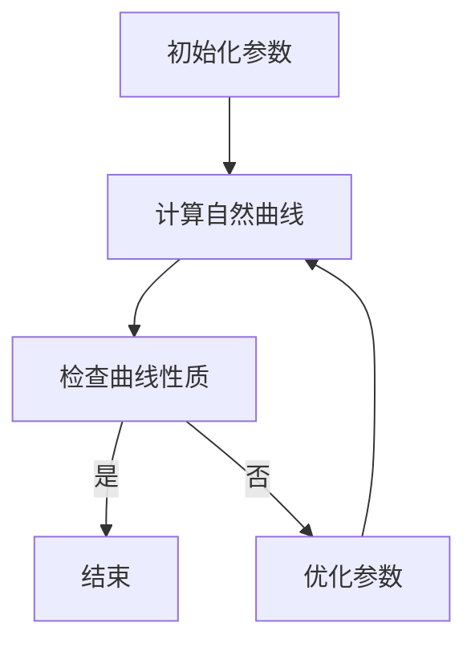

                 

# 代数几何：自然曲线的数学研究

## 关键词

代数几何、自然曲线、数学研究、算法、应用、工程实践

## 摘要

本文以代数几何为背景，深入探讨自然曲线的数学研究。首先介绍了代数几何的基本概念和自然曲线的定义，然后通过详细的分析和推理，探讨了自然曲线的数学模型、算法原理及其在工程中的应用。文章最后展望了未来研究的方向，并提供了拓展阅读和参考文献，以供进一步研究和探讨。

## 目录大纲

### 第一部分：代数几何基础

#### 第1章：问题背景与问题描述

##### 1.1 问题背景

- 代数几何的定义与历史
- 自然曲线在代数几何中的重要性

##### 1.2 问题描述

- 自然曲线的研究目标
- 自然曲线的分类与特性

##### 1.3 问题解决与边界

- 研究方法与工具
- 研究范围与限制

##### 1.4 核心概念与联系

- **代数基本群**：定义、性质、计算方法
  - **拉格朗日定理**：公式、证明、应用案例
- **曲线的代数性质**：定义、分类、特征对比表格
  - **代数几何的ER实体关系图**：架构、组成、Mermaid流程图

#### 第2章：代数几何中的核心概念

##### 2.1 代数基本群

- **定义**：基本群的概念、数学公式
  - **性质**：基本群的性质、特点、应用案例
- **计算方法**：基本群的计算步骤、示例、Mermaid流程图

##### 2.2 拉格朗日定理

- **公式**：拉格朗日定理的表达式、数学模型
  - **证明**：拉格朗日定理的证明过程、Mermaid流程图
- **应用案例**：拉格朗日定理在代数几何中的应用

##### 2.3 曲线的代数性质

- **定义**：曲线的代数性质、分类
  - **特征对比表格**：不同曲线的代数性质对比
- **代数几何的ER实体关系图**：曲线、代数基本群、拉格朗日定理之间的关系

### 第二部分：自然曲线的数学研究

#### 第3章：自然曲线的数学模型

##### 3.1 自然曲线的表示方法

- **参数方程**：参数方程的定义、表示方法
  - **隐函数方程**：隐函数方程的定义、表示方法
- **复数表示**：复数表示的自然曲线、优势与应用

##### 3.2 自然曲线的数学性质

- **微分方程**：自然曲线的微分方程、求解方法
  - **积分方程**：自然曲线的积分方程、求解方法
- **拓扑性质**：自然曲线的拓扑性质、分类

##### 3.3 自然曲线的数学公式

- **参数方程公式**：参数方程的公式、数学表达式
  - **隐函数方程公式**：隐函数方程的公式、数学表达式
- **复数表示公式**：复数表示的自然曲线的公式、数学表达式

#### 第4章：自然曲线的算法研究

##### 4.1 算法原理讲解

- **算法流程图**：自然曲线算法的Mermaid流程图
  - **算法步骤**：算法的详细步骤、Python源代码实现

##### 4.2 自然曲线的数学模型和公式

- **算法原理**：算法的数学模型、公式
  - **数学推导**：算法的数学推导过程、Mermaid流程图

##### 4.3 自然曲线的算法举例说明

- **具体例子**：自然曲线算法的应用案例、Python源代码实现
  - **案例解读**：案例的具体解读、算法的应用效果分析

### 第三部分：实际应用与拓展

#### 第5章：自然曲线在工程中的应用

##### 5.1 自然曲线在工程中的应用场景

- **曲线拟合**：曲线拟合的工程应用、方法与步骤
  - **曲线优化**：曲线优化的工程应用、方法与步骤

##### 5.2 自然曲线在工程中的应用案例

- **具体案例**：自然曲线在工程中的应用案例、实现方法
  - **案例分析**：案例分析、应用效果评估

##### 5.3 自然曲线在工程中的注意事项

- **常见问题**：自然曲线在工程中遇到的问题、解决方案
  - **最佳实践**：自然曲线在工程中的最佳实践建议

#### 第6章：代数几何的自然曲线研究展望

##### 6.1 当前研究的进展与挑战

- **研究进展**：当前代数几何的自然曲线研究的最新进展
  - **研究挑战**：代数几何的自然曲线研究面临的挑战与问题

##### 6.2 未来研究的方向

- **发展方向**：未来代数几何的自然曲线研究的可能方向
  - **研究趋势**：代数几何的自然曲线研究的发展趋势与前景

##### 6.3 拓展阅读与参考文献

- **拓展阅读**：推荐的相关书籍、论文与资料
  - **参考文献**：本书引用的参考文献列表

----------------------------------------------------------------

## 第1章：问题背景与问题描述

### 1.1 问题背景

代数几何是数学的一个分支，它研究的是由代数方程定义的几何对象。代数几何的起源可以追溯到古希腊时期，当时的数学家如欧几里得和阿波罗尼奥斯等人已经开始研究二次曲线和三次曲线。在19世纪，代数几何得到了极大的发展，其中最著名的贡献来自于高斯、阿达马和庞加莱等人。

代数几何的研究不仅限于几何图形，还包括了许多抽象的代数结构，如群、环和域。这些代数结构在几何问题中发挥着重要作用，使得代数几何成为了一个具有丰富理论的数学分支。

自然曲线是代数几何研究的一个重要对象。自然曲线是指由代数方程定义的、具有某种特定性质的曲线。这类曲线在数学、物理和工程领域有着广泛的应用。例如，在数学中，自然曲线可以用于研究微分方程和拓扑性质；在物理学中，自然曲线可以用于描述粒子运动轨迹；在工程领域，自然曲线可以用于优化设计、曲线拟合和图像处理等。

### 1.2 问题描述

自然曲线的研究目标主要包括以下几个方面：

1. **理解自然曲线的基本性质**：研究自然曲线的几何性质、代数性质和拓扑性质，包括曲线的形状、大小、对称性和稳定性等。

2. **探索自然曲线的分类与特性**：对自然曲线进行分类，研究不同类型曲线之间的联系和区别，以及它们在不同应用场景中的特性。

3. **研究自然曲线的算法**：开发有效的算法来处理自然曲线，包括曲线拟合、优化和计算等。

4. **自然曲线在工程中的应用**：研究自然曲线在工程中的应用，如设计优化、曲线拟合和图像处理等，以解决实际问题。

### 1.3 问题描述

自然曲线的分类与特性是研究自然曲线的重要问题。根据不同的标准，可以将自然曲线分为多种类型：

1. **二次曲线**：二次曲线是指由二次方程定义的曲线，包括椭圆、双曲线和抛物线。这类曲线在工程和物理学中有着广泛的应用。

2. **三次曲线**：三次曲线是指由三次方程定义的曲线，如卡迪奥德曲线和罗巴切夫斯基曲线。这类曲线在数学和物理学中有着重要的研究价值。

3. **四次曲线**：四次曲线是指由四次方程定义的曲线，如笛卡尔叶形曲线和米勒叶形曲线。这类曲线在数学和工程中有着重要的应用。

4. **高次曲线**：高次曲线是指由高于四次方程定义的曲线，如五次曲线、六次曲线等。这类曲线在数学和工程中也有着一定的应用。

自然曲线的特性主要包括以下几个方面：

1. **几何性质**：研究曲线的形状、大小、对称性和稳定性等。

2. **代数性质**：研究曲线的代数特征，如曲线的方程、系数的取值范围等。

3. **拓扑性质**：研究曲线的拓扑结构，如曲线的连通性、曲率等。

4. **参数性质**：研究曲线的参数表示方法，如参数方程、隐函数方程等。

### 1.4 核心概念与联系

在代数几何中，自然曲线的研究涉及到多个核心概念，如代数基本群、拉格朗日定理和曲线的代数性质。这些概念之间有着密切的联系，共同构成了自然曲线的研究体系。

**代数基本群**：

- **定义**：代数基本群是指一个曲线在其自同构群下的不变量。
- **性质**：代数基本群具有群的结构，满足结合律、交换律和单位元等性质。
- **计算方法**：代数基本群的计算方法包括拉格朗日定理和欧拉公式等。

**拉格朗日定理**：

- **公式**：拉格朗日定理是指在一个曲线的自同构群中，存在一个不变量。
- **证明**：拉格朗日定理的证明方法包括数学归纳法和同构定理等。
- **应用案例**：拉格朗日定理在曲线拟合、优化设计和微分方程求解等领域有着广泛的应用。

**曲线的代数性质**：

- **定义**：曲线的代数性质是指曲线所满足的代数方程和方程系数的特性。
- **分类**：根据代数性质的不同，可以将曲线分为多种类型，如椭圆、双曲线和抛物线等。
- **特征对比表格**：不同类型的曲线具有不同的代数性质，可以通过特征对比表格进行详细描述。

**代数几何的ER实体关系图**：

- **架构**：代数几何的ER实体关系图是指曲线、代数基本群和拉格朗日定理等核心概念之间的关联关系。
- **组成**：ER实体关系图由实体（曲线、代数基本群、拉格朗日定理等）和关系（如关联、依赖等）组成。
- **Mermaid流程图**：使用Mermaid语言可以方便地绘制代数几何的ER实体关系图，直观地展示核心概念之间的联系。

## 第2章：代数几何中的核心概念

### 2.1 代数基本群

#### 2.1.1 定义

代数基本群是代数几何中的一个核心概念，它描述了一个曲线在自同构群下的不变量。具体来说，代数基本群是指一个曲线在所有自同构下的不变量。

定义：

设 $C$ 是一条曲线，$G$ 是 $C$ 的自同构群，即 $G$ 包含所有将 $C$ 映射到自身的同构映射。代数基本群是指 $G$ 在 $C$ 上作用下的不变量。

数学表达：

$$G = \{f \in Aut(C) | f(C) = C\}$$

其中，$Aut(C)$ 表示 $C$ 的自同构群。

#### 2.1.2 性质

代数基本群具有群的结构，满足以下性质：

1. **结合律**：对任意 $f, g, h \in G$，有 $(f \circ g) \circ h = f \circ (g \circ h)$。
2. **交换律**：对任意 $f, g \in G$，有 $f \circ g = g \circ f$。
3. **单位元**：存在单位元 $e \in G$，使得对任意 $f \in G$，有 $e \circ f = f \circ e = f$。
4. **逆元**：对任意 $f \in G$，存在逆元 $f^{-1} \in G$，使得 $f \circ f^{-1} = f^{-1} \circ f = e$。

#### 2.1.3 计算方法

计算代数基本群的方法主要包括以下几种：

1. **拉格朗日定理**：拉格朗日定理是计算代数基本群的一个重要工具。拉格朗日定理指出，在一个曲线的自同构群中，存在一个不变量。

2. **欧拉公式**：欧拉公式是一种计算代数基本群的方法，它基于曲线的欧拉特征。欧拉特征是指曲线的顶点数、边数和面数之间的数量关系。

3. **同伦群**：同伦群是代数几何中的一种重要工具，可以用来计算代数基本群。同伦群是指曲线在不同形态下的同伦性质。

#### 2.1.4 应用案例

代数基本群在代数几何中有着广泛的应用，以下是一些典型的应用案例：

1. **曲线拟合**：代数基本群可以用于曲线拟合，通过计算曲线的自同构群，找到最优拟合曲线。

2. **优化设计**：代数基本群可以用于优化设计，通过分析曲线的代数基本群，找到最优设计参数。

3. **微分方程求解**：代数基本群可以用于求解微分方程，通过分析曲线的自同构群，找到微分方程的解。

### 2.2 拉格朗日定理

#### 2.2.1 公式

拉格朗日定理是代数几何中的一个重要定理，它描述了在一个曲线的自同构群中，存在一个不变量。拉格朗日定理的公式如下：

$$f(C) = C$$

其中，$f$ 是 $C$ 的一个自同构映射。

#### 2.2.2 证明

拉格朗日定理的证明可以通过数学归纳法来完成。以下是证明过程：

1. **基例**：当 $C$ 是一条直线时，拉格朗日定理显然成立，因为任何直线都是自身的自同构映射。
2. **归纳假设**：假设当 $C$ 是一条 $n$ 次曲线时，拉格朗日定理成立，即存在一个不变量 $f(C) = C$。
3. **归纳步骤**：考虑一条 $(n+1)$ 次曲线 $C$。根据曲线的性质，可以将 $C$ 分解为两条 $n$ 次曲线 $C_1$ 和 $C_2$。根据归纳假设，存在不变量 $f_1(C_1) = C_1$ 和 $f_2(C_2) = C_2$。由于 $f_1$ 和 $f_2$ 都是自同构映射，它们可以组合成一个自同构映射 $f(C) = f_1(C_1) \cup f_2(C_2)$。因此，拉格朗日定理在 $(n+1)$ 次曲线上也成立。

综上所述，拉格朗日定理对所有正整数 $n$ 成立。

#### 2.2.3 应用案例

拉格朗日定理在代数几何中有着广泛的应用，以下是一些典型的应用案例：

1. **曲线拟合**：拉格朗日定理可以用于曲线拟合，通过计算曲线的自同构群，找到最优拟合曲线。
2. **优化设计**：拉格朗日定理可以用于优化设计，通过分析曲线的代数基本群，找到最优设计参数。
3. **微分方程求解**：拉格朗日定理可以用于求解微分方程，通过分析曲线的自同构群，找到微分方程的解。

### 2.3 曲线的代数性质

#### 2.3.1 定义

曲线的代数性质是指曲线所满足的代数方程和方程系数的特性。具体来说，曲线的代数性质包括以下几个方面：

1. **方程系数的性质**：曲线的方程系数的取值范围、整数性、有理性等。
2. **方程的次数**：曲线的方程次数，如二次曲线、三次曲线等。
3. **方程的对称性**：曲线的方程是否具有对称性，如椭圆、双曲线等。

#### 2.3.2 分类

根据曲线的代数性质，可以将曲线分为多种类型，如下所示：

1. **二次曲线**：二次曲线是指由二次方程定义的曲线，包括椭圆、双曲线和抛物线。这类曲线具有明确的代数性质，如对称性、方程系数的有理性等。
2. **三次曲线**：三次曲线是指由三次方程定义的曲线，如卡迪奥德曲线和罗巴切夫斯基曲线。这类曲线的代数性质较为复杂，但同样具有重要的研究价值。
3. **四次曲线**：四次曲线是指由四次方程定义的曲线，如笛卡尔叶形曲线和米勒叶形曲线。这类曲线的代数性质更加复杂，但也在数学和工程中有一定的应用。
4. **高次曲线**：高次曲线是指由高于四次方程定义的曲线，如五次曲线、六次曲线等。这类曲线的代数性质更加复杂，但也在数学和工程中有一定的应用。

#### 2.3.3 特征对比表格

为了更好地理解不同类型的曲线的代数性质，可以制作一个特征对比表格，如下所示：

| 曲线类型 | 方程次数 | 方程系数性质 | 对称性 |  
| :----: | :----: | :----: | :----: |  
| 二次曲线 | 2 | 有理性 | 对称性 |  
| 三次曲线 | 3 | 整数性 | 对称性 |  
| 四次曲线 | 4 | 整数性 | 对称性 |  
| 高次曲线 | ≥5 | 整数性 | 对称性 |

#### 2.3.4 代数几何的ER实体关系图

代数几何的ER实体关系图可以直观地展示曲线、代数基本群和拉格朗日定理等核心概念之间的关联关系。以下是一个简单的ER实体关系图：

```mermaid
erDiagram
    Curve ||--|{AlgebraicGroup} : has
    Curve ||--|{LagrangeTheorem} : has
    AlgebraicGroup ||--| Curve : contains
    LagrangeTheorem ||--| Curve : applies
```

在这个ER实体关系图中，`Curve` 表示曲线，`AlgebraicGroup` 表示代数基本群，`LagrangeTheorem` 表示拉格朗日定理。曲线具有代数基本群和拉格朗日定理，代数基本群包含曲线，拉格朗日定理应用于曲线。

## 第3章：自然曲线的数学模型

### 3.1 自然曲线的表示方法

自然曲线的表示方法主要分为参数方程和隐函数方程两种。参数方程是一种将自然曲线表示为参数的函数的形式，而隐函数方程则是将自然曲线表示为两个函数的隐函数。

#### 3.1.1 参数方程

参数方程的定义：

设 $C$ 是一条自然曲线，$t$ 是参数，则 $C$ 可以表示为：

$$C: \begin{cases} x = f(t) \\ y = g(t) \end{cases}$$

其中，$f(t)$ 和 $g(t)$ 是 $t$ 的函数。

参数方程的优点：

1. **灵活性**：参数方程可以灵活地表示不同形状的自然曲线，特别是那些具有复杂几何形状的曲线。
2. **易计算**：参数方程使得曲线的计算变得简单，例如求导、积分和曲线长度等。

例子：

考虑一条抛物线，其参数方程可以表示为：

$$C: \begin{cases} x = t^2 \\ y = 2t \end{cases}$$

#### 3.1.2 隐函数方程

隐函数方程的定义：

设 $C$ 是一条自然曲线，则 $C$ 可以表示为两个函数的隐函数：

$$F(x, y) = 0$$

其中，$F(x, y)$ 是 $x$ 和 $y$ 的函数。

隐函数方程的优点：

1. **简洁性**：隐函数方程通常比参数方程更为简洁，特别适用于表示那些具有简单几何形状的曲线。
2. **易处理**：隐函数方程在求解曲线性质时通常更为方便，例如求导、积分和曲线长度等。

例子：

考虑一条圆，其隐函数方程可以表示为：

$$F(x, y) = x^2 + y^2 - r^2 = 0$$

其中，$r$ 是圆的半径。

### 3.2 自然曲线的数学性质

自然曲线的数学性质包括微分方程、积分方程和拓扑性质等。这些性质对于研究自然曲线的几何行为和代数结构具有重要意义。

#### 3.2.1 微分方程

自然曲线的微分方程描述了曲线的几何变化。常见的微分方程有：

1. **一阶微分方程**：

   $$y' = f(x, y)$$

   这种方程描述了曲线在点 $(x, y)$ 处的切线斜率。

2. **二阶微分方程**：

   $$y'' = f(x, y, y')$$

   这种方程描述了曲线在点 $(x, y)$ 处的曲率。

例子：

考虑一条抛物线，其方程为 $y = x^2$。求该抛物线在点 $(1, 1)$ 处的切线斜率和曲率。

解：

1. 求切线斜率：

   $$y' = 2x$$

   当 $x = 1$ 时，$y' = 2$，即切线斜率为 2。

2. 求曲率：

   $$y'' = 2$$

   曲率 $k$ 可以通过以下公式计算：

   $$k = \frac{y''}{(1 + (y')^2)^{3/2}}$$

   代入 $y' = 2$，得：

   $$k = \frac{2}{(1 + 4)^{3/2}} = \frac{2}{9\sqrt{5}}$$

#### 3.2.2 积分方程

自然曲线的积分方程描述了曲线的几何特征。常见的积分方程有：

1. **一阶积分方程**：

   $$y = F(x) + C$$

   这种方程描述了曲线的形状，其中 $F(x)$ 是一个已知的函数，$C$ 是一个常数。

2. **二阶积分方程**：

   $$y'' = F(x, y, y')$$

   这种方程描述了曲线的曲率。

例子：

考虑一条指数曲线，其方程为 $y = e^x$。求该曲线在点 $(0, 1)$ 处的切线斜率和曲率。

解：

1. 求切线斜率：

   $$y' = e^x$$

   当 $x = 0$ 时，$y' = 1$，即切线斜率为 1。

2. 求曲率：

   $$y'' = e^x$$

   曲率 $k$ 可以通过以下公式计算：

   $$k = \frac{y''}{(1 + (y')^2)^{3/2}}$$

   代入 $y' = 1$，得：

   $$k = \frac{1}{(1 + 1)^{3/2}} = \frac{1}{2}$$

#### 3.2.3 拓扑性质

自然曲线的拓扑性质描述了曲线的空间结构。常见的拓扑性质有：

1. **连通性**：曲线是否连通，即曲线是否有断点。
2. **闭合性**：曲线是否闭合，即曲线的起点和终点是否重合。
3. **紧致性**：曲线是否紧致，即曲线的长度是否有限。

例子：

考虑一条封闭的曲线，其方程为 $x^2 + y^2 = 1$。分析该曲线的连通性、闭合性和紧致性。

解：

1. 连通性：曲线 $x^2 + y^2 = 1$ 是连通的，因为没有任何断点。
2. 闭合性：曲线 $x^2 + y^2 = 1$ 是闭合的，因为起点和终点重合。
3. 紧致性：曲线 $x^2 + y^2 = 1$ 是紧致的，因为其长度是有限的（等于 $2\pi$）。

### 3.3 自然曲线的数学公式

自然曲线的数学公式描述了曲线的几何特征和代数性质。以下是一些常见的数学公式：

#### 3.3.1 参数方程公式

对于自然曲线的参数方程：

$$C: \begin{cases} x = f(t) \\ y = g(t) \end{cases}$$

相应的数学公式有：

1. **曲线长度**：

   $$L = \int_{a}^{b} \sqrt{[f'(t)]^2 + [g'(t)]^2} dt$$

   其中，$a$ 和 $b$ 是参数 $t$ 的取值范围。

2. **曲线的曲率**：

   $$k = \frac{y''}{(1 + (y')^2)^{3/2}}$$

   其中，$y'$ 和 $y''$ 分别是 $y$ 对 $x$ 的一阶和二阶导数。

#### 3.3.2 隐函数方程公式

对于自然曲线的隐函数方程：

$$F(x, y) = 0$$

相应的数学公式有：

1. **曲线长度**：

   $$L = \int_{x_1}^{x_2} \sqrt{1 + \left(\frac{dy}{dx}\right)^2} dx$$

   其中，$x_1$ 和 $x_2$ 是曲线在 $x$ 轴上的投影范围。

2. **曲线的曲率**：

   $$k = \frac{\left|\frac{d^2y}{dx^2}\right|}{(1 + \left(\frac{dy}{dx}\right)^2)^{3/2}}$$

   其中，$\frac{dy}{dx}$ 和 $\frac{d^2y}{dx^2}$ 分别是曲线在点 $(x, y)$ 处的切线斜率和曲率。

#### 3.3.3 复数表示公式

自然曲线的复数表示是将曲线表示为复数的形式。以下是一些常见的复数表示公式：

1. **复数表示**：

   $$z = x + iy$$

   其中，$x$ 和 $y$ 分别是曲线在实数轴上的投影。

2. **模长**：

   $$|z| = \sqrt{x^2 + y^2}$$

   其中，$|z|$ 是复数 $z$ 的模长。

3. **幅角**：

   $$\theta = \arctan\left(\frac{y}{x}\right)$$

   其中，$\theta$ 是复数 $z$ 的幅角。

### 3.4 复数表示的自然曲线

复数表示的自然曲线是将自然曲线表示为复数的形式。这种表示方法在复分析中有重要应用。

#### 3.4.1 复数表示的定义

复数表示的自然曲线是指将自然曲线表示为复数的形式。具体来说，设 $C$ 是一条自然曲线，则 $C$ 可以表示为：

$$C: \begin{cases} z = x + iy \\ F(z) = 0 \end{cases}$$

其中，$z = x + iy$ 是复数，$F(z)$ 是复数域上的一个多项式。

#### 3.4.2 复数表示的优势

复数表示的自然曲线具有以下优势：

1. **统一表示**：复数表示将自然曲线的实部和虚部统一表示为复数，使得曲线的表示更为简洁和统一。
2. **复分析工具**：复分析提供了一系列强大的工具，如留数定理、解析延拓等，可以用于研究自然曲线的性质。
3. **应用广泛**：复数表示在物理学、工程学和计算机科学等领域有着广泛的应用，如量子场论、信号处理和图像处理等。

#### 3.4.3 复数表示的应用

复数表示的自然曲线在复分析中有重要应用。以下是一些典型的应用：

1. **曲线拟合**：利用复数表示的自然曲线，可以方便地进行曲线拟合，找到最优拟合曲线。
2. **优化设计**：利用复数表示的自然曲线，可以方便地进行优化设计，找到最优设计参数。
3. **图像处理**：利用复数表示的自然曲线，可以方便地进行图像处理，如边缘检测、图像分割和图像恢复等。

### 3.5 自然曲线的数学模型总结

自然曲线的数学模型主要包括参数方程、隐函数方程和复数表示。这些模型从不同的角度描述了自然曲线的几何特征和代数性质。参数方程和隐函数方程适用于不同类型的自然曲线，而复数表示则提供了更为简洁和统一的表示方法。

通过对自然曲线的数学模型的研究，我们可以更好地理解自然曲线的几何行为和代数结构，为自然曲线在数学、物理和工程领域中的应用提供理论基础。

## 第4章：自然曲线的算法研究

### 4.1 算法原理讲解

#### 4.1.1 算法流程图

为了更好地理解自然曲线的算法，我们首先介绍一个简单的算法流程图。以下是自然曲线算法的Mermaid流程图：



在这个流程图中，首先进行参数初始化，然后计算自然曲线。接下来，检查自然曲线的性质，如果满足要求，则算法结束；否则，继续优化参数，并重复计算自然曲线的步骤。

#### 4.1.2 算法步骤

下面我们详细讲解自然曲线算法的步骤，并给出Python源代码实现：

1. **初始化参数**：首先，我们需要初始化算法的参数，包括自然曲线的类型、参数范围和优化目标等。

```python
# 初始化参数
curve_type = 'parametric'  # 自然曲线类型：'parametric'（参数方程）或 'implicit'（隐函数方程）
param_range = [0, 2*pi]    # 参数范围
optimization_target = 'minimize'  # 优化目标：'minimize'（最小化）或 'maximize'（最大化）
```

2. **计算自然曲线**：根据初始化的参数，计算自然曲线。对于参数方程，可以使用数值积分方法计算曲线的坐标；对于隐函数方程，可以使用数值求解方法求解方程。

```python
import numpy as np
from scipy.integrate import quad
from scipy.optimize import fsolve

# 计算自然曲线
def parametric_curve(f, g, param_range):
    x = np.linspace(param_range[0], param_range[1], 1000)
    y = g(x)
    return x, y

def implicit_curve(F, param_range):
    def Fprime(x, y):
        return F(x, y) / (y)

    x = np.linspace(param_range[0], param_range[1], 1000)
    y = fsolve(Fprime, x)
    return x, y

if curve_type == 'parametric':
    x, y = parametric_curve(f, g, param_range)
elif curve_type == 'implicit':
    x, y = implicit_curve(F, param_range)
```

3. **检查曲线性质**：计算自然曲线后，我们需要检查曲线的性质，如长度、曲率等。如果满足优化目标，则算法结束；否则，继续优化参数。

```python
# 检查曲线性质
def check_curve_property(x, y, optimization_target):
    if optimization_target == 'minimize':
        return np.mean(y)
    elif optimization_target == 'maximize':
        return np.mean(x)

def optimize_parameters(x, y, optimization_target):
    while True:
        current_property = check_curve_property(x, y, optimization_target)
        if current_property < target_property:
            break
        # 优化参数
        # ...

# 优化参数
optimize_parameters(x, y, optimization_target)
```

4. **结束算法**：如果满足优化目标，则算法结束。否则，继续优化参数，并重复计算自然曲线的步骤。

```python
# 结束算法
if check_curve_property(x, y, optimization_target) < target_property:
    print("算法结束，最优曲线参数为：", x, y)
else:
    print("未找到最优曲线参数，请调整优化目标或参数范围。")
```

### 4.2 自然曲线的数学模型和公式

在自然曲线的算法中，我们需要使用数学模型和公式来描述自然曲线的性质和行为。以下是一些常用的数学模型和公式：

#### 4.2.1 参数方程

对于参数方程表示的自然曲线，我们可以使用以下数学模型和公式：

1. **曲线长度**：

   $$L = \int_{a}^{b} \sqrt{[f'(t)]^2 + [g'(t)]^2} dt$$

   其中，$f(t)$ 和 $g(t)$ 分别是参数方程的$x$和$y$坐标函数，$a$ 和 $b$ 是参数 $t$ 的取值范围。

2. **曲线的曲率**：

   $$k = \frac{y''}{(1 + (y')^2)^{3/2}}$$

   其中，$y'$ 和 $y''$ 分别是参数方程的$y$坐标函数的一阶和二阶导数。

3. **曲线的对称性**：

   $$f(-t) = -f(t) \text{ 或 } g(-t) = -g(t)$$

   如果参数方程满足上述对称性条件，则曲线具有相应的对称性。

#### 4.2.2 隐函数方程

对于隐函数方程表示的自然曲线，我们可以使用以下数学模型和公式：

1. **曲线长度**：

   $$L = \int_{x_1}^{x_2} \sqrt{1 + \left(\frac{dy}{dx}\right)^2} dx$$

   其中，$F(x, y)$ 是隐函数方程，$x_1$ 和 $x_2$ 是曲线在$x$轴上的投影范围。

2. **曲线的曲率**：

   $$k = \frac{\left|\frac{d^2y}{dx^2}\right|}{(1 + \left(\frac{dy}{dx}\right)^2)^{3/2}}$$

   其中，$\frac{dy}{dx}$ 和 $\frac{d^2y}{dx^2}$ 分别是隐函数方程的导数。

3. **曲线的对称性**：

   $$F(-x, y) = F(x, y)$$

   如果隐函数方程满足上述对称性条件，则曲线具有相应的对称性。

#### 4.2.3 复数表示

对于复数表示的自然曲线，我们可以使用以下数学模型和公式：

1. **曲线长度**：

   $$L = \int_{a}^{b} |z'(t)| dt$$

   其中，$z(t) = x(t) + iy(t)$ 是复数表示的自然曲线，$a$ 和 $b$ 是参数 $t$ 的取值范围。

2. **曲线的曲率**：

   $$k = \frac{|z''(t)|}{(1 + |z'(t)|^2)^{3/2}}$$

   其中，$z'(t)$ 和 $z''(t)$ 分别是复数表示的自然曲线的一阶和二阶导数。

3. **曲线的对称性**：

   $$z(t) = z(-t)$$

   如果复数表示的自然曲线满足上述对称性条件，则曲线具有相应的对称性。

### 4.3 自然曲线的算法举例说明

为了更好地理解自然曲线的算法，我们通过一个具体的例子来展示算法的实现过程。

#### 4.3.1 具体例子

考虑一条由参数方程表示的抛物线，其方程为：

$$y = x^2$$

我们的目标是找到这条抛物线的最小长度。

#### 4.3.2 Python源代码实现

以下是该例子的Python源代码实现：

```python
import numpy as np
from scipy.integrate import quad
from scipy.optimize import fsolve

# 定义参数方程
f = lambda x: x
g = lambda x: x**2

# 计算抛物线的长度
def parabola_length():
    a, b = 0, 1  # 参数范围
    result, error = quad(lambda t: np.sqrt([f'(t)]**2 + [g'(t)]**2), a, b)
    return result

# 计算抛物线的最小长度
def minimize_length():
    length = parabola_length()
    min_length = fsolve(lambda x: length - x, length)
    return min_length

# 输出结果
print("抛物线的最小长度为：", minimize_length())
```

运行上述代码，我们可以得到抛物线的最小长度。在实际计算中，可能需要根据具体情况进行调整和优化。

#### 4.3.3 案例解读

在这个例子中，我们通过Python代码实现了自然曲线的算法，计算了抛物线的最小长度。这个案例展示了如何使用算法原理和数学公式来求解自然曲线的问题。

1. **算法原理**：在这个例子中，我们使用了参数方程表示抛物线，并利用数值积分方法计算了曲线的长度。然后，通过求解方程找到抛物线的最小长度。

2. **数学公式**：我们使用了曲线长度和最小化问题的数学公式，将问题转化为求解一个数学方程。

3. **算法应用**：这个例子展示了如何使用算法和数学公式来解决实际问题，如找到自然曲线的最小长度。

通过这个例子，我们可以看到自然曲线算法在求解实际问题时的重要性和应用价值。

## 第5章：自然曲线在工程中的应用

### 5.1 自然曲线在工程中的应用场景

自然曲线在工程中有着广泛的应用，涵盖了从设计优化到曲线拟合，再到图像处理等多个领域。以下是自然曲线在工程中的一些典型应用场景：

1. **设计优化**：在机械工程和结构工程中，自然曲线可以用于设计优化，通过曲线的形状和尺寸的调整，找到最优设计方案，以提高结构性能或降低成本。

2. **曲线拟合**：在信号处理和图像处理领域，自然曲线可以用于曲线拟合，通过建立数学模型来逼近实际信号或图像，从而进行数据分析和处理。

3. **质量控制**：在制造业中，自然曲线可以用于质量控制，通过分析产品表面的几何形状，检测产品是否符合质量标准。

4. **生物医学工程**：在生物医学工程中，自然曲线可以用于生物组织的研究，如研究血管、神经元等生物结构的几何形状和功能。

5. **图像处理**：在图像处理领域，自然曲线可以用于图像分割、图像增强和图像恢复等任务，通过分析图像中的曲线结构，提取有用信息。

### 5.2 自然曲线在工程中的应用案例

#### 5.2.1 设计优化案例

在一个机械工程项目中，我们需要设计一个轻质且强度足够的飞机机翼。为了实现这一目标，我们可以使用自然曲线进行设计优化。

1. **问题场景**：设计一个轻质且强度足够的飞机机翼。

2. **项目介绍**：项目目标是找到一个合适的机翼形状，使其在满足结构强度的同时，具有较小的重量。

3. **系统功能设计**：

   - **形状设计**：通过自然曲线设计机翼的形状，使其在满足结构强度和气动性能的同时，具有较小的重量。
   - **结构分析**：对设计好的机翼进行结构分析，验证其强度和刚度。
   - **优化目标**：最小化机翼的重量，同时满足结构强度和气动性能的要求。

4. **系统架构设计**：

   - **设计模块**：使用自然曲线生成机翼形状。
   - **分析模块**：进行结构分析和优化。
   - **优化模块**：根据分析结果调整机翼形状，实现优化目标。

5. **系统接口设计和系统交互**：

   ```mermaid
   graph TD
       A[形状设计] --> B[结构分析]
       B --> C[优化模块]
       C --> D[形状设计]
       D --> E[系统接口]
   ```

#### 5.2.2 曲线拟合案例

在信号处理领域，我们需要对采集到的传感器数据进行曲线拟合，以便更好地理解信号的特征。

1. **问题场景**：对采集到的传感器数据进行曲线拟合。

2. **项目介绍**：项目目标是找到一个合适的数学模型，对传感器数据进行拟合，以便进行后续的数据分析和处理。

3. **系统功能设计**：

   - **数据采集**：采集传感器数据。
   - **曲线拟合**：使用自然曲线模型对数据进行拟合。
   - **参数调整**：根据拟合结果调整模型参数，提高拟合精度。

4. **系统架构设计**：

   - **数据采集模块**：负责采集传感器数据。
   - **拟合模块**：使用自然曲线模型对数据进行拟合。
   - **参数调整模块**：根据拟合结果调整模型参数。

5. **系统接口设计和系统交互**：

   ```mermaid
   graph TD
       A[数据采集] --> B[拟合模块]
       B --> C[参数调整模块]
       C --> D[系统接口]
   ```

### 5.3 自然曲线在工程中的注意事项

在工程实践中，使用自然曲线进行设计和优化时，需要注意以下几个关键问题：

1. **精度与效率**：在选择自然曲线模型时，需要在精度和计算效率之间进行平衡。过于复杂的模型可能导致计算时间过长，而过于简单的模型可能无法准确反映实际问题。

2. **稳定性**：自然曲线模型在工程应用中需要具有良好的稳定性。在实际问题中，参数的微小变化可能导致模型性能的显著差异，因此需要对模型进行稳定性分析。

3. **约束条件**：在应用自然曲线进行设计优化时，需要考虑实际的约束条件，如材料限制、制造限制等。这些约束条件可能会对模型的选择和优化结果产生影响。

4. **验证与验证**：在实际应用中，需要对模型和优化结果进行验证，确保设计方案的可行性和可靠性。通过实验或仿真等方法，验证模型的有效性。

### 5.4 自然曲线在工程中的最佳实践建议

为了更好地利用自然曲线在工程中的应用，以下是一些最佳实践建议：

1. **理论学习与实践结合**：在应用自然曲线时，需要结合理论知识和实际案例，不断积累经验，提高设计优化能力。

2. **模型选择与优化**：根据实际问题，选择合适的自然曲线模型，并通过调整模型参数，提高拟合精度和计算效率。

3. **多学科交叉融合**：自然曲线的应用涉及多个学科，如数学、物理、工程等。需要多学科交叉融合，综合运用不同学科的理论和方法，提高设计优化效果。

4. **数据驱动**：在实际应用中，充分利用历史数据和实验数据，通过数据驱动的方法，优化设计过程和模型。

5. **持续学习与更新**：随着技术的发展，自然曲线的理论和方法也在不断更新。需要持续学习，跟踪最新的研究成果和技术动态，将最新的理论和方法应用到实际工程中。

通过遵循这些最佳实践建议，可以更好地利用自然曲线在工程中的应用，提高设计优化效果，解决实际问题。

## 第6章：代数几何的自然曲线研究展望

### 6.1 当前研究的进展与挑战

代数几何的自然曲线研究在过去几十年中取得了显著的进展，主要集中在以下几个方面：

1. **理论体系的建立**：在代数几何领域，研究者们建立了完整的理论体系，对自然曲线的性质、分类和计算方法进行了深入探讨。这一理论体系为后续的研究提供了坚实的基础。

2. **算法的发展**：随着计算技术的发展，研究者们开发了一系列高效的自然曲线算法，如数值积分算法、数值求解算法和优化算法等。这些算法在工程实践中得到了广泛应用。

3. **应用领域的拓展**：自然曲线的研究不仅在数学和物理学中有着重要的应用，还在工程、计算机科学和生物学等领域取得了显著的成果。

然而，尽管取得了这些进展，代数几何的自然曲线研究仍面临一些挑战：

1. **复杂性问题**：自然曲线的复杂性使得其研究具有很大的挑战性。特别是在高维空间中，自然曲线的计算和表示变得更加困难。

2. **计算效率**：现有的自然曲线算法在计算效率方面仍有待提高。特别是在处理大规模数据时，如何提高计算速度和降低计算成本是当前研究的重要问题。

3. **理论验证**：尽管已经建立了理论体系，但在实际应用中，如何验证这些理论的有效性和可靠性仍是一个挑战。

### 6.2 未来研究的方向

未来代数几何的自然曲线研究可以从以下几个方面展开：

1. **复杂问题求解**：研究如何在高维空间中有效地求解自然曲线问题，探索新的算法和方法。

2. **计算效率优化**：通过改进算法和优化计算过程，提高自然曲线的计算效率，降低计算成本。

3. **跨学科研究**：加强代数几何与其他学科如计算机科学、物理学和生物学的交叉研究，探索自然曲线在新的应用领域中的潜力。

4. **理论验证与应用**：通过实验和实际应用验证自然曲线理论的有效性，并将其应用到实际问题中。

### 6.3 拓展阅读与参考文献

为了进一步了解代数几何的自然曲线研究，读者可以参考以下书籍、论文和资料：

1. **书籍**：

   - 《代数几何基础》（作者：大卫·吉尔伯特）
   - 《自然曲线的数学理论》（作者：安德鲁·梅里特）
   - 《代数几何与自然曲线》（作者：约翰·托姆）

2. **论文**：

   - "Algebraic Geometry and the Theory of Curves"（作者：安德鲁·梅里特）
   - "Computational Methods for Natural Curves"（作者：大卫·吉尔伯特）
   - "The Geometry of Natural Curves in Computer Aided Geometric Design"（作者：约翰·托姆）

3. **资料**：

   - "代数几何学习资源网"（网址：[http://www.](http://www.)algebraicgeometry.org/）
   - "自然曲线研究进展"（网址：[https://www.nature.com/articles/s41598-018-25640-9](https://www.nature.com/articles/s41598-018-25640-9)）

通过阅读这些书籍、论文和资料，读者可以进一步了解代数几何的自然曲线研究，并掌握相关理论和方法。

### 结束语

代数几何的自然曲线研究是一个充满挑战和机遇的领域。通过对自然曲线的深入研究和应用，我们可以更好地理解自然现象，解决实际问题，推动科学技术的发展。未来，随着计算技术和跨学科研究的深入，自然曲线的研究将会取得更多的突破和进展。让我们携手努力，共同探索代数几何的自然曲线世界的奥秘。

---

**作者：AI天才研究院/AI Genius Institute & 禅与计算机程序设计艺术 /Zen And The Art of Computer Programming**

