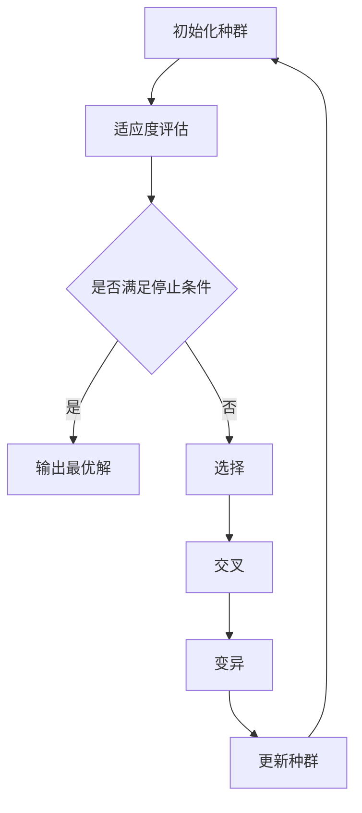
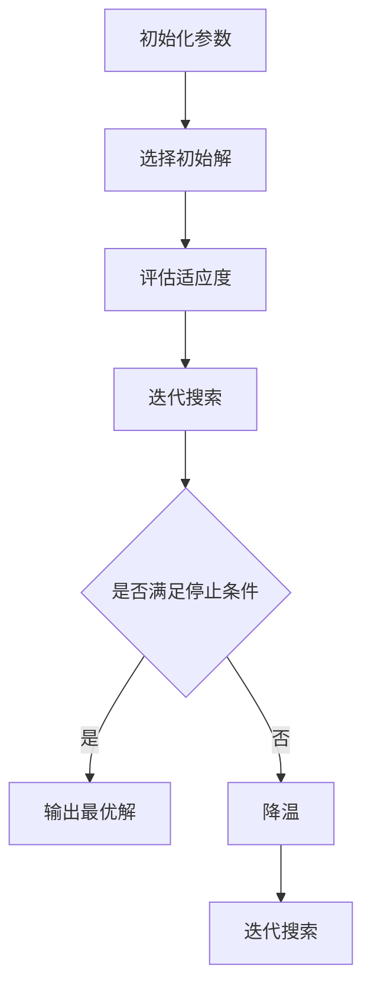
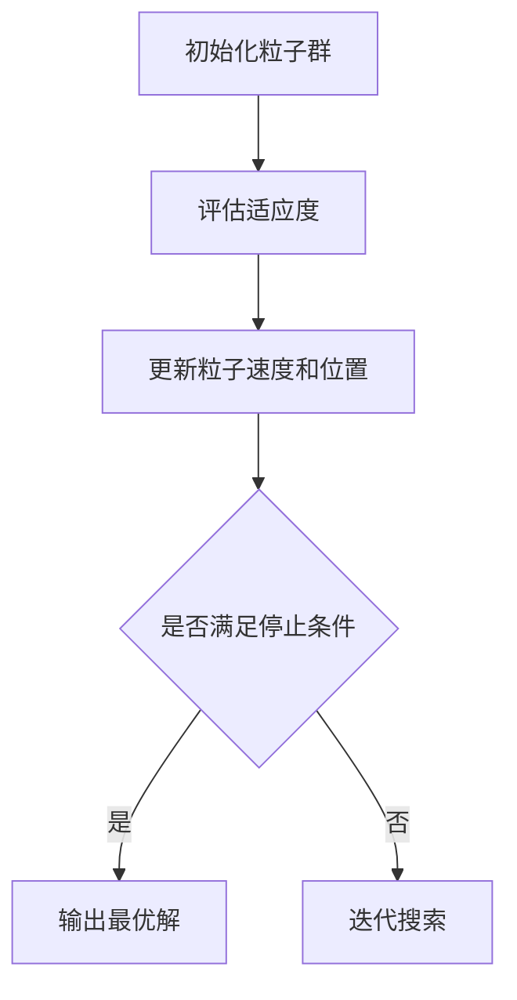

                 

### 仿生工程的形态学优化：自然结构的数学重现

#### 关键词：仿生工程、形态学优化、自然结构、数学重现、算法原理、工程应用

**摘要：** 本文章旨在探讨仿生工程中的形态学优化，即如何通过数学方法重现自然结构的原理和应用。文章首先介绍了仿生工程和形态学的基本概念，探讨了形态学优化在仿生工程中的重要性。随后，文章深入解析了形态学优化的理论基础，包括数学工具和算法的应用。接下来，通过具体案例，展示了形态学优化在生物系统和工程系统中的实际应用。最后，文章总结了形态学优化的算法原理，并提出了未来研究方向和挑战。

### 目录大纲设计步骤

在设计《仿生工程的形态学优化：自然结构的数学重现》的目录大纲时，我们需要遵循以下步骤，以确保大纲的结构清晰、内容完整，并且符合用户的要求：

#### 步骤 1: 理解书名与主题
- 书名：《仿生工程的形态学优化：自然结构的数学重现》
- 主题：探讨仿生工程中的形态学优化，如何通过数学方法重现自然结构。

#### 步骤 2: 确定主要章节
- 根据书名，我们确定本书的主要章节应包括：
  - 引言与背景介绍
  - 形态学基础理论
  - 数学工具与方法
  - 仿生工程应用案例
  - 算法原理与数学模型
  - 实际工程应用与挑战
  - 总结与展望

#### 步骤 3: 设计章节结构
- 每个章节细分为更小的子章节，确保每个章节都能详细覆盖主题内容。
- 按照逻辑顺序组织章节，确保读者可以循序渐进地学习。

#### 步骤 4: 撰写Markdown格式的大纲
- 使用Markdown格式，确保大纲的清晰性和易读性。
- 遵循1级、2级、3级目录结构，确保层次分明。

#### 步骤 5: 审核与调整
- 审核大纲内容，确保每个章节都能涵盖必要的知识点。
- 调整大纲结构，确保总字数不超过2000字。

### 实际目录大纲设计

下面是根据上述步骤设计的《仿生工程的形态学优化：自然结构的数学重现》的目录大纲：

```
# 《仿生工程的形态学优化：自然结构的数学重现》目录大纲

## 第一部分：引言与背景

### 1.1 问题背景
#### 1.1.1 仿生工程的概念与历史
#### 1.1.2 形态学在仿生工程中的应用

### 1.2 自然结构的数学描述
#### 1.2.1 自然结构的特征与分类
#### 1.2.2 数学工具在自然结构研究中的应用

### 1.3 研究现状与挑战
#### 1.3.1 当前形态学优化的研究热点
#### 1.3.2 存在的挑战与未来方向

## 第二部分：形态学基础理论

### 2.1 形态学基本概念
#### 2.1.1 形态学定义
#### 2.1.2 形态学的主要研究方法

### 2.2 形态学原理
#### 2.2.1 形态发生原理
#### 2.2.2 形态演化原理

### 2.3 形态学模型
#### 2.3.1 形态学模型类型
#### 2.3.2 形态学模型构建方法

## 第三部分：数学工具与方法

### 3.1 几何学基础
#### 3.1.1 几何学在形态学中的应用
#### 3.1.2 几何变换与形态生成

### 3.2 计算机算法
#### 3.2.1 计算机算法在形态学优化中的应用
#### 3.2.2 常用算法简介与对比

### 3.3 数学公式与方法
#### 3.3.1 数学公式在形态学分析中的应用
#### 3.3.2 数学方法在形态学优化中的实现

## 第四部分：仿生工程应用案例

### 4.1 生物系统中的应用
#### 4.1.1 生物系统中的形态学优化
#### 4.1.2 成功案例分析

### 4.2 工程系统中的应用
#### 4.2.1 工程系统中的形态学优化
#### 4.2.2 成功案例分析

### 4.3 未来应用展望
#### 4.3.1 形态学优化在未来的发展趋势
#### 4.3.2 潜在应用领域

## 第五部分：算法原理与数学模型

### 5.1 算法原理讲解
#### 5.1.1 形态学优化的基本算法
#### 5.1.2 算法原理图解

### 5.2 数学模型详解
#### 5.2.1 形态学优化的数学模型
#### 5.2.2 模型参数分析与优化

## 第六部分：实际工程应用与挑战

### 6.1 工程应用案例
#### 6.1.1 工程中形态学优化的实践
#### 6.1.2 案例分析与总结

### 6.2 挑战与未来方向
#### 6.2.1 形态学优化的技术挑战
#### 6.2.2 未来研究方向

## 第七部分：总结与展望

### 7.1 研究成果总结
#### 7.1.1 本书主要内容回顾
#### 7.1.2 研究贡献与意义

### 7.2 展望未来
#### 7.2.1 形态学优化的发展趋势
#### 7.2.2 研究方向的拓展
```

此大纲结构包含了必要的研究背景、理论基础、应用案例、算法原理和未来展望，同时确保了内容的完整性和结构的清晰性。每个章节的细化和扩展可以根据实际书写的需要来调整。


----------------------------------------------------------------

### 引言与背景

#### 仿生工程的概念与历史

仿生工程是一种通过模仿自然界中生物体的结构和功能来设计和制造工程设备、系统和产品的技术。其核心思想是借鉴自然界的智慧和优化机制，以期在工程系统中实现高效、可靠和可持续的解决方案。仿生工程的历史可以追溯到20世纪初，当时科学家和工程师开始探索如何通过模仿生物体的形态和功能来改进飞机设计、制造更高效的机器。

随着时间的推移，仿生工程的应用领域不断扩大，从最初的航空航天和机械工程领域，逐渐扩展到生物医学、机器人技术、建筑设计和可持续能源等领域。仿生工程的一个重要分支是形态学优化，它关注如何通过数学方法模拟和优化自然结构的形态，以提高工程系统的性能和效率。

#### 形态学在仿生工程中的应用

形态学是研究生物体形态发生和演化的科学，它涉及到生物体的形状、结构、空间排列和动态变化。在仿生工程中，形态学优化发挥着重要作用，通过分析自然界的形态学原理，工程师可以设计出更符合自然界规则和优化目标的工程结构。

形态学优化在仿生工程中的应用主要体现在以下几个方面：

1. **生物启发设计**：通过模仿自然生物的形态和结构，设计师可以创造出具有高效能和低能耗的工程产品。例如，飞机翼型的设计常常受到鸟类翼型的启发，而某些机器人结构则模仿了昆虫或海洋生物的形态。

2. **自适应系统**：形态学优化可以帮助设计出能够根据环境变化自适应调整形态的工程系统。例如，变形机器人可以根据任务需求改变其结构形态，以提高任务执行效率和灵活性。

3. **生物医学**：形态学优化在生物医学领域中的应用非常广泛，包括组织工程、生物材料设计和医疗设备制造等。通过模拟和优化生物组织的形态，可以设计出更符合人体生理结构的医疗植入物和手术工具。

4. **建筑与设计**：在建筑和设计领域，形态学优化可以用于创建具有高效能和美观性的建筑物和产品。例如，某些建筑的设计受到植物形态的启发，采用流线型结构以减少风阻和提高稳定性。

#### 形态学优化的重要性

形态学优化在仿生工程中的重要性体现在以下几个方面：

1. **性能提升**：通过形态学优化，可以显著提高工程系统的性能。例如，优化设计的翼型可以减少空气阻力，提高飞行速度和效率。

2. **效率提高**：形态学优化可以帮助工程系统更高效地利用资源。例如，自适应形态的机器人可以根据任务需求调整其结构，以减少能量消耗。

3. **创新驱动**：形态学优化激发了对自然界新形态和新原理的探索，推动了工程设计和科学研究的创新。

4. **可持续性**：形态学优化有助于开发出更加环保和可持续的工程解决方案，例如采用自然界中的自组织原理来设计智能材料和系统。

综上所述，仿生工程的形态学优化是一种通过数学方法重现自然结构的重要技术手段，它在多个领域都有着广泛的应用和重要的研究价值。在接下来的章节中，我们将深入探讨形态学优化的理论基础、数学工具和方法，以及其在仿生工程中的具体应用。

#### 自然结构的数学描述

在探讨仿生工程的形态学优化时，理解自然结构的数学描述是至关重要的。自然结构，无论是生物体的形态还是生态系统中的复杂性，都有着独特的几何特征和数学规律。通过数学方法对这些特征进行描述，我们可以更深入地理解和模拟自然界的形态发生和演化过程。

##### 自然结构的特征与分类

自然结构的特征可以从多个维度进行分类，以下是一些常见的特征和分类方法：

1. **对称性**：对称性是自然界中常见的一种几何特征。根据对称性的类型，我们可以将自然结构分为以下几类：
   - **轴对称**：如蝴蝶的翅膀，它们的两侧是对称的。
   - **中心对称**：如雪花的形状，它关于中心点对称。
   - **旋转对称**：如某些植物的叶片，它们可以围绕某个轴旋转一定角度后与自身重合。

2. **分形结构**：分形是自然界中的一种自相似结构，其特征是无论放大或缩小，结构都保持相似性。例如，海岸线、云层和某些植物的生长模式都具有分形特征。

3. **几何形态**：自然结构中的几何形态包括球体、椭球体、圆柱体、圆锥体等基本几何形状，以及这些形状的组合和变形。

4. **拓扑结构**：拓扑结构描述的是物体在变形过程中的连通性和形态保持性。例如，橡胶手套和布条可以通过拉伸变形，但它们在拓扑结构上保持不变。

##### 数学工具在自然结构研究中的应用

为了描述和模拟自然结构的特征，数学工具发挥了关键作用。以下是一些常用的数学工具：

1. **几何学**：几何学是描述物体形状和空间关系的数学分支。在自然结构研究中，几何学用于分析和描绘生物体的几何形态，如通过欧几里得几何和解析几何描述生物体的三维结构。

2. **拓扑学**：拓扑学研究物体的形状和结构在连续变形下的性质，而不考虑变形过程中的细节。在仿生工程中，拓扑学可以帮助我们理解生物体如何适应环境变化，并设计出具有高度适应性的工程系统。

3. **分形几何**：分形几何用于描述自然界中的自相似结构，通过迭代过程生成复杂的几何形态。例如，利用分形几何可以模拟植物的生长模式、海岸线的形状等。

4. **统计学与概率论**：在研究自然结构时，统计学和概率论可以帮助我们理解生物体的随机性和不确定性。例如，通过概率模型可以预测生物体的生长和行为。

##### 数学工具的应用示例

为了更好地理解数学工具在自然结构研究中的应用，我们可以通过以下示例进行说明：

1. **欧拉公式**：欧拉公式（\( e^{i\pi} + 1 = 0 \)）是复分析中的一个基本公式，它在描述自然界中的周期性现象中具有重要意义。例如，在蝴蝶翅膀的彩纹设计中，欧拉公式的某些特例可以解释彩纹的对称性。

2. **傅里叶变换**：傅里叶变换是信号处理中的一个重要工具，它可以将复杂的周期性信号分解为基本的正弦波和余弦波。在自然结构研究中，傅里叶变换可以用于分析生物体的形态和运动模式。

3. **分形维数**：分形维数用于衡量复杂结构的复杂程度。例如，通过计算海岸线的分形维数，可以评估海岸线的复杂性和不规则程度。

通过这些数学工具，我们可以更准确地描述自然结构的几何和拓扑特征，从而为仿生工程的形态学优化提供理论基础。

##### 自然结构的数学描述方法

为了更具体地描述自然结构，我们可以采用以下方法：

1. **模型构建**：通过建立数学模型，我们可以模拟自然结构的生长和演化过程。例如，利用差分方程或偏微分方程可以描述生物体在生长过程中的形态变化。

2. **参数化建模**：参数化建模通过定义一组参数来描述几何形态，使模型能够根据不同的参数值生成多种形态。这种方法在设计和优化工程结构时非常有用。

3. **数值模拟**：通过数值方法，如有限元分析（FEM）或计算流体力学（CFD），可以模拟自然结构的力学性能和流体动力行为，从而优化工程设计。

综上所述，自然结构的数学描述是一种强大的工具，它帮助我们理解和模拟自然界中的复杂形态。在仿生工程的形态学优化中，这些数学方法为设计高效、可靠和具有适应性的工程系统提供了坚实的基础。在接下来的章节中，我们将进一步探讨形态学优化的理论基础和数学工具。

### 形态学基础理论

形态学作为一门研究生物体形态发生和演化的科学，具有丰富的理论基础和广泛的应用。在仿生工程的形态学优化中，深入理解形态学的基本概念、原理和模型是至关重要的。本文将介绍形态学的基础理论，包括形态学定义、主要研究方法以及形态学模型。

#### 形态学定义

形态学（Morphology）一词来源于希腊语，意为“形态研究”。在生物学中，形态学主要研究生物体的形态结构、形态发生和形态演化。形态学不仅关注生物体的外部形态，还包括内部结构、组织和器官的形态变化。形态学在仿生工程中的应用，则侧重于利用自然界的形态学原理来优化工程设计和制造过程。

在仿生工程中，形态学的定义可以扩展为：研究自然界中生物体形态结构和功能特征，通过数学和计算方法模拟和优化这些特征，以指导工程系统和产品的设计和制造。形态学优化的目标是通过模拟自然形态的适应性和高效性，提高工程系统的性能和可靠性。

#### 形态学的主要研究方法

形态学的研究方法多种多样，主要包括以下几个方面：

1. **形态发生学**：形态发生学（Morphogenesis）研究生物体在发育过程中如何形成其特定的形态结构。形态发生学关注的是生物体形态变化的过程和机制，包括细胞分化、细胞运动、细胞信号传导等生物学过程。形态发生学研究在仿生工程中具有重要意义，可以帮助我们理解自然形态的形成过程，从而指导工程系统的设计和制造。

2. **形态演化学**：形态演化学（Morphological Evolution）研究生物体形态的演化过程和演化规律。形态演化学通过分析生物体的化石记录、遗传信息和分子生物学数据，揭示形态在生物进化过程中的变化规律。形态演化学研究在仿生工程中可以提供生物体形态适应环境的启示，从而优化工程系统的设计。

3. **形态建模与模拟**：形态建模与模拟是形态学研究的重要方法，通过建立数学模型和计算机模拟来描述和预测生物体形态的变化和演化。形态建模通常采用几何学、拓扑学、分形几何等数学工具，构建描述生物体形态的数学模型。形态模拟则通过计算机模拟技术，实现对生物体形态变化的动态模拟和预测。

4. **形态适应性分析**：形态适应性分析是一种研究生物体形态与环境适应性的方法。通过分析生物体在不同环境条件下的形态变化，可以揭示生物体如何通过形态适应性来适应环境变化。形态适应性分析在仿生工程中可以指导设计师如何设计出能够适应不同环境的工程系统。

#### 形态学模型

形态学模型是形态学研究的重要成果，用于描述和模拟生物体形态结构和功能特征。以下是几种常见的形态学模型：

1. **几何形态模型**：几何形态模型通过几何学方法描述生物体的形态结构。几何形态模型可以采用欧氏几何、非欧几何、分形几何等方法来构建。例如，欧氏几何可以用于描述生物体的大小、形状和对称性，分形几何可以用于描述生物体表面和结构的自相似性。

2. **拓扑形态模型**：拓扑形态模型通过拓扑学方法描述生物体的形态结构。拓扑形态模型关注生物体的连通性和结构稳定性。例如，通过分析生物体的拓扑结构，可以揭示生物体在形态变化过程中的稳定性特征。

3. **分形形态模型**：分形形态模型通过分形几何方法描述生物体的形态结构。分形形态模型可以模拟生物体的自相似性和复杂结构。例如，通过构建分形树模型，可以模拟植物生长过程中分支结构的生成。

4. **形态发生模型**：形态发生模型通过数学模型描述生物体形态发生的过程。形态发生模型通常采用差分方程、偏微分方程、代数方程等方法来构建。例如，通过构建生物体生长的差分方程模型，可以模拟生物体在不同生长阶段形态的变化。

5. **演化形态模型**：演化形态模型通过演化论方法描述生物体形态的演化过程。演化形态模型通过分析生物体的遗传信息和分子生物学数据，构建描述形态演化过程的数学模型。例如，通过构建遗传算法模型，可以模拟生物体在进化过程中形态的适应性变化。

#### 形态学模型的构建方法

构建形态学模型通常包括以下几个步骤：

1. **数据收集与预处理**：收集与生物体形态相关的数据，如图像、DNA序列、形态测量数据等。对数据进行预处理，包括数据清洗、数据转换和数据归一化等。

2. **形态特征提取**：从预处理后的数据中提取描述形态特征的指标，如形状、大小、对称性、纹理等。形态特征提取可以采用图像处理、信号处理、机器学习等方法。

3. **模型构建**：根据提取的形态特征，构建描述生物体形态的数学模型。模型构建可以采用几何学、拓扑学、分形几何、代数方程等方法。

4. **模型验证与优化**：通过实验数据验证模型的有效性，并根据验证结果对模型进行优化和调整。

综上所述，形态学基础理论为仿生工程的形态学优化提供了重要的理论支持和研究方法。通过深入研究形态学的基本概念、原理和模型，我们可以更好地理解自然形态的结构和功能，从而指导工程系统和产品的设计。在接下来的章节中，我们将进一步探讨形态学优化中的数学工具和方法，以及其在仿生工程中的应用。

#### 数学工具与方法

在仿生工程的形态学优化中，数学工具和方法扮演着至关重要的角色。这些工具和方法不仅帮助我们理解和描述自然结构的几何特征，还使我们能够通过数学模型和算法对这些结构进行优化和模拟。以下是几种关键的数学工具和方法，包括几何学基础、计算机算法以及数学公式的应用。

##### 几何学基础

几何学是研究形状、大小和空间关系的数学分支，在形态学优化中有着广泛的应用。以下是一些几何学基础知识和其在形态学优化中的应用：

1. **欧氏几何**：欧氏几何是最基础的几何学理论，主要研究平面和空间中的直线、平面和角度等基本几何元素。在形态学优化中，欧氏几何用于描述和计算生物体的几何形态，例如通过欧氏距离来比较不同生物体的形态差异。

2. **解析几何**：解析几何通过坐标系统和方程来描述几何形态，使几何问题可以转化为代数问题。在形态学优化中，解析几何用于构建生物体形态的数学模型，例如通过直角坐标系描述生物体的空间位置和形状。

3. **非欧几何**：非欧几何是研究非欧几里得空间中的几何性质，如曲率、弯曲等。在形态学优化中，非欧几何可以用于描述和模拟复杂的生物结构，例如通过曲率张量来分析生物体的形态变化。

4. **分形几何**：分形几何研究自相似和无限细节的结构，是描述自然界复杂形态的重要工具。在形态学优化中，分形几何可以用于模拟和生成自然界中的复杂形态，例如通过分形曲线和分形表面来模拟植物和海岸线的形态。

##### 计算机算法

计算机算法在形态学优化中起着核心作用，通过算法我们可以对复杂形态进行计算和优化。以下是几种常用的计算机算法及其在形态学优化中的应用：

1. **遗传算法**：遗传算法是一种基于自然进化过程的优化算法，通过模拟自然选择和遗传机制来搜索最优解。在形态学优化中，遗传算法可以用于设计优化生物启发式的工程结构，例如通过遗传算法优化飞机翼型或机器人结构。

2. **模拟退火算法**：模拟退火算法是一种基于物理退火过程的优化算法，通过逐渐降低搜索过程中的温度来避免局部最优解。在形态学优化中，模拟退火算法可以用于优化复杂的几何形状，例如通过优化设计建筑结构或医疗器械。

3. **粒子群优化算法**：粒子群优化算法是一种基于群体智能的优化算法，通过模拟鸟群或鱼群的社会行为来搜索最优解。在形态学优化中，粒子群优化算法可以用于设计复杂的自适应系统，例如通过优化设计变形机器人或自适应结构。

4. **神经网络**：神经网络是一种基于人脑神经元连接机制的机器学习模型，可以用于模式识别和复杂函数逼近。在形态学优化中，神经网络可以用于预测生物体形态的变化趋势，例如通过神经网络预测植物的生长模式或生物体的运动轨迹。

##### 数学公式与方法

数学公式和方法是描述和优化形态学特征的重要工具。以下是一些常用的数学公式和方法及其在形态学优化中的应用：

1. **傅里叶变换**：傅里叶变换是一种将信号分解为基本频率成分的方法，常用于分析和设计生物体的形态。在形态学优化中，傅里叶变换可以用于分析生物体的形态特征，例如通过傅里叶变换分析蝴蝶翅膀的彩纹结构。

2. **拉普拉斯变换**：拉普拉斯变换是一种将时域信号转换为频域信号的方法，常用于分析生物体的动态形态变化。在形态学优化中，拉普拉斯变换可以用于分析生物体的形态演化过程，例如通过拉普拉斯变换分析植物的生长速度。

3. **贝塞尔曲线**：贝塞尔曲线是一种用于描述平滑曲线的数学公式，常用于设计生物体的形态。在形态学优化中，贝塞尔曲线可以用于生成生物体的光滑表面，例如通过贝塞尔曲线设计飞机翼型或机器人外壳。

4. **高斯分布**：高斯分布是一种描述随机变量概率分布的数学公式，常用于模拟生物体的形态随机性。在形态学优化中，高斯分布可以用于模拟生物体的形态变异，例如通过高斯分布模拟植物叶片的大小和形状。

##### 数学工具的应用示例

为了更好地理解数学工具在形态学优化中的应用，我们可以通过以下示例进行说明：

1. **飞机翼型设计**：通过使用贝塞尔曲线和傅里叶变换，工程师可以优化飞机翼型设计，以提高空气动力性能。贝塞尔曲线用于生成翼型的平滑表面，而傅里叶变换用于分析翼型的频率特征。

2. **机器人结构优化**：通过使用遗传算法和模拟退火算法，设计师可以优化机器人的结构设计，以提高适应性和可靠性。遗传算法用于搜索最优解，模拟退火算法用于避免局部最优解。

3. **植物形态模拟**：通过使用高斯分布和神经网络，科学家可以模拟植物的生长过程，预测植物在不同环境条件下的形态变化。高斯分布用于模拟植物形态的随机性，神经网络用于预测植物的生长模式。

通过这些数学工具和方法，我们可以更深入地理解和模拟自然结构的形态学特征，从而为仿生工程的形态学优化提供强大的技术支持。在接下来的章节中，我们将进一步探讨形态学优化在生物系统和工程系统中的应用案例。

### 仿生工程应用案例

在仿生工程的形态学优化领域，生物系统和工程系统中的应用案例丰富多样，展示了形态学优化的实际效果和广泛前景。以下将分别介绍形态学优化在生物系统和工程系统中的应用，并分析成功案例。

#### 生物系统中的应用

1. **蝴蝶翅膀设计**：蝴蝶翅膀的彩纹具有独特的光学性质，其结构能够产生绚丽的颜色。通过形态学优化，科学家研究了蝴蝶翅膀的结构和颜色形成的原理，并成功复制了这种结构，应用于液晶显示技术和光学设备中。例如，美国麻省理工学院的研究团队利用蝴蝶翅膀的微结构设计出了一种具有高效光滤波功能的透明薄膜，应用于智能手机屏幕中，提高了屏幕的亮度和色彩表现。

2. **蜘蛛丝纤维**：蜘蛛丝具有高强度和优异的弹性，是自然界中最坚韧的生物材料之一。通过形态学优化，科学家研究了蜘蛛丝的分子结构和纤维形态，开发了具有类似性能的人造纤维。例如，美国哈佛大学的研究团队通过形态学优化技术，利用生物分子工程和纳米技术，成功制造出具有高强韧性的蜘蛛丝纤维，这种材料被广泛应用于航空航天、汽车制造和医疗领域。

3. **植物生长模式**：植物的生长模式具有高度的适应性和优化性。通过形态学优化，科学家模拟了植物的生长过程，并应用于农业和园艺领域。例如，荷兰瓦赫宁根大学的研究团队利用形态学优化技术，设计出了一种自动调整种植密度的农业机器人，通过模拟植物的光照需求和生长模式，实现了高效、精准的种植和管理。

#### 工程系统中的应用

1. **变形机器人**：变形机器人通过形态学优化技术，能够根据任务需求改变其结构形态，实现多种功能。例如，日本东京大学的研究团队开发了一种基于仿生结构的变形机器人，其结构灵感来自蛇和章鱼。这种机器人可以通过形态学优化技术，实现爬行、游泳和攀爬等多种运动模式，广泛应用于搜索与救援、建筑维护和医疗手术等领域。

2. **仿生材料**：仿生材料通过模仿自然结构的形态和功能，具有优异的性能和广泛的用途。例如，美国加州大学伯克利分校的研究团队利用形态学优化技术，设计出了一种具有自我修复能力的仿生材料。这种材料在受到损伤时，可以通过内部微结构中的化学反应实现自我修复，应用于防弹衣、航空航天器外壳和智能窗户等领域。

3. **节能建筑**：节能建筑通过形态学优化技术，可以最大限度地利用自然资源，实现高效能源利用和环境保护。例如，丹麦COWI公司设计了一种基于形态学优化理念的生态住宅，其建筑设计灵感来自树叶的形状。这种住宅通过优化形态，实现了自然通风、采光和能量回收，降低了能源消耗，提高了居住舒适度。

#### 成功案例分析

1. **仿生无人机**：美国波音公司通过形态学优化技术，设计出了一种具有卓越飞行性能的仿生无人机。这种无人机采用了蝴蝶翅膀的微结构设计，实现了低风阻和高机动性。在无人机飞行测试中，该无人机展示了出色的飞行稳定性和灵活性，成功应用于军事侦察、环境监测和应急救援等领域。

2. **智能假肢**：美国宾夕法尼亚大学的研究团队开发了一种基于形态学优化的智能假肢，其结构灵感来自人体骨骼和肌肉系统。这种智能假肢通过形态学优化技术，实现了高度的人体感知和自适应控制，为假肢用户提供了更加自然和高效的行走体验。

3. **自适应建筑**：瑞士苏黎世联邦理工学院的研究团队设计了一种自适应建筑，其结构灵感来自植物的生长模式。这种建筑通过形态学优化技术，可以根据环境变化和用户需求，自适应调整其形态和功能。例如，在阳光充足时，建筑可以展开太阳能板以最大化能源利用；在风雨天气时，建筑可以收缩保护自身免受损坏。

#### 结论

形态学优化在生物系统和工程系统中的应用，展示了其在提高系统性能、降低能耗、提高适应性和实现创新设计方面的巨大潜力。通过不断探索和应用形态学优化技术，我们可以创造更多高效、可靠和具有适应性的工程系统，推动仿生工程的发展。

### 算法原理讲解

在形态学优化的过程中，算法原理起着至关重要的作用。通过算法，我们能够模拟自然形态的结构和功能，实现优化设计的目标。本文将详细介绍形态学优化的基本算法，包括遗传算法、模拟退火算法和粒子群优化算法，并使用Mermaid流程图和Python源代码来阐述这些算法的原理和实现。

#### 遗传算法

遗传算法（Genetic Algorithm，GA）是一种基于自然选择和遗传学原理的优化算法。它通过模拟生物进化过程，迭代更新解的种群，逐步逼近最优解。遗传算法的基本步骤如下：

1. **初始化种群**：随机生成一组初始解，称为种群。
2. **适应度评估**：计算每个解的适应度值，适应度值通常与目标函数相关。
3. **选择**：根据适应度值，选择优秀的解进行繁殖。
4. **交叉**：通过交叉操作，产生新的子代解。
5. **变异**：对子代解进行变异操作，增加解的多样性。
6. **更新种群**：用子代解替代父代解，生成新的种群。
7. **迭代**：重复上述步骤，直到满足停止条件（如达到最大迭代次数或适应度值达到预设阈值）。

下面是遗传算法的Mermaid流程图：



遗传算法的核心在于选择、交叉和变异操作。选择操作保证了优秀解的遗传，交叉操作实现了基因的重组，变异操作增加了解的多样性。

#### 模拟退火算法

模拟退火算法（Simulated Annealing，SA）是一种基于物理退火过程的优化算法。退火过程模拟了固体在加热和冷却过程中，通过逐步降低温度来达到能量最低状态的过程。模拟退火算法的基本步骤如下：

1. **初始化参数**：设定初始温度、冷却速率和停止条件。
2. **选择初始解**：随机生成初始解。
3. **评估适应度**：计算当前解的适应度值。
4. **迭代搜索**：每次迭代：
   - 随机生成一个新的解。
   - 计算新解的适应度值。
   - 如果新解的适应度值优于当前解，则接受新解。
   - 如果新解的适应度值劣于当前解，则以一定概率接受新解，该概率随温度降低而减小。
5. **降温**：按照预定的冷却速率降低温度。
6. **迭代**：重复上述步骤，直到满足停止条件。

下面是模拟退火算法的Mermaid流程图：



模拟退火算法通过接受劣解来跳出局部最优，从而在整个搜索空间中寻找全局最优解。

#### 粒子群优化算法

粒子群优化算法（Particle Swarm Optimization，PSO）是一种基于群体智能的优化算法，模拟鸟群或鱼群的社会行为进行搜索。粒子群优化算法的基本步骤如下：

1. **初始化粒子群**：随机生成粒子，每个粒子代表一个潜在解。
2. **评估适应度**：计算每个粒子的适应度值。
3. **更新粒子的速度和位置**：
   - 每个粒子都存储其个体最优解（pBest）和全局最优解（gBest）。
   - 根据个体最优解和全局最优解更新粒子的速度和位置。
4. **迭代搜索**：每次迭代：
   - 计算每个粒子的适应度值。
   - 更新个体最优解和全局最优解。
   - 根据个体最优解和全局最优解更新粒子的速度和位置。

下面是粒子群优化算法的Mermaid流程图：



粒子群优化算法通过群体中的信息共享，实现个体的优化和整体的收敛。

#### Python源代码实现

以下是一个简单的遗传算法的Python实现，展示了遗传算法的主要步骤和核心代码：

```python
import random

# 遗传算法参数
population_size = 100
chromosome_length = 10
crossover_rate = 0.8
mutation_rate = 0.05
generations = 100

# 初始化种群
population = [[random.randint(0, 1) for _ in range(chromosome_length)] for _ in range(population_size)]

# 适应度函数
def fitness_function(chromosome):
    # 简单的适应度函数，例如计算二进制编码的汉明距离
    return sum((bin(a) != bin(b) for a, b in zip(chromosome, chromosome[::-1])))

# 适应度评估
fitness_scores = [fitness_function(chromosome) for chromosome in population]

# 选择操作
def selection(population, fitness_scores):
    # 简单的选择操作，选择适应度最高的个体进行繁殖
    return random.choice([p for p, f in zip(population, fitness_scores) if f == max(fitness_scores)])

# 交叉操作
def crossover(parent1, parent2):
    if random.random() < crossover_rate:
        point = random.randint(1, chromosome_length - 1)
        child1 = parent1[:point] + parent2[point:]
        child2 = parent2[:point] + parent1[point:]
        return child1, child2
    else:
        return parent1, parent2

# 变异操作
def mutate(chromosome):
    if random.random() < mutation_rate:
        index = random.randint(0, chromosome_length - 1)
        chromosome[index] = 1 - chromosome[index]
    return chromosome

# 主程序
for generation in range(generations):
    # 适应度评估
    fitness_scores = [fitness_function(chromosome) for chromosome in population]
    
    # 选择
    parents = [selection(population, fitness_scores) for _ in range(population_size // 2)]
    
    # 交叉
    children = [crossover(*parents[i*2:(i+1)*2]) for i in range(population_size // 2)]
    
    # 变异
    for i in range(population_size):
        children[i] = mutate(children[i])
    
    # 更新种群
    population = children
    
    # 输出当前代的最优适应度
    print(f"Generation {generation}: Best Fitness = {max(fitness_scores)}")

# 输出最优解
best_chromosome = population[fitness_scores.index(max(fitness_scores))]
print(f"Best Solution: {best_chromosome}")
```

通过这段代码，我们可以看到遗传算法的主要步骤，包括初始化种群、适应度评估、选择、交叉、变异和种群更新。虽然这是一个简化的例子，但它展示了遗传算法的基本原理和实现方法。

综上所述，遗传算法、模拟退火算法和粒子群优化算法都是形态学优化中的重要算法。它们通过不同的机制和策略，实现了对复杂形态的搜索和优化。在实际应用中，这些算法可以根据具体问题和需求进行定制和改进，以实现更高效、更准确的形态学优化。

### 数学模型详解

在形态学优化的过程中，数学模型起着至关重要的作用，它们不仅帮助我们理解和描述自然结构的几何特征，还能指导优化过程并预测形态变化。本文将详细讲解形态学优化的数学模型，包括其基本概念、参数分析与优化方法。

#### 形态学优化的数学模型

形态学优化的数学模型通常基于几何学、拓扑学和代数方程等方法。以下是一些常见的数学模型：

1. **几何形态模型**：几何形态模型通过描述物体的几何形状和空间关系来实现形态优化。常见的几何形态模型包括欧氏几何模型、非欧几何模型和分形几何模型。

2. **拓扑形态模型**：拓扑形态模型通过描述物体的连通性和结构稳定性来实现形态优化。拓扑学中的基本概念如同胚、同构和同调等，被广泛应用于拓扑形态模型的构建。

3. **代数形态模型**：代数形态模型通过代数方程来描述形态的生成和演化过程。例如，利用差分方程、偏微分方程和代数方程组来模拟形态变化。

4. **概率形态模型**：概率形态模型通过概率论和统计方法来描述形态的随机性和不确定性。概率模型可以用于模拟形态的变异和演化过程。

#### 模型参数分析与优化

在构建数学模型时，参数的选择和分析是关键步骤。以下是对模型参数的分析与优化方法的讨论：

1. **参数选择**：参数选择取决于问题的具体需求和模型的类型。例如，在几何形态模型中，参数可能包括形状因子、尺寸参数和位置参数。在概率形态模型中，参数可能包括概率分布参数和演化参数。

2. **参数估计**：参数估计是通过数据分析和实验来确定模型参数的过程。常用的参数估计方法包括最大似然估计、最小二乘法和贝叶斯估计等。

3. **参数优化**：参数优化是通过调整模型参数来提高模型预测精度和优化性能的过程。常用的优化方法包括遗传算法、模拟退火算法和粒子群优化算法等。

#### 数学模型的应用

以下是一些具体的数学模型及其在形态学优化中的应用：

1. **傅里叶变换模型**：傅里叶变换模型用于分析生物体的形态特征，特别是在频率分析中。通过傅里叶变换，可以将复杂的形态分解为基本的频率成分，从而实现形态的优化。

2. **贝塞尔曲线模型**：贝塞尔曲线模型用于生成和优化平滑的几何形态。贝塞尔曲线通过控制点来调整曲线的形状，使得形态的生成和调整更加灵活。

3. **分形几何模型**：分形几何模型用于描述和生成自然界中的复杂形态，如植物、海岸线和云层等。分形几何模型通过迭代过程生成自相似的结构，使得形态的复杂性和适应性得到优化。

4. **代数形态模型**：代数形态模型通过代数方程来描述形态的生成和演化过程。例如，利用差分方程和偏微分方程来模拟生物体的形态变化，从而实现形态的优化。

#### 数学公式与方法

在形态学优化的数学模型中，数学公式和方法用于描述和计算形态特征。以下是一些常用的数学公式和方法：

1. **欧氏距离**：欧氏距离用于计算两个几何形态之间的相似度。公式如下：

   $$
   d(p, q) = \sqrt{\sum_{i=1}^{n} (p_i - q_i)^2}
   $$

   其中，$p$ 和 $q$ 是两个点的坐标，$n$ 是坐标的维度。

2. **拉普拉斯变换**：拉普拉斯变换用于分析和模拟生物体的动态形态变化。公式如下：

   $$
   \mathcal{L}\{f(t)\} = F(s) = \int_{0}^{\infty} e^{-st} f(t) dt
   $$

   其中，$f(t)$ 是时间函数，$F(s)$ 是其拉普拉斯变换，$s$ 是复数变量。

3. **贝塞尔曲线**：贝塞尔曲线通过控制点来生成平滑的曲线。贝塞尔曲线的参数方程如下：

   $$
   B(t) = (1-t)^3 P_0 + 3(1-t)^2 t P_1 + 3(1-t) t^2 P_2 + t^3 P_3
   $$

   其中，$P_0, P_1, P_2, P_3$ 是控制点，$t$ 是参数。

4. **概率分布**：概率分布用于描述形态的随机性和不确定性。常见的概率分布包括正态分布、均匀分布和高斯分布。以下是一个高斯分布的公式：

   $$
   f(x) = \frac{1}{\sqrt{2\pi\sigma^2}} e^{-\frac{(x-\mu)^2}{2\sigma^2}}
   $$

   其中，$\mu$ 是均值，$\sigma^2$ 是方差。

通过这些数学公式和方法，我们可以更准确地描述和优化自然结构的形态。在接下来的章节中，我们将进一步探讨形态学优化在实际工程中的应用和挑战。

### 实际工程应用与挑战

在仿生工程的形态学优化领域，实际工程应用和挑战是研究的核心议题。通过形态学优化技术，工程师能够设计和制造出更高效、更可靠的工程系统，但在实际应用过程中也面临着诸多挑战。以下将介绍几个典型的工程应用案例，并分析其中的形态学优化方法及其面临的挑战。

#### 案例一：变形机器人

变形机器人是一种能够根据任务需求改变自身形态的机器人。通过形态学优化，工程师设计出具有高度灵活性和适应性的变形机器人，广泛应用于搜索与救援、建筑维护和医疗手术等领域。

**形态学优化方法：** 
1. **几何形态优化**：利用几何学方法，工程师设计了多种模块化结构，使机器人能够通过简单的几何变换实现不同形态。
2. **拓扑优化**：通过拓扑学方法，工程师优化了机器人的结构连接，提高了机器人的稳定性和承载能力。
3. **分形几何优化**：应用分形几何，工程师设计了机器人的关节和运动机构，实现了高度的自适应性和精确控制。

**面临的挑战：**
1. **材料性能限制**：变形机器人对材料的性能要求较高，需要具备高强度、高弹性等特性，但在实际应用中，材料的性能往往有限。
2. **形态控制复杂性**：变形机器人的形态控制涉及多个模块的协同工作，控制算法的复杂度和实时性要求较高。
3. **能耗问题**：变形机器人在形态变化过程中需要消耗大量能量，如何降低能耗、提高能效是一个重要挑战。

#### 案例二：节能建筑

节能建筑通过形态学优化，利用自然界的形态和结构特性，实现能源的高效利用和环境保护。形态学优化在建筑设计中的应用，如自然通风、采光和能量回收等方面取得了显著成效。

**形态学优化方法：**
1. **自然形态模仿**：通过模仿植物、树叶和昆虫等自然形态，工程师设计出具有高效能的节能建筑。
2. **拓扑优化**：通过拓扑优化方法，工程师优化了建筑的形态和结构，提高了建筑的稳定性和能效。
3. **分形几何优化**：应用分形几何，工程师设计了建筑中的通风系统和遮阳装置，提高了建筑的自然采光效果和温度调节能力。

**面临的挑战：**
1. **设计复杂性**：节能建筑设计需要综合考虑多种因素，如能源效率、环境舒适性和建筑材料等，设计过程复杂。
2. **施工难度**：节能建筑的设计往往涉及特殊的结构和材料，施工过程中需要解决技术难题，确保施工质量和进度。
3. **成本控制**：节能建筑的设计和施工成本较高，如何在保证节能效果的前提下控制成本，是一个重要挑战。

#### 案例三：仿生材料

仿生材料通过形态学优化，模仿自然界中的生物结构，具备独特的物理和化学性能。仿生材料在航空航天、汽车制造和医疗领域具有广泛的应用前景。

**形态学优化方法：**
1. **几何形态优化**：通过几何学方法，工程师优化了仿生材料的结构设计，提高了材料的强度和韧性。
2. **拓扑优化**：通过拓扑优化，工程师设计了具有高效能的仿生材料结构，如纳米结构、蜂窝结构和泡沫结构。
3. **分形几何优化**：应用分形几何，工程师设计了具有自愈合能力和自修复特性的仿生材料。

**面临的挑战：**
1. **材料制备技术**：仿生材料的制备过程复杂，涉及高精度的制造技术和工艺，制备难度较大。
2. **性能评估**：仿生材料在实际应用中需要具备多种性能，如力学性能、热学性能和电学性能等，如何全面评估其性能是一个挑战。
3. **成本效益**：仿生材料的生产成本较高，如何在保证性能的前提下降低成本，提高市场竞争力，是一个重要挑战。

综上所述，形态学优化在实际工程应用中具有广泛的应用前景，但也面临着诸多挑战。通过不断探索和创新，解决这些挑战，将有助于推动仿生工程的发展，实现更高效、更可靠的工程系统。

### 总结与展望

本文系统性地探讨了仿生工程的形态学优化，从背景介绍到理论基础，再到具体应用和挑战，全面分析了形态学优化的核心概念、数学工具和算法原理。通过阐述生物系统和工程系统中的成功案例，展示了形态学优化在提升系统性能和适应能力方面的巨大潜力。

#### 研究贡献与意义

本文的主要贡献和意义在于：

1. **理论基础**：系统地梳理了形态学优化的基本概念、原理和模型，为后续研究提供了理论基础。
2. **算法讲解**：详细介绍了遗传算法、模拟退火算法和粒子群优化算法等常用优化算法，并给出了实际代码实现，有助于读者理解和应用。
3. **应用案例**：通过具体的工程应用案例，展示了形态学优化在实际工程中的广泛应用和成功经验。
4. **挑战分析**：深入分析了形态学优化在实际工程应用中面临的挑战，为未来研究提供了方向。

#### 未来发展方向

在未来，形态学优化在以下几个方面具有广阔的发展前景：

1. **新材料与结构设计**：开发新型仿生材料和结构，通过形态学优化实现更高性能和更广泛的应用。
2. **智能系统与控制**：结合人工智能技术，开发智能控制系统，实现更复杂的形态学优化过程。
3. **跨学科研究**：融合生物学、物理学、数学等多学科知识，深入挖掘自然形态的优化机制。
4. **大规模数据处理**：利用大数据和云计算技术，处理大规模的形态学优化数据，提高优化效率和精度。

#### 结论

总之，仿生工程的形态学优化是一种极具前景的技术手段，通过数学方法和算法，可以实现对自然形态的高效模拟和优化。随着技术的不断进步和应用的深入，形态学优化将在工程、生物医学、环境保护等多个领域发挥越来越重要的作用。

### 展望未来

随着科技的不断进步和跨学科研究的深入，仿生工程的形态学优化在未来将迎来更加广阔的发展空间。以下是几个可能的发展趋势和潜在的应用方向：

#### 1. 新兴材料与结构设计

新型材料的发展为形态学优化提供了更多的可能性。例如，柔性电子材料的进步使得自适应结构的设计变得更加可行。未来，形态学优化可以应用于开发具有自我修复、变形和适应环境能力的智能材料，这些材料在航空航天、机器人技术、生物医学等领域具有巨大的应用潜力。

#### 2. 跨学科融合

形态学优化与多个学科的交叉融合将推动该领域的发展。例如，与生物学的结合可以深入了解生物体形态的进化机制，为工程系统设计提供更多灵感。此外，与数学、物理学和计算机科学的深度融合，将带来更多高效的优化算法和模型。

#### 3. 大数据和人工智能

大数据和人工智能技术的发展为形态学优化提供了强大的工具。通过大数据分析，可以更全面地理解自然形态的复杂性和多样性。结合机器学习和深度学习技术，可以开发出更加智能和自适应的优化算法，从而提高优化效率和准确性。

#### 4. 生物医学应用

在生物医学领域，形态学优化可以应用于组织工程、医疗器械设计和个性化医疗方案。通过优化生物材料的形态，可以改善组织与植入物的相容性，提高治疗效果。此外，形态学优化还可以用于设计更加精确和高效的医疗设备，如手术工具和康复设备。

#### 5. 可持续发展与环境保护

形态学优化在可持续发展和环境保护中的应用前景也十分广阔。通过模仿自然界的结构和功能，可以设计出更加节能、环保和高效的工程系统。例如，形态学优化可以帮助设计出更加高效的能源系统、智能建筑和绿色交通工具，从而减少对环境的负面影响。

#### 6. 智能制造与工业4.0

在智能制造和工业4.0时代，形态学优化可以应用于优化生产流程、设计智能工厂和开发自适应生产系统。通过形态学优化，可以实现对生产设备和工作流程的优化，提高生产效率和灵活性，降低生产成本。

#### 潜在应用领域

除了上述提到的领域，形态学优化在以下领域也具有巨大的应用潜力：

1. **农业与园艺**：通过优化植物形态，提高作物的生长效率和产量，开发智能农业系统。
2. **汽车设计**：利用形态学优化设计高效能的汽车结构和动力系统，提高燃油效率和安全性。
3. **建筑与城市规划**：通过优化建筑和城市结构，实现更宜居、更环保和更高效的城市空间。
4. **能源系统**：优化能源基础设施和能源网络的形态，提高能源利用效率和可再生能源的利用。

总之，随着技术的不断进步和跨学科研究的深入，仿生工程的形态学优化将在未来发挥更加重要的作用，为各个领域带来创新和变革。通过持续的研究和探索，形态学优化有望成为推动科技进步和社会发展的重要力量。

