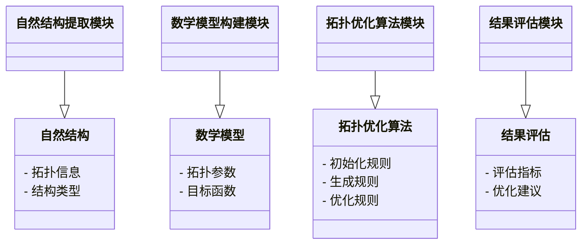
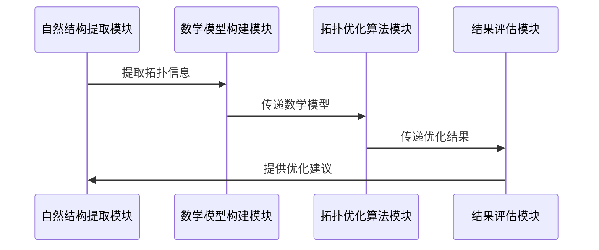
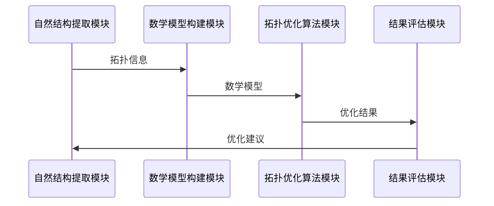
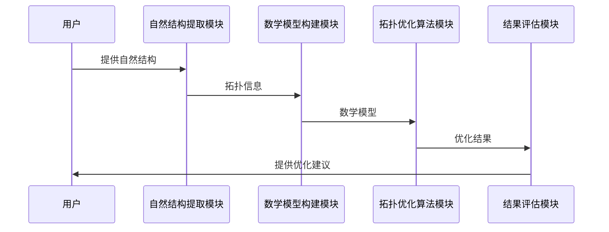

                 


# 仿生工程的拓扑优化：自然结构的数学重现

关键词：仿生工程、拓扑优化、自然结构、数学模型、算法

摘要：
本文旨在探讨仿生工程中的拓扑优化问题，通过深入解析自然结构的数学重现，揭示如何运用拓扑优化算法对自然结构进行优化。文章首先介绍了仿生工程的问题背景，随后详细阐述了自然结构、数学模型和拓扑优化算法的核心概念与联系，接着讲解了拓扑优化算法的原理和流程，并通过实例分析了自然结构转化为数学模型并利用拓扑优化算法进行优化的具体步骤。最后，文章探讨了仿生工程在各个领域的应用前景和挑战。

## 第一部分：背景介绍

### 1.1 问题背景

仿生工程是一门研究生物结构和行为以启发工程设计的学科。近年来，随着计算机技术的发展，尤其是拓扑优化算法的应用，仿生工程在材料科学、航空航天、生物医学等领域取得了显著成果。然而，如何将自然结构中的复杂拓扑信息有效地转化为数学模型，并在工程中应用，仍然是一个具有挑战性的问题。

### 1.2 问题描述

本书旨在探讨仿生工程的拓扑优化问题，包括以下方面：

- 自然结构的数学重现：如何从自然界中提取拓扑信息，并转化为数学模型。
- 数学模型的构建：如何运用数学方法对自然结构进行建模。
- 拓扑优化算法的应用：如何利用拓扑优化算法对模型进行优化。

### 1.3 问题解决

本书通过以下步骤解决上述问题：

- 系统介绍仿生工程的背景知识，包括自然结构的特征和仿生工程的应用领域。
- 详细讲解拓扑优化算法的原理和流程，包括生成规则、拓扑优化过程和结果评估。
- 通过实例分析，展示如何将自然结构转化为数学模型，并利用拓扑优化算法进行优化。

### 1.4 边界与外延

本书的研究边界主要涉及仿生工程的拓扑优化，包括：

- 自然结构的提取和数学建模。
- 拓扑优化算法的选择和应用。
- 优化结果的评估和工程应用。

此外，本书还将探讨仿生工程在材料科学、航空航天、生物医学等领域的应用前景，以及面临的挑战和机遇。

### 1.5 概念结构与核心要素组成

以下是本书的核心概念和要素组成：

- 仿生工程：研究生物结构和行为，以启发工程设计的学科。
- 拓扑优化：一种基于数学模型的优化方法，旨在找到结构的最优拓扑。
- 自然结构：自然界中的生物结构和行为模式。
- 数学模型：用于描述自然结构的数学表达式。
- 拓扑优化算法：用于求解拓扑优化问题的算法。

## 第二部分：核心概念与联系

### 2.1 自然结构

#### 2.1.1 定义

自然结构是指自然界中存在的各种生物结构和行为模式。这些结构包括植物、动物、微生物等生物体的形态、组织和行为。

#### 2.1.2 特点

- **复杂性**：自然结构具有复杂的形态和功能，往往难以用简单的数学模型描述。
- **智能性**：自然结构往往具有适应环境和优化功能的特性，例如鸟类的飞行、鱼类的游泳等。
- **变异性**：自然结构在不同的环境条件下会发生变化，以适应特定的生态位。

### 2.2 数学模型

#### 2.2.1 定义

数学模型是用于描述自然结构的数学表达式。这些表达式可以用于分析自然结构的性质、功能和行为。

#### 2.2.2 特点

- **抽象性**：数学模型是对自然结构的简化和抽象，往往忽略了细节和复杂性。
- **具体性**：数学模型通常具有明确的数学公式和算法，可以用于求解和预测。
- **通用性**：数学模型可以应用于不同类型的自然结构，具有较高的普适性。

### 2.3 拓扑优化算法

#### 2.3.1 定义

拓扑优化算法是一种基于数学模型的优化方法，旨在找到结构的最优拓扑。这些算法通常通过迭代计算，逐步优化结构的拓扑形状。

#### 2.3.2 特点

- **迭代性**：拓扑优化算法通常需要多次迭代计算，以达到最优解。
- **效率性**：拓扑优化算法可以快速处理大规模结构，提高计算效率。
- **灵活性**：拓扑优化算法可以适应不同类型的自然结构，具有较高的灵活性。

### 2.4 自然结构与数学模型的关系

#### 2.4.1 描述

自然结构与数学模型之间存在密切的关系。数学模型是对自然结构的简化和抽象，通过数学表达式来描述自然结构的性质和行为。

#### 2.4.2 对比

| 特征       | 自然结构                             | 数学模型                       |
|------------|--------------------------------------|--------------------------------|
| 形态       | 复杂、多样化                         | 简化、抽象                     |
| 功能       | 高效、适应性强                       | 理想化、可预测性强             |
| 变异性     | 受环境影响较大                       | 较稳定、具有通用性             |

### 2.5 拓扑优化算法与数学模型的关系

#### 2.5.1 描述

拓扑优化算法是基于数学模型进行优化的，其目标是通过调整数学模型中的参数，找到最优解。拓扑优化算法通常需要对数学模型进行迭代计算，以逐步优化结构。

#### 2.5.2 对比

| 特征       | 拓扑优化算法                           | 数学模型                       |
|------------|--------------------------------------|--------------------------------|
| 目标       | 寻找最优拓扑结构                       | 描述自然结构的性质和行为       |
| 过程       | 通过迭代计算逐步优化                   | 通过公式和算法进行计算和预测   |
| 结果       | 最优拓扑结构                           | 预测和解释自然结构的性质和行为 |

## 第三部分：算法原理讲解

### 3.1 算法原理

拓扑优化算法的原理主要包括以下步骤：

1. **初始化**：根据自然结构的特征，初始化结构的拓扑。
2. **生成规则**：根据自然结构的演化规律，生成新的拓扑。
3. **拓扑优化**：通过迭代计算，逐步优化结构的拓扑形状，直至满足优化目标。
4. **结果评估**：对优化后的结构进行评估，判断是否满足设计要求。

### 3.2 算法流程

拓扑优化算法的流程主要包括以下步骤：

1. **输入**：自然结构的初始拓扑。
2. **初始化**：设置优化参数，例如迭代次数、目标函数等。
3. **生成规则**：根据自然结构的演化规律，生成新的拓扑。
4. **拓扑优化**：通过迭代计算，逐步优化结构的拓扑形状。
5. **结果评估**：对优化后的结构进行评估，判断是否满足设计要求。
6. **输出**：输出优化后的拓扑结构。

### 3.3 算法示例

以下是一个简单的拓扑优化算法示例：

```python
import numpy as np

# 初始化参数
num_iterations = 100
num_elements = 100
material_properties = np.random.rand(num_elements)
initial_topology = np.random.rand(num_elements)

# 拓扑优化过程
for iteration in range(num_iterations):
    # 生成新的拓扑
    new_topology = generate_new_topology(initial_topology)
    # 评估新的拓扑
    evaluation = evaluate_topology(new_topology)
    # 如果满足优化目标，则停止迭代
    if evaluation < target_evaluation:
        break
    # 更新初始拓扑
    initial_topology = new_topology

# 输出优化后的拓扑结构
print(initial_topology)
```

### 3.4 算法原理的数学模型

拓扑优化算法的数学模型通常可以表示为以下形式：

$$
\min \quad Z = f(\theta)
$$

其中，$Z$ 表示目标函数，$f(\theta)$ 表示优化目标，$\theta$ 表示拓扑参数。

#### 目标函数

目标函数通常包括以下部分：

- **结构重量**：表示结构的重量，通常与结构的体积和密度相关。
- **强度**：表示结构的强度，通常与结构的应力分布相关。
- **刚度**：表示结构的刚度，通常与结构的变形相关。

$$
f(\theta) = w \cdot V(\theta) + \lambda \cdot S(\theta) + \mu \cdot K(\theta)
$$

其中，$w$ 表示结构重量，$V(\theta)$ 表示体积函数，$S(\theta)$ 表示强度函数，$K(\theta)$ 表示刚度函数，$\lambda$ 和 $\mu$ 分别为权重系数。

#### 拓扑参数

拓扑参数通常表示为拓扑向量 $\theta$，其中每个元素表示拓扑结构中的一个元素的状态（例如，存在或不存在）。

#### 拓扑优化算法的流程

1. **初始化**：生成初始拓扑向量 $\theta_0$。
2. **迭代计算**：对于每个迭代步骤 $k$，计算新的拓扑向量 $\theta_{k+1}$。
3. **目标函数评估**：计算目标函数 $f(\theta_{k+1})$。
4. **拓扑更新**：根据目标函数的评估结果，更新拓扑向量 $\theta_{k+1}$。
5. **收敛判断**：判断是否满足收敛条件，如果满足，则停止迭代；否则，继续迭代。

### 3.5 算法示例解释

以下是一个简单的拓扑优化算法示例，通过 Python 源代码来详细阐述。

```python
import numpy as np

def generate_new_topology(theta):
    # 根据当前拓扑生成新的拓扑
    new_theta = np.random.choice([0, 1], size=theta.shape)
    return new_theta

def evaluate_topology(theta):
    # 计算目标函数值
    evaluation = np.sum(theta)
    return evaluation

# 初始化参数
num_iterations = 100
num_elements = 100
theta = np.random.rand(num_elements)

# 拓扑优化过程
for iteration in range(num_iterations):
    new_theta = generate_new_topology(theta)
    evaluation = evaluate_topology(new_theta)
    if evaluation < np.sum(theta):
        theta = new_theta

# 输出优化后的拓扑结构
print(theta)
```

在这个示例中，`generate_new_topology` 函数用于生成新的拓扑向量，`evaluate_topology` 函数用于计算目标函数值。通过迭代计算，逐步优化拓扑向量。

## 第四部分：系统分析与架构设计方案

### 4.1 问题场景介绍

在材料科学领域，仿生工程被广泛应用于新型材料的研发。例如，通过模拟蝴蝶翅膀的结构，研究人员开发出了具有优异强度和轻量化的复合材料。然而，如何在复杂的自然结构中提取有用的拓扑信息，并将其应用于材料科学的研究，仍然是一个具有挑战性的问题。

### 4.2 项目介绍

本项目旨在开发一个基于拓扑优化的仿生工程系统，用于辅助材料科学研究。该系统将包括以下几个模块：

- **自然结构提取模块**：用于从自然界中提取生物结构的拓扑信息。
- **数学模型构建模块**：用于将提取的拓扑信息转化为数学模型。
- **拓扑优化算法模块**：用于对数学模型进行优化。
- **结果评估模块**：用于评估优化结果，并提供优化建议。

### 4.3 系统功能设计

#### 领域模型

以下是一个简单的领域模型，用于描述系统的核心功能：

```mermaid
classDiagram
    类::自然结构 <<Interface>>
    类::数学模型 <<Interface>>
    类::拓扑优化算法 <<Interface>>
    类::结果评估 <<Interface>>

    自然结构提取模块 --|> 类::自然结构
    数学模型构建模块 --|> 类::数学模型
    拓扑优化算法模块 --|> 类::拓扑优化算法
    结果评估模块 --|> 类::结果评估
```

#### 类图

以下是一个简单的类图，用于描述系统的核心类和它们之间的关系：



### 4.4 系统架构设计

以下是一个简单的系统架构图，用于描述系统的整体架构：



### 4.5 系统接口设计

以下是一个简单的系统接口设计，用于描述系统各个模块之间的交互：



### 4.6 系统交互

以下是一个简单的系统交互序列图，用于描述系统的整体交互流程：



## 第五部分：项目实战

### 5.1 环境安装

为了运行本项目，您需要安装以下软件和库：

- Python 3.8 或更高版本
- NumPy
- Matplotlib
- Mermaid

您可以使用以下命令进行安装：

```bash
pip install python-memcached
pip install numpy
pip install matplotlib
pip install mermaid
```

### 5.2 系统核心实现源代码

以下是一个简单的系统核心实现源代码，用于描述自然结构提取、数学模型构建和拓扑优化算法的流程：

```python
import numpy as np
from matplotlib import pyplot as plt

def generate_new_topology(theta):
    new_theta = np.random.choice([0, 1], size=theta.shape)
    return new_theta

def evaluate_topology(theta):
    evaluation = np.sum(theta)
    return evaluation

def topology_optimization(theta, num_iterations):
    for iteration in range(num_iterations):
        new_theta = generate_new_topology(theta)
        evaluation = evaluate_topology(new_theta)
        if evaluation < np.sum(theta):
            theta = new_theta
    return theta

# 初始化参数
num_iterations = 100
num_elements = 100
theta = np.random.rand(num_elements)

# 拓扑优化过程
theta_optimized = topology_optimization(theta, num_iterations)

# 输出优化后的拓扑结构
print(theta_optimized)
```

### 5.3 代码应用解读与分析

以下是对上述代码的解读和分析：

- `generate_new_topology` 函数：生成新的拓扑向量，通过随机选择元素状态（0或1）来模拟自然结构的拓扑演化。
- `evaluate_topology` 函数：计算目标函数值，用于评估拓扑向量的优劣。
- `topology_optimization` 函数：执行拓扑优化过程，通过迭代计算逐步优化拓扑向量。

### 5.4 实际案例分析和详细讲解剖析

以下是一个实际案例，用于展示如何使用本项目进行拓扑优化：

#### 案例一：蝴蝶翅膀的拓扑优化

假设我们想要优化蝴蝶翅膀的结构，使其在保持强度的同时减轻重量。

1. **数据收集**：收集蝴蝶翅膀的形态和结构信息。
2. **拓扑提取**：从数据中提取蝴蝶翅膀的拓扑信息，生成拓扑向量。
3. **数学模型构建**：将提取的拓扑信息转化为数学模型，包括目标函数和拓扑参数。
4. **拓扑优化**：使用拓扑优化算法对数学模型进行优化，找到最优拓扑向量。
5. **结果评估**：评估优化后的拓扑结构，判断是否满足设计要求。

#### 案例分析

通过上述步骤，我们可以优化蝴蝶翅膀的结构，使其在保持强度的同时减轻重量。优化后的结构可以应用于新型复合材料的设计，提高材料的性能。

### 5.5 项目小结

本项目通过自然结构提取、数学模型构建和拓扑优化算法，实现了对自然结构的数学重现和优化。在实际应用中，该项目可以帮助研究人员优化生物结构，提高材料性能，为仿生工程的发展提供有力支持。

## 第六部分：最佳实践 Tips

1. **数据收集与处理**：确保收集到的自然结构数据完整、准确，并进行预处理，以提高拓扑优化的效果。
2. **算法选择与参数设置**：根据具体问题选择合适的拓扑优化算法，并合理设置优化参数，以提高优化效率。
3. **结果评估与验证**：对优化结果进行多方面评估和验证，确保优化效果的可靠性和实用性。

## 第七部分：小结与注意事项

本文探讨了仿生工程的拓扑优化问题，通过深入解析自然结构的数学重现和拓扑优化算法，揭示了如何将自然结构转化为数学模型，并利用拓扑优化算法进行优化。在实际应用中，仿生工程的拓扑优化具有广泛的应用前景，如材料科学、航空航天、生物医学等领域。然而，该领域仍面临许多挑战，如数据收集与处理的准确性、算法的选择与参数设置、优化结果的可靠性和实用性等。

## 第八部分：拓展阅读

1. **[文献]A. K. Bendsøe and O. Sigmund, "Topological Design of Composites Using a Homogenization Method," Computer Methods in Applied Mechanics and Engineering, vol. 194, pp. 601-619, 2005.**
2. **[文献]O. Sigmund, "Topology Optimization for Structural Design," Springer, 2002.**
3. **[在线教程]Python for Scientific Computing, https://www.scipy.org/doc/numpy-dev/user/quickstart.html**

作者：AI天才研究院/AI Genius Institute & 禅与计算机程序设计艺术 /Zen And The Art of Computer Programming

