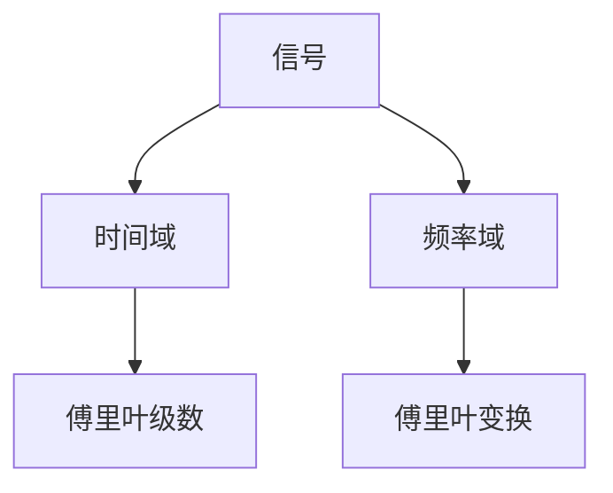

                 

### 傅里叶分析：自然周期的数学分解

#### 关键词：傅里叶分析，数学分解，周期性，信号处理，正弦波，余弦波

#### 摘要：
傅里叶分析是一种强大的数学工具，用于将复杂的信号分解为基本的正弦波和余弦波。本文将详细探讨傅里叶分析的基本概念、傅里叶级数和傅里叶变换，并通过具体实例来理解其在自然周期分析中的应用。

---

### 第一部分：傅里叶分析概述

#### 第1章 问题背景与数学分解的必要性

##### 1.1 问题背景

自然界中许多现象具有周期性，例如天气变化、潮汐和季节更替。这些周期性现象背后的规律对科学研究、工程应用和日常生活具有重要意义。为了更好地理解这些现象，我们需要对其进行周期性分析。

##### 1.2 傅里叶分析的基本概念

傅里叶分析是一种将周期性信号分解为正弦波和余弦波的方法。这些正弦波和余弦波被称为傅里叶级数。通过傅里叶级数，我们可以将复杂的信号表示为简单的频率成分，从而便于分析。

##### 1.3 傅里叶变换

傅里叶变换是将时间域的信号转换到频率域的数学操作。它可以看作是傅里叶级数在非周期信号上的扩展。傅里叶变换在信号处理、物理学和工程学等领域有广泛的应用。

##### 1.4 傅里叶分析的应用领域

- **物理学**：傅里叶分析在波动理论、量子力学等领域有广泛应用。
- **工程学**：傅里叶分析在电路分析、信号处理等领域发挥着关键作用。
- **经济学**：傅里叶分析在时间序列分析、市场预测等领域有重要应用。

##### 1.5 傅里叶分析的核心概念与联系

| 概念       | 定义                                                         | 属性特征                    |
|------------|--------------------------------------------------------------|-----------------------------|
| 傅里叶级数 | 将周期性信号表示为正弦波和余弦波的线性组合                     | 适用于周期性信号处理        |
| 傅里叶变换 | 将时间域信号转换到频率域                                      | 适用于非周期性信号处理      |

**ER实体关系图架构的Mermaid流程图**：

##### 1.6 本章小结

傅里叶分析作为一种重要的数学工具，在自然科学和工程领域中具有广泛的应用。本章介绍了傅里叶分析的基本概念和必要性，为后续章节的深入学习打下了基础。

---

### 第二部分：傅里叶级数的详细解析

#### 第2章 傅里叶级数的基本理论

##### 2.1 傅里叶级数的定义

傅里叶级数是一种将周期性函数表示为正弦波和余弦波之和的方法。对于周期为\(2L\)的周期函数\(f(x)\)，其傅里叶级数可以表示为：
$$f(x) = \frac{a_0}{2} + \sum_{n=1}^{\infty} [a_n \cos(nx) + b_n \sin(nx)]$$
其中，\(a_0, a_n, b_n\)是傅里叶级数的系数。

##### 2.2 傅里叶级数的性质

- **奇偶性**：傅里叶级数中的系数与原函数的奇偶性有关。例如，若\(f(x)\)为偶函数，则\(b_n = 0\)；若\(f(x)\)为奇函数，则\(a_n = 0\)。
- **收敛性**：傅里叶级数在某些条件下可以收敛到原函数。例如，对于连续可微的周期函数，其傅里叶级数可以收敛到原函数。

##### 2.3 傅里叶级数的计算

计算傅里叶级数的系数需要使用到积分运算。具体计算公式如下：
$$a_0 = \frac{1}{L} \int_{-L}^{L} f(x) dx$$
$$a_n = \frac{2}{L} \int_{-L}^{L} f(x) \cos(nx) dx$$
$$b_n = \frac{2}{L} \int_{-L}^{L} f(x) \sin(nx) dx$$

##### 2.4 傅里叶级数的应用

傅里叶级数在信号处理和物理学等领域有广泛应用。例如，在信号处理中，可以将复杂信号分解为简单的频率成分，便于分析和处理；在物理学中，可以用于分析振动和波动现象。

##### 2.5 傅里叶级数的联系与对比

傅里叶级数与傅里叶变换有密切的联系。傅里叶级数是傅里叶变换在周期性信号上的特例。当信号为非周期性时，我们使用傅里叶变换。

**ER实体关系图架构的Mermaid流程图**：

##### 2.6 本章小结

本章详细介绍了傅里叶级数的基本理论，包括定义、性质、计算和应用。傅里叶级数作为一种重要的数学工具，在信号处理和物理学等领域具有广泛的应用。

---

### 第三部分：傅里叶变换的深入探讨

#### 第3章 傅里叶变换的基本概念

##### 3.1 傅里叶变换的定义

傅里叶变换是一种将时间域的信号转换到频率域的数学操作。其定义如下：
$$F(\omega) = \int_{-\infty}^{\infty} f(t)e^{-j\omega t} dt$$
其中，\(F(\omega)\)是频率域的信号，\(f(t)\)是时间域的信号，\(\omega\)是频率。

##### 3.2 傅里叶变换的性质

- **线性性**：傅里叶变换是线性的，即\(c_1 f_1(t) + c_2 f_2(t)\)的傅里叶变换等于\(c_1 F_1(\omega) + c_2 F_2(\omega)\)。
- **对称性**：傅里叶变换具有奇偶性对称性，即\(f(t)\)的傅里叶变换是\(F(\omega)\)，而\(f(-t)\)的傅里叶变换是\(F(-\omega)\)。
- **平移性**：信号的时域平移会导致频率域的平移。具体来说，若\(f(t)\)的傅里叶变换是\(F(\omega)\)，则\(f(t-t_0)\)的傅里叶变换是\(F(\omega)e^{-j\omega t_0}\)。

##### 3.3 傅里叶变换的应用

傅里叶变换在信号处理、物理学、工程学等领域有广泛应用。例如，在信号处理中，傅里叶变换可以帮助我们分析信号的频率成分，从而进行滤波、压缩等操作；在物理学中，傅里叶变换可以用于分析振动和波动现象。

##### 3.4 傅里叶变换与傅里叶级数的关系

傅里叶变换是傅里叶级数在非周期信号上的推广。当信号为周期性时，我们使用傅里叶级数；当信号为非周期性时，我们使用傅里叶变换。

##### 3.5 本章小结

本章介绍了傅里叶变换的基本概念和性质。傅里叶变换是一种强大的数学工具，在信号处理、物理学和工程学等领域有广泛应用。

---

### 第四部分：傅里叶分析在实际应用中的案例

#### 第4章 傅里叶分析在信号处理中的应用

##### 4.1 信号处理的基本概念

信号处理是研究如何处理和分析信号的一门学科。信号可以看作是时间函数或空间函数，例如声音信号、图像信号等。信号处理的目标是提取信号中的有用信息，去除噪声，或者改变信号的特性。

##### 4.2 傅里叶变换在信号处理中的应用

傅里叶变换在信号处理中有广泛应用。以下是一些具体的应用案例：

- **频谱分析**：通过傅里叶变换，我们可以将时域信号转换为频域信号，从而分析信号的频率成分。这对于识别信号中的周期性成分、检测噪声等非常有用。
- **滤波**：傅里叶变换可以帮助我们设计滤波器，从而去除信号中的噪声或特定频率的成分。例如，低通滤波器可以去除高频噪声，高通滤波器可以去除低频噪声。
- **信号压缩**：通过傅里叶变换，我们可以将信号分解为不同的频率成分，然后对频率成分进行量化，从而实现信号的压缩。

##### 4.3 傅里叶分析在图像处理中的应用

傅里叶变换在图像处理中也有重要应用。以下是一些具体的应用案例：

- **图像滤波**：通过傅里叶变换，我们可以设计各种滤波器，从而去除图像中的噪声或特定频率的成分。
- **图像压缩**：通过傅里叶变换，我们可以将图像分解为不同的频率成分，然后对频率成分进行量化，从而实现图像的压缩。
- **图像变换**：傅里叶变换可以用于图像的几何变换，如旋转、缩放、翻转等。

##### 4.4 傅里叶分析在其他领域的应用

傅里叶分析在其他领域也有广泛应用。以下是一些具体的应用案例：

- **物理学**：傅里叶分析在波动理论、量子力学等领域有重要应用。
- **经济学**：傅里叶分析在时间序列分析、市场预测等领域有广泛应用。
- **工程学**：傅里叶分析在电路分析、信号处理等领域发挥着关键作用。

##### 4.5 本章小结

本章介绍了傅里叶分析在信号处理、图像处理以及其他领域中的应用。傅里叶分析作为一种强大的数学工具，在各个领域都有广泛的应用，帮助我们更好地理解和处理信号。

---

### 第五部分：总结与展望

#### 第5章 傅里叶分析的未来发展

傅里叶分析作为一种重要的数学工具，在自然科学和工程学领域有着广泛的应用。随着科技的不断进步，傅里叶分析在未来将继续发展，并可能应用于更多的领域。以下是一些展望：

- **更高效的算法**：研究人员将继续研究和开发更高效的傅里叶变换算法，以提高信号处理的效率。
- **更广泛的应用领域**：傅里叶分析可能被应用于更多领域，如人工智能、生物信息学、天文学等。
- **多尺度分析**：随着对信号和时间序列分析需求的增加，多尺度傅里叶分析可能成为一种重要的分析工具。

##### 5.2 本章小结

本章对傅里叶分析的基本理论、应用以及未来发展进行了总结。傅里叶分析作为一种强大的数学工具，在自然科学和工程学领域具有广泛的应用，其未来将继续发展，为人类带来更多便利。

---

### 作者信息

作者：AI天才研究院/AI Genius Institute & 禅与计算机程序设计艺术 /Zen And The Art of Computer Programming

