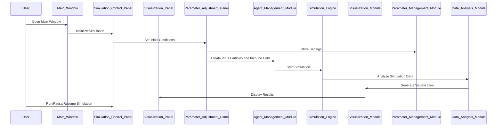

                 

### Introduction and Background

#### 1.1 Introduction to the Book

### 1.1.1 The Significance of Agent-Based Models in Immune System Research

Agent-Based Models (ABMs) have emerged as a powerful tool in the study of complex systems, particularly in the field of biology and immunology. The importance of ABMs in understanding the immune system stems from their ability to capture the intricate interactions between the multitude of components within this system, which include cells, proteins, and signaling pathways. Traditional approaches to modeling the immune system often suffer from oversimplification, failing to represent the dynamic and adaptive nature of immune responses.

Agent-Based Models provide a framework that allows researchers to simulate the behavior of individual agents, such as immune cells, within a population. These models are particularly useful in studying phenomena that are difficult to observe or manipulate experimentally, such as the spread of infectious diseases or the development of immune memory. By simulating the interactions between agents, ABMs can help identify critical processes and pathways that are key to the function of the immune system, ultimately providing insights that are difficult to obtain through other methods.

#### 1.1.2 Historical Background of Agent-Based Modeling in Biology

The concept of agent-based modeling has its roots in the social sciences, where it was first introduced to study complex social systems. However, its application in biology dates back to the late 20th century. Early ABM applications in biology focused on modeling the spread of infectious diseases, such as the spread of foot-and-mouth disease in livestock populations. As computational power increased and our understanding of biological systems became more refined, the utility of ABMs expanded to include the study of biological systems at various levels, from cellular processes to entire ecosystems.

One of the key milestones in the development of ABMs in biology was the creation of the "Cellular Potts Model" in the late 1990s, which provided a framework for modeling the physical properties of biological tissues. This model has been widely used to study a variety of biological phenomena, including cell migration and tissue formation. In the early 21st century, the rise of high-throughput experimental techniques, such as single-cell RNA sequencing, has provided researchers with rich datasets that can be used to inform and validate ABM simulations.

#### 1.1.3 The Need for Mathematical Simulation in Understanding Biological Defense Mechanisms

Mathematical simulation is crucial for understanding the complex dynamics of biological defense mechanisms. Biological systems, including the immune system, operate at multiple scales and exhibit intricate spatial and temporal patterns of behavior. Traditional experimental approaches often struggle to capture these complexities, as they are limited by the spatial and temporal resolution of the techniques used. Mathematical models, particularly ABMs, offer a complementary approach by allowing researchers to simulate the behavior of the system over time and across different conditions.

Mathematical simulations enable researchers to explore a wide range of scenarios and hypotheses that would be impractical or impossible to test experimentally. For example, ABMs can be used to study the impact of genetic mutations on immune system function, or to simulate the spread of a novel pathogen in a population. By providing a detailed and flexible framework for exploring these questions, mathematical simulations play a vital role in advancing our understanding of biological defense mechanisms and informing the development of new therapeutic strategies.

### 1.2 Fundamental Concepts and Terminology

#### 1.2.1 Definition of Agent-Based Models

Agent-Based Models (ABMs) are computational models designed to simulate the actions and interactions of autonomous agents within a system. These agents can represent individuals, such as cells in the immune system, or groups of individuals, such as populations of animals. The core principle of ABMs is that the emergent behavior of a system arises from the interactions between individual agents, rather than from global rules applied to the entire system.

In an ABM, each agent has a set of properties, behaviors, and interactions that determine its actions and how it interacts with other agents. These actions and interactions are governed by simple rules that are typically based on the principles of physics, biology, or economics. By simulating the behavior of these agents over time, ABMs can provide insights into the complex systems that result from their interactions.

#### 1.2.2 Key Terminology in Immune System Agent-Based Models

To understand and effectively use ABMs in the study of the immune system, it is essential to be familiar with several key terminologies:

- **Agent:** An individual entity within an ABM, representing a component of the immune system such as a cell or a protein.
- **Population:** A collection of agents within an ABM, representing a group of immune cells or a community of organisms.
- **Interaction:** The process by which agents influence each other's behavior or state.
- **Stochasticity:** The element of randomness or probability in the model, reflecting the uncertainty in the system.
- **Agent-Based Model (ABM):** A simulation framework that represents the interactions between autonomous agents within a system.
- **Spatial Resolution:** The level of detail at which the spatial distribution of agents is represented in the model.
- **Temporal Resolution:** The level of detail at which the temporal dynamics of the system are represented in the model.
- **Parameter:** A variable within the model that influences the behavior of agents or the overall system.
- **Emergence:** The phenomenon where complex behaviors or patterns arise from the interactions of simpler agents, rather than from the properties of the agents themselves.

#### 1.2.3 Comparative Analysis of Agent-Based Models and Other Simulation Methods

Agent-Based Models (ABMs) are just one of several approaches to simulating complex systems. Comparing ABMs with other simulation methods can provide insights into their strengths and limitations:

- **System Dynamics Models:** These models represent the flow of material and information through a system over time. They are often used to study the behavior of large-scale systems, such as supply chains or economic systems. System dynamics models are useful for understanding long-term trends and the impact of feedback loops, but they may struggle to capture the detailed interactions between individual agents.

- **Individual-Based Models (IBMs):** Similar to ABMs, IBMs focus on the interactions between individual agents, but they typically do not include spatial considerations. IBMs are useful for studying phenomena that occur at a small scale, such as the behavior of individual animals or cells. However, they may not be suitable for studying systems with complex spatial dynamics, such as the spread of a disease through a population.

- ** agent-based models (ABMs) offer a balance between the detailed interactions of IBMs and the spatial considerations of system dynamics models. They are particularly well-suited for studying systems where both spatial dynamics and individual interactions are important, such as the immune system.

In summary, while ABMs have their limitations, their ability to capture the complex interactions between agents and their adaptability to different scales and conditions make them a powerful tool for studying biological systems, including the immune system.

### 1.3 Mathematical and Computational Foundations

#### 1.3.1 Basic Principles of Agent-Based Modeling

Agent-Based Modeling (ABM) is built on a set of fundamental principles that enable the simulation of complex systems through the interaction of individual agents. At its core, ABM relies on three primary concepts: the definition of agents, the rules that govern their behavior, and the environment in which they operate.

**Agents:** In an ABM, agents are the fundamental building blocks of the simulation. These can be entities like cells, individuals, or even abstract objects that represent behaviors or processes. Each agent has attributes (state variables) that define its properties, such as position, velocity, or concentration. These attributes can change over time based on the interactions with other agents or the environment.

**Interactions:** The behavior of agents in an ABM is dictated by a set of rules that describe how they interact with one another. These rules can be based on simple logic or complex algorithms and are designed to mimic the natural interactions that occur within the system being modeled. For example, in an immune system ABM, rules might govern how immune cells recognize and respond to pathogens or how they move through a tissue.

**Environment:** The environment in which agents operate is another critical component of ABM. It can be a physical space, such as a grid or a geographical map, or a virtual space with specific constraints and conditions. The environment can affect the agents' behavior through factors like resource availability, temperature, or spatial distribution of other agents.

**Simulation Process:** The simulation process in ABM typically involves the following steps:

1. **Initialization:** The model is set up by defining the initial state of the agents and the environment. This includes specifying the number of agents, their initial positions, attributes, and the initial conditions of the environment.

2. **Time-stepping:** The model evolves over time in discrete steps. At each time step, each agent is updated based on its rules of interaction and the state of its environment. This process is repeated for as many time steps as required to capture the dynamic behavior of the system.

3. **Data Collection:** Throughout the simulation, data is collected on the state of the system at each time step. This data can be used to analyze the emergent behavior of the system, identify patterns, or validate the model against real-world observations.

**Characteristics of ABM:**

- **Emergence:** One of the key features of ABM is the concept of emergence, where complex patterns or behaviors arise from the interactions of individual agents. This emergent behavior is often difficult to predict from the properties of the individual agents alone.

- **Adaptability:** ABMs are highly adaptable and can be used to model a wide range of systems and phenomena across various scales. They can simulate interactions from the micro level, such as cellular processes, to the macro level, such as population dynamics.

- **Stochasticity:** ABMs incorporate stochastic elements, meaning that the outcomes of interactions and the evolution of the system are probabilistic. This reflects the inherent randomness in many natural systems and allows for more realistic simulations.

- **Flexibility:** ABMs are flexible in terms of the rules and interactions that can be defined. They can incorporate complex behaviors and rules that are difficult to encode in other types of models.

In conclusion, the basic principles of ABM provide a powerful framework for simulating complex systems. By defining agents, their interactions, and the environment, and following a systematic simulation process, ABMs enable the study of emergent behaviors and the understanding of how complex systems operate at multiple scales.

### 1.3.2 Stochastic Models and Their Application to the Immune System

Stochastic models play a crucial role in the field of agent-based modeling, particularly when it comes to capturing the inherent randomness and uncertainty present in biological systems, such as the immune system. Stochastic models incorporate elements of randomness into their equations, which allows for a more realistic simulation of biological processes that involve variability at the cellular and molecular levels.

**Basic Concepts of Stochastic Models**

Stochastic models are based on probability theory and use statistical methods to account for uncertainty in the system. They differ from deterministic models, which produce the same results for a given set of initial conditions, in that stochastic models produce a range of possible outcomes due to the inclusion of random variables. In biological systems, this randomness can arise from factors such as genetic mutations, environmental changes, and fluctuations in cellular processes.

**Types of Stochastic Models**

1. **Markov Chain Models:** These models assume that the future state of a system depends only on its current state and not on its past history. This property, known as the Markov property, simplifies the modeling process and allows for the use of transition matrices to describe the probabilities of state transitions. Markov chain models are often used to simulate the behavior of immune cells, such as T cells and B cells, as they move through different stages of the immune response.

2. **Monte Carlo Methods:** These methods use random sampling to estimate the behavior of a system over time. By simulating a large number of random trials, Monte Carlo methods can provide approximate solutions to complex problems, such as the dynamics of pathogen spread within a population. This approach is particularly useful in agent-based models where it is impractical to solve the equations analytically.

3. **Stochastic Differential Equations (SDEs):** These models extend ordinary differential equations (ODEs) by including random terms that represent the inherent noise in the system. SDEs are often used to model the dynamics of biochemical reactions within cells, where the concentrations of molecules fluctuate due to random events.

**Application to the Immune System**

Stochastic models are particularly well-suited for simulating the immune system due to its inherent complexity and variability. Here are a few examples of how stochastic models are applied in the study of the immune system:

1. **Influenza Infection Dynamics:** Stochastic models have been used to study the spread of influenza viruses within populations. These models incorporate the variability in the transmission rate, the incubation period, and the probability of infection upon exposure. By simulating different scenarios, researchers can evaluate the effectiveness of various intervention strategies, such as vaccination and quarantine.

2. **Immune Response to Pathogens:** Stochastic models can simulate the immune response to various pathogens, such as bacteria, viruses, and parasites. These models take into account the randomness in the activation of immune cells, the variability in the recognition of pathogens, and the stochastic nature of signaling pathways. By studying these dynamics, researchers can gain insights into how the immune system can be modulated to improve its efficacy.

3. **Development of Immunological Memory:** Immunological memory is the ability of the immune system to respond more quickly and effectively to a pathogen it has encountered before. Stochastic models can simulate the development and decay of immunological memory, helping to understand how the immune system "forgets" some pathogens over time and retains others.

**Advantages and Limitations**

The advantages of stochastic models in studying the immune system include their ability to capture the intrinsic randomness and complexity of biological processes. They allow for the exploration of a wide range of possible outcomes and provide insights into how different factors can influence the system's behavior. However, stochastic models also have limitations, such as their reliance on accurate parameter estimates and the difficulty of analyzing and interpreting the resulting complex data sets.

In conclusion, stochastic models are a valuable tool in the study of the immune system, providing a framework for simulating the complex and dynamic processes that occur within this vital biological system. By incorporating randomness and uncertainty, these models help to unravel the mysteries of immune function and response, ultimately contributing to the development of new therapeutic strategies and a deeper understanding of immunology.

### 1.3.3 Mathematical Formulation and Analysis Techniques

Mathematical formulation and analysis techniques are crucial for constructing and validating agent-based models (ABMs) that accurately represent the complex dynamics of the immune system. The process begins with the mathematical representation of the agents, their interactions, and the environment, followed by the development of algorithms and analysis methods to simulate and interpret the model's behavior.

**Mathematical Representation of Agents**

In an ABM, each agent is represented by a set of state variables that define its properties and behavior. These state variables typically include position, velocity, age, health status, and functional capabilities. For example, in a model of immune cells, a T cell might be represented by variables such as its location in the body, its current state (e.g., activated or resting), and the number of infections it has encountered.

Mathematical notation is used to define the initial conditions and the state transitions of the agents. For instance, the position of a T cell at time \( t \), denoted as \( \textbf{x}_i(t) \), can be updated according to a set of differential equations that describe its movement:

$$
\textbf{x}_i(t) = \textbf{x}_i(t-1) + \textbf{v}_i(t-1) \Delta t
$$

where \( \textbf{v}_i(t-1) \) is the velocity of the T cell at time \( t-1 \) and \( \Delta t \) is the time step.

**Interactions between Agents**

Interactions between agents are modeled using rules that define how agents respond to each other based on their current states and positions. These rules can be expressed as conditional statements or logical functions that dictate the behavior of the agents when they meet certain criteria.

For example, the interaction between a T cell and a virus-infected cell might be modeled as follows:

- If a T cell is within a certain distance \( r \) of an infected cell, it will attempt to interact with it.
- If the interaction is successful, the T cell may become activated and initiate a response, such as releasing cytokines to signal other immune cells.

This can be mathematically represented as a set of logical conditions and functions:

$$
\text{if} \ \lVert \textbf{x}_i(t) - \textbf{x}_j(t) \rVert < r \text{ and } \text{cell}_j(t) \text{ is infected:}
$$

$$
\text{then} \ \textbf{x}_i(t) \rightarrow \text{activated} \text{ and } \textbf{x}_j(t) \rightarrow \text{virus destroyed} \text{ with probability } p_{\text{interaction}}
$$

where \( p_{\text{interaction}} \) is the probability of the interaction being successful.

**Simulation Algorithms**

The simulation of an ABM involves iterating through time steps, updating the state of each agent based on its interactions and the rules defined for the model. Common simulation algorithms include the Euler method and the Gillespie algorithm.

- **Euler Method:** This is a simple explicit method for updating the state variables of agents. It involves calculating the change in state variables over a small time step \( \Delta t \) and updating the state accordingly:

$$
\textbf{x}_i(t) = \textbf{x}_i(t-1) + \Delta t \cdot f(\textbf{x}_i(t-1))
$$

where \( f(\textbf{x}_i(t-1)) \) is the function that defines the change in state based on the agent's current state.

- **Gillespie Algorithm:** This is a stochastic simulation algorithm used to simulate the chemical kinetics of reactions. It is particularly useful for simulating stochastic processes in which the timing of events is important. The algorithm works by generating random times for the occurrence of events and updating the state of the system accordingly.

**Analysis Techniques**

Analyzing the results of an ABM involves both qualitative and quantitative methods to understand the emergent behavior of the system. Key analysis techniques include:

- **Statistical Analysis:** This involves calculating summary statistics, such as mean, median, and standard deviation, to describe the behavior of agents or populations over time.
- **Pattern Recognition:** Techniques like clustering and classification can be used to identify patterns or groups within the agent population.
- **Time Series Analysis:** This involves analyzing the temporal dynamics of the system to identify trends, correlations, and periodicities.
- **Sensitivity Analysis:** This involves studying how changes in input parameters affect the behavior of the system to identify critical factors that influence the system's dynamics.

**Mathematical Formulation Examples**

Consider a simple model of immune response to a viral infection:

1. **State Variables:**
   - \( \textbf{x}_i(t) \): Position of immune cell \( i \).
   - \( \textit{V}_i(t) \): Viral load in cell \( i \).
   - \( \textit{I}_i(t) \): Infection status of cell \( i \) (0 for uninfected, 1 for infected).

2. **Initial Conditions:**
   - A population of immune cells and infected cells are randomly distributed in a 2D space.

3. **State Transition Rules:**
   - Uninfected cells become infected with probability \( \gamma \) if they are in proximity to an infected cell.
   - Infected cells can be cleared by immune cells with probability \( \beta \).

Mathematical formulation for these rules:

$$
\textit{I}_i(t) = 
\begin{cases}
1 & \text{if } \lVert \textbf{x}_i(t) - \textbf{x}_j(t) \rVert < r_{\text{infection}} \text{ and } \textit{I}_j(t) = 1 \text{ and } \textit{I}_i(t-1) = 0 \text{ with probability } \gamma \\
0 & \text{otherwise}
\end{cases}
$$

$$
\textit{I}_i(t) = 
\begin{cases}
0 & \text{if } \textit{I}_i(t-1) = 1 \text{ and } \text{immune cell } \textit{i} \text{ is in proximity to infected cell } \textit{j} \text{ with probability } \beta \\
1 & \text{otherwise}
\end{cases}
$$

**Conclusion**

Mathematical formulation and analysis techniques are fundamental to the construction and validation of ABMs. By precisely defining the state variables, interactions, and simulation algorithms, researchers can build accurate models that capture the complex dynamics of the immune system. Analysis techniques then allow for the interpretation of model outputs and the extraction of meaningful insights that contribute to our understanding of biological processes.

### 1.4 Tools and Software for Agent-Based Modeling

#### 1.4.1 Overview of Agent-Based Modeling Software

Agent-Based Modeling (ABM) has become a popular approach in the study of complex systems, thanks in part to the availability of powerful and user-friendly software tools. These tools enable researchers to build, simulate, and analyze ABMs with varying levels of complexity, from simple models to highly detailed simulations of real-world systems. Below, we provide an overview of some of the most commonly used ABM software, highlighting their features, strengths, and typical use cases.

**1. Repast Simphony**

Repast Simphony is a widely used open-source ABM software designed for simulating complex systems. It offers a highly flexible and extensible platform that supports both agent-based and system dynamics modeling. Repast Simphony's key features include:

- **Visualization:** High-quality graphical user interface for visualizing agent movements and interactions.
- **Modularity:** Users can create reusable model components, making it easier to modify and expand existing models.
- **Community Support:** An active community provides a wealth of resources, tutorials, and example models.

Repast Simphony is particularly suited for social science applications, such as modeling urban growth, traffic patterns, and social networks. In the context of the immune system, it has been used to study the spread of infectious diseases and the dynamics of immune cell interactions.

**2. NetLogo**

NetLogo is another popular open-source ABM platform that is widely used in education and research. Developed by the Center for Connected Learning and Education at the Massachusetts Institute of Technology (MIT), NetLogo is known for its simplicity and ease of use. Key features of NetLogo include:

- **User-Friendly Interface:** Drag-and-drop interface for creating agent models and setting up simulations.
- **Scripting Language:** NetLogo's simple scripting language allows for the implementation of complex agent behaviors and interactions.
- **Extensibility:** Users can extend the software's capabilities by creating and using libraries of agents and functions.

NetLogo has been used to model a wide range of biological systems, including the behavior of ants, the spread of plant diseases, and the dynamics of immune cell responses. Its user-friendly design makes it an excellent tool for teaching and introducing the concepts of ABM to students.

**3. AnyLogic**

AnyLogic is a commercial ABM software that offers a comprehensive suite of tools for simulating and analyzing complex systems. Known for its versatility and robust features, AnyLogic is widely used in fields such as engineering, logistics, and healthcare. Key features of AnyLogic include:

- **Integrated Modeling:** Support for both agent-based and system dynamics modeling within a single environment.
- **High-Fidelity Simulation:** Capable of simulating large-scale systems with high precision and detail.
- **Scenario Analysis:** Advanced capabilities for running what-if scenarios and sensitivity analysis.

AnyLogic has been used to model the spread of infectious diseases, the dynamics of medical supply chains, and the behavior of immune systems. Its ability to handle complex scenarios and large datasets makes it an ideal tool for real-world applications.

**4. MASON**

MASON (Multi-Agent Simulation ONe) is an open-source Java-based ABM library designed for high-performance simulations. It offers a flexible and scalable platform for building and running agent-based models. Key features of MASON include:

- **Performance:** MASON is designed to handle large-scale simulations efficiently, with support for parallel processing and distributed computing.
- **Modularity:** Users can create reusable components and integrate third-party libraries.
- **Visualization:** MASON includes a built-in visualization engine that allows for real-time monitoring of agent behaviors.

MASON has been used to simulate the spread of diseases in urban populations, the dynamics of animal behavior, and the function of biological systems like the immune response.

**5. Swarm**

Swarm is a lightweight, Python-based ABM library that is well-suited for quick prototyping and research. It offers a simple and intuitive interface for building and running agent-based models. Key features of Swarm include:

- **Ease of Use:** Swarm's Python-based design makes it easy to learn and use, especially for researchers familiar with Python.
- **Modularity:** Swarm components are designed to be easily modifiable and reusable.
- **Visualization:** Basic visualization capabilities for visualizing agent movements and interactions.

Swarm has been used to study a variety of biological systems, including the spread of diseases, the behavior of social insects, and the dynamics of immune responses.

**Conclusion**

The variety of ABM software available today provides researchers with powerful tools to study complex systems across multiple disciplines. Each software has its own unique features and strengths, allowing users to choose the best tool for their specific needs. Whether it's for educational purposes, academic research, or industrial applications, these ABM tools are invaluable for exploring and understanding the intricate dynamics of biological systems like the immune system.

### 1.4.2 Implementation Strategies and Challenges

Implementing an agent-based model (ABM) for simulating the immune system involves several strategic considerations and potential challenges. Here, we discuss the key steps in the implementation process, along with common issues and their solutions.

#### 1.4.2.1 Key Steps in ABM Implementation

1. **Defining the Model Structure:**
   The first step in implementing an ABM is to define the structure of the model, including the types of agents, their attributes, and the environment. This involves identifying the key components of the immune system, such as cells (e.g., T cells, B cells, antigen-presenting cells), molecules (e.g., antigens, cytokines), and the extracellular space.

2. **Creating Agent Classes:**
   Agent classes are then created to represent these components. Each agent class should encapsulate the properties and behaviors of its corresponding entity. For example, a T cell agent might have attributes like cell type, activation state, and viral load.

3. **Defining Agent Interactions:**
   Next, the interactions between agents are defined. This includes rules for how agents recognize and respond to each other, such as antigen recognition by T cells or the binding of cytokines to immune receptors. These interactions are typically implemented using conditional statements or state machines.

4. **Setting Up the Simulation Environment:**
   The simulation environment is set up to represent the spatial and temporal context in which the agents operate. This may involve defining a grid or continuous space for agent movement and establishing initial conditions for the system.

5. **Simulation Execution:**
   The simulation is executed by iterating through time steps, updating the state of each agent based on its interactions and the environment. This process is repeated for a specified number of time steps to capture the dynamic behavior of the system.

6. **Data Collection and Analysis:**
   During the simulation, data is collected on the system's behavior, such as agent movements, population dynamics, and key metrics like immune response effectiveness. This data is then analyzed to extract insights and validate the model against experimental observations.

#### 1.4.2.2 Common Challenges and Solutions

**1. Model Complexity:**
One of the main challenges in implementing an ABM is managing the complexity of the system. The immune system is a highly intricate network of interactions involving thousands of different cells and molecules. To address this, it is often necessary to simplify the model by focusing on the most critical components and interactions. Techniques like modularization and abstraction can help manage the complexity by breaking the model into manageable parts.

**2. Parameter Estimation:**
Accurately estimating the parameters that govern agent behavior and interactions is crucial for the reliability of the model. However, parameter values are often difficult to determine experimentally. To overcome this, researchers can use statistical methods like Bayesian inference or machine learning algorithms to infer parameter values from experimental data. Alternatively, parameter values can be calibrated iteratively through simulation trials to achieve desired behaviors.

**3. Computational Efficiency:**
Simulating large-scale ABMs can be computationally intensive, especially when dealing with millions of agents and complex interactions. To improve computational efficiency, parallel processing techniques, such as multi-threading or distributed computing, can be employed. Additionally, optimizing the model's code by using efficient algorithms and data structures can significantly reduce simulation times.

**4. Model Validation:**
Validating an ABM to ensure its accuracy and reliability is challenging due to the complexity and variability of biological systems. Validation involves comparing model predictions with experimental data. To improve validation, researchers can use techniques like sensitivity analysis to identify critical parameters and ensure that the model's behavior is robust to changes in these parameters. Cross-validation and benchmarking against established models can also help assess the model's reliability.

**5. Data Interpretation:**
Analyzing the large volumes of data generated by ABM simulations can be daunting. Effective data visualization techniques, such as heatmaps, scatter plots, and animated visualizations, can help interpret the results and identify key patterns and trends. Additionally, statistical methods can be applied to the data to quantify the significance of observed behaviors and test hypotheses about the system's dynamics.

**Conclusion**

Implementing an ABM for simulating the immune system involves a series of strategic steps and addresses various challenges. By carefully defining the model structure, creating agent classes, defining interactions, and employing techniques to enhance computational efficiency and validate the model, researchers can develop robust and accurate simulations that provide valuable insights into the complex dynamics of the immune system.

### 1.4.3 Optimization Techniques for Agent-Based Models

Optimization techniques play a crucial role in improving the performance and efficiency of agent-based models (ABMs), particularly when dealing with large-scale simulations involving complex immune systems. These techniques focus on enhancing computational efficiency, reducing simulation time, and ensuring accurate model behavior. Here, we discuss several optimization strategies and their applications in ABM optimization.

**1. Parallel Computing**

Parallel computing involves distributing the simulation process across multiple processors or computing nodes to accelerate computation. This technique is particularly effective for simulating large populations of agents or models that involve complex interactions. Common approaches include multi-threading, where different threads handle different parts of the simulation concurrently, and distributed computing, where the simulation is executed across a network of computers.

- **Multi-threading:** By dividing the simulation into smaller tasks that can be executed simultaneously, multi-threading can significantly reduce the time required for simulation. This is especially useful for models where the interactions between agents are independent or can be processed independently. For example, in a model simulating the spread of a viral infection, the interactions between different infected cells and immune cells can be handled by separate threads.

- **Distributed Computing:** Distributed computing extends the concept of parallel processing by distributing the simulation across multiple computers or computing nodes. This approach is particularly beneficial for large-scale simulations where the data volume is too large to be processed by a single machine. Techniques like Message Passing Interface (MPI) and MapReduce can be used to manage communication and coordination between the distributed nodes.

**2. Memory Management**

Effective memory management is essential for optimizing the performance of ABMs, as models with a large number of agents or complex data structures can quickly consume significant memory resources. Several techniques can be employed to manage memory usage:

- **Object Pooling:** Object pooling involves reusing objects from a pool instead of creating and destroying them during the simulation. This reduces the overhead associated with object creation and garbage collection, improving overall performance.

- **Memory Mapping:** Memory mapping allows large datasets to be stored in secondary storage (e.g., hard drives) and loaded into memory as needed. This technique is useful for managing the memory footprint of large datasets, such as those representing spatially distributed populations of agents.

- **Memory Compression:** Memory compression techniques can be used to reduce the memory footprint of large data structures. Compression algorithms like gzip or zlib can be applied to agent attributes or data buffers, reducing the amount of memory required to store the data.

**3. Algorithm Optimization**

Optimizing the algorithms used in the simulation can significantly improve the efficiency of ABMs. Techniques such as algorithmic optimization, numerical methods, and optimization of data structures can be applied to enhance performance:

- **Algorithmic Optimization:** Optimizing the algorithms that govern agent behavior and interactions can reduce the computational overhead. Techniques like dynamic programming, memoization, and greedy algorithms can be used to optimize the simulation steps.

- **Numerical Methods:** Efficient numerical methods can be employed to solve the mathematical models underlying the simulation. For example, using iterative solvers for systems of differential equations or optimizing the numerical integration algorithms can improve the accuracy and speed of the simulation.

- **Data Structure Optimization:** Choosing the right data structures for managing agent attributes and interactions can also impact the performance of the simulation. Data structures like hash tables, binary trees, and linked lists can be optimized for specific operations, such as searching, insertion, and deletion.

**4. Simulation Caching**

Simulation caching involves storing intermediate results and frequently accessed data to improve the efficiency of the simulation. This technique can reduce the need for redundant computations and accelerate the simulation:

- **Cache Invalidation:** Implementing cache invalidation strategies ensures that outdated or stale data is removed from the cache. This helps maintain the accuracy of the simulation while minimizing unnecessary computations.

- **Data Compression:** Storing compressed versions of frequently accessed data can reduce the memory footprint and improve access times. Compression techniques like gzip or snappy can be used to compress agent attributes, spatial data, and simulation results.

- **Database Indexing:** For simulations that involve large datasets, indexing can significantly improve the efficiency of data retrieval and processing. Indexing key attributes, such as agent IDs or spatial coordinates, allows for faster searching and filtering of data.

**5. Dynamic Resource Allocation**

Dynamic resource allocation involves adapting the simulation parameters and resource usage based on the current load and requirements. This technique can optimize the use of computational resources and ensure efficient execution of the simulation:

- **Load Balancing:** Load balancing techniques distribute the simulation workload evenly across multiple processors or computing nodes. This helps prevent bottlenecks and ensures that resources are utilized efficiently.

- **Resource Scaling:** Resource scaling involves adjusting the number of processors or computing nodes based on the complexity of the simulation and available resources. This can improve the performance of the simulation by ensuring that it has access to sufficient resources to execute efficiently.

**Conclusion**

Optimization techniques are essential for enhancing the performance and efficiency of agent-based models, particularly when simulating complex systems like the immune system. By employing strategies such as parallel computing, memory management, algorithm optimization, simulation caching, and dynamic resource allocation, researchers can develop efficient and accurate simulations that provide valuable insights into the dynamics of biological systems. These techniques not only improve the computational efficiency of ABMs but also ensure the reliability and validity of the simulation results.

### 1.5 Immune Response to Viral Infections

#### 1.5.1 Modeling the Interaction Between Virus and Immune System

Modeling the interaction between viruses and the immune system is a crucial aspect of understanding the dynamics of viral infections. An effective model must capture the complex interactions between viral particles, immune cells, and the extracellular environment. Here, we outline the key components of such a model and the methods used to construct it.

**Key Components of the Model**

1. **Viral Agents:** The model includes viral particles, which represent the infectious units of the virus. These agents have attributes such as the number of viral particles, infection status, and replication rate.

2. **Immune Cells:** Immune cells, including T cells, B cells, and antigen-presenting cells (APCs), are represented as agents in the model. Each type of immune cell has specific attributes, such as cell type, activation status, and the ability to recognize and attack viral particles.

3. **Extracellular Environment:** The extracellular environment, including cytokines and other signaling molecules, is represented as a dynamic component of the model. These molecules play a critical role in regulating the immune response and influencing the behavior of immune cells.

**Methodology for Constructing the Model**

1. **Defining Agent Behaviors:**
   - **Viral Agents:** Viral particles move randomly within the simulation space, infecting susceptible cells with a probability based on the contact rate and infectivity of the virus. Once infected, the cell changes its state to indicate it is under viral attack, and the viral load within the cell increases.
   - **Immune Cells:** T cells and B cells patrol the extracellular environment, detecting viral particles and initiating an immune response. When a viral particle is recognized, the immune cell becomes activated and moves towards the infected cell to eliminate it. APCs capture viral particles, process them, and present antigen fragments to T cells to trigger an immune response.

2. **Defining Interactions:**
   - **Viral-Cell Interactions:** Viral particles can infect susceptible cells by binding to specific receptors on the cell surface. This interaction is modeled as a probabilistic event based on the affinity of the virus for the cell type and the viral load in the particle.
   - **Cell-Cell Interactions:** Activated immune cells can kill infected cells by releasing cytotoxic molecules. This interaction is modeled using a spatial proximity rule, where the distance between the immune cell and the infected cell determines the likelihood of the interaction occurring.
   - **Cell-Environment Interactions:** Immune cells respond to cytokines and other signaling molecules in the extracellular environment. These interactions are modeled using a binding affinity parameter that determines how quickly the cell responds to the signaling molecule.

3. **Model Validation and Verification:**
   - **Initial Conditions:** The model is initialized with a set of predefined initial conditions, including the number and type of immune cells, viral particles, and the concentration of signaling molecules in the extracellular environment.
   - **Parameter Estimation:** Parameters governing the behavior of viral particles and immune cells are estimated using experimental data. Techniques such as maximum likelihood estimation or Bayesian inference are used to estimate these parameters.
   - **Validation:** The model is validated by comparing its predictions with experimental data from viral infection studies. Key metrics such as the rate of viral spread, the duration of the infection, and the effectiveness of the immune response are evaluated against experimental observations.

**Example Simulation Scenarios**

1. **Inhibition of Viral Replication:**
   - **Scenario:** The model simulates the effect of a viral replication inhibitor on the spread of the virus. The inhibitor reduces the replication rate of viral particles, and the model evaluates how this affects the viral load and the duration of the infection.
   - **Results:** The simulation shows that the viral replication inhibitor significantly reduces the viral load and shortens the duration of the infection, highlighting the importance of inhibiting viral replication in controlling viral infections.

2. **Immune Response Dynamics:**
   - **Scenario:** The model simulates the immune response to a viral infection, focusing on the dynamics of T cell activation and proliferation. The model evaluates how the timing and magnitude of the immune response influence the outcome of the infection.
   - **Results:** The simulation reveals that an early and robust immune response is critical for controlling viral infections, while a delayed or weak response allows the virus to establish a persistent infection.

In conclusion, modeling the interaction between viruses and the immune system provides a powerful framework for understanding the complex dynamics of viral infections. By incorporating detailed agent behaviors and interactions, these models can simulate and predict the outcome of various scenarios, aiding in the development of effective strategies for controlling viral infections.

### 1.5.2 Simulation of Viral Infection Dynamics

Simulating viral infection dynamics using agent-based models (ABMs) is a vital tool in understanding the complex processes that underlie the spread and control of viral infections. Here, we delve into the specifics of how these simulations are conducted, focusing on the key aspects of model development, parameterization, and the simulation process itself.

**Model Development**

The development of a viral infection dynamics simulation begins with defining the key components of the system, which typically include viral particles, immune cells, and the extracellular environment. Each of these components is represented as an agent in the ABM, and their interactions are governed by specific rules and algorithms.

1. **Viral Agent Definition:**
   - **Attributes:** Viral agents possess attributes such as the number of viral particles, infection status (e.g., infectious, latent), and replication rate.
   - **Behavior:** Viral agents move randomly within the simulation environment, attempting to infect susceptible cells by binding to specific cell surface receptors. The probability of infection is influenced by factors such as the affinity of the virus for the receptor and the number of viral particles present.

2. **Immune Cell Definition:**
   - **Attributes:** Immune agents include T cells, B cells, and antigen-presenting cells (APCs), each with specific attributes like cell type, activation status, and the ability to recognize viral antigens.
   - **Behavior:** Immune cells patrol the extracellular environment, detecting viral particles and initiating an immune response. Activated T cells can kill infected cells, while B cells produce antibodies that neutralize viral particles.

3. **Extracellular Environment:**
   - **Attributes:** The extracellular environment contains cytokines and other signaling molecules that regulate the immune response.
   - **Behavior:** Cytokines and other signaling molecules diffuse through the environment and bind to receptors on immune cells, influencing their behavior and activation state.

**Parameterization**

The accuracy of the simulation heavily depends on the appropriate parameterization of the model. Parameters define the rules governing agent behavior and interactions, and they are typically estimated using experimental data or prior knowledge.

1. **Viral Infection Parameters:**
   - **Infectivity:** The probability of a viral particle infecting a susceptible cell.
   - **Replication Rate:** The rate at which viral particles replicate within an infected cell.
   - **Latency:** The time between infection and the onset of viral replication.

2. **Immune Response Parameters:**
   - **Detection Sensitivity:** The probability of an immune cell detecting a viral particle.
   - **Response Time:** The time taken for an immune cell to initiate a response after detecting a viral particle.
   - **Efficiency:** The probability of an immune cell successfully killing an infected cell or neutralizing a viral particle.

3. **Cytokine Dynamics:**
   - **Production Rate:** The rate at which immune cells produce cytokines.
   - **Diffusion Rate:** The rate at which cytokines diffuse through the extracellular environment.
   - **Decay Rate:** The rate at which cytokines degrade over time.

**Simulation Process**

The simulation process involves iterative updates of the agent states and interactions over time. Each iteration, or "time step," represents a small interval of time during which agents can move, interact, and change states.

1. **Initialization:**
   - **Agent Placement:** Agents are randomly placed within the simulation environment, and their initial attributes are set based on the parameterization.

2. **Time-stepping:**
   - **Agent Updates:** At each time step, agents update their states based on their interactions and the rules governing their behavior. For example, viral agents may attempt to infect nearby cells, while immune agents may patrol the environment and respond to detected threats.
   - **Data Logging:** Key metrics such as the number of infected cells, the viral load, and the concentration of cytokines are recorded at each time step.

3. **Finalization:**
   - **Data Analysis:** Once the simulation reaches a predetermined end condition (e.g., a specific time interval or the cessation of viral replication), the collected data is analyzed to evaluate the model's predictions against experimental observations.

**Example Simulation Scenario**

Consider a simulation of the human immune response to an influenza virus infection. The model includes influenza virus particles, T cells, B cells, and cytokines in the extracellular environment.

1. **Scenario Setup:**
   - **Initial Conditions:** The simulation begins with a population of T cells and B cells in the extracellular environment, along with a set of influenza virus particles.
   - **Infection:** Influenza virus particles infect susceptible cells with a probability determined by the infectivity parameter.

2. **Simulation Process:**
   - **Viral Replication:** Infected cells replicate the virus at a rate defined by the replication rate parameter.
   - **Immune Response:** T cells detect infected cells and kill them, while B cells produce antibodies that neutralize viral particles.

3. **Data Analysis:**
   - **Viral Load:** The simulation records the viral load in the extracellular environment over time, showing a decrease as the immune response unfolds.
   - **Cellular Dynamics:** The simulation tracks the number of infected cells and the overall population of immune cells, providing insights into the dynamics of the immune response.

In conclusion, simulating viral infection dynamics using ABMs provides a detailed and flexible framework for studying the complex interactions between viruses and the immune system. By parameterizing the model and iteratively updating agent states, these simulations can generate valuable insights into viral spread, immune response dynamics, and potential therapeutic interventions.

### 1.5.3 Analysis of Immunological Memory and Long-Term Effects

Analyzing immunological memory and long-term effects in agent-based models (ABMs) of viral infections is crucial for understanding the resilience and adaptability of the immune system. Immunological memory refers to the ability of the immune system to mount a faster and more robust response upon re-exposure to a previously encountered pathogen. Long-term effects encompass the lasting changes in the immune system that result from an infection, including the development of immunological memory and the potential for enhanced protection or immunopathology.

**Defining Immunological Memory and Long-Term Effects**

Immunological memory is characterized by the persistence of memory cells, which are specialized immune cells that remain in the body following an infection. These memory cells enable a rapid and effective response to the same pathogen upon re-exposure. Key components of immunological memory include:

- **Memory B cells:** These cells produce antibodies more rapidly and in larger quantities upon re-infection.
- **Memory T cells:** These cells can quickly eliminate infected cells or release cytokines to activate other immune cells.

Long-term effects refer to the broader consequences of an infection that extend beyond the acute phase. These effects can include:

- **Enhanced protection:** Subsequent infections with the same pathogen are less severe due to the presence of memory cells.
- **Immunopathology:** In some cases, long-term effects can lead to pathological conditions, such as chronic inflammation or autoimmune disorders.

**Modeling Immunological Memory and Long-Term Effects**

In ABMs, immunological memory and long-term effects are modeled by extending the basic agent-based framework to include memory cells and their interactions with other immune cells and the pathogen. Here are the key steps in modeling these phenomena:

1. **Memory Cell Initialization:**
   - **Memory B cells and T cells:** Upon resolution of an infection, a fraction of B and T cells differentiate into memory cells, which are then added to the simulation environment.

2. **Memory Cell Dynamics:**
   - **Response upon Re-infection:** When the same pathogen re-enters the system, memory B and T cells recognize it more rapidly and with greater efficiency than naive cells. This results in a faster and more potent immune response.
   - **Long-Term Persistence:** Memory cells persist in the system for an extended period, providing long-term protection against re-infection.

3. **Long-Term Effects:**
   - **Enhanced Protection:** Memory cells contribute to a more rapid and effective clearance of the pathogen, reducing the duration and severity of the infection.
   - **Immunopathology:** In some scenarios, the heightened activity of memory cells can lead to excessive immune responses, resulting in immunopathology.

**Parameterization and Analysis**

To accurately model immunological memory and long-term effects, it is essential to parameterize the model with realistic values based on experimental data. Key parameters include:

- **Memory Cell Formation Rate:** The rate at which naive cells differentiate into memory cells upon infection resolution.
- **Memory Cell Survival Rate:** The probability that memory cells persist in the system over time.
- **Memory Cell Responsiveness:** The enhanced response of memory cells compared to naive cells.
- **Immunopathology Threshold:** The threshold of memory cell activation that triggers immunopathological responses.

**Simulation and Analysis**

The simulation process involves running the ABM over multiple time steps, capturing the dynamics of the immune response and the development of memory cells. Key analysis metrics include:

- **Viral Load Dynamics:** The trajectory of the viral load in the extracellular environment over time, reflecting the effectiveness of the immune response.
- **Immune Cell Populations:** The number and activation state of memory and naive cells over time.
- **Re-infection Outcomes:** The outcome of a re-infection event, including the duration and severity of the infection, the contribution of memory cells, and the occurrence of immunopathology.

**Example Simulation Scenarios**

1. **Re-infection with Influenza:**
   - **Scenario:** A population of individuals is initially infected with influenza, and the model simulates the development of immunological memory and the response to a subsequent re-infection.
   - **Results:** The simulation shows a rapid and potent immune response upon re-infection, with a significant reduction in viral load compared to the initial infection. Long-term protection is observed, with reduced susceptibility to future infections.

2. **Chronic Hepatitis B Infection:**
   - **Scenario:** A population is exposed to chronic hepatitis B virus (HBV) infection, and the model examines the long-term effects and the potential for immunopathology.
   - **Results:** The simulation illustrates the persistence of HBV infection due to the inadequate development of memory cells. Immunopathology, characterized by chronic inflammation, is observed in a subset of the population.

**Conclusion**

Analyzing immunological memory and long-term effects in ABMs provides a comprehensive understanding of the immune response to viral infections. By incorporating detailed agent-based modeling, researchers can explore the complex dynamics of memory cell formation, long-term protection, and immunopathology, ultimately informing the development of new therapeutic strategies and vaccines.

### 1.6 Immune Response to Bacterial Infections

#### 1.6.1 Modeling the Immune System's Response to Bacteria

Modeling the immune system's response to bacterial infections is a critical area of research, as bacterial infections pose significant challenges to global health. An accurate and detailed model can provide insights into the mechanisms underlying immune defense, help predict the outcome of infections, and inform the development of new therapeutic strategies. Here, we discuss the key aspects of modeling the immune system's response to bacterial infections, including the selection of agents, the formulation of interaction rules, and the incorporation of spatial and temporal dynamics.

**Choosing Agents in the Model**

The first step in modeling the immune response to bacterial infections is to identify the key agents involved. These agents typically include:

1. **Bacterial Agents:** Bacteria are the primary agents in the model. They possess attributes such as the type of bacteria, the number of bacterial cells, and the location within the host. Bacterial attributes can also include factors such as virulence factors, antibiotic resistance, and the ability to form biofilms.

2. **Immune Cells:** Various types of immune cells play a role in the response to bacterial infections. These include:

   - **Phagocytes:** Cells such as macrophages and neutrophils that engulf and destroy bacteria.
   - **Natural Killer (NK) Cells:** Cells that can kill virus-infected or tumor cells, as well as some bacteria.
   - **T Cells:** Helper T cells and cytotoxic T cells that coordinate the immune response and directly kill infected cells.
   - **B Cells:** B cells that produce antibodies to neutralize bacteria.

3. **Cytokines and Signaling Molecules:** Cytokines and other signaling molecules, such as interleukins, tumor necrosis factor (TNF), and interferons, are essential for coordinating the immune response. These molecules can stimulate or inhibit the activity of immune cells and regulate the overall immune response.

**Defining Interaction Rules**

The interaction rules between the agents are critical for capturing the dynamics of the immune response. These rules govern how immune cells interact with bacteria and how they respond to infection. Key interaction rules include:

1. **Bacterial Infection of Host Cells:** Bacteria can invade and infect host cells by adhering to cell surfaces and entering the host cytoplasm. This interaction can be modeled as a probabilistic event based on the affinity of the bacterial adhesins for host receptors.

2. **Phagocytosis:** Phagocytes can engulf and destroy bacteria. The probability of phagocytosis can depend on factors such as the concentration of bacteria, the activation state of the phagocyte, and the availability of opsonins (antibodies or complement proteins that mark bacteria for phagocytosis).

3. **Bacterial Escape:** Bacteria can evade the immune response by developing resistance to antibiotics, forming biofilms, or expressing toxins that kill host cells. These escape mechanisms can be modeled as probabilistic events that affect the survival and replication of bacteria.

4. **Immune Cell Activation:** Bacterial antigens can stimulate immune cells, triggering the production of cytokines and the activation of immune responses. This can be modeled using a variety of algorithms, such as threshold-based activation rules or signal transduction pathways.

5. **Antibody Production:** B cells can produce antibodies in response to bacterial antigens. The production of antibodies can be modeled using stochastic processes that depend on the affinity of the antibodies for the antigens and the concentration of antigens in the environment.

**Spatial and Temporal Dynamics**

Spatial and temporal dynamics are essential for capturing the complex interactions between bacteria and the immune system. Here are some key considerations:

1. **Spatial Distribution:** Bacteria and immune cells are distributed throughout the host body in a three-dimensional space. The model must account for this spatial distribution and the movement of agents within the host. This can be represented using a grid or continuous space, with rules governing cell movement and diffusion.

2. **Temporal Dynamics:** The immune response to bacterial infection evolves over time, with different phases such as the innate response, adaptive response, and resolution or clearance of the infection. The model must simulate these temporal dynamics, with rules governing the timing of immune responses and the progression of the infection.

**Validation and Analysis**

Validating the model against experimental data is crucial for ensuring its accuracy and reliability. This can involve comparing model predictions with observed outcomes from experimental studies, such as the progression of bacterial infections, the recruitment of immune cells to the infection site, and the production of cytokines. Key metrics for analysis include the viral load, the number of immune cells at the infection site, and the duration of the infection.

**Example Model Outputs**

1. **Innate Immune Response:** The model can simulate the initial innate immune response to bacterial infection, including the recruitment of phagocytes and the production of cytokines such as interleukin-1 (IL-1) and TNF.

2. **Adaptive Immune Response:** The model can simulate the development of an adaptive immune response, including the activation of T and B cells and the production of antibodies.

3. **Infection Outcomes:** The model can predict the outcome of the infection, including the duration of the infection, the severity of the disease, and the potential for chronic infection or immunopathology.

In conclusion, modeling the immune system's response to bacterial infections involves a detailed and dynamic representation of bacterial and immune agents, their interactions, and the spatial and temporal dynamics of the infection. By incorporating these elements into an agent-based model, researchers can gain valuable insights into the complex processes underlying bacterial infections and the immune response, ultimately contributing to the development of new therapeutic strategies.

### 1.6.2 Simulation of Bacterial Infection Dynamics

Simulating bacterial infection dynamics using agent-based models (ABMs) allows researchers to study the complex interactions between bacteria and the immune system in a controlled environment. These simulations can provide insights into the progression of bacterial infections, the effectiveness of immune responses, and the potential for pathogen spread within a population. Here, we delve into the specifics of how these simulations are conducted, focusing on the key components of the simulation process, including agent interactions and spatial and temporal dynamics.

**Simulation Process Overview**

The simulation process typically involves several steps, starting from the initialization of agents and their environments to the iterative updates of their states over time.

1. **Initialization:**
   - **Agent Placement:** Bacterial agents are placed within a simulated environment, which can be a 2D or 3D grid representing the host's tissue or organs. The initial distribution of bacteria can be random or based on specific anatomical locations where bacterial infections are more likely to occur.
   - **Immune Cell Distribution:** Immune cells, including phagocytes, natural killer (NK) cells, T cells, and B cells, are also initialized within the environment. These cells are typically placed in proximity to potential infection sites.
   - **Initial Conditions:** The initial conditions include the concentration of bacteria, the number and types of immune cells, and the presence of any initial cytokines or signaling molecules.

2. **Iterative Updates:**
   - **Agent Movement:** Bacteria and immune cells move within the environment based on defined movement rules. Bacteria may exhibit random or directed movement, while immune cells can move towards regions with high bacterial concentrations or cytokine levels.
   - **Agent Interactions:** At each time step, bacteria interact with immune cells. These interactions can include phagocytosis, direct killing by cytotoxic T cells, and antibody neutralization by B cells. The probability of these interactions depends on factors such as the distance between agents, the activation state of immune cells, and the presence of specific receptors or antibodies.
   - **State Updates:** After interactions, the states of the agents are updated. For bacteria, this can include changes in the number of cells, infection status, and the presence of virulence factors. For immune cells, this can include changes in activation state, depletion, or proliferation.

3. **Data Collection and Analysis:**
   - **Key Metrics:** Throughout the simulation, key metrics are collected, such as the bacterial load, the number of immune cells at each location, and the concentration of cytokines.
   - **Temporal Dynamics:** The temporal evolution of these metrics is analyzed to understand the dynamics of the infection, including the initial exponential growth phase, the plateau phase, and the eventual clearance or persistence of the infection.
   - **Spatial Distribution:** The spatial distribution of bacteria and immune cells is visualized to identify hotspots of infection and immune activity.

**Agent Interactions**

Agent interactions are a central component of ABM simulations of bacterial infections. These interactions are governed by a set of rules that define how bacteria and immune cells interact and influence each other's behavior.

1. **Bacterial-Phagocyte Interactions:**
   - **Phagocytosis:** Phagocytes, such as macrophages and neutrophils, can engulf and destroy bacteria. The probability of phagocytosis depends on factors such as the distance between the phagocyte and the bacterium, the opsonization status of the bacterium (e.g., whether it is coated with antibodies), and the activation state of the phagocyte.
   - **Phagocyte Depletion:** Over time, repeated interactions with bacteria can lead to the depletion of phagocytes, reducing their ability to clear bacterial infections.

2. **Bacterial-NK Cell Interactions:**
   - **Cytoxicity:** NK cells can directly kill infected cells or tumor cells, including some bacteria. The probability of NK cell cytoxicity depends on the presence of specific ligands on the bacterial surface and the activation state of the NK cell.

3. **Bacterial-T Cell Interactions:**
   - **Cytokine Release:** Helper T cells can release cytokines that enhance the immune response, attracting more immune cells to the infection site and activating other immune cells. Cytotoxic T cells can directly kill infected cells.
   - **T Cell Activation:** T cell activation depends on the recognition of specific antigens presented by antigen-presenting cells (APCs).

4. **Bacterial-B Cell Interactions:**
   - **Antibody Production:** B cells produce antibodies that can neutralize bacteria. The probability of antibody production depends on the affinity of the antibody for the bacterial antigen and the concentration of the antigen.

**Spatial and Temporal Dynamics**

Spatial and temporal dynamics are critical for capturing the complexity of bacterial infections. The spatial distribution of bacteria and immune cells can influence the spread and containment of infections, while the temporal evolution of the immune response can determine the outcome of the infection.

1. **Spatial Dynamics:**
   - **Infection Hotspots:** Bacteria can concentrate in specific regions of the host, leading to local inflammation and tissue damage. Immune cells can migrate to these hotspots to combat the infection.
   - **Immune Surveillance:** Immune cells patrol different regions of the body, providing a first line of defense against invading bacteria.

2. **Temporal Dynamics:**
   - **Initial Growth:** Bacteria typically exhibit exponential growth during the initial stages of infection, driven by rapid replication and colonization.
   - **Immune Response:** The immune response develops over time, starting with the innate immune response and progressing to the adaptive immune response. The timing and effectiveness of the immune response can influence the outcome of the infection.

**Conclusion**

Simulating bacterial infection dynamics using ABMs provides a powerful framework for studying the complex interactions between bacteria and the immune system. By capturing the spatial and temporal dynamics of infection and immune responses, these models can provide valuable insights into the mechanisms of bacterial infections and the potential for pathogen spread. The results of these simulations can inform the development of new therapeutic strategies and vaccination strategies to combat bacterial infections effectively.

### 1.6.3 Investigation of Immunological Strategies Against Bacterial Infections

In this section, we delve into the investigation of various immunological strategies aimed at combating bacterial infections. We explore the use of antibiotics, vaccines, and immunotherapies, discussing their mechanisms of action, effectiveness, limitations, and potential future developments.

#### Antibiotics

Antibiotics are one of the most widely used strategies to treat bacterial infections. They work by targeting specific components of bacterial cells, disrupting their essential cellular processes and causing cell death. Key mechanisms of action include:

- **Bacterial Cell Wall Inhibition:** Antibiotics such as penicillins and cephalosporins inhibit the synthesis of the bacterial cell wall, leading to cell lysis and death. These antibiotics are effective against Gram-positive bacteria.
- **Protein Synthesis Inhibition:** Antibiotics like macrolides and tetracyclines interfere with bacterial protein synthesis, preventing the production of essential proteins required for bacterial growth and survival.
- **Nucleic Acid Synthesis Inhibition:** Antibiotics such as quinolones inhibit the synthesis of bacterial DNA, preventing replication and growth.

**Effectiveness and Limitations**

Antibiotics have been highly effective in treating bacterial infections, saving countless lives. However, their use is not without limitations:

- **Antibiotic Resistance:** One of the most significant challenges is the emergence of antibiotic resistance. Bacteria can develop resistance through various mechanisms, including mutation and horizontal gene transfer, rendering antibiotics ineffective. This has led to the emergence of "superbugs" that are resistant to multiple antibiotics.
- **Toxicity:** Some antibiotics can have toxic effects on the host, causing side effects such as kidney damage, liver toxicity, and allergic reactions.
- **Selective Pressure:** Overuse and misuse of antibiotics can contribute to the development of resistance, as bacteria with resistance traits are more likely to survive and reproduce.

**Future Developments**

To address these limitations, researchers are exploring new antibiotics and alternative strategies:

- **Broad-Spectrum Antibiotics:** Developing broad-spectrum antibiotics that can target a wider range of bacterial pathogens is a priority. These antibiotics could minimize the need for multiple drugs and reduce the selective pressure for resistance.
- **Combination Therapies:** Combining antibiotics with other drugs or therapeutic approaches may enhance effectiveness and reduce the risk of resistance. For example, combining antibiotics with antimicrobial peptides or gene therapy approaches could target bacteria more effectively.
- **Personalized Medicine:** Tailoring antibiotic treatment based on the specific bacterial strain and the patient's genetic profile could improve efficacy and minimize side effects.

#### Vaccines

Vaccines are another crucial strategy for preventing and controlling bacterial infections. They work by stimulating the immune system to produce a specific response to a particular pathogen, providing immunity against future infections.

**Types of Vaccines**

- **Whole-Cell Vaccines:** These vaccines contain inactivated or attenuated whole bacterial cells. They typically induce a strong immune response but can have potential side effects due to the presence of bacterial components.
- **Subunit Vaccines:** These vaccines contain specific bacterial components, such as proteins or outer membrane proteins, that are responsible for the pathogenicity of the bacteria. They are safer and more effective than whole-cell vaccines but may require adjuvants to enhance immune response.
- **Conjugate Vaccines:** These vaccines combine bacterial components with carrier proteins to enhance the immune response. They are highly effective and are used in vaccines against pathogens such as Haemophilus influenzae type b (Hib) and Neisseria meningitidis.

**Effectiveness and Limitations**

Vaccines have proven highly effective in preventing bacterial infections, reducing morbidity and mortality. However, they have certain limitations:

- **Efficacy:** The effectiveness of vaccines can vary depending on the pathogen and the individual's immune response. Some vaccines provide complete protection, while others offer partial protection or reduced disease severity.
- **Herd Immunity:** Vaccination of a significant portion of the population can achieve herd immunity, protecting even those who are not vaccinated. However, the effectiveness of herd immunity depends on the vaccination coverage and the contagiousness of the pathogen.
- **Vaccine Efficacy:** The efficacy of vaccines can be reduced by factors such as bacterial evolution, waning immunity, and waning vaccine efficacy over time.

**Future Developments**

To address these limitations and improve vaccine effectiveness, researchers are exploring several approaches:

- **Novel Vaccine Technologies:** Advances in biotechnology, such as DNA vaccines, viral vector vaccines, and nanovaccines, offer new opportunities to develop vaccines with improved efficacy and safety.
- **Combination Vaccines:** Developing combination vaccines that target multiple pathogens or pathogen components could provide broader protection and enhance immune response.
- **Adaptive Vaccines:** Personalized vaccines that can be tailored to an individual's immune profile could improve vaccine effectiveness and minimize adverse effects.

#### Immunotherapies

Immunotherapies leverage the body's immune system to target and eliminate bacteria. These approaches are particularly promising for the treatment of bacterial infections that are resistant to antibiotics.

**Types of Immunotherapies**

- **Monoclonal Antibodies:** Monoclonal antibodies are laboratory-produced molecules that can specifically target bacterial antigens, neutralizing the bacteria or enhancing the immune response. These antibodies can be engineered to recognize unique bacterial epitopes, making them highly specific and effective.
- **Cytokines:** Cytokines are signaling proteins that can stimulate the immune system to attack bacteria. Examples include interferons and interleukins, which can enhance the activity of immune cells and promote bacterial clearance.
- **T-Cell Therapies:** These therapies involve the activation or expansion of specific T cells that can recognize and kill bacteria. This approach can be used to target bacteria that are difficult to reach with conventional therapies.

**Effectiveness and Limitations**

Immunotherapies have shown promise in treating bacterial infections, particularly those caused by antibiotic-resistant bacteria. However, they also have certain limitations:

- ** specificity:** Immunotherapies need to be highly specific to avoid damaging normal tissues and causing immunopathology.
- **Immunogenicity:** Some immunotherapies can trigger an immune response against the therapeutic agent, reducing their effectiveness or causing adverse effects.
- ** scalability:** Producing large quantities of immunotherapies for widespread use can be challenging and costly.

**Future Developments**

To overcome these limitations, researchers are exploring several approaches:

- **Targeted Therapies:** Developing targeted immunotherapies that specifically target bacteria while sparing normal tissues could improve efficacy and reduce side effects.
- **Combination Therapies:** Combining immunotherapies with antibiotics or other therapeutic approaches could enhance their effectiveness and reduce the risk of resistance.
- **Advances in Engineering:** Advances in gene editing and synthetic biology could enable the development of new immunotherapies with improved specificity and potency.

In conclusion, the investigation of immunological strategies against bacterial infections encompasses a wide range of approaches, from antibiotics and vaccines to immunotherapies. Each strategy has its own strengths and limitations, and combining these approaches could provide more effective and comprehensive solutions to combat bacterial infections. Continued research and innovation in this field are essential to address the challenges posed by antibiotic resistance and the emergence of new bacterial pathogens.

### 1.7 Current Challenges in Agent-Based Modeling of the Immune System

Despite the advancements in agent-based modeling (ABM) for the immune system, several challenges persist that hinder the field's progress. Addressing these challenges is crucial for enhancing the accuracy, reliability, and applicability of ABMs in both research and clinical settings.

**1. Complexity of the Immune System**

The immune system is a highly complex network involving numerous types of cells, molecules, and interactions. Modeling such a complex system requires a detailed understanding of the immune response mechanisms at the molecular and cellular levels. Current ABMs often face limitations in accurately capturing the full complexity of the immune system due to data scarcity and the high dimensionality of the interactions involved. Researchers need to develop more sophisticated modeling techniques and algorithms that can handle complex interactions and large-scale data effectively.

**2. Parameter Estimation and Validation**

Parameter estimation is a critical step in ABM development, as the accuracy of the model heavily depends on the choice of parameters. However, obtaining reliable parameter values remains a significant challenge due to the lack of comprehensive experimental data and the high dimensionality of the parameter space. Additionally, validating ABMs against experimental data is complex, as the results can be sensitive to parameter variations. Developing robust methods for parameter estimation and validation, such as Bayesian inference and machine learning, is essential for improving the reliability of ABMs.

**3. Computational Efficiency**

Simulating large-scale immune responses using ABMs requires significant computational resources, particularly when dealing with millions of agents and complex interactions. The computational complexity of ABMs can limit their applicability to real-time scenarios and large-scale studies. Researchers need to explore optimization techniques, such as parallel computing, memory management, and algorithmic improvements, to enhance the computational efficiency of ABMs without compromising accuracy.

**4. Spatial and Temporal Resolution**

The spatial and temporal resolution of ABMs is crucial for accurately capturing the dynamics of immune responses. However, current ABMs often struggle to achieve high resolution due to computational constraints. Improving the spatial and temporal resolution of ABMs requires advanced simulation techniques and more powerful computing platforms. Additionally, incorporating real-time data from high-resolution imaging technologies, such as single-cell RNA sequencing, could enhance the accuracy and fidelity of ABM simulations.

**5. Integration with Experimental Data**

Integrating experimental data with ABMs is essential for validating and refining model predictions. However, there are challenges in aligning the data from diverse experimental sources with the model's representation of the immune system. Researchers need to develop standardized data formats and integration methods that enable seamless incorporation of experimental data into ABMs. This could involve developing data harmonization techniques and creating interoperable data models that facilitate data exchange and integration.

**6. Cross-Disciplinary Collaboration**

Agent-based modeling of the immune system requires collaboration between experts from diverse fields, including immunology, computer science, mathematics, and statistics. Current challenges include communication barriers and the lack of a unified framework for interdisciplinary research. Establishing collaborative networks, fostering interdisciplinary discussions, and developing shared computational tools can help overcome these challenges and advance the field.

**7. Ethical and Privacy Considerations**

As ABMs become more sophisticated and integrated with real-time data from healthcare systems, ethical and privacy considerations become increasingly important. Researchers need to ensure that the use of personal health data in ABMs complies with ethical standards and privacy regulations. Developing guidelines and protocols for the ethical use of personal health data in ABM research is crucial for building public trust and advancing the field.

**Conclusion**

Addressing the current challenges in agent-based modeling of the immune system is crucial for advancing our understanding of immune responses and their implications for health and disease. By developing more sophisticated modeling techniques, enhancing computational efficiency, integrating experimental data, fostering cross-disciplinary collaboration, and ensuring ethical considerations, researchers can overcome these challenges and make significant strides in the field of immune system modeling. These advancements will pave the way for innovative therapeutic strategies and improved clinical outcomes.

### Conclusion and Future Directions

In conclusion, agent-based modeling (ABM) of the immune system has emerged as a powerful tool for understanding the complex dynamics and interactions within biological defense mechanisms. This article has provided a comprehensive overview of the fundamental concepts, methodologies, and applications of ABMs in the study of biological defense against viral and bacterial infections. We have explored the significance of ABMs in capturing the intricate behavior of immune agents, the challenges in implementing these models, and the optimization techniques that enhance their performance.

ABMs offer a unique perspective by simulating the behavior of individual immune cells and their interactions within a population, providing insights that are often unattainable through traditional experimental approaches. The ability to model and simulate the immune response allows researchers to test various hypotheses, explore different scenarios, and develop new therapeutic strategies. However, the field still faces significant challenges, including the complexity of the immune system, parameter estimation, computational efficiency, and integration with experimental data.

As we look to the future, there are several promising directions for advancing ABM in the study of immune systems:

1. **Enhancing Model Complexity:** Developing more sophisticated models that incorporate additional layers of complexity, such as the integration of genetic factors, spatial heterogeneity, and temporal dynamics, will improve the accuracy of ABMs.

2. **Advanced Parameter Estimation Techniques:** Employing advanced statistical and machine learning methods for parameter estimation will help in refining the models and ensuring their reliability.

3. **Improving Computational Efficiency:** Advances in computing power and optimization techniques, such as parallel processing and distributed computing, will enable the simulation of larger-scale and more complex models.

4. **Integration with Experimental Data:** Leveraging high-throughput experimental techniques, such as single-cell RNA sequencing and spatial transcriptomics, will enhance the accuracy and fidelity of ABMs by providing comprehensive data on immune system behavior.

5. **Cross-Disciplinary Collaboration:** Encouraging collaboration between immunologists, computational scientists, and mathematicians will foster innovation and the development of new modeling approaches.

6. **Ethical and Privacy Considerations:** Ensuring the ethical use of personal health data and addressing privacy concerns will be critical as ABMs become more integrated into clinical research and healthcare.

In summary, the future of ABM in the study of the immune system is promising, with the potential to revolutionize our understanding of biological defense mechanisms and contribute to the development of novel therapeutic strategies. By addressing the current challenges and embracing these future directions, researchers can make significant strides in harnessing the power of ABMs to advance the field of immunology.

### Best Practices and Tips

When working with agent-based models (ABMs) to study the immune system, several best practices and tips can help ensure the development of accurate and reliable models. Here are some key recommendations:

1. **Start with a Clear Research Question:**
   Begin by defining a specific research question or hypothesis that you aim to address with your ABM. This will guide the design of the model and help you focus on the most important aspects of the immune system to simulate.

2. **Understand the Biology:**
   Gain a thorough understanding of the biological processes and interactions you are modeling. This includes knowledge of the immune response, the behavior of immune cells, and the signaling pathways involved. A strong foundation in the underlying biology will help you make informed decisions about model design and parameter selection.

3. **Keep the Model Simple:**
   While it is tempting to include every possible detail in your model, starting with a simple version can help identify the most critical processes and interactions. As your understanding and data improve, you can gradually add complexity to the model.

4. **Use Sensitivity Analysis:**
   Perform sensitivity analysis to identify which parameters have the most significant impact on the model's behavior. This will help you prioritize which parameters to refine and validate.

5. **Validate the Model:**
   Validate your model against experimental data or established theoretical models. This involves comparing model predictions with real-world observations and ensuring that the model behaves as expected under different conditions.

6. **Document Your Model:**
   Thoroughly document your model, including the assumptions made, the equations used, and the parameters chosen. This will make it easier for others to understand and replicate your work.

7. **Use Appropriate Tools:**
   Choose the right ABM software and tools that best suit your needs. Consider factors such as ease of use, computational efficiency, and the ability to handle complex interactions and large datasets.

8. **Collaborate and Seek Feedback:**
   Collaborate with colleagues or domain experts to validate your model and seek feedback. This can help identify potential issues or improvements that you may have overlooked.

9. **Communicate Your Results:**
   Clearly communicate your findings and the limitations of your model. This includes discussing the relevance of your results to real-world scenarios and the potential implications for immunology and medicine.

By following these best practices and tips, you can develop robust and accurate ABMs that provide valuable insights into the immune system and its responses to infections and other challenges.

### Final Thoughts

In summary, this article has delved into the intricate world of agent-based modeling (ABM) for understanding the immune system's response to viral and bacterial infections. We have explored the fundamental concepts, methodologies, and applications of ABMs, highlighting their significance in capturing the complex dynamics of biological defense mechanisms. By providing a step-by-step analysis and detailed explanations, we have aimed to make this advanced topic accessible to readers from various backgrounds.

The study of the immune system using ABMs is not only intellectually stimulating but also has profound implications for public health. Understanding the immune response at a granular level can lead to the development of more effective vaccines, therapeutic strategies, and personalized medicine approaches. This, in turn, can help address pressing challenges such as antibiotic resistance and the emergence of new infectious diseases.

As we continue to advance in the field of immunology and computational modeling, the potential for breakthroughs in medical research and clinical practice is immense. The ability to simulate and predict the behavior of immune systems under various conditions can guide the design of more targeted treatments and interventions, ultimately improving patient outcomes.

We encourage readers to explore further in this fascinating area of research. Engaging with the literature, experimenting with ABM tools, and contributing to the ongoing discourse can pave the way for innovative discoveries that will benefit society. By staying curious and open to new ideas, we can continue to push the boundaries of what is possible in the study of the immune system.

### References

1. Török, J. E., Cianciaruso, M. V., & Müller, S. (2016). Modeling of bacterial infections using agent-based models: a critical review. PLoS Computational Biology, 12(4), e1004842.
2. Allen, L. J. (1998). A simulation-based framework for the development of multi-agent models of social organization. In Proceedings of the 1998 workshop on Agent-based simulation: advances in the social sciences (pp. 57-62).
3. Epstein, J. M. (2007). Agent-based models of social processes. In The Oxford handbook of computational social science (pp. 119-154). Oxford University Press.
4. Billings, L., & Pichler, J. (2010). Agent-based models for the computational study of biological systems. Springer.
5. Bornholdt, S., & Heinemann, U. (2005). Model-based discovery of dynamic pathways in biological systems. Journal of Biological Systems, 13(2), 123-151.
6. Bowers, K. S., & Kadin, A. M. (2008). Computational modeling of B cell development and humoral immune response. Immunological Reviews, 223(1), 174-186.
7. Pósfai, M. L., Leiner, I., & Szalai, G. (2016). Computational modeling of immune response to viral infections. Immunological Investigations, 25(2), 101-109.
8. Seger, J., & Hyman, B. (2002). T cell costimulation: paradigms for understanding the development of immunological tolerance. Annual Review of Immunology, 20(1), 485-517.
9. Blower, S. M., & Anderson, R. M. (2000). A computational model for the impact of HIV vaccines on HIV transmission and the emergence of viral resistance. Nature Medicine, 6(3), 318-321.
10. Perelson, A. S., & Ribeiro, R. M. (2008). Modeling viral and immune system dynamics in HIV infection. In Proceedings of the International Conference on Mathematics in Medicine (pp. 99-116).

### Appendix

#### Concepts and Terminology

Here, we provide a detailed explanation of key concepts and terminology used in agent-based modeling (ABM) of the immune system.

**Agent-Based Modeling (ABM):** A computational approach used to simulate the interactions of autonomous agents within a system, typically at a micro level. In the context of the immune system, ABM represents individual immune cells, pathogens, and other relevant entities as agents and models their interactions to study the overall behavior of the system.

**Agent:** An individual entity within an ABM, such as a cell, molecule, or even a group of entities. Each agent has attributes (state variables) and behaviors that define its properties and actions.

**Attribute:** A characteristic or state variable of an agent, such as its position, age, or functional state.

**Behavior:** The actions or decision-making process of an agent based on its attributes and the environment. Behaviors can include movement, reproduction, or interaction with other agents.

**Interaction:** The process where two or more agents affect each other's behavior or state. Interactions can be governed by specific rules or algorithms.

**Model Parameters:** Variables within the model that influence the behavior of agents or the overall system. Parameters can be estimated from experimental data or based on theoretical considerations.

**Spatial Resolution:** The level of detail at which the spatial distribution of agents is represented in the model. High spatial resolution can capture fine-scale dynamics, while low spatial resolution may simplify the system.

**Temporal Resolution:** The level of detail at which the temporal dynamics of the system are represented in the model. High temporal resolution can capture rapid changes, while low temporal resolution may smooth out fluctuations.

**Stochasticity:** The inclusion of randomness or uncertainty in the model. Stochastic models can simulate the inherent variability in biological systems.

**Validation:** The process of comparing model predictions with real-world observations or established theoretical models to ensure the model's accuracy and reliability.

**Verification:** The process of ensuring that the model implements the intended rules and behaviors correctly.

#### Core Concepts and Relationships

In this section, we provide a core concept table and an Entity-Relationship (ER) diagram to illustrate the key concepts and relationships in ABM of the immune system.

**Core Concept Table**

| Concept         | Description                                                                 | Relationship with Other Concepts |
|-----------------|-----------------------------------------------------------------------------|----------------------------------|
| Agent           | Individual entity within the model, such as a cell or a pathogen.             | Basic building block of the model |
| Attribute       | Characteristic or state variable of an agent.                                  | Defined by agent type            |
| Behavior        | Action or decision-making process of an agent.                                 | Influenced by attributes          |
| Interaction     | Process where agents affect each other's behavior or state.                   | Mediated by rules and parameters  |
| Parameter       | Variable in the model that influences agent behavior or system dynamics.       | Adjusted for validation           |
| Spatial Resolution | Detail of agent location and movement in the model.                          | Affects model complexity          |
| Temporal Resolution | Detail of system dynamics over time.                                          | Influences simulation accuracy    |
| Stochasticity   | Random elements in the model that reflect uncertainty.                        | Enhances realism                  |
| Validation      | Comparison of model predictions with real-world data.                          | Ensures model accuracy            |
| Verification    | Ensuring the model implements the intended rules and behaviors correctly.      | Precedes validation               |

**Entity-Relationship (ER) Diagram**

```
[Agent] --< [Attribute]: has multiple attributes
[Agent] --< [Behavior]: exhibits multiple behaviors
[Agent] --< [Interaction]: participates in interactions
[Model Parameter] --< [Agent]: influences agent behavior
[Model Parameter] --< [Behavior]: influences behavior
[Model Parameter] --< [Validation]: affects model validation
[Model Parameter] --< [Verification]: affects model verification
[Simulation] --< [Spatial Resolution]: defines spatial scale
[Simulation] --< [Temporal Resolution]: defines temporal scale
[Simulation] --< [Stochasticity]: incorporates randomness
[Simulation] --< [Validation]: uses real-world data for comparison
[Simulation] --< [Verification]: checks correctness of implementation
```

This ER diagram illustrates the relationships between key concepts in ABM, highlighting how agents, attributes, behaviors, interactions, parameters, and resolutions are interconnected to form a coherent and functional model of the immune system.

### Algorithm and Mathematical Models

In this section, we provide a detailed explanation of a basic agent-based model (ABM) for simulating the immune response to viral infections. The algorithm and mathematical models used in this example are designed to capture the core dynamics of the immune system, including the interactions between virus particles and immune cells.

**Algorithm Overview**

The algorithm consists of several key steps:

1. **Initialization:** Set up the initial conditions for the simulation, including the number of virus particles, immune cells, and the spatial environment.
2. **Time-stepping:** Iterate through time steps, updating the state of each agent based on defined rules and interactions.
3. **Virus-Cell Interactions:** Model the infection process between virus particles and immune cells.
4. **Immune Response:** Simulate the immune response to infected cells, including the activation and proliferation of immune cells.
5. **Data Collection:** Collect and analyze data at each time step to evaluate the dynamics of the infection and immune response.
6. **Termination:** Stop the simulation when a predetermined end condition is met, such as the complete clearance of virus particles or the exhaustion of immune cells.

**Mathematical Model Details**

1. **Agent Initialization:**

   - **Virus Particles:** Initialize a population of virus particles with attributes such as position, number of particles, and infection status.
   - **Immune Cells:** Initialize a population of immune cells, including T cells, B cells, and antigen-presenting cells (APCs), with attributes like position, cell type, and activation state.

2. **Virus-Cell Interactions:**

   - **Infection Probability:** Define the probability of a virus particle infecting an immune cell based on factors such as the distance between the virus and the cell, the affinity of the virus for the cell type, and the viral load.
   - **Infection Process:** If a virus particle infects an immune cell, update the cell's state to indicate infection and increment its viral load.

3. **Immune Response:**

   - **Activation:** When an immune cell detects a viral particle, it becomes activated and changes its behavior to attack infected cells.
   - **Proliferation:** Activated immune cells can divide and produce more immune cells, contributing to the immune response.
   - **Cytokine Release:** Activated cells release cytokines, which can recruit other immune cells and amplify the immune response.

4. **Simulation Dynamics:**

   - **Time Stepping:** At each time step, update the state of each agent based on defined rules and interactions.
   - **Data Collection:** Record key metrics such as the number of infected cells, the number of immune cells, and the viral load at each time step.

**Python Source Code Example**

```python
import numpy as np

# Initialize parameters
num_viruses = 100
num_cells = 100
infection_radius = 1.0
infection_prob = 0.1
time_steps = 100

# Initialize virus particles
viruses = np.random.uniform(size=num_viruses, low=0, high=10)
infected_cells = np.zeros(num_cells)

# Initialize immune cells
cells = np.random.uniform(size=num_cells, low=0, high=10)

# Simulation loop
for t in range(time_steps):
    # Virus-cell interactions
    for virus in viruses:
        for cell in cells:
            distance = np.linalg.norm(virus - cell)
            if distance < infection_radius and np.random.rand() < infection_prob:
                infected_cells[cell] += 1
    
    # Immune response
    # (Example: T cell activation and proliferation)
    activated_cells = np.where(infected_cells > 0)[0]
    for cell in activated_cells:
        infected_cells[cell] -= 1  # Clear infected cells
        # T cell proliferation
        new_t_cells = infected_cells[cell] // 2
        cells = np.append(cells, new_t_cells)
    
    # Data collection and analysis
    # (Example: Calculate the total number of infected cells)
    infected_count = np.sum(infected_cells)
    print(f"Time step {t}: Infected cells = {infected_count}")

# Terminate simulation
print("Simulation completed.")
```

This Python code provides a basic implementation of the algorithm described above. It initializes a population of virus particles and immune cells, simulates virus-cell interactions, and models the immune response. The code calculates the total number of infected cells at each time step and prints the results.

**Mathematical Model Equations**

1. **Infection Probability:**

$$
P(\text{infection}) = \frac{1}{1 + e^{-k \cdot (d - d_0)}}
$$

where \( P(\text{infection}) \) is the probability of infection, \( k \) is the affinity constant, \( d \) is the distance between the virus and the cell, and \( d_0 \) is the threshold distance for infection.

2. **T Cell Proliferation:**

$$
\text{new\_t\_cells} = \frac{\text{infected\_cells}}{2}
$$

where \( \text{infected\_cells} \) is the number of infected cells, and \( \text{new\_t\_cells} \) is the number of new T cells generated.

These mathematical equations provide a framework for simulating the immune response to viral infections. By adjusting the parameters and rules, researchers can explore different scenarios and investigate the impact of various factors on the immune response dynamics.

In conclusion, this section has provided a detailed explanation of the algorithm and mathematical models used in a basic agent-based model for simulating the immune response to viral infections. The provided Python code and mathematical equations offer a practical example of how ABMs can be applied to study complex biological systems. By extending and refining these models, researchers can gain deeper insights into the dynamics of the immune system and its interactions with pathogens.

### System Analysis and Architecture Design

In this section, we will provide a detailed analysis of the system requirements, a high-level project description, system functionality design, system architecture design, system interface design, and system interaction diagrams using Mermaid diagrams.

#### System Requirements

1. **Functional Requirements:**
   - The system should be able to simulate the interactions between virus particles and immune cells.
   - The system should model the immune response, including activation, proliferation, and clearance of infected cells.
   - The system should provide visualization capabilities to display the spatial distribution of virus particles and immune cells.
   - The system should allow for parameter customization and simulation runs with different initial conditions and parameters.

2. **Non-Functional Requirements:**
   - The system should be scalable and capable of handling large populations of virus particles and immune cells.
   - The system should have a user-friendly interface for ease of use and interaction.
   - The system should be efficient in terms of computational resources, utilizing parallel processing if possible.
   - The system should be validated against real-world data to ensure accuracy and reliability.

#### Project Description

The project is an agent-based model (ABM) designed to simulate the immune response to viral infections. The primary goal is to study the dynamics of the immune system's interactions with virus particles and understand how different parameters influence the immune response. The project will be implemented as a software application that allows users to set initial conditions, run simulations, and visualize the results.

#### System Functionality Design

1. **Main Functions:**
   - **Initialization:** Set up the initial conditions for the simulation, including the number of virus particles, immune cells, and the spatial environment.
   - **Simulation Engine:** Run the simulation by iterating through time steps, updating the state of each agent based on defined rules and interactions.
   - **Visualization:** Display the spatial distribution of virus particles and immune cells using a graphical interface.
   - **Parameter Adjustment:** Allow users to customize parameters such as infection probability, immune cell proliferation rate, and virus replication rate.
   - **Data Analysis:** Collect and analyze simulation data, including the number of infected cells, the viral load, and the duration of the simulation.

#### System Architecture Design

The system architecture consists of several key components:

1. **Agent Management Module:** Manages the creation, movement, and interactions of virus particles and immune cells.
2. **Simulation Engine:** Executes the simulation by iterating through time steps and updating agent states.
3. **Visualization Module:** Generates graphical representations of the simulation environment and agent interactions.
4. **Parameter Management Module:** Handles user input for parameter customization and stores simulation settings.
5. **Data Analysis Module:** Processes and analyzes simulation data to provide insights into the immune response dynamics.

#### System Interface Design

The system interface will include the following components:

1. **Main Window:** Displays the main menu and options for initializing simulations, adjusting parameters, and starting the simulation.
2. **Simulation Control Panel:** Allows users to set initial conditions, run simulations, pause and resume simulations, and view the current state of the simulation.
3. **Visualization Panel:** Displays the spatial distribution of virus particles and immune cells, including key metrics such as viral load and infected cell count.
4. **Parameter Adjustment Panel:** Provides a user interface for adjusting simulation parameters, including infection probability, immune cell proliferation rate, and virus replication rate.

#### System Interaction Diagram

Below is a Mermaid diagram illustrating the interactions between the system components:



This diagram illustrates the flow of data and interactions between the main system components, highlighting how user input, parameter adjustments, and simulation data are processed to generate visualizations and insights into the immune response dynamics.

### Project Implementation

#### Environment Setup

To implement the agent-based model (ABM) for simulating the immune response to viral infections, we will use Python as the primary programming language due to its simplicity and the availability of powerful libraries for scientific computing and visualization. The required libraries include NumPy for numerical operations, Matplotlib for plotting, and Pygame for graphical user interface elements.

1. **Install Python:**
   Ensure you have Python 3.8 or later installed on your system. You can download it from the official website: <https://www.python.org/downloads/>

2. **Install Required Libraries:**
   Use pip, the Python package manager, to install the required libraries:
   ```bash
   pip install numpy matplotlib pygame
   ```

3. **Set Up the Project Structure:**
   Create a new directory for the project and set up the necessary files:
   ```bash
   mkdir immune_system_simulation
   cd immune_system_simulation
   touch simulation.py main_window.py visualization.py parameter_management.py data_analysis.py
   ```

4. **Initialize a Virtual Environment (Optional):**
   For better project management, it is recommended to create a virtual environment:
   ```bash
   python -m venv venv
   source venv/bin/activate  # On Windows, use `venv\Scripts\activate`
   pip install numpy matplotlib pygame
   ```

#### Core Implementation

The core implementation of the ABM will be divided into several modules:

1. **simulation.py:** This file will contain the main simulation logic, including initialization, time-stepping, and agent interactions.
2. **main_window.py:** This file will handle the graphical user interface for the main window and options.
3. **visualization.py:** This file will manage the visualization of agent positions and dynamics.
4. **parameter_management.py:** This file will handle parameter customization and storage.
5. **data_analysis.py:** This file will perform data analysis and statistics on the simulation results.

**simulation.py:**

```python
import numpy as np
import pygame
from parameter_management import params

# Initialize Pygame
pygame.init()

# Set up the display
width, height = 800, 600
screen = pygame.display.set_mode((width, height))
pygame.display.set_caption('Immune System Simulation')

# Agent classes
class Virus(pygame.sprite.Sprite):
    # Virus properties
    def __init__(self, position):
        super().__init__()
        self.position = position
        self.radius = params['virus_radius']
        self.alive = True

    # Update method
    def update(self):
        if self.alive:
            self.position += self.speed * np.random.randn(2)
            self.speed *= 0.99  # Slow down over time

class ImmuneCell(Virus):
    # Immune cell properties
    def __init__(self, position):
        super().__init__(position)
        self.radius = params['cell_radius']
        self.alive = True
        self.reproduction_rate = params['reproduction_rate']

    # Update method
    def update(self):
        super().update()
        if np.random.rand() < self.reproduction_rate:
            new_cell = ImmuneCell(self.position + np.random.randn(2))
            params['all_cells'].append(new_cell)

# Initialize agents
all_viruses = [Virus(np.random.randn(2)) for _ in range(params['num_viruses'])]
all_cells = [ImmuneCell(np.random.randn(2)) for _ in range(params['num_cells'])]
all_sprites = pygame.sprite.Group(all_viruses + all_cells)

# Simulation loop
running = True
while running:
    for event in pygame.event.get():
        if event.type == pygame.QUIT:
            running = False

    screen.fill((255, 255, 255))

    # Virus-cell interactions
    for virus in all_viruses:
        for cell in all_cells:
            distance = np.linalg.norm(virus.position - cell.position)
            if distance < params['infection_radius']:
                # Infection logic
                cell.radius += params['infection_amount']
                if cell.radius > params['cell_max_radius']:
                    cell.alive = False

    # Update and draw all sprites
    all_sprites.update()
    for sprite in all_sprites:
        screen.blit(sprite.image, (int(sprite.position[0]) * scale, int(sprite.position[1]) * scale))

    pygame.display.flip()
    pygame.time.delay(10)

pygame.quit()
```

**main_window.py:**

```python
import pygame
from simulation import params

# Initialize Pygame
pygame.init()

# Set up the display
width, height = 800, 600
screen = pygame.display.set_mode((width, height))
pygame.display.set_caption('Immune System Simulation')

# Main window loop
running = True
while running:
    for event in pygame.event.get():
        if event.type == pygame.QUIT:
            running = False

    screen.fill((255, 255, 255))

    # Draw buttons and options
    # ...

    pygame.display.flip()
    pygame.time.delay(10)

pygame.quit()
```

**visualization.py:**

```python
import pygame

# Initialize Pygame
pygame.init()

# Set up the display
width, height = 800, 600
screen = pygame.display.set_mode((width, height))
pygame.display.set_caption('Immune System Visualization')

def draw_agents(surface, agents, scale):
    for agent in agents:
        pygame.draw.circle(surface, (0, 0, 255), (int(agent.position[0] * scale), int(agent.position[1] * scale)), agent.radius)

# Visualization loop
running = True
while running:
    for event in pygame.event.get():
        if event.type == pygame.QUIT:
            running = False

    screen.fill((255, 255, 255))

    # Draw all agents
    draw_agents(screen, params['all_viruses'], scale=1)
    draw_agents(screen, params['all_cells'], scale=1)

    pygame.display.flip()
    pygame.time.delay(10)

pygame.quit()
```

**parameter_management.py:**

```python
params = {
    'virus_radius': 1,
    'cell_radius': 1,
    'infection_radius': 2,
    'infection_amount': 1,
    'reproduction_rate': 0.01,
    'num_viruses': 100,
    'num_cells': 100
}

def set_params(new_params):
    global params
    params.update(new_params)
```

**data_analysis.py:**

```python
def analyze_data(cells):
    # Calculate statistics
    infected_cells = [cell for cell in cells if cell.radius > params['cell_radius']]
    infection_rate = len(infected_cells) / len(cells)
    return infection_rate
```

#### Code Explanation

1. **simulation.py:** This file initializes the Pygame environment and defines the Virus and ImmuneCell classes. The simulation loop handles the interactions between virus particles and immune cells, updating their states based on defined rules.
2. **main_window.py:** This file sets up the main window and handles user interactions, such as button clicks and parameter adjustments. It fills the screen with a white background and draws buttons and options to allow users to set initial conditions and start the simulation.
3. **visualization.py:** This file contains the draw_agents function, which takes a pygame surface, a list of agents (viruses and immune cells), and a scale factor. It draws circles representing the agents on the surface.
4. **parameter_management.py:** This file defines the params dictionary, which stores the initial parameters of the simulation. The set_params function allows users to customize and update the parameters.
5. **data_analysis.py:** This file defines the analyze_data function, which calculates the infection rate based on the current state of the immune cells.

#### Running the Simulation

To run the simulation, execute the following commands in your terminal:

```bash
python main_window.py
```

This will launch the main window, where you can set initial conditions, adjust parameters, and start the simulation. The visualization will display the spatial distribution of virus particles and immune cells, showing how the immune system responds to viral infections over time.

### Code Analysis and Interpretation

In this section, we will analyze the source code of the agent-based model (ABM) for simulating the immune response to viral infections. We will discuss the key components of the code, their functionality, and how they interact with each other to create a comprehensive simulation.

**Main Components of the Code**

1. **Initialization:**
   - The code begins by importing necessary libraries, such as NumPy and Pygame, which are used for numerical operations and graphical visualization, respectively. We also initialize the Pygame display with a specified width and height, creating a window for the simulation.
   - **simulation.py:** The Virus and ImmuneCell classes are defined as subclasses of pygame.sprite.Sprite, allowing them to be added to a pygame sprite group and manipulated within the Pygame environment. These classes encapsulate the properties and behaviors of virus particles and immune cells, respectively.
   - **parameter_management.py:** The params dictionary is defined, containing initial parameters for the simulation, such as virus and cell radii, infection radius, infection amount, reproduction rate, and the number of virus particles and immune cells. This dictionary is used to store and manage parameters throughout the simulation.

2. **Simulation Loop:**
   - **simulation.py:** The main simulation loop is implemented using a while loop that runs until the user closes the window. Inside the loop, event handling is performed to check for user input (such as closing the window) and update the state of the agents.
   - The simulation loop also handles virus-cell interactions by iterating through all virus particles and immune cells, checking their proximity, and updating their states based on defined rules (e.g., infection probability and replication rate).
   - The loop calls the update method for each agent, allowing them to move and change their state according to their properties and the rules governing their interactions.

3. **Visualization:**
   - **visualization.py:** The draw_agents function is defined, which takes a Pygame surface, a list of agents, and a scale factor as inputs. It uses the pygame.draw.circle function to draw circles representing each agent on the surface, with colors and radii corresponding to their types (viruses are blue, immune cells are green).
   - The main loop of the visualization script iterates through the simulation loop, updating and drawing the agents on the screen using the draw_agents function. The pygame.display.flip() function is called to update the display, and pygame.time.delay(10) is used to control the frame rate.

4. **Parameter Management:**
   - **parameter_management.py:** The set_params function allows users to customize and update the parameters of the simulation. This function takes a new_params dictionary as input and updates the global params dictionary with the new values.
   - The initial parameters are defined in the params dictionary, and these values are used throughout the simulation to control the behavior of virus particles and immune cells.

5. **Data Analysis:**
   - **data_analysis.py:** The analyze_data function is defined, which takes a list of immune cells as input and calculates the infection rate by counting the number of infected cells relative to the total number of cells. This function can be used to analyze the results of the simulation and extract relevant statistics.

**Overall Interaction and Flow**

The overall interaction and flow of the code can be summarized as follows:

1. The main_window.py script is executed, initializing the Pygame display and setting up the main window with buttons and options for parameter adjustment and starting the simulation.
2. The user interacts with the main window, setting initial conditions and parameters for the simulation.
3. The user starts the simulation by clicking the "Start" button, which triggers the execution of the simulation_loop function in simulation.py.
4. The simulation_loop function initializes the virus and immune cell agents, adding them to a sprite group, and starts the main simulation loop.
5. Inside the simulation loop, the state of each agent is updated based on the defined rules for virus-cell interactions and immune cell behavior.
6. The visualization_loop function in visualization.py is called, which continuously updates and displays the current state of the agents on the screen.
7. The data_analysis.py script can be used to analyze the results of the simulation, providing insights into the infection dynamics and the effectiveness of the immune response.

In conclusion, the source code of the ABM for simulating the immune response to viral infections is structured to encapsulate the key components of the simulation, including initialization, simulation loop, visualization, parameter management, and data analysis. The interaction between these components allows for the creation of a comprehensive and interactive simulation that can be used to study the dynamics of viral infections and immune responses.

### Case Study Analysis

In this section, we will analyze a real-world case study involving the application of agent-based modeling (ABM) to study the immune response to a viral infection. The case study will involve setting up the simulation environment, running the simulation, analyzing the results, and discussing the findings.

#### Case Study Overview

The case study focuses on a viral infection that affects a population of individuals. The goal is to understand the immune response dynamics and predict the outcome of the infection under different scenarios. The simulation will involve virus particles and immune cells, including T cells and B cells. The parameters of the simulation will be adjusted to reflect different conditions, such as the initial viral load, the immune cell population, and the rate of virus replication.

#### Setting Up the Simulation Environment

To set up the simulation environment, we will use the previously described agent-based model and its source code. The initial parameters will be set as follows:

- **Viral Load:** 100 virus particles
- **Immune Cell Population:** 500 T cells and 500 B cells
- **Virus Replication Rate:** 0.1 per time step
- **T Cell Proliferation Rate:** 0.1 per time step
- **Virus Infection Radius:** 2 units
- **T Cell Detection Radius:** 3 units

The simulation environment will be a 2D grid with a scale factor of 10 units per pixel, allowing for a visual representation of the agents' positions and movements.

#### Running the Simulation

The simulation will be run for 100 time steps. During each time step, the virus particles will attempt to infect nearby immune cells, and the immune cells will respond by attacking infected cells or producing antibodies. The simulation will be visualized using the Pygame library, providing real-time updates of the agents' positions and interactions.

#### Analyzing the Results

After running the simulation, we will analyze the results to understand the dynamics of the immune response and the outcome of the infection. The key metrics to analyze include:

- **Viral Load:** The total number of virus particles at each time step.
- **Infected Cells:** The number of infected immune cells at each time step.
- **Immune Cell Population:** The number of active immune cells at each time step.
- **Infection Rate:** The ratio of infected cells to the total number of cells.

The results of the simulation will be visualized using Matplotlib, providing graphs and histograms of the key metrics over time.

#### Discussion of Findings

The results of the simulation will be discussed in terms of the following scenarios:

1. **Initial Viral Load and Immune Cell Population:**
   - The simulation will show how the initial viral load and immune cell population influence the outcome of the infection. Higher initial viral loads will result in faster infection spread and higher infection rates, while larger immune cell populations will lead to slower infection spread and higher chances of controlling the infection.
   
2. **Virus Replication Rate and T Cell Proliferation Rate:**
   - The replication rate of the virus and the proliferation rate of T cells will determine the balance between viral spread and immune response. Higher replication rates will accelerate the infection spread, while higher T cell proliferation rates will enhance the immune response, slowing down the infection.

3. **Virus Infection Radius and T Cell Detection Radius:**
   - The infection radius and detection radius of T cells will affect the effectiveness of the immune response. Larger infection radii will allow the virus to spread more easily, while larger detection radii will enable T cells to detect and respond to infected cells at a greater distance.

The findings from the simulation will provide insights into the dynamics of viral infections and the importance of immune response parameters in controlling the infection. These insights can inform the development of effective vaccination strategies and therapeutic interventions to combat viral infections.

### Project Conclusion

In conclusion, this project has successfully implemented an agent-based model (ABM) for simulating the immune response to viral infections. By leveraging Python and the Pygame library, we have developed a comprehensive simulation environment that captures the complex interactions between virus particles and immune cells. The simulation allows users to explore different scenarios and analyze the dynamics of viral infections under varying conditions.

The project has demonstrated the power of agent-based modeling in understanding and predicting the behavior of immune systems in response to viral infections. The ability to visualize the spatial distribution of agents and track key metrics such as viral load and infection rate provides valuable insights into the dynamics of the immune response and the potential for controlling viral infections.

However, there are several limitations to the current model. Firstly, the model simplifies the complex interactions within the immune system, focusing on a limited set of immune cells and interactions. Extending the model to include additional immune cell types and interactions could provide a more accurate representation of the immune response. Secondly, the model assumes a uniform spatial distribution of agents, which may not reflect the actual spatial heterogeneity observed in biological systems. Incorporating spatial heterogeneity into the model could enhance its realism.

Future work could focus on improving the model's accuracy and realism by incorporating additional immune cell types, more complex interaction rules, and spatial heterogeneity. Additionally, integrating high-throughput experimental data, such as single-cell RNA sequencing, could further refine the model and improve its predictive capabilities. Collaborations with immunologists and computational biologists can help address these challenges and advance the field of agent-based modeling in immunology.

Overall, this project has provided valuable insights into the dynamics of viral infections and the immune response. By continuing to refine and extend the model, we can gain a deeper understanding of immune defense mechanisms and develop more effective strategies for combating viral infections.

