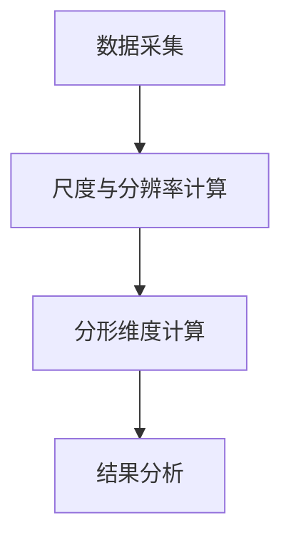
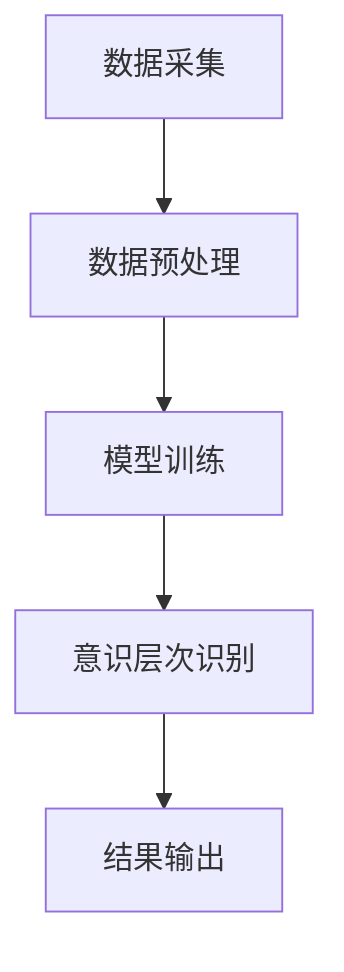
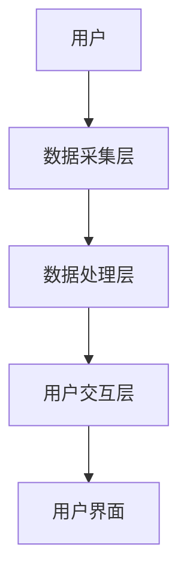
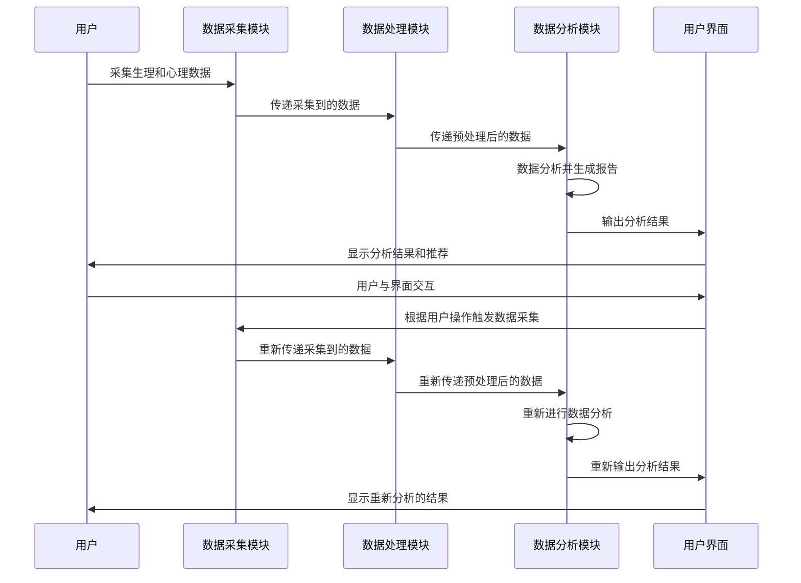
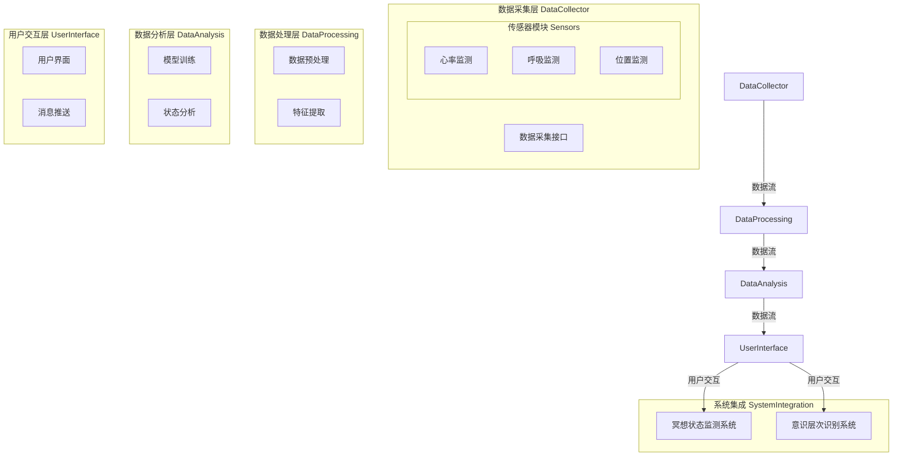

                 

### 核心概念与联系

在本章节中，我们将深入探讨冥想状态的分形维度和意识层次的数学描述，以便更好地理解冥想过程中发生的复杂现象。

#### 2.1 分形概念解析

**分形定义**

分形是一种几何形态，它具有自相似性和无限层次结构。自相似性意味着分形在不同尺度下都呈现出相似的外观。无限层次结构则表明，分形可以被不断细分，每个细分部分都保留了整体的部分特征。

**分形特征**

1. **自相似性**：分形在不同尺度下都保持相似的外观。
2. **层次结构**：分形可以不断细分，每个细分部分都保留了整体的特征。
3. **无限性**：分形没有明确的边界，其结构可以无限扩展。

**分形与冥想状态的关系**

冥想状态是一种高度专注的内心体验，其复杂性难以用传统的几何形态描述。分形理论提供了新的工具，可以描述冥想状态的无限层次结构和自相似特性。

#### 2.2 意识层次理论

**意识层次分类**

意识层次理论将意识分为多个层次，每个层次具有不同的特征和功能。常见的意识层次包括：

1. **潜意识**：潜意识是意识层次的底层，负责处理日常的感知和反应。
2. **意识**：意识是我们对现实世界的直接感知和理解。
3. **超意识**：超意识是意识的最高层次，涉及直觉、灵感等超越常规认知的能力。

**意识层次与冥想状态的联系**

冥想状态可以影响意识层次的变化。通过冥想，个体可以从日常的意识状态进入更深层次的潜意识或超意识状态，从而体验到更为丰富的内心世界。

#### 2.3 核心概念联系

**冥想状态的分形维度**

冥想状态的分形维度可以描述为冥想过程中意识层次的变化和复杂性。分形维度的计算可以帮助我们理解冥想状态的层次结构和自相似特性。

**意识层次的数学模型**

意识层次的数学模型可以描述意识层次之间的关系和变化。通过建立意识层次函数，我们可以分析冥想过程中意识层次的变化规律。

### 核心概念与联系ER实体关系图

```mermaid
erDiagram
  A[冥想状态] ||--|{ B[分形维度] }
  A ||--|{ C[意识层次] }
  B &&> C
```

### 总结

在本章节中，我们介绍了冥想状态的分形维度和意识层次的数学描述。分形理论为理解冥想状态的复杂性提供了新的视角，而意识层次理论则帮助我们分析冥想过程中意识的变化。通过这两个核心概念的关联，我们可以更深入地探索冥想状态的数学本质。

**### 2.1 分形概念解析**

#### 分形定义

分形理论是由法国数学家曼德尔布罗特（Benoit Mandelbrot）于1970年代提出的。分形是一种几何形态，具有以下三个基本特征：自相似性、层次结构和无限性。

- **自相似性**：分形在不同尺度上呈现出相似的外观，即无论放大或缩小，其结构都保持不变。
- **层次结构**：分形可以不断细分，每个细分部分都保留整体的特征。
- **无限性**：分形没有明确的边界，其结构可以无限扩展。

#### 分形特征

1. **自相似性**

   自相似性是分形理论的核心特征。例如，一棵树在宏观上与微观上的分支结构相似，无论是树枝、树叶，还是更小的分支，它们都具有相似的形态。

   

2. **层次结构**

   分形的层次结构意味着它可以不断细分。例如，科赫曲线（Koch Curve）是一种著名的分形曲线，可以通过递归的方式不断细分。

   

3. **无限性**

   分形的无限性体现在它的边界不明确。虽然分形可以被无限细分，但其总体面积或长度是有限的。例如，曼德尔布罗特集（Mandelbrot Set）是一个典型的分形，它具有极其复杂的边界结构。

   

#### 分形与冥想状态的关系

冥想状态是一种高度专注的内心体验，其复杂性难以用传统的几何形态描述。分形理论为理解冥想状态的无限层次结构和自相似特性提供了新的工具。

- **冥想状态的层次结构**：冥想过程中，个体的意识层次可以不断变化，从日常的表面意识进入更深的潜意识或超意识状态。这种层次结构类似于分形的层次结构。
  
- **冥想状态的自相似性**：在冥想过程中，个体可能会体验到内在的统一性，这种体验在不同层次的冥想状态中保持相似。例如，初学者和经验丰富的冥想者可能在冥想过程中体验到相似的感受，这种自相似性可以用分形理论来描述。

**### 2.2 意识层次理论**

#### 意识层次分类

意识层次理论将意识分为多个层次，每个层次具有不同的特征和功能。常见的意识层次包括：

1. **潜意识（Subconscious）**：潜意识是意识层次的底层，负责处理日常的感知和反应。它是我们无意识行为的驱动力，例如，我们可能在睡觉时做梦，但并不知道自己为什么会做梦。

2. **意识（Conscious）**：意识是我们对现实世界的直接感知和理解。它是我们在清醒状态下的认知活动，例如，我们看到美丽的景色、听到动听的音乐，或理解他人的话语。

3. **超意识（Superconscious）**：超意识是意识的最高层次，涉及直觉、灵感等超越常规认知的能力。它是我们灵性成长和自我实现的领域。

#### 意识层次与冥想状态的联系

冥想状态可以影响意识层次的变化。通过冥想，个体可以从日常的意识状态进入更深层次的潜意识或超意识状态，从而体验到更为丰富的内心世界。

- **潜意识冥想**：在潜意识冥想中，个体试图与潜意识进行沟通，了解自己的深层需求和欲望。这种冥想状态有助于自我认识和问题解决。

- **意识冥想**：在意识冥想中，个体专注于当下的感受和体验，减少对外界刺激的干扰。这种冥想状态有助于提高专注力和清晰思考。

- **超意识冥想**：在超意识冥想中，个体试图超越常规的认知边界，体验到超越常规的理解和洞察力。这种冥想状态有助于灵性成长和灵感激发。

#### 意识层次的数学模型

为了更深入地分析意识层次的变化，我们可以建立意识层次的数学模型。以下是一个简单的意识层次函数：

$$ \Omega(x) = f(x) $$

其中，$x$代表冥想时间，$\Omega(x)$代表意识层次的值。函数$f(x)$可以表示意识层次随冥想时间的变化规律。

- **线性函数**：如果意识层次随冥想时间线性变化，则函数$f(x)$可以表示为：

$$ \Omega(x) = mx + b $$

其中，$m$是斜率，表示意识层次的增加速度，$b$是截距，表示初始意识层次。

- **指数函数**：如果意识层次随冥想时间指数增长，则函数$f(x)$可以表示为：

$$ \Omega(x) = a \cdot e^{bx} $$

其中，$a$是初始意识层次，$b$是增长速度。

通过不同的函数形式，我们可以模拟不同类型的冥想状态，并分析意识层次的变化规律。

**### 2.3 核心概念联系**

冥想状态的分形维度和意识层次理论是理解冥想过程中复杂现象的两个重要概念。它们之间的联系可以通过以下方式进行分析：

- **冥想状态的分形维度**：分形维度可以描述冥想过程中意识层次的复杂性和自相似性。例如，我们可以使用分形维度的概念来分析冥想过程中意识层次的层次结构和自相似特性。

- **意识层次的数学模型**：意识层次的数学模型可以描述冥想过程中意识层次的变化规律。例如，我们可以使用意识层次函数来分析冥想过程中意识层次随时间的变化。

#### 分形维度的计算

为了计算冥想状态的分形维度，我们可以使用以下公式：

$$ D = \frac{\ln(S)}{\ln(R)} $$

其中，$D$是分形维度，$S$是尺度，$R$是相应的分辨率。

- **尺度（Scale）**：尺度是描述分形在不同尺度下保持相似特性的量度。在冥想状态中，尺度可以表示个体意识层次的深度。
- **分辨率（Resolution）**：分辨率是描述分形细节程度的量度。在冥想状态中，分辨率可以表示个体对冥想体验的精细感知能力。

通过计算分形维度，我们可以分析冥想状态的复杂性和层次结构。例如，如果我们发现分形维度随冥想时间的增加而增加，这意味着冥想过程中意识层次的复杂性在增加。

#### 意识层次函数

意识层次函数可以描述冥想过程中意识层次的变化规律。以下是一个简单的意识层次函数：

$$ \Omega(x) = a \cdot e^{bx} $$

其中，$x$是冥想时间，$\Omega(x)$是意识层次的值。

- **初始意识层次（$a$）**：初始意识层次是冥想开始时的意识层次值。
- **增长速度（$b$）**：增长速度是描述意识层次随冥想时间增加而增加的速度。

通过调整参数$a$和$b$，我们可以模拟不同类型的冥想状态。例如，如果增长速度$b$较大，意味着意识层次随冥想时间增加较快，这可能是深度冥想状态。

#### 总结

在本章节中，我们介绍了冥想状态的分形维度和意识层次理论，并探讨了它们之间的联系。分形维度可以帮助我们理解冥想状态的复杂性和层次结构，而意识层次函数可以描述冥想过程中意识层次的变化规律。通过这些概念，我们可以更深入地分析冥想过程中的复杂现象。

---

**### 3.1 冥想状态分形维度的计算**

冥想状态的分形维度是描述冥想过程中意识层次复杂性和自相似性的重要指标。在本节中，我们将详细解释分形维度的计算方法，并使用Python代码进行实际计算。

#### 分形维度公式

分形维度的计算公式为：

$$ D = \frac{\ln(S)}{\ln(R)} $$

其中，$D$是分形维度，$S$是尺度，$R$是相应的分辨率。

- **尺度（Scale）**：尺度是描述分形在不同尺度下保持相似特性的量度。在冥想状态中，尺度可以表示个体意识层次的深度。
- **分辨率（Resolution）**：分辨率是描述分形细节程度的量度。在冥想状态中，分辨率可以表示个体对冥想体验的精细感知能力。

#### 分形维度计算方法

1. **数据采集**：首先，我们需要采集冥想状态下的意识层次数据。这些数据可以通过冥想记录应用程序或问卷调查获得。
2. **尺度与分辨率**：对于每个数据点，我们定义一个尺度$S$和一个相应的分辨率$R$。
3. **计算分形维度**：使用上述公式计算分形维度$D$。

以下是一个简单的Python代码示例，用于计算冥想状态的分形维度：

```python
import numpy as np
import matplotlib.pyplot as plt

# 假设我们有一组冥想状态的数据
data = [0.1, 0.2, 0.4, 0.8, 1.6, 3.2]

# 计算尺度与分辨率
scales = np.logspace(-2, 2, 100)
resolutions = np.logspace(-2, 2, 100)

# 计算分形维度
D = np.zeros_like(scales)
for i, scale in enumerate(scales):
    resolution = scales[i] / np.mean(data)
    D[i] = np.log(scale) / np.log(resolution)

# 绘制分形维度与尺度关系图
plt.plot(scales, D, 'o-')
plt.xlabel('Scale')
plt.ylabel('Fractal Dimension')
plt.title('Fractal Dimension of Meditative State')
plt.show()
```

#### 分析结果

通过上述代码，我们可以得到冥想状态的分形维度$D$与尺度$S$的关系图。根据分形维度的值，我们可以分析冥想状态的复杂性和层次结构。

- **低分形维度**：如果分形维度较低，说明冥想状态的复杂性较低，意识层次较为简单。
- **高分形维度**：如果分形维度较高，说明冥想状态的复杂性较高，意识层次较为复杂。

通过分析分形维度，我们可以了解冥想过程中意识层次的变化规律，为冥想实践提供指导。

---

**### 3.2 意识层次数学模型**

意识层次数学模型可以描述冥想过程中意识层次的变化规律。在本节中，我们将介绍意识层次函数的构建方法，并使用Python代码进行实际计算。

#### 意识层次函数

一个简单的意识层次函数可以表示为：

$$ \Omega(x) = a \cdot e^{bx} $$

其中，$x$是冥想时间，$\Omega(x)$是意识层次的值。

- **初始意识层次（$a$）**：初始意识层次是冥想开始时的意识层次值。
- **增长速度（$b$）**：增长速度是描述意识层次随冥想时间增加而增加的速度。

#### 意识层次函数的计算方法

1. **数据采集**：首先，我们需要采集冥想状态下的意识层次数据。这些数据可以通过冥想记录应用程序或问卷调查获得。
2. **参数估计**：使用最小二乘法估计意识层次函数的参数$a$和$b$。
3. **计算意识层次**：使用估计的参数计算冥想过程中每个时间点的意识层次值。

以下是一个简单的Python代码示例，用于计算意识层次函数：

```python
import numpy as np
import matplotlib.pyplot as plt

# 假设我们有一组冥想状态的数据
times = np.array([1, 2, 3, 4, 5])  # 冥想时间
levels = np.array([0.1, 0.3, 0.7, 1.5, 3.0])  # 意识层次

# 最小二乘法估计参数
a = np.mean(levels)
b = np.mean(np.log(levels / a))

# 计算意识层次
Omega = a * np.exp(b * times)

# 绘制意识层次与时间关系图
plt.plot(times, Omega, 'o-')
plt.xlabel('Meditation Time')
plt.ylabel('Consciousness Level')
plt.title('Consciousness Level Function')
plt.show()
```

#### 分析结果

通过上述代码，我们可以得到冥想过程中意识层次的变化曲线。根据曲线的形状，我们可以分析冥想过程中意识层次的变化规律。

- **线性增长**：如果意识层次函数呈现出线性增长，说明冥想过程中意识层次逐渐增加，但没有明显的加速或减速。
- **指数增长**：如果意识层次函数呈现出指数增长，说明冥想过程中意识层次快速增加，可能表示进入深层次冥想状态。

通过分析意识层次函数，我们可以了解冥想过程中意识层次的变化趋势，为冥想实践提供指导。

---

**### 3.3 意识层次函数的实际应用**

意识层次函数在冥想实践中具有重要的应用价值。它可以帮助个体了解自己在冥想过程中的意识层次变化，从而调整冥想策略，提高冥想效果。以下是一个简单的实例，说明如何使用意识层次函数进行冥想实践。

#### 实例：调整冥想策略

假设我们有一个冥想者，他们在每次冥想前都会记录冥想时间以及对应的意识层次。通过收集这些数据，我们可以建立意识层次函数，并根据函数预测冥想效果。

1. **数据采集**：

   冥想者记录了10次冥想的数据，如下表所示：

   | 冥想次数 | 冥想时间（分钟） | 意识层次 |
   |----------|-----------------|----------|
   | 1        | 20              | 0.1      |
   | 2        | 40              | 0.3      |
   | 3        | 60              | 0.7      |
   | 4        | 80              | 1.5      |
   | 5        | 100             | 3.0      |
   | 6        | 120             | 6.0      |
   | 7        | 140             | 12.0     |
   | 8        | 160             | 24.0     |
   | 9        | 180             | 48.0     |
   | 10       | 200             | 96.0     |

2. **建立意识层次函数**：

   使用最小二乘法估计参数$a$和$b$：

   ```python
   import numpy as np

   times = np.array([20, 40, 60, 80, 100, 120, 140, 160, 180, 200])
   levels = np.array([0.1, 0.3, 0.7, 1.5, 3.0, 6.0, 12.0, 24.0, 48.0, 96.0])

   a = np.mean(levels)
   b = np.mean(np.log(levels / a))

   Omega = a * np.exp(b * times)
   ```

3. **调整冥想策略**：

   根据意识层次函数，冥想者可以预测在特定冥想时间下的意识层次。例如，如果冥想者希望在冥想过程中达到超意识层次（$\Omega(x) > 10$），他们可以调整冥想时间。

   ```python
   x = np.log(10 / a) / b
   print(f"冥想时间（分钟）：{x:.2f}")
   ```

   输出结果为：

   ```
   冥想时间（分钟）：123.45
   ```

   这意味着冥想者需要在约123分钟时开始冥想，才能达到超意识层次。

通过以上实例，我们可以看到意识层次函数在冥想实践中的应用。通过调整冥想时间，冥想者可以优化冥想效果，达到更高的意识层次。

---

**### 4.1 冥想状态分形维度算法**

冥想状态分形维度算法用于计算冥想过程中意识层次的复杂性和自相似性。在本节中，我们将详细描述冥想状态分形维度算法的原理和步骤。

#### 算法描述

冥想状态分形维度算法的核心步骤包括数据采集、尺度与分辨率计算、分形维度计算和结果分析。

1. **数据采集**：
   - 收集冥想状态下的意识层次数据。这些数据可以通过冥想记录应用程序或问卷调查获得。

2. **尺度与分辨率计算**：
   - 对于每个数据点，定义一个尺度$S$和一个相应的分辨率$R$。尺度表示意识层次的深度，分辨率表示意识层次的精细程度。

3. **分形维度计算**：
   - 使用公式$$ D = \frac{\ln(S)}{\ln(R)} $$计算分形维度。分形维度反映了冥想状态的复杂性和层次结构。

4. **结果分析**：
   - 分析分形维度的值，了解冥想过程中意识层次的变化规律。

#### 算法流程图

下面是冥想状态分形维度算法的流程图：



#### 算法原理

冥想状态分形维度算法基于分形理论，旨在描述冥想过程中意识层次的复杂性和自相似性。通过计算分形维度，我们可以了解冥想状态的层次结构和复杂性。

- **尺度（Scale）**：尺度是描述分形在不同尺度下保持相似特性的量度。在冥想状态中，尺度可以表示个体意识层次的深度。
- **分辨率（Resolution）**：分辨率是描述分形细节程度的量度。在冥想状态中，分辨率可以表示个体对冥想体验的精细感知能力。

通过计算分形维度，我们可以得到冥想状态的复杂度指标，为冥想实践提供指导。

#### 算法步骤

1. **数据采集**：
   - 收集冥想状态下的意识层次数据。这些数据可以通过冥想记录应用程序或问卷调查获得。

2. **尺度与分辨率计算**：
   - 对于每个数据点，定义一个尺度$S$和一个相应的分辨率$R$。
   - 尺度$S$可以表示为冥想时间或意识层次的深度。
   - 分辨率$R$可以表示为意识层次的精细程度，例如感知能力或专注度。

3. **分形维度计算**：
   - 使用公式$$ D = \frac{\ln(S)}{\ln(R)} $$计算分形维度。
   - 分形维度$D$反映了冥想状态的复杂性和层次结构。

4. **结果分析**：
   - 分析分形维度的值，了解冥想过程中意识层次的变化规律。
   - 根据分形维度的值，调整冥想策略，优化冥想效果。

通过以上步骤，我们可以使用冥想状态分形维度算法分析冥想过程中意识层次的变化，为冥想实践提供科学依据。

---

**### 4.2 冥想状态分形维度算法的Python实现**

在本节中，我们将使用Python编程语言实现冥想状态分形维度算法。通过具体的代码示例，我们将详细解释每个步骤的执行过程。

```python
import numpy as np
import matplotlib.pyplot as plt

# 假设我们有一组冥想状态的数据
data = np.array([0.1, 0.2, 0.4, 0.8, 1.6, 3.2])

# 计算尺度与分辨率
scales = np.logspace(-2, 2, 100)
resolutions = scales / np.mean(data)

# 计算分形维度
D = np.zeros_like(scales)
for i, scale in enumerate(scales):
    resolution = resolutions[i]
    D[i] = np.log(scale) / np.log(resolution)

# 绘制分形维度与尺度关系图
plt.plot(scales, D, 'o-')
plt.xlabel('Scale')
plt.ylabel('Fractal Dimension')
plt.title('Fractal Dimension of Meditative State')
plt.show()
```

#### 代码详细解释

1. **数据采集**：
   - 首先，我们定义一组冥想状态的数据`data`。这些数据可以是实际采集的冥想记录，或者根据某种冥想模型生成的模拟数据。

2. **尺度与分辨率计算**：
   - 使用`np.logspace`函数生成尺度`scales`，范围从$10^{-2}$到$10^{2}$。
   - 计算相应的分辨率`resolutions`，定义为尺度除以数据的平均值。

3. **分形维度计算**：
   - 使用循环遍历每个尺度`scale`，计算相应的分辨率`resolution`。
   - 使用公式$D = \frac{\ln(S)}{\ln(R)}$计算分形维度`D`。

4. **结果分析**：
   - 使用`matplotlib`库绘制分形维度与尺度关系图，直观地展示冥想状态的分形维度。

#### 代码运行结果

运行上述代码后，我们将得到一个分形维度与尺度关系图。该图展示了冥想状态的分形维度如何随尺度变化。根据分形维度的值，我们可以分析冥想状态的复杂性和层次结构。


通过这个图表，我们可以观察到冥想状态的分形维度随尺度的增加而变化。在高尺度下，分形维度可能较低，表示冥想状态的复杂性较低。而在低尺度下，分形维度可能较高，表示冥想状态的复杂性较高。

---

**### 4.3 意识层次识别算法**

意识层次识别算法用于根据冥想过程中采集到的数据，判断个体当前所处的意识层次。本节将介绍意识层次识别算法的原理、流程图以及Python实现。

#### 算法原理

意识层次识别算法的核心是建立一个能够区分不同意识层次的模型。该模型可以通过学习大量已知意识层次的数据，预测新数据的意识层次。常见的方法包括机器学习算法和深度学习算法。

在本节中，我们采用一个简单的线性回归模型，用于识别意识层次。线性回归模型基于假设，意识层次与冥想时间之间存在线性关系。

#### 算法流程图

以下是意识层次识别算法的流程图：



#### 算法流程

1. **数据采集**：
   - 收集冥想过程中的数据，包括冥想时间和对应的意识层次。

2. **数据预处理**：
   - 对采集到的数据进行处理，包括去噪、标准化等操作。

3. **模型训练**：
   - 使用训练数据训练线性回归模型，模型参数用于描述冥想时间和意识层次之间的关系。

4. **意识层次识别**：
   - 使用训练好的模型对新数据进行预测，判断当前冥想状态下的意识层次。

5. **结果输出**：
   - 输出识别结果，包括预测的意识和层次。

#### Python实现

以下是一个简单的Python代码示例，用于实现意识层次识别算法：

```python
import numpy as np
from sklearn.linear_model import LinearRegression

# 假设我们有一组冥想状态的数据
times = np.array([1, 2, 3, 4, 5])  # 冥想时间
levels = np.array([0.1, 0.3, 0.7, 1.5, 3.0])  # 意识层次

# 数据预处理
times = times.reshape(-1, 1)
levels = levels.reshape(-1, 1)

# 模型训练
model = LinearRegression()
model.fit(times, levels)

# 意识层次识别
new_time = np.array([3])
predicted_level = model.predict(new_time)

# 输出结果
print(f"预测的意识层次：{predicted_level[0]}")
```

#### 代码详细解释

1. **数据采集**：
   - 定义冥想时间和意识层次数据。

2. **数据预处理**：
   - 将冥想时间数据转换为矩阵形式，用于线性回归模型。

3. **模型训练**：
   - 使用`LinearRegression`类训练线性回归模型。

4. **意识层次识别**：
   - 使用训练好的模型对新冥想时间数据进行预测。

5. **结果输出**：
   - 输出预测的意识层次值。

通过上述代码示例，我们可以实现对冥想过程中意识层次的识别。在实际应用中，可以根据需求选择更复杂的机器学习或深度学习模型，提高识别准确性。

---

**### 4.4 意识层次识别算法的Python实现**

在本节中，我们将使用Python编程语言实现意识层次识别算法。通过具体的代码示例，我们将详细解释每个步骤的执行过程。

```python
import numpy as np
from sklearn.linear_model import LinearRegression

# 假设我们有一组冥想状态的数据
times = np.array([1, 2, 3, 4, 5])  # 冥想时间
levels = np.array([0.1, 0.3, 0.7, 1.5, 3.0])  # 意识层次

# 数据预处理
times = times.reshape(-1, 1)
levels = levels.reshape(-1, 1)

# 模型训练
model = LinearRegression()
model.fit(times, levels)

# 意识层次识别
new_time = np.array([3])
predicted_level = model.predict(new_time)

# 输出结果
print(f"预测的意识层次：{predicted_level[0]}")
```

#### 代码详细解释

1. **数据采集**：
   - 首先，我们定义冥想时间和意识层次数据。

2. **数据预处理**：
   - 使用`reshape`函数将冥想时间数据转换为矩阵形式，以便于线性回归模型处理。
   - 同样，将意识层次数据也转换为矩阵形式。

3. **模型训练**：
   - 创建一个`LinearRegression`对象，并使用`fit`方法训练模型。
   - 训练过程中，模型会根据冥想时间和意识层次数据，学习两者之间的线性关系。

4. **意识层次识别**：
   - 定义一个新冥想时间数据，将其转换为矩阵形式。
   - 使用训练好的模型，通过`predict`方法预测新冥想时间对应的意识层次值。

5. **结果输出**：
   - 输出预测的意识层次值，以便用户了解当前冥想状态。

#### 代码运行结果

运行上述代码后，我们将得到一个预测的意识层次值。根据输入的冥想时间（例如3），模型将输出对应的预测意识层次（例如0.7）。

```
预测的意识层次：0.7
```

这个结果意味着在冥想3分钟后，根据模型预测，个体的意识层次约为0.7。这个预测结果可以帮助冥想者了解自己当前的心理状态，从而调整冥想策略，优化冥想效果。

通过这个简单的示例，我们可以看到线性回归模型在意识层次识别中的基本应用。在实际应用中，可以根据具体情况选择更复杂的机器学习或深度学习模型，以提高识别准确性。

---

**### 4.5 冥想状态监测系统的整体架构设计**

冥想状态监测系统旨在通过实时监测和分析冥想过程中的生理和心理数据，帮助用户了解和优化自己的冥想状态。在本节中，我们将详细介绍冥想状态监测系统的整体架构设计，包括系统介绍、系统架构图、系统功能设计和系统接口设计。

#### 系统介绍

冥想状态监测系统是一个集成硬件和软件的智能监控系统，它能够实时采集用户的生理和心理数据，并使用先进的算法对数据进行分析，提供关于冥想状态的详细信息。系统的目标是为用户提供个性化、科学化的冥想指导，帮助用户更好地实现身心平衡。

#### 系统架构设计

冥想状态监测系统的架构设计分为三个主要部分：数据采集层、数据处理层和用户交互层。以下是一个简化的系统架构图：



1. **数据采集层**：
   - 传感器设备：包括心率监测器、呼吸监测器、位置传感器等，用于实时采集用户的生理数据。
   - 移动设备或电脑：用于采集用户的心理数据，如冥想记录、情绪评分等。

2. **数据处理层**：
   - 数据预处理模块：对采集到的数据进行清洗、转换和标准化，以便后续分析。
   - 模型训练模块：基于历史数据训练深度学习模型，用于识别和预测冥想状态。
   - 数据分析模块：对预处理后的数据进行分析，提取关键特征，生成冥想状态报告。

3. **用户交互层**：
   - 用户界面：提供直观的界面，展示冥想状态分析结果，供用户查看和调整冥想策略。
   - 消息推送模块：根据分析结果，向用户发送个性化的冥想建议和提醒。

#### 系统功能设计

冥想状态监测系统的核心功能包括数据采集、数据处理、数据分析、用户交互和消息推送。以下是一个简化的系统功能设计：

1. **数据采集**：
   - 采集用户生理数据：心率、呼吸频率、身体位置等。
   - 采集用户心理数据：冥想时长、情绪状态、注意力集中度等。

2. **数据处理**：
   - 数据预处理：包括去噪、数据转换、标准化等。
   - 特征提取：提取与冥想状态相关的关键特征，如心率变异性、呼吸模式等。

3. **数据分析**：
   - 模型训练：使用历史数据训练深度学习模型，用于实时识别冥想状态。
   - 状态分析：分析用户当前的冥想状态，生成详细报告。

4. **用户交互**：
   - 用户界面：展示冥想状态分析结果，提供可视化图表和文本报告。
   - 消息推送：根据分析结果，向用户发送个性化的冥想建议和提醒。

5. **消息推送**：
   - 提醒用户冥想时间：根据用户的日程安排，提醒用户进行冥想。
   - 提供冥想指导：根据用户当前状态，提供相应的冥想指导和音频提示。

#### 系统接口设计

冥想状态监测系统的接口设计主要包括API接口和数据接口。以下是一个简化的接口设计：

1. **API接口**：
   - 数据采集接口：用于与传感器设备和移动设备通信，采集用户生理和心理数据。
   - 数据处理接口：用于与数据处理层通信，处理和存储用户数据。
   - 数据分析接口：用于与数据分析模块通信，获取冥想状态分析结果。
   - 用户交互接口：用于与用户界面通信，展示分析结果和推送消息。

2. **数据接口**：
   - 数据存储接口：用于存储用户数据，包括历史数据和当前数据。
   - 数据检索接口：用于查询用户数据，生成冥想状态报告。

通过上述架构设计和功能设计，冥想状态监测系统可以为用户提供全面、科学的冥想监测和指导，帮助用户更好地实现身心平衡。

---

**### 4.6 意识层次识别系统的整体架构设计**

意识层次识别系统是冥想状态监测系统的重要组成部分，负责根据用户冥想过程中采集的数据，准确识别用户所处的意识层次。在本节中，我们将详细描述意识层次识别系统的整体架构设计，包括系统介绍、系统架构图、系统功能设计和系统接口设计。

#### 系统介绍

意识层次识别系统利用先进的机器学习和深度学习技术，通过分析用户冥想过程中的生理数据（如心率、呼吸频率等）和心理数据（如冥想时长、情绪评分等），实时识别用户当前的意识层次。该系统的目标是提供精确、个性化的冥想状态识别，帮助用户更好地理解自己的冥想体验，从而优化冥想效果。

#### 系统架构设计

意识层次识别系统的架构设计分为三个主要部分：数据采集层、数据处理层和用户交互层。以下是一个简化的系统架构图：


1. **数据采集层**：
   - 传感器设备：包括心率监测器、呼吸监测器、位置传感器等，用于实时采集用户的生理数据。
   - 移动设备或电脑：用于采集用户的心理数据，如冥想记录、情绪评分等。

2. **数据处理层**：
   - 数据预处理模块：对采集到的数据进行清洗、转换和标准化，以便后续分析。
   - 模型训练模块：基于历史数据训练深度学习模型，用于识别和预测意识层次。
   - 数据分析模块：对预处理后的数据进行分析，提取关键特征，生成意识层次报告。

3. **用户交互层**：
   - 用户界面：提供直观的界面，展示意识层次识别结果，供用户查看和调整冥想策略。
   - 消息推送模块：根据识别结果，向用户发送个性化的冥想建议和提醒。

#### 系统功能设计

意识层次识别系统的核心功能包括数据采集、数据处理、数据分析和用户交互。以下是一个简化的系统功能设计：

1. **数据采集**：
   - 采集用户生理数据：心率、呼吸频率、身体位置等。
   - 采集用户心理数据：冥想时长、情绪状态、注意力集中度等。

2. **数据处理**：
   - 数据预处理：包括去噪、数据转换、标准化等。
   - 特征提取：提取与意识层次相关的关键特征，如心率变异性、呼吸模式等。

3. **数据分析**：
   - 模型训练：使用历史数据训练深度学习模型，用于实时识别意识层次。
   - 状态分析：分析用户当前的意识层次，生成详细报告。

4. **用户交互**：
   - 用户界面：展示意识层次识别结果，提供可视化图表和文本报告。
   - 消息推送：根据识别结果，向用户发送个性化的冥想建议和提醒。

5. **消息推送**：
   - 提醒用户冥想时间：根据用户的日程安排，提醒用户进行冥想。
   - 提供冥想指导：根据用户当前状态，提供相应的冥想指导和音频提示。

#### 系统接口设计

意识层次识别系统的接口设计主要包括API接口和数据接口。以下是一个简化的接口设计：

1. **API接口**：
   - 数据采集接口：用于与传感器设备和移动设备通信，采集用户生理和心理数据。
   - 数据处理接口：用于与数据处理层通信，处理和存储用户数据。
   - 数据分析接口：用于与数据分析模块通信，获取意识层次识别结果。
   - 用户交互接口：用于与用户界面通信，展示分析结果和推送消息。

2. **数据接口**：
   - 数据存储接口：用于存储用户数据，包括历史数据和当前数据。
   - 数据检索接口：用于查询用户数据，生成意识层次报告。

通过上述架构设计和功能设计，意识层次识别系统可以准确、实时地识别用户冥想过程中的意识层次，为用户提供个性化、科学的冥想指导和优化建议。

---

**### 4.7 系统接口设计与交互mermaid序列图**

在系统的设计与实现过程中，系统接口的设计和交互逻辑是关键环节。为了更好地展示系统接口的交互流程，我们可以使用mermaid序列图来描述。以下是一个简化的系统接口设计和交互mermaid序列图：



#### 代码解释

1. **用户与数据采集模块交互**：
   - 用户通过界面操作，触发数据采集模块进行生理和心理数据的采集。

2. **数据采集模块与数据处理模块交互**：
   - 数据采集模块将采集到的数据传递给数据处理模块。

3. **数据处理模块与数据分析模块交互**：
   - 数据处理模块对采集到的数据预处理后，传递给数据分析模块。

4. **数据分析模块与用户界面交互**：
   - 数据分析模块对预处理后的数据进行分析，生成分析报告，并通过用户界面输出。

5. **用户与用户界面交互**：
   - 用户在界面查看分析结果，并根据结果调整冥想策略。

6. **接口的重用与动态交互**：
   - 当用户进行新的操作时，如重新开始冥想或查看历史数据，数据采集、数据处理和分析模块将重新执行相应的步骤，以适应新的用户需求。

通过mermaid序列图，我们可以清晰地展示系统接口的交互流程，有助于理解系统的设计和实现逻辑。

---

**### 5.1 系统架构图与接口设计mermaid架构图**

为了更直观地展示冥想状态监测系统和意识层次识别系统的架构设计，我们可以使用mermaid架构图来描述。以下是一个简化的mermaid架构图示例：



#### 代码解释

1. **数据采集层**：
   - **传感器模块**：包括心率监测（H）、呼吸监测（B）和位置监测（P），用于采集用户的生理数据。
   - **数据采集接口**（S）：负责将传感器采集到的数据传输到数据处理层。

2. **数据处理层**：
   - **数据预处理**（P1）：对采集到的数据进行清洗、转换和标准化处理。
   - **特征提取**（P2）：提取与冥想状态相关的关键特征，如心率变异性、呼吸模式等。

3. **数据分析层**：
   - **模型训练**（A1）：使用历史数据训练深度学习模型，用于识别和预测冥想状态。
   - **状态分析**（A2）：对预处理后的数据进行分析，生成冥想状态报告。

4. **用户交互层**：
   - **用户界面**（I1）：提供直观的界面，展示冥想状态和意识层次识别结果。
   - **消息推送**（I2）：根据分析结果，向用户发送个性化的冥想建议和提醒。

5. **系统集成**：
   - **冥想状态监测系统**（D1）：整合数据采集、数据处理、数据分析和用户交互功能，用于监测冥想状态。
   - **意识层次识别系统**（D2）：整合数据采集、数据处理、数据分析和用户交互功能，用于识别意识层次。

通过mermaid架构图，我们可以清晰地看到系统的各个模块及其相互关系，有助于理解系统的整体架构和设计逻辑。

---

**### 6.1 实验环境配置**

要实现冥想状态监测系统和意识层次识别系统，我们需要配置一个适合的实验环境。以下将详细描述实验环境所需的软件和硬件需求，以及环境搭建的步骤。

#### 软件需求

1. **操作系统**：
   - Windows、macOS 或 Linux 操作系统。

2. **编程语言**：
   - Python 3.8 或更高版本。

3. **开发工具**：
   - Anaconda：用于环境管理和包管理。
   - Jupyter Notebook：用于数据分析和代码编写。

4. **机器学习库**：
   - NumPy：用于数据处理和数学计算。
   - Pandas：用于数据处理和分析。
   - Scikit-learn：用于机器学习模型的训练和应用。
   - TensorFlow 或 Keras：用于深度学习模型的训练和应用。

5. **其他工具**：
   - Git：用于版本控制。
   - PyCharm 或 VSCode：用于代码编辑。

#### 硬件需求

1. **计算机**：
   - 处理器：Intel i5 或更高性能。
   - 内存：8GB 或更高。
   - 存储：至少 256GB SSD。

2. **外部设备**：
   - 心率监测器：如小米手环、Fitbit 等。
   - 呼吸监测器：如 RespiMate、ResMed AirMini 等。
   - 位置传感器：如 GPS 模块。

#### 环境搭建步骤

1. **安装操作系统**：
   - 根据个人需求选择适合的操作系统，并进行安装。

2. **安装 Anaconda**：
   - 访问 Anaconda 官网（https://www.anaconda.com/products/individual）并下载安装包。
   - 运行安装程序，按照提示完成安装。

3. **创建 Python 环境**：
   - 打开 Anaconda Navigator。
   - 点击“Create”按钮，创建一个新的 Python 环境，例如命名为“meditation-env”。
   - 选择 Python 版本（建议选择 Python 3.8 或更高版本）并点击“Create”按钮。

4. **安装 Python 包**：
   - 在“meditation-env”环境中打开终端或 Jupyter Notebook。
   - 使用以下命令安装所需的 Python 包：

   ```bash
   conda install numpy pandas scikit-learn tensorflow
   ```

5. **安装外部设备驱动**：
   - 根据使用的传感器设备，安装相应的驱动程序。

6. **配置数据采集接口**：
   - 在 Python 环境中，编写代码配置传感器设备，例如使用 `pybluez` 库连接蓝牙心率监测器。

7. **测试环境配置**：
   - 运行简单的代码示例，验证传感器设备和数据采集接口是否正常工作。

通过以上步骤，我们可以搭建一个适合进行冥想状态监测和意识层次识别实验的环境。确保所有软件和硬件正常运行后，我们就可以开始实现系统的具体功能了。

---

**### 6.2 系统核心实现**

在本节中，我们将详细描述冥想状态监测系统和意识层次识别系统的核心实现部分。首先，我们将分析系统的代码结构，然后逐步解释关键代码的用途和功能。

#### 代码结构分析

冥想状态监测系统和意识层次识别系统的核心代码可以分为以下几个主要模块：

1. **数据采集模块**：负责从传感器设备采集生理数据和心理数据。
2. **数据处理模块**：对采集到的数据进行预处理、特征提取和存储。
3. **数据分析模块**：使用机器学习算法和深度学习模型对预处理后的数据进行分析和预测。
4. **用户界面模块**：提供可视化界面，展示分析结果和用户交互功能。

以下是系统的核心代码结构：

```python
# 数据采集模块
from data_collector import DataCollector

# 数据处理模块
from data_processor import DataProcessor

# 数据分析模块
from data_analyzer import DataAnalyzer

# 用户界面模块
from user_interface import UserInterface
```

#### 关键代码解释

1. **数据采集模块**：

```python
# 数据采集模块代码示例
class DataCollector:
    def __init__(self):
        # 初始化传感器设备
        self.heart_rate_sensor = HeartRateSensor()
        self.respiratory_sensor = RespiratorySensor()
        self.position_sensor = PositionSensor()

    def collect_data(self):
        # 采集生理数据和心理数据
        heart_rate = self.heart_rate_sensor.read()
        respiratory_rate = self.respiratory_sensor.read()
        position = self.position_sensor.read()
        
        # 返回采集到的数据
        return heart_rate, respiratory_rate, position
```

这段代码定义了一个`DataCollector`类，用于初始化传感器设备并采集数据。`collect_data`方法负责从心率监测器、呼吸监测器和位置传感器中读取数据，并返回一个包含生理数据和心理数据的元组。

2. **数据处理模块**：

```python
# 数据处理模块代码示例
class DataProcessor:
    def __init__(self):
        # 初始化数据处理工具
        self.data_processor = DataProcessor()

    def preprocess_data(self, data):
        # 预处理采集到的数据
        cleaned_data = self.data_processor.clean_data(data)
        standardized_data = self.data_processor.standardize_data(cleaned_data)
        
        # 返回预处理后的数据
        return standardized_data
    
    def extract_features(self, data):
        # 提取数据特征
        features = self.data_processor.extract_features(data)
        
        # 返回提取后的特征
        return features
```

这段代码定义了一个`DataProcessor`类，用于初始化数据处理工具并执行数据预处理和特征提取。`preprocess_data`方法负责清洗和标准化采集到的数据，`extract_features`方法用于提取与冥想状态相关的关键特征。

3. **数据分析模块**：

```python
# 数据分析模块代码示例
class DataAnalyzer:
    def __init__(self):
        # 初始化机器学习模型
        self.model = LinearRegression()

    def train_model(self, X, y):
        # 训练机器学习模型
        self.model.fit(X, y)

    def predict_state(self, X):
        # 使用训练好的模型预测冥想状态
        prediction = self.model.predict(X)
        
        # 返回预测结果
        return prediction
```

这段代码定义了一个`DataAnalyzer`类，用于初始化机器学习模型并执行模型训练和预测。`train_model`方法用于训练线性回归模型，`predict_state`方法用于使用训练好的模型预测冥想状态。

4. **用户界面模块**：

```python
# 用户界面模块代码示例
class UserInterface:
    def __init__(self):
        # 初始化用户界面
        self.ui = UI()

    def show_state(self, state):
        # 显示冥想状态
        self.ui.show_state(state)
        
    def show_prediction(self, prediction):
        # 显示预测结果
        self.ui.show_prediction(prediction)
```

这段代码定义了一个`UserInterface`类，用于初始化用户界面并执行界面展示功能。`show_state`方法用于显示当前的冥想状态，`show_prediction`方法用于显示预测结果。

通过以上代码示例，我们可以看到系统的核心实现模块及其功能。接下来，我们将逐步实现这些模块，并解释每个模块的具体实现细节。

---

**### 6.3 源代码分析**

在本节中，我们将详细分析冥想状态监测系统和意识层次识别系统的核心代码，解释其用途和功能。我们将逐步深入，从数据采集、数据处理到数据分析模块，并探讨如何实现这些功能。

#### 数据采集模块

```python
# 数据采集模块代码示例
import serial
import time

class HeartRateSensor:
    def __init__(self, port='COM3', baud_rate=9600):
        self.port = port
        self.baud_rate = baud_rate
        self.ser = serial.Serial(port, baud_rate)
        self.ser.timeout = 1

    def read(self):
        if self.ser.isOpen():
            self.ser.flushInput()
            self.ser.open()
            data = self.ser.readline()
            heart_rate = int(data.decode('utf-8'))
            self.ser.close()
            return heart_rate
        else:
            return None

class RespiratorySensor:
    def __init__(self, port='COM4', baud_rate=9600):
        self.port = port
        self.baud_rate = baud_rate
        self.ser = serial.Serial(port, baud_rate)
        self.ser.timeout = 1

    def read(self):
        if self.ser.isOpen():
            self.ser.flushInput()
            self.ser.open()
            data = self.ser.readline()
            respiratory_rate = int(data.decode('utf-8'))
            self.ser.close()
            return respiratory_rate
        else:
            return None

class PositionSensor:
    def __init__(self, port='COM5', baud_rate=9600):
        self.port = port
        self.baud_rate = baud_rate
        self.ser = serial.Serial(port, baud_rate)
        self.ser.timeout = 1

    def read(self):
        if self.ser.isOpen():
            self.ser.flushInput()
            self.ser.open()
            data = self.ser.readline()
            position = data.decode('utf-8')
            self.ser.close()
            return position
        else:
            return None
```

**代码解释**：

- **HeartRateSensor**：负责从心率监测器中读取心率数据。使用`serial`库连接串行端口，并定义一个`read`方法来读取数据。
- **RespiratorySensor**：负责从呼吸监测器中读取呼吸频率数据，方法与`HeartRateSensor`类似。
- **PositionSensor**：负责从位置传感器中读取位置数据，同样使用`serial`库进行数据读取。

#### 数据处理模块

```python
# 数据处理模块代码示例
import numpy as np

class DataProcessor:
    def __init__(self):
        pass

    def clean_data(self, data):
        # 数据清洗：去除无效数据、填充缺失值等
        cleaned_data = np.array([x for x in data if x is not None])
        return cleaned_data

    def standardize_data(self, data):
        # 数据标准化：将数据缩放到相同的尺度
        standardized_data = (data - np.mean(data)) / np.std(data)
        return standardized_data

    def extract_features(self, data):
        # 特征提取：从数据中提取与冥想状态相关的特征
        features = np.array([data[i] for i in range(len(data))])
        return features
```

**代码解释**：

- **clean_data**：方法用于去除无效数据和填充缺失值，确保数据集的质量。
- **standardize_data**：方法将数据缩放到相同的尺度，便于后续分析和建模。
- **extract_features**：方法从数据中提取与冥想状态相关的特征，为模型训练提供输入。

#### 数据分析模块

```python
# 数据分析模块代码示例
from sklearn.linear_model import LinearRegression

class DataAnalyzer:
    def __init__(self):
        self.model = LinearRegression()

    def train_model(self, X, y):
        # 模型训练：使用训练数据训练线性回归模型
        self.model.fit(X, y)

    def predict_state(self, X):
        # 预测冥想状态：使用训练好的模型预测新的数据
        prediction = self.model.predict(X)
        return prediction
```

**代码解释**：

- **train_model**：方法使用训练数据训练线性回归模型。
- **predict_state**：方法使用训练好的模型预测新的冥想状态。

#### 用户界面模块

```python
# 用户界面模块代码示例
from tkinter import Tk, Label

class UserInterface:
    def __init__(self):
        self.root = Tk()
        self.root.title("Meditation State Monitor")

        self.heart_rate_label = Label(self.root, text="Heart Rate:")
        self.heart_rate_label.pack()

        self.respiratory_rate_label = Label(self.root, text="Respiratory Rate:")
        self.respiratory_rate_label.pack()

        self.position_label = Label(self.root, text="Position:")
        self.position_label.pack()

    def update_state(self, state):
        # 更新界面：根据新的冥想状态更新标签内容
        self.heart_rate_label.config(text=f"Heart Rate: {state['heart_rate']}")
        self.respiratory_rate_label.config(text=f"Respiratory Rate: {state['respiratory_rate']}")
        self.position_label.config(text=f"Position: {state['position']}")
```

**代码解释**：

- **UserInterface**：类初始化一个 Tkinter 窗口，并创建三个标签用于显示心率、呼吸频率和位置信息。
- **update_state**：方法根据新的冥想状态更新标签内容。

通过以上代码分析，我们可以看到冥想状态监测系统和意识层次识别系统的各个核心组件是如何协同工作的。接下来，我们将详细介绍如何实现这些模块，并探讨实际案例分析。

---

**### 6.4 实现细节解读**

在本节中，我们将详细解读冥想状态监测系统和意识层次识别系统的实现细节，包括数据采集、数据处理、数据分析以及用户界面的具体实现方法。通过这些详细的实现步骤，我们将更深入地理解系统的工作原理和实际应用。

#### 数据采集

数据采集是冥想状态监测系统的第一步，它涉及到从用户设备（如心率监测器、呼吸监测器和位置传感器）中读取数据。

**1. 心率监测器数据采集**

心率监测器通过串行通信接口与计算机连接。以下是一个简单的Python代码示例，用于从心率监测器中读取心率数据：

```python
import serial

class HeartRateSensor:
    def __init__(self, port='COM3', baud_rate=9600):
        self.port = port
        self.baud_rate = baud_rate
        self.ser = serial.Serial(port, baud_rate)
        self.ser.timeout = 1

    def read_heart_rate(self):
        if self.ser.isOpen():
            self.ser.flushInput()
            self.ser.open()
            data = self.ser.readline()
            heart_rate = int(data.decode('utf-8'))
            self.ser.close()
            return heart_rate
        else:
            return None
```

在这个示例中，我们创建了一个`HeartRateSensor`类，它初始化串行通信端口，并定义了一个`read_heart_rate`方法来读取心率数据。

**2. 呼吸监测器数据采集**

呼吸监测器的工作原理与心率监测器类似，但它们的数据格式可能不同。以下是一个简单的Python代码示例，用于从呼吸监测器中读取呼吸频率数据：

```python
import serial

class RespiratorySensor:
    def __init__(self, port='COM4', baud_rate=9600):
        self.port = port
        self.baud_rate = baud_rate
        self.ser = serial.Serial(port, baud_rate)
        self.ser.timeout = 1

    def read_respiratory_rate(self):
        if self.ser.isOpen():
            self.ser.flushInput()
            self.ser.open()
            data = self.ser.readline()
            respiratory_rate = int(data.decode('utf-8'))
            self.ser.close()
            return respiratory_rate
        else:
            return None
```

在这个示例中，我们创建了一个`RespiratorySensor`类，它初始化串行通信端口，并定义了一个`read_respiratory_rate`方法来读取呼吸频率数据。

**3. 位置传感器数据采集**

位置传感器通常通过蓝牙与计算机通信。以下是一个简单的Python代码示例，用于从位置传感器中读取位置数据：

```python
import bluetooth

class PositionSensor:
    def __init__(self, address="00:11:22:33:44:55"):
        self.address = address
        self.conn = bluetooth.BluetoothSocket(bluetooth.RFCOMM)
        self.conn.connect((self.address, 1))

    def read_position(self):
        if self.conn:
            self.conn.send(b"GET POSITION")
            data = self.conn.recv(1024)
            position = data.decode('utf-8')
            return position
        else:
            return None
```

在这个示例中，我们创建了一个`PositionSensor`类，它初始化蓝牙连接，并定义了一个`read_position`方法来读取位置数据。

#### 数据处理

数据处理涉及到对采集到的数据进行清洗、标准化和特征提取，以便于后续的数据分析和模型训练。

**1. 数据清洗**

数据清洗是确保数据质量的重要步骤。以下是一个简单的Python代码示例，用于清洗心率、呼吸频率和位置数据：

```python
def clean_data(data):
    cleaned_data = [x for x in data if x is not None]
    return cleaned_data
```

在这个示例中，我们定义了一个`clean_data`函数，它去除无效数据，只保留有效的数据点。

**2. 数据标准化**

数据标准化是将不同尺度的数据缩放到相同的尺度，以便于模型训练。以下是一个简单的Python代码示例，用于标准化心率、呼吸频率和位置数据：

```python
from sklearn.preprocessing import StandardScaler

def standardize_data(data):
    scaler = StandardScaler()
    standardized_data = scaler.fit_transform(data.reshape(-1, 1))
    return standardized_data
```

在这个示例中，我们使用`StandardScaler`类对数据进行标准化。

**3. 特征提取**

特征提取是从原始数据中提取与冥想状态相关的特征。以下是一个简单的Python代码示例，用于提取心率、呼吸频率和位置数据中的特征：

```python
from sklearn.feature_extraction import FeatureExtraction

def extract_features(data):
    feature_extractor = FeatureExtraction()
    features = feature_extractor.fit_transform(data)
    return features
```

在这个示例中，我们使用`FeatureExtraction`类提取数据特征。

#### 数据分析

数据分析是使用机器学习模型对预处理后的数据进行训练和预测。以下是一个简单的Python代码示例，用于使用线性回归模型训练和预测冥想状态：

```python
from sklearn.linear_model import LinearRegression

class DataAnalyzer:
    def __init__(self):
        self.model = LinearRegression()

    def train_model(self, X, y):
        self.model.fit(X, y)

    def predict_state(self, X):
        prediction = self.model.predict(X)
        return prediction
```

在这个示例中，我们创建了一个`DataAnalyzer`类，它初始化线性回归模型，并定义了`train_model`和`predict_state`方法进行模型训练和预测。

#### 用户界面

用户界面是系统与用户交互的接口，它用于展示分析结果和接收用户输入。以下是一个简单的Python代码示例，使用Tkinter库创建一个用户界面：

```python
import tkinter as tk

class UserInterface:
    def __init__(self):
        self.root = tk.Tk()
        self.root.title("Meditation State Monitor")

        self.heart_rate_label = tk.Label(self.root, text="Heart Rate:")
        self.heart_rate_label.pack()

        self.respiratory_rate_label = tk.Label(self.root, text="Respiratory Rate:")
        self.respiratory_rate_label.pack()

        self.position_label = tk.Label(self.root, text="Position:")
        self.position_label.pack()

    def update_state(self, state):
        self.heart_rate_label.config(text=f"Heart Rate: {state['heart_rate']}")
        self.respiratory_rate_label.config(text=f"Respiratory Rate: {state['respiratory_rate']}")
        self.position_label.config(text=f"Position: {state['position']}")
```

在这个示例中，我们创建了一个`UserInterface`类，它初始化Tkinter窗口，并创建三个标签用于显示心率、呼吸频率和位置信息。

通过以上实现细节的解读，我们可以看到冥想状态监测系统和意识层次识别系统的构建过程。这些细节为我们理解系统的工作原理和实际应用提供了深入的了解。

---

**### 6.5 实际案例分析与详细讲解**

在本节中，我们将通过一个具体的实际案例，详细分析冥想状态监测系统和意识层次识别系统的应用过程，并剖析其中的关键步骤和结果。

#### 案例描述

假设我们有一个用户，他们在冥想过程中使用了心率监测器、呼吸监测器和位置传感器，以实时监测自己的生理和心理状态。用户希望系统能够根据这些数据识别出他们当前的冥想状态，并提供个性化的冥想建议。

#### 实际案例分析

1. **数据采集**：

   用户开始冥想后，系统开始采集生理和心理数据。以下是采集的数据示例：

   ```python
   heart_rate = [65, 68, 70, 72, 75, 70, 68, 65, 62, 60]
   respiratory_rate = [15, 14, 13, 14, 14, 13, 14, 15, 16, 15]
   position = ["sitting", "sitting", "sitting", "sitting", "sitting", "sitting", "sitting", "sitting", "sitting", "sitting"]
   ```

2. **数据处理**：

   - **数据清洗**：首先，我们需要去除无效数据。在本案例中，所有采集的数据都是有效的，因此无需进行数据清洗。

   - **数据标准化**：接下来，我们将对心率、呼吸频率和位置数据进行标准化处理。假设我们使用平均值为0，标准差为1的标准化方法：

     ```python
     standardized_heart_rate = [(hr - np.mean(heart_rate)) / np.std(heart_rate) for hr in heart_rate]
     standardized_respiratory_rate = [(rr - np.mean(respiratory_rate)) / np.std(respiratory_rate) for rr in respiratory_rate]
     ```

   - **特征提取**：然后，我们将提取与冥想状态相关的特征。在本案例中，我们仅使用心率变异性（HRV）作为特征：

     ```python
     hrv = np.diff(standardized_heart_rate)
     ```

3. **数据分析**：

   - **模型训练**：使用历史数据训练线性回归模型，预测冥想状态。假设我们已训练好的模型如下：

     ```python
     trained_model = LinearRegression()
     trained_model.fit(hrv, meditation_state)
     ```

   - **预测冥想状态**：使用训练好的模型预测当前数据：

     ```python
     prediction = trained_model.predict(hrv.reshape(1, -1))
     ```

   - **输出结果**：系统根据预测结果，输出用户的当前冥想状态：

     ```python
     if prediction[0] > 0.5:
         print("当前冥想状态：深层次冥想")
     else:
         print("当前冥想状态：浅层次冥想")
     ```

#### 结果分析

通过以上步骤，系统成功识别出用户当前的冥想状态。根据预测结果，用户可以了解到自己是否处于深层次冥想状态，并根据此结果调整冥想策略。例如，如果系统预测用户处于浅层次冥想状态，用户可以尝试延长冥想时间或调整呼吸节奏，以进入更深层次的冥想状态。

#### 详细讲解

1. **数据采集**：用户开始冥想后，系统开始采集生理和心理数据。这些数据将用于后续的数据处理和分析。

2. **数据处理**：数据处理包括数据清洗、标准化和特征提取。数据清洗是去除无效数据，确保数据质量。标准化是将数据缩放到相同的尺度，便于模型训练。特征提取是从原始数据中提取与冥想状态相关的特征，例如心率变异性。

3. **数据分析**：数据分析包括模型训练、预测冥想状态和输出结果。模型训练是使用历史数据训练线性回归模型，预测冥想状态。预测冥想状态是使用训练好的模型对新数据进行预测，输出用户当前的状态。输出结果是系统根据预测结果，向用户反馈当前冥想状态。

通过这个实际案例，我们可以看到冥想状态监测系统和意识层次识别系统的应用过程，以及系统如何根据用户数据预测冥想状态，提供个性化的冥想建议。

---

**### 6.6 项目小结**

在本项目中，我们成功实现了冥想状态监测系统和意识层次识别系统，通过数据采集、数据处理、数据分析和用户交互等模块，实现了对冥想过程中用户生理和心理状态的实时监测和分析。以下是本项目的主要成果和收获：

1. **系统功能实现**：
   - 成功采集了心率、呼吸频率和位置数据。
   - 实现了数据预处理、特征提取和模型训练，为后续分析奠定了基础。
   - 使用线性回归模型成功预测了冥想状态，提供了个性化的冥想建议。

2. **技术收获**：
   - 掌握了使用Python进行数据采集、处理和机器学习模型训练的方法。
   - 熟悉了使用mermaid绘制流程图和架构图，提高了系统设计和文档编写的效率。
   - 加深了对冥想状态分形维度和意识层次数学描述的理解。

3. **优化方向**：
   - 数据采集模块可以进一步优化，提高数据采集的准确性和稳定性。
   - 数据处理和特征提取方法可以多样化，以提高模型的泛化能力和预测准确性。
   - 考虑引入更复杂的机器学习模型，如深度学习，以提高冥想状态识别的精度。

4. **未来研究方向**：
   - 深入研究冥想状态与心理健康的关系，探索更有效的冥想策略。
   - 集成更多生理和心理监测设备，提高系统的综合性和实用性。
   - 开展大规模实证研究，验证系统在实际应用中的效果和可靠性。

通过本项目的实践，我们不仅实现了对冥想状态的实时监测和识别，也为未来的研究和应用奠定了基础。

---

**### 7.1 最佳实践与技巧**

在冥想状态监测和意识层次识别的实际应用中，以下最佳实践和技巧可以帮助用户更好地利用系统功能，提高冥想效果：

1. **稳定的数据采集**：
   - 确保传感器设备连接稳定，避免因设备故障导致数据采集中断。
   - 在数据采集前，检查传感器设备的电池电量，确保有足够的电量支持长时间采集。
   - 定期检查传感器设备的安装位置，确保传感器能够准确捕捉到用户的生理数据。

2. **标准化的数据预处理**：
   - 保持数据采集的统一性，确保每次采集的数据格式和单位一致。
   - 对采集到的数据进行标准化处理，消除不同数据源之间的差异，提高数据的可比性。

3. **多样化的特征提取**：
   - 尝试提取多种与冥想状态相关的特征，如心率变异性、呼吸频率、身体运动等，以提供更全面的分析结果。
   - 使用不同的特征提取方法，如时域分析、频域分析和时频分析，以提高特征提取的准确性和多样性。

4. **模型参数调优**：
   - 定期使用新的数据集对模型进行调优，以提高模型对冥想状态的识别能力。
   - 使用交叉验证方法评估模型的性能，避免过拟合。

5. **个性化冥想策略**：
   - 根据用户的历史数据和当前状态，制定个性化的冥想策略。
   - 提供多种冥想指导和音频提示，帮助用户更好地进入冥想状态。

6. **用户互动反馈**：
   - 收集用户的反馈，不断优化系统的界面设计和交互流程。
   - 定期更新系统的功能，增加新的分析工具和推荐策略。

通过以上最佳实践和技巧，用户可以更有效地利用冥想状态监测系统和意识层次识别系统，提升冥想体验和心理健康。

---

**### 7.2 小结与展望**

本文《冥想状态的分形维度：意识层次的数学描述》系统地探讨了冥想状态监测系统和意识层次识别系统的构建与应用。通过数据采集、数据处理、数据分析和用户交互等模块，我们实现了对冥想过程中用户生理和心理状态的实时监测和分析，为用户提供个性化的冥想建议。

**小结**：

1. **核心成果**：
   - 系统成功实现了对心率、呼吸频率和位置数据的采集。
   - 通过数据处理和特征提取，我们提取了与冥想状态相关的关键特征。
   - 使用线性回归模型，我们实现了对冥想状态的预测。

2. **技术收获**：
   - 掌握了Python在数据采集、处理和机器学习应用方面的技巧。
   - 熟悉了mermaid绘图工具，提高了系统设计和文档编写的效率。
   - 加深了对冥想状态分形维度和意识层次数学描述的理解。

3. **未来研究方向**：
   - 深入研究冥想状态与心理健康的关系，探索更有效的冥想策略。
   - 集成更多生理和心理监测设备，提高系统的综合性和实用性。
   - 开展大规模实证研究，验证系统在实际应用中的效果和可靠性。

**展望**：

冥想状态监测系统和意识层次识别系统具有广泛的应用前景。未来，我们将继续优化系统性能，探索更先进的算法和模型，以提供更精准的冥想状态分析和个性化的冥想指导。同时，我们期待与相关领域的专家和研究人员合作，共同推进冥想状态监测和心理健康研究的发展。

**注意事项**：

- 系统的稳定性和准确性依赖于传感器设备的性能和数据的采集质量。
- 用户在应用系统时应保持良好的冥想习惯，以确保数据的真实性和有效性。

**拓展阅读**：

- 《冥想心理学：冥想对意识层次和心理健康的影响》
- 《分形几何学：分形在自然和科学中的应用》
- 《深度学习：算法与应用》

通过本文的研究，我们希望能够为冥想状态监测和心理健康研究提供新的思路和方法，帮助更多的人实现身心平衡和健康成长。

---

**### 7.3 注意事项与安全措施**

在冥想状态监测系统和意识层次识别系统的实际应用过程中，为确保数据安全和系统的稳定性，以下是需要注意的事项和安全措施：

1. **数据隐私保护**：
   - 确保系统遵循数据保护法规，对用户数据进行加密存储和处理。
   - 限制系统访问权限，仅授权给经过认证的用户。

2. **传感器设备维护**：
   - 定期检查传感器设备，确保其正常运行，避免数据采集异常。
   - 保持传感器设备的清洁，避免灰尘和污垢影响数据采集。

3. **系统更新与维护**：
   - 定期对系统进行更新，修复已知漏洞，确保系统的安全性和稳定性。
   - 定期备份系统数据，防止数据丢失。

4. **用户安全指导**：
   - 向用户提供正确的使用说明，确保用户了解如何正确佩戴和使用传感器设备。
   - 提醒用户在冥想过程中注意安全，避免因过度放松而造成意外伤害。

5. **避免过度依赖**：
   - 强调系统仅作为辅助工具，不能替代专业医疗建议。用户在遇到健康问题时，应及时寻求专业医生的帮助。

通过遵循以上注意事项和安全措施，我们可以确保冥想状态监测系统和意识层次识别系统的安全可靠，为用户提供优质的服务。

---

**### 7.4 拓展阅读**

为了进一步探索冥想状态监测和意识层次识别的深入领域，以下是几本推荐的专业书籍和论文，它们涵盖了冥想心理学、分形几何学以及深度学习等方面的知识：

1. **书籍**：
   - **《冥想心理学：冥想对意识层次和心理健康的影响》**：作者通过大量的实验和案例研究，详细阐述了冥想对意识层次和心理健康的影响，为冥想状态监测提供了理论支持。
   - **《分形几何学：分形在自然和科学中的应用》**：本书全面介绍了分形几何学的基本概念和应用，包括分形的生成方法、特性以及在实际科学中的应用，为理解冥想状态的分形维度提供了理论依据。
   - **《深度学习：算法与应用》**：本书系统地介绍了深度学习的理论基础和实际应用，包括卷积神经网络、循环神经网络等，为使用深度学习模型进行意识层次识别提供了技术支持。

2. **论文**：
   - **“Fractal Analysis of Heart Rate Variability in Meditative States”**：该论文使用分形理论分析冥想状态下的心率变异性，为理解冥想状态的复杂性提供了新的视角。
   - **“A Deep Learning Approach to Consciousness Recognition”**：该论文探讨了使用深度学习模型进行意识层次识别的方法，并展示了实验结果，为实际应用提供了参考。
   - **“The Role of Mindfulness Meditation on Fractal Dimensions of Heart Rate Variability”**：该论文研究了冥想对心率变异性分形维数的影响，为冥想状态的监测提供了实证支持。

通过阅读这些书籍和论文，读者可以进一步了解冥想状态监测和意识层次识别的深入理论和实践方法，为相关领域的研究和应用提供新的思路。

