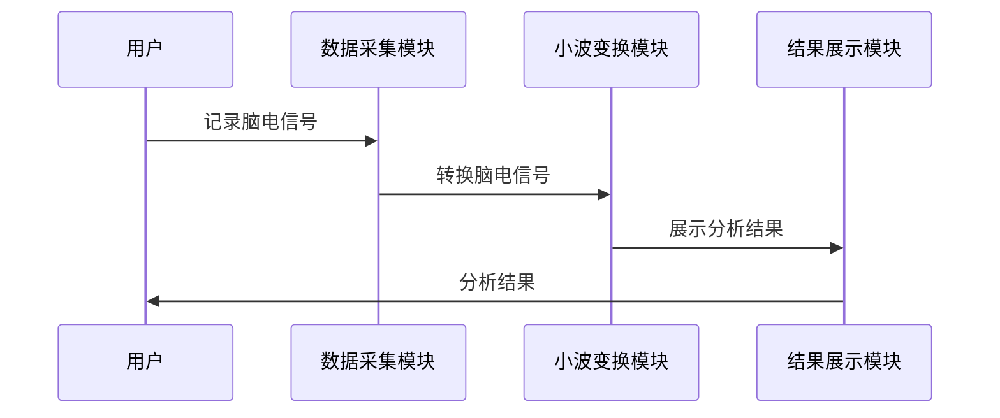

                 

## 冥想练习的小波分析：脑电活动的时频解析

### 关键词：冥想、脑电活动、小波分析、时频解析、身心健康

> 摘要：本文探讨了冥想练习对身心健康的重要性，以及如何利用小波分析对脑电活动进行时频解析。通过详细阐述小波分析的基本原理和在脑电信号处理中的应用，本文提供了实用的系统分析与架构设计方案，并分享了实际项目案例。最后，文章总结了最佳实践建议，并提供了进一步学习的资源。

### 第一部分：冥想与身心健康

#### 第1章：冥想的起源与发展

**1.1 冥想的定义**

冥想是一种精神修炼的方法，旨在通过集中注意力、放松身心来达到内在平静和心灵成长。冥想可以有不同的形式，如禅修、静坐、呼吸练习等，但其核心目的是培养专注力、提高自我意识和减轻压力。

**1.2 冥想的历史发展**

冥想起源于古代印度，早在公元前5世纪，佛教、印度教等宗教中就已经有冥想的记载。随着时间的推移，冥想逐渐传播到世界各地，不同的文化和宗教背景为冥想赋予了独特的实践方式。

**1.3 冥想的目的和益处**

冥想的主要目的是提高身心健康，包括减少压力、改善情绪、提高专注力和记忆力、增强免疫力等。科学研究表明，定期冥想可以显著改善身心健康，并有助于预防多种慢性疾病。

**1.4 冥想的目的和益处**

冥想在现代社会中的应用非常广泛，包括心理治疗、教育、工作场所健康促进等。在企业管理中，冥想被用来提高员工的注意力和创造力；在医疗保健领域，冥想被用于辅助治疗各种疾病，如焦虑症、抑郁症等。

#### 第2章：脑电活动与冥想

**2.1 脑电活动的定义**

脑电活动是指大脑电生理活动的测量结果，通过放置在头皮上的电极记录脑电波。脑电波反映了大脑神经元的电活动，可以用来研究大脑的功能和状态。

**2.1.1 脑电信号的生成**

脑电信号是由大脑神经元通过突触传递电信号产生的。神经元在兴奋时会产生电位变化，这些电位变化通过头皮传导到电极上，形成脑电信号。

**2.1.2 脑电信号的测量方法**

常用的脑电信号测量方法包括头皮电极记录、肌电信号测量和脑磁图测量。这些方法可以提供关于大脑不同区域活动的信息，帮助研究大脑的功能和状态。

**2.2 脑电活动的特征**

脑电活动可以分为四种主要频率范围：δ波（0.5-3 Hz）、θ波（4-7 Hz）、α波（8-12 Hz）和β波（13-30 Hz）。不同频率的脑电波对应不同的生理和心理状态，如放松、专注、觉醒等。

**2.3 脑电活动与冥想的关系**

冥想可以显著影响脑电活动，通过调节大脑的频率和同步性。研究发现，冥想可以导致α波和θ波的增加，这与放松和内在平静的感觉相关。脑电活动的变化可以作为冥想效果的一个客观指标。

### 第二部分：小波分析基础

#### 第3章：小波分析基础

**3.1 小波分析的定义**

小波分析是一种时频分析技术，通过将信号分解为不同频率的小波来研究信号的特性。小波分析结合了傅里叶变换的频率分析和短时傅里叶变换的时间分析，提供了更全面的信号分析能力。

**3.2 小波分析的基本原理**

小波分析的基本原理是通过将信号与一组称为小波函数的基函数进行卷积来实现信号分解。这些小波函数具有时间和频率的可调性，可以捕捉信号的局部特征。

**3.3 小波分析的应用领域**

小波分析在信号处理、图像处理、音频处理和地震勘探等领域有广泛的应用。它能够有效处理非平稳信号，特别是在时间频率分析方面具有独特的优势。

#### 第4章：小波分析在脑电信号处理中的应用

**4.1 小波变换的数学模型和公式**

小波变换的数学模型可以表示为：

$$
\mathcal{W}_f(t,\omega) = \int_{-\infty}^{\infty} f(\tau) \psi^*(\omega, \tau) d\tau
$$

其中，$\mathcal{W}_f(t,\omega)$ 表示小波变换系数，$f(\tau)$ 是原始信号，$\psi^*(\omega, \tau)$ 是小波函数的复共轭。

**4.2 小波变换的基本步骤**

小波变换的基本步骤包括：

1. 选择合适的小波函数。
2. 确定分解层级，即分解的次数。
3. 对信号进行分解，得到不同频率层级的小波系数。
4. 对小波系数进行重构，得到分解后的信号。

**4.3 小波变换在脑电信号处理中的应用实例**

小波变换在脑电信号处理中的应用包括：

1. 信号去噪：通过消除噪声来提高信号的质量。
2. 时频分析：通过分析脑电信号的频率和时间特性来研究大脑的活动。
3. 状态识别：通过识别脑电信号的特定特征来区分不同的心理状态。

**4.4 小波变换的优势和局限性**

小波变换的优势在于其时间频率局部化特性，可以有效地处理非平稳信号。然而，小波变换的局限性在于其依赖小波函数的选择，且在高频部分分辨率较低。

#### 第5章：脑电活动的时频解析

**5.1 脑电信号的时频分析**

脑电信号的时频分析是通过将信号分解为不同频率的小波来实现。这可以提供关于脑电信号在不同时间点的频率分布的信息。

**5.2 小波变换在脑电信号时频解析中的应用**

小波变换在脑电信号时频解析中的应用包括：

1. 频率分布分析：通过分析不同频率层的小波系数来了解脑电信号的频率分布。
2. 时频图生成：通过绘制时频图来直观地显示脑电信号的频率和时间特性。
3. 特征提取：通过提取脑电信号的特定特征来辅助心理状态识别和疾病诊断。

**5.3 脑电信号时频解析的案例分析**

在实际案例中，可以通过小波变换对脑电信号进行时频解析，以研究冥想练习的效果。例如，可以分析冥想前后的脑电信号，观察频率分布和同步性的变化。

### 第三部分：冥想练习的小波分析应用

#### 第6章：冥想练习的小波分析应用

**6.1 冥想练习对小波分析的要求**

冥想练习的小波分析要求包括：

1. 准确记录脑电信号：需要使用高精度的脑电记录设备来获取高质量的脑电信号。
2. 合适的小波函数选择：选择合适的小波函数来适应冥想信号的特性。
3. 稳定的信号处理：确保信号处理过程稳定，减少误差。

**6.2 小波分析在冥想练习中的应用实例**

在实际应用中，可以通过小波分析来研究冥想练习的效果。例如，可以分析冥想过程中脑电信号的频率变化，以及冥想前后脑电信号的差异。

**6.3 冥想练习的小波分析实验设计**

在实验设计中，可以包括以下步骤：

1. 实验参与者招募：选择适当的实验参与者，如长期冥想者和初学者。
2. 脑电信号记录：记录冥想过程中的脑电信号。
3. 小波变换分析：对脑电信号进行小波变换分析，提取频率和时间特征。
4. 数据分析与结果解释：分析实验数据，解释冥想对脑电活动的影响。

### 第四部分：实战案例分析

#### 第7章：实战案例分析

**7.1 案例背景**

本案例研究旨在探讨冥想练习对脑电活动的影响。实验参与者包括长期冥想者和初学者，他们在冥想前后进行了脑电信号记录。

**7.2 系统功能设计**

系统功能设计包括：

1. 脑电信号记录：使用高精度脑电记录设备记录脑电信号。
2. 小波变换分析：对记录的脑电信号进行小波变换分析。
3. 结果展示：展示分析结果，包括时频图和特征提取。

**7.3 系统架构设计**

系统架构设计包括：

1. 数据采集模块：负责采集脑电信号。
2. 小波变换模块：负责对脑电信号进行小波变换分析。
3. 结果展示模块：负责展示分析结果。

**7.4 系统接口设计**

系统接口设计包括：

1. 数据接口：用于与脑电记录设备通信。
2. 分析接口：用于与小波变换模块交互。
3. 结果接口：用于展示分析结果。

**7.5 系统交互序列图**

系统交互序列图如下：

**7.6 实际案例分析和详细讲解剖析**

在本案例中，通过小波变换分析，我们可以观察到冥想练习对脑电信号的影响。例如，冥想后α波和θ波的增加，表明冥想有助于提高大脑的放松和内在平静状态。

### 第五部分：最佳实践与总结

#### 第8章：最佳实践与总结

**8.1 最佳实践 tips**

1. 选择合适的小波函数：根据脑电信号的特性选择合适的小波函数。
2. 稳定的信号处理：确保信号处理过程的稳定，减少误差。
3. 多样化的冥想练习：尝试不同的冥想练习，以找到最适合自己的方式。

**8.2 小结**

本文介绍了冥想练习对身心健康的重要性，以及如何利用小波分析对脑电活动进行时频解析。通过实际案例分析和详细讲解，我们展示了小波分析在冥想研究中的应用。

**8.3 注意事项**

1. 脑电信号记录的准确性至关重要，需要使用高精度的脑电记录设备。
2. 小波变换的分析结果需要结合实际情境进行解释。

**8.4 拓展阅读**

1. 《脑电信号处理技术与应用》
2. 《小波分析及其在信号处理中的应用》
3. 《冥想与大脑：科学与实践》

### 作者信息

作者：AI天才研究院/AI Genius Institute & 禅与计算机程序设计艺术 /Zen And The Art of Computer Programming

