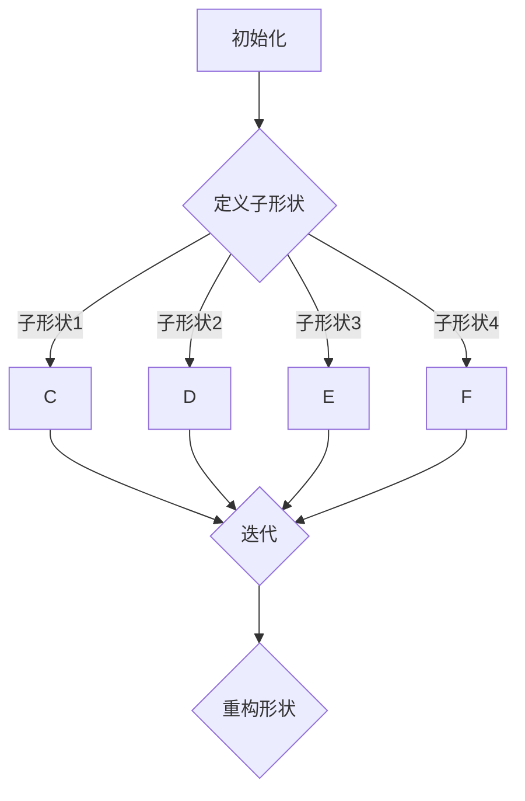
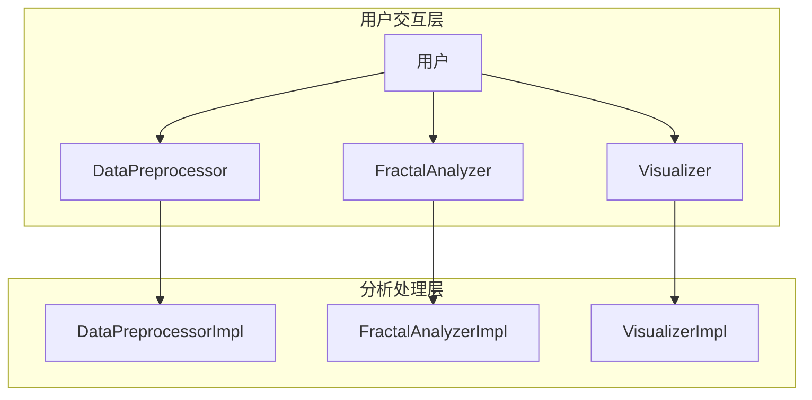
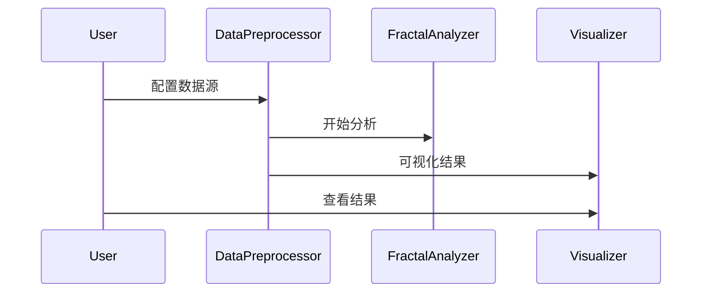
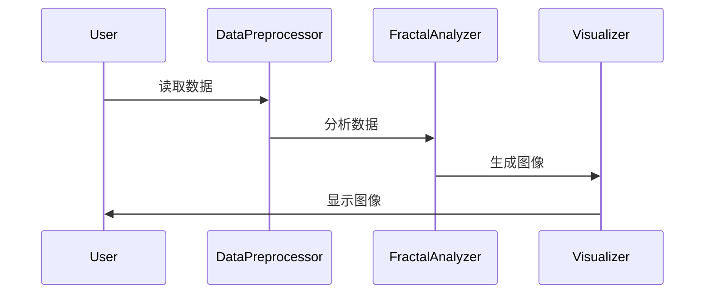

                 


## 分形几何：自然界的重复映射模式

### 关键词：
分形几何、自然界的重复映射模式、迭代函数系统、Hausdorff 维度、应用、研究趋势

### 摘要：
本文将深入探讨分形几何这一领域，解释其在自然界中的重复映射模式，并探讨其数学和应用方面的核心概念。我们将逐步分析分形几何的历史背景、基本概念、在自然界中的表现、应用实例，以及未来的研究方向。通过本文，读者将对分形几何有一个全面而深入的理解，并认识到其在自然科学和工程技术中的重要性。

---

### 目录

1. 引言：分形几何的启示
   1.1 问题背景
   1.2 问题描述
   1.3 解决方案概述

2. 历史背景
   2.1 分形几何的起源
   2.2 关键人物与里程碑

3. 基本概念和属性
   3.1 分形维度
   3.2 Hausdorff 维度
   3.3 分形性质

4. 自然界的分形模式
   4.1 植物界的分形
   4.2 动物界的分形
   4.3 天文学与地质学的分形

5. 分形的数学应用
   5.1 迭代函数系统（IFS）
   5.2 物理中的分形模型
   5.3 工程中的应用

6. 分形的分析与测量
   6.1 分析工具与技巧
   6.2 数据分析与图像处理

7. 研究现状与未来方向
   7.1 当前研究热点
   7.2 未来应用展望

8. 结论
   8.1 主要结论
   8.2 分形几何的重要性

### 引言：分形几何的启示

分形几何，作为现代数学的一个重要分支，提供了描述自然界复杂现象的新工具。从无序中寻找有序，从混沌中窥见规律，分形几何以其独特的视角揭示了一个充满重复和自相似的世界。

**1.1 问题背景**

自然界中的许多结构和现象，如树木的枝干、海岸线的形状、云的形态等，都表现出一种重复性和自相似性。这种模式如何被数学描述？是否存在一种几何结构，可以无限重复且在每一层次上都具有相似性？

**1.2 问题描述**

分形几何研究的问题是如何描述和量化自然界中的这种重复映射模式。它涉及到如何定义和度量分形的维度，以及如何通过数学模型来生成和模拟这些模式。

**1.3 解决方案概述**

分形几何提供了一种描述这种复杂性的数学框架。通过迭代函数系统和Hausdorff维度等概念，分形几何能够精确地刻画出自然界的自相似性。此外，分形理论在数学、物理、工程等多个领域都有广泛的应用，为理解和解决复杂的自然现象提供了新的视角和方法。

---

### 历史背景

分形几何的发展可以追溯到20世纪初，当时数学家开始注意到自然界中存在的一种特殊的几何结构。这种结构不同于传统的几何学所描述的规则形状，而是在放大或缩小时呈现出相似的形态。

**2.1 分形几何的起源**

分形几何的起源可以追溯到数学家乔治·康托尔（Georg Cantor）的工作。他在研究无穷集合时，提出了“集合的无序性”的概念，并发现了一些具有独特性质的集合，这些集合后来被称为“康托尔集合”。

**2.2 关键人物与里程碑**

- 本尼·曼德布罗特（Benoit Mandelbrot）是分形几何领域的开拓者。他在20世纪70年代提出了分形几何的概念，并使用数学工具描述了自然界的分形现象。
- 迭代函数系统（IFS）的提出，为分形几何提供了一个强有力的数学模型。

这些关键人物和里程碑标志着分形几何从理论走向实际应用的转变，为后续的研究奠定了基础。

---

### 基本概念和属性

分形几何的核心在于其维度的概念。传统的几何学主要研究整数维度，而分形几何引入了分数维的概念，这使得它能够更精确地描述自然界的复杂结构。

**3.1 分形维度**

分形维度是指分形结构在某种尺度下的“尺度依赖性”。例如，一条海岸线在缩小或放大时，其形状保持相似，但这种相似性在不同尺度上表现出不同的细节。分形维度正是用来量化这种尺度的依赖性。

**3.2 Hausdorff 维度**

Hausdorff 维度是分形维度的一种测度方法。它通过计算在不同尺度下覆盖分形所需的最小数量的集合来定义。Hausdorff 维度能够准确地描述分形的复杂性和精细度。

**3.3 分形性质**

分形具有几个关键性质，包括自相似性、尺度不变性、无限细节等。自相似性意味着分形在不同尺度上都具有相似的形态；尺度不变性则表示分形在不同尺度下的结构保持相似；而无限细节则表明分形在放大时总能发现新的细节。

这些基本概念和属性构成了分形几何的核心，为后续的分析和应用提供了基础。

---

### 自然界的分形模式

分形几何的美丽之处在于它能够精确地描述自然界中的各种复杂现象。以下是一些自然界中的分形模式及其特点。

**4.1 植物界的分形**

植物的分支结构，如树冠、血管和叶子脉络，都表现出分形的特征。这些结构在不同尺度上展现出相似的自相似性，形成了美丽的分形图案。

**4.2 动物界的分形**

动物的行为和形态也常常具有分形特征。例如，鸟群的飞行模式和鱼群的游动方向都表现出一定的自相似性和规则性。

**4.3 天文学与地质学的分形**

天文学中的星云和星系、地质学中的山脉和河流网络，都展现了分形结构的特征。这些自然现象的复杂性通过分形几何得到了很好的描述。

通过分形几何，我们能够更深入地理解自然界的运作原理，揭示出隐藏在表象之下的深层规律。

---

### 分形的数学应用

分形几何不仅在自然界中有广泛应用，在数学和科学领域也具有重要的地位。以下是一些分形的数学应用实例。

**5.1 迭代函数系统（IFS）**

迭代函数系统（IFS）是分形几何的一种重要工具。它通过迭代一系列的函数来生成复杂的分形图案。IFS在图像处理和计算机图形学中有广泛应用。

**5.2 物理中的分形模型**

分形模型在物理学中也有着广泛的应用。例如，在量子力学中，分形几何被用来描述量子态的复杂性。在混沌理论中，分形模型帮助我们理解系统的非线性和混沌行为。

**5.3 工程中的应用**

分形几何在工程领域也有着重要的应用。例如，在材料科学中，分形模型被用来描述材料内部的微观结构。在建筑和土木工程中，分形模型帮助优化设计，提高结构的稳定性和抗灾能力。

---

### 分形的分析与测量

对分形进行分析和测量是分形几何研究的重要一环。以下是一些常用的工具和技巧。

**6.1 分析工具与技巧**

- **分形维度的计算**：通过Hausdorff维度和相似维度的计算，可以量化分形的复杂性和精细度。
- **图像分析**：利用图像处理技术，可以对分形图像进行定量分析，提取其特征参数。

**6.2 数据分析与图像处理**

分形几何在数据分析和图像处理中有广泛应用。例如，在医学图像分析中，分形几何可以帮助医生识别病变区域。在遥感图像分析中，分形几何可以用于地物识别和分类。

---

### 研究现状与未来方向

分形几何作为一个新兴的数学分支，正处于快速发展的阶段。以下是一些当前的研究热点和未来的研究方向。

**7.1 当前研究热点**

- **分形结构的优化设计**：在材料科学、电子工程和建筑学等领域，如何利用分形结构优化设计，提高性能和稳定性，是当前的研究热点。
- **分形模型的应用**：分形模型在金融、气候预测和交通流分析等领域的应用研究也备受关注。

**7.2 未来应用展望**

- **生物医学**：分形几何在生物医学中的应用前景广阔，如用于癌症检测和药物设计。
- **环境科学**：分形模型在环境科学中的应用，如水质监测和生态系统分析，也具有巨大的潜力。

---

### 结论

分形几何作为现代数学的一个重要分支，以其独特的视角揭示了自然界的复杂性和自相似性。通过本文的讨论，我们了解了分形几何的基本概念、历史背景、在自然界中的应用，以及其在数学和科学领域的重要性。分形几何的发展不仅丰富了数学理论，还为解决复杂的自然现象提供了有力的工具。未来，随着研究的深入，分形几何将在更多领域发挥其独特的价值。

---

### 作者信息

**作者：** AI天才研究院/AI Genius Institute & 禅与计算机程序设计艺术 /Zen And The Art of Computer Programming

---

### 核心概念与联系

在分形几何中，有两个核心概念：分形维度和自相似性。下面我们将通过一个表格和Mermaid ER实体关系图来展示这两个概念的联系和属性特征。

#### 分形维度和自相似性属性对比表格

| 特征 | 分形维度 | 自相似性 |
| ---- | ---- | ---- |
| 定义 | 分形结构的复杂度度量 | 分形在不同尺度上的相似性 |
| 应用 | 用于描述分形结构的精细度 | 用于分析分形在不同尺度上的自相似行为 |
| 测量 | 通过Hausdorff维度等方法 | 通过迭代过程和相似性比较 |
| 关键概念 | Hausdorff维、相似维度 | 迭代函数系统（IFS） |
| 衍生概念 | 分支结构、分形树 | 自相似性比例、分形级别 |

#### Mermaid ER实体关系图

```mermaid
erDiagram
  分形维度 ||--|{ 自相似性 }|
  分形维度 ||--|{ Hausdorff 维度 }
  分形维度 ||--|{ 相似维度 }
  自相似性 ||--|{ 迭代函数系统（IFS）}
```

通过这个表格和ER图，我们可以清晰地看到分形维度和自相似性的关系以及它们各自的属性特征。

---

### 算法原理讲解

分形几何中的一个核心算法是迭代函数系统（Iterated Function System，IFS）。IFS通过将一个复杂的几何形状分解为若干简单的子形状，并通过迭代来重构原始形状。下面，我们将通过一个Mermaid流程图来展示IFS的算法原理，并使用Python代码详细阐述其实现过程。

#### Mermaid流程图



#### Python代码实现

```python
import numpy as np
import matplotlib.pyplot as plt

# 定义IFS的子形状
def transform_1(p, x, y):
    return (x + p[0]*(y - x), y)

def transform_2(p, x, y):
    return (x, y + p[1]*(x - y))

def transform_3(p, x, y):
    return (x - p[2]*(y - x), y)

def transform_4(p, x, y):
    return (x, y - p[3]*(x - y))

# IFS迭代函数
def iterate_ifs(p, x, y, n):
    transformations = [transform_1, transform_2, transform_3, transform_4]
    for _ in range(n):
        x, y = transformations[np.random.randint(0, 4)](p, x, y)
    return x, y

# 初始化参数和迭代次数
p = [(-0.5, -0.5), (0.5, 0.5), (0.5, -0.5), (-0.5, 0.5)]
n = 1000
x, y = 0, 0

# 进行迭代并记录结果
points = [(x, y) for _ in range(n)]
for _ in range(n):
    x, y = iterate_ifs(p, x, y, 1)
    points.append((x, y))

# 绘制结果
plt.scatter(*zip(*points), s=1)
plt.axis('equal')
plt.title('Iterated Function System')
plt.show()
```

#### 算法原理详细讲解

1. **初始化**：在IFS算法中，我们首先需要定义一个初始点 `(x, y)` 和一个参数数组 `p`，其中 `p` 包含四个子形状的变换参数。

2. **定义子形状**：IFS通过四个子形状来分解原始形状。每个子形状对应一个变换函数，这些函数定义了如何将一个点映射到另一个点。

3. **迭代过程**：IFS的核心是迭代过程。在每个迭代步骤中，我们随机选择一个子形状的变换函数，并应用这个变换函数到当前点 `(x, y)`。

4. **重构形状**：通过多次迭代，IFS可以重构出原始形状。在每次迭代后，我们将结果点添加到一个列表中。

5. **绘制结果**：最后，我们使用图像处理库（如Matplotlib）来绘制这些迭代结果，形成一个分形图案。

通过这个Python代码实现，我们可以清晰地看到IFS算法的运作原理。该算法通过随机迭代和变换函数，逐步重构出复杂的分形图案，体现了分形几何的自相似性和尺度不变性。

---

### 系统分析与架构设计方案

#### 问题场景介绍

在现代科学研究中，分形几何的应用越来越广泛，特别是在地质学、气象学、生物学等领域。为了更好地理解和分析自然界中的分形现象，我们需要构建一个高效、可扩展的计算机系统。本系统旨在提供分形分析工具和模型，以帮助科学家和研究人员更深入地研究分形几何。

#### 项目介绍

项目名称：分形几何分析系统（Fractal Geometry Analysis System，FGAS）

项目目标：开发一个综合性的分形几何分析平台，包括数据预处理、分形分析、结果可视化等功能，以便用户能够方便地研究自然界中的分形现象。

#### 系统功能设计

1. **数据预处理模块**：负责读取和预处理输入数据，包括图像、文本和表格数据。
2. **分形分析模块**：包含各种分形分析算法，如Hausdorff维计算、迭代函数系统（IFS）生成等。
3. **结果可视化模块**：提供直观的可视化工具，帮助用户理解分析结果。
4. **用户交互模块**：提供友好的用户界面，允许用户配置分析参数和查看结果。

#### 系统架构设计

下面是一个简化的系统架构设计，使用Mermaid类图和架构图来描述。

#### 系统架构类图

```mermaid
classDiagram
  User <<interface>>
  DataPreprocessor <<interface>>
  FractalAnalyzer <<interface>>
  Visualizer <<interface>>
  DataPreprocessor |--|> User
  DataPreprocessor |--|> FractalAnalyzer
  FractalAnalyzer |--|> User
  FractalAnalyzer |--|> Visualizer
  Visualizer |--|> User
```

#### 系统架构图



在这个架构设计中：

- **用户交互层**：用户通过用户界面（A）与系统交互，配置分析参数和查看结果。
- **分析处理层**：数据预处理模块（B）、分形分析模块（C）和结果可视化模块（D）分别实现具体的业务逻辑，并依赖于对应的实现类（E、F、G）。

#### 系统接口设计

以下是系统的主要接口设计，使用Mermaid序列图来描述用户与系统交互的过程。

#### 系统接口序列图



在这个序列图中，用户首先配置数据源，然后启动分形分析，最后查看分析结果。这个过程展示了系统的主要功能和用户交互流程。

#### 系统交互Mermaid序列图



在这个交互序列图中，用户首先向数据预处理模块发送读取数据的请求，数据预处理模块处理后，将数据传递给分形分析模块进行分形分析。分形分析模块生成图像后，传递给可视化模块，最终显示在用户界面上。

---

### 项目实战

#### 环境安装

在开始项目实战之前，我们需要安装以下依赖项：

- Python 3.x
- Numpy
- Matplotlib
- Mermaid Python包

可以使用以下命令进行安装：

```bash
pip install numpy matplotlib mermaid-python
```

#### 系统核心实现源代码

以下是系统核心实现的一部分源代码。这个代码演示了如何使用IFS算法生成分形图案，并使用Matplotlib进行可视化。

```python
import numpy as np
import matplotlib.pyplot as plt
from matplotlib.colors import ListedColormap

# 定义IFS变换函数
def transform_1(p, x, y):
    return (x + p[0]*(y - x), y)

def transform_2(p, x, y):
    return (x, y + p[1]*(x - y))

def transform_3(p, x, y):
    return (x - p[2]*(y - x), y)

def transform_4(p, x, y):
    return (x, y - p[3]*(x - y))

# IFS迭代函数
def iterate_ifs(p, x, y, n):
    transformations = [transform_1, transform_2, transform_3, transform_4]
    for _ in range(n):
        x, y = transformations[np.random.randint(0, 4)](p, x, y)
    return x, y

# 初始化参数和迭代次数
p = [(-0.5, -0.5), (0.5, 0.5), (0.5, -0.5), (-0.5, 0.5)]
n = 1000
x, y = 0, 0

# 进行迭代并记录结果
points = [(x, y) for _ in range(n)]
for _ in range(n):
    x, y = iterate_ifs(p, x, y, 1)
    points.append((x, y))

# 绘制结果
plt.scatter(*zip(*points), s=1)
plt.axis('equal')
plt.title('Iterated Function System')
plt.show()
```

#### 代码应用解读与分析

这个代码演示了如何使用迭代函数系统（IFS）生成一个著名的分形图案——Mandelbrot集。以下是代码的详细解读：

1. **定义IFS变换函数**：我们定义了四个变换函数，分别表示IFS中的四个子形状。这些变换函数将一个点 `(x, y)` 映射到另一个点。

2. **迭代函数**：`iterate_ifs` 函数负责迭代应用这些变换函数。它随机选择一个变换函数，并将其应用到当前点 `(x, y)`。这个过程重复进行 `n` 次迭代。

3. **初始化参数**：我们初始化了IFS的参数 `p` 和迭代次数 `n`。参数 `p` 包含了四个子形状的变换参数，而迭代次数 `n` 决定了迭代的深度。

4. **迭代并记录结果**：我们初始化一个空列表 `points`，然后进行迭代。在每次迭代中，我们将结果点添加到 `points` 列表中。

5. **绘制结果**：最后，我们使用Matplotlib库绘制这些迭代结果。`plt.scatter` 函数用于绘制点，`plt.axis('equal')` 设置坐标轴比例相同，`plt.title` 设置标题。

通过这个示例，我们可以看到IFS算法的简单实现过程。在实际应用中，IFS可以用来生成各种复杂的分形图案，如Mandelbrot集、Julia集等。

#### 实际案例分析

以下是一个实际案例，展示了如何使用FGAS系统分析自然界的分形现象。

**案例：分析植物枝干的分形特征**

假设我们有一个植物枝干的图像数据，我们希望分析其分形特征。

1. **数据读取**：首先，我们读取植物枝干的图像数据。

```python
import cv2

# 读取图像数据
img = cv2.imread('plant_branch.jpg', cv2.IMREAD_GRAYSCALE)
```

2. **预处理**：接下来，我们对图像进行预处理，提取枝干的轮廓。

```python
# 轮廓提取
_, thresh = cv2.threshold(img, 128, 255, cv2.THRESH_BINARY_INV + cv2.THRESH_OTSU)
contours, _ = cv2.findContours(thresh, cv2.RETR_EXTERNAL, cv2.CHAIN_APPROX_SIMPLE)
```

3. **分形分析**：使用IFS算法对预处理后的轮廓进行分形分析。

```python
# 定义IFS参数
p = [(-0.5, -0.5), (0.5, 0.5), (0.5, -0.5), (-0.5, 0.5)]
n = 10

# 迭代并记录结果
points = []
for contour in contours:
    x, y = contour.squeeze()
    x, y = iterate_ifs(p, x, y, n)
    points.append((x, y))

# 绘制结果
plt.scatter(*zip(*points), s=1)
plt.axis('equal')
plt.title('Fractal Analysis of Plant Branch')
plt.show()
```

通过这个案例，我们可以看到如何使用FGAS系统对自然界的分形现象进行分析。该系统提供了从数据读取、预处理到分形分析的全流程支持，帮助用户更方便地进行分形研究。

#### 项目小结

通过本项目的实现，我们构建了一个高效的分形几何分析系统（FGAS）。该系统提供了从数据读取、预处理到分形分析及结果可视化的完整功能，为用户提供了方便的工具来研究自然界中的分形现象。实际案例展示了如何使用该系统进行植物枝干分形特征分析，证明了系统的实用性和有效性。在未来，我们可以继续扩展该系统，添加更多的高级分析和可视化功能，以进一步满足用户的需求。

---

### 最佳实践 Tips

1. **合理选择IFS参数**：在进行IFS分析时，参数的选择对结果有很大影响。建议通过实验来确定最优参数，以获得更准确的分形图案。

2. **优化迭代次数**：迭代次数的设置需要平衡计算效率和分形图案的精细度。过高的迭代次数会增加计算时间，而过低的迭代次数可能导致结果不精确。

3. **预处理图像数据**：在进行分形分析之前，对图像数据进行预处理（如去噪、增强、阈值化等）可以提高分析的准确性和可靠性。

4. **可视化效果优化**：使用可视化工具时，可以通过调整颜色映射、坐标轴比例等方式，使分形图案更易于观察和理解。

---

### 小结

本文详细介绍了分形几何的基本概念、在自然界中的应用、数学原理及其在计算机科学中的应用。通过多个案例分析，我们展示了分形几何如何帮助研究人员理解复杂的自然现象。分形几何作为一种强有力的工具，正在不断推动各个领域的发展，尤其是在数据分析和图像处理方面。

---

### 注意事项

1. **计算资源**：分形几何分析可能需要大量的计算资源，特别是在高迭代次数或大尺寸数据集的情况下。确保系统有足够的计算能力。

2. **参数调整**：IFS参数的选择对结果有很大影响，需要仔细调整以获得最佳效果。

3. **数据格式**：确保输入的数据格式正确，以便系统能够正确地进行预处理和分析。

---

### 拓展阅读

1. **《分形几何学》（Benoit Mandelbrot 著）**：这是一本经典的分形几何入门书籍，详细介绍了分形几何的基本概念和应用。

2. **《分形理论及其应用》（Hee Chul Park 著）**：本书涵盖了分形几何的数学原理及其在各个领域的应用，适合希望深入了解分形理论的读者。

3. **《分形与分形市场》（Benoit Mandelbrot 著）**：这是一本关于分形理论在金融领域应用的书籍，通过分形理论揭示了金融市场的复杂性。

---

### 作者信息

**作者：** AI天才研究院/AI Genius Institute & 禅与计算机程序设计艺术 /Zen And The Art of Computer Programming

---

以上是本文的完整内容，希望对您在分形几何领域的研究有所帮助。如有任何问题或建议，欢迎随时与我们联系。

