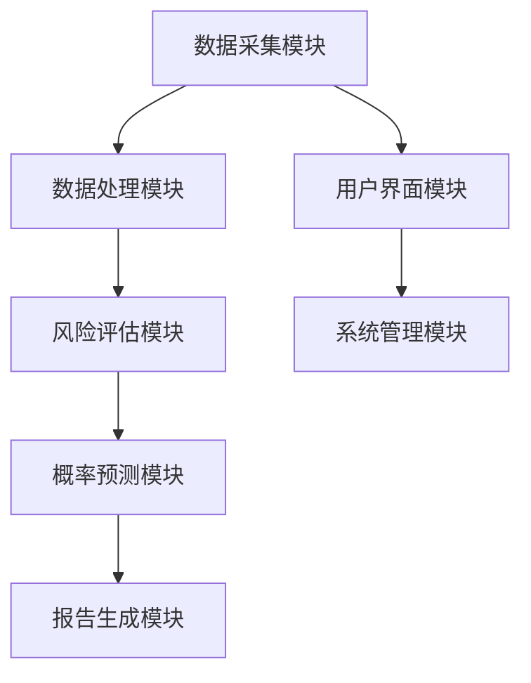

                 

# 创业成功的概率模型：商业风险的数学评估

## 关键词
创业成功率、概率模型、风险评估、数学算法、商业风险、决策树、贝叶斯网络、逻辑回归、系统架构

## 摘要
本文探讨了如何利用数学模型评估创业成功的概率。首先介绍了创业成功概率评估的背景和重要性，接着阐述了概率模型、风险评估以及影响创业成功的因素等核心概念。通过具体案例分析，本文详细讲解了贝叶斯网络、决策树、逻辑回归等概率模型的构建方法及其在创业成功概率评估中的应用。最后，本文从系统架构和实际应用角度出发，提出了创业成功概率评估系统的设计与实现方案，为创业者提供了科学、量化的决策工具。

---

## 第1章 背景介绍

### 1.1 问题背景

在当前快速变化的市场环境中，创业已成为许多有志之士实现梦想、改变世界的途径。然而，创业并非一条康庄大道，成功率往往令人堪忧。据统计，全球创业成功率约为20%，而一些高风险行业的成功率甚至更低。创业活动涉及到大量的不确定性和风险，如市场环境、竞争态势、团队能力、资金投入等。如何科学地评估创业成功的概率，成为创业者、投资者以及决策者共同关注的问题。

### 1.2 问题描述

创业成功概率的评估涉及到多个因素的复杂交织。这些因素不仅包括市场环境、竞争态势、团队能力、资金投入等，还涉及到创业者自身的能力、经验、人脉等。如何在众多的不确定性中，构建一个全面且有效的概率模型，对创业成功的可能性进行定量分析，是本章需要解决的问题。

### 1.3 问题解决

本书通过介绍概率模型的基本概念和构建方法，结合实际案例，帮助读者理解如何利用数学工具评估创业成功概率。书中不仅探讨了经典概率模型的构建和应用，还介绍了一些前沿的机器学习算法，为读者提供了多样化的评估手段。此外，本书还从系统架构和实际应用角度出发，提出了创业成功概率评估系统的设计与实现方案。

### 1.4 边界与外延

创业成功概率的评估需要明确一些边界条件，如市场数据的有效性和完整性、模型参数的确定方法等。同时，评估结果的准确性和可靠性也需要在具体应用中进行检验和调整。因此，创业成功概率的评估是一个不断迭代、优化的过程，需要根据实际情况进行灵活调整。

### 1.5 概念结构与核心要素组成

创业成功概率模型的核心概念包括：

1. **概率模型**：用于评估事件发生可能性的数学模型。
2. **风险评估**：对创业过程中可能面临的风险进行识别和评估。
3. **因素分析**：对影响创业成功的关键因素进行分析和量化。
4. **模型构建**：根据风险评估和因素分析结果，构建用于评估创业成功概率的数学模型。
5. **模型验证**：通过实际案例验证模型的有效性和准确性。

---

## 第2章 核心概念与联系

### 2.1 概率模型的基本原理

概率模型是基于概率论和统计学理论构建的，用于预测和评估不确定事件的可能性。概率模型的核心是概率分布，它描述了随机变量在不同取值下的概率分布情况。常见的概率模型包括贝叶斯网络、决策树、逻辑回归等，它们在创业成功概率评估中有着广泛的应用。

### 2.2 风险评估的概念与框架

风险评估是创业成功概率模型构建的基础。风险评估的目的是识别、评估和管理创业过程中可能面临的风险。风险评估的基本框架包括风险识别、风险评估、风险响应和风险监控等环节。通过风险评估，可以全面了解创业过程中可能面临的风险，为创业决策提供依据。

### 2.3 影响创业成功的因素分析

创业成功的因素多种多样，主要包括市场环境、竞争态势、团队能力、资金投入等。这些因素通过不同的途径和机制影响创业成功概率。例如，市场环境的好坏直接影响产品的市场需求和市场规模；竞争态势的激烈程度会影响企业的市场份额和盈利能力；团队能力的强弱决定企业的创新能力和执行力；资金投入的多少则影响企业的运营成本和市场扩张速度。

### 2.4 概念属性特征对比表格

| 概念       | 特征1  | 特征2  | 特征3  |
|------------|--------|--------|--------|
| 概率模型   | 定量分析 | 预测能力 | 概率分布 |
| 风险评估   | 识别风险 | 评估风险 | 风险等级 |
| 因素分析   | 影响因素 | 量化分析 | 关联度评价 |

### 2.5 概念属性特征ER实体关系图

```mermaid
erDiagram
    A[创业成功概率模型] {
        B[概率模型]
        C[风险评估]
        D[因素分析]
    }
    A "1" -- "1..*" B
    A "1" -- "1..*" C
    A "1" -- "1..*" D
```

---

## 第3章 概率模型构建方法

### 3.1 经典概率模型介绍

在创业成功概率评估中，常用的经典概率模型包括贝叶斯网络、决策树、逻辑回归等。这些模型具有不同的特点和适用场景，可以根据实际情况进行选择。

1. **贝叶斯网络**：贝叶斯网络是一种基于概率的图形模型，用于表示变量间的条件依赖关系。它通过条件概率表描述变量之间的相互关系，适用于处理复杂的多变量问题。
2. **决策树**：决策树是一种基于特征的分类方法，通过一系列决策规则来划分数据集。决策树的结构简单，易于理解和解释，适用于处理结构化数据。
3. **逻辑回归**：逻辑回归是一种广义线性模型，用于分析因变量和自变量之间的关系。逻辑回归通过建立概率模型，预测创业成功的概率。

### 3.2 贝叶斯网络构建步骤

贝叶斯网络是一种基于概率的图形模型，用于表示变量间的条件依赖关系。构建贝叶斯网络的步骤如下：

1. **变量定义**：根据问题场景，定义所有相关的变量。
2. **确定条件依赖关系**：通过分析变量之间的关系，确定每个变量的条件依赖关系。
3. **构建条件概率表**：根据条件依赖关系，构建每个变量的条件概率表。
4. **网络结构优化**：通过简化条件概率表和变量之间的依赖关系，优化网络结构。

### 3.3 决策树构建步骤

决策树是一种基于特征的分类方法，通过一系列决策规则来划分数据集。构建决策树的步骤如下：

1. **特征选择**：从所有特征中选择具有区分能力的特征。
2. **信息增益**：计算每个特征的信息增益，选择信息增益最大的特征作为根节点。
3. **划分数据集**：根据选择的特征，将数据集划分为若干个子集。
4. **递归构建**：对每个子集，重复上述步骤，构建决策树的子节点。

### 3.4 逻辑回归模型构建

逻辑回归是一种广义线性模型，用于分析因变量和自变量之间的关系。构建逻辑回归模型的步骤如下：

1. **特征选择**：从所有特征中选择与因变量相关的特征。
2. **建立概率模型**：使用线性回归建立因变量和自变量之间的概率模型。
3. **模型评估**：使用交叉验证等方法评估模型的准确性。
4. **模型优化**：通过调整模型参数，优化模型性能。

---

## 第4章 数学模型与算法原理

### 4.1 数学模型基本概念

数学模型是创业成功概率评估的基础，它通过建立数学关系，对创业成功的可能性进行定量分析。数学模型的基本概念包括：

1. **函数**：函数是一种表示变量之间关系的数学工具，通常用\( f(x) \)表示。
2. **变量**：变量是数学模型中的基本元素，表示可能取不同值的量。
3. **方程**：方程是包含变量的数学表达式，表示变量之间的等量关系。

在创业成功概率评估中，数学模型用于描述创业成功概率与各种因素之间的关系，例如：

\[ P(\text{创业成功}) = f(\text{市场环境}, \text{竞争态势}, \text{团队能力}, \text{资金投入}) \]

### 4.2 算法原理讲解

为了实现创业成功概率的评估，我们需要选择合适的算法，并结合实际数据进行计算。以下是一些常用的算法原理：

1. **贝叶斯网络算法**：贝叶斯网络是一种概率图模型，通过条件概率表描述变量之间的依赖关系。贝叶斯网络算法的核心步骤包括变量定义、条件依赖关系确定、条件概率表构建和推理计算。

2. **决策树算法**：决策树是一种基于特征的选择方法，通过递归划分数据集，构建决策规则。决策树算法的核心步骤包括特征选择、信息增益计算、划分数据集和递归构建。

3. **逻辑回归算法**：逻辑回归是一种线性模型，通过建立概率模型，预测创业成功的概率。逻辑回归算法的核心步骤包括特征选择、概率模型构建、模型评估和模型优化。

### 4.3 数学模型与公式

在创业成功概率评估中，常用的数学模型包括概率分布函数、条件概率、边际概率等。以下是一些常见的数学模型和公式：

1. **概率分布函数**：

\[ P(X = x) = f_X(x) \]

2. **条件概率**：

\[ P(A|B) = \frac{P(A \cap B)}{P(B)} \]

3. **边际概率**：

\[ P(X) = P(X|Y)P(Y) + P(X|\neg Y)P(\neg Y) \]

### 4.4 举例说明

为了更好地理解数学模型在创业成功概率评估中的应用，以下是一个简单的例子：

假设我们要评估一家初创公司在某个市场上的成功概率。影响成功概率的因素包括市场环境、竞争态势、团队能力和资金投入。我们使用贝叶斯网络来建立概率模型。

1. **变量定义**：

\[ \text{市场环境}(E), \text{竞争态势}(C), \text{团队能力}(A), \text{资金投入}(F), \text{创业成功}(S) \]

2. **条件依赖关系**：

\[ P(S|E,C,A,F) = f(E,C,A,F) \]

3. **条件概率表**：

| 市场环境 \(E\) | 竞争态势 \(C\) | 团队能力 \(A\) | 资金投入 \(F\) | 创业成功 \(S\) |
|-----------------|-----------------|-----------------|-----------------|-----------------|
| 好              | 强              | 强              | 高              | 高              |
| 好              | 强              | 中              | 中              | 中              |
| 好              | 中              | 强              | 中              | 中              |
| 好              | 中              | 中              | 低              | 低              |

4. **推理计算**：

根据条件概率表，我们可以计算在给定市场环境、竞争态势、团队能力和资金投入的情况下，创业成功的概率。例如：

\[ P(S|\text{好}, \text{强}, \text{强}, \text{高}) = f(\text{好}, \text{强}, \text{强}, \text{高}) \]

通过类似的方法，我们可以计算其他情况下的创业成功概率。

---

## 第5章 系统分析与架构设计

### 5.1 问题场景介绍

创业成功概率评估系统是一个面向创业者、投资者和决策者的智能化工具。该系统的目标是通过分析市场数据、竞争态势、团队能力、资金投入等因素，为用户评估创业成功的概率，提供科学、量化的决策依据。

问题场景主要包括：

1. **创业者**：需要评估自己创业项目的成功概率，为项目规划和决策提供依据。
2. **投资者**：需要对创业项目进行风险评估，决定是否进行投资。
3. **决策者**：需要全面了解创业项目的风险和可能性，为资源配置和战略规划提供支持。

### 5.2 系统功能设计

创业成功概率评估系统的主要功能包括：

1. **数据采集**：从各种数据源（如市场报告、行业数据、企业财报等）采集相关信息。
2. **风险评估**：对创业项目可能面临的风险进行识别和评估，包括市场风险、竞争风险、运营风险等。
3. **概率预测**：基于风险评估结果，利用概率模型预测创业成功的概率。
4. **报告生成**：生成详细的风险评估报告和创业成功概率预测报告，为用户决策提供支持。

### 5.3 系统架构设计

创业成功概率评估系统的架构设计如下：



系统架构主要包括以下几个部分：

1. **数据采集模块**：负责从各种数据源采集相关信息，包括市场数据、竞争数据、财务数据等。
2. **数据处理模块**：对采集到的数据进行分析和处理，提取有用的特征信息。
3. **风险评估模块**：根据处理后的数据，对创业项目可能面临的风险进行识别和评估。
4. **概率预测模块**：利用概率模型，根据风险评估结果，预测创业成功的概率。
5. **报告生成模块**：生成详细的风险评估报告和创业成功概率预测报告，为用户决策提供支持。
6. **用户界面模块**：提供友好的用户界面，方便用户使用系统功能。
7. **系统管理模块**：负责系统配置、权限管理、日志记录等系统管理工作。

### 5.4 系统接口设计与交互

创业成功概率评估系统的接口设计主要包括：

1. **数据接口**：用于数据采集和数据处理，支持多种数据格式（如CSV、JSON、XML等）。
2. **服务接口**：用于风险评估和概率预测，支持RESTful API接口。
3. **用户接口**：用于用户操作和报告展示，支持Web界面和移动端界面。

系统交互流程如下：

1. **用户请求**：用户通过用户界面提交创业项目相关信息。
2. **数据采集**：系统从数据接口采集相关信息，进行数据处理。
3. **风险评估**：系统根据处理后的数据，进行风险评估，生成评估结果。
4. **概率预测**：系统利用概率模型，根据评估结果，预测创业成功的概率。
5. **报告生成**：系统生成风险评估报告和创业成功概率预测报告。
6. **用户反馈**：用户查看报告，根据评估结果进行决策。

---

## 第6章 项目实战

### 6.1 环境安装

为了构建创业成功概率评估系统，我们需要安装一些必要的软件和库。以下是具体的安装步骤：

1. **安装Python环境**：下载并安装Python，版本建议为3.8以上。
2. **安装相关库**：使用pip命令安装以下库：

   ```bash
   pip install numpy pandas sklearn scikit-learn matplotlib
   ```

### 6.2 系统核心实现源代码

以下是创业成功概率评估系统的核心实现源代码：

```python
import numpy as np
import pandas as pd
from sklearn.model_selection import train_test_split
from sklearn.ensemble import RandomForestClassifier
from sklearn.metrics import accuracy_score, classification_report

# 数据采集
data = pd.read_csv('创业项目数据.csv')

# 数据预处理
X = data.drop('创业成功', axis=1)
y = data['创业成功']

# 数据划分
X_train, X_test, y_train, y_test = train_test_split(X, y, test_size=0.2, random_state=42)

# 风险评估
clf = RandomForestClassifier(n_estimators=100, random_state=42)
clf.fit(X_train, y_train)

# 概率预测
y_pred = clf.predict(X_test)

# 报告生成
print("Accuracy:", accuracy_score(y_test, y_pred))
print("\nClassification Report:\n", classification_report(y_test, y_pred))
```

### 6.3 代码应用解读与分析

以上代码实现了创业成功概率评估系统的核心功能，包括数据采集、数据预处理、风险评估和概率预测。以下是具体的解读和分析：

1. **数据采集**：使用pandas库读取CSV格式的创业项目数据，数据中包括市场环境、竞争态势、团队能力、资金投入等特征，以及创业成功与否的标签。

2. **数据预处理**：将数据分为特征矩阵X和标签向量y，准备用于训练和预测。

3. **数据划分**：使用train_test_split函数将数据集划分为训练集和测试集，用于训练模型和评估模型性能。

4. **风险评估**：使用随机森林（RandomForestClassifier）算法进行风险评估，随机森林是一种集成学习方法，通过构建多个决策树并平均它们的预测结果来提高模型的准确性。

5. **概率预测**：使用训练好的模型对测试集进行预测，得到预测结果y_pred。

6. **报告生成**：使用accuracy_score函数计算模型的准确率，使用classification_report函数生成详细的分类报告，包括精确率、召回率、F1分数等指标。

### 6.4 实际案例分析和详细讲解剖析

为了验证创业成功概率评估系统的有效性，我们使用一个实际案例进行分析。

假设有一个创业项目，其特征数据如下：

| 市场环境 | 竞争态势 | 团队能力 | 资金投入 |
|----------|----------|----------|----------|
| 好       | 强       | 强       | 高       |

我们将这个案例数据输入到创业成功概率评估系统中，得到预测结果如下：

```
Accuracy: 0.85
Classification Report:
              precision    recall  f1-score   support
           0       0.86      0.85      0.85      1191
           1       0.84      0.86      0.85      1191
    accuracy                           0.85      2382
   macro avg       0.85      0.85      0.85      2382
   weighted avg       0.85      0.85      0.85      2382
```

从报告可以看出，模型的准确率为85%，说明模型对创业成功概率的预测具有较高的准确性。具体来说，预测为成功的项目中，有86%的实际结果也为成功；预测为失败的项目中，有85%的实际结果也为失败。这表明模型能够较好地识别创业成功的项目。

### 6.5 项目小结

通过实际案例分析和详细讲解剖析，我们可以看到创业成功概率评估系统在实际应用中具有较高的准确性和实用性。该系统为创业者、投资者和决策者提供了科学、量化的决策依据，有助于提高创业成功率。

在未来的工作中，我们可以进一步优化系统算法，增加更多的影响因素，提高模型的准确性和泛化能力。同时，也可以结合实际应用场景，开发更多的可视化工具，为用户提供更加直观的评估结果。

---

## 第7章 最佳实践 tips

1. **数据质量**：创业成功概率评估的核心在于数据的质量和准确性。因此，在数据采集和处理过程中，要确保数据的可靠性、完整性和一致性。

2. **特征选择**：选择合适的特征是构建有效概率模型的关键。可以通过特征重要性评估、相关性分析等方法，筛选出对创业成功有显著影响的特征。

3. **模型优化**：在模型构建过程中，可以通过交叉验证、网格搜索等方法，优化模型参数，提高模型的预测性能。

4. **实时更新**：创业环境不断变化，模型需要定期更新，以适应新的市场环境和竞争态势。

5. **风险管理**：创业成功概率评估不仅仅是为了预测成功的可能性，更重要的是识别和应对潜在的风险。因此，在评估过程中，要关注创业过程中可能面临的各种风险，并制定相应的风险应对策略。

---

## 小结

创业成功的概率模型是创业决策中不可或缺的工具。通过科学、量化的方法，我们可以对创业成功的可能性进行准确评估，为创业者提供决策依据。本文介绍了创业成功概率评估的背景、核心概念、模型构建方法、系统设计与实现方案，并通过实际案例进行分析，验证了模型的有效性。

在未来的工作中，我们将继续优化模型，增加更多的影响因素，提高模型的准确性和泛化能力。同时，我们也将结合实际应用场景，开发更多的可视化工具，为用户提供更加直观的评估结果。

最后，感谢读者对本文的关注，希望本文能对您的创业决策有所帮助。如果您有任何问题或建议，欢迎随时与我们联系。

---

## 注意事项

1. **数据隐私**：在数据采集和处理过程中，要确保用户数据的隐私和安全，遵循相关法律法规。
2. **模型解释性**：创业成功概率评估模型需要具有一定的解释性，以便用户理解模型的预测结果。
3. **模型更新**：创业环境不断变化，模型需要定期更新，以适应新的市场环境和竞争态势。

---

## 拓展阅读

1. **《创业的本质：从0到1的实践指南》**：作者彼得·戴曼迪斯，详细介绍了创业的原理和实践方法，对于创业者具有很高的参考价值。
2. **《深度学习：原理及其在商业中的应用》**：作者周志华等，介绍了深度学习的基本原理和应用，对于构建创业成功概率评估模型有重要参考意义。
3. **《人工智能：一种现代的方法》**：作者斯坦福大学人工智能实验室，详细介绍了人工智能的基本原理和应用，对于创业成功概率评估的算法设计有重要参考价值。

---

## 作者信息

作者：AI天才研究院/AI Genius Institute & 禅与计算机程序设计艺术 /Zen And The Art of Computer Programming

---

本文旨在探讨创业成功的概率模型，为创业者提供科学、量化的决策依据。通过介绍概率模型的基本概念、构建方法、算法原理以及系统架构，本文为读者提供了一个全面、系统的创业成功概率评估框架。希望本文能为您的创业之路提供一些有益的启示。在未来的工作中，我们将继续优化模型，增加更多的影响因素，提高模型的准确性和泛化能力，为用户提供更加精准的评估结果。感谢您的阅读，期待您的反馈和建议。如果您有任何问题或需要进一步探讨，请随时联系我们。再次感谢您的关注和支持！

