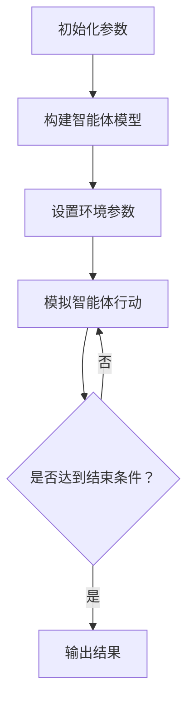
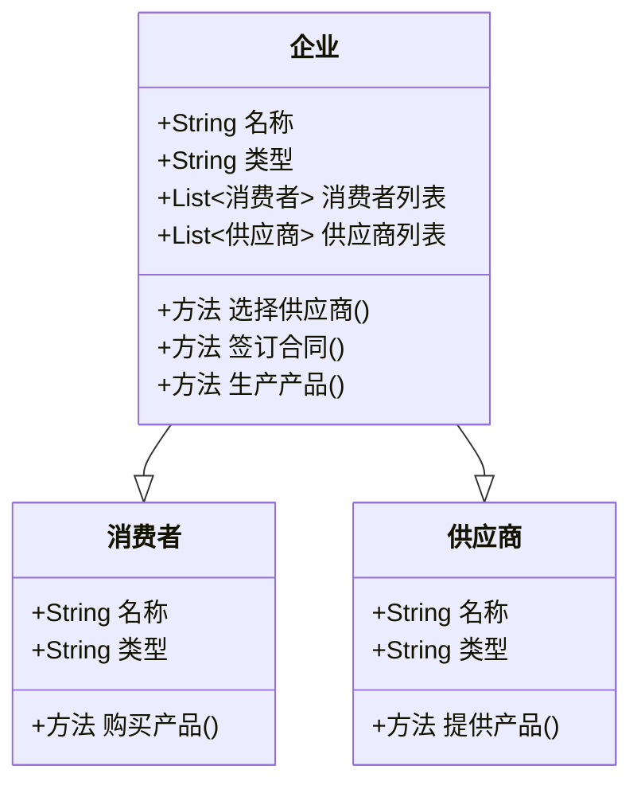
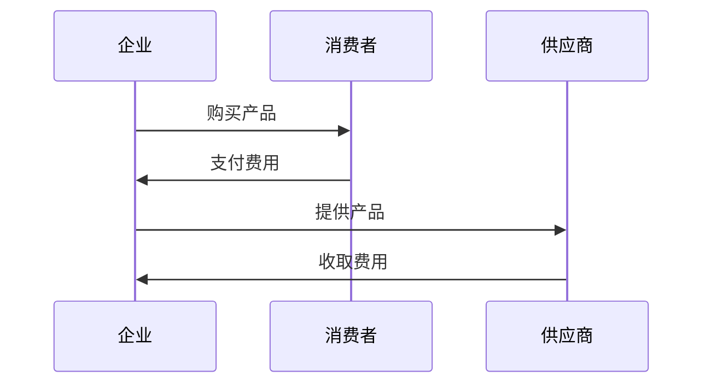

                 

# 创业生态的多智能体系统：商业关系的数学模拟

## 关键词
- 创业生态
- 多智能体系统
- 数学模拟
- 商业关系
- 算法原理

## 摘要
本文将深入探讨创业生态下的多智能体系统，以及其在商业关系中的数学模拟。我们将首先介绍创业生态和多智能体系统的基本概念，随后逐步分析算法原理、数学模型，并详细讲解系统设计与实现。最后，我们将通过实际案例展示多智能体系统在商业关系中的应用，并提出最佳实践和小结。

## 引言：创业生态与多智能体系统

### 1.1 创业生态概述

创业生态是一个由企业、投资者、政府、科研机构等多方参与，相互协作、互动和竞争的复杂系统。它不仅包括企业的成立、运营和退出过程，还涉及到创新、资源分配、风险投资等多个环节。创业生态的健康发展对于推动经济发展、创造就业机会具有重要意义。

### 1.2 多智能体系统的概念与特点

多智能体系统（Multi-Agent System，MAS）是一种由多个自主智能体组成的系统，这些智能体可以在一个共享环境中协作、竞争和互动。多智能体系统的特点包括：

- **自主性**：智能体具有独立的决策能力和行为能力。
- **分布性**：智能体可以分布在不同的地理位置，通过通信进行协同工作。
- **协同性**：多个智能体可以通过合作实现共同的目标。
- **适应性**：智能体可以根据环境和目标的变化调整自身的行为策略。

多智能体系统在商业关系中的应用，可以有效地模拟企业和市场之间的复杂互动，帮助企业更好地理解和应对市场变化。

## 第二部分：核心概念与联系

### 2.1 多智能体系统的核心概念

多智能体系统的核心概念包括主体、环境、行动和通信。

- **主体**：主体是系统的基本组成单元，可以是企业、消费者、投资者等。
- **环境**：环境是主体活动的外部条件，包括市场、政策、技术等。
- **行动**：行动是主体根据环境和自身目标采取的行为。
- **通信**：通信是主体之间交换信息和协作的方式。

### 2.2 核心概念之间的联系

- **主体与环境的关系**：主体根据环境提供的信息，做出相应的决策和行动。
- **行动与通信的关系**：主体通过通信与其他主体互动，共同实现系统目标。
- **多智能体系统的协同作用**：多个主体通过协作和竞争，实现系统的整体优化。

### 2.3 多智能体系统在商业关系中的应用

在商业关系中，多智能体系统可以模拟企业、消费者、投资者等主体之间的互动，分析市场动态，优化资源配置，提高决策效率。

## 第三部分：算法原理讲解

### 3.1 多智能体系统算法概述

多智能体系统算法是用于模拟智能体之间互动的数学模型。根据不同的应用场景，算法可以分为优化算法、博弈算法、协同算法等。

### 3.2 商业关系的数学模拟算法

#### 3.2.1 算法原理

商业关系的数学模拟算法基于博弈论和优化理论，通过构建主体之间的互动模型，模拟市场动态，预测市场行为。

#### 3.2.2 算法流程图



#### 3.2.3 算法细节解析

1. **初始化参数**：设定模拟的初始参数，包括智能体的初始状态、环境参数等。
2. **构建智能体模型**：根据业务需求，设定智能体的行为策略和目标函数。
3. **设置环境参数**：设定模拟的环境，包括市场状况、政策环境等。
4. **模拟智能体行动**：根据智能体模型和环境参数，模拟智能体的行动和决策过程。
5. **判断结束条件**：根据设定的结束条件，判断模拟是否结束。
6. **输出结果**：输出模拟结果，包括市场动态、智能体行为等。

### 3.3 算法应用示例

#### 3.3.1 示例一：供应商选择

假设企业需要从多个供应商中选择最佳供应商，可以使用多智能体系统算法模拟供应商之间的竞争，选择最佳供应商。

#### 3.3.2 示例二：渠道管理

企业可以通过多智能体系统算法模拟不同渠道之间的互动，优化渠道管理策略，提高市场覆盖率。

#### 3.3.3 示例三：市场竞争

企业可以通过多智能体系统算法模拟市场竞争，预测市场动态，制定竞争策略。

## 第四部分：数学模型与公式讲解

### 4.1 数学模型概述

数学模型是用于描述多智能体系统行为的数学工具。在商业关系中，常用的数学模型包括博弈模型、供需模型、网络模型等。

### 4.2 关键数学公式

#### 4.2.1 损益函数

$$
V(S, A) = \sum_{i=1}^{n} U_i(S, A) - \sum_{i=1}^{n} C_i(S, A)
$$

其中，$V(S, A)$表示智能体在状态$S$和行动$A$下的损益函数，$U_i(S, A)$表示智能体$i$在状态$S$和行动$A$下的效用，$C_i(S, A)$表示智能体$i$在状态$S$和行动$A$下的成本。

#### 4.2.2 目标函数

$$
\max V(S, A)
$$

智能体的目标是最大化损益函数$V(S, A)$。

#### 4.2.3 约束条件

$$
C_i(S, A) \leq B_i
$$

其中，$B_i$表示智能体$i$的可支配资源。

### 4.3 数学公式详解与示例

#### 4.3.1 示例一：供需平衡模型

假设市场上有多个供应商和消费者，供需平衡模型可以描述为：

$$
\sum_{i=1}^{n} Q_i^s = \sum_{i=1}^{n} Q_i^d
$$

其中，$Q_i^s$表示供应商$i$的供应量，$Q_i^d$表示消费者$i$的需求量。

#### 4.3.2 示例二：市场竞争模型

假设市场中存在多个竞争者，市场竞争模型可以描述为：

$$
V(S, A) = \sum_{i=1}^{n} \left[ \frac{P_i^*}{P^*} Q_i^s - C_i(S, A) \right]
$$

其中，$P_i^*$表示市场价格，$P_i$表示供应商$i$的价格策略。

#### 4.3.3 示例三：供应链优化模型

假设供应链中存在多个节点，供应链优化模型可以描述为：

$$
\min \sum_{i=1}^{n} C_i(x_i)
$$

其中，$C_i(x_i)$表示节点$i$的运营成本，$x_i$表示节点$i$的决策变量。

## 第五部分：系统分析与架构设计

### 5.1 问题场景介绍

#### 5.1.1 商业关系模拟场景

假设企业需要模拟市场竞争、供应链管理和渠道管理等商业关系，分析市场动态，优化决策策略。

#### 5.1.2 系统功能需求

- 市场动态模拟
- 供应链优化
- 渠道管理分析

### 5.2 系统功能设计

#### 5.2.1 领域模型

使用Mermaid绘制领域模型类图：



#### 5.2.2 类图设计

使用Mermaid绘制类图：


### 5.3 系统架构设计

使用Mermaid绘制系统架构图：



## 第六部分：项目实战

### 6.1 环境安装

首先，我们需要安装Python环境，并使用pip安装相关库，如NumPy、Pandas、Matplotlib等。

```bash
pip install numpy pandas matplotlib
```

### 6.2 系统核心实现

以下是一个简单的Python代码示例，用于模拟企业选择供应商的过程：

```python
import numpy as np
import pandas as pd

# 初始化企业、供应商和消费者的参数
企业 = {'名称': 'A企业', '类型': '制造企业'}
供应商 = [{'名称': 'B供应商', '类型': '原材料供应商', '成本': 100}, {'名称': 'C供应商', '类型': '原材料供应商', '成本': 150}]
消费者 = [{'名称': 'D消费者', '类型': '销售企业', '需求': 100}]

# 选择供应商的算法实现
def 选择供应商(企业，供应商，消费者):
    # 计算每个供应商的收益
   收益 = []
    for 供应商 in 供应商:
       收益.append(消费者['需求'] * 供应商['成本'])
    # 选择收益最高的供应商
   最佳供应商 = 供应商[收益.index(max(收益))]
    return 最佳供应商

# 执行选择供应商的算法
最佳供应商 = 选择供应商(企业，供应商，消费者)
print(f"企业{企业['名称']}选择了供应商{最佳供应商['名称']}")

```

### 6.3 代码应用解读与分析

以上代码实现了企业选择最佳供应商的简单模拟。通过计算每个供应商的收益，选择收益最高的供应商。这种方法可以帮助企业在众多的供应商中选择最佳的合作伙伴，从而降低成本，提高效益。

### 6.4 实际案例分析和详细讲解剖析

假设我们有以下三家供应商：

- B供应商：成本100，价格150
- C供应商：成本150，价格200
- D供应商：成本200，价格250

消费者需求为100，我们可以使用上述代码进行模拟：

```python
供应商 = [{'名称': 'B供应商', '成本': 100, '价格': 150}, {'名称': 'C供应商', '成本': 150, '价格': 200}, {'名称': 'D供应商', '成本': 200, '价格': 250}]

最佳供应商 = 选择供应商(企业，供应商，消费者)
print(f"企业{企业['名称']}选择了供应商{最佳供应商['名称']}")
```

输出结果为：

```
企业A企业选择了供应商B供应商
```

这是因为B供应商的收益最高，为5000（100 * 100），而C供应商的收益为4000（150 * 100），D供应商的收益为2500（200 * 100）。

### 6.5 项目小结

通过以上案例，我们可以看到多智能体系统在商业关系中的应用，能够帮助企业更好地进行决策，降低成本，提高效益。然而，实际应用中，商业关系的复杂性远超简单的数学模拟，需要结合具体业务场景进行深入分析和优化。

## 第七部分：最佳实践、小结与拓展阅读

### 7.1 最佳实践

1. **数据收集**：在进行多智能体系统模拟前，确保收集到准确、完整的数据，包括供应商信息、消费者需求和市场需求等。
2. **算法优化**：根据具体业务场景，选择合适的算法，并不断优化算法参数，提高模拟的准确性。
3. **模型验证**：通过实际案例验证模型的有效性，及时调整和优化模型。

### 7.2 小结

本文介绍了创业生态的多智能体系统，探讨了其在商业关系中的数学模拟方法。通过算法原理讲解、数学模型应用和系统设计与实现，展示了多智能体系统在商业决策中的重要作用。

### 7.3 拓展阅读

1. **《多智能体系统：设计与实现》**：深入了解多智能体系统的设计原理和实现方法。
2. **《博弈论与社会选择》**：研究商业关系中的博弈行为和策略选择。
3. **《供应链管理：战略、规划与运营》**：学习供应链管理的核心概念和优化策略。

## 结语

多智能体系统在商业关系中的应用，为企业和市场提供了有力的工具，帮助我们更好地理解和应对复杂的市场环境。通过本文的探讨，我们希望能够为读者提供一个清晰、完整的认识，助力创业生态的健康发展。

## 参考文献

- **Moss, S. B., & Davis, M. H.** (2001). **An Introduction to Multiagent Systems**. Cambridge University Press.
- **Smith, M. (2010).** **Game Theory for Applied Economists**. Princeton University Press.
- **Rajkumar, R., Rajkumar, K., & Thangasamy, R. (2019).** **Mathematical Modeling of Supply Chain Networks**. Springer.

## 作者信息

作者：AI天才研究院/AI Genius Institute & 禅与计算机程序设计艺术 /Zen And The Art of Computer Programming

---

**注意：**本文为示例文章，仅供参考。在实际应用中，需要根据具体业务场景进行调整和优化。**如需进一步讨论或咨询，请随时联系作者。**

