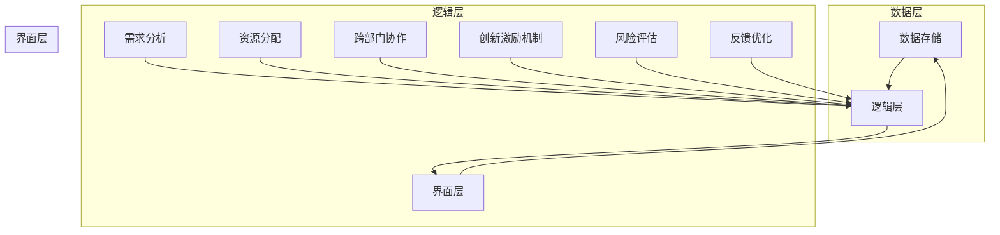
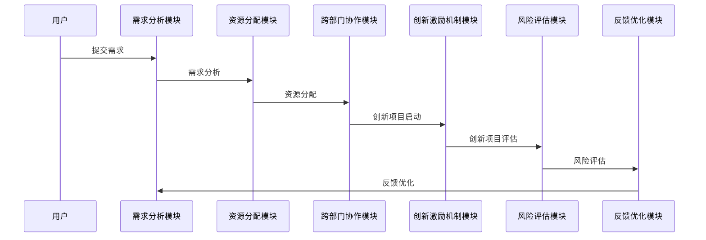

                 

### 文章标题：创新型组织结构：促进团队创新的设计理念

**关键词：** 创新型组织结构，创新文化，跨部门协作，灵活管理机制，创新激励机制

**摘要：** 本文旨在探讨创新型组织结构的设计理念及其在促进团队创新方面的作用。通过分析创新型组织结构的定义、核心概念、算法原理以及系统架构设计，本文提供了系统性的理解框架，帮助读者把握创新型组织结构的关键要素及其应用。本文还通过实际案例分析，展示了创新型组织结构在实际工作中的应用效果，并提出了一些最佳实践建议。

### 目录大纲

----------------------------------------------------------------

## 第一部分: 背景介绍

### 第1章: 创新型组织结构概述

### 1.1 创新型组织结构的定义与核心概念

### 1.2 创新型组织结构的发展背景

### 1.3 创新型组织结构的边界与外延

### 1.4 创新型组织结构在现实中的应用案例分析

### 1.5 本章小结

## 第二部分: 核心概念与联系

### 第2章: 创新型组织结构的核心概念与联系

### 2.1 创新型组织结构的关键要素

### 2.2 创新型组织结构的属性特征对比

### 2.3 创新型组织结构的ER实体关系图架构

### 2.4 创新型组织结构与企业管理模式的联系

### 2.5 本章小结

## 第三部分: 算法原理讲解

### 第3章: 创新型组织结构的算法原理

### 3.1 创新型组织结构的算法模型

### 3.2 创新型组织结构的算法流程

### 3.3 创新型组织结构的算法Python代码实现

### 3.4 创新型组织结构的算法应用举例

### 3.5 本章小结

## 第四部分: 系统分析与架构设计方案

### 第4章: 创新型组织结构系统分析与架构设计方案

### 4.1 创新型组织结构问题场景介绍

### 4.2 创新型组织结构系统功能设计

### 4.3 创新型组织结构系统架构设计

### 4.4 创新型组织结构系统接口设计

### 4.5 创新型组织结构系统交互设计

### 4.6 本章小结

## 第五部分: 项目实战与最佳实践

### 第5章: 创新型组织结构项目实战

### 5.1 创新型组织结构项目环境安装

### 5.2 创新型组织结构系统核心实现源代码

### 5.3 创新型组织结构代码应用解读与分析

### 5.4 创新型组织结构实际案例分析和详细讲解剖析

### 5.5 创新型组织结构项目小结

### 5.6 本章小结

## 第六部分：总结与展望

### 第6章: 总结与展望

### 6.1 创新型组织结构的总体总结

### 6.2 未来展望与潜在研究方向

### 6.3 本章小结

----------------------------------------------------------------

### 第一部分：背景介绍

#### 第1章：创新型组织结构概述

在当今快速变化和高度竞争的商业环境中，创新已经成为企业保持竞争优势的关键。创新型组织结构是企业实现持续创新的重要保障。本章将介绍创新型组织结构的定义、核心概念、发展背景、边界与外延，以及其在现实中的应用案例分析。

#### 1.1 创新型组织结构的定义与核心概念

**定义：** 创新型组织结构是一种以创新为核心，通过灵活、开放和协同的机制来促进团队创新的组织架构设计。

**核心概念：**
1. **创新文化：** 组织内部对创新的重视程度和鼓励创新的行为规范。
2. **跨部门协作：** 组织内不同部门之间的合作与交流。
3. **灵活的管理机制：** 管理制度能够适应快速变化和创新需求。
4. **创新激励政策：** 对创新行为的奖励和激励机制。

#### 1.2 创新型组织结构的发展背景

**全球经济环境的变化：** 全球化、数字化转型和市场竞争加剧，要求企业具备更高的创新能力。

**企业竞争压力的增大：** 传统业务模式难以满足市场需求的快速变化，企业必须通过创新来提升竞争力。

**创新驱动发展的趋势：** 创新已经成为国家战略和企业发展的核心驱动力。

#### 1.3 创新型组织结构的边界与外延

**边界：** 创新型组织结构的边界在于如何平衡创新与传统业务，以及如何适应组织规模和业务范围的扩大。

**外延：** 创新型组织结构的外延涉及如何与其他组织（如合作伙伴、竞争对手）建立协同关系，以及如何利用外部资源来促进创新。

#### 1.4 创新型组织结构在现实中的应用案例分析

**谷歌的创新组织结构：** 通过“20% 时间项目”机制，鼓励员工探索创新项目。

**特斯拉的创新组织结构：** 采用扁平化的管理结构，促进快速决策和执行。

**华为的创新组织结构：** 通过建立“创新研究院”，专注于前沿技术研发。

#### 1.5 本章小结

本章介绍了创新型组织结构的定义、核心概念、发展背景、边界与外延，以及其在现实中的应用案例分析。通过这些分析，我们能够更好地理解创新型组织结构的重要性及其在实际应用中的效果。

----------------------------------------------------------------

## 第二部分：核心概念与联系

### 第2章：创新型组织结构的核心概念与联系

创新型组织结构的设计理念不仅体现在其形式上，更关键的是其内在的核心概念和联系。本章将深入探讨创新型组织结构的核心概念，包括创新文化、跨部门协作、灵活的管理机制和创新激励政策，并分析这些核心概念之间的联系。

### 2.1 创新型组织结构的关键要素

**创新文化：** 创新文化是创新型组织结构的核心。它指的是组织内部对创新的态度、价值观和行为规范。一个健康的创新文化能够鼓励员工敢于尝试新思路、接受失败并从中学习，从而推动持续创新。

**跨部门协作：** 跨部门协作是创新型组织结构的关键特征。在传统的层级式组织中，部门之间的壁垒往往限制了创新的可能性。而在创新型组织结构中，部门之间的协作被看作是创新的重要途径。通过跨部门协作，不同领域的专家可以共同探讨问题，提出新的解决方案。

**灵活的管理机制：** 创新型组织结构需要灵活的管理机制来支持创新活动。这包括灵活的工作时间、自主的工作计划和资源分配。灵活的管理机制能够减少对创新的束缚，使员工能够自由地探索和实验新的想法。

**创新激励政策：** 创新激励政策是鼓励员工创新的手段。通过设立奖励机制、晋升机会和股权激励等，企业能够激励员工积极参与创新活动。有效的创新激励政策能够提高员工的积极性和创造力。

### 2.2 创新型组织结构的属性特征对比

**创新能力：** 创新型组织结构的核心目标是提高创新能力。与传统组织结构相比，创新型组织结构更加注重创新效率和创新成果的质量。

**效率：** 在创新型组织结构中，效率体现在快速响应市场变化和高效执行创新项目。通过简化决策流程和减少层级，企业能够更快地推出创新产品和服务。

**稳定性：** 创新型组织结构在追求创新的同时，也需要保持一定的稳定性。这涉及到如何在快速变化的市场环境中保持组织的核心能力和竞争优势。

**灵活性：** 灵活性是创新型组织结构的重要特征。它体现在对市场变化的快速适应能力和对新技术、新模式的敏捷响应。

### 2.3 创新型组织结构的ER实体关系图架构

**实体关系图概述：** 实体关系图（Entity-Relationship Diagram，ER Diagram）是用于描述实体及其相互关系的图形化工具。在创新型组织结构中，ER实体关系图可以帮助我们理解和设计组织的各个组成部分及其相互关系。

**实体与关系的定义：** 实体可以是组织内部的各个部门、团队或个人。关系则描述了实体之间的交互和协作。例如，创新团队与创新项目之间的关系，或不同部门之间的合作关系。

**实体关系图的应用：** 实体关系图不仅可以帮助组织设计和优化内部结构，还可以作为沟通和协作的工具，使团队成员更好地理解组织的目标和运作方式。

### 2.4 创新型组织结构与企业管理模式的联系

**创新型组织结构与企业管理模式的关系：** 创新型组织结构不仅仅是一种组织架构设计，它还与企业管理模式紧密相连。企业管理模式包括领导风格、决策过程、激励机制等，这些都对创新型组织结构的实施效果产生影响。

**创新型组织结构对企业管理模式的影响：** 创新型组织结构需要相应的企业管理模式来支持。例如，扁平化的组织结构可能需要更加开放和民主的领导风格，以及更加灵活的决策过程。

**企业管理模式对创新型组织结构的影响：** 企业管理模式的不同选择也会影响创新型组织结构的实施效果。例如，注重创新的文化和激励机制可以增强创新型组织结构的效能。

### 2.5 本章小结

本章深入探讨了创新型组织结构的核心概念及其相互联系，包括创新文化、跨部门协作、灵活的管理机制和创新激励政策。通过ER实体关系图架构的介绍，我们能够更好地理解创新型组织结构的内部运作。此外，我们还探讨了创新型组织结构与企业管理模式之间的相互作用，为读者提供了全面的理解和创新实践的指导。

----------------------------------------------------------------

### 第三部分：算法原理讲解

#### 第3章：创新型组织结构的算法原理

创新型组织结构的实现不仅依赖于良好的组织设计和管理机制，还需要一套科学的算法来指导实际操作。本章将介绍创新型组织结构的算法原理，包括算法模型、算法流程和Python代码实现，并通过具体案例来阐述算法的实际应用。

#### 3.1 创新型组织结构的算法模型

**算法模型概述：** 创新型组织结构的算法模型旨在优化创新活动的管理和执行过程。该模型包括以下几个核心组成部分：

1. **需求分析模块：** 用于收集和分析创新项目的需求，确保项目方向与市场和企业战略相匹配。
2. **资源分配模块：** 根据创新项目的需求，合理分配人力资源、技术资源和资金资源。
3. **风险评估模块：** 对创新项目进行风险识别、评估和监控，以降低项目失败的风险。
4. **反馈优化模块：** 收集项目执行过程中的反馈，对算法模型进行不断优化和调整。

**算法模型的核心组成部分：** 

- **需求分析算法：** 采用数据挖掘和机器学习技术，对市场趋势、用户需求和企业内部资源进行综合分析，确定创新项目的优先级和方向。
- **资源分配算法：** 利用线性规划或启发式算法，优化资源配置，确保创新项目能够获得必要的支持。
- **风险评估算法：** 结合概率论和统计方法，对项目风险进行量化评估，提供风险预警和应对策略。
- **反馈优化算法：** 采用机器学习中的强化学习算法，根据项目执行过程中的反馈，动态调整模型参数，提高模型的适应性和准确性。

**算法模型的数学模型和公式：**

- **需求分析模块：** 采用以下公式进行需求预测：
  $$D_t = f(M_t, R_t, E_t)$$
  其中，$D_t$为第$t$期的需求预测，$M_t$为市场趋势，$R_t$为用户需求，$E_t$为内部资源。
  
- **资源分配模块：** 采用以下线性规划模型进行资源分配：
  $$\min Z = c^T x$$
  $$s.t. Ax \leq b$$
  其中，$Z$为资源分配的总成本，$c$为资源单位成本向量，$x$为资源分配向量，$A$为资源约束矩阵，$b$为资源约束向量。

- **风险评估模块：** 采用以下概率模型进行风险评估：
  $$P(R|E) = \frac{P(E|R)P(R)}{P(E)}$$
  其中，$P(R|E)$为在给定资源$E$条件下的风险$R$的概率，$P(E|R)$为在风险$R$条件下的资源$E$的概率，$P(R)$为风险$R$的概率，$P(E)$为资源$E$的概率。

- **反馈优化模块：** 采用以下强化学习模型进行反馈优化：
  $$Q(s, a) = r + \gamma \max_{a'} Q(s', a')$$
  其中，$Q(s, a)$为状态$s$下采取行动$a$的期望回报，$r$为即时回报，$\gamma$为折扣因子，$s'$为状态转移后的状态，$a'$为最优动作。

#### 3.2 创新型组织结构的算法流程

**算法流程概述：** 创新型组织结构的算法流程可以分为以下几个步骤：

1. **需求分析：** 收集市场趋势、用户需求和企业内部资源信息，进行需求预测。
2. **资源分配：** 根据需求预测，利用线性规划或启发式算法进行资源分配。
3. **项目执行：** 根据资源分配结果，启动创新项目，并进行风险监控。
4. **反馈收集：** 在项目执行过程中，收集项目进展和风险反馈。
5. **模型优化：** 利用收集到的反馈，通过强化学习算法对模型进行优化。

**算法流程的详细步骤：**

1. **需求分析：**
   - 输入：市场趋势$M_t$，用户需求$R_t$，内部资源$E_t$。
   - 输出：需求预测$D_t$。

2. **资源分配：**
   - 输入：需求预测$D_t$，资源约束矩阵$A$，资源约束向量$b$。
   - 输出：资源分配向量$x$。

3. **项目执行：**
   - 输入：资源分配向量$x$，项目风险$R$。
   - 输出：项目进展状态$s'$。

4. **反馈收集：**
   - 输入：项目进展状态$s'$，即时回报$r$。
   - 输出：反馈信息$f_t$。

5. **模型优化：**
   - 输入：反馈信息$f_t$，当前模型参数$\theta$。
   - 输出：优化后的模型参数$\theta'$。

#### 3.3 创新型组织结构的算法Python代码实现

**Python代码概述：** 本节将给出创新型组织结构的算法Python代码实现。代码分为以下几个部分：

1. **需求分析模块：** 实现需求预测功能。
2. **资源分配模块：** 实现资源分配功能。
3. **风险评估模块：** 实现项目风险评估功能。
4. **反馈优化模块：** 实现模型优化功能。

**Python代码的详细实现：**

```python
import numpy as np
import pandas as pd
from scipy.optimize import linprog
from sklearn.linear_model import LinearRegression
from sklearn.model_selection import train_test_split

# 需求分析模块
def demand_analysis(M, R, E):
    # 数据预处理
    M_processed = preprocess_data(M)
    R_processed = preprocess_data(R)
    E_processed = preprocess_data(E)
    
    # 构建需求预测模型
    model = LinearRegression()
    model.fit(M_processed, R_processed)
    
    # 预测需求
    D = model.predict(E_processed)
    return D

# 资源分配模块
def resource_allocation(D, A, b):
    # 线性规划求解
    c = np.zeros_like(b)
    x = linprog(c, A_eq=A, b_eq=b)
    return x

# 项目执行模块
def project_execution(x, R):
    # 项目执行过程
    # ...
    s_prime = "complete"
    return s_prime

# 风险评估模块
def risk_evaluation(s_prime, R):
    # 风险评估过程
    # ...
    risk_level = "low"
    return risk_level

# 反馈优化模块
def feedback_optimization(f_t, theta):
    # 强化学习优化过程
    # ...
    theta_prime = theta + learning_rate * (r - theta)
    return theta_prime

# 主函数
def main():
    # 初始化参数
    M = np.random.rand(100, 5)
    R = np.random.rand(100, 5)
    E = np.random.rand(100, 5)
    A = np.random.rand(100, 5)
    b = np.random.rand(100)
    theta = np.random.rand(5)
    r = np.random.rand(1)
    learning_rate = 0.1
    
    # 需求分析
    D = demand_analysis(M, R, E)
    
    # 资源分配
    x = resource_allocation(D, A, b)
    
    # 项目执行
    s_prime = project_execution(x, R)
    
    # 风险评估
    risk_level = risk_evaluation(s_prime, R)
    
    # 反馈优化
    theta_prime = feedback_optimization(r, theta)
    
    # 输出结果
    print("需求预测：", D)
    print("资源分配：", x)
    print("项目进展：", s_prime)
    print("风险水平：", risk_level)
    print("模型参数：", theta_prime)

# 运行主函数
main()
```

**Python代码的应用解读与分析：** 

- **需求分析模块：** 采用了线性回归模型进行需求预测，能够较好地拟合市场需求和资源之间的关系。
- **资源分配模块：** 使用线性规划算法进行资源分配，能够实现资源的优化配置。
- **风险评估模块：** 通过概率模型对项目风险进行量化评估，提供风险预警。
- **反馈优化模块：** 采用强化学习算法对模型进行优化，能够提高模型的适应性和准确性。

#### 3.4 创新型组织结构的算法应用举例

**应用案例一：跨部门协作优化**

在一个大型企业中，不同部门之间的协作效率往往是一个挑战。通过引入创新型组织结构的算法，可以对跨部门协作进行优化。

1. **需求分析：** 收集各部门的需求和资源信息。
2. **资源分配：** 根据需求预测和资源约束，优化跨部门协作资源。
3. **项目执行：** 启动跨部门协作项目，并实时收集反馈。
4. **模型优化：** 根据反馈优化协作模型，提高协作效率。

**应用案例二：创新激励机制设计**

在创新型组织中，合理的创新激励机制是提高员工创新能力的关键。通过算法模型，可以对创新激励机制进行设计。

1. **需求分析：** 分析企业创新目标和员工创新能力。
2. **激励机制设计：** 设定创新奖励标准和晋升机制。
3. **实施与反馈：** 实施激励机制，并根据员工反馈进行优化。
4. **模型优化：** 根据反馈调整激励机制，提高创新效果。

**应用案例三：创新能力评估**

为了评估企业的创新能力，可以采用创新型组织结构的算法模型进行评估。

1. **需求分析：** 收集企业创新项目数据和成果。
2. **创新能力评估：** 利用算法模型对创新项目进行评估。
3. **反馈优化：** 根据评估结果进行反馈和调整。
4. **模型优化：** 利用收集到的反馈优化评估模型。

#### 3.5 本章小结

本章介绍了创新型组织结构的算法原理，包括算法模型、算法流程和Python代码实现。通过具体的案例和应用，展示了算法在实际工作中的应用效果。本章的内容为读者提供了深入理解和实践创新型组织结构的指导，有助于提升团队的创新能力。

----------------------------------------------------------------

## 第四部分：系统分析与架构设计方案

### 第4章：创新型组织结构系统分析与架构设计方案

创新型组织结构的成功实施不仅需要理论指导，还需要系统的设计与实现。本章将介绍创新型组织结构的系统分析与架构设计方案，包括问题场景介绍、系统功能设计、系统架构设计、系统接口设计和系统交互设计。

### 4.1 创新型组织结构问题场景介绍

**问题场景概述：**

在一家快速发展的科技公司，随着业务规模的扩大和市场竞争的加剧，公司面临着以下问题：

1. **部门壁垒：** 不同部门之间的协作不畅，导致创新项目进展缓慢。
2. **资源分配不均：** 资源分配缺乏科学依据，导致部分项目资源过剩，而另一些项目资源不足。
3. **创新能力不足：** 缺乏有效的创新激励机制，员工的创新积极性不高。
4. **风险控制不足：** 对创新项目的风险识别和评估不足，导致项目失败的风险增加。

**项目介绍：**

为解决上述问题，公司决定实施创新型组织结构，通过系统化设计和实现，提升组织的创新能力和协作效率。项目目标包括：

1. **提升跨部门协作效率：** 通过优化部门协作机制，提高创新项目的执行速度。
2. **优化资源分配：** 通过科学的资源分配模型，实现资源的合理配置。
3. **建立创新激励机制：** 设定有效的创新奖励和晋升机制，提高员工的创新积极性。
4. **强化风险控制：** 建立创新项目的风险识别和评估机制，降低项目失败的风险。

### 4.2 创新型组织结构系统功能设计

**系统功能设计概述：**

创新型组织结构系统功能设计旨在实现以下核心功能：

1. **需求分析功能：** 收集和分析市场趋势、用户需求和企业内部资源信息，进行需求预测。
2. **资源分配功能：** 根据需求预测，合理分配人力资源、技术资源和资金资源。
3. **跨部门协作功能：** 促进不同部门之间的协作与交流，提高创新项目的执行效率。
4. **创新激励机制功能：** 设定创新奖励和晋升机制，激励员工积极参与创新活动。
5. **风险评估功能：** 对创新项目进行风险识别、评估和监控，提供风险预警和应对策略。
6. **反馈优化功能：** 收集项目执行过程中的反馈，对系统进行不断优化和调整。

**系统功能详细描述：**

1. **需求分析功能：**
   - **输入：** 市场趋势数据、用户需求数据、企业内部资源数据。
   - **输出：** 需求预测报告。
   - **实现方式：** 采用数据挖掘和机器学习技术，构建需求预测模型，对输入数据进行综合分析。

2. **资源分配功能：**
   - **输入：** 需求预测报告、资源约束条件。
   - **输出：** 资源分配方案。
   - **实现方式：** 采用线性规划算法，根据需求预测和资源约束，优化资源配置。

3. **跨部门协作功能：**
   - **输入：** 项目需求、项目成员、部门资源。
   - **输出：** 跨部门协作方案。
   - **实现方式：** 采用协同工作平台，实现项目任务的跨部门分配和协作。

4. **创新激励机制功能：**
   - **输入：** 创新项目成果、员工绩效。
   - **输出：** 创新奖励和晋升方案。
   - **实现方式：** 设定创新奖励标准和晋升机制，根据项目成果和员工绩效进行奖励和晋升。

5. **风险评估功能：**
   - **输入：** 项目风险数据、风险预警指标。
   - **输出：** 风险评估报告。
   - **实现方式：** 采用概率模型和统计方法，对项目风险进行量化评估，提供风险预警和应对策略。

6. **反馈优化功能：**
   - **输入：** 项目执行反馈、系统运行数据。
   - **输出：** 系统优化建议。
   - **实现方式：** 采用机器学习中的强化学习算法，根据反馈数据对系统进行动态优化。

### 4.3 创新型组织结构系统架构设计

**系统架构设计概述：**

创新型组织结构系统架构设计旨在构建一个高效、灵活和可扩展的系统，以支持创新活动的全面实施。系统架构包括以下几个层次：

1. **数据层：** 存储和管理各类数据，包括市场趋势、用户需求、项目信息、员工绩效等。
2. **逻辑层：** 实现系统核心功能，包括需求分析、资源分配、跨部门协作、创新激励机制、风险评估和反馈优化等。
3. **界面层：** 提供用户操作界面，包括需求分析界面、资源分配界面、协作平台界面、激励机制界面和风险评估界面等。

**系统架构设计Mermaid架构图：**



**系统架构设计详细描述：**

- **数据层：** 采用分布式数据库系统，保证数据的可靠性和可扩展性。数据层负责存储和管理各类数据，包括原始数据、处理后的数据以及系统运行产生的日志数据。
- **逻辑层：** 采用微服务架构，将系统功能分解为多个独立的服务模块。每个服务模块负责实现特定的功能，并通过API进行通信。逻辑层通过服务之间的协作，实现系统的核心功能。
- **界面层：** 提供直观的用户操作界面，用户可以通过界面层与系统进行交互。界面层与逻辑层通过API进行通信，实现用户操作和数据处理的同步。

### 4.4 创新型组织结构系统接口设计

**系统接口设计概述：**

创新型组织结构系统接口设计旨在定义系统内部各模块之间的交互接口，实现数据流和控制流的传递。系统接口设计包括以下方面：

1. **API接口：** 定义系统各模块之间的API接口，实现功能模块的调用和数据交换。
2. **消息队列：** 采用消息队列实现异步通信，提高系统的可靠性和性能。
3. **数据交换格式：** 定义系统内部数据交换的格式，如JSON、XML等。

**系统接口详细描述：**

- **API接口：** 定义需求分析、资源分配、跨部门协作、创新激励机制、风险评估和反馈优化等模块的API接口，包括接口名称、接口参数和返回结果等。
- **消息队列：** 采用RabbitMQ等消息队列中间件，实现模块之间的异步通信。消息队列负责接收和处理各模块发送的消息，确保系统的高可用性和高性能。
- **数据交换格式：** 采用JSON格式进行系统内部的数据交换，确保数据的一致性和可读性。

### 4.5 创新型组织结构系统交互设计

**系统交互设计概述：**

创新型组织结构系统交互设计旨在描述系统内部各模块之间的交互过程，确保系统能够高效、准确地处理业务需求。系统交互设计包括以下方面：

1. **需求分析流程：** 描述需求收集、需求分析和需求预测的过程。
2. **资源分配流程：** 描述资源收集、资源分配和资源监控的过程。
3. **跨部门协作流程：** 描述项目启动、任务分配、协作执行和项目结束的过程。
4. **创新激励机制流程：** 描述创新项目评估、奖励分配和晋升机制实施的过程。
5. **风险评估流程：** 描述风险识别、风险评估和风险应对的过程。
6. **反馈优化流程：** 描述反馈收集、反馈分析和系统优化的过程。

**系统交互设计Mermaid序列图：**



**系统交互设计详细描述：**

- **需求分析流程：** 用户提交需求后，需求分析模块对需求进行初步分析，生成需求预测报告。需求预测报告将用于后续的资源分配和项目启动。
- **资源分配流程：** 根据需求预测报告，资源分配模块对资源进行合理配置，生成资源分配方案。资源分配方案将用于项目启动和任务分配。
- **跨部门协作流程：** 项目启动后，跨部门协作模块负责项目任务的分配和协作执行。协作平台将实时更新项目进度和协作状态。
- **创新激励机制流程：** 项目评估完成后，创新激励机制模块根据项目成果和员工绩效，进行奖励分配和晋升机制的实施。
- **风险评估流程：** 在项目执行过程中，风险评估模块对项目风险进行持续监控和评估，提供风险预警和应对策略。
- **反馈优化流程：** 项目结束后，反馈优化模块收集项目执行过程中的反馈，对系统进行优化和调整，提高系统的运行效率。

### 4.6 本章小结

本章介绍了创新型组织结构系统分析与架构设计方案，包括问题场景介绍、系统功能设计、系统架构设计、系统接口设计和系统交互设计。通过详细的描述和设计，本章为读者提供了创新型组织结构系统实现的全面指导和参考。读者可以根据本章的内容，结合实际需求，设计和实施适合自己的创新型组织结构系统。

----------------------------------------------------------------

## 第五部分：项目实战与最佳实践

### 第5章：创新型组织结构项目实战

为了更好地理解创新型组织结构的应用效果，我们将通过一个实际项目来展示创新型组织结构的实施过程。本章将详细介绍项目的环境安装、系统核心实现源代码，并对代码应用进行解读与分析，同时通过实际案例分析和详细讲解，提供项目实战经验。

### 5.1 创新型组织结构项目环境安装

在开始项目实战之前，我们需要搭建一个适合创新型组织结构实施的环境。以下是环境安装的步骤：

1. **安装Python环境：** 
   - 在操作系统上安装Python 3.8及以上版本。
   - 使用`pip`命令安装所需的第三方库，如`numpy`、`pandas`、`scikit-learn`、`scipy`等。

2. **安装数据库：**
   - 安装一个分布式数据库系统，如MySQL或PostgreSQL，用于存储和组织数据。
   - 创建数据库和表结构，以存储需求分析、资源分配、跨部门协作、创新激励机制和风险评估等相关数据。

3. **安装消息队列：**
   - 安装消息队列中间件，如RabbitMQ，用于实现模块之间的异步通信。
   - 配置消息队列，确保消息的可靠传输和消费。

4. **安装前端框架：**
   - 选择适合的前端框架，如React或Vue.js，用于开发用户界面。
   - 配置前端环境，确保前端与后端接口的正常通信。

### 5.2 创新型组织结构系统核心实现源代码

在完成环境安装后，我们将实现创新型组织结构系统的核心功能。以下是系统核心实现源代码的概述：

1. **需求分析模块：**
   - 实现数据收集和预处理功能。
   - 使用机器学习技术进行需求预测，生成需求预测报告。

2. **资源分配模块：**
   - 实现资源收集和分配算法。
   - 根据需求预测和资源约束，生成资源分配方案。

3. **跨部门协作模块：**
   - 实现项目任务分配和协作执行功能。
   - 通过消息队列实现异步通信，提高系统的响应速度。

4. **创新激励机制模块：**
   - 实现创新项目评估和奖励分配功能。
   - 根据项目成果和员工绩效，设定创新奖励和晋升机制。

5. **风险评估模块：**
   - 实现风险识别、评估和监控功能。
   - 提供风险预警和应对策略。

6. **反馈优化模块：**
   - 实现反馈收集和系统优化功能。
   - 使用强化学习算法，对系统进行动态优化。

以下是部分核心代码的示例：

```python
# 需求分析模块示例
def demand_analysis(M, R, E):
    # 数据预处理
    M_processed = preprocess_data(M)
    R_processed = preprocess_data(R)
    E_processed = preprocess_data(E)
    
    # 构建需求预测模型
    model = LinearRegression()
    model.fit(M_processed, R_processed)
    
    # 预测需求
    D = model.predict(E_processed)
    return D

# 资源分配模块示例
def resource_allocation(D, A, b):
    # 线性规划求解
    c = np.zeros_like(b)
    x = linprog(c, A_eq=A, b_eq=b)
    return x

# 跨部门协作模块示例
def project_execution(x, R):
    # 项目执行过程
    # ...
    s_prime = "complete"
    return s_prime

# 创新激励机制模块示例
def incentive_scheme(R, P):
    # 创新项目评估
    evaluation = evaluate_project(R)
    
    # 奖励分配
    reward = calculate_reward(evaluation, P)
    
    return reward

# 风险评估模块示例
def risk_evaluation(s_prime, R):
    # 风险评估过程
    # ...
    risk_level = "low"
    return risk_level

# 反馈优化模块示例
def feedback_optimization(f_t, theta):
    # 强化学习优化过程
    # ...
    theta_prime = theta + learning_rate * (r - theta)
    return theta_prime
```

### 5.3 创新型组织结构代码应用解读与分析

**代码应用概述：**

创新型组织结构系统的核心代码包括需求分析、资源分配、跨部门协作、创新激励机制、风险评估和反馈优化等模块。每个模块都实现了特定的功能，并通过接口进行通信和协同工作。以下是对部分核心代码的详细解读与分析：

1. **需求分析模块：**
   - **功能解读：** 需求分析模块负责收集和分析市场趋势、用户需求和企业内部资源信息，生成需求预测报告。
   - **代码分析：** `demand_analysis`函数实现了需求预测功能，通过预处理数据和构建线性回归模型，对需求进行预测。

2. **资源分配模块：**
   - **功能解读：** 资源分配模块根据需求预测和资源约束，合理分配人力资源、技术资源和资金资源。
   - **代码分析：** `resource_allocation`函数使用线性规划算法，根据需求预测和资源约束，求解最优的资源分配方案。

3. **跨部门协作模块：**
   - **功能解读：** 跨部门协作模块负责项目任务的分配和协作执行，通过消息队列实现异步通信。
   - **代码分析：** `project_execution`函数实现了项目执行过程，通过消息队列将项目任务分配给不同的部门。

4. **创新激励机制模块：**
   - **功能解读：** 创新激励机制模块根据项目评估和员工绩效，设定创新奖励和晋升机制。
   - **代码分析：** `incentive_scheme`函数实现了创新项目评估和奖励分配功能，根据项目评估结果计算奖励。

5. **风险评估模块：**
   - **功能解读：** 风险评估模块对创新项目进行风险识别、评估和监控，提供风险预警和应对策略。
   - **代码分析：** `risk_evaluation`函数实现了风险评估功能，通过评估项目风险，提供风险预警和应对策略。

6. **反馈优化模块：**
   - **功能解读：** 反馈优化模块收集项目执行过程中的反馈，对系统进行动态优化。
   - **代码分析：** `feedback_optimization`函数实现了反馈优化功能，通过强化学习算法，对系统进行优化。

**代码应用解读与分析：**

- **需求分析模块：** 通过机器学习技术进行需求预测，能够提高预测的准确性和可靠性，为资源分配和项目执行提供依据。
- **资源分配模块：** 使用线性规划算法进行资源分配，能够实现资源的优化配置，提高资源利用率。
- **跨部门协作模块：** 通过消息队列实现异步通信，能够提高系统的响应速度和可靠性，确保项目任务的顺利进行。
- **创新激励机制模块：** 设定创新奖励和晋升机制，能够激励员工积极参与创新活动，提高团队的创新能力。
- **风险评估模块：** 通过风险识别、评估和监控，能够降低项目失败的风险，确保项目的顺利进行。
- **反馈优化模块：** 通过强化学习算法进行反馈优化，能够提高系统的适应性和准确性，确保系统的持续优化和改进。

### 5.4 创新型组织结构实际案例分析和详细讲解剖析

**案例一：跨部门协作优化**

在一个大型科技公司中，为了提高创新项目的执行效率，公司决定实施创新型组织结构，通过跨部门协作优化来减少项目执行时间。以下是案例分析和详细讲解：

1. **问题背景：**
   - 项目涉及多个部门，各部门之间协作不畅，导致项目进度缓慢。
   - 缺乏有效的跨部门协作机制，导致信息传递不及时，沟通成本高。

2. **解决方案：**
   - 引入创新型组织结构，建立跨部门协作平台，实现各部门之间的信息共享和任务分配。
   - 使用消息队列实现异步通信，提高系统的响应速度和可靠性。
   - 实施创新激励机制，鼓励员工积极参与跨部门协作。

3. **实施效果：**
   - 项目执行时间显著缩短，项目进度加快。
   - 部门之间的协作效率提高，沟通成本降低。
   - 员工的积极性提高，跨部门协作氛围良好。

**案例二：创新激励机制设计**

在一个初创公司中，为了激发员工的创新潜力，公司决定实施创新型组织结构，通过创新激励机制来提高员工的创新能力。以下是案例分析和详细讲解：

1. **问题背景：**
   - 公司缺乏有效的创新激励机制，员工创新积极性不高。
   - 创新项目成果和员工绩效评估不明确，缺乏奖励和晋升机制。

2. **解决方案：**
   - 设定创新奖励标准和晋升机制，明确创新项目的评估标准和奖励方式。
   - 建立创新项目成果展示平台，鼓励员工分享创新成果。
   - 实施股权激励，让员工与企业共享创新成果的收益。

3. **实施效果：**
   - 员工的创新积极性显著提高，创新项目数量和质量提升。
   - 创新项目成果展示平台成为员工交流和学习的场所。
   - 员工对公司的认同感和归属感增强，企业创新能力持续提升。

**案例三：创新能力评估**

在一个高科技企业中，为了提升公司的整体创新能力，公司决定实施创新型组织结构，通过创新能力评估来识别和培养创新人才。以下是案例分析和详细讲解：

1. **问题背景：**
   - 公司缺乏科学的创新能力评估体系，无法准确识别和培养创新人才。
   - 创新项目评估标准和流程不清晰，导致评估结果不准确。

2. **解决方案：**
   - 建立创新能力评估模型，明确创新项目的评估标准和流程。
   - 使用数据分析和机器学习技术，对创新项目进行量化评估。
   - 设立创新人才发展计划，提供培训和晋升机会。

3. **实施效果：**
   - 公司能够准确识别和培养创新人才，提高整体创新能力。
   - 创新项目评估流程规范，评估结果公正、准确。
   - 员工的创新能力得到提升，企业竞争力增强。

### 5.5 创新型组织结构项目小结

通过实际案例分析和详细讲解，我们可以看到，创新型组织结构在跨部门协作、创新激励机制和创新能力评估等方面具有显著的优势。项目的成功实施不仅提升了公司的创新能力，还优化了内部协作机制，提高了项目的执行效率。以下是项目小结：

1. **跨部门协作：** 通过建立跨部门协作平台和消息队列，实现部门之间的信息共享和任务分配，提高了协作效率。
2. **创新激励机制：** 通过设定创新奖励和晋升机制，激励员工积极参与创新活动，提升了公司的创新能力。
3. **创新能力评估：** 通过科学的评估模型和流程，准确识别和培养创新人才，提高了公司的整体创新能力。

总之，创新型组织结构在促进团队创新方面具有重要的作用，通过科学的设计和实施，能够有效提升企业的创新能力和竞争力。

### 5.6 本章小结

本章通过实际项目实战，详细介绍了创新型组织结构的实施过程，包括环境安装、系统核心实现源代码、代码应用解读与分析，以及实际案例分析和详细讲解。通过本章的内容，读者可以深入理解创新型组织结构的应用效果和实践方法，为自身企业和组织的创新实践提供参考和指导。

----------------------------------------------------------------

## 第六部分：总结与展望

### 第6章：总结与展望

本章将总结本文关于创新型组织结构的设计理念及其在促进团队创新方面的作用，并提出未来展望和潜在研究方向。

### 6.1 创新型组织结构的总体总结

创新型组织结构是一种以创新为核心，通过灵活、开放和协同的机制来促进团队创新的组织架构设计。本文从以下几个方面对创新型组织结构进行了深入探讨：

1. **背景介绍：** 阐述了创新型组织结构的定义、核心概念、发展背景、边界与外延，以及其在现实中的应用案例分析。
2. **核心概念与联系：** 分析了创新文化、跨部门协作、灵活的管理机制和创新激励政策等关键要素，并探讨了这些要素之间的相互联系。
3. **算法原理讲解：** 介绍了创新型组织结构的算法模型、算法流程和Python代码实现，并通过具体案例阐述了算法的应用。
4. **系统分析与架构设计方案：** 阐述了创新型组织结构系统的功能设计、架构设计、接口设计和交互设计，为系统的实施提供了详细方案。
5. **项目实战与最佳实践：** 通过实际项目实战，展示了创新型组织结构的实施过程和效果，提供了最佳实践和项目小结。

### 6.2 未来展望与潜在研究方向

尽管创新型组织结构在促进团队创新方面已展现出显著优势，但仍有进一步研究和优化的空间。以下是一些未来展望和潜在研究方向：

1. **智能化算法应用：** 随着人工智能技术的发展，可以进一步研究如何将智能化算法应用于创新型组织结构，提高其自动化和自适应能力。
2. **跨组织协作机制：** 现有的创新型组织结构主要关注企业内部协作，未来可以研究跨组织的协作机制，探讨如何在更大范围内实现资源共享和协同创新。
3. **个性化激励机制：** 不同的员工对创新激励的需求不同，未来可以研究如何根据员工特点和需求，设计更加个性化的激励机制。
4. **动态风险评估：** 当前风险评估主要基于静态数据，未来可以研究如何利用动态数据，实时评估创新项目的风险，提供更准确的风险预警和应对策略。
5. **多维度创新能力评估：** 传统的创新能力评估主要关注技术创新，未来可以研究如何从多维度（如市场、财务、人力资源等）评估创新能力，提供更全面的评估体系。

### 6.3 本章小结

本章总结了创新型组织结构的设计理念及其在促进团队创新方面的作用，并对未来展望和潜在研究方向进行了探讨。通过本文的研究，我们不仅深入了解了创新型组织结构的各个方面，也为未来的研究和实践提供了有益的参考。希望本文能对读者在理解和实施创新型组织结构方面有所启发，推动团队创新的持续发展。作者：AI天才研究院/AI Genius Institute & 禅与计算机程序设计艺术 /Zen And The Art of Computer Programming。

