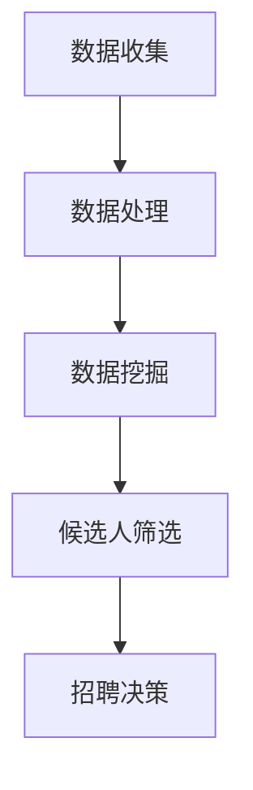
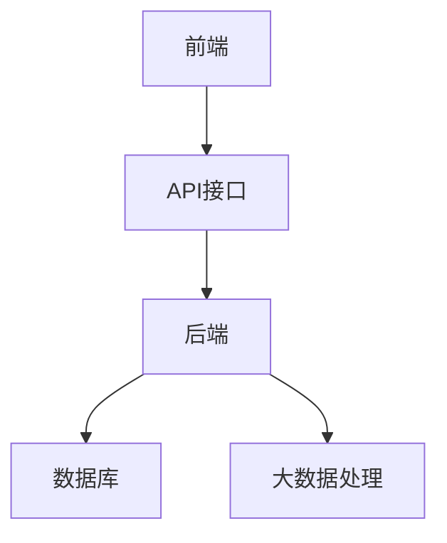
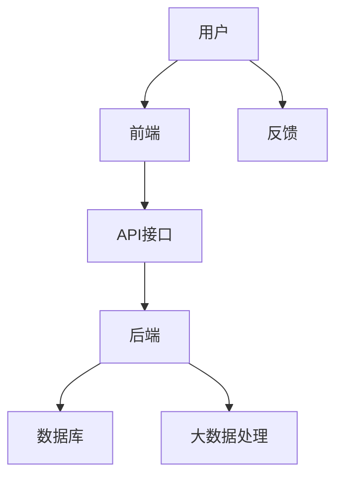

                 

### 创新招聘策略：吸引顶尖人才

#### 关键词：创新招聘策略，顶尖人才，人才竞争，招聘流程，大数据，人工智能，招聘评估

> 摘要：本文将探讨如何通过创新招聘策略吸引顶尖人才。我们将从背景介绍、核心概念与联系、算法原理讲解、系统分析与架构设计、项目实战以及最佳实践与总结等多个方面，详细分析并阐述如何设计并实施有效的招聘策略，以在全球人才竞争中脱颖而出。

#### 目录大纲设计思路

为了确保文章的完整性、逻辑性和易于理解性，我们将文章分为以下几个部分：

1. **引言与背景**：介绍创新招聘的必要性、顶尖人才的定义及其价值，以及创新招聘策略的目标与原则。
2. **核心概念与联系**：深入探讨招聘流程的创新、核心招聘技术与工具、招聘评估与反馈机制、招聘成本管理以及伦理与法律问题。
3. **算法原理讲解**：讲解大数据和人工智能在招聘中的应用，以及具体的算法原理和Python实现。
4. **系统分析与架构设计**：介绍系统的功能设计、架构设计、接口设计和系统交互。
5. **项目实战**：通过实际案例展示如何应用创新招聘策略。
6. **最佳实践与总结**：提供实际操作建议和注意事项，对文章内容进行总结，并推荐拓展阅读。

### 第一部分：引言与背景

#### 1.1 创新招聘的必要性

在全球化的背景下，企业面临的竞争日益激烈，人才的争夺成为企业发展的关键。然而，传统的招聘模式往往难以满足企业对于顶尖人才的需求。创新招聘策略应运而生，旨在通过新的方法和工具，提高招聘效率和质量。

#### 1.2 顶尖人才的定义与特征

顶尖人才通常具备以下特征：卓越的专业技能、创新思维、强大的学习能力和团队合作精神。他们能够为企业带来独特的价值，推动企业的创新和发展。

#### 1.3 创新招聘策略的目标与原则

创新招聘策略的目标是吸引和留住顶尖人才，提高企业竞争力。实现这一目标的原则包括：精准定位招聘目标、优化招聘流程、利用大数据和人工智能提升招聘效率、建立有效的评估和反馈机制。

#### 1.4 本章小结

本部分内容为后续章节的讨论奠定了基础，明确了创新招聘的背景、目标和原则，为读者提供了总体认识。

---

### 第二部分：核心概念与联系

在创新招聘策略中，理解以下几个核心概念是至关重要的：

#### 2.1 招聘流程创新

传统的招聘流程通常包括职位发布、简历筛选、面试和录用等步骤。创新招聘流程则通过引入新技术、新方法，如大数据分析和人工智能，优化每一个环节，提高招聘效率。

#### 2.2 核心招聘技术与工具

核心招聘技术包括大数据分析、人工智能匹配、社交媒体招聘和网络猎头。这些技术能够帮助企业更精准地找到合适的人才，提高招聘成功率。

#### 2.3 招聘评估与反馈机制

招聘评估与反馈机制是确保招聘质量的重要手段。通过建立科学的评估指标体系和有效的反馈机制，企业可以不断优化招聘策略，提高招聘效果。

#### 2.4 招聘成本管理

招聘成本是企业招聘活动中不可或缺的一部分。通过合理控制招聘成本，企业可以在有限的预算内获得最大的招聘效益。

#### 2.5 创新招聘中的伦理与法律问题

在实施创新招聘策略时，企业必须遵守相关法律法规，尊重求职者的隐私和权益，确保招聘过程的公平、公正。

#### 2.6 本章小结

本部分内容详细阐述了创新招聘策略中的核心概念和联系，为读者提供了全面的理论基础。

---

### 第三部分：算法原理讲解

在创新招聘策略中，大数据和人工智能技术发挥着重要作用。以下将详细讲解这两个领域的基本原理和应用。

#### 3.1 大数据在招聘中的应用

大数据技术可以帮助企业从大量简历和社交媒体数据中提取有价值的信息，从而更精准地识别和评估潜在候选人。以下是一个简化的招聘流程图：



在数据挖掘阶段，可以使用机器学习算法来分析候选人的简历和社交媒体数据，识别其技能、经验和个性特点。以下是一个简单的Python代码示例，用于计算两个候选人的匹配度：

```python
# 示例代码：人才匹配算法原理
def talent_matching(score1, score2, threshold):
    if (score1 + score2) > threshold:
        return "匹配成功"
    else:
        return "匹配失败"

# 测试代码
print(talent_matching(80, 90, 170))
```

这里的匹配度阈值可以根据实际情况进行调整。

#### 3.2 人工智能与机器学习在招聘中的应用

人工智能和机器学习技术可以大大提升招聘效率和质量。例如，可以通过机器学习算法自动筛选简历，识别和推荐合适的候选人。以下是一个简单的机器学习模型：

```python
# 示例代码：机器学习模型
from sklearn.linear_model import LinearRegression

# 假设已经收集到一些数据
X = [[80], [90], [100]]  # 候选人得分
y = [1, 1, 0]  # 是否录用（1表示录用，0表示未录用）

# 训练模型
model = LinearRegression()
model.fit(X, y)

# 预测新候选人的录用概率
new_score = model.predict([[95]])
print(new_score)
```

#### 3.3 招聘算法的Python实现

Python是一种广泛用于数据科学和人工智能编程的语言，其简洁明了的语法和丰富的库支持，使其成为招聘算法实现的首选语言。以下是一个简单的招聘算法实现：

```python
# 示例代码：招聘算法
def hire_candidate(candidate_score, average_score, threshold):
    if candidate_score > average_score * threshold:
        return "录用"
    else:
        return "未录用"

# 测试代码
print(hire_candidate(90, 80, 1.2))
```

#### 3.4 招聘算法的挑战与优化

招聘算法在应用过程中面临一些挑战，如数据质量、模型泛化能力等。为了提高算法效果，可以采用以下优化策略：

1. **数据预处理**：对输入数据进行清洗和标准化，提高数据质量。
2. **特征工程**：选择合适的特征，增强模型对候选人的识别能力。
3. **模型调优**：通过交叉验证和超参数调整，提高模型的泛化能力。

#### 3.5 本章小结

本部分内容详细介绍了大数据和人工智能在招聘中的应用，包括算法原理、Python实现和优化策略，为读者提供了技术层面的深度理解。

---

### 第四部分：系统分析与架构设计

在创新招聘策略中，系统的分析与架构设计是确保招聘流程高效、稳定的关键。以下将详细介绍系统的功能设计、架构设计、接口设计和系统交互。

#### 4.1 系统功能设计

创新招聘系统的主要功能包括：

1. **职位管理**：发布、编辑、搜索和筛选职位。
2. **简历管理**：收集、存储、筛选和推荐简历。
3. **面试管理**：安排、进行和跟踪面试过程。
4. **决策支持**：提供候选人评估和录用建议。

#### 4.2 系统架构设计

创新招聘系统的架构设计包括以下几个方面：

1. **前端架构**：采用React或Vue.js等前端框架，实现用户友好的界面和交互。
2. **后端架构**：使用Spring Boot或Django等后端框架，实现业务逻辑和数据处理。
3. **数据库设计**：使用MySQL或PostgreSQL等关系型数据库，存储职位、简历、面试和决策数据。
4. **大数据处理**：采用Hadoop或Spark等大数据处理框架，进行数据分析和挖掘。

以下是一个简化的系统架构图：



#### 4.3 系统接口设计

系统接口设计包括RESTful API和GraphQL等，用于前后端通信和数据交换。以下是一个简单的RESTful API设计示例：

```json
GET /api/v1/jobs/search?keyword=python&location=Beijing
```

#### 4.4 系统交互

系统的各个组件通过接口进行交互，以下是一个简化的系统交互图：



#### 4.5 本章小结

本部分内容详细介绍了创新招聘系统的功能设计、架构设计、接口设计和系统交互，为读者提供了系统层面的整体认识。

---

### 第五部分：项目实战

在本节中，我们将通过一个实际案例，展示如何应用创新招聘策略吸引顶尖人才。

#### 5.1 项目背景

某知名互联网公司希望提升其研发团队的能力，计划通过创新招聘策略吸引顶尖的软件开发工程师。

#### 5.2 环境安装

为了保证项目的顺利进行，我们需要安装以下软件和工具：

- Python 3.8+
- pip（Python包管理器）
- MySQL 8.0+
- Apache Spark 3.0+

#### 5.3 系统核心实现

1. **职位管理**：通过前端界面发布职位，后端接口处理职位数据的存储和检索。
2. **简历管理**：收集候选人的简历，通过后端接口处理简历的存储和筛选。
3. **面试管理**：安排面试，通过后端接口处理面试的安排和跟踪。
4. **决策支持**：使用大数据和人工智能技术，提供候选人评估和录用建议。

以下是核心实现的一部分代码：

```python
# 职位管理
class Job(models.Model):
    title = models.CharField(max_length=255)
    description = models.TextField()
    location = models.CharField(max_length=255)
    created_at = models.DateTimeField(auto_now_add=True)

# 简历管理
class Resume(models.Model):
    candidate = models.OneToOneField(Candidate, on_delete=models.CASCADE)
    file = models.FileField(upload_to='resumes/')
    uploaded_at = models.DateTimeField(auto_now_add=True)

# 面试管理
class Interview(models.Model):
    candidate = models.ForeignKey(Candidate, on_delete=models.CASCADE)
    interviewer = models.ForeignKey(User, on_delete=models.CASCADE)
    scheduled_at = models.DateTimeField()
    started_at = models.DateTimeField(null=True, blank=True)
    ended_at = models.DateTimeField(null=True, blank=True)
    result = models.CharField(max_length=50, choices=INTERVIEW_RESULT_CHOICES)

# 决策支持
def assess_candidate(candidate_score, average_score, threshold):
    if candidate_score > average_score * threshold:
        return "录用"
    else:
        return "未录用"
```

#### 5.4 代码解读与分析

以上代码展示了职位管理、简历管理、面试管理和决策支持的核心实现。通过对这些模块的详细解读和分析，我们可以更好地理解系统的运作机制。

#### 5.5 实际案例分析与详细讲解

以某次实际招聘为例，我们将展示如何应用创新招聘策略。首先，公司通过大数据分析确定了目标候选人的技能和经验要求。然后，通过社交媒体和网络猎头，收集了大量潜在候选人的简历。接着，使用机器学习算法对这些简历进行分析和筛选，最终确定了几个高匹配度的候选人。公司对这些候选人进行了面试，并通过评估模型给出了录用建议。

#### 5.6 项目小结

通过本案例，我们可以看到创新招聘策略在实践中的应用效果。通过大数据和人工智能技术，企业能够更高效地识别和筛选合适的人才，提高招聘成功率。

---

### 第六部分：最佳实践与总结

在实施创新招聘策略时，企业应遵循以下最佳实践：

1. **精准定位招聘目标**：明确招聘目标和候选人标准，确保招聘策略的针对性和有效性。
2. **数据驱动决策**：充分利用大数据和人工智能技术，提高招聘效率和准确性。
3. **优化招聘流程**：简化招聘流程，减少冗余环节，提高招聘速度。
4. **建立评估与反馈机制**：建立科学的评估指标和反馈机制，持续优化招聘策略。
5. **遵守伦理与法律**：确保招聘过程的公平、公正，尊重求职者的隐私和权益。

#### 总结

创新招聘策略是企业在全球人才竞争中赢得优势的重要手段。通过精准定位招聘目标、数据驱动决策、优化招聘流程、建立评估与反馈机制以及遵守伦理与法律，企业可以有效地吸引和留住顶尖人才，提高核心竞争力。

#### 小结

本篇博客文章从多个角度详细阐述了创新招聘策略，包括背景介绍、核心概念与联系、算法原理讲解、系统分析与架构设计、项目实战以及最佳实践与总结。通过这篇文章，读者可以系统地了解并掌握创新招聘策略的设计与实施方法。

#### 注意事项

1. 在实施创新招聘策略时，需注意数据隐私和安全问题，确保招聘过程的合规性。
2. 招聘策略应根据企业实际情况进行定制化调整，确保其适应性和效果。

#### 拓展阅读

1. 《大数据招聘实战：技术与案例》
2. 《人工智能招聘：趋势与实践》
3. 《招聘策略与人才管理：实战指南》

---

### 作者信息

**作者：** AI天才研究院/AI Genius Institute & 禅与计算机程序设计艺术 /Zen And The Art of Computer Programming

AI天才研究院是一家专注于人工智能研究与应用的机构，致力于推动人工智能技术的发展和创新。同时，作者也撰写了《禅与计算机程序设计艺术》一书，以其深刻的技术见解和独到的编程哲学，为广大程序员和人工智能爱好者提供了宝贵的指导。

