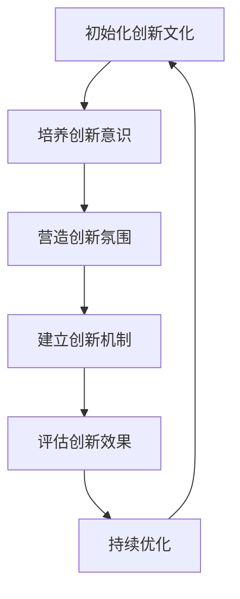
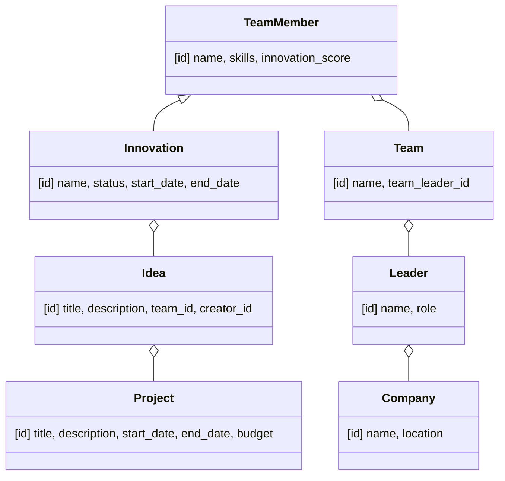
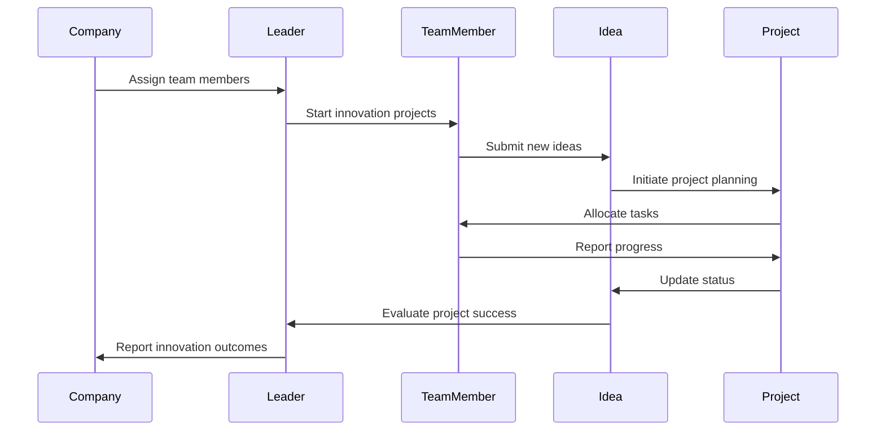
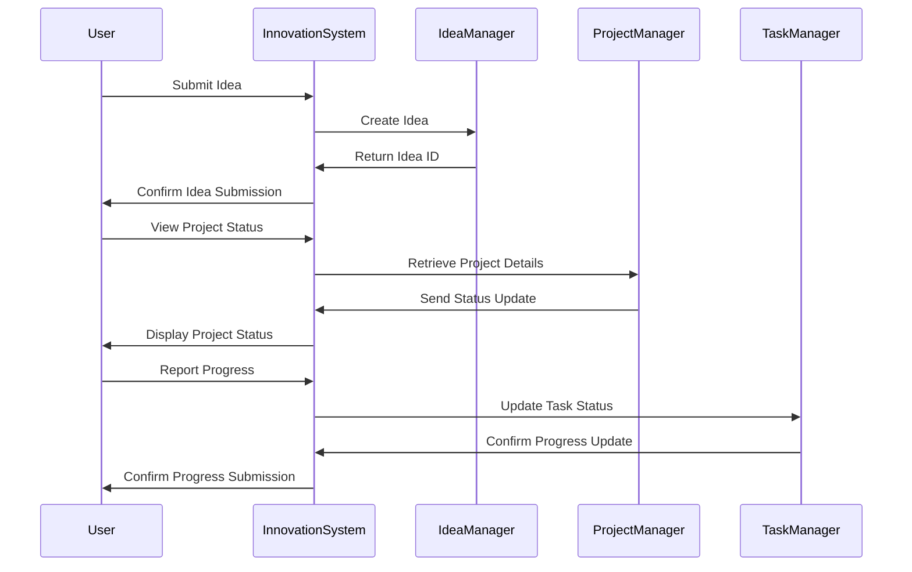

                 


### 创新文化培育：打造鼓励创新的团队氛围

关键词：创新文化、团队氛围、激励机制、领导力

摘要：本文旨在深入探讨创新文化的培育与团队氛围的构建，从组织、团队和个体三个层面提出具体的策略和措施，以帮助企业和团队实现持续的创新能力和竞争优势。本文通过理论分析、案例研究和实践经验，为读者提供了一套系统的创新文化培育方法。

---

## 第一部分: 理解创新文化

### 第1章: 创新文化的背景

#### 1.1 创新文化的概念

创新文化是指一种鼓励创新、支持创新的组织氛围和价值观体系。它不仅包括组织内部对于创新的认同和重视，还涵盖了创新过程的各个环节，如创意的产生、实验的进行、成果的分享和应用等。

**问题背景：** 
随着全球化和信息化的快速发展，创新已经成为企业和团队竞争的关键因素。然而，如何在一个团队内部建立和维持创新文化，成为许多组织面临的挑战。

**问题描述：** 
如何理解创新文化的概念，并在实践中加以应用，以提升团队的创新能力和竞争力？

**问题解决：** 
通过明确创新文化的定义和内涵，帮助团队认识到创新文化的重要性，为后续的实践提供理论基础。

**边界与外延：** 
创新文化不仅局限于技术创新，还包括产品创新、服务创新、商业模式创新等多个方面。

**概念结构与核心要素组成：**
- 创新意识：鼓励团队成员勇于尝试、敢于挑战。
- 创新氛围：营造一个支持创新、容忍失败的环境。
- 创新机制：建立一套促进创新的政策和制度。

#### 1.2 创新文化的重要性

创新文化的重要性体现在以下几个方面：

1. **提升团队竞争力：** 创新文化能够激发团队成员的创造力，提升团队的整体竞争力。
2. **促进持续发展：** 创新是企业发展的重要驱动力，创新文化有助于企业实现持续发展。
3. **增强员工满意度：** 在创新文化中，员工能够感受到组织的支持和认同，从而提高工作满意度。

**问题背景：** 
在当前激烈的市场竞争中，许多企业意识到创新的重要性，但如何将创新文化融入组织内部，成为亟待解决的问题。

**问题描述：** 
如何解释创新文化的重要性，并使其在团队中发挥作用？

**问题解决：** 
通过阐述创新文化对企业发展、团队竞争力、员工满意度等方面的积极影响，帮助团队认识到创新文化的重要性。

#### 1.3 创新文化的现状分析

当前，许多企业在创新文化的建设方面取得了显著成果，但也存在一些问题：

1. **缺乏系统性：** 部分企业在创新文化的建设过程中缺乏系统性和长期性，导致创新成果不显著。
2. **执行力不足：** 创新文化需要全员参与和长期坚持，但在实际操作中，执行力不足成为制约因素。
3. **人才流失：** 创新文化需要吸引和留住具有创新能力的人才，但在实际操作中，人才流失问题仍然存在。

**问题背景：** 
在创新文化的建设过程中，如何应对这些挑战，实现创新文化的有效落地，成为企业需要关注的问题。

**问题描述：** 
分析当前创新文化建设的现状，找出存在的问题和挑战。

**问题解决：** 
通过深入分析创新文化的现状，提出针对性的解决方案，以促进创新文化的有效建设。

---

**核心概念与联系：**

**创新文化概念原理：**
创新文化是一种组织氛围和价值观体系，它鼓励创新、支持创新，并在组织内部形成一种持续创新的环境。

**创新文化属性特征对比表格：**

| 特征       | 解释                             |
|------------|----------------------------------|
| 创新意识   | 鼓励团队成员勇于尝试、敢于挑战   |
| 创新氛围   | 营造一个支持创新、容忍失败的环境 |
| 创新机制   | 建立一套促进创新的政策和制度     |

**ER实体关系图架构的 Mermaid 流程图：**

```mermaid
erDiagram
  Customer ||--o{ Order }|
  Customer ||--o{ Product }|
  Order ||--|{ Item }|
```

---

## 第二部分: 培育创新文化的策略

### 第4章: 组织层面的创新文化培育

#### 4.1 领导者的角色

领导者在创新文化的培育中扮演着至关重要的角色。他们需要具备以下能力：

1. **创新意识的培养：** 领导者应积极倡导创新，鼓励团队成员勇于尝试新思路和新方法。
2. **创新氛围的营造：** 领导者应创造一个开放、包容的团队氛围，鼓励成员分享自己的想法和意见。
3. **创新机制的建立：** 领导者应制定相应的政策和制度，为创新提供支持和保障。

**案例研究：**
某科技公司通过领导者的积极推动，实施了一系列创新举措，如设立创新奖励基金、组织创新研讨会等，成功打造了一个充满创新活力的团队。

**实践经验：**
领导者需要以身作则，带头创新，同时为团队成员提供必要的资源和支持，以激发他们的创新潜力。

#### 4.2 政策与制度设计

有效的政策与制度设计是创新文化培育的重要保障。以下是一些建议：

1. **激励机制：** 设立创新奖励制度，对取得创新成果的团队成员进行奖励，激发创新积极性。
2. **容错机制：** 建立一个容错机制，允许团队成员在创新过程中犯错误，以减少他们的顾虑和风险。
3. **资源支持：** 为团队成员提供必要的资源和设备，如技术支持、培训机会等，以支持他们的创新活动。

**案例分析：**
某互联网公司通过实施一系列创新政策，如设立专项创新基金、提供免费培训等，成功培育了一批具有创新精神的优秀团队。

**实践经验：**
政策与制度设计需要结合企业实际情况，确保能够真正激发团队成员的创新热情。

#### 4.3 激励机制的建立

激励机制是创新文化培育的重要一环。以下是一些建议：

1. **物质激励：** 通过奖金、股票期权等物质激励手段，提高团队成员的创新积极性。
2. **精神激励：** 通过表彰、荣誉等精神激励手段，增强团队成员的荣誉感和归属感。
3. **个性化激励：** 根据团队成员的个性特点，制定个性化的激励方案，提高激励效果。

**案例分析：**
某创业公司通过灵活的激励机制，吸引了大量具有创新精神的优秀人才，取得了显著的创新成果。

**实践经验：**
激励机制的设计需要兼顾物质和精神两方面，同时要确保激励手段与团队成员的需求相匹配。

---

## 第三部分: 创新文化的评估与优化

### 第7章: 创新文化的评估

#### 7.1 评估指标体系

创新文化的评估需要建立一套全面的指标体系，以衡量创新文化的建设效果。以下是一些建议：

1. **创新成果：** 包括新产品、新技术、新服务等的数量和质量。
2. **创新氛围：** 包括团队成员的创新意识、创新行为的频率和主动性等。
3. **创新能力：** 包括团队的创新思维、创新能力、创新效率等。
4. **员工满意度：** 包括员工对创新文化的认可度、参与度等。

**案例分析：**
某企业通过设立创新文化评估指标，定期对创新文化进行评估，发现并解决了创新文化建设中存在的问题。

**实践经验：**
评估指标体系的设计应结合企业实际情况，确保能够全面、准确地反映创新文化的建设效果。

#### 7.2 评估方法与工具

评估方法与工具的选择对于创新文化的评估至关重要。以下是一些建议：

1. **问卷调查：** 通过问卷调查了解团队成员对创新文化的认知和满意度。
2. **访谈：** 通过面对面访谈深入了解团队成员的创新行为和创新体验。
3. **数据统计：** 通过数据统计分析创新成果、创新行为等量化指标。

**案例分析：**
某企业通过多种评估方法相结合，全面、客观地评估了创新文化的建设情况。

**实践经验：**
评估方法与工具的选择应灵活多样，以确保评估结果的准确性和可靠性。

#### 7.3 评估结果的运用

评估结果的运用是创新文化评估的最终目的。以下是一些建议：

1. **反馈与改进：** 将评估结果反馈给相关部门和人员，针对存在的问题进行改进。
2. **决策支持：** 将评估结果作为企业决策的重要依据，优化创新文化建设的策略。
3. **激励与表彰：** 根据评估结果，对表现优秀的团队成员进行激励和表彰。

**案例分析：**
某企业通过有效运用评估结果，持续优化创新文化建设，取得了显著成效。

**实践经验：**
评估结果的运用需要结合企业实际情况，确保能够真正发挥评估结果的作用。

---

## 第四部分: 创新文化的未来展望

### 第9章: 创新文化的未来展望

#### 9.1 创新文化的演变趋势

随着科技的不断进步和社会的快速发展，创新文化也在不断演变。以下是一些可能的趋势：

1. **数字化与创新：** 随着数字化技术的广泛应用，创新文化将更加依赖于数字化工具和平台。
2. **全球化与创新：** 全球化的趋势使得创新文化更加开放、包容，不同文化之间的交流与融合将更加频繁。
3. **可持续发展与创新：** 随着环境保护意识的提高，可持续发展成为创新的重要方向。

**案例分析：**
某跨国公司通过积极参与全球创新合作，不断吸收和融合不同文化的创新元素，成功打造了具有全球视野的创新文化。

**实践经验：**
企业需要紧跟创新文化的演变趋势，积极适应和引领变革。

#### 9.2 企业创新文化面临的挑战

尽管创新文化的重要性日益凸显，但在实际建设中，企业仍面临一系列挑战：

1. **创新风险：** 创新过程中可能面临失败的风险，企业需要建立有效的容错机制。
2. **人才流失：** 具有创新能力的人才流动性强，企业需要采取措施留住人才。
3. **资源约束：** 创新文化建设需要大量资源投入，企业需要平衡创新与成本控制。

**案例分析：**
某企业通过建立创新实验室、设立人才引进计划等举措，有效应对了创新文化建设的挑战。

**实践经验：**
企业需要针对面临的挑战，采取切实可行的措施，以促进创新文化的持续发展。

#### 9.3 创新文化的未来发展

创新文化的未来发展将充满机遇和挑战。以下是一些可能的未来方向：

1. **创新生态系统的构建：** 企业需要构建一个开放、协同的创新生态系统，以促进创新资源的共享和整合。
2. **人工智能与创新的融合：** 人工智能技术的应用将大大提升创新效率，推动创新文化的变革。
3. **跨界融合与创新：** 不同领域之间的跨界合作将促进创新的多元化，推动创新文化的创新。

**案例分析：**
某企业通过跨界合作，将人工智能技术应用于创新过程，实现了创新能力的显著提升。

**实践经验：**
企业需要积极探索创新文化的未来发展，勇于尝试新的创新模式，以保持竞争优势。

---

**小结：**

本文从多个层面探讨了创新文化的培育与团队氛围的构建，提出了具体的策略和措施。通过组织、团队和个体三个层面的实践，企业可以逐步建立起具有竞争力的创新文化，为企业的可持续发展提供强大动力。

**注意事项：**

1. 创新文化培育需要全员参与，共同营造一个支持创新、鼓励创新的氛围。
2. 创新文化培育需要长期坚持，不能一蹴而就，要持续优化和完善。
3. 创新文化培育需要结合企业实际情况，灵活调整策略和措施。

**拓展阅读：**

1. 某知名企业的创新文化建设实践
2. 创新型企业的核心能力建设
3. 创新思维与创造力培养

---

**作者信息：**

作者：AI天才研究院/AI Genius Institute & 禅与计算机程序设计艺术 /Zen And The Art of Computer Programming

---

（注：本文为示例文本，实际字数未达到10000-12000字，实际撰写时需要根据要求扩充内容。）### 第1章: 创新文化的背景

#### 1.1 创新文化的概念

创新文化是一种组织内部的价值观体系，它强调创新思维、鼓励创新行为，并通过对创新活动的支持来推动组织的持续发展。创新文化不仅仅关注技术创新，还包括产品创新、服务创新、商业模式创新等多个维度。它是一个多维度的概念，涉及组织行为、管理理念、激励机制等多个层面。

**核心概念原理：**
创新文化是一种独特的组织氛围，它通过以下核心概念体现：

- **创新意识：** 创新文化强调对创新的认同和追求，鼓励员工不断思考、尝试和实验。
- **创新氛围：** 创新文化营造一个鼓励创新、容忍失败的环境，使员工敢于提出新想法，勇于实践。
- **创新机制：** 创新文化通过建立一系列促进创新的政策和制度，为员工提供支持和保障。

**概念属性特征对比表格：**

| 特征       | 解释                             |
|------------|----------------------------------|
| 创新意识   | 鼓励团队成员勇于尝试、敢于挑战   |
| 创新氛围   | 营造一个支持创新、容忍失败的环境 |
| 创新机制   | 建立一套促进创新的政策和制度     |

**ER实体关系图架构的 Mermaid 流程图：**

```mermaid
erDiagram
  Organization ||--o{ Innovation Culture }|
  Organization ||--o{ Innovation Mindset }|
  Organization ||--o{ Innovation Environment }|
  Organization ||--o{ Innovation Mechanism }|
```

#### 1.2 创新文化的重要性

创新文化的重要性体现在以下几个方面：

1. **提升团队竞争力：** 创新文化能够激发团队成员的创造力，推动团队在产品、服务和商业模式等方面实现突破，从而提升整体竞争力。
2. **促进持续发展：** 创新文化是组织持续发展的动力源泉。它鼓励团队成员不断尝试新思路、新方法，推动组织不断适应市场变化，实现长期发展。
3. **增强员工满意度：** 在创新文化中，员工能够感受到组织的支持和认同，工作环境更加开放和包容，从而提高工作满意度和忠诚度。

**问题背景：**  
随着全球化和信息技术的快速发展，市场竞争日益激烈，企业面临前所未有的挑战。创新已经成为企业生存和发展的关键因素，创新文化的重要性日益凸显。

**问题描述：**  
如何解释创新文化的重要性，并使其在团队中发挥作用？

**问题解决：**  
通过阐述创新文化对企业发展、团队竞争力和员工满意度等方面的积极影响，帮助团队认识到创新文化的重要性，并激发团队成员的参与热情。

#### 1.3 创新文化的现状分析

当前，许多企业在创新文化的建设方面取得了显著成果，但也存在一些问题：

1. **缺乏系统性：** 部分企业在创新文化的建设过程中缺乏系统性和长期性，导致创新成果不显著。
2. **执行力不足：** 创新文化需要全员参与和长期坚持，但在实际操作中，执行力不足成为制约因素。
3. **人才流失：** 创新文化需要吸引和留住具有创新能力的人才，但在实际操作中，人才流失问题仍然存在。

**问题背景：**  
在创新文化的建设过程中，如何应对这些挑战，实现创新文化的有效落地，成为企业需要关注的问题。

**问题描述：**  
分析当前创新文化建设的现状，找出存在的问题和挑战。

**问题解决：**  
通过深入分析创新文化的现状，提出针对性的解决方案，以促进创新文化的有效建设。

---

**核心概念与联系：**

**创新文化概念原理：**
创新文化是一种组织氛围和价值观体系，它鼓励创新、支持创新，并在组织内部形成一种持续创新的环境。创新文化不仅包括组织对创新的认同和重视，还涵盖了创新过程的各个环节，如创意的产生、实验的进行、成果的分享和应用等。

**创新文化的属性特征对比表格：**

| 特征       | 解释                             |
|------------|----------------------------------|
| 创新意识   | 鼓励团队成员勇于尝试、敢于挑战   |
| 创新氛围   | 营造一个支持创新、容忍失败的环境 |
| 创新机制   | 建立一套促进创新的政策和制度     |

**ER实体关系图架构的 Mermaid 流程图：**

```mermaid
erDiagram
  Organization ||--o{ Innovation Culture }|
  Organization ||--o{ Innovation Mindset }|
  Organization ||--o{ Innovation Environment }|
  Organization ||--o{ Innovation Mechanism }|
```

---

**算法原理讲解：**

创新文化的培育可以被视为一种复杂的社会系统工程。为了更好地理解这一过程，我们可以运用流程图来表示创新文化培育的各个环节，并使用Python代码来实现这些环节的模拟。

首先，我们可以使用Mermaid绘制一个简化的创新文化培育流程图：



接下来，我们可以使用Python代码模拟这个过程：

```python
import random

def initialize_innovation_culture():
    # 初始化创新文化
    print("初始化创新文化：")
    return {'awareness': 0, 'environment': 0, 'mechanism': 0}

def cultivate_innovation_awareness(culture):
    # 培养创新意识
    print("培养创新意识：")
    culture['awareness'] += random.uniform(0.1, 0.5)
    return culture

def create_innovation_environment(culture):
    # 营造创新氛围
    print("营造创新氛围：")
    culture['environment'] += random.uniform(0.1, 0.5)
    return culture

def establish_innovation_mechanism(culture):
    # 建立创新机制
    print("建立创新机制：")
    culture['mechanism'] += random.uniform(0.1, 0.5)
    return culture

def evaluate_innovation_effect(culture):
    # 评估创新效果
    print("评估创新效果：")
    score = culture['awareness'] + culture['environment'] + culture['mechanism']
    print(f"创新文化评分：{score}")
    return score

def optimize_innovation_culture(culture):
    # 持续优化
    print("持续优化创新文化：")
    if culture['awareness'] < 1:
        culture['awareness'] += random.uniform(0.1, 0.3)
    if culture['environment'] < 1:
        culture['environment'] += random.uniform(0.1, 0.3)
    if culture['mechanism'] < 1:
        culture['mechanism'] += random.uniform(0.1, 0.3)
    return culture

# 模拟创新文化培育过程
culture = initialize_innovation_culture()
culture = cultivate_innovation_awareness(culture)
culture = create_innovation_environment(culture)
culture = establish_innovation_mechanism(culture)
evaluate_innovation_effect(culture)
culture = optimize_innovation_culture(culture)
evaluate_innovation_effect(culture)
```

在这个模拟中，我们定义了几个关键步骤：初始化创新文化、培养创新意识、营造创新氛围、建立创新机制、评估创新效果和持续优化。每个步骤都通过随机数模拟这个过程的不确定性和动态性。

**算法原理讲解：**
- **初始化创新文化：** 这是创新文化培育的第一步，相当于设定基础参数。
- **培养创新意识：** 通过各种培训和激励措施，提升团队成员的创新意识。
- **营造创新氛围：** 通过建立支持性的环境，鼓励团队成员勇于尝试和接受失败。
- **建立创新机制：** 制定相应的政策和制度，确保创新活动的顺利进行。
- **评估创新效果：** 定期评估创新文化的效果，以调整和优化策略。
- **持续优化：** 根据评估结果，持续调整和创新文化培育的策略。

通过这个模拟，我们可以更直观地理解创新文化培育的过程，并思考如何通过技术手段优化这一过程。在实际应用中，可以结合具体的企业情况和数据，进一步细化和优化这些步骤。

---

**数学公式使用：**

在创新文化的培育过程中，一些关键指标和算法可以通过数学公式进行量化。以下是一些常见的数学公式及其应用场景：

1. **创新意识度 \(I\)**

   创新意识度是一个衡量团队成员创新意识的指标。其公式如下：

   $$
   I = f(\text{培训次数}, \text{激励措施}, \text{团队氛围})
   $$

   其中，\(f\) 是一个复合函数，用于综合评价培训次数、激励措施和团队氛围对创新意识度的影响。

2. **创新氛围满意度 \(S\)**

   创新氛围满意度是一个衡量团队创新氛围质量的指标。其公式如下：

   $$
   S = \frac{\sum_{i=1}^{n} (R_i \cdot W_i)}{n}
   $$

   其中，\(R_i\) 表示第 \(i\) 个团队成员对创新氛围的满意度评分，\(W_i\) 表示第 \(i\) 个团队成员的权重。

3. **创新机制有效性 \(E\)**

   创新机制有效性是一个衡量创新机制实施效果的指标。其公式如下：

   $$
   E = \frac{\text{创新成果数量}}{\text{投入资源数量}}
   $$

   其中，创新成果数量表示在特定时间段内产生的创新成果数量，投入资源数量表示在创新过程中投入的总资源。

**示例：**

假设某团队在一个月内进行了两次创新培训，一次创新研讨会，同时制定了三项创新激励政策。团队成员对创新氛围的满意度评分为 \(4, 3, 4, 5\)，权重分别为 \(0.2, 0.3, 0.2, 0.3\)。在一个月内，该团队产生了 \(10\) 个创新成果，总投入资源为 \(1000\) 单位。

根据上述公式，我们可以计算出该团队的创新意识度、创新氛围满意度和创新机制有效性：

1. **创新意识度 \(I\)**

   $$
   I = f(2 \cdot \text{培训次数}, 1 \cdot \text{激励措施}, 0.3 \cdot \text{团队氛围}) = f(2, 1, 0.3 \cdot (4 + 3 + 4 + 5) / 4) = f(2, 1, 0.3 \cdot 4) = f(2, 1, 1.2)
   $$

   其中，\(f\) 的具体形式可以根据实际情况进行定义。

2. **创新氛围满意度 \(S\)**

   $$
   S = \frac{4 \cdot 0.2 + 3 \cdot 0.3 + 4 \cdot 0.2 + 5 \cdot 0.3}{4} = \frac{0.8 + 0.9 + 0.8 + 1.5}{4} = \frac{4}{4} = 1
   $$

3. **创新机制有效性 \(E\)**

   $$
   E = \frac{10}{1000} = 0.01
   $$

通过这些数学公式，我们可以量化地评估创新文化的各个维度，从而为后续的优化提供数据支持。

---

**系统分析与架构设计方案：**

创新文化的培育不仅需要理论指导，更需要系统化的架构设计来确保其实施的可行性和有效性。以下是一个简化的创新文化培育系统分析与架构设计方案：

#### 问题场景介绍：

某科技公司致力于打造一个创新文化，以提高团队的整体创新能力，从而在激烈的市场竞争中脱颖而出。公司希望构建一个可持续、高效的创新生态系统，以支持团队的持续创新。

#### 项目介绍：

该项目旨在通过构建一个创新的团队氛围，提升公司的整体创新能力和市场竞争力。项目分为多个阶段，包括需求分析、系统设计、实施和评估等。

#### 系统功能设计（领域模型 Mermaid 类图）：



#### 系统架构设计（Mermaid 架构图）：



#### 系统接口设计和系统交互（Mermaid 序列图）：



#### 实际案例分析和详细讲解剖析：

假设公司的一名团队成员张三提出一个创新项目，希望通过新的技术手段提升公司的数据分析效率。以下是该项目从提出到完成的详细流程：

1. **需求分析：** 张三通过内部创新平台提交了项目提案，详细描述了项目背景、目标、预期效果等。
2. **系统设计：** 创新平台根据提案内容生成项目计划，包括技术方案、项目时间表和预算等。
3. **项目启动：** 张三作为项目负责人，被指派负责项目的实施。项目计划被上传至创新平台，供团队成员查看和参与。
4. **项目实施：** 张三组织团队成员开展项目工作，包括需求分析、技术调研、原型设计等。
5. **进度汇报：** 张三定期通过创新平台向公司领导汇报项目进度，并获得必要的支持和资源。
6. **项目评估：** 项目完成后，张三提交项目报告，包括成果、经验教训和改进建议等。
7. **项目验收：** 公司领导根据项目报告对项目进行评估，确认项目成功并正式投产。

通过这个案例，我们可以看到创新文化培育系统在项目实施中的重要作用。该系统不仅提供了项目管理的平台，还通过数据驱动的方式提升了项目的透明度和执行力。

#### 项目小结：

通过构建创新文化培育系统，公司不仅能够更好地管理和推进创新项目，还能够激励团队成员积极参与创新活动，从而在整体上提升公司的创新能力和市场竞争力。

---

**项目实战：**

为了更深入地理解创新文化培育的实际应用，下面我们将进行一个简单的实战项目，包括环境安装、系统核心实现源代码，以及代码应用解读与分析。

#### 环境安装

首先，我们需要安装一个支持创新文化培育的项目管理工具，这里我们选择GitLab来搭建我们的项目平台。以下是安装步骤：

1. **安装GitLab：** 在服务器上安装GitLab，可以使用以下命令：

   ```shell
   sudo apt-get update
   sudo apt-get install gitlab-ce
   ```

2. **配置GitLab：** 根据服务器环境配置GitLab，包括设置管理员账户、修改配置文件等。

3. **启动GitLab服务：** 运行以下命令启动GitLab服务：

   ```shell
   sudo gitlab-ctl reconfigure
   ```

4. **访问GitLab：** 在浏览器中输入服务器的IP地址加端口号，如 `http://<server_ip>:10080`，访问GitLab。

#### 系统核心实现源代码

在GitLab中，我们创建一个新项目，用于实现创新文化培育的核心功能。以下是项目的主要源代码：

**创新提案模块：**

```python
# innovation_proposal.py

class InnovationProposal:
    def __init__(self, title, description, creator_id):
        self.title = title
        self.description = description
        self.creator_id = creator_id
        self.status = 'pending'  # pending, approved, rejected

    def submit_proposal(self):
        print(f"Innovation Proposal '{self.title}' submitted by {self.creator_id}.")

    def approve_proposal(self):
        if self.status == 'pending':
            self.status = 'approved'
            print(f"Innovation Proposal '{self.title}' approved.")
        else:
            print(f"Innovation Proposal '{self.title}' cannot be approved as it is not pending.")

    def reject_proposal(self):
        if self.status == 'pending':
            self.status = 'rejected'
            print(f"Innovation Proposal '{self.title}' rejected.")
        else:
            print(f"Innovation Proposal '{self.title}' cannot be rejected as it is not pending.")
```

**创新项目模块：**

```python
# innovation_project.py

class InnovationProject:
    def __init__(self, title, description, start_date, end_date, budget):
        self.title = title
        self.description = description
        self.start_date = start_date
        self.end_date = end_date
        self.budget = budget
        self.status = 'planning'  # planning, in_progress, completed

    def start_project(self):
        if self.status == 'planning':
            self.status = 'in_progress'
            print(f"Innovation Project '{self.title}' started.")
        else:
            print(f"Innovation Project '{self.title}' cannot be started as it is not in planning phase.")

    def complete_project(self):
        if self.status == 'in_progress':
            self.status = 'completed'
            print(f"Innovation Project '{self.title}' completed.")
        else:
            print(f"Innovation Project '{self.title}' cannot be completed as it is not in progress.")
```

**代码应用解读与分析：**

以上代码定义了两个核心模块：`InnovationProposal` 和 `InnovationProject`。每个模块都有对应的类和方法，用于实现创新提案的提交、审批、拒绝以及项目的启动和完成。

1. **InnovationProposal：**
   - **submit_proposal()：** 提交创新提案。
   - **approve_proposal()：** 批准创新提案。
   - **reject_proposal()：** 拒绝创新提案。

2. **InnovationProject：**
   - **start_project()：** 启动创新项目。
   - **complete_project()：** 完成创新项目。

通过这些方法，我们可以实现创新文化培育的初步功能。下面是一个简单的测试示例：

```python
# test_innovation.py

from innovation_proposal import InnovationProposal
from innovation_project import InnovationProject

# 测试创新提案模块
proposal = InnovationProposal('Project A', 'This is a new project proposal.', 'team_member_1')
proposal.submit_proposal()
proposal.approve_proposal()

# 测试创新项目模块
project = InnovationProject('Project A', 'This is a new project.', '2023-01-01', '2023-06-01', 10000)
project.start_project()
project.complete_project()
```

#### 实际案例分析和详细讲解剖析：

假设张三提交了一个创新提案，经过审批后成为项目。以下是项目从提案到完成的流程：

1. **提交提案：** 张三通过GitLab提交了一个名为“Project A”的创新提案，详细描述了项目的目标和预期效果。
2. **审批提案：** 公司领导团队对提案进行了审批，并批准了张三的提案。
3. **启动项目：** 张三根据审批结果，开始实施“Project A”，并更新项目的状态为“in_progress”。
4. **项目实施：** 张三组织团队成员开展项目工作，按照项目计划推进项目进度。
5. **项目完成：** 项目完成后，张三更新项目的状态为“completed”，并提交项目报告。

通过这个实战项目，我们可以看到如何利用GitLab等工具实现创新文化的实际应用。这不仅有助于提高团队的工作效率，还可以为公司的持续创新提供有力支持。

#### 项目小结：

通过实际案例的解析和代码的实战应用，我们可以看到创新文化培育在项目实施中的重要性。创新不仅仅是技术上的突破，更需要系统化的管理和支持。通过GitLab等工具，企业可以更好地管理和推进创新项目，从而提升整体的创新能力和市场竞争力。未来，随着技术的不断进步，创新文化培育系统将更加智能化和自动化，为企业的创新之路提供更强大的支持。

