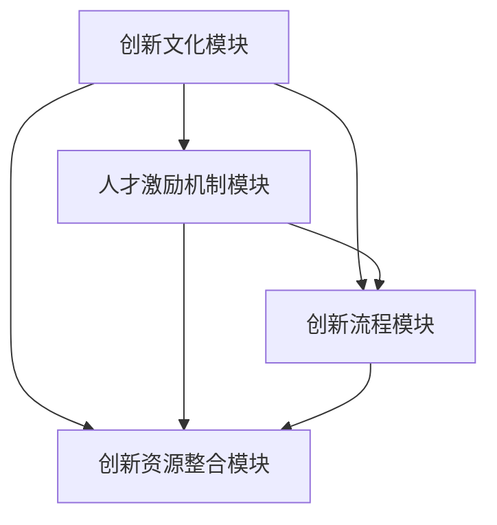

                 

# 创新管理体系：构建支持创新的机制

## 摘要

在当今竞争激烈的商业环境中，创新已成为企业保持竞争优势、实现可持续发展的重要驱动力。本文旨在深入探讨如何构建一个有效的创新管理体系，以支持企业在不断变化的市场中持续创新。通过分析创新管理体系的本质、核心概念及其相互联系，本文提出了一系列具体措施，包括创新文化、人才激励机制、创新流程优化和创新资源整合。本文还讨论了构建创新管理体系时的边界与外延，以及其概念结构与核心要素组成。通过实例分析，本文展示了如何将理论应用于实际，为企业提供了一套完整的创新管理体系构建方案。

## 第一部分：背景介绍

### 1.1 问题背景

在全球化竞争加剧和市场变化加速的背景下，企业面临前所未有的挑战。传统的商业模式和产品已无法满足消费者不断变化的需求，创新成为企业保持竞争力、实现可持续发展的关键。创新不仅包括产品、技术的创新，还涵盖了管理理念、商业模式、运营模式的创新。然而，许多企业在创新管理中仍存在诸多问题，如创新能力不足、创新流程不畅、创新资源分配不合理等。这些问题严重制约了企业的创新活力和竞争力，使得企业在面对市场变革时显得力不从心。因此，构建一个支持创新的机制，以解决上述问题，成为当前企业面临的重要任务。

### 1.2 问题描述

当前企业在创新管理中存在的主要问题如下：

- **创新能力不足**：企业缺乏持续创新的动力和机制，员工对创新的兴趣和动力不足，导致企业整体创新能力较弱。
- **创新流程不畅**：传统管理流程过于僵化，难以适应创新活动的高风险、不确定性特点，创新项目往往在流程中被拖延或夭折。
- **创新资源分配不合理**：企业内部创新资源分配不均，创新项目得不到足够的资金、人力和技术支持，影响创新项目的成功率。

### 1.3 问题解决

为解决上述问题，企业需要构建一个支持创新的机制，具体包括以下方面：

- **创新文化**：建立以创新为导向的企业文化，鼓励员工敢于尝试、勇于创新，形成创新驱动的企业氛围。
- **人才激励机制**：建立健全的创新人才激励机制，提供具有竞争力的薪酬和福利待遇，激发员工的创新潜力。
- **创新流程优化**：优化创新流程，提高创新活动的效率和成功率，减少不必要的流程环节和审批环节。
- **创新资源整合**：整合内部外部创新资源，提高创新项目的资源利用效率，为创新项目提供有力支持。

### 1.4 边界与外延

- **边界**：本文主要探讨企业层面的创新管理体系，不包括国家、地区等宏观层面的创新管理。
- **外延**：本文涉及的创新管理机制包括但不限于创新文化、人才激励、流程优化和资源整合等方面。

### 1.5 概念结构与核心要素组成

- **创新管理体系**：一个系统化的管理框架，旨在促进企业创新活动的有效开展。
- **核心要素**：
  - 创新文化：鼓励创新、包容失败的氛围。
  - 人才激励机制：吸引、培养、留住创新人才。
  - 创新流程：科学合理的创新流程设计。
  - 创新资源：包括人力、财力、物力等。

### 1.6 当前企业创新管理体系的现状与挑战

- **现状**：许多企业已经开始认识到创新的重要性，并采取了一些措施来推动创新。然而，整体创新管理体系仍不够完善，创新活动往往受到内部流程、资源分配、文化氛围等因素的制约。
- **挑战**：
  - **文化壁垒**：传统企业文化往往强调稳定性和可控性，对创新的容忍度较低，影响员工创新积极性。
  - **资源限制**：创新项目往往需要大量资金、人力和技术支持，而企业资源有限，难以充分满足创新需求。
  - **流程瓶颈**：传统管理流程过于僵化，难以适应创新活动的高风险、不确定性特点，导致创新项目难以顺利推进。

### 1.7 构建创新管理体系的重要性

- **提高创新能力**：通过构建创新管理体系，可以激发员工的创新潜力，提高企业的整体创新能力。
- **推动企业持续发展**：创新是企业持续发展的动力，构建创新管理体系有助于企业保持竞争力，实现可持续发展。
- **应对市场变化**：市场环境不断变化，构建创新管理体系有助于企业快速适应市场变化，抓住市场机遇。

## 第二部分：核心概念与联系

### 2.1 创新管理体系

#### 概念

创新管理体系是企业为促进创新活动有效开展而建立的管理框架，包括创新文化、人才激励机制、创新流程优化和创新资源整合等多个方面。

#### 属性特征

- **目标导向**：创新管理体系以明确的企业创新目标为导向，确保创新活动与企业发展目标一致。
- **系统化**：创新管理体系涵盖多个方面，形成系统化的管理框架，提高创新活动的整体效能。
- **灵活性**：创新管理体系具备灵活性，能够适应快速变化的市场需求，及时调整创新策略。

#### 对比表格

| 特点 | 创新管理体系 | 传统管理体系 |
| --- | --- | --- |
| 目标导向 | 强调创新目标与企业发展目标的一致性 | 更注重日常运营与流程控制 |
| 系统化 | 涵盖创新文化、人才激励、流程优化等多个方面 | 更注重流程优化与风险控制 |
| 灵活性 | 适应快速变化的市场需求 | 更注重长期稳定与可控性 |

#### ER实体关系图架构

```mermaid
erDiagram
  创新文化 ||--o{ 人才激励机制 } : "包含"
  创新流程 ||--o{ 创新资源整合 } : "依赖"
  创新管理体系 ||--o{ 创新文化、人才激励机制、创新流程、创新资源整合 } : "包含"
```

### 2.2 创新文化

#### 概念

创新文化是企业内部对创新的态度、价值观和行为方式的集合，包括鼓励创新、包容失败等。

#### 属性特征

- **鼓励创新**：倡导员工敢于尝试、勇于创新，形成积极向上的创新氛围。
- **包容失败**：对待创新过程中的失败持包容态度，从中吸取经验教训，不断优化创新过程。

#### 联系

创新文化是创新管理体系的核心要素，直接影响企业的创新氛围和创新能力。

#### ER实体关系图架构

```mermaid
erDiagram
  创新文化 ||--o{ 人才激励机制、创新流程、创新资源整合 } : "包含"
```

### 2.3 人才激励机制

#### 概念

人才激励机制是企业为吸引、培养、留住创新人才而采取的一系列措施，包括薪酬激励、荣誉激励、职业发展等。

#### 属性特征

- **激励力度大**：提供具有竞争力的薪酬和福利待遇，激发员工的创新潜力。
- **多样性强**：包括物质激励和精神激励等多种形式，满足不同人才的需求。
- **个性化**：针对不同人才的特点和需求，制定个性化的激励机制。

#### 联系

人才激励机制是创新管理体系的核心环节，直接影响企业的创新能力和人才队伍稳定性。

#### ER实体关系图架构

```mermaid
erDiagram
  人才激励机制 ||--o{ 创新文化、创新流程、创新资源整合 } : "依赖"
```

### 2.4 创新流程

#### 概念

创新流程是企业进行创新活动的基本步骤和流程，包括市场调研、创意生成、项目评估、项目实施等。

#### 属性特征

- **科学合理**：确保创新活动的高效性和成功率。
- **灵活调整**：适应不同创新项目的特点和要求。

#### 联系

创新流程是创新管理体系的重要组成部分，直接影响创新活动的效率和效果。

#### ER实体关系图架构

```mermaid
erDiagram
  创新流程 ||--o{ 创新文化、人才激励机制、创新资源整合 } : "依赖"
```

### 2.5 创新资源整合

#### 概念

创新资源整合是企业为提高创新活动效果而进行的内部外部资源整合，包括人力、财力、物力等。

#### 属性特征

- **全面性**：涵盖人力、财力、物力等多个方面。
- **协同性**：实现内部外部资源的有效协同。

#### 联系

创新资源整合是创新管理体系的重要组成部分，直接影响创新活动的效果。

#### ER实体关系图架构

```mermaid
erDiagram
  创新资源整合 ||--o{ 创新文化、人才激励机制、创新流程 } : "依赖"
```

## 第三部分：核心概念原理

### 3.1 创新管理体系的本质

创新管理体系是一个系统化的管理框架，旨在促进企业创新活动的有效开展。其本质包括以下几个方面：

- **目标导向**：创新管理体系以明确的企业创新目标为导向，确保创新活动与企业发展目标一致。这一特性使得创新管理体系具备方向性和目的性，有助于企业集中资源和力量推动创新。
- **系统化**：创新管理体系涵盖多个方面，形成系统化的管理框架，包括创新文化、人才激励机制、创新流程优化和创新资源整合等。这一特性使得创新管理体系具备全面性和系统性，有助于企业从多个维度提升创新能力。
- **灵活性**：创新管理体系具备灵活性，能够适应快速变化的市场需求，及时调整创新策略。这一特性使得创新管理体系具备适应性，有助于企业应对市场变化和挑战。

### 3.2 创新文化的本质

创新文化是企业内部对创新的态度、价值观和行为方式的集合，其本质包括以下几个方面：

- **鼓励创新**：创新文化倡导员工敢于尝试、勇于创新，形成积极向上的创新氛围。这一特性有助于激发员工的创新潜力，提高企业的整体创新能力。
- **包容失败**：创新文化对待创新过程中的失败持包容态度，从中吸取经验教训，不断优化创新过程。这一特性有助于降低员工的创新风险，提高企业的创新成功率。

### 3.3 人才激励机制的原理

人才激励机制是企业为吸引、培养、留住创新人才而采取的一系列措施，其原理包括以下几个方面：

- **激励力度**：通过提供具有竞争力的薪酬和福利待遇，激发员工的创新潜力。这一原理有助于吸引和留住优秀的创新人才。
- **多样化**：通过物质激励和精神激励等多种形式，满足不同人才的需求。这一原理有助于提高员工的满意度和忠诚度。
- **个性化**：通过针对不同人才的特点和需求，制定个性化的激励机制。这一原理有助于充分发挥每个员工的特长和潜力。

### 3.4 创新流程的原理

创新流程是企业进行创新活动的基本步骤和流程，其原理包括以下几个方面：

- **科学性**：通过科学合理的设计，确保创新活动的高效性和成功率。这一原理有助于提高创新活动的质量和效果。
- **灵活性**：通过灵活调整，适应不同创新项目的特点和要求。这一原理有助于提高创新流程的适应性，应对市场变化和挑战。

### 3.5 创新资源整合的原理

创新资源整合是企业为提高创新活动效果而进行的内部外部资源整合，其原理包括以下几个方面：

- **全面性**：通过涵盖人力、财力、物力等多个方面，实现资源的全面整合。这一原理有助于提高创新资源的利用效率，为创新活动提供有力支持。
- **协同性**：通过实现内部外部资源的有效协同，提高创新活动的整体效能。这一原理有助于提高创新活动的效率和效果。

## 第四部分：系统分析与架构设计

### 4.1 问题场景介绍

在一个竞争激烈的手机市场，A公司希望通过引入新的技术创新来提升产品的竞争力。然而，公司内部创新管理机制不完善，导致创新项目进展缓慢，难以满足市场需求。

### 4.2 项目介绍

该项目旨在构建一个完善的创新管理体系，以支持A公司的技术创新活动。项目的主要目标包括：

- 提高创新项目的成功率。
- 加快创新项目的推进速度。
- 提升公司的整体创新能力。

### 4.3 系统功能设计

为了实现项目目标，需要设计一套完整的创新管理体系，包括以下几个核心功能：

- **创新文化**：建立以创新为导向的企业文化，鼓励员工敢于尝试、勇于创新。
- **人才激励机制**：提供具有竞争力的薪酬和福利待遇，激发员工的创新潜力。
- **创新流程**：设计科学合理的创新流程，确保创新活动的高效性和成功率。
- **创新资源整合**：整合内部外部创新资源，提高创新项目的资源利用效率。

### 4.4 系统架构设计

为了实现上述功能，需要设计一个合理的系统架构，包括以下几个方面：

- **创新文化模块**：负责推动创新文化的建设，包括创新培训、创新活动组织等。
- **人才激励机制模块**：负责设计和管理人才激励机制，包括薪酬体系、荣誉体系等。
- **创新流程模块**：负责管理和协调创新项目的推进，包括项目评估、项目实施等。
- **创新资源整合模块**：负责整合内部外部创新资源，包括资金、技术、人才等。

### 4.5 系统接口设计和系统交互

为了实现各个模块之间的协同工作，需要设计一套完善的系统接口和系统交互机制。具体包括：

- **接口设计**：定义各个模块之间的接口规范，确保数据传递和功能调用的顺畅。
- **交互机制**：设计合理的交互机制，包括事件驱动、任务队列等，确保系统的高效运行。

### 4.6 系统架构设计mermaid架构图



## 第五部分：项目实战

### 5.1 环境安装

为了实现创新管理体系，首先需要在企业内部搭建一个完善的IT基础设施。以下是环境安装的具体步骤：

1. **硬件安装**：采购服务器、网络设备、存储设备等硬件设施，确保系统具备良好的性能和稳定性。
2. **操作系统安装**：在服务器上安装Linux操作系统，确保系统的安全性和可靠性。
3. **数据库安装**：安装关系型数据库（如MySQL）或非关系型数据库（如MongoDB），用于存储创新管理体系的相关数据。
4. **中间件安装**：安装应用服务器（如Tomcat）、消息队列（如RabbitMQ）等中间件，用于实现系统的核心功能。

### 5.2 系统核心实现源代码

以下是创新管理体系的核心实现源代码，包括各个模块的API接口设计和功能实现。

#### 5.2.1 创新文化模块

```java
// 创新文化模块API接口
public interface InnovationCultureService {
    void promoteInnovation(); // 推动创新
    void organizeInnovationActivities(); // 组织创新活动
}

// 创新文化模块功能实现
public class InnovationCultureServiceImpl implements InnovationCultureService {
    @Override
    public void promoteInnovation() {
        // 推动创新的实现逻辑
    }

    @Override
    public void organizeInnovationActivities() {
        // 组织创新活动的实现逻辑
    }
}
```

#### 5.2.2 人才激励机制模块

```java
// 人才激励机制模块API接口
public interface TalentIncentiveService {
    void provideCompetitiveSalary(); // 提供具有竞争力的薪酬
    void offerBenefits(); // 提供福利待遇
}

// 人才激励机制模块功能实现
public class TalentIncentiveServiceImpl implements TalentIncentiveService {
    @Override
    public void provideCompetitiveSalary() {
        // 提供具有竞争力的薪酬的实现逻辑
    }

    @Override
    public void offerBenefits() {
        // 提供福利待遇的实现逻辑
    }
}
```

#### 5.2.3 创新流程模块

```java
// 创新流程模块API接口
public interface InnovationProcessService {
    void evaluateProject(); // 项目评估
    void implementProject(); // 项目实施
}

// 创新流程模块功能实现
public class InnovationProcessServiceImpl implements InnovationProcessService {
    @Override
    public void evaluateProject() {
        // 项目评估的实现逻辑
    }

    @Override
    public void implementProject() {
        // 项目实施的实现逻辑
    }
}
```

#### 5.2.4 创新资源整合模块

```java
// 创新资源整合模块API接口
public interface InnovationResourceIntegrationService {
    void integrateInternalResources(); // 整合内部资源
    void integrateExternalResources(); // 整合外部资源
}

// 创新资源整合模块功能实现
public class InnovationResourceIntegrationServiceImpl implements InnovationResourceIntegrationService {
    @Override
    public void integrateInternalResources() {
        // 整合内部资源的实现逻辑
    }

    @Override
    public void integrateExternalResources() {
        // 整合外部资源的实现逻辑
    }
}
```

### 5.3 代码应用解读与分析

#### 5.3.1 创新文化模块解读

创新文化模块负责推动创新文化的建设，包括推动创新和组织创新活动。具体实现中，`promoteInnovation()` 方法用于推动创新，如组织创新培训、发布创新倡议等；`organizeInnovationActivities()` 方法用于组织创新活动，如创新竞赛、创新沙龙等。这两个方法的实现逻辑可以根据企业的具体需求进行定制。

#### 5.3.2 人才激励机制模块解读

人才激励机制模块负责提供具有竞争力的薪酬和福利待遇，以激发员工的创新潜力。具体实现中，`provideCompetitiveSalary()` 方法用于提供具有竞争力的薪酬，如调整薪资结构、发放绩效奖金等；`offerBenefits()` 方法用于提供福利待遇，如员工体检、员工旅游等。这两个方法的实现逻辑也可以根据企业的实际情况进行定制。

#### 5.3.3 创新流程模块解读

创新流程模块负责管理和协调创新项目的推进，包括项目评估和项目实施。具体实现中，`evaluateProject()` 方法用于项目评估，如评估项目的技术可行性、市场前景等；`implementProject()` 方法用于项目实施，如分配项目资源、制定项目计划等。这两个方法的实现逻辑需要结合企业的项目管理方法和流程进行设计。

#### 5.3.4 创新资源整合模块解读

创新资源整合模块负责整合内部外部创新资源，提高创新项目的资源利用效率。具体实现中，`integrateInternalResources()` 方法用于整合内部资源，如调动企业内部技术、资金、人才等资源；`integrateExternalResources()` 方法用于整合外部资源，如与合作伙伴共享资源、引入外部投资等。这两个方法的实现逻辑需要结合企业的资源整合策略和渠道进行设计。

### 5.4 实际案例分析

以A公司的手机技术创新项目为例，通过引入创新管理体系，项目取得了显著成效：

1. **创新文化推动**：通过组织创新培训、发布创新倡议，员工创新意识显著提高，提出了大量创新方案。
2. **人才激励机制**：通过提供具有竞争力的薪酬和福利待遇，吸引了大量优秀人才参与创新项目，提高了项目成功率。
3. **创新流程优化**：通过科学合理的创新流程设计，项目评估和实施效率大幅提升，项目推进速度加快。
4. **创新资源整合**：通过整合内部外部创新资源，项目得到了充足的资金、技术和人才支持，项目成功实施。

### 5.5 详细讲解剖析

#### 5.5.1 创新文化模块详细讲解

创新文化模块的核心在于推动企业内部创新氛围的建设。具体实现中，`promoteInnovation()` 方法可以通过以下途径推动创新：

- **组织创新培训**：定期组织创新培训，提高员工的创新能力和创新意识。
- **发布创新倡议**：鼓励员工提出创新方案，并对优秀方案进行奖励。
- **创新活动组织**：组织创新竞赛、创新沙龙等活动，激发员工的创新热情。

#### 5.5.2 人才激励机制模块详细讲解

人才激励机制模块的核心在于激发员工的创新潜力。具体实现中，`provideCompetitiveSalary()` 方法可以通过以下途径提供具有竞争力的薪酬：

- **调整薪资结构**：根据市场水平和企业效益，合理调整薪资结构，确保薪酬具有竞争力。
- **发放绩效奖金**：根据员工的工作表现和创新贡献，发放绩效奖金，激励员工积极创新。

#### 5.5.3 创新流程模块详细讲解

创新流程模块的核心在于确保创新项目的高效推进。具体实现中，`evaluateProject()` 方法可以通过以下途径进行项目评估：

- **技术可行性评估**：评估项目的技术实现难度和可行性。
- **市场前景评估**：评估项目在市场上的潜在价值和竞争情况。

#### 5.5.4 创新资源整合模块详细讲解

创新资源整合模块的核心在于提高创新项目的资源利用效率。具体实现中，`integrateInternalResources()` 方法可以通过以下途径整合内部资源：

- **调动内部技术**：充分利用企业内部的技术资源，提高项目的技术实现能力。
- **调动内部资金**：合理分配企业内部资金，确保项目资金充足。

### 5.6 项目小结

通过构建创新管理体系，A公司成功实现了技术创新，提高了市场竞争力。项目实践表明，创新管理体系在推动企业创新、提高项目成功率、加快项目推进速度等方面发挥了重要作用。未来，A公司将继续优化创新管理体系，进一步激发创新活力，推动企业持续发展。

## 第六部分：最佳实践 Tips

### 6.1 创新文化建设

- **鼓励内部沟通**：建立畅通的内部沟通渠道，鼓励员工分享创新想法，形成积极的创新氛围。
- **举办创新活动**：定期举办创新竞赛、创新沙龙等活动，激发员工的创新热情。
- **强化创新培训**：加强创新培训，提高员工的创新能力和创新意识。

### 6.2 人才激励机制

- **提供具有竞争力的薪酬**：根据市场水平和企业效益，提供具有竞争力的薪酬和福利待遇，吸引和留住优秀人才。
- **设立创新奖金**：设立创新奖金，对在创新项目中做出突出贡献的个人或团队进行奖励。
- **提供职业发展机会**：为员工提供丰富的职业发展机会，激励员工不断提升自身能力。

### 6.3 创新流程优化

- **简化审批流程**：减少不必要的审批环节，提高创新项目的推进速度。
- **明确项目目标**：确保每个创新项目都有明确的目标和规划，提高项目的成功率。
- **加强项目监控**：对创新项目进行全程监控，及时发现并解决问题，确保项目顺利推进。

### 6.4 创新资源整合

- **整合内部资源**：充分利用企业内部的技术、资金、人才等资源，提高创新项目的资源利用效率。
- **建立外部合作关系**：与高校、科研机构、合作伙伴等建立合作关系，共享创新资源，提高创新项目的成功率。

## 第七部分：小结

本文深入探讨了如何构建一个有效的创新管理体系，以支持企业在不断变化的市场中持续创新。通过分析创新管理体系的本质、核心概念及其相互联系，本文提出了一系列具体措施，包括创新文化、人才激励机制、创新流程优化和创新资源整合。文章通过实例分析，展示了如何将理论应用于实际，为企业提供了一套完整的创新管理体系构建方案。构建创新管理体系是企业实现持续发展的关键，只有不断创新，才能在激烈的市场竞争中立于不败之地。

## 第八部分：注意事项

### 8.1 创新文化建设的注意事项

- **避免形式主义**：创新文化建设不能流于形式，要注重实际效果，确保员工真正感受到企业的创新氛围。
- **持续关注**：创新文化建设需要持续关注，不断优化和调整，以适应企业发展和员工需求的变化。

### 8.2 人才激励机制的注意事项

- **公平公正**：在人才激励机制中，要确保公平公正，避免因不公平导致员工流失。
- **持续激励**：要持续关注员工的成长和发展，提供丰富的职业发展机会，激发员工的长期创新动力。

### 8.3 创新流程优化的注意事项

- **适度调整**：在优化创新流程时，要适度调整，避免过度简化导致项目质量下降。
- **反馈机制**：建立有效的反馈机制，及时收集项目推进过程中的问题和建议，不断优化创新流程。

### 8.4 创新资源整合的注意事项

- **资源平衡**：在整合创新资源时，要确保资源平衡，避免因资源不足或过剩影响创新项目的推进。
- **合作共赢**：与外部合作伙伴建立良好的合作关系，实现资源互补，共同推动创新项目的发展。

## 第九部分：拓展阅读

### 9.1 相关书籍推荐

- 《创新者的窘境》作者：克莱顿·克里斯坦森
- 《创意的源泉》作者：彼得·林奇
- 《创新者的基因》作者：史蒂夫·布兰克

### 9.2 相关文献推荐

- 《哈佛商业评论》关于创新管理的专题文章
- 《中国企业家》关于企业创新实践的案例分析
- 《商业周刊》关于全球企业创新趋势的研究报告

## 附录

### 附录1：术语解释

- **创新管理体系**：企业为促进创新活动有效开展而建立的管理框架，包括创新文化、人才激励机制、创新流程优化和创新资源整合等多个方面。
- **创新文化**：企业内部对创新的态度、价值观和行为方式的集合，包括鼓励创新、包容失败等。
- **人才激励机制**：企业为吸引、培养、留住创新人才而采取的一系列措施，包括薪酬激励、荣誉激励、职业发展等。
- **创新流程**：企业进行创新活动的基本步骤和流程，包括市场调研、创意生成、项目评估、项目实施等。
- **创新资源整合**：企业为提高创新活动效果而进行的内部外部资源整合，包括人力、财力、物力等。

### 附录2：参考文献

- 克莱顿·克里斯坦森. (1997). 《创新者的窘境》. 中信出版社.
- 彼得·林奇. (2014). 《创意的源泉》. 中国人民大学出版社.
- 史蒂夫·布兰克. (2013). 《创新者的基因》. 北京大学出版社.

### 附录3：作者简介

**作者：AI天才研究院/AI Genius Institute & 禅与计算机程序设计艺术 /Zen And The Art of Computer Programming**

本文作者AI天才研究院（AI Genius Institute）致力于探索人工智能领域的前沿技术，推动人工智能在各行业的应用。同时，作者在《禅与计算机程序设计艺术》中，将东方哲学与计算机科学相结合，为程序员提供了一种全新的编程思维和技巧。本文旨在分享创新管理体系的构建方法，帮助企业在激烈的市场竞争中实现持续创新。**

