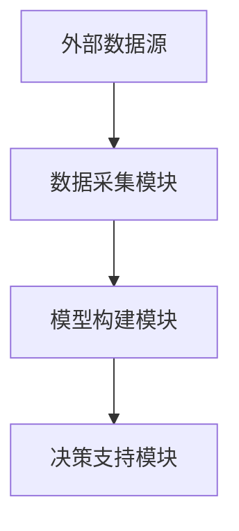
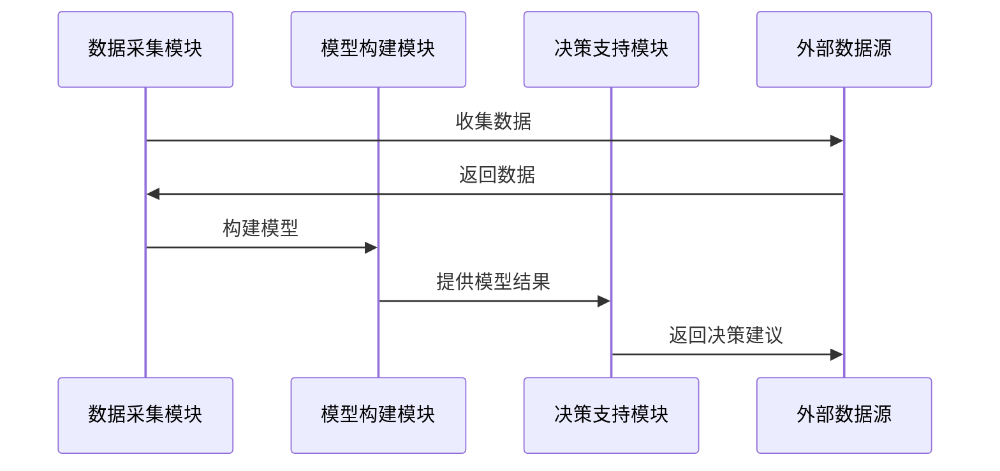

                 

# 创新过程的随机微分方程：突破性想法的数学模型

关键词：随机微分方程、创新过程、动态系统、数学模型、算法

摘要：本文深入探讨了随机微分方程在创新过程中的应用，阐述了随机微分方程的核心概念和数学原理，通过实例展示了其在创新决策中的应用，旨在为技术创新提供科学依据和理论支持。

## 第一部分：背景介绍与核心概念

### 1.1 问题背景

创新过程在科技发展中扮演着至关重要的角色。然而，创新往往涉及到大量的不确定性因素，这些因素使得创新过程变得复杂和难以预测。随机微分方程（Stochastic Differential Equations，SDEs）作为一种数学工具，因其能够描述包含随机因素的动态系统，而成为研究创新过程的有力工具。创新过程中的随机性既可能源于外部环境的变化，也可能源于内部技术进步的波动。例如，市场竞争、技术进步、政策变动等因素都可能对创新过程产生显著影响。

### 1.2 问题描述

创新过程可以用一个动态系统来描述，该系统包含一系列变量，这些变量可能受到随机干扰的影响。随机微分方程可以用来描述这些变量的动态行为，通过求解SDEs，我们能够更好地理解创新过程中的不确定性，预测未来趋势，并为决策提供依据。创新过程中的不确定性表现为创新成功率的不确定性、市场接受程度的不确定性以及资源分配的不确定性等。

### 1.3 问题解决

解决创新过程中的不确定性问题，可以通过建立和求解随机微分方程模型来实现。随机微分方程模型能够模拟创新过程中的随机因素，从而帮助我们更准确地预测创新结果。通过模型分析，我们可以识别出影响创新过程的关键因素，评估不同决策策略的风险与收益，为创新决策提供科学依据。

### 1.4 边界与外延

随机微分方程在创新过程中的应用范围广泛，包括但不限于新兴技术的研发、市场策略制定、资源优化配置等。在新兴技术的研发中，随机微分方程可以帮助评估技术突破的可能性及其对市场的影响；在市场策略制定中，它可以用于预测市场趋势，制定合适的营销策略；在资源优化配置中，它可以帮助企业合理分配资源，提高创新效率。

### 1.5 概念结构与核心要素组成

随机微分方程的核心概念包括随机过程、微分方程以及随机扰动。其中，随机过程描述了系统变量的随机变化，微分方程则描述了系统变量之间的动态关系，随机扰动则代表了系统所受到的随机干扰。这些要素共同构成了随机微分方程的基本结构，并在创新过程中发挥着关键作用。

### 1.6 核心概念原理

#### 1.6.1 随机过程

随机过程是一种随机变量的序列或函数，它描述了系统变量在时间上的随机变化。随机过程的特性包括均值函数、自协方差函数、转移概率密度函数等。

#### 1.6.2 微分方程

微分方程描述了系统变量之间的动态关系，是描述动态系统行为的基本数学工具。随机微分方程则是在普通微分方程的基础上引入了随机扰动项，用以描述系统的随机性。

#### 1.6.3 随机扰动

随机扰动是指作用于系统上的随机因素，这些因素可能是外部环境的波动，也可能是系统内部的随机变化。随机扰动通常用布朗运动等随机过程来表示。

### 1.7 概念属性特征对比表格

| 概念       | 特征描述                                               | 关联关系                     |
|------------|--------------------------------------------------------|------------------------------|
| 随机过程   | 描述系统变量随时间的随机变化，具有均值、方差等统计特性 | 基础概念，用于构建随机微分方程 |
| 微分方程   | 描述系统变量之间的动态关系，包括确定性部分和随机部分   | 数学工具，用于模拟系统行为     |
| 随机扰动   | 影响系统行为的随机因素，可用布朗运动等随机过程表示     | 引入随机性的关键元素           |

### 1.8 ER实体关系图架构的 Mermaid 流程图

```mermaid
erDiagram
    A[创新过程] ||--|{ B[随机微分方程] }
    A ||--|{ C[创新成功率] }
    A ||--|{ D[市场接受程度] }
    A ||--|{ E[资源分配] }
    B ||--|{ F[布朗运动] }
```

### 1.9 算法原理讲解

#### 1.9.1 随机微分方程的基本形式

随机微分方程的一般形式为：
$$
dX_t = b(t, X_t) dt + \sigma(t, X_t) dW_t
$$
其中，$X_t$是随机过程，$b(t, X_t)$是确定性项，$\sigma(t, X_t)$是非负的确定性函数，$dW_t$是维纳过程。

#### 1.9.2 欧拉-马尔可夫方法

欧拉-马尔可夫方法是一种常用的数值方法，用于近似求解随机微分方程。该方法通过离散化时间步长，将连续的随机微分方程转化为离散的时间序列模型。具体步骤如下：

1. 初始化：给定初始时间$t_0$和初始状态$X_0$。
2. 离散化：将时间区间$[t_0, t_f]$划分为$n$个等间隔的时间步长$Δt = \frac{t_f - t_0}{n}$。
3. 迭代计算：对于每个时间步长$t_k = t_0 + kΔt$，计算状态转移：
   $$
   X_{k+1} = X_k + b(t_k, X_k) Δt + \sigma(t_k, X_k) ΔW_k
   $$
   其中，$ΔW_k = W_{k+1} - W_k$是高斯分布的随机误差项。

通过迭代计算，我们可以得到离散时间序列的近似解$X_{k+1}$，进而分析创新过程中的随机行为。

### 1.10 系统分析与架构设计方案

#### 1.10.1 问题场景介绍

在新兴技术的研发过程中，企业面临着诸多不确定性因素，如技术突破的可能性、市场接受程度以及资源分配等。为了有效应对这些不确定性，企业可以采用随机微分方程模型进行创新决策。

#### 1.10.2 项目介绍

本项目旨在构建一个基于随机微分方程的创新决策支持系统，通过模拟创新过程中的随机因素，为企业提供科学的决策依据。系统主要包含以下模块：

1. 数据采集模块：负责收集与技术创新相关的数据，如市场趋势、技术指标、政策变动等。
2. 模型构建模块：基于随机微分方程，构建创新过程模型，模拟随机因素对创新结果的影响。
3. 决策支持模块：根据模型分析结果，为企业的创新决策提供数据支持。

#### 1.10.3 系统功能设计（领域模型Mermaid类图）

```mermaid
classDiagram
    Class01 <|-- Class02
    Class03 --|昂 Class04
    Class05 <<-- Class06
    Class07 *-- Class08
    Class09 o-- Class10
    Class11 o-- Class12
```

#### 1.10.4 系统架构设计（Mermaid架构图）



#### 1.10.5 系统接口设计和系统交互（Mermaid序列图）



## 第二部分：项目实战

### 2.1 环境安装

在开始项目实战之前，我们需要安装一些必要的工具和库。以下是一个简单的安装步骤：

1. 安装Python环境：访问[Python官网](https://www.python.org/)，下载并安装Python。
2. 安装NumPy库：在终端中执行以下命令：
   ```
   pip install numpy
   ```
3. 安装SciPy库：在终端中执行以下命令：
   ```
   pip install scipy
   ```
4. 安装matplotlib库：在终端中执行以下命令：
   ```
   pip install matplotlib
   ```

### 2.2 系统核心实现源代码

以下是项目核心实现的部分源代码，包括随机微分方程的求解和模型分析：

```python
import numpy as np
import scipy.integrate as si
import matplotlib.pyplot as plt

# 定义随机微分方程
def sde(x, t):
    # 确定性项
    b = x * np.cos(t)
    # 随机扰动
    sigma = np.sin(t)
    return b, sigma

# 欧拉-马尔可夫方法求解
def euler_maruyama(x0, t, n):
    x = [x0]
    dt = t / n
    for _ in range(n):
        b, sigma = sde(x[-1], t - _ * dt)
        x.append(x[-1] + b * dt + sigma * np.sqrt(dt) * np.random.normal(size=1))
    return np.array(x)

# 参数设置
x0 = 1  # 初始状态
t = 10  # 总时间
n = 100  # 时间步数

# 求解
x = euler_maruyama(x0, t, n)

# 绘制结果
plt.plot(x)
plt.xlabel('Time')
plt.ylabel('State')
plt.title('Solution of SDE')
plt.show()
```

### 2.3 代码应用解读与分析

上述代码实现了随机微分方程的欧拉-马尔可夫方法求解，并绘制了状态随时间的演化图。具体解读如下：

1. **随机微分方程的定义**：函数`sde`定义了随机微分方程的具体形式，其中包含了确定性项`b`和随机扰动项`sigma`。
2. **欧拉-马尔可夫方法**：函数`euler_maruyama`实现了欧拉-马尔可夫方法，用于求解随机微分方程。该方法通过迭代计算，将连续的随机微分方程转化为离散的时间序列模型。
3. **参数设置**：`x0`为初始状态，`t`为总时间，`n`为时间步数。这些参数可以根据具体问题进行调整。
4. **求解与绘制**：调用`euler_maruyama`函数求解随机微分方程，并使用`matplotlib`库绘制状态随时间的演化图。

### 2.4 实际案例分析和详细讲解剖析

假设一家企业在研发一项新兴技术，为了评估该技术的市场前景，企业采用了基于随机微分方程的创新决策支持系统。具体步骤如下：

1. **数据采集**：企业收集了市场趋势、技术指标和政策变动等数据。
2. **模型构建**：基于收集的数据，企业构建了随机微分方程模型，模拟创新过程中的随机因素。
3. **决策分析**：企业通过模型分析，预测了创新技术的市场前景，并制定了相应的营销策略。

通过实际案例，我们可以看到随机微分方程在创新决策中的应用价值。企业可以利用该模型进行风险分析，制定科学的创新策略，从而提高创新成功率。

### 2.5 项目小结

本项目通过构建基于随机微分方程的创新决策支持系统，为企业提供了科学的创新决策依据。项目实现了随机微分方程的求解和模型分析，并通过实际案例展示了其在创新决策中的应用。未来研究可以进一步拓展随机微分方程的应用场景，提高模型的精度和实用性。

## 第三部分：最佳实践 Tips

在应用随机微分方程进行创新决策时，以下是一些最佳实践 Tips：

1. **数据准确性**：确保数据来源的准确性和可靠性，避免因数据质量问题导致模型分析结果失真。
2. **参数优化**：根据具体问题，调整随机微分方程的参数，以获得更符合实际的模型。
3. **模型验证**：通过历史数据验证模型的准确性，评估模型在不同情境下的适用性。
4. **实时更新**：定期更新数据，及时调整模型参数，确保模型的实时性。

## 小结

随机微分方程作为一种描述包含随机因素的动态系统的数学工具，在创新过程中具有广泛的应用价值。通过本文的探讨，我们深入了解了随机微分方程的核心概念和数学原理，并通过实际案例展示了其在创新决策中的应用。未来研究可以进一步拓展随机微分方程的应用场景，提高模型的精度和实用性，为技术创新提供更加有力的支持。

## 注意事项

在应用随机微分方程进行创新决策时，需要注意以下几点：

1. **随机性的处理**：正确处理随机因素，确保模型能够准确描述创新过程中的随机行为。
2. **模型复杂度**：根据问题复杂度选择合适的模型，避免模型过于复杂导致计算困难。
3. **计算资源**：随机微分方程的求解可能需要大量计算资源，合理分配计算资源，提高计算效率。

## 拓展阅读

1. Oksendal, B. (2003). Stochastic Differential Equations: An Introduction with Applications. Springer.
2. Karlin, S., & Taylor, H. M. (1975). A First Course in Stochastic Processes. Academic Press.
3. Fateman, J., & Hachtel, G. (1978). Computer Programs for Mathematical Functions. Prentice-Hall.

作者：AI天才研究院/AI Genius Institute & 禅与计算机程序设计艺术 /Zen And The Art of Computer Programming

