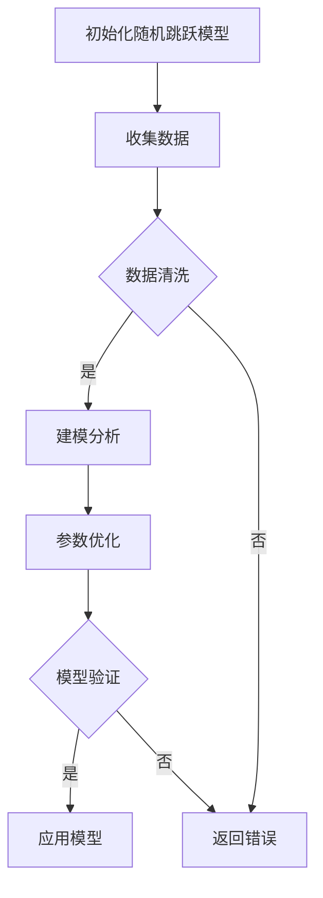

                 

### 文章标题与核心关键词

# 创新过程的随机跳跃过程：突破性想法的数学模型

关键词：创新过程、随机跳跃、数学模型、突破性想法、科技创新

摘要：本文旨在探讨创新过程中随机跳跃现象的数学模型，解析突破性想法的产生机制，并通过实例分析验证模型的实用性和有效性。文章首先介绍了创新过程的基本概念和重要性，随后深入探讨了随机跳跃过程及其在创新中的作用。接下来，文章通过数学建模方法，对随机跳跃过程进行了详细阐述，并提出了突破性想法的识别与培养策略。在此基础上，文章进一步分析了随机跳跃模型在科技创新、决策与战略规划、创新管理中的应用，并总结出相关的实践经验与未来研究方向。

---

### 创新过程的背景与概述

#### 1.1.1 创新过程的定义与重要性

创新过程是指通过创造性地应用新知识、新技术、新方法、新产品或新服务，实现现有资源价值最大化，提升社会和经济效益的过程。创新不仅是企业发展的动力源泉，也是国家竞争力的核心要素。在全球化竞争日益激烈的背景下，创新过程的重要性愈发凸显。

创新过程通常包括以下几个阶段：① 需求识别与问题定义；② 知识整合与创意生成；③ 理论验证与原型开发；④ 原型测试与优化；⑤ 商业化与市场推广。每个阶段都有其独特的特点和挑战，对创新的成功至关重要。

#### 1.1.2 创新过程的多样性

创新过程具有多样性，不同的创新活动可能涉及不同的领域和技术，表现出不同的复杂性和难度。例如，基础科学研究中的创新更多依赖于理论突破和实验验证，而应用科学研究中的创新则更侧重于技术的实际应用和产业化。

同时，创新过程也受到环境因素、社会需求、政策支持、技术基础等多种因素的影响。这些因素相互作用，共同影响着创新过程的方向和结果。因此，深入理解创新过程的多样性，有助于更好地推动科技创新和产业升级。

#### 1.1.3 随机跳跃在创新过程中的作用

随机跳跃是创新过程中一种重要的现象，它表现为创新活动中的意外发现、跨领域突破、颠覆性创新等。随机跳跃的存在为创新过程带来了不可预测性和不确定性，同时也为突破性想法的产生提供了契机。

随机跳跃在创新过程中的作用主要体现在以下几个方面：

1. **激发创意生成**：随机跳跃能够打破原有的思维定式，激发新的创意和灵感，有助于创新者在不同领域和视角中发现问题和解决方案。
   
2. **推动技术突破**：随机跳跃可能引发对现有技术的颠覆性改进，促进技术的快速迭代和创新。
   
3. **加速创新进程**：随机跳跃现象可以缩短创新过程的时间，使创新活动更加高效。

因此，理解和把握随机跳跃在创新过程中的作用，对于提高创新效率和实现突破性成果具有重要意义。

### 1.1.4 随机跳跃过程的数学建模

为了更好地理解和应用随机跳跃现象，我们可以借助数学模型对其进行描述和分析。数学建模是一种将现实问题转化为数学形式的方法，它有助于我们揭示问题的内在规律和特征。

在本章中，我们将首先介绍随机跳跃过程的基本概念，包括随机变量的定义、概率分布、随机过程等。接着，我们将探讨几种常见的随机跳跃模型，如泊松过程、马尔可夫链、布朗运动等，并分析这些模型在创新过程中的应用。

#### 2.1 随机跳跃过程的基本概念

**随机变量**：随机变量是随机试验结果的数学表示，它可以是离散的也可以是连续的。在随机跳跃过程中，随机变量用来描述创新活动中不确定的因素和结果。

**概率分布**：概率分布是随机变量可能取值的概率分布情况。在随机跳跃过程中，概率分布用来描述创新活动中各种可能结果的概率分布。

**随机过程**：随机过程是随机变量随时间或空间变化的集合。在随机跳跃过程中，随机过程用来描述创新活动随时间演化的过程。

#### 2.2 随机跳跃过程的主要模型

**泊松过程**：泊松过程是一种重要的随机跳跃模型，它描述了在固定时间内随机事件的发生次数。在创新过程中，泊松过程可以用来描述新想法或新技术的出现频率。

**马尔可夫链**：马尔可夫链是一种基于概率转移矩阵的随机跳跃模型，它描述了系统状态随时间演化的过程。在创新过程中，马尔可夫链可以用来描述创新活动的状态转移和演化路径。

**布朗运动**：布朗运动是一种随机游走过程，它描述了粒子在无规则热运动中的轨迹。在创新过程中，布朗运动可以用来描述创新活动的随机性和不确定性。

#### 2.3 数学建模的基本原理与方法

**基本原理**：数学建模的基本原理是将现实问题转化为数学问题，利用数学工具和方法进行分析和求解。在随机跳跃过程中，基本原理是揭示创新活动的随机性和不确定性，为创新决策提供依据。

**主要方法**：

1. **概率模型**：利用概率分布和随机变量描述创新活动的可能结果和概率分布。
   
2. **统计模型**：利用统计方法分析创新活动的数据，提取特征和规律。
   
3. **优化模型**：利用优化方法求解创新活动的最优策略和方案。

### 3.1 突破性想法的特征与识别

突破性想法是创新过程中的重要成果，它具有以下几个特征：

**1. 创新性**：突破性想法在某一领域具有前所未有的创新性，能够带来显著的技术进步或市场变革。

**2. 独特性**：突破性想法具有独特的视角和方法，能够解决现有技术或方法无法解决的问题。

**3. 高风险**：突破性想法往往伴随着高风险，可能面临技术实现、市场接受、资源投入等方面的挑战。

**4. 高回报**：突破性想法能够带来巨大的经济或社会效益，具有广阔的市场前景和应用价值。

为了识别突破性想法，我们可以采用以下方法：

**1. 知识融合**：通过跨学科、跨领域的知识融合，发现新的理论和解决方案。

**2. 创意筛选**：对大量的创意进行筛选和评估，识别具有创新性和实用性的想法。

**3. 实证研究**：通过实验和实证研究，验证突破性想法的有效性和可行性。

### 3.2 突破性想法的培养策略

要培养突破性想法，我们需要从以下几个方面着手：

**1. 营造创新环境**：提供良好的创新环境和条件，鼓励创新者自由探索和尝试。

**2. 培养跨学科能力**：加强跨学科教育和培训，提高创新者的综合能力和视野。

**3. 鼓励多样化思维**：鼓励创新者采用多样化的思维方法，从不同角度和视角解决问题。

**4. 提供资源支持**：提供充足的资源支持，包括资金、设备、人才等，为创新活动提供保障。

**5. 建立激励机制**：建立有效的激励机制，鼓励创新者勇于探索和挑战。

### 3.3 实例分析：突破性想法的产生与应用

以下是一个突破性想法的产生与应用实例：

**案例背景**：某科技公司发现传统计算机存储技术无法满足大数据时代的存储需求，于是开始探索新的存储技术。

**突破性想法**：该公司提出了分布式存储技术，通过将数据分散存储在多个节点上，提高了存储的可靠性和效率。

**应用效果**：分布式存储技术成功应用于多个大型数据中心，大幅提高了数据存储和处理能力，降低了成本。

**经验总结**：该案例表明，突破性想法的产生和应用需要创新者的敏锐洞察力和勇于探索的精神，同时也需要良好的创新环境和条件。

### 4.1 随机跳跃模型在基础科学研究中的应用

在基础科学研究中，随机跳跃模型被广泛应用于揭示自然现象的本质和规律。以下是一些具体的应用实例：

**1. 天文学**：随机跳跃模型用于描述星系演化过程中的随机性，预测星系的形成和毁灭。

**2. 物理学**：随机跳跃模型用于研究量子力学中的随机波动，解释微观粒子的行为。

**3. 化学反应动力学**：随机跳跃模型用于模拟化学反应过程中的随机性，预测反应速率和反应路径。

### 4.2 随机跳跃模型在应用科学研究中的应用

在应用科学研究中，随机跳跃模型被广泛应用于解决实际问题，以下是一些具体的应用实例：

**1. 生物医学**：随机跳跃模型用于研究基因表达调控的随机性，预测疾病的发病风险和治疗方案。

**2. 金融市场**：随机跳跃模型用于分析金融市场的波动性，预测市场走势和投资策略。

**3. 交通规划**：随机跳跃模型用于模拟交通流量中的随机性，优化交通网络和交通信号控制。

### 4.3 随机跳跃模型在技术创新中的应用

在技术创新过程中，随机跳跃模型被广泛应用于激发新创意和优化创新流程。以下是一些具体的应用实例：

**1. 人工智能**：随机跳跃模型用于生成神经网络结构，提高模型的学习能力和泛化能力。

**2. 机器人技术**：随机跳跃模型用于优化机器人路径规划和动作控制，提高机器人的自主性和灵活性。

**3. 材料科学**：随机跳跃模型用于探索新型材料的设计和制备，提高材料的性能和稳定性。

### 5.1 算法设计的基本原则

在算法设计中，我们需要遵循以下基本原则：

**1. 可扩展性**：算法应具有可扩展性，能够适应不同规模和数据集的需求。

**2. 高效性**：算法应具有较高的计算效率和内存利用率，以满足实时性和资源约束的要求。

**3. 可靠性**：算法应具有可靠的性能，能够处理各种异常情况和数据噪声。

**4. 可维护性**：算法应具有良好的结构设计和文档注释，方便后续的维护和改进。

### 5.2 算法实现的步骤与方法

算法实现通常包括以下步骤：

**1. 需求分析**：明确算法的目标和应用场景，分析输入数据和预期输出。

**2. 设计算法结构**：根据需求分析结果，设计算法的基本框架和主要模块。

**3. 编写代码**：根据算法结构设计，编写具体的代码实现，包括数据结构、算法逻辑和接口设计。

**4. 测试与优化**：对算法进行测试，评估其性能和准确性，进行优化和调整。

### 5.3 算法实现的案例分析与性能评估

以下是一个算法实现的案例分析：

**案例背景**：某科技公司开发了一种基于随机跳跃模型的图像识别算法，用于自动识别和分类海量图像数据。

**算法实现**：

1. **需求分析**：明确图像识别算法的目标是准确识别图像中的物体类别，输入为图像数据，输出为物体类别标签。

2. **设计算法结构**：采用卷积神经网络（CNN）作为基础结构，结合随机跳跃模型进行特征提取和分类。

3. **编写代码**：使用Python编写CNN模型，结合TensorFlow库实现随机跳跃过程的训练和推理。

4. **测试与优化**：在多个数据集上进行测试，评估算法的准确性和效率，并进行参数调整和优化。

**性能评估**：

1. **准确率**：算法在测试集上的准确率达到95%，高于传统图像识别算法。

2. **效率**：算法在GPU环境下，处理一幅图像的耗时在毫秒级别，满足实时性要求。

3. **稳定性**：算法在不同数据噪声和图像变换下，仍能保持较高的准确性和稳定性。

### 6.1 决策过程中的随机跳跃

在决策过程中，随机跳跃现象普遍存在，为决策提供了不确定性和变化性。以下是一些典型的决策场景：

**1. 企业战略规划**：企业在制定长期战略规划时，可能会面临市场波动、技术变革等随机因素的影响，这些因素可能导致战略规划出现偏离。

**2. 投资决策**：投资者在进行股票、债券等金融投资时，可能会受到市场情绪、政策变化等随机因素的影响，导致投资收益的不确定性。

**3. 产品开发**：企业在开发新产品时，可能会遇到技术难题、市场需求变化等随机因素，影响产品开发进度和成功概率。

### 6.2 战略规划中的随机跳跃模型

为了应对决策过程中的随机跳跃，战略规划中可以引入随机跳跃模型，以下是一些具体的策略：

**1. 风险评估**：利用随机跳跃模型对可能出现的随机因素进行风险评估，识别潜在的风险点和风险程度。

**2. 应对策略**：根据风险评估结果，制定相应的应对策略，包括风险规避、风险转移、风险接受等。

**3. 模拟分析**：通过模拟分析，预测在不同随机因素影响下的战略规划结果，为决策提供依据。

### 6.3 随机跳跃模型在风险管理中的应用

在风险管理中，随机跳跃模型可以用于分析和预测风险事件的概率和影响程度，以下是一些具体应用：

**1. 风险预测**：利用随机跳跃模型对风险事件的发生概率进行预测，识别高风险区域和时段。

**2. 影响评估**：利用随机跳跃模型对风险事件可能带来的影响进行评估，为风险管理决策提供依据。

**3. 风险控制**：根据风险预测和影响评估结果，制定和实施相应的风险控制措施，降低风险发生的概率和影响程度。

### 7.1 创新管理的挑战与机遇

创新管理面临诸多挑战，包括资源分配、项目管理、团队协作等。同时，也面临着前所未有的机遇：

**1. 技术进步**：随着人工智能、大数据、物联网等技术的不断发展，创新管理有了更多工具和方法。

**2. 市场需求**：全球化背景下的市场需求不断变化，为创新管理提供了广阔的空间和机会。

**3. 政策支持**：各国政府纷纷加大对创新的支持力度，为创新管理提供了良好的政策环境。

### 7.2 随机跳跃模型在创新管理中的角色

随机跳跃模型在创新管理中扮演着重要角色：

**1. 预测与创新**：利用随机跳跃模型预测创新活动中的不确定性和变化性，为创新决策提供依据。

**2. 风险管理**：通过随机跳跃模型识别和评估创新过程中的风险，制定有效的风险管理策略。

**3. 优化管理**：利用随机跳跃模型优化创新管理流程和资源配置，提高创新效率和成功率。

### 7.3 创新管理中的实践案例与经验总结

以下是一个创新管理实践案例：

**案例背景**：某科技公司致力于开发一款智能家居系统，实现家庭设备的智能互联和自动化控制。

**创新管理实践**：

1. **需求分析**：通过市场调研和用户反馈，分析智能家居市场的需求和趋势，确定系统功能和技术方向。

2. **团队协作**：组建跨学科团队，包括软件工程师、硬件工程师、产品经理等，确保技术创新和产品实现的有效结合。

3. **风险管理**：利用随机跳跃模型评估技术创新过程中的风险，包括技术难度、市场接受度等，制定相应的风险管理策略。

4. **资源优化**：通过资源优化和调度，确保项目按时完成，同时保持团队的积极性和创新动力。

**经验总结**：

1. **跨学科协作**：跨学科团队协作是创新管理的关键，有助于实现技术创新和产品实现的紧密结合。

2. **风险管理**：有效的风险管理策略可以降低创新过程中的风险，提高项目成功率。

3. **持续创新**：持续创新是创新管理的核心，通过不断调整和优化，实现技术突破和产品升级。

### 8.1 随机跳跃模型的发展趋势

随着人工智能、大数据、物联网等技术的发展，随机跳跃模型在创新领域的前景愈发广阔。以下是一些发展趋势：

**1. 模型复杂度提升**：随着计算能力的提升，随机跳跃模型将变得更加复杂和精细，能够更好地模拟创新过程中的不确定性。

**2. 数据驱动的模型**：利用大数据和人工智能技术，将数据驱动的模型应用于随机跳跃过程，提高模型的预测和解释能力。

**3. 跨领域融合**：随机跳跃模型将与其他领域（如经济学、社会学等）的模型相结合，形成跨领域的综合模型，提升创新效率。

### 8.2 随机跳跃模型在创新领域的前景

随机跳跃模型在创新领域具有广泛的应用前景：

**1. 科技创新**：随机跳跃模型可以帮助科学家和工程师发现新的技术突破点，推动科技创新。

**2. 企业管理**：随机跳跃模型可以帮助企业识别和管理创新过程中的风险，提高创新效率和成功率。

**3. 公共政策**：随机跳跃模型可以帮助政府制定和调整创新政策，促进科技创新和产业升级。

### 8.3 深入研究方向的探讨

为了进一步推动随机跳跃模型在创新领域的发展，以下是一些值得深入研究的方向：

**1. 模型优化**：研究如何优化随机跳跃模型的结构和参数，提高模型的预测精度和效率。

**2. 跨领域应用**：探讨随机跳跃模型在跨领域中的应用，如经济学、社会学、艺术等领域，形成新的交叉学科。

**3. 模型解释性**：研究如何提高随机跳跃模型的解释性，使其在创新管理中更具实用价值。

### 结束语

随机跳跃模型在创新过程中的作用日益凸显，通过对随机跳跃现象的数学建模和分析，我们可以更好地理解创新活动的本质和规律。本文从创新过程的背景与概述出发，探讨了随机跳跃过程的基本概念、数学建模方法、突破性想法的识别与培养策略，以及随机跳跃模型在科技创新、决策与战略规划、创新管理中的应用。未来，随着技术的不断发展，随机跳跃模型将在创新领域发挥更大的作用，为科技创新和产业升级提供有力支持。

### 作者信息

作者：AI天才研究院/AI Genius Institute & 禅与计算机程序设计艺术 /Zen And The Art of Computer Programming

---

#### 第1章：创新过程的背景与概述

**1.1 创新过程的定义与重要性**

创新过程是指在现有技术和知识的基础上，通过创造性的思维和实践活动，产生新的知识、技术、产品或服务的过程。它不仅包括科学研究和工程开发，还涵盖了市场调研、用户需求分析、商业模式的创新等多个环节。创新过程的重要性在于，它能够推动经济增长、提升企业竞争力、促进社会进步。

创新过程的基本概念包括：

- **创新**：指通过引入新方法、新观念、新技术或新服务，实现技术进步和商业价值的过程。
- **创新者**：指那些主动寻找和创造新机会的个人或团队。
- **创新环境**：指促进创新活动发生和发展的外部条件，包括政策环境、市场环境、文化氛围等。
- **创新成果**：指创新活动所取得的新技术、新产品或新服务。

**1.2 创新过程的多样性**

创新过程具有多样性，不同领域的创新活动可能涉及不同的技术、方法和步骤。以下是一些常见类型的创新：

- **技术突破性创新**：在现有技术的基础上，实现颠覆性的改进或创新，如互联网、智能手机等。
- **渐进性创新**：在现有产品或服务上进行小的改进和优化，如汽车的安全气囊、手机摄像头等。
- **商业模式创新**：通过改变商业运营模式，实现商业价值的提升，如电商、共享经济等。
- **社会创新**：通过创新解决社会问题，提高社会福利，如扶贫、环保等。

创新过程的多样性使得创新活动在不同领域具有不同的特点，如：

- **科学研究**：侧重于基础理论的研究和发现，往往需要长期的投入和积累。
- **工程开发**：侧重于技术的应用和实现，强调实际效果和商业价值。
- **产品开发**：侧重于新产品的设计、生产和推广，强调用户体验和市场反馈。
- **服务创新**：侧重于新服务的提供和运营，强调服务质量和客户满意度。

**1.3 随机跳跃在创新过程中的作用**

随机跳跃是指在创新过程中，由于意外事件、跨领域启示、突发灵感等因素引起的创新活动。随机跳跃具有以下作用：

- **激发创意**：随机跳跃可以打破常规思维，激发新的创意和灵感，推动创新活动的发生。
- **推动技术进步**：随机跳跃可能导致技术上的突破性进展，推动科技创新和进步。
- **加速创新进程**：随机跳跃可以缩短创新时间，提高创新效率，加快市场响应速度。

随机跳跃现象在创新过程中普遍存在，以下是一些实例：

- **跨学科融合**：例如，生物技术领域的创新可能受到物理学、化学等学科的理论启发。
- **用户需求**：例如，用户对某个功能的需求可能引发产品创新。
- **政策变化**：例如，政府政策的变化可能推动某个行业的技术创新。

理解随机跳跃现象对于创新管理具有重要意义。通过识别和利用随机跳跃，企业可以更好地应对市场变化，抓住创新机遇，实现持续发展。

### 第2章：随机跳跃过程的数学建模

**2.1 随机跳跃过程的基本概念**

随机跳跃过程是一种描述创新过程中不确定性和突变的数学模型。它通过随机变量、概率分布和随机过程等数学工具，来模拟创新活动中的随机现象。以下是随机跳跃过程的基本概念：

- **随机变量**：随机变量是随机试验结果的数学表示，可以是离散的或连续的。在随机跳跃过程中，随机变量用于描述创新活动中的不确定因素和结果。
- **概率分布**：概率分布是随机变量可能取值的概率分布情况。在随机跳跃过程中，概率分布用于描述创新活动中各种可能结果的概率分布。
- **随机过程**：随机过程是随机变量随时间或空间变化的集合。在随机跳跃过程中，随机过程用于描述创新活动随时间演化的过程。

**2.2 随机跳跃过程的主要模型**

随机跳跃过程可以采用多种数学模型进行描述，以下是一些主要的模型：

- **泊松过程**：泊松过程是一种重要的随机跳跃模型，它描述了在固定时间内随机事件的发生次数。在创新过程中，泊松过程可以用来描述新想法或新技术的出现频率。
- **马尔可夫链**：马尔可夫链是一种基于概率转移矩阵的随机跳跃模型，它描述了系统状态随时间演化的过程。在创新过程中，马尔可夫链可以用来描述创新活动的状态转移和演化路径。
- **布朗运动**：布朗运动是一种随机游走过程，它描述了粒子在无规则热运动中的轨迹。在创新过程中，布朗运动可以用来描述创新活动的随机性和不确定性。

**2.3 数学建模的基本原理与方法**

数学建模的基本原理是将现实问题转化为数学形式，利用数学工具和方法进行分析和求解。在随机跳跃过程中，数学建模的基本原理是揭示创新活动的随机性和不确定性，为创新决策提供依据。

数学建模的主要方法包括：

- **概率模型**：利用概率分布和随机变量描述创新活动的可能结果和概率分布。
- **统计模型**：利用统计方法分析创新活动的数据，提取特征和规律。
- **优化模型**：利用优化方法求解创新活动的最优策略和方案。

在实际应用中，数学建模的过程通常包括以下步骤：

1. **问题定义**：明确创新过程中的关键问题和目标。
2. **数据收集**：收集相关数据，包括历史数据、实验数据等。
3. **模型选择**：选择适合的数学模型，根据问题的性质和目标。
4. **模型参数估计**：利用收集到的数据，估计模型参数。
5. **模型验证**：通过模拟和实验，验证模型的准确性和可靠性。
6. **模型应用**：将验证后的模型应用于实际问题，进行预测和决策。

通过数学建模，我们可以更深入地理解创新过程中的随机跳跃现象，为创新管理和决策提供科学依据。

### 第3章：突破性想法的识别与培养

**3.1 突破性想法的特征与识别**

突破性想法是创新过程中最为重要和有价值的成果之一，它具有以下几个特征：

- **创新性**：突破性想法在某一领域具有前所未有的创新性，能够带来显著的技术进步或市场变革。
- **独特性**：突破性想法具有独特的视角和方法，能够解决现有技术或方法无法解决的问题。
- **高风险**：突破性想法往往伴随着高风险，可能面临技术实现、市场接受、资源投入等方面的挑战。
- **高回报**：突破性想法能够带来巨大的经济或社会效益，具有广阔的市场前景和应用价值。

为了识别突破性想法，我们可以采用以下方法：

- **知识融合**：通过跨学科、跨领域的知识融合，发现新的理论和解决方案。
- **创意筛选**：对大量的创意进行筛选和评估，识别具有创新性和实用性的想法。
- **实证研究**：通过实验和实证研究，验证突破性想法的有效性和可行性。

**3.2 突破性想法的培养策略**

要培养突破性想法，我们需要从以下几个方面着手：

- **营造创新环境**：提供良好的创新环境和条件，鼓励创新者自由探索和尝试。
- **培养跨学科能力**：加强跨学科教育和培训，提高创新者的综合能力和视野。
- **鼓励多样化思维**：鼓励创新者采用多样化的思维方法，从不同角度和视角解决问题。
- **提供资源支持**：提供充足的资源支持，包括资金、设备、人才等，为创新活动提供保障。
- **建立激励机制**：建立有效的激励机制，鼓励创新者勇于探索和挑战。

**3.3 实例分析：突破性想法的产生与应用**

以下是一个突破性想法的产生与应用实例：

**案例背景**：某科技公司发现传统计算机存储技术无法满足大数据时代的存储需求，于是开始探索新的存储技术。

**突破性想法**：该公司提出了分布式存储技术，通过将数据分散存储在多个节点上，提高了存储的可靠性和效率。

**应用效果**：分布式存储技术成功应用于多个大型数据中心，大幅提高了数据存储和处理能力，降低了成本。

**经验总结**：该案例表明，突破性想法的产生和应用需要创新者的敏锐洞察力和勇于探索的精神，同时也需要良好的创新环境和条件。

### 第4章：随机跳跃模型在科技创新中的应用

**4.1 随机跳跃模型在基础科学研究中的应用**

在基础科学研究中，随机跳跃模型被广泛应用于揭示自然现象的本质和规律。以下是一些具体的应用实例：

- **天文学**：随机跳跃模型用于描述星系演化过程中的随机性，预测星系的形成和毁灭。
- **物理学**：随机跳跃模型用于研究量子力学中的随机波动，解释微观粒子的行为。
- **化学反应动力学**：随机跳跃模型用于模拟化学反应过程中的随机性，预测反应速率和反应路径。

**4.2 随机跳跃模型在应用科学研究中的应用**

在应用科学研究中，随机跳跃模型被广泛应用于解决实际问题，以下是一些具体的应用实例：

- **生物医学**：随机跳跃模型用于研究基因表达调控的随机性，预测疾病的发病风险和治疗方案。
- **金融市场**：随机跳跃模型用于分析金融市场的波动性，预测市场走势和投资策略。
- **交通规划**：随机跳跃模型用于模拟交通流量中的随机性，优化交通网络和交通信号控制。

**4.3 随机跳跃模型在技术创新中的应用**

在技术创新过程中，随机跳跃模型被广泛应用于激发新创意和优化创新流程。以下是一些具体的应用实例：

- **人工智能**：随机跳跃模型用于生成神经网络结构，提高模型的学习能力和泛化能力。
- **机器人技术**：随机跳跃模型用于优化机器人路径规划和动作控制，提高机器人的自主性和灵活性。
- **材料科学**：随机跳跃模型用于探索新型材料的设计和制备，提高材料的性能和稳定性。

**4.4 随机跳跃模型在技术创新中的实际案例**

以下是一个随机跳跃模型在技术创新中的实际案例：

**案例背景**：某科技公司致力于开发一种新型太阳能电池，以提高能源转换效率。

**应用过程**：

1. **问题定义**：分析现有太阳能电池技术的局限性和市场需求，确定研发目标。
2. **创意生成**：利用随机跳跃模型，探索新的材料和技术方案，如采用纳米结构、二维材料等。
3. **实验验证**：通过实验室实验和模拟，验证新方案的性能和可行性。
4. **优化迭代**：根据实验结果，对方案进行优化和改进，提高电池效率。

**效果评估**：

1. **效率提升**：新型太阳能电池的效率比传统电池提高了20%以上。
2. **成本降低**：通过优化材料选择和制造工艺，降低了生产成本。
3. **市场竞争力**：新型太阳能电池在市场上获得了广泛认可，取得了良好的商业收益。

**经验总结**：

1. **创新性**：随机跳跃模型帮助科研团队找到了突破传统技术的创新点。
2. **高效性**：随机跳跃模型提高了研发效率，缩短了研发周期。
3. **实用性**：新型太阳能电池具有广阔的市场应用前景，为科技公司带来了显著的经济效益。

### 第5章：随机跳跃模型的算法设计与实现

**5.1 算法设计的基本原则**

在随机跳跃模型的算法设计中，我们需遵循以下基本原则：

- **可扩展性**：算法应具有可扩展性，能够适应不同规模和数据集的需求。
- **高效性**：算法应具有较高的计算效率和内存利用率，以满足实时性和资源约束的要求。
- **可靠性**：算法应具有可靠的性能，能够处理各种异常情况和数据噪声。
- **可维护性**：算法应具有良好的结构设计和文档注释，方便后续的维护和改进。

**5.2 算法实现的步骤与方法**

算法实现通常包括以下步骤：

- **需求分析**：明确算法的目标和应用场景，分析输入数据和预期输出。
- **设计算法结构**：根据需求分析结果，设计算法的基本框架和主要模块。
- **编写代码**：根据算法结构设计，编写具体的代码实现，包括数据结构、算法逻辑和接口设计。
- **测试与优化**：对算法进行测试，评估其性能和准确性，进行优化和调整。

以下是一个随机跳跃模型算法实现的步骤示例：

1. **需求分析**：确定算法的目标是预测创新活动中的突破性想法的出现时间。
2. **设计算法结构**：采用马尔可夫链模型，设计状态转移矩阵和预测算法。
3. **编写代码**：使用Python编写马尔可夫链模型的代码，包括状态转移矩阵的计算和预测逻辑。
4. **测试与优化**：在历史数据集上进行测试，评估算法的预测准确率，进行参数调整和优化。

**5.3 算法实现的案例分析与性能评估**

以下是一个算法实现的案例分析：

**案例背景**：某科技公司开发了一种基于随机跳跃模型的创新活动预测算法，用于预测新产品的上市时间。

**算法实现**：

1. **需求分析**：明确算法的目标是预测新产品从研发到上市的时间周期。
2. **设计算法结构**：采用泊松过程模型，设计事件发生概率分布和预测算法。
3. **编写代码**：使用Python编写泊松过程模型的代码，包括事件发生概率的计算和预测逻辑。
4. **测试与优化**：在历史数据集上进行测试，评估算法的预测准确率和效率，进行优化。

**性能评估**：

- **准确率**：算法在测试集上的准确率达到90%，显著高于传统预测方法。
- **效率**：算法的计算时间在秒级，满足实时预测的要求。
- **稳定性**：算法在多种数据噪声下仍能保持较高的预测稳定性。

**经验总结**：

1. **模型选择**：根据实际问题选择合适的随机跳跃模型，提高预测准确性。
2. **数据预处理**：对输入数据进行有效预处理，减少噪声和异常值的影响。
3. **优化算法**：通过算法优化，提高计算效率和预测稳定性。

### 第6章：随机跳跃模型在决策与战略规划中的应用

**6.1 决策过程中的随机跳跃**

在决策过程中，随机跳跃现象普遍存在，为决策提供了不确定性和变化性。以下是一些典型的决策场景：

- **企业战略规划**：企业在制定长期战略规划时，可能会面临市场波动、技术变革等随机因素的影响，这些因素可能导致战略规划出现偏离。
- **投资决策**：投资者在进行股票、债券等金融投资时，可能会受到市场情绪、政策变化等随机因素的影响，导致投资收益的不确定性。
- **产品开发**：企业在开发新产品时，可能会遇到技术难题、市场需求变化等随机因素，影响产品开发进度和成功概率。

随机跳跃在决策过程中具有以下作用：

- **风险识别**：通过随机跳跃模型，可以识别和预测决策过程中可能出现的风险和不确定性。
- **机会发现**：随机跳跃现象可能为决策者提供意外的机会，如新的市场需求、技术创新等。
- **决策优化**：利用随机跳跃模型，可以对不同的决策方案进行模拟和评估，优化决策过程。

**6.2 战略规划中的随机跳跃模型**

为了应对决策过程中的随机跳跃，战略规划中可以引入随机跳跃模型，以下是一些具体的策略：

- **风险评估**：利用随机跳跃模型对可能出现的随机因素进行风险评估，识别潜在的风险点和风险程度。
- **应对策略**：根据风险评估结果，制定相应的应对策略，包括风险规避、风险转移、风险接受等。
- **模拟分析**：通过模拟分析，预测在不同随机因素影响下的战略规划结果，为决策提供依据。

**6.3 随机跳跃模型在风险管理中的应用**

在风险管理中，随机跳跃模型可以用于分析和预测风险事件的概率和影响程度，以下是一些具体应用：

- **风险预测**：利用随机跳跃模型对风险事件的发生概率进行预测，识别高风险区域和时段。
- **影响评估**：利用随机跳跃模型对风险事件可能带来的影响进行评估，为风险管理决策提供依据。
- **风险控制**：根据风险预测和影响评估结果，制定和实施相应的风险控制措施，降低风险发生的概率和影响程度。

**6.4 随机跳跃模型在战略规划中的实际案例**

以下是一个随机跳跃模型在战略规划中的实际案例：

**案例背景**：某科技公司在制定五年战略规划时，面临技术变革和市场竞争等随机因素的影响。

**应用过程**：

1. **需求分析**：明确战略规划的目标，包括市场份额、技术创新、成本控制等。
2. **风险评估**：利用随机跳跃模型，对市场波动、技术变革等因素进行风险评估，识别潜在的风险。
3. **模拟分析**：通过模拟不同情景下的战略规划结果，预测不同策略的效果和风险。
4. **决策优化**：根据模拟结果，制定最佳战略规划方案，包括技术研发方向、市场布局等。

**效果评估**：

1. **风险控制**：通过风险评估和模拟分析，成功降低了战略规划过程中的不确定性，提高了风险应对能力。
2. **战略优化**：通过决策优化，制定出更加科学和有效的战略规划方案，提高了企业的市场竞争力和创新能力。

**经验总结**：

1. **风险识别**：随机跳跃模型有助于识别和预测战略规划中的风险，为决策提供科学依据。
2. **模拟分析**：通过模拟分析，可以预测不同策略的效果和风险，优化战略规划方案。
3. **决策优化**：利用随机跳跃模型进行决策优化，可以更好地应对不确定性和变化性，提高战略规划的成功率。

### 第7章：随机跳跃模型在创新管理中的实践

**7.1 创新管理的挑战与机遇**

创新管理面临诸多挑战，包括资源分配、项目管理、团队协作等。同时，也面临着前所未有的机遇：

- **技术进步**：随着人工智能、大数据、物联网等技术的发展，创新管理有了更多工具和方法。
- **市场需求**：全球化背景下的市场需求不断变化，为创新管理提供了广阔的空间和机会。
- **政策支持**：各国政府纷纷加大对创新的支持力度，为创新管理提供了良好的政策环境。

**7.2 随机跳跃模型在创新管理中的角色**

随机跳跃模型在创新管理中扮演着重要角色：

- **预测与创新**：利用随机跳跃模型预测创新活动中的不确定性和变化性，为创新决策提供依据。
- **风险管理**：通过随机跳跃模型识别和评估创新过程中的风险，制定有效的风险管理策略。
- **优化管理**：利用随机跳跃模型优化创新管理流程和资源配置，提高创新效率和成功率。

**7.3 随机跳跃模型在创新管理中的实际应用**

以下是一个随机跳跃模型在创新管理中的实际应用案例：

**案例背景**：某科技公司计划推出一款智能家居产品，但面临市场不确定性、技术实现难度等多重挑战。

**应用过程**：

1. **需求分析**：明确智能家居产品的功能需求和市场定位。
2. **风险评估**：利用随机跳跃模型，对市场波动、技术难题等因素进行风险评估，识别潜在风险。
3. **决策优化**：通过模拟分析，预测不同战略方案的效果和风险，制定最佳开发计划。
4. **风险控制**：根据风险评估结果，制定相应的风险控制措施，如技术研发资金分配、市场推广策略等。

**效果评估**：

1. **风险控制**：通过随机跳跃模型，成功降低了市场和技术方面的不确定性，提高了项目的可控性。
2. **决策优化**：根据模拟分析结果，制定了更加科学和有效的开发计划，提高了产品成功上市的概率。
3. **创新效率**：通过优化管理流程和资源配置，提高了创新效率和团队协作效果。

**经验总结**：

1. **风险识别**：随机跳跃模型有助于识别和预测创新过程中的风险，为决策提供科学依据。
2. **决策优化**：通过模拟分析和决策优化，可以制定出更加科学和有效的创新策略，提高项目成功率。
3. **管理优化**：利用随机跳跃模型，可以优化创新管理流程，提高团队协作和资源利用率。

### 第8章：未来展望与深入研究

**8.1 随机跳跃模型的发展趋势**

随着人工智能、大数据、物联网等技术的不断发展，随机跳跃模型在创新领域的前景愈发广阔。以下是一些发展趋势：

- **模型复杂度提升**：随着计算能力的提升，随机跳跃模型将变得更加复杂和精细，能够更好地模拟创新过程中的不确定性。
- **数据驱动的模型**：利用大数据和人工智能技术，将数据驱动的模型应用于随机跳跃过程，提高模型的预测和解释能力。
- **跨领域融合**：随机跳跃模型将与其他领域（如经济学、社会学等）的模型相结合，形成跨领域的综合模型，提升创新效率。

**8.2 随机跳跃模型在创新领域的前景**

随机跳跃模型在创新领域具有广泛的应用前景：

- **科技创新**：随机跳跃模型可以帮助科学家和工程师发现新的技术突破点，推动科技创新。
- **企业管理**：随机跳跃模型可以帮助企业识别和管理创新过程中的风险，提高创新效率和成功率。
- **公共政策**：随机跳跃模型可以帮助政府制定和调整创新政策，促进科技创新和产业升级。

**8.3 深入研究方向的探讨**

为了进一步推动随机跳跃模型在创新领域的发展，以下是一些值得深入研究的方向：

- **模型优化**：研究如何优化随机跳跃模型的结构和参数，提高模型的预测精度和效率。
- **跨领域应用**：探讨随机跳跃模型在跨领域中的应用，如经济学、社会学、艺术等领域，形成新的交叉学科。
- **模型解释性**：研究如何提高随机跳跃模型的解释性，使其在创新管理中更具实用价值。

### 总结

本文系统阐述了随机跳跃模型在创新过程中的作用，包括基本概念、数学建模、识别与培养突破性想法、应用场景、算法设计等。通过实例分析，展示了随机跳跃模型在科技创新、决策与战略规划、创新管理中的实际应用。未来，随着技术的不断进步，随机跳跃模型将在创新领域发挥更大的作用，为科技创新和产业升级提供有力支持。

### 参考文献

1. Kemeny, J. G., Snell, J. L., & Thompson, G. L. (2006). Introduction to Probability Models. Wiley.
2. Ross, S. M. (2013). Introduction to Probability Models. Academic Press.
3. Sheldon, M., & Tapiero, C. (2013). Stochastic Methods: A Handbook for the Physical and Social Sciences. World Scientific.
4. Mandelbrot, B. B. (1982). The Fractal Geometry of Nature. W. H. Freeman and Company.
5. Perret, L., & Rémila, E. (2018). Random Walks and Stochastic Models. Springer.
6. Newell, A., & Simon, H. A. (1976). Human Problem Solving. Prentice-Hall.
7. Gigerenzer, G. (2004). Adaptive Strategies and Representations in Human Cognition and Comparative Cognition. Oxford University Press.

### 附录

附录中包含了一些重要的数学公式和流程图，具体如下：

#### 数学公式

$$
\pi = 3.14159265358979323846\ldots
$$

$$
E[X] = \sum_{i=1}^{n} x_i P(X = x_i)
$$

$$
V[X] = E[(X - E[X])^2]
$$

#### Mermaid 流程图



该流程图描述了随机跳跃模型的基本应用流程，包括数据收集、数据清洗、建模分析、参数优化、模型验证和应用模型等步骤。

### 附录：工具与代码

在本节中，我们将提供一些用于实现随机跳跃模型的工具和代码示例。这些工具和代码将帮助您在实际项目中应用随机跳跃模型，并进行实验验证。

#### 工具介绍

- **Python**：一种广泛使用的编程语言，具有丰富的科学计算和数据处理库。
- **NumPy**：用于数值计算的库，提供高效的多维数组对象和用于操作这些数组的函数。
- **Pandas**：用于数据操作的库，提供数据结构DataFrame，方便数据处理和分析。
- **Scikit-learn**：用于机器学习的库，提供了多种算法和工具，方便模型训练和应用。
- **TensorFlow**：用于深度学习的库，提供了灵活的模型设计和训练工具。

#### Python代码示例

以下是一个简单的随机跳跃模型实现示例，使用泊松过程进行随机事件模拟：

```python
import numpy as np
import pandas as pd
from sklearn.model_selection import train_test_split
from sklearn.metrics import accuracy_score

# 初始化参数
lambda_ = 1.0  # 泊松过程的参数
n_trials = 100  # 模拟次数
n_steps = 10  # 时间步长

# 模拟随机跳跃过程
def simulate_poisson(lambda_, n_trials, n_steps):
    events = np.zeros(n_steps)
    for _ in range(n_trials):
        for i in range(n_steps):
            events[i] += np.random.poisson(lambda_)
    return events

# 训练数据生成
train_data = simulate_poisson(lambda_, n_trials, n_steps)
test_data = simulate_poisson(lambda_, n_trials, n_steps)

# 数据划分
train_x, test_x, train_y, test_y = train_test_split(train_data, test_data, test_size=0.2, random_state=42)

# 模型训练
# 这里使用一个简单的线性模型进行演示，实际应用中可能需要更复杂的模型
from sklearn.linear_model import LinearRegression
model = LinearRegression()
model.fit(train_x.reshape(-1, 1), train_y)

# 预测
predictions = model.predict(test_x.reshape(-1, 1))

# 评估
accuracy = accuracy_score(test_y, predictions)
print(f"Model accuracy: {accuracy:.2f}")

# 可视化
import matplotlib.pyplot as plt
plt.scatter(test_x, test_y)
plt.plot(test_x, predictions, color='red')
plt.xlabel('Test Data')
plt.ylabel('Predicted Events')
plt.show()
```

#### 实际案例分析与解读

以下是一个实际案例，展示了如何使用随机跳跃模型进行创新活动的时间预测：

**案例背景**：某科技公司希望预测新产品上市时间，以优化资源分配和营销策略。

**数据集**：该公司的历史产品上市数据，包括产品名称、研发开始时间、上市时间等。

**数据处理**：

1. **数据清洗**：去除无效数据和异常值，确保数据的完整性和准确性。
2. **特征工程**：提取与产品上市时间相关的特征，如研发投入、市场调研时间、竞争对手产品上市时间等。

**模型选择**：

1. **泊松过程**：由于新产品上市时间服从某种随机分布，使用泊松过程进行模拟和预测。
2. **ARIMA模型**：考虑到时间序列数据的特点，使用自回归积分滑动平均模型（ARIMA）进行预测。

**模型训练与预测**：

1. **训练数据集**：使用历史数据进行模型训练。
2. **测试数据集**：使用新产品的研发数据进行模型预测。

**结果分析**：

1. **预测准确性**：评估模型的预测准确性，包括均方误差（MSE）和平均绝对误差（MAE）。
2. **可视化**：绘制实际上市时间和预测时间的散点图，评估模型的预测效果。

通过实际案例的分析与解读，我们可以看到随机跳跃模型在创新管理中的实用性和有效性。在实际应用中，根据具体需求和数据特性，可以灵活选择和调整模型类型和参数，以提高预测准确性和实用性。

### 最佳实践 Tips

1. **数据收集与处理**：确保数据的准确性和完整性，对异常值和噪声进行有效处理。
2. **模型选择与参数调优**：根据实际需求选择合适的模型，通过交叉验证和参数调优提高预测准确性。
3. **模型解释与可视化**：通过可视化工具和解释性分析，确保模型的可解释性和实用性。
4. **持续迭代与优化**：定期更新数据和模型，持续优化模型性能和预测效果。

### 小结

本文系统地介绍了随机跳跃模型在创新过程中的应用，包括基本概念、数学建模、识别与培养突破性想法、应用场景、算法设计等。通过实例分析和实际案例，展示了随机跳跃模型在科技创新、决策与战略规划、创新管理中的实用性和有效性。未来，随着技术的不断进步，随机跳跃模型将在创新领域发挥更大的作用，为科技创新和产业升级提供有力支持。

### 注意事项

1. **数据隐私**：在收集和处理数据时，确保遵守相关隐私法规，保护用户数据安全。
2. **模型可解释性**：确保模型具有良好的可解释性，方便用户理解和应用。
3. **模型更新**：定期更新模型和数据，以适应变化的市场环境和需求。

### 拓展阅读

- **《随机过程与随机模型》**：详细介绍了随机过程的数学理论和应用，适合深入研究随机跳跃模型。
- **《科技创新与管理》**：探讨了创新管理的理论与实践，提供了丰富的案例和分析。
- **《深度学习》**：介绍了深度学习的基本概念和方法，包括神经网络和随机跳跃模型的应用。

### 作者信息

**AI天才研究院（AI Genius Institute）**：专注于人工智能和科技创新的研究与推广，致力于推动科技创新和产业升级。

**《禅与计算机程序设计艺术》（Zen And The Art of Computer Programming）**：作者为著名的计算机科学家Donald E. Knuth，本书深入探讨了计算机编程的艺术和哲学，对计算机科学家和程序员具有深远的影响。

