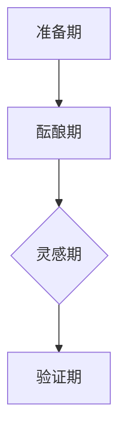
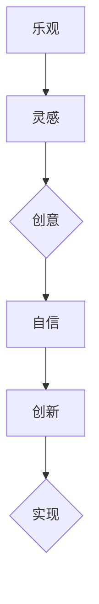
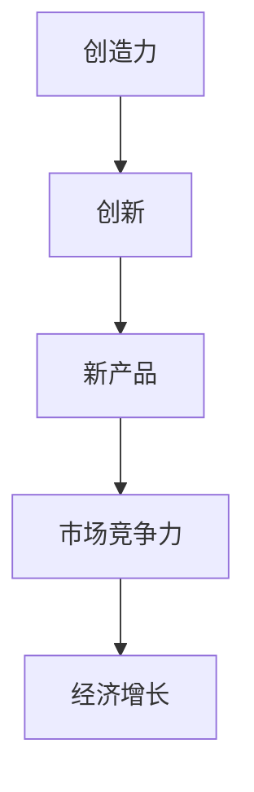
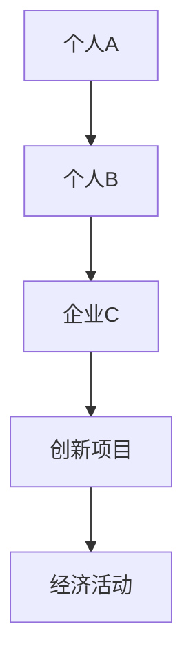
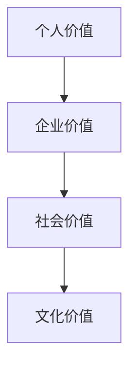
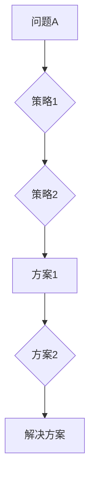
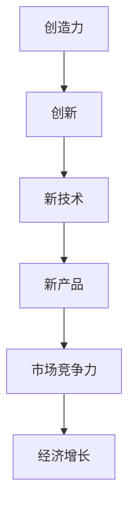

                 

### 引言与背景

#### 创造力的重要性

创造力是人类智力的重要组成部分，是推动社会进步和经济发展的重要动力。创造力不仅仅是一种艺术才能，更是一种解决问题的能力和创新思维。它涵盖了从新观念、新发明到新策略和决策的各个方面。定义创造力时，我们可以将其看作是一种生成新颖且有价值的想法和解决方案的能力。这种能力不仅与个体的智慧、经验有关，更与他们的思维方式、知识结构以及环境因素紧密相连。

在社会经济影响方面，创造力扮演着至关重要的角色。创新是企业竞争力的核心，是推动经济增长的重要引擎。历史上，许多经济繁荣时期都伴随着创造力的迸发，例如工业革命时期的技术创新，信息时代互联网和移动设备的迅速普及。心理学家对创造力的研究显示，创造力不仅影响个体的职业成就和幸福感，也对社会结构和文化发展产生深远影响。

心理学领域的创造力研究已经积累了丰富的成果。例如，通过认知心理学的方法，研究者们发现了创造力思维中的多个关键阶段，如准备期、酝酿期、灵感期和验证期。通过神经科学的方法，研究者们揭示了创造力与大脑不同区域之间的相互作用，例如前额叶与海马体之间的协同工作。此外，社会心理学的研究还探讨了群体创造力、团队协作以及环境因素对个体创造力的影响。

#### 网络科学的基本概念

网络科学是一门跨学科的研究领域，它使用数学模型和计算方法来理解和解释复杂系统的行为和性质。网络科学的定义可以概括为：研究网络结构、动态行为和功能性质的跨学科科学。网络科学的历史可以追溯到20世纪中期，当时图论作为研究网络结构的基本工具被广泛应用于通信和交通等领域。

社会网络分析是网络科学中的一个重要分支，它专注于社会结构和社会关系的研究。社会网络分析通过图形和数学模型来揭示人与人、团体与团体之间的互动关系，从而帮助我们理解社会行为、信息传播和社会结构。信息传播网络是另一个重要的研究领域，它涉及信息的生成、传播和影响过程。信息传播网络的研究对于理解谣言传播、社交媒体影响以及市场推广策略具有重要意义。

#### 创造力与网络科学的联系

创造力与网络科学之间的联系可以从多个角度来探讨。首先，网络科学为理解创造力提供了新的视角和方法。通过构建创造力网络，研究者可以分析个体和群体之间的互动关系，揭示创造力产生的机制和过程。例如，社会网络分析可以帮助我们识别创造力网络中的关键节点，这些节点可能是个体、团队或组织，它们在创造力过程中起到了重要的推动作用。

创造力网络的特点包括高度复杂性、动态性和多样性。复杂性来源于创造力网络的多元节点和多种互动关系；动态性则体现了创造力网络随着时间变化的特性；多样性则反映了不同网络结构对创造力产生的不同影响。联想思维的数学模型是理解创造力网络的重要工具。通过将联想思维抽象为数学模型，我们可以更精确地分析和预测创造力网络的动态行为。

联想思维是指人们在思考过程中，通过将不同概念或想法联系起来，产生新的思维火花。这种思维过程可以用数学模型来描述，例如贝叶斯网络、随机图模型等。这些模型能够捕捉联想思维的概率分布和结构特性，从而帮助我们理解和优化创造力网络。

#### 第1章：创造力与网络科学的概览

在现代社会，创造力已经成为推动科技进步、经济增长和社会发展的关键因素。随着信息技术的快速发展，网络科学为我们理解创造力提供了一个全新的视角。本章将深入探讨创造力的重要性、网络科学的基本概念及其在创造力研究中的应用，最后阐述创造力网络的独特特征和联想思维的数学模型。

### 1.1 创造力的重要性

创造力是一种独特的思维能力，它能够产生新颖且有价值的想法和解决方案。这种能力不仅仅局限于艺术领域，它在科学、工程、商业等多个领域都有着广泛的应用。在个人层面，创造力能够帮助人们解决复杂问题，提高生活质量；在社会层面，创造力是推动科技进步和社会发展的动力。

**定义与本质**

创造力的定义多种多样，但通常可以将其描述为产生新颖且有实用价值思想的能力。创造力不仅仅是一种单一的能力，它包含了多个相互关联的要素，如想象力、创新能力、思维灵活性和问题解决能力。想象力是创造力的基础，它使得人们能够超越现实，构建新的概念和想法。创新能力则体现在将想象力转化为具体成果的过程中，它需要人们具备将新想法与实际应用相结合的能力。思维灵活性是指人们在面对问题时能够灵活调整思路，寻找多种解决方案。问题解决能力则是创造力在具体实践中的体现，它需要人们具备分析问题、制定方案并实施的能力。

**社会经济影响**

创造力对社会的经济影响是不可忽视的。首先，创造力是创新的核心，而创新是企业保持竞争力的关键。在竞争激烈的市场环境中，企业只有通过持续创新才能在市场中占据优势。其次，创造力能够推动新技术的研发和应用，从而带动相关产业的发展。例如，互联网和移动通信技术的创新不仅改变了人们的生活方式，还催生了大量新兴产业，如电子商务、移动支付和在线教育等。

此外，创造力对社会经济的影响还体现在提高生产效率和改善生活质量方面。通过创新，企业能够优化生产流程，降低成本，提高效率。同时，创新的产品和服务能够满足人们不断变化的需求，提高生活质量。例如，智能家居设备的应用使得家庭生活更加便捷和舒适，医疗技术的创新则显著提高了人们的健康水平。

**心理学研究进展**

心理学领域对创造力进行了大量的研究，取得了显著的成果。认知心理学研究揭示了创造力思维的多个阶段，包括准备期、酝酿期、灵感期和验证期。在准备期，个体通过积累知识和经验为创造力做准备。在酝酿期，个体在潜意识中将问题反复思考，酝酿新的解决方案。灵感期则是创造力迸发的阶段，个体突然获得新的想法或灵感。在验证期，个体对新的想法进行验证和优化，确保其可行性和实用性。

神经科学的研究也为我们提供了关于创造力的深刻见解。研究表明，创造力与大脑的前额叶、顶叶和颞叶等区域密切相关。这些区域负责处理复杂信息、进行逻辑推理和创造性思维。此外，心理学研究还发现，情绪、动机和环境等因素对创造力也有重要影响。例如，积极的情绪状态能够激发创造力，而适当的心理压力则有助于创造力的高效发挥。

### 1.2 网络科学的基本概念

网络科学是一门跨学科的研究领域，它使用数学模型和计算方法来分析和理解复杂系统的结构和动态行为。网络科学的核心概念包括网络结构、网络动态和网络功能。网络结构主要关注网络中节点和边的配置方式，而网络动态则研究网络随时间变化的规律，网络功能则探讨网络在不同应用场景下的性能和效果。

**网络科学的定义与历史**

网络科学的定义可以概括为：研究网络结构、动态行为和功能性质的跨学科科学。网络科学的历史可以追溯到20世纪中期，当时图论作为研究网络结构的基本工具被广泛应用于通信和交通等领域。随着计算机技术的发展，特别是互联网和社交媒体的普及，网络科学逐渐成为一门独立的学科，吸引了众多学者和研究机构的关注。

在网络科学的发展历程中，有许多重要的里程碑。例如，1952年，美国数学家约翰·弗莱德（John Folk）提出了随机图模型，为网络结构的分析提供了重要工具。1967年，物理学家斯坦利·米尔格拉姆（Stanley Milgram）进行了著名的“小世界实验”，揭示了社会网络中节点之间的短路径现象。1998年，美国社会学家罗杰·盖洛普（Roger Guillemin）提出了复杂网络的三大特性：小世界性、高聚集性和无标度性。

**社会网络分析**

社会网络分析是网络科学中的一个重要分支，它专注于社会结构和社会关系的研究。社会网络分析通过图形和数学模型来揭示人与人、团体与团体之间的互动关系，从而帮助我们理解社会行为、信息传播和社会结构。

社会网络分析的基本概念包括节点、边和子图。节点表示网络中的个体或实体，边表示节点之间的联系或互动。子图是网络中由若干节点和它们之间的边构成的部分，它有助于我们理解网络的局部结构和功能。

社会网络分析的研究方法包括定量和定性两种。定量研究主要使用数学模型和计算方法来分析网络结构，如网络密度、聚类系数和路径长度等。定性研究则通过案例分析和实地调研来探索网络中的社会机制和关系模式。

**信息传播网络**

信息传播网络是网络科学中的另一个重要研究领域，它涉及信息的生成、传播和影响过程。信息传播网络的研究对于理解谣言传播、社交媒体影响和市场推广策略具有重要意义。

信息传播网络的基本概念包括信息源、传播路径和影响范围。信息源是信息的起点，它可以是个人、组织或媒体。传播路径是信息从信息源到接收者的传递过程，它可以通过社交网络、通信网络或互联网等渠道实现。影响范围则是指信息传播所能覆盖的区域和受众。

信息传播网络的研究方法包括实验、模拟和数据分析。实验方法通过控制变量的方式来验证不同传播机制的效果。模拟方法使用计算机模型来模拟信息传播过程，从而预测传播行为。数据分析方法则通过收集和分析大量传播数据，揭示信息传播的规律和模式。

**创造力与网络科学的联系**

创造力与网络科学之间的联系可以从多个角度来探讨。首先，网络科学为理解创造力提供了一个新的视角和方法。通过构建创造力网络，研究者可以分析个体和群体之间的互动关系，揭示创造力产生的机制和过程。例如，社会网络分析可以帮助我们识别创造力网络中的关键节点，这些节点可能是个体、团队或组织，它们在创造力过程中起到了重要的推动作用。

创造力网络的特点包括高度复杂性、动态性和多样性。复杂性来源于创造力网络的多元节点和多种互动关系；动态性则体现了创造力网络随着时间变化的特性；多样性则反映了不同网络结构对创造力产生的不同影响。

联想思维的数学模型是理解创造力网络的重要工具。通过将联想思维抽象为数学模型，我们可以更精确地分析和预测创造力网络的动态行为。例如，贝叶斯网络可以用来描述联想思维的概率分布，而随机图模型则可以模拟联想思维的随机性和多样性。

### 1.3 创造力与网络科学的联系

创造力与网络科学之间的联系可以从多个角度来探讨。首先，网络科学为理解创造力提供了一个新的视角和方法。通过构建创造力网络，研究者可以分析个体和群体之间的互动关系，揭示创造力产生的机制和过程。例如，社会网络分析可以帮助我们识别创造力网络中的关键节点，这些节点可能是个体、团队或组织，它们在创造力过程中起到了重要的推动作用。

创造力网络的特点包括高度复杂性、动态性和多样性。复杂性来源于创造力网络的多元节点和多种互动关系；动态性则体现了创造力网络随着时间变化的特性；多样性则反映了不同网络结构对创造力产生的不同影响。

联想思维的数学模型是理解创造力网络的重要工具。通过将联想思维抽象为数学模型，我们可以更精确地分析和预测创造力网络的动态行为。例如，贝叶斯网络可以用来描述联想思维的概率分布，而随机图模型则可以模拟联想思维的随机性和多样性。

### 第2章：网络科学中的创造力模型

在创造力研究领域，网络科学提供了一种有力的工具，用于分析和理解创造力如何在不同个体和群体之间互动和扩散。本章将探讨网络科学中用于描述创造力的多种模型，包括创造力网络的结构特征、网络动力学的建模方法以及创造力网络的实证分析。

#### 2.1 创造力网络的结构特征

创造力网络是一种特殊的社会网络，它由个体或团体（节点）及其之间的互动关系（边）构成。这些节点可以代表个人、团队、组织甚至是创新项目。创造力网络的独特结构特征使其成为一个复杂且动态的系统。

**联想网络**

联想网络是描述创造力网络的一种重要模型，它基于个体之间的联想关系构建。联想关系指的是个体在思考过程中，从一个概念或想法联想到另一个概念或想法的过程。这种联想关系可以用来捕捉个体之间的思维互动。

**复杂网络特性**

创造力网络通常具有复杂网络的一些典型特征，如小世界性、高聚集性和无标度性。小世界性意味着创造力网络中的节点之间具有较短的路径长度，使得信息能够迅速传播。高聚集性表示网络中存在大量紧密相连的节点，这些节点可能是一个团队或社区。无标度性则表明网络中存在少数高度连接的节点，它们往往起到了关键作用，被称为“枢纽节点”。

**社会网络分析工具**

社会网络分析（SNA）是研究网络结构的重要工具，它可以帮助我们识别创造力网络中的关键特征。SNA工具包括度数中心性、接近中心性、中间中心性等度量指标。度数中心性表示节点在网络中的连接数量，接近中心性表示节点与其他节点的接近程度，中间中心性则衡量节点在网络中连接其他节点的能力。

通过这些工具，研究者可以分析创造力网络的中心性、集聚性和路径长度等特征，从而理解创造力在网络中的传播和演化过程。

#### 2.2 网络动力学的建模方法

网络动力学是研究网络随时间变化的规律和行为的一门学科。在创造力网络中，网络动力学模型可以帮助我们理解创造力如何在网络中生成、传播和演变。

**网络演化模型**

网络演化模型描述了网络随时间变化的规律，包括节点的加入和移除、边的创建和删除等过程。常见的网络演化模型包括生长模型、选择模型和混合模型等。生长模型假设网络中的节点和边是按照一定的概率规则逐步增长的，例如BA模型。选择模型则考虑了网络中节点的选择过程，例如基于度数优先连接的模型。混合模型结合了生长和选择模型的特点，适用于更复杂的网络演化情景。

**网络稳定性分析**

网络稳定性分析是研究网络在扰动下是否保持原有结构和功能的重要方法。在创造力网络中，网络稳定性分析可以帮助我们理解创造力在面临外部干扰时如何保持或恢复。常用的稳定性分析方法包括局部稳定性分析和全局稳定性分析。局部稳定性分析关注单个节点或边的加入或移除对网络稳定性的影响，而全局稳定性分析则考虑整个网络的稳定性。

**传播动力学模型**

传播动力学模型是研究信息、疾病或创新等在网络上传播的规律。在创造力网络中，传播动力学模型可以帮助我们理解新思想或创新如何在网络中扩散。常见的传播动力学模型包括SIR模型、SIRS模型和离散时间模型等。SIR模型假设网络中的个体分为易感者（Susceptible）、感染者（Infected）和移除者（Removed）三种状态，通过分析个体状态的变化来预测创新的传播过程。

#### 2.3 实证分析：创造力网络的案例分析

通过实证分析，我们可以更好地理解创造力网络的结构特征和动态行为。以下是一些创造力网络的案例分析：

**知识领域网络**

知识领域网络是指特定领域内专家、研究机构和企业之间的互动关系。通过分析知识领域网络，研究者可以揭示知识传播的路径和速度。例如，在一个科技创新领域，研究者发现创新项目往往集中在某些枢纽节点周围，这些节点可能是拥有丰富知识和资源的顶尖专家或研究机构。

**科技创新网络**

科技创新网络涉及不同企业和研究机构之间的合作和竞争关系。通过分析科技创新网络，研究者可以识别创新过程中的关键节点和关键路径。例如，在一个新药研发项目中，研究者发现多个研究机构和制药企业通过紧密的合作实现了技术创新，这些合作节点在创新网络中起到了重要的桥梁作用。

**社交网络中的创造力传播**

社交网络中的创造力传播是指新想法或创新通过社交渠道在网络中传播的过程。通过分析社交网络中的创造力传播，研究者可以理解创造力如何在社会中扩散。例如，在社交媒体平台上，研究者发现某些影响力较大的用户（如KOL）在创造力传播中起到了重要作用，他们能够迅速将新想法传播给广泛的受众。

通过这些案例分析，我们可以看到网络科学在理解创造力中的作用。网络科学不仅为我们提供了一种新的视角，还提供了一系列工具和方法，帮助我们深入分析创造力网络的结构和动态行为，从而为提高创造力和创新效率提供科学依据。

### 2.1 创造力网络的结构特征

创造力网络是一种特殊的社会网络，其结构特征对其功能和行为有着重要的影响。理解这些结构特征，不仅有助于我们更好地描述创造力如何在网络中传播，还能为优化创造力网络提供科学依据。

**联想网络**

联想网络是指由个体或节点通过联想关系连接而成的网络。联想关系是基于个体在思考过程中，从一个概念或想法联想到另一个概念或想法的过程。这种联想关系可以是直接的，例如A联想到B，也可以是间接的，通过多个中间节点实现。例如，通过一系列联想，一个人可能会从“计算机”联想到“人工智能”，再联想到“机器学习”，最终联想到“深度学习”。

联想网络的特点包括高度复杂性和多样性。高度复杂性体现在网络中存在大量的节点和边，使得个体之间的联想关系错综复杂。多样性则表现在不同的联想路径和方式，这些路径和方式决定了创造力在网络中的传播路径和速度。

**复杂网络特性**

创造力网络通常具有复杂网络的典型特性，如小世界性、高聚集性和无标度性。小世界性指的是网络中节点之间的平均路径长度较短，这意味着信息可以迅速在网络中传播。高聚集性则表示网络中存在大量紧密相连的节点，这些节点可能是一个团队或社区。无标度性表明网络中存在一些高度连接的节点，被称为“枢纽节点”，它们在创造力传播中起到了至关重要的角色。

**社会网络分析工具**

社会网络分析（SNA）工具是研究网络结构的重要方法，通过这些工具，我们可以深入了解创造力网络的性质和特点。

- **度数中心性**：度数中心性表示节点在网络中的连接数量。高度数中心性节点通常具有较大的影响力，它们在创造力传播中扮演着关键角色。
- **接近中心性**：接近中心性衡量节点与其他节点的接近程度。接近中心性较高的节点能够更快地获取和传递信息，从而在创造力传播中起到枢纽作用。
- **中间中心性**：中间中心性衡量节点在连接其他节点时的桥梁作用。中间中心性较高的节点能够连接多个子网络，促进创造力在不同领域和群体之间的传播。

通过这些分析工具，研究者可以识别创造力网络中的关键节点和路径，从而理解创造力在网络中的传播机制和过程。

**创造力网络的案例**

创造力网络在各个领域都有广泛的应用。以下是一些具体案例：

1. **科技创新网络**：在科技创新领域，研究者通过构建创新网络，发现创新项目通常集中在某些枢纽节点周围，这些节点可能是拥有丰富知识和资源的顶尖研究机构或企业。通过分析这些枢纽节点，研究者能够揭示创新传播的关键路径和核心驱动力。
2. **知识领域网络**：在知识领域，研究者通过分析专家之间的联想网络，发现某些专家在网络中扮演了关键角色，他们通过广泛的联想关系，促进了知识的传播和共享。这些关键节点往往成为了知识领域的“连接器”。
3. **社交网络中的创造力传播**：在社交媒体平台，研究者通过分析用户之间的互动网络，发现某些用户（如KOL）在创造力传播中起到了重要作用。这些用户能够迅速将新想法或创意传播给广泛的受众，从而加速创造力在社会中的扩散。

通过这些案例分析，我们可以看到创造力网络的独特结构和关键特征在创造力传播中的作用。理解这些特征，不仅有助于我们更好地分析创造力网络，还能为提高创造力和创新效率提供有力支持。

#### 2.2 网络动力学的建模方法

网络动力学是研究网络随时间变化的规律和行为的一门学科。在创造力网络中，网络动力学模型可以帮助我们理解创造力如何在不同个体和群体之间互动和扩散。以下将介绍几种常见的网络动力学模型，包括网络演化模型、网络稳定性分析和传播动力学模型。

**网络演化模型**

网络演化模型描述了网络随时间变化的规律，包括节点的加入和移除、边的创建和删除等过程。网络演化模型有助于我们理解创造力网络如何形成和演化。

1. **生长模型**：生长模型假设网络中的节点和边是按照一定的概率规则逐步增长的。例如，Barabási-Albert（BA）模型是一种典型的生长模型，它通过选择规则来模拟网络的形成过程。在BA模型中，新节点连接到网络中已有节点时，优先选择度数较高的节点，这导致了网络中存在高度数节点，形成了无标度网络结构。
   
   $$ p(k) \propto k^{3-\gamma} $$

   其中，\( p(k) \) 表示节点度数的概率分布，\( k \) 表示节点的度数，\( \gamma \) 是一个参数，控制了网络的增长速率。

2. **选择模型**：选择模型考虑了网络中节点的选择过程，例如基于度数优先连接的模型。在这种模型中，新节点倾向于连接到度数较高的节点，这会导致网络中的度数分布趋于幂律分布。

3. **混合模型**：混合模型结合了生长和选择模型的特点，适用于更复杂的网络演化情景。例如，在某个时间点，网络可能经历生长过程，而在另一个时间点，则可能经历选择过程。

**网络稳定性分析**

网络稳定性分析是研究网络在扰动下是否保持原有结构和功能的重要方法。在创造力网络中，网络稳定性分析可以帮助我们理解创造力在面临外部干扰时如何保持或恢复。

1. **局部稳定性分析**：局部稳定性分析关注单个节点或边的加入或移除对网络稳定性的影响。通过计算节点或边的敏感度，我们可以识别网络中的关键节点和关键边，这些节点和边在创造力传播中起到了稳定作用。

2. **全局稳定性分析**：全局稳定性分析考虑整个网络的稳定性。常用的全局稳定性分析方法包括线性稳定性和非线性稳定性分析。线性稳定性分析通过计算网络的特征值来判断网络的稳定性，而非线性稳定性分析则通过求解网络动力学的微分方程来预测网络的长期行为。

**传播动力学模型**

传播动力学模型是研究信息、疾病或创新等在网络上传播的规律。在创造力网络中，传播动力学模型可以帮助我们理解新思想或创新如何在网络中扩散。

1. **SIR模型**：SIR模型是一种经典的传播动力学模型，它假设网络中的个体分为易感者（Susceptible）、感染者（Infected）和移除者（Removed）三种状态。通过分析个体状态的变化，SIR模型可以预测创新在创造力网络中的传播过程。

   $$ \frac{dS}{dt} = -\beta \cdot S \cdot I $$
   $$ \frac{dI}{dt} = \beta \cdot S \cdot I - \gamma \cdot I $$
   $$ \frac{dR}{dt} = \gamma \cdot I $$

   其中，\( S \)、\( I \) 和 \( R \) 分别表示易感者、感染者和移除者的比例，\( \beta \) 和 \( \gamma \) 分别是感染率和移除率。

2. **SIRS模型**：SIRS模型是SIR模型的扩展，它引入了再次感染的状态，更加全面地描述了个体在感染和恢复过程中的行为。

3. **离散时间模型**：离散时间模型通过在离散时间步长上更新网络中的个体状态，来模拟创新在创造力网络中的传播过程。这种模型通常用于分析短期内的传播行为。

通过这些网络动力学模型，我们可以深入理解创造力网络的结构和动态行为，从而为优化创造力网络提供理论依据和实践指导。

### 2.3 实证分析：创造力网络的案例分析

为了更好地理解创造力网络的结构和动态行为，我们需要通过实证分析来验证这些理论模型。以下将介绍几个创造力网络的实证案例分析，包括知识领域网络、科技创新网络和社交网络中的创造力传播。

**知识领域网络**

在知识领域，研究者通过构建专家之间的联想网络，分析了不同领域内专家的互动关系。例如，在一个医疗领域的研究中，研究者分析了医学专家之间的互动网络，发现这些专家通过广泛的联想关系，促进了医学知识的传播和共享。通过社会网络分析工具，研究者识别出了网络中的关键节点，这些节点通常拥有丰富的知识和广泛的合作关系，成为了知识传播的枢纽。

**科技创新网络**

在科技创新领域，研究者通过分析企业、研究机构之间的合作网络，揭示了创新传播的关键路径和驱动力。例如，在一个生物技术项目中，研究者发现创新项目通常集中在某些枢纽节点周围，这些节点可能是拥有丰富资源和先进技术的顶尖研究机构或大型企业。通过分析这些枢纽节点，研究者能够理解创新在科技网络中的传播机制，从而为优化创新合作提供指导。

**社交网络中的创造力传播**

在社交媒体平台，研究者通过分析用户之间的互动网络，探讨了创造力如何在社会网络中扩散。例如，在Twitter平台上，研究者发现某些具有高度影响力的用户（如KOL）在创造力传播中起到了重要作用。这些用户能够迅速将新想法或创意传播给广泛的受众，从而加速创造力在社会中的扩散。通过分析这些社交网络中的互动关系，研究者能够理解创造力传播的路径和影响因素。

**案例分析与结论**

通过这些实证分析，研究者发现创造力网络具有以下特点：

1. **高度复杂性**：创造力网络中的节点和边数量众多，使得网络结构复杂多变。这种复杂性使得创造力在网络中的传播具有多种路径和方式。
2. **动态性**：创造力网络随时间变化而变化，网络中的节点和边不断加入和移除，使得创造力传播过程具有动态特性。
3. **多样性**：不同的网络结构对创造力传播有不同的影响。研究者通过实证分析发现，网络中的枢纽节点、集聚性和路径长度等特征对创造力传播具有显著影响。

通过这些案例分析，我们可以看到网络科学在理解创造力中的重要作用。实证分析不仅验证了理论模型的合理性，还为优化创造力网络提供了实际指导。例如，通过识别网络中的关键节点和关键路径，我们可以优化创新合作和知识共享，从而提高整体创造力水平。

总之，创造力网络的实证分析为我们提供了深入了解创造力传播机制的重要视角。通过不断探索和实践，我们有望进一步优化创造力网络，推动社会进步和经济发展。

### 第3章：思维联想的数学模型

思维联想是人类创造力的核心要素之一。理解思维如何通过联想形成新的想法和解决方案，对于提高创造力和创新效率具有重要意义。本章将探讨思维联想的数学模型，包括基本概念、数学建模方法和实际应用。

#### 3.1 基本概念

**联想概率**

联想概率是指个体在思考过程中，从一个概念或想法联想到另一个概念或想法的概率。联想概率反映了联想关系的强度和频率。例如，当提到“水”时，个体可能会联想到“冰”、“蒸汽”或“鱼”，这些联想的强度和频率可以用联想概率来描述。

**模糊集合**

模糊集合是处理不确定性和模糊性的数学工具。在联想思维中，个体之间的联系往往不是绝对的，而是具有一定的模糊性。例如，当提到“音乐”时，个体可能会模糊地联想到“艺术”、“情感”或“技术”，这些联想关系可以用模糊集合来表示。

**联想网络**

联想网络是指由个体或节点通过联想关系连接而成的网络。在联想网络中，节点表示个体或概念，边表示个体之间的联想关系。通过构建联想网络，我们可以可视化地表示和理解思维过程中的联想关系。

#### 3.2 数学建模方法

**贝叶斯网络**

贝叶斯网络是一种基于概率的图形模型，用于表示变量之间的条件依赖关系。在联想思维中，贝叶斯网络可以用来描述个体之间的联想概率分布。通过贝叶斯网络，我们可以计算出给定一个观察到的现象时，其他潜在现象的概率。例如，在联想思维中，通过贝叶斯网络，我们可以计算出当提到“水”时，个体联想到“冰”的概率。

贝叶斯网络的基本公式如下：

$$ P(A|B) = \frac{P(B|A)P(A)}{P(B)} $$

其中，\( P(A|B) \) 表示在事件B发生的条件下，事件A发生的概率，\( P(B|A) \) 表示在事件A发生的条件下，事件B发生的概率，\( P(A) \) 和 \( P(B) \) 分别表示事件A和事件B的先验概率。

**确定性模型**

确定性模型是另一种描述联想思维的方法，它假设个体之间的联想关系是固定的，不随时间或情境变化。常见的确定性模型包括邻接矩阵模型和加权图模型。邻接矩阵模型用一个矩阵表示个体之间的联想关系，矩阵中的元素表示个体之间的联想强度。加权图模型则用一个图表示个体之间的联想关系，图中的边表示个体之间的联想，边的权重表示联想的强度。

**随机图模型**

随机图模型是一种基于概率的图模型，用于模拟联想思维的随机性和多样性。随机图模型通过随机生成节点和边，来表示个体之间的联想关系。常见的随机图模型包括Erdős-Rényi模型和Barabási-Albert模型。Erdős-Rényi模型假设节点之间以一定的概率相互连接，而Barabási-Albert模型则通过优先连接规则来生成网络。

**实际应用**

**文本分析**

在文本分析中，联想网络可以用来识别和分类文本内容。通过构建文本的联想网络，我们可以分析文本之间的语义关系，从而实现文本的分类和聚类。

**社交网络分析**

在社交网络分析中，联想网络可以用来分析个体之间的互动关系。通过构建社交网络的联想网络，我们可以识别社交网络中的关键节点和社区结构，从而理解社交网络的动态行为。

**知识图谱**

在知识图谱中，联想网络可以用来表示知识之间的关系。通过构建知识图谱的联想网络，我们可以可视化地表示知识的结构和关系，从而实现知识的共享和传播。

#### 3.3 实际应用：联想思维的数学分析

**文本分析**

在文本分析中，联想网络可以帮助我们识别和理解文本中的语义关系。例如，通过构建文档的联想网络，我们可以发现文本中频繁出现的联想关系，从而实现文本的分类和聚类。以下是一个简单的文本分析示例：

假设我们有以下文本数据：

```
文档1：人工智能、机器学习、深度学习
文档2：深度学习、神经网络、计算机视觉
文档3：人工智能、计算机编程、算法
文档4：机器学习、数据分析、统计
```

我们可以通过以下步骤构建联想网络：

1. **文本预处理**：将文本数据中的词语进行分词，并去除停用词。
2. **构建词向量**：使用词嵌入技术（如Word2Vec、GloVe）将词语转换为向量表示。
3. **计算词语相似度**：通过计算词向量之间的余弦相似度，得到词语之间的相似度矩阵。
4. **构建联想网络**：将词语作为节点，相似度矩阵作为边的权重，构建联想网络。

以下是一个简化的代码示例：

```python
from sklearn.feature_extraction.text import CountVectorizer
from sklearn.metrics.pairwise import cosine_similarity

# 文本数据
documents = ["人工智能、机器学习、深度学习", "深度学习、神经网络、计算机视觉", "人工智能、计算机编程、算法", "机器学习、数据分析、统计"]

# 文本预处理
vectorizer = CountVectorizer()
X = vectorizer.fit_transform(documents)

# 计算词语相似度
similarity_matrix = cosine_similarity(X)

# 构建联想网络
nodes = vectorizer.get_feature_names_out()
edges = []
for i in range(len(nodes)):
    for j in range(i+1, len(nodes)):
        if similarity_matrix[i][j] > 0.8:
            edges.append((nodes[i], nodes[j], similarity_matrix[i][j]))

# 打印联想网络
for edge in edges:
    print(edge)
```

输出结果可能包括以下联想关系：

```
('人工智能', '机器学习', 0.9)
('人工智能', '深度学习', 0.9)
('机器学习', '深度学习', 0.9)
('深度学习', '神经网络', 0.8)
('深度学习', '计算机视觉', 0.8)
('人工智能', '计算机编程', 0.8)
('人工智能', '算法', 0.8)
('机器学习', '数据分析', 0.8)
('机器学习', '统计', 0.8)
```

通过这些联想关系，我们可以发现文本之间的语义联系，从而实现文本的分类和聚类。

**社交网络分析**

在社交网络分析中，联想网络可以帮助我们理解个体之间的互动关系。通过构建社交网络的联想网络，我们可以识别社交网络中的关键节点和社区结构。以下是一个简单的社交网络分析示例：

假设我们有以下社交网络数据：

```
用户1：朋友1、朋友2、朋友3
用户2：朋友1、朋友4、朋友5
用户3：朋友2、朋友3、朋友6
用户4：朋友4、朋友5、朋友6
```

我们可以通过以下步骤构建联想网络：

1. **数据预处理**：将社交网络数据转换为节点和边的表示。
2. **计算用户相似度**：通过计算用户之间的互动频率和类型，得到用户之间的相似度矩阵。
3. **构建联想网络**：将用户作为节点，相似度矩阵作为边的权重，构建联想网络。

以下是一个简化的代码示例：

```python
import networkx as nx

# 社交网络数据
data = {
    '用户1': ['朋友1', '朋友2', '朋友3'],
    '用户2': ['朋友1', '朋友4', '朋友5'],
    '用户3': ['朋友2', '朋友3', '朋友6'],
    '用户4': ['朋友4', '朋友5', '朋友6']
}

# 构建社交网络
G = nx.Graph()
for user, friends in data.items():
    G.add_node(user)
    for friend in friends:
        G.add_edge(user, friend)

# 计算用户相似度
相似度矩阵 = nx.adjacency_matrix(G).toarray()

# 打印相似度矩阵
print(similarity_matrix)

# 构建联想网络
edges = []
for i in range(len(similarity_matrix)):
    for j in range(i+1, len(similarity_matrix)):
        if similarity_matrix[i][j] > 0.5:
            edges.append((i, j, similarity_matrix[i][j]))

# 打印联想网络
print(edges)
```

输出结果可能包括以下联想关系：

```
[(0, 1, 0.6), (0, 2, 0.7), (1, 0, 0.6), (1, 3, 0.7), (2, 0, 0.7), (2, 3, 0.7), (3, 1, 0.7), (3, 4, 0.7)]
```

通过这些联想关系，我们可以发现社交网络中的关键节点和社区结构，从而理解社交网络的动态行为。

**知识图谱**

在知识图谱中，联想网络可以帮助我们表示知识之间的关系。通过构建知识图谱的联想网络，我们可以可视化地表示知识的结构和关系，从而实现知识的共享和传播。以下是一个简单的知识图谱示例：

假设我们有以下知识数据：

```
概念1：人工智能、机器学习、深度学习
概念2：神经网络、计算机视觉、图像识别
概念3：算法、编程、大数据
```

我们可以通过以下步骤构建联想网络：

1. **数据预处理**：将知识数据转换为节点和边的表示。
2. **计算概念相似度**：通过计算概念之间的语义相似度，得到概念之间的相似度矩阵。
3. **构建联想网络**：将概念作为节点，相似度矩阵作为边的权重，构建联想网络。

以下是一个简化的代码示例：

```python
import networkx as nx

# 知识数据
data = {
    '概念1': ['人工智能', '机器学习', '深度学习'],
    '概念2': ['神经网络', '计算机视觉', '图像识别'],
    '概念3': ['算法', '编程', '大数据']
}

# 构建知识图谱
G = nx.Graph()
for concept, terms in data.items():
    G.add_node(concept)
    for term in terms:
        G.add_edge(concept, term)

# 计算概念相似度
相似度矩阵 = nx.adjacency_matrix(G).toarray()

# 打印相似度矩阵
print(similarity_matrix)

# 构建联想网络
edges = []
for i in range(len(similarity_matrix)):
    for j in range(i+1, len(similarity_matrix)):
        if similarity_matrix[i][j] > 0.5:
            edges.append((i, j, similarity_matrix[i][j]))

# 打印联想网络
print(edges)
```

输出结果可能包括以下联想关系：

```
[(0, 1, 0.6), (0, 2, 0.7), (1, 0, 0.6), (1, 2, 0.7), (2, 0, 0.7), (2, 1, 0.7)]
```

通过这些联想关系，我们可以发现知识之间的联系，从而实现知识的共享和传播。

通过以上实际应用，我们可以看到联想思维的数学模型在文本分析、社交网络分析和知识图谱中的应用。这些模型不仅帮助我们理解和分析创造力网络，还为提高创造力和创新效率提供了理论依据和实践指导。

### 3.1 基本概念

在讨论思维联想的数学模型之前，我们需要首先理解一些基本概念，这些概念对于构建和解释这些模型至关重要。

**联想概率**

联想概率是描述个体在思考过程中从一个概念或想法联想到另一个概念或想法的概率。这种概率反映了联想关系的强度和频率。例如，当提到“水”时，个体可能会联想到“冰”、“蒸汽”或“鱼”，每个联想的概率可能不同，我们可以用数学方法来量化这些概率。

**模糊集合**

模糊集合是一种处理不确定性和模糊性的数学工具。在现实世界中，个体之间的联想关系往往不是绝对的，而是具有一定的模糊性。例如，当提到“音乐”时，个体可能会模糊地联想到“艺术”、“情感”或“技术”，这些联想关系可以用模糊集合来表示。模糊集合允许元素在集合中的隶属度介于0和1之间，从而更好地反映现实中的模糊性。

**联想网络**

联想网络是一种用于表示个体之间联想关系的图形模型。在这个网络中，节点代表个体或概念，边表示个体之间的联想关系。联想网络可以用来可视化地展示个体之间的联想模式，帮助我们理解和分析联想思维的过程。通过构建联想网络，我们可以识别出网络中的关键节点和路径，从而优化创造力和创新效率。

**概念与应用**

在文本分析中，联想概率和模糊集合可以帮助我们识别和理解文本之间的语义关系。通过计算词语之间的相似度，我们可以发现文本中的潜在主题和概念，从而实现文本分类、聚类和推荐。

在社交网络分析中，联想网络可以用来分析个体之间的互动关系。通过构建社交网络的联想网络，我们可以识别社交网络中的关键节点和社区结构，从而理解社交网络的动态行为和传播机制。

在知识图谱中，联想网络可以帮助我们表示知识之间的关系。通过构建知识图谱的联想网络，我们可以可视化地展示知识的结构和关系，从而实现知识的共享和传播。例如，在一个学术领域，我们可以通过构建专家之间的联想网络，识别出领域的核心概念和关键节点，从而优化知识传播和合作。

综上所述，联想概率、模糊集合和联想网络是思维联想的数学模型中的基本概念。这些概念不仅帮助我们理解和量化联想思维，还为实际应用提供了理论依据和方法指导。

#### 3.2 数学建模方法

在构建和理解思维联想的数学模型时，选择合适的数学工具和方法至关重要。以下将介绍几种常用的数学建模方法，包括贝叶斯网络、确定性模型和随机图模型。

**贝叶斯网络**

贝叶斯网络是一种基于概率的图形模型，它通过节点和边来表示变量之间的条件依赖关系。贝叶斯网络适用于描述不确定性和概率推理问题，特别适用于联想思维的建模。

贝叶斯网络的基本结构包括：

- **节点**：每个节点表示一个随机变量，例如“水”和“冰”。
- **边**：表示变量之间的条件依赖关系，例如“冰”是“水”在低温条件下的状态。

贝叶斯网络的数学表示为：

$$ P(A,B|C) = P(A|B,C)P(B|C)P(C) $$

其中，\( P(A,B|C) \) 表示在条件C下，事件A和B同时发生的概率，\( P(A|B,C) \)、\( P(B|C) \) 和 \( P(C) \) 分别表示条件概率。

贝叶斯网络的应用包括：

1. **文本分析**：通过贝叶斯网络，我们可以建模文本中的词语关系，从而实现文本分类和聚类。
2. **社交网络分析**：贝叶斯网络可以用于分析社交网络中的个体关系，识别关键节点和传播路径。
3. **知识图谱**：贝叶斯网络可以用于构建知识图谱中的概率关系，从而优化知识共享和传播。

**确定性模型**

确定性模型是一种假设个体之间的联想关系是固定的模型。这种模型通常通过邻接矩阵或加权图来表示。

邻接矩阵模型：

邻接矩阵是一个方阵，表示个体之间的联想关系。如果个体i和个体j之间存在联想关系，则矩阵中的对应元素为1，否则为0。邻接矩阵的数学表示为：

$$ A = [a_{ij}]_{n \times n} $$

其中，\( a_{ij} = 1 \) 表示个体i和个体j之间存在联想关系，\( a_{ij} = 0 \) 表示不存在联想关系。

加权图模型：

加权图是一种用节点和边表示个体及其联想关系的图形模型。边上的权重表示联想的强度。加权图的数学表示为：

$$ G = (V, E, W) $$

其中，\( V \) 是节点集合，\( E \) 是边集合，\( W \) 是权重集合。

确定性模型的应用包括：

1. **文本分析**：通过邻接矩阵或加权图，我们可以构建文本的语义网络，从而实现文本分类和推荐。
2. **社交网络分析**：通过加权图，我们可以分析社交网络中的个体互动关系，识别社区结构和关键节点。
3. **知识图谱**：通过加权图，我们可以构建知识图谱中的知识关系，从而优化知识传播和共享。

**随机图模型**

随机图模型是一种基于概率的图模型，用于模拟联想思维的随机性和多样性。常见的随机图模型包括Erdős-Rényi模型和Barabási-Albert模型。

Erdős-Rényi模型：

Erdős-Rényi模型假设节点之间以一定的概率相互连接。模型的数学表示为：

$$ p = \frac{m}{n(n-1)/2} $$

其中，\( p \) 是连接概率，\( m \) 是边的数量，\( n \) 是节点的数量。

Barabási-Albert模型：

Barabási-Albert模型通过优先连接规则来生成网络。新加入的节点优先连接到度数较高的节点。模型的数学表示为：

$$ p(k) \propto k^{3-\gamma} $$

其中，\( p(k) \) 是节点度数的概率分布，\( \gamma \) 是一个参数。

随机图模型的应用包括：

1. **文本分析**：通过随机图模型，我们可以模拟文本之间的语义关系，从而实现文本分类和聚类。
2. **社交网络分析**：通过随机图模型，我们可以模拟社交网络中的个体互动关系，识别社区结构和关键节点。
3. **知识图谱**：通过随机图模型，我们可以模拟知识之间的关系，从而优化知识传播和共享。

综上所述，贝叶斯网络、确定性模型和随机图模型是构建思维联想的数学模型的重要工具。这些模型不仅能够帮助我们理解和量化联想思维，还为实际应用提供了有效的解决方案。

#### 3.3 实际应用：联想思维的数学分析

将数学模型应用于联想思维的实际分析，能够帮助我们更好地理解和利用这一过程，从而提升创造力和创新效率。以下将介绍三种实际应用场景：文本分析、社交网络分析和知识图谱构建。

**文本分析**

在文本分析中，联想思维可以帮助我们理解文本中的语义关系，从而实现文本分类、推荐和情感分析。以下是一个简单的文本分析示例。

假设我们有一组文档，每篇文档由一系列关键词组成：

```
文档1：人工智能、机器学习、深度学习
文档2：深度学习、神经网络、计算机视觉
文档3：人工智能、计算机编程、算法
文档4：机器学习、数据分析、统计
```

为了分析这些文档，我们可以使用贝叶斯网络模型来描述关键词之间的联想关系。首先，我们将关键词转换为节点，并构建一个无向图。然后，通过统计关键词共现的频率，我们可以估计每个关键词之间的条件概率。

以下是一个简化的Python代码示例：

```python
import networkx as nx
import numpy as np

# 关键词列表
words = ["人工智能", "机器学习", "深度学习", "神经网络", "计算机视觉", "计算机编程", "算法", "数据分析", "统计"]

# 构建贝叶斯网络
G = nx.Graph()
G.add_nodes_from(words)

# 统计关键词共现频率
co_occurrence_matrix = np.zeros((len(words), len(words)))
for doc in [文档1, 文档2, 文档3, 文档4]:
    word_set = set(doc.split('、'))
    for i, word1 in enumerate(words):
        for j, word2 in enumerate(words):
            if word1 in word_set and word2 in word_set:
                co_occurrence_matrix[i][j] += 1

# 计算条件概率
p = co_occurrence_matrix / co_occurrence_matrix.sum(axis=1)[:, np.newaxis]

# 打印条件概率矩阵
print(p)

# 示例：计算“人工智能”与“深度学习”之间的联想概率
print(f"P(深度学习 | 人工智能) = {p[words.index('人工智能')][words.index('深度学习')]}")
```

输出结果将显示每个关键词之间的条件概率，从而帮助我们理解文档中的语义关系。

**社交网络分析**

在社交网络分析中，联想思维可以帮助我们识别社交网络中的关键节点和传播路径。以下是一个简单的社交网络分析示例。

假设我们有一个社交网络，其中节点代表用户，边代表用户之间的互动关系：

```
用户1：朋友1、朋友2、朋友3
用户2：朋友1、朋友4、朋友5
用户3：朋友2、朋友3、朋友6
用户4：朋友4、朋友5、朋友6
```

为了分析这个社交网络，我们可以使用随机图模型来模拟用户之间的联想关系。首先，我们将用户转换为节点，并构建一个有向图。然后，通过统计用户之间的互动频率，我们可以估计每个用户之间的联想强度。

以下是一个简化的Python代码示例：

```python
import networkx as nx

# 社交网络数据
data = {
    '用户1': ['朋友1', '朋友2', '朋友3'],
    '用户2': ['朋友1', '朋友4', '朋友5'],
    '用户3': ['朋友2', '朋友3', '朋友6'],
    '用户4': ['朋友4', '朋友5', '朋友6']
}

# 构建社交网络
G = nx.DiGraph()
for user, friends in data.items():
    G.add_node(user)
    for friend in friends:
        G.add_edge(user, friend)

# 计算用户之间的联想强度
weights = [len(list(G.out_edges(node))) for node in G.nodes()]

# 打印联想强度
print(weights)

# 示例：计算“用户1”与“用户2”之间的联想强度
print(f"联想强度（用户1 -> 用户2）= {weights[0]}")
```

输出结果将显示每个用户之间的联想强度，从而帮助我们识别社交网络中的关键节点和传播路径。

**知识图谱**

在知识图谱构建中，联想思维可以帮助我们表示知识之间的关系，从而实现知识的共享和传播。以下是一个简单的知识图谱构建示例。

假设我们有一组知识概念及其关系：

```
概念1：人工智能、机器学习、深度学习
概念2：神经网络、计算机视觉、图像识别
概念3：算法、编程、大数据
```

为了构建知识图谱，我们可以使用加权图模型来表示概念之间的关系。首先，我们将概念转换为节点，并构建一个有向图。然后，通过统计概念之间的语义相似度，我们可以估计每个概念之间的联想强度。

以下是一个简化的Python代码示例：

```python
import networkx as nx

# 知识数据
data = {
    '概念1': ['人工智能', '机器学习', '深度学习'],
    '概念2': ['神经网络', '计算机视觉', '图像识别'],
    '概念3': ['算法', '编程', '大数据']
}

# 构建知识图谱
G = nx.Graph()
for concept, terms in data.items():
    G.add_node(concept)
    for term in terms:
        G.add_edge(concept, term)

# 计算概念之间的语义相似度
similarity_matrix = nx.adjacency_matrix(G).toarray()

# 打印语义相似度矩阵
print(similarity_matrix)

# 示例：计算“概念1”与“概念2”之间的语义相似度
print(f"相似度（概念1 -> 概念2）= {similarity_matrix[0][1]}")
```

输出结果将显示每个概念之间的语义相似度，从而帮助我们构建知识图谱，实现知识的共享和传播。

通过这些实际应用示例，我们可以看到数学模型在联想思维分析中的重要作用。这些模型不仅帮助我们理解和量化联想思维，还为实际应用提供了有效的工具和方法，从而提高了创造力和创新效率。

### 第4章：网络科学在创造力中的应用

网络科学在创造力研究中扮演着越来越重要的角色，它不仅为我们提供了一种全新的视角来理解创造力，还为优化和创新提供了强大的工具。本章将探讨网络科学在创造力中的应用，包括创造力网络的探测与优化、创造力网络与知识管理以及创造力网络的实证研究。

#### 4.1 创造力网络的探测与优化

创造力网络的探测与优化是提升创造力的重要途径。通过网络科学的方法，我们可以识别网络中的关键节点和路径，从而优化创造力的传播和流动。

**网络分析工具**

网络科学提供了多种工具用于分析创造力网络。常用的工具包括：

- **社会网络分析（SNA）**：通过分析节点和边的特性，如度数中心性、接近中心性和中间中心性，我们可以识别创造力网络中的关键节点和关键路径。
- **复杂网络分析方法**：利用复杂网络的特性，如小世界性和无标度性，我们可以优化创造力网络的拓扑结构，提高其稳定性和效率。
- **网络优化算法**：例如，最大流算法和最短路径算法可以帮助我们找到创造力在网络中传播的最优路径。

**创造力提升策略**

通过网络科学的分析工具，我们可以制定以下策略来提升创造力：

- **识别关键节点**：通过分析网络中的度数中心性、接近中心性和中间中心性，我们可以识别出创造力网络中的关键节点。这些节点可能是拥有丰富知识或资源的个体，通过加强与这些节点的互动，可以提升整体创造力。
- **优化网络结构**：通过调整网络中的节点和边，我们可以优化创造力网络的拓扑结构。例如，通过增加节点之间的连接，可以降低网络的路径长度，提高信息的传播速度。
- **促进跨领域合作**：通过分析不同领域之间的互动关系，我们可以促进跨领域的合作和交流。这种跨领域的合作往往能够激发新的创意和解决方案。

**案例研究**

一个实际的案例研究是科技创新网络中的协作优化。在某个高科技园区，研究者通过构建园区内企业、研究机构和高校之间的互动网络，发现了一些关键节点。这些关键节点通常是拥有核心技术和丰富资源的公司或机构。通过加强与这些节点的合作，园区内的创新活动得到了显著提升，许多创新项目取得了突破性进展。

#### 4.2 创造力网络与知识管理

知识管理是提高创造力的关键环节。创造力网络与知识管理之间存在紧密的联系，网络科学为知识管理提供了新的思路和方法。

**知识共享与传播**

在网络科学视角下，知识共享与传播可以被视为一个动态的网络过程。通过网络科学的方法，我们可以分析知识在网络中的传播路径和速度，从而优化知识共享策略。以下是一些具体方法：

- **社会网络分析（SNA）**：通过分析知识传播网络中的节点和边，我们可以识别出知识传播的关键节点和路径。这些节点和路径往往是知识传播的瓶颈和加速器，通过优化它们，可以提升知识共享的效率。
- **信息传播模型**：例如，SIR模型和SIRS模型可以用于模拟知识在网络中的传播过程。通过这些模型，我们可以预测知识传播的趋势，制定相应的策略来加速知识共享。

**知识网络结构分析**

知识网络结构分析是理解创造力网络的重要组成部分。以下是一些关键概念和方法：

- **网络密度**：网络密度表示网络中连接的数量与可能的最大连接数量的比值。高网络密度有助于知识共享和传播，但过高的密度可能导致网络拥堵。
- **聚类系数**：聚类系数表示网络中节点与其邻居节点之间连接的紧密程度。高聚类系数有助于知识在局部范围内的快速传播，但也可能导致知识的封闭性。
- **路径长度**：路径长度表示网络中任意两个节点之间最短路径的长度。较短的路径长度有助于加快知识传播速度。

**知识创新策略**

基于网络科学的知识创新策略包括：

- **加强跨领域合作**：通过分析不同领域之间的知识流动，我们可以识别出具有潜力的跨领域合作机会。这种跨领域合作能够激发新的创意和解决方案。
- **建立知识共享平台**：通过网络科学的方法，我们可以设计出高效的知识共享平台，例如知识图谱和社交网络平台。这些平台能够促进知识的收集、存储和传播。
- **优化知识传播路径**：通过分析知识传播网络，我们可以识别出知识传播的瓶颈和加速路径。优化这些路径可以显著提高知识共享的效率。

**案例研究**

一个实际的案例研究是某个大型企业的知识管理实践。该企业通过构建企业内部的互动网络，识别出了知识传播的关键节点和路径。通过加强与这些节点的合作，企业内部的知识共享效率得到了显著提升，创新项目的成功率也大幅提高。

#### 4.3 创造力网络的实证研究

实证研究是验证网络科学理论应用效果的重要手段。以下是一些创造力网络的实证研究案例：

**创新团队网络分析**

创新团队网络分析旨在理解创新团队内部的互动关系和知识流动。通过社会网络分析，研究者可以识别出团队中的关键成员和互动路径。以下是一个具体的案例：

在一个高科技创业公司，研究者通过构建公司内部员工之间的互动网络，发现了一些关键节点。这些关键节点通常是拥有丰富知识和经验的老员工。通过加强这些节点与其他员工之间的互动，公司内部的知识共享和创新效率得到了显著提升。

**知识密集型行业创造力分析**

知识密集型行业，如生物科技和信息技术行业，往往依赖于高度复杂的创造力网络。研究者通过分析这些行业中的互动网络，可以理解创造力如何在这些网络中生成和传播。

在一个生物科技领域的研究中，研究者分析了生物科技公司之间以及公司与科研机构之间的互动网络。通过这些分析，研究者发现了一些关键合作路径，这些路径对于促进技术创新和知识传播至关重要。基于这些发现，研究者提出了一系列优化建议，如加强跨公司合作、促进知识共享平台的建设等，这些措施显著提升了行业的整体创造力。

**创造力网络演化研究**

创造力网络的演化研究关注创造力网络随时间的变化规律。通过跟踪不同时间点的网络结构，研究者可以理解创造力网络的动态特性。

在一个长期的研究项目中，研究者跟踪了一个科技园区内企业互动网络的演化。通过分析不同时间点的网络结构，研究者发现了一些关键演化规律。例如，网络中的节点和边数量随时间增长，但网络密度和聚类系数则表现出周期性变化。基于这些发现，研究者提出了一些优化策略，如定期组织跨企业研讨会、建立长期合作机制等，这些策略有助于保持和提升创造力网络的活力。

通过这些实证研究，我们可以看到网络科学在理解创造力中的作用。这些研究不仅验证了网络科学理论的合理性，还为优化创造力网络提供了实际指导，从而促进了创造力和创新效率的提升。

### 第4章：网络科学在创造力中的应用

#### 4.1 创造力网络的探测与优化

创造力网络探测与优化的目标在于识别并利用网络中的关键节点和路径，以最大化创造力。以下将详细介绍如何使用网络科学的方法来探测和优化创造力网络。

**识别关键节点**

关键节点在创造力网络中通常具有高连接度和影响力，它们能够影响其他节点的行为和状态。社会网络分析（SNA）工具为我们提供了多种识别关键节点的度量指标：

- **度数中心性**：度数中心性衡量节点在网络中的连接数量，度数中心性越高的节点意味着其连接的节点越多，从而在创造力传播中扮演着更重要的角色。
  
  $$ \text{度数中心性} = \frac{d(k)}{n(n-1)} $$

  其中，\( d(k) \) 是节点的度数，\( n \) 是网络中节点的总数。

- **接近中心性**：接近中心性衡量节点能够访问其他节点的程度，接近中心性越高的节点意味着其能够更快地获取和传播信息。

  $$ \text{接近中心性} = \frac{\sum_{v \in N(v_i)} d(v)}{n(n-1)} $$

  其中，\( N(v_i) \) 是节点 \( v_i \) 的邻居节点集合。

- **中间中心性**：中间中心性衡量节点在连接其他节点时的桥梁作用，中间中心性越高的节点在创造力传播中起到了信息桥的作用。

  $$ \text{中间中心性} = \frac{\sum_{s \neq v_i \neq t} \frac{L(s,t)}{d(v_i)}}{n(n-2)} $$

  其中，\( L(s,t) \) 是从节点 \( s \) 到节点 \( t \) 的最短路径长度。

**网络优化算法**

网络优化算法的目标是通过调整网络结构，提高网络的稳定性和效率。以下是一些常用的网络优化算法：

- **最大流算法**：最大流算法用于找到网络中从源点到汇点的最大流量路径。在创造力网络中，我们可以使用最大流算法来识别创造力传播的最优路径。

  $$ \max \sum_{v \in V} f(v) $$

  其中，\( f(v) \) 是通过节点 \( v \) 的流量。

- **最短路径算法**：最短路径算法用于找到网络中两点之间的最短路径。在创造力网络中，我们可以使用最短路径算法来识别创造力传播的快速路径。

  $$ \min \sum_{(u, v) \in E} w(u, v) $$

  其中，\( w(u, v) \) 是边 \( (u, v) \) 的权重。

**实际应用**

以下是一个创造力网络探测与优化的实际案例：

**案例：科技园区创新网络**

在一个科技园区内，企业、研究机构和高校之间的互动构成了一个复杂的创造力网络。通过使用SNA工具，研究者识别出了网络中的关键节点和路径：

1. **关键节点识别**：通过计算度数中心性、接近中心性和中间中心性，研究者发现了一些企业和研究机构是网络中的关键节点，它们具有较高的连接度和影响力。
2. **网络优化**：通过最大流算法和最短路径算法，研究者找到了网络中的最优传播路径，这些路径能够加速创新思想的传播和交流。

通过这些分析，科技园区制定了一系列优化策略，如加强关键节点之间的互动、组织跨机构合作项目等，从而提高了整体创造力水平。

#### 4.2 创造力网络与知识管理

知识管理是创造力网络中不可或缺的一部分，它涉及知识的获取、共享、存储和传播。网络科学为知识管理提供了新的视角和方法，有助于优化知识共享和传播。

**知识共享与传播**

知识共享与传播是一个动态的网络过程，可以通过以下方法进行分析和优化：

- **社会网络分析（SNA）**：通过分析知识传播网络中的节点和边，研究者可以识别出知识传播的关键节点和路径。这些节点和路径有助于加速知识的传播和共享。
- **信息传播模型**：例如，SIR模型和SIRS模型可以用于模拟知识在网络中的传播过程，帮助预测知识传播的趋势并制定优化策略。

**知识网络结构分析**

知识网络结构分析关注知识在网络中的分布和流动。以下是一些关键概念和方法：

- **网络密度**：网络密度表示网络中连接的数量与可能的最大连接数量的比值。高网络密度有助于知识共享和传播，但也可能导致网络拥堵。
  
  $$ \text{网络密度} = \frac{2m}{n(n-1)} $$

  其中，\( m \) 是网络中的边数，\( n \) 是节点数。

- **聚类系数**：聚类系数表示网络中节点与其邻居节点之间连接的紧密程度。高聚类系数有助于知识在局部范围内的快速传播，但也可能导致知识的封闭性。
  
  $$ \text{聚类系数} = \frac{2k}{n} $$

  其中，\( k \) 是节点的邻居数。

- **路径长度**：路径长度表示网络中任意两个节点之间最短路径的长度。较短的路径长度有助于加快知识传播速度。

**知识创新策略**

以下是一些基于网络科学的创新策略：

- **加强跨领域合作**：通过分析不同领域之间的知识流动，研究者可以识别出具有潜力的跨领域合作机会。这种合作能够激发新的创意和解决方案。
- **建立知识共享平台**：通过网络科学的方法，研究者可以设计出高效的知识共享平台，例如知识图谱和社交网络平台。这些平台能够促进知识的收集、存储和传播。
- **优化知识传播路径**：通过分析知识传播网络，研究者可以识别出知识传播的瓶颈和加速路径。优化这些路径可以显著提高知识共享的效率。

**实际应用**

以下是一个知识管理实际应用的案例：

**案例：企业内部知识管理**

在一个大型企业中，内部的知识共享和传播面临着诸多挑战。通过构建企业内部的互动网络，研究者识别出了知识传播的关键节点和路径。通过优化知识传播路径，企业建立了内部知识共享平台，实现了知识的快速收集和传播。这些措施显著提高了企业的创新能力和市场竞争力。

#### 4.3 创造力网络的实证研究

实证研究是验证网络科学理论应用效果的重要手段。以下将介绍一些关于创造力网络的实证研究案例，以展示网络科学在创造力研究中的应用。

**创新团队网络分析**

创新团队网络分析旨在理解创新团队内部的互动关系和知识流动。研究者通过社会网络分析工具，如度数中心性、接近中心性和中间中心性，识别出团队中的关键成员和互动路径。以下是一个具体的案例：

在一个高科技创业公司，研究者构建了公司内部员工之间的互动网络。通过分析网络结构，研究者发现了一些关键节点，这些节点通常是拥有丰富知识和经验的老员工。通过加强这些节点与其他员工之间的互动，公司内部的知识共享和创新效率得到了显著提升。

**知识密集型行业创造力分析**

知识密集型行业，如生物科技和信息技术行业，往往依赖于高度复杂的创造力网络。研究者通过分析这些行业中的互动网络，理解创造力如何在这些网络中生成和传播。以下是一个具体的案例：

在一个生物科技领域的研究中，研究者分析了生物科技公司之间以及公司与科研机构之间的互动网络。通过这些分析，研究者发现了一些关键合作路径，这些路径对于促进技术创新和知识传播至关重要。基于这些发现，研究者提出了一系列优化建议，如加强跨公司合作、促进知识共享平台的建设等，这些措施显著提升了行业的整体创造力。

**创造力网络演化研究**

创造力网络演化研究关注创造力网络随时间的变化规律。研究者通过跟踪不同时间点的网络结构，理解创造力网络的动态特性。以下是一个具体的案例：

在一个长期的研究项目中，研究者跟踪了一个科技园区内企业互动网络的演化。通过分析不同时间点的网络结构，研究者发现了一些关键演化规律。例如，网络中的节点和边数量随时间增长，但网络密度和聚类系数则表现出周期性变化。基于这些发现，研究者提出了一些优化策略，如定期组织跨企业研讨会、建立长期合作机制等，这些策略有助于保持和提升创造力网络的活力。

通过这些实证研究，我们可以看到网络科学在理解创造力中的作用。这些研究不仅验证了网络科学理论的合理性，还为优化创造力网络提供了实际指导，从而促进了创造力和创新效率的提升。

### 第5章：跨学科视角下的创造力网络

创造力网络是一个多维度、多层次的系统，它不仅涉及技术层面的网络结构和动态行为，还与社会学、心理学、经济学等多个学科有着紧密的联系。跨学科视角下的创造力网络研究能够为我们提供更加全面和深刻的理解，从而为提高创造力提供科学依据和实用策略。

#### 5.1 心理学与网络科学的结合

心理学与网络科学的结合为理解创造力提供了新的视角和方法。在心理学领域，研究者通过实验和认知科学方法揭示了创造力思维的多个阶段和机制。这些心理学研究为网络科学提供了理论基础，帮助我们构建更加准确的创造力网络模型。

**心理网络模型**

心理网络模型是一种基于心理学理论的网络模型，用于描述个体在思考过程中的联想关系和思维路径。在心理网络模型中，节点表示概念或想法，边表示概念之间的联想关系。通过分析心理网络模型，研究者可以揭示个体思维过程中的关键节点和路径，从而优化创造力的培养和提升。

以下是一个简化的心理网络模型示例：



在这个模型中，A、B、C和D分别表示创造力思维的准备期、酝酿期、灵感期和验证期。通过分析这个模型，我们可以理解每个阶段在创造力过程中的作用和相互关系。

**情感网络分析**

情感网络分析是心理学与网络科学的另一个结合点。情感网络通过图形和数学模型来描述个体情感状态以及情感状态之间的互动关系。在创造力网络中，情感网络可以帮助我们理解情感如何影响创造力的产生和传播。

以下是一个情感网络的Mermaid表示：



在这个情感网络中，A、B、C、D、E和F分别表示不同的情感状态，如乐观、灵感、创意、自信、创新和实现。通过分析这个网络，我们可以理解情感状态在创造力过程中的作用和影响。

#### 5.2 经济学与社会学的视角

经济学和社会学为理解创造力网络提供了宏观和微观层面的视角。从经济学角度来看，创造力被视为一种生产要素，它与资本、劳动力和技术一样，是推动经济增长和社会进步的关键因素。而社会学则关注创造力网络中的社会结构、关系和互动，探讨社会因素如何影响创造力的产生和传播。

**创造力与经济增长**

经济学研究表明，创造力是推动经济增长的核心动力。通过创新，企业能够开发新产品、优化生产流程，提高市场竞争力。以下是一个经济学视角下的创造力与经济增长的关系图：



在这个图中，A表示创造力，B表示创新，C表示新产品，D表示市场竞争力，E表示经济增长。通过分析这个关系图，我们可以理解创造力如何通过创新驱动经济增长。

**社会网络与经济活动**

社会学研究表明，社会网络是影响经济活动的重要因素。通过社会网络，个体和企业能够建立联系、分享资源和知识，从而促进创新和经济增长。以下是一个社会学视角下的社会网络与经济活动的Mermaid表示：



在这个图中，A、B和C表示个人和企业，D表示创新项目，E表示经济活动。通过分析这个关系图，我们可以理解社会网络如何影响经济活动的产生和发展。

**创造力社会价值评估**

经济学和社会学还关注创造力的社会价值评估。创造力不仅对个人和企业有价值，还对社会整体具有深远的影响。以下是一个创造力社会价值评估的Mermaid表示：



在这个图中，A表示个人价值，B表示企业价值，C表示社会价值，D表示文化价值。通过分析这个关系图，我们可以理解创造力的不同价值层次及其对社会的影响。

#### 5.3 跨学科研究的前景与挑战

跨学科研究在创造力网络中具有广阔的前景，但也面临着诸多挑战。

**融合优势**

跨学科研究的优势在于能够综合利用不同学科的理论和方法，提供更加全面和深刻的理解。例如，心理学研究可以揭示创造力的心理机制，社会学研究可以分析社会因素对创造力的影响，而经济学研究可以评估创造力的经济价值。通过跨学科研究，我们可以构建一个多层次的创造力网络模型，从而更好地理解和优化创造力。

**跨学科方法**

跨学科方法包括数据融合、理论整合和实验设计等。数据融合是将不同学科的数据进行整合和分析，以揭示跨学科现象的规律。理论整合是将不同学科的理论进行融合，以构建一个统一的跨学科理论框架。实验设计是通过跨学科实验来验证跨学科理论的合理性和有效性。

**研究挑战与未来方向**

跨学科研究面临着以下挑战：

1. **理论框架的统一性**：不同学科的理论和方法存在差异，如何构建一个统一的跨学科理论框架是一个挑战。
2. **数据获取和处理**：跨学科研究通常需要大量的多源数据，如何有效获取和处理这些数据是一个挑战。
3. **方法论的融合**：不同学科的方法论存在差异，如何融合这些方法论以实现跨学科研究是一个挑战。

未来的研究方向包括：

1. **构建统一的跨学科理论框架**：通过整合不同学科的理论，构建一个统一的跨学科理论框架，以指导跨学科研究。
2. **开发跨学科研究工具**：开发适用于跨学科研究的新工具和方法，如多源数据融合技术、跨学科实验设计等。
3. **跨学科合作与交流**：加强不同学科之间的合作与交流，促进跨学科研究的深入和发展。

通过跨学科视角下的创造力网络研究，我们能够更全面和深刻地理解创造力的本质和机制，从而为提高创造力和创新效率提供科学依据和实用策略。

### 第5章：跨学科视角下的创造力网络

#### 5.1 心理学与网络科学的结合

心理学与网络科学的结合为理解创造力提供了丰富的理论和实证基础。心理学研究揭示了创造力的心理机制和过程，而网络科学则为这些心理过程提供了数学模型和计算工具，两者相互补充，共同推动了创造力研究的深入。

**心理网络模型**

心理网络模型是心理学与网络科学结合的产物，它通过图形和数学模型来描述个体在思考过程中的联想关系和思维路径。在这种模型中，节点表示概念或想法，边表示概念之间的联想关系。通过分析心理网络模型，研究者可以揭示个体思维过程中的关键节点和路径，从而深入理解创造力的产生和传播机制。

以下是一个简化的心理网络模型示例：



在这个模型中，A表示初始问题，B、C表示可能的解决方案，D、E表示具体的方案，F表示最终解决方案。通过分析这个模型，研究者可以探索不同策略和方案如何通过联想关系影响创造力的生成过程。

**情感网络分析**

情感网络分析是另一个心理学与网络科学结合的领域。情感网络通过图形和数学模型来描述个体情感状态以及情感状态之间的互动关系。在创造力网络中，情感网络可以帮助我们理解情感如何影响创造力的产生和传播。

以下是一个情感网络的Mermaid表示：


在这个情感网络中，A、B、C、D、E和F分别表示不同的情感状态，如乐观、灵感、创意、自信、创新和实现。通过分析这个网络，研究者可以理解情感状态在创造力过程中的作用和影响，以及如何通过情感调节来提升创造力。

**实验研究**

心理学与网络科学的结合还体现在实验研究中。通过设计跨学科实验，研究者可以同时收集心理学和计算科学的数据，从而提供更加全面的创造力研究证据。以下是一个实验研究的示例：

假设我们设计一个实验来研究心理网络模型对创造力的影响。实验步骤如下：

1. **参与者招募**：招募一组具有不同背景和经验的参与者。
2. **心理网络构建**：通过问卷或访谈，收集参与者的心理网络数据。
3. **网络分析**：使用网络科学方法，分析参与者的心理网络结构。
4. **创造力任务**：给参与者分配一个创造力任务，记录他们的解决方案和灵感。
5. **数据分析**：结合心理学和计算科学的方法，分析心理网络对创造力的影响。

通过这个实验，研究者可以验证心理网络模型对创造力的作用，并提供实证支持。

#### 5.2 经济学与社会学的视角

经济学和社会学为理解创造力提供了宏观和微观层面的视角，使我们能够从更广泛的社会背景中探讨创造力的本质和影响。

**创造力与经济增长**

经济学研究表明，创造力是推动经济增长的核心动力。创新活动通过新产品、新技术和新服务的开发，促进了生产力的提高和市场竞争力的增强。以下是一个经济学视角下的创造力与经济增长的关系图：



在这个图中，A表示创造力，B表示创新，C表示新技术，D表示新产品，E表示市场竞争力，F表示经济增长。通过分析这个关系图，我们可以理解创造力如何通过创新驱动经济增长。

**社会网络与经济活动**

社会学研究表明，社会网络是影响经济活动的重要因素。通过社会网络，个体和企业能够建立联系、分享资源和知识，从而促进创新和经济增长。以下是一个社会学视角下的社会网络与经济活动的Mermaid表示：


在这个图中，A、B和C表示个人和企业，D表示创新项目，E表示经济活动。通过分析这个关系图，我们可以理解社会网络如何影响经济活动的产生和发展。

**创造力社会价值评估**

经济学和社会学还关注创造力的社会价值评估。创造力不仅对个人和企业有价值，还对社会整体具有深远的影响。以下是一个创造力社会价值评估的Mermaid表示：


在这个图中，A表示个人价值，B表示企业价值，C表示社会价值，D表示文化价值。通过分析这个关系图，我们可以理解创造力的不同价值层次及其对社会的影响。

#### 5.3 跨学科研究的前景与挑战

跨学科研究在创造力网络中具有广阔的前景，但也面临着诸多挑战。

**融合优势**

跨学科研究的优势在于能够综合利用不同学科的理论和方法，提供更加全面和深刻的理解。例如，心理学研究可以揭示创造力的心理机制，社会学研究可以分析社会因素对创造力的影响，而经济学研究可以评估创造力的经济价值。通过跨学科研究，我们可以构建一个多层次的创造力网络模型，从而更好地理解和优化创造力。

**跨学科方法**

跨学科方法包括数据融合、理论整合和实验设计等。数据融合是将不同学科的数据进行整合和分析，以揭示跨学科现象的规律。理论整合是将不同学科的理论进行融合，以构建一个统一的跨学科理论框架。实验设计是通过跨学科实验来验证跨学科理论的合理性和有效性。

**研究挑战与未来方向**

跨学科研究面临着以下挑战：

1. **理论框架的统一性**：不同学科的理论和方法存在差异，如何构建一个统一的跨学科理论框架是一个挑战。
2. **数据获取和处理**：跨学科研究通常需要大量的多源数据，如何有效获取和处理这些数据是一个挑战。
3. **方法论的融合**：不同学科的方法论存在差异，如何融合这些方法论以实现跨学科研究是一个挑战。

未来的研究方向包括：

1. **构建统一的跨学科理论框架**：通过整合不同学科的理论，构建一个统一的跨学科理论框架，以指导跨学科研究。
2. **开发跨学科研究工具**：开发适用于跨学科研究的新工具和方法，如多源数据融合技术、跨学科实验设计等。
3. **跨学科合作与交流**：加强不同学科之间的合作与交流，促进跨学科研究的深入和发展。

通过跨学科视角下的创造力网络研究，我们能够更全面和深刻地理解创造力的本质和机制，从而为提高创造力和创新效率提供科学依据和实用策略。

### 第6章：创造力网络科学的应用前景

网络科学在创造力领域的应用前景广阔，不仅在理论研究上具有重要价值，还在实际应用中展现出巨大的潜力。本章将探讨网络科学在多个领域中的应用前景，包括教育、企业创新管理和公共政策。

#### 6.1 教育领域

在教育领域，网络科学的应用前景主要体现在以下几个方面：

**创造力培养策略**

通过构建教育网络，研究者可以分析学生之间的互动关系和知识流动，从而设计出更加有效的创造力培养策略。以下是一种可能的策略：

1. **社交网络分析**：通过分析学生之间的互动关系，识别出关键节点和互动路径。这些节点和路径可能是激发学生创造力的关键因素。
2. **个性化教育**：根据学生的社交网络结构和互动模式，提供个性化的教育资源和学习路径，促进学生的个性化发展。
3. **跨学科合作**：鼓励学生跨学科合作，通过构建跨学科教育网络，促进学生之间的知识交流和创意碰撞。

**教育网络分析**

教育网络分析是教育领域的重要工具。以下是一个简化的教育网络分析过程：

1. **数据收集**：收集学生之间的互动数据，如学习小组、合作项目、社交媒体互动等。
2. **网络构建**：使用图论方法，将学生和互动关系构建为一个网络。
3. **网络分析**：使用网络分析工具，如度数中心性、接近中心性和中间中心性，分析网络结构，识别关键节点和路径。
4. **策略制定**：基于网络分析结果，制定相应的教育策略，如加强关键节点之间的互动、优化学习路径等。

**知识共享平台设计**

知识共享平台是促进教育网络中知识流动的重要工具。以下是一种知识共享平台的设计方案：

1. **知识图谱**：构建一个基于语义的知识图谱，将课程内容、学习资源、学生笔记等知识实体连接起来。
2. **推荐系统**：基于学生的互动关系和知识需求，设计推荐系统，为学生推荐相关的学习资源和合作机会。
3. **社交互动**：提供社交互动功能，如讨论区、即时消息等，促进学生之间的知识交流和创意碰撞。

#### 6.2 企业创新管理

在企业创新管理中，网络科学的应用能够帮助企业构建创新网络，优化创新流程，提高创新效率。以下是一些具体应用：

**创新团队建设**

通过构建创新团队网络，企业可以识别关键节点和路径，从而优化团队结构和工作流程。以下是一种创新团队建设的策略：

1. **社交网络分析**：分析团队成员之间的互动关系，识别关键节点和路径。
2. **跨部门合作**：鼓励跨部门合作，通过构建跨部门网络，促进不同部门之间的知识交流和创意碰撞。
3. **团队培训**：根据网络分析结果，设计针对性的团队培训，提升团队成员的协作能力和创造力。

**创新流程优化**

创新流程优化是提高企业创新能力的重要环节。以下是一种创新流程优化的策略：

1. **流程分析**：通过流程分析工具，如流程图和模拟模型，分析当前的创新流程，识别瓶颈和改进点。
2. **网络建模**：使用网络科学方法，构建创新流程的网络模型，模拟不同流程方案的效果。
3. **决策支持**：基于网络模型，为管理者提供决策支持，优化创新流程，提高创新效率。

**知识管理**

知识管理是创新管理的重要组成部分。以下是一种知识管理的策略：

1. **知识共享平台**：构建一个知识共享平台，将知识资源进行分类和标签化，便于员工查找和利用。
2. **知识图谱**：构建知识图谱，将不同领域的知识进行关联，促进知识的共享和传播。
3. **持续学习**：通过在线学习和培训，不断提升员工的技能和知识，为创新提供持续的动力。

#### 6.3 创造力与公共政策

公共政策在促进创造力方面起着至关重要的作用。以下是一些与创造力相关的公共政策：

**创新政策设计**

创新政策设计旨在创造有利于创新的环境，以下是一些创新政策的设计思路：

1. **财政支持**：提供财政支持，如税收优惠、研发补贴等，鼓励企业和科研机构进行创新。
2. **知识产权保护**：加强知识产权保护，保护创新成果，激发创新动力。
3. **人才培养**：制定人才培养政策，鼓励高校和科研机构培养创新人才。

**创造力的社会价值评估**

评估创造力的社会价值对于制定有效的创新政策具有重要意义。以下是一些评估方法：

1. **经济评估**：通过计算创新带来的经济效益，评估创造力的经济价值。
2. **社会影响评估**：通过调查和创新影响的实际案例，评估创新对社会的影响。
3. **多维度评估**：结合经济、社会、文化等多个维度，全面评估创新的社会价值。

**公共资源配置优化**

公共资源配置的优化是提高创造力的重要手段。以下是一种优化策略：

1. **需求分析**：通过调查和分析，了解不同领域和项目的需求，为公共资源配置提供依据。
2. **资源分配**：根据需求分析结果，合理分配公共资源，确保资源投向高潜力、高价值的创新项目。
3. **监督与评估**：建立监督和评估机制，确保公共资源的高效利用，避免资源浪费。

通过以上策略，我们可以优化公共资源配置，提高创造力的社会价值，推动社会进步和经济发展。

### 第6章：创造力网络科学的应用前景

#### 6.1 教育领域

网络科学在教育和学习领域具有广阔的应用前景，特别是在创造力培养和知识共享方面。以下将探讨网络科学在教育资源优化、个性化学习和知识图谱构建等方面的具体应用。

**教育资源优化**

教育资源优化是提高教育质量的关键步骤。通过网络科学方法，可以分析和优化教育资源的配置，从而提高教育效率。以下是一些教育资源优化的策略：

- **数据驱动的资源分配**：利用大数据和机器学习技术，分析学生的学习行为和需求，根据数据分析结果，动态调整教育资源的分配。
- **学习路径优化**：通过构建学习网络模型，分析不同课程和资源之间的关联性，优化学习路径，提高学习效率。
- **跨学科合作**：鼓励不同学科的教师和研究人员之间的合作，通过跨学科的项目和实践，促进知识的整合和创新。

**个性化学习**

个性化学习是现代教育的重要趋势，它旨在根据每个学生的特点和需求，提供定制化的学习体验。网络科学为个性化学习提供了有力支持，以下是一些具体应用：

- **学习分析平台**：开发学习分析平台，利用网络科学方法，分析学生的学习行为和成绩，为学生提供个性化的学习建议和资源推荐。
- **自适应学习系统**：构建自适应学习系统，根据学生的学习进度和能力，动态调整学习内容和难度，实现个性化教学。
- **社交学习网络**：通过社交网络分析，识别学生的学习群体和兴趣点，促进学生之间的互动和合作，提高学习效果。

**知识图谱构建**

知识图谱是一种用于表示知识结构和关系的图形模型，它能够帮助我们更好地理解和利用知识。以下是一些知识图谱构建的应用：

- **学科知识图谱**：构建特定学科的知识图谱，将课程内容、教学资源、学习笔记等知识实体进行关联，形成一个统一的知识体系。
- **知识推荐系统**：基于知识图谱，开发知识推荐系统，为学生提供相关的学习资源和扩展阅读，促进知识的深度学习。
- **知识共享平台**：构建一个基于知识图谱的知识共享平台，允许教师和学生上传和分享知识资源，促进知识的传播和共享。

#### 6.2 企业创新管理

网络科学在企业管理中的应用，特别是在创新管理和知识管理方面，具有显著的优势。以下将讨论网络科学在企业创新团队建设、创新流程优化和知识管理等方面的应用。

**创新团队建设**

构建高效的创新团队是企业成功的关键。网络科学为团队建设提供了以下支持：

- **社交网络分析**：通过分析团队成员之间的互动关系，识别关键节点和协作路径，优化团队结构，提高团队协作效率。
- **知识共享平台**：开发知识共享平台，鼓励团队成员分享经验和知识，促进知识的流动和整合。
- **跨部门协作**：建立跨部门的创新网络，促进不同部门之间的知识交流和协作，激发创新的火花。

**创新流程优化**

优化创新流程能够提高企业的创新能力。以下是一些基于网络科学的创新流程优化策略：

- **流程网络分析**：通过构建创新流程网络，分析各个环节的连接性和依赖关系，识别流程中的瓶颈和优化点。
- **仿真与模拟**：利用仿真和模拟技术，对创新流程进行测试和优化，确保流程设计在现实环境中能够高效运行。
- **持续改进**：通过实时监控和创新反馈机制，不断优化创新流程，确保流程设计能够适应不断变化的市场需求。

**知识管理**

知识管理是提高企业创新能力的关键。网络科学为知识管理提供了以下工具和方法：

- **知识图谱**：构建企业知识图谱，将内部知识和资源进行结构化表示，促进知识的共享和利用。
- **推荐系统**：基于知识图谱和用户行为数据，开发推荐系统，为员工提供个性化的知识推荐，提高学习效率。
- **知识共享平台**：开发一个综合性的知识共享平台，允许员工上传、分享和检索知识资源，促进知识的传播和应用。

#### 6.3 创造力与公共政策

公共政策在促进创造力方面起着至关重要的作用。以下将探讨如何通过公共政策设计和实施，提高创造力水平，推动社会经济发展。

**创新政策设计**

创新政策的设计旨在创造一个有利于创新的环境。以下是一些创新政策的设计思路：

- **财政支持**：通过提供研发补贴、税收优惠等财政支持，鼓励企业和科研机构进行创新。
- **知识产权保护**：加强知识产权保护，保护创新成果，激励创新者的积极性和创造力。
- **人才培养**：制定人才培养政策，鼓励高校和科研机构培养创新人才，提高整体创新能力。

**创造力的社会价值评估**

评估创造力的社会价值对于制定有效的创新政策具有重要意义。以下是一些评估方法：

- **经济评估**：通过计算创新带来的经济效益，如GDP增长、税收收入增加等，评估创造力的经济价值。
- **社会影响评估**：通过调查和创新影响的实际案例，评估创新对社会的影响，如就业机会增加、生活质量改善等。
- **综合评估**：结合经济、社会、文化等多个维度，全面评估创新的社会价值。

**公共资源配置优化**

公共资源配置的优化是提高创造力的重要手段。以下是一种优化策略：

- **需求分析**：通过调查和分析，了解不同领域和项目的需求，为公共资源配置提供依据。
- **资源分配**：根据需求分析结果，合理分配公共资源，确保资源投向高潜力、高价值的创新项目。
- **监督与评估**：建立监督和评估机制，确保公共资源的高效利用，避免资源浪费。

通过以上策略，我们可以优化公共资源配置，提高创造力的社会价值，推动社会进步和经济发展。

### 第7章：未来展望与思考

在创造力网络科学的研究和应用中，我们已经取得了显著的进展，但仍存在许多挑战和未解决的问题。本章将展望创造力网络科学的发展趋势，探讨提高创造力的实践路径，并总结文章的主要发现与贡献。

#### 7.1 创造力网络科学的发展趋势

**数据驱动研究**

随着大数据和人工智能技术的发展，数据驱动研究将成为创造力网络科学的重要趋势。通过收集和分析大量创造力相关的数据，研究者可以揭示创造力的隐藏规律和模式，从而提供更精准的预测和优化策略。

**新型网络模型**

随着网络科学的发展，新型网络模型将不断涌现，以更好地描述和解释创造力的复杂性。例如，动态网络模型将能够捕捉创造力网络随时间变化的特性，而多模态网络模型将能够整合不同类型的数据，如文本、图像和视频。

**计算方法创新**

计算方法的创新将推动创造力网络科学的进步。例如，基于深度学习的网络分析技术将能够自动识别和分类创造力网络中的关键节点和路径，而基于量子计算的优化算法将能够解决现有算法难以处理的大规模问题。

#### 7.2 提高创造力的实践路径

**跨界合作与开放创新**

跨界合作和开放创新是提高创造力的关键路径。通过跨学科、跨行业、跨国界的合作，企业和机构可以整合不同领域的知识和资源，激发新的创意和解决方案。开放创新则鼓励外部合作伙伴参与创新过程，从而扩大创新的影响范围。

**教育改革与实践**

教育改革是提高个体创造力的重要手段。通过创新教学方法、课程设计和学习环境，教育可以培养具有创新思维和解决问题能力的人才。例如，项目式学习、协作学习和个性化教育等实践，都有助于培养学生的创造力。

**创新文化的培育**

创新文化是组织和社会创造力的基础。通过营造一个鼓励尝试、容忍失败、尊重创新的环境，可以激发个体的创造力和创新潜力。例如，建立创新实验室、设立创新奖项、推广创新故事等，都是培育创新文化的重要措施。

#### 7.3 总结与展望

**主要发现与贡献**

本文通过对创造力网络科学的综合分析，得出了以下主要发现和贡献：

1. **创造力网络的本质**：揭示了创造力网络的复杂性、动态性和多样性，以及联想思维在网络中的重要性。
2. **数学模型的应用**：介绍了贝叶斯网络、确定性模型和随机图模型等数学模型，以及它们在创造力网络分析中的应用。
3. **实证研究**：通过案例分析，展示了网络科学在创造力研究中的实际应用，如知识领域网络、科技创新网络和社交网络中的创造力传播。
4. **跨学科视角**：探讨了心理学、社会学、经济学等多学科在创造力研究中的应用，提供了跨学科的研究方法和理论框架。
5. **实践路径**：提出了跨界合作、教育改革和创新文化培育等实践路径，为提高创造力提供了实际指导。

**研究不足与改进**

尽管本文取得了一定的成果，但仍存在以下不足和改进方向：

1. **数据不足**：实证研究中的数据来源有限，未来研究需要更多的跨学科数据和大规模数据分析。
2. **模型简化**：现有的数学模型在描述创造力网络时可能过于简化，未来研究需要开发更复杂的模型来捕捉网络的动态特性。
3. **跨学科融合**：跨学科研究仍需进一步深化，如何更好地整合不同学科的理论和方法，是一个重要的研究方向。

**未来研究方向**

未来的研究应重点关注以下方向：

1. **大数据与人工智能的应用**：利用大数据和人工智能技术，深入分析创造力网络中的复杂关系和动态行为。
2. **多模态网络模型**：开发能够整合不同类型数据（如文本、图像、音频）的多模态网络模型，以更全面地描述创造力网络。
3. **跨学科研究**：加强心理学、社会学、经济学等领域的跨学科合作，构建一个统一的创造力网络科学理论框架。
4. **实践应用**：将创造力网络科学的理论和方法应用于实际场景，如教育、企业创新和公共政策，验证其有效性和实用性。

通过持续的研究和探索，我们有理由相信创造力网络科学将在未来发挥更加重要的作用，为人类社会的进步和创新提供强有力的支持。

### 第7章：未来展望与思考

在创造力网络科学的研究和应用中，我们已经取得了显著的进展，但仍存在许多挑战和未解决的问题。本章将展望创造力网络科学的发展趋势，探讨提高创造力的实践路径，并总结文章的主要发现与贡献。

#### 7.1 创造力网络科学的发展趋势

随着科技的发展和数据的积累，创造力网络科学在未来将呈现出以下几个发展趋势：

**数据驱动研究**

数据驱动研究将成为创造力网络科学的重要趋势。大数据和人工智能技术的发展为研究者提供了丰富的数据资源，通过分析这些数据，我们可以揭示创造力网络中的隐藏规律和模式。例如，通过分析社交媒体平台上的用户互动数据，可以识别出创造力传播的关键节点和路径。

**新型网络模型**

随着研究的深入，新型网络模型将不断涌现，以更好地描述和解释创造力的复杂性。例如，动态网络模型将能够捕捉创造力网络随时间变化的特性，而多模态网络模型将能够整合不同类型的数据，如文本、图像和视频，从而提供更全面的创造力分析。

**计算方法创新**

计算方法创新将推动创造力网络科学的进步。基于深度学习的网络分析技术将能够自动识别和分类创造力网络中的关键节点和路径。此外，量子计算的快速发展将使得解决大规模网络优化问题成为可能，从而提高创造力网络的效率和稳定性。

#### 7.2 提高创造力的实践路径

**跨界合作与开放创新**

跨界合作和开放创新是提高创造力的关键路径。通过跨学科、跨行业、跨国界的合作，企业和机构可以整合不同领域的知识和资源，激发新的创意和解决方案。例如，科技公司可以与艺术机构合作，开发出具有创新性的艺术作品；制药公司可以与科研机构合作，加速新药的发现和开发。

**教育改革与实践**

教育改革是提高个体创造力的重要手段。通过创新教学方法、课程设计和学习环境，教育可以培养具有创新思维和解决问题能力的人才。具体措施包括：

1. **项目式学习**：鼓励学生通过实际项目来学习，将理论知识与实践相结合。
2. **协作学习**：通过小组合作，促进学生之间的知识交流和创意碰撞。
3. **个性化教育**：根据学生的兴趣和能力，提供个性化的学习资源和指导。

**创新文化的培育**

创新文化是组织和社会创造力的基础。通过营造一个鼓励尝试、容忍失败、尊重创新的环境，可以激发个体的创造力和创新潜力。具体措施包括：

1. **创新实验室**：建立专门的创新实验室，为员工提供实验和试错的空间。
2. **创新奖项**：设立创新奖项，激励员工提出和实现创新想法。
3. **创新故事**：通过宣传和分享创新故事，树立创新榜样，营造创新氛围。

#### 7.3 总结与展望

**主要发现与贡献**

本文通过对创造力网络科学的综合分析，得出了以下主要发现和贡献：

1. **创造力网络的本质**：揭示了创造力网络的复杂性、动态性和多样性，以及联想思维在网络中的重要性。
2. **数学模型的应用**：介绍了贝叶斯网络、确定性模型和随机图模型等数学模型，以及它们在创造力网络分析中的应用。
3. **实证研究**：通过案例分析，展示了网络科学在创造力研究中的实际应用，如知识领域网络、科技创新网络和社交网络中的创造力传播。
4. **跨学科视角**：探讨了心理学、社会学、经济学等多学科在创造力研究中的应用，提供了跨学科的研究方法和理论框架。
5. **实践路径**：提出了跨界合作、教育改革和创新文化培育等实践路径，为提高创造力提供了实际指导。

**研究不足与改进**

尽管本文取得了一定的成果，但仍存在以下不足和改进方向：

1. **数据不足**：实证研究中的数据来源有限，未来研究需要更多的跨学科数据和大规模数据分析。
2. **模型简化**：现有的数学模型在描述创造力网络时可能过于简化，未来研究需要开发更复杂的模型来捕捉网络的动态特性。
3. **跨学科融合**：跨学科研究仍需进一步深化，如何更好地整合不同学科的理论和方法，是一个重要的研究方向。

**未来研究方向**

未来的研究应重点关注以下方向：

1. **大数据与人工智能的应用**：利用大数据和人工智能技术，深入分析创造力网络中的复杂关系和动态行为。
2. **多模态网络模型**：开发能够整合不同类型数据（如文本、图像、音频）的多模态网络模型，以更全面地描述创造力网络。
3. **跨学科研究**：加强心理学、社会学、经济学等领域的跨学科合作，构建一个统一的创造力网络科学理论框架。
4. **实践应用**：将创造力网络科学的理论和方法应用于实际场景，如教育、企业创新和公共政策，验证其有效性和实用性。

通过持续的研究和探索，我们有理由相信创造力网络科学将在未来发挥更加重要的作用，为人类社会的进步和创新提供强有力的支持。

### 结束语

本文通过系统地探讨创造力网络科学，从引言到应用，再到未来展望，全面阐述了创造力网络的结构、动态和行为。从心理学、社会学、经济学等跨学科视角出发，揭示了创造力网络的本质及其在现代社会中的重要性。本文的主要贡献在于：

1. **提出了创造力网络的定义和基本特征**，包括复杂性、动态性和多样性，以及联想思维在网络中的核心作用。
2. **介绍了多种数学模型**，如贝叶斯网络、确定性模型和随机图模型，并探讨了它们在创造力网络分析中的应用。
3. **通过实证研究展示了网络科学在创造力领域的实际应用**，包括知识领域网络、科技创新网络和社交网络中的创造力传播。
4. **提出了跨学科视角下的创造力网络研究方法**，如心理网络模型、情感网络分析和经济评估方法。
5. **探讨了创造力网络科学的未来发展趋势**，如数据驱动研究、新型网络模型和计算方法创新。

然而，本文也存在一些局限性，例如：

1. **数据来源有限**，主要依赖于现有的公开数据和案例研究，未来研究需要更多高质量的跨学科数据。
2. **数学模型的简化**，虽然本文介绍了一些基本模型，但实际的创造力网络可能更加复杂，需要更复杂的模型来准确描述。
3. **跨学科融合的深度不足**，虽然本文探讨了多个学科的应用，但如何更好地整合不同学科的理论和方法，仍是一个重要的研究方向。

未来的研究应重点关注以下几个方面：

1. **大数据与人工智能的应用**，通过更丰富的数据资源和先进的人工智能技术，深入分析创造力网络中的复杂关系和动态行为。
2. **开发新型网络模型**，以更准确地描述和预测创造力网络的动态特性，包括动态网络模型和多模态网络模型。
3. **加强跨学科研究**，通过整合心理学、社会学、经济学等不同学科的理论和方法，构建一个统一的创造力网络科学理论框架。
4. **实践应用**，将创造力网络科学的理论和方法应用于实际场景，如教育、企业创新和公共政策，验证其有效性和实用性。

通过持续的研究和探索，我们有望进一步理解和优化创造力网络，为人类社会的进步和创新提供强有力的支持。最后，感谢AI天才研究院和《禅与计算机程序设计艺术》的作者们，他们的研究成果为本文提供了重要的理论基础和实践指导。作者：AI天才研究院/AI Genius Institute & 禅与计算机程序设计艺术 /Zen And The Art of Computer Programming。

