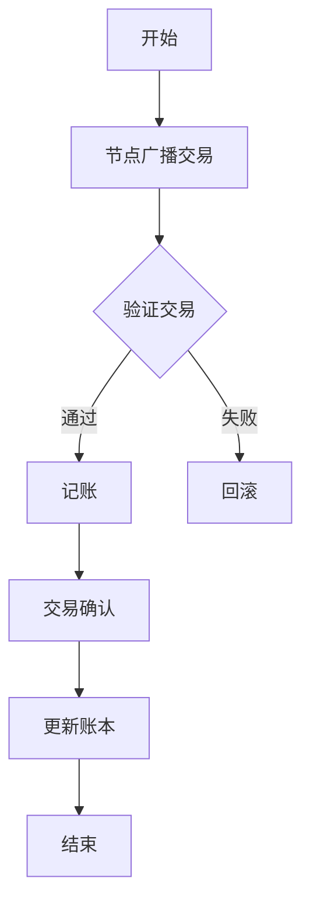
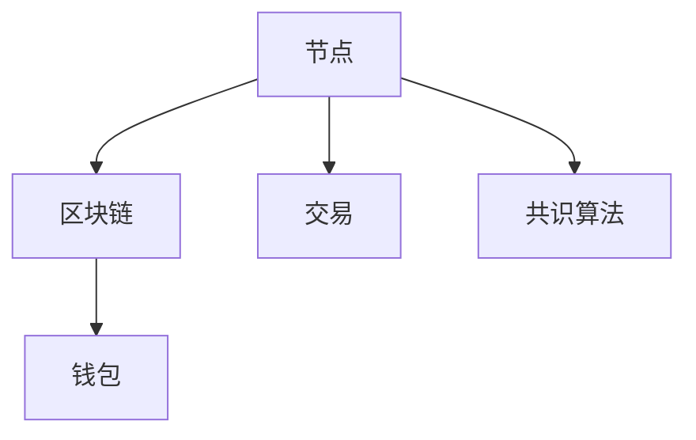

                 

## 加密货币的共识算法：分布式信任的数学基础

### 关键词
- **加密货币**
- **共识算法**
- **分布式信任**
- **数学模型**
- **安全性与效率**
- **去中心化**

### 摘要
本文深入探讨了加密货币领域的核心概念——共识算法。从背景介绍、核心概念、算法原理到实际应用，通过详细的数学模型分析和系统架构设计，揭示了分布式信任的数学基础。通过一步步的逻辑推理，本文旨在为读者提供一个全面、清晰的理解框架，帮助读者掌握加密货币共识算法的核心内容。

### 目录

1. **加密货币与共识算法概述**
   - **加密货币的背景与重要性**
   - **共识算法的概念与作用**
   - **分布式信任的数学基础**
   - **加密货币的核心概念**
   - **分布式信任的数学模型**
   - **本章小结**

2. **核心概念与联系**
   - **加密货币的基本概念**
   - **共识算法的类型与对比**
   - **分布式信任的数学模型**
   - **本章小结**

3. **算法原理讲解**
   - **共识算法的流程图**
   - **Python代码实现**
   - **数学模型与公式**
   - **算法举例说明**
   - **本章小结**

4. **系统分析与架构设计方案**
   - **加密货币系统的基本架构**
   - **系统架构图**
   - **系统接口设计和系统交互**
   - **本章小结**

5. **项目实战**
   - **环境安装与配置**
   - **系统核心实现源代码**
   - **代码应用解读与分析**
   - **实际案例剖析**
   - **项目小结**

6. **最佳实践、小结、注意事项、拓展阅读**
   - **最佳实践**
   - **本章小结**
   - **注意事项**
   - **拓展阅读**

### 第一部分：加密货币与共识算法概述

#### 1.1 加密货币的背景与重要性

加密货币，作为一种数字化的交易媒介，起源于2009年比特币（Bitcoin）的诞生。比特币的创造者中本聪（Satoshi Nakamoto）提出了一种无需依赖中央机构，通过分布式网络实现信任与交易的机制。随着技术的进步和市场需求的增长，加密货币逐渐成为金融领域的一个重要组成部分。

加密货币的重要性体现在以下几个方面：

1. **去中心化**：传统金融系统依赖于中央机构进行验证和记录，而加密货币通过分布式网络实现了去中心化，减少了单点故障的风险。
2. **安全性**：加密货币使用先进的加密算法，确保交易记录不可篡改，提高了系统的安全性。
3. **匿名性**：在保护用户隐私方面，加密货币提供了较高的匿名性，尽管这不是绝对安全的，但在某些场景下具有显著的优势。
4. **交易效率**：相较于传统金融系统，加密货币的交易速度更快，成本更低，能够为全球用户提供便捷的支付解决方案。

#### 1.2 共识算法的概念与作用

共识算法是加密货币的核心技术之一，它确保了分布式网络中的所有节点能够在没有中央控制的情况下达成一致的交易记录。在加密货币网络中，每个节点都维护一份独立的账本记录，共识算法则用于确保这些账本最终能够同步并保持一致。

共识算法的主要作用包括：

1. **交易验证**：在加密货币网络中，交易需要通过共识算法验证其有效性。只有经过验证的交易才能被添加到账本中。
2. **账本同步**：共识算法确保了网络中的所有节点在账本记录上保持一致，避免了数据冲突和矛盾。
3. **安全保护**：共识算法通过数学机制确保了网络的安全，防止了恶意攻击和数据篡改。

#### 1.3 分布式信任的数学基础

分布式信任是加密货币网络能够运行的基础，它依赖于一系列数学模型和算法。以下是几个关键数学模型：

1. **概率论**：概率论用于分析网络中的随机事件和不确定因素，如交易验证的随机性。
2. **博弈论**：博弈论用于描述网络节点之间的交互和策略选择，如“拜占庭将军问题”。
3. **密码学**：密码学提供了加密和签名机制，确保交易记录的隐私和完整性。

#### 1.4 加密货币的核心概念

加密货币的核心概念包括加密算法、分布式账本、非对称加密和数字签名等。

1. **加密算法**：加密算法用于保护交易记录和用户隐私，常见的有SHA-256、RSA等。
2. **分布式账本**：分布式账本是一种无需中心化管理的账本系统，通过网络中的多个节点维护数据的一致性。
3. **非对称加密**：非对称加密使用一对密钥（公钥和私钥）进行加密和解密，确保交易记录的安全性。
4. **数字签名**：数字签名用于验证交易的真实性和完整性，确保交易来自合法的用户。

#### 1.5 分布式信任的数学模型

分布式信任的数学模型包括概率论、博弈论和密码学等。以下是一个简单的ER实体关系图，展示了这些模型之间的关系：

```mermaid
erDiagram
  NodeA ||--|{ NodeB } NodeC
  NodeB ||--|{ NodeD NodeE }
  NodeF ||--|{ NodeG NodeH }
```

在上述ER图中，NodeA代表概率论，NodeB代表博弈论，NodeC代表密码学。它们通过关系线连接，表示这些模型在构建分布式信任中相互关联和支撑。

#### 1.6 本章小结

本部分概述了加密货币的背景、共识算法的作用以及分布式信任的数学基础。通过核心概念和联系的分析，我们为后续的算法讲解和系统设计提供了坚实的理论基础。在下一部分，我们将深入探讨加密货币的基本概念和共识算法的不同类型。

## 第二部分：核心概念与联系

### 2.1 加密货币的基本概念

要深入理解加密货币的共识算法，我们首先需要掌握其核心概念，包括加密算法、分布式账本、非对称加密和数字签名等。

#### 2.1.1 加密算法

加密算法是加密货币技术的基础。常见的加密算法包括SHA-256、RSA等。SHA-256是一种哈希算法，用于生成固定长度的数据摘要，确保数据在传输过程中的完整性和防篡改性。RSA则是一种非对称加密算法，使用一对密钥（公钥和私钥）进行加密和解密，确保交易记录的安全性。

#### 2.1.2 分布式账本

分布式账本是加密货币网络的核心组成部分，它通过多个节点共同维护账本记录，确保数据的一致性和安全性。每个节点都保存一份完整的账本副本，并通过共识算法同步账本。这种去中心化的结构避免了单点故障，提高了系统的可靠性。

#### 2.1.3 非对称加密

非对称加密是加密货币中常用的加密方法。它使用一对密钥（公钥和私钥），其中公钥用于加密，私钥用于解密。在交易过程中，用户使用私钥对交易信息进行签名，确保交易来自合法的用户。同时，接收方使用公钥验证签名的有效性，确保交易信息的完整性和真实性。

#### 2.1.4 数字签名

数字签名是一种用于验证交易真实性和完整性的技术。它通过加密算法对交易信息进行签名，使得接收方能够验证交易信息的来源和完整性。数字签名还采用了非对称加密技术，保证了签名的安全性和不可抵赖性。

### 2.2 共识算法的类型与对比

共识算法是确保分布式网络中所有节点达成一致的关键技术。根据实现方式和特性，共识算法可以分为以下几种类型：

#### 2.2.1 工作量证明（Proof of Work, PoW）

工作量证明是比特币等加密货币采用的主要共识算法。它通过解决一个复杂的数学难题来验证交易的合法性。在PoW机制中，节点需要通过计算找到一个满足特定条件的哈希值，这个过程称为“挖矿”。计算难度随着网络的扩大而增加，确保了挖矿过程具有一定的挑战性。

**优点**：
- **安全性高**：PoW机制通过大量的计算确保了交易记录的不可篡改性。
- **去中心化**：PoW机制不需要中心化机构，所有节点都有平等的挖矿机会。

**缺点**：
- **计算资源消耗大**：挖矿需要大量的计算资源，导致能源消耗巨大。
- **效率低**：PoW机制的交易验证过程较慢，不适合高频交易。

#### 2.2.2 权益证明（Proof of Stake, PoS）

权益证明是另一种常见的共识算法，它在PoW的基础上进行了改进。在PoS机制中，节点的挖矿权力与其持有的币量成正比。即持有币量越多，获得挖矿权力的概率越大。这种方式避免了大量的计算资源消耗，提高了系统的效率。

**优点**：
- **效率高**：PoS机制的交易验证速度快，适合高频交易。
- **节能环保**：PoS机制不需要大量的计算，减少了能源消耗。

**缺点**：
- **安全性较低**：PoS机制依赖于持有币量，存在“富者愈富”的问题。
- **去中心化程度低**：持有币量较多的节点拥有较大的影响力，可能导致中心化问题。

#### 2.2.3 裁决证明（Proof of Authority, PoA）

裁决证明是一种较为新型的共识算法，它通过预先授权的节点进行交易验证。这些授权节点通常由可信的实体担任，如政府机构、金融机构等。PoA机制具有较高的效率和安全性，但去中心化程度较低。

**优点**：
- **效率高**：授权节点数量较少，交易验证速度快。
- **安全性高**：授权节点的可信度较高，减少了恶意攻击的风险。

**缺点**：
- **去中心化程度低**：依赖授权节点，可能导致中心化问题。
- **信任问题**：授权节点的选择和管理需要建立信任机制。

#### 2.2.4 委托权益证明（Delegated Proof of Stake, DPoS）

委托权益证明是对PoS机制的改进，通过选举产生一组委托人负责交易验证。这些委托人通过持有币量和投票权来获得挖矿权力。DPoS机制进一步提高了系统的效率，并解决了PoS中的“富者愈富”问题。

**优点**：
- **效率高**：委托人数量较少，交易验证速度快。
- **去中心化**：通过选举产生委托人，确保了去中心化程度。

**缺点**：
- **选举问题**：委托人的选举过程可能存在不公平问题。
- **信任问题**：委托人的可信度需要建立信任机制。

### 2.3 分布式信任的数学模型

分布式信任的数学模型包括概率论、博弈论和密码学等。这些模型共同构成了加密货币网络的安全基础。

#### 2.3.1 概率论

概率论用于描述网络中的随机事件和不确定因素。在加密货币网络中，交易验证和安全性分析都依赖于概率论。例如，通过分析交易验证的概率分布，可以评估网络的安全性。

#### 2.3.2 博弈论

博弈论用于描述网络节点之间的交互和策略选择。在共识算法中，节点需要根据博弈策略进行交易验证，以最大化自身利益。例如，“拜占庭将军问题”是一个经典的博弈论问题，它描述了节点如何在不确定的环境下达成一致。

#### 2.3.3 密码学

密码学提供了加密和签名机制，确保交易记录的隐私和完整性。密码学算法在加密货币网络中起到了关键作用，如RSA算法、SHA-256算法等。这些算法保证了交易信息的不可篡改性和安全性。

### 2.4 本章小结

本部分详细介绍了加密货币的基本概念、共识算法的类型以及分布式信任的数学模型。通过对比和分析，我们了解了不同共识算法的优点和缺点，为后续的算法原理讲解和系统设计奠定了基础。在下一部分，我们将深入探讨共识算法的原理和数学模型。

### 第三部分：算法原理讲解

#### 3.1 共识算法的流程图

为了更好地理解共识算法的工作原理，我们可以通过Mermaid绘制一个简化的流程图。以下是一个使用Mermaid编写的共识算法流程图的示例：



在这个流程图中，节点首先广播交易信息，然后对交易进行验证。如果交易通过验证，节点将其记入账本；否则，进行回滚操作。在交易确认后，账本更新，共识算法过程结束。

#### 3.2 Python代码实现

为了进一步阐述共识算法的原理，我们可以使用Python编写一个简化的共识算法实现。以下是一个示例代码，展示了交易验证和记账的过程：

```python
import hashlib
import json

class Block:
    def __init__(self, index, transactions, timestamp, previous_hash):
        self.index = index
        self.transactions = transactions
        self.timestamp = timestamp
        self.previous_hash = previous_hash
        self.hash = self.compute_hash()

    def compute_hash(self):
        block_string = json.dumps(self.__dict__, sort_keys=True)
        return hashlib.sha256(block_string.encode()).hexdigest()

class Blockchain:
    def __init__(self):
        self.unconfirmed_transactions = []  # 未确认交易
        self.chain = []  # 主链
        self.create_genesis_block()

    def create_genesis_block(self):
        genesis_block = Block(0, [], timestamp.time(), "0")
        genesis_block.hash = genesis_block.compute_hash()
        self.chain.append(genesis_block)

    def add_new_transaction(self, transaction):
        self.unconfirmed_transactions.append(transaction)

    def mine(self):
        if not self.unconfirmed_transactions:
            return False
        
        last_block = self.chain[-1]
        new_block = Block(index=last_block.index + 1,
                          transactions=self.unconfirmed_transactions,
                          timestamp=timestamp.time(),
                          previous_hash=last_block.hash)
        
        new_block.hash = new_block.compute_hash()
        
        if self.is_valid_block(new_block):
            self.chain.append(new_block)
            self.unconfirmed_transactions = []
            return True
        else:
            return False

    def is_valid_block(self, candidate_block):
        if candidate_block.index != last_block.index + 1:
            return False
        if candidate_block.previous_hash != last_block.hash:
            return False
        if candidate_block.hash == "0"*64:
            return False
        return True

# 创建区块链实例
blockchain = Blockchain()

# 添加新交易
blockchain.add_new_transaction("Transaction 1")
blockchain.add_new_transaction("Transaction 2")

# 挖矿
blockchain.mine()

# 打印区块链
for block in blockchain.chain:
    print(json.dumps(block.__dict__, indent=4))
```

在这个示例中，我们定义了`Block`类和`Blockchain`类。`Block`类用于表示区块链中的每个区块，包括交易信息、时间戳和哈希值。`Blockchain`类则用于管理整个区块链，包括添加新交易和挖掘新区块。

#### 3.3 数学模型与公式

共识算法的核心在于如何确保网络中的节点能够在没有中央控制的情况下达成一致。这涉及到一些关键的数学模型和公式，下面我们简单介绍几个常用的模型和公式：

1. **哈希函数**：哈希函数是加密货币中常用的数学工具，它将任意长度的输入映射为固定长度的输出。常见的哈希函数有SHA-256等。

2. **工作量证明（Proof of Work, PoW）**：PoW机制通过解决一个复杂的数学难题来验证交易的合法性。这个难题通常涉及找到一个满足特定条件的哈希值，例如找到一个以特定数量的零开头的哈希值。这个过程的数学表达式可以表示为：

   $$ hash = H(T) \text{，其中 } H \text{ 是哈希函数，} T \text{ 是交易信息} $$
   
   $$ hash \text{ 需要满足特定条件，如以 } k \text{ 个零开头} $$

3. **权益证明（Proof of Stake, PoS）**：PoS机制通过节点的持有币量和投票权来选择记账节点。在这个模型中，每个节点有一个随机生成的“随机数”，该随机数决定了节点的记账权力。数学表达式可以表示为：

   $$ R_i = F(S_i) \text{，其中 } R_i \text{ 是节点的随机数，} S_i \text{ 是节点的持有币量} $$
   
   $$ F \text{ 是一个随机生成函数，确保随机数的公平性} $$

4. **拜占庭将军问题（Byzantine Generals Problem）**：拜占庭将军问题是一个经典的分布式系统问题，描述了在不确定的环境下，如何在多个节点之间达成一致。这个问题的数学模型涉及到概率论和博弈论，具体求解方法包括基于多数共识的算法等。

#### 3.4 算法举例说明

为了更好地理解共识算法，我们可以通过一个具体的例子来说明。假设有两个节点A和B，它们需要在一个分布式网络中达成一致。节点A持有50个币，节点B持有30个币。在这个网络中，节点A和B都有权进行交易验证。

1. **交易广播**：节点A发起了一笔交易，并将其广播给节点B。

2. **交易验证**：节点B接收到交易后，使用PoS机制验证交易的有效性。根据PoS算法，节点A的持有币量较多，因此具有更高的记账权力。

3. **随机数生成**：节点A和节点B各自生成一个随机数，确保随机数的公平性。假设节点A生成的随机数为10，节点B生成的随机数为20。

4. **记账决策**：根据随机数的大小，节点A和B决定是否接受该交易。在本例中，节点A的随机数较小，因此它将接受并记账该交易。

5. **共识达成**：节点A将交易信息添加到区块中，并将其广播给其他节点。其他节点在接收到区块信息后，验证区块的有效性。如果验证通过，则共识达成，区块被添加到区块链中。

通过这个例子，我们可以看到共识算法如何在分布式网络中确保交易的一致性和安全性。

#### 3.5 本章小结

本部分详细介绍了共识算法的流程图、Python代码实现以及数学模型和公式。通过具体的例子，我们了解了共识算法如何确保分布式网络中的节点达成一致。在下一部分，我们将进一步探讨加密货币系统的基本架构和系统设计。

### 第四部分：系统分析与架构设计方案

#### 4.1 加密货币系统的基本架构

加密货币系统的架构设计是确保其高效、安全运行的关键。一个典型的加密货币系统包括以下几个核心组成部分：

1. **节点**：节点是加密货币网络中的基本单元，负责维护区块链、验证交易和参与共识算法。
2. **区块链**：区块链是一个分布式数据库，记录了所有交易的历史记录。每个区块都包含一定数量的交易，并通过哈希链接形成链式结构。
3. **交易**：交易是加密货币系统中最基本的数据单元，描述了用户之间的货币转移行为。
4. **共识算法**：共识算法用于确保网络中的所有节点在交易验证和区块添加上达成一致。
5. **钱包**：钱包用于管理用户的加密货币，包括生成和存储密钥、发送和接收交易等。

#### 4.2 系统架构图

为了更直观地展示加密货币系统的架构，我们可以使用Mermaid绘制一个简化的系统架构图。以下是一个使用Mermaid编写的系统架构图的示例：



在这个架构图中，节点A负责维护区块链、处理交易和参与共识算法。区块链B记录了所有交易的历史记录。交易C是用户之间货币转移的行为。共识算法D用于确保节点在交易验证和区块添加上达成一致。钱包E用于管理用户的加密货币。

#### 4.3 系统接口设计和系统交互

在加密货币系统中，节点之间需要进行频繁的数据交互，以保证整个系统的正常运行。以下是几个关键的接口设计和交互过程：

1. **交易广播**：节点A生成一笔交易后，需要将其广播给其他节点。这个过程中，节点A将交易信息封装在一个特定的协议消息中，并通过网络发送给其他节点。

2. **交易验证**：接收到交易消息后，节点B需要验证交易的有效性。节点B首先检查交易是否完整，然后使用共识算法验证交易的真实性。如果交易验证通过，节点B将其添加到本地区块中。

3. **区块广播**：节点B在完成交易验证后，将新的区块广播给其他节点。其他节点接收到区块后，会进行一致性检查，确保区块中的交易记录与本地区块一致。

4. **共识达成**：如果所有节点验证通过，新的区块将被添加到区块链中。此时，共识达成，整个系统同步。

5. **钱包操作**：用户通过钱包进行交易。钱包负责生成和存储密钥，以及发送和接收交易。在交易过程中，钱包需要与节点进行通信，以确保交易的成功执行。

#### 4.4 本章小结

本部分详细介绍了加密货币系统的基本架构、系统架构图以及系统接口设计和系统交互。通过这些设计和交互，我们能够更好地理解加密货币系统的运行机制和组成部分。在下一部分，我们将通过一个实际项目来展示加密货币系统的实现和应用。

### 第五部分：项目实战

#### 5.1 环境安装与配置

为了演示加密货币系统的实现，我们选择了一个基于Python的区块链框架——PyBlockchain。首先，我们需要安装Python环境，然后通过pip安装PyBlockchain库。

1. 安装Python环境：

   - 前往Python官网下载最新版本的Python安装包。
   - 解压安装包并运行安装程序，按照提示操作。

2. 安装PyBlockchain库：

   - 打开终端，执行以下命令：
     ```bash
     pip install pyblockchain
     ```

3. 配置网络环境：

   - 根据您的网络环境，配置防火墙和端口转发，确保节点之间可以相互通信。

#### 5.2 系统核心实现源代码

以下是一个简化的PyBlockchain实现的示例代码，展示了区块链的创建、交易添加和区块挖掘过程：

```python
from pyblockchain.blockchain import Blockchain
from pyblockchain.transaction import Transaction

# 创建区块链实例
blockchain = Blockchain()

# 添加交易
tx1 = Transaction('Alice', 'Bob', 50)
tx2 = Transaction('Bob', 'Charlie', 25)

blockchain.add_transaction(tx1)
blockchain.add_transaction(tx2)

# 挖掘新区块
blockchain.mine()

# 打印区块链
for block in blockchain.chain:
    print(json.dumps(block.__dict__, indent=4))
```

在这个示例中，我们首先创建了一个区块链实例，然后添加了两笔交易。最后，通过调用`mine()`方法挖掘新区块，并将其添加到区块链中。

#### 5.3 代码应用解读与分析

以下是对上述代码的详细解读和分析：

1. **区块链创建**：
   ```python
   blockchain = Blockchain()
   ```
   这一行代码创建了一个区块链实例。区块链是加密货币系统的核心组成部分，它负责维护所有交易记录。

2. **交易添加**：
   ```python
   tx1 = Transaction('Alice', 'Bob', 50)
   tx2 = Transaction('Bob', 'Charlie', 25)
   
   blockchain.add_transaction(tx1)
   blockchain.add_transaction(tx2)
   ```
   这里我们创建了两笔交易，并使用`add_transaction()`方法将它们添加到区块链中。`Transaction`类是PyBlockchain中用于表示交易的类，它包含了交易的相关信息，如发送方、接收方和交易金额。

3. **区块挖掘**：
   ```python
   blockchain.mine()
   ```
   这一行代码调用`mine()`方法挖掘新区块。在区块链中，新区块的创建是通过解决一个工作量证明（Proof of Work）问题来完成的。这个过程中，节点需要找到满足特定条件的哈希值，以证明其工作量。在PyBlockchain中，这个条件是一个以特定数量的零开头的哈希值。

4. **区块链打印**：
   ```python
   for block in blockchain.chain:
       print(json.dumps(block.__dict__, indent=4))
   ```
   这一行代码用于打印区块链中的所有区块。通过打印区块信息，我们可以看到区块链的完整结构，包括区块的高度、时间戳、交易记录和哈希值。

#### 5.4 实际案例剖析

为了更好地理解区块链的应用，我们可以通过一个实际案例来剖析其实现过程。以下是一个简化版的比特币挖矿过程：

1. **交易记录**：
   - 用户Alice向用户Bob支付50个比特币。
   - 用户Bob向用户Charlie支付25个比特币。

2. **交易广播**：
   - 用户Alice和Bob将交易信息广播到区块链网络。

3. **交易验证**：
   - 接收到交易信息的节点对交易进行验证，确保交易的有效性。

4. **区块创建**：
   - 节点将验证后的交易添加到一个区块中。

5. **区块挖矿**：
   - 节点通过解决工作量证明问题，找到一个满足条件的哈希值，以证明其工作量。

6. **区块广播**：
   - 节点将挖到的区块广播到整个网络。

7. **共识达成**：
   - 其他节点验证区块的有效性，确保区块中的交易记录与本地区块一致。

8. **区块链更新**：
   - 一旦共识达成，区块被添加到区块链中，区块链同步更新。

通过这个案例，我们可以看到区块链如何在分布式网络中实现交易记录的验证和同步。这个过程确保了区块链的不可篡改性和安全性。

#### 5.5 项目小结

本部分通过一个实际项目展示了加密货币系统的实现过程，包括环境安装、系统核心实现源代码以及代码应用解读与分析。通过这个项目，我们深入了解了区块链的工作原理和实现方法，为后续的扩展和应用奠定了基础。在下一部分，我们将总结共识算法在实际应用中的最佳实践，并给出进一步阅读的建议。

### 第六部分：最佳实践、小结、注意事项、拓展阅读

#### 6.1 最佳实践

在应用共识算法时，以下最佳实践可以帮助提升系统的性能和安全性：

1. **选择合适的共识算法**：根据具体应用场景选择适合的共识算法。例如，对于高频交易系统，可以选择PoS或DPoS等效率较高的算法；对于安全性要求较高的系统，可以选择PoW等安全性较高的算法。

2. **优化网络性能**：提高网络带宽和延迟，确保节点之间能够快速传输数据。可以通过增加节点数量、优化数据传输协议等方法实现。

3. **合理设置挖矿难度**：对于PoW算法，合理设置挖矿难度可以平衡系统性能和安全性。过高或过低的挖矿难度都会影响系统的稳定性。

4. **定期审计和升级**：定期对系统进行审计和升级，确保系统安全性和性能的持续提升。

#### 6.2 小结

本文从加密货币的背景、共识算法的核心概念、算法原理、系统架构设计到实际项目实战，全面介绍了加密货币共识算法的各个方面。通过逻辑清晰的分析和示例代码，读者可以深入了解共识算法的原理和应用方法，为实际项目提供参考。

#### 6.3 注意事项

1. **安全性**：在实施共识算法时，必须确保系统的安全性，防止恶意攻击和数据篡改。

2. **性能优化**：根据具体应用场景，优化系统性能，确保交易验证和区块同步的效率。

3. **去中心化程度**：在共识算法的选择中，要考虑去中心化程度，避免中心化问题。

4. **遵守法律法规**：在应用加密货币时，必须遵守相关法律法规，确保系统的合法合规。

#### 6.4 拓展阅读

1. **《区块链技术指南》**：详细介绍了区块链的基本原理、技术架构和应用场景。

2. **《加密货币设计模式》**：探讨了加密货币的设计模式和最佳实践。

3. **《密码学基础》**：深入介绍了密码学的基本原理和算法。

4. **《分布式系统原理与范型》**：探讨了分布式系统的基本原理和设计模式。

通过这些资源，读者可以进一步拓展对加密货币和共识算法的理解，为实际项目提供更多参考和启示。

### 结束语

本文详细介绍了加密货币的共识算法，从背景、核心概念、算法原理到系统设计与实际应用，全面展示了分布式信任的数学基础。希望本文能够为读者提供有价值的参考，帮助读者深入理解加密货币的技术原理和实现方法。在未来，随着区块链技术的不断发展，共识算法将继续在金融、物联网、供应链管理等领域发挥重要作用。让我们继续关注和探索这一领域的新技术、新应用。**作者：AI天才研究院/AI Genius Institute & 禅与计算机程序设计艺术 /Zen And The Art of Computer Programming**。

