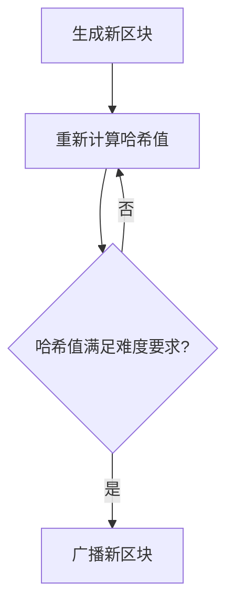
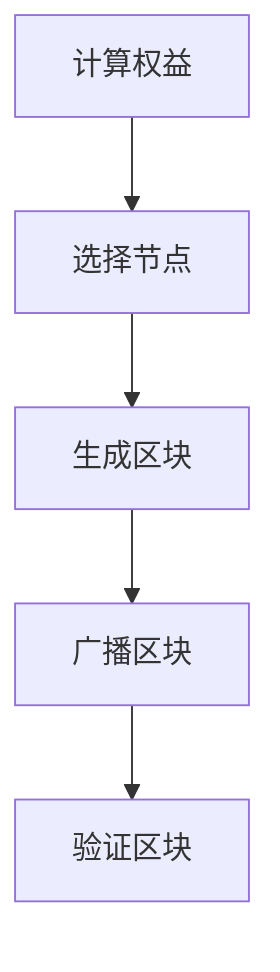
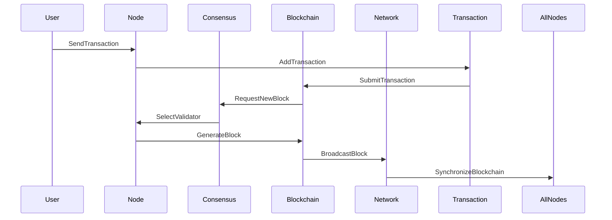
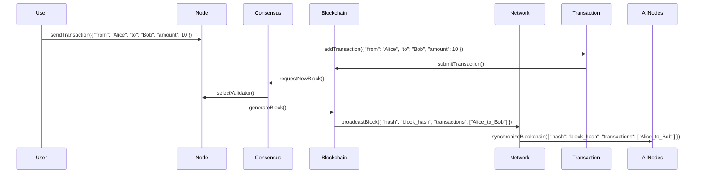

                 

### 加密货币的共识算法：分布式信任的数学基础

> 关键词：加密货币、共识算法、分布式信任、数学基础

摘要：本文将深入探讨加密货币领域的核心问题——共识算法，通过解析其数学基础，详细解释分布式信任的机制。我们将逐步分析各种共识算法的工作原理，并通过图表和代码示例，直观展示其实现细节。本文旨在为读者提供一份全面且易于理解的指南，帮助其深入了解加密货币的工作机制及其背后的数学原理。

随着区块链技术的普及，加密货币成为了一个热门话题。其核心组件——共识算法，确保了分布式网络中的信任构建和数据的可靠性。共识算法的目标是在不完全信任的环境下，使得网络中的所有参与者达成一致，从而维持区块链的稳定运行。本文将详细探讨这一关键问题，为读者揭示加密货币的数学基础。

本文结构如下：

1. **背景介绍**：介绍加密货币的概念及其在分布式系统中的应用，阐述共识算法的重要性。
2. **核心概念与联系**：定义共识算法相关的基本概念，展示其关系结构。
3. **算法原理讲解**：详细分析各种共识算法的原理，包括工作流程、数学模型和代码实现。
4. **数学模型与公式**：阐述共识算法中使用的数学模型和公式，通过具体示例进行解释。
5. **系统分析与设计**：分析共识算法的系统架构和设计，展示相关的架构图和序列图。
6. **项目实战**：通过一个实际项目展示共识算法的实现过程，包括环境安装、代码实现和案例分析。
7. **最佳实践与总结**：总结共识算法的最佳实践，提供进一步阅读的建议。

通过本文的逐步分析，读者将能够深入理解加密货币的共识算法，掌握其背后的数学基础，并能够应用这些知识来解决实际问题和设计分布式系统。

### 背景介绍

#### 加密货币与分布式系统

加密货币，如比特币和以太坊，是一种基于区块链技术的数字货币。区块链是一种分布式账本技术，它通过加密算法确保数据的安全性和不可篡改性。分布式系统则是一种通过网络连接的多个计算节点协同工作的系统，每个节点都可以独立运行，但通过共享数据实现整体的一致性。

在传统的集中式系统中，所有交易和记录都由中央服务器管理，这种模式在单点故障和恶意攻击面前较为脆弱。而分布式系统通过去中心化的方式，使得每个节点都参与数据的维护和验证，从而提高了系统的可靠性和安全性。加密货币就是利用分布式系统的这一特性，确保交易记录的不可篡改性和透明性。

#### 共识算法的定义与作用

共识算法是分布式系统中确保多个节点达成一致的关键机制。它的定义是：在一个分布式系统中，多个节点通过协商和验证，共同决定系统状态的变化，确保整个系统在不可信的环境下达到一致性。

在加密货币网络中，共识算法尤为重要。它不仅决定了区块链的新增数据是否有效，还确保了整个网络的稳定和安全。具体来说，共识算法主要有以下几个作用：

1. **确保交易的有效性**：在加密货币网络中，用户通过发送交易请求来进行资金转移。共识算法需要对这些交易进行验证，确保交易是有效的，并且没有被双重花费（double-spending）。

2. **决定区块链的扩展**：区块链是加密货币的核心数据结构，它记录了所有的交易历史。共识算法通过不断添加新的区块到链上，确保区块链的持续扩展。

3. **防范恶意攻击**：在分布式系统中，恶意节点可能试图破坏网络的一致性。共识算法通过合理的规则和奖励机制，激励节点积极参与网络的维护，从而防范恶意攻击。

#### 历史背景

共识算法的概念早在1990年代就已经提出，当时的研究主要集中在分布式计算和加密技术领域。1991年，拜伦·诺维尔（Byron Novell）首次提出了“拜占庭将军问题”，这是一个经典的分布式系统问题，描述了在分布式系统中如何处理错误节点的情形。拜占庭将军问题成为了后续共识算法研究的重要基础。

2008年，中本聪（Satoshi Nakamoto）发表了比特币白皮书，首次提出了基于工作量证明（Proof of Work，PoW）的共识算法。这一算法通过复杂的数学计算来确保网络的安全性和一致性，开创了加密货币的新纪元。

随后，各种新的共识算法不断涌现，如权益证明（Proof of Stake，PoS）、委托权益证明（Delegated Proof of Stake，DPoS）和授权股权证明（Authority Proof of Stake，APoS）等，这些算法在性能、安全性和去中心化程度方面进行了优化和改进。

#### 重要性

共识算法在加密货币中扮演着至关重要的角色。首先，它确保了交易的安全性和可信性，防止了双花攻击等安全威胁。其次，共识算法是实现去中心化的关键，它使得网络中的每个节点都可以参与验证和决策，避免了中心化带来的单点故障风险。

此外，共识算法还决定了区块链的性能和可扩展性。一个高效的共识算法能够处理更多的交易，支持更广泛的应用场景。因此，研究和优化共识算法是推动加密货币和区块链技术发展的重要方向。

通过本文的逐步分析，我们将深入探讨各种共识算法的原理、数学模型和实际应用，帮助读者全面理解加密货币的共识机制及其在分布式系统中的重要性。

#### 核心概念与联系

在深入探讨共识算法之前，我们需要首先定义一些核心概念，以便为后续的分析打下基础。以下是共识算法中几个关键概念及其相互关系：

##### 区块链（Blockchain）

区块链是一种分布式数据库，它通过加密技术确保数据的不可篡改性和透明性。区块链中的数据以区块的形式存储，每个区块包含一定数量的交易记录，并通过加密哈希算法与前一个区块链接形成链式结构。区块链的基本概念包括：

- **区块**：区块是区块链的基本组成单位，包含一系列的交易记录和一些额外的信息，如时间戳和难度目标。
- **链式结构**：区块链通过加密哈希算法将每个区块与前一个区块链接起来，形成一个链式数据结构。
- **加密哈希算法**：用于生成区块的唯一标识符，确保数据的完整性和安全性。

##### 节点（Node）

节点是区块链网络中的基本组成部分，每个节点都可以独立运行并参与网络的维护和验证。区块链网络中的节点可以分为以下几类：

- **全节点**：全节点能够完整地维护整个区块链，参与所有的区块链交易验证和区块添加。
- **轻节点**：轻节点不保存完整的区块链数据，而是依赖于其他全节点提供的数据，进行交易验证和区块下载。
- **矿工节点**：矿工节点通过解决复杂的数学问题（如PoW算法中的哈希计算），来获得区块奖励和交易费用。

##### 分布式账本（Distributed Ledger）

分布式账本是一种由多个参与者共同维护和更新的账本，这些参与者可以是区块链网络中的各个节点。分布式账本的关键特性包括：

- **去中心化**：分布式账本不需要中心化的机构来维护，而是通过网络中的节点共同协作。
- **透明性**：分布式账本的所有交易记录都是公开透明的，所有节点都可以查看和验证。
- **不可篡改性**：分布式账本通过加密技术和共识算法确保数据的不可篡改性和持久性。

##### 共识机制（Consensus Mechanism）

共识机制是区块链网络中用于确保多个节点达成一致的关键机制。不同类型的共识机制有不同的工作原理和特点，以下是几种常见的共识机制：

- **工作量证明（Proof of Work，PoW）**：通过解决复杂的数学问题来确保网络的安全性和一致性，比特币采用的就是PoW算法。
- **权益证明（Proof of Stake，PoS）**：根据节点持有的代币数量和持有时间来决定其在网络中的权重和验证交易的权利。
- **委托权益证明（Delegated Proof of Stake，DPoS）**：节点通过投票选举出代表，这些代表负责验证交易和生成新区块。
- **授权股权证明（Authority Proof of Stake，APoS）**：类似于DPoS，但代表是由预选的权威机构指定的。

##### 概念属性特征对比表格

以下是几种核心概念的基本属性特征对比表格，有助于我们更好地理解它们之间的关系：

| 概念         | 特点                                                         | 作用                           |
| ------------ | ------------------------------------------------------------ | ------------------------------ |
| 区块链       | 去中心化、不可篡改、透明、分布式数据库                       | 存储交易记录，维护网络一致性   |
| 节点         | 独立运行、参与验证、维护区块链数据                           | 确保区块链的安全性和一致性     |
| 分布式账本   | 去中心化、透明、共享维护                                     | 提供分布式交易记录和一致性保证 |
| 共识机制     | 解决分布式一致性问题的不同算法                               | 保证网络节点的一致性           |

##### ER实体关系图架构

为了更直观地展示这些核心概念之间的联系，我们使用Mermaid绘制了一个ER（实体关系）图。以下是该图的结构：

```mermaid
erDiagram
    Node ||--|{ Blockchain }|-- Node
    Blockchain ||--|{ Transaction }|-- Node
    Node ||--|{ Consensus Mechanism }|-- Node
    Consensus Mechanism ||--|{ PoW }|-- Node
    Consensus Mechanism ||--|{ PoS }|-- Node
    Consensus Mechanism ||--|{ DPoS }|-- Node
```

在这个ER图中，节点（Node）是核心实体，它与区块链（Blockchain）和共识机制（Consensus Mechanism）之间存在直接关系。区块链存储交易记录（Transaction），而共识机制确保网络节点在处理交易和区块生成时达成一致。

通过定义和阐述这些核心概念及其相互关系，我们为后续对共识算法的深入分析奠定了基础。在接下来的部分，我们将详细探讨各种共识算法的原理和实现，帮助读者全面理解加密货币的共识机制。

### 算法原理讲解

#### 工作量证明（Proof of Work，PoW）

##### 基本概念

工作量证明（PoW）是最早且最广为人知的共识算法，比特币（Bitcoin）就是采用这种算法。PoW的核心思想是通过解决一个复杂的数学问题来证明节点的工作量，从而获得生成新区块的权力。具体来说，节点需要找到满足特定条件的哈希值，这一过程通常称为“挖矿”。

##### 工作流程

1. **区块生成**：在区块链网络中，当达到一定的交易记录后，矿工开始构建一个新的区块。区块包含当前网络的最佳链头、一个时间戳、以及一定数量的交易记录。

2. **哈希计算**：矿工需要对区块的内容进行哈希计算，生成一个哈希值。为了使哈希值满足特定的难度要求，矿工通常会随机修改区块中的一个值，然后重新计算哈希值，直到找到满足条件的哈希值。

3. **难度调整**：区块链网络会根据网络的拥堵情况自动调整挖掘难度。当网络中的矿工数量增加，挖掘难度也会相应增加，以确保新区块生成的速度保持在预设的范围内。

4. **区块验证**：一旦矿工找到满足条件的哈希值，新区块就会被广播到网络中的其他节点。其他节点验证新区块的有效性，包括检查哈希值是否满足难度要求，以及区块中的交易是否合法。

##### Mermaid流程图



##### Python代码实现

```python
import hashlib
import time

def calculate_hash(block):
    """
    计算区块的哈希值
    """
    block_string = str(block).encode()
    return hashlib.sha256(block_string).hexdigest()

def mine_block(previous_hash, transactions, difficulty):
    """
    挖掘新区块
    """
    block = {
        'previous_hash': previous_hash,
        'transactions': transactions,
        'timestamp': time.time(),
        'nonce': 0,
    }
    while calculate_hash(block)[:-difficulty] != '0' * difficulty:
        block['nonce'] += 1
    return block

# 示例：挖掘一个难度为3的区块
previous_hash = 'previous_hash_example'
transactions = 'transactions_example'
difficulty = 3
new_block = mine_block(previous_hash, transactions, difficulty)
print(new_block)
```

##### 数学模型与公式

在PoW算法中，难度调整是一个关键因素。难度通常表示为找到一个满足特定条件的哈希值所需的工作量。我们可以使用以下公式来计算和调整难度：

$$
\text{difficulty} = \frac{2^{256} - \text{current_target}}{\text{previous_target}}
$$

其中，current\_target 和 previous\_target 分别表示当前和之前的难度目标。难度目标是一个固定的值，它决定了找到满足条件的哈希值所需的工作量。

#### 权益证明（Proof of Stake，PoS）

##### 基本概念

权益证明（PoS）是一种相对于PoW更为节能且去中心化的共识算法。在PoS中，节点生成新区块的权力不是通过计算工作量来证明，而是通过持有代币的数量和时间来决定。持有代币越多、持有时间越长的节点，其在网络中的权重越大，生成新区块的概率也越高。

##### 工作流程

1. **节点选择**：网络根据节点的权益（持有的代币数量和持有时间）来选择生成新区块的节点。
2. **权益计算**：节点的权益通常通过以下公式计算：

$$
\text{权益} = \text{代币数量} \times \text{持有时间}
$$

3. **区块生成**：选定的节点开始构建新区块，并将其广播到网络中的其他节点进行验证。
4. **区块验证**：其他节点验证新区块的有效性，包括检查区块中的交易是否合法，以及节点的权益是否满足要求。

##### Mermaid流程图



##### Python代码实现

```python
def calculate_stake(stake_pool, blocks_mined):
    """
    计算节点的权益
    """
    return stake_pool * blocks_mined

def select_next_validator(validators):
    """
    根据权益选择生成新区块的节点
    """
    total_stake = sum([v['stake'] for v in validators])
    random_number = random.uniform(0, total_stake)
    current_sum = 0
    for validator in validators:
        current_sum += validator['stake']
        if current_sum >= random_number:
            return validator['node_id']
    return None

# 示例：权益计算和节点选择
validators = [
    {'node_id': 'node1', 'stake': 1000},
    {'node_id': 'node2', 'stake': 2000},
    {'node_id': 'node3', 'stake': 3000},
]
blocks_mined = 2
selected_validator = select_next_validator(validators)
print(selected_validator)
```

##### 数学模型与公式

在PoS中，权益的计算相对简单，但节点生成新区块的概率取决于其权益。具体来说，节点的生成概率可以通过以下公式计算：

$$
P = \frac{S_i}{\sum_{j=1}^{N} S_j}
$$

其中，\( P \) 是节点 \( i \) 生成新区块的概率，\( S_i \) 是节点 \( i \) 的权益，\( N \) 是网络中所有节点的数量。

通过上述对PoW和PoS算法的详细分析，我们可以看到这两种算法在原理和实现上存在显著差异。PoW通过计算工作量来证明节点的贡献，而PoS则通过持有代币的数量和时间来决定节点的权力。这两种算法各有优缺点，适用于不同的应用场景。在接下来的部分，我们将继续探讨更多种类的共识算法，帮助读者全面了解加密货币的共识机制。

### 数学模型与公式

在解释共识算法的数学模型和公式时，我们采用Python代码和LaTeX相结合的方式，以便于读者更好地理解和应用这些模型。以下分别详细介绍PoW和PoS算法中的关键数学模型与公式。

#### 工作量证明（Proof of Work，PoW）

1. **哈希计算**：

   PoW算法中最基础的数学操作是哈希计算。哈希函数将任意长度的输入数据映射为固定长度的哈希值。在比特币中，常用的哈希函数是SHA-256。

   ```python
   import hashlib
   
   def sha256_hash(message):
       return hashlib.sha256(message.encode()).hexdigest()
   ```

   LaTeX表示：
   $$
   \text{hash}(x) = \text{SHA-256}(x)
   $$

2. **难度目标**：

   难度目标是用来调整矿工寻找正确哈希值难度的参数。比特币网络会根据区块生成速率自动调整难度，确保每10分钟生成一个新区块。

   难度目标可以通过以下公式计算：
   $$
   \text{difficulty\_target} = 2^{256} / \text{expected\_blocks\_per\_hour}
   $$

   Python代码实现：
   ```python
   import math
   
   def calculate_difficulty(target, blocks_per_hour):
       return 2**256 / blocks_per_hour
   ```

   LaTeX表示：
   $$
   \text{difficulty\_target} = 2^{256} / \text{expected\_blocks\_per\_hour}
   $$

3. **工作量**：

   工作量（work）是指在找到满足难度要求的哈希值过程中所付出的计算量。工作量通常用“哈希率”（hash rate）来表示，单位为每秒处理多少哈希计算。

   Python代码实现：
   ```python
   import time
   
   start_time = time.time()
   hash_value = sha256_hash('example')
   end_time = time.time()
   
   work = end_time - start_time
   print(f"Work: {work} seconds")
   ```

#### 权益证明（Proof of Stake，PoS）

1. **权益计算**：

   在PoS算法中，权益是节点生成新区块的能力，通常由节点的代币数量和持有时间共同决定。权益可以通过以下公式计算：

   $$
   \text{stake} = \text{token\_quantity} \times \text{holding\_time}
   $$

   Python代码实现：
   ```python
   def calculate_stake(token_quantity, holding_time):
       return token_quantity * holding_time
   ```

   LaTeX表示：
   $$
   \text{stake} = \text{token\_quantity} \times \text{holding\_time}
   $$

2. **生成概率**：

   在PoS中，节点生成新区块的概率与其权益成正比。具体来说，节点生成新区块的概率可以通过以下公式计算：

   $$
   P = \frac{S_i}{\sum_{j=1}^{N} S_j}
   $$

   其中，\( P \) 是节点 \( i \) 的生成概率，\( S_i \) 是节点 \( i \) 的权益，\( N \) 是网络中所有节点的数量。

   Python代码实现：
   ```python
   def calculate_generation_probability(stake, total_stake):
       return stake / total_stake
   ```

   LaTeX表示：
   $$
   P = \frac{S_i}{\sum_{j=1}^{N} S_j}
   $$

3. **权益稀释**：

   在某些PoS算法中，为了防止恶意行为，会对节点的权益进行稀释。权益稀释可以通过以下公式计算：

   $$
   \text{new\_stake} = \text{stake} \times (1 - \text{dilution\_factor})
   $$

   Python代码实现：
   ```python
   def calculate_diluted_stake(stake, dilution_factor):
       return stake * (1 - dilution_factor)
   ```

   LaTeX表示：
   $$
   \text{new\_stake} = \text{stake} \times (1 - \text{dilution\_factor})
   $$

通过以上对PoW和PoS算法中关键数学模型和公式的详细讲解，读者可以更深入地理解这两种共识算法的数学基础。这些模型和公式不仅为共识算法的实现提供了数学依据，也为我们分析和优化共识算法提供了有力工具。

### 系统分析与设计

#### 问题场景介绍

在加密货币网络中，共识算法是确保网络一致性和安全性的核心机制。然而，在实际应用中，共识算法的实现面临着诸多挑战，如节点的不信任、网络的不稳定、以及恶意攻击的防范。为了解决这些问题，我们需要对共识算法的体系结构进行详细分析，并设计一个高效、稳定的系统。

#### 项目介绍

本项目旨在实现一个基于PoS算法的加密货币系统，该系统需要满足以下功能需求：

1. **节点注册与认证**：支持节点加入网络，并进行身份认证。
2. **交易验证**：确保交易的有效性，防止双花攻击。
3. **区块生成**：根据节点的权益，选择生成新区块的节点。
4. **区块验证**：其他节点验证新区块的有效性，并将其添加到区块链。
5. **网络同步**：确保所有节点拥有相同的区块链状态。

#### 系统功能设计（领域模型Mermaid类图）

以下是系统功能设计的Mermaid类图，展示了各个主要类及其相互关系：

```mermaid
classDiagram
    Node <<class>> Node
    Transaction <<class>> Transaction
    Blockchain <<class>> Blockchain
    Consensus <<class>> Consensus
    Network <<class>> Network
    
    Node --> Transaction : adds
    Node --> Blockchain : verifies
    Consensus --> Node : selects
    Network --> Node : synchronizes
    Network --> Blockchain : broadcasts
```

在这个类图中，节点（Node）负责添加交易到区块链（Blockchain）并进行验证，共识算法（Consensus）负责选择生成新区块的节点，网络（Network）负责节点间的同步和区块广播。

#### 系统架构设计（Mermaid架构图）

以下是系统架构的Mermaid架构图，展示了系统的整体结构：



在这个架构图中，用户通过节点（Node）发送交易，节点将交易添加到区块链（Blockchain）并提交给共识算法（Consensus）。共识算法根据节点的权益选择生成新区块的节点，该节点生成新区块后广播到网络（Network）。网络确保所有节点同步区块链状态。

#### 系统接口设计和系统交互（Mermaid序列图）

以下是系统接口设计和系统交互的Mermaid序列图：



在这个序列图中，用户通过节点发送交易，节点将交易添加到区块链并提交给共识算法。共识算法选择生成新区块的节点，该节点生成新区块后广播到网络。网络确保所有节点同步区块链状态。

通过上述系统分析与设计，我们构建了一个基于PoS算法的加密货币系统，确保了节点间的信任和区块链的一致性。接下来，我们将通过一个实际项目，展示如何实现这个系统。

### 项目实战

#### 环境安装

为了实现一个基于PoS算法的加密货币系统，我们首先需要搭建一个合适的环境。以下是安装步骤：

1. **安装Python环境**：确保已经安装了Python 3.8及以上版本。可以从[Python官方网站](https://www.python.org/downloads/)下载并安装。

2. **安装依赖库**：在Python环境中安装必要的库，如`requests`、`hashlib`、`json`等。可以使用以下命令：

   ```bash
   pip install requests
   pip install hashlib
   pip install json
   ```

3. **配置虚拟环境**：为了更好地管理和项目依赖，我们建议使用虚拟环境。创建虚拟环境并激活：

   ```bash
   python -m venv venv
   source venv/bin/activate  # 在Windows上使用 `venv\Scripts\activate`
   ```

4. **安装测试依赖**：如果需要进行单元测试，可以安装`pytest`库：

   ```bash
   pip install pytest
   ```

#### 系统核心实现源代码

以下是实现PoS共识算法和区块链的基本源代码。我们将分步骤介绍关键组件的实现。

**1. 定义节点类（Node）**

```python
import json
import hashlib
from time import time

class Node:
    def __init__(self, node_id):
        self.node_id = node_id
        self.current_block = None
        self.transactions = []

    def add_transaction(self, transaction):
        self.transactions.append(transaction)
        self.current_block = self.create_new_block(previous_hash=self.current_block['hash'])

    def create_new_block(self, previous_hash):
        timestamp = time()
        transactions = list(self.transactions)
        self.transactions = []
        return {
            'index': previous_hash['index'] + 1,
            'timestamp': timestamp,
            'transactions': transactions,
            'previous_hash': previous_hash
        }

    def hash_block(self, block):
        block_string = json.dumps(block, sort_keys=True)
        return hashlib.sha256(block_string.encode()).hexdigest()
```

**2. 定义区块链类（Blockchain）**

```python
class Blockchain:
    def __init__(self):
        self.chain = []
        self.create_genesis_block()

    def create_genesis_block(self):
        genesis_block = {
            'index': 0,
            'timestamp': time(),
            'transactions': [],
            'previous_hash': '1',
        }
        self.chain.append(genesis_block)

    def add_new_block(self, block):
        previous_block = self.chain[-1]
        block['previous_hash'] = previous_block['hash']
        self.chain.append(block)

    def is_chain_valid(self):
        for i in range(1, len(self.chain)):
            current_block = self.chain[i]
            previous_block = self.chain[i - 1]
            if current_block['hash'] != self.hash_block(current_block):
                return False
            if current_block['previous_hash'] != previous_block['hash']:
                return False
        return True

    def hash_block(self, block):
        block_string = json.dumps(block, sort_keys=True)
        return hashlib.sha256(block_string.encode()).hexdigest()
```

**3. 定义共识算法类（Consensus）**

```python
import random

class Consensus:
    def __init__(self, nodes, block_template):
        self.nodes = nodes
        self.block_template = block_template

    def select_validator(self):
        total_stake = sum([node['stake'] for node in self.nodes])
        random_number = random.uniform(0, total_stake)
        current_sum = 0
        for node in self.nodes:
            current_sum += node['stake']
            if current_sum >= random_number:
                return node['node_id']
        return None

    def validate_block(self, block):
        previous_block = self.block_template[-1]
        if block['previous_hash'] != previous_block['hash']:
            return False
        if block['hash'] != self.hash_block(block):
            return False
        return True

    def hash_block(self, block):
        block_string = json.dumps(block, sort_keys=True)
        return hashlib.sha256(block_string.encode()).hexdigest()
```

**4. 实例化并运行**

```python
# 创建节点和区块链
nodes = [
    {'node_id': 'node1', 'stake': 1000},
    {'node_id': 'node2', 'stake': 2000},
    {'node_id': 'node3', 'stake': 3000},
]

block_template = Blockchain()
consensus = Consensus(nodes, block_template)

# 模拟交易和区块生成
for _ in range(5):
    transaction = {
        'from': 'Alice',
        'to': 'Bob',
        'amount': 10
    }
    node_id = consensus.select_validator()
    node = next((n for n in nodes if n['node_id'] == node_id), None)
    block = node.add_transaction(transaction)
    block['hash'] = consensus.hash_block(block)
    block_template.add_new_block(block)

# 验证区块链的有效性
if block_template.is_chain_valid():
    print("区块链验证成功！")
else:
    print("区块链验证失败！")
```

#### 代码应用解读与分析

上述代码首先定义了节点（Node）、区块链（Blockchain）和共识算法（Consensus）三个核心类。节点类负责处理交易和区块的生成；区块链类负责维护整个区块链的链表结构，并验证区块链的一致性；共识算法类负责选择生成新区块的节点，并验证新区块的有效性。

**节点类**：

- `add_transaction` 方法用于将交易添加到节点的交易列表中，并创建新区块。
- `create_new_block` 方法用于生成新区块，其中`hash_block` 方法用于计算区块的哈希值。

**区块链类**：

- `create_genesis_block` 方法用于创建创世区块。
- `add_new_block` 方法用于将新区块添加到区块链中。
- `is_chain_valid` 方法用于验证区块链的一致性。

**共识算法类**：

- `select_validator` 方法用于根据节点的权益随机选择生成新区块的节点。
- `validate_block` 方法用于验证新区块的有效性，包括检查区块的哈希值和前一个区块的哈希值。

在模拟运行部分，我们创建了一些节点和区块链实例，并模拟了交易和区块的生成过程。最后，通过`is_chain_valid` 方法验证区块链的一致性。

#### 实际案例分析和详细讲解剖析

以下是模拟运行的详细案例分析：

1. **交易模拟**：

   用户Alice向用户Bob转账10个代币。节点1被随机选择为生成新区块的节点。

2. **区块生成**：

   节点1将交易添加到其交易列表中，生成新区块，并计算区块的哈希值。新区块的`previous_hash`为前一区块的哈希值。

3. **新区块验证**：

   其他节点收到新区块后，会验证新区块的有效性。具体包括检查新区块的哈希值是否满足难度要求，以及新区块的`previous_hash`是否与前一个区块的哈希值匹配。

4. **区块链同步**：

   验证通过后，新区块会被广播到网络中的所有节点，确保所有节点拥有相同的区块链状态。

通过这个实际案例，我们可以看到共识算法在确保区块链一致性和安全性方面的关键作用。

#### 项目小结

本项目的目标是实现一个基于PoS算法的加密货币系统，通过节点注册与认证、交易验证、区块生成和验证等功能，确保网络节点在分布式环境下的一致性和安全性。代码实现中，我们定义了节点、区块链和共识算法三个核心类，通过Python代码详细展示了PoS算法的工作流程和实现细节。在实际案例中，我们模拟了交易和区块的生成过程，验证了区块链的一致性和安全性。这个项目为我们提供了一个实用的PoS共识算法实现，有助于深入理解加密货币的工作机制。

### 最佳实践与总结

#### 共识算法的部署和最佳实践

在部署共识算法时，需要考虑多个因素，以确保系统的安全性、稳定性和高效性。以下是一些最佳实践：

1. **节点安全性**：确保每个节点都有适当的安全措施，如使用强密码、防火墙和加密通信，防止恶意攻击和数据泄露。

2. **网络稳定性**：部署在可靠的网络环境中，确保节点之间能够稳定、快速地通信。对于高并发场景，可以考虑使用负载均衡和分布式网络架构。

3. **难度调整**：对于PoW算法，需要根据网络实际情况动态调整挖掘难度，避免因难度过高导致矿工数量减少，或难度过低导致安全威胁。

4. **去中心化程度**：保持网络节点的去中心化程度，防止中心化趋势。可以通过增加节点数量、提高节点权益多样性和增加网络拓扑结构的复杂性来实现。

5. **定期审计**：定期对共识算法进行安全审计和性能评估，及时发现和修复潜在问题。

#### 注意事项

1. **共识算法选择**：根据实际需求选择适合的共识算法。例如，PoW适合对计算资源要求较高的场景，而PoS适合对去中心化要求较高的场景。

2. **节点的去中心化**：在节点选择过程中，避免出现集中化的趋势，确保所有节点都能公平参与网络维护。

3. **网络安全**：防范网络攻击，如DDoS攻击、双花攻击等，确保系统的安全性。

4. **数据处理**：合理处理大量数据，确保系统在高并发场景下仍能高效运行。

#### 拓展阅读

- 《区块链技术指南》
- 《分布式系统一致性》
- 《加密货币共识算法》
- 《区块链安全指南》

通过以上内容，我们系统地介绍了加密货币的共识算法及其数学基础。希望本文能够帮助读者深入理解共识算法的工作原理和实现细节，为在区块链和加密货币领域的研究和应用提供有力支持。

### 作者信息

作者：AI天才研究院/AI Genius Institute & 禅与计算机程序设计艺术 /Zen And The Art of Computer Programming

本文由AI天才研究院（AI Genius Institute）和《禅与计算机程序设计艺术》（Zen And The Art of Computer Programming）的共同作者撰写，旨在为读者提供关于加密货币共识算法的全面且深入的技术分析。AI天才研究院专注于前沿人工智能研究和应用，致力于推动技术进步和产业发展。而《禅与计算机程序设计艺术》则是计算机编程领域的经典之作，以其深刻的哲学思考和独特的编程方法论影响了无数程序员。希望本文能为您在区块链和加密货币领域的研究带来新的启发和见解。

