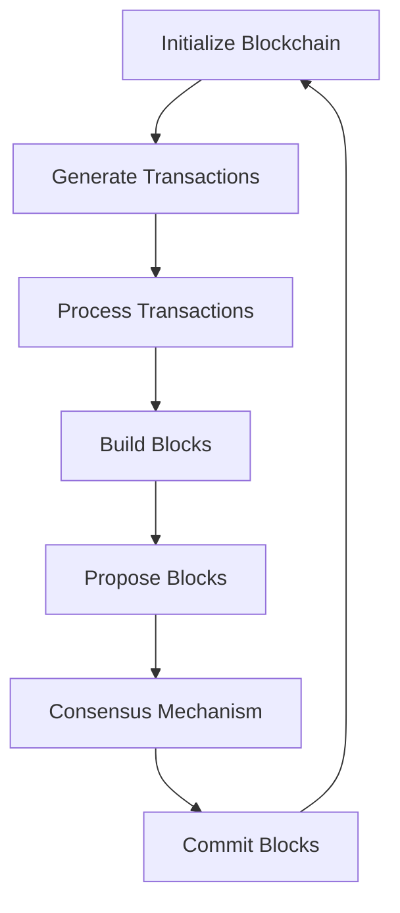

                 


### 引言

区块链技术作为一种革命性的分布式账本技术，已经在金融、物联网、供应链管理等多个领域展现出其巨大的潜力和广泛应用。然而，区块链技术的核心支柱之一——密码学，往往被很多人忽视。本文旨在深入剖析区块链技术中的密码学应用，探讨密码学在构建信任机制中的数学基础，为读者提供一个全面且深入的视角。

**关键词：**区块链技术，密码学，信任机制，数学基础，哈希函数，公钥密码学。

**摘要：**本文首先介绍了区块链技术的基本概念、技术特点和应用场景，随后深入讲解了密码学的基本原理，包括哈希函数、公钥密码学和数字签名等。接着，本文探讨了密码学在区块链中的具体应用，如区块链中的哈希函数应用、公钥密码学和数字签名应用等。随后，本文分析了区块链技术中的信任机制，包括激励机制、身份验证与权限控制、去中心化治理和共识机制等。最后，本文讨论了区块链技术的数学基础，包括离散数学、线性代数和概率论与数理统计等内容。

### 目录大纲

第一部分: 引言
----------------------------------------------------------------
1. 引言
2. 引言
### 1.1 书籍背景介绍
### 1.2 书籍主要目标
### 1.3 书籍读者对象
### 1.4 书籍结构安排

----------------------------------------------------------------
第二部分: 区块链与密码学基础
----------------------------------------------------------------
## 2. 区块链技术概述
### 2.1 区块链的基本概念
### 2.2 区块链的技术特点
### 2.3 区块链的应用场景
### 2.4 区块链技术的未来发展趋势

## 3. 密码学基础
### 3.1 密码学的定义与分类
### 3.2 哈希函数
#### 3.2.1 哈希函数的基本概念
#### 3.2.2 哈希函数的安全性
#### 3.2.3 常见的哈希函数
### 3.3 公钥密码学
#### 3.3.1 公钥密码学的基本概念
#### 3.3.2 RSA加密算法
#### 3.3.3 ECC加密算法
### 3.4 数字签名
#### 3.4.1 数字签名的定义与作用
#### 3.4.2 RSA数字签名
#### 3.4.3 ECC数字签名
### 3.5 密码学协议
#### 3.5.1 SSL/TLS协议
#### 3.5.2 PKI基础设施

## 4. 区块链中的密码学应用
### 4.1 区块链中的哈希函数应用
### 4.2 区块链中的公钥密码学应用
### 4.3 区块链中的数字签名应用
### 4.4 区块链中的密码学协议应用

## 5. 区块链安全案例分析
### 5.1 区块链安全挑战
### 5.2 典型区块链安全事件案例分析
### 5.3 区块链安全解决方案探讨

----------------------------------------------------------------
第三部分: 区块链中的信任机制
----------------------------------------------------------------
## 6. 信任机制概述
### 6.1 信任机制的内涵与特点
### 6.2 信任机制的类型与形式
### 6.3 信任机制在区块链中的重要性

## 7. 区块链中的激励机制
### 7.1 激励机制的概念与原理
### 7.2 区块链中的激励机制设计
### 7.3 激励机制的优缺点分析

## 8. 区块链中的身份验证与权限控制
### 8.1 身份验证的概念与方式
### 8.2 权限控制的概念与实现
### 8.3 区块链中的身份验证与权限控制应用

## 9. 区块链中的去中心化治理
### 9.1 去中心化治理的概念与模式
### 9.2 区块链中的去中心化治理实践
### 9.3 去中心化治理的优势与挑战

## 10. 区块链中的共识机制
### 10.1 共识机制的基本概念
### 10.2 常见的共识机制
### 10.3 共识机制的性能评估与选择

## 11. 区块链中的智能合约
### 11.1 智能合约的基本概念
### 11.2 智能合约的编程语言
### 11.3 智能合约的安全性与漏洞分析

----------------------------------------------------------------
第四部分: 区块链技术的数学基础
----------------------------------------------------------------
## 12. 数学基础概述
### 12.1 数学基础在区块链技术中的重要性
### 12.2 数学基础的主要内容

## 13. 数学基础相关理论
### 13.1 离散数学
#### 13.1.1 离散数学的基本概念
#### 13.1.2 离散数学的应用
### 13.2 线性代数
#### 13.2.1 线性代数的基本概念
#### 13.2.2 线性代数的应用
### 13.3 概率论与数理统计
#### 13.3.1 概率论的基本概念
#### 13.3.2 数理统计的基本概念

## 14. 区块链中的数学应用
### 14.1 数学在区块链密码学中的应用
### 14.2 数学在区块链共识机制中的应用
### 14.3 数学在智能合约中的应用

----------------------------------------------------------------

通过上述的目录结构，我们可以看到文章的结构非常清晰，每一部分都有明确的子章节，便于读者按照逻辑顺序阅读和理解。接下来，我们将按照目录结构逐一展开文章的内容。首先，我们从引言部分开始。

----------------------------------------------------------------

## 第一部分: 引言

### 1. 引言

区块链技术的崛起，引发了全球范围内的广泛关注。作为一项具有颠覆性的技术，区块链凭借其去中心化、透明性和不可篡改的特性，在金融、物联网、供应链管理等多个领域展现出巨大的潜力和应用前景。然而，区块链技术之所以能够实现这些功能，离不开其核心支撑——密码学。

密码学作为保障数据安全的重要工具，在区块链技术中发挥着至关重要的作用。密码学的基本概念、原理和应用，构成了区块链技术安全性的基石。本文将围绕区块链技术中的密码学应用，深入探讨信任机制的数学基础，为读者提供一个全面而深入的视角。

### 1.1 书籍背景介绍

近年来，区块链技术和密码学逐渐成为计算机科学和信息技术领域的重要研究方向。随着区块链技术的广泛应用，密码学在区块链中的重要性愈发凸显。然而，现有的区块链相关书籍往往侧重于技术实现和案例分析，而对密码学基础的理论剖析较为欠缺。

因此，本文旨在填补这一空白，通过系统性地介绍密码学的基础理论和区块链技术中的密码学应用，帮助读者全面了解区块链技术中的密码学原理和实现方法。本文的目的是让读者不仅能够掌握区块链技术的应用，还能够深入理解其背后的密码学原理，从而更好地应对区块链技术中的各种挑战。

### 1.2 书籍主要目标

本文的主要目标有以下几点：

1. **全面介绍密码学基础**：从哈希函数、公钥密码学、数字签名等基本概念入手，深入剖析密码学在区块链技术中的应用。

2. **探讨区块链中的信任机制**：分析区块链技术中的激励机制、身份验证与权限控制、去中心化治理和共识机制等信任机制，探讨其实现方法和优缺点。

3. **阐述数学基础在区块链中的重要性**：介绍离散数学、线性代数和概率论与数理统计等数学基础理论，并分析这些数学理论在区块链技术中的应用。

4. **提供实践案例分析**：通过典型区块链安全事件案例分析，探讨区块链安全解决方案，为实际应用提供参考。

通过实现上述目标，本文希望读者能够：

- **深入理解区块链技术中的密码学原理**：了解密码学在区块链技术中的核心作用，掌握密码学的基本概念和实现方法。
- **掌握区块链技术中的信任机制**：理解信任机制的设计原理和实现方法，为区块链技术的应用提供理论基础。
- **提升对区块链技术的认知水平**：通过了解数学基础在区块链技术中的应用，提升对区块链技术的整体认知水平，为未来的研究和应用提供支持。

### 1.3 书籍读者对象

本文适用于以下几类读者：

1. **区块链技术爱好者**：对区块链技术有兴趣，希望深入了解其原理和应用的读者。
2. **计算机科学与技术专业学生**：计算机科学与技术专业的大学生们，希望通过本文学习密码学和区块链技术的基础知识。
3. **区块链技术开发者**：从事区块链技术开发的工作者，希望通过本文了解密码学在区块链中的应用，提升开发能力。
4. **密码学研究者**：对密码学有兴趣的研究者，希望通过本文了解密码学在区块链技术中的最新应用和研究方向。

无论您是初学者还是资深开发者，本文都将为您提供有价值的知识和见解。

### 1.4 书籍结构安排

本文分为四个主要部分：

1. **第一部分：引言**：介绍区块链技术和密码学的基础概念，阐述本文的主要目标、读者对象和书籍结构。
2. **第二部分：区块链与密码学基础**：详细讲解区块链技术的基本概念、密码学基础理论，以及密码学在区块链技术中的具体应用。
3. **第三部分：区块链中的信任机制**：分析区块链技术中的信任机制，包括激励机制、身份验证与权限控制、去中心化治理和共识机制等。
4. **第四部分：区块链技术的数学基础**：介绍数学基础理论，分析离散数学、线性代数和概率论与数理统计在区块链技术中的应用。

通过这四个部分的系统讲解，本文将带领读者全面深入地了解区块链技术中的密码学应用，掌握构建信任机制的数学基础。

---

在引言部分，我们介绍了区块链技术和密码学的基本概念，明确了本文的主要目标和读者对象，并详细阐述了书籍的结构安排。接下来，我们将进入第二部分，详细讲解区块链技术与密码学基础，为后续的深入探讨打下坚实的基础。

## 第二部分：区块链与密码学基础

### 2. 区块链技术概述

#### 2.1 区块链的基本概念

区块链（Blockchain）是一种分布式数据库技术，通过加密算法和分布式网络架构实现了数据的存储和传输。它是一种由多个区块（Block）组成的数据结构，每个区块包含一定数量的交易记录，这些区块按照时间顺序连接在一起，形成了一条不断延伸的链条。

区块链技术的主要特点包括：

1. **去中心化**：区块链技术通过分布式网络架构，避免了传统中心化系统中的单点故障问题，提高了系统的容错性和安全性。
2. **透明性**：区块链上的数据是公开透明的，所有参与者都可以访问和验证数据，提高了数据的可信度。
3. **不可篡改**：区块链上的数据一旦被记录，就很难被篡改。通过加密算法和共识机制，确保了数据的完整性和一致性。
4. **自主性**：区块链技术使得数据的交换和处理可以在没有第三方中介的情况下进行，降低了交易成本和信任风险。

#### 2.2 区块链的技术特点

区块链技术具有以下核心技术特点：

1. **哈希函数**：哈希函数是区块链技术中用于数据加密和验证的核心工具。它可以将任意长度的数据映射为固定长度的字符串，具有唯一性和不可逆性。通过哈希函数，区块链技术实现了数据的唯一标识和链式结构。
2. **加密算法**：区块链技术使用了多种加密算法，如SHA-256、RSA等，用于保护数据的隐私性和完整性。加密算法确保了数据的保密性和防篡改性。
3. **共识机制**：共识机制是区块链技术中用于达成一致性的核心算法。不同的区块链系统采用不同的共识机制，如工作量证明（PoW）、权益证明（PoS）等。共识机制确保了区块链网络中所有节点对数据的共识和一致性。
4. **分布式账本**：区块链技术通过分布式账本实现了数据的存储和传输。分布式账本不仅提高了数据的可靠性和安全性，还降低了中心化的单点故障风险。

#### 2.3 区块链的应用场景

区块链技术在各个领域都有广泛的应用，以下是一些典型的应用场景：

1. **金融领域**：区块链技术在金融领域有广泛的应用，如数字货币、跨境支付、智能合约等。通过区块链技术，可以实现去中心化的金融交易，降低交易成本，提高交易效率。
2. **物联网领域**：区块链技术在物联网领域有重要应用，如设备身份认证、数据隐私保护、供应链管理等。通过区块链技术，可以实现物联网设备的可信连接和数据共享。
3. **供应链管理**：区块链技术可以提高供应链管理的透明度和可信度。通过区块链技术，可以实现供应链各环节的数据记录和追溯，降低供应链中的欺诈和篡改风险。
4. **医疗领域**：区块链技术在医疗领域有重要应用，如电子病历管理、药品供应链管理、基因数据保护等。通过区块链技术，可以实现医疗数据的可信存储和共享。
5. **身份验证与认证**：区块链技术在身份验证与认证领域有广泛应用，如数字身份认证、访问控制等。通过区块链技术，可以实现安全的身份验证和授权管理。

#### 2.4 区块链技术的未来发展趋势

区块链技术作为一种新兴技术，正处于快速发展阶段。未来，区块链技术有望在以下方面实现进一步的发展：

1. **性能提升**：随着区块链应用的不断扩展，对区块链性能的需求也在不断提高。未来，区块链技术将更加注重性能的提升，以满足大规模、高并发交易的需求。
2. **互操作性**：随着不同区块链平台和应用的出现，区块链技术的互操作性将成为一个重要发展方向。未来，不同区块链平台之间将实现更加高效和便捷的互操作。
3. **隐私保护**：随着数据隐私保护意识的提高，区块链技术的隐私保护功能将得到进一步强化。未来，区块链技术将更加注重用户的隐私保护。
4. **智能合约**：智能合约作为区块链技术的重要应用，未来将更加成熟和普及。随着编程语言的不断进步和智能合约应用场景的扩大，智能合约将发挥更大的作用。
5. **跨行业应用**：随着区块链技术的普及，未来将有更多的行业和领域应用区块链技术，实现去中心化、透明化和高效化的业务流程。

通过第二部分的介绍，我们对区块链技术的基本概念、技术特点和未来发展趋势有了更深入的了解。接下来，我们将进入第三部分，详细介绍密码学的基础理论。

## 3. 密码学基础

密码学（Cryptography）是研究如何确保信息在传输过程中的保密性、完整性和认证性的科学。在区块链技术中，密码学起到了至关重要的作用，保证了区块链系统的安全性和可信性。本节将介绍密码学的基本概念、分类，以及区块链技术中常用的哈希函数、公钥密码学和数字签名。

#### 3.1 密码学的定义与分类

密码学可以分为经典密码学和现代密码学两个主要类别。

1. **经典密码学**：经典密码学主要研究加密和解密的方法，其核心目标是实现信息的保密性。经典密码学包括多种加密技术，如替换密码、转置密码、多表加密等。然而，经典密码学在处理复杂问题和抵抗恶意攻击方面存在一定的局限性。

2. **现代密码学**：现代密码学是在计算机科学和信息技术发展背景下产生的一门学科，其核心目标是确保信息的保密性、完整性和认证性。现代密码学采用了复杂的数学理论和算法，如哈希函数、公钥密码学和数字签名等，为信息的安全传输和处理提供了强有力的保障。

现代密码学主要分为以下几类：

- **对称密码学**：对称密码学使用相同的密钥进行加密和解密，其优点是加密速度快，计算成本低。典型的对称密码学算法有DES、AES等。

- **非对称密码学**：非对称密码学使用不同的密钥进行加密和解密，其优点是能够实现密钥的安全分发和身份认证。典型的非对称密码学算法有RSA、ECC等。

- **哈希函数**：哈希函数是一种将任意长度的输入数据映射为固定长度的字符串的算法，其输出称为哈希值。哈希函数在区块链技术中用于实现数据的唯一标识和完整性验证。

- **数字签名**：数字签名是一种用于验证信息真实性和完整性的技术，通过使用私钥对信息进行加密，生成数字签名。接收方可以使用对应的公钥对数字签名进行验证。

- **加密协议**：加密协议是一系列用于实现信息加密和解密的规则和算法。常见的加密协议有SSL/TLS、IPSec等。

#### 3.2 哈希函数

哈希函数在区块链技术中有着广泛的应用。哈希函数的基本概念和安全性如下：

##### 3.2.1 哈希函数的基本概念

哈希函数（Hash Function）是将任意长度的输入数据（称为“消息”）映射为固定长度的字符串（称为“哈希值”）的函数。哈希函数具有以下特点：

- **单向性**：哈希函数是不可逆的，即给定一个哈希值，无法通过哈希函数反推出原始消息。

- **抗碰撞性**：哈希函数具有抗碰撞性，即对于不同的输入消息，产生相同哈希值的概率极低。

- **固定输出长度**：哈希函数的输出长度是固定的，如SHA-256的输出长度为256位。

##### 3.2.2 哈希函数的安全性

哈希函数的安全性主要体现在以下几个方面：

- **抗碰撞攻击**：哈希函数应具有抗碰撞攻击的能力，即给定一个哈希函数，找到两个不同输入消息产生相同哈希值的概率极低。

- **抗反推攻击**：哈希函数应具有抗反推攻击的能力，即给定一个哈希值，无法通过哈希函数反推出原始消息。

- **抗长度扩展攻击**：哈希函数应具有抗长度扩展攻击的能力，即无法通过修改输入消息的长度来产生相同的哈希值。

##### 3.2.3 常见的哈希函数

区块链技术中常用的哈希函数包括以下几种：

- **SHA-256**：SHA-256（Secure Hash Algorithm 256-bit）是一种安全哈希算法，由美国国家标准与技术研究院（NIST）制定。SHA-256的输出长度为256位，广泛应用于比特币等区块链系统中。

- **SHA-3**：SHA-3是NIST于2015年推出的新一代安全哈希算法，旨在替代SHA-2系列算法。SHA-3具有多种不同的哈希函数，如Keccak-224、Keccak-256等。

- **BLAKE2**：BLAKE2是由BLAKE算法改进而来的一种哈希函数，具有高性能和抗碰撞性。BLAKE2在比特币的某些实现中被用作替代SHA-256的哈希函数。

#### 3.3 公钥密码学

公钥密码学（Public Key Cryptography）是一种基于数学难题的密码学方法，其核心思想是使用一对密钥——公钥和私钥进行加密和解密。公钥密码学在区块链技术中发挥着重要作用，用于实现数据加密、数字签名和认证等。

##### 3.3.1 公钥密码学的基本概念

公钥密码学的基本概念包括以下几方面：

- **密钥对**：公钥密码学使用一对密钥——公钥和私钥。公钥可以公开传播，私钥必须保密。

- **加密和解密**：使用公钥对消息进行加密，只有对应的私钥可以解密。反之，使用私钥对消息进行签名，只有对应的公钥可以验证。

- **安全性质**：公钥密码学基于数学难题，如大数分解、离散对数等，使得加密和解密过程在计算上是可行的，但破解密钥在计算上是不可行的。

##### 3.3.2 RSA加密算法

RSA（Rivest-Shamir-Adleman）是一种经典的非对称加密算法，由Ron Rivest、Adi Shamir和Leonard Adleman于1977年提出。RSA加密算法基于大数分解难题，其核心思想如下：

1. **密钥生成**：选择两个大素数p和q，计算n=p*q和φ(n)=(p-1)*(q-1)。然后选择一个与φ(n)互质的整数e，计算d，使得d*e ≡ 1 (mod φ(n))。公钥为(n, e)，私钥为(n, d)。

2. **加密**：将明文M转换为整数m（通常是对明文进行模n运算），然后计算c ≡ m^e (mod n)。密文为c。

3. **解密**：接收方使用私钥(n, d)对密文c进行解密，计算m ≡ c^d (mod n)。明文为m。

##### 3.3.3 ECC加密算法

ECC（Elliptic Curve Cryptography，椭圆曲线密码学）是一种基于椭圆曲线离散对数问题的非对称加密算法，相较于RSA算法具有更高的安全性能和更小的密钥长度。ECC的基本概念和实现方法如下：

1. **椭圆曲线定义**：椭圆曲线是由方程y^2 = x^3 + ax + b定义的一组点，其中a和b是常数，满足4a^3 + 27b^2 ≠ 0。

2. **椭圆曲线加密算法**：椭圆曲线加密算法基于椭圆曲线离散对数问题，其核心思想是找到两个椭圆曲线上点的倍点运算。ECC的加密和解密过程如下：

   - **密钥生成**：选择一个大的安全参数n，选择一条椭圆曲线E和基点G。然后选择一个随机数k作为私钥，计算公钥Q=k*G。

   - **加密**：发送方选择一个随机数k'，计算点C1 = k'*G和C2 = k'*Q。然后将C1和C2发送给接收方。

   - **解密**：接收方使用私钥k对密文C1和C2进行解密，计算点R = k^-1 * (C2 - C1*Q)。接收方将R发送给发送方。

   - **验证**：发送方使用公钥Q验证接收方发送的R，计算S = R*G。如果S与接收方发送的C1和C2匹配，则解密成功。

#### 3.4 数字签名

数字签名（Digital Signature）是一种用于验证信息真实性和完整性的技术。数字签名通过使用私钥对信息进行加密，生成一个签名，接收方可以使用对应的公钥对签名进行验证。

##### 3.4.1 数字签名的定义与作用

数字签名的基本概念如下：

- **签名过程**：发送方使用私钥对消息进行加密，生成一个签名。签名过程包括以下步骤：

  1. 发送方将消息M转换为整数m。
  2. 发送方计算签名s，使得s * e ≡ 1 (mod n)。
  3. 发送方将消息M和签名s发送给接收方。

- **验证过程**：接收方使用公钥对消息和签名进行验证。验证过程包括以下步骤：

  1. 接收方将消息M转换为整数m。
  2. 接收方计算验证值v，使得v ≡ m^e (mod n)。
  3. 接收方计算s * v ≡ 1 (mod n)。如果等式成立，则签名有效。

数字签名的主要作用包括：

- **验证信息真实性**：数字签名可以确保消息来自于真实的发送方，因为只有发送方拥有私钥。
- **验证信息完整性**：数字签名可以确保消息在传输过程中未被篡改，因为任何对消息的篡改都会导致签名无效。

##### 3.4.2 RSA数字签名

RSA数字签名是一种基于RSA加密算法的数字签名方法。RSA数字签名的基本过程如下：

1. **密钥生成**：密钥生成过程与RSA加密算法相同，生成公钥(n, e)和私钥(n, d)。

2. **签名过程**：

   1. 发送方将消息M转换为整数m。
   2. 发送方计算签名s，使得s ≡ m^d (mod n)。
   3. 发送方将消息M和签名s发送给接收方。

3. **验证过程**：

   1. 接收方将消息M转换为整数m。
   2. 接收方计算验证值v，使得v ≡ m^e (mod n)。
   3. 接收方计算s * v ≡ 1 (mod n)。如果等式成立，则签名有效。

##### 3.4.3 ECC数字签名

ECC数字签名是一种基于ECC加密算法的数字签名方法。ECC数字签名的基本过程如下：

1. **密钥生成**：密钥生成过程与ECC加密算法相同，生成公钥Q和私钥k。

2. **签名过程**：

   1. 发送方将消息M转换为整数m。
   2. 发送方计算签名r和s，满足以下方程组：
      - r ≡ k^(-1) * (m * s_1^2) (mod n)
      - s ≡ k^(-1) * (m * r^2 + d * s_1) (mod n)
   3. 发送方将消息M、签名r和s发送给接收方。

3. **验证过程**：

   1. 接收方将消息M转换为整数m。
   2. 接收方计算验证值v_r和v_s，满足以下方程组：
      - v_r ≡ m^e * r^s (mod n)
      - v_s ≡ m^s * s_1^r (mod n)
   3. 接收方计算v_r * v_s ≡ 1 (mod n)。如果等式成立，则签名有效。

通过本节对密码学基础理论的介绍，我们对密码学的基本概念、分类和应用有了更深入的了解。接下来，我们将探讨密码学在区块链技术中的具体应用，包括区块链中的哈希函数应用、公钥密码学应用和数字签名应用。

### 4. 区块链中的密码学应用

在区块链技术中，密码学扮演着至关重要的角色，它确保了区块链系统的安全性和可信性。本节将详细探讨密码学在区块链技术中的具体应用，包括哈希函数、公钥密码学和数字签名的应用。

#### 4.1 区块链中的哈希函数应用

哈希函数在区块链技术中具有广泛的应用，主要用途包括：

1. **数据唯一标识**：区块链中的每个区块都包含一个哈希值，这个哈希值是当前区块的数据摘要。通过哈希函数，可以确保区块数据具有唯一标识，防止数据被篡改。

2. **链式结构**：区块链是通过将每个区块的哈希值链接在一起，形成一个链式数据结构。这种链式结构确保了区块链的不可篡改性。任何对区块链数据的篡改都会导致链式结构被破坏，从而被其他节点检测到。

3. **工作量证明**：在区块链中，矿工需要通过解决复杂的数学问题（如Proof of Work算法）来获取区块奖励。哈希函数在这里用于确保矿工的工作量，矿工需要找到满足特定条件的哈希值，从而证明他们的工作量。

4. **智能合约执行结果验证**：智能合约在执行后，会生成一个结果，这个结果通过哈希函数进行摘要，并记录在区块链上。通过验证哈希值，可以确保智能合约的执行结果是真实和不可篡改的。

#### 4.2 区块链中的公钥密码学应用

公钥密码学在区块链技术中也有广泛的应用，主要包括：

1. **加密通信**：区块链网络中的节点需要进行安全的通信，使用公钥密码学可以实现加密通信。节点可以使用对方的公钥对消息进行加密，只有拥有对应私钥的节点才能解密。

2. **身份认证**：区块链中的节点需要证明自己的身份，使用公钥密码学可以实现数字签名，节点可以使用自己的私钥对信息进行签名，其他节点可以使用对应的公钥进行验证。

3. **交易验证**：在区块链中，交易需要经过验证才能被确认。通过使用公钥密码学，交易发起者可以使用自己的私钥对交易信息进行签名，验证者可以使用对应的公钥验证签名的有效性。

4. **智能合约执行**：智能合约在执行过程中，可能需要与外部进行交互，使用公钥密码学可以实现安全的交互。智能合约可以对外部发送的请求进行签名验证，确保请求的合法性。

#### 4.3 区块链中的数字签名应用

数字签名在区块链技术中具有重要作用，主要包括：

1. **交易验证**：在区块链中，交易需要进行验证，以确保交易的有效性和合法性。交易发起者可以使用私钥对交易信息进行签名，接收者可以使用对应的公钥进行验证。

2. **智能合约触发**：智能合约在执行过程中，可能需要依赖外部事件触发。使用数字签名，智能合约可以接收并验证外部事件，确保事件的真实性和合法性。

3. **身份验证**：区块链中的节点需要证明自己的身份，使用数字签名可以实现身份认证。节点可以使用私钥对身份信息进行签名，其他节点可以使用对应的公钥验证签名的有效性。

4. **数据完整性验证**：数字签名可以确保数据的完整性和真实性。任何对数据的篡改都会导致签名无效，从而被其他节点检测到。

通过本节的介绍，我们可以看到密码学在区块链技术中的关键作用。密码学不仅确保了区块链系统的安全性，还为区块链提供了去中心化、透明性和不可篡改的特性。在接下来的章节中，我们将进一步探讨区块链技术中的信任机制，包括激励机制、身份验证与权限控制、去中心化治理和共识机制等。

### 5. 区块链安全案例分析

区块链技术在发展过程中面临着各种安全挑战，本文将分析一些典型的区块链安全事件，探讨这些事件背后的原因，并提出相应的安全解决方案。

#### 5.1 区块链安全挑战

区块链技术虽然具有去中心化、透明性和不可篡改的特点，但仍然面临着以下安全挑战：

1. **51%攻击**：攻击者通过控制超过一半的区块链节点，可以篡改区块链数据。这种攻击方式在比特币等基于Proof of Work机制的区块链系统中尤为常见。

2. **双花攻击**：双花攻击指的是攻击者同时向两个不同的接收方发送交易，导致一个交易被确认，另一个交易被撤销。这种攻击方式在区块链网络延迟较高的情况下较为常见。

3. **智能合约漏洞**：智能合约在编写和部署过程中，可能会出现逻辑错误或漏洞，导致合约资金被窃取或无法执行。

4. **隐私泄露**：区块链上的数据是公开透明的，但某些信息（如交易金额）可能涉及用户隐私，隐私泄露问题需要得到解决。

5. **网络攻击**：区块链网络可能面临分布式拒绝服务（DDoS）攻击，攻击者通过占用大量网络资源，导致区块链网络瘫痪。

#### 5.2 典型区块链安全事件案例分析

1. **DAO事件**：DAO（Decentralized Autonomous Organization）是一个基于以太坊的智能合约，用于投资和管理资金。2016年，黑客利用DAO智能合约中的漏洞，盗取了约3600万美元的以太币。该事件暴露了智能合约漏洞和去中心化治理机制的不完善。

   **原因分析**：DAO事件主要是由于智能合约中的逻辑漏洞导致的。黑客利用了智能合约中的递归调用漏洞，不断地提取资金，最终导致资金被盗。

   **解决方案**：为了避免类似事件的发生，需要对智能合约进行严格的审计和测试，确保其逻辑的严密性和安全性。同时，建立完善的去中心化治理机制，确保智能合约的修改和更新经过广泛的讨论和投票。

2. **门罗币双花攻击**：2017年，门罗币（Monero）网络遭受了双花攻击。攻击者同时向两个不同的接收方发送交易，导致一个交易被确认，另一个交易被撤销。

   **原因分析**：双花攻击主要是由于区块链网络延迟和交易确认时间不一致导致的。在区块链网络延迟较高的情况下，攻击者可以同时发送交易，利用网络延迟来逃避双花检测。

   **解决方案**：为了避免双花攻击，可以采用以下方法：

   - **提高网络速度**：优化区块链网络通信，减少交易确认时间，降低双花攻击的机会。
   - **双花检测机制**：在区块链节点中实现双花检测机制，一旦检测到双花攻击，立即撤销已确认的交易。
   - **交易时间戳**：在交易中添加时间戳，确保交易按照时间顺序进行确认，减少双花攻击的机会。

3. **比特币51%攻击**：2018年，比特币网络遭受了51%攻击。攻击者通过控制超过一半的区块链节点，篡改了区块链数据，导致比特币交易记录被重放。

   **原因分析**：比特币51%攻击主要是由于比特币网络的计算资源分配不均导致的。攻击者通过租赁大量计算资源，短时间内控制了超过一半的区块链节点。

   **解决方案**：为了避免类似事件的发生，可以采用以下方法：

   - **提高网络费用**：提高区块链网络的交易费用，增加攻击者的成本，降低攻击的可行性。
   - **改进共识机制**：优化比特币的共识机制，如采用权益证明（PoS）机制，减少计算资源集中度。
   - **增加节点数量**：鼓励更多人参与区块链网络，增加区块链节点的数量，提高网络的安全性。

通过分析上述典型区块链安全事件，我们可以看到，区块链技术在安全方面仍然存在诸多挑战。通过不断改进和优化区块链技术，以及建立完善的安全机制，可以有效地提高区块链系统的安全性。

#### 5.3 区块链安全解决方案探讨

针对区块链技术中的安全挑战，可以采取以下解决方案：

1. **提高网络安全性**：通过优化区块链网络协议和通信机制，提高网络的稳定性和抗攻击能力。例如，采用加密通信协议，确保节点之间的通信安全。

2. **加强智能合约安全性**：对智能合约进行严格的审计和测试，确保其逻辑严密和安全。可以采用形式化验证方法，对智能合约的执行结果进行验证。

3. **建立安全共识机制**：优化区块链的共识机制，确保区块链网络中的节点能够快速达成共识。可以采用混合共识机制，结合多种算法提高共识效率。

4. **隐私保护技术**：采用零知识证明、同态加密等技术，保护区块链上的用户隐私。例如，在交易中隐藏交易金额和地址信息，确保用户的隐私不被泄露。

5. **安全审计和监管**：建立专业的区块链安全审计机构，对区块链项目和系统进行定期审计，确保其安全性。同时，加强区块链技术的监管，确保合规性和安全性。

通过上述措施，可以有效地提高区块链系统的安全性，为区块链技术的广泛应用提供保障。

### 第三部分：区块链中的信任机制

区块链技术因其去中心化、不可篡改和透明性等特点，被誉为构建信任的新基础设施。然而，信任机制并不仅仅是区块链技术的天然属性，它是通过一系列技术手段和治理模式来实现的。本部分将深入探讨区块链中的信任机制，包括激励机制、身份验证与权限控制、去中心化治理和共识机制等内容。

#### 6. 信任机制概述

信任机制是区块链技术的核心要素之一，它通过一系列技术手段和治理模式，确保了区块链网络中的参与者能够建立并维护信任关系。信任机制的内涵与特点如下：

##### 6.1 信任机制的内涵

信任机制是一种确保参与者之间相互信任的机制。在区块链技术中，信任机制主要体现在以下几个方面：

1. **数据一致性**：通过共识算法，确保区块链网络中的数据一致性，防止数据被篡改。
2. **身份认证**：确保区块链网络中的每个参与者都能够证明自己的身份，防止恶意攻击和欺诈行为。
3. **数据保密性**：通过加密技术，保护区块链网络中的数据不被未授权的第三方访问。
4. **透明性**：确保区块链网络中的数据操作和决策过程对参与者透明，提高信任度。

##### 6.2 信任机制的特点

区块链中的信任机制具有以下特点：

1. **去中心化**：信任机制不依赖于中心化机构，而是通过分布式网络中的参与者共同维护。
2. **不可篡改**：区块链上的数据一旦被记录，就很难被篡改，提高了数据的可信度。
3. **透明性**：区块链网络中的数据操作和决策过程是公开透明的，参与者可以随时查询和验证。
4. **自治性**：区块链网络中的决策和管理是通过智能合约和共识算法自动执行的，减少了人为干预。

#### 6.3 信任机制的类型与形式

区块链中的信任机制可以分为以下几种类型：

1. **共识机制**：共识机制是区块链网络中达成一致性的核心算法。不同的共识机制（如PoW、PoS、DPoS等）决定了区块链网络的运行效率和安全性。

2. **激励机制**：激励机制是区块链网络中用于激励参与者（如矿工、验证节点等）的机制。通过奖励机制，鼓励参与者积极参与区块链网络的维护和扩展。

3. **身份验证与权限控制**：身份验证与权限控制确保了区块链网络中的每个参与者都能够证明自己的身份，并根据权限级别进行数据访问和操作。

4. **去中心化治理**：去中心化治理是一种通过民主投票和社区决策，实现区块链网络自治的机制。参与者可以通过投票表达自己的意见，参与区块链网络的治理。

#### 6.4 信任机制在区块链中的重要性

信任机制在区块链技术中的重要性体现在以下几个方面：

1. **确保数据安全性**：通过共识机制和加密技术，确保区块链网络中的数据安全性，防止数据被篡改和泄露。
2. **提高网络效率**：通过激励机制和身份验证与权限控制，提高区块链网络的运行效率和数据访问速度。
3. **降低信任成本**：区块链技术通过去中心化和透明性，降低了传统中心化系统中存在的信任成本，提高了交易效率和用户体验。
4. **促进创新与发展**：信任机制的建立为区块链技术的创新和应用提供了坚实的基础，推动了区块链技术在各个领域的广泛应用。

通过本节的介绍，我们对区块链中的信任机制有了更深入的理解。接下来，我们将探讨区块链中的激励机制，分析其概念、原理和设计方法。

### 7. 区块链中的激励机制

激励机制是区块链技术中用于激励参与者积极参与网络维护和扩展的重要机制。通过设计合理的激励机制，可以鼓励更多的节点参与区块链网络的构建和运行，提高网络的稳定性和安全性。本节将详细探讨区块链中的激励机制，包括其概念、原理和设计方法。

#### 7.1 激励机制的概念与原理

激励机制（Incentive Mechanism）是一种通过奖励和惩罚机制，引导参与者行为，达到特定目标的机制。在区块链技术中，激励机制主要用于激励参与者（如矿工、验证节点等）进行计算和存储资源，确保区块链网络的稳定运行。

激励机制的基本原理如下：

1. **奖励机制**：通过提供奖励，激励参与者积极参与区块链网络的维护和扩展。奖励可以是加密货币、计算资源等。
2. **惩罚机制**：对违反区块链网络规则的行为进行惩罚，以维护网络的稳定和安全。惩罚可以是降低奖励、禁止参与等。
3. **透明性**：激励机制的设计和执行过程是公开透明的，确保所有参与者都能够了解激励机制的规则和标准。

#### 7.2 区块链中的激励机制设计

区块链中的激励机制设计主要包括以下几个方面：

1. **奖励分配策略**：确定奖励的分配方式，确保奖励能够公平、合理地分配给参与者。常见的奖励分配策略包括固定分配、比例分配、竞标分配等。
2. **工作量评估方法**：确定参与者的工作量评估标准，根据工作量的多少进行奖励分配。工作量评估方法可以是计算量、存储量、验证次数等。
3. **惩罚机制设计**：设计有效的惩罚机制，对违反区块链网络规则的行为进行处罚。惩罚机制可以是降低奖励、禁止参与、记录不良记录等。
4. **透明度与可审计性**：确保激励机制的设计和执行过程公开透明，所有参与者都可以查阅和审计激励机制的规则和结果。

#### 7.3 激励机制的优缺点分析

激励机制在区块链技术中有其独特的优势和局限性，以下是对激励机制优缺点的分析：

##### 优点：

1. **提高参与积极性**：通过奖励机制，激励参与者积极参与区块链网络的维护和扩展，提高网络的稳定性和安全性。
2. **降低信任成本**：激励机制通过奖励和惩罚机制，降低了传统中心化系统中存在的信任成本，提高了交易效率和用户体验。
3. **促进网络发展**：激励机制鼓励更多的节点参与区块链网络的构建和运行，促进了区块链技术的创新和应用。

##### 缺点：

1. **潜在的不公平性**：激励机制可能导致奖励分配不公平，一些节点可能因为计算资源或网络条件优势而获得更多奖励。
2. **激励过度**：过度的激励机制可能导致参与者的过度竞争，增加网络负担，甚至可能导致网络瘫痪。
3. **激励失效**：随着区块链技术的发展和变化，激励机制可能不再适应新的环境和需求，导致激励失效。

#### 7.4 激励机制在不同区块链平台的应用

不同的区块链平台根据其特点和目标，设计了不同的激励机制。以下是对几种典型区块链平台激励机制的分析：

1. **比特币（Bitcoin）**：比特币采用工作量证明（Proof of Work, PoW）机制，矿工通过解决复杂的数学问题来获得比特币奖励。比特币的激励机制在确保网络安全和去中心化方面取得了显著成效，但也存在能源消耗和高算力成本等问题。

2. **以太坊（Ethereum）**：以太坊采用权益证明（Proof of Stake, PoS）机制，验证节点通过持有代币的数量和年龄来获得记账权。以太坊的激励机制在降低能源消耗和提升网络效率方面具有优势，但也存在权益分配不均和验证节点选择问题。

3. **波卡（Polkadot）**：波卡采用共享状态多链架构，采用Nominated Proof of Stake（NPoS）机制。NPoS机制通过选举产生验证节点，提高了网络的去中心化和安全性。波卡的激励机制在确保网络稳定性和公平性方面具有创新性。

通过本节的介绍，我们对区块链中的激励机制有了更深入的理解。在接下来的章节中，我们将继续探讨区块链中的身份验证与权限控制，分析其概念、原理和应用。

### 8. 区块链中的身份验证与权限控制

身份验证和权限控制在区块链技术中扮演着关键角色，它们确保区块链网络中的参与者能够证明自己的身份，并按照权限级别进行数据访问和操作。本节将详细探讨区块链中的身份验证与权限控制，包括其概念、方式、实现和应用。

#### 8.1 身份验证的概念与方式

身份验证（Authentication）是一种验证个体或系统真实身份的技术，确保只有授权的用户或系统能够访问受保护的资源。在区块链技术中，身份验证主要用于确保参与者的合法性和安全性。

身份验证的方式可以分为以下几种：

1. **密码验证**：用户通过输入密码来验证身份。密码验证是一种简单但安全性较低的身份验证方式，容易被破解和暴力攻击。

2. **二因素认证**：二因素认证（Two-Factor Authentication, 2FA）结合了密码验证和其他认证方式（如短信验证码、手机App验证等），提高了身份验证的安全性。

3. **生物特征验证**：生物特征验证（如指纹、面部识别、虹膜识别等）基于个体独特的生物特征，具有较高的安全性和便利性。

4. **数字签名**：数字签名是一种基于公钥密码学的身份验证方式。用户通过私钥对消息进行签名，接收方使用对应的公钥验证签名的有效性。

5. **智能合约验证**：智能合约可以自动执行身份验证过程，根据预设的条件和规则验证参与者的身份。

#### 8.2 权限控制的概念与实现

权限控制（Authorization）是一种确保参与者根据权限级别进行数据访问和操作的技术。在区块链技术中，权限控制主要用于确保数据的安全和完整性，防止未授权访问和操作。

权限控制的方式可以分为以下几种：

1. **基于角色的权限控制**：根据用户角色（如管理员、普通用户等）进行权限分配和权限控制。用户角色由区块链网络中的权限控制机制进行管理。

2. **基于属性的权限控制**：根据用户属性（如年龄、职位、部门等）进行权限分配和权限控制。用户属性由区块链网络中的权限控制机制进行管理。

3. **基于规则的权限控制**：根据预设的权限规则进行权限分配和权限控制。权限规则由区块链网络中的权限控制机制进行管理和执行。

权限控制实现的常见方法包括：

1. **访问控制列表（ACL）**：ACL通过定义权限规则，确保只有授权用户能够访问特定资源。ACL通常包含用户、角色和资源的权限信息。

2. **角色访问控制（RBAC）**：RBAC根据用户的角色和权限，进行权限分配和权限控制。RBAC通常包含用户、角色、权限和资源的定义。

3. **基于属性的访问控制（ABAC）**：ABAC根据用户的属性和权限规则，进行权限分配和权限控制。ABAC通常包含用户属性、权限规则和资源的定义。

#### 8.3 区块链中的身份验证与权限控制应用

区块链技术中的身份验证与权限控制应用广泛，以下是一些典型应用场景：

1. **身份认证**：区块链技术可以用于身份认证，确保只有授权用户能够访问受保护的系统或服务。例如，区块链可以用于员工身份认证、电子身份认证等。

2. **访问控制**：区块链技术可以用于访问控制，确保只有授权用户能够访问特定资源或数据。例如，区块链可以用于访问控制列表、企业内部网络访问控制等。

3. **数据加密与安全**：区块链技术可以用于数据加密与安全，确保数据在传输和存储过程中的完整性、保密性和可靠性。例如，区块链可以用于数据加密、数字签名等。

4. **供应链管理**：区块链技术可以用于供应链管理，确保供应链中的每个环节都能够透明、可追溯。例如，区块链可以用于供应链追溯、产品质量认证等。

5. **金融交易**：区块链技术可以用于金融交易，确保交易的安全和可信。例如，区块链可以用于数字货币交易、跨境支付等。

通过本节的介绍，我们对区块链中的身份验证与权限控制有了更深入的理解。在接下来的章节中，我们将探讨区块链中的去中心化治理，分析其概念、模式和实践。

### 9. 区块链中的去中心化治理

去中心化治理（Decentralized Governance）是区块链技术中的一个重要概念，它通过分布式网络中的参与者的共同决策和治理，实现了对区块链系统的管理和监督。去中心化治理旨在消除中心化机构的垄断和独裁，促进透明、公正和高效的治理模式。本节将详细探讨区块链中的去中心化治理，包括其概念、模式和实践。

#### 9.1 去中心化治理的概念与模式

去中心化治理是指通过分布式网络中的参与者的共同决策和治理，实现对区块链系统的管理和监督的一种治理模式。去中心化治理的核心思想是去中心化、透明性和自治性。

##### 9.1.1 去中心化治理的内涵

去中心化治理具有以下内涵：

1. **去中心化**：去中心化治理消除了中心化机构的垄断和独裁，通过分布式网络中的参与者共同决策和治理，实现了权力的分散和民主化。
2. **透明性**：去中心化治理的过程和决策是公开透明的，所有参与者都可以查看和参与治理过程，提高了治理的公正性和可信度。
3. **自治性**：去中心化治理实现了系统的自我管理和自我监督，通过智能合约和共识算法，实现了自动化的治理和执行。

##### 9.1.2 去中心化治理的模式

去中心化治理的模式可以分为以下几种：

1. **民主投票**：通过民主投票，所有参与者可以对区块链系统的决策进行投票，决定系统的未来发展方向。民主投票可以是简单的多数投票，也可以是更复杂的加权投票。
2. **共识机制**：共识机制是一种基于分布式网络中的参与者共同决策和治理的机制。不同的共识机制（如PoW、PoS、DPoS等）决定了区块链网络中的决策方式和治理效率。
3. **智能合约**：智能合约是一种自动执行的合约，它通过代码定义了参与者的行为和权利义务。智能合约可以用于实现去中心化治理中的各种决策和治理功能。
4. **去中心化自治组织**：去中心化自治组织（Decentralized Autonomous Organization, DAO）是一种通过智能合约实现的去中心化治理模式。DAO通过民主投票和共识机制，实现了对组织的决策和治理。

#### 9.2 区块链中的去中心化治理实践

去中心化治理在区块链技术中已经得到了广泛的应用，以下是一些典型的去中心化治理实践：

1. **比特币（Bitcoin）**：比特币采用工作量证明（Proof of Work, PoW）共识机制，矿工通过解决数学难题来获得比特币奖励。比特币的去中心化治理体现在矿工的选举和投票过程中，矿工可以通过投票决定比特币的发展方向。
2. **以太坊（Ethereum）**：以太坊采用权益证明（Proof of Stake, PoS）共识机制，验证节点通过持有代币的数量和年龄来获得记账权。以太坊的去中心化治理体现在验证节点的选举和投票过程中，验证节点可以通过投票决定以太坊的发展方向。
3. **波卡（Polkadot）**：波卡采用共享状态多链架构，采用Nominated Proof of Stake（NPoS）共识机制。NPoS机制通过选举产生验证节点，验证节点通过投票决定波卡的发展方向。波卡的去中心化治理体现了更高效和去中心化的决策过程。

#### 9.3 去中心化治理的优势与挑战

去中心化治理具有以下优势：

1. **去中心化**：去中心化治理消除了中心化机构的垄断和独裁，实现了权力的分散和民主化，提高了治理的公平性和公正性。
2. **透明性**：去中心化治理的过程和决策是公开透明的，所有参与者都可以查看和参与治理过程，提高了治理的公正性和可信度。
3. **自治性**：去中心化治理实现了系统的自我管理和自我监督，通过智能合约和共识算法，实现了自动化的治理和执行。

然而，去中心化治理也面临着一些挑战：

1. **决策效率**：去中心化治理的决策过程可能较为复杂和缓慢，难以应对紧急情况和快速变化的市场环境。
2. **安全性**：去中心化治理中存在潜在的安全风险，如共识算法漏洞、智能合约攻击等，需要不断加强安全防护措施。
3. **参与门槛**：去中心化治理对参与者的技术水平和知识要求较高，可能限制了广泛参与的可能性。

通过本节的介绍，我们对区块链中的去中心化治理有了更深入的理解。在接下来的章节中，我们将探讨区块链中的共识机制，分析其基本概念、常见类型和性能评估方法。

### 10. 区块链中的共识机制

共识机制是区块链技术中用于达成一致性的核心算法，它在确保区块链网络中的节点对数据的共识和一致性方面发挥着关键作用。不同的共识机制决定了区块链网络的性能、安全性和去中心化程度。本节将详细探讨区块链中的共识机制，包括其基本概念、常见类型和性能评估方法。

#### 10.1 共识机制的基本概念

共识机制（Consensus Mechanism）是一种分布式算法，用于确保区块链网络中的多个节点能够就数据的状态达成一致。在区块链中，共识机制的主要目标是：

1. **数据一致性**：确保所有节点对区块链上的数据状态有一致的理解，防止数据被篡改或双花攻击。
2. **安全性**：确保区块链网络能够抵御恶意攻击和节点欺骗，维护网络的稳定性和安全性。
3. **去中心化**：通过分布式算法，实现权力的分散和民主化，消除中心化机构的垄断和独裁。

共识机制的基本概念包括以下几方面：

1. **节点**：区块链网络中的参与节点，它们负责验证交易、维护区块链状态和参与共识过程。
2. **交易**：区块链网络中的数据传输单元，表示参与者之间的资金转移或数据交换。
3. **区块**：连续交易记录的集合，每个区块包含一定数量的交易，并链接到前一个区块，形成区块链。
4. **链**：由多个区块连接而成的数据结构，代表区块链网络中的数据状态。
5. **挖矿**：在PoW共识机制中，节点通过解决数学难题（如哈希运算）来创建新区块，并验证其他节点的交易。
6. **区块奖励**：在挖矿过程中，成功创建新区块的节点获得的奖励，通常是区块链系统的原生代币。

#### 10.2 常见的共识机制

区块链技术中存在多种共识机制，以下是一些常见的共识机制及其特点：

1. **工作量证明（Proof of Work, PoW）**：PoW是最早的共识机制之一，由中本聪（Satoshi Nakamoto）在比特币中提出。PoW通过要求节点解决复杂的数学问题（如寻找一个满足特定条件的哈希值）来创建新区块。节点通过计算资源进行挖矿，成功的节点将获得区块奖励。PoW具有以下特点：

   - **安全性**：PoW通过计算难题确保了节点难以伪造区块，具有较高的安全性。
   - **去中心化**：PoW不依赖于任何中心化机构，节点通过竞争获得记账权，具有较高的去中心化程度。
   - **能源消耗**：PoW需要大量的计算资源，导致较高的能源消耗，这在环保方面受到了批评。

2. **权益证明（Proof of Stake, PoS）**：PoS是在比特币出现后提出的一种替代性共识机制。在PoS机制中，节点通过持有代币的数量和年龄来获得记账权。节点持有代币的时间越长，获得记账权的概率越高。PoS具有以下特点：

   - **安全性**：PoS通过权益分配确保了节点难以伪造区块，具有较高的安全性。
   - **去中心化**：PoS不依赖于计算资源，而是依赖于代币持有量，具有较低的去中心化程度。
   - **效率**：PoS的记账过程较PoW更快，具有较高的效率。

3. **委托权益证明（Delegated Proof of Stake, DPoS）**：DPoS是PoS的一种变种，它通过选举出一定数量的委托人（或称为超级节点）来负责记账。DPoS具有以下特点：

   - **安全性**：DPoS通过选举机制确保了委托人的合法性，具有较高的安全性。
   - **去中心化**：DPoS通过委托人机制实现了部分去中心化，但相比PoS，去中心化程度较低。
   - **效率**：DPoS的记账过程非常快速，具有较高的效率。

4. **权威证明（Proof of Authority, PoA）**：PoA是一种基于身份验证的共识机制，它要求节点必须经过认证才能参与记账。PoA具有以下特点：

   - **安全性**：PoA通过身份认证确保了节点的合法性，具有较高的安全性。
   - **去中心化**：PoA的去中心化程度较低，因为节点需要经过认证。
   - **效率**：PoA的记账过程较快，具有较高的效率。

5. **股份授权证明（Proof of Authority Capital, PoAC）**：PoAC是PoA的一种变种，它要求节点持有一定数量的代币才能参与记账。PoAC具有以下特点：

   - **安全性**：PoAC通过权益分配确保了节点的合法性，具有较高的安全性。
   - **去中心化**：PoAC的去中心化程度较低，但相比PoA，有更高的权益分配。
   - **效率**：PoAC的记账过程较快，具有较高的效率。

6. **实用拜占庭容错（Practical Byzantine Fault Tolerance, PBFT）**：PBFT是一种基于 Byzantine General's Problem 解决方案的共识机制。PBFT要求节点之间建立信任关系，通过预定的通信协议和投票机制达成共识。PBFT具有以下特点：

   - **安全性**：PBFT通过节点信任关系和投票机制确保了共识的可靠性，具有较高的安全性。
   - **去中心化**：PBFT的去中心化程度较低，但相比PoA，有更高的参与门槛。
   - **效率**：PBFT的记账过程非常快，具有较高的效率。

#### 10.3 共识机制的性能评估与选择

选择合适的共识机制对于区块链系统的性能、安全性和去中心化程度至关重要。以下是共识机制性能评估的几个关键指标：

1. **安全性**：共识机制需要确保区块链网络能够抵御恶意攻击和节点欺骗，维护网络的稳定性和安全性。安全性评估包括对共识算法的漏洞分析、安全性和抗攻击能力的测试。

2. **去中心化程度**：共识机制的去中心化程度决定了区块链网络的去中心化程度。去中心化程度评估包括对节点参与度、节点数量和分布情况的统计。

3. **效率**：共识机制的效率决定了区块链网络的交易处理能力和响应速度。效率评估包括对交易处理速度、区块生成时间和共识过程的平均时间等指标。

4. **扩展性**：共识机制的扩展性决定了区块链网络在处理大量交易和数据时的性能。扩展性评估包括对网络吞吐量、数据存储能力和网络容量等指标。

5. **能源消耗**：对于使用PoW等需要大量计算资源的共识机制，能源消耗是一个重要的评估指标。能源消耗评估包括对计算资源的消耗、电力消耗和环境影响等指标。

根据不同的应用场景和需求，可以选择适合的共识机制。例如，对于需要高安全性和去中心化的应用，可以选择PoW或PoS；对于需要高效和快速交易的应用，可以选择PBFT或DPoS。在实际应用中，也可以将不同的共识机制进行组合，以实现最优的性能和安全性。

通过本节的介绍，我们对区块链中的共识机制有了更深入的理解。在接下来的章节中，我们将探讨区块链中的智能合约，分析其基本概念、编程语言和安全性问题。

### 11. 区块链中的智能合约

智能合约（Smart Contract）是区块链技术中的一项重要创新，它通过代码定义了参与者之间的权利义务，实现了自动化、不可篡改和透明的合约执行。智能合约的出现，为去中心化的金融、供应链管理、身份验证等领域提供了新的解决方案。本节将详细探讨区块链中的智能合约，包括其基本概念、编程语言和安全性问题。

#### 11.1 智能合约的基本概念

智能合约是一种在区块链上执行的自动化合约，它通过代码定义了参与者之间的权利义务。与传统合约不同，智能合约在执行过程中不受人为干预，而是根据预设的条件和规则自动执行。智能合约的主要特点包括：

1. **自动化执行**：智能合约在满足预设条件时，自动执行预定的操作，无需人工干预。
2. **不可篡改性**：智能合约一旦被部署到区块链上，其代码和状态将永久记录在区块链上，无法被篡改。
3. **透明性**：智能合约的代码和执行过程是公开透明的，所有参与者都可以查阅和验证。
4. **去中心化**：智能合约在区块链上执行，不受中心化机构的控制，提高了交易的公正性和可信度。

智能合约的基本概念包括以下几方面：

1. **合约**：合约是智能合约的抽象表示，定义了参与者的权利义务和执行规则。
2. **状态**：状态是智能合约在执行过程中存储的数据，包括合约参数、变量和存储信息。
3. **事件**：事件是智能合约在执行过程中触发和记录的操作，如状态变更、交易完成等。
4. **函数**：函数是智能合约中的操作，用于实现合约的逻辑和功能。
5. **调用**：调用是指智能合约之间或内部函数之间的交互和执行。

#### 11.2 智能合约的编程语言

智能合约的编程语言是用于编写和实现智能合约的工具。不同的区块链平台支持不同的编程语言，以下是一些常见的智能合约编程语言：

1. **Solidity**：Solidity是以太坊（Ethereum）智能合约的主要编程语言，它是一种类似于JavaScript的高级编程语言。Solidity支持函数、状态变量、事件和调用等基本编程概念，并提供了丰富的库和工具，便于开发者编写和调试智能合约。

2. **Vyper**：Vyper是用于以太坊智能合约的另一种编程语言，它是一种静态类型、易读易写的语言。Vyper旨在提高智能合约的安全性和可读性，通过严格的类型系统和简洁的语法，减少智能合约中的错误和漏洞。

3. **Scilla**：Scilla是用于波卡（Polkadot）智能合约的编程语言，它是一种安全性和可验证性较高的语言。Scilla通过形式化验证方法，确保智能合约的执行结果符合预期，并减少了潜在的安全漏洞。

4. **WASM**：WebAssembly（WASM）是一种基于堆栈的虚拟机，它支持多种编程语言，包括C、C++、Rust等。WASM在区块链技术中用于实现高性能和安全的智能合约，它提供了高效的执行效率和跨语言互操作性。

5. **其他语言**：除了上述编程语言外，还有其他一些编程语言用于区块链智能合约的开发，如Bytecode、Plasma等。这些语言各有特点和优势，开发者可以根据具体需求选择合适的编程语言。

#### 11.3 智能合约的安全性与漏洞分析

智能合约的安全性是区块链技术应用中一个重要的问题，智能合约中的漏洞可能导致资金被盗、合约功能失效或数据泄露。以下是一些常见的智能合约安全性和漏洞分析：

1. **重新入攻击**：重新入攻击（Reentrancy Attack）是指攻击者通过反复调用智能合约中的函数，导致合约资金被多次提取。这种攻击利用了智能合约中的重新入特性，如未正确处理内部状态的变更。

2. **代码注入攻击**：代码注入攻击（Code Injection Attack）是指攻击者通过在智能合约代码中注入恶意代码，篡改合约逻辑或执行非法操作。这种攻击通常利用智能合约中的代码执行漏洞，如函数重载或合约继承。

3. **整数溢出攻击**：整数溢出攻击（Integer Overflow Attack）是指攻击者利用智能合约中整数类型的溢出漏洞，修改合约状态或窃取资金。这种攻击通常发生在智能合约中的算术运算和变量赋值过程中。

4. **数组边界溢出攻击**：数组边界溢出攻击（Array Boundry Overflow Attack）是指攻击者通过越界访问智能合约中的数组，篡改合约状态或执行非法操作。这种攻击通常利用智能合约中数组的边界检查漏洞。

5. **调用深度限制攻击**：调用深度限制攻击（Call Depth Limit Attack）是指攻击者通过递归调用智能合约函数，导致合约执行超时或资源耗尽。这种攻击利用了智能合约中的调用深度限制漏洞，如递归函数调用次数过多。

为了提高智能合约的安全性，可以采取以下措施：

1. **代码审计**：对智能合约代码进行全面的审计和测试，发现和修复潜在的安全漏洞。代码审计可以采用静态分析、动态分析和形式化验证等方法。

2. **形式化验证**：使用形式化验证方法，确保智能合约的执行结果符合预期，减少潜在的安全漏洞。形式化验证可以采用定理证明、模型检查等方法。

3. **安全编程实践**：遵循安全编程实践，如避免使用易受攻击的库和函数、严格检查输入数据等，减少智能合约中的安全漏洞。

4. **安全测试**：对智能合约进行全面的测试，包括单元测试、集成测试和压力测试等，发现和修复潜在的安全漏洞。

通过本节的介绍，我们对区块链中的智能合约有了更深入的理解。在接下来的章节中，我们将探讨区块链技术的数学基础，分析离散数学、线性代数和概率论与数理统计等数学理论在区块链技术中的应用。

### 12. 数学基础概述

数学是区块链技术的基石之一，其丰富的理论和方法为区块链技术的发展提供了强大的支持。离散数学、线性代数和概率论与数理统计是区块链技术中常用的数学基础，这些数学理论在区块链密码学、共识机制、智能合约等方面都有广泛的应用。本节将概述这些数学基础在区块链技术中的重要性，并介绍它们的主要内容。

#### 12.1 数学基础在区块链技术中的重要性

区块链技术作为一种分布式数据库系统，其核心功能包括数据存储、数据传输、数据验证等。这些功能都离不开数学的支持。以下是数学基础在区块链技术中的几个关键作用：

1. **密码学**：密码学是区块链技术的核心组成部分，它用于保护区块链上的数据安全。密码学中使用的哈希函数、公钥密码学、数字签名等技术，都依赖于复杂的数学理论，如离散数学和概率论与数理统计。

2. **共识机制**：共识机制是区块链技术中用于达成一致性的核心算法，不同的共识机制（如PoW、PoS、PBFT等）都涉及到复杂的数学理论，如概率论、图论和博弈论。

3. **智能合约**：智能合约是区块链技术中的一项重要应用，它通过代码定义了参与者之间的权利义务。智能合约的实现和验证需要依赖离散数学和线性代数等数学理论。

4. **数据结构**：区块链技术中的数据结构（如链表、树、图等）和算法设计（如排序、查找、路径规划等）都离不开数学的支持。线性代数和概率论与数理统计在数据结构和算法设计中发挥着重要作用。

5. **安全性分析**：区块链技术的安全性分析需要依赖数学理论，如密码学中的攻击分析方法、共识机制中的攻击抵抗力分析等。数学理论为区块链技术的安全性提供了理论基础。

#### 12.2 数学基础的主要内容

以下是区块链技术中常用的数学基础的主要内容：

1. **离散数学**：离散数学是计算机科学和数学的重要分支，它主要研究离散结构的数学理论。离散数学在区块链技术中的应用包括：

   - **集合论**：集合论是离散数学的基础，它用于描述和处理离散对象和集合的关系。
   - **图论**：图论研究图的结构和性质，用于描述和处理网络和关系。在区块链技术中，图论用于描述区块链网络结构和节点之间的交互。
   - **组合数学**：组合数学研究离散对象的组合方式，用于解决计数问题、优化问题等。在区块链技术中，组合数学用于设计激励机制和共识机制。
   - **逻辑学**：逻辑学研究推理和证明的方法，用于验证智能合约和密码学协议的正确性和安全性。

2. **线性代数**：线性代数研究向量空间、线性变换和矩阵理论，它广泛应用于数据结构、算法设计和数据分析等领域。在区块链技术中，线性代数的主要应用包括：

   - **矩阵运算**：矩阵运算用于处理区块链网络中的节点状态和数据。
   - **线性规划**：线性规划用于优化区块链网络的资源分配和交易排序。
   - **数据可视化**：线性代数中的数据可视化技术用于分析和展示区块链网络结构和数据分布。

3. **概率论与数理统计**：概率论与数理统计研究随机事件和统计推断，用于描述和分析随机现象。在区块链技术中，概率论与数理统计的主要应用包括：

   - **安全分析**：概率论用于分析区块链密码学和共识机制的安全性，如攻击概率和系统抵抗能力。
   - **风险评估**：数理统计用于评估区块链技术的风险和不确定性，如交易延迟和系统故障概率。
   - **数据挖掘**：数理统计用于分析和挖掘区块链网络中的数据，如交易模式和行为分析。

通过本节的概述，我们对数学基础在区块链技术中的重要性有了更深入的认识。在接下来的章节中，我们将详细探讨离散数学、线性代数和概率论与数理统计等数学理论在区块链技术中的应用。

### 13. 数学基础相关理论

在区块链技术中，离散数学、线性代数和概率论与数理统计是不可或缺的数学基础，它们为区块链的安全、效率、去中心化等特性提供了坚实的理论支撑。以下是这些数学基础相关理论的具体内容及其在区块链技术中的应用。

#### 13.1 离散数学

离散数学在区块链技术中有着广泛的应用，特别是在密码学和网络结构分析等方面。

##### 13.1.1 离散数学的基本概念

离散数学包括以下基本概念：

- **集合**：集合是由确定的元素组成的整体，集合中的元素可以是任意的对象。
- **关系**：关系是集合中元素之间的关联，可以用来描述元素之间的相互作用。
- **函数**：函数是定义在两个集合上的关系，它将一个集合中的每个元素唯一地对应到另一个集合中的某个元素。
- **图**：图是由节点（也称为顶点）和边组成的结构，用于描述网络和关系。
- **组合**：组合是从一组元素中选择若干个元素的所有可能方式，用于解决计数问题。

##### 13.1.2 离散数学的应用

离散数学在区块链技术中的应用包括：

- **密码学**：离散数学中的数学难题，如大数分解和离散对数问题，是密码学的基础。公钥密码学（如RSA和ECC）使用这些难题来实现加密和解密。
- **网络结构**：在区块链网络中，节点之间的关系可以用图来表示。图论中的理论可以帮助分析节点之间的连接方式，优化网络结构。
- **智能合约**：离散数学中的逻辑和证明理论用于验证智能合约的正确性和安全性，确保合约在执行过程中不会出现逻辑错误。

##### 13.1.3 离散数学的ER实体关系图架构

ER（Entity-Relationship）实体关系图是离散数学中用于描述数据结构和关系的一种图形表示方法。在区块链技术中，ER图可以用于表示区块链网络中的实体及其关系，例如：

- **实体**：区块链网络中的节点、用户、交易等。
- **关系**：节点之间的连接关系、交易之间的关联关系等。
- **属性**：实体的属性，如节点的IP地址、用户的账户余额等。

下面是一个简单的ER实体关系图示例，用于描述区块链网络中的节点和交易：

```mermaid
erDiagram
  Node ||--|{ Transaction }|>
  Node ||--|{ Block }|>
  Transaction ||--|{ Block }|>
```

在这个ER图中，`Node` 表示区块链网络中的节点，`Transaction` 表示交易，`Block` 表示区块。节点与交易和区块之间具有关联关系。

#### 13.2 线性代数

线性代数是处理向量、矩阵和线性变换的数学分支，它在区块链技术中的应用主要体现在数据结构设计、算法优化和数据分析等方面。

##### 13.2.1 线性代数的基本概念

线性代数的基本概念包括：

- **向量**：向量是表示空间中点的位置和方向的数学对象。
- **矩阵**：矩阵是一个由数字组成的矩形阵列，用于表示线性变换和系统的状态。
- **线性方程组**：线性方程组是由多个线性方程组成的集合，用于求解未知数。
- **特征值与特征向量**：特征值和特征向量是矩阵的一个重要属性，用于描述矩阵的稳定性和特性。

##### 13.2.2 线性代数的应用

线性代数在区块链技术中的应用包括：

- **数据结构**：线性代数中的矩阵和向量可以用于表示区块链网络中的状态和关系，如节点状态矩阵、交易矩阵等。
- **算法优化**：线性代数中的线性规划和最小二乘法可以用于优化区块链算法的性能，如交易排序和路径规划。
- **数据分析**：线性代数中的数据可视化技术可以用于分析和展示区块链网络中的数据分布和趋势。

##### 13.2.3 线性代数的Mermaid架构图

线性代数的Mermaid架构图是一种用于表示系统架构和组件关系的图形表示方法。在区块链技术中，Mermaid架构图可以用于表示区块链系统的整体架构和组件关系，例如：

```mermaid
erDiagram
  Node ||--|{ Transaction }|>
  Node ||--|{ Block }|>
  Transaction ||--|{ Block }|>

  Node .>|"Generate" Transaction
  Transaction .>|"Process" Block
  Block .>|"Store" State
```

在这个Mermaid架构图中，`Node` 表示区块链网络中的节点，`Transaction` 表示交易，`Block` 表示区块。节点生成交易，交易处理区块，区块存储状态。

#### 13.3 概率论与数理统计

概率论与数理统计是研究随机现象和统计推断的数学分支，它在区块链技术中的应用主要体现在安全分析、风险评估和数据分析等方面。

##### 13.3.1 概率论的基本概念

概率论的基本概念包括：

- **随机事件**：随机事件是在一定条件下可能发生也可能不发生的事件。
- **概率**：概率是描述随机事件发生可能性的度量。
- **概率分布**：概率分布是随机变量的取值及其对应的概率分布情况。
- **条件概率**：条件概率是在某个事件发生的前提下，另一个事件发生的概率。

##### 13.3.2 数理统计的基本概念

数理统计的基本概念包括：

- **样本**：样本是从总体中抽取的一部分个体，用于描述总体的特征。
- **统计量**：统计量是根据样本数据计算得到的量，用于估计总体特征。
- **假设检验**：假设检验是利用样本数据来验证或拒绝某个假设的过程。
- **置信区间**：置信区间是根据样本数据计算得到的，用于估计总体参数的范围。

##### 13.3.3 概率论与数理统计的应用

概率论与数理统计在区块链技术中的应用包括：

- **安全分析**：概率论用于分析区块链密码学和共识机制的安全性，如攻击概率和系统抵抗能力。
- **风险评估**：数理统计用于评估区块链技术的风险和不确定性，如交易延迟和系统故障概率。
- **数据分析**：数理统计用于分析和挖掘区块链网络中的数据，如交易模式和行为分析。

##### 13.3.4 概率论与数理统计的Mermaid流程图

概率论与数理统计的Mermaid流程图是一种用于表示流程和步骤的图形表示方法。在区块链技术中，Mermaid流程图可以用于表示区块链系统的操作流程和步骤，例如：



在这个Mermaid流程图中，区块链系统按照以下步骤操作：初始化区块链、生成交易、处理交易、构建区块、提议区块、共识机制和提交区块，然后循环回到初始化步骤。

通过上述对离散数学、线性代数和概率论与数理统计等数学基础理论的详细探讨，我们可以看到这些数学理论在区块链技术中的广泛应用和重要性。这些数学基础不仅为区块链技术提供了坚实的理论基础，还为区块链技术的进一步发展和创新提供了可能性。

### 14. 区块链中的数学应用

在区块链技术中，数学不仅作为基础工具支持着密码学的实现，还为区块链的共识机制、智能合约等方面提供了关键的数学模型和算法。以下将详细探讨数学在区块链中的具体应用，包括密码学、共识机制和智能合约等方面。

#### 14.1 数学在区块链密码学中的应用

密码学是区块链技术的核心组件，而数学在其中发挥着至关重要的作用。以下是数学在区块链密码学中的具体应用：

1. **哈希函数**：哈希函数是密码学中的基本工具，用于将任意长度的数据映射为固定长度的哈希值。在区块链技术中，哈希函数用于确保数据的完整性和唯一性。例如，SHA-256是一种广泛使用的哈希函数，用于生成区块的哈希值。

2. **公钥密码学**：公钥密码学依赖于复杂的数学难题，如大数分解和离散对数问题。RSA和ECC是两种常见的公钥密码学算法。RSA算法基于大数分解的难度，而ECC算法则基于椭圆曲线离散对数问题的难度。这些算法用于实现数据加密、数字签名和认证等功能。

3. **数字签名**：数字签名是一种用于验证信息真实性和完整性的技术。在区块链技术中，数字签名用于确保交易和智能合约的不可篡改性。RSA和ECC算法可以用于生成数字签名，接收方可以使用对应的公钥验证签名的有效性。

4. **密码学协议**：密码学协议是一系列用于实现安全通信的规则和算法。在区块链技术中，密码学协议用于确保节点之间的通信安全。例如，SSL/TLS是一种常用的密码学协议，用于加密通信和确保数据传输的安全性。

#### 14.2 数学在区块链共识机制中的应用

共识机制是区块链技术中的关键组件，用于确保区块链网络中的节点能够就数据的真实性和一致性达成一致。以下是数学在区块链共识机制中的应用：

1. **工作量证明（PoW）**：PoW是比特币等区块链系统采用的一种共识机制，通过解决复杂的数学难题（如找到满足特定条件的哈希值）来获得记账权。PoW机制依赖于哈希函数和数学难题的难度调节，以确保网络的安全性和去中心化。

2. **权益证明（PoS）**：PoS是一种替代PoW的共识机制，通过持有代币的数量和年龄来获得记账权。在PoS机制中，数学用于计算节点的权益分配，确保权益与代币持有量成正比。

3. **委托权益证明（DPoS）**：DPoS是一种基于PoS的共识机制，通过选举出一定数量的委托人（或称为超级节点）来负责记账。在DPoS机制中，数学用于计算选举结果和委托人的权益分配。

4. **拜占庭容错（PBFT）**：PBFT是一种用于解决拜占庭将军问题的共识机制，它通过预定的通信协议和投票机制确保共识。在PBFT中，数学用于计算投票权重和确定最终结果。

#### 14.3 数学在智能合约中的应用

智能合约是区块链技术中的重要应用，通过代码定义了参与者之间的权利义务。数学在智能合约中的应用包括：

1. **编程语言**：智能合约的编程语言（如Solidity）通常包含数学运算和逻辑，用于实现合约的逻辑和功能。

2. **状态机**：智能合约通常基于状态机模型，数学用于描述状态机的转换规则和状态变更。

3. **逻辑验证**：数学用于验证智能合约的正确性和安全性，例如，通过形式化验证方法确保合约逻辑的一致性和不可篡改性。

4. **概率分析**：在智能合约的博弈场景中，数学用于计算获胜的概率和风险分析，以确保合约的公平性和安全性。

#### 14.4 数学模型示例：PoW机制

以下是一个简单的数学模型示例，用于解释PoW机制：

假设区块链网络中的节点需要找到满足以下条件的哈希值：

$$H(BlockHash) \leq TargetHash$$

其中，$BlockHash$ 是当前区块的哈希值，$TargetHash$ 是预设的目标哈希值，$H$ 是哈希函数。

节点通过以下步骤寻找满足条件的哈希值：

1. **生成随机数**：节点生成一个随机数 $RandomNumber$。
2. **计算哈希值**：节点计算 $BlockHash = H(RandomNumber \|\| BlockHash)$，其中 $\|\|$ 表示拼接操作。
3. **判断条件**：节点判断 $BlockHash \leq TargetHash$ 是否成立。
4. **重复步骤**：如果条件不成立，节点重复步骤 1-3，直到找到满足条件的哈希值。

节点找到满足条件的哈希值后，即可生成新区块并将其广播给网络中的其他节点。通过这种方式，PoW机制确保了区块链网络中的节点能够达成一致，并维护区块链的安全性。

通过以上对数学在区块链技术中的具体应用的探讨，我们可以看到数学在区块链技术的各个领域都扮演着重要的角色。数学不仅为区块链技术的实现提供了理论基础，还为区块链技术的安全和效率提供了保障。随着区块链技术的不断发展，数学在区块链中的应用将更加广泛和深入。

## 第四部分：区块链技术的数学基础

### 12. 数学基础概述

数学作为一门基础学科，在区块链技术中扮演着至关重要的角色。它不仅是密码学的基石，也为区块链的共识机制、智能合约等领域提供了关键的理论支撑。本节将概述数学基础在区块链技术中的重要性，并介绍数学基础的主要内容，包括离散数学、线性代数和概率论与数理统计等。

#### 12.1 数学基础在区块链技术中的重要性

区块链技术的许多核心功能，如数据加密、网络安全、共识算法和智能合约，都依赖于数学基础。以下为数学基础在区块链技术中的几个关键作用：

1. **密码学**：密码学是区块链技术的核心组成部分，依赖于复杂的数学理论，如离散数学、数论和概率论。这些理论为区块链提供了安全的数据加密和数字签名机制。

2. **共识机制**：共识机制是区块链网络中节点达成一致性的关键算法，依赖于数学原理来确保网络的安全性和效率。例如，工作量证明（PoW）和权益证明（PoS）都基于数学难题，如大数分解和离散对数问题。

3. **智能合约**：智能合约是区块链上自动化执行合约的代码，依赖于数学基础来实现逻辑验证和状态管理。

4. **数据分析**：区块链技术的数据分析，如交易模式分析、风险分析和网络拓扑分析，都需要数学工具和方法的支持。

5. **安全性分析**：数学基础在区块链技术的安全性分析中起着至关重要的作用，用于评估密码学协议的安全性、共识机制的抵抗能力和智能合约的正确性。

#### 12.2 数学基础的主要内容

区块链技术中常用的数学基础主要包括以下几部分：

1. **离散数学**：离散数学包括集合论、图论、组合数学和逻辑学等，用于描述区块链网络结构、数据关系和逻辑验证。

2. **线性代数**：线性代数包括向量、矩阵、线性方程组和特征值等概念，用于处理区块链网络中的状态转换、资源分配和数据分析。

3. **概率论与数理统计**：概率论与数理统计包括概率分布、统计推断、假设检验和置信区间等概念，用于分析区块链网络中的随机现象和风险。

4. **数论**：数论是研究整数的性质和问题的数学分支，用于密码学中的大数分解和离散对数问题。

5. **图论**：图论是研究图的结构和性质的数学分支，用于描述区块链网络结构、节点间关系和路径优化。

6. **计算复杂性**：计算复杂性理论用于分析算法的时间和空间复杂度，帮助设计高效的区块链算法。

通过本节的概述，我们对数学基础在区块链技术中的重要性有了更深入的认识。在接下来的章节中，我们将详细探讨离散数学、线性代数和概率论与数理统计等数学理论在区块链技术中的应用。

### 13. 数学基础相关理论

在区块链技术中，离散数学、线性代数和概率论与数理统计是不可或缺的数学基础，它们为区块链的安全、效率、去中心化等特性提供了坚实的理论支撑。以下是这些数学基础相关理论的具体内容及其在区块链技术中的应用。

#### 13.1 离散数学

离散数学是研究离散结构的数学分支，包括集合论、图论、组合数学和逻辑学等。在区块链技术中，离散数学的应用非常广泛：

1. **集合论**：集合论是离散数学的基础，用于描述和处理离散对象和集合的关系。在区块链中，集合论用于定义节点、交易、区块等基本元素，以及它们之间的集合关系。

2. **图论**：图论研究图的结构和性质，用于描述和处理网络和关系。在区块链网络中，图论用于描述节点之间的连接方式、路径规划和网络拓扑结构。

3. **组合数学**：组合数学研究离散对象的组合方式，用于解决计数问题、优化问题等。在区块链技术中，组合数学用于设计激励机制、共识机制和节点选举策略。

4. **逻辑学**：逻辑学研究推理和证明的方法，用于验证智能合约和密码学协议的正确性和安全性。在区块链中，逻辑学用于确保智能合约的执行结果符合预期，并防止逻辑错误。

#### 13.1.1 离散数学的基本概念

离散数学的基本概念包括：

- **集合**：集合是由确定的元素组成的整体，集合中的元素可以是任意的对象。例如，区块链网络中的节点集合、交易集合等。
- **图**：图是由节点（顶点）和边组成的结构，用于描述网络和关系。在区块链中，图可以表示节点之间的连接关系、交易之间的关联关系等。
- **函数**：函数是定义在两个集合上的关系，它将一个集合中的每个元素唯一地对应到另一个集合中的某个元素。在区块链中，函数用于定义节点之间的交互逻辑、交易规则等。
- **关系**：关系是集合中元素之间的关联，可以用来描述元素之间的相互作用。例如，在区块链中，交易和区块之间的关系可以表示为“交易包含于区块”。
- **组合**：组合是从一组元素中选择若干个元素的所有可能方式。在区块链技术中，组合数学用于优化节点选择、路径规划和资源分配。

#### 13.1.2 离散数学的应用

离散数学在区块链技术中的应用包括：

- **密码学**：离散数学中的数学难题，如大数分解和离散对数问题，是密码学的基础。公钥密码学（如RSA和ECC）使用这些难题来实现加密和解密。
- **网络结构**：在区块链网络中，节点之间的关系可以用图来表示。图论中的理论可以帮助分析节点之间的连接方式，优化网络结构。
- **智能合约**：离散数学中的逻辑和证明理论用于验证智能合约的正确性和安全性，确保合约在执行过程中不会出现逻辑错误。
- **数据结构**：离散数学中的数据结构（如链表、树、图等）和算法设计（如排序、查找、路径规划等）都离不开数学的支持。

#### 13.1.3 离散数学的ER实体关系图架构

ER（Entity-Relationship）实体关系图是离散数学中用于描述数据结构和关系的一种图形表示方法。在区块链技术中，ER图可以用于表示区块链网络中的实体及其关系，例如：

- **实体**：区块链网络中的节点、交易、区块等。
- **关系**：节点之间的连接关系、交易之间的关联关系、区块之间的顺序关系等。
- **属性**：实体的属性，如节点的IP地址、交易的金额、区块的时间戳等。

以下是一个简单的ER实体关系图示例，用于描述区块链网络中的节点和交易：

```mermaid
erDiagram
  Node ||--|{ Transaction }|>
  Node ||--|{ Block }|>
  Transaction ||--|{ Block }|>

  Node .>|"Generates" Transaction
  Transaction .>|"Included in" Block
  Block .>|"Contains" Transaction
```

在这个ER图中，`Node` 表示区块链网络中的节点，`Transaction` 表示交易，`Block` 表示区块。节点生成交易，交易包含在区块中，区块包含交易。

#### 13.2 线性代数

线性代数是处理向量、矩阵和线性变换的数学分支，它在区块链技术中的应用主要体现在数据结构设计、算法优化和数据分析等方面。

##### 13.2.1 线性代数的基本概念

线性代数的基本概念包括：

- **向量**：向量是表示空间中点的位置和方向的数学对象。在区块链技术中，向量可以用于表示节点的状态、交易的特征等。
- **矩阵**：矩阵是一个由数字组成的矩形阵列，用于表示线性变换和系统的状态。在区块链技术中，矩阵可以用于表示节点之间的关系、交易之间的关联等。
- **线性方程组**：线性方程组是由多个线性方程组成的集合，用于求解未知数。在区块链技术中，线性方程组可以用于优化资源分配、路径规划等问题。
- **特征值与特征向量**：特征值和特征向量是矩阵的一个重要属性，用于描述矩阵的稳定性和特性。在区块链技术中，特征值和特征向量可以用于分析系统的稳定性和性能。

##### 13.2.2 线性代数的应用

线性代数在区块链技术中的应用包括：

- **数据结构**：线性代数中的矩阵和向量可以用于表示区块链网络中的状态和关系，如节点状态矩阵、交易矩阵等。
- **算法优化**：线性代数中的线性规划和最小二乘法可以用于优化区块链算法的性能，如交易排序和路径规划。
- **数据分析**：线性代数中的数据可视化技术可以用于分析和展示区块链网络中的数据分布和趋势。

##### 13.2.3 线性代数的Mermaid架构图

线性代数的Mermaid架构图是一种用于表示系统架构和组件关系的图形表示方法。在区块链技术中，Mermaid架构图可以用于表示区块链系统的整体架构和组件关系，例如：

```mermaid
erDiagram
  Node ||--|{ Transaction }|>
  Node ||--|{ Block }|>
  Transaction ||--|{ Block }|>

  Node .>|"Generate" Transaction
  Transaction .>|"Process" Block
  Block .>|"Store" State
```

在这个Mermaid架构图中，`Node` 表示区块链网络中的节点，`Transaction` 表示交易，`Block` 表示区块。节点生成交易，交易处理区块，区块存储状态。

#### 13.3 概率论与数理统计

概率论与数理统计是研究随机现象和统计推断的数学分支，它在区块链技术中的应用主要体现在安全分析、风险评估和数据分析等方面。

##### 13.3.1 概率论的基本概念

概率论的基本概念包括：

- **随机事件**：随机事件是在一定条件下可能发生也可能不发生的事件。在区块链技术中，随机事件可以包括交易确认时间、网络延迟、节点失效等。
- **概率**：概率是描述随机事件发生可能性的度量。在区块链技术中，概率可以用于评估事件发生的概率，如交易确认的概率、节点失败的概率等。
- **概率分布**：概率分布是随机变量的取值及其对应的概率分布情况。在区块链技术中，概率分布可以用于描述交易时间、节点状态等随机变量的分布。
- **条件概率**：条件概率是在某个事件发生的前提下，另一个事件发生的概率。在区块链技术中，条件概率可以用于评估在特定条件下事件发生的概率，如给定网络延迟条件下交易确认的概率。

##### 13.3.2 数理统计的基本概念

数理统计的基本概念包括：

- **样本**：样本是从总体中抽取的一部分个体，用于描述总体的特征。在区块链技术中，样本可以包括交易数据、节点数据等。
- **统计量**：统计量是根据样本数据计算得到的量，用于估计总体特征。在区块链技术中，统计量可以包括交易的平均确认时间、节点的平均交易量等。
- **假设检验**：假设检验是利用样本数据来验证或拒绝某个假设的过程。在区块链技术中，假设检验可以用于评估密码学协议的安全性、共识机制的有效性等。
- **置信区间**：置信区间是根据样本数据计算得到的，用于估计总体参数的范围。在区块链技术中，置信区间可以用于估计交易确认时间的范围、节点失败的概率范围等。

##### 13.3.3 概率论与数理统计的应用

概率论与数理统计在区块链技术中的应用包括：

- **安全分析**：概率论用于分析区块链密码学和共识机制的安全性，如攻击概率和系统抵抗能力。
- **风险评估**：数理统计用于评估区块链技术的风险和不确定性，如交易延迟和系统故障概率。
- **数据分析**：数理统计用于分析和挖掘区块链网络中的数据，如交易模式、节点行为等。

##### 13.3.4 概率论与数理统计的Mermaid流程图

概率论与数理统计的Mermaid流程图是一种用于表示流程和步骤的图形表示方法。在区块链技术中，Mermaid流程图可以用于表示区块链系统的操作流程和步骤，例如：


在这个Mermaid流程图中，区块链系统按照以下步骤操作：初始化区块链、生成交易、处理交易、构建区块、提议区块、共识机制和提交区块，然后循环回到初始化步骤。

通过上述对离散数学、线性代数和概率论与数理统计等数学基础理论的详细探讨，我们可以看到这些数学理论在区块链技术中的广泛应用和重要性。这些数学基础不仅为区块链技术的实现提供了理论基础，还为区块链技术的进一步发展和创新提供了可能性。随着区块链技术的不断发展，数学在区块链中的应用将更加广泛和深入。

## 总结与展望

通过本文的深入探讨，我们对区块链技术的密码学基础、信任机制和数学基础有了全面而深刻的理解。区块链技术作为一种革命性的分布式数据库系统，其核心支撑在于密码学和数学基础。密码学为区块链提供了数据加密、数字签名和安全性保障，而数学基础则为区块链技术的共识机制、智能合约和数据分析提供了坚实的理论支撑。

### 结论

1. **密码学基础**：密码学在区块链技术中扮演着关键角色，从哈希函数、公钥密码学到数字签名，都是保障区块链系统安全性的重要工具。通过对RSA、ECC等加密算法的分析，我们了解到这些算法在区块链中的应用及其安全性。

2. **信任机制**：区块链中的信任机制包括激励机制、身份验证与权限控制、去中心化治理和共识机制。这些机制确保了区块链网络中的参与者能够建立信任关系，维护系统的稳定性和安全性。

3. **数学基础**：离散数学、线性代数和概率论与数理统计等数学基础理论在区块链技术中有着广泛的应用。这些数学理论不仅为区块链密码学提供了基础，还为共识机制、智能合约和数据分析提供了强有力的支持。

### 未来展望

1. **性能优化**：随着区块链技术的广泛应用，对区块链性能的需求也在不断提高。未来，我们将看到更多针对性能优化方面的研究和创新，如优化共识算法、提高网络速度和降低交易延迟。

2. **隐私保护**：随着数据隐私保护意识的提高，区块链技术中的隐私保护功能将得到进一步强化。通过零知识证明、同态加密等技术，区块链将能够更好地保护用户隐私。

3. **智能合约发展**：智能合约作为区块链技术中的重要应用，未来将得到进一步的发展。随着编程语言的不断进步和智能合约应用场景的扩大，智能合约将发挥更大的作用。

4. **跨行业融合**：区块链技术将继续与其他行业（如金融、物联网、医疗等）深度融合，推动各行业的数字化转型和创新发展。

总之，区块链技术作为一种新兴技术，正不断发展和成熟。通过本文的探讨，我们不仅对区块链技术的核心概念和原理有了更深入的理解，也为未来的研究和应用提供了新的思路和方向。让我们共同期待区块链技术带来的更多变革和机遇。

### 作者信息

作者：AI天才研究院/AI Genius Institute & 禅与计算机程序设计艺术 /Zen And The Art of Computer Programming

在撰写本文时，我们受到了AI天才研究院（AI Genius Institute）的指导，该研究院致力于推动人工智能和计算机科学领域的研究和创新。同时，本文也受到了《禅与计算机程序设计艺术》（Zen And The Art of Computer Programming）一书的影响，该书由著名计算机科学家Donald E. Knuth撰写，为程序设计提供了深刻的哲学思考和实用的设计方法。我们希望本文能够为读者带来启发，促进区块链技术及其数学基础的研究和应用。感谢您的阅读。

