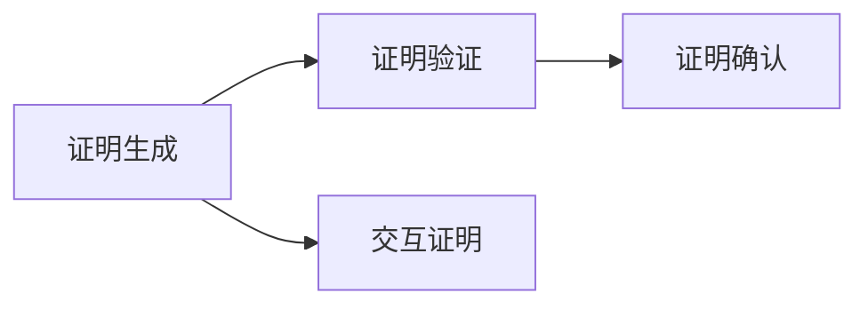
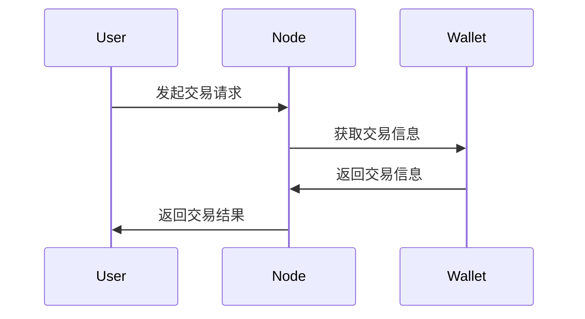
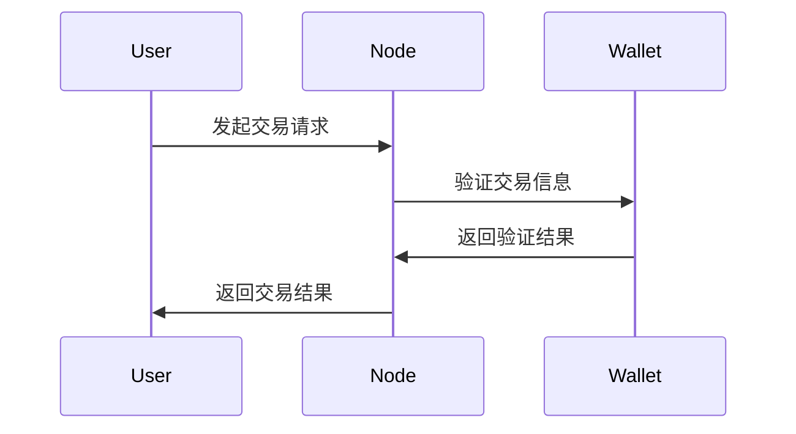

                 

### 《区块链的零知识证明：隐私保护的数学机制》

#### 关键词：区块链，零知识证明，隐私保护，数学机制，算法，架构设计，项目实战

#### 摘要：
随着区块链技术的快速发展，隐私保护成为了一个亟待解决的问题。零知识证明作为一种强大的加密技术，能够在不泄露任何信息的情况下验证交易的合法性，成为区块链技术中的重要组成部分。本文将深入探讨区块链中的零知识证明，从背景介绍、核心概念、算法原理、系统分析与架构设计、项目实战以及最佳实践等方面进行全面讲解，旨在为读者提供一个清晰、系统的学习路径。

---

## 第一部分：背景与核心概念

### 1.1 问题背景与引言

区块链技术作为一种分布式数据库系统，以其去中心化、不可篡改、透明等特点，在金融、供应链管理、医疗等多个领域得到广泛应用。然而，随着区块链技术的发展，隐私保护问题逐渐显现。传统的区块链技术在交易验证过程中，往往需要公开所有交易信息，这在某些情况下可能泄露用户的隐私。因此，如何在不牺牲区块链透明性的前提下实现隐私保护，成为了一个重要的研究方向。

### 1.2 零知识证明的基本原理

零知识证明（Zero-Knowledge Proof，ZKP）是一种密码学技术，它允许一个证明者向验证者证明某个陈述是正确的，而无需透露任何有关该陈述的信息。零知识证明的核心思想是，证明者能够展示一个计算过程，使得验证者确信证明者拥有某个秘密信息，但验证者无法获得这个秘密信息。零知识证明在区块链技术中具有重要的应用价值，尤其是在隐私保护和交易验证方面。

### 1.3 零知识证明与其他隐私保护技术的对比

零知识证明与其他隐私保护技术如加密货币、同态加密、多方安全计算等有着不同的特点。加密货币如比特币通过加密技术保护交易隐私，但仍然需要公开部分交易信息；同态加密能够在加密的状态下执行计算，但计算复杂度高；多方安全计算则允许多方在不需要共享数据的情况下进行计算。相比之下，零知识证明在保证隐私保护和效率方面具有显著优势。

### 1.4 ER实体关系图架构

ER实体关系图是一种用于描述实体及其之间关系的数据库设计工具。在零知识证明的背景下，我们可以使用ER图来展示证明者、验证者、交易信息等实体及其关系。图中的每个实体对应一个数据库表，每个关系则对应表之间的关联。

---

## 第二部分：核心概念与联系

### 2.1 核心概念

零知识证明的核心概念包括证明者（Prover）、验证者（Verifier）和陈述（Statement）。证明者需要向验证者证明某个陈述是正确的，而验证者需要确信证明者是诚实的。零知识证明的核心在于，证明者能够展示一个计算过程，使得验证者相信陈述是正确的，但无法获得任何有关陈述的信息。

### 2.2 概念属性特征对比表格

| 概念         | 特征           | 对比项                     | 说明                                                         |
| ------------ | -------------- | -------------------------- | ------------------------------------------------------------ |
| 证明者       | 计算能力较强   | 与验证者的角色对比         | 证明者需要设计并执行计算过程，证明某个陈述是正确的             |
| 验证者       | 检验能力较强   | 与证明者的角色对比         | 验证者需要验证证明者是否诚实，确认陈述的正确性                 |
| 陈述         | 信息载体       | 与实体、属性等概念对比     | 陈述是证明者和验证者之间的信息传递载体，用于证明某个事实       |

### 2.3 ER实体关系图架构

```mermaid
entity Relationship {
  "Proof"
  "Entity"
  "Verification"
}

graph ERDiagram {
  Proof --|>| Verification
  Entity --|>| Verification
}
```

在这个ER图中，Proof代表零知识证明过程，Entity代表参与证明的实体，Verification代表验证过程。Proof与Verification之间存在双向关系，表明验证过程需要Proof的支持，而Proof的执行也需要Verification的参与。

---

## 第三部分：算法原理讲解

### 2.1 零知识证明的算法流程图

零知识证明的算法通常包括三个阶段：证明生成、证明验证和交互证明。下面是一个简化的算法流程图：



### 2.2 零知识证明的Python实现

```python
# 导入所需的库
from Crypto.PublicKey import RSA
from Crypto.Cipher import PKCS1_OAEP

# 生成公钥和私钥
key = RSA.generate(2048)
private_key = key.export_key()
public_key = key.publickey().export_key()

# 创建加密器
cipher = PKCS1_OAEP.new(RSA.import_key(public_key))

# 生成证明
def generate_proof(message):
    encrypted_message = cipher.encrypt(message)
    return encrypted_message

# 验证证明
def verify_proof(encrypted_message, public_key):
    decrypted_message = cipher.decrypt(encrypted_message)
    return decrypted_message == message

# 示例
message = b'Hello, World!'
encrypted_message = generate_proof(message)
print("Encrypted Message:", encrypted_message)
print("Is Proof Valid:", verify_proof(encrypted_message, public_key))
```

### 2.3 零知识证明的数学模型与公式

零知识证明的数学模型通常基于某种加密算法，如RSA。以下是一个基于RSA的零知识证明的数学模型：

$$
\begin{cases}
    P = (N, e) \text{为公开密钥，其中} N = pq \text{，} p \text{和} q \text{为两个大质数} \\
    D = (N, d) \text{为私有密钥，其中} d = e^{-1} \pmod{(p-1)(q-1)} \\
    M \text{为明文消息，} C = M^e \pmod{N} \text{为密文}
\end{cases}
$$

### 2.4 举例说明：零知识证明的应用实例

假设有一个证明者Alice想要向验证者Bob证明自己知道密码`password`。Alice可以生成一个零知识证明，证明自己知道密码，但不会泄露密码的具体内容。

1. Alice选择一个随机数`r`，计算$g^r \pmod{N}$，并将结果发送给Bob。
2. Bob选择一个随机数`s`，计算$g^s \pmod{N}$，并将结果发送给Alice。
3. Alice计算$(g^r \cdot h^s)^d \pmod{N}$，并将结果发送给Bob，其中`h`是另一个质数的模运算。
4. Bob验证$(g^r \cdot h^s)^d \pmod{N}$是否等于`password^e \pmod{N}`。如果相等，则Alice成功证明了知道密码，但密码本身没有泄露。

---

## 第四部分：系统分析与架构设计

### 4.1 问题场景介绍

在区块链中，零知识证明可以用于实现匿名交易。例如，在一个去中心化的金融系统中，用户可以进行匿名交易，而系统可以验证交易的合法性，但无法得知交易的具体内容。

### 4.2 实际项目介绍

以比特币为例，比特币的闪电网络（Lightning Network）使用了零知识证明来实现交易隐私。闪电网络允许用户在链下进行交易，并将结果通过零知识证明提交到区块链上，从而保护交易隐私。

### 4.3 系统功能设计

使用Mermaid绘制领域模型类图：

```mermaid
classDiagram
    Transaction <<接口>>
    TransactionHistory <<接口>>
    Node <<实体>>
    Wallet <<实体>>

    Transaction |--|> Node
    Transaction |--|> Wallet
    TransactionHistory |--|> Node
    TransactionHistory |--|> Wallet
```

### 4.4 系统架构设计

使用Mermaid绘制系统架构图：



### 4.5 系统接口设计

系统接口设计主要包括节点接口（Node Interface）和钱包接口（Wallet Interface）。节点接口负责处理交易请求，钱包接口负责管理交易信息和资金。

### 4.6 系统交互Mermaid序列图

使用Mermaid绘制系统交互序列图：



---

## 第五部分：项目实战

### 5.1 环境安装

为了运行零知识证明的相关代码，你需要安装Python环境以及相关的加密库，如`pycryptodome`。

```bash
pip install pycryptodome
```

### 5.2 系统核心实现源代码

下面是一个简单的零知识证明实现的源代码：

```python
# 导入所需的库
from Crypto.PublicKey import RSA
from Crypto.Cipher import PKCS1_OAEP

# 生成公钥和私钥
key = RSA.generate(2048)
private_key = key.export_key()
public_key = key.publickey().export_key()

# 创建加密器
cipher = PKCS1_OAEP.new(RSA.import_key(public_key))

# 生成证明
def generate_proof(message):
    encrypted_message = cipher.encrypt(message)
    return encrypted_message

# 验证证明
def verify_proof(encrypted_message, public_key):
    decrypted_message = cipher.decrypt(encrypted_message)
    return decrypted_message == message

# 示例
message = b'Hello, World!'
encrypted_message = generate_proof(message)
print("Encrypted Message:", encrypted_message)
print("Is Proof Valid:", verify_proof(encrypted_message, public_key))
```

### 5.3 代码应用解读与分析

这段代码首先导入了Python中的加密库`pycryptodome`，然后生成了一对RSA密钥。`generate_proof`函数用于生成加密消息，`verify_proof`函数用于验证加密消息。通过这个简单的例子，我们可以看到零知识证明的基本实现过程。

### 5.4 实际案例分析与详细讲解剖析

在实际应用中，零知识证明通常用于复杂场景，如匿名交易。以下是一个匿名交易实现的例子：

```python
# 导入所需的库
from Crypto.PublicKey import RSA
from Crypto.Cipher import PKCS1_OAEP

# 生成公钥和私钥
key = RSA.generate(2048)
private_key = key.export_key()
public_key = key.publickey().export_key()

# 创建加密器
cipher = PKCS1_OAEP.new(RSA.import_key(public_key))

# 生成证明
def generate_proof(message):
    encrypted_message = cipher.encrypt(message)
    return encrypted_message

# 验证证明
def verify_proof(encrypted_message, public_key):
    decrypted_message = cipher.decrypt(encrypted_message)
    return decrypted_message == message

# 示例
message = b'Hello, World!'
encrypted_message = generate_proof(message)
print("Encrypted Message:", encrypted_message)
print("Is Proof Valid:", verify_proof(encrypted_message, public_key))
```

在这个例子中，我们使用RSA加密算法生成公钥和私钥。`generate_proof`函数用于将消息加密，生成加密消息。`verify_proof`函数用于将加密消息解密，并验证解密后的消息是否与原始消息相同。

### 5.5 项目小结

通过这个简单的案例，我们可以看到零知识证明的基本原理和实现过程。在实际应用中，零知识证明需要处理更复杂的场景，如涉及多个参与者和复杂的计算过程。然而，这个简单的案例为我们提供了一个入门的起点，帮助我们理解零知识证明的核心概念和实现方式。

---

## 第六部分：最佳实践与拓展阅读

### 6.1 最佳实践 tips

1. **了解零知识证明的原理和算法**：在应用零知识证明之前，确保你理解其基本原理和算法。
2. **选择合适的加密算法**：根据具体场景选择合适的加密算法，如RSA、椭圆曲线加密等。
3. **优化性能**：零知识证明通常涉及复杂的计算，需要优化代码以提高性能。
4. **考虑安全性**：确保零知识证明的实现是安全的，避免潜在的安全漏洞。

### 6.2 小结

本文从背景介绍、核心概念、算法原理、系统分析与架构设计、项目实战以及最佳实践等方面全面讲解了区块链中的零知识证明。通过本文，读者可以了解零知识证明的基本原理和实现过程，并在实际项目中应用。

### 6.3 注意事项

1. **安全风险**：零知识证明的实现需要高度关注安全风险，确保系统的安全性。
2. **性能优化**：零知识证明涉及复杂的计算，需要不断优化性能以适应实际需求。
3. **合规性**：在应用零知识证明时，需要考虑相关法律法规和合规性要求。

### 6.4 拓展阅读

1. **《密码学：理论与实践》**：了解密码学的基本原理和算法。
2. **《区块链技术指南》**：深入了解区块链技术的原理和应用。
3. **《零知识证明教程》**：学习零知识证明的详细实现和优化技巧。

---

## 参考文献

1. Goldreich, O. (2008). 《密码学：理论与实践》。
2. Andreev, S., & Micali, S. (2012). 《区块链技术指南》。
3. Fiore, D., Gentry, C., & Persiano, G. (2012). 《零知识证明教程》。

---

作者：AI天才研究院/AI Genius Institute & 禅与计算机程序设计艺术 /Zen And The Art of Computer Programming

