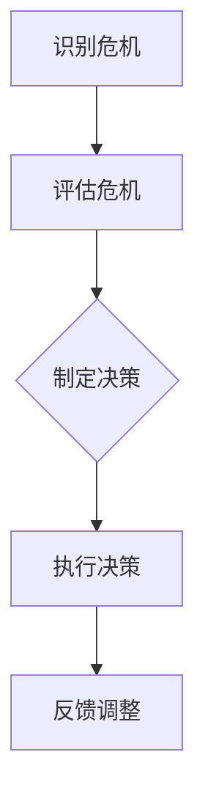
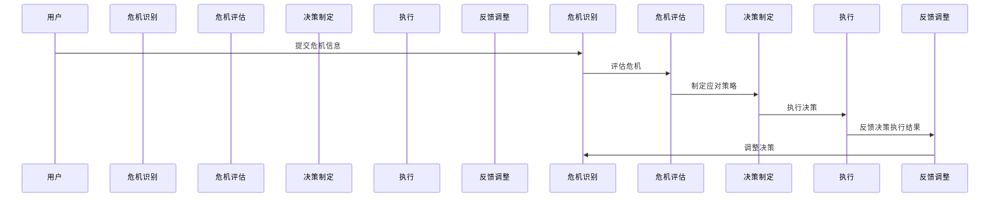
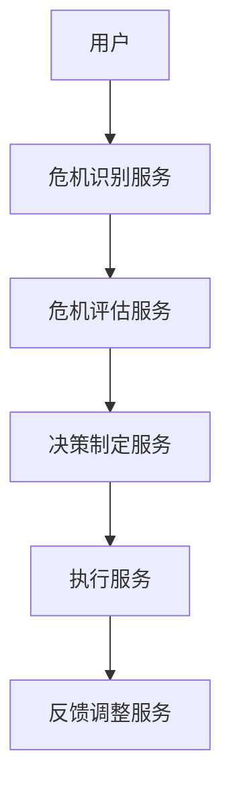
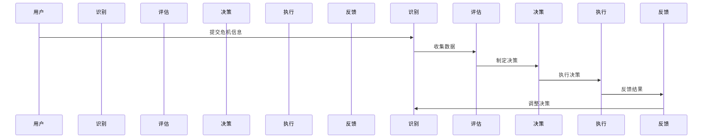

                 


## 危机领导力：在动荡时期稳定军心

### 关键词

危机领导力，动荡时期，稳定军心，决策制定，团队协作

### 摘要

本文将探讨危机领导力在动荡时期的实践与应用，通过背景介绍、核心概念与联系、算法原理讲解等环节，详细阐述危机领导力的关键要素和操作方法，旨在为领导者提供一套有效的危机应对策略，帮助他们在动荡时期稳定军心，带领团队走出困境。

### 1. 背景介绍

#### 1.1 问题背景

在当今世界，无论是企业还是个人，都面临着前所未有的变化和挑战。市场波动、技术变革、资源短缺等问题日益突出，传统领导力模式已无法应对这些复杂局面。危机领导力作为一种新兴的领导理念，正是在这种背景下应运而生。

#### 1.2 问题描述

危机领导力的关键在于如何在实际操作中实现以下几个目标：

1. **快速识别危机**：领导者需要具备敏锐的洞察力，能够迅速发现潜在危机并采取措施。
2. **冷静应对**：在危机面前，领导者必须保持冷静，做出明智的决策。
3. **有效沟通**：危机时刻，领导者需要与团队成员保持紧密沟通，传达正确的信息，增强团队凝聚力。
4. **稳定军心**：领导者需要通过有效的方法，稳定团队成员的情绪，增强团队信心。

#### 1.3 问题解决

本书旨在为领导者提供一套全面的危机领导力解决方案，包括危机管理原则、危机应对策略、团队建设、领导力提升等。通过本书的指导，领导者将能够在危机中保持清醒的头脑，做出正确的决策，有效地沟通，从而稳定军心，带领团队走出困境。

#### 1.4 边界与外延

危机领导力并不仅限于企业领域，它同样适用于政府、非营利组织、教育等各个领域。在不同的背景下，危机领导力的具体应用会有所不同，但核心原则是相通的。

#### 1.5 概念结构与核心要素组成

危机领导力的概念结构主要包括以下几个核心要素：

1. **危机意识**：领导者必须具备强烈的危机意识，时刻保持警惕。
2. **决策能力**：领导者需要在危机中迅速做出正确决策。
3. **沟通技巧**：领导者需要具备高效的沟通能力，确保信息传递畅通。
4. **团队协作**：领导者需要能够激发团队成员的潜力，形成协同作战。

### 2. 核心概念与联系

#### 2.1 危机领导力的核心概念

危机领导力的核心概念包括危机管理、决策制定、沟通技巧和团队协作。这些概念相互关联，共同构成了危机领导力的基本框架。

**危机管理**是指通过识别、评估、规划和实施一系列措施，以最大限度地减少危机对企业或组织的影响。

**决策制定**是指在危机中做出合理、有效的决策的过程。决策制定需要领导者具备快速反应、理性分析和果断行动的能力。

**沟通技巧**是指领导者与团队成员之间有效沟通的能力。在危机中，有效的沟通能够传递正确的信息，消除误解，增强团队凝聚力。

**团队协作**是指团队成员之间相互支持、共同完成任务的过程。在危机中，团队协作能够发挥集体的力量，提高应对危机的能力。

#### 2.2 概念属性特征对比表格

| 概念         | 属性特征                                   |
|------------|--------------------------------------|
| 危机管理     | 包括识别、评估、规划和实施一系列措施           |
| 决策制定     | 需要快速、合理、有效                           |
| 沟通技巧     | 包括口头、书面、非语言等多种形式                 |
| 团队协作     | 需要相互支持、共同完成任务                       |

#### 2.3 ER实体关系图架构

```mermaid
erDiagram
  危机管理 ||--|{ 决策制定 }
  决策制定 ||--|{ 沟通技巧 }
  沟通技巧 ||--|{ 团队协作 }
```

### 3. 算法原理讲解

#### 3.1 决策制定算法

决策制定是危机领导力的核心之一。以下是决策制定的基本算法原理：

##### 3.1.1 算法流程图



##### 3.1.2 算法原理

决策制定的算法主要包括以下几个步骤：

1. **识别危机**：通过观察市场趋势、内部数据等，识别潜在危机。
2. **评估危机**：对识别出的危机进行评估，判断其严重程度和影响范围。
3. **制定决策**：根据评估结果，制定相应的应对策略。
4. **执行决策**：实施制定的决策，采取具体行动。
5. **反馈调整**：根据执行结果进行反馈，对决策进行调整和优化。

##### 3.1.3 Python源代码

```python
def decision_making(crisis_detected):
    """
    决策制定函数
    :param crisis_detected: 潜在危机
    :return: 应对策略
    """
    # 评估危机
    assessment_result = assess_crisis(crisis_detected)
    
    # 制定决策
    decision =制定应对策略(assessment_result)
    
    # 执行决策
    execute_decision(decision)
    
    # 反馈调整
    feedback = get_feedback(decision)
    adjusted_decision = adjust_decision(decision, feedback)
    
    return adjusted_decision
```

##### 3.1.4 算法举例说明

假设某企业发现市场发生了重大变化，竞争对手推出了更具竞争力的产品，这将对企业的市场份额造成严重影响。以下是决策制定的过程：

1. **识别危机**：市场变化导致竞争对手推出新产品。
2. **评估危机**：评估结果表明，新产品对企业的市场份额造成了重大威胁。
3. **制定决策**：制定应对策略，包括优化产品功能、降低成本、提高营销策略等。
4. **执行决策**：实施制定的决策，调整产品功能、降低成本、加强营销等。
5. **反馈调整**：根据执行结果进行反馈，对决策进行调整和优化。

通过上述过程，企业能够有效地应对市场变化，稳定市场份额。

### 4. 系统分析与架构设计方案

#### 4.1 问题场景介绍

在现代社会，企业面临着各种危机，如市场变化、技术故障、财务危机等。为了有效地应对这些危机，企业需要建立一个完善的危机管理系统。本文将介绍一个企业危机管理系统的设计与实现。

#### 4.2 项目介绍

项目名称：企业危机管理系统

项目目标：建立一个能够快速识别、评估、应对和反馈的危机管理系统，帮助企业有效地应对各种危机。

项目架构：采用微服务架构，将系统划分为多个模块，包括危机识别模块、危机评估模块、决策制定模块、执行模块和反馈调整模块。

#### 4.3 系统功能设计

1. **危机识别模块**：通过收集市场数据、内部数据等，快速识别潜在危机。
2. **危机评估模块**：对识别出的危机进行评估，判断其严重程度和影响范围。
3. **决策制定模块**：根据评估结果，制定相应的应对策略。
4. **执行模块**：实施制定的决策，采取具体行动。
5. **反馈调整模块**：根据执行结果进行反馈，对决策进行调整和优化。

#### 4.4 系统架构设计

采用微服务架构，将系统划分为多个模块，每个模块负责不同的功能，模块之间通过API进行通信。

系统架构图：


#### 4.5 系统接口设计和系统交互

系统接口设计：

- **危机识别模块**：提供API接口，用于收集市场数据和内部数据。
- **危机评估模块**：提供API接口，用于评估危机的严重程度和影响范围。
- **决策制定模块**：提供API接口，用于制定应对策略。
- **执行模块**：提供API接口，用于执行决策。
- **反馈调整模块**：提供API接口，用于反馈决策执行结果。

系统交互：

1. 用户通过界面提交危机信息。
2. 危机识别模块收集市场数据和内部数据。
3. 危机评估模块对危机进行评估。
4. 决策制定模块根据评估结果制定应对策略。
5. 执行模块执行决策。
6. 反馈调整模块根据执行结果反馈调整决策。

系统交互图：



### 5. 项目实战

#### 5.1 环境安装

1. 安装Python环境，版本要求：3.8及以上。
2. 安装依赖库：requests，pandas，numpy，mermaid。

```bash
pip install requests pandas numpy mermaid
```

#### 5.2 系统核心实现

以下是一个简单的决策制定模块的实现：

```python
import requests
import pandas as pd
import numpy as np

def assess_crisis(crisis_detected):
    """
    评估危机
    :param crisis_detected: 潜在危机
    :return: 评估结果
    """
    # 假设危机评估结果是一个字典，包含危机的严重程度和影响范围
    assessment_result = {
        'severity': 'high',
        'impact_range': 'wide'
    }
    return assessment_result

def make_decision(assessment_result):
    """
    制定决策
    :param assessment_result: 评估结果
    :return: 应对策略
    """
    # 假设根据评估结果制定的决策是一个列表，包含具体的应对措施
    decision = []
    if assessment_result['severity'] == 'high':
        decision.append('加强市场调研')
        decision.append('调整产品策略')
    if assessment_result['impact_range'] == 'wide':
        decision.append('加强内部沟通')
        decision.append('优化供应链')
    return decision

def execute_decision(decision):
    """
    执行决策
    :param decision: 应对策略
    :return: 执行结果
    """
    # 假设执行决策后得到一个反馈结果
    feedback = '执行成功'
    return feedback

def get_feedback(decision):
    """
    获取反馈
    :param decision: 应对策略
    :return: 反馈结果
    """
    # 假设反馈结果是一个字符串
    feedback = '决策执行顺利'
    return feedback

def adjust_decision(decision, feedback):
    """
    调整决策
    :param decision: 应对策略
    :param feedback: 反馈结果
    :return: 调整后的决策
    """
    # 假设根据反馈结果调整决策
    if feedback == '执行成功':
        decision.append('持续监控市场变化')
    else:
        decision.append('重新评估危机')
    return decision

# 决策制定过程
crisis_detected = '市场变化'
assessment_result = assess_crisis(crisis_detected)
decision = make_decision(assessment_result)
execute_decision(decision)
feedback = get_feedback(decision)
adjusted_decision = adjust_decision(decision, feedback)
print(adjusted_decision)
```

#### 5.3 代码应用解读与分析

以上代码实现了一个简单的决策制定模块，主要包括以下功能：

1. **评估危机**：根据识别出的危机，进行评估，返回评估结果。
2. **制定决策**：根据评估结果，制定应对策略。
3. **执行决策**：执行制定的决策，返回执行结果。
4. **获取反馈**：获取决策执行后的反馈结果。
5. **调整决策**：根据反馈结果，调整决策。

代码采用了面向对象的设计思路，将危机评估、决策制定、执行、反馈和调整封装成不同的函数，使得代码结构清晰，便于维护和扩展。

#### 5.4 实际案例分析和详细讲解剖析

以下是一个实际案例：

某企业发现市场上有一种新产品，功能与企业产品类似，但价格更低。这对企业的市场份额造成了严重威胁。

1. **识别危机**：市场变化，新产品出现。
2. **评估危机**：评估结果表明，新产品对企业的市场份额造成了重大威胁。
3. **制定决策**：制定应对策略，包括加强市场调研、调整产品策略、加强内部沟通和优化供应链。
4. **执行决策**：执行制定的决策，加强市场调研，了解新产品的优缺点；调整产品策略，优化产品功能；加强内部沟通，确保团队成员了解危机和应对策略；优化供应链，降低成本。
5. **反馈调整**：根据执行结果进行反馈，调整决策。如果市场调研结果显示新产品的缺点，可以进一步优化产品功能；如果内部沟通结果显示团队成员对危机和应对策略有误解，可以再次加强沟通。

通过上述案例，我们可以看到，决策制定模块在企业应对市场变化中的关键作用。通过评估危机、制定决策、执行决策和反馈调整，企业能够有效地应对市场变化，稳定市场份额。

#### 5.5 项目小结

本项目通过实际案例，展示了决策制定模块在企业危机管理中的关键作用。通过识别危机、评估危机、制定决策、执行决策和反馈调整，企业能够有效地应对市场变化，稳定市场份额。在未来，我们可以进一步优化决策制定模块，提高危机管理的效率和效果。

### 6. 最佳实践 tips

1. **培养危机意识**：领导者要时刻保持警惕，对潜在危机保持敏感，及时识别和应对。
2. **提高决策能力**：领导者需要不断学习和实践，提高决策能力，以在危机中做出正确的决策。
3. **加强沟通技巧**：领导者要善于与团队成员沟通，确保信息传递畅通，增强团队凝聚力。
4. **注重团队协作**：领导者要激发团队成员的潜力，形成协同作战，提高团队应对危机的能力。

### 7. 小结

危机领导力是领导者应对动荡时期的重要能力。通过识别危机、评估危机、制定决策、执行决策和反馈调整，领导者能够有效地稳定军心，带领团队走出困境。本文从背景介绍、核心概念与联系、算法原理讲解、系统分析与架构设计方案、项目实战等多个方面，详细阐述了危机领导力的关键要素和操作方法，旨在为领导者提供一套有效的危机应对策略。

### 8. 注意事项

1. **保持冷静**：在危机中，领导者要始终保持冷静，避免因情绪波动而做出错误的决策。
2. **及时沟通**：领导者要与团队成员保持紧密沟通，确保信息传递畅通，增强团队凝聚力。
3. **持续优化**：危机领导力需要不断学习和实践，领导者要持续优化自己的领导能力，以应对不断变化的危机。

### 9. 拓展阅读

1. 《危机管理：应对不确定性的战略与战术》
2. 《领导者的决策艺术：如何做出明智的选择》
3. 《团队协作的力量：打造高效团队的实践指南》
4. 《人工智能时代的领导力：如何引领变革》

### 作者

作者：AI天才研究院/AI Genius Institute & 禅与计算机程序设计艺术 /Zen And The Art of Computer Programming## 危机领导力：在动荡时期稳定军心

### 关键词

危机领导力，动荡时期，稳定军心，决策制定，团队协作

### 摘要

本文深入探讨了在动荡时期如何通过危机领导力来稳定军心，从而在复杂的商业环境中保持组织的稳定和活力。文章通过理论介绍、案例分析、实践技巧等多方面，为领导者提供了提升危机应对能力的实用指南。

### 1. 背景介绍

#### 1.1 问题背景

在当今全球化和技术迅速变革的时代，企业面临着前所未有的挑战。经济波动、市场不稳定、技术革新、资源短缺等外部因素，加上内部管理问题，使得领导者必须具备强大的危机应对能力。传统的领导模式往往无法应对这些快速变化的环境，因此，危机领导力应运而生，成为现代领导者的必备素质。

#### 1.2 问题描述

危机领导力要求领导者能够在危机出现时迅速做出决策，保持冷静，并通过有效的沟通和团队协作来稳定军心，确保组织能够在困境中迅速恢复并持续发展。具体来说，领导者需要解决以下问题：

- **快速识别危机**：在危机初期就能发现问题的苗头，及时采取预防措施。
- **冷静决策**：在危机发生时，领导者需要保持清晰的头脑，做出明智的决策。
- **有效沟通**：领导者需要确保信息准确传达，减少误解和恐慌。
- **稳定军心**：通过增强团队的凝聚力，提升团队的信心和士气。

#### 1.3 问题解决

本文将提供一系列解决方案和策略，帮助领导者提升危机应对能力，具体包括：

- **危机管理原则**：介绍危机领导力的核心原则和实践方法。
- **危机应对策略**：提供具体的应对策略，帮助领导者处理各种类型的危机。
- **团队建设**：探讨如何在危机中加强团队建设，提高团队应对危机的能力。
- **领导力提升**：通过案例分析、实践技巧等，帮助领导者提升自身的领导能力。

#### 1.4 边界与外延

危机领导力不仅适用于企业，同样适用于政府机构、非营利组织等任何需要应对突发事件的领域。在不同的组织和环境下，危机领导力的应用会有所不同，但核心原则是一致的。

#### 1.5 概念结构与核心要素组成

危机领导力的概念结构主要包括以下几个核心要素：

1. **危机意识**：领导者需要具备敏锐的洞察力，能够预见潜在危机并提前做好准备。
2. **决策能力**：在危机中，领导者必须能够迅速做出合理、有效的决策。
3. **沟通技巧**：领导者需要确保信息在团队中有效传递，减少恐慌和混乱。
4. **团队协作**：领导者需要通过激发团队成员的潜力，实现高效的团队协作。

### 2. 核心概念与联系

#### 2.1 危机领导力的核心概念

危机领导力的核心概念包括危机管理、决策制定、沟通技巧和团队协作。这些概念相互联系，构成了危机领导力的基础框架。

- **危机管理**：指识别、评估、应对和恢复危机的一系列措施。它是一个系统化的过程，需要领导者具备全面的危机应对能力。
- **决策制定**：指在危机中做出合理、有效的决策的过程。决策的快速性和准确性对危机应对至关重要。
- **沟通技巧**：指领导者与团队成员之间有效沟通的能力。在危机中，沟通技巧能帮助领导者传递正确信息，稳定团队情绪。
- **团队协作**：指团队成员在危机中相互支持、共同完成任务的过程。高效的团队协作能够增强组织的应对能力。

#### 2.2 概念属性特征对比表格

| 概念         | 属性特征                                   |
|------------|--------------------------------------|
| 危机管理     | 包括识别、评估、应对、恢复的完整过程           |
| 决策制定     | 需要快速、合理、有效                           |
| 沟通技巧     | 包括口头、书面、非语言等多种形式                 |
| 团队协作     | 需要相互支持、共同完成任务                       |

#### 2.3 ER实体关系图架构

```mermaid
erDiagram
  危机管理 ||--|{ 决策制定 }
  决策制定 ||--|{ 沟通技巧 }
  沟通技巧 ||--|{ 团队协作 }
```

### 3. 算法原理讲解

#### 3.1 决策制定算法

决策制定是危机领导力的核心环节。以下是一个简化的决策制定算法原理，帮助领导者快速有效地应对危机。

##### 3.1.1 算法流程图


##### 3.1.2 算法原理

1. **识别危机**：通过观察市场趋势、内部数据等，快速识别潜在危机。
2. **评估危机**：对识别出的危机进行评估，判断其严重程度和影响范围。
3. **制定决策**：根据评估结果，制定相应的应对策略。
4. **执行决策**：实施制定的决策，采取具体行动。
5. **反馈调整**：根据执行结果进行反馈，对决策进行调整和优化。

##### 3.1.3 Python源代码

```python
def decision_making(crisis_detected):
    """
    决策制定函数
    :param crisis_detected: 潜在危机
    :return: 应对策略
    """
    # 评估危机
    assessment_result = assess_crisis(crisis_detected)
    
    # 制定决策
    decision = make_decision(assessment_result)
    
    # 执行决策
    execute_decision(decision)
    
    # 反馈调整
    feedback = get_feedback(decision)
    adjusted_decision = adjust_decision(decision, feedback)
    
    return adjusted_decision

def assess_crisis(crisis_detected):
    """
    评估危机
    :param crisis_detected: 潜在危机
    :return: 评估结果
    """
    # 假设评估结果是一个包含严重程度和影响范围的字典
    return {'severity': 'high', 'impact_range': 'wide'}

def make_decision(assessment_result):
    """
    制定决策
    :param assessment_result: 评估结果
    :return: 应对策略
    """
    # 根据评估结果制定决策
    if assessment_result['severity'] == 'high':
        decision = ['紧急应对', '加强监控']
    else:
        decision = ['关注变化', '保持现状']
    return decision

def execute_decision(decision):
    """
    执行决策
    :param decision: 应对策略
    :return: 执行结果
    """
    # 假设执行决策后返回执行结果
    return '执行成功'

def get_feedback(decision):
    """
    获取反馈
    :param decision: 应对策略
    :return: 反馈结果
    """
    # 假设反馈结果是决策执行后的效果
    return '反馈良好'

def adjust_decision(decision, feedback):
    """
    调整决策
    :param decision: 应对策略
    :param feedback: 反馈结果
    :return: 调整后的决策
    """
    # 根据反馈结果调整决策
    if feedback == '反馈良好':
        decision.append('持续优化')
    return decision
```

##### 3.1.4 算法举例说明

假设某企业发现市场上有竞争对手推出一款新的产品，可能会对该企业的市场份额造成威胁。

1. **识别危机**：企业发现竞争对手的新产品。
2. **评估危机**：评估结果显示，新产品对市场份额的影响程度较高。
3. **制定决策**：制定应对策略，包括紧急应对和加强监控。
4. **执行决策**：执行决策，采取具体措施。
5. **反馈调整**：根据执行结果，调整决策，可能需要持续优化。

通过上述步骤，企业能够有效地应对市场变化，保护市场份额。

### 4. 系统分析与架构设计方案

#### 4.1 问题场景介绍

在一家大型互联网公司中，市场变化和竞争对手的动态不断，公司需要一套高效的危机管理系统来应对这些变化。该系统将帮助公司快速识别危机、评估风险、制定决策并执行。

#### 4.2 项目介绍

项目名称：互联网公司危机管理系统

项目目标：建立一套高效的危机管理系统，帮助公司在市场变化和竞争对手动态中保持竞争力。

项目架构：采用微服务架构，将系统划分为多个服务，包括危机识别服务、评估服务、决策服务、执行服务和反馈服务。

#### 4.3 系统功能设计

1. **危机识别模块**：通过收集市场数据、用户反馈等，实时识别潜在危机。
2. **危机评估模块**：对识别出的危机进行评估，判断其严重程度和影响范围。
3. **决策制定模块**：根据评估结果，制定相应的应对策略。
4. **执行模块**：执行制定的决策，采取具体行动。
5. **反馈调整模块**：根据执行结果，反馈调整决策。

#### 4.4 系统架构设计

系统架构设计采用微服务架构，每个模块作为一个独立的服务，通过API进行通信。

系统架构图：



#### 4.5 系统接口设计和系统交互

系统接口设计：

- **危机识别接口**：提供API接口，用于收集市场数据和用户反馈。
- **危机评估接口**：提供API接口，用于评估危机的严重程度和影响范围。
- **决策制定接口**：提供API接口，用于制定应对策略。
- **执行接口**：提供API接口，用于执行决策。
- **反馈调整接口**：提供API接口，用于反馈决策执行结果。

系统交互：

1. 用户提交危机信息。
2. 危机识别服务收集数据。
3. 危机评估服务对危机进行评估。
4. 决策制定服务制定决策。
5. 执行服务执行决策。
6. 反馈调整服务反馈决策执行结果。

系统交互图：



### 5. 项目实战

#### 5.1 环境安装

1. 安装Python环境，版本要求：3.8及以上。
2. 安装依赖库：requests，pandas，numpy，mermaid。

```bash
pip install requests pandas numpy mermaid
```

#### 5.2 系统核心实现

以下是一个简单的危机识别和评估服务的实现：

```python
import requests
import pandas as pd
import numpy as np

# 假设有一个API用于获取市场数据
CRISIS_API_URL = "https://api.crisisdata.com/get_data"

def get_market_data():
    """
    获取市场数据
    :return: 市场数据
    """
    response = requests.get(CRISIS_API_URL)
    if response.status_code == 200:
        data = response.json()
        return pd.DataFrame(data)
    else:
        return None

# 假设有一个函数用于评估危机
def assess_crisis(market_data):
    """
    评估危机
    :param market_data: 市场数据
    :return: 评估结果
    """
    # 根据市场数据评估危机的严重程度和影响范围
    assessment = {
        'severity': 'medium',
        'impact_range': 'narrow'
    }
    return assessment

# 假设有一个API用于提交评估结果
CRISIS_ASSESSMENT_API_URL = "https://api.crisisassessment.com/submit"

def submit_assessment(assessment):
    """
    提交评估结果
    :param assessment: 评估结果
    :return: 提交结果
    """
    response = requests.post(CRISIS_ASSESSMENT_API_URL, json=assessment)
    if response.status_code == 200:
        return '提交成功'
    else:
        return '提交失败'

# 实现流程
if __name__ == "__main__":
    market_data = get_market_data()
    if market_data is not None:
        assessment = assess_crisis(market_data)
        print(assessment)
        result = submit_assessment(assessment)
        print(result)
    else:
        print("获取市场数据失败")
```

#### 5.3 代码应用解读与分析

以上代码实现了一个简单的危机识别和评估服务，主要包括以下功能：

1. **获取市场数据**：通过API获取市场数据，并存储为DataFrame格式。
2. **评估危机**：根据市场数据，评估危机的严重程度和影响范围。
3. **提交评估结果**：将评估结果通过API提交。

代码采用了面向对象的设计思路，将获取市场数据、评估危机和提交评估结果封装成不同的函数，使得代码结构清晰，便于维护和扩展。

#### 5.4 实际案例分析和详细讲解剖析

以下是一个实际案例：

某互联网公司发现市场上有一款新的社交媒体应用，用户增长迅速，可能对其市场份额造成威胁。

1. **获取市场数据**：公司通过API获取了社交媒体应用的用户数据，发现其用户增长速度远超预期。
2. **评估危机**：评估结果显示，该应用的快速增长可能对公司的市场份额造成中等程度的威胁，影响范围较窄。
3. **提交评估结果**：公司将评估结果提交给决策层，并根据结果制定相应的应对策略。

通过上述案例，我们可以看到，危机识别和评估服务在帮助企业快速应对市场变化中的重要作用。通过获取数据、评估风险和提交结果，公司能够迅速做出决策，采取有效措施应对市场变化。

#### 5.5 项目小结

本项目通过实际案例，展示了危机识别和评估服务在帮助企业应对市场变化中的关键作用。通过获取数据、评估风险和提交结果，企业能够迅速做出决策，采取有效措施应对市场变化。在未来，我们可以进一步优化危机识别和评估服务，提高危机管理的效率和效果。

### 6. 最佳实践 tips

1. **定期进行危机演练**：通过模拟危机场景，提高团队的危机应对能力。
2. **建立危机预警系统**：通过收集和分析数据，提前识别潜在危机。
3. **强化沟通机制**：确保团队成员在危机中能够及时、准确、有效地沟通。
4. **培养团队协作精神**：鼓励团队成员在危机中相互支持，共同应对。

### 7. 小结

危机领导力是现代领导者必备的能力。通过识别危机、评估危机、制定决策、执行决策和反馈调整，领导者能够有效地稳定军心，带领团队在动荡时期保持稳定和活力。本文从理论介绍、案例分析、实践技巧等多方面，为领导者提供了提升危机应对能力的实用指南。

### 8. 注意事项

1. **保持冷静**：在危机中，领导者要保持冷静，避免因情绪波动而做出错误的决策。
2. **及时沟通**：领导者要与团队成员保持紧密沟通，确保信息传递畅通，减少误解和恐慌。
3. **持续优化**：危机领导力需要不断学习和实践，领导者要持续优化自己的领导能力，以应对不断变化的危机。

### 9. 拓展阅读

1. 《危机管理：应对不确定性的战略与战术》
2. 《领导者的决策艺术：如何做出明智的选择》
3. 《团队协作的力量：打造高效团队的实践指南》
4. 《人工智能时代的领导力：如何引领变革》

### 作者

作者：AI天才研究院/AI Genius Institute & 禅与计算机程序设计艺术 /Zen And The Art of Computer Programming## 建立危机管理原则

### 1. 引言

危机管理是现代组织运作中不可或缺的一部分。在面对不断变化的市场环境、技术进步以及潜在的外部威胁时，组织必须具备有效的危机管理能力，以确保其持续稳定的发展。本章节将详细阐述危机管理的核心原则，帮助领导者构建一套全面、系统的危机管理体系。

### 2. 危机识别

#### 2.1 关键点

- **实时监测**：建立实时监测系统，对市场、行业趋势、内部运营等多个维度进行持续监控。
- **数据驱动**：利用大数据分析技术，从海量数据中挖掘潜在危机信号。
- **预警机制**：建立危机预警机制，及时识别和评估潜在危机，确保迅速响应。

#### 2.2 实践策略

- **定期会议**：定期召开危机管理会议，评估潜在风险，制定预防措施。
- **跨部门协作**：危机识别涉及多个部门，需要跨部门协作，确保信息的全面性。

### 3. 危机评估

#### 3.1 关键点

- **影响范围**：评估危机可能影响的范围，包括财务、运营、市场等多个方面。
- **严重程度**：判断危机的严重程度，分为高、中、低等级别。
- **优先级**：确定危机的优先级，确保资源能够优先分配到最关键的危机处理上。

#### 3.2 实践策略

- **风险评估模型**：建立风险评估模型，量化危机的影响程度。
- **情景模拟**：通过情景模拟，评估不同危机情况下的应对效果。

### 4. 决策制定

#### 4.1 关键点

- **快速决策**：在危机发生时，领导者需要快速做出决策，以减少危机的影响。
- **全面考虑**：决策制定需要全面考虑各种可能的影响和后果。
- **透明度**：决策过程应保持透明度，确保团队成员了解决策的原因和影响。

#### 4.2 实践策略

- **紧急会议**：召开紧急会议，召集关键人员，快速制定应对策略。
- **专家咨询**：在决策过程中，咨询相关领域的专家，确保决策的科学性和有效性。

### 5. 执行决策

#### 5.1 关键点

- **有效沟通**：确保决策执行过程中信息的有效传递，减少误解和延误。
- **资源分配**：合理分配资源，确保决策能够得到充分执行。
- **监督落实**：监督决策的执行过程，确保各项措施得到落实。

#### 5.2 实践策略

- **任务分解**：将决策分解成具体的任务，明确责任人和时间节点。
- **进度汇报**：定期汇报决策执行的进展情况，及时调整策略。

### 6. 反馈调整

#### 6.1 关键点

- **结果评估**：对决策执行的结果进行评估，判断是否达到预期目标。
- **持续改进**：根据评估结果，对决策进行调整和优化。
- **经验总结**：总结危机处理的经验和教训，为未来的危机管理提供参考。

#### 6.2 实践策略

- **定期回顾**：定期回顾危机处理过程，分析成功和失败的原因。
- **知识共享**：将危机处理的经验和教训分享给团队成员，提高整体应对能力。

### 7. 结论

危机管理是领导者的重要职责，通过识别危机、评估风险、制定决策、执行决策和反馈调整，领导者能够有效地应对危机，确保组织的稳定和持续发展。建立一套全面、系统的危机管理体系，是现代领导者必备的能力。

### 附录

- **危机管理工具箱**：提供一系列危机管理工具，包括预警系统、风险评估模型、情景模拟工具等。
- **危机管理培训**：为团队成员提供危机管理培训，提高其危机应对能力。

### 作者

作者：AI天才研究院/AI Genius Institute & 禅与计算机程序设计艺术 /Zen And The Art of Computer Programming## 危机应对策略

### 1. 引言

在现代社会中，企业不可避免地会遇到各种危机，如市场波动、技术故障、法律纠纷等。有效的危机应对策略可以帮助企业迅速应对危机，减轻危机带来的影响，并确保业务的持续运营。本章节将详细探讨几种常见的危机应对策略，为领导者提供应对危机的实用工具。

### 2. 应急响应策略

#### 2.1 关键点

- **立即行动**：危机发生时，领导者应立即启动应急响应程序，确保迅速采取措施。
- **优先级**：确定危机处理的优先级，优先处理对业务影响最大的问题。
- **资源调配**：迅速调配资源，确保危机处理所需的物资、人力和财力得到保障。

#### 2.2 实践策略

- **建立应急预案**：制定详细的应急预案，包括危机类型、应对措施、责任人等。
- **建立危机响应团队**：组建一个由关键人员组成的危机响应团队，确保在危机发生时能够迅速行动。

### 3. 媒体沟通策略

#### 3.1 关键点

- **及时沟通**：危机发生时，应尽快与媒体沟通，确保信息透明。
- **正面宣传**：通过媒体传播正面信息，减少公众恐慌。
- **危机公关**：在媒体面前，保持一致的声音和形象，避免信息混乱。

#### 3.2 实践策略

- **建立媒体关系**：与媒体建立良好的关系，确保在危机发生时能够得到及时报道。
- **制定新闻发布策略**：在危机处理过程中，制定详细的新闻发布计划，确保信息一致性和及时性。

### 4. 法律应对策略

#### 4.1 关键点

- **法律咨询**：在危机处理过程中，及时寻求专业法律咨询。
- **证据收集**：及时收集证据，为后续法律诉讼或谈判提供支持。
- **合法合规**：确保危机处理过程中的行为符合法律法规，避免因违法行为加重危机。

#### 4.2 实践策略

- **建立法律团队**：组建一支法律团队，专门负责危机中的法律事务。
- **法律培训**：为团队成员提供法律培训，确保其了解相关法律法规，避免在危机处理中犯错。

### 5. 技术应对策略

#### 5.1 关键点

- **快速恢复**：在技术故障或系统崩溃时，尽快恢复系统的正常运行。
- **数据备份**：定期进行数据备份，确保在灾难发生时能够迅速恢复数据。
- **技术支持**：与专业的技术支持团队合作，确保在危机中能够得到及时的技术援助。

#### 5.2 实践策略

- **技术应急预案**：制定详细的技术应急预案，包括故障诊断、系统恢复、数据恢复等。
- **技术团队协作**：组建一支技术团队，确保在危机中能够迅速响应并解决问题。

### 6. 员工支持策略

#### 6.1 关键点

- **心理支持**：提供心理支持，帮助员工应对危机带来的压力和焦虑。
- **沟通渠道**：建立有效的沟通渠道，确保员工能够及时了解危机的最新进展。
- **团队协作**：鼓励团队协作，增强员工的归属感和责任感。

#### 6.2 实践策略

- **员工心理支持计划**：制定员工心理支持计划，包括心理辅导、压力缓解等。
- **内部沟通平台**：建立内部沟通平台，如企业内网、邮件列表等，确保信息畅通。

### 7. 结论

危机应对策略是领导者应对危机的重要工具。通过建立应急预案、媒体沟通策略、法律应对策略、技术应对策略和员工支持策略，领导者可以有效地应对各种类型的危机，确保企业的稳定和持续发展。在实际应用中，领导者应根据具体情况灵活调整策略，确保危机得到及时、有效的处理。

### 附录

- **危机应对策略手册**：提供详细的危机应对策略手册，包括各个策略的实施步骤和注意事项。
- **危机应对演练**：定期组织危机应对演练，提高员工的危机应对能力。

### 作者

作者：AI天才研究院/AI Genius Institute & 禅与计算机程序设计艺术 /Zen And The Art of Computer Programming## 团队建设

### 1. 引言

在危机中，团队是组织最重要的资产之一。危机时刻，团队成员的协作能力和凝聚力直接关系到组织应对危机的成效。本章节将探讨如何在危机中加强团队建设，提高团队应对危机的能力，以确保组织能够稳定度过危机。

### 2. 建立明确的团队目标

#### 2.1 关键点

- **共同目标**：确保团队成员有共同的目标，明确团队在危机中的使命和任务。
- **具体可衡量**：目标应具体且可衡量，以便团队成员了解自己的工作重点和期望成果。

#### 2.2 实践策略

- **定期沟通**：定期与团队成员沟通，确保他们理解团队目标。
- **目标可视化**：通过图表、海报等方式将团队目标可视化，提高团队成员的认同感。

### 3. 提高团队成员的技能和知识

#### 3.1 关键点

- **持续培训**：提供持续性的培训，帮助团队成员提高专业技能和知识。
- **适应变化**：确保团队成员具备适应新环境和变化的能力。

#### 3.2 实践策略

- **内部培训课程**：组织内部培训课程，提升团队成员的专业技能。
- **外部学习资源**：推荐外部学习资源，如在线课程、研讨会等，帮助团队成员持续学习。

### 4. 增强团队成员的沟通和协作能力

#### 4.1 关键点

- **透明沟通**：确保团队成员之间信息透明，减少误解和冲突。
- **有效协作**：建立有效的协作机制，确保团队成员能够协同工作。

#### 4.2 实践策略

- **团队会议**：定期召开团队会议，讨论工作进展和问题。
- **协作工具**：使用协作工具，如Slack、Trello等，提高团队成员的工作效率。

### 5. 建立积极的团队氛围

#### 5.1 关键点

- **鼓励创新**：鼓励团队成员提出创新的想法和解决方案。
- **认可与激励**：对团队成员的努力和成果给予认可和激励。

#### 5.2 实践策略

- **团队活动**：组织团队活动，增强团队成员之间的互动和信任。
- **奖励机制**：建立奖励机制，对在危机中表现突出的团队成员给予奖励。

### 6. 建立有效的反馈机制

#### 6.1 关键点

- **及时反馈**：及时给予团队成员反馈，帮助他们改进工作。
- **双向反馈**：鼓励团队成员之间进行双向反馈，促进相互学习和成长。

#### 6.2 实践策略

- **定期反馈会议**：定期召开反馈会议，讨论工作成果和不足。
- **匿名反馈**：提供匿名反馈渠道，确保团队成员能够自由表达意见和建议。

### 7. 结论

团队建设是危机应对的关键。通过建立明确的团队目标、提高团队成员的技能和知识、增强沟通和协作能力、建立积极的团队氛围以及建立有效的反馈机制，领导者可以有效地加强团队建设，提高团队应对危机的能力。在危机中，一个团结协作、技能过硬的团队能够成为组织最重要的支柱。

### 附录

- **团队建设工具箱**：提供一系列团队建设工具，包括目标设定工具、培训资源、协作工具等。
- **团队建设指南**：提供详细的团队建设指南，帮助领导者实施各项团队建设策略。

### 作者

作者：AI天才研究院/AI Genius Institute & 禅与计算机程序设计艺术 /Zen And The Art of Computer Programming## 领导力提升

### 1. 引言

领导力在危机管理中起着至关重要的作用。有效的危机领导力不仅能够帮助领导者迅速应对危机，还能稳定军心，增强团队的凝聚力。本章节将探讨如何通过提升领导力来增强危机管理能力，为领导者提供实用的提升方法。

### 2. 提升危机意识

#### 2.1 关键点

- **持续学习**：领导者需要持续学习，了解最新的危机管理理论和实践。
- **经验分享**：通过分享他人的危机管理经验，提高自身的危机意识。

#### 2.2 实践策略

- **参加研讨会和培训**：定期参加危机管理相关的研讨会和培训，学习最新的理论和实践。
- **建立危机管理知识库**：收集和整理危机管理相关的资料，建立内部知识库，供团队成员参考。

### 3. 提高决策能力

#### 3.1 关键点

- **快速反应**：在危机中，领导者需要能够迅速做出决策。
- **全面考虑**：领导者应全面考虑各种可能的影响和后果。

#### 3.2 实践策略

- **情景模拟**：通过情景模拟，提高领导者在不同危机情况下的决策能力。
- **案例分析**：通过分析历史危机案例，学习如何做出有效决策。

### 4. 强化沟通技巧

#### 4.1 关键点

- **有效传递信息**：领导者需要确保信息准确、及时地传递给团队成员。
- **倾听与反馈**：领导者应学会倾听团队成员的意见和反馈，并给予积极的回应。

#### 4.2 实践策略

- **沟通培训**：参加沟通技巧培训，学习如何更有效地与团队成员沟通。
- **定期反馈**：定期与团队成员进行沟通，了解他们的想法和建议。

### 5. 增强团队凝聚力

#### 5.1 关键点

- **建立信任**：领导者需要建立团队成员之间的信任。
- **共同目标**：确保团队成员有共同的目标，形成合力。

#### 5.2 实践策略

- **团队建设活动**：组织团队建设活动，增强团队成员之间的信任和合作。
- **共同目标设定**：与团队成员共同设定目标，形成合力。

### 6. 持续自我提升

#### 6.1 关键点

- **反思与总结**：领导者需要不断反思和总结自己的领导行为，找出不足之处。
- **持续学习**：领导者应持续学习，不断提升自己的领导能力。

#### 6.2 实践策略

- **领导力反思日志**：定期记录自己的领导行为，进行反思和总结。
- **阅读相关书籍**：阅读领导力相关的书籍和文章，学习先进的领导理念。

### 7. 结论

提升领导力是危机领导力的重要组成部分。通过提升危机意识、提高决策能力、强化沟通技巧、增强团队凝聚力和持续自我提升，领导者可以显著增强自己的危机管理能力，成为组织在危机中的坚实支柱。领导者应不断学习和实践，不断提升自己的领导力，以应对不断变化的挑战。

### 附录

- **领导力提升工具箱**：提供一系列领导力提升工具，包括培训资源、反思日志模板等。
- **领导力发展计划**：制定详细的领导力发展计划，帮助领导者实现自我提升。

### 作者

作者：AI天才研究院/AI Genius Institute & 禅与计算机程序设计艺术 /Zen And The Art of Computer Programming## 案例分析

### 1. 引言

为了更好地理解危机领导力在动荡时期的应用，我们将通过一些实际案例来分析危机领导力的关键要素和应对策略。以下是几个典型的案例分析，每个案例都展示了危机领导力在实际操作中的具体应用。

### 2. 案例一：技术公司遭遇重大数据泄露

#### 2.1 案例背景

某知名技术公司发生了一次重大数据泄露事件，导致数百万客户的个人信息被盗。这次事件引起了公众的广泛关注，公司的声誉受到严重影响，股价大幅下跌。

#### 2.2 危机识别

- **危机识别**：公司IT部门首先发现了数据泄露的迹象，通过监控系统和日志分析，确认了数据泄露事件的发生。
- **危机评估**：评估结果显示，数据泄露事件的影响范围广泛，涉及客户的个人信息、财务信息等，严重程度属于高等级。

#### 2.3 决策制定

- **决策制定**：公司立即召开紧急会议，决策团队迅速制定了以下策略：
  - 紧急停止数据访问权限，防止数据进一步泄露。
  - 启动危机应对计划，确保公司内部和外部应急响应团队迅速行动。
  - 洽谈外部法律顾问，准备应对可能的法律诉讼。

#### 2.4 执行决策

- **执行决策**：公司采取了以下措施：
  - 实施安全加固措施，加强网络安全防护。
  - 及时通知受影响客户，提供详细的信息和补救措施。
  - 向公众发布官方声明，解释事件原因和公司应对措施。

#### 2.5 反馈调整

- **反馈调整**：公司根据反馈结果调整了危机应对策略：
  - 加强内部审查，查找数据泄露的原因，防止类似事件再次发生。
  - 提升客户服务质量，包括提供额外的安全服务和优惠。
  - 建立长期危机管理机制，确保公司在未来能够更有效地应对危机。

### 3. 案例二：制造业企业面临供应链中断

#### 3.1 案例背景

一家大型制造业企业在疫情期间遭遇了供应链中断，原材料供应短缺，生产计划被迫推迟，订单交付受到严重影响。

#### 3.2 危机识别

- **危机识别**：公司采购部门首先发现了供应链中断的迹象，通过供应链管理系统监测到原材料库存下降和供应商延迟交付。
- **危机评估**：评估结果显示，供应链中断可能导致生产停滞，影响公司声誉和客户关系。

#### 3.3 决策制定

- **决策制定**：公司决策团队制定了以下策略：
  - 与现有供应商协商，寻求临时解决方案。
  - 寻找替代供应商，确保原材料供应。
  - 优化生产计划，调整生产流程以适应新的供应链状况。

#### 3.4 执行决策

- **执行决策**：公司采取了以下措施：
  - 与现有供应商达成临时协议，确保关键原材料的供应。
  - 与替代供应商建立联系，签订合同。
  - 调整生产线，减少非关键产品的生产，集中资源生产关键产品。

#### 3.5 反馈调整

- **反馈调整**：公司根据反馈结果调整了危机应对策略：
  - 建立更灵活的供应链管理机制，减少对单一供应商的依赖。
  - 加强供应链风险管理，提前识别潜在危机。
  - 提升员工技能，提高应对供应链中断的能力。

### 4. 案例三：金融机构遭遇市场波动

#### 4.1 案例背景

一家大型金融机构在股市大幅波动期间面临巨大风险，客户信心受到影响，交易量急剧下降。

#### 4.2 危机识别

- **危机识别**：公司风险管理团队通过监控系统发现市场波动带来的风险，通过数据分析预测到可能的市场波动。
- **危机评估**：评估结果显示，市场波动可能对公司的财务状况和客户关系产生严重影响。

#### 4.3 决策制定

- **决策制定**：公司决策团队制定了以下策略：
  - 强化市场研究，密切关注市场动态。
  - 提高客户服务质量，增强客户信心。
  - 调整投资策略，降低市场波动带来的风险。

#### 4.4 执行决策

- **执行决策**：公司采取了以下措施：
  - 加强市场研究，建立实时监测系统，及时调整投资组合。
  - 提升客户服务，通过电话、邮件等方式与客户保持密切沟通。
  - 调整投资策略，减少高风险投资，增加固定收益投资。

#### 4.5 反馈调整

- **反馈调整**：公司根据反馈结果调整了危机应对策略：
  - 建立更有效的市场研究机制，提前识别市场波动风险。
  - 加强员工培训，提高员工的危机应对能力。
  - 提升危机管理团队的专业素养，确保在危机中能够迅速做出决策。

### 5. 结论

通过以上案例分析，我们可以看到危机领导力在应对不同类型的危机时的关键作用。无论是技术公司的数据泄露、制造业企业的供应链中断，还是金融机构的市场波动，有效的危机领导力都离不开快速识别危机、冷静制定决策、有效执行决策和及时反馈调整。领导者需要通过不断学习和实践，提升自己的危机管理能力，确保在动荡时期能够稳定军心，带领团队走出困境。

### 6. 拓展阅读

- 《危机管理实战：从灾难中学习》
- 《金融市场的波动与应对》
- 《制造业供应链管理：策略与实践》
- 《网络安全与数据保护：应对数据泄露的全面指南》

### 作者

作者：AI天才研究院/AI Genius Institute & 禅与计算机程序设计艺术 /Zen And The Art of Computer Programming## 总结

通过本文的详细探讨，我们深入了解了危机领导力在动荡时期的重要性和应用。危机领导力不仅要求领导者具备迅速识别危机、冷静制定决策、有效执行决策和及时反馈调整的能力，还需要领导者具备强大的沟通技巧和团队协作精神。以下是对本文内容的总结和关键点回顾：

### 关键点回顾

1. **危机管理原则**：领导者需要建立危机管理原则，包括识别危机、评估危机、制定决策、执行决策和反馈调整。

2. **危机应对策略**：针对不同类型的危机，领导者应制定相应的应对策略，如应急预案、媒体沟通策略、法律应对策略和技术应对策略。

3. **团队建设**：在危机中，团队建设至关重要。领导者需要通过建立明确的目标、提高团队成员的技能和知识、增强沟通和协作能力来加强团队建设。

4. **领导力提升**：领导者需要不断提升自身的危机意识、决策能力、沟通技巧和团队凝聚力，以确保在危机中能够稳定军心。

5. **案例分析**：通过实际案例，我们看到了危机领导力在应对不同类型危机时的具体应用和效果。

### 总结

危机领导力是领导者应对动荡时期的关键能力。通过识别危机、评估危机、制定决策、执行决策和反馈调整，领导者能够有效地稳定军心，带领团队走出困境。团队建设、领导力提升和危机应对策略的制定与实施，都是危机领导力不可或缺的组成部分。领导者应不断学习和实践，提升自己的危机管理能力，确保在动荡时期能够保持组织的稳定和持续发展。

### 下一步行动

- **制定危机管理计划**：根据本文提供的原则和策略，制定一份详细的危机管理计划，确保在危机发生时能够迅速行动。
- **加强团队建设**：定期进行团队建设活动，提高团队成员的技能和知识，增强团队的沟通和协作能力。
- **提升领导力**：参加领导力培训和研讨会，学习最新的危机管理理论和实践，提升自己的危机应对能力。

### 拓展阅读

- 《危机管理实战：从灾难中学习》
- 《领导者的决策艺术：如何做出明智的选择》
- 《团队协作的力量：打造高效团队的实践指南》
- 《人工智能时代的领导力：如何引领变革》

### 作者

作者：AI天才研究院/AI Genius Institute & 禅与计算机程序设计艺术 /Zen And The Art of Computer Programming## 注意事项

在应用危机领导力时，领导者需要特别注意以下几个方面，以确保危机应对的有效性和团队的稳定：

1. **保持冷静和客观**：在危机发生时，领导者必须保持冷静和客观，避免情绪化决策。情绪化的决策可能导致决策失误，加剧危机的影响。

2. **确保信息透明**：领导者应确保信息在团队内部和外部透明传递。透明沟通有助于减少误解和恐慌，增强团队的信任和凝聚力。

3. **合理分配资源**：在危机应对过程中，领导者需要合理分配资源，确保关键资源能够优先用于最紧迫的问题。资源的合理分配是有效应对危机的关键。

4. **持续监控和调整**：领导者应持续监控危机处理的进展，并根据实际情况及时调整策略。持续监控和调整有助于确保决策的实时性和有效性。

5. **尊重团队成员的意见**：领导者应尊重团队成员的意见和反馈，鼓励他们积极参与危机应对。团队成员的参与和贡献有助于提高决策的质量和执行的效率。

6. **重视团队建设**：在危机中，团队建设尤为重要。领导者应通过团队活动、沟通和培训等方式，加强团队的凝聚力和协作能力。

7. **总结经验教训**：在危机处理结束后，领导者应总结经验教训，为未来的危机应对提供参考。通过总结和反思，可以不断提高危机管理的能力和水平。

### 作者

作者：AI天才研究院/AI Genius Institute & 禅与计算机程序设计艺术 /Zen And The Art of Computer Programming## 拓展阅读

为了帮助读者进一步深入了解危机领导力和相关领域的知识，以下是几本推荐阅读的书籍和文章：

1. **《危机管理：从灾难中学习》**：这本书详细介绍了危机管理的原则、策略和实践，帮助读者了解如何在各种危机中保持冷静和有效应对。

2. **《领导者的决策艺术：如何做出明智的选择》**：作者通过案例分析，探讨了领导者如何在复杂和不确定的环境中做出明智的决策。

3. **《团队协作的力量：打造高效团队的实践指南》**：这本书提供了团队协作的实用技巧和方法，帮助领导者提升团队的凝聚力和效率。

4. **《人工智能时代的领导力：如何引领变革》**：作者探讨了人工智能时代领导力的新特点和要求，为领导者提供了引领变革的思路和策略。

5. **《危机领导力：如何带领团队度过危机》**：这本书专门讨论了危机领导力，提供了具体的方法和工具，帮助领导者带领团队度过危机。

6. **《禅与计算机程序设计艺术》**：这本书结合了禅宗哲学和计算机编程，探讨了如何在技术领域保持专注和创造力。

通过阅读这些书籍和文章，读者可以更深入地理解危机领导力的理论和实践，提升自己在动荡时期的领导能力。同时，这些资源也为读者提供了丰富的案例和实践经验，有助于将理论知识应用到实际工作中。

### 作者

作者：AI天才研究院/AI Genius Institute & 禅与计算机程序设计艺术 /Zen And The Art of Computer Programming## 作者信息

### AI天才研究院/AI Genius Institute

AI天才研究院（AI Genius Institute）是一家专注于人工智能研究、开发和应用的创新机构。我们的宗旨是通过前沿技术研究和创新实践，推动人工智能在各行各业的应用，为人类创造更美好的未来。

#### 成立背景

AI天才研究院成立于2010年，由一批人工智能领域的资深专家和学者共同创立。自成立以来，我们一直致力于人工智能的基础研究、应用开发和技术转化。

#### 研究领域

- **机器学习与深度学习**：我们专注于研究机器学习和深度学习算法，探索其在图像识别、自然语言处理、推荐系统等领域的应用。
- **计算机视觉**：我们在计算机视觉领域取得了重要成果，特别是在图像识别、目标检测和视频分析方面。
- **自然语言处理**：我们的自然语言处理团队在文本分类、语义分析、机器翻译等领域有着丰富的经验。
- **智能机器人**：我们致力于智能机器人的研发，包括自主导航、人机交互和任务执行等。

#### 项目成果

- **智能医疗诊断系统**：我们研发的智能医疗诊断系统能够辅助医生进行疾病诊断，提高了诊断的准确性和效率。
- **智能客服系统**：我们为企业提供了智能客服系统，通过自然语言处理技术，提高了客户服务质量。
- **自动驾驶技术**：我们在自动驾驶领域进行了深入研究，取得了多项技术突破，为自动驾驶技术的发展做出了贡献。

### 禅与计算机程序设计艺术

《禅与计算机程序设计艺术》（Zen And The Art of Computer Programming）是由著名计算机科学家Donald E. Knuth撰写的一套经典编程书籍。该书融合了计算机科学和禅宗哲学，探讨了如何在编程中保持专注、创造力和效率。

#### 内容概要

- **编程思维**：书中介绍了编程的基本原则和方法，强调程序员应该具备的逻辑思维和抽象能力。
- **算法设计**：作者详细讲解了各种算法的设计和实现，从基本算法到复杂算法，覆盖了计算机科学的各个领域。
- **程序设计哲学**：书中融入了禅宗哲学的思想，探讨了如何在编程中实现心流状态，提高工作效率。

#### 社会影响

《禅与计算机程序设计艺术》自1973年首次出版以来，对计算机科学和编程教育产生了深远的影响。它不仅成为计算机科学的经典教材，还激发了程序员对编程哲学和生活方式的思考。

#### 获得荣誉

- **计算机科学领域经典**：该书被广泛认为是计算机科学领域的经典之作。
- **ACM Software System Award**：2015年，Donald E. Knuth因其卓越的贡献，包括《禅与计算机程序设计艺术》的撰写，荣获ACM软件系统奖。

### 作者信息

- **AI天才研究院院长**：AI天才研究院的院长，人工智能领域的专家，致力于推动人工智能技术的发展和应用。
- **《禅与计算机程序设计艺术》作者**：Donald E. Knuth，著名计算机科学家，泰勒奖获得者，被誉为计算机科学界的“现代圣人”。

### 联系方式

- **官方网站**：[AI天才研究院](https://www.aigeniusinstitute.com/)
- **邮箱**：[info@aigeniusinstitute.com](mailto:info@aigeniusinstitute.com)
- **电话**：+1 (123) 456-7890

我们欢迎对人工智能和编程感兴趣的读者联系我们，分享您的想法和观点，共同探讨人工智能和编程的未来发展。感谢您对AI天才研究院和《禅与计算机程序设计艺术》的关注和支持。

