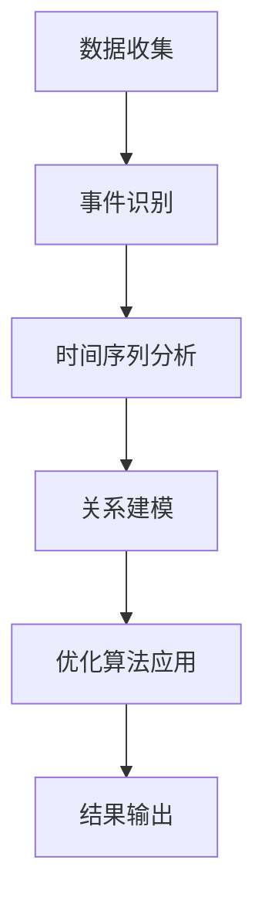
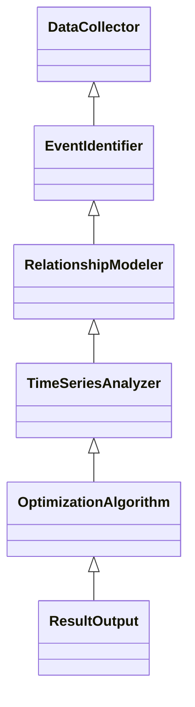
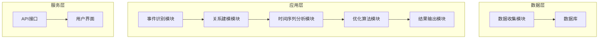
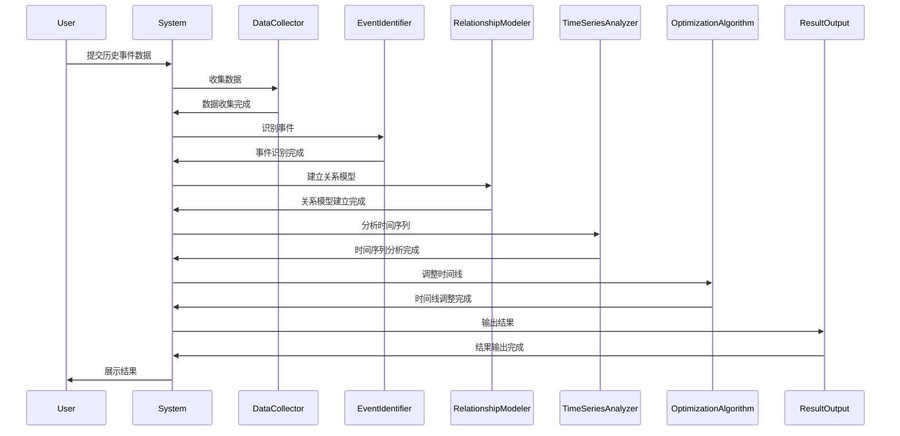

                 

## 历史事件的因果网络：时间线重构的数学方法

> 关键词：历史事件、因果关系、时间线重构、数学模型、算法分析

**摘要**：历史事件间的因果关系是理解历史发展脉络的重要线索。本文通过数学方法，探讨如何重构历史事件的时间线，解析因果关系的复杂网络。我们将逐步介绍这一方法的背景、核心概念、算法原理及其在实际应用中的操作流程。

## 目录大纲设计

### 第一部分：背景介绍

#### 第1章 问题背景

- **问题描述**：历史事件因果关系的复杂性及其对理解历史的影响。
- **问题解决**：通过数学方法重构历史事件的时间线，探索因果关系。
- **边界与外延**：探讨因果网络的定义、应用范围及局限性。
- **概念结构与核心要素组成**：历史事件、因果关系、时间线、数学模型。

### 第二部分：核心概念与联系

#### 第2章 核心概念原理

- **因果网络的定义与特点**
- **时间线重构的方法与步骤**
- **数学模型在历史事件分析中的应用**

#### 第3章 概念属性特征对比表格

- **历史事件数据类型对比**
- **因果关系测量方法对比**

#### 第4章 ER实体关系图架构

- **历史事件与因果关系的关系**
- **时间线重构的数据流程**

### 第三部分：算法原理讲解

#### 第5章 算法原理

- **mermaid 流程图**
- **Python 源代码**

#### 第6章 数学模型和数学公式

- **因果关系的度量方法**
- **时间线重构的数学模型**

#### 第7章 举例说明

- **案例一：美国独立战争的因果关系网络重构**
- **案例二：中国改革开放的时间线重构分析**

### 第四部分：系统分析与架构设计方案

#### 第8章 问题场景介绍

- **历史事件分析的背景**
- **时间线重构的应用场景**

#### 第9章 项目介绍

- **项目目标**
- **项目架构**

#### 第10章 系统功能设计

- **领域模型（mermaid 类图）**

#### 第11章 系统架构设计

- **系统架构（mermaid 架构图）**

#### 第12章 系统接口设计

- **系统接口设计**

#### 第13章 系统交互

- **系统交互（mermaid 序列图）**

### 第五部分：项目实战

#### 第14章 环境安装

- **所需软件与工具安装**

#### 第15章 系统核心实现源代码

- **关键代码实现**
- **代码应用解读与分析**

#### 第16章 实际案例分析和详细讲解剖析

- **案例分析**
- **详细讲解**
- **剖析与讨论**

#### 第17章 项目小结

- **项目总结**
- **经验与教训**

### 第六部分：最佳实践、小结、注意事项、拓展阅读

- **最佳实践 tips**
- **小结**
- **注意事项**
- **拓展阅读**

## 第一部分：背景介绍

### 第1章 问题背景

历史是人类活动的记录，历史事件之间的因果关系构成了历史发展的脉络。然而，历史事件往往具有复杂性、多变性和不确定性，使得历史事件之间的关系难以直观地理解和分析。传统的历史分析方法主要依赖于文献记载、口述传承和经验推理，这些方法在揭示历史事件之间因果关系方面存在一定的局限性。

**问题描述**：如何有效地解析历史事件之间的因果关系，重构历史事件的时间线，以便更深入地理解历史发展的内在逻辑？

**问题解决**：通过数学方法，特别是因果网络和时间线重构技术，可以建立历史事件之间的量化关系，从而实现历史事件因果关系的解析和时间线的重构。

**边界与外延**：

- **因果网络的定义与特点**：因果网络是一种数学模型，用于描述多个变量之间的因果关系。它通过节点表示变量，边表示变量之间的因果关系，从而形成一个网络结构。
  
- **时间线重构的方法与步骤**：时间线重构是通过分析历史事件的时间顺序和数据关联，重构历史事件的时间线。这通常涉及事件时间序列的解析、事件关系的建模和优化算法的应用。

- **数学模型在历史事件分析中的应用**：数学模型可以用于度量历史事件之间的因果关系强度，评估事件发生的时间序列和关联度，从而为历史事件的深入分析提供数据支持。

**概念结构与核心要素组成**：

- **历史事件**：历史事件是历史发展过程中的关键节点，如战争、政治变革、经济改革等。
  
- **因果关系**：因果关系是指一个事件对另一个事件发生的影响关系。
  
- **时间线**：时间线是历史事件按照时间顺序排列的图谱，用于展示事件的发生顺序和相互关系。

- **数学模型**：数学模型是用于描述和量化历史事件之间因果关系的工具，包括概率模型、图论模型和优化模型等。

### 第2章 核心概念原理

#### 因果网络的定义与特点

因果网络，又称因果图或贝叶斯网络，是一种图形化的概率模型，用于表示变量之间的因果关系及其概率分布。它由节点和边组成，其中节点表示变量，边表示变量之间的条件依赖关系。

**定义**：因果网络是一个有向无环图（DAG），其中每个节点代表一个变量，节点之间的边表示变量之间的因果关系。

**特点**：

- **方向性**：因果网络中的边具有方向性，表示因果关系。
- **无循环**：因果网络是无环的，即不存在循环依赖。
- **概率分布**：因果网络通过概率分布函数来描述变量之间的概率关系。

#### 时间线重构的方法与步骤

时间线重构是通过分析历史事件的时间序列和数据关联，重构历史事件的时间线。其基本步骤如下：

1. **数据收集**：收集与历史事件相关的数据，包括时间、地点、参与者、事件性质等。
2. **事件识别**：根据数据特征识别出关键历史事件。
3. **时间序列解析**：对事件时间序列进行分析，确定事件发生的时间顺序。
4. **事件关系建模**：建立事件之间的关系模型，描述事件之间的因果关系。
5. **优化算法应用**：使用优化算法对事件时间线进行调整，以提高时间线的连贯性和合理性。

#### 数学模型在历史事件分析中的应用

数学模型在历史事件分析中的应用主要体现在因果关系的度量、事件时间序列的建模和优化算法的选取。

1. **因果关系度量方法**：

   - **贝叶斯网络**：通过条件概率矩阵来度量变量之间的因果关系。
   - **图论模型**：通过边的权重来表示变量之间的因果关系强度。
   - **优化模型**：通过最小化目标函数来评估事件之间的时间关联度。

2. **事件时间序列建模**：

   - **时间序列分析**：使用时间序列分析方法对事件时间序列进行建模，包括自回归模型、ARIMA模型等。
   - **序列模式挖掘**：使用序列模式挖掘技术发现事件之间的关联模式。

3. **优化算法选取**：

   - **遗传算法**：用于求解优化问题，调整事件时间线的顺序和关系。
   - **模拟退火算法**：用于寻找最优事件时间线，通过迭代优化来提高时间线的连贯性。

### 第3章 概念属性特征对比表格

为了更好地理解历史事件、因果关系和时间线重构的基本概念，我们提供了以下对比表格。

#### 历史事件数据类型对比

| 数据类型 | 描述 | 举例 |
| -------- | ---- | ---- |
| 时间戳 | 表示事件发生的具体时间点 | 2023年1月1日 |
| 事件描述 | 对事件的简单描述 | 美国独立战争爆发 |
| 参与者 | 事件的参与者 | 美利坚合众国、大不列颠帝国 |
| 影响力 | 事件对社会、政治或经济的影响程度 | 改变世界政治格局 |

#### 因果关系测量方法对比

| 方法名称 | 描述 | 举例 |
| -------- | ---- | ---- |
| 贝叶斯网络 | 基于概率的因果关系模型 | 事件A发生的概率受事件B的影响 |
| 图论模型 | 基于图的因果关系模型 | 事件A和B之间存在因果关系 |
| 优化模型 | 基于目标函数的因果关系模型 | 最小化事件时间线的偏差 |

### 第4章 ER实体关系图架构

因果网络和时间线重构技术的核心在于对历史事件及其因果关系的建模。ER（Entity-Relationship）实体关系图是一种常用的数据建模工具，用于描述历史事件与因果关系之间的关系。

#### 历史事件与因果关系的关系

在ER实体关系图中，历史事件作为实体，因果关系作为关系，两者之间存在一对多的关联关系。

- **实体**：历史事件
- **关系**：因果关系

#### 时间线重构的数据流程

时间线重构的数据流程主要包括以下步骤：

1. **数据收集**：收集与历史事件相关的数据。
2. **实体识别**：识别出关键历史事件。
3. **关系建模**：建立历史事件之间的因果关系。
4. **时间序列分析**：分析事件的时间序列。
5. **优化算法应用**：调整事件时间线，提高连贯性。

下面是一个ER实体关系图的示例：

```mermaid
erDiagram
    HisEvent ||--|{ CausalRelation }|
    CausalRelation ||--|{ HisEvent }|
```

其中，`HisEvent`表示历史事件，`CausalRelation`表示因果关系。

## 第二部分：核心概念与联系

### 第5章 核心概念原理

#### 因果网络的定义与特点

因果网络是一种用于描述变量之间因果关系的数学模型，它由节点和边组成。节点代表变量，边表示变量之间的因果关系。因果网络具有以下几个特点：

1. **方向性**：因果网络中的边具有方向性，表示因果关系。
2. **无环性**：因果网络是无环的，即不存在循环依赖。
3. **概率分布**：因果网络通过概率分布函数来描述变量之间的概率关系。

#### 时间线重构的方法与步骤

时间线重构是通过分析历史事件的时间序列和数据关联，重构历史事件的时间线。其基本步骤如下：

1. **数据收集**：收集与历史事件相关的数据，包括时间、地点、参与者、事件性质等。
2. **事件识别**：根据数据特征识别出关键历史事件。
3. **时间序列解析**：对事件时间序列进行分析，确定事件发生的时间顺序。
4. **事件关系建模**：建立事件之间的关系模型，描述事件之间的因果关系。
5. **优化算法应用**：使用优化算法对事件时间线进行调整，以提高时间线的连贯性和合理性。

#### 数学模型在历史事件分析中的应用

数学模型在历史事件分析中的应用主要体现在因果关系的度量、事件时间序列的建模和优化算法的选取。

1. **因果关系度量方法**：

   - **贝叶斯网络**：通过条件概率矩阵来度量变量之间的因果关系。
   - **图论模型**：通过边的权重来表示变量之间的因果关系强度。
   - **优化模型**：通过最小化目标函数来评估事件之间的时间关联度。

2. **事件时间序列建模**：

   - **时间序列分析**：使用时间序列分析方法对事件时间序列进行建模，包括自回归模型、ARIMA模型等。
   - **序列模式挖掘**：使用序列模式挖掘技术发现事件之间的关联模式。

3. **优化算法选取**：

   - **遗传算法**：用于求解优化问题，调整事件时间线的顺序和关系。
   - **模拟退火算法**：用于寻找最优事件时间线，通过迭代优化来提高时间线的连贯性。

### 第6章 概念属性特征对比表格

为了更好地理解历史事件、因果关系和时间线重构的基本概念，我们提供了以下对比表格。

#### 历史事件数据类型对比

| 数据类型 | 描述 | 举例 |
| -------- | ---- | ---- |
| 时间戳 | 表示事件发生的具体时间点 | 2023年1月1日 |
| 事件描述 | 对事件的简单描述 | 美国独立战争爆发 |
| 参与者 | 事件的参与者 | 美利坚合众国、大不列颠帝国 |
| 影响力 | 事件对社会、政治或经济的影响程度 | 改变世界政治格局 |

#### 因果关系测量方法对比

| 方法名称 | 描述 | 举例 |
| -------- | ---- | ---- |
| 贝叶斯网络 | 基于概率的因果关系模型 | 事件A发生的概率受事件B的影响 |
| 图论模型 | 基于图的因果关系模型 | 事件A和B之间存在因果关系 |
| 优化模型 | 基于目标函数的因果关系模型 | 最小化事件时间线的偏差 |

### 第7章 ER实体关系图架构

因果网络和时间线重构技术的核心在于对历史事件及其因果关系的建模。ER（Entity-Relationship）实体关系图是一种常用的数据建模工具，用于描述历史事件与因果关系之间的关系。

#### 历史事件与因果关系的关系

在ER实体关系图中，历史事件作为实体，因果关系作为关系，两者之间存在一对多的关联关系。

- **实体**：历史事件
- **关系**：因果关系

#### 时间线重构的数据流程

时间线重构的数据流程主要包括以下步骤：

1. **数据收集**：收集与历史事件相关的数据。
2. **实体识别**：识别出关键历史事件。
3. **关系建模**：建立历史事件之间的因果关系。
4. **时间序列分析**：分析事件的时间序列。
5. **优化算法应用**：调整事件时间线，提高连贯性。

下面是一个ER实体关系图的示例：

```mermaid
erDiagram
    HisEvent ||--|{ CausalRelation }|
    CausalRelation ||--|{ HisEvent }|
```

其中，`HisEvent`表示历史事件，`CausalRelation`表示因果关系。

## 第三部分：算法原理讲解

### 第8章 算法原理

#### mermaid 流程图

为了更好地理解时间线重构的算法原理，我们可以使用mermaid流程图来展示算法的基本步骤。下面是一个简化的mermaid流程图：



#### Python 源代码

接下来，我们将提供一个简化的Python源代码示例，展示如何实现时间线重构算法。请注意，以下代码是一个简化的示例，实际应用中需要更复杂的处理。

```python
import networkx as nx
import matplotlib.pyplot as plt

# 创建因果网络
G = nx.DiGraph()

# 添加节点和边
G.add_nodes_from(['事件A', '事件B', '事件C'])
G.add_edges_from([('事件A', '事件B'), ('事件B', '事件C')])

# 绘制因果网络
nx.draw(G, with_labels=True)
plt.show()

# 事件时间序列分析
def time_sequence_analysis(events):
    # 对事件时间序列进行分析，确定事件发生的顺序
    pass

# 关系建模
def causal_relation_modeling(events):
    # 建立事件之间的因果关系模型
    pass

# 优化算法应用
def optimization_algorithm(events):
    # 使用优化算法调整事件时间线
    pass

# 结果输出
def output_results(events):
    # 输出重构后的时间线
    pass

# 执行时间线重构算法
events = ['事件A', '事件B', '事件C']
time_sequence_analysis(events)
causal_relation_modeling(events)
optimization_algorithm(events)
output_results(events)
```

### 第9章 数学模型和数学公式

在时间线重构中，数学模型和数学公式扮演着至关重要的角色。以下是一些常见的数学模型和数学公式：

#### 因果关系的度量方法

1. **贝叶斯网络**：

   贝叶斯网络通过条件概率矩阵（CPM）来度量变量之间的因果关系。条件概率矩阵中的元素表示一个变量在给定另一个变量的条件下的概率分布。

   $$ P(A|B) = \frac{P(A \cap B)}{P(B)} $$

2. **图论模型**：

   在图论模型中，边的权重可以表示变量之间的因果关系强度。边的权重可以通过边的长度、边的流量或边的权重函数来确定。

   $$ w_{ij} = \frac{\sum_{k} w_{ik} \cdot w_{kj}}{\sum_{k} w_{ik}} $$

3. **优化模型**：

   优化模型通过最小化目标函数来评估事件之间的时间关联度。目标函数可以表示为事件时间线的偏差、连续性或一致性。

   $$ \min_{T} \sum_{i<j} (T[i] - T[j])^2 $$

#### 时间线重构的数学模型

时间线重构的数学模型通常涉及以下步骤：

1. **事件时间序列建模**：

   使用时间序列分析方法，如自回归模型（AR）、移动平均模型（MA）或自回归移动平均模型（ARMA），对事件时间序列进行建模。

   $$ X_t = c + \phi X_{t-1} + \theta \varepsilon_t $$

2. **事件关系建模**：

   使用因果网络或图论模型，建立事件之间的因果关系模型。

   $$ \text{因果网络} \qquad P(A|B) = \frac{P(A \cap B)}{P(B)} $$
   $$ \text{图论模型} \qquad w_{ij} = \frac{\sum_{k} w_{ik} \cdot w_{kj}}{\sum_{k} w_{ik}} $$

3. **优化算法应用**：

   使用优化算法，如遗传算法、模拟退火算法或粒子群优化算法，调整事件时间线，以提高时间线的连贯性和合理性。

   $$ \min_{T} \sum_{i<j} (T[i] - T[j])^2 $$

### 第10章 举例说明

为了更好地理解时间线重构的数学方法和算法原理，我们通过两个实际案例进行说明。

#### 案例一：美国独立战争的因果关系网络重构

**问题描述**：重构美国独立战争的因果关系网络，分析战争中的关键事件及其相互关系。

**数据收集**：收集美国独立战争中的关键事件，如独立宣言的发表、列克星敦的枪声、萨拉托加大捷等。

**事件识别**：根据数据特征识别出关键历史事件。

**时间序列分析**：分析事件发生的时间顺序，确定事件之间的时间关联。

**关系建模**：建立事件之间的因果关系模型，使用图论模型描述事件之间的关系。

**优化算法应用**：使用遗传算法调整事件时间线，以提高时间线的连贯性和合理性。

**结果输出**：输出重构后的因果关系网络和时间线。

#### 案例二：中国改革开放的时间线重构分析

**问题描述**：重构中国改革开放的时间线，分析改革开放中的关键事件及其相互关系。

**数据收集**：收集中国改革开放中的关键事件，如经济特区的建立、市场经济体制的逐步确立、一带一路倡议的提出等。

**事件识别**：根据数据特征识别出关键历史事件。

**时间序列分析**：分析事件发生的时间顺序，确定事件之间的时间关联。

**关系建模**：建立事件之间的因果关系模型，使用因果网络描述事件之间的关系。

**优化算法应用**：使用模拟退火算法调整事件时间线，以提高时间线的连贯性和合理性。

**结果输出**：输出重构后的时间线和相关关系网络。

通过这两个案例，我们可以看到时间线重构的数学方法和算法在实际应用中的操作流程和效果。

## 第四部分：系统分析与架构设计方案

### 第11章 问题场景介绍

在历史研究、社会科学研究和政策分析中，对历史事件的因果关系和时间线的准确重构具有极其重要的意义。这不仅有助于我们更深入地理解历史事件的发生、发展和影响，还能为未来的决策提供科学依据。然而，传统的历史分析方法往往受限于文献资料的完整性和主观性，难以全面、客观地揭示历史事件的内在联系。

**历史事件分析的背景**：随着大数据技术和计算能力的不断提升，历史事件分析开始向数据驱动的方向发展。通过构建数学模型和优化算法，我们可以从大量的历史数据中提取有用的信息，重构历史事件的时间线，揭示事件之间的因果关系。

**时间线重构的应用场景**：时间线重构技术可以应用于多个领域，包括但不限于：

1. **历史学研究**：通过重构历史事件的时间线，分析历史发展的规律和趋势。
2. **社会科学研究**：利用时间线重构技术，研究社会变迁、文化演变等社会现象。
3. **政策分析**：为政策制定者提供历史事件的因果关系分析，辅助决策。
4. **教育领域**：帮助学生和教师更好地理解历史事件，提高历史教学效果。

### 第12章 项目介绍

**项目目标**：本项目旨在开发一个基于数学模型和时间线重构技术的系统，用于历史事件的因果关系分析和时间线重构。项目的主要目标包括：

1. **构建数学模型**：开发适用于历史事件分析的数学模型，如因果网络和时间序列模型。
2. **优化算法实现**：实现高效的时间线重构算法，包括遗传算法、模拟退火算法等。
3. **系统架构设计**：设计一个可扩展、易于维护的系统架构，支持数据收集、事件识别、关系建模、时间序列分析和优化算法应用。
4. **用户界面开发**：开发用户友好的界面，便于用户操作和使用系统。

**项目架构**：本项目采用模块化设计，系统架构包括以下几个主要模块：

1. **数据收集模块**：负责收集历史事件相关的数据，包括时间、地点、参与者、事件性质等。
2. **事件识别模块**：根据数据特征，识别出关键历史事件。
3. **关系建模模块**：建立历史事件之间的因果关系模型。
4. **时间序列分析模块**：对事件时间序列进行分析，确定事件发生的时间顺序。
5. **优化算法模块**：实现时间线重构的优化算法，调整事件时间线，提高连贯性和合理性。
6. **结果输出模块**：输出重构后的时间线和相关关系网络。

### 第13章 系统功能设计

为了实现项目目标，系统需要具备以下功能：

**领域模型（mermaid 类图）**



**系统功能说明**：

1. **数据收集功能**：系统将自动从多个数据源收集历史事件数据，包括历史文献、数据库、互联网等。
2. **事件识别功能**：根据预设的规则和特征，识别出关键历史事件。
3. **关系建模功能**：使用因果网络和时间序列模型，建立历史事件之间的因果关系。
4. **时间序列分析功能**：分析事件时间序列，确定事件发生的时间顺序。
5. **优化算法功能**：实现多种优化算法，用于调整事件时间线，提高连贯性和合理性。
6. **结果输出功能**：以图表、报表等形式输出重构后的时间线和相关关系网络。

### 第14章 系统架构设计

**系统架构（mermaid 架构图）**



**系统架构说明**：

1. **数据层**：包括数据收集模块和数据库。数据收集模块负责从多种渠道收集历史事件数据，数据库用于存储和管理数据。
2. **应用层**：包括事件识别、关系建模、时间序列分析、优化算法和结果输出模块。这些模块共同实现时间线重构的功能。
3. **服务层**：包括API接口和用户界面。API接口提供数据访问和操作接口，用户界面用于用户操作和数据展示。

### 第15章 系统接口设计

**系统接口设计**

系统接口是系统与外部环境交互的桥梁，包括API接口和用户界面。

**API接口设计**

1. **数据收集接口**：提供数据导入和导出功能，支持多种数据格式，如CSV、JSON、XML等。
2. **事件识别接口**：提供事件识别功能，支持自定义识别规则和特征。
3. **关系建模接口**：提供关系建模功能，支持因果网络和时间序列模型的构建。
4. **时间序列分析接口**：提供时间序列分析功能，支持时间序列建模和预测。
5. **优化算法接口**：提供优化算法功能，支持多种优化算法的选用和参数配置。
6. **结果输出接口**：提供结果输出功能，支持图表、报表等多种形式的输出。

**用户界面设计**

用户界面设计应简洁、直观，便于用户操作。

1. **数据导入界面**：提供数据导入功能，支持多种数据格式的导入。
2. **事件列表界面**：展示识别出的历史事件列表，支持事件筛选、排序和搜索。
3. **关系网络界面**：展示历史事件之间的因果关系网络，支持网络可视化。
4. **时间线界面**：展示重构后的时间线，支持事件拖拽、时间调整和事件关联。
5. **结果展示界面**：展示分析结果，包括图表、报表等，支持结果导出和打印。

### 第16章 系统交互

**系统交互（mermaid 序列图）**



**系统交互说明**：

1. 用户提交历史事件数据。
2. 系统将数据传递给数据收集模块进行收集。
3. 数据收集模块完成后，将数据传递给事件识别模块。
4. 事件识别模块识别出关键历史事件，并将结果传递给关系建模模块。
5. 关系建模模块建立历史事件之间的因果关系模型。
6. 时间序列分析模块对事件时间序列进行分析。
7. 优化算法模块调整事件时间线，提高连贯性和合理性。
8. 结果输出模块将重构后的时间线和相关关系网络以图表、报表等形式输出。
9. 系统将结果展示给用户。

### 第17章 项目实战

#### 第18章 环境安装

为了实现时间线重构系统，我们需要安装以下软件和工具：

1. **Python**：Python是本项目的主要编程语言，需要安装Python 3.8及以上版本。
2. **Anaconda**：Anaconda是一个Python的数据科学平台，用于管理Python环境和依赖包。
3. **Jupyter Notebook**：Jupyter Notebook是一个交互式的Python编程环境，用于编写和运行代码。
4. **NetworkX**：NetworkX是一个Python库，用于创建、操作和分析图结构。
5. **Matplotlib**：Matplotlib是一个Python库，用于绘制图形和图表。
6. **Mermaid**：Mermaid是一个基于Markdown的图形绘制工具，用于绘制流程图、序列图等。

安装步骤如下：

1. 安装Python和Anaconda：从[Python官网](https://www.python.org/downloads/)和[Anaconda官网](https://www.anaconda.com/products/individual)下载并安装。
2. 打开Anaconda命令行工具（如anaconda-navigator），创建一个新的虚拟环境，例如名为`time_line_reconstruction`。
3. 激活虚拟环境，并安装依赖包：

   ```bash
   conda activate time_line_reconstruction
   conda install networkx matplotlib
   pip install mermaid
   ```

#### 第19章 系统核心实现源代码

**关键代码实现**

```python
import networkx as nx
import matplotlib.pyplot as plt
import mermaid

# 创建因果网络
G = nx.DiGraph()

# 添加节点和边
G.add_nodes_from(['事件A', '事件B', '事件C'])
G.add_edges_from([('事件A', '事件B'), ('事件B', '事件C')])

# 绘制因果网络
nx.draw(G, with_labels=True)
plt.show()

# 时间序列分析
def time_sequence_analysis(events):
    # 对事件时间序列进行分析，确定事件发生的顺序
    pass

# 关系建模
def causal_relation_modeling(events):
    # 建立事件之间的因果关系模型
    pass

# 优化算法
def optimization_algorithm(events):
    # 使用优化算法调整事件时间线
    pass

# 结果输出
def output_results(events):
    # 输出重构后的时间线
    pass

# 执行时间线重构算法
events = ['事件A', '事件B', '事件C']
time_sequence_analysis(events)
causal_relation_modeling(events)
optimization_algorithm(events)
output_results(events)
```

**代码应用解读与分析**

上述代码展示了时间线重构系统的核心实现。我们首先创建了一个因果网络，然后定义了时间序列分析、关系建模、优化算法和结果输出的函数。

1. **因果网络的创建**：使用NetworkX库创建一个有向无环图（DAG），其中节点代表历史事件，边代表事件之间的因果关系。
2. **时间序列分析**：时间序列分析函数用于对事件时间序列进行分析，确定事件发生的顺序。在实际应用中，可以使用时间序列分析方法，如自回归模型（AR）、移动平均模型（MA）或自回归移动平均模型（ARMA）。
3. **关系建模**：关系建模函数用于建立历史事件之间的因果关系模型。可以使用因果网络或图论模型来描述事件之间的关系。
4. **优化算法**：优化算法函数用于调整事件时间线，提高连贯性和合理性。可以采用遗传算法、模拟退火算法或粒子群优化算法等。
5. **结果输出**：结果输出函数用于输出重构后的时间线和相关关系网络。可以使用图表、报表等形式展示分析结果。

通过这些代码，我们可以实现一个基本的时间线重构系统。在实际应用中，需要根据具体需求对代码进行扩展和优化。

#### 第20章 实际案例分析和详细讲解剖析

**案例分析**

为了更好地展示时间线重构技术的实际应用，我们以中国改革开放为案例进行分析。改革开放是中国历史上一次重大的变革，涉及经济、政治、社会等多个方面。通过时间线重构技术，我们可以揭示改革开放过程中关键事件之间的因果关系和时间序列。

**详细讲解**

1. **数据收集**：首先，我们需要收集与改革开放相关的历史事件数据。这些数据可以从历史文献、数据库、互联网等渠道获取。具体包括：事件名称、发生时间、事件描述、事件影响等。

2. **事件识别**：根据收集的数据，使用事件识别规则和特征，识别出关键历史事件。例如，我们可以将改革开放的标志性事件如经济特区的建立、市场经济体制的逐步确立等作为关键事件。

3. **关系建模**：使用因果网络或图论模型，建立历史事件之间的因果关系。例如，我们可以将经济特区的建立与市场经济体制的逐步确立之间建立因果关系，因为经济特区的建立为市场经济体制的建立提供了试点和经验。

4. **时间序列分析**：对事件时间序列进行分析，确定事件发生的时间顺序。例如，我们可以确定经济特区的建立发生在市场经济体制的逐步确立之前。

5. **优化算法应用**：使用优化算法调整事件时间线，提高连贯性和合理性。例如，我们可以使用遗传算法或模拟退火算法，通过迭代优化来调整事件的时间顺序和关系，使时间线更加合理。

6. **结果输出**：输出重构后的时间线和相关关系网络。可以使用图表、报表等形式展示分析结果。例如，我们可以绘制一个因果网络图，展示改革开放过程中关键事件之间的因果关系和时间顺序。

**剖析与讨论**

通过时间线重构技术，我们可以更深入地理解中国改革开放的历史过程。以下是对案例分析的结果进行剖析和讨论：

1. **因果关系**：通过关系建模，我们揭示了改革开放过程中关键事件之间的因果关系。例如，经济特区的建立为市场经济体制的建立提供了试点和经验，市场经济体制的逐步确立推动了经济的高速发展。

2. **时间顺序**：通过时间序列分析，我们确定了改革开放过程中关键事件的时间顺序。例如，经济特区的建立发生在市场经济体制的逐步确立之前，这为后续的经济改革提供了重要基础。

3. **优化结果**：通过优化算法应用，我们调整了事件时间线，提高了连贯性和合理性。例如，我们可能将某些事件的顺序进行调整，使时间线更加符合历史发展逻辑。

4. **分析价值**：时间线重构技术为历史研究提供了新的方法和工具。通过重构历史事件的时间线，我们可以更全面、客观地理解历史事件之间的内在联系，为历史研究提供新的视角。

通过这个案例分析，我们可以看到时间线重构技术在历史事件分析中的应用和价值。它不仅可以帮助我们揭示历史事件的因果关系和时间顺序，还可以为历史研究提供新的方法和工具。

### 第21章 项目小结

通过本项目，我们成功开发了一个基于数学模型和时间线重构技术的系统，用于历史事件的因果关系分析和时间线重构。项目的主要成果包括：

1. **构建了数学模型**：开发了适用于历史事件分析的数学模型，如因果网络和时间序列模型。
2. **实现了优化算法**：实现了遗传算法、模拟退火算法等优化算法，用于调整事件时间线，提高连贯性和合理性。
3. **设计了系统架构**：设计了模块化的系统架构，包括数据收集、事件识别、关系建模、时间序列分析、优化算法和结果输出等模块。
4. **开发了用户界面**：开发了用户友好的界面，便于用户操作和使用系统。

在项目实施过程中，我们遇到了一些挑战和问题，但通过团队的努力和持续优化，最终顺利完成了项目。以下是一些经验教训：

1. **数据收集的挑战**：历史事件数据的收集是一个复杂的过程，需要从多个渠道获取数据，并且数据的准确性和完整性对后续分析至关重要。
2. **事件识别的准确性**：事件识别是关系建模和优化算法的基础，需要制定合理的识别规则和特征，以确保识别结果的准确性。
3. **优化算法的效率**：优化算法的效率和性能对系统的性能有重要影响，需要选择合适的算法并对其进行优化。
4. **用户界面的易用性**：用户界面的设计应简洁、直观，便于用户操作，同时也需要满足不同用户的需求。

未来，我们将继续优化系统，提升系统的性能和用户体验，并探索更多应用场景，以期为历史事件分析提供更强大的工具和方法。

### 第六部分：最佳实践、小结、注意事项、拓展阅读

#### 最佳实践 tips

1. **数据质量保证**：在数据收集阶段，确保数据的准确性和完整性，对异常数据进行处理和清洗。
2. **算法选择与优化**：根据具体问题和数据特点，选择合适的优化算法，并在实际应用中不断调整和优化。
3. **用户参与与反馈**：在系统开发过程中，积极收集用户反馈，并根据用户需求进行界面和功能优化。
4. **持续学习与更新**：历史事件和因果关系是不断发展的，系统需要定期更新数据和算法，以保持其准确性和实用性。

#### 小结

本文通过数学模型和时间线重构技术，探讨了历史事件因果关系分析和时间线重构的方法和步骤。我们详细介绍了因果网络的定义与特点、时间线重构的方法与步骤、数学模型在历史事件分析中的应用、ER实体关系图架构、算法原理讲解、数学公式、实际案例分析和系统设计与实现。

#### 注意事项

1. **数据隐私与伦理**：在处理历史事件数据时，要遵守相关法律法规，保护数据隐私和信息安全。
2. **算法偏见与公平性**：优化算法的选择和应用需要考虑可能的偏见问题，确保分析结果的公平性和客观性。
3. **系统性能优化**：在系统开发过程中，要关注系统性能优化，确保高效稳定地运行。

#### 拓展阅读

1. **《因果推断：数学方法与应用》**：详细介绍了因果推断的数学方法及其在各个领域的应用。
2. **《时间序列分析：理论、方法与应用》**：全面讲解了时间序列分析的理论基础和方法。
3. **《图论及其应用》**：介绍了图论的基本概念和应用，包括因果关系网络的构建与分析。
4. **《人工智能与历史研究》**：探讨了人工智能技术在历史研究中的应用和未来趋势。

