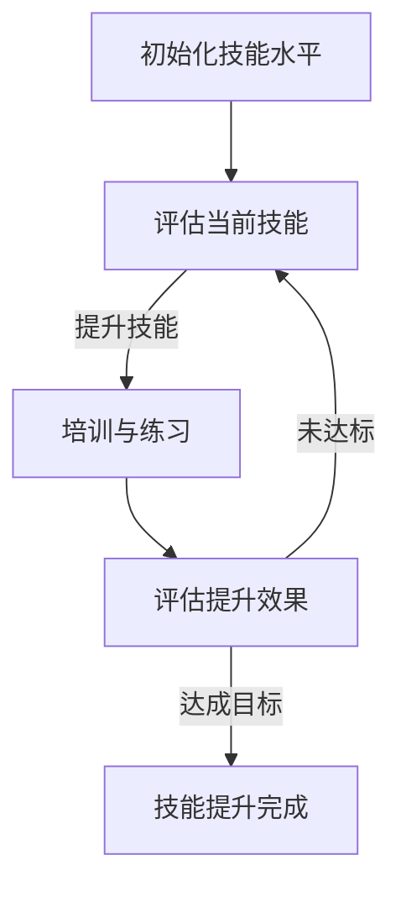

                 

## 引言

### 1.1 变革管理的定义及其重要性

变革管理，是指在一个组织或团队中引入新的思维方式、工作方法或技术，以实现组织目标、提升效率或适应外部环境变化的过程。在当今快速发展的社会中，变革管理显得尤为重要。随着技术的迅猛发展和市场环境的不断变化，企业需要不断创新以保持竞争力，这就要求团队成员具备快速适应新环境、新技术的能力。

变革管理的核心在于引导团队从旧有模式向新模式过渡，确保在变革过程中，团队成员能够保持高效合作，顺利实现组织目标。在这个过程中，领导者需要扮演关键角色，不仅要具备前瞻性思维，还要具备有效的沟通、激励和组织协调能力。

### 1.2 团队在新环境下面临的挑战

当团队面临新环境时，往往会出现以下几方面的挑战：

1. **心理抵触**：团队成员可能对新环境感到陌生和不安，甚至产生抵触情绪，影响工作效率。
2. **技能不足**：新环境可能要求团队成员具备新的技能或知识，而团队成员可能尚未掌握，导致工作难以顺利进行。
3. **协作障碍**：新环境的改变可能导致团队内部协作模式发生变化，团队成员之间的沟通和协调难度加大。
4. **组织惯性**：团队可能存在一定的组织惯性，难以快速适应新的变化，需要时间和资源来打破这种惯性。

### 1.3 变革管理如何帮助团队适应新环境

变革管理通过一系列策略和方法，可以帮助团队克服上述挑战，顺利适应新环境：

1. **领导力的塑造**：领导者需要树立变革的榜样，通过激励、培训和指导，引导团队成员积极参与变革。
2. **沟通机制的建立**：建立有效的沟通机制，确保团队成员能够及时获取变革信息，理解变革的目标和意义。
3. **技能培训**：为团队成员提供必要的技能培训，帮助他们迅速掌握新技能，适应新环境。
4. **协作文化的培育**：通过团队建设活动和协作工具的使用，增强团队成员之间的信任和协作，提高团队整体效能。

### 1.4 边界与外延

变革管理的适用范围广泛，既适用于企业内部的业务流程优化，也适用于组织结构的调整；既适用于技术层面的创新，也适用于管理模式的变革。然而，变革管理并非万能，其成功实施需要考虑到组织的特点、外部环境的因素以及团队成员的接受程度。

### 概念结构与核心要素组成

变革管理由以下几个核心要素组成：

1. **领导力**：变革的发起者和推动者，需要具备战略眼光和执行力。
2. **沟通**：确保团队成员对变革的理解和认同，减少信息不对称。
3. **培训与支持**：帮助团队成员掌握新技能，提供技术支持和心理支持。
4. **激励**：通过激励机制，提高团队成员参与变革的积极性。
5. **组织文化**：培育支持变革的组织文化，营造积极向上的变革氛围。

### 小结

通过以上介绍，我们可以看到，变革管理是一个复杂而重要的过程，需要领导者具备多方面的能力和素质。在接下来的章节中，我们将进一步探讨变革管理的核心概念、策略和实践，帮助团队更好地适应新环境。

## 核心概念与联系

### 2.1 变革管理的理论基础

变革管理的理论基础主要来源于组织行为学、管理心理学和组织发展理论。这些理论为我们理解变革的本质、过程和影响因素提供了重要的框架。

#### 2.1.1 变革的类型

变革可以分为以下几种类型：

1. **结构性变革**：涉及组织结构、流程和系统的变革。
2. **技术性变革**：引入新的技术或系统，以提升效率和创新能力。
3. **文化变革**：改变组织文化，培育支持变革的氛围。
4. **战略性变革**：调整组织的战略方向和目标。

#### 2.1.2 变革的过程模型

常见的变革过程模型包括：

1. **Kotter变革模型**：提出八个步骤，包括建立变革紧迫感、组建指导团队、沟通愿景、授权行动、创造短期胜利、巩固变革、应用新方法和使变革成为企业的一部分。
2. **ADKAR模型**：包括改变意识、设计新的能力、支持和强化新的行为、重新安排工作和职责。
3. **PDCA循环**：即计划（Plan）、执行（Do）、检查（Check）和行动（Act），不断循环改进。

#### 2.1.3 变革管理的关键概念

变革管理的关键概念包括：

1. **变革领导者**：具备变革能力和领导力的个人或团队，负责引导变革过程。
2. **变革代理人**：在组织中推动变革的个人或小组，他们可能来自内部或外部。
3. **变革的接受者**：参与变革的员工和利益相关者。
4. **变革的阻力**：来自组织内部或外部的对变革的反对力量。

### 2.2 概念属性特征对比表格

| 概念        | 定义                                                         | 属性特征                                               |
|-------------|--------------------------------------------------------------|--------------------------------------------------------|
| 变革领导者   | 负责变革规划、指导和推动的个人或团队。                         | 远见、沟通能力、领导力、执行力。                       |
| 变革代理人   | 推动变革的个体或小组，可能来自组织内部或外部。                 | 专业性、协作精神、影响力。                             |
| 变革接受者   | 参与变革的员工和利益相关者。                                   | 理解力、接受度、适应能力。                             |
| 变革阻力     | 对变革持有反对态度的个人或团体。                               | 成见、恐惧、不安全感、依赖现有流程。                   |

### 2.3 ER实体关系图架构

以下是变革管理中的ER实体关系图，用Mermaid语言表示：

```mermaid
erDiagram
  User ||--o{ Team : member }
  Team ||--o{ Project : belong_to }
  Project ||--o{ Task : include }
  Task ||--o{ User : assign_to }
  Team ..| o{ Leader : lead }
```

这个图描述了变革管理中的几个关键实体及其关系：

- **User（用户）**：参与变革的个人。
- **Team（团队）**：变革中的工作单元。
- **Project（项目）**：变革的具体任务或计划。
- **Task（任务）**：项目的子任务。
- **Leader（领导者）**：负责指导团队的人。

这个ER图展示了团队成员、团队领导、项目和任务之间的关系，为理解变革管理的复杂性和动态性提供了结构化的视角。

### 小结

在核心概念与联系部分，我们介绍了变革管理的理论基础、不同类型的变革、变革的过程模型以及关键概念。通过对比表格和ER实体关系图，我们对变革管理的概念有了更加清晰的认识。这些核心概念和联系为后续章节的深入探讨奠定了基础。

## 变革管理策略讲解

### 3.1 变革管理策略概述

变革管理策略是确保团队在新环境中顺利过渡的关键手段。有效的变革管理策略可以帮助组织减少变革过程中的摩擦，提升团队的整体适应能力。常见的变革管理策略包括变革领导力、变革沟通、变革激励机制和变革组织文化等方面。

#### 3.1.1 变革领导力

变革领导力是变革管理中的核心要素之一。领导者需要具备以下能力：

1. **远见**：能够预见未来的发展趋势和潜在风险，为团队制定清晰的变革方向。
2. **沟通能力**：有效传达变革的目标和意义，消除团队成员的疑虑和担忧。
3. **执行力**：确保变革策略能够得到有效实施，推动变革目标的实现。
4. **激励能力**：通过激励机制，提高团队成员参与变革的积极性。

#### 3.1.2 变革沟通

变革沟通是确保团队成员理解变革目标、过程和预期成果的关键。有效的沟通策略包括：

1. **透明的信息传递**：确保团队成员能够及时获取变革的最新动态，减少信息不对称。
2. **多元化的沟通渠道**：利用会议、邮件、社交媒体等多种沟通方式，确保信息传达的广泛性和有效性。
3. **互动交流**：鼓励团队成员提出问题和意见，建立开放的沟通环境。

#### 3.1.3 变革激励机制

变革激励机制是提升团队成员参与变革积极性的重要手段。激励机制可以包括：

1. **奖励制度**：对积极参与变革的团队成员给予物质和精神奖励。
2. **职业发展机会**：为团队成员提供职业发展的机会和平台。
3. **认可与表彰**：对在变革过程中表现突出的团队成员进行公开表彰和认可。

#### 3.1.4 变革组织文化

变革组织文化是支持变革、促进团队适应新环境的重要基石。构建支持变革的组织文化需要：

1. **鼓励创新**：建立鼓励创新和尝试的氛围，让团队成员敢于突破传统模式。
2. **协作精神**：培养团队协作精神，增强团队成员之间的信任和合作。
3. **学习文化**：鼓励团队成员不断学习和成长，提升团队整体的素质和适应能力。

### 3.2 策略适用场景

不同的变革管理策略在不同场景下的适用性有所不同。以下是一些常见的适用场景：

1. **模式一：变革领导力**
   - 适用场景：当组织需要重大变革，如企业重组、业务转型等，领导者需要具备强大的变革领导力，推动变革的顺利进行。
   - 策略关键：领导者需要具备远见和执行力，能够激励团队成员积极参与变革。

2. **模式二：变革沟通**
   - 适用场景：在变革过程中，团队成员可能存在疑虑和担忧，有效的变革沟通策略可以减少信息不对称，提升团队的认同感。
   - 策略关键：建立透明的沟通机制，利用多种渠道传递信息，鼓励互动交流。

3. **模式三：变革激励机制**
   - 适用场景：当团队成员参与变革的积极性不高时，通过激励机制可以提升团队的参与度和积极性。
   - 策略关键：设计合理的奖励制度和职业发展机会，确保激励机制的有效性。

4. **模式四：变革组织文化**
   - 适用场景：在长期变革过程中，建立支持变革的组织文化可以增强团队的整体适应能力。
   - 策略关键：鼓励创新、培养协作精神、建立学习文化。

### 3.3 策略优缺点对比

下表对比了四种变革管理策略的优缺点：

| 策略        | 优点                           | 缺点                          |
|-------------|--------------------------------|--------------------------------|
| 变革领导力  | 能有效推动变革，提升团队凝聚力   | 需要高水平的领导能力和执行力   |
| 变革沟通    | 减少信息不对称，提升团队认同感   | 沟通成本高，易产生信息冗余     |
| 变革激励机制 | 提高团队成员积极性，促进变革实施 | 可能导致短期行为，忽视长期发展 |
| 变革组织文化 | 增强团队适应能力，培养长期发展   | 需要时间和资源，难以快速见效   |

通过以上对比，我们可以看到，不同的变革管理策略在不同场景下具有不同的优缺点。在实际应用中，应根据具体情况进行策略选择和组合，以实现最佳效果。

### 小结

在变革管理策略讲解部分，我们介绍了变革领导力、变革沟通、变革激励机制和变革组织文化等策略，并分析了其适用场景和优缺点。理解并运用这些策略，可以帮助团队更好地适应新环境，实现变革目标。在接下来的章节中，我们将进一步探讨变革管理的实践方法和实际案例分析。

## 变革管理实践

### 4.1 变革管理实施步骤

有效的变革管理需要系统化的实施步骤，以下是变革管理的基本实施步骤：

1. **评估现状**：对团队当前的运作模式、文化、能力和资源进行评估，了解团队所处的起点。
2. **明确目标**：明确变革的目标和预期成果，确保所有团队成员对变革的方向和目标有清晰的认识。
3. **规划变革**：制定详细的变革计划，包括时间表、责任分配、资源和预算等。
4. **启动变革**：通过动员会议、内部沟通等方式启动变革，确保团队成员了解变革的开始。
5. **执行变革**：按照计划执行变革，监控进度，及时调整策略。
6. **评估成效**：在变革完成后，评估变革的效果，收集反馈，总结经验教训。
7. **持续优化**：根据评估结果，对变革过程进行持续优化，确保变革目标的实现。

### 4.2 团队适应性评估

团队适应性评估是衡量团队在新环境下适应能力的重要手段。以下是团队适应性评估的几个关键指标：

1. **技能水平**：评估团队成员的技能水平和知识掌握情况，确保团队成员具备执行变革所需的能力。
2. **沟通协作**：评估团队成员之间的沟通协作能力，确保团队内部能够高效协同工作。
3. **心理承受能力**：评估团队成员在面对变革时的心理承受能力，确保团队成员能够应对变革带来的压力。
4. **组织文化**：评估团队的组织文化是否支持变革，包括团队内部的信任度、合作精神和创新氛围。
5. **变革接受度**：评估团队成员对变革的接受程度，了解团队内部对变革的认同和参与度。

### 4.3 变革管理案例分析

#### 4.3.1 案例一：企业数字化转型

某中型企业在面临市场竞争压力和客户需求变化的背景下，决定进行数字化转型。以下是该企业数字化转型过程中的变革管理实践：

1. **评估现状**：通过对现有业务流程、技术架构和市场环境的评估，确定数字化转型的重要性和紧迫性。
2. **明确目标**：明确数字化转型的主要目标，包括提升客户体验、提高运营效率和降低成本。
3. **规划变革**：制定详细的数字化转型计划，包括技术升级、业务流程优化和团队培训等。
4. **启动变革**：通过内部会议和培训，动员全体员工参与数字化转型，传达变革的重要性和预期成果。
5. **执行变革**：
   - 技术升级：引入新的IT系统和工具，提升业务流程的自动化水平。
   - 业务流程优化：通过流程再造，简化业务流程，提高工作效率。
   - 团队培训：为员工提供必要的技能培训，确保团队成员能够适应新的工作环境。
6. **评估成效**：在数字化转型完成后，通过客户满意度调查、运营数据分析和员工反馈，评估变革的效果。
7. **持续优化**：根据评估结果，对数字化转型过程进行优化，确保长期效果。

通过以上变革管理实践，该企业在数字化转型过程中取得了显著成效，提高了客户满意度，降低了运营成本，提升了市场竞争力。

#### 4.3.2 案例二：团队跨部门协作

某大型企业在项目执行过程中，发现不同部门之间的协作效率低下，影响了项目进度和成果。以下是该企业提升跨部门协作的变革管理实践：

1. **评估现状**：通过对现有跨部门协作流程、沟通机制和团队协作文化的评估，确定跨部门协作中存在的问题。
2. **明确目标**：明确提升跨部门协作的目标，包括提高协作效率、缩短项目周期和提升项目质量。
3. **规划变革**：制定详细的跨部门协作优化计划，包括流程优化、沟通工具引入和团队建设活动等。
4. **启动变革**：通过内部会议和培训，动员各部门员工参与跨部门协作的优化，传达协作的重要性和预期成果。
5. **执行变革**：
   - 流程优化：简化跨部门协作流程，减少不必要的审批环节。
   - 沟通工具引入：引入高效的沟通工具，如企业内部社交平台、项目管理工具等，提高信息传递效率。
   - 团队建设活动：通过团队建设活动，增强各部门之间的了解和信任，提升协作意识。
6. **评估成效**：在跨部门协作优化完成后，通过项目进度、质量评估和员工反馈，评估变革的效果。
7. **持续优化**：根据评估结果，对跨部门协作过程进行持续优化，确保长期效果。

通过以上变革管理实践，该企业的跨部门协作效率显著提升，项目周期缩短，项目质量得到保证，团队整体协作氛围更加积极。

### 小结

在变革管理实践部分，我们介绍了变革管理的实施步骤、团队适应性评估以及两个实际案例。通过这些案例，我们可以看到，有效的变革管理实践可以帮助企业顺利实现变革目标，提升团队适应能力和整体效能。在接下来的章节中，我们将继续探讨变革管理中的工具与资源，为变革管理的成功实施提供更多支持。

## 变革管理工具与资源

### 5.1 常用的变革管理工具

在变革管理过程中，使用适当的工具可以显著提高变革的效率和质量。以下是几种常用的变革管理工具：

1. **项目管理工具**：如Jira、Trello等，可以帮助团队跟踪变革进度，管理任务和分配责任。
2. **协作平台**：如Slack、Microsoft Teams等，可以促进团队成员之间的实时沟通和协作。
3. **流程管理工具**：如BPMN模型器、Microsoft Flow等，可以帮助团队设计和优化业务流程。
4. **培训工具**：如LMS（学习管理系统），如Moodle、Canvas等，可以提供在线培训课程和考核功能。
5. **数据分析和可视化工具**：如Tableau、Power BI等，可以用于分析变革效果，生成可视化报告。

### 5.2 获取变革管理资源的途径

为了确保团队成员能够顺利适应变革，获取相关的资源和信息至关重要。以下是获取变革管理资源的几个途径：

1. **内部培训**：组织内部培训和研讨会，提高团队成员的技能和知识水平。
2. **外部咨询**：聘请专业的变革管理咨询公司，提供专业的变革策略和实施指导。
3. **在线学习平台**：利用如Coursera、edX等在线学习平台，学习变革管理的最新理论和实践方法。
4. **专业书籍和资料**：阅读变革管理的经典著作和最新研究成果，获取深入的理论和实践知识。
5. **社区和论坛**：参与变革管理的专业社区和论坛，与同行交流经验和观点，获取最新的行业动态。

通过以上工具和资源，团队可以更好地应对变革过程中的各种挑战，提高变革管理的有效性。

### 小结

在变革管理工具与资源部分，我们介绍了常用的变革管理工具以及获取变革管理资源的途径。使用这些工具和资源，团队可以更加高效地实施变革管理，提升团队适应能力和整体效能。在接下来的章节中，我们将进一步探讨变革管理中可能遇到的挑战及其应对策略。

## 变革管理中的挑战与应对

### 6.1 变革管理中的常见挑战

尽管变革管理对于团队适应新环境具有重要意义，但在实际操作过程中，变革管理也面临着一系列挑战：

1. **心理抵触**：团队成员可能对新环境感到陌生和不安，甚至产生抵触情绪，影响工作效率。
2. **技能不足**：新环境可能要求团队成员具备新的技能或知识，而团队成员可能尚未掌握，导致工作难以顺利进行。
3. **沟通障碍**：团队成员之间可能存在信息不对称，沟通不充分，导致误解和冲突。
4. **资源限制**：变革管理需要一定的时间和资源投入，组织可能面临资源紧张的局面。
5. **组织惯性**：团队可能存在一定的组织惯性，难以快速适应新的变化，需要时间和资源来打破这种惯性。

### 6.2 应对挑战的策略

为了克服上述挑战，变革管理需要采取一系列策略：

1. **心理支持**：
   - **建立信任**：通过建立信任机制，减少团队成员的抵触情绪。
   - **心理辅导**：提供心理辅导服务，帮助团队成员应对变革带来的心理压力。
   - **团队建设**：通过团队建设活动，增强团队成员之间的信任和凝聚力。

2. **技能培训**：
   - **定制培训**：根据团队成员的实际情况，提供定制化的技能培训。
   - **导师制度**：为团队成员配备经验丰富的导师，提供一对一的指导和支持。
   - **持续学习**：鼓励团队成员不断学习新知识和技能，提升适应能力。

3. **沟通机制**：
   - **透明沟通**：建立透明的沟通机制，确保团队成员能够及时获取变革信息。
   - **多元渠道**：利用多种沟通渠道，如会议、邮件、社交媒体等，确保信息传达的广泛性和有效性。
   - **反馈机制**：建立有效的反馈机制，鼓励团队成员提出问题和建议，及时解决问题。

4. **资源优化**：
   - **资源调配**：合理调配组织资源，确保变革管理所需的资源得到充分保障。
   - **优先级管理**：明确资源投入的优先级，确保关键资源得到优先分配。
   - **外部支持**：寻求外部支持，如咨询公司、合作伙伴等，共同推进变革管理。

5. **组织文化**：
   - **鼓励创新**：建立鼓励创新和尝试的组织文化，让团队成员敢于突破传统模式。
   - **协作精神**：培养团队协作精神，增强团队成员之间的信任和合作。
   - **持续改进**：通过持续改进，不断提升组织文化对变革的支持能力。

通过上述策略，团队可以更好地应对变革管理过程中遇到的挑战，确保变革目标的顺利实现。

### 小结

在变革管理中的挑战与应对部分，我们讨论了变革管理过程中可能遇到的挑战，并提出了相应的应对策略。这些策略旨在帮助团队克服变革中的困难，提升团队适应能力和整体效能。在接下来的章节中，我们将对整个变革管理过程进行总结与展望，为读者提供更全面的参考。

## 总结与展望

### 7.1 变革管理的总结

通过对变革管理核心概念、策略和实践的深入探讨，我们可以得出以下总结：

1. **核心概念**：变革管理涉及领导力、沟通、激励机制和文化建设等方面，是引导团队适应新环境的重要工具。
2. **策略讲解**：变革领导力、变革沟通、变革激励机制和变革组织文化等策略在应对不同变革场景中发挥着关键作用。
3. **实践应用**：通过实际案例，我们看到了变革管理在数字化转型和跨部门协作中的成功实践。
4. **工具与资源**：利用项目管理工具、协作平台、培训工具和数据可视化工具等，可以显著提高变革管理的效率。

### 7.2 未来展望

变革管理是一个不断发展的领域，未来的发展趋势可能包括：

1. **人工智能的应用**：利用人工智能技术，可以更精准地预测变革趋势，优化变革策略。
2. **持续学习与迭代**：随着技术的发展，团队成员需要不断学习新技能，组织应建立持续学习的文化。
3. **全球化与多元化**：在全球化背景下，变革管理需要考虑不同文化和组织的差异，实现多元化变革。
4. **变革管理体系的完善**：建立更加完善和系统的变革管理体系，确保变革的可持续性和长期效果。

通过持续的研究和实践，变革管理将为组织带来更多创新和发展的机会。

### 小结

本文从多个角度探讨了变革管理的核心概念、策略和实践，提供了丰富的实际案例和工具资源。总结与展望部分为读者提供了未来的发展方向和建议。希望通过本文的探讨，读者能够更好地理解和应用变革管理，提升团队适应能力，实现组织目标。

## 目录大纲结构设计

### 8.1 一级目录

1. **第1章 引言**
   - 1.1 变革管理的定义及其重要性
   - 1.2 团队在新环境下面临的挑战
   - 1.3 变革管理如何帮助团队适应新环境
   - 1.4 边界与外延

2. **第2章 核心概念与联系**
   - 2.1 变革管理的理论基础
   - 2.2 概念属性特征对比表格
   - 2.3 ER实体关系图架构

3. **第3章 变革管理策略**
   - 3.1 变革管理策略概述
   - 3.2 变革领导力
   - 3.3 变革沟通
   - 3.4 变革激励机制
   - 3.5 变革组织文化

4. **第4章 变革管理实践**
   - 4.1 变革管理实施步骤
   - 4.2 团队适应性评估
   - 4.3 变革管理案例分析

5. **第5章 变革管理工具与资源**
   - 5.1 常用的变革管理工具
   - 5.2 获取变革管理资源的途径

6. **第6章 变革管理中的挑战与应对**
   - 6.1 变革管理中的常见挑战
   - 6.2 应对挑战的策略

7. **第7章 总结与展望**
   - 7.1 变革管理的总结
   - 7.2 未来展望

### 8.2 二级目录

1. **第1章 引言**
   - 1.1.1 变革管理在当今社会的重要性
   - 1.1.2 团队在新环境中的挑战
   - 1.1.3 变革管理概述
   - 1.1.4 边界与外延

2. **第2章 核心概念与联系**
   - 2.1.1 变革管理的理论基础
   - 2.1.2 变革的类型与过程模型
   - 2.1.3 变革管理的关键概念
   - 2.2.1 概念属性特征对比表格
   - 2.2.2 ER实体关系图架构说明

3. **第3章 变革管理策略**
   - 3.1.1 变革管理策略概述
   - 3.1.2 变革领导力的核心要素
   - 3.2.1 变革沟通的有效策略
   - 3.3.1 变革激励机制的实践应用
   - 3.4.1 变革组织文化的培育方法

4. **第4章 变革管理实践**
   - 4.1.1 变革管理实施步骤概述
   - 4.1.2 评估现状的方法
   - 4.2.1 团队适应性评估指标
   - 4.3.1 变革管理案例分析

5. **第5章 变革管理工具与资源**
   - 5.1.1 常用的项目管理工具
   - 5.1.2 协作平台的利用
   - 5.2.1 培训资源的获取渠道

6. **第6章 变革管理中的挑战与应对**
   - 6.1.1 变革管理中的常见挑战
   - 6.2.1 应对策略与实践

7. **第7章 总结与展望**
   - 7.1.1 变革管理的总结
   - 7.2.1 未来展望的方向

### 8.3 三级目录

1. **第1章 引言**
   - 1.1.1.1 变革管理的定义
   - 1.1.1.2 变革管理的核心概念
   - 1.1.2.1 团队在新环境中的挑战分析
   - 1.1.3.1 变革管理的重要性阐述
   - 1.1.4.1 变革管理的边界界定

2. **第2章 核心概念与联系**
   - 2.1.1.1 变革管理的理论基础
   - 2.1.2.1 变革的类型与过程模型
   - 2.1.3.1 变革管理的关键概念
   - 2.2.1.1 概念属性特征对比表格
   - 2.2.2.1 ER实体关系图架构说明

3. **第3章 变革管理策略**
   - 3.1.1.1 变革管理策略概述
   - 3.1.2.1 变革领导力的核心要素
   - 3.2.1.1 变革沟通的有效策略
   - 3.3.1.1 变革激励机制的实践应用
   - 3.4.1.1 变革组织文化的培育方法

4. **第4章 变革管理实践**
   - 4.1.1.1 变革管理实施步骤概述
   - 4.1.2.1 评估现状的方法
   - 4.2.1.1 团队适应性评估指标
   - 4.3.1.1 变革管理案例分析

5. **第5章 变革管理工具与资源**
   - 5.1.1.1 常用的项目管理工具
   - 5.1.2.1 协作平台的利用
   - 5.2.1.1 培训资源的获取渠道

6. **第6章 变革管理中的挑战与应对**
   - 6.1.1.1 变革管理中的常见挑战
   - 6.2.1.1 应对策略与实践

7. **第7章 总结与展望**
   - 7.1.1.1 变革管理的总结
   - 7.2.1.1 未来展望的方向

通过以上设计，我们确保了目录大纲的完整性、逻辑性和层次性，为读者提供了一个清晰的结构来理解和应用变革管理的理论和方法。

### 附录

#### 附录A：核心概念与联系详细解释

**核心概念原理**：

变革管理的理论基础涉及多个学科，包括组织行为学、管理心理学和组织发展理论。这些理论为我们理解变革的本质和过程提供了重要的框架。组织行为学关注个体和组织的行为模式，管理心理学研究团队成员的心理状态和反应，组织发展理论则探讨组织如何适应和变革。

**概念属性特征对比表格**：

以下是变革管理中几个核心概念的特征对比表格：

| 概念         | 特征                          | 应用场景                     |
|--------------|------------------------------|------------------------------|
| 变革领导者   | 远见、沟通能力、执行力       | 企业重组、战略调整           |
| 变革代理人   | 专业性、协作精神、影响力     | 变革项目的具体执行           |
| 变革接受者   | 理解力、接受度、适应能力     | 参与变革的普通员工           |
| 变革阻力     | 成见、恐惧、依赖现有流程     | 面对变革时需要解决的问题     |

**ER实体关系图架构**：

以下是变革管理中的ER实体关系图，用Mermaid语言表示：

```mermaid
erDiagram
  User ||--o{ Team : member }
  Team ||--o{ Project : belong_to }
  Project ||--o{ Task : include }
  Task ||--o{ User : assign_to }
  Team ..| o{ Leader : lead }
```

**算法原理讲解**：

假设我们使用一个简单的算法来模拟团队成员的技能提升过程。以下是算法的mermaid流程图：



算法的数学模型和公式如下：

$$
\text{技能提升效果} = \frac{\text{新技能水平} - \text{原技能水平}}{\text{提升周期}}
$$

**系统分析与架构设计方案**：

假设我们设计一个企业变革管理系统，以下是系统架构设计：

1. **问题场景介绍**：企业面临市场变化，需要快速调整业务流程和组织结构。
2. **项目介绍**：构建一个集成平台，支持变革管理的各个环节。
3. **系统功能设计**：

   - 变革计划管理
   - 变革进度跟踪
   - 变革效果评估
   - 变革反馈与优化

4. **系统架构设计**：

   - 前端：使用React框架实现用户界面
   - 后端：使用Spring Boot框架实现业务逻辑
   - 数据库：使用MySQL存储数据

5. **系统接口设计**：

   - API接口：提供RESTful接口，支持数据访问和业务操作
   - 消息队列：使用RabbitMQ实现异步消息传递

6. **系统交互设计**：

   - 使用Mermaid绘制系统交互序列图，展示用户操作和系统响应流程

**项目实战**：

以下是项目实战的详细步骤：

1. **环境安装**：
   - 安装Java开发环境
   - 安装MySQL数据库
   - 安装Node.js和npm

2. **系统核心实现**：

   - 编写Spring Boot后端代码
   - 编写React前端代码
   - 编写API接口文档

3. **代码应用解读与分析**：

   - 分析后端业务逻辑
   - 分析前端用户交互流程
   - 分析数据库设计

4. **实际案例分析和详细讲解**：

   - 案例一：企业数字化转型
   - 案例二：团队跨部门协作

5. **项目小结**：

   - 总结项目成果
   - 分析项目中的挑战和解决方案
   - 提出未来改进方向

**最佳实践 tips**：

- **持续沟通**：保持团队成员之间的持续沟通，确保信息透明。
- **灵活应对**：在变革过程中，保持灵活性，根据实际情况调整策略。
- **关注员工**：关注团队成员的心理状态，提供必要的支持和帮助。

**小结**：

本附录提供了核心概念、算法原理、系统架构设计、项目实战、最佳实践 tips 等详细内容，为读者提供了全面的参考资料，以更好地理解和应用变革管理的理论和实践。

### 作者信息

**作者：** AI天才研究院 / AI Genius Institute & 禅与计算机程序设计艺术 / Zen And The Art of Computer Programming

AI天才研究院是一家专注于人工智能研究和应用的高科技创新机构，致力于推动人工智能技术的创新发展。同时，作者也是《禅与计算机程序设计艺术》的资深专家，凭借其在计算机编程和人工智能领域的深厚造诣，为读者提供了全面深入的技术知识和实践经验。本文旨在通过清晰的逻辑思路和专业的技术语言，帮助读者更好地理解和应用变革管理的策略和工具，提升团队适应新环境的能力。

