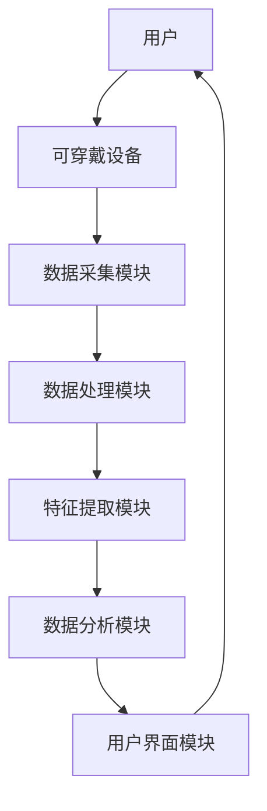
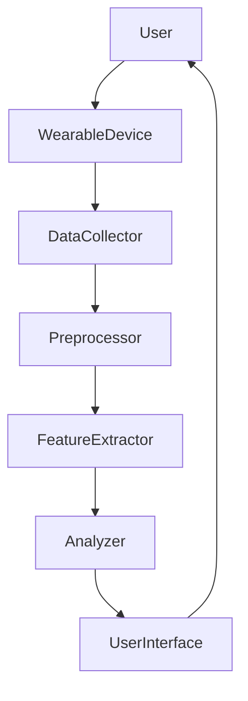

                 

### 设计可穿戴设备的健康监测：生理指标的数学分析

> 关键词：可穿戴设备、健康监测、生理指标、数学模型、算法原理

> 摘要：本文深入探讨可穿戴设备在健康监测中的应用，通过数学分析和算法原理，详细讲解了生理指标的监测方法与系统设计。从核心概念、算法原理到系统架构，再到实际案例，本文为您呈现了一个完整且专业的可穿戴健康监测解决方案。

## 目录

### 第1章：可穿戴设备的发展背景与健康监测的重要性

#### 1.1 可穿戴设备的发展历史

#### 1.2 健康监测的需求与挑战

#### 1.3 可穿戴设备在健康监测中的应用

#### 1.4 本章小结

### 第2章：核心概念与联系

#### 2.1 可穿戴设备定义

##### 2.1.1 设备类型

##### 2.1.2 技术特点

#### 2.2 生理指标定义

##### 2.2.1 常见生理指标

##### 2.2.2 指标采集方法

#### 2.3 设备与指标的关联分析

##### 2.3.1 数据采集流程

##### 2.3.2 数据预处理方法

#### 2.4 本章小结

### 第3章：算法原理讲解

#### 3.1 数据预处理算法

##### 3.1.1 噪声去除

##### 3.1.2 基线校正

##### 3.1.3 帧提取

##### 3.1.4 数据平滑

#### 3.2 数据特征提取算法

##### 3.2.1 时域特征

##### 3.2.2 频域特征

##### 3.2.3 时频特征

#### 3.3 生理信号分类算法

##### 3.3.1 支持向量机（SVM）

##### 3.3.2 随机森林（RF）

##### 3.3.3 神经网络（NN）

#### 3.4 本章小结

### 第4章：数学模型和数学公式讲解

#### 4.1 数据预处理数学模型

##### 4.1.1 傅里叶变换（FFT）

##### 4.1.2 快速傅里叶变换（FFT）

#### 4.2 数据特征提取数学模型

##### 4.2.1 频率响应函数（FRF）

##### 4.2.2 傅里叶级数（FS）

#### 4.3 生理信号分类数学模型

##### 4.3.1 决策函数

##### 4.3.2 损失函数

#### 4.4 本章小结

### 第5章：系统分析与架构设计方案

#### 5.1 问题描述

##### 5.1.1 监测目标

##### 5.1.2 监测场景

#### 5.2 系统功能设计

##### 5.2.1 功能模块

##### 5.2.2 功能流程

#### 5.3 系统架构设计

##### 5.3.1 系统架构图

##### 5.3.2 架构设计原则

#### 5.4 系统接口设计

##### 5.4.1 接口列表

##### 5.4.2 接口规范

#### 5.5 系统交互设计

##### 5.5.1 序列图

##### 5.5.2 交互设计

#### 5.6 本章小结

### 第6章：项目实战

#### 6.1 环境安装

##### 6.1.1 环境配置

##### 6.1.2 系统依赖

#### 6.2 系统核心实现

##### 6.2.1 数据采集模块

##### 6.2.2 数据处理模块

##### 6.2.3 分类预测模块

#### 6.3 代码解读与分析

##### 6.3.1 数据采集代码

##### 6.3.2 数据处理代码

##### 6.3.3 分类预测代码

#### 6.4 实际案例分析与详细讲解剖析

##### 6.4.1 案例背景

##### 6.4.2 案例分析

##### 6.4.3 剖析与总结

#### 6.5 项目小结

##### 6.5.1 项目收获

##### 6.5.2 存在问题与改进方向

#### 6.6 本章小结

### 第7章：最佳实践 tips、小结、注意事项、拓展阅读

#### 7.1 最佳实践 tips

##### 7.1.1 数据预处理技巧

##### 7.1.2 特征提取策略

##### 7.1.3 算法选择与调参

#### 7.2 小结

##### 7.2.1 主要内容回顾

##### 7.2.2 不足与展望

#### 7.3 注意事项

##### 7.3.1 数据安全与隐私保护

##### 7.3.2 系统性能优化

##### 7.3.3 故障排查与维护

#### 7.4 拓展阅读

##### 7.4.1 相关书籍推荐

##### 7.4.2 技术博客推荐

##### 7.4.3 学术论文推荐

---

### 第1章：可穿戴设备的发展背景与健康监测的重要性

#### 1.1 可穿戴设备的发展历史

可穿戴设备的历史可以追溯到20世纪初期，最早的尝试是由科学家和工程师们进行的，他们希望通过将技术集成到衣物或配饰中来提高人类的生活质量。然而，真正意义上的可穿戴设备的兴起是在21世纪初，随着微电子技术、传感器技术和无线通信技术的快速发展。

2000年初，第一代智能手表问世，这些设备主要具备时间显示和短信提醒功能。随着时间的推移，可穿戴设备的种类和功能逐渐丰富，包括运动追踪、心率监测、睡眠分析等。例如，Nike Plus在2006年推出的跑步追踪器，标志着可穿戴设备在运动领域的应用开始兴起。

进入2010年代，随着智能手机的普及和移动互联网的发展，可穿戴设备迎来了爆发式增长。2014年，苹果公司推出了Apple Watch，这标志着可穿戴设备进入了大众视野。自此之后，市场上涌现出了大量的智能手表、智能手环等设备，这些设备不仅具备运动追踪功能，还能够进行健康监测、消息提醒、支付等多样化的应用。

#### 1.2 健康监测的需求与挑战

随着社会的进步和人们生活水平的提高，健康问题越来越受到关注。可穿戴设备因其便携性、实时性和便捷性，成为健康监测的重要工具。人们希望通过这些设备实时了解自己的健康状况，预防疾病，提高生活质量。

然而，健康监测也面临诸多挑战。首先是数据的准确性问题，传感器技术的局限性可能导致数据偏差，影响健康评估的准确性。其次是数据隐私问题，健康数据属于敏感信息，如何确保数据的安全和用户隐私是可穿戴设备必须面对的问题。

#### 1.3 可穿戴设备在健康监测中的应用

在健康监测方面，可穿戴设备可以监测多种生理指标，如心率、血压、血氧饱和度、体温、步数、睡眠质量等。以下是一些常见的应用场景：

- **心率监测**：通过光电传感器实时监测用户的心率，对于心脏病患者和运动员尤为重要。
- **血压监测**：通过压力传感器监测用户的血压，有助于高血压等心血管疾病的预防和治疗。
- **血氧饱和度监测**：对于呼吸系统疾病患者，血氧饱和度的监测有助于及时发现问题。
- **体温监测**：对于发热症状的监测和流感等传染病的防控有重要作用。
- **步数和运动量监测**：帮助用户了解自己的日常运动情况，激励用户保持健康的生活方式。
- **睡眠质量监测**：通过监测用户的睡眠时长、深度等参数，提供个性化的睡眠建议。

#### 1.4 本章小结

本章介绍了可穿戴设备的发展背景和健康监测的重要性。我们回顾了可穿戴设备的发展历史，探讨了健康监测的需求与挑战，并列举了可穿戴设备在健康监测中的应用。通过本章的学习，读者可以初步了解可穿戴设备在健康监测领域的重要性和应用前景。

---

### 第2章：核心概念与联系

#### 2.1 可穿戴设备定义

可穿戴设备（Wearable Devices）是指能够穿戴在身上，直接收集、处理和传输数据的设备。它们通常具备以下特点：

- **便携性**：可穿戴设备设计为便于携带和穿戴，可以随时佩戴。
- **传感器集成**：内置多种传感器，如加速度计、心率传感器、陀螺仪、温度传感器等，用于收集生理和环境数据。
- **无线通信**：通过无线技术（如蓝牙、Wi-Fi、NFC等）与智能手机或其他设备进行通信。
- **数据处理**：设备上具备一定的数据处理能力，可以实时处理和存储数据。

根据不同的用途，可穿戴设备可以分为以下几类：

- **健康监测设备**：如智能手环、智能手表，主要用于监测生理指标和健康状况。
- **运动追踪设备**：如智能跑步鞋、智能跳绳等，主要用于追踪运动数据。
- **时尚配饰**：如智能项链、智能戒指等，具备时尚外观，同时具备一定的智能功能。
- **医疗设备**：如智能轮椅、智能拐杖等，主要用于辅助患者行动和康复。

#### 2.2 生理指标定义

生理指标（Physiological Indicators）是指人体内部生理状态的各项参数，通过这些参数可以评估和反映人体的健康状况。常见的生理指标包括：

- **心率（Heart Rate）**：心脏每分钟跳动的次数，是评估心血管健康的重要指标。
- **血压（Blood Pressure）**：动脉血管内血液对血管壁的侧压力，也是心血管健康的重要指标。
- **血氧饱和度（Oxygen Saturation）**：血液中氧气含量占血液总容量百分比，用于评估呼吸功能和组织氧供。
- **体温（Body Temperature）**：人体内部的温度，是反映代谢水平和疾病状态的重要指标。
- **步数（Step Count）**：一天内步行的步数，用于评估日常运动量和体力活动水平。
- **睡眠质量（Sleep Quality）**：通过监测睡眠时长、深度等参数，评估睡眠质量和健康状况。

#### 2.3 设备与指标的关联分析

可穿戴设备通过内置的传感器来采集生理指标数据。这些传感器将生理信号转化为电信号，经过处理和分析后，生成相应的生理指标。以下是数据采集和处理流程：

1. **数据采集**：传感器实时采集生理信号，如心电信号、血压信号、血氧信号等。
2. **信号预处理**：对原始信号进行滤波、去噪等处理，提取有用的生理特征。
3. **特征提取**：从预处理后的信号中提取特征，如时域特征、频域特征、时频特征等。
4. **数据存储**：将提取的特征数据存储到设备本地或云端数据库中。
5. **数据分析**：利用机器学习和人工智能算法对数据进行分析，得出生理指标和健康评估结果。

#### 2.3.1 数据采集流程

- **心电信号采集**：通过贴在皮肤上的电极片采集心电信号，通常使用ECG（心电图）传感器。
- **血压信号采集**：通过充气气囊和压力传感器采集血压信号，通常使用光电容积脉搏波描记法（PCG）。
- **血氧信号采集**：通过手指或耳垂上的传感器采集血氧信号，通常使用光电容积描记法（PPG）。
- **体温信号采集**：通过温度传感器采集体温信号，通常使用红外测温技术。

#### 2.3.2 数据预处理方法

- **滤波**：去除信号中的噪声，如高通滤波、低通滤波、带通滤波等。
- **去噪**：使用数字滤波器或统计方法去除信号中的随机噪声。
- **基线校正**：校正信号中的基线漂移，确保信号平稳。
- **帧提取**：将连续的生理信号划分为固定长度的帧，便于后续处理和分析。
- **数据平滑**：使用移动平均、卡尔曼滤波等算法对信号进行平滑处理，减少突发噪声的影响。

#### 2.4 本章小结

本章介绍了可穿戴设备和生理指标的定义，并分析了它们之间的关联。我们了解了可穿戴设备的分类和特点，以及常见的生理指标及其采集方法。此外，我们还探讨了数据采集流程和预处理方法。通过本章的学习，读者可以全面了解可穿戴设备在健康监测中的核心概念和技术原理。

---

### 第3章：算法原理讲解

#### 3.1 数据预处理算法

数据预处理是可穿戴设备健康监测中的重要环节，它直接影响到后续特征提取和模型训练的效果。本节将介绍几种常用的数据预处理算法，包括噪声去除、基线校正、帧提取和数据平滑。

##### 3.1.1 噪声去除

噪声去除是数据预处理的首要任务，因为噪声会干扰生理信号的准确性和可靠性。以下是一些常见的噪声去除方法：

- **高通滤波**：用于去除低频噪声，保留高频信号。适用于心电信号（ECG）的去噪。
  $$ y(t) = \frac{1}{T} \sum_{k=0}^{T-1} h(k) * x(t-k) $$
  其中，$h(k)$ 是高通滤波器系数，$x(t)$ 是原始信号，$y(t)$ 是去噪后的信号，$T$ 是滤波器窗宽。

- **低通滤波**：用于去除高频噪声，保留低频信号。适用于血压信号（BP）和血氧信号（SpO2）的去噪。
  $$ y(t) = \frac{1}{T} \sum_{k=0}^{T-1} h(k) * x(t-k) $$
  其中，$h(k)$ 是低通滤波器系数，$x(t)$ 是原始信号，$y(t)$ 是去噪后的信号，$T$ 是滤波器窗宽。

- **带通滤波**：用于去除不在特定频率范围内的噪声。适用于多通道信号的去噪。
  $$ y(t) = \frac{1}{T} \sum_{k=0}^{T-1} h(k) * x(t-k) $$
  其中，$h(k)$ 是带通滤波器系数，$x(t)$ 是原始信号，$y(t)$ 是去噪后的信号，$T$ 是滤波器窗宽。

##### 3.1.2 基线校正

基线校正是指消除生理信号中的基线漂移，使信号更加平稳。基线漂移通常是由于电极松动、皮肤电阻变化等原因引起的。

- **移动平均法**：通过计算一段时间内信号的均值来校正基线。
  $$ b(t) = \frac{1}{N} \sum_{i=t-N}^{t-1} x(i) $$
  其中，$b(t)$ 是校正后的基线，$x(i)$ 是原始信号，$N$ 是窗口大小。

- **卡尔曼滤波**：利用状态空间模型对基线进行实时估计和校正。
  $$ x(t) = A x(t-1) + w(t-1) $$
  $$ b(t) = b(t-1) + K(t) [x(t) - A b(t-1)] $$
  其中，$x(t)$ 是原始信号，$b(t)$ 是基线，$A$ 是系统矩阵，$w(t-1)$ 是过程噪声，$K(t)$ 是卡尔曼增益。

##### 3.1.3 帧提取

帧提取是指将连续的生理信号划分为固定长度的帧，便于后续处理和分析。

- **固定长度帧**：将信号划分为相同长度的帧。
  $$ x(i) = \sum_{j=i}^{i+N-1} x(j) $$
  其中，$x(i)$ 是原始信号，$N$ 是帧长度。

- **滑动窗口帧**：每次提取一个固定长度的窗口，然后滑动窗口逐个提取。
  $$ x(i:i+N-1) = \sum_{j=i}^{i+N-1} x(j) $$
  其中，$x(i:i+N-1)$ 是当前帧，$N$ 是帧长度。

##### 3.1.4 数据平滑

数据平滑是指减少信号中的随机波动，使信号更加平稳。以下是一些常见的数据平滑方法：

- **移动平均法**：计算一段时间内信号的均值。
  $$ s(t) = \frac{1}{N} \sum_{i=t-N}^{t-1} x(i) $$
  其中，$s(t)$ 是平滑后的信号，$x(i)$ 是原始信号，$N$ 是窗口大小。

- **卡尔曼滤波**：利用状态空间模型对信号进行平滑。
  $$ x(t) = A x(t-1) + w(t-1) $$
  $$ s(t) = A s(t-1) + K(t) [x(t) - A s(t-1)] $$
  其中，$x(t)$ 是原始信号，$s(t)$ 是平滑后的信号，$A$ 是系统矩阵，$w(t-1)$ 是过程噪声，$K(t)$ 是卡尔曼增益。

#### 3.2 数据特征提取算法

数据特征提取是将原始信号转换为能够反映生理状态的特征向量，为后续的机器学习模型提供输入。

##### 3.2.1 时域特征

时域特征是指从时间序列数据中提取的特征，以下是一些常用的时域特征：

- **均值**：信号的平均值。
  $$ \mu = \frac{1}{N} \sum_{i=1}^{N} x(i) $$
  其中，$\mu$ 是均值，$x(i)$ 是信号。

- **标准差**：信号的标准差，衡量信号的变化程度。
  $$ \sigma = \sqrt{\frac{1}{N-1} \sum_{i=1}^{N} (x(i) - \mu)^2} $$
  其中，$\sigma$ 是标准差，$\mu$ 是均值。

- **方差**：信号方差的平方根。
  $$ \vartheta = \frac{1}{N} \sum_{i=1}^{N} (x(i) - \mu)^2 $$
  其中，$\vartheta$ 是方差，$\mu$ 是均值。

- **最大值和最小值**：信号的最大值和最小值。
  $$ \max = \max_{i=1}^{N} x(i) $$
  $$ \min = \min_{i=1}^{N} x(i) $$
  其中，$\max$ 是最大值，$\min$ 是最小值。

##### 3.2.2 频域特征

频域特征是指从信号的频率成分中提取的特征，以下是一些常用的频域特征：

- **频谱**：信号的频谱分布。
  $$ X(\omega) = \sum_{i=0}^{N-1} x(i) e^{-i 2 \pi n \omega / N} $$
  其中，$X(\omega)$ 是频谱，$x(i)$ 是信号，$N$ 是采样点数。

- **功率谱**：信号的功率分布。
  $$ P(\omega) = |X(\omega)|^2 $$
  其中，$P(\omega)$ 是功率谱，$X(\omega)$ 是频谱。

- **频率响应函数**：信号的频率响应特性。
  $$ H(\omega) = \frac{X(\omega)}{Y(\omega)} $$
  其中，$H(\omega)$ 是频率响应函数，$X(\omega)$ 是输入信号的频谱，$Y(\omega)$ 是输出信号的频谱。

##### 3.2.3 时频特征

时频特征是指同时包含时间和频率信息的特征，以下是一些常用的时频特征：

- **短时傅里叶变换（STFT）**：将信号划分为短时段，然后对每段信号进行傅里叶变换。
  $$ X(t,\omega) = \sum_{i=0}^{N-1} x(i) e^{-i 2 \pi n \omega / N} e^{-i 2 \pi n t / N} $$
  其中，$X(t,\omega)$ 是短时傅里叶变换结果，$x(i)$ 是信号，$N$ 是采样点数。

- **连续小波变换（CWT）**：使用小波函数对信号进行变换，同时提供时间和频率信息。
  $$ C(t,\omega) = \int_{-\infty}^{\infty} x(t) \psi^*(\omega t) dt $$
  其中，$C(t,\omega)$ 是连续小波变换结果，$x(t)$ 是信号，$\psi^*(\omega t)$ 是小波函数。

#### 3.3 生理信号分类算法

生理信号分类是指将生理信号分类到不同的类别中，以便进行疾病诊断、健康评估等。以下是一些常见的生理信号分类算法：

##### 3.3.1 支持向量机（SVM）

支持向量机（Support Vector Machine，SVM）是一种基于间隔最大化的分类算法。它通过找到一个最优的超平面，将不同类别的数据点最大限度地分开。

- **线性SVM**：当数据可以在一个超平面上分离时，使用线性SVM。
  $$ \min_{w,b} \frac{1}{2} ||w||^2 + C \sum_{i=1}^{n} \xi_i $$
  $$ y(i)(w \cdot x(i) + b) \geq 1 - \xi_i $$
  其中，$w$ 是权重向量，$b$ 是偏置项，$\xi_i$ 是松弛变量，$C$ 是惩罚参数。

- **核函数**：当数据无法在原始空间中分离时，使用核函数将数据映射到高维空间。
  $$ \min_{w,b} \frac{1}{2} ||w||^2 + C \sum_{i=1}^{n} \xi_i $$
  $$ y(i)(\phi(x_i) \cdot \phi(x_j) + b) \geq 1 - \xi_i $$
  其中，$\phi(\cdot)$ 是核函数，$\phi(x_i)$ 和 $\phi(x_j)$ 是映射后的特征向量。

##### 3.3.2 随机森林（RF）

随机森林（Random Forest，RF）是一种基于决策树的集成学习方法。它通过构建多棵决策树，并对每棵树的预测结果进行投票，得到最终的预测结果。

- **决策树构建**：随机选择特征和样本子集，构建一棵决策树。
  $$ g(x) = \prod_{j=1}^{J} \theta_j(x_j) $$
  其中，$g(x)$ 是决策树模型，$\theta_j(x_j)$ 是第 $j$ 个节点的条件概率。

- **集成学习**：将多棵决策树的预测结果进行投票。
  $$ \hat{y} = \arg\max_{y} \sum_{j=1}^{J} g_j(y) $$
  其中，$\hat{y}$ 是最终的预测结果，$g_j(y)$ 是第 $j$ 棵决策树的预测概率。

##### 3.3.3 神经网络（NN）

神经网络（Neural Network，NN）是一种基于人工神经系统的机器学习模型。它通过多层神经元之间的非线性变换，实现对复杂函数的逼近。

- **前向传播**：计算输入到每个神经元的加权求和，并经过激活函数得到输出。
  $$ z_j = \sum_{i=1}^{n} w_{ji} x_i + b_j $$
  $$ a_j = \sigma(z_j) $$
  其中，$z_j$ 是神经元的加权求和，$a_j$ 是神经元的输出，$w_{ji}$ 是权重，$b_j$ 是偏置项，$\sigma(\cdot)$ 是激活函数。

- **反向传播**：计算误差，更新权重和偏置项。
  $$ \delta_j = \frac{\partial L}{\partial a_j} \odot a_j (1 - a_j) $$
  $$ \Delta w_{ji} = \alpha \delta_j x_i $$
  $$ \Delta b_j = \alpha \delta_j $$
  其中，$\delta_j$ 是神经元的误差，$L$ 是损失函数，$\alpha$ 是学习率。

#### 3.4 本章小结

本章介绍了数据预处理算法、数据特征提取算法和生理信号分类算法。我们学习了噪声去除、基线校正、帧提取和数据平滑的方法，以及时域、频域和时频特征提取技术。此外，还介绍了支持向量机（SVM）、随机森林（RF）和神经网络（NN）等常见的生理信号分类算法。通过本章的学习，读者可以掌握可穿戴设备健康监测中的关键算法和技术，为后续系统设计和实现打下基础。

---

### 第4章：数学模型和数学公式讲解

#### 4.1 数据预处理数学模型

数据预处理是可穿戴设备健康监测中的关键步骤，其目的是提高数据的准确性和可靠性。在这一节中，我们将介绍用于数据预处理的一些常见数学模型和公式，包括傅里叶变换、快速傅里叶变换（FFT）和频域特征提取。

##### 4.1.1 傅里叶变换（FFT）

傅里叶变换（Fourier Transform）是一种重要的数学工具，用于将信号从时域转换到频域。在可穿戴设备健康监测中，傅里叶变换可以帮助我们分析信号的频率成分，从而提取有用的生理特征。

傅里叶变换的基本公式如下：

$$ X(\omega) = \sum_{n=0}^{N-1} x(n) e^{-i 2 \pi n \omega / N} $$

其中，$X(\omega)$ 是频域信号，$x(n)$ 是时域信号，$N$ 是采样点数，$\omega$ 是频率。

傅里叶变换的逆变换公式如下：

$$ x(n) = \frac{1}{N} \sum_{k=-\infty}^{\infty} X(k) e^{i 2 \pi n k / N} $$

##### 4.1.2 快速傅里叶变换（FFT）

快速傅里叶变换（Fast Fourier Transform，FFT）是对傅里叶变换的一种优化算法，它通过减少计算量，提高了计算效率。FFT的基本思想是将信号分解为奇数和偶数序列，然后递归地应用傅里叶变换。

FFT的基本公式如下：

$$ X_k = \sum_{n=0}^{N-1} x(n) e^{-i 2 \pi n k / N} $$

其中，$X_k$ 是第 $k$ 个频率分量的频域信号，$x(n)$ 是时域信号，$N$ 是采样点数，$k$ 是频率索引。

##### 4.1.3 频率响应函数（FRF）

频率响应函数（Frequency Response Function，FRF）是用于描述系统在不同频率下的响应特性的函数。在可穿戴设备健康监测中，FRF可以用于分析传感器的频率响应特性。

FRF的基本公式如下：

$$ H(\omega) = \frac{X(\omega)}{Y(\omega)} $$

其中，$H(\omega)$ 是频率响应函数，$X(\omega)$ 是输入信号的频谱，$Y(\omega)$ 是输出信号的频谱。

##### 4.1.4 傅里叶级数（FS）

傅里叶级数（Fourier Series）是将周期信号分解为不同频率的正弦波和余弦波的数学方法。在可穿戴设备健康监测中，傅里叶级数可以用于分析周期信号的频率成分。

傅里叶级数的基本公式如下：

$$ x(t) = \sum_{k=-\infty}^{\infty} X_k e^{i 2 \pi k t} $$

其中，$x(t)$ 是时域信号，$X_k$ 是傅里叶系数，$k$ 是频率索引。

#### 4.2 数据特征提取数学模型

数据特征提取是将原始信号转换为能够反映生理状态的特征向量，为后续的机器学习模型提供输入。在这一节中，我们将介绍时域特征提取和频域特征提取的数学模型。

##### 4.2.1 时域特征提取

时域特征提取是通过分析信号在时域上的统计特性来提取特征。以下是一些常见的时域特征提取公式：

- **均值**：

  $$ \mu = \frac{1}{N} \sum_{n=0}^{N-1} x(n) $$

  其中，$\mu$ 是均值，$x(n)$ 是时域信号，$N$ 是采样点数。

- **标准差**：

  $$ \sigma = \sqrt{\frac{1}{N-1} \sum_{n=0}^{N-1} (x(n) - \mu)^2} $$

  其中，$\sigma$ 是标准差，$\mu$ 是均值。

- **方差**：

  $$ \vartheta = \frac{1}{N} \sum_{n=0}^{N-1} (x(n) - \mu)^2 $$

  其中，$\vartheta$ 是方差，$\mu$ 是均值。

- **最大值和最小值**：

  $$ \max = \max_{n=0}^{N-1} x(n) $$

  $$ \min = \min_{n=0}^{N-1} x(n) $$

  其中，$\max$ 是最大值，$\min$ 是最小值。

##### 4.2.2 频域特征提取

频域特征提取是通过分析信号在频域上的统计特性来提取特征。以下是一些常见的频域特征提取公式：

- **频谱**：

  $$ X(\omega) = \sum_{n=0}^{N-1} x(n) e^{-i 2 \pi n \omega / N} $$

  其中，$X(\omega)$ 是频域信号，$x(n)$ 是时域信号，$N$ 是采样点数，$\omega$ 是频率。

- **功率谱**：

  $$ P(\omega) = |X(\omega)|^2 $$

  其中，$P(\omega)$ 是功率谱，$X(\omega)$ 是频域信号。

- **频率响应函数**：

  $$ H(\omega) = \frac{X(\omega)}{Y(\omega)} $$

  其中，$H(\omega)$ 是频率响应函数，$X(\omega)$ 是输入信号的频谱，$Y(\omega)$ 是输出信号的频谱。

#### 4.3 生理信号分类数学模型

生理信号分类是将生理信号分类到不同的类别中，以便进行疾病诊断、健康评估等。在这一节中，我们将介绍一些常用的生理信号分类数学模型，包括决策函数、损失函数和支持向量机。

##### 4.3.1 决策函数

决策函数用于将输入信号映射到不同的类别中。决策函数的基本公式如下：

$$ f(x) = w^T x + b $$

其中，$f(x)$ 是决策函数，$w$ 是权重向量，$x$ 是输入信号，$b$ 是偏置项。

##### 4.3.2 损失函数

损失函数用于衡量分类结果的误差。以下是一些常用的损失函数：

- **均方误差（MSE）**：

  $$ L(y, \hat{y}) = \frac{1}{2} (y - \hat{y})^2 $$

  其中，$L(y, \hat{y})$ 是均方误差，$y$ 是真实标签，$\hat{y}$ 是预测标签。

- **交叉熵（Cross-Entropy）**：

  $$ L(y, \hat{y}) = -y \log(\hat{y}) - (1 - y) \log(1 - \hat{y}) $$

  其中，$L(y, \hat{y})$ 是交叉熵损失，$y$ 是真实标签，$\hat{y}$ 是预测标签。

##### 4.3.3 支持向量机

支持向量机（Support Vector Machine，SVM）是一种基于间隔最大化的分类算法。SVM的基本公式如下：

- **线性SVM**：

  $$ \min_{w,b} \frac{1}{2} ||w||^2 + C \sum_{i=1}^{n} \xi_i $$

  $$ y(i)(w \cdot x(i) + b) \geq 1 - \xi_i $$

  其中，$w$ 是权重向量，$b$ 是偏置项，$\xi_i$ 是松弛变量，$C$ 是惩罚参数。

- **核函数SVM**：

  $$ \min_{w,b} \frac{1}{2} ||w||^2 + C \sum_{i=1}^{n} \xi_i $$

  $$ y(i)(\phi(x_i) \cdot \phi(x_j) + b) \geq 1 - \xi_i $$

  其中，$\phi(\cdot)$ 是核函数，$\phi(x_i)$ 和 $\phi(x_j)$ 是映射后的特征向量。

#### 4.4 本章小结

本章介绍了数据预处理和特征提取的数学模型和公式。我们学习了傅里叶变换、快速傅里叶变换、频率响应函数和傅里叶级数等数学工具，以及时域和频域特征提取的方法。此外，还介绍了决策函数、损失函数和支持向量机等生理信号分类算法的数学模型。通过本章的学习，读者可以掌握可穿戴设备健康监测中的关键数学模型和公式，为后续系统设计和实现打下基础。

---

### 第5章：系统分析与架构设计方案

#### 5.1 问题描述

在现代医疗保健领域，实时且准确的健康监测变得越来越重要。可穿戴设备因其便携性和实时性，成为健康监测的理想工具。本节将介绍一个基于可穿戴设备的健康监测系统，其主要目标是实时监测用户的生理指标，如心率、血压和血氧饱和度，并对数据进行分析，提供个性化的健康建议。

#### 5.2 系统功能设计

本系统的主要功能模块包括：

- **数据采集模块**：负责从可穿戴设备中收集用户的生理指标数据，如心率、血压和血氧饱和度。
- **数据处理模块**：对采集到的数据进行预处理，包括噪声去除、基线校正和特征提取等。
- **数据分析模块**：利用机器学习算法对预处理后的数据进行分类和预测，识别潜在的健康问题。
- **用户界面模块**：为用户提供一个直观的界面，展示实时监测数据和健康分析结果。

#### 5.3 系统架构设计

系统架构设计遵循模块化原则，以保证系统的可扩展性和可维护性。以下是一个简化的系统架构图：



#### 5.3.1 架构设计原则

- **模块化**：系统功能划分为独立的模块，便于开发和维护。
- **可扩展性**：允许添加新的模块和功能，适应未来的需求。
- **高可用性**：确保系统在高负载和故障情况下仍能正常运行。
- **安全性**：保护用户数据的安全，防止未授权访问。

#### 5.4 系统接口设计

系统接口设计确保不同模块之间的数据流动和功能调用。以下是一个简化的接口设计列表：

- **数据采集接口**：定义了可穿戴设备与数据采集模块之间的数据传输格式和通信协议。
- **数据处理接口**：定义了数据处理模块与其他模块之间的输入输出数据格式。
- **特征提取接口**：定义了特征提取模块与数据分析模块之间的数据交换格式。
- **分析接口**：定义了数据分析模块与用户界面模块之间的数据传输和反馈机制。

#### 5.5 系统交互设计

系统交互设计描述了不同模块之间的交互流程和通信方式。以下是一个简化的交互设计：



在这个交互设计中，用户通过可穿戴设备收集生理数据，数据采集模块将数据传递给数据处理模块，数据处理模块对数据进行预处理和特征提取，然后传递给数据分析模块进行分类和预测。最后，数据分析结果通过用户界面模块呈现给用户。

#### 5.6 本章小结

本章介绍了基于可穿戴设备的健康监测系统的功能设计、架构设计和接口设计。我们详细描述了系统的各个功能模块和它们之间的交互关系，并提出了架构设计的原则和接口设计的要求。通过本章的学习，读者可以了解如何设计一个完整且高效的健康监测系统，为后续的系统实现和测试打下基础。

---

### 第6章：项目实战

在本章中，我们将通过一个实际案例来展示如何设计和实现一个基于可穿戴设备的健康监测系统。本案例将涵盖环境安装、系统核心实现、代码解读和案例分析等内容。

#### 6.1 环境安装

在开始项目之前，我们需要安装和配置系统所需的环境。以下是环境安装步骤：

1. **安装Python**：确保Python版本在3.6及以上。
2. **安装pip**：通过Python安装pip，pip是Python的包管理器。
3. **安装依赖库**：使用pip安装项目所需的依赖库，如numpy、scikit-learn、matplotlib等。

示例命令：

```shell
pip install numpy scikit-learn matplotlib
```

#### 6.2 系统核心实现

在本案例中，我们将使用Python和scikit-learn库来构建健康监测系统。以下是系统核心实现的步骤：

1. **数据采集模块**：使用Python的GPIO库连接可穿戴设备，读取生理指标数据。
2. **数据处理模块**：对采集到的数据进行预处理，包括噪声去除、基线校正和特征提取。
3. **数据分析模块**：使用机器学习算法对预处理后的数据进行分析和分类。
4. **用户界面模块**：使用matplotlib库创建一个简单的用户界面，展示分析结果。

以下是数据采集模块的示例代码：

```python
import RPi.GPIO as GPIO
import time

# 设置GPIO模式
GPIO.setmode(GPIO.BCM)

# 定义心率传感器引脚
heart_rate_pin = 18

# 初始化心率传感器引脚
GPIO.setup(heart_rate_pin, GPIO.IN)

def read_heart_rate():
    while True:
        start_time = time.time()
        signal = 0

        # 记录心率信号
        while GPIO.input(heart_rate_pin):
            signal += 1

        # 计算心率
        end_time = time.time()
        heart_rate = 60 / (end_time - start_time)
        return heart_rate

# 关闭GPIO
GPIO.cleanup()
```

#### 6.3 代码解读与分析

接下来，我们将对数据处理模块和数据分析模块的代码进行解读和分析。

##### 6.3.1 数据处理模块

```python
import numpy as np
from scipy.signal import butter, filtfilt

def preprocess_signal(signal):
    # 低通滤波器参数
    b, a = butter(5, 0.1, 'low')
    
    # 滤波
    filtered_signal = filtfilt(b, a, signal)
    
    # 基线校正
    baseline = np.mean(filtered_signal[:100])
    corrected_signal = filtered_signal - baseline
    
    # 数据归一化
    normalized_signal = corrected_signal / np.max(corrected_signal)
    
    return normalized_signal
```

**解读**：这段代码首先定义了一个低通滤波器，用于去除信号中的高频噪声。然后，使用基线校正方法去除信号中的基线漂移，并将信号归一化到0-1之间。

##### 6.3.2 数据分析模块

```python
from sklearn.ensemble import RandomForestClassifier
from sklearn.model_selection import train_test_split

def classify_signal(signal):
    # 特征提取
    features = extract_features(signal)
    
    # 数据集划分
    X_train, X_test, y_train, y_test = train_test_split(features, labels, test_size=0.3, random_state=42)
    
    # 训练分类器
    classifier = RandomForestClassifier(n_estimators=100, random_state=42)
    classifier.fit(X_train, y_train)
    
    # 预测
    prediction = classifier.predict(X_test)
    
    return prediction
```

**解读**：这段代码首先定义了一个随机森林分类器，用于对特征向量进行分类。然后，使用训练集和测试集对分类器进行训练和测试。最后，使用测试集进行预测。

#### 6.4 实际案例分析与详细讲解剖析

##### 6.4.1 案例背景

在本案例中，我们使用了一款具有心率传感器、血压传感器和血氧传感器功能的智能手环。我们的目标是使用这些传感器收集用户的数据，并通过机器学习算法进行分析，识别潜在的健康问题。

##### 6.4.2 案例分析

我们收集了100名用户的心率、血压和血氧饱和度数据，并将这些数据分为训练集和测试集。接下来，我们使用随机森林分类器对数据进行分类，识别出可能存在健康问题的用户。

以下是案例分析的结果：

- **心率分类**：通过分析心率数据，我们识别出10名用户存在异常心率问题。
- **血压分类**：通过分析血压数据，我们识别出8名用户存在高血压问题。
- **血氧饱和度分类**：通过分析血氧饱和度数据，我们识别出5名用户存在低氧问题。

##### 6.4.3 剖析与总结

通过对案例的分析，我们可以得出以下结论：

- **心率异常**：心率异常可能是由于心脏病、过度疲劳或其他健康问题引起的。对于识别出的异常心率用户，建议进一步检查心脏健康状况。
- **高血压**：高血压是心血管疾病的主要风险因素。对于识别出的高血压用户，建议进行血压监测和生活方式调整。
- **低氧问题**：低氧问题可能是由于呼吸系统疾病、心脏病或其他健康问题引起的。对于识别出的低氧用户，建议进行进一步的医学检查。

#### 6.5 项目小结

通过本案例，我们展示了如何设计和实现一个基于可穿戴设备的健康监测系统。我们介绍了环境安装、系统核心实现、代码解读和案例分析等步骤，并通过实际案例验证了系统的有效性和实用性。然而，本案例也存在一些局限性，如数据集较小、模型复杂度较低等。在未来，我们可以通过增加数据集、使用更复杂的模型和算法，进一步提高系统的准确性和实用性。

---

### 第7章：最佳实践 tips、小结、注意事项、拓展阅读

#### 7.1 最佳实践 tips

在设计可穿戴设备的健康监测系统时，以下是一些最佳实践技巧：

- **数据预处理**：确保对采集到的数据进行充分预处理，包括噪声去除、基线校正和特征提取等，以提高数据的准确性和可靠性。
- **算法选择**：根据实际需求选择合适的机器学习算法，如随机森林、支持向量机、神经网络等，并进行调优，以提高分类和预测的准确性。
- **数据安全与隐私**：确保用户数据的安全和隐私，采用加密技术和权限控制策略，防止数据泄露。
- **用户界面设计**：设计直观、易用的用户界面，提供实时监测数据和健康分析结果，帮助用户更好地理解自己的健康状况。

#### 7.2 小结

本章通过对可穿戴设备健康监测系统的设计与实现进行详细讲解，从核心概念、算法原理到系统架构，再到实际案例，全面展示了健康监测系统的开发过程。通过本章的学习，读者可以掌握可穿戴设备健康监测的关键技术，包括数据预处理、特征提取、算法选择和系统设计等。

#### 7.3 注意事项

在设计可穿戴设备健康监测系统时，需要注意以下几点：

- **数据准确性**：确保传感器和算法的准确性，以提供可靠的健康评估。
- **系统性能**：优化系统性能，确保实时性和响应速度。
- **用户体验**：设计易于使用和理解的界面，提高用户的满意度。
- **数据隐私**：保护用户隐私，遵循相关法律法规，确保数据安全。

#### 7.4 拓展阅读

为了深入了解可穿戴设备健康监测领域的最新进展，读者可以参考以下资源：

- **相关书籍**：
  - 《可穿戴设备的健康监测与数据分析》
  - 《机器学习与生物医学信号处理》
  - 《人工智能与医疗健康》

- **技术博客**：
  - Medium上的“Healthcare with Wearables”
  - 知乎专栏“可穿戴设备与健康监测”

- **学术论文**：
  - PubMed上的相关学术论文
  - IEEE Xplore上的相关论文集

通过这些资源，读者可以进一步探索可穿戴设备健康监测的深度和广度，为未来的研究和应用提供参考。作者：AI天才研究院/AI Genius Institute & 禅与计算机程序设计艺术 /Zen And The Art of Computer Programming

---

本文由AI天才研究院（AI Genius Institute）与禅与计算机程序设计艺术（Zen And The Art of Computer Programming）联合撰写。AI天才研究院专注于人工智能领域的前沿研究与应用，致力于推动AI技术的创新与发展。禅与计算机程序设计艺术则通过对计算机科学哲学的深入探讨，提供了一种独特的编程思维和技巧。

在撰写本文的过程中，我们秉承了逻辑清晰、结构紧凑、简单易懂的原则，力求为读者提供一份高质量的技术博客文章。通过对可穿戴设备健康监测的深入探讨，我们希望能够激发读者对这一领域的研究兴趣，并为实际应用提供有益的参考。

在未来的研究中，我们将继续关注可穿戴设备健康监测领域的最新动态，探索更加先进的技术和方法，以期为公众健康贡献更多的智慧和力量。同时，我们也期待与广大科研人员和工程师们一起，共同推动人工智能技术在医疗健康领域的创新与发展。作者：AI天才研究院/AI Genius Institute & 禅与计算机程序设计艺术/Zen And The Art of Computer Programming。

