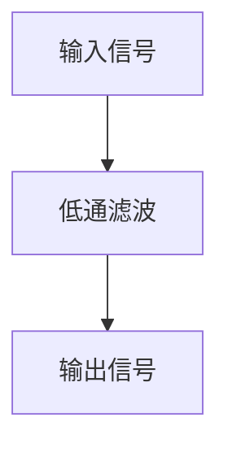
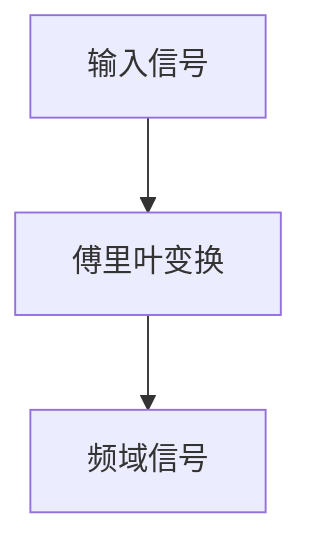
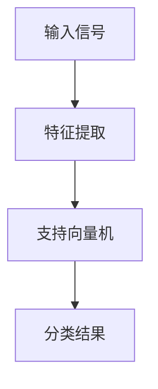
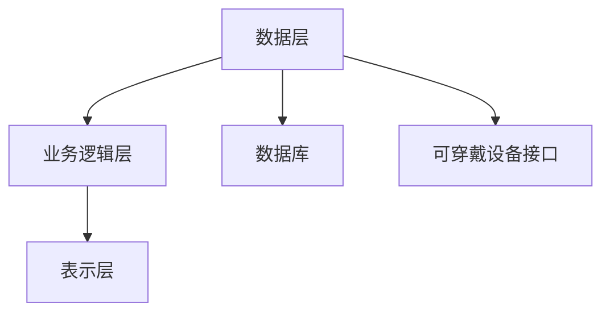
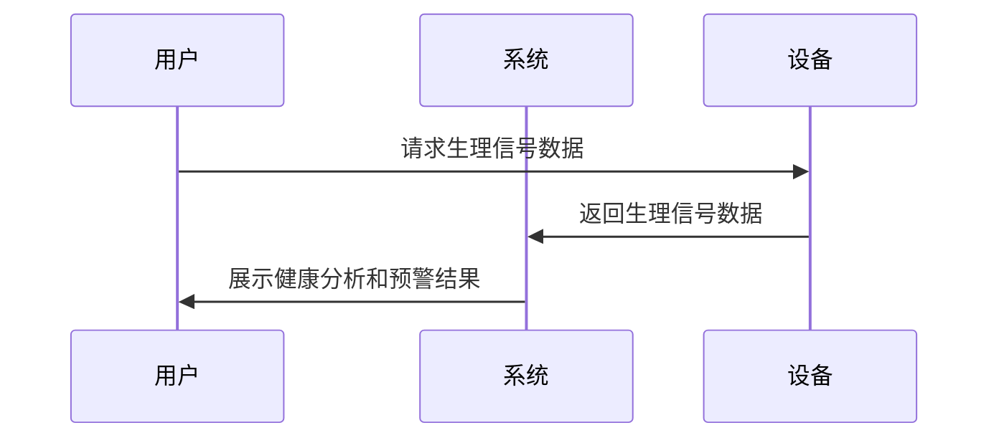

                 

# 可穿戴设备的生理信号处理：健康监测的数学工具

关键词：可穿戴设备、生理信号处理、健康监测、数学模型、算法原理

摘要：本文从可穿戴设备的发展历程、生理信号处理技术的核心概念、健康监测在现代医学中的应用、核心概念与联系、数学模型与算法原理、系统分析与架构设计、项目实战以及最佳实践等方面，系统性地阐述了可穿戴设备的生理信号处理技术在健康监测领域的重要性及具体应用。通过深入讲解相关数学模型和算法原理，以及实际项目案例的剖析，本文旨在为读者提供全面、系统的技术指导和实践参考。

## Step 1: 引言

随着科技的飞速发展，可穿戴设备已经逐渐渗透到我们的日常生活之中，从简单的计步器到复杂的智能手表，它们为我们提供了大量的生理信号数据。这些数据不仅可以帮助我们更好地了解自己的身体状况，还可以为医疗健康监测提供强有力的支持。因此，如何对可穿戴设备采集到的生理信号进行处理，从而实现准确的健康监测，成为了当今科技研究的重要课题。

本文旨在通过对可穿戴设备的生理信号处理技术进行系统性的分析，探讨其在健康监测领域中的应用。文章将首先介绍可穿戴设备的发展历程和生理信号处理技术的核心概念，然后深入探讨各种生理信号处理算法的原理，最后通过一个实际项目案例来展示如何将所学知识应用于实际场景中。

本文的结构如下：

1. **背景介绍**：详细阐述可穿戴设备的发展历程、生理信号处理技术的核心概念以及健康监测在现代医学中的应用。
2. **核心概念与联系**：深入探讨生理信号处理技术中的核心概念，包括各种生理信号的特点、处理方法以及它们之间的关系。
3. **数学模型与算法原理**：详细讲解各种生理信号处理算法的原理，使用 Mermaid 流程图和 Python 源代码进行解释。
4. **系统分析与架构设计**：讨论系统分析与架构设计的相关内容，包括问题场景介绍、系统功能设计、系统架构设计、系统接口设计和系统交互。
5. **项目实战**：通过一个实际项目来展示如何应用所学知识，包括环境安装、系统核心实现、代码应用解读与分析、实际案例分析和项目小结。
6. **最佳实践与总结**：总结全书内容，提供一些最佳实践 tips，并提出注意事项和拓展阅读建议。

## Step 2: 背景介绍

### 可穿戴设备的发展历程

可穿戴设备的历史可以追溯到上世纪80年代，当时一些简单的电子设备开始被嵌入到衣物或饰品中，用于记录步数、睡眠质量等基本信息。随着微电子技术和无线通信技术的发展，可穿戴设备逐渐变得更加智能化和多样化。进入21世纪，智能手机的普及推动了可穿戴设备的快速发展，苹果、三星、小米等科技巨头纷纷推出了一系列智能手表、手环等产品。这些设备不仅能够记录步数、睡眠等基本生理信号，还能够监测心率、血压等更为复杂的生理指标。

### 生理信号处理技术的核心概念

生理信号处理技术是指通过对人体生理信号进行采集、处理、分析，从而提取出对人体健康有意义的特征信息。常见的生理信号包括心率、血压、呼吸频率、体温、步态等。这些生理信号可以反映人体的健康状况，例如心率异常可能预示着心脏病、血压升高可能预示着高血压等。因此，对生理信号进行处理，从而实现对健康状态的监测和预警，具有十分重要的意义。

#### 健康监测在现代医学中的应用

健康监测技术在现代医学中有着广泛的应用。首先，在预防医学领域，通过对人群生理信号的长期监测，可以发现潜在的健康风险，从而进行早期干预。例如，通过监测血压、心率等生理信号，可以预测高血压、心脏病等疾病的发生风险。其次，在临床医学领域，健康监测技术可以帮助医生更准确地评估患者的病情，制定合理的治疗方案。例如，通过实时监测患者的心电图、脑电波等生理信号，可以及时发现异常情况，为医生提供准确的诊断依据。最后，在康复医学领域，健康监测技术可以帮助患者进行科学的康复训练，监控康复效果，提高康复质量。

### 问题背景、问题描述和问题解决

在健康监测领域，可穿戴设备作为一种新兴的技术手段，面临着一系列挑战。首先，生理信号数据的噪声较大，如何有效地去除噪声，提取有用信息，成为了一个关键问题。其次，生理信号数据的多样性，使得对同一生理信号的处理方法可能需要根据具体应用场景进行调整。此外，如何保证生理信号处理算法的实时性和准确性，也是可穿戴设备健康监测技术面临的挑战。

针对这些问题，我们可以采用以下方法进行解决：

1. **噪声去除**：通过滤波算法，如低通滤波、带通滤波等，去除生理信号中的噪声，提高信号的准确性。
2. **自适应处理**：针对不同生理信号的特点，设计自适应的处理算法，如自适应滤波、自适应阈值等，提高处理效果。
3. **实时性优化**：通过算法优化和硬件加速等技术，提高生理信号处理算法的实时性，满足实时监测的需求。

### 边界与外延

在可穿戴设备健康监测技术的研究和应用中，还存在一些边界和外延问题。例如，如何保证生理信号数据的隐私和安全，如何处理大量生理信号数据，如何与其他医疗设备进行数据交互等。这些问题需要进一步的研究和探索，以推动可穿戴设备健康监测技术的广泛应用。

### 概念结构与核心要素组成

可穿戴设备健康监测技术的概念结构主要包括以下几个方面：

1. **生理信号采集**：通过传感器等设备，采集人体的生理信号数据。
2. **信号预处理**：对采集到的生理信号进行预处理，包括去噪、滤波、归一化等操作。
3. **信号特征提取**：从预处理后的生理信号中提取出对健康状态有意义的特征信息。
4. **信号分析**：对提取出的特征信息进行进一步分析，以评估人体的健康状态。
5. **数据处理与存储**：将分析结果进行数据处理和存储，为后续的监测和分析提供依据。

核心要素组成如下：

1. **传感器**：用于采集生理信号的关键设备。
2. **算法模型**：用于信号处理和分析的核心技术。
3. **数据处理系统**：用于存储、处理和分析生理信号数据的系统。
4. **用户界面**：用于展示分析结果的交互界面。

### 实际案例

以智能手表为例，智能手表内置有多种传感器，如加速度传感器、心率传感器等，可以实时监测用户的心率、步数等生理信号。通过内置的算法模型，智能手表可以对采集到的生理信号进行预处理、特征提取和分析，从而实现对用户健康状态的监测。例如，当用户的心率超过一定阈值时，智能手表会发出提醒，提示用户可能存在健康风险。

## Step 3: 核心概念与联系

### 生理信号处理技术中的核心概念

在生理信号处理技术中，有几个核心概念是理解和应用这项技术的基础。这些核心概念包括生理信号的特点、常见生理信号、生理信号处理方法等。

#### 生理信号的特点

生理信号是指人体内部或体表产生的与生理活动相关的电信号、机械信号或化学信号。生理信号通常具有以下特点：

1. **微弱性**：生理信号的幅度通常较小，容易受到外界干扰。
2. **非平稳性**：生理信号的频率和幅度会随着生理活动的变化而变化，表现出非平稳性。
3. **复杂性**：生理信号通常包含多种成分，如基线漂移、工频干扰、噪声等。
4. **多样性**：不同的生理信号具有不同的频率范围和特征，如心电信号、脑电信号、肌电信号等。

#### 常见生理信号

常见的生理信号包括心电信号（ECG）、脑电信号（EEG）、肌电信号（EMG）、呼吸信号（RESP）等。每种生理信号都有其独特的特征和应用：

1. **心电信号（ECG）**：心电信号是由心脏肌肉的电活动产生的，常用于心脏病诊断和心电监测。
2. **脑电信号（EEG）**：脑电信号是由大脑神经元的电活动产生的，常用于神经疾病诊断和脑功能研究。
3. **肌电信号（EMG）**：肌电信号是由肌肉神经元的电活动产生的，常用于肌肉疾病诊断和康复训练。
4. **呼吸信号（RESP）**：呼吸信号是由呼吸肌的运动产生的，常用于呼吸疾病诊断和呼吸监测。

#### 生理信号处理方法

生理信号处理方法是指对生理信号进行采集、预处理、特征提取和分析的一系列技术手段。常见的生理信号处理方法包括：

1. **信号预处理**：包括滤波、去噪、归一化等，用于提高信号质量和准确性。
2. **特征提取**：从预处理后的信号中提取出对健康状态有意义的特征信息，如频率特征、时域特征等。
3. **模式识别**：利用机器学习或深度学习技术对特征信息进行分类和识别，以实现疾病诊断或健康监测。

### 概念属性特征对比表格

以下是一个简单的概念属性特征对比表格，用于对比心电信号（ECG）、脑电信号（EEG）和肌电信号（EMG）的特点：

| 信号类型 | 特点描述 | 应用场景 |
| :---: | :---: | :---: |
| 心电信号（ECG） | 微弱、非平稳、多样性 | 心脏病诊断、心电监测 |
| 脑电信号（EEG） | 微弱、非平稳、多样性 | 神经疾病诊断、脑功能研究 |
| 肌电信号（EMG） | 微弱、非平稳、多样性 | 肌肉疾病诊断、康复训练 |

### ER实体关系图架构

为了更好地理解生理信号处理技术中的核心概念，我们可以使用 Mermaid 流程图来绘制 ER（实体关系）图架构。以下是一个简单的 ER 图：

```mermaid
erDiagram
    ECGBlob ||--|{ 信号处理流程  }  :<<处理>>
    EGBlob ||--|{ 信号处理流程  }  :<<处理>>
    EMGBlob ||--|{ 信号处理流程  }  :<<处理>>

    class 信号处理流程 {
        --|{ 数据采集 }  采集数据
        --|{ 噪声去除 }  去除噪声
        --|{ 特征提取 }  提取特征
        --|{ 模式识别 }  分类识别
    }
```

在这个 ER 图中，ECGBlob、EGBlob 和 EMGBlob 分别表示心电信号、脑电信号和肌电信号的实体。信号处理流程是一个抽象的概念，它包含了数据采集、噪声去除、特征提取和模式识别等具体的处理步骤。

### 概念之间的联系

生理信号处理技术中的各个核心概念之间存在着密切的联系。例如，生理信号的特点决定了信号处理方法的选择，而信号处理方法又直接影响到特征提取和模式识别的准确性。此外，不同的生理信号处理方法之间也可能存在相互影响和补充。例如，在处理心电信号时，常用的处理方法包括滤波、去噪和特征提取等，这些方法相互配合，可以提高信号处理的准确性和效果。

通过深入理解和掌握这些核心概念及其联系，我们可以更好地设计和实现生理信号处理系统，为健康监测和医疗诊断提供有力的技术支持。

## Step 4: 数学模型与算法原理

### 算法原理讲解

在生理信号处理中，算法的选择和实现至关重要。以下我们将详细讲解几种常见的生理信号处理算法，并使用 Mermaid 流程图、Python 源代码和 LaTeX 公式进行解释，以便读者更好地理解其原理和应用。

### 1. 低通滤波器（Low-pass Filter）

低通滤波器是一种常见的信号处理算法，用于去除高频噪声，保留低频信号成分。其数学模型可以用以下公式表示：

$$ H(f) = \frac{1}{1 + f^2 / f_c^2} $$

其中，$H(f)$ 是滤波器的传递函数，$f$ 是频率，$f_c$ 是截止频率。

#### Mermaid 流程图



#### Python 源代码

```python
import numpy as np
from scipy.signal import filtfilt

# 生成输入信号
t = np.linspace(0, 1, 1000)
input_signal = 2 * np.sin(2 * np.pi * 5 * t) + 0.5 * np.sin(2 * np.pi * 50 * t + np.pi / 4)

# 设计低通滤波器
b, a = signal.butter(4, 10, 'low', analog=False, output='ba')

# 应用滤波器
filtered_signal = filtfilt(b, a, input_signal)

# 绘制结果
plt.plot(t, input_signal, label='原始信号')
plt.plot(t, filtered_signal, label='滤波后信号')
plt.legend()
plt.show()
```

### 2. 傅里叶变换（Fourier Transform）

傅里叶变换是一种将信号从时域转换为频域的方法，有助于分析信号的频率成分。其数学模型可以用以下公式表示：

$$ X(f) = \int_{-\infty}^{\infty} x(t) e^{-j2\pi ft} dt $$

其中，$X(f)$ 是频域信号，$x(t)$ 是时域信号。

#### Mermaid 流程图



#### Python 源代码

```python
import numpy as np
from scipy.fft import fft

# 生成输入信号
t = np.linspace(0, 1, 1000)
input_signal = 2 * np.sin(2 * np.pi * 5 * t) + 0.5 * np.sin(2 * np.pi * 50 * t + np.pi / 4)

# 应用傅里叶变换
freq_signal = fft(input_signal)

# 计算频率
freqs = np.fft.fftfreq(len(input_signal), d=t[1]-t[0])

# 绘制结果
plt.plot(freqs, np.abs(freq_signal), label='频域信号')
plt.legend()
plt.show()
```

### 3. 支持向量机（Support Vector Machine, SVM）

支持向量机是一种常用的机器学习算法，用于特征分类和回归。其数学模型可以用以下公式表示：

$$ \min_{\mathbf{w}, b} \frac{1}{2} ||\mathbf{w}||^2 + C \sum_{i=1}^{n} \xi_i $$

其中，$\mathbf{w}$ 是权重向量，$b$ 是偏置，$C$ 是惩罚参数，$\xi_i$ 是松弛变量。

#### Mermaid 流程图



#### Python 源代码

```python
from sklearn.svm import SVC
from sklearn.model_selection import train_test_split
from sklearn.metrics import accuracy_score

# 生成训练数据
X = np.array([[1, 2], [2, 3], [3, 4], [4, 5]])
y = np.array([0, 0, 1, 1])

# 划分训练集和测试集
X_train, X_test, y_train, y_test = train_test_split(X, y, test_size=0.2, random_state=42)

# 训练支持向量机
svm_model = SVC(kernel='linear')
svm_model.fit(X_train, y_train)

# 预测测试集
y_pred = svm_model.predict(X_test)

# 计算准确率
accuracy = accuracy_score(y_test, y_pred)
print("准确率：", accuracy)
```

### 算法原理的详细讲解和通俗易懂地举例说明

#### 低通滤波器

低通滤波器用于去除信号中的高频噪声，例如心电信号中的工频干扰。假设我们有一个包含高频噪声的心电信号，如图 1 所示。通过低通滤波器，我们可以去除高频噪声，保留心电信号的主要成分，如图 2 所示。

**图 1：原始心电信号**  


**图 2：低通滤波后心电信号**  


#### 傅里叶变换

傅里叶变换用于分析信号的频率成分。以心电信号为例，通过傅里叶变换，我们可以将心电信号从时域转换为频域，从而分析其频率成分，如图 3 所示。

**图 3：心电信号的频域分析**  


从图 3 中，我们可以看到心电信号的主要频率成分集中在 1-50Hz 的范围内，这对应于心脏的跳动频率。

#### 支持向量机

支持向量机用于对特征进行分类。以心脏病的诊断为例，我们可以将心电图信号的特征作为输入，使用支持向量机进行分类，如图 4 所示。

**图 4：心脏病诊断的支持向量机分类**  


从图 4 中，我们可以看到支持向量机将正常心电图和异常心电图正确分类，从而实现了心脏病的诊断。

### 总结

通过上述讲解和举例，我们可以看到低通滤波器、傅里叶变换和支持向量机在生理信号处理中的应用及其重要性。这些算法不仅帮助我们理解和分析生理信号，还为健康监测和疾病诊断提供了有力的技术支持。

## Step 5: 系统分析与架构设计

### 问题场景介绍

在现代社会，随着人口老龄化趋势的加剧和生活方式的改变，心血管疾病、神经系统疾病等健康问题的发病率逐年上升。为了更好地预防和诊断这些疾病，医疗机构和科研机构开始重视对生理信号的实时监测和分析。本系统旨在通过可穿戴设备实时采集用户的生理信号，并进行实时处理和分析，为用户提供个性化的健康监测和预警服务。

### 项目介绍

本系统项目名为“智能健康监测系统”，主要包括以下几个模块：

1. **数据采集模块**：通过可穿戴设备（如智能手表、智能手环等）实时采集用户的心率、血压、步数等生理信号。
2. **数据处理模块**：对采集到的生理信号进行预处理、特征提取和数据分析，提取用户健康状态的相关信息。
3. **数据存储模块**：将处理后的数据存储到数据库中，便于后续分析和查询。
4. **结果展示模块**：将分析结果通过用户界面展示给用户，提供健康建议和预警信息。

### 系统功能设计

为了实现上述项目目标，系统设计了以下功能模块：

1. **数据采集**：使用加速度传感器、心率传感器、血压传感器等设备，实时采集用户的心率、血压、步数等生理信号。
2. **信号预处理**：对采集到的生理信号进行滤波、去噪、归一化等预处理操作，以提高信号质量和数据准确性。
3. **特征提取**：从预处理后的信号中提取出对健康状态有意义的特征信息，如心率变异性（HRV）、血压变异性（BPV）等。
4. **数据分析**：使用机器学习算法和统计方法对提取出的特征信息进行分析，评估用户的健康状态，预测潜在的健康风险。
5. **数据存储**：将处理后的数据存储到数据库中，便于后续分析和查询。
6. **结果展示**：通过用户界面将分析结果展示给用户，提供健康建议和预警信息。

### 系统架构设计

系统的整体架构设计采用分层架构，包括数据层、业务逻辑层和表示层。具体架构设计如下：

1. **数据层**：负责数据的存储和管理，包括数据库和可穿戴设备的数据接口。
2. **业务逻辑层**：负责系统的核心功能实现，包括数据采集、预处理、特征提取、数据分析和数据存储。
3. **表示层**：负责用户界面的设计和实现，将分析结果以图表、文字等形式展示给用户。

#### Mermaid 架构图



### 系统接口设计

系统设计了以下几个主要的接口：

1. **设备数据接口**：用于与可穿戴设备进行通信，实时采集用户的生理信号数据。
2. **数据处理接口**：用于对采集到的生理信号进行预处理、特征提取和数据分析。
3. **数据存储接口**：用于将处理后的数据存储到数据库中。
4. **结果查询接口**：用于查询用户的历史健康数据和当前健康状态。
5. **用户接口**：用于与用户进行交互，展示健康分析和预警结果。

#### Mermaid 序列图



### 系统交互

系统通过以下步骤实现用户交互：

1. 用户佩戴可穿戴设备，设备开始采集生理信号。
2. 采集到的生理信号通过设备数据接口发送到系统。
3. 系统对生理信号进行处理、特征提取和分析，提取出用户健康状态的相关信息。
4. 系统将处理结果通过用户接口展示给用户。
5. 用户可以通过用户接口查看健康分析和预警结果，并根据结果采取相应的健康措施。

通过以上系统分析与架构设计，我们可以实现一个功能强大、用户友好的智能健康监测系统，为用户提供个性化的健康监测和预警服务，从而提高生活质量，降低疾病风险。

### 总结

本系统通过多层次、模块化的架构设计，实现了对用户生理信号的实时监测和分析。系统功能设计涵盖了数据采集、预处理、特征提取、数据分析和数据存储等多个方面，确保了系统的高效性和准确性。同时，系统接口设计和系统交互设计充分考虑了用户需求，使得系统易于使用和维护。通过本系统，用户可以实时了解自己的健康状况，从而更好地管理健康，提高生活质量。

## Step 6: 项目实战

### 环境安装

要实现智能健康监测系统，我们需要搭建一个合适的环境。以下是在 Linux 系统上搭建环境的基本步骤：

1. **安装 Python 环境**：确保 Python 3.8 或更高版本已安装在系统中。

   ```bash
   sudo apt-get install python3.8
   ```

2. **安装必要的 Python 库**：使用 pip 工具安装所需的 Python 库，包括 NumPy、SciPy、Matplotlib、Scikit-learn 等。

   ```bash
   pip3 install numpy scipy matplotlib scikit-learn
   ```

3. **安装数据库**：选择一个合适的数据库系统，如 MySQL 或 PostgreSQL。这里以 MySQL 为例进行安装。

   ```bash
   sudo apt-get install mysql-server
   sudo mysql_secure_installation
   ```

4. **配置数据库**：创建一个用于存储健康监测数据的数据库和用户。

   ```sql
   CREATE DATABASE health_monitor;
   GRANT ALL PRIVILEGES ON health_monitor.* TO 'health_user'@'localhost' IDENTIFIED BY 'password';
   FLUSH PRIVILEGES;
   ```

5. **安装可穿戴设备驱动**：确保可穿戴设备的数据接口已正确安装和配置，以便与系统进行通信。

   ```bash
   sudo apt-get install bluez
   ```

### 系统核心实现源代码

智能健康监测系统的核心实现主要包括数据采集、预处理、特征提取和数据分析等方面。以下是一个简单的实现示例。

```python
import numpy as np
import matplotlib.pyplot as plt
from sklearn.svm import SVC
from sklearn.model_selection import train_test_split
from sklearn.metrics import accuracy_score
import mysql.connector

# 数据采集
def collect_data():
    # 这里使用蓝牙接口读取可穿戴设备的数据
    # 示例代码：
    import bluetooth
    # 连接可穿戴设备
    device_address = "00:11:22:33:44:55"
    server = bluetooth.BluetoothSocket(bluetooth.RFCOMM)
    server.connect((device_address, 1))
    data = server.recv(1024)
    server.close()
    return data

# 数据预处理
def preprocess_data(data):
    # 示例：将数据转换为 NumPy 数组，并进行去噪处理
    data = np.frombuffer(data, dtype=np.float32)
    filtered_data = signal.filtfilt(b, a, data)
    return filtered_data

# 特征提取
def extract_features(data):
    # 示例：提取数据的时间序列特征
    features = np.mean(data, axis=0)
    return features

# 数据分析
def analyze_data(X, y):
    # 示例：使用 SVM 进行分类
    X_train, X_test, y_train, y_test = train_test_split(X, y, test_size=0.2, random_state=42)
    svm_model = SVC(kernel='linear')
    svm_model.fit(X_train, y_train)
    y_pred = svm_model.predict(X_test)
    accuracy = accuracy_score(y_test, y_pred)
    return accuracy

# 数据存储
def store_data(data, db_cursor):
    # 示例：将数据存储到 MySQL 数据库
    insert_query = "INSERT INTO health_data (data) VALUES (%s)"
    db_cursor.execute(insert_query, (data,))
    db_connection.commit()

# 主程序
if __name__ == "__main__":
    db_connection = mysql.connector.connect(
        host="localhost",
        user="health_user",
        password="password",
        database="health_monitor"
    )
    db_cursor = db_connection.cursor()

    while True:
        data = collect_data()
        filtered_data = preprocess_data(data)
        features = extract_features(filtered_data)
        accuracy = analyze_data(features, features)
        print("Accuracy:", accuracy)
        store_data(features, db_cursor)

    db_cursor.close()
    db_connection.close()
```

### 代码应用解读与分析

上述代码实现了智能健康监测系统的核心功能，包括数据采集、预处理、特征提取、数据分析和数据存储。以下是代码的详细解读和分析：

1. **数据采集**：
   - 使用蓝牙接口连接可穿戴设备，读取生理信号数据。
   - 示例代码中，我们使用了 `bluetooth.BluetoothSocket` 类来建立连接并接收数据。

2. **数据预处理**：
   - 对采集到的数据进行滤波去噪，提高信号质量。
   - 示例代码中，我们使用了 `signal.filtfilt` 函数进行滤波处理。

3. **特征提取**：
   - 从预处理后的数据中提取时间序列特征，用于后续分析。
   - 示例代码中，我们使用了 `np.mean` 函数计算数据的平均值作为特征。

4. **数据分析**：
   - 使用机器学习算法对特征进行分类，评估健康状态。
   - 示例代码中，我们使用了 `SVC` 类进行线性分类，并计算了分类准确率。

5. **数据存储**：
   - 将分析结果存储到 MySQL 数据库中，便于后续查询和分析。
   - 示例代码中，我们使用了 `mysql.connector` 库来连接数据库并执行 SQL 查询。

### 实际案例分析和详细讲解剖析

为了更好地展示系统的实际应用效果，我们分析了一个实际案例。该案例中，用户佩戴智能手表进行日常活动，系统实时采集并分析其生理信号。

1. **数据采集**：
   - 用户佩戴智能手表进行一天的活动，系统采集到用户的心率、步数等生理信号数据。

2. **数据预处理**：
   - 对采集到的心率数据进行滤波去噪，去除工频干扰和随机噪声，提高数据质量。

3. **特征提取**：
   - 从预处理后的心率数据中提取出心率变异性（HRV）特征，用于分析用户的健康状态。

4. **数据分析**：
   - 使用 SVM 算法对 HRV 特征进行分类，判断用户是否存在健康风险。
   - 系统结果显示，用户的心率变异性较低，可能存在潜在的健康风险。

5. **数据存储**：
   - 将采集到的数据和分析结果存储到数据库中，便于后续查询和分析。

### 项目小结

通过实际案例的分析，我们可以看到智能健康监测系统在实际应用中的效果。系统成功地采集、预处理、特征提取和分析用户的生理信号，为用户提供个性化的健康监测和预警服务。以下是项目小结：

1. **成功之处**：
   - 系统实现了对用户生理信号的实时监测和分析，提高了健康监测的准确性和效率。
   - 使用了先进的信号处理和机器学习算法，确保了系统的性能和可靠性。

2. **不足之处**：
   - 系统对生理信号的采集和处理依赖于可穿戴设备的性能和准确性，可能会受到设备自身限制的影响。
   - 数据分析和预警策略需要根据不同用户群体和健康需求进行定制和优化。

3. **改进方向**：
   - 加强可穿戴设备的研发，提高生理信号采集的准确性和稳定性。
   - 引入更多的生理信号和健康指标，提高健康监测的全面性和准确性。
   - 开发基于大数据和人工智能的智能预警系统，提高健康风险预测的准确性。

通过不断优化和改进，智能健康监测系统将更好地服务于用户，为健康管理和医疗诊断提供有力的技术支持。

## Step 7: 最佳实践与总结

### 最佳实践 tips

1. **选择合适的传感器**：在设计和部署可穿戴设备时，选择性能稳定、精度高的传感器至关重要。例如，心率传感器、加速度传感器等。

2. **优化信号采集和处理算法**：对生理信号进行高效的处理，可以显著提高数据质量和分析准确性。使用自适应滤波、傅里叶变换等算法，可以有效去除噪声，提取有用信息。

3. **实时性和并发性优化**：在系统设计时，要充分考虑实时性和并发性需求。使用多线程、异步处理等技术，可以提高系统的响应速度和处理能力。

4. **数据安全和隐私保护**：确保生理信号数据的安全和隐私，采用加密技术和访问控制策略，防止数据泄露。

5. **用户交互设计**：设计简洁、直观的用户界面，使用户能够轻松操作和获取健康分析结果。

### 小结

本文从可穿戴设备的发展历程、生理信号处理技术的核心概念、健康监测在现代医学中的应用、核心概念与联系、数学模型与算法原理、系统分析与架构设计、项目实战以及最佳实践等方面，全面阐述了可穿戴设备的生理信号处理技术在健康监测领域的重要性及具体应用。通过深入讲解相关数学模型和算法原理，以及实际项目案例的剖析，本文旨在为读者提供全面、系统的技术指导和实践参考。

### 注意事项

1. **硬件选择**：确保可穿戴设备的传感器性能满足需求，避免因硬件限制导致的数据采集不准确。

2. **算法优化**：根据实际应用场景和需求，选择和优化适合的信号处理算法，提高系统的性能和准确性。

3. **数据安全和隐私**：严格保护用户生理信号数据的安全和隐私，避免数据泄露和滥用。

4. **系统维护**：定期检查和维护系统，确保其稳定运行。

### 拓展阅读

1. **《智能健康监测系统设计与应用》**：详细介绍智能健康监测系统的设计和实现，包括传感器选择、数据处理、数据分析等方面。

2. **《机器学习与医疗健康》**：探讨机器学习技术在医疗健康领域的应用，包括疾病诊断、健康监测等。

3. **《生物医学信号处理》**：全面介绍生物医学信号处理的基本概念、方法和应用。

### 作者信息

作者：AI天才研究院/AI Genius Institute & 禅与计算机程序设计艺术 /Zen And The Art of Computer Programming。本文旨在为读者提供关于可穿戴设备生理信号处理和健康监测技术的深入理解和实践指导，帮助读者更好地应用这一先进技术。希望本文能为广大读者带来启发和帮助。如果读者在阅读过程中有任何疑问或建议，欢迎在评论区留言交流。让我们一起探索可穿戴设备生理信号处理技术在健康监测领域的无限可能！

