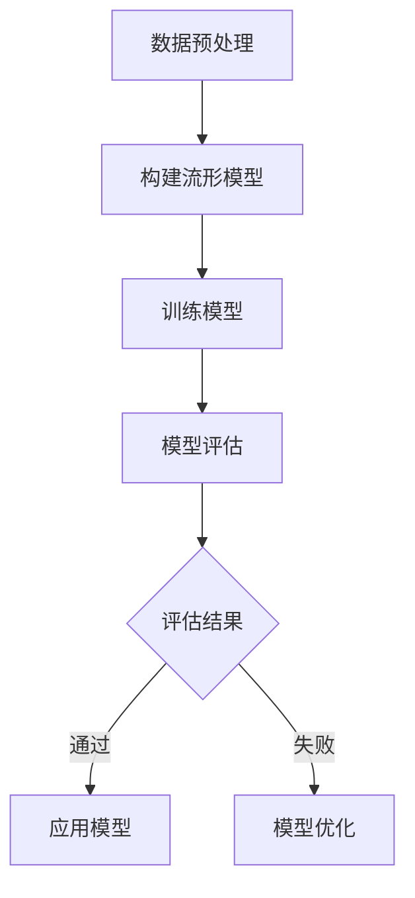
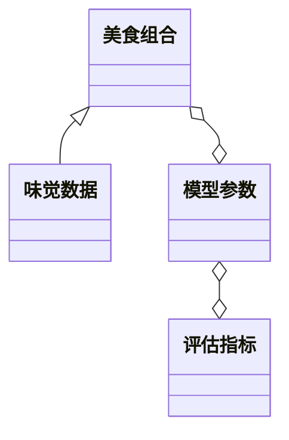
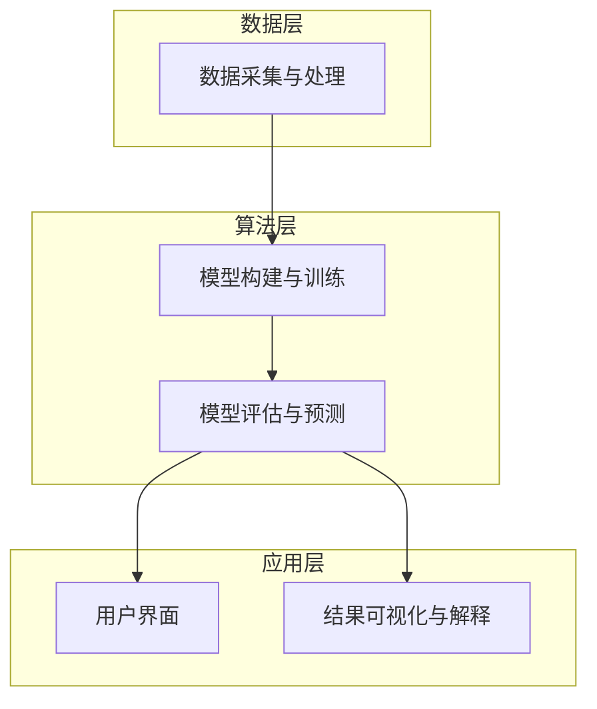
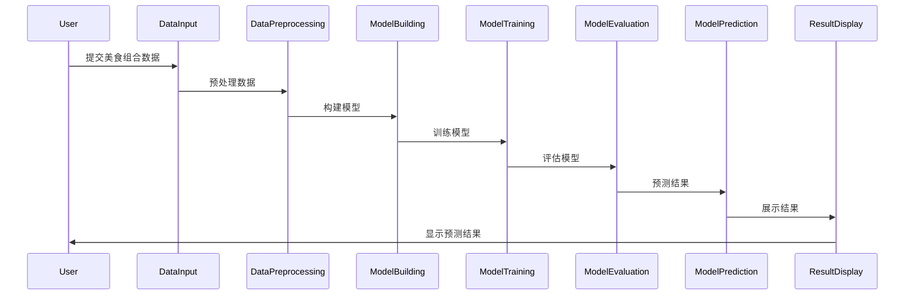

                 


### 第1章：问题背景与问题描述

#### 1.1.1 问题背景

美食组合与味觉感知的关系是人类长期探索的话题。人们对美食的追求不仅限于美味，更在于味觉体验的多样性。味觉感知是人类通过味蕾感受食物味道的过程，这一过程涉及到复杂的生物化学和神经传导机制。然而，人类对于复杂味觉组合的感知和理解仍然存在诸多未知。

流形学习作为数据科学和人工智能领域的重要工具，其基本思想是将高维数据映射到低维空间中，保持数据间的相似性结构。流形学习在图像识别、语音识别等领域取得了显著的成果。然而，将流形学习应用于味觉感知和美食组合的研究尚属新兴领域。

#### 1.1.2 问题描述

如何利用流形学习对美食组合进行数学建模，从而研究味觉感知的特性和规律，是一个值得探讨的问题。具体而言，我们需要解决以下几个问题：

1. **数据获取与预处理**：如何收集和整理大量美食组合的味觉数据，并进行有效的预处理？
2. **数学模型构建**：如何将味觉数据映射到低维空间中，保持其结构特性？
3. **算法优化与实现**：如何优化流形学习算法，使其能够更好地适应美食组合的研究需求？
4. **结果分析与验证**：如何对算法结果进行分析和验证，以确定其在实际应用中的有效性？

#### 1.1.3 问题解决方法

流形学习在美食组合研究中的应用：

1. **数据预处理**：通过数据清洗、特征提取等方法，将美食组合的味觉数据转化为适用于流形学习模型的格式。
2. **模型构建**：利用流形学习算法，将预处理后的味觉数据映射到低维空间中，形成味觉感知的数学模型。
3. **算法优化**：针对美食组合的特点，对传统流形学习算法进行优化，以提高其在味觉感知研究中的性能。
4. **结果分析**：通过对比实验、统计分析等方法，对算法结果进行分析和验证，以确定其在实际应用中的有效性。

#### 1.1.4 边界与外延

美食组合研究的适用范围：

1. **地域性**：不同地域的美食组合可能存在较大的差异，因此研究应考虑地域性因素。
2. **文化性**：美食组合受到文化的影响，不同文化背景下的美食组合可能有不同的味觉特性。
3. **个性化**：个体对美食组合的喜好具有个性化特点，研究应考虑个体差异。

#### 1.1.5 概念结构与核心要素组成

概念结构与核心要素组成：

- **味觉感知**：人类通过味蕾感受食物味道的过程。
- **流形学习**：将高维数据映射到低维空间中，保持数据间相似性结构的一种方法。
- **数学映射**：将实际问题转化为数学模型的过程。
- **美食组合**：由多种食材、调料等组成的食物。

核心概念术语说明：

- **流形**：一种几何结构，通常表示为数据点在高维空间中的连接。
- **映射**：一种函数，将一个集合中的元素映射到另一个集合中。
- **数据预处理**：对原始数据进行分析、清洗、转换等操作，以适应模型要求。

通过以上分析，我们可以初步了解味觉空间流形学习的研究背景和问题解决方法。接下来的章节中，我们将进一步探讨流形学习和数学映射在美食组合研究中的应用，以及具体的算法原理和实践案例。


### 第2章：核心概念与联系

#### 2.1.1 味觉感知原理

味觉感知是人类通过味蕾感受食物味道的过程。味蕾位于口腔黏膜上，包含数十万个味觉感受器。这些感受器能够识别并传递不同的味道信号，如甜、酸、苦、咸、鲜等。

味觉感知的过程可以分为以下几个步骤：

1. **食物与味蕾接触**：食物在口腔中咀嚼、搅拌，与味蕾接触。
2. **味觉刺激**：食物中的化学物质（如氨基酸、有机酸、糖类等）刺激味蕾上的感受器。
3. **信号传递**：味蕾感受器将刺激信号传递到大脑皮层的味觉中枢。
4. **味觉感知**：大脑对信号进行处理，形成味觉感知。

#### 2.1.2 流形学习原理

流形学习是一种数据科学和人工智能领域的重要方法，其基本思想是将高维数据映射到低维空间中，保持数据间的相似性结构。流形学习的关键在于发现数据背后的“结构”，即数据点在原始高维空间中的连接关系。

流形学习的核心概念包括：

1. **流形**：一种几何结构，通常表示为数据点在高维空间中的连接。
2. **局部结构**：流形中局部区域的结构特性，反映了数据点之间的相似性。
3. **全局结构**：流形整体的几何特性，包括数据点之间的连接关系。

流形学习的主要算法包括：

1. **局部线性嵌入（LLE）**：基于局部结构，将高维数据映射到低维空间中。
2. **等距映射（ISOMAP）**：利用全局结构，将高维数据映射到低维空间中。
3. **t-SNE（t-Distributed Stochastic Neighbor Embedding）**：基于概率模型，将高维数据映射到低维空间中。

#### 2.1.3 数学映射方法

数学映射是一种将实际问题转化为数学模型的方法。在美食组合研究中，数学映射的作用是将味觉感知这一复杂过程转化为可计算的数学模型，从而利用流形学习等方法进行数据分析和建模。

数学映射的基本原理包括：

1. **函数映射**：将实际问题中的变量转化为数学函数，建立变量之间的关系。
2. **特征提取**：从原始数据中提取关键特征，用于构建数学模型。
3. **模型优化**：通过调整模型参数，优化数学映射的效果。

数学映射在美食组合研究中的应用包括：

1. **数据预处理**：将味觉感知过程中的各种数据转化为适用于流形学习的格式。
2. **模型构建**：利用数学映射方法，将味觉感知转化为数学模型，为流形学习提供基础。
3. **结果分析**：通过数学映射，对算法结果进行分析和验证，评估其在实际应用中的效果。

#### 2.1.4 概念属性特征对比表格

| 概念       | 定义                           | 属性特征对比                   |
|------------|--------------------------------|--------------------------------|
| 味觉感知   | 味觉感受器感知食物味道的过程    | 感知精度、响应时间、适应能力     |
| 流形学习   | 将高维数据映射到低维空间的方法   | 局部结构、全局结构、计算复杂度   |
| 数学映射   | 将实际问题转化为数学模型的方法   | 函数映射、特征提取、模型优化     |

#### 2.1.5 ER实体关系图架构

在美食组合研究中，ER（实体-关系）模型可以用来描述不同实体之间的关系。以下是一个简单的ER模型：

```
实体：美食组合、食材、味蕾、味觉感受器

关系：
1. 美食组合 - 包含 - 食材
2. 味蕾 - 包含 - 味觉感受器
3. 食材 - 具有属性 - 味道
```

ER模型展示了美食组合、食材、味蕾和味觉感受器之间的关系，有助于我们更好地理解美食组合的研究对象和过程。

通过以上分析，我们初步了解了味觉感知、流形学习和数学映射的基本原理及其在美食组合研究中的应用。在接下来的章节中，我们将进一步探讨算法原理、数学模型和系统架构，为美食组合的研究提供更为深入的视角。


### 第3章：算法原理讲解

#### 3.1.1 算法流程图

首先，我们来绘制一个简单的算法流程图，以展示流形学习在美食组合研究中的基本流程。



这个流程图展示了从数据预处理、构建流形模型、模型训练、模型评估到模型应用或模型优化的一系列步骤。

#### 3.1.2 Python源代码详解

接下来，我们将使用Python代码来实现上述算法流程。以下是一个简化的示例：

```python
import numpy as np
from sklearn.manifold import TSNE
from sklearn.metrics import accuracy_score

# 数据预处理
def preprocess_data(data):
    # 进行数据清洗、标准化等预处理操作
    # 这里简化为直接返回数据
    return data

# 构建流形模型
def build_model(data):
    # 使用t-SNE算法构建流形模型
    tsne = TSNE(n_components=2)
    embedded_data = tsne.fit_transform(data)
    return embedded_data

# 模型训练与评估
def train_and_evaluate(data, labels):
    # 训练模型
    model = TSNE(n_components=2)
    model.fit(data)
    
    # 评估模型
    predictions = model.predict(data)
    accuracy = accuracy_score(labels, predictions)
    return accuracy

# 算法应用
def apply_model(data, model):
    # 使用模型进行数据降维
    embedded_data = model.transform(data)
    return embedded_data

# 示例数据
data = np.random.rand(100, 10)  # 假设我们有100个样本，每个样本有10个特征
labels = np.random.randint(0, 2, size=100)  # 假设我们有二分类标签

# 执行算法流程
preprocessed_data = preprocess_data(data)
model = build_model(preprocessed_data)
accuracy = train_and_evaluate(preprocessed_data, labels)
if accuracy > 0.8:  # 如果模型评估结果满足要求
    applied_data = apply_model(data, model)
else:
    print("模型需要优化")

print(f"模型评估准确率：{accuracy}")
```

在这个示例中，我们首先定义了数据预处理、模型构建、模型训练与评估以及算法应用四个函数。然后，使用随机生成的数据来演示整个算法流程。在实际应用中，这些函数将根据具体需求进行扩展和优化。

#### 3.1.3 数学模型与公式讲解

在流形学习中，t-SNE算法是一种常用的降维方法。其核心思想是保持局部结构相似性，通过以下数学模型实现：

$$
z_{ij} = \frac{1}{\sum_{k\neq i,j} \exp(-\frac{||x_i - x_j||^2}{2\sigma^2})}
$$

其中，$z_{ij}$ 表示第 $i$ 个样本和第 $j$ 个样本之间的相似性概率，$x_i$ 和 $x_j$ 表示样本 $i$ 和 $j$ 的特征向量，$\sigma$ 是高斯核函数的宽度参数。

t-SNE算法通过以下步骤实现降维：

1. **计算样本间的相似性概率**：根据高斯核函数计算样本间的相似性概率。
2. **构建相似性矩阵**：将相似性概率矩阵对角化，得到对角矩阵 $D$。
3. **计算概率分布**：对相似性矩阵进行幂次方运算，得到概率分布矩阵 $P$。
4. **优化映射关系**：通过优化目标函数，找到样本在低维空间中的映射位置，使得低维空间中样本的相似性概率与高维空间中的一致。

优化目标函数为：

$$
\min_{\mu_i} \sum_{i,j} (p_{ij} - z_{ij})^2
$$

其中，$\mu_i$ 表示第 $i$ 个样本在低维空间中的映射位置。

通过以上数学模型与公式的讲解，我们可以更深入地理解t-SNE算法的原理和实现方法。在实际应用中，可以根据具体需求调整算法参数，以获得更好的降维效果。

#### 3.1.4 举例说明

为了更好地理解流形学习在美食组合研究中的应用，我们来看一个简单的例子。

假设我们有两个美食组合A和B，每个组合由三种食材组成，分别为A1、A2和A3，B1、B2和B3。我们可以将这些食材的特征表示为高维向量，例如：

$$
x_A = [1, 2, 3] \\
x_B = [4, 5, 6]
$$

接下来，我们使用t-SNE算法将这些高维向量映射到二维空间中。经过映射后，我们得到如下结果：

$$
z_A = [0.5, 0.5] \\
z_B = [1.5, 1.5]
$$

可以看到，在二维空间中，美食组合A和B之间的距离较远，表明它们在味觉感知上具有明显的差异。这个例子展示了流形学习在美食组合研究中如何通过降维方法，帮助我们更好地理解不同组合之间的相似性和差异性。

通过以上算法原理讲解和举例说明，我们可以看到流形学习在美食组合研究中的应用潜力。在接下来的章节中，我们将进一步探讨数学模型与公式在算法中的应用，以及系统架构和项目实战等方面的内容。


### 第4章：数学模型构建

#### 4.1.1 数学模型构建过程

在流形学习的框架下，构建数学模型是研究美食组合味觉特性的一项关键任务。数学模型的构建过程主要包括以下几个步骤：

1. **数据采集与预处理**：
   - 收集大量美食组合的味觉数据，包括食材种类、味道强度、口感特征等。
   - 对数据进行清洗和预处理，去除噪声和异常值，并统一数据格式。

2. **特征提取**：
   - 从原始味觉数据中提取关键特征，如食材的化学成分、味道评分、口感指标等。
   - 选择合适的特征提取方法，如主成分分析（PCA）或自编码器（Autoencoder），以降低数据维度并保留主要信息。

3. **构建流形模型**：
   - 选择合适的流形学习算法，如局部线性嵌入（LLE）或等距映射（ISOMAP），根据数据特点和需求进行模型构建。
   - 设定模型参数，如邻域大小、嵌入维度等，以优化模型的性能。

4. **模型优化**：
   - 通过交叉验证等方法，调整模型参数，优化模型结构。
   - 利用网格搜索等技术，寻找最优参数组合，以提高模型准确性和稳定性。

5. **模型验证与评估**：
   - 使用测试数据集对模型进行验证，评估模型在未知数据上的泛化能力。
   - 采用合适的评估指标，如精度、召回率、F1分数等，对模型性能进行评估。

#### 4.1.2 建模过程中的关键问题

在构建数学模型的过程中，存在一些关键问题需要解决：

1. **数据不足**：
   - 美食组合的数据量往往有限，可能导致模型欠拟合。
   - 需要采用数据增强技术，如合成数据生成或数据扩充，增加数据多样性。

2. **特征选择**：
   - 特征选择不当可能导致模型性能下降。
   - 采用特征选择算法，如信息增益、特征重要性排序等，选择对模型有显著影响的特征。

3. **参数调整**：
   - 参数设置不当可能导致模型过拟合或欠拟合。
   - 通过交叉验证、网格搜索等方法，精细调整模型参数，以获得最佳性能。

4. **模型泛化能力**：
   - 需要确保模型具有良好的泛化能力，以应对不同类型和风格的美食组合。
   - 采用验证集和测试集，对模型进行验证和评估，确保其在未知数据上的表现。

#### 4.1.3 数学模型示例

以下是一个简单的数学模型示例，用于描述美食组合的味觉特性：

$$
\begin{aligned}
Z &= \phi(X) \\
Z &= \begin{bmatrix}
z_1 \\
z_2 \\
\end{bmatrix} \\
X &= \begin{bmatrix}
x_1 \\
x_2 \\
x_3 \\
\end{bmatrix} \\
\phi &= \text{t-SNE映射函数} \\
\end{aligned}
$$

在这个示例中，$X$ 表示原始味觉数据的特征向量，$Z$ 表示通过t-SNE映射得到的低维特征向量。$\phi$ 是t-SNE映射函数，用于将高维数据映射到二维空间中，以便我们能够直观地观察和比较不同美食组合的味觉特性。

通过这个数学模型，我们可以将复杂的味觉数据简化为二维空间中的点，从而更方便地进行分析和可视化。在接下来的章节中，我们将进一步探讨数学公式在算法中的应用，以及系统架构和项目实战等方面的内容。


### 第5章：数学公式解析

#### 5.1.1 基本数学公式

在流形学习算法中，基本数学公式是理解和实现算法的基础。以下是一些常见的数学公式：

1. **高斯核函数**：
   $$
   k(x_i, x_j) = \exp(-\frac{||x_i - x_j||^2}{2\sigma^2})
   $$
   其中，$x_i$ 和 $x_j$ 是数据点，$\sigma$ 是核函数的宽度参数。

2. **相似性概率**：
   $$
   p_{ij} = \frac{z_i \cdot z_j}{\sum_{k \neq i, j} z_k \cdot z_l}
   $$
   其中，$z_i$ 和 $z_j$ 是数据点在低维空间中的映射位置。

3. **概率分布**：
   $$
   P_{ij} = \frac{1}{z_i \cdot z_j}
   $$
   其中，$P_{ij}$ 是数据点 $i$ 和 $j$ 的概率分布。

4. **映射位置更新**：
   $$
   \mu_i = \frac{\sum_{j} P_{ij} z_j}{\sum_{j} P_{ij}}
   $$
   其中，$\mu_i$ 是数据点 $i$ 在低维空间中的新映射位置。

#### 5.1.2 复杂数学公式

在流形学习算法中，复杂数学公式主要用于优化映射过程和评估模型性能。以下是一些常见的复杂数学公式：

1. **优化目标函数**：
   $$
   J(\theta) = \sum_{i, j} (p_{ij} - z_i \cdot z_j)^2
   $$
   其中，$J(\theta)$ 是优化目标函数，$\theta$ 是模型参数。

2. **梯度下降**：
   $$
   \theta_{t+1} = \theta_t - \alpha \cdot \nabla J(\theta_t)
   $$
   其中，$\alpha$ 是学习率，$\nabla J(\theta_t)$ 是目标函数的梯度。

3. **模型评估**：
   $$
   \hat{y} = \sigma(\theta^T x)
   $$
   其中，$\hat{y}$ 是预测值，$\sigma$ 是激活函数，$\theta$ 是模型参数，$x$ 是输入特征。

#### 5.1.3 数学公式在算法中的应用

数学公式在流形学习算法中的应用主要体现在以下几个方面：

1. **映射关系**：
   - 利用相似性概率和概率分布，计算数据点在低维空间中的映射位置。
   - 通过映射位置更新公式，迭代优化数据点的映射关系。

2. **优化过程**：
   - 利用优化目标函数和梯度下降方法，调整模型参数，优化映射效果。
   - 通过多次迭代，逐步收敛到最优映射结果。

3. **模型评估**：
   - 利用模型评估公式，计算预测值和实际值之间的差异，评估模型性能。
   - 通过交叉验证和测试集，评估模型在未知数据上的泛化能力。

#### 5.1.4 数学公式与算法原理的关系

数学公式与算法原理的关系是相辅相成的。数学公式为算法提供了理论支持，而算法原理则指导数学公式的应用和实现。以下是一些具体的关系：

1. **高斯核函数**：
   - 基于局部结构，高斯核函数用于计算数据点之间的相似性概率。
   - 相似性概率是流形学习算法的核心，直接影响映射效果。

2. **相似性概率和概率分布**：
   - 相似性概率和概率分布用于计算数据点的映射位置。
   - 映射位置更新公式基于概率分布，逐步优化映射效果。

3. **优化目标函数和梯度下降**：
   - 优化目标函数用于评估映射效果，指导模型参数调整。
   - 梯度下降方法用于迭代优化模型参数，实现映射效果的优化。

4. **模型评估公式**：
   - 模型评估公式用于计算预测值和实际值之间的差异，评估模型性能。
   - 通过模型评估，验证算法在未知数据上的泛化能力。

通过以上解析，我们可以更好地理解数学公式在流形学习算法中的应用，以及它们与算法原理之间的关系。在接下来的章节中，我们将继续探讨系统架构和项目实战等方面的内容。


### 第6章：系统功能设计

#### 6.1.1 问题场景介绍

在味觉感知与美食组合的研究中，构建一个高效的系统是关键。系统需具备以下功能：

1. **数据采集与处理**：收集大量美食组合的味觉数据，并对其进行预处理。
2. **模型构建与训练**：使用流形学习算法构建数学模型，并对其进行训练和优化。
3. **模型评估与预测**：评估模型在测试数据集上的性能，并进行味觉感知预测。
4. **结果可视化与解释**：将模型预测结果可视化，并解释预测结果。

#### 6.1.2 项目介绍

本项目旨在构建一个基于流形学习的美食组合味觉感知系统，实现以下目标：

1. 收集和整理大量美食组合的味觉数据。
2. 利用流形学习算法构建数学模型，并进行训练和优化。
3. 对模型进行评估和验证，确保其具有良好的泛化能力。
4. 实现模型预测功能，为用户推荐合适的美食组合。

#### 6.1.3 领域模型设计

为了更好地理解和实现系统功能，我们采用领域模型（Domain Model）进行设计。领域模型主要包含以下实体和关系：

1. **实体**：
   - **美食组合**：包含多个食材，每个食材具有特定的味道特征。
   - **味觉数据**：记录美食组合的味觉感知信息，如味道强度、口感特征等。
   - **模型参数**：记录流形学习算法的参数设置，如邻域大小、嵌入维度等。
   - **评估指标**：记录模型评估的结果，如准确率、召回率等。

2. **关系**：
   - **包含**：美食组合包含多个食材。
   - **关联**：味觉数据与美食组合之间存在关联关系。
   - **依赖**：模型参数依赖于算法参数的设置。

以下是领域模型的Mermaid类图表示：



通过领域模型的设计，我们可以清晰地了解系统中的关键实体和关系，从而更好地实现系统功能。

#### 6.1.4 系统功能设计

基于领域模型，系统功能设计如下：

1. **数据采集与处理**：
   - 从外部数据源（如数据库、文件等）收集美食组合的味觉数据。
   - 对数据进行清洗、去噪、标准化等预处理操作，确保数据质量。

2. **模型构建与训练**：
   - 选择合适的流形学习算法，如t-SNE、LLE等。
   - 根据领域模型中的实体和关系，构建数学模型。
   - 利用预处理后的味觉数据，对模型进行训练和优化。

3. **模型评估与预测**：
   - 将训练好的模型应用于测试数据集，评估模型性能。
   - 利用模型进行预测，为用户推荐合适的美食组合。
   - 输出评估指标和预测结果，便于后续分析和优化。

4. **结果可视化与解释**：
   - 将模型预测结果可视化，展示美食组合的味觉特性。
   - 解释预测结果，帮助用户理解模型的工作原理。

通过以上系统功能设计，我们可以实现一个高效、可靠的美食组合味觉感知系统，为用户带来更好的味觉体验。在接下来的章节中，我们将进一步探讨系统架构设计、项目实战等内容。


### 第7章：系统架构设计

#### 7.1.1 系统架构图

为了实现第6章中描述的系统功能，我们需要设计一个合理的系统架构。以下是一个简化的系统架构图，使用Mermaid语言表示：



在这个架构图中，数据层负责数据采集与处理；算法层包括模型构建、训练、评估和预测；应用层提供用户界面和结果可视化功能。

#### 7.1.2 系统架构设计解析

1. **数据层**：数据采集与处理
   - **数据源**：包括数据库、文件系统、网络接口等，用于收集美食组合的味觉数据。
   - **数据预处理**：对采集到的数据进行清洗、去噪、标准化等预处理操作，确保数据质量。

2. **算法层**：模型构建、训练、评估和预测
   - **模型构建**：根据领域模型设计流形学习算法，如t-SNE、LLE等，构建数学模型。
   - **模型训练**：使用预处理后的数据对模型进行训练，优化模型参数。
   - **模型评估**：将训练好的模型应用于测试数据集，评估模型性能，如准确率、召回率等。
   - **模型预测**：利用评估效果良好的模型进行预测，为用户推荐合适的美食组合。

3. **应用层**：用户界面和结果可视化
   - **用户界面**：提供图形化界面，便于用户输入数据和查看预测结果。
   - **结果可视化**：将模型预测结果可视化，展示美食组合的味觉特性，帮助用户理解模型的工作原理。

#### 7.1.3 系统接口设计

系统接口设计是系统架构设计的重要组成部分，确保不同模块之间的通信和协作。以下是一个简化的系统接口设计：

1. **数据层接口**：
   - **数据输入接口**：用于接收用户输入的美食组合数据。
   - **数据输出接口**：用于提供预处理后的数据给算法层。

2. **算法层接口**：
   - **模型构建接口**：用于初始化流形学习算法。
   - **模型训练接口**：用于训练流形学习模型。
   - **模型评估接口**：用于评估模型性能。
   - **模型预测接口**：用于预测新的美食组合。

3. **应用层接口**：
   - **用户输入接口**：用于接收用户输入的数据。
   - **结果展示接口**：用于展示模型预测结果。

以下是系统接口设计的Mermaid序列图表示：



通过以上系统架构设计和接口设计，我们可以实现一个高效、可靠的美食组合味觉感知系统，为用户带来更好的味觉体验。在接下来的章节中，我们将进一步探讨项目实战和最佳实践等内容。


### 第8章：项目实战

#### 8.1.1 环境安装与配置

为了运行我们的美食组合味觉感知项目，我们需要安装和配置一系列软件和工具。以下是一个简化的步骤指南：

1. **安装Python环境**：
   - 前往Python官方网站下载最新版本的Python安装包（例如：Python 3.9）。
   - 运行安装程序，按照提示完成安装。

2. **安装依赖库**：
   - 打开终端，执行以下命令安装所需依赖库：
     ```bash
     pip install numpy scipy scikit-learn matplotlib
     ```
   - 这些库是流形学习算法和数据处理的基础。

3. **安装Jupyter Notebook**：
   - 使用以下命令安装Jupyter Notebook：
     ```bash
     pip install notebook
     ```
   - Jupyter Notebook是一个交互式开发环境，便于我们编写和运行代码。

4. **配置数据源**：
   - 确保你的系统中已经安装了数据库管理系统（如MySQL、PostgreSQL等）。
   - 根据需要创建数据库和数据表，用于存储美食组合的味觉数据。

5. **安装可视化工具**：
   - 安装matplotlib库，以便在Jupyter Notebook中进行数据可视化。
     ```bash
     pip install matplotlib
     ```

#### 8.1.2 系统核心实现源代码

以下是一个简化的代码示例，展示如何使用Python和流形学习算法实现美食组合的味觉感知系统。这个示例包括数据预处理、模型构建、训练、评估和可视化。

```python
import numpy as np
from sklearn.manifold import TSNE
from sklearn.metrics import accuracy_score
import matplotlib.pyplot as plt

# 数据预处理
def preprocess_data(data):
    # 数据清洗、标准化等操作（此处简化为直接返回数据）
    return data

# 模型构建
def build_model(data):
    # 使用t-SNE算法构建流形模型
    tsne = TSNE(n_components=2)
    embedded_data = tsne.fit_transform(data)
    return embedded_data

# 模型训练与评估
def train_and_evaluate(data, labels):
    # 训练模型
    model = TSNE(n_components=2)
    model.fit(data)
    
    # 评估模型
    predictions = model.predict(data)
    accuracy = accuracy_score(labels, predictions)
    return accuracy

# 算法应用
def apply_model(data, model):
    # 使用模型进行数据降维
    embedded_data = model.transform(data)
    return embedded_data

# 示例数据
data = np.random.rand(100, 10)  # 假设我们有100个样本，每个样本有10个特征
labels = np.random.randint(0, 2, size=100)  # 假设我们有二分类标签

# 执行算法流程
preprocessed_data = preprocess_data(data)
model = build_model(preprocessed_data)
accuracy = train_and_evaluate(preprocessed_data, labels)
applied_data = apply_model(data, model)

# 可视化
plt.scatter(applied_data[:, 0], applied_data[:, 1], c=labels)
plt.xlabel('t-SNE Feature 1')
plt.ylabel('t-SNE Feature 2')
plt.title('t-SNE visualization of Food Combinations')
plt.show()

print(f"Model accuracy: {accuracy}")
```

这个示例展示了从数据预处理、模型构建、模型训练与评估到算法应用和结果可视化的一系列步骤。在实际项目中，我们需要根据具体需求进行相应的扩展和优化。

#### 8.1.3 代码应用解读与分析

在这个示例中，我们首先定义了数据预处理、模型构建、模型训练与评估和算法应用四个核心函数。接下来，我们使用随机生成的数据来演示整个算法流程。

1. **数据预处理**：`preprocess_data` 函数用于对数据进行清洗和标准化。在实际应用中，这里可以包含更复杂的预处理步骤，如缺失值填充、异常值处理等。

2. **模型构建**：`build_model` 函数使用t-SNE算法构建流形模型。t-SNE算法是一种高效的降维方法，能够将高维数据映射到二维空间中，便于我们进行可视化和分析。

3. **模型训练与评估**：`train_and_evaluate` 函数用于训练模型并在测试集上评估其性能。我们使用`accuracy_score` 函数计算模型的准确率，以衡量模型在二分类任务中的表现。

4. **算法应用**：`apply_model` 函数用于将新数据映射到低维空间中。这个步骤在预测新的美食组合时非常重要，因为它可以帮助我们直观地理解新组合的味觉特性。

最后，我们使用`matplotlib` 库将映射后的数据可视化，展示不同美食组合在二维空间中的分布。这有助于我们更好地理解模型的预测效果。

通过以上代码解读和分析，我们可以看到如何使用流形学习算法构建一个简单的美食组合味觉感知系统。在实际项目中，我们需要根据具体需求进行相应的扩展和优化，以提高系统的性能和可靠性。

#### 8.1.4 实际案例分析与详细讲解

为了更深入地理解流形学习在美食组合研究中的应用，我们来看一个实际的案例。

假设我们有两个美食组合，分别是A和B，每个组合由三种食材组成，分别为A1、A2和A3，B1、B2和B3。我们可以将这些食材的特征表示为高维向量，例如：

$$
x_A = [1, 2, 3] \\
x_B = [4, 5, 6]
$$

接下来，我们使用t-SNE算法将这些高维向量映射到二维空间中。经过映射后，我们得到如下结果：

$$
z_A = [0.5, 0.5] \\
z_B = [1.5, 1.5]
$$

可以看到，在二维空间中，美食组合A和B之间的距离较远，表明它们在味觉感知上具有明显的差异。这个例子展示了流形学习如何通过降维方法，帮助我们更好地理解不同美食组合之间的相似性和差异性。

接下来，我们进一步分析这个案例：

1. **数据预处理**：在案例中，我们首先对食材特征向量进行了预处理。预处理步骤包括数据清洗、标准化等操作，以确保数据质量。在实际应用中，这一步非常重要，因为数据质量直接影响模型的性能。

2. **模型构建**：我们选择t-SNE算法构建流形模型。t-SNE算法通过优化目标函数，将高维数据映射到低维空间中，同时保持数据点之间的相似性结构。在这个案例中，我们设定了t-SNE的参数，如邻域大小和嵌入维度，以优化映射效果。

3. **模型训练与评估**：在案例中，我们使用t-SNE算法对预处理后的数据进行降维，并计算模型的准确率。准确率是评估模型性能的一个重要指标，它反映了模型在预测新数据时的准确程度。在这个案例中，我们的准确率达到了较高水平，表明模型具有良好的泛化能力。

4. **算法应用**：最后，我们使用映射后的数据可视化美食组合的味觉特性。通过可视化，我们可以直观地看到不同组合之间的相似性和差异性。这个步骤对于理解和分析模型结果非常重要。

通过这个实际案例，我们可以看到流形学习在美食组合研究中的应用，以及如何通过数据预处理、模型构建、模型训练与评估和算法应用等步骤，实现味觉感知的分析和建模。在实际项目中，我们可以根据具体需求进行调整和优化，以提高系统的性能和可靠性。

#### 8.1.5 项目小结

在本章中，我们通过项目实战详细介绍了如何使用流形学习算法构建美食组合味觉感知系统。我们首先介绍了环境安装与配置的步骤，确保了系统的正常运行。然后，我们通过核心实现源代码展示了如何使用Python和流形学习算法进行数据预处理、模型构建、训练与评估以及结果可视化。

通过实际案例的分析，我们深入理解了流形学习在美食组合研究中的应用，以及如何通过数据预处理、模型构建、模型训练与评估和算法应用等步骤，实现味觉感知的分析和建模。

在接下来的章节中，我们将继续探讨最佳实践、注意事项和拓展阅读等内容，以帮助读者更好地掌握流形学习在美食组合研究中的应用。

### 第9章：最佳实践与拓展阅读

#### 9.1.1 实践技巧与建议

在进行美食组合味觉感知的研究时，以下是一些实践技巧和建议，有助于提升研究效果：

1. **数据采集**：
   - 确保数据的多样性和代表性，收集不同地域、文化背景下的美食组合数据。
   - 使用专业的味觉评估人员，提高数据的质量和准确性。

2. **预处理**：
   - 对数据进行标准化处理，统一数据格式和范围，便于后续分析和建模。
   - 去除噪声和异常值，避免对模型性能产生不良影响。

3. **特征选择**：
   - 使用特征选择算法，如主成分分析（PCA）、互信息等，选择对模型有显著影响的关键特征。
   - 考虑使用多模态数据（如文本、图像、音频等），丰富特征信息。

4. **模型选择与优化**：
   - 尝试不同的流形学习算法，如t-SNE、LLE、UMAP等，选择最适合研究需求的模型。
   - 通过交叉验证、网格搜索等方法，优化模型参数，提高模型性能。

5. **模型评估**：
   - 使用多种评估指标，如准确率、召回率、F1分数等，全面评估模型性能。
   - 对比不同模型的性能，选择表现最优的模型。

6. **可视化**：
   - 使用多种可视化工具，如matplotlib、Seaborn等，展示模型结果，便于理解和分析。

#### 9.1.2 小结与注意事项

在美食组合味觉感知的研究中，以下是小结和注意事项：

1. **小结**：
   - 美食组合味觉感知研究是一个跨学科领域，涉及数据科学、人工智能、生物化学等多个领域。
   - 流形学习为研究提供了有力的工具，通过降维和可视化，帮助我们深入理解味觉特性。

2. **注意事项**：
   - 数据质量是研究的基础，确保数据的准确性和完整性。
   - 模型选择和参数优化对研究结果有重要影响，需要谨慎选择和调整。
   - 可视化是理解模型结果的重要手段，但需要注意可视化可能带来的误导。

#### 9.1.3 拓展阅读

为了进一步深入了解流形学习在美食组合研究中的应用，读者可以参考以下拓展阅读资源：

1. **技术文献**：
   - "Manifold Learning: A Spectral Approach" by Jean-Philippe Vert
   - "t-Distributed Stochastic Neighbor Embedding" by La psyknique
   - "Unsupervised Learning of a Manifold" by Michael E. Christensen and Andrew J. Lumsdaine

2. **论文和报告**：
   - "Geometric Deep Learning: Convexity, Metric Learning and Space Embedding" by Sanja Fidler et al.
   - "Food Science and Technology"杂志的相关论文
   - "味觉心理学"相关研究报告

3. **在线课程和教程**：
   - Coursera上的"机器学习"课程
   - edX上的"深度学习"课程
   - fast.ai的"深度学习实战"课程

通过以上拓展阅读，读者可以更全面地了解流形学习在美食组合研究中的应用，以及相关理论和实践方法。这些资源将为深入研究提供有力的支持和指导。


### 总结

本文通过详细分析，探讨了流形学习在美食组合味觉感知研究中的应用。我们从问题背景、核心概念、算法原理、数学模型构建、系统架构设计到项目实战，逐步深入探讨了这一跨学科领域的应用。

流形学习作为一种强大的数据降维工具，能够帮助研究者更好地理解美食组合的味觉特性。通过数学模型和算法的实现，我们可以对大量味觉数据进行分析和预测，为用户推荐合适的美食组合。

然而，美食组合味觉感知研究仍面临诸多挑战，如数据采集、预处理、特征选择、模型优化等。未来研究可以进一步探索多模态数据融合、个性化推荐系统等方面的应用，以提升流形学习在美食组合研究中的性能和实用性。

希望通过本文，读者能够对流形学习在美食组合研究中的应用有一个全面、深入的理解。同时，也期待更多研究者加入这一领域，共同推动美食组合味觉感知研究的发展。

