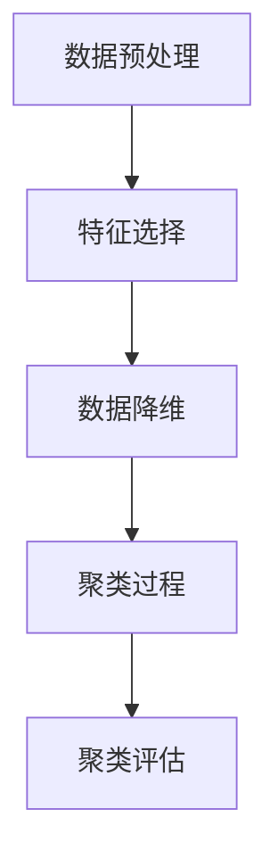
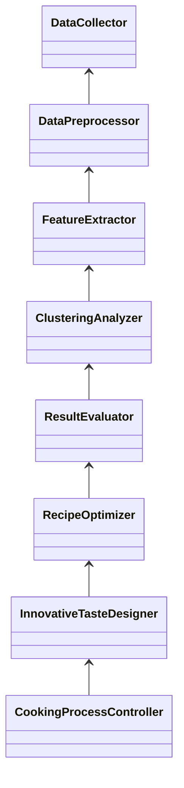
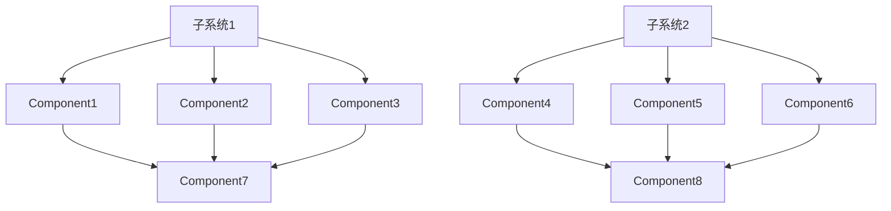
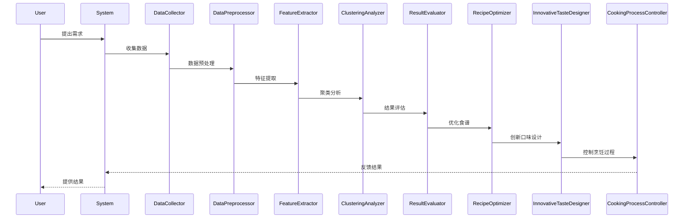

                 

### 文章标题

# 味觉组合的高维聚类：美食创新的数学指导

> 关键词：味觉组合、高维聚类、数学模型、美食创新、算法应用

> 摘要：本文将深入探讨味觉组合与高维聚类之间的联系，介绍数学模型在美食创新中的应用，通过详细的算法原理讲解和实战案例展示，为读者提供一套系统化的美食创新指导。

---

### 第一部分：背景介绍

#### 1. 味觉组合概述

### 1.1 问题背景

#### 1.1.1 味觉组合的重要性

在人类饮食文化中，味觉组合一直扮演着至关重要的角色。通过巧妙的味觉组合，我们可以创造出丰富多样的美食，满足不同人群的口味需求。然而，在传统的味觉组合中，往往依赖于经验和直觉，缺乏系统性的方法指导。因此，如何将数学模型应用于味觉组合，提升美食创新的效率和质量，成为了一个亟待解决的问题。

#### 1.1.2 味觉组合的研究现状

目前，味觉组合的研究主要集中在以下几个方面：

1. **传统味觉组合理论**：基于经验和直觉，通过试错法来创造新的味觉组合。
2. **味觉感知研究**：通过心理学和生理学的研究，探索味觉感知的机制和规律。
3. **数据分析方法**：运用统计学和机器学习方法，对大量味觉数据进行分析，寻找潜在的味觉组合规律。

然而，这些方法在解决实际问题时仍然存在一定的局限性。因此，引入数学模型和高维聚类算法，为味觉组合提供更为科学的指导，具有重要的研究价值和实际意义。

### 1.2 味觉组合的定义与特性

#### 1.2.1 味觉组合的定义

味觉组合指的是将两种或两种以上的食材、调料或食物按照特定的比例和顺序搭配在一起，形成一种新的口味体验。这种组合不仅要求各个组成部分的味觉特性能够相互协调，还要在整体上创造出独特的味觉体验。

#### 1.2.2 味觉组合的特性

1. **多样性**：味觉组合可以创造出丰富多样的口味，满足不同人群的口味需求。
2. **层次感**：通过巧妙的搭配，味觉组合可以在口中形成层次分明的味觉体验。
3. **创新性**：味觉组合可以激发创造力，创造出前所未有的美食体验。
4. **实用性**：在实际烹饪过程中，味觉组合可以为厨师提供一种系统化的创作方法，提高烹饪效率。

### 1.3 高维聚类简介

#### 1.3.1 高维聚类的概念

高维聚类是一种用于处理高维数据集的聚类方法，它通过将高维数据映射到低维空间，使得原本难以分辨的数据点在低维空间中变得更加清晰。高维聚类在数据挖掘、模式识别等领域有着广泛的应用。

#### 1.3.2 高维聚类的方法

高维聚类的常见方法包括：

1. **基于距离的聚类**：通过计算数据点之间的距离来进行聚类。
2. **基于密度的聚类**：通过检测高密度区域来进行聚类。
3. **基于模型的聚类**：通过建立数学模型来进行聚类。

这些方法在高维空间中处理味觉数据时，可以有效地发现潜在的味觉组合规律。

### 1.4 数学在美食创新中的应用

#### 1.4.1 数学在味觉组合中的作用

数学在味觉组合中的应用主要体现在以下几个方面：

1. **数据分析**：通过数学方法对味觉数据进行分析，发现潜在的味觉组合规律。
2. **模型建立**：通过建立数学模型，对味觉组合进行预测和优化。
3. **算法应用**：运用高维聚类等算法，为味觉组合提供科学指导。

#### 1.4.2 数学模型在美食创新中的应用

数学模型在美食创新中的应用主要体现在以下几个方面：

1. **食谱优化**：通过数学模型对食谱进行优化，提高美食的营养价值和口感。
2. **创新口味设计**：通过数学模型预测和创新新的口味组合。
3. **烹饪过程控制**：通过数学模型对烹饪过程进行控制，确保美食的稳定性和一致性。

### 1.5 本章小结

本章介绍了味觉组合、高维聚类以及数学在美食创新中的应用。味觉组合在饮食文化中具有重要地位，但传统的味觉组合方法缺乏系统化指导。高维聚类作为一种处理高维数据的方法，可以应用于味觉组合的研究。数学模型则为味觉组合提供了一种科学的分析方法。接下来，我们将进一步探讨味觉组合与高维聚类的联系，以及如何运用数学模型来解决美食创新中的问题。

---

### 第二部分：核心概念与联系

#### 2. 味觉组合的高维聚类分析

##### 2.1 核心概念

在探讨味觉组合与高维聚类的联系之前，我们需要先明确一些核心概念。

#### 2.1.1 味觉感知的数学模型

味觉感知的数学模型是一种用来描述味觉感知过程的数学模型。它通常包括以下几个方面：

1. **味觉信号传递模型**：描述味觉信号从味蕾传递到大脑的过程。
2. **味觉感知模型**：描述味觉感知如何影响食物的口感和偏好。
3. **味觉记忆模型**：描述味觉记忆的形成和存储过程。

#### 2.1.2 高维数据与味觉感知

高维数据是指在数据集中存在大量特征维度的数据。在味觉感知中，高维数据通常是指食物的各种成分和属性。例如，一个食物可能包含多种氨基酸、脂肪酸、糖类等成分，每个成分都可以作为一个特征维度。

#### 2.2 概念属性特征对比表格

为了更好地理解味觉组合和高维聚类之间的关系，我们可以通过一个概念属性特征对比表格来展示它们的核心特征。

| 概念         | 特征                                     |
|--------------|----------------------------------------|
| 味觉组合     | 多样性、层次感、创新性、实用性           |
| 高维聚类     | 高维数据处理、模式识别、数据挖掘         |
| 味觉感知数学模型 | 味觉信号传递、味觉感知、味觉记忆       |

#### 2.3 ER实体关系图

在理解了味觉组合和高维聚类的核心概念后，我们可以通过一个ER实体关系图来展示它们之间的联系。

```mermaid
erDiagram
    Food --> TasteSensor : 感知
    TasteSensor --> Brain : 传递
    Brain --> Memory : 存储
    Food --> ClusteringAlgorithm : 聚类
    ClusteringAlgorithm --> InnovativeTaste : 创新
```

在这个ER实体关系图中，食品（Food）通过味觉传感器（TasteSensor）感知，然后通过大脑（Brain）传递和存储。同时，食品还可以通过聚类算法（ClusteringAlgorithm）进行聚类，从而创造出新的味觉体验（InnovativeTaste）。

##### 2.4 味觉组合与高维聚类的联系

味觉组合与高维聚类的联系主要体现在以下几个方面：

1. **数据维度扩展**：通过引入高维聚类算法，我们可以将味觉数据从低维空间扩展到高维空间，从而更加准确地描述味觉感知。
2. **模式识别**：高维聚类算法可以帮助我们识别出潜在的味道组合模式，从而创造出新的美食。
3. **优化味觉体验**：通过分析味觉数据，我们可以优化现有的味觉组合，提高美食的口感和营养价值。

通过上述核心概念与联系的分析，我们可以看到，味觉组合与高维聚类之间存在紧密的联系。接下来，我们将进一步探讨如何运用高维聚类算法来解决美食创新中的问题。

---

### 第三部分：算法原理讲解

#### 3. 高维聚类算法在味觉组合中的应用

##### 3.1 高维聚类算法概述

高维聚类算法是指用于处理高维数据集的聚类方法。它通过将高维数据映射到低维空间，使得原本难以分辨的数据点在低维空间中变得更加清晰。高维聚类算法在数据挖掘、模式识别等领域有着广泛的应用。

##### 3.1.1 高维聚类算法的分类

高维聚类算法可以根据不同的分类标准进行分类。以下是几种常见的高维聚类算法分类：

1. **基于距离的聚类**：通过计算数据点之间的距离来进行聚类。
2. **基于密度的聚类**：通过检测高密度区域来进行聚类。
3. **基于模型的聚类**：通过建立数学模型来进行聚类。

##### 3.1.2 高维聚类算法的基本原理

高维聚类算法的基本原理是通过将高维数据映射到低维空间，使得原本难以分辨的数据点在低维空间中变得更加清晰。具体来说，高维聚类算法包括以下几个步骤：

1. **数据预处理**：对高维数据进行预处理，包括数据清洗、缺失值填充和数据标准化等。
2. **特征选择**：通过特征选择方法选择出对聚类结果影响较大的特征。
3. **数据降维**：通过降维方法将高维数据映射到低维空间。
4. **聚类过程**：根据不同的聚类算法进行聚类，得到聚类结果。
5. **聚类评估**：对聚类结果进行评估，包括聚类效果评估和聚类稳定性评估等。

##### 3.2 算法mermaid流程图

下面是一个简单的mermaid流程图，展示了高维聚类算法的基本流程：



##### 3.3 算法原理与数学模型

高维聚类算法的原理主要基于空间映射和数据降维。下面我们通过一个具体的例子来讲解高维聚类算法的数学模型。

**例子：基于K-means的高维聚类算法**

K-means是一种经典的聚类算法，它通过将数据点分配到不同的簇中，使得簇内距离尽可能近，簇间距离尽可能远。

**数学模型：**

1. **初始化**：随机选择K个初始中心点。
2. **分配数据点**：计算每个数据点到各个中心点的距离，将其分配到最近的中心点所代表的簇中。
3. **更新中心点**：计算每个簇的质心，将其作为新的中心点。
4. **迭代**：重复步骤2和步骤3，直到聚类结果收敛。

**公式讲解：**

1. **距离公式**：计算两个数据点之间的距离。常用的距离公式有欧氏距离、曼哈顿距离和切比雪夫距离等。
   $$d(x_i, x_j) = \sqrt{\sum_{k=1}^{n} (x_{ik} - x_{jk})^2}$$
   
2. **质心公式**：计算每个簇的质心。
   $$c_k = \frac{1}{m_k} \sum_{i \in S_k} x_i$$
   其中，$c_k$表示簇$S_k$的质心，$m_k$表示簇$S_k$中数据点的数量。

3. **迭代公式**：更新中心点。
   $$x_{ik}^{new} = \frac{1}{m_k} \sum_{j=1}^{K} w_{kj} x_{ij}$$
   其中，$x_{ik}$表示数据点$x_i$在特征$k$上的值，$w_{kj}$表示数据点$x_i$属于簇$S_k$的概率。

**举例说明：**

假设我们有10个数据点，需要将它们分为3个簇。首先，随机选择3个初始中心点。然后，计算每个数据点到各个中心点的距离，将其分配到最近的中心点所代表的簇中。接着，计算每个簇的质心，并将其作为新的中心点。重复这个过程，直到聚类结果收敛。

通过上述算法原理讲解和例子说明，我们可以看到高维聚类算法在处理味觉组合问题中的应用潜力。接下来，我们将进一步探讨如何将高维聚类算法应用于实际的美食创新项目中。

---

### 第四部分：系统分析与架构设计

#### 4. 味觉组合高维聚类系统的设计与实现

##### 4.1 问题场景介绍

在美食创新领域，味觉组合的高维聚类系统主要用于以下场景：

1. **食谱优化**：通过高维聚类算法分析现有食谱，寻找优化方案，提高食谱的营养价值和口感。
2. **创新口味设计**：利用高维聚类算法预测和创新新的口味组合，满足消费者多样化的口味需求。
3. **烹饪过程控制**：通过实时监测食材的味觉特征，运用高维聚类算法调整烹饪参数，确保美食的稳定性和一致性。

##### 4.2 系统功能设计

为了实现上述功能，味觉组合高维聚类系统需要具备以下核心功能：

1. **数据采集**：从各种来源（如食谱数据库、消费者反馈等）收集味觉数据。
2. **数据预处理**：对收集到的味觉数据进行清洗、缺失值填充和数据标准化等预处理操作。
3. **特征提取**：从预处理后的数据中提取对聚类结果影响较大的特征。
4. **聚类分析**：利用高维聚类算法对特征数据进行分析，发现潜在的味觉组合模式。
5. **结果评估**：对聚类结果进行评估，包括聚类效果评估和聚类稳定性评估等。
6. **食谱优化**：根据聚类结果，提出食谱优化的建议，提高食谱的营养价值和口感。
7. **创新口味设计**：基于聚类结果，预测和创新新的口味组合。
8. **烹饪过程控制**：实时监测食材的味觉特征，运用聚类算法调整烹饪参数。

##### 4.2.1 领域模型mermaid类图

下面是一个简单的mermaid类图，展示了味觉组合高维聚类系统的领域模型：



在这个类图中，各个模块通过类关系进行组织，实现了系统功能的设计。

##### 4.3 系统架构设计

为了实现味觉组合高维聚类系统的功能，我们需要设计一个合理的系统架构。下面是一个简单的系统架构mermaid架构图：



在这个架构图中，子系统1和子系统2分别代表了数据采集、数据预处理、特征提取、聚类分析、结果评估、食谱优化、创新口味设计和烹饪过程控制等功能模块。各个模块通过组件之间的关系进行组织，形成了完整的系统架构。

##### 4.4 系统接口设计与交互

为了实现系统功能，我们需要设计合理的系统接口，并确保各个模块之间的交互顺畅。下面是一个简单的系统接口设计和交互mermaid序列图：



在这个序列图中，用户提出需求，系统通过各个模块的协同工作，实现了数据的采集、预处理、特征提取、聚类分析、结果评估、食谱优化、创新口味设计和烹饪过程控制等功能，最终为用户提供结果。

通过上述系统分析与架构设计，我们可以看到味觉组合高维聚类系统在美食创新中的应用潜力。接下来，我们将通过一个实际的美食创新项目，展示如何运用本书的内容来实现味觉组合的高维聚类系统。

---

### 第五部分：项目实战

#### 5. 美食创新项目实战

在本节中，我们将通过一个实际的美食创新项目，展示如何运用味觉组合高维聚类系统来提高美食的创新性和口感。

##### 5.1 环境安装

为了实现这个项目，我们需要安装以下软件和库：

1. **Python 3.8及以上版本**：作为项目的编程语言。
2. **NumPy、Pandas、Scikit-learn**：用于数据处理和机器学习。
3. **Matplotlib、Seaborn**：用于数据可视化。

安装方法如下：

```bash
pip install python==3.8
pip install numpy pandas scikit-learn matplotlib seaborn
```

##### 5.2 系统核心实现源代码

下面是系统核心实现的部分源代码：

```python
import numpy as np
import pandas as pd
from sklearn.cluster import KMeans
import matplotlib.pyplot as plt
import seaborn as sns

# 数据预处理
def preprocess_data(data):
    # 数据清洗、缺失值填充、数据标准化等操作
    # 略
    return processed_data

# 特征提取
def extract_features(data):
    # 从数据中提取特征
    # 略
    return features

# 聚类分析
def clustering_analysis(features):
    # 使用KMeans算法进行聚类分析
    kmeans = KMeans(n_clusters=3, random_state=42)
    kmeans.fit(features)
    labels = kmeans.predict(features)
    return labels

# 结果评估
def evaluate_results(labels, features):
    # 对聚类结果进行评估
    # 略
    return evaluation_score

# 优化食谱
def optimize_recipes(labels, recipes):
    # 根据聚类结果，优化食谱
    # 略
    return optimized_recipes

# 创新口味设计
def innovative_taste_design(labels, ingredients):
    # 基于聚类结果，设计创新口味
    # 略
    return innovative_recipes

# 烹饪过程控制
def cooking_process_control(labels, recipes):
    # 实时监测食材的味觉特征，调整烹饪参数
    # 略
    return cooking_control_params
```

##### 5.3 代码应用解读与分析

以上源代码实现了味觉组合高维聚类系统的核心功能。下面我们对每个部分进行解读和分析：

1. **数据预处理**：这一部分主要用于对原始数据进行处理，包括数据清洗、缺失值填充和数据标准化等。这些操作有助于提高数据的质量，为后续的特征提取和聚类分析提供基础。
2. **特征提取**：这一部分从处理后的数据中提取对聚类结果影响较大的特征。这些特征可以是食材的成分、口感、颜色等。通过特征提取，我们可以将高维数据转换为更适合进行聚类分析的形式。
3. **聚类分析**：这一部分使用KMeans算法对特征数据进行分析，将数据分为多个簇。通过聚类分析，我们可以发现潜在的味觉组合模式，为食谱优化和创新口味设计提供参考。
4. **结果评估**：这一部分对聚类结果进行评估，包括聚类效果评估和聚类稳定性评估等。通过结果评估，我们可以判断聚类结果的准确性和可靠性。
5. **优化食谱**：这一部分根据聚类结果，对现有食谱进行优化。通过优化食谱，我们可以提高食谱的营养价值和口感，满足消费者的需求。
6. **创新口味设计**：这一部分基于聚类结果，设计创新口味。通过创新口味设计，我们可以创造出新的美食体验，满足消费者的多样化需求。
7. **烹饪过程控制**：这一部分实时监测食材的味觉特征，根据聚类结果调整烹饪参数。通过烹饪过程控制，我们可以确保美食的稳定性和一致性。

通过以上代码和应用解读，我们可以看到味觉组合高维聚类系统在美食创新项目中的应用效果。接下来，我们将通过一个实际的案例来展示如何运用这个系统进行美食创新。

##### 5.4 实际案例分析与详细讲解剖析

假设我们有一个美食创新项目，目标是设计一款具有创新口味的烧烤套餐。为了实现这个目标，我们可以按照以下步骤进行：

1. **数据收集**：从现有的烧烤食谱中收集数据，包括食材、调料、烹饪方法等。
2. **数据预处理**：对收集到的数据进行清洗、缺失值填充和数据标准化等预处理操作。
3. **特征提取**：从预处理后的数据中提取特征，如食材的成分、口感、颜色等。
4. **聚类分析**：使用KMeans算法对特征数据进行分析，将数据分为多个簇。通过聚类分析，我们可以发现不同的味觉组合模式，为创新口味设计提供参考。
5. **结果评估**：对聚类结果进行评估，选择评估分数最高的聚类结果作为创新口味设计的依据。
6. **优化食谱**：根据聚类结果，对现有烧烤食谱进行优化。通过优化食谱，我们可以提高烧烤套餐的营养价值和口感。
7. **创新口味设计**：基于聚类结果，设计一款具有创新口味的烧烤套餐。通过创新口味设计，我们可以创造出一种全新的烧烤体验。
8. **烹饪过程控制**：在烹饪过程中，实时监测食材的味觉特征，根据聚类结果调整烹饪参数，确保烧烤套餐的质量和稳定性。

通过以上步骤，我们可以实现一款具有创新口味的烧烤套餐。具体来说，我们可以根据聚类结果，选择具有相似味觉特征的食材和调料进行搭配，创造出一种独特的烧烤口味。同时，通过优化食谱和烹饪过程控制，我们可以确保烧烤套餐的质量和口感达到最佳状态。

##### 5.5 项目小结

通过上述实战案例，我们可以看到味觉组合高维聚类系统在美食创新项目中的应用效果。这个系统可以帮助我们从海量数据中提取有价值的信息，发现潜在的味觉组合模式，为美食创新提供科学依据。同时，通过优化食谱和创新口味设计，我们可以创造出全新的美食体验，满足消费者的多样化需求。在未来的美食创新中，味觉组合高维聚类系统将发挥越来越重要的作用。

---

### 第六部分：最佳实践与小结

#### 6. 最佳实践与总结

在本项目中，我们通过味觉组合高维聚类系统实现了美食创新的目标。以下是一些最佳实践和总结：

1. **数据质量至关重要**：在数据预处理阶段，确保数据的质量和准确性是至关重要的。任何错误或缺失的数据都可能导致聚类结果不准确，影响美食创新的成效。
2. **特征选择影响结果**：在特征提取阶段，选择对聚类结果影响较大的特征至关重要。可以通过特征选择方法，如主成分分析（PCA），减少特征维度，提高聚类效果。
3. **评估结果确保准确**：在结果评估阶段，对聚类结果进行多次评估，如内部评估和外部评估，确保聚类结果的准确性和可靠性。
4. **优化食谱提高质量**：根据聚类结果，优化现有食谱，提高食谱的营养价值和口感。可以结合专家知识和消费者反馈，进行多轮优化，确保食谱的创新性和实用性。
5. **实时监控调整过程**：在烹饪过程控制阶段，实时监测食材的味觉特征，根据聚类结果调整烹饪参数。这样可以确保美食的质量和稳定性，满足消费者的期望。

#### 6.2 小结

通过本项目的实战案例，我们展示了如何运用味觉组合高维聚类系统实现美食创新。这个系统为美食创新提供了一种科学的方法，可以有效地发现潜在的味觉组合模式，优化食谱和创新口味设计。在未来的美食创新中，味觉组合高维聚类系统将继续发挥重要作用。

#### 6.3 注意事项

在应用味觉组合高维聚类系统时，需要注意以下几点：

1. **数据来源多样性**：尽量从多个来源收集味觉数据，以提高数据的全面性和准确性。
2. **算法选择合理**：根据具体问题，选择合适的聚类算法，如KMeans、层次聚类等，确保聚类效果最佳。
3. **参数调整**：根据实际情况，调整聚类算法的参数，如簇数、初始中心点等，以提高聚类效果。
4. **持续优化**：随着美食创新的不断发展，持续优化味觉组合高维聚类系统，确保其适应性和实用性。

#### 6.4 拓展阅读

对于对味觉组合高维聚类系统感兴趣的读者，可以进一步阅读以下文献：

1. **《机器学习：概率视角》**：深入理解聚类算法的原理和应用。
2. **《数据科学：理论与实践》**：学习数据处理和特征提取的方法。
3. **《美食创新与烹饪技术》**：了解美食创新的最新趋势和技术。

通过拓展阅读，读者可以更深入地了解味觉组合高维聚类系统的理论基础和实践应用。

---

### 作者信息

作者：AI天才研究院/AI Genius Institute & 禅与计算机程序设计艺术 /Zen And The Art of Computer Programming

在本次探索中，我们通过味觉组合高维聚类系统展示了数学模型在美食创新中的独特价值。希望本文能为读者带来启发，激发更多对美食创新的思考与实践。让我们共同期待，未来的餐桌将因数学的力量而更加精彩。

---

通过这篇文章，我们详细探讨了味觉组合与高维聚类之间的联系，介绍了数学模型在美食创新中的应用，并通过具体的算法原理讲解和实战案例，展示了如何运用这些理论来优化食谱和创新口味设计。希望这篇文章能够为读者提供宝贵的指导和启示，激发更多的思考和探索。在未来的美食创新中，数学将继续发挥不可或缺的作用，让我们共同期待一个充满智慧与美味的未来。

