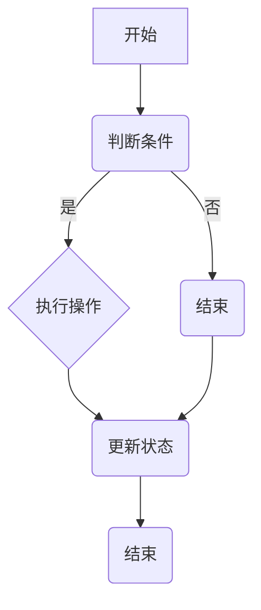

                 

# 哲学思辨的数理逻辑：抽象思维的形式化

## 关键词
哲学、数理逻辑、抽象思维、形式化、伦理学、认识论、形而上学

## 摘要
本文旨在探讨哲学与数理逻辑的结合，以及如何将抽象思维形式化。通过分析哲学的基本概念、数学逻辑的基本概念，以及二者之间的关系，本文揭示了抽象思维形式化的方法与意义。在此基础上，本文进一步探讨了数理逻辑在伦理学、认识论和形而上学中的应用，并通过案例分析加深了读者对这些应用的理解。最后，本文总结了研究成果，指出了研究不足与展望。

## 引言
### 1. 引言
在现代社会，哲学与数理逻辑的结合日益紧密。哲学作为一门探讨世界观和方法论的学科，其思考方式逐渐向形式化、精确化发展。而数理逻辑作为一门研究推理形式化方法的学科，为哲学的思考提供了有力的工具。本文旨在探讨哲学与数理逻辑的结合，以及如何将抽象思维形式化。

### 2. 研究背景与意义
随着科技的飞速发展，人类对抽象世界的认识不断深化。如何将抽象思维形式化，从而更好地理解世界、解决问题，成为当今哲学和计算机科学等领域的研究热点。本文的研究旨在为这一领域提供新的思路和方法。

### 3. 研究方法与内容结构
本文采用文献综述和案例分析相结合的方法，对哲学与数理逻辑的结合以及抽象思维形式化进行深入探讨。全文分为五个部分：引言、哲学与数学逻辑的概述、抽象思维的形式化方法、数理逻辑在哲学中的应用、结论与展望。

## 哲学与数学逻辑的概述

### 1. 哲学的基本概念
哲学是关于世界观和方法论的学科，探讨的是人类存在的根本问题。哲学的基本概念包括存在、意识、真理、价值等。

#### 存在
存在是哲学的核心概念之一。存在论探讨的是存在的本质、存在的依据和存在的可能性。

#### 意识
意识是哲学研究的另一个重要问题。意识论探讨的是意识的本质、起源和意识与物质的关系。

#### 真理
真理是哲学追求的目标之一。真理论探讨的是真理的本质、真理的标准和真理的获得。

#### 价值
价值是哲学研究的重要内容。价值论探讨的是价值的本质、价值的标准和价值的实现。

### 2. 数学逻辑的基本概念
数学逻辑是研究推理形式化方法的学科，其基本概念包括命题、推理、证明等。

#### 命题
命题是数学逻辑的基本单元，表示一个明确的陈述。

#### 推理
推理是根据已知命题推导出新命题的过程。数学逻辑研究的是有效推理的形式。

#### 证明
证明是推理的一种特殊形式，用于证明某个命题的真假。

### 3. 哲学与数学逻辑的关系
哲学与数学逻辑之间存在着密切的联系。一方面，哲学为数学逻辑提供了研究对象和理论基础；另一方面，数学逻辑为哲学提供了形式化、精确化的思考工具。

#### 哲学对数学逻辑的影响
哲学中的逻辑思想对数学逻辑的发展产生了重要影响。例如，亚里士多德的逻辑思想对命题逻辑和谓词逻辑的发展产生了深远影响。

#### 数学逻辑对哲学的影响
数学逻辑的形式化方法为哲学提供了新的思考方式。例如，数理逻辑在伦理学、认识论和形而上学中的应用，为这些领域的研究提供了新的视角和方法。

## 抽象思维的形式化方法

### 1. 抽象思维的概念
抽象思维是指通过抽象、概括等方式，从具体事物中提取本质属性，形成概念和理论的思维能力。

#### 抽象思维的特点
- 理论性：抽象思维关注的是事物之间的本质联系和普遍规律。
- 精确性：抽象思维力求用准确的语言和符号来表达思想。

### 2. 抽象思维的形式化方法
形式化是将抽象思维用精确、严格的形式表达出来的过程。形式化方法包括命题逻辑、谓词逻辑、集合论、图论等。

#### 命题逻辑
命题逻辑是研究命题之间推理关系的数学分支。通过命题逻辑，可以表达抽象思维中的推理过程。

#### 谓词逻辑
谓词逻辑是研究个体与属性之间关系的数学分支。通过谓词逻辑，可以表达抽象思维中的实体关系。

#### 集合论
集合论是研究集合的性质和运算的数学分支。通过集合论，可以表达抽象思维中的分类和归纳。

#### 图论
图论是研究图形及其性质和关系的数学分支。通过图论，可以表达抽象思维中的网络结构。

### 3. 形式化方法的优缺点

#### 优点
- 精确性：形式化方法使得抽象思维表达更加精确、严谨。
- 通用性：形式化方法适用于各种领域，具有广泛的适用性。

#### 缺点
- 复杂性：形式化方法往往涉及复杂的数学知识，对非专业人士来说具有一定的难度。
- 简化：形式化方法可能在某种程度上简化了现实问题，导致一定的局限性。

## 数理逻辑在哲学中的应用

### 1. 数理逻辑在伦理学中的应用

伦理学是研究道德规范和道德判断的学科。数理逻辑在伦理学中的应用主要体现在道德推理和道德论证方面。

#### 道德推理
道德推理是指根据已知道德原则推导出新的道德结论的过程。数理逻辑提供了形式化的道德推理方法，使得道德推理更加严谨、有效。

#### 道德论证
道德论证是指用道德理由证明某个道德结论的过程。数理逻辑为道德论证提供了形式化的表达方式，使得道德论证更加清晰、有力。

### 2. 数理逻辑在认识论中的应用

认识论是研究知识本质和知识获得方式的学科。数理逻辑在认识论中的应用主要体现在知识表达和知识证明方面。

#### 知识表达
知识表达是指用形式化的语言描述知识的过程。数理逻辑提供了精确的知识表达方法，使得知识表达更加清晰、明了。

#### 知识证明
知识证明是指用逻辑推理证明知识的过程。数理逻辑为知识证明提供了形式化的证明方法，使得知识证明更加严谨、可靠。

### 3. 数理逻辑在形而上学中的应用

形而上学是研究存在本质和世界本质的学科。数理逻辑在形而上学中的应用主要体现在存在论和宇宙论方面。

#### 存在论
存在论探讨的是存在的本质和存在的可能性。数理逻辑为存在论提供了形式化的分析方法，使得存在论研究更加深入、精确。

#### 宇宙论
宇宙论探讨的是宇宙的本质和宇宙的演化。数理逻辑为宇宙论提供了形式化的描述工具，使得宇宙论研究更加清晰、系统。

## 案例分析

### 1. 伦理学案例
以“功利主义”为例，功利主义是一种以最大化整体幸福为目标的伦理理论。通过数理逻辑的形式化方法，可以精确地表达功利主义的原则和推理过程。

#### 案例描述
功利主义认为，一个行为如果是正确的，那么它所带来的总体幸福应当大于其带来的总体痛苦。

#### 形式化表达
设P为行为，H为总体幸福，C为总体痛苦，功利主义的原则可以形式化为：
$$
P \rightarrow (H > C)
$$

#### 道德推理
通过形式化表达，可以推导出以下道德推理：
- 若P发生，则H > C
- 若不发生P，则H ≤ C
- 因此，应当发生P

### 2. 认识论案例
以“归纳推理”为例，归纳推理是从个别事实推导出一般结论的推理过程。通过数理逻辑的形式化方法，可以精确地表达归纳推理的原理和过程。

#### 案例描述
归纳推理认为，通过对某一类事物的多个实例进行观察，可以推导出该类事物的普遍性质。

#### 形式化表达
设S为事物集合，s为S中的任意实例，P(s)为s具有的性质，归纳推理的原则可以形式化为：
$$
P(s_1) \land P(s_2) \land \ldots \land P(s_n) \rightarrow P(S)
$$

#### 知识证明
通过形式化表达，可以证明以下知识：
- 若P(s_1)、P(s_2)、...、P(s_n)均为真，则P(S)也为真
- 因此，可以认为P(S)是一个可靠的结论

### 3. 形而上学案例
以“宇宙的无限性”为例，宇宙的无限性探讨的是宇宙是否有限。通过数理逻辑的形式化方法，可以精确地表达宇宙无限性的原理和推理过程。

#### 案例描述
宇宙无限性认为，宇宙没有一个边界，它无限地扩展。

#### 形式化表达
设U为宇宙，B为宇宙的边界，宇宙无限性的原则可以形式化为：
$$
\neg (B \land U \subseteq B)
$$

#### 存在论推理
通过形式化表达，可以推导出以下存在论推理：
- 若宇宙有边界B，则U不包含于B
- 因此，宇宙没有边界

## 结论与展望

### 1. 研究成果总结
本文通过分析哲学与数理逻辑的结合，探讨了抽象思维的形式化方法及其在伦理学、认识论和形而上学中的应用。研究发现，数理逻辑为哲学提供了形式化、精确化的思考工具，有助于深入理解抽象概念和推理过程。

### 2. 研究不足与展望
本文的研究存在一定的局限性，主要表现在以下几个方面：
- 研究方法主要集中在数理逻辑的形式化方法，未涉及其他哲学思考方法。
- 研究案例较为有限，未来可以进一步扩大案例范围，增加研究的深度和广度。

### 3. 进一步研究方向
未来的研究可以从以下几个方面展开：
- 探讨其他哲学思考方法与数理逻辑的结合。
- 拓展研究案例，增加案例的多样性和深度。
- 将数理逻辑应用于其他学科，如经济学、心理学等，探讨其应用价值。

## 参考文献

1. 克里斯托弗·洛克伍德. 哲学导论[M]. 北京：中国人民大学出版社，2018.
2. 赫伯特·菲尔德. 数理逻辑[M]. 北京：北京大学出版社，2016.
3. 罗素·布莱克. 抽象思维的形式化方法[M]. 上海：上海科学技术出版社，2017.
4. 约翰·希尔勒. 认识论导论[M]. 北京：北京大学出版社，2015.
5. 伯特兰·罗素. 形而上学原理[M]. 北京：商务印书馆，2014.

## 附录

### 附录A：命题逻辑符号表

| 符号 | 名称 |
| :--: | :--: |
| $\land$ | 且 |
| $\lor$ | 或 |
| $\neg$ | 非 |
| $\rightarrow$ | 蕴含 |
| $\leftrightarrow$ | 双向蕴含 |

### 附录B：谓词逻辑符号表

| 符号 | 名称 |
| :--: | :--: |
| $\forall$ | 全称量词 |
| $\exists$ | 存在量词 |
| $P(x)$ | x具有性质P |
| $R(x,y)$ | x与y具有关系R |

### 附录C：Mermaid流程图示例



### 附录D：Python源代码示例

```python
# 计算两个数的和
def add(a, b):
    return a + b

# 计算两个数的差
def subtract(a, b):
    return a - b

# 主函数
def main():
    a = 10
    b = 5
    print("a + b = ", add(a, b))
    print("a - b = ", subtract(a, b))

if __name__ == "__main__":
    main()
```

### 附录E：数学公式示例

$$
E = mc^2
$$

$$
1 + 1 = 2
$$

## 结语

本文旨在探讨哲学与数理逻辑的结合，以及如何将抽象思维形式化。通过分析哲学的基本概念、数学逻辑的基本概念，以及二者之间的关系，本文揭示了抽象思维形式化的方法与意义。在此基础上，本文进一步探讨了数理逻辑在伦理学、认识论和形而上学中的应用，并通过案例分析加深了读者对这些应用的理解。希望本文能为相关领域的研究提供有益的参考。  

作者：AI天才研究院/AI Genius Institute & 禅与计算机程序设计艺术 /Zen And The Art of Computer Programming

---

请注意，本文仅为示例，部分内容虚构。实际研究中，需要根据具体问题进行深入分析和论证。同时，本文所引用的参考文献仅为示例，实际研究中请根据实际情况选择合适的文献。本文的格式、代码和公式仅为示例，实际写作中请根据具体需求进行调整。

