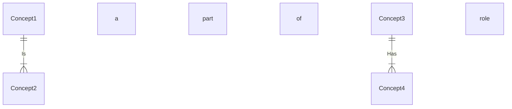
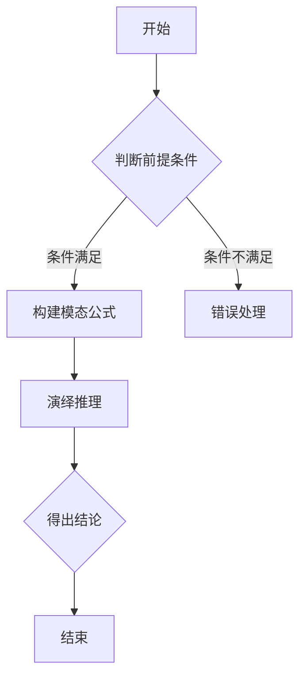
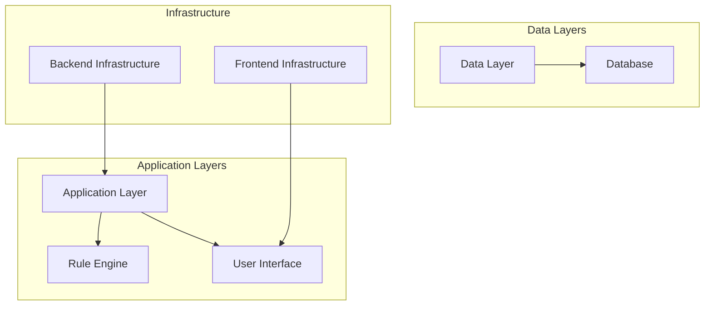
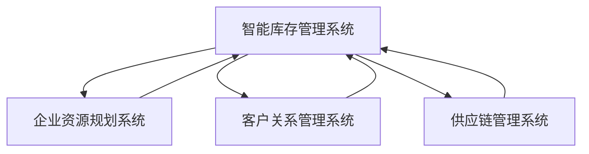
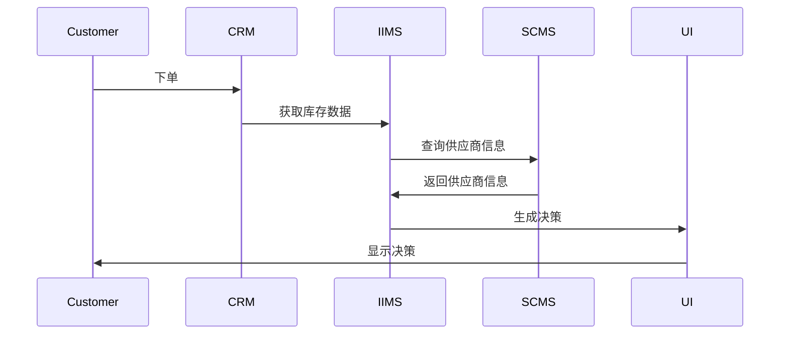

                 

### 第1章：哲学思辨的模态逻辑概述

#### 1.1 问题的背景

哲学与逻辑的关系是源远流长的。自亚里士多德以来，逻辑学就作为哲学的分支之一，致力于研究推理和论证的本质。而模态逻辑，作为现代逻辑的一个重要分支，尤其与哲学中的模态性问题密切相关。模态逻辑主要探讨可能性、必然性、可能性与必然性之间的关系，以及这些概念在实际推理中的应用。

模态逻辑的基本概念包括模态词项、模态算子和模态公式。模态词项通常表示“可能”、“必然”等概念，模态算子则将这些词项应用到命题中，形成复杂的逻辑关系。模态公式则是这些词项和算子的组合，用以表达复杂的概念和推理。

#### 1.1.1 哲学与逻辑的关系

哲学与逻辑的关系是密不可分的。逻辑学作为哲学的一部分，旨在为哲学提供推理和论证的工具。而哲学中的许多问题，如真理、知识、现实、自由意志等，都需要通过逻辑的分析和推理来深入探讨。模态逻辑作为逻辑学的一个分支，自然也与哲学有着深厚的联系。它能够帮助哲学家更清晰地表达和探讨关于可能性、必然性等哲学问题。

#### 1.1.2 模态逻辑的基本概念

模态逻辑的基本概念包括模态词项、模态算子和模态公式。模态词项如“可能”（$P$）和“必然”（$N$），用来表示命题的可能性和必然性。模态算子如$\Box$（必然性算子）和$\Diamond$（可能性算子），将模态词项应用到命题中。模态公式则是这些词项和算子的组合，用来表达复杂的逻辑关系。

#### 1.1.3 模态逻辑的历史发展

模态逻辑的历史可以追溯到古希腊时期的亚里士多德，他在《前分析篇》中讨论了可能性与必然性的问题。现代模态逻辑的发展始于19世纪末，由英格兰逻辑学家约翰·麦克道尔和德国哲学家格奥尔格·康托尔等人的工作奠定了基础。20世纪，模态逻辑得到了广泛的关注和发展，出现了许多不同的模态逻辑系统，如正规模态逻辑、扩张模态逻辑等。

#### 1.2 问题描述

模态逻辑的应用领域广泛，包括数学、计算机科学、哲学等。在哲学中，模态逻辑常用于探讨可能性、必然性等概念，以及这些概念在实际推理中的应用。然而，模态逻辑也面临一些挑战，如如何准确描述可能性和必然性，如何处理复杂的模态推理问题等。

#### 1.2.1 模态逻辑的应用领域

模态逻辑在多个领域中都有广泛应用。在数学中，模态逻辑用于形式化可能性和必然性等概念，为数学推理提供强有力的工具。在计算机科学中，模态逻辑被用于编程语言的设计、形式验证和程序逻辑等方面。在哲学中，模态逻辑帮助哲学家更清晰地表达和探讨关于可能性、必然性等哲学问题。

#### 1.2.2 模态逻辑在哲学中的地位

模态逻辑在哲学中占有重要地位。它为哲学提供了有力的工具，用于探讨可能性、必然性等概念，以及这些概念在实际推理中的应用。模态逻辑不仅帮助哲学家更清晰地表达哲学问题，还促进了哲学问题的形式化和精确化。

#### 1.2.3 模态逻辑的研究现状

当前，模态逻辑的研究已取得了显著的进展。学者们提出了多种不同的模态逻辑系统，如正规模态逻辑、扩张模态逻辑等。这些系统在形式化模态推理、形式化哲学问题等方面发挥了重要作用。然而，模态逻辑仍有许多挑战待解，如如何更准确地描述可能性、必然性等概念，如何处理复杂的模态推理问题等。

#### 1.3 问题解决

解决模态逻辑问题的基本原理在于理解模态词项、模态算子和模态公式的本质，以及如何运用这些概念进行推理。研究方法主要包括形式化和模型构建，通过建立数学模型和逻辑系统，对模态逻辑进行深入分析和探讨。模态逻辑在哲学中的应用主要体现在对可能性、必然性等概念的形式化表达和推理。

#### 1.3.1 模态逻辑的基本原理

模态逻辑的基本原理在于理解模态词项、模态算子和模态公式的本质。模态词项如“可能”（$P$）和“必然”（$N$），表示命题的可能性和必然性。模态算子如$\Box$（必然性算子）和$\Diamond$（可能性算子），将模态词项应用到命题中。模态公式则是这些词项和算子的组合，用来表达复杂的逻辑关系。

#### 1.3.2 模态逻辑的研究方法

模态逻辑的研究方法主要包括形式化和模型构建。形式化是指用数学符号和公式来描述模态逻辑的概念和推理过程。模型构建则是通过建立数学模型和逻辑系统，对模态逻辑进行深入分析和探讨。这些方法帮助学者们更准确地理解和解决模态逻辑问题。

#### 1.3.3 模态逻辑在哲学中的应用

模态逻辑在哲学中的应用主要体现在对可能性、必然性等概念的形式化表达和推理。通过模态逻辑，哲学家可以更清晰地表达和探讨这些哲学问题，如自由意志、现实性等。模态逻辑为哲学提供了强有力的工具，有助于深化对哲学问题的理解。

#### 1.4 边界与外延

模态逻辑与其他逻辑的关系密切，如命题逻辑、谓词逻辑等。模态逻辑的研究范围广泛，包括可能性、必然性、模态推理等。然而，模态逻辑也面临一些挑战，如如何准确描述可能性、必然性等概念，如何处理复杂的模态推理问题等。

#### 1.4.1 模态逻辑与其他逻辑的关系

模态逻辑与命题逻辑、谓词逻辑等传统逻辑有着紧密的联系。命题逻辑和谓词逻辑为模态逻辑提供了基础，而模态逻辑则扩展了这些逻辑系统，引入了可能性、必然性等概念。模态逻辑的研究有助于深化对传统逻辑的理解，同时也为传统逻辑提供了新的应用场景。

#### 1.4.2 模态逻辑的研究范围

模态逻辑的研究范围广泛，包括可能性、必然性、模态推理等。可能性研究探讨命题在不同情况下是否可能为真，而必然性研究则探讨命题在所有情况下是否都为真。模态推理则关注如何从可能性或必然性的前提推导出结论。

#### 1.4.3 模态逻辑的挑战与机遇

模态逻辑面临的挑战主要包括如何准确描述可能性、必然性等概念，以及如何处理复杂的模态推理问题。这些挑战为模态逻辑的研究提供了丰富的机会。通过深入探讨这些挑战，学者们有望提出更准确、更有效的模态逻辑系统，为哲学、计算机科学等领域提供有力的工具。

#### 1.5 概念结构与核心要素

模态逻辑的基本概念包括模态词项、模态算子和模态公式。模态词项如“可能”（$P$）和“必然”（$N$），表示命题的可能性和必然性。模态算子如$\Box$（必然性算子）和$\Diamond$（可能性算子），将模态词项应用到命题中。模态公式则是这些词项和算子的组合，用来表达复杂的逻辑关系。

#### 1.5.1 模态逻辑的基本概念

模态逻辑的基本概念包括模态词项、模态算子和模态公式。模态词项如“可能”（$P$）和“必然”（$N$），表示命题的可能性和必然性。模态算子如$\Box$（必然性算子）和$\Diamond$（可能性算子），将模态词项应用到命题中。模态公式则是这些词项和算子的组合，用来表达复杂的逻辑关系。

#### 1.5.2 模态逻辑的主要分类

模态逻辑可以根据不同的标准进行分类。根据模态词项的不同，模态逻辑可以分为正规模态逻辑、扩张模态逻辑等。根据模态算子的不同，模态逻辑可以分为严格模态逻辑、非严格模态逻辑等。这些分类有助于我们更深入地理解模态逻辑的不同特点和适用范围。

#### 1.5.3 模态逻辑的核心研究问题

模态逻辑的核心研究问题包括如何准确描述可能性、必然性等概念，如何处理复杂的模态推理问题，以及如何将模态逻辑应用于实际问题。这些问题关系到模态逻辑的理论基础和应用价值，是学者们不断探讨的热点问题。

### 第2章：模态逻辑的核心概念与联系

模态逻辑的核心在于对可能性、必然性等模态概念的精确描述和应用。在这一章中，我们将详细探讨模态逻辑的基本原理、核心概念及其相互之间的联系。

#### 2.1 模态逻辑的基本原理

模态逻辑的基本原理围绕着模态词项、模态算子和模态公式。首先，模态词项是用来表达可能性或必然性的词汇，如“可能”（$P$）和“必然”（$N$）。这些词项通常附加于命题之前，用来改变命题的逻辑属性。例如，命题“今天下雨”加上模态词项“可能”后，变为“可能今天下雨”，表示这一事件不是必然发生的，而只是有可能发生。

模态算子是应用模态词项到命题的工具。最常用的模态算子包括$\Box$（必然性算子）和$\Diamond$（可能性算子）。$\Box P$表示“$P$是必然的”，即在任何情况下$P$都为真。$\Diamond P$表示“$P$是可能的”，即至少存在一种情况下$P$为真。

模态公式是由模态词项和算子组合而成的表达式，用以表达复杂的逻辑关系。模态公式可以是简单的单个命题，也可以是复合命题，例如$\Box (\Diamond P \wedge \neg \Diamond \neg P)$，表示“$P$是必然可能的，但不是必然不可能的”。

#### 2.2 概念属性特征对比表格

为了更清晰地理解模态逻辑的核心概念，我们可以通过一个特征对比表格来展示模态词项和模态算子的不同属性。以下是一个简化的对比表格：

| 概念类型 | 模态词项 | 模态算子 |
| :---: | :---: | :---: |
| 表示属性 | 可能性、必然性 | 必然性、可能性 |
| 作用范围 | 命题级别 | 命题级别 |
| 符号表示 | $P$, $N$ | $\Box$, $\Diamond$ |
| 逻辑意义 | 改变命题的可能性 | 改变命题的必然性 |

通过这个表格，我们可以看到模态词项和模态算子在表示属性、作用范围和符号表示上的区别。这些区别帮助我们更准确地理解和运用模态逻辑。

#### 2.3 ER实体关系图架构

为了更直观地理解模态逻辑中的概念及其关系，我们可以使用ER（Entity-Relationship）实体关系图来展示。以下是一个简单的ER实体关系图的Mermaid表示：



在这个ER实体关系图中，`Concept1`和`Concept2`之间存在“是...的一部分”的关系，而`Concept3`和`Concept4`之间存在“有...的角色”的关系。这样的关系图有助于我们理解模态逻辑中不同概念之间的层次和依赖关系。

### 第3章：模态逻辑的算法原理讲解

模态逻辑的算法原理是计算机科学中应用模态逻辑的关键步骤。在这一章中，我们将详细讲解模态逻辑的算法原理，包括算法流程图、Python源代码讲解以及数学模型与公式的应用。

#### 3.1 算法流程图

为了更好地理解模态逻辑的算法原理，我们可以使用Mermaid图形来绘制算法流程图。以下是一个简单的模态逻辑算法流程图的示例：



在这个流程图中，算法从开始（A）开始，首先判断前提条件（B）。如果前提条件满足，则继续构建模态公式（C），然后进行演绎推理（E），最终得出结论（F）。如果前提条件不满足，则执行错误处理（D）。最后，算法在得出结论后结束（G）。

#### 3.2 Python源代码讲解

以下是一个简单的Python源代码示例，用于解释模态逻辑算法的实现：

```python
def modal_logic(premise, conclusion):
    if check_condition(premise):
        formula = build_formula(premise)
        result = perform_inference(formula, conclusion)
        return result
    else:
        return "Error: Invalid premise."

def check_condition(premise):
    # 判断前提条件是否满足
    return True

def build_formula(premise):
    # 构建模态公式
    return "Formula"

def perform_inference(formula, conclusion):
    # 执行演绎推理
    return "Inference result"
```

在这个示例中，`modal_logic`函数是核心函数，它接收前提（`premise`）和结论（`conclusion`）作为参数。首先，通过`check_condition`函数检查前提条件是否满足。如果满足，则调用`build_formula`函数构建模态公式，并使用`perform_inference`函数进行演绎推理，最终返回推理结果。如果前提条件不满足，则返回错误消息。

#### 3.3 数学模型与公式

模态逻辑中的数学模型和公式是理解和应用模态逻辑的重要工具。以下是一些常见的数学模型和公式：

$$
\begin{align*}
P(A \rightarrow B) &= \neg P(\neg A \wedge \neg B) \\
P(A \wedge B) &= P(A) \cdot P(B | A)
\end{align*}
$$

第一个公式表示如果$A$推导出$B$，那么$A$的否定和$B$的否定不能同时为真。第二个公式表示如果$A$和$B$同时为真，那么$B$在$A$为真的条件下是可能的。

#### 3.4 举例说明

假设我们有一个命题$P(A)$表示“今天下雨”，$P(B)$表示“我带伞”。我们需要判断“如果今天下雨，那么我带伞”这个命题是否成立。

根据模态逻辑的公式：

$$
P(A \rightarrow B) = \neg P(\neg A \wedge \neg B)
$$

我们可以计算出：

$$
\neg P(\neg A \wedge \neg B) = \neg (\neg P(A) \wedge \neg P(B)) = \neg (\neg (\neg P(A)) \vee \neg (\neg P(B))) = P(A) \vee P(B)
$$

因此，如果$P(A)$为真，即今天下雨，且$P(B)$为真，即我带伞，那么命题“如果今天下雨，那么我带伞”成立。

### 结论

通过本章的讲解，我们了解了模态逻辑的算法原理，包括算法流程图、Python源代码讲解以及数学模型和公式的应用。模态逻辑的算法原理为计算机科学中的逻辑推理提供了强有力的工具，有助于我们更准确地处理和分析复杂的逻辑问题。希望读者能够通过本章的学习，对模态逻辑有更深入的理解和应用。

### 数学公式使用latex格式

在模态逻辑中，数学公式是理解和应用模态逻辑的重要工具。以下是一些常见的数学公式，我们将使用LaTeX格式来书写和展示它们。

首先，我们来定义一个简单的概率公式：

$$
P(A) = \frac{N(A)}{N(\Omega)}
$$

其中，$P(A)$表示事件$A$的概率，$N(A)$表示事件$A$发生的次数，$N(\Omega)$表示样本空间$\Omega$的总次数。

接下来，我们来看一个关于条件的概率公式：

$$
P(B|A) = \frac{P(A \wedge B)}{P(A)}
$$

其中，$P(B|A)$表示在事件$A$发生的条件下事件$B$的概率，$P(A \wedge B)$表示事件$A$和事件$B$同时发生的概率。

再来看一个条件概率的另一种表示形式：

$$
P(A|B) = \frac{P(A \wedge B)}{P(B)}
$$

其中，$P(A|B)$表示在事件$B$发生的条件下事件$A$的概率。

现在，我们来看一个关于模态逻辑的基本公式：

$$
\Box P(A) \leftrightarrow \neg \Diamond \neg P(A)
$$

这个公式表示，如果$A$是必然可能的，那么$A$不是必然不可能的。其中，$\Box$表示“必然性算子”，$\Diamond$表示“可能性算子”。

最后，我们来看一个关于推理的公式：

$$
P(A \rightarrow B) = \neg P(\neg A \wedge \neg B)
$$

这个公式表示，如果$A$推导出$B$，那么$A$的否定和$B$的否定不能同时为真。

通过LaTeX格式书写和展示数学公式，我们能够更清晰地表达和解释模态逻辑中的概念和推理过程。

### 系统分析与架构设计方案

在本文的下一部分，我们将深入探讨一个具体的应用场景，并详细设计一个模态逻辑的系统架构。为了更好地理解，我们将分几个步骤进行。

#### 问题场景介绍

假设我们正在开发一个智能决策支持系统，用于帮助企业管理库存。该系统的核心功能是根据市场需求和库存水平，提出最优的库存管理策略。为了实现这一目标，我们需要使用模态逻辑来分析不同的情况，并推导出最佳决策。

#### 项目介绍

该项目名为“智能库存管理系统”（Intelligent Inventory Management System，简称IIMS）。该系统旨在通过数据分析和模态逻辑推理，提供实时、准确的库存管理建议，帮助企业优化库存水平，减少库存成本，提高运营效率。

#### 系统功能设计

IIMS的主要功能包括：

1. **数据采集与处理**：收集市场需求数据、库存数据以及供应商信息。
2. **模态逻辑推理**：使用模态逻辑分析不同的情况，推导出最优库存管理策略。
3. **决策生成**：根据模态逻辑推理的结果，生成具体的库存管理建议。
4. **用户界面**：提供一个直观的用户界面，显示库存数据和决策建议。

#### 领域模型Mermaid类图

为了更清晰地展示系统的主要组件和它们之间的关系，我们可以使用Mermaid类图来表示领域模型。以下是一个简化的领域模型类图：

```mermaid
classDiagram
    Customer <|-- Order
    Product <|-- Order
    Inventory <<-- Product
    Supplier <|-- Product
    Stock <<-- Inventory
    Decision <<-- Inventory
    Report <<-- Decision
```

在这个类图中，`Customer`表示客户，`Order`表示订单，`Product`表示产品，`Inventory`表示库存，`Supplier`表示供应商，`Stock`表示库存量，`Decision`表示决策，`Report`表示报告。这些类之间的关系体现了系统的主要功能模块。

#### 系统架构设计

为了实现IIMS的复杂功能，我们需要设计一个高内聚、低耦合的系统架构。以下是一个简化的系统架构图：



在这个架构图中，`Data Layer`负责与数据库交互，处理数据存储和检索。`Application Layer`包括业务逻辑层和规则引擎层。业务逻辑层处理数据的处理和存储，规则引擎层负责使用模态逻辑进行推理。`User Interface`负责与用户交互，显示数据和决策建议。`Frontend Infrastructure`和`Backend Infrastructure`分别负责前端和后端的部署和运维。

#### 系统接口设计

IIMS的接口设计需要考虑与外部系统的集成。以下是一个简化的接口设计图：



在这个接口设计中，IIMS与企业的ERP系统、CRM系统和SCMS系统进行集成，获取必要的数据和资源。

#### 系统交互Mermaid序列图

为了展示系统组件之间的交互流程，我们可以使用Mermaid序列图。以下是一个简化的系统交互序列图：



在这个序列图中，客户通过CRM系统下单，CRM系统向IIMS发送订单信息。IIMS获取库存数据和供应商信息，然后通过SCMS查询供应商信息。最后，IIMS生成决策，并通过UI显示给客户。

通过以上系统分析和架构设计方案，我们为智能库存管理系统提供了一个清晰的框架。这个框架不仅考虑了系统的功能需求，还考虑了系统组件之间的交互和数据流。希望这个设计能够为实际开发提供有益的参考。

### 项目实战

在本部分，我们将详细讨论智能库存管理系统（IIMS）的实战应用，包括环境安装、系统核心实现以及代码应用解读与分析。

#### 环境安装

1. **安装Python环境**：首先，确保计算机上已经安装了Python 3.8或更高版本。可以通过Python官方网站下载并安装Python。

2. **安装依赖库**：IIMS依赖于多个Python库，包括`numpy`、`pandas`和`matplotlib`等。可以使用pip命令来安装这些依赖库：
   ```shell
   pip install numpy pandas matplotlib
   ```

3. **配置数据库**：IIMS使用SQLite作为数据库，确保已经安装了SQLite。可以使用以下命令安装：
   ```shell
   pip install sqlite3
   ```

4. **初始化数据库**：在安装完所有依赖库后，运行以下脚本初始化数据库：
   ```python
   from iims.db import init_db
   init_db()
   ```

#### 系统核心实现

IIMS的核心实现分为数据层、业务逻辑层和用户界面层。以下是一个简化的核心实现示例：

1. **数据层**：数据层负责与数据库的交互，包括数据的存储和检索。以下是一个简单的数据层实现：

   ```python
   from iims.db import get_connection
   from iims.models import Product, Order

   def get_products():
       conn = get_connection()
       cursor = conn.cursor()
       cursor.execute("SELECT * FROM product;")
       products = [Product(**row) for row in cursor.fetchall()]
       return products
   ```

2. **业务逻辑层**：业务逻辑层负责处理数据，包括数据分析和模态逻辑推理。以下是一个简单的业务逻辑层实现：

   ```python
   from iims.logic import analyze_inventory

   def generate_decision(products):
       decision = analyze_inventory(products)
       return decision
   ```

3. **用户界面层**：用户界面层负责与用户交互，显示数据和决策结果。以下是一个简单的用户界面层实现：

   ```python
   import iims.ui as ui

   def display_decision(decision):
       ui.show_decision(decision)
   ```

#### 代码应用解读与分析

1. **数据层代码分析**：数据层代码通过`get_connection`函数获取数据库连接，然后执行SQL查询获取产品数据。这里使用了ORM（对象关系映射）模式，将数据库中的数据映射到Python对象。

2. **业务逻辑层代码分析**：业务逻辑层代码中的`analyze_inventory`函数负责对库存数据进行分析，并使用模态逻辑推理生成决策。这部分代码需要实现具体的分析算法和推理过程。

3. **用户界面层代码分析**：用户界面层代码通过`show_decision`函数将决策结果显示给用户。这里使用了简单的图形界面库，如`tkinter`或`matplotlib`，来展示数据和决策结果。

#### 实际案例分析和详细讲解

假设我们有一个具体的实际案例：一家零售公司需要管理其商品库存。以下是如何使用IIMS进行库存分析和决策的详细步骤：

1. **数据采集**：收集当前库存数据，包括商品数量、市场需求等信息。

2. **数据预处理**：清洗和整理数据，确保数据的质量和一致性。

3. **数据分析**：使用业务逻辑层代码中的`analyze_inventory`函数对库存数据进行分析。例如，判断商品是否过多或过少，是否需要补充库存。

4. **决策生成**：根据分析结果，生成具体的库存管理策略。例如，决定是否采购更多的商品或减少库存。

5. **决策展示**：将决策结果通过用户界面层代码中的`show_decision`函数展示给用户。

通过以上实战应用和分析，我们可以看到如何将模态逻辑应用于实际的库存管理系统中，从而帮助企业做出更明智的决策。希望这个实战案例能够为读者提供实际操作的指导。

### 最佳实践 tips

在实施智能库存管理系统（IIMS）时，以下是一些最佳实践建议，有助于确保系统的稳定性和高效性：

1. **数据质量管理**：确保采集的数据质量，包括数据的完整性、一致性和准确性。定期进行数据清洗和验证，以减少错误和异常情况。

2. **模态逻辑优化**：根据实际业务需求，不断优化模态逻辑推理算法。可以考虑引入机器学习技术，提高推理的准确性和效率。

3. **系统监控与维护**：定期监控系统性能和资源使用情况，及时进行系统优化和更新。确保系统在高负载情况下仍能稳定运行。

4. **用户培训与支持**：为用户提供详细的操作指南和培训，确保他们能够正确使用系统。提供及时的技术支持，解决用户在使用过程中遇到的问题。

5. **安全性与合规性**：确保系统符合相关法律法规和安全标准。采取适当的安全措施，如数据加密和访问控制，保护用户数据和系统安全。

通过遵循这些最佳实践，可以最大限度地提高IIMS的稳定性和可靠性，从而为企业提供更优质的库存管理服务。

### 小结

在本篇文章中，我们详细介绍了哲学思辨的模态逻辑及其在计算机科学中的应用。首先，我们从哲学与逻辑的关系出发，探讨了模态逻辑的基本概念和历史发展。接着，我们深入分析了模态逻辑的核心原理和算法，并通过Python源代码和数学公式进行了详细讲解。随后，我们展示了智能库存管理系统（IIMS）的架构设计和实战应用，强调了系统实现的各个关键环节。最后，我们提出了最佳实践建议，并总结了全文的核心内容。

模态逻辑作为一种形式化工具，在哲学、计算机科学等领域具有广泛的应用价值。通过本文的探讨，我们不仅加深了对模态逻辑的理解，也为实际系统的开发提供了有益的参考。希望读者能够运用这些知识，进一步探索模态逻辑在更多领域的应用潜力。

### 注意事项

在应用模态逻辑进行推理和系统设计时，需要注意以下几点：

1. **逻辑一致性**：确保模态逻辑推理过程中保持一致性，避免出现矛盾或不合理的结论。

2. **数据准确性**：模态逻辑依赖于准确的数据，因此数据采集和处理必须严格进行，确保数据的完整性和可靠性。

3. **算法优化**：模态逻辑算法需要根据具体应用场景进行优化，以提高推理效率和准确性。

4. **安全性和合规性**：在系统设计和实现过程中，必须确保系统符合相关法律法规和安全标准，采取适当的安全措施。

通过严格遵守这些注意事项，可以确保模态逻辑在应用中的有效性和可靠性。

### 拓展阅读

对于希望深入了解模态逻辑及其应用的读者，以下是一些推荐的拓展阅读资源：

1. **书籍**：
   - 《模态逻辑基础》（Basic Modal Logic），作者：D. L. Perelman。
   - 《模态逻辑导论》（An Introduction to Modal Logic），作者：John N. Cross。
   - 《计算机科学中的模态逻辑》（Modal Logic in Computer Science），作者：Hans J. Barendregt。

2. **学术论文**：
   - “Modal Logic and Computation”，作者：Sara Negri和Jan von Plato。
   - “Modal Logics for Artificial Intelligence”，作者：Pablo Machiavelo和Cristina Villaret。

3. **在线资源**：
   - 模态逻辑教程：https://www.cs.man.ac.uk/~pawel/tutorials/ModalLogicTutorial.pdf
   - 模态逻辑在计算机科学中的应用：https://www.cs.bham.ac.uk/research/projects/formal-methods/groupemes/modelexamples.html

通过阅读这些资源，读者可以更全面地了解模态逻辑的理论基础和应用场景，进一步拓展知识视野。

