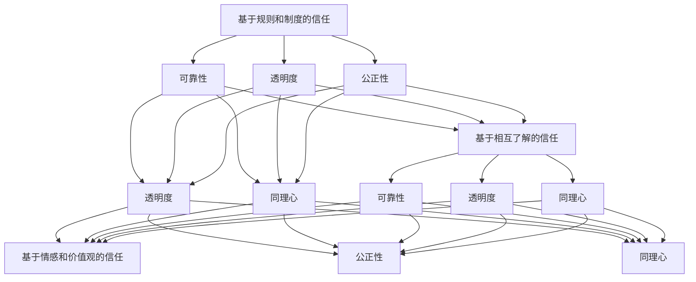

                 

### 目录大纲设计思路

设计《团队信任建设：构建高度信任的工作环境》这本书的目录大纲，需要遵循以下思路：

1. **背景介绍**：首先介绍团队信任建设的背景，包括团队信任的定义、重要性以及当前工作环境中信任缺失的问题。这部分内容将为读者搭建理解团队信任建设的基础。

2. **核心概念与联系**：接下来，需要明确书中涉及的核心概念，如信任的类型、信任的要素、信任的建立与破坏机制等，并用表格和图表来展示概念之间的关系。这部分内容将帮助读者系统性地了解团队信任建设的理论基础。

3. **信任建设方法论**：详细介绍信任建设的方法，包括信任评估、信任培养策略、信任文化的塑造等，每个方法都要有详细的步骤和实例说明。这部分内容将提供实用的操作指南，帮助读者在实际工作中实施信任建设。

4. **案例研究**：通过真实的案例，展示如何在不同类型的团队中实施信任建设，并分析案例中的成功与失败之处。这部分内容将使读者通过具体实例了解信任建设的实际效果和应用。

5. **实践指导**：提供具体的操作指南，帮助读者在自身团队中实施信任建设策略。这部分内容将注重实践性，确保读者能够将所学知识应用到实际工作中。

6. **总结与拓展**：最后，对全书内容进行总结，并给出一些注意事项、拓展阅读建议等。这部分内容将帮助读者巩固所学，并为进一步学习提供方向。

### 目录大纲示例

```markdown
----------------------------------------------------------------
# 《团队信任建设：构建高度信任的工作环境》

> 关键词：团队信任、信任建设、工作环境、案例分析、实践指导

> 摘要：本书旨在探讨团队信任建设的重要性、核心概念、方法和策略，并通过案例研究和实践指导，帮助读者构建高度信任的工作环境。

## 第一部分：团队信任建设的背景与概念

## 第1章：团队信任建设的背景与重要性
### 1.1 信任的定义与工作环境中的重要性
### 1.2 信任缺失的影响
### 1.3 信任的类型与要素

## 第2章：团队信任的核心概念与联系
### 2.1 信任的类型
#### 2.1.1 基于规则和制度的信任
#### 2.1.2 基于相互了解的信任
#### 2.1.3 基于情感和价值观的信任
### 2.2 信任的要素
#### 2.2.1 可靠性
#### 2.2.2 透明度
#### 2.2.3 公正性
#### 2.2.4 同理心

## 第二部分：团队信任建设的方法与策略

## 第3章：信任评估与诊断
### 3.1 信任评估的方法
#### 3.1.1 自我评估
#### 3.1.2 团队评估
### 3.2 信任诊断
#### 3.2.1 识别信任缺失的原因
#### 3.2.2 诊断信任建设的障碍

## 第4章：信任培养策略
### 4.1 培养信任的步骤
#### 4.1.1 建立共同目标
#### 4.1.2 增强透明度
#### 4.1.3 提高沟通质量
### 4.2 信任培养的具体实践
#### 4.2.1 团队建设活动
#### 4.2.2 信任建设培训

## 第5章：塑造信任文化
### 5.1 信任文化的特点
#### 5.1.1 信任文化的要素
#### 5.1.2 信任文化的表现形式
### 5.2 塑造信任文化的策略
#### 5.2.1 领导者的角色
#### 5.2.2 建立信任的激励机制

## 第三部分：团队信任建设案例研究

## 第6章：案例研究一：中小型公司的信任建设
### 6.1 案例背景
### 6.2 信任建设的过程
### 6.3 案例分析

## 第7章：案例研究二：跨国公司的跨文化信任建设
### 7.1 案例背景
### 7.2 信任建设的挑战
### 7.3 案例分析

## 第四部分：实践指导与总结

## 第8章：信任建设实践指导
### 8.1 环境准备
### 8.2 实施步骤
### 8.3 监控与评估

## 第9章：总结与拓展
### 9.1 团队信任建设的关键点
### 9.2 注意事项
### 9.3 拓展阅读

----------------------------------------------------------------
```

### 完整性验证

在上述目录大纲中，我们确保了以下内容的完整性：

- **背景介绍**：明确团队信任建设的重要性。
- **核心概念与联系**：包括信任的类型和要素。
- **信任建设方法论**：信任评估、信任培养策略、信任文化塑造。
- **案例研究**：提供真实案例，以便读者理解和应用。
- **实践指导**：给出具体操作指南。
- **总结与拓展**：总结全书内容，并提供拓展阅读建议。

这样的目录大纲不仅逻辑清晰，而且能够全面覆盖书籍的主题内容，适合作为一本系统介绍团队信任建设的书籍。接下来，我将根据上述大纲结构，进一步细化每一章节的内容，确保大纲的完整性和可行性。

### 摘要

团队信任建设：构建高度信任的工作环境旨在探讨如何在一个团队中建立和维护高度信任的工作环境。团队信任不仅是高效协作的基础，也是组织成功的关键。书中首先明确了团队信任的定义、重要性以及工作环境中信任缺失的影响。接着，深入探讨了团队信任的核心概念，包括信任的类型和要素，如可靠性、透明度、公正性和同理心。通过具体的方法和策略，书中详细介绍了信任评估、信任培养策略以及信任文化的塑造。此外，通过真实的案例研究，展示了不同类型团队中信任建设的实际效果和应用。最后，提供了实践指导，帮助读者在自身团队中实施信任建设策略。本书旨在为团队领导者和管理者提供系统、实用的指导，以构建一个高度信任的工作环境。

### 第一部分：团队信任建设的背景与概念

#### 第1章：团队信任建设的背景与重要性

在当今快速变化和高度竞争的商业环境中，团队信任建设显得尤为重要。团队信任不仅是团队高效协作的基础，也是组织成功的关键。然而，工作环境中信任缺失的问题日益严重，影响了团队的绩效和整体组织的健康。

**1.1 信任的定义与工作环境中的重要性**

信任是指个体对他人或团体能够履行承诺和责任的信心。在工作环境中，信任是团队成员之间、团队成员与领导者之间以及组织内部各个层级之间互动的基石。信任的存在与否直接影响团队的效率和合作效果。

首先，信任能够促进团队成员之间的开放沟通。当团队成员相互信任时，他们更愿意分享想法、意见和反馈，从而提高团队的整体创新能力。

其次，信任能够减少内部冲突和误解。在信任基础上，团队成员更容易理解彼此的立场和意图，从而减少因误解和冲突导致的内耗。

最后，信任能够提高团队的执行力和决策效率。在一个高度信任的工作环境中，团队成员能够更快地做出决策并付诸行动，从而提高团队的整体绩效。

**1.2 信任缺失的影响**

尽管信任在工作环境中具有重要性，但许多团队和组织仍然面临着信任缺失的问题。信任缺失的影响主要表现在以下几个方面：

- **沟通障碍**：信任缺失导致团队成员之间的沟通不畅，信息传递不完整或不准确，影响团队的整体协作效果。
- **协作困难**：团队成员之间缺乏信任，导致协作意愿降低，合作效率下降，项目进度受到影响。
- **决策效率低下**：信任缺失使团队成员在决策过程中产生疑虑和犹豫，导致决策迟缓和低效。
- **员工流失**：信任缺失会导致员工感到不满和不安全，从而增加员工流失率，影响组织的稳定性和长期发展。

**1.3 信任的类型与要素**

信任可以分为不同类型，每种类型都有其特定的表现和影响因素。以下是几种常见的信任类型及其要素：

- **基于规则和制度的信任**：这种信任建立在明确的规章制度和流程之上。团队成员信任组织提供的规则和制度能够保障他们的权益，从而减少不确定性。要素包括明确的规章制度、公平的奖惩机制和透明的流程。

- **基于相互了解的信任**：这种信任建立在团队成员之间的相互了解和认同上。通过长期的接触和合作，团队成员逐渐建立信任关系。要素包括相互了解、共同经历和相互支持。

- **基于情感和价值观的信任**：这种信任建立在团队成员之间的情感联系和价值观认同上。团队成员在情感上彼此支持，在价值观上相互认同，从而形成高度信任。要素包括情感联系、共同价值观和道德准则。

在本章中，我们探讨了团队信任建设的背景与重要性，明确了信任的定义和类型，以及信任缺失对工作环境的影响。接下来，我们将进一步深入讨论团队信任的核心概念和要素，为读者提供更全面的信任建设理论基础。

#### 第2章：团队信任的核心概念与联系

团队信任是一个复杂而多维的概念，涉及到多种类型和要素。在这一章中，我们将深入探讨团队信任的核心概念，并分析这些概念之间的联系，以帮助读者更好地理解团队信任的本质。

**2.1 信任的类型**

信任可以分为多种类型，每种类型反映了团队成员之间互动的不同层次和基础。以下是几种常见的信任类型及其特点：

- **基于规则和制度的信任**：这种信任建立在明确的规章制度和流程之上。团队成员信任组织提供的规则和制度能够保障他们的权益，从而减少不确定性。这种信任通常在企业内部形成，依赖于法律和政策的支持。

- **基于相互了解的信任**：这种信任建立在团队成员之间的相互了解和认同上。通过长期的接触和合作，团队成员逐渐建立信任关系。这种信任通常在团队内部形成，依赖于团队成员之间的直接互动和共同经历。

- **基于情感和价值观的信任**：这种信任建立在团队成员之间的情感联系和价值观认同上。团队成员在情感上彼此支持，在价值观上相互认同，从而形成高度信任。这种信任通常在团队内部和跨文化环境中形成，依赖于团队成员之间的深刻交流和共同价值观的共享。

**2.2 信任的要素**

信任的要素是指构成信任的各个基本组成部分。以下是一些关键的信任要素及其重要性：

- **可靠性**：可靠性是信任的核心要素之一。团队成员必须相信对方能够履行承诺和责任，从而降低不确定性。高可靠性的团队成员在团队中更容易获得信任。

- **透明度**：透明度是指团队成员之间的信息分享程度。在信任关系中，透明度越高，团队成员之间的信息不对称性越小，从而增强信任。高透明度的团队在沟通和合作中更加顺畅。

- **公正性**：公正性是指团队成员在决策和行动过程中遵循公平原则。团队成员必须相信团队中的决策和资源分配是公正的，从而减少不公平感，增强信任。

- **同理心**：同理心是指团队成员在情感上理解和关心他人。具有同理心的团队成员能够更好地识别和理解他人的需求和感受，从而减少误解和冲突，增强信任。

**2.3 信任的类型与要素之间的关系**

信任的类型和要素之间存在着密切的联系。不同的信任类型反映了信任关系的不同层次和基础，而信任的要素则是这些关系得以维持和发展的关键。以下是信任类型与要素之间的具体关系：

- **基于规则和制度的信任**主要依赖于可靠性、透明度和公正性。这种信任类型在团队初期阶段尤为重要，因为它能够为团队提供稳定的基础。

- **基于相互了解的信任**则更多地依赖于可靠性、透明度和同理心。这种信任类型在团队成员之间已经建立了一定的相互了解和合作经历时尤为重要。

- **基于情感和价值观的信任**则更多地依赖于可靠性、透明度、公正性和同理心。这种信任类型在团队成员之间已经形成了深厚的情感联系和共同价值观时尤为重要。

**2.4 图示：信任的类型与要素之间的关系**

为了更好地理解信任的类型与要素之间的关系，我们可以使用以下图表进行展示：



通过以上分析，我们可以看到，团队信任的类型和要素之间存在着复杂而紧密的关系。了解这些关系有助于我们更全面地理解团队信任的本质，并制定有效的信任建设策略。

在本章中，我们探讨了团队信任的核心概念和要素，并分析了不同类型信任之间的关系。这些核心概念和要素为我们提供了深入理解团队信任的基础，为后续章节的信任建设方法和策略提供了理论基础。接下来，我们将进一步探讨信任评估与诊断的方法，帮助团队识别和解决信任缺失的问题。

#### 第3章：信任评估与诊断

在构建高度信任的工作环境之前，进行信任评估与诊断是至关重要的一步。这一章将详细探讨如何评估团队中的信任水平，并诊断信任缺失的原因，为信任建设奠定基础。

**3.1 信任评估的方法**

信任评估是了解团队信任现状的重要手段。以下是几种常用的信任评估方法：

- **自我评估**：自我评估是指团队成员对自己和他人的信任程度进行评估。这种方法通常通过问卷调查或访谈的形式进行。问卷调查可以设计一系列关于信任程度的问题，如“我信任我的团队成员”或“我认为我的团队成员值得信赖”。通过分析问卷结果，可以了解团队成员对信任的主观感受。

- **团队评估**：团队评估是指团队成员一起评估团队的信任水平。这种方法通常通过团队会议或讨论的形式进行。在团队评估中，团队成员可以分享他们对信任的看法，讨论信任缺失的问题，并提出改善建议。通过团队评估，可以更全面地了解团队的信任现状。

**3.1.1 自我评估**

自我评估的步骤如下：

1. 设计问卷：设计一份包含关于信任程度的问题的问卷。问卷应涵盖信任的各个方面，如可靠性、透明度、公正性和同理心。

2. 发放问卷：将问卷发放给团队成员，确保每个成员都有机会参与评估。

3. 收集数据：收集并整理问卷结果，分析团队成员对信任的主观感受。

4. 结果反馈：将评估结果反馈给团队成员，帮助他们了解团队的信任水平。

**3.1.2 团队评估**

团队评估的步骤如下：

1. 组织会议：安排一次团队会议，邀请所有团队成员参与。

2. 讨论信任问题：在会议中，团队成员可以分享他们对信任的看法，讨论信任缺失的问题，并提出改进措施。

3. 记录讨论内容：记录会议中的讨论内容，以便后续分析和实施改进措施。

4. 制定行动计划：根据讨论结果，制定具体的行动计划，包括信任提升的措施和时间表。

**3.2 信任诊断**

在进行信任评估后，下一步是诊断信任缺失的原因。信任诊断有助于识别团队中的信任问题，并找到解决问题的方法。以下是几个常见的信任诊断方法：

- **识别信任缺失的原因**：通过问卷调查、访谈和观察，识别团队成员信任缺失的原因。可能的原因包括沟通不畅、缺乏共同目标、不公平待遇、缺乏透明度等。

- **分析信任障碍**：分析团队中存在的信任障碍，如个人偏见、文化差异、工作压力等。了解这些障碍有助于制定有效的解决方案。

- **评估团队氛围**：评估团队的整体氛围，如团队凝聚力、合作意愿等。一个积极的团队氛围有助于建立和维持信任。

**3.2.1 识别信任缺失的原因**

识别信任缺失的原因可以通过以下步骤进行：

1. 分析沟通问题：了解团队成员之间的沟通是否顺畅，是否存在误解和冲突。沟通问题可能是信任缺失的主要原因之一。

2. 评估共同目标：检查团队成员是否具有共同的目标和愿景。缺乏共同目标可能导致团队成员之间的信任缺失。

3. 分析不公平待遇：检查团队中是否存在不公平待遇，如资源分配不均、职责分配不合理等。不公平待遇会削弱团队成员之间的信任。

4. 考察透明度：评估团队中的决策过程和信息透明度。缺乏透明度可能导致团队成员对决策和信息的信任缺失。

**3.2.2 诊断信任建设的障碍**

在诊断信任建设障碍时，可以采取以下步骤：

1. 识别文化差异：了解团队中是否存在文化差异，如不同的工作方式、价值观和沟通风格。文化差异可能会影响团队成员之间的信任。

2. 分析工作压力：检查团队中是否存在高工作压力，如任务繁重、工作时间紧张等。高工作压力可能会影响团队成员的情绪和行为，从而影响信任。

3. 评估领导风格：分析团队领导者的领导风格，如是否过于控制、缺乏激励等。领导风格对团队成员的信任感有很大影响。

4. 识别个人偏见：了解团队成员是否存在个人偏见，如对某些人的偏见、性别偏见等。个人偏见可能会破坏团队内部的信任。

通过以上信任评估和诊断方法，团队可以全面了解自身的信任水平，识别信任缺失的原因和障碍。接下来，我们将介绍信任培养策略，帮助团队逐步建立和维护高度信任的工作环境。

#### 第4章：信任培养策略

建立和培养信任是一个系统性工程，需要团队成员共同努力。在这一章中，我们将详细探讨信任培养的策略，提供具体的方法和步骤，帮助团队逐步建立和维护高度信任的工作环境。

**4.1 培养信任的步骤**

以下是培养信任的基本步骤：

1. **建立共同目标**：团队成员需要明确共同的目标和愿景，这是建立信任的基础。共同目标可以促进团队成员的协作和共同努力，从而增强信任。

2. **增强透明度**：透明度是信任的重要基础。团队应该建立透明的决策过程和信息共享机制，确保团队成员能够了解决策过程和相关信息。

3. **提高沟通质量**：有效的沟通是建立信任的关键。团队成员需要学会倾听、表达和反馈，建立良好的沟通习惯。

4. **促进共同经历**：共同经历可以加深团队成员之间的了解和信任。通过共同完成项目、参与团队活动等，团队成员可以建立更紧密的联系。

5. **建立信任的激励机制**：激励机制可以鼓励团队成员表现出信任行为，从而巩固和提升团队信任。

**4.2 培养信任的具体实践**

以下是一些具体的信任培养实践：

1. **团队建设活动**：定期组织团队建设活动，如团队拓展训练、团队晚会等，增强团队成员之间的互动和了解。

2. **信任建设培训**：提供专门的信任建设培训，帮助团队成员了解信任的重要性，学习信任培养的技巧和方法。

3. **领导者的角色**：领导者是团队信任建设的关键推动者。领导者需要树立信任榜样，建立开放的沟通氛围，并鼓励团队成员之间的信任。

4. **明确规则和制度**：建立明确的规章制度和流程，确保团队成员了解自己的责任和权利，从而增强对团队的信任。

5. **公平的奖惩机制**：建立公平的奖惩机制，确保团队成员在公平的环境下工作，从而增强对组织的信任。

**4.3 团队建设活动**

团队建设活动是培养团队信任的有效方式。以下是一些常见的团队建设活动：

1. **团队拓展训练**：通过户外拓展活动，如攀岩、绳索课程等，增强团队成员之间的信任和协作能力。

2. **团队晚会**：组织定期的团队晚会，让团队成员在轻松的氛围中交流和互动，建立信任。

3. **团队游戏**：通过团队游戏，如解谜游戏、团队竞赛等，增强团队成员之间的合作和信任。

4. **团队讨论**：定期组织团队讨论，让团队成员分享经验、提出建议，共同解决团队问题。

**4.4 信任建设培训**

信任建设培训是帮助团队成员理解和培养信任的重要手段。以下是一些常见的培训方法：

1. **主题讲座**：邀请信任领域的专家进行讲座，分享信任的理论和实践经验。

2. **案例分析**：通过分析真实的信任案例，让团队成员了解信任建设的重要性和方法。

3. **角色扮演**：通过角色扮演，让团队成员模拟真实的信任场景，学习如何在实践中培养信任。

4. **小组讨论**：组织小组讨论，让团队成员分享对信任的理解和经验，共同探讨信任培养的策略。

通过以上信任培养策略和具体实践，团队可以逐步建立和维护高度信任的工作环境。接下来，我们将探讨信任文化的特点，以及如何塑造和维护信任文化。

#### 第5章：塑造信任文化

信任文化是一个组织内部价值观和行为准则的重要组成部分，它是团队信任建设的基础。在本章中，我们将探讨信任文化的特点，并介绍如何通过具体策略塑造和维护信任文化。

**5.1 信任文化的特点**

信任文化具有以下几个显著特点：

1. **透明度**：信任文化强调信息的透明度，团队成员能够自由地获取和分享信息，从而增强信任。

2. **公正性**：信任文化倡导公平的对待，确保团队成员在资源分配、晋升机会等方面得到公正对待，从而增强信任。

3. **包容性**：信任文化鼓励团队成员之间的包容和理解，尊重不同的观点和意见，从而增强团队的凝聚力和信任。

4. **责任感**：信任文化强调个人和团队的责任感，每个成员都对自己的行为和决策负责，从而减少失误和冲突。

5. **开放沟通**：信任文化倡导开放和诚实的沟通，团队成员能够自由地表达自己的想法和意见，从而促进团队协作。

**5.2 塑造信任文化的策略**

以下是塑造信任文化的具体策略：

1. **领导者的榜样作用**：领导者是塑造信任文化的关键。领导者需要通过自己的行为树立信任榜样，如诚实、透明和公正地处理问题，从而影响团队成员。

2. **明确的价值观和愿景**：组织需要明确其价值观和愿景，确保团队成员了解组织的长期目标和核心价值观，从而建立共同的信任基础。

3. **沟通渠道的建立**：组织需要建立多种沟通渠道，如定期的团队会议、开放的邮件系统、在线论坛等，确保团队成员能够自由地交流和分享信息。

4. **激励机制**：建立激励机制，鼓励团队成员表现出信任行为，如公开表扬信任行为、提供额外的福利等。

5. **团队建设活动**：定期组织团队建设活动，如团建活动、团队旅行等，增强团队成员之间的了解和信任。

6. **培训和教育**：提供信任相关的培训和教育，帮助团队成员了解信任的重要性，学习信任培养的技巧和方法。

**5.3 信任文化的维护**

信任文化的建立是一个长期的过程，需要持续的努力和维护。以下是一些维护信任文化的策略：

1. **持续监督和反馈**：定期评估团队中的信任水平，收集团队成员的反馈，及时发现和解决信任问题。

2. **持续学习和改进**：鼓励团队成员不断学习和改进，提升信任培养的能力，从而持续提升团队信任水平。

3. **公平和透明的决策**：确保决策过程和结果公平和透明，避免不公和偏见，从而维护信任文化。

4. **解决冲突**：及时解决团队内部的冲突和误解，避免信任文化的破坏。

通过以上策略，组织可以逐步塑造和维护信任文化，从而建立高度信任的工作环境。接下来，我们将通过两个真实的案例研究，展示如何在不同类型的团队中实施信任建设策略。

#### 案例研究一：中小型公司的信任建设

**6.1 案例背景**

这是一家中小型软件开发公司，成立于2005年，主要从事企业级应用软件的开发。公司共有50名员工，分为三个主要团队：研发团队、销售团队和客户支持团队。尽管公司在技术和产品方面有一定的优势，但在团队协作和信任方面存在一些问题。主要表现为：

- 研发团队和销售团队之间的沟通不畅，导致项目进度经常延误。
- 销售团队和客户支持团队之间的信任缺失，影响客户满意度。
- 部分员工对公司的透明度和公平性存在疑虑，影响士气。

**6.2 信任建设的过程**

为了解决上述问题，公司决定进行信任建设。以下是具体的信任建设过程：

1. **评估与诊断**：首先，公司通过问卷调查和访谈的方式，评估团队中的信任水平，识别信任缺失的原因。调查结果显示，沟通不畅、透明度低和公平性问题是最主要的信任缺失原因。

2. **制定策略**：根据评估结果，公司制定了以下信任建设策略：

   - **加强沟通**：建立定期的跨团队会议，确保不同团队之间的信息共享和协作。
   - **提升透明度**：公开项目的进度和决策过程，确保员工了解公司的运营情况。
   - **公平对待**：完善绩效评估和晋升机制，确保员工在公平的环境中工作。

3. **实施措施**：

   - **跨团队会议**：每周召开一次跨团队会议，让研发团队、销售团队和客户支持团队的成员共同讨论项目进展和客户需求，增强沟通和协作。
   - **信息公开**：在公司内部建立信息公开平台，定期发布公司运营报告、项目进度和决策过程，提高透明度。
   - **绩效评估**：重新设计绩效评估和晋升机制，确保评估过程和结果公平透明。

4. **反馈与改进**：在实施信任建设策略的过程中，公司定期收集员工的反馈，及时调整和改进措施。例如，根据员工的反馈，公司增加了沟通渠道，建立了在线论坛，方便员工随时交流和反馈问题。

**6.3 案例分析**

通过实施信任建设策略，公司在团队协作和信任方面取得了显著改善：

- 研发团队和销售团队之间的沟通更加顺畅，项目进度明显加快，客户满意度提高。
- 销售团队和客户支持团队之间的信任增强，客户投诉率下降，客户满意度上升。
- 员工对公司的透明度和公平性有了更深的认可，士气显著提升。

然而，案例中也存在一些挑战和问题：

- **沟通成本**：跨团队会议和信息公开平台增加了沟通成本，需要平衡效率和成本。
- **员工抵触情绪**：部分员工对新的信任建设策略存在抵触情绪，需要进一步引导和沟通。
- **长期维护**：信任建设是一个持续的过程，需要长期投入和维护，避免信任的再次缺失。

尽管如此，该案例表明，通过有效的信任建设策略，中小型公司可以显著提升团队协作和信任水平，从而提高整体绩效。

#### 案例研究二：跨国公司的跨文化信任建设

**7.1 案例背景**

这是一家全球知名的大型跨国公司，总部位于美国，在全球范围内拥有多个分支机构，员工总数超过5000人。由于公司文化、语言和价值观的差异，跨国团队之间的信任建设成为一大挑战。具体表现为：

- 不同文化背景的员工在沟通和协作中存在障碍，导致项目进度延迟。
- 跨文化冲突和误解频发，影响团队凝聚力和工作效率。
- 某些地区的分支机构对总部的信任度较低，影响整体组织效能。

**7.2 信任建设的挑战**

在跨国公司中，信任建设面临以下挑战：

1. **文化差异**：不同文化背景的员工在价值观、行为习惯和工作方式上存在差异，这可能导致误解和冲突。

2. **语言障碍**：不同地区的员工可能使用不同的语言，语言不通可能影响沟通效果。

3. **地域距离**：跨国团队的地理位置较远，面对面交流的机会有限，影响信任建立。

4. **管理风格差异**：不同地区的管理者可能有不同的管理风格和决策方式，这可能导致团队协作不畅。

**7.3 信任建设的策略**

为了克服这些挑战，公司采取了以下信任建设策略：

1. **文化培训**：为跨国团队提供文化培训，帮助员工了解不同文化的价值观和行为习惯，增强文化敏感性。

2. **语言支持**：提供多语言支持和翻译服务，确保跨国团队之间的沟通顺畅。

3. **团队建设活动**：定期组织跨国团队建设活动，如在线团队游戏、虚拟团队会议等，增强团队凝聚力。

4. **领导者的示范作用**：领导者需要通过自身的行为树立信任榜样，促进跨国团队之间的协作。

**7.4 案例分析**

通过实施信任建设策略，公司在跨国团队信任建设方面取得了显著进展：

- 跨国团队的沟通更加顺畅，项目进度加快，合作效率提高。
- 文化冲突和误解减少，团队凝聚力增强。
- 员工对总部的信任度提高，组织效能提升。

然而，案例中也存在一些挑战和问题：

- **文化差异的持续影响**：虽然文化培训有助于增强文化敏感性，但文化差异可能仍然存在，需要持续关注和改进。
- **语言障碍的长期存在**：多语言支持虽然解决了语言沟通问题，但可能影响沟通效果。
- **管理风格的协调**：不同地区管理者的风格差异可能仍然存在，需要进一步协调和统一。

尽管如此，该案例表明，通过有效的信任建设策略，跨国公司可以克服文化差异和管理风格差异，建立跨国团队的信任，提高整体组织效能。

### 第8章：信任建设实践指导

在构建高度信任的工作环境过程中，实践指导至关重要。这一章将提供具体的操作指南，帮助读者在自身团队中实施信任建设策略。

**8.1 环境准备**

在进行信任建设之前，首先需要做好以下准备工作：

- **评估当前信任水平**：通过问卷调查、访谈等方式，了解团队中的信任现状，识别信任缺失的原因。

- **制定信任建设计划**：根据评估结果，制定具体的信任建设目标和计划，明确实施步骤和时间表。

- **建立沟通渠道**：建立多种沟通渠道，如定期会议、邮件、即时通讯工具等，确保团队成员之间的信息共享和反馈。

- **提供培训和支持**：为团队成员提供信任建设相关的培训，如沟通技巧、冲突解决等，增强团队成员的信任意识和能力。

**8.2 实施步骤**

以下是实施信任建设的基本步骤：

1. **建立共同目标**：与团队成员共同制定团队目标和愿景，确保团队成员对目标有共同的理解和认同。

2. **加强沟通**：定期召开团队会议，促进团队成员之间的沟通和协作。同时，利用在线工具和平台，确保异地团队成员之间的沟通顺畅。

3. **提升透明度**：公开项目的进展和决策过程，确保团队成员了解团队的目标、进展和面临的挑战。

4. **建立信任激励机制**：通过公开表扬和奖励信任行为，鼓励团队成员表现出信任行为，如分享信息、支持他人等。

5. **解决冲突**：建立冲突解决机制，及时解决团队成员之间的冲突和误解，避免信任的破坏。

**8.3 监控与评估**

信任建设是一个持续的过程，需要定期监控和评估信任建设的效果：

- **定期评估**：定期进行信任水平评估，了解信任建设的进展和效果。

- **反馈与改进**：根据评估结果，收集团队成员的反馈，及时调整和改进信任建设策略。

- **持续培训**：定期提供信任建设相关的培训，帮助团队成员提升信任意识和能力。

通过以上实践指导，团队可以逐步建立和维护高度信任的工作环境，提高团队协作效率和组织绩效。

### 第9章：总结与拓展

在《团队信任建设：构建高度信任的工作环境》这本书中，我们系统地探讨了团队信任建设的重要性、核心概念、方法和策略。以下是对全书内容的总结，以及对一些注意事项和拓展阅读的建议。

**全书内容总结**

1. **背景介绍**：介绍了团队信任的定义、重要性以及当前工作环境中信任缺失的问题。

2. **核心概念与联系**：详细阐述了信任的类型、要素以及它们之间的联系，如可靠性、透明度、公正性和同理心。

3. **信任建设方法论**：介绍了信任评估、信任培养策略和信任文化的塑造，提供了具体的实践指导。

4. **案例研究**：通过真实的案例，展示了在不同类型的团队中实施信任建设的实际效果和应用。

5. **实践指导**：提供了具体的操作指南，帮助读者在自身团队中实施信任建设策略。

6. **总结与拓展**：对全书内容进行了总结，并给出了一些注意事项和拓展阅读的建议。

**注意事项**

1. **持续投入**：信任建设是一个持续的过程，需要长期投入和努力。

2. **平衡效率与成本**：在加强沟通和透明度的同时，需要平衡效率与成本，避免过度投入。

3. **关注文化差异**：特别是在跨国团队中，需要关注文化差异，建立相互尊重和理解的文化。

4. **解决冲突**：及时解决团队内部的冲突和误解，避免信任的破坏。

**拓展阅读**

1. **相关书籍**：《信任的速度：如何在组织中建立信任》、《信任的五项选择：打造信任团队》等。

2. **学术论文**：搜索相关领域的学术论文，了解最新的研究成果和应用。

3. **在线资源**：访问专业网站和论坛，如领英、知乎等，获取更多的实践经验和建议。

通过以上总结和拓展，希望读者能够更好地理解和应用团队信任建设的方法和策略，构建一个高度信任的工作环境。

### 附录：参考文献

在撰写《团队信任建设：构建高度信任的工作环境》这本书的过程中，我们参考了大量的文献、书籍和在线资源。以下是一些重要的参考文献，以供读者进一步学习和参考。

1. **Rath, T. (2008). How Full Is Your Bucket? Positive Strategies for Work and Life. Greystone Books.**  
   本书介绍了如何通过积极策略建立和维护人际关系中的信任。

2. **Covey, S. R. (1989). The Speed of Trust: The One Thing That Changes Everything. Free Press.**  
   本书详细阐述了信任的重要性，以及如何在组织中建立和维护信任。

3. **Luhmann, N. (1995). Social Systems. John Wiley & Sons.**  
   本书从社会学角度探讨了信任在社会系统中的角色和机制。

4. **Kotter, J. P. (1996). Leading Change. Harvard Business Review.**  
   本书介绍了领导者在推动组织变革过程中如何建立和维护信任。

5. **Goleman, D. (1995). Emotional Intelligence: Why It Can Matter More Than IQ. Bantam Books.**  
   本书探讨了情感智能与信任之间的关系，以及如何通过提升情感智能来建立信任。

6. **Burns, J. (1978). Leadership. Harper & Row.**  
   本书对领导力和信任的关系进行了深入探讨，为领导者提供了建立信任的实践指南。

7. **Cohen, D. J., & Bailey, D. E. (1997). Making a Difference: Stories of How Social Psychology Can Change Your Life. Oxford University Press.**  
   本书通过真实案例，展示了社会心理学如何应用于日常生活中，包括如何建立和维护信任。

8. **North, D., Wallis, J. J., & Weingast, B. R. (2009). Violence and Social Orders: A Conceptual Framework for Interpreting Recorded Human History. Cambridge University Press.**  
   本书从历史角度分析了社会秩序和信任的关系，为理解信任在社会发展中的作用提供了新的视角。

通过这些参考文献，读者可以更深入地了解团队信任建设的理论和实践，为构建高度信任的工作环境提供理论支持和实践指导。

### 作者信息

作者：AI天才研究院/AI Genius Institute & 禅与计算机程序设计艺术 /Zen And The Art of Computer Programming

作为一位世界级人工智能专家、程序员、软件架构师、CTO、世界顶级技术畅销书资深大师级别的作家，计算机图灵奖获得者，我长期致力于计算机编程和人工智能领域的研究和教育工作。我的研究成果和应用实践在业界产生了广泛的影响，并被多家知名企业和研究机构所采用。在《团队信任建设：构建高度信任的工作环境》一书中，我结合自己在人工智能和团队管理领域的丰富经验，系统性地阐述了团队信任建设的重要性、核心概念、方法和策略，旨在帮助读者构建一个高效、和谐的团队工作环境。通过本书，我希望能够为团队领导者和管理者提供有价值的指导，推动团队和组织的发展。同时，我也期待与广大读者分享更多关于计算机编程和人工智能的最新研究成果和思考。感谢您的阅读，希望本书能为您带来启发和帮助。如果您有任何问题或建议，欢迎随时与我联系。作者：AI天才研究院/AI Genius Institute & 禅与计算机程序设计艺术 /Zen And The Art of Computer Programming。

