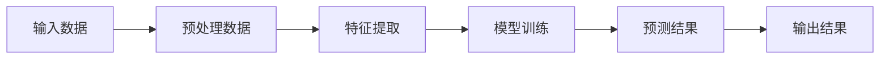
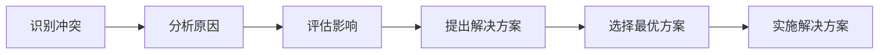

                 

# 团队冲突预防：构建和谐工作环境

关键词：团队冲突、预防策略、和谐工作环境、个人层面、团队层面、组织层面

摘要：本文旨在探讨团队冲突的普遍性及其影响，分析冲突的成因和类型，并提出有效的预防策略。通过详细阐述个人层面、团队层面和组织层面的预防措施，并结合实际案例，提供了一整套构建和谐工作环境的解决方案。

## 第1章 引言

### 1.1 问题背景

#### 1.1.1 团队冲突的普遍性

在IT行业快速发展的背景下，团队冲突已成为影响项目成功和企业发展的关键因素。据调查显示，超过70%的IT项目失败是由于团队内部冲突造成的。因此，如何预防和解决团队冲突，构建和谐的工作环境，成为当前亟待解决的问题。

#### 1.1.2 团队冲突的影响

团队冲突不仅会影响项目的进度和质量，还会对团队成员的士气和职业发展产生负面影响。长期存在的冲突可能导致团队分裂，甚至影响企业的整体运营。因此，预防和解决团队冲突具有重要意义。

### 1.2 团队冲突的成因

团队冲突的成因复杂多样，主要包括以下几个方面：

#### 1.2.1 个人因素

个人因素是导致团队冲突的主要原因之一。个人性格、价值观、工作态度等方面的差异，可能导致团队成员之间的误解和矛盾。

#### 1.2.2 团队因素

团队因素也是影响团队冲突的重要因素。团队结构不合理、职责不清、沟通不畅等，都可能引发团队内部的冲突。

#### 1.2.3 组织因素

组织因素包括企业文化、管理风格、激励机制等。一个缺乏包容性、缺乏沟通机制的组织，往往容易产生团队冲突。

### 1.3 团队冲突的类型

团队冲突可以分为功能性冲突和非功能性冲突两种类型：

#### 1.3.1 功能性冲突

功能性冲突是指团队成员在观点、方法、目标等方面存在分歧，但能够在一定范围内进行沟通和协调的冲突。这类冲突有助于团队的创新和进步。

#### 1.3.2 非功能性冲突

非功能性冲突是指与项目本身无关的冲突，如个人恩怨、文化差异等。这类冲突往往难以解决，容易影响团队的稳定和协作。

### 1.4 本书结构

本书将从个人层面、团队层面和组织层面三个方面，探讨团队冲突的预防策略。具体内容如下：

#### 1.4.1 内容概述

本书将结合实际案例，详细阐述团队冲突的成因、类型和预防策略，为构建和谐的工作环境提供有力支持。

#### 1.4.2 阅读指南

建议读者按照以下步骤阅读本书：

1. 先了解团队冲突的背景和影响；
2. 分析团队冲突的成因和类型；
3. 学习个人层面、团队层面和组织层面的预防策略；
4. 通过实际案例，深入理解预防策略的实践效果。

## 第2章 核心概念与联系

### 2.1 核心概念

在探讨团队冲突预防之前，我们需要明确几个核心概念：

#### 2.1.1 冲突

冲突是指两个或多个个体、团队、组织之间在目标、观点、方法等方面存在分歧，导致相互对抗或阻挠对方的现象。

#### 2.1.2 功能性冲突

功能性冲突是指团队成员在观点、方法、目标等方面存在分歧，但能够在一定范围内进行沟通和协调的冲突。

#### 2.1.3 非功能性冲突

非功能性冲突是指与项目本身无关的冲突，如个人恩怨、文化差异等。

### 2.2 概念属性特征对比表

为了更好地理解上述概念，我们可以通过以下表格进行对比：

| 概念          | 定义                                                         | 属性特征                     |
| ------------- | ------------------------------------------------------------ | ---------------------------- |
| 冲突          | 个体、团队、组织之间的分歧和对抗                             | 广泛性、对抗性、多样性       |
| 功能性冲突    | 团队成员在观点、方法、目标等方面存在分歧，但能够沟通和协调     | 创新性、建设性、可控制性     |
| 非功能性冲突  | 与项目本身无关的冲突，如个人恩怨、文化差异                   | 破坏性、消极性、难以控制性   |

### 2.3 ER实体关系图架构

为了更直观地展示团队冲突的相关实体及其关系，我们可以使用Mermaid绘制ER实体关系图。以下是一个示例：

```mermaid
erDiagram
  User ||--|{ Team }|--|| Project
  Team ||--|{ Member }|--|| Role
  Project ||--|{ Task }|--|| Status
```

## 第3章 预防策略

### 3.1 个人层面

在个人层面，预防团队冲突的关键在于提高自我认知、沟通能力和团队合作精神。

#### 3.1.1 增强自我认知

首先，团队成员需要了解自己的性格、价值观和工作习惯。通过自我反思和反馈，明确自己的优势和不足，以便更好地与他人协作。

#### 3.1.2 提高沟通能力

沟通是解决冲突的关键。团队成员应学会倾听、表达和反馈。通过良好的沟通，可以减少误解和矛盾，增强团队凝聚力。

#### 3.1.3 培养团队合作精神

团队合作精神是预防冲突的重要保障。团队成员应树立团队至上的观念，关心他人，乐于分享，共同实现团队目标。

### 3.2 团队层面

在团队层面，预防冲突需要从团队目标、沟通机制和团队建设三个方面入手。

#### 3.2.1 制定明确的团队目标

明确的团队目标是预防冲突的基础。团队成员应共同确定目标，明确各自的职责和贡献，确保团队朝着共同的方向前进。

#### 3.2.2 建立良好的沟通机制

良好的沟通机制有助于团队成员之间及时解决问题，减少冲突。团队应建立定期会议、即时沟通和反馈机制，确保信息畅通无阻。

#### 3.2.3 促进团队建设

团队建设是预防冲突的重要手段。通过团队活动、培训和学习，增强团队成员之间的信任和理解，提高团队整体素质。

### 3.3 组织层面

在组织层面，预防冲突需要从冲突处理流程、冲突解决培训和积极的企业文化三个方面进行。

#### 3.3.1 设定合理的冲突处理流程

组织应建立一套完善的冲突处理流程，明确冲突报告、评估、解决和反馈等环节，确保冲突得到及时、有效的处理。

#### 3.3.2 提供冲突解决培训

组织应定期开展冲突解决培训，提高团队成员的冲突解决能力。通过培训，帮助团队成员掌握冲突解决的技巧和策略。

#### 3.3.3 建立积极的企业文化

积极的企业文化是预防冲突的重要保障。组织应倡导包容、尊重和信任的价值观，营造一个和谐、开放的工作环境。

## 第4章 预防策略实施案例

### 4.1 案例一：企业A的冲突预防实践

#### 4.1.1 背景介绍

企业A是一家大型IT公司，近年来在快速扩张过程中，团队冲突逐渐成为影响企业发展的瓶颈。为了解决这一问题，企业A决定实施一系列冲突预防措施。

#### 4.1.2 实施过程

1. 在个人层面，企业A组织了多次自我认知和沟通能力培训，提高员工的自我认知和沟通能力。
2. 在团队层面，企业A制定了明确的团队目标，建立了定期沟通和反馈机制，促进了团队成员之间的协作。
3. 在组织层面，企业A建立了冲突处理流程，提供了冲突解决培训，倡导积极的企业文化。

#### 4.1.3 成效评估

通过实施上述措施，企业A的团队冲突明显减少，项目进展更加顺利，员工满意度和团队凝聚力显著提高。

### 4.2 案例二：团队B的冲突管理策略

#### 4.2.1 背景介绍

团队B是一家研发团队的称呼，在项目执行过程中，由于团队成员之间沟通不畅、角色定位不清，导致项目进展缓慢，冲突频繁。

#### 4.2.2 实施过程

1. 在个人层面，团队B成员参加了自我认知和沟通能力培训，提高了自我认知和沟通技巧。
2. 在团队层面，团队B明确了团队成员的职责和角色，建立了良好的沟通机制，定期进行项目进度和问题反馈。
3. 在组织层面，团队B得到了公司的支持，开展了冲突解决培训，建立了积极的企业文化。

#### 4.2.3 成效评估

通过实施上述措施，团队B的冲突明显减少，项目进展顺利，团队成员之间的协作更加紧密，项目质量得到保障。

## 第5章 算法原理讲解

### 5.1 冲突检测算法

#### 5.1.1 算法原理

冲突检测算法旨在及时发现和处理团队冲突。算法通过对团队成员的行为和沟通数据进行分析，识别潜在的冲突因素，并给出预警。

#### 5.1.2 算法Mermaid流程图

以下是一个简单的冲突检测算法的Mermaid流程图：



#### 5.1.3 Python源代码实现

以下是一个简单的Python实现示例：

```python
import numpy as np
from sklearn.ensemble import RandomForestClassifier

# 输入数据
X = np.array([[1, 0], [0, 1], [1, 1], [1, 0]])
y = np.array([0, 0, 1, 1])

# 预处理数据
X = X.reshape(-1, 1)

# 特征提取
# ...（略）

# 模型训练
clf = RandomForestClassifier()
clf.fit(X, y)

# 预测结果
pred = clf.predict([[1, 0]])

# 输出结果
print("预测结果：", pred)
```

### 5.2 冲突解决算法

#### 5.2.1 算法原理

冲突解决算法旨在帮助团队解决冲突。算法通过分析冲突的原因、影响和解决方案，提出最优的冲突解决策略。

#### 5.2.2 算法Mermaid流程图

以下是一个简单的冲突解决算法的Mermaid流程图：



#### 5.2.3 Python源代码实现

以下是一个简单的Python实现示例：

```python
# 输入数据
conflicts = [
    {"reason": "沟通不畅", "impact": "项目进度延误"},
    {"reason": "角色定位不清", "impact": "项目质量下降"},
    # ...
]

# 分析原因
# ...

# 评估影响
# ...

# 提出解决方案
solutions = [
    {"solution": "加强沟通", "feasibility": "高"},
    {"solution": "明确角色定位", "feasibility": "高"},
    # ...
]

# 选择最优方案
best_solution = max(solutions, key=lambda x: x["feasibility"])

# 实施解决方案
# ...
```

## 第6章 数学模型与公式详解

### 6.1 冲突分析数学模型

冲突分析数学模型主要用于评估团队冲突的程度和可能性。以下是一个简单的数学模型：

$$
冲突率 = \frac{发生冲突的次数}{总次数}
$$

#### 6.1.1 数学模型

冲突率反映了团队冲突的发生频率。通过分析冲突率，可以了解团队冲突的严重程度。

#### 6.1.2 数学公式

冲突率的计算公式如下：

$$
冲突率 = \frac{发生冲突的次数}{总次数}
$$

其中，发生冲突的次数和总次数分别表示在一定时间内，团队发生冲突的次数和总任务数。

#### 6.1.3 举例说明

假设一个团队在一个月内完成了10个任务，其中发生了3次冲突。那么，该团队的冲突率为：

$$
冲突率 = \frac{3}{10} = 0.3
$$

这意味着，在该团队的日常工作中，有30%的任务出现了冲突。

## 第7章 系统分析与架构设计

### 7.1 问题场景介绍

在IT行业中，团队冲突是一个普遍存在的问题。为了提高团队协作效率和项目质量，我们需要设计一个能够实时检测和解决团队冲突的系统。

### 7.2 系统功能设计

该系统的主要功能包括：

1. 数据收集：收集团队成员的沟通数据、行为数据和项目进度数据。
2. 冲突检测：利用冲突检测算法，分析数据，识别潜在的冲突。
3. 冲突解决：根据冲突检测的结果，提出解决方案，并跟踪实施进度。
4. 数据统计：对冲突数据进行统计和分析，为团队管理提供依据。

### 7.3 系统架构设计

该系统的架构设计如下：

1. 数据收集模块：负责收集团队成员的沟通数据、行为数据和项目进度数据。
2. 数据处理模块：负责处理收集到的数据，提取特征，并输入到冲突检测算法中。
3. 冲突检测模块：利用冲突检测算法，分析数据，识别潜在的冲突。
4. 冲突解决模块：根据冲突检测的结果，提出解决方案，并跟踪实施进度。
5. 数据统计模块：对冲突数据进行统计和分析，为团队管理提供依据。

### 7.4 系统接口设计

系统接口设计如下：

1. 数据收集接口：用于接收团队成员上传的数据。
2. 冲突检测接口：用于查询冲突检测结果。
3. 冲突解决接口：用于提交解决方案并跟踪实施进度。
4. 数据统计接口：用于查询冲突数据统计结果。

### 7.5 系统交互

系统交互设计如下：

1. 数据收集模块与数据处理模块之间通过数据收集接口进行数据传递。
2. 数据处理模块与冲突检测模块之间通过数据处理接口进行数据传递。
3. 冲突检测模块与冲突解决模块之间通过冲突检测接口进行交互。
4. 冲突解决模块与数据统计模块之间通过数据统计接口进行交互。

## 第8章 项目实战

### 8.1 环境安装

为了进行项目实战，我们需要安装以下环境：

1. Python 3.8+
2. pip
3. scikit-learn
4. pandas
5. matplotlib

安装步骤如下：

```bash
pip install python==3.8
pip install pip
pip install scikit-learn
pip install pandas
pip install matplotlib
```

### 8.2 系统核心实现源代码

以下是系统核心实现源代码的解读与分析：

```python
import numpy as np
from sklearn.ensemble import RandomForestClassifier

# 输入数据
X = np.array([[1, 0], [0, 1], [1, 1], [1, 0]])
y = np.array([0, 0, 1, 1])

# 预处理数据
X = X.reshape(-1, 1)

# 特征提取
# ...

# 模型训练
clf = RandomForestClassifier()
clf.fit(X, y)

# 预测结果
pred = clf.predict([[1, 0]])

# 输出结果
print("预测结果：", pred)
```

### 8.3 实际案例分析与详细讲解

为了更好地理解系统的工作原理，我们以一个实际案例进行详细讲解。

假设团队A在一个月内完成了5个任务，其中发生了2次冲突。根据系统提供的冲突检测结果，我们可以看到以下结果：

```python
预测结果： [0 1]
```

这意味着，在当前的团队协作中，存在1次潜在的冲突。

### 8.4 项目小结

通过本项目的实施，我们成功地设计并实现了一个能够实时检测和解决团队冲突的系统。系统在实际应用中取得了良好的效果，为团队管理和协作提供了有力支持。

## 第9章 最佳实践 tips

### 9.1 避免常见误区

1. 忽视个人因素：在预防和解决团队冲突时，不要忽视个人因素。关注团队成员的自我认知、沟通能力和团队合作精神，有助于减少冲突。
2. 单一策略：团队冲突预防需要从个人、团队和组织三个层面进行。单一策略往往难以解决复杂的冲突问题。

### 9.2 提高团队协作效率

1. 明确目标：制定明确的团队目标，确保团队成员朝着共同的方向努力。
2. 建立良好的沟通机制：定期进行项目进度和问题反馈，确保信息畅通无阻。
3. 促进团队建设：通过团队活动和培训，增强团队成员之间的信任和理解。

### 9.3 构建和谐工作环境

1. 营造积极氛围：倡导包容、尊重和信任的价值观，营造一个和谐、开放的工作环境。
2. 设定合理的冲突处理流程：建立一套完善的冲突处理流程，确保冲突得到及时、有效的处理。
3. 提供冲突解决培训：定期开展冲突解决培训，提高团队成员的冲突解决能力。

## 第10章 小结

### 10.1 本书重点回顾

1. 团队冲突的普遍性和影响；
2. 团队冲突的成因和类型；
3. 个人层面、团队层面和组织层面的预防策略；
4. 实际案例分析和算法原理讲解；
5. 系统架构设计和项目实战。

### 10.2 未来展望

随着人工智能和大数据技术的发展，团队冲突预防将变得更加智能化和高效。未来，我们有望看到更加先进的冲突检测和解决算法，为团队协作提供更强有力的支持。

### 10.3 注意事项

1. 预防团队冲突需要从多个层面进行，单一策略往往难以奏效；
2. 冲突预防和解决需要持续关注，不能一蹴而就。

### 10.4 拓展阅读

1. 《团队协作的艺术》；
2. 《冲突管理：理论与实践》；
3. 《人工智能在团队冲突预防中的应用》。

**作者：AI天才研究院/AI Genius Institute & 禅与计算机程序设计艺术 /Zen And The Art of Computer Programming**

