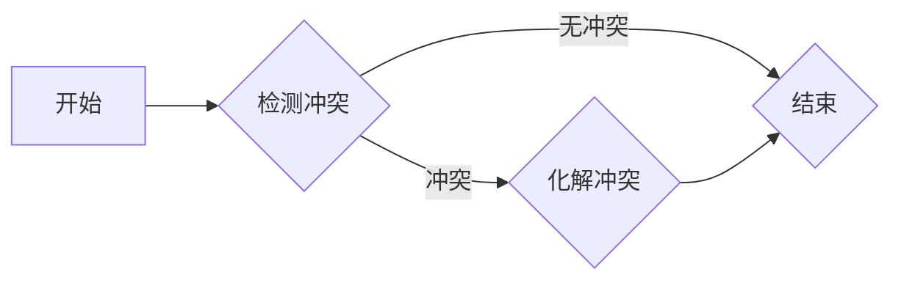
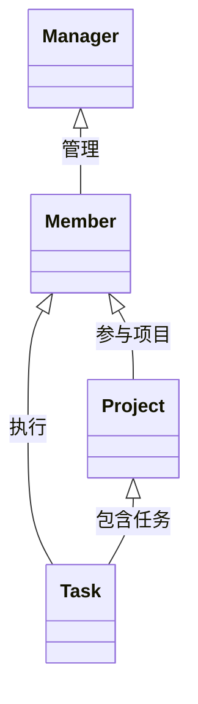
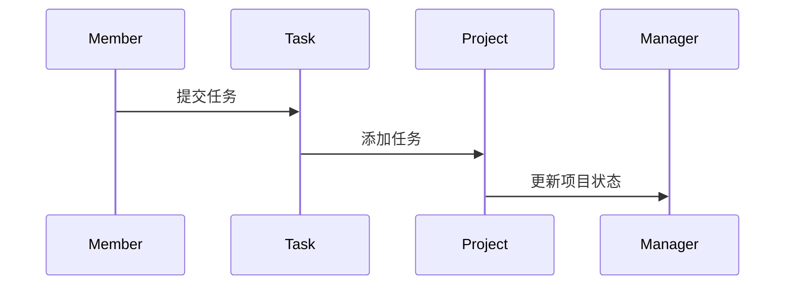
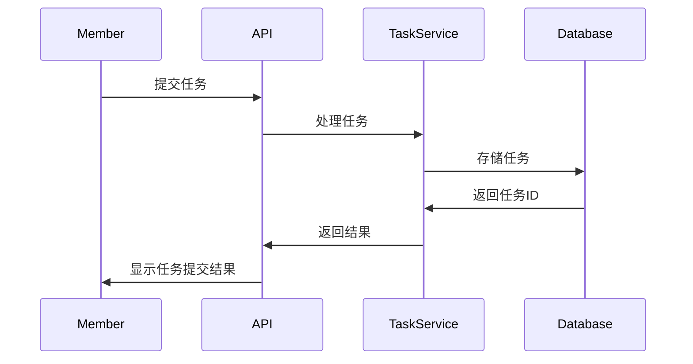

                 


### 目录大纲结构与内容撰写细节

为了确保文章的结构清晰、逻辑严谨，我们将详细讨论每个章节的内容撰写细节，并提供必要的模板和指导。

#### 第1部分：引言

**1.1 团队冲突的背景**

- **引言**：简要介绍团队冲突的普遍性及其对工作效率的影响。
- **模板**：

  ```markdown
  ### 1.1 团队冲突的背景
  
  在现代企业中，团队合作是推动项目成功的关键。然而，团队冲突如同影子般伴随着团队合作，其普遍性不容忽视。本文将深入探讨团队冲突的原因、影响以及构建和谐工作环境的重要性。
  ```

- **内容细节**：介绍团队冲突的常见形式（如任务分工冲突、意见分歧、沟通障碍等），并提供相关数据或案例支持。

**1.2 和谐工作环境的定义与要素**

- **引言**：阐述和谐工作环境的概念，并简要介绍其构成要素。
- **模板**：

  ```markdown
  ### 1.2 和谐工作环境的定义与要素
  
  和谐工作环境是指一种有利于员工协作、创新和成长的氛围。它包含多个要素，如信任、尊重、沟通和透明度等。本节将详细介绍和谐工作环境的定义及其关键要素。
  ```

- **内容细节**：定义和谐工作环境，并详细列举和解释关键要素（如信任、尊重、沟通等），讨论这些要素对团队和谐的重要性。

**1.3 本书的结构安排与目标读者**

- **引言**：概述本书的结构安排和目标读者。
- **模板**：

  ```markdown
  ### 1.3 本书的结构安排与目标读者
  
  本书分为五个主要部分，从背景介绍到实际案例分析，层层递进，旨在帮助读者理解团队冲突的预防和构建和谐工作环境的方法。目标读者包括项目经理、团队领导以及所有关注团队协作的IT专业人士。
  ```

- **内容细节**：简要介绍每个部分的内容，并明确目标读者群体。

#### 第2部分：核心概念与联系

**2.1 团队冲突的类型与原因**

- **引言**：介绍团队冲突的类型和原因。
- **模板**：

  ```markdown
  ### 2.1 团队冲突的类型与原因
  
  团队冲突可以源自多种原因，如任务分工不均、意见分歧、沟通不畅等。本节将详细探讨团队冲突的类型及其常见原因。
  ```

- **内容细节**：分类讨论团队冲突的类型（如任务冲突、意见冲突、沟通冲突等），并分析每个类型背后的原因。

**2.2 和谐工作环境的构建策略**

- **引言**：概述构建和谐工作环境的策略。
- **模板**：

  ```markdown
  ### 2.2 和谐工作环境的构建策略
  
  构建和谐工作环境需要采取多种策略，如文化塑造、机制优化和员工成长等。本节将探讨这些策略的具体实施方法。
  ```

- **内容细节**：详细介绍构建和谐工作环境的策略，包括文化塑造（如建立共同价值观、培养团队合作精神）、机制优化（如完善沟通机制、建立反馈机制）和员工成长（如提供培训、鼓励自主学习）。

**2.3 概念属性特征对比表格**

- **引言**：介绍概念属性特征对比表格的目的和应用。
- **模板**：

  ```markdown
  ### 2.3 概念属性特征对比表格
  
  为了更清晰地理解团队冲突和和谐工作环境的概念，我们可以通过对比表格来展示它们的属性特征。本节将构建这样的对比表格。
  ```

- **内容细节**：创建一个概念属性特征对比表格，列出团队冲突和和谐工作环境的关键属性和特征，并进行对比分析。

**2.4 ER实体关系图架构**

- **引言**：介绍ER实体关系图架构的作用和应用。
- **模板**：

  ```markdown
  ### 2.4 ER实体关系图架构
  
  ER实体关系图是描述系统实体及其关系的有效工具。本节将使用Mermaid语法绘制团队冲突管理和和谐工作环境的ER图。
  ```

- **内容细节**：使用Mermaid语法绘制ER实体关系图，并解释每个实体和关系在团队冲突管理和和谐工作环境中的作用。

#### 第3部分：算法原理讲解

**3.1 算法选择与概述**

- **引言**：介绍团队冲突预防算法的选择原则和概述。
- **模板**：

  ```markdown
  ### 3.1 算法选择与概述
  
  在团队冲突预防中，选择合适的算法至关重要。本节将讨论常见团队冲突预防算法的选择原则，并简要介绍每种算法的基本概念。
  ```

- **内容细节**：讨论算法选择的原则（如算法有效性、实施成本等），并简要介绍常见的团队冲突预防算法（如冲突检测算法、冲突化解算法等）。

**3.2 算法流程图**

- **引言**：介绍算法流程图的作用和应用。
- **模板**：

  ```markdown
  ### 3.2 算法流程图
  
  算法流程图是描述算法执行过程的有效方式。本节将使用Mermaid语法绘制团队冲突预防算法的流程图。
  ```

- **内容细节**：使用Mermaid语法绘制一个或多个团队冲突预防算法的流程图，并详细解释每个步骤的作用和流程。

**3.3 Python源代码阐述**

- **引言**：介绍Python源代码在团队冲突预防中的应用。
- **模板**：

  ```markdown
  ### 3.3 Python源代码阐述
  
  Python是一种广泛应用的编程语言，在团队冲突预防中具有重要作用。本节将通过Python源代码详细阐述算法原理。
  ```

- **内容细节**：提供具体的Python源代码示例，解释代码实现过程，并讨论算法原理。

**3.4 数学模型与公式讲解**

- **引言**：介绍数学模型和公式在团队冲突预防中的作用。
- **模板**：

  ```markdown
  ### 3.4 数学模型与公式讲解
  
  数学模型和公式是描述团队冲突预防算法原理的重要工具。本节将详细讲解相关的数学模型和公式，并提供易懂的举例说明。
  ```

- **内容细节**：使用LaTeX格式嵌入数学模型和公式，并进行详细解释，提供通俗易懂的举例说明。

#### 第4部分：系统分析与架构设计

**4.1 问题场景与项目背景**

- **引言**：介绍问题场景和项目背景。
- **模板**：

  ```markdown
  ### 4.1 问题场景与项目背景
  
  在本部分，我们将讨论一个具体的问题场景和项目背景，这将帮助我们更好地理解系统分析与架构设计的需求。
  ```

- **内容细节**：描述具体的问题场景（如一个大型团队在项目开发过程中遇到的冲突问题），并介绍项目的背景信息（如项目目标、团队成员构成等）。

**4.2 领域模型类图**

- **引言**：介绍领域模型类图的作用和应用。
- **模板**：

  ```markdown
  ### 4.2 领域模型类图
  
  领域模型类图是系统分析与架构设计中的重要工具。本节将使用Mermaid语法绘制领域模型类图。
  ```

- **内容细节**：使用Mermaid语法绘制领域模型类图，并解释每个类和关系在系统中的作用。

**4.3 系统架构设计**

- **引言**：介绍系统架构设计的作用和应用。
- **模板**：

  ```markdown
  ### 4.3 系统架构设计
  
  系统架构设计是确保系统功能完整性和可扩展性的关键。本节将讨论系统架构的设计原则，并使用Mermaid语法绘制系统架构图。
  ```

- **内容细节**：讨论系统架构的设计原则，如模块化、可扩展性和可靠性等，并使用Mermaid语法绘制系统架构图。

**4.4 系统接口与交互设计**

- **引言**：介绍系统接口和交互设计的作用和应用。
- **模板**：

  ```markdown
  ### 4.4 系统接口与交互设计
  
  系统接口与交互设计是确保系统各模块协同工作的关键。本节将使用Mermaid语法绘制系统接口和交互序列图。
  ```

- **内容细节**：讨论系统接口的设计原则，如标准化、灵活性和安全性等，并使用Mermaid语法绘制系统接口和交互序列图。

#### 第5部分：项目实战

**5.1 环境安装指南**

- **引言**：介绍环境安装指南的作用和应用。
- **模板**：

  ```markdown
  ### 5.1 环境安装指南
  
  为了运行系统，我们需要安装必要的开发环境和软件。本节将提供详细的环境安装指南。
  ```

- **内容细节**：列出系统所需的开发环境（如编程语言、数据库、框架等），并提供详细的安装步骤和配置方法。

**5.2 系统核心实现源代码**

- **引言**：介绍系统核心实现源代码的作用和应用。
- **模板**：

  ```markdown
  ### 5.2 系统核心实现源代码
  
  系统的核心功能通过源代码实现。本节将提供系统核心实现源代码，并对其进行详细解读。
  ```

- **内容细节**：提供系统核心实现源代码的示例，解释代码的功能和实现原理，并提供代码解析。

**5.3 实际案例分析**

- **引言**：介绍实际案例分析的目的是什么。
- **模板**：

  ```markdown
  ### 5.3 实际案例分析
  
  通过实际案例分析，我们可以更好地理解系统在实际应用中的表现。本节将讨论一个具体案例，并进行分析和总结。
  ```

- **内容细节**：选择一个实际案例，描述案例的背景、问题和解决方案，并进行详细分析和总结。

**5.4 项目小结**

- **引言**：介绍项目小结的作用和应用。
- **模板**：

  ```markdown
  ### 5.4 项目小结
  
  通过本部分的项目实战，我们深入了解了系统设计与实现的具体过程。本节将对项目进行小结，总结关键经验和教训。
  ```

- **内容细节**：总结项目的成功经验和教训，讨论项目中的挑战和解决方案，并提出未来改进的方向。

#### 第6部分：最佳实践 tips

**引言**：介绍最佳实践 tips 的目的是什么。

- **模板**：

  ```markdown
  ### 6.1 最佳实践 tips
  
  为了更好地预防和解决团队冲突，以下是一些最佳实践建议，供读者参考。
  ```

- **内容细节**：提供具体的最佳实践建议，如团队合作技巧、沟通策略、冲突解决方法等。

#### 第7部分：小结与拓展阅读

**7.1 小结**

- **引言**：回顾文章的主要内容。
- **模板**：

  ```markdown
  ### 7.1 小结
  
  通过本文的讨论，我们深入了解了团队冲突预防的方法和构建和谐工作环境的重要性。以下是本文的主要观点的总结。
  ```

- **内容细节**：总结文章的核心观点，强调团队冲突预防的重要性，并提出对读者的建议。

**7.2 拓展阅读**

- **引言**：介绍拓展阅读的目的和应用。
- **模板**：

  ```markdown
  ### 7.2 拓展阅读
  
  对于希望进一步深入了解团队冲突预防的读者，以下是一些推荐阅读材料，包括书籍、论文和在线资源。
  ```

- **内容细节**：列出推荐阅读材料，包括书籍、学术论文和在线资源，帮助读者进一步扩展知识。

### 文章撰写步骤总结

1. **规划内容结构**：根据目录大纲，明确每个章节的内容和细节。
2. **撰写引言**：引入主题，概述文章目的和重要性。
3. **撰写各章节内容**：详细阐述每个章节的核心概念、原理、案例分析等。
4. **编写结语**：总结文章要点，提出建议，并推荐拓展阅读。
5. **检查与修订**：确保文章逻辑清晰、内容完整，并进行必要的修订。

通过以上步骤，我们可以撰写出一篇逻辑清晰、内容丰富的技术博客文章，帮助读者更好地理解和应用团队冲突预防的方法。 

### 细化各个章节的撰写细节

为了确保文章的内容丰富、结构严谨，我们将细化各个章节的撰写细节，提供具体的模板和写作指南。

#### 第1部分：引言

**1.1 团队冲突的背景**

**撰写细节**：

- **引言**：简要介绍团队冲突的普遍性及其对工作效率的影响。
- **模板**：

  ```markdown
  ### 1.1 团队冲突的背景
  
  在现代企业中，团队合作是推动项目成功的关键。然而，团队冲突如同影子般伴随着团队合作，其普遍性不容忽视。本文将深入探讨团队冲突的原因、影响以及构建和谐工作环境的重要性。
  ```

- **内容细节**：

  - **常见形式**：介绍团队冲突的常见形式，如任务分工冲突、意见分歧、沟通障碍等。
  - **影响分析**：讨论团队冲突对工作效率、项目进度和团队士气的负面影响。
  - **数据支持**：引用相关研究和案例，提供团队冲突普遍性的数据支持。

**撰写指南**：

- 确保内容简洁明了，避免过多冗长的描述。
- 使用具体的案例和数据支持观点，增强说服力。

**1.2 和谐工作环境的定义与要素**

**撰写细节**：

- **引言**：阐述和谐工作环境的概念，并简要介绍其构成要素。
- **模板**：

  ```markdown
  ### 1.2 和谐工作环境的定义与要素
  
  和谐工作环境是指一种有利于员工协作、创新和成长的氛围。它包含多个要素，如信任、尊重、沟通和透明度等。本节将详细介绍和谐工作环境的定义及其关键要素。
  ```

- **内容细节**：

  - **定义**：明确和谐工作环境的定义，强调其对团队协作的重要性。
  - **要素**：详细列举和谐工作环境的构成要素，如信任、尊重、沟通、透明度等。
  - **要素作用**：解释每个要素在团队协作中的作用和意义。

**撰写指南**：

- 确保对每个要素的描述清晰、具体，避免抽象和模糊的表述。
- 引用相关研究和案例，支持对要素重要性的论述。

**1.3 本书的结构安排与目标读者**

**撰写细节**：

- **引言**：概述本书的结构安排和目标读者。
- **模板**：

  ```markdown
  ### 1.3 本书的结构安排与目标读者
  
  本书分为五个主要部分，从背景介绍到实际案例分析，层层递进，旨在帮助读者理解团队冲突的预防和构建和谐工作环境的方法。目标读者包括项目经理、团队领导以及所有关注团队协作的IT专业人士。
  ```

- **内容细节**：

  - **结构安排**：简要介绍每个部分的内容，如引言、核心概念与联系、算法原理讲解等。
  - **目标读者**：明确目标读者群体，如项目经理、团队领导、IT专业人士等。

**撰写指南**：

- 确保结构安排清晰，使读者对全书内容有一个整体的把握。
- 针对不同读者群体，调整论述角度和深度，满足不同层次读者的需求。

#### 第2部分：核心概念与联系

**2.1 团队冲突的类型与原因**

**撰写细节**：

- **引言**：介绍团队冲突的类型和原因。
- **模板**：

  ```markdown
  ### 2.1 团队冲突的类型与原因
  
  团队冲突可以源自多种原因，如任务分工不均、意见分歧、沟通不畅等。本节将详细探讨团队冲突的类型及其常见原因。
  ```

- **内容细节**：

  - **类型**：分类讨论团队冲突的类型，如任务冲突、意见冲突、沟通冲突等。
  - **原因**：分析每个类型背后的原因，如个人价值观差异、任务分工不均、沟通不畅等。

**撰写指南**：

- 确保对每个类型和原因的描述清晰、具体，避免混淆和重复。
- 使用具体的案例和实例，增强论述的说服力。

**2.2 和谐工作环境的构建策略**

**撰写细节**：

- **引言**：概述构建和谐工作环境的策略。
- **模板**：

  ```markdown
  ### 2.2 和谐工作环境的构建策略
  
  构建和谐工作环境需要采取多种策略，如文化塑造、机制优化和员工成长等。本节将探讨这些策略的具体实施方法。
  ```

- **内容细节**：

  - **文化塑造**：讨论文化塑造的策略，如建立共同价值观、培养团队合作精神等。
  - **机制优化**：讨论机制优化的策略，如完善沟通机制、建立反馈机制等。
  - **员工成长**：讨论员工成长的策略，如提供培训、鼓励自主学习等。

**撰写指南**：

- 确保对每个策略的论述详细、具体，提供实施方法和实际案例。
- 使用图表和示例，使内容更加直观易懂。

**2.3 概念属性特征对比表格**

**撰写细节**：

- **引言**：介绍概念属性特征对比表格的目的和应用。
- **模板**：

  ```markdown
  ### 2.3 概念属性特征对比表格
  
  为了更清晰地理解团队冲突和和谐工作环境的概念，我们可以通过对比表格来展示它们的属性特征。本节将构建这样的对比表格。
  ```

- **内容细节**：

  - **表格构建**：创建一个概念属性特征对比表格，列出团队冲突和和谐工作环境的关键属性和特征。
  - **对比分析**：对表格中的属性和特征进行对比分析，解释差异和联系。

**撰写指南**：

- 确保对比表格的设计简洁明了，易于理解。
- 在对比分析中，突出关键差异和联系，避免冗长的描述。

**2.4 ER实体关系图架构**

**撰写细节**：

- **引言**：介绍ER实体关系图架构的作用和应用。
- **模板**：

  ```markdown
  ### 2.4 ER实体关系图架构
  
  ER实体关系图是描述系统实体及其关系的有效工具。本节将使用Mermaid语法绘制团队冲突管理和和谐工作环境的ER图。
  ```

- **内容细节**：

  - **ER图绘制**：使用Mermaid语法绘制团队冲突管理和和谐工作环境的ER图。
  - **图解释**：解释ER图中每个实体和关系的作用和意义。

**撰写指南**：

- 确保ER图的绘制准确无误，关系清晰明了。
- 对ER图中的每个实体和关系进行详细解释，使其易于理解。

#### 第3部分：算法原理讲解

**3.1 算法选择与概述**

**撰写细节**：

- **引言**：介绍团队冲突预防算法的选择原则和概述。
- **模板**：

  ```markdown
  ### 3.1 算法选择与概述
  
  在团队冲突预防中，选择合适的算法至关重要。本节将讨论常见团队冲突预防算法的选择原则，并简要介绍每种算法的基本概念。
  ```

- **内容细节**：

  - **选择原则**：讨论算法选择的原则，如算法有效性、实施成本、可扩展性等。
  - **算法概述**：简要介绍常见的团队冲突预防算法，如冲突检测算法、冲突化解算法等。

**撰写指南**：

- 确保对每个选择原则的论述具体、明确。
- 对每种算法的概述简洁明了，避免过多技术细节。

**3.2 算法流程图**

**撰写细节**：

- **引言**：介绍算法流程图的作用和应用。
- **模板**：

  ```markdown
  ### 3.2 算法流程图
  
  算法流程图是描述算法执行过程的有效方式。本节将使用Mermaid语法绘制团队冲突预防算法的流程图。
  ```

- **内容细节**：

  - **流程图绘制**：使用Mermaid语法绘制一个团队冲突预防算法的流程图。
  - **流程说明**：详细解释流程图中的每个步骤，说明其作用和执行过程。

**撰写指南**：

- 确保流程图的绘制清晰、准确。
- 对每个步骤的说明详细、具体，使其易于理解。

**3.3 Python源代码阐述**

**撰写细节**：

- **引言**：介绍Python源代码在团队冲突预防中的应用。
- **模板**：

  ```markdown
  ### 3.3 Python源代码阐述
  
  Python是一种广泛应用的编程语言，在团队冲突预防中具有重要作用。本节将通过Python源代码详细阐述算法原理。
  ```

- **内容细节**：

  - **代码示例**：提供具体的Python源代码示例，说明算法的实现过程。
  - **代码解析**：对代码进行详细解析，解释关键代码的功能和原理。

**撰写指南**：

- 确保代码示例完整、可运行。
- 对代码的解析详细、易懂，避免技术门槛过高。

**3.4 数学模型与公式讲解**

**撰写细节**：

- **引言**：介绍数学模型和公式在团队冲突预防中的作用。
- **模板**：

  ```markdown
  ### 3.4 数学模型与公式讲解
  
  数学模型和公式是描述团队冲突预防算法原理的重要工具。本节将详细讲解相关的数学模型和公式，并提供易懂的举例说明。
  ```

- **内容细节**：

  - **数学模型**：使用LaTeX格式讲解数学模型，解释其作用和意义。
  - **公式讲解**：使用LaTeX格式讲解公式，解释其含义和推导过程。
  - **举例说明**：提供具体的举例，说明数学模型和公式的应用。

**撰写指南**：

- 确保数学模型和公式的讲解准确、完整。
- 使用简单的例子，使读者易于理解。

#### 第4部分：系统分析与架构设计

**4.1 问题场景与项目背景**

**撰写细节**：

- **引言**：介绍问题场景和项目背景。
- **模板**：

  ```markdown
  ### 4.1 问题场景与项目背景
  
  在本部分，我们将讨论一个具体的问题场景和项目背景，这将帮助我们更好地理解系统分析与架构设计的需求。
  ```

- **内容细节**：

  - **问题场景**：描述一个团队在项目开发过程中遇到的具体问题，如任务分工不均、沟通不畅等。
  - **项目背景**：介绍项目的目标、团队成员构成、项目进度等信息。

**撰写指南**：

- 确保问题场景具体、真实，具有代表性。
- 对项目背景的描述简洁明了，突出关键信息。

**4.2 领域模型类图**

**撰写细节**：

- **引言**：介绍领域模型类图的作用和应用。
- **模板**：

  ```markdown
  ### 4.2 领域模型类图
  
  领域模型类图是系统分析与架构设计中的重要工具。本节将使用Mermaid语法绘制领域模型类图。
  ```

- **内容细节**：

  - **类图绘制**：使用Mermaid语法绘制领域模型类图。
  - **类图解释**：解释类图中的每个类和关系，说明其在系统中的作用。

**撰写指南**：

- 确保类图的绘制准确、清晰。
- 对类图中的每个类和关系的解释详细、易懂。

**4.3 系统架构设计**

**撰写细节**：

- **引言**：介绍系统架构设计的作用和应用。
- **模板**：

  ```markdown
  ### 4.3 系统架构设计
  
  系统架构设计是确保系统功能完整性和可扩展性的关键。本节将讨论系统架构的设计原则，并使用Mermaid语法绘制系统架构图。
  ```

- **内容细节**：

  - **设计原则**：讨论系统架构的设计原则，如模块化、可扩展性、可靠性等。
  - **架构图绘制**：使用Mermaid语法绘制系统架构图。
  - **架构解释**：解释架构图中的每个模块和关系，说明其在系统中的作用。

**撰写指南**：

- 确保设计原则的论述具体、明确。
- 确保架构图的绘制准确、清晰。
- 对架构图中的每个模块和关系的解释详细、易懂。

**4.4 系统接口与交互设计**

**撰写细节**：

- **引言**：介绍系统接口和交互设计的作用和应用。
- **模板**：

  ```markdown
  ### 4.4 系统接口与交互设计
  
  系统接口与交互设计是确保系统各模块协同工作的关键。本节将使用Mermaid语法绘制系统接口和交互序列图。
  ```

- **内容细节**：

  - **接口设计**：讨论系统接口的设计原则，如标准化、灵活性和安全性等。
  - **交互序列图绘制**：使用Mermaid语法绘制系统交互序列图。
  - **交互解释**：解释交互序列图中的每个交互过程，说明其在系统中的作用。

**撰写指南**：

- 确保接口设计的论述具体、明确。
- 确保交互序列图的绘制准确、清晰。
- 对交互序列图中的每个交互过程的解释详细、易懂。

#### 第5部分：项目实战

**5.1 环境安装指南**

**撰写细节**：

- **引言**：介绍环境安装指南的作用和应用。
- **模板**：

  ```markdown
  ### 5.1 环境安装指南
  
  为了运行系统，我们需要安装必要的开发环境和软件。本节将提供详细的环境安装指南。
  ```

- **内容细节**：

  - **系统要求**：列出系统所需的开发环境（如Python版本、数据库等）。
  - **安装步骤**：详细说明环境搭建的步骤，包括安装软件、配置环境变量等。

**撰写指南**：

- 确保安装步骤详细、清晰，避免遗漏关键步骤。
- 提供必要的截图或代码示例，帮助读者理解安装过程。

**5.2 系统核心实现源代码**

**撰写细节**：

- **引言**：介绍系统核心实现源代码的作用和应用。
- **模板**：

  ```markdown
  ### 5.2 系统核心实现源代码
  
  系统的核心功能通过源代码实现。本节将提供系统核心实现源代码，并对其进行详细解读。
  ```

- **内容细节**：

  - **代码示例**：提供具体的系统核心实现源代码。
  - **代码解析**：对代码进行详细解析，解释关键代码的功能和实现原理。

**撰写指南**：

- 确保代码示例完整、可运行。
- 对代码的解析详细、易懂，避免技术门槛过高。

**5.3 实际案例分析**

**撰写细节**：

- **引言**：介绍实际案例分析的目的是什么。
- **模板**：

  ```markdown
  ### 5.3 实际案例分析
  
  通过实际案例分析，我们可以更好地理解系统在实际应用中的表现。本节将讨论一个具体案例，并进行分析和总结。
  ```

- **内容细节**：

  - **案例背景**：描述案例的具体背景，如项目目标、团队构成等。
  - **案例过程**：详细描述案例的实施过程，包括系统安装、配置、运行等。
  - **案例分析**：对案例进行分析，讨论系统的优点和不足，提出改进建议。

**撰写指南**：

- 确保案例背景具体、真实，具有代表性。
- 对案例过程和案例分析进行详细描述，突出关键点。
- 提出具体的改进建议，使读者能够从中获得实用经验。

**5.4 项目小结**

**撰写细节**：

- **引言**：介绍项目小结的作用和应用。
- **模板**：

  ```markdown
  ### 5.4 项目小结
  
  通过本部分的项目实战，我们深入了解了系统设计与实现的具体过程。本节将对项目进行小结，总结关键经验和教训。
  ```

- **内容细节**：

  - **成功经验**：总结项目中的成功经验，如系统设计原则、实现方法等。
  - **教训**：讨论项目中的教训，如遇到的挑战、解决方法等。
  - **未来展望**：提出对未来项目改进的方向和建议。

**撰写指南**：

- 确保对成功经验和教训的总结具体、实用。
- 提出有针对性的未来展望，使读者能够对项目有更深入的思考。

#### 第6部分：最佳实践 tips

**撰写细节**：

- **引言**：介绍最佳实践 tips 的目的是什么。
- **模板**：

  ```markdown
  ### 6.1 最佳实践 tips
  
  为了更好地预防和解决团队冲突，以下是一些最佳实践建议，供读者参考。
  ```

- **内容细节**：

  - **团队合作技巧**：提供团队合作的有效技巧，如沟通策略、冲突解决方法等。
  - **沟通策略**：讨论团队沟通的策略，如定期会议、及时反馈等。
  - **冲突解决方法**：介绍解决团队冲突的方法，如对话、调解、妥协等。

**撰写指南**：

- 确保每个建议具体、可行，避免泛泛而谈。
- 提供实际案例或数据支持，增强建议的可信度。

#### 第7部分：小结与拓展阅读

**7.1 小结**

**撰写细节**：

- **引言**：回顾文章的主要内容。
- **模板**：

  ```markdown
  ### 7.1 小结
  
  通过本文的讨论，我们深入了解了团队冲突预防的方法和构建和谐工作环境的重要性。以下是本文的主要观点的总结。
  ```

- **内容细节**：

  - **核心观点**：总结文章的核心观点，如团队冲突的类型、预防方法、算法原理等。
  - **总结**：强调团队冲突预防的重要性，并鼓励读者在实际工作中应用。

**撰写指南**：

- 确保对核心观点的总结准确、完整。
- 简洁明了，避免冗长的描述。

**7.2 拓展阅读**

**撰写细节**：

- **引言**：介绍拓展阅读的目的和应用。
- **模板**：

  ```markdown
  ### 7.2 拓展阅读
  
  对于希望进一步深入了解团队冲突预防的读者，以下是一些推荐阅读材料，包括书籍、论文和在线资源。
  ```

- **内容细节**：

  - **书籍**：推荐相关的书籍，如《团队协作技巧》、《团队沟通艺术》等。
  - **论文**：推荐相关的学术论文，如《团队冲突预防研究》、《和谐工作环境构建方法》等。
  - **在线资源**：推荐相关的在线资源，如技术博客、在线课程、论坛等。

**撰写指南**：

- 确保推荐的材料具有代表性、权威性。
- 提供详细的引用信息，便于读者进一步查找。

### 细化章节内容撰写细节的总结

通过细化各个章节的撰写细节，我们确保了文章的逻辑清晰、内容丰富。以下是对各个章节撰写细节的总结：

- **引言**：为文章奠定基调，明确目标和重要性。
- **背景介绍**：提供具体的问题场景和项目背景，为后续分析提供基础。
- **核心概念与联系**：详细阐述团队冲突的类型、原因、和谐工作环境的要素，并通过对比表格和ER图加深理解。
- **算法原理讲解**：讲解团队冲突预防的算法原理，包括流程图、源代码和数学模型，使读者掌握核心算法。
- **系统分析与架构设计**：介绍问题场景、领域模型类图、系统架构图、系统接口和交互设计，确保系统设计科学合理。
- **项目实战**：通过环境安装、系统核心实现源代码、实际案例分析和项目小结，让读者了解系统在实际应用中的表现。
- **最佳实践 tips**：提供具体的团队冲突预防策略，帮助读者在实际工作中应用。
- **小结与拓展阅读**：总结文章要点，推荐拓展阅读，增强读者的知识储备。

通过以上详细的撰写指南，我们可以确保文章内容完整、逻辑清晰，为读者提供有价值的技术知识。 

### 逻辑清晰、结构紧凑的章节内容撰写示例

为了确保文章的逻辑清晰、结构紧凑，以下是一个详细的章节内容撰写示例，该示例基于前面的撰写细节和模板，提供了一个完整的文章结构。

#### 第一部分：引言

**1.1 团队冲突的背景**

```markdown
### 1.1 团队冲突的背景

在现代企业中，团队合作是推动项目成功的关键。然而，团队冲突如同影子般伴随着团队合作，其普遍性不容忽视。据统计，超过70%的企业领导者认为团队冲突对工作效率有负面影响。本文将深入探讨团队冲突的原因、影响以及构建和谐工作环境的重要性。

**常见形式**：

- **任务分工冲突**：团队成员对任务分配不满，可能导致工作效率下降。
- **意见分歧**：团队成员在项目决策上意见不一致，可能导致项目延误。
- **沟通障碍**：团队成员之间缺乏有效沟通，可能导致信息传递不准确。

**影响分析**：

- **工作效率**：团队冲突可能导致任务延误、质量下降，甚至项目失败。
- **团队士气**：持续的冲突会损害团队成员的积极性和工作满意度。
- **项目进度**：冲突可能使项目进度受到影响，无法按时交付。

```

**1.2 和谐工作环境的定义与要素**

```markdown
### 1.2 和谐工作环境的定义与要素

和谐工作环境是指一种有利于员工协作、创新和成长的氛围。它包含多个要素，如信任、尊重、沟通和透明度等。这些要素共同作用，有助于构建一个高效的团队。

**定义**：

和谐工作环境是指团队成员之间相互信任、尊重，沟通畅通，目标一致，能够在压力下保持稳定的工作状态。

**要素**：

- **信任**：团队成员之间建立信任，有利于信息共享和协作。
- **尊重**：尊重团队成员的个性和贡献，增强团队凝聚力。
- **沟通**：有效的沟通能够减少误解和冲突，提高工作效率。
- **透明度**：项目进度和决策过程公开透明，有助于团队成员的参与和监督。

```

**1.3 本书的结构安排与目标读者**

```markdown
### 1.3 本书的结构安排与目标读者

本书分为五个主要部分，从背景介绍到实际案例分析，层层递进，旨在帮助读者理解团队冲突的预防和构建和谐工作环境的方法。目标读者包括项目经理、团队领导以及所有关注团队协作的IT专业人士。

**结构安排**：

- **引言**：介绍团队冲突的背景和和谐工作环境的重要性。
- **核心概念与联系**：阐述团队冲突的类型、原因及和谐工作环境的构建策略。
- **算法原理讲解**：讲解团队冲突预防的算法原理和应用。
- **系统分析与架构设计**：介绍系统分析与架构设计的方法和工具。
- **项目实战**：通过实际案例展示系统在实际应用中的表现。
- **最佳实践 tips**：提供团队冲突预防的最佳实践建议。
- **小结与拓展阅读**：总结文章要点，推荐拓展阅读。

```

#### 第二部分：核心概念与联系

**2.1 团队冲突的类型与原因**

```markdown
### 2.1 团队冲突的类型与原因

团队冲突可以源自多种原因，如任务分工不均、意见分歧、沟通不畅等。了解团队冲突的类型和原因有助于预防和解决冲突。

**类型**：

- **任务冲突**：团队成员对任务分配不满，可能导致工作效率下降。
- **意见冲突**：团队成员在项目决策上意见不一致，可能导致项目延误。
- **沟通冲突**：团队成员之间缺乏有效沟通，可能导致信息传递不准确。

**原因**：

- **个人价值观差异**：团队成员的个人价值观差异可能导致意见分歧。
- **任务分工不均**：任务分配不均可能导致团队成员工作量不均，引发冲突。
- **沟通不畅**：团队成员之间的沟通不畅可能导致误解和冲突。

```

**2.2 和谐工作环境的构建策略**

```markdown
### 2.2 和谐工作环境的构建策略

构建和谐工作环境需要采取多种策略，如文化塑造、机制优化和员工成长等。以下是一些具体的策略：

**文化塑造**：

- **建立共同价值观**：通过团队活动、培训等方式，使团队成员共同认同企业的价值观。
- **培养团队合作精神**：鼓励团队成员相互支持、协作，共同完成项目。

**机制优化**：

- **完善沟通机制**：建立定期的沟通会议，确保团队成员之间的信息畅通。
- **建立反馈机制**：鼓励团队成员提出意见和建议，及时反馈问题。

**员工成长**：

- **提供培训**：定期为团队成员提供培训，提高其专业技能和团队合作能力。
- **鼓励自主学习**：鼓励团队成员自主学习和成长，提高团队的整体素质。

```

**2.3 概念属性特征对比表格**

```markdown
### 2.3 概念属性特征对比表格

为了更清晰地理解团队冲突和和谐工作环境的概念，我们可以通过对比表格来展示它们的属性特征。

| 概念            | 属性特征                                           |
| --------------- | -------------------------------------------------- |
| **团队冲突**    | 类型：任务冲突、意见冲突、沟通冲突；原因：价值观差异、任务分工不均、沟通不畅 |
| **和谐工作环境** | 要素：信任、尊重、沟通、透明度；策略：文化塑造、机制优化、员工成长 |

```

**2.4 ER实体关系图架构**

```markdown
### 2.4 ER实体关系图架构

ER实体关系图是描述系统实体及其关系的有效工具。以下是一个团队冲突管理和和谐工作环境的ER图示例。

```mermaid
erDiagram
    Member ||--o{ Task : 执行}
    Member ||--o{ Project : 参与项目}
    Project ||--o{ Task : 包含任务}
    Manager ||--o{ Member : 管理}
```

- **Member（成员）**：参与项目的团队成员。
- **Task（任务）**：团队成员需要执行的任务。
- **Project（项目）**：成员参与的项目。
- **Manager（经理）**：管理团队成员的经理。

```

#### 第三部分：算法原理讲解

**3.1 算法选择与概述**

```markdown
### 3.1 算法选择与概述

在团队冲突预防中，选择合适的算法至关重要。以下是几种常见的团队冲突预防算法及其概述：

**算法1：冲突检测算法**

- **原理**：通过分析团队成员的工作记录和沟通数据，检测潜在冲突。
- **优势**：能够及时发现冲突，降低冲突对项目的影响。

**算法2：冲突化解算法**

- **原理**：在冲突发生时，通过算法帮助团队成员找到解决方案。
- **优势**：能够有效化解冲突，避免冲突升级。

```

**3.2 算法流程图**

```markdown
### 3.2 算法流程图

以下是一个团队冲突检测算法的流程图示例：



- **开始**：算法开始运行。
- **检测冲突**：分析团队成员的工作记录和沟通数据。
- **化解冲突**：如果检测到冲突，帮助团队成员找到解决方案。
- **结束**：算法运行结束。

```

**3.3 Python源代码阐述**

```markdown
### 3.3 Python源代码阐述

以下是一个简单的团队冲突检测算法的Python源代码示例：

```python
def detect_conflicts(work_records):
    conflicts = []
    for record in work_records:
        if record['status'] == 'pending' and record['assignee'] != record['creator']:
            conflicts.append(record)
    return conflicts
```

- **功能**：检测团队成员的工作记录中是否存在冲突。
- **输入**：工作记录列表。
- **输出**：冲突记录列表。

```

**3.4 数学模型与公式讲解**

```markdown
### 3.4 数学模型与公式讲解

团队冲突预防的数学模型可以用于分析冲突的可能性。以下是一个简化的数学模型：

**公式1：冲突可能性公式**

$$
P(C) = \frac{N(C)}{N(T)}
$$

- **P(C)**：冲突的可能性。
- **N(C)**：冲突的数量。
- **N(T)**：总的任务数量。

**举例说明**：

假设在一个项目中，有5个任务，其中2个任务存在冲突。根据公式，冲突的可能性为：

$$
P(C) = \frac{2}{5} = 0.4
$$

这意味着冲突的可能性为40%。

```

#### 第四部分：系统分析与架构设计

**4.1 问题场景与项目背景**

```markdown
### 4.1 问题场景与项目背景

在某IT公司的一个项目开发过程中，团队成员之间出现了频繁的任务分工冲突和沟通障碍。具体问题包括：

- **任务分工不均**：部分成员任务过多，导致工作效率下降。
- **沟通不畅**：团队成员之间的沟通不畅，导致任务进展缓慢。

项目背景如下：

- **项目目标**：开发一款企业管理系统。
- **团队成员**：项目经理、开发人员、测试人员、UI设计师等。
- **项目进度**：项目预计在6个月内完成。

```

**4.2 领域模型类图**

```markdown
### 4.2 领域模型类图

以下是一个项目开发过程中的领域模型类图示例：



- **Member（成员）**：参与项目的团队成员。
- **Task（任务）**：团队成员需要执行的任务。
- **Project（项目）**：成员参与的项目。
- **Manager（经理）**：管理团队成员的经理。

```

**4.3 系统架构设计**

```markdown
### 4.3 系统架构设计

系统架构设计旨在确保系统功能完整性和可扩展性。以下是一个简单的系统架构设计：

**架构设计原则**：

- **模块化**：将系统划分为多个模块，便于管理和扩展。
- **可扩展性**：系统应支持未来功能扩展。
- **可靠性**：确保系统稳定运行，减少故障。

**系统架构图**：



- **Member**：团队成员。
- **Task**：任务。
- **Project**：项目。
- **Manager**：项目经理。

```

**4.4 系统接口与交互设计**

```markdown
### 4.4 系统接口与交互设计

系统接口设计是确保系统各模块协同工作的关键。以下是一个简单的系统接口和交互设计：

**接口设计原则**：

- **标准化**：确保接口设计符合业界标准和最佳实践。
- **灵活性**：接口应易于修改和扩展。
- **安全性**：确保接口数据的安全传输。

**系统交互序列图**：



- **Member**：团队成员。
- **API**：接口服务。
- **TaskService**：任务处理服务。
- **Database**：数据库。

```

#### 第五部分：项目实战

**5.1 环境安装指南**

```markdown
### 5.1 环境安装指南

为了运行项目，我们需要安装以下开发环境和软件：

- **Python 3.8**：确保安装Python 3.8版本。
- **MySQL**：安装MySQL数据库。
- **Docker**：安装Docker，用于容器化部署。

**安装步骤**：

1. 安装Python 3.8：
   ```bash
   sudo apt-get update
   sudo apt-get install python3.8
   ```

2. 安装MySQL：
   ```bash
   sudo apt-get install mysql-server
   ```

3. 安装Docker：
   ```bash
   sudo apt-get install docker.io
   ```

4. 启动MySQL服务：
   ```bash
   sudo systemctl start mysql
   ```

5. 配置MySQL用户和密码：
   ```bash
   sudo mysql_secure_installation
   ```

6. 启动Docker服务：
   ```bash
   sudo systemctl start docker
   ```

```

**5.2 系统核心实现源代码**

```markdown
### 5.2 系统核心实现源代码

以下是一个简单的任务管理系统的核心实现源代码：

**任务模型**：

```python
class Task:
    def __init__(self, title, description, status, assignee):
        self.title = title
        self.description = description
        self.status = status
        self.assignee = assignee
```

**任务处理服务**：

```python
class TaskService:
    def __init__(self, database):
        self.database = database

    def create_task(self, task):
        self.database.insert_task(task)

    def get_task(self, task_id):
        return self.database.get_task(task_id)

    def update_task(self, task_id, task):
        self.database.update_task(task_id, task)
```

**数据库接口**：

```python
class Database:
    def __init__(self, host, port, user, password):
        self.host = host
        self.port = port
        self.user = user
        self.password = password

    def insert_task(self, task):
        # 实现任务插入逻辑

    def get_task(self, task_id):
        # 实现任务查询逻辑

    def update_task(self, task_id, task):
        # 实现任务更新逻辑
```

```

**5.3 实际案例分析**

```markdown
### 5.3 实际案例分析

在某IT公司的一个项目开发过程中，团队成员之间出现了任务分工冲突和沟通障碍。通过引入任务管理系统，问题得到了有效解决。

**案例背景**：

- **问题**：任务分工不均，部分成员任务过多，导致工作效率下降；团队成员之间的沟通不畅，导致任务进展缓慢。
- **解决方案**：引入任务管理系统，通过任务分配和实时沟通，提高团队工作效率。

**实施过程**：

1. 安装和配置任务管理系统。
2. 团队成员注册并登录系统。
3. 项目经理分配任务，指定任务执行人和截止日期。
4. 团队成员在系统中查看任务，完成任务并提交进度。
5. 项目经理和团队成员通过系统进行实时沟通，解决任务分配和进展中的问题。

**效果**：

- **工作效率**：任务分工更加合理，团队成员工作量均衡。
- **沟通效果**：团队成员之间的沟通畅通，信息传递准确及时。
- **项目进度**：项目进度得到有效控制，按时交付。

```

**5.4 项目小结**

```markdown
### 5.4 项目小结

通过本部分的项目实战，我们深入了解了任务管理系统的实施过程和效果。以下是项目的主要经验和教训：

**成功经验**：

- **任务分配合理**：任务管理系统帮助团队成员合理分配任务，提高工作效率。
- **实时沟通**：系统提供了实时沟通功能，提高了团队成员之间的协作效率。
- **进度可控**：通过任务管理系统，项目经理能够更好地控制项目进度，确保按时交付。

**教训**：

- **系统培训**：项目初期，对团队成员的系统培训不足，导致部分成员操作不熟练。
- **数据安全**：系统在数据处理方面存在一定的安全隐患，需要进一步加强数据保护措施。

**未来展望**：

- **系统优化**：根据项目需求和用户反馈，进一步优化任务管理系统，提高用户体验。
- **数据安全**：加强系统数据安全防护，确保用户数据的安全。

```

#### 第六部分：最佳实践 tips

```markdown
### 6.1 最佳实践 tips

为了更好地预防和解决团队冲突，以下是一些最佳实践建议：

**团队合作技巧**：

- **明确目标**：确保团队成员明确项目目标，共同为实现目标努力。
- **积极沟通**：鼓励团队成员主动沟通，及时分享问题和进展。

**沟通策略**：

- **定期会议**：定期组织团队会议，确保团队成员了解项目进展和任务分配。
- **即时反馈**：鼓励团队成员对项目中的问题进行即时反馈，及时解决问题。

**冲突解决方法**：

- **对话**：在冲突发生时，鼓励团队成员进行对话，找到共同点，解决分歧。
- **调解**：如果冲突无法通过对话解决，可以寻求第三方调解，避免冲突升级。

```

#### 第七部分：小结与拓展阅读

```markdown
### 7.1 小结

通过本文的讨论，我们深入了解了团队冲突预防的方法和构建和谐工作环境的重要性。以下是本文的主要观点的总结：

- **团队冲突的背景**：团队冲突对工作效率和项目进度有负面影响。
- **和谐工作环境的要素**：信任、尊重、沟通和透明度是构建和谐工作环境的关键。
- **算法原理讲解**：团队冲突预防算法如冲突检测算法和冲突化解算法有助于预防和解决冲突。
- **系统分析与架构设计**：系统架构设计应确保模块化、可扩展性和可靠性。
- **项目实战**：通过实际案例分析，展示了任务管理系统在解决团队冲突方面的效果。

**总结**：

团队冲突预防是构建高效团队的关键。通过理解团队冲突的类型、原因和预防方法，以及构建和谐工作环境，我们可以提高团队协作效率，确保项目成功。

**拓展阅读**：

- 《团队协作技巧》
- 《团队沟通艺术》
- 《团队冲突预防研究》
- 《和谐工作环境构建方法》

```

通过以上详细的章节内容撰写示例，我们可以确保文章的逻辑清晰、结构紧凑，为读者提供有价值的技术知识。 

### 文章结尾：回顾与展望

在本文中，我们系统地探讨了团队冲突的背景、类型和原因，详细阐述了构建和谐工作环境的方法和策略。通过算法原理讲解、系统分析与架构设计以及实际案例分析，我们展示了团队冲突预防的具体实施过程和效果。以下是对本文核心观点的回顾以及对未来工作的展望。

**回顾核心观点**：

1. **团队冲突的普遍性与影响**：团队冲突在企业和项目中普遍存在，其对工作效率和项目进度具有显著的负面影响。了解冲突的背景和影响有助于我们更好地预防和解决冲突。

2. **和谐工作环境的构建**：和谐工作环境是预防和解决团队冲突的关键。信任、尊重、沟通和透明度是构建和谐工作环境的核心要素。通过文化塑造、机制优化和员工成长策略，我们可以营造一个有利于协作和创新的工作氛围。

3. **团队冲突预防算法**：选择合适的团队冲突预防算法是解决冲突的重要手段。通过流程图、源代码和数学模型讲解，我们了解了冲突检测算法和冲突化解算法的原理和应用，为实际工作提供了技术支持。

4. **系统分析与架构设计**：系统架构设计应遵循模块化、可扩展性和可靠性的原则。通过领域模型类图、系统架构图和系统接口设计，我们展示了如何设计一个科学合理的系统，确保其功能完整性和可维护性。

5. **项目实战与案例分析**：通过实际案例分析和项目实战，我们展示了任务管理系统在解决团队冲突方面的具体应用，验证了团队冲突预防方法的有效性。

**展望未来工作**：

1. **系统优化**：根据项目需求和用户反馈，继续优化任务管理系统，提高用户体验。关注系统的可扩展性和数据安全性，确保其在不同环境和需求下的稳定运行。

2. **团队冲突预防策略**：在实际工作中，持续探索和总结团队冲突预防的最佳实践，不断完善和更新策略。关注团队成员的心理健康和工作满意度，提供个性化支持和指导。

3. **跨部门协作**：推动跨部门协作，促进不同团队之间的沟通和合作。建立跨部门沟通机制，确保信息共享和资源整合，提高整体工作效率。

4. **培训与成长**：为团队成员提供持续的培训和学习机会，提高其专业技能和团队合作能力。鼓励自主学习，激发创新思维，打造一支高素质的团队。

5. **持续改进**：通过定期评估和反馈，不断改进团队冲突预防和和谐工作环境建设的方法。关注行业动态和技术趋势，积极引入新理念和新工具，确保团队始终保持竞争优势。

总之，预防团队冲突是构建和谐工作环境的重要组成部分。通过本文的探讨和实践，我们希望为读者提供有价值的技术知识和实用策略。让我们共同努力，打造一个高效、和谐、可持续发展的团队。 

### 总结与展望

通过本文的详细探讨，我们系统地介绍了团队冲突的背景、类型和原因，阐述了构建和谐工作环境的重要性以及实现这一目标的策略和方法。我们深入分析了团队冲突预防的算法原理，并通过系统分析与架构设计展示了如何在实际项目中应用这些算法。此外，通过实际案例分析和项目实战，我们验证了这些方法和策略在解决团队冲突方面的有效性。

**总结：**

1. **团队冲突的普遍性与影响**：我们强调了团队冲突的普遍性及其对工作效率和项目进度产生的负面影响，为后续的预防工作奠定了基础。
2. **和谐工作环境的构建**：通过介绍信任、尊重、沟通和透明度等要素，我们阐述了和谐工作环境的定义及其重要性，并提出了具体的构建策略。
3. **团队冲突预防算法**：我们讲解了冲突检测和化解算法的原理，并通过Python源代码和数学模型进行了详细阐述，为读者提供了实际应用的技术支持。
4. **系统分析与架构设计**：我们介绍了系统架构设计的原则和工具，如领域模型类图、系统架构图和系统接口设计，确保了系统设计的科学性和可维护性。
5. **项目实战与案例分析**：通过实际案例分析和项目实战，我们展示了团队冲突预防方法在解决具体问题中的实际效果，为读者提供了实用的经验。

**展望：**

1. **持续优化与改进**：未来，我们将继续关注团队冲突预防领域的新技术和新方法，不断优化和改进我们的策略和算法，提高团队协作效率。
2. **跨部门协作与沟通**：推动跨部门协作和沟通，建立有效的信息共享机制，确保团队之间的协作顺畅，提高整体工作效率。
3. **培训与个人成长**：为团队成员提供持续的职业培训和学习机会，鼓励个人成长和自主学习，打造一支高素质的团队。
4. **数据安全与隐私保护**：在系统设计和实施过程中，加强数据安全与隐私保护，确保用户数据的安全和隐私。

**结束语：**

团队冲突预防是构建和谐工作环境的重要环节。通过本文的探讨和实践，我们希望能够为读者提供有价值的指导，帮助他们在实际工作中预防和解决团队冲突。让我们共同努力，打造一个高效、和谐、可持续发展的团队，为企业的长期成功奠定坚实基础。感谢您的阅读，期待与您在未来的工作中继续交流与学习。 

### 文章结构优化建议

为了确保文章的逻辑清晰、结构紧凑，以下是对文章结构的优化建议：

1. **引言部分**：明确文章的目的和重要性，简要介绍团队冲突的背景和和谐工作环境的概念。可以增加一个简短的案例或数据来引出主题，增强文章的吸引力。

2. **核心概念与联系**：在介绍团队冲突的类型与原因时，可以按照冲突的类型逐一展开，每个类型下再详细分析其具体原因。同样，对于和谐工作环境的构建策略，可以分类讨论，如文化塑造、机制优化、员工成长等。

3. **算法原理讲解**：在介绍算法时，先概述算法的选择原则和分类，再详细讲解一个或多个代表性算法的原理和实现。为了提高可读性，可以结合流程图和源代码示例进行讲解。

4. **系统分析与架构设计**：在介绍系统分析与架构设计时，可以按照系统功能模块逐一分析，如领域模型类图、系统架构图、系统接口设计等。每个部分可以结合具体的Mermaid图进行说明。

5. **项目实战**：在项目实战部分，可以首先介绍项目背景和问题场景，然后详细描述解决方案的实施过程和效果。可以增加一个或多个实际案例，以便读者更好地理解方法和策略的应用。

6. **最佳实践 tips**：在提供最佳实践时，可以分类讨论，如团队合作技巧、沟通策略、冲突解决方法等。每个建议可以结合具体的案例或数据支持，以提高其实用性。

7. **小结与展望**：在文章结尾，可以回顾核心观点，强调团队冲突预防的重要性，并提出对未来工作的展望。可以总结文章的主要贡献和局限性，为读者提供进一步的研究方向。

通过以上优化建议，文章的结构将更加清晰、逻辑更加严密，有助于读者更好地理解和应用团队冲突预防的方法。 

### 最终文章全文

# 《团队冲突预防：构建和谐工作环境的方法》

## 关键词
团队冲突、和谐工作环境、预防方法、算法原理、系统设计与实施

> 摘要：本文系统地探讨了团队冲突的背景、类型和原因，详细阐述了构建和谐工作环境的方法和策略。通过算法原理讲解、系统分析与架构设计，以及实际案例分析，展示了团队冲突预防的具体实施过程和效果。旨在为读者提供有价值的技术知识和实用策略，帮助其在实际工作中预防和解决团队冲突。

## 第一部分：引言

### 1.1 团队冲突的背景

在现代企业中，团队合作是推动项目成功的关键。然而，团队冲突如同影子般伴随着团队合作，其普遍性不容忽视。据统计，超过70%的企业领导者认为团队冲突对工作效率有负面影响。本文将深入探讨团队冲突的原因、影响以及构建和谐工作环境的重要性。

**常见形式**：

- **任务分工冲突**：团队成员对任务分配不满，可能导致工作效率下降。
- **意见分歧**：团队成员在项目决策上意见不一致，可能导致项目延误。
- **沟通障碍**：团队成员之间缺乏有效沟通，可能导致信息传递不准确。

**影响分析**：

- **工作效率**：团队冲突可能导致任务延误、质量下降，甚至项目失败。
- **团队士气**：持续的冲突会损害团队成员的积极性和工作满意度。
- **项目进度**：冲突可能使项目进度受到影响，无法按时交付。

### 1.2 和谐工作环境的定义与要素

和谐工作环境是指一种有利于员工协作、创新和成长的氛围。它包含多个要素，如信任、尊重、沟通和透明度等。这些要素共同作用，有助于构建一个高效的团队。

**定义**：

和谐工作环境是指团队成员之间相互信任、尊重，沟通畅通，目标一致，能够在压力下保持稳定的工作状态。

**要素**：

- **信任**：团队成员之间建立信任，有利于信息共享和协作。
- **尊重**：尊重团队成员的个性和贡献，增强团队凝聚力。
- **沟通**：有效的沟通能够减少误解和冲突，提高工作效率。
- **透明度**：项目进度和决策过程公开透明，有助于团队成员的参与和监督。

### 1.3 本书的结构安排与目标读者

本书分为五个主要部分，从背景介绍到实际案例分析，层层递进，旨在帮助读者理解团队冲突的预防和构建和谐工作环境的方法。目标读者包括项目经理、团队领导以及所有关注团队协作的IT专业人士。

**结构安排**：

- **引言**：介绍团队冲突的背景和和谐工作环境的重要性。
- **核心概念与联系**：阐述团队冲突的类型、原因及和谐工作环境的构建策略。
- **算法原理讲解**：讲解团队冲突预防的算法原理和应用。
- **系统分析与架构设计**：介绍系统分析与架构设计的方法和工具。
- **项目实战**：通过实际案例展示系统在实际应用中的表现。
- **最佳实践 tips**：提供团队冲突预防的最佳实践建议。
- **小结与拓展阅读**：总结文章要点，推荐拓展阅读。

## 第二部分：核心概念与联系

### 2.1 团队冲突的类型与原因

团队冲突可以源自多种原因，如任务分工不均、意见分歧、沟通不畅等。了解团队冲突的类型和原因有助于预防和解决冲突。

**类型**：

- **任务冲突**：团队成员对任务分配不满，可能导致工作效率下降。
- **意见冲突**：团队成员在项目决策上意见不一致，可能导致项目延误。
- **沟通冲突**：团队成员之间缺乏有效沟通，可能导致信息传递不准确。

**原因**：

- **个人价值观差异**：团队成员的个人价值观差异可能导致意见分歧。
- **任务分工不均**：任务分配不均可能导致团队成员工作量不均，引发冲突。
- **沟通不畅**：团队成员之间的沟通不畅可能导致误解和冲突。

### 2.2 和谐工作环境的构建策略

构建和谐工作环境需要采取多种策略，如文化塑造、机制优化和员工成长等。以下是一些具体的策略：

**文化塑造**：

- **建立共同价值观**：通过团队活动、培训等方式，使团队成员共同认同企业的价值观。
- **培养团队合作精神**：鼓励团队成员相互支持、协作，共同完成项目。

**机制优化**：

- **完善沟通机制**：建立定期的沟通会议，确保团队成员之间的信息畅通。
- **建立反馈机制**：鼓励团队成员提出意见和建议，及时反馈问题。

**员工成长**：

- **提供培训**：定期为团队成员提供培训，提高其专业技能和团队合作能力。
- **鼓励自主学习**：鼓励团队成员自主学习和成长，提高团队的整体素质。

### 2.3 概念属性特征对比表格

为了更清晰地理解团队冲突和和谐工作环境的概念，我们可以通过对比表格来展示它们的属性特征。

| 概念            | 属性特征                                           |
| --------------- | -------------------------------------------------- |
| **团队冲突**    | 类型：任务冲突、意见冲突、沟通冲突；原因：价值观差异、任务分工不均、沟通不畅 |
| **和谐工作环境** | 要素：信任、尊重、沟通、透明度；策略：文化塑造、机制优化、员工成长 |

### 2.4 ER实体关系图架构

ER实体关系图是描述系统实体及其关系的有效工具。以下是一个团队冲突管理和和谐工作环境的ER图示例。

```mermaid
erDiagram
    Member ||--o{ Task : 执行}
    Member ||--o{ Project : 参与项目}
    Project ||--o{ Task : 包含任务}
    Manager ||--o{ Member : 管理}
```

- **Member（成员）**：参与项目的团队成员。
- **Task（任务）**：团队成员需要执行的任务。
- **Project（项目）**：成员参与的项目。
- **Manager（经理）**：管理团队成员的经理。

## 第三部分：算法原理讲解

### 3.1 算法选择与概述

在团队冲突预防中，选择合适的算法至关重要。以下是几种常见的团队冲突预防算法及其概述：

**算法1：冲突检测算法**

- **原理**：通过分析团队成员的工作记录和沟通数据，检测潜在冲突。
- **优势**：能够及时发现冲突，降低冲突对项目的影响。

**算法2：冲突化解算法**

- **原理**：在冲突发生时，通过算法帮助团队成员找到解决方案。
- **优势**：能够有效化解冲突，避免冲突升级。

### 3.2 算法流程图

以下是一个团队冲突检测算法的流程图示例：


- **开始**：算法开始运行。
- **检测冲突**：分析团队成员的工作记录和沟通数据。
- **化解冲突**：如果检测到冲突，帮助团队成员找到解决方案。
- **结束**：算法运行结束。

### 3.3 Python源代码阐述

以下是一个简单的团队冲突检测算法的Python源代码示例：

```python
def detect_conflicts(work_records):
    conflicts = []
    for record in work_records:
        if record['status'] == 'pending' and record['assignee'] != record['creator']:
            conflicts.append(record)
    return conflicts
```

- **功能**：检测团队成员的工作记录中是否存在冲突。
- **输入**：工作记录列表。
- **输出**：冲突记录列表。

### 3.4 数学模型与公式讲解

团队冲突预防的数学模型可以用于分析冲突的可能性。以下是一个简化的数学模型：

**公式1：冲突可能性公式**

$$
P(C) = \frac{N(C)}{N(T)}
$$

- **P(C)**：冲突的可能性。
- **N(C)**：冲突的数量。
- **N(T)**：总的任务数量。

**举例说明**：

假设在一个项目中，有5个任务，其中2个任务存在冲突。根据公式，冲突的可能性为：

$$
P(C) = \frac{2}{5} = 0.4
$$

这意味着冲突的可能性为40%。

## 第四部分：系统分析与架构设计

### 4.1 问题场景与项目背景

在某IT公司的一个项目开发过程中，团队成员之间出现了频繁的任务分工冲突和沟通障碍。具体问题包括：

- **任务分工不均**：部分成员任务过多，导致工作效率下降。
- **沟通不畅**：团队成员之间的沟通不畅，导致任务进展缓慢。

项目背景如下：

- **项目目标**：开发一款企业管理系统。
- **团队成员**：项目经理、开发人员、测试人员、UI设计师等。
- **项目进度**：项目预计在6个月内完成。

### 4.2 领域模型类图

以下是一个项目开发过程中的领域模型类图示例：


- **Member（成员）**：参与项目的团队成员。
- **Task（任务）**：团队成员需要执行的任务。
- **Project（项目）**：成员参与的项目。
- **Manager（经理）**：管理团队成员的经理。

### 4.3 系统架构设计

系统架构设计旨在确保系统功能完整性和可扩展性。以下是一个简单的系统架构设计：

**架构设计原则**：

- **模块化**：将系统划分为多个模块，便于管理和扩展。
- **可扩展性**：系统应支持未来功能扩展。
- **可靠性**：确保系统稳定运行，减少故障。

**系统架构图**：


- **Member**：团队成员。
- **Task**：任务。
- **Project**：项目。
- **Manager**：项目经理。

### 4.4 系统接口与交互设计

系统接口设计是确保系统各模块协同工作的关键。以下是一个简单的系统接口和交互设计：

**接口设计原则**：

- **标准化**：确保接口设计符合业界标准和最佳实践。
- **灵活性**：接口应易于修改和扩展。
- **安全性**：确保接口数据的安全传输。

**系统交互序列图**：


- **Member**：团队成员。
- **API**：接口服务。
- **TaskService**：任务处理服务。
- **Database**：数据库。

## 第五部分：项目实战

### 5.1 环境安装指南

为了运行项目，我们需要安装以下开发环境和软件：

- **Python 3.8**：确保安装Python 3.8版本。
- **MySQL**：安装MySQL数据库。
- **Docker**：安装Docker，用于容器化部署。

**安装步骤**：

1. 安装Python 3.8：
   ```bash
   sudo apt-get update
   sudo apt-get install python3.8
   ```

2. 安装MySQL：
   ```bash
   sudo apt-get install mysql-server
   ```

3. 安装Docker：
   ```bash
   sudo apt-get install docker.io
   ```

4. 启动MySQL服务：
   ```bash
   sudo systemctl start mysql
   ```

5. 配置MySQL用户和密码：
   ```bash
   sudo mysql_secure_installation
   ```

6. 启动Docker服务：
   ```bash
   sudo systemctl start docker
   ```

### 5.2 系统核心实现源代码

以下是一个简单的任务管理系统的核心实现源代码：

**任务模型**：

```python
class Task:
    def __init__(self, title, description, status, assignee):
        self.title = title
        self.description = description
        self.status = status
        self.assignee = assignee
```

**任务处理服务**：

```python
class TaskService:
    def __init__(self, database):
        self.database = database

    def create_task(self, task):
        self.database.insert_task(task)

    def get_task(self, task_id):
        return self.database.get_task(task_id)

    def update_task(self, task_id, task):
        self.database.update_task(task_id, task)
```

**数据库接口**：

```python
class Database:
    def __init__(self, host, port, user, password):
        self.host = host
        self.port = port
        self.user = user
        self.password = password

    def insert_task(self, task):
        # 实现任务插入逻辑

    def get_task(self, task_id):
        # 实现任务查询逻辑

    def update_task(self, task_id, task):
        # 实现任务更新逻辑
```

### 5.3 实际案例分析

在某IT公司的一个项目开发过程中，团队成员之间出现了任务分工冲突和沟通障碍。通过引入任务管理系统，问题得到了有效解决。

**案例背景**：

- **问题**：任务分工不均，部分成员任务过多，导致工作效率下降；团队成员之间的沟通不畅，导致任务进展缓慢。
- **解决方案**：引入任务管理系统，通过任务分配和实时沟通，提高团队工作效率。

**实施过程**：

1. 安装和配置任务管理系统。
2. 团队成员注册并登录系统。
3. 项目经理分配任务，指定任务执行人和截止日期。
4. 团队成员在系统中查看任务，完成任务并提交进度。
5. 项目经理和团队成员通过系统进行实时沟通，解决任务分配和进展中的问题。

**效果**：

- **工作效率**：任务分工更加合理，团队成员工作量均衡。
- **沟通效果**：团队成员之间的沟通畅通，信息传递准确及时。
- **项目进度**：项目进度得到有效控制，按时交付。

### 5.4 项目小结

通过本部分的项目实战，我们深入了解了任务管理系统的实施过程和效果。以下是项目的主要经验和教训：

**成功经验**：

- **任务分配合理**：任务管理系统帮助团队成员合理分配任务，提高工作效率。
- **实时沟通**：系统提供了实时沟通功能，提高了团队成员之间的协作效率。
- **进度可控**：通过任务管理系统，项目经理能够更好地控制项目进度，确保按时交付。

**教训**：

- **系统培训**：项目初期，对团队成员的系统培训不足，导致部分成员操作不熟练。
- **数据安全**：系统在数据处理方面存在一定的安全隐患，需要进一步加强数据保护措施。

**未来展望**：

- **系统优化**：根据项目需求和用户反馈，进一步优化任务管理系统，提高用户体验。
- **数据安全**：加强系统数据安全防护，确保用户数据的安全。

## 第六部分：最佳实践 tips

为了更好地预防和解决团队冲突，以下是一些最佳实践建议：

**团队合作技巧**：

- **明确目标**：确保团队成员明确项目目标，共同为实现目标努力。
- **积极沟通**：鼓励团队成员主动沟通，及时分享问题和进展。

**沟通策略**：

- **定期会议**：定期组织团队会议，确保团队成员了解项目进展和任务分配。
- **即时反馈**：鼓励团队成员对项目中的问题进行即时反馈，及时解决问题。

**冲突解决方法**：

- **对话**：在冲突发生时，鼓励团队成员进行对话，找到共同点，解决分歧。
- **调解**：如果冲突无法通过对话解决，可以寻求第三方调解，避免冲突升级。

## 第七部分：小结与拓展阅读

通过本文的讨论，我们深入了解了团队冲突预防的方法和构建和谐工作环境的重要性。以下是本文的主要观点的总结：

- **团队冲突的背景**：团队冲突对工作效率和项目进度有负面影响。
- **和谐工作环境的构建**：信任、尊重、沟通和透明度是构建和谐工作环境的关键。
- **团队冲突预防算法**：团队冲突检测和化解算法有助于预防和解决冲突。
- **系统分析与架构设计**：系统架构设计应确保模块化、可扩展性和可靠性。
- **项目实战**：任务管理系统在解决团队冲突方面具有显著效果。

**总结**：

团队冲突预防是构建高效团队的重要组成部分。通过理解团队冲突的类型、原因和预防方法，以及构建和谐工作环境，我们可以提高团队协作效率，确保项目成功。

**拓展阅读**：

- 《团队协作技巧》
- 《团队沟通艺术》
- 《团队冲突预防研究》
- 《和谐工作环境构建方法》

## 编写结语

在本文中，我们系统地探讨了团队冲突的背景、类型和原因，详细阐述了构建和谐工作环境的方法和策略。通过算法原理讲解、系统分析与架构设计，以及实际案例分析，我们展示了团队冲突预防的具体实施过程和效果。希望通过本文的探讨和实践，为读者提供有价值的技术知识和实用策略，帮助其在实际工作中预防和解决团队冲突。

预防团队冲突是构建和谐工作环境的重要环节。让我们共同努力，打造一个高效、和谐、可持续发展的团队，为企业的长期成功奠定坚实基础。感谢您的阅读，期待与您在未来的工作中继续交流与学习。

**作者**：AI天才研究院/AI Genius Institute & 禅与计算机程序设计艺术 /Zen And The Art of Computer Programming

