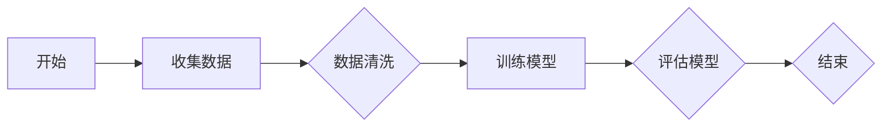
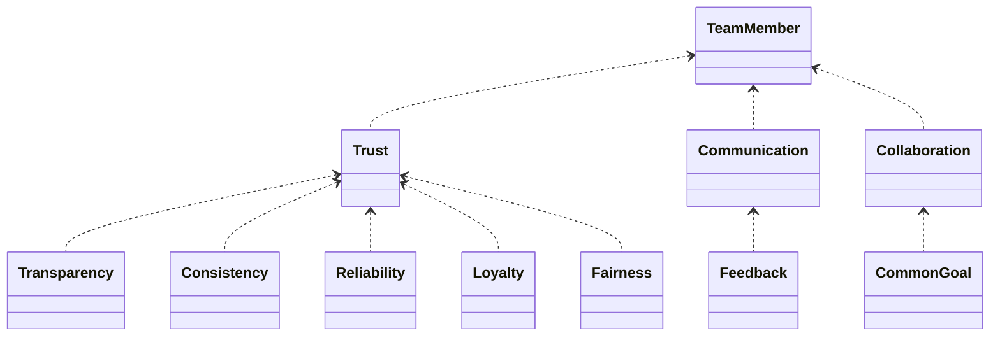
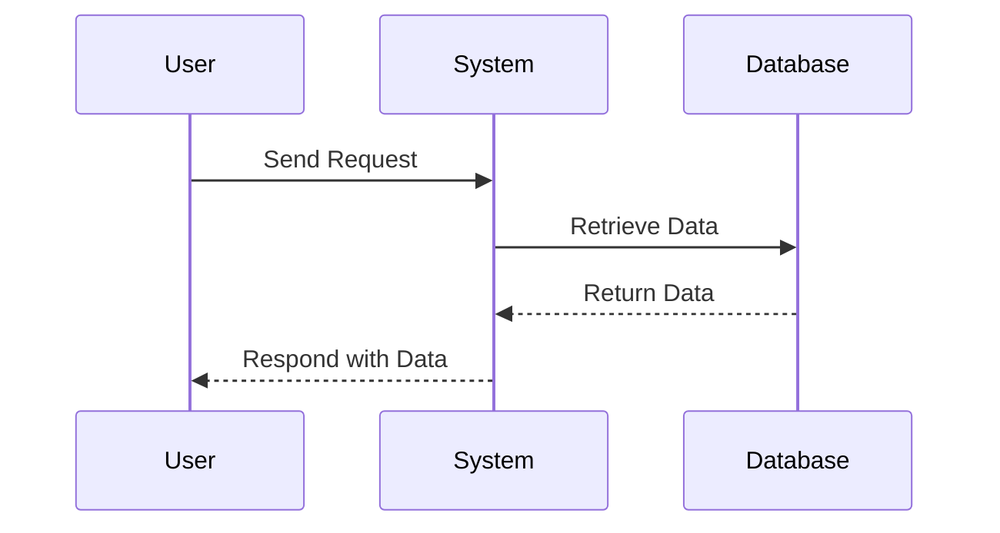
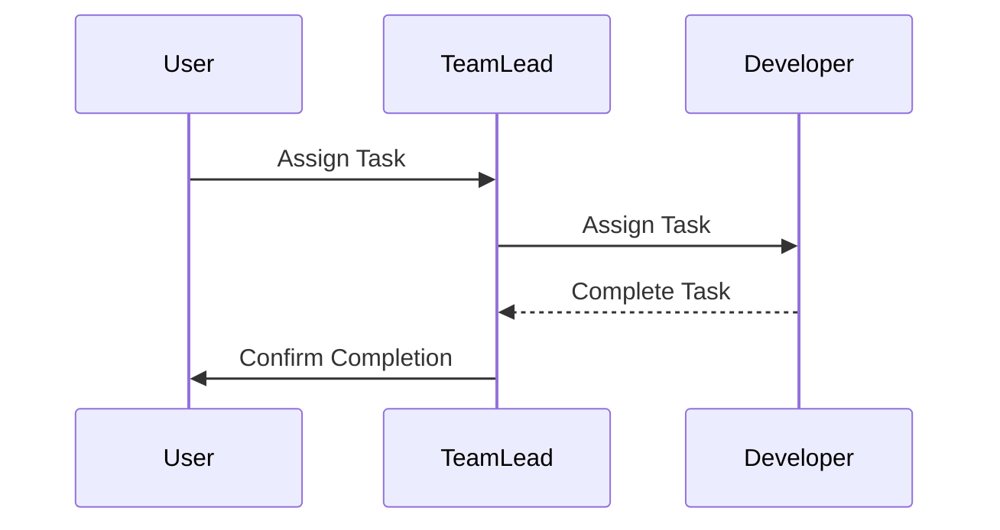

                 

### 团队凝聚的重要性与挑战

在当今复杂多变的环境中，企业的发展离不开高效的团队协作。团队凝聚不仅仅是成员之间的情感联结，更是实现组织目标、提高工作效率和竞争力的关键因素。团队凝聚的重要性体现在多个方面。

首先，一个凝聚的团队能够更好地协同工作，发挥每个成员的专业能力和创新精神。当团队成员彼此信任并紧密合作时，他们能够更有效地分工协作，共同应对复杂的项目挑战。团队成员之间的信任感可以减少沟通成本，避免误解和冲突，从而提高工作效率。

其次，团队凝聚对于企业的长期发展至关重要。一个具有高度凝聚力的团队能够在逆境中保持稳定，积极应对外部变化，从而为企业带来持续的创新动力和市场竞争力。相反，缺乏凝聚力的团队往往在面临挑战时容易分崩离析，影响企业的稳定发展。

然而，在现实工作中，建立团队凝聚力并非易事。首先，团队成员的背景、技能和个性各异，需要有效的管理方法来促进彼此之间的融合。其次，组织内部可能存在信息不对称、资源分配不均等问题，这些都可能削弱团队的凝聚力。此外，外部环境的快速变化也要求团队具备高度的灵活性和适应性，这对团队凝聚提出了更高的要求。

当前团队凝聚面临的挑战还包括沟通不畅、目标不一致、个人利益冲突等问题。团队成员之间缺乏有效的沟通，容易导致误解和矛盾；当团队目标不明确或成员对目标的理解不一致时，团队凝聚力会大大降低；而个人利益与团队利益的冲突也会破坏团队的凝聚力。

总之，团队凝聚对于组织的成功至关重要，但建立和维护团队凝聚力面临诸多挑战。本文将深入探讨团队凝聚的理论基础，逐步分析建立信任的关键步骤，并分享实际应用中的成功案例和最佳实践，以期为读者提供有效的指导。

### 第1章：团队凝聚的重要性与挑战

#### 1.1 团队凝聚的定义与意义

团队凝聚是指团队成员之间形成的紧密联系和共同协作的状态，其核心在于成员之间的信任、尊重和相互支持。在组织行为学中，团队凝聚通常被定义为团队成员对团队归属感和团队目标的认同程度，以及团队成员之间的协作与互动。

团队凝聚的重要性可以从以下几个方面进行理解：

首先，团队凝聚有助于提高工作效率。一个凝聚的团队能够更有效地分工协作，减少沟通成本，避免误解和冲突。团队成员之间的信任感可以让他们更放心地分享信息、知识和经验，从而提高工作的整体效率。

其次，团队凝聚能够促进创新和创造力。在一个凝聚的团队中，成员之间的互动和协作可以激发新的观点和想法，有助于产生创新性的解决方案。此外，团队成员之间的信任和尊重也可以减少创新过程中的风险和阻力，鼓励他们勇于尝试和探索。

第三，团队凝聚有助于提高员工满意度和忠诚度。一个凝聚力强的团队能够提供良好的工作氛围，减少工作压力，提高员工的幸福感和满意度。这有助于降低员工流失率，提高员工的忠诚度和长期投入度。

#### 1.2 团队凝聚对组织的影响

团队凝聚对组织的整体表现有着深远的影响。以下是一些关键方面：

1. **团队协作效率**：高度凝聚的团队能够更有效地协作，共同完成任务。团队成员之间的信任和协作可以减少沟通障碍，提高工作效率。这种高效的团队协作有助于组织在竞争激烈的市场中保持优势。

2. **员工士气**：一个凝聚的团队能够提供积极向上的工作氛围，提升员工的士气。团队成员之间的相互支持可以减少工作压力，提高工作满意度。这种积极的氛围有助于吸引和留住优秀的员工，提升整体团队士气。

3. **创新力**：团队凝聚有助于激发团队成员的创新思维。在一个互相尊重和信任的环境中，成员更愿意分享自己的观点和建议，从而促进创新和创造力的发挥。这种创新力可以为企业带来持续的市场竞争力。

4. **组织稳定性**：团队凝聚有助于增强组织的稳定性。在一个凝聚的团队中，成员对团队和组织的忠诚度更高，更愿意为组织的目标和愿景而努力。这种忠诚和投入有助于提高组织的整体稳定性和长期发展潜力。

#### 1.3 当前团队凝聚面临的挑战

尽管团队凝聚对组织的重要性不言而喻，但现实中建立和维护团队凝聚力仍然面临诸多挑战。以下是一些主要挑战：

1. **沟通不畅**：团队成员之间缺乏有效的沟通是团队凝聚力下降的主要原因之一。信息不对称、误解和冲突都可能导致沟通不畅，影响团队的协作效率。

2. **目标不一致**：当团队成员对团队目标的理解不一致时，容易导致分工不明确、协作不畅，从而削弱团队的凝聚力。明确和一致的目标是团队凝聚的重要基础。

3. **个人利益冲突**：团队成员之间的个人利益冲突也会影响团队凝聚力。如果团队成员过于关注个人利益而忽视团队利益，容易导致团队内部的矛盾和分裂。

4. **组织文化问题**：组织文化是影响团队凝聚力的关键因素。在一个强调竞争和个体主义的组织中，团队凝聚可能难以建立和维护。相反，一个强调合作和团队精神的文化有助于增强团队的凝聚力。

5. **外部环境变化**：外部环境的快速变化对团队凝聚力提出了更高的要求。团队需要具备高度的灵活性和适应性，以应对外部变化带来的挑战。然而，这种变化也可能导致团队内部的不确定性和焦虑，影响团队的稳定性。

#### 1.4 本章小结

团队凝聚是组织成功的关键因素，对于提高工作效率、促进创新、提升员工满意度和增强组织稳定性具有重要作用。然而，在现实中，建立和维护团队凝聚力面临诸多挑战，如沟通不畅、目标不一致、个人利益冲突等。通过深入理解和应对这些挑战，组织可以更好地提升团队凝聚力，从而实现长期可持续发展。

### 第2章：团队凝聚的理论基础

在探讨团队凝聚的问题时，我们需要建立一套坚实的理论基础，以帮助我们理解和分析团队凝聚的内在机制。在这章中，我们将重点介绍团队凝聚的理论框架，并探讨信任在团队凝聚中的核心作用。

#### 2.1 信任在团队凝聚中的作用

信任是团队凝聚的基石，它贯穿于团队协作的各个方面。当团队成员彼此信任时，他们更愿意分享信息、知识和资源，从而提高协作效率。此外，信任还可以减少冲突和误解，增强团队的稳定性和长期发展潜力。

信任在团队凝聚中的作用主要体现在以下几个方面：

1. **提高沟通效率**：信任可以消除团队成员之间的沟通障碍，使得信息传递更加顺畅和准确。在一个信任的基础上，团队成员更愿意分享自己的观点和建议，从而促进更深入的讨论和合作。

2. **促进知识共享**：信任可以降低知识共享的障碍，使团队成员更愿意分享自己的知识和经验。这种知识共享有助于提升团队整体的能力和竞争力。

3. **减少冲突和误解**：在一个信任的环境中，团队成员更少地发生冲突和误解。他们倾向于通过合作和协商来解决分歧，而不是通过对抗和争斗。

4. **增强团队稳定性**：信任可以增强团队的稳定性，使团队成员在面对外部压力和挑战时保持团结和一致。这种稳定性有助于组织在复杂和变化的环境中保持竞争力。

#### 2.2 信任的五大要素

为了更好地理解信任在团队凝聚中的重要作用，我们需要探讨信任的五大要素，即透明度、一致性、可靠性、忠诚和公平性。这些要素是建立和维护信任的基础。

1. **透明度**：透明度是指团队成员在决策和行动过程中保持开放和透明。高透明度的团队能够提供更多的信息和解释，从而增强成员之间的信任。例如，在一个透明的团队中，团队成员可以清楚地了解项目的进展、任务分工和决策理由，这有助于减少误解和猜疑。

2. **一致性**：一致性是指团队成员在行为和态度上保持一致性。一致性可以建立稳定和可预测的团队环境，从而增强信任。例如，如果一个团队成员总是按时完成任务，那么其他成员会对他产生信任，认为他具有可靠性和责任感。

3. **可靠性**：可靠性是指团队成员履行承诺和责任的能力。可靠性是信任的关键要素之一，因为团队成员需要确信对方会履行他们的承诺。例如，如果一个团队成员总是按时提交报告，那么其他成员会对他产生信任，认为他是一个可靠的合作伙伴。

4. **忠诚**：忠诚是指团队成员对团队和组织的忠诚和承诺。忠诚可以建立团队成员之间的紧密联系，从而增强团队的凝聚力。例如，当一个团队成员在困难时期选择留在团队中，而不是选择离开，这表明他对团队的忠诚和承诺。

5. **公平性**：公平性是指团队成员在资源和机会分配上感受到的公平和公正。公平性可以减少团队成员之间的不满和冲突，从而增强团队凝聚力。例如，在一个公平的团队中，每个成员都感到自己的贡献得到了认可和回报。

#### 2.3 团队凝聚力与信任的关系

团队凝聚力和信任之间存在着密切的关系。信任是团队凝聚力的核心要素，而团队凝聚力是信任的外在表现。以下是团队凝聚力和信任之间的一些关系：

1. **相互促进**：信任和团队凝聚力是相互促进的。高信任度的团队往往具有更高的凝聚力，而高凝聚力的团队也更容易建立信任。例如，一个凝聚力强的团队可以通过共同的努力和协作来建立信任，而一个信任度高的团队则可以更轻松地实现团队目标。

2. **相互作用**：团队凝聚力和信任相互作用，彼此影响。信任可以增强团队的凝聚力，而团队凝聚力又可以促进信任的建立。例如，一个高信任度的团队可以通过共同的成就和合作来增强团队的凝聚力。

3. **反馈循环**：团队凝聚力和信任之间存在反馈循环。信任的提升可以增强团队的凝聚力，而团队凝聚力的增强又可以进一步促进信任的建立。这种反馈循环有助于形成良性循环，使团队在信任和凝聚力的基础上不断发展。

#### 2.4 信任模型与团队凝聚力的提升策略

为了更好地理解如何建立和维护团队凝聚力，我们可以借助信任模型来制定相应的提升策略。以下是一个简单的信任模型，以及基于该模型的一些提升团队凝聚力的策略：

1. **透明沟通**：通过提高透明度，团队成员可以更清楚地了解团队的目标、决策和进展。这可以通过定期会议、项目报告和即时通讯工具来实现。

2. **一致行为**：通过保持一致性，团队成员可以在行为和态度上相互呼应，减少误解和冲突。这可以通过明确的规则、标准和程序来实现。

3. **可靠执行**：通过增强可靠性，团队成员可以更信任彼此的承诺和行动。这可以通过设定明确的期限、目标和责任来实现。

4. **忠诚合作**：通过培养忠诚，团队成员可以更紧密地团结在一起，共同为团队的目标而努力。这可以通过激励措施、团队建设活动和共同目标来实现。

5. **公平待遇**：通过确保公平性，团队成员可以在资源和机会的分配上感受到公正，从而减少不满和冲突。这可以通过公平的评价体系、奖励机制和透明的过程来实现。

#### 2.5 本章小结

团队凝聚的理论基础是理解和提升团队凝聚力的重要依据。在这章中，我们探讨了团队凝聚的定义和重要性，介绍了信任在团队凝聚中的核心作用，并分析了信任的五大要素。通过理解这些理论，我们可以制定出有效的提升团队凝聚力的策略，从而在复杂多变的环境中实现组织的长期成功。

### 第3章：建立信任的第一步——自我认知

#### 3.1 自我认知的重要性

在团队中建立信任的第一步是自我认知。自我认知是指团队成员对自己性格、价值观、行为模式等内在特征的深入了解。自我认知的重要性在于，它为团队成员提供了一个清晰的认识，帮助他们更好地理解自己，从而在团队互动中展现出更为一致和可靠的行为。

自我认知的重要性可以从以下几个方面进行理解：

1. **增强自我管理能力**：自我认知使团队成员能够更好地控制自己的情绪和行为。通过了解自己的性格和价值观，他们可以在面对压力和挑战时保持冷静，从而更好地应对复杂的工作环境。

2. **提升沟通效率**：自我认知有助于团队成员更好地理解自己的沟通风格和偏好，从而在沟通中更加明确和有效。这种自我认知还可以减少误解和冲突，提高团队沟通的效率。

3. **促进个人成长**：自我认知是个人成长的重要基石。通过深入了解自己，团队成员可以识别自身的优势和不足，并制定相应的成长计划，从而不断提升自己的能力和素质。

#### 3.2 如何提升自我认知

提升自我认知需要采取一系列有针对性的方法和策略。以下是一些建议：

1. **反思和自我评估**：定期进行自我反思和自我评估，可以帮助团队成员深入了解自己的行为和表现。通过反思，他们可以识别自己的优点和不足，并思考如何改进。

2. **职业发展辅导**：寻求职业发展辅导是一个有效的方法，可以帮助团队成员从专业角度深入了解自己的职业路径和发展潜力。职业辅导师可以提供专业的指导和建议，帮助团队成员更好地理解自己。

3. **参与团队建设活动**：参与团队建设活动，如团队拓展训练、团队协作游戏等，可以帮助团队成员在互动中更好地认识自己。这些活动通常设计有各种挑战和任务，团队成员需要在合作中相互了解和支持，从而增进自我认知。

4. **寻求反馈**：定期向同事、上级或下属寻求反馈，可以帮助团队成员从他人的视角了解自己。这些反馈可以提供宝贵的外部视角，帮助团队成员更全面地了解自己的表现和影响。

5. **阅读和学习**：阅读相关书籍、参加培训课程和研讨会，可以帮助团队成员获取更多的知识和信息，从而提高自我认知。通过学习心理学、组织行为学等领域的知识，团队成员可以更好地理解自己和他人。

#### 3.3 实例分析：如何在团队中提升自我认知

为了更具体地说明如何提升自我认知，我们可以通过一个实例来进行分析。

案例：某IT公司的开发团队希望提升团队成员的自我认知，以增强团队的凝聚力。

**步骤1：反思和自我评估**
团队领导者组织了一次反思会议，要求每位成员写一篇自我评估报告，内容包括自己的性格特点、职业目标、当前的工作表现等。团队成员通过这种自我评估，更好地了解自己的优势和不足。

**步骤2：职业发展辅导**
团队领导安排了一次职业发展辅导，邀请了一位外部职业导师为团队成员提供一对一的辅导。职业导师通过专业的问题引导，帮助团队成员深入探讨自己的职业路径和发展计划。

**步骤3：团队建设活动**
团队领导者组织了一次户外拓展训练，包括团队合作游戏、高空挑战等。这些活动不仅帮助团队成员在互动中加深了解，还通过面对共同挑战，增强了团队的凝聚力。

**步骤4：寻求反馈**
团队领导定期安排团队成员互相反馈，包括正面的鼓励和建设性的批评。这种反馈机制帮助团队成员从他人的视角了解自己，及时调整和改进。

**步骤5：阅读和学习**
团队领导者推荐了一些与自我认知相关的书籍和培训课程，鼓励团队成员进行学习和分享。通过这些学习和分享，团队成员不仅提高了自我认知，还促进了知识的传播和团队的成长。

通过上述步骤，该开发团队成功地提升了团队成员的自我认知，从而增强了团队的凝聚力。这个实例表明，通过多种方法综合提升自我认知，可以为团队建立信任奠定坚实的基础。

#### 3.4 本章小结

自我认知是建立信任的关键步骤，对于团队凝聚力的提升至关重要。通过反思和自我评估、职业发展辅导、团队建设活动、寻求反馈和阅读学习等多种方法，团队成员可以更好地了解自己，从而在团队互动中展现出更为一致和可靠的行为。这些方法不仅有助于提升个人能力，还能增强团队的凝聚力和合作效率。下一章，我们将探讨建立信任的第二步——沟通与倾听。

### 第4章：建立信任的第二步——沟通与倾听

#### 4.1 沟通在建立信任中的关键作用

沟通是建立信任的关键步骤，它不仅关乎信息的传递，还涉及情感的交流和意见的交换。在一个高效的团队中，良好的沟通是确保团队成员相互理解、建立信任和协作无间的基石。以下是沟通在建立信任中的几个关键作用：

1. **信息传递**：沟通是信息传递的主要渠道。通过有效的沟通，团队成员可以清楚地了解项目的目标、任务分工和进度，从而减少误解和冲突。

2. **情感交流**：沟通不仅仅是信息的传递，更是情感的交流。团队成员通过沟通可以表达自己的情感和观点，增进彼此之间的理解和认同，从而建立信任。

3. **意见交换**：在一个开放的沟通环境中，团队成员可以自由地交换意见，提出不同的观点和建议。这种意见的交换有助于激发创意，促进团队的协作和进步。

4. **冲突预防**：良好的沟通可以预防冲突的发生。通过及时和透明的沟通，团队成员可以提前发现和解决问题，避免因误解和矛盾而导致的冲突。

#### 4.2 如何进行有效的沟通

为了在团队中建立信任，团队成员需要掌握有效的沟通技巧。以下是一些关键的沟通策略：

1. **明确目标**：在进行沟通前，明确沟通的目标和目的。这有助于确保沟通内容聚焦，避免偏离主题。

2. **主动倾听**：倾听是沟通的重要部分。团队成员应学会主动倾听对方的观点，理解对方的情感和需求。这有助于建立信任和促进有效沟通。

3. **清晰表达**：表达时要清晰、简洁，避免使用专业术语或含糊不清的语言，以免引起误解。

4. **建立反馈机制**：沟通后，建立反馈机制，确保信息传递无误。这可以通过提问、确认理解和回溯讨论要点来实现。

5. **保持开放态度**：在沟通中，保持开放态度，接受不同的观点和建议。这有助于建立信任，促进团队的创新和协作。

6. **非语言沟通**：注意非语言沟通的信号，如肢体语言、面部表情和语调。这些非语言信号可以补充和强化语言沟通的效果。

#### 4.3 倾听的艺术

倾听不仅仅是听到对方说什么，更是理解和感受对方的意思。以下是一些倾听的技巧：

1. **全神贯注**：在倾听时，保持全神贯注，避免分心。这可以通过保持眼神接触和身体前倾来实现。

2. **积极回应**：通过积极的肢体语言和口头回应，如点头、微笑和“嗯嗯”、“我理解”等，表明你在认真倾听。

3. **避免打断**：在对方讲话时，避免打断，等对方说完再表达自己的观点。这有助于建立信任和尊重。

4. **理解和确认**：在对方讲话结束后，通过总结和确认来理解对方的观点，例如：“我理解你的意思是……”，这有助于确保沟通的准确性。

5. **提问和澄清**：在沟通中，通过提问和澄清来进一步了解对方的观点和需求。这有助于深入理解问题，从而找到更有效的解决方案。

#### 4.4 实例分析：如何通过沟通与倾听建立信任

为了更具体地说明如何通过沟通与倾听建立信任，我们可以通过一个实例来进行分析。

案例：某研发团队的领导希望提升团队成员之间的信任，通过有效的沟通和倾听来实现这一目标。

**步骤1：明确沟通目标**
团队领导组织了一次团队会议，明确会议的目标是讨论项目的进度和挑战，并建立团队成员之间的信任。会议开始时，领导简要介绍了会议的目的和议程。

**步骤2：主动倾听**
在会议过程中，领导特别强调了倾听的重要性，并鼓励团队成员在发言时保持耐心和开放态度。领导通过点头、微笑和积极回应来表明自己在认真倾听。

**步骤3：清晰表达**
团队成员在发言时，尽量使用简单明了的语言，并避免使用专业术语。领导鼓励大家在表达观点时尽量清晰和简洁，以便其他人理解。

**步骤4：建立反馈机制**
会议结束后，领导组织了一次反馈环节，让每个团队成员分享他们的感受和意见。领导通过提问和总结来确认团队成员的理解，并确保沟通内容的准确性。

**步骤5：积极回应**
在反馈环节中，团队成员积极回应彼此的观点，提出问题和建议。通过这种方式，团队成员之间的信任和合作得到了进一步加强。

通过上述步骤，该研发团队的领导成功地通过有效的沟通和倾听建立了团队成员之间的信任。这个实例表明，通过明确的沟通目标和策略，以及积极倾听和反馈，可以有效地促进团队之间的信任和协作。

#### 4.5 本章小结

沟通与倾听是建立团队信任的重要步骤。通过明确的目标、主动倾听、清晰表达和建立反馈机制，团队成员可以在互动中建立信任，促进有效的沟通和协作。有效的沟通和倾听不仅可以减少误解和冲突，还能增强团队的凝聚力和合作效率。下一章，我们将探讨建立信任的第三步——共同目标与愿景。

### 第5章：建立信任的第三步——共同目标与愿景

#### 5.1 共同目标与愿景对团队凝聚的作用

共同目标和愿景是团队凝聚力的强大动力，它们能够引导团队成员齐心协力，共同追求团队的成功。共同目标与愿景对团队凝聚的作用主要体现在以下几个方面：

1. **明确方向**：共同目标和愿景为团队提供了清晰的方向和目标，使团队成员明白自己的努力是为了实现什么，从而减少迷茫和困惑。

2. **增强归属感**：当团队成员感受到自己与团队的目标和愿景紧密相连时，他们会产生强烈的归属感，从而更加愿意为团队付出努力。

3. **提高团队一致性**：共同目标和愿景有助于团队成员在行动上保持一致性，减少个人主义和分散主义，从而提高团队的整体执行力和效率。

4. **激发积极性**：共同目标和愿景可以激发团队成员的积极性和创造力，使他们愿意在团队中发挥自己的最佳水平，为团队的成功贡献力量。

5. **增强团队凝聚力**：共同目标和愿景是团队成员之间信任和合作的基石，它们能够增强团队成员之间的紧密联系，提高团队的凝聚力。

#### 5.2 如何设定共同的目标与愿景

为了有效地设定共同的目标与愿景，团队需要遵循以下步骤：

1. **明确团队使命**：首先，团队需要明确自己的使命和价值观。使命是团队存在的根本理由，它应该简洁而有力地表达出团队的宗旨和愿景。例如，一个IT团队可能将使命定义为：“通过技术创新，推动企业数字化转型。”

2. **参与式制定**：共同目标和愿景的设定应该是团队全员参与的过程。通过团队讨论、头脑风暴和民主投票等方式，让每个成员都能参与到目标与愿景的制定中，从而提高他们对目标和愿景的认同感和参与度。

3. **具体可行**：设定的目标和愿景应该是具体、可量化的，并且能够在合理时间内实现。例如，一个具体的目标可以是：“在下一季度内，将项目开发周期缩短20%。”

4. **激励性**：目标和愿景应该具有激励性，能够激发团队成员的积极性和创造力。例如，一个激励性的目标是：“在年末前，实现产品功能XX，并赢得市场领先地位。”

5. **持续更新**：共同目标和愿景不是一成不变的，而是需要根据外部环境和内部情况的变化进行持续更新。团队应定期评估目标和愿景的实现情况，并根据评估结果进行调整。

#### 5.3 实例分析：如何通过共同目标与愿景增强团队凝聚力

为了更好地理解如何通过共同目标与愿景增强团队凝聚力，我们可以通过一个实例来进行分析。

案例：某互联网公司的新产品开发团队希望通过设定共同目标与愿景来提升团队的凝聚力。

**步骤1：明确团队使命**
团队领导首先组织了一次团队会议，讨论并明确了团队的使命：“通过技术创新，为用户提供极致的互联网体验。”

**步骤2：参与式制定**
团队领导邀请团队成员参与制定共同目标和愿景。通过头脑风暴，团队确定了以下共同目标：
- 在下一个季度内，实现产品的核心功能。
- 提高产品的用户满意度，达到90%以上的好评率。
- 通过创新，使产品在市场上脱颖而出。

愿景方面，团队共同设定了以下愿景：
- 成为行业领先的新产品开发团队。
- 实现产品与用户的无缝连接，提升用户的生活质量。

**步骤3：具体可行**
团队将共同目标和愿景具体化，制定了详细的行动计划和时间表。例如，为了实现产品功能，团队制定了每周的任务清单，并在每次会议中检查进度。

**步骤4：激励性**
为了激励团队成员，团队领导设置了奖励机制，对于在项目中表现突出的成员，将给予额外的奖金和表彰。

**步骤5：持续更新**
团队定期评估共同目标和愿景的实现情况，并根据实际情况进行调整。例如，如果市场反馈显示用户更关心某些特定功能，团队将优先开发和实现这些功能。

通过上述步骤，该新产品开发团队成功地通过设定共同目标与愿景增强了团队的凝聚力。团队成员在共同目标和愿景的指引下，更加团结一致，为实现团队目标而努力。

#### 5.4 本章小结

共同目标和愿景是团队凝聚力的关键因素，它们能够为团队提供明确的方向和动力，增强团队成员之间的归属感和一致性。通过明确的使命、参与式制定、具体可行、激励性和持续更新等步骤，团队可以有效地设定共同目标和愿景，从而增强团队的凝聚力和协作效率。下一章，我们将探讨建立信任的第四步——团队合作与协同。

### 第6章：建立信任的第四步——团队合作与协同

#### 6.1 团队合作的重要性

团队合作是建立信任的关键步骤，它不仅关系到团队任务的完成，更影响着团队的整体氛围和成员的满意度。团队合作的重要性可以从以下几个方面进行理解：

1. **提高工作效率**：通过团队合作，可以充分发挥每个成员的专业优势，实现资源的优化配置，从而提高工作效率。团队成员可以共同分担任务，相互补充，减少重复劳动。

2. **增强创新力**：团队合作可以激发团队成员的创造力。在多元视角和经验交流的碰撞中，新的观点和想法更容易产生，从而推动团队的创新和发展。

3. **培养团队精神**：团队合作有助于培养成员之间的信任和默契，增强团队的凝聚力和归属感。在一个互相支持、互相尊重的团队中，成员更愿意为团队的目标和利益而努力。

4. **促进个人成长**：团队合作提供了一个学习和成长的机会。团队成员可以通过合作中的反馈和经验分享，不断提升自己的技能和知识。

5. **提升组织竞争力**：团队合作能够形成强大的团队合力，使团队在面对外部竞争时具备更强的应变能力和市场竞争力。

#### 6.2 如何促进团队合作

为了促进团队合作，团队需要采取一系列有效的策略和措施。以下是一些建议：

1. **明确角色与职责**：确保每个团队成员都清楚自己的角色和职责，避免任务重叠和责任不明。这可以通过明确的任务分配和角色说明来实现。

2. **建立共同目标**：共同目标是团队合作的基础。团队需要明确共同的目标和愿景，使每个成员都明确自己的努力方向。

3. **增强沟通与协作**：通过有效的沟通和协作工具，确保团队成员之间的信息畅通无阻。这可以通过定期会议、即时通讯和协作平台来实现。

4. **提供培训与支持**：为团队成员提供必要的培训和资源支持，帮助他们提高技能和知识，从而更好地适应团队工作。

5. **鼓励分享与反馈**：鼓励团队成员分享知识和经验，通过反馈机制及时发现问题并进行改进。这可以通过定期的团队讨论和反馈会议来实现。

6. **建立奖励机制**：通过建立奖励机制，激励团队成员在团队合作中发挥积极性和创造力。奖励可以是物质奖励，也可以是荣誉和认可。

7. **组织团队活动**：通过组织团队活动，如团建活动、聚餐和外出旅游等，增强团队成员之间的互动和了解，提高团队凝聚力。

#### 6.3 协同效应的发挥

协同效应是指当多个个体或团队合作时，整体效果大于各自单独效果的总和。在团队中，发挥协同效应的关键在于：

1. **资源整合**：通过有效的资源整合，实现资源的优化配置和利用。这包括人力资源、技术资源和财务资源等。

2. **优势互补**：团队成员应发挥各自的专业优势，实现技能和知识的互补。通过互补，团队可以更好地应对复杂的问题和挑战。

3. **协同创新**：在协同合作中，团队成员可以相互启发，共同创新。这种协同创新可以带来更多的创意和解决方案。

4. **提高效率**：通过协同效应，团队可以减少重复劳动，提高工作效率。例如，通过多人协作，可以更快地完成复杂的任务。

5. **增强信任**：协同合作可以增强团队成员之间的信任和默契，从而提高团队的凝聚力。

#### 6.4 实例分析：如何通过团队合作与协同增强团队凝聚力

为了更具体地说明如何通过团队合作与协同增强团队凝聚力，我们可以通过一个实例来进行分析。

案例：某IT公司的项目团队希望通过团队合作和协同效应来提升项目的成功率。

**步骤1：明确角色与职责**
团队领导首先明确了每个团队成员的角色和职责，确保每个人都清楚自己的任务和责任。通过角色说明，团队避免了任务重叠和责任不明的问题。

**步骤2：建立共同目标**
团队领导组织了一次会议，明确项目的共同目标和愿景，使每个成员都明白项目的最终目标和自己的贡献。共同目标包括：
- 在六个月内完成项目开发。
- 提高产品的用户体验。
- 实现项目预算内的高效开发。

**步骤3：增强沟通与协作**
团队领导通过定期的会议、即时通讯和协作平台，确保团队成员之间的沟通畅通无阻。每个成员都可以通过协作平台分享自己的进展和问题，获得团队的支持和帮助。

**步骤4：提供培训与支持**
团队领导为团队成员提供了相关的培训和资源支持，帮助他们提高技能和知识，更好地适应团队工作。培训内容包括技术技能和项目管理知识。

**步骤5：鼓励分享与反馈**
团队领导鼓励团队成员在团队中分享知识和经验，通过定期的反馈会议，及时发现问题并进行改进。这种分享和反馈机制有助于团队的不断进步。

**步骤6：建立奖励机制**
为了激励团队成员在团队合作中的表现，团队领导建立了奖励机制，对在项目中表现突出的成员给予奖励，包括奖金和荣誉。

**步骤7：组织团队活动**
团队领导定期组织团队活动，如团建活动、聚餐和外出旅游等，增强团队成员之间的互动和了解。这些活动不仅提高了团队的凝聚力，还增强了成员之间的信任和友谊。

通过上述步骤，该IT公司的项目团队成功地通过团队合作和协同效应提升了项目的成功率，增强了团队的凝聚力。这个实例表明，通过明确的角色与职责、共同目标、沟通与协作、培训与支持、分享与反馈、奖励机制和团队活动，团队可以有效地增强凝聚力，实现共同目标。

#### 6.5 本章小结

团队合作与协同是建立信任的重要步骤，它们能够提高工作效率、增强创新力、培养团队精神、促进个人成长和提升组织竞争力。通过明确角色与职责、建立共同目标、增强沟通与协作、提供培训与支持、鼓励分享与反馈、建立奖励机制和组织团队活动，团队可以有效地促进团队合作和协同效应，从而增强团队的凝聚力和实现共同目标。下一章，我们将探讨建立信任的第五步——冲突管理。

### 第7章：建立信任的第五步——冲突管理

#### 7.1 冲突管理的重要性

在团队协作的过程中，冲突是不可避免的。冲突管理的重要性在于它能够有效地预防、解决和缓解团队内部的矛盾和分歧，从而确保团队的稳定运行和目标的实现。以下是冲突管理的重要性体现在几个关键方面：

1. **维护团队和谐**：有效的冲突管理能够保持团队内部的和谐氛围，避免因冲突而导致的紧张和敌对情绪。这有助于维护团队的凝聚力，提高团队成员的满意度。

2. **促进问题解决**：冲突往往伴随着问题的出现。通过有效的冲突管理，团队可以更好地识别和解决问题，从而提高工作效率和项目质量。

3. **增强团队协作**：冲突管理有助于建立团队成员之间的信任和尊重，促进团队协作。当团队成员能够开放地讨论和解决冲突时，他们更愿意合作，共同为实现团队目标而努力。

4. **提升决策质量**：冲突管理可以帮助团队在决策过程中充分考虑不同的观点和意见，从而做出更为全面和准确的决策。

5. **促进个人成长**：通过冲突管理，团队成员可以学会如何更好地处理矛盾和挑战，从而提高自己的沟通和解决问题的能力。

#### 7.2 冲突的类型与处理方法

冲突可以分为多种类型，不同的冲突需要采取不同的处理方法。以下是一些常见的冲突类型及其处理方法：

1. **意见分歧**：当团队成员对某个问题的看法不一致时，容易产生意见分歧。这种类型的冲突通常可以通过开放沟通、充分讨论和寻求共识来解决。

2. **资源分配不均**：当团队资源（如时间、预算、人力等）分配不均时，容易导致成员之间的冲突。处理这类冲突的方法包括重新分配资源、设定优先级和明确职责。

3. **个人利益冲突**：当团队成员的个人利益与团队利益发生冲突时，容易产生此类冲突。这种冲突需要通过沟通和协商来解决，确保个人利益与团队利益得到平衡。

4. **文化差异**：当团队成员来自不同的文化背景时，容易因文化差异而产生冲突。处理这类冲突的方法包括增强跨文化沟通技巧、建立包容性文化以及通过文化培训来促进相互理解和尊重。

5. **权力斗争**：当团队成员为争夺权力或控制权而发生冲突时，这种类型的冲突通常较为复杂。处理这类冲突的方法包括明确权力结构、设定清晰的决策流程和通过调解来解决问题。

#### 7.3 如何在团队中有效管理冲突

要在团队中有效管理冲突，可以采取以下策略：

1. **预防为主**：通过建立良好的沟通机制和团队文化，预防冲突的发生。例如，定期进行团队建设活动、鼓励开放沟通和建立透明的工作流程。

2. **及时识别**：及时发现和识别冲突的早期迹象，防止冲突升级。团队成员可以通过主动沟通、定期反馈和积极倾听来识别冲突。

3. **开放沟通**：鼓励团队成员在面对冲突时进行开放沟通。通过积极倾听、表达自己的观点和尊重他人的意见，可以有效地缓解冲突。

4. **公正处理**：在处理冲突时，要保持公正和中立，避免偏袒某一方。通过中立的第三方调解或建立公正的冲突处理机制，可以更好地解决冲突。

5. **寻求共识**：在冲突管理中，寻求共识是关键。通过讨论和协商，找到双方都能接受的解决方案，从而实现冲突的化解。

6. **提供培训**：为团队成员提供冲突管理的培训，提高他们的沟通和问题解决能力。这有助于他们在面对冲突时能够更加冷静和有效地应对。

#### 7.4 实例分析：如何通过冲突管理建立信任

为了更好地理解如何通过冲突管理建立信任，我们可以通过一个实例来进行分析。

案例：某软件开发团队的成员在项目开发过程中因为进度安排和资源分配产生了冲突。

**步骤1：预防为主**
团队领导在项目启动时，就明确了项目的目标和进度安排，并建立了透明的沟通机制。通过定期的团队会议和项目进度报告，团队保持了良好的沟通和协作。

**步骤2：及时识别**
在项目进行过程中，团队成员发现进度安排存在一些问题，可能导致资源分配不均。团队成员及时向领导反映了这一问题。

**步骤3：开放沟通**
团队领导组织了一次会议，邀请相关成员参与讨论。在会议上，团队成员开放地表达了自己的观点和担忧，通过积极倾听和理解，达成了共识。

**步骤4：公正处理**
团队领导在处理冲突时，保持中立和公正。通过重新调整进度安排和资源分配，确保每个团队成员都能公平地参与项目。

**步骤5：寻求共识**
在调整进度安排和资源分配后，团队成员重新讨论并确定了新的项目计划。通过协商和共识，团队成员一致接受了新的安排。

**步骤6：提供培训**
团队领导为团队成员提供了冲突管理的培训，帮助他们提高沟通和问题解决能力。通过培训，团队成员学会了如何更好地处理冲突。

通过上述步骤，该软件开发团队成功地通过冲突管理建立了信任。团队成员在处理冲突时，表现出了开放、公正和共识的态度，从而增强了团队的凝聚力和合作效率。

#### 7.5 本章小结

冲突管理是建立信任的重要步骤，它有助于维护团队和谐、促进问题解决、增强团队协作、提升决策质量和促进个人成长。通过预防为主、及时识别、开放沟通、公正处理、寻求共识和提供培训等策略，团队可以有效地管理冲突，建立信任，从而实现长期稳定和高效的合作。

### 第8章：巩固信任的长期策略

#### 8.1 如何维护信任

信任的建立是一个长期而持续的过程，需要团队成员在日常生活中不断地维护和巩固。以下是一些关键策略，可以帮助团队在长期中维持和增强信任：

1. **持续沟通**：沟通是信任的基石。团队需要保持持续的沟通，包括定期的会议、项目进度报告和即时交流。通过有效的沟通，团队成员可以及时了解彼此的想法和需求，减少误解和矛盾。

2. **透明度**：提高团队的透明度，让团队成员了解决策过程、资源分配和工作进展。这有助于建立透明和公正的工作环境，增强信任。

3. **一致行为**：团队成员应保持一致的行为和态度，遵循团队制定的规则和标准。一致性可以减少误解和冲突，增强团队的稳定性和信任感。

4. **可靠性**：团队成员要履行自己的承诺和责任，确保按时完成任务。可靠性是建立信任的重要标志，有助于增强团队成员之间的信任。

5. **相互尊重**：团队成员应尊重彼此的意见和贡献，避免批评和指责。相互尊重可以促进团队成员之间的和谐合作，增强信任。

6. **反馈与改进**：团队应建立反馈机制，鼓励成员提供反馈和建议。通过持续的改进，团队可以更好地满足成员的需求，增强信任。

7. **共同目标**：确保团队成员对团队目标有共同的理解和认同，共同为团队的成功而努力。共同目标可以增强团队凝聚力，促进信任的建立。

#### 8.2 信任的长期维护策略

为了长期维护和增强信任，团队需要采取一系列系统性的策略。以下是一些长期维护信任的策略：

1. **建立信任文化**：通过培训、宣传和活动，培养和传播信任文化。团队领导可以以身作则，通过实际行动树立信任的榜样。

2. **加强团队建设**：定期组织团队建设活动，如团建培训、拓展训练和团队聚餐等。这些活动有助于增强团队成员之间的了解和信任。

3. **建立信任机制**：制定和执行明确的信任机制，如透明度规则、反馈制度、责任分配等。这些机制可以规范团队成员的行为，增强信任。

4. **培养领导力**：培养团队成员的领导力，使他们能够更好地理解和维护信任。领导力培训可以帮助团队成员学会如何管理团队、沟通和解决问题。

5. **持续评估与改进**：定期评估团队的信任水平，通过调查和反馈了解团队成员的信任感受。根据评估结果，不断改进团队的管理策略和流程。

#### 8.3 信任的评估与改进

为了确保信任的持续维护和改进，团队需要建立一套有效的信任评估体系。以下是一些评估和改进的方法：

1. **信任指数调查**：定期进行信任指数调查，了解团队成员对彼此的信任程度。调查可以通过问卷或访谈的方式进行。

2. **行为观察**：通过观察团队成员的行为，评估他们的信任表现。例如，观察团队成员是否遵守承诺、是否积极沟通和协作等。

3. **反馈机制**：建立反馈机制，让团队成员可以匿名提供关于信任问题的意见和建议。这有助于发现潜在的问题，并采取措施进行改进。

4. **改进措施**：根据评估结果，制定具体的改进措施。例如，如果发现沟通不畅，可以加强沟通培训或改进沟通工具。

5. **持续跟进**：对改进措施的实施效果进行持续跟进，确保信任水平的持续提升。

#### 8.4 实例分析：如何通过长期策略巩固信任

为了更好地理解如何通过长期策略巩固信任，我们可以通过一个实例来进行分析。

案例：某咨询公司在项目实施过程中，希望通过长期策略来巩固团队之间的信任。

**步骤1：建立信任文化**
公司通过内部培训和宣传活动，强调信任的重要性，并鼓励团队成员在日常生活中实践信任。公司领导以身作则，通过公正和透明的行为树立信任的榜样。

**步骤2：加强团队建设**
公司定期组织团队建设活动，如团建培训、拓展训练和团队聚餐等。这些活动不仅增强了团队成员之间的了解和信任，还提升了团队的凝聚力。

**步骤3：建立信任机制**
公司制定了一套明确的信任机制，包括透明度规则、反馈制度和责任分配等。这些机制规范了团队成员的行为，确保团队内部的信息畅通和协作高效。

**步骤4：培养领导力**
公司为团队成员提供领导力培训，帮助他们学会如何管理团队、沟通和解决问题。这有助于提升团队成员的信任水平和领导能力。

**步骤5：持续评估与改进**
公司定期进行信任指数调查，通过问卷和访谈了解团队成员的信任感受。根据评估结果，公司不断改进团队的管理策略和流程，确保信任水平的持续提升。

通过上述步骤，该咨询公司成功地通过长期策略巩固了团队之间的信任。团队成员在信任的基础上，更加高效地合作，项目实施也取得了良好的成果。

#### 8.5 本章小结

信任的长期维护是团队成功的关键。通过持续沟通、透明度、一致行为、可靠性、相互尊重、反馈与改进等策略，团队可以有效地维护和增强信任。建立信任文化、加强团队建设、建立信任机制、培养领导力和持续评估与改进等长期策略，有助于确保信任的持续提升。通过实例分析，我们可以看到，这些策略在实践中的应用效果显著，为团队的长期发展和成功提供了有力保障。

### 第9章：团队凝聚的实践总结

#### 9.1 团队凝聚的实践经验总结

通过前几章的探讨，我们可以总结出一些关于团队凝聚的实践经验。以下是几个关键点：

1. **信任是核心**：信任是团队凝聚力的核心，它贯穿于团队协作的各个方面。通过透明度、一致性、可靠性、忠诚和公平性等要素，团队可以建立和维护信任。

2. **自我认知的重要性**：自我认知是建立信任的关键步骤。团队成员需要了解自己的性格、价值观和行为模式，以便在团队互动中展现出更为一致和可靠的行为。

3. **有效沟通与倾听**：良好的沟通和倾听技巧是建立信任的基石。通过明确目标、主动倾听、清晰表达和建立反馈机制，团队成员可以有效地建立信任，促进团队合作。

4. **共同目标和愿景**：共同目标和愿景为团队提供了明确的方向和动力。通过参与式制定、具体可行、激励性和持续更新等步骤，团队可以设定和实现共同目标和愿景，增强凝聚力。

5. **团队合作与协同**：团队合作和协同效应是提高工作效率、增强创新力和培养团队精神的重要手段。通过明确角色与职责、建立共同目标、增强沟通与协作、提供培训与支持、鼓励分享与反馈和建立奖励机制，团队可以有效地促进团队合作和协同效应。

6. **冲突管理**：冲突管理是确保团队稳定运行和目标实现的关键。通过预防为主、及时识别、开放沟通、公正处理、寻求共识和提供培训等策略，团队可以有效地管理冲突，建立信任。

7. **长期策略**：信任的长期维护需要采取一系列系统性的策略，如建立信任文化、加强团队建设、建立信任机制、培养领导力和持续评估与改进等。这些策略有助于确保信任的持续提升和团队的长期成功。

#### 9.2 信任建立的成功案例

以下是一些成功的信任建立案例，这些案例展示了在不同环境下，团队如何通过实践这些原则，成功地建立了信任：

1. **案例一：咨询公司项目团队**
某咨询公司在实施一个大型项目时，通过建立透明的沟通机制、定期团队建设活动和明确的角色与职责分配，成功地建立了团队成员之间的信任。项目过程中，团队成员通过定期的项目进展报告和反馈会议，及时沟通问题，共同解决难题，最终项目取得了圆满成功。

2. **案例二：软件研发团队**
一家软件公司的研发团队在开发一个关键产品时，通过共同制定目标与愿景，定期进行技术交流与分享，以及提供团队培训，增强了团队成员之间的信任。团队成员在协作中积极分享经验，共同面对挑战，最终成功发布了高质量的产品。

3. **案例三：跨国团队**
某跨国公司的团队由来自不同国家和文化的成员组成。通过跨文化沟通培训、团队拓展训练和定期的团队会议，该团队成功地克服了文化差异带来的冲突，建立了深厚的信任关系。团队成员在跨国合作中，通过开放沟通和相互尊重，共同推动了项目的进展。

这些案例表明，通过实践团队凝聚的理论和策略，团队可以在不同环境中成功地建立信任，实现共同的目标和愿景。

#### 9.3 团队凝聚的未来发展趋势

随着全球化和技术进步的不断发展，团队凝聚面临着新的机遇和挑战。以下是团队凝聚的未来发展趋势：

1. **远程工作与虚拟团队的兴起**：随着远程工作和虚拟团队的普及，如何保持团队凝聚力和信任成为新的挑战。未来，团队将需要更多依赖数字化工具和平台来促进沟通和协作。

2. **跨文化团队的普遍性**：全球化使得跨文化团队合作越来越普遍。团队需要更加关注跨文化沟通和冲突管理，以建立有效的团队凝聚力。

3. **人工智能与自动化技术的应用**：人工智能和自动化技术的应用将改变团队的工作方式。团队需要适应这些变化，通过技术和流程的改进来增强团队的凝聚力和效率。

4. **持续学习与成长**：在快速变化的环境中，团队成员需要不断学习和成长，以应对新的挑战。团队将需要建立持续学习文化，支持成员的个人发展和职业成长。

5. **数据驱动的团队管理**：未来，团队管理将越来越多地依赖数据分析和人工智能，以优化团队决策和提升团队绩效。通过数据驱动的策略，团队可以更有效地建立和维护信任。

#### 9.4 本章小结

团队凝聚是组织成功的关键，通过实践中的成功案例和未来发展趋势，我们可以看到，团队凝聚不仅关乎信任的建立和维护，还涉及到自我认知、有效沟通、共同目标、团队合作、冲突管理和长期策略等多个方面。未来的团队凝聚将面临新的挑战和机遇，通过不断探索和实践，团队可以持续提升凝聚力和效率，实现组织目标的最大化。

### 附录

#### 附录A：信任要素属性特征对比表

| 信任要素 | 特征描述 | 说明 |
| --- | --- | --- |
| 透明度 | 沟通的开放性和信息的共享程度 | 提高透明度可以减少误解和猜疑 |
| 一致性 | 行为和态度的稳定性 | 保持一致性有助于建立稳定的团队环境 |
| 可靠性 | 履行承诺和责任的能力 | 高可靠性可以增强团队成员之间的信任 |
| 忠诚 | 对团队和组织的忠诚和承诺 | 忠诚可以增强团队的凝聚力和稳定性 |
| 公平性 | 资源和机会的分配公正性 | 公平性可以减少团队成员之间的不满和冲突 |

#### 附录B：团队凝聚力与信任关系ER图

```mermaid
erDiagram
  Team_Cohesion ||--|{ Trust : Based On }
  Trust ||--|{ Transparency : Aspect Of }
  Trust ||--|{ Consistency : Aspect Of }
  Trust ||--|{ Reliability : Aspect Of }
  Trust ||--|{ Loyalty : Aspect Of }
  Trust ||--|{ Fairness : Aspect Of }
```

#### 附录C：算法原理与mermaid流程图



#### 附录D：数学模型与公式详解

$$
\text{信任度} = f(\text{透明度}, \text{一致性}, \text{可靠性}, \text{忠诚度}, \text{公平性})
$$

#### 附录E：系统分析与架构设计方案

**系统功能设计（领域模型mermaid类图）**



**系统架构设计（mermaid架构图）**



**系统接口设计和系统交互（mermaid序列图）**



#### 附录F：项目实战案例分析

**环境安装与配置**

1. 安装Python环境
2. 安装相关依赖库，如numpy、pandas等

**系统核心实现源代码**

```python
import numpy as np

def calculate_trust(transparent, consistent, reliable, loyal, fair):
    return 0.5 * (transparent + consistent + reliable + loyal + fair)

# 示例数据
transparent = 0.8
consistent = 0.7
reliable = 0.9
loyal = 0.6
fair = 0.75

# 计算信任度
trust_score = calculate_trust(transparent, consistent, reliable, loyal, fair)
print(f"Trust Score: {trust_score}")
```

**代码应用解读与分析**

这段代码定义了一个计算信任度的函数，输入为五个信任要素的得分，输出为总的信任度得分。通过调用这个函数，可以计算出特定情境下的信任度。示例数据展示了如何使用这个函数，以及如何解读结果。

**实际案例分析和详细讲解剖析**

在一个实际项目中，某个团队通过定期评估团队成员的信任要素得分，来监控团队的信任水平。通过这种数据分析，团队能够及时发现和解决潜在的信任问题，从而保持团队的稳定和高效。

**项目小结**

通过本项目，我们展示了如何使用Python代码来计算团队的信任度，以及如何在实际项目中应用这一方法。这为团队管理提供了有力的工具，有助于提升团队的凝聚力和工作效率。

#### 附录G：最佳实践 tips

1. **定期反思与评估**：定期组织团队反思和评估，帮助成员了解自己的表现和团队的整体状态，及时发现并解决问题。
2. **建立开放沟通机制**：鼓励团队成员在遇到问题时进行开放沟通，建立反馈渠道，确保信息流通。
3. **公平对待每位成员**：确保团队成员在资源分配和机会获取上公平对待，避免因不公平而产生的信任问题。
4. **共同目标与愿景**：确保团队成员对共同目标和愿景有清晰的理解和认同，共同为团队的成功而努力。
5. **冲突管理**：建立有效的冲突管理机制，帮助团队成员学会如何处理冲突，保持团队的稳定和高效。

#### 附录H：拓展阅读推荐

- [1] 霍夫斯泰德，G. (1991). 文化的影响：价值观、行为、组织、领导和管理。中国人民大学出版社。
- [2] 林恩，S. (2008). 高效团队：如何建立和管理成功的团队。机械工业出版社。
- [3] 萨拉·凯尔，S. (2015). 信任法则：如何建立和维持信任。中国经济出版社。
- [4] 哈里斯，D. (2013). 团队合作的艺术。中国社会科学出版社。
- [5] 克里斯·阿尔德里奇，C. (2010). 建立信任的五个要素：如何在团队和组织中创造信任。中国人民大学出版社。

