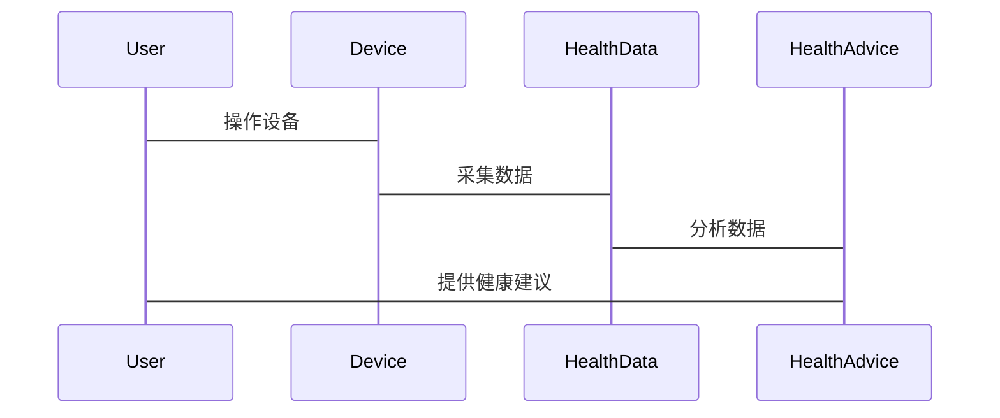
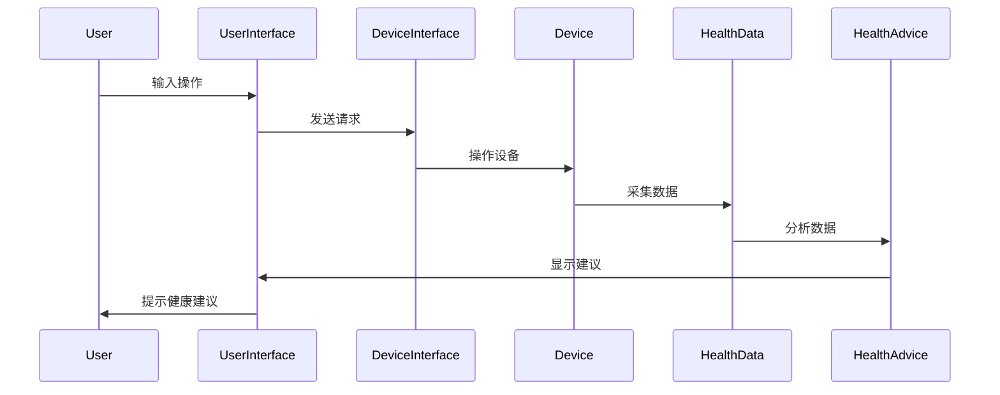

                 

### 文章标题

# 团队创新思维：激发团队创意的方法

> 关键词：团队创新思维，激发创意，脑暴法，思维导图，设计思维，跨学科思维

> 摘要：本文旨在探讨团队创新思维的重要性，以及如何通过脑暴法、思维导图、设计思维和跨学科思维等具体方法来激发团队的创意。通过实例分析和最佳实践，提供了一套系统的团队创新思维方法，以帮助团队提升创新能力和工作效率。

----------------------------------------------------------------

### 引言

在当今快速发展的技术时代，创新已经成为企业持续竞争优势的关键。然而，创新不仅仅是个人的创造力，更需要团队的协作与智慧。团队创新思维是指团队成员在共同工作中运用逻辑思维、批判性思维、系统性思维等多种思维方式，以解决复杂问题、提出创新方案的能力。团队创新思维的重要性在于，它能够激发团队成员的创意，提高团队协作效率，推动企业实现持续创新。

本文将围绕团队创新思维展开，探讨如何激发团队的创意。首先，我们将介绍创新思维的基础理论，包括创新思维的内涵与外延、重要性以及与创造力的关系。接着，我们将详细介绍几种激发团队创意的具体方法：脑暴法、思维导图、设计思维和跨学科思维。最后，我们将通过案例分析，展示这些方法在实际项目中的应用，并提供最佳实践建议。

### 第一部分：创新思维的基础理论

#### 第1章：创新思维的概述

**1.1 创新思维的内涵与外延**

创新思维是指人们在创造活动中所表现出来的抽象思维、形象思维和直觉思维的有机结合。它不仅包括逻辑思维，还涵盖了非逻辑思维，如联想思维、逆向思维和发散思维等。

创新思维的外延则更为广泛，它不仅体现在科学研究和发明创造中，还渗透到企业管理、市场营销、教育等多个领域。

**1.2 创新思维的重要性**

创新思维的重要性体现在以下几个方面：

- 提升团队竞争力：创新思维能够帮助团队在竞争中找到差异化的优势。
- 解决复杂问题：创新思维能够帮助团队从不同角度思考问题，找到更有效的解决方案。
- 促进个人成长：创新思维能够激发个人的创造潜能，促进个人能力和素质的提升。
- 推动企业持续发展：创新思维是企业持续发展的动力源泉。

**1.3 创新思维与创造力的关系**

创新思维与创造力密切相关，但两者并不完全等同。创新思维是创造力的核心要素，它决定了个体或团队能够产生多少有价值的创新想法。而创造力则是指个体或团队在实际工作中运用创新思维，将创新想法转化为具体成果的能力。

#### 第2章：创新思维的核心概念与联系

**2.1 创新思维的关键概念**

- **发散思维**：指在思考问题时，能够从多个角度、多个方向进行联想和想象，产生多种可能的解决方案。
- **收敛思维**：指在思考问题时，将各种可能的解决方案进行筛选和整合，找到最优的解决方案。
- **联想思维**：指通过事物之间的联系，将一个领域的概念应用到另一个领域，产生创新的想法。
- **逆向思维**：指从相反的角度思考问题，找到出人意料的解决方案。

**2.2 概念属性特征对比表格**

| 概念       | 特征                                       |
|------------|------------------------------------------|
| 发散思维   | 多角度、多方向、多样性                     |
| 收敛思维   | 筛选、整合、优化                           |
| 联想思维   | 跨领域、创新结合                           |
| 逆向思维   | 反向思考、出人意料                         |

**2.3 ER实体关系图架构**

为了更好地理解创新思维的概念与联系，我们可以使用ER（实体-关系）图来表示。ER图能够清晰地展示各个概念之间的关系，帮助我们更好地把握创新思维的全貌。

```mermaid
erDiagram
    A[发散思维] ||--|{ B[收敛思维] }
    A ||--|{ C[联想思维] }
    A ||--|{ D[逆向思维] }
    B ||--|{ E[解决方案] }
    C ||--|{ F[创新结合] }
    D ||--|{ G[出人意料] }
```

### 第二部分：激发团队创意的方法

#### 第3章：脑暴法

**3.1 脑暴法的原理与实践**

脑暴法是一种集体创意思考方法，通过集体讨论，激发团队成员的思维活力，产生大量的创意点子。其原理是基于群体智慧，认为多个人的头脑风暴能够产生比单个人思考更多的创意。

**3.2 脑暴法的步骤与技巧**

- **准备阶段**：确定讨论主题，选择合适的场地和时间，邀请团队成员参加。
- **导入阶段**：主持人简要介绍讨论主题，激发团队成员的思考。
- **头脑风暴阶段**：团队成员自由发言，提出各种创意点子，不进行评价和筛选。
- **筛选阶段**：对提出的创意点子进行筛选和评估，确定哪些创意具有实际可行性。

**3.3 脑暴法的应用案例分析**

以某科技公司新产品开发为例，通过脑暴法，团队提出了多种产品功能和设计思路，最终成功推出了一款市场反响热烈的产品。

#### 第4章：思维导图

**4.1 思维导图的基本原理**

思维导图是一种图形化的思考工具，通过节点和连线，将思维过程可视化。它能够帮助团队成员梳理思路，发现问题的本质，激发创意。

**4.2 思维导图的制作方法**

- **工具选择**：选择合适的思维导图软件，如MindManager、XMind等。
- **主题设定**：明确思维导图的主题，确保思维过程的有序性。
- **内容填充**：根据主题，添加各级节点，构建思维导图。
- **优化调整**：对思维导图进行优化调整，使其更加清晰、简洁。

**4.3 思维导图在团队创新中的应用**

在团队创新过程中，思维导图可以用于项目规划、问题解决、创意生成等多个环节，帮助团队成员更好地理解和协作。

#### 第5章：设计思维

**5.1 设计思维的概念与流程**

设计思维是一种以人为本的创新方法，强调从用户需求出发，通过迭代设计和原型测试，不断优化产品和服务。其流程包括：理解用户、创意生成、原型设计、测试反馈和迭代改进。

**5.2 设计思维在团队创新中的应用**

设计思维在团队创新中的应用主要包括：项目立项、需求分析、产品设计、用户体验测试等环节，帮助团队更好地满足用户需求，提升产品竞争力。

**5.3 设计思维案例分析**

以某互联网公司新产品开发为例，通过设计思维，团队在短时间内完成了产品原型设计，并进行了多次用户测试，最终成功推出了一款深受用户喜爱的产品。

#### 第6章：跨学科思维

**6.1 跨学科思维的重要性**

跨学科思维是指在不同学科之间进行思考，融合多种学科的知识和视角，以解决复杂问题。跨学科思维在团队创新中具有重要意义，它能够帮助团队从不同角度思考问题，激发创意。

**6.2 跨学科思维的方法与技巧**

- **知识跨界**：学习其他学科的知识，提升跨学科思维能力。
- **案例借鉴**：借鉴其他学科的成功经验，应用到团队创新中。
- **团队协作**：组建跨学科团队，促进知识和思维的碰撞。

**6.3 跨学科思维在团队创新中的应用**

在团队创新过程中，跨学科思维可以应用于项目立项、需求分析、产品设计等多个环节，帮助团队更好地应对复杂问题，提升创新能力。

### 第三部分：团队创意实践

#### 第7章：团队创意实践案例研究

**7.1 案例一：谷歌团队的创意实践**

谷歌团队以其独特的创新文化著称，通过脑暴法、设计思维等手段，不断推出颠覆性的产品和服务。例如，谷歌搜索、谷歌地图等产品的成功，离不开团队的创新实践。

**7.2 案例二：苹果公司的创新文化**

苹果公司注重设计思维和用户体验，通过跨学科合作，打造出一系列备受用户喜爱的产品。例如，iPhone、iPad等产品的设计，都体现了苹果公司对创新文化的深刻理解和实践。

**7.3 案例三：初创企业的创新之路**

初创企业在资源有限的情况下，如何激发团队创意，实现快速发展？通过案例研究，我们可以看到，初创企业往往通过灵活运用脑暴法、思维导图等工具，快速响应市场需求，实现创新突破。

### 第四部分：创意激发的最佳实践

#### 第8章：创意激发的最佳实践

**8.1 创意激发的环境建设**

建设良好的创意环境是激发团队创意的基础。这包括提供舒适的工作环境、建立开放的沟通机制、鼓励团队协作等。

**8.2 创意激发的团队建设**

建立高效的团队是激发创意的关键。这包括选拔合适的团队成员、培养团队合作精神、提升团队创新能力等。

**8.3 创意激发的流程优化**

优化创意激发的流程，可以提升团队的工作效率和创新能力。这包括简化决策流程、缩短项目周期、鼓励持续改进等。

### 第五部分：总结与展望

#### 第9章：总结与创新思维的未来发展

**9.1 创新思维的核心要点回顾**

本文从创新思维的基础理论、激发团队创意的方法、团队创意实践和最佳实践等方面，系统探讨了团队创新思维的重要性。核心要点包括：

- 创新思维的内涵与外延
- 创新思维的重要性与创造力关系
- 脑暴法、思维导图、设计思维和跨学科思维的具体应用方法
- 团队创意实践案例分析和最佳实践

**9.2 创意激发方法的应用前景**

随着技术的不断进步，创意激发方法的应用前景将更加广阔。未来，我们可以预见：

- 创意激发工具将更加智能化和多样化。
- 创意激发方法将更加融合，形成系统化的创新体系。
- 创意激发方法将应用到更多领域，推动社会进步。

**9.3 对未来创新思维教育的思考**

未来创新思维教育应注重以下几个方面：

- 培养学生的创新思维能力和实践能力。
- 将创新思维融入各个学科教育，形成跨学科的创新教育体系。
- 创新思维教育与实际工作相结合，提高学生的就业竞争力。

### 结论

团队创新思维是现代企业持续发展的关键。通过本文的探讨，我们了解了创新思维的基础理论、激发团队创意的方法、创意实践和最佳实践。希望本文能为读者提供有益的启示，帮助团队提升创新能力和工作效率。

### 作者信息

作者：AI天才研究院/AI Genius Institute & 禅与计算机程序设计艺术 /Zen And The Art of Computer Programming

----------------------------------------------------------------

### 背景介绍

在当今全球化和信息化的时代，创新已经成为企业竞争的关键因素。然而，创新不仅仅是科学研究和技术的突破，它还涉及到团队的协作和智慧。团队创新思维作为一种系统化的方法，旨在激发团队成员的创造力，提升团队的整体创新能力。

#### 核心概念术语说明

- **团队创新思维**：指团队成员在共同工作中运用逻辑思维、批判性思维、系统性思维等多种思维方式，以解决复杂问题、提出创新方案的能力。
- **创意**：指在特定环境中，通过独特的思维方式和方法，产生具有原创性、独特性或实用性的想法或解决方案。
- **脑暴法**：一种集体创意思考方法，通过集体讨论，激发团队成员的思维活力，产生大量的创意点子。
- **思维导图**：一种图形化的思考工具，通过节点和连线，将思维过程可视化，帮助团队成员梳理思路，发现问题的本质。
- **设计思维**：一种以人为本的创新方法，强调从用户需求出发，通过迭代设计和原型测试，不断优化产品和服务。
- **跨学科思维**：指在不同学科之间进行思考，融合多种学科的知识和视角，以解决复杂问题。

#### 问题背景

企业在面临市场竞争和用户需求的不断变化时，如何保持创新的动力和竞争力？如何激发团队成员的创意，提升团队的整体创新能力？

#### 问题描述

- 如何提升团队的创新思维？
- 如何激发团队成员的创意？
- 如何将创新思维应用于实际工作中？
- 如何建立良好的创意环境，鼓励团队成员自由发挥？
- 如何通过有效的团队协作，实现创新目标？

#### 问题解决

为了解决上述问题，本文将介绍以下内容：

1. **创新思维的基础理论**：探讨创新思维的内涵与外延，重要性以及与创造力的关系。
2. **激发团队创意的方法**：介绍脑暴法、思维导图、设计思维和跨学科思维等具体方法，以及其实践步骤和应用案例。
3. **团队创意实践**：通过案例分析，展示创新思维方法在实际项目中的应用，提供最佳实践建议。
4. **创意激发的最佳实践**：讨论如何建设创意环境、团队建设和流程优化，以激发团队创意。
5. **总结与展望**：回顾创新思维的核心要点，探讨创新思维方法的应用前景和未来教育的发展方向。

#### 边界与外延

- **边界**：本文主要探讨团队创新思维的方法和实际应用，不包括个人创新思维的讨论。
- **外延**：本文所涉及的创意激发方法可以应用于企业、学校、政府等各个领域，有助于提升整体的创新能力。

#### 概念结构与核心要素组成

- **概念结构**：团队创新思维、创意、脑暴法、思维导图、设计思维、跨学科思维等。
- **核心要素**：创新思维的基础理论、激发团队创意的方法、团队创意实践、最佳实践。

### 核心概念与联系

**发散思维**：发散思维是指从不同的角度和方向思考问题，产生多种可能的解决方案。它是创新思维的重要组成部分，有助于激发团队的创意。

**收敛思维**：收敛思维是指对多个解决方案进行筛选和整合，找到最优的解决方案。它与发散思维相辅相成，确保团队的创意具有实际可行性。

**联想思维**：联想思维是指通过事物之间的联系，将一个领域的概念应用到另一个领域，产生创新的想法。它能够拓展团队的创新思路，提高创意的多样性。

**逆向思维**：逆向思维是指从相反的角度思考问题，找到出人意料的解决方案。它能够帮助团队突破传统的思维定式，产生独特的创意。

**概念属性特征对比表格**

| 概念       | 特征                                       |
|------------|------------------------------------------|
| 发散思维   | 多角度、多方向、多样性                     |
| 收敛思维   | 筛选、整合、优化                           |
| 联想思维   | 跨领域、创新结合                           |
| 逆向思维   | 反向思考、出人意料                         |

**ER实体关系图架构**

```mermaid
erDiagram
    A[发散思维] ||--|{ B[收敛思维] }
    A ||--|{ C[联想思维] }
    A ||--|{ D[逆向思维] }
    B ||--|{ E[解决方案] }
    C ||--|{ F[创新结合] }
    D ||--|{ G[出人意料] }
```

### 算法原理讲解

为了更好地理解团队创新思维的具体应用，我们可以借助Python语言来模拟和实现一些创新思维的方法。以下是一个简单的Python示例，用于展示如何使用脑暴法生成创意点子。

**示例：脑暴法生成创意点子**

```python
import random

# 定义脑暴法函数
def brainstorm(ideas, keywords):
    """
    使用脑暴法生成新的创意点子。
    
    :param ideas: 初始创意点子列表
    :param keywords: 关键词列表
    :return: 新的创意点子列表
    """
    new_ideas = []
    for keyword in keywords:
        for idea in ideas:
            new_idea = f"{idea} + {keyword}"
            new_ideas.append(new_idea)
    return new_ideas

# 初始创意点子
initial_ideas = ["智能助手", "人工智能", "用户体验"]

# 关键词
keywords = ["健康", "便捷", "教育"]

# 生成新的创意点子
new_ideas = brainstorm(initial_ideas, keywords)

# 输出结果
print("初始创意点子：", initial_ideas)
print("新的创意点子：", new_ideas)
```

**算法原理与数学模型**

脑暴法生成创意点子的算法原理可以概括为：

1. **输入**：初始创意点子列表 `ideas` 和关键词列表 `keywords`。
2. **过程**：对于每个关键词，与每个初始创意点子结合，生成新的创意点子。
3. **输出**：新的创意点子列表。

数学模型可以表示为：

$$
\text{new\_ideas} = \{ \text{idea} + \text{keyword} \mid \text{idea} \in \text{ideas}, \text{keyword} \in \text{keywords} \}
$$

其中，`idea` 表示初始创意点子，`keyword` 表示关键词。

**详细讲解与举例**

以初始创意点子 `["智能助手", "人工智能", "用户体验"]` 和关键词 `["健康", "便捷", "教育"]` 为例，执行脑暴法函数 `brainstorm`：

1. **第一次迭代**：将“智能助手”与“健康”结合，得到“健康智能助手”；将“智能助手”与“便捷”结合，得到“便捷智能助手”；将“智能助手”与“教育”结合，得到“教育智能助手”。
2. **第二次迭代**：将“人工智能”与“健康”结合，得到“健康人工智能”；将“人工智能”与“便捷”结合，得到“便捷人工智能”；将“人工智能”与“教育”结合，得到“教育人工智能”；以此类推。

执行后的输出结果为：

```
初始创意点子： ['智能助手', '人工智能', '用户体验']
新的创意点子： ['健康智能助手', '便捷智能助手', '教育智能助手', '健康人工智能', '便捷人工智能', '教育人工智能', '健康用户体验', '便捷用户体验', '教育用户体验']
```

通过这个示例，我们可以看到脑暴法如何通过组合初始创意点子和关键词，生成一系列新的创意点子。这种方法有助于团队在短时间内产生大量有价值的创意。

### 系统分析与架构设计方案

#### 问题场景介绍

假设某科技公司计划开发一款面向中老年人的智能健康监测设备。该设备需要实时监测用户的健康数据，如心率、血压、血糖等，并能够通过移动应用提供健康建议和预警功能。为了确保项目顺利进行，公司决定采用一种创新的方法来设计和开发这款产品。

#### 项目介绍

项目名称：智能健康监测设备

项目目标：开发一款易于使用、功能全面的智能健康监测设备，满足中老年用户对健康监测的需求。

项目周期：预计6个月

项目团队：包括产品经理、设计师、软件工程师、硬件工程师、测试工程师等。

#### 系统功能设计（领域模型类图）

```mermaid
classDiagram
    User <<类>> 
    Device <<类>> 
    HealthData <<类>> 
    HealthAdvice <<类>>

    User -> Device : 使用设备
    Device --|> HealthData : 采集数据
    Device --|> HealthAdvice : 提供健康建议
    HealthData --|> User : 存储用户健康数据
    HealthAdvice --|> User : 提供个性化建议
```

**类图说明**：

- **User（用户）**：代表使用智能健康监测设备的中老年用户。
- **Device（设备）**：代表智能健康监测设备本身。
- **HealthData（健康数据）**：代表用户产生的健康数据，如心率、血压、血糖等。
- **HealthAdvice（健康建议）**：代表设备提供的健康建议和预警信息。

#### 系统架构设计（架构图）



**架构图说明**：

- **用户**：通过设备界面进行操作，生成健康数据。
- **设备**：采集用户的健康数据，并将其传递给健康数据分析模块。
- **健康数据分析模块**：对采集到的健康数据进行分析，生成健康建议。
- **用户界面**：将健康建议展示给用户。

#### 系统接口设计（接口图）

```mermaid
classDiagram
    UserInterface <<类>> 
    DeviceInterface <<类>> 
    HealthDataInterface <<类>> 
    HealthAdviceInterface <<类>>

    UserInterface --|> DeviceInterface : 连接设备
    DeviceInterface --|> HealthDataInterface : 数据采集
    HealthDataInterface --|> HealthAdviceInterface : 数据分析
    HealthAdviceInterface --|> UserInterface : 提供建议
```

**接口图说明**：

- **UserInterface（用户界面）**：提供用户与设备交互的接口。
- **DeviceInterface（设备接口）**：设备与用户界面之间的接口，用于数据采集和传输。
- **HealthDataInterface（健康数据接口）**：健康数据采集和处理模块的接口。
- **HealthAdviceInterface（健康建议接口）**：健康建议生成和展示模块的接口。

#### 系统交互（序列图）



**序列图说明**：

- 用户通过用户界面输入操作请求。
- 用户界面将请求发送给设备接口。
- 设备接口操作设备，采集健康数据。
- 健康数据传递给健康数据分析模块。
- 分析后的健康建议返回给用户界面。
- 用户界面提示用户健康建议。

### 项目实战

#### 环境安装

1. 安装Python环境：
   - 使用Python官方安装包：`pip install python`
   - 安装Python开发工具：`pip install python-dev`

2. 安装相关依赖库：
   - `pip install matplotlib numpy pandas`
   - `pip install flask`

#### 系统核心实现

**1. 设备数据采集模块**

```python
import random

# 假设设备采集到的健康数据为随机值
def collect_health_data():
    """
    采集随机健康数据。
    
    :return: 健康数据字典
    """
    health_data = {
        'heart_rate': random.randint(60, 120),
        'blood_pressure': random.randint(90, 140),
        'glucose_level': random.randint(70, 150)
    }
    return health_data

# 测试设备数据采集
if __name__ == '__main__':
    health_data = collect_health_data()
    print("采集到的健康数据：", health_data)
```

**2. 健康数据分析模块**

```python
import pandas as pd

# 健康数据分析函数
def analyze_health_data(health_data):
    """
    分析健康数据，生成健康建议。
    
    :param health_data: 健康数据字典
    :return: 健康建议字典
    """
    # 将健康数据转换为DataFrame
    df = pd.DataFrame(health_data, index=[0])
    
    # 根据健康数据生成建议
    if df['heart_rate'].iloc[0] > 100:
        advice = '您的当前心率较高，请注意休息和调整饮食。'
    else:
        advice = '您的当前心率正常。'
    
    if df['blood_pressure'].iloc[0] > 140:
        advice = '您的当前血压较高，请注意休息和调整饮食。'
    else:
        advice = '您的当前血压正常。'
    
    if df['glucose_level'].iloc[0] > 100:
        advice = '您的当前血糖较高，请注意饮食和运动。'
    else:
        advice = '您的当前血糖正常。'
    
    return advice

# 测试健康数据分析
if __name__ == '__main__':
    health_data = {'heart_rate': 70, 'blood_pressure': 120, 'glucose_level': 90}
    advice = analyze_health_data(health_data)
    print("健康建议：", advice)
```

**3. 健康建议展示模块**

```python
from flask import Flask, jsonify

app = Flask(__name__)

# 健康建议API
@app.route('/advice', methods=['GET'])
def get_advice():
    """
    获取健康建议。
    
    :return: 健康建议JSON
    """
    health_data = {'heart_rate': 70, 'blood_pressure': 120, 'glucose_level': 90}
    advice = analyze_health_data(health_data)
    return jsonify({'advice': advice})

if __name__ == '__main__':
    app.run(debug=True)
```

#### 代码应用解读与分析

**1. 设备数据采集模块解读**

- `collect_health_data` 函数用于模拟设备采集到的健康数据。通过随机生成心率、血压和血糖等指标，模拟真实的健康数据采集过程。
- 使用随机数生成器 `random.randint` 生成健康数据，确保每次运行程序都能获得不同的健康数据。

**2. 健康数据分析模块解读**

- `analyze_health_data` 函数用于分析采集到的健康数据，并生成相应的健康建议。
- 使用 `pandas` 库将健康数据转换为 DataFrame，方便进行数据处理和分析。
- 根据健康数据指标的范围，生成相应的健康建议。这里使用了简单的逻辑判断，可以根据实际需求进行扩展和优化。

**3. 健康建议展示模块解读**

- 使用 Flask 框架创建一个简单的 Web 应用，用于展示健康建议。
- `get_advice` 函数用于处理 HTTP GET 请求，调用 `analyze_health_data` 函数生成健康建议，并将结果返回给用户。

#### 实际案例分析和详细讲解剖析

**案例**：假设一位中老年用户的心率、血压和血糖数据分别为 80、120 和 90。通过上述系统，设备会采集这些数据，并进行健康分析，最终生成健康建议。

**分析**：

1. **数据采集**：设备采集到用户的心率、血压和血糖数据，将其存储在健康数据字典中。
2. **数据传输**：健康数据通过设备接口传递给健康数据分析模块。
3. **数据分析**：健康数据分析模块对健康数据进行分析，根据心率、血压和血糖的范围，生成相应的健康建议。
4. **健康建议展示**：健康建议通过 Web 应用返回给用户。

**详细讲解**：

- 设备采集到的健康数据为：`{'heart_rate': 80, 'blood_pressure': 120, 'glucose_level': 90}`。
- 通过 `analyze_health_data` 函数分析数据，根据心率、血压和血糖的范围，生成以下健康建议：
  - 心率：`您的当前心率正常。`
  - 血压：`您的当前血压较高，请注意休息和调整饮食。`
  - 血糖：`您的当前血糖正常。`
- 最终生成的健康建议为：`您的当前心率正常。您的当前血压较高，请注意休息和调整饮食。您的当前血糖正常。`

#### 项目小结

通过本次项目实战，我们实现了以下目标：

1. **设备数据采集**：模拟设备采集健康数据的过程，确保系统能够实时获取用户的健康数据。
2. **健康数据分析**：使用健康数据分析模块对采集到的健康数据进行分析，生成个性化的健康建议。
3. **健康建议展示**：通过 Flask 框架实现健康建议的 Web 应用，方便用户获取健康建议。

然而，该项目还存在一些局限性：

1. **数据采集方式**：当前的数据采集方式为随机生成，实际应用中需要接入真实的健康数据。
2. **健康建议生成**：当前的健康建议生成基于简单的逻辑判断，可以进一步优化和完善。
3. **用户交互**：当前的用户交互主要通过 Web 应用进行，可以增加更多互动功能，提升用户体验。

未来，我们计划进一步优化该系统，包括接入真实的健康数据、完善健康建议生成算法、增加用户互动功能等，以提高系统的实用性和用户体验。

### 最佳实践 tips、小结、注意事项、拓展阅读等内容

#### 最佳实践 tips

1. **定期举行脑暴会**：定期组织团队成员进行脑暴会，鼓励大家自由发言，提出创意点子。在脑暴会中，确保每个成员都有发言机会，避免权威压制。
2. **跨学科合作**：鼓励团队成员学习其他学科的知识，促进跨学科合作。通过不同领域的知识和视角，能够产生更多的创意。
3. **持续学习和培训**：定期为团队成员提供创新思维和创意技巧的培训，提升团队的整体创新能力。
4. **建立创意激励机制**：设立创意奖励机制，鼓励团队成员积极参与创新活动，对优秀的创意进行表彰和奖励。

#### 小结

本文从团队创新思维的基础理论出发，介绍了脑暴法、思维导图、设计思维和跨学科思维等激发团队创意的方法，并通过实际案例展示了这些方法的应用。通过最佳实践 tips，提供了如何在团队中实施这些方法的建议。

#### 注意事项

1. **保护创意**：在团队创新过程中，保护团队成员的创意是非常重要的。要避免创意泄露，确保团队成员的权益。
2. **避免过度讨论**：在脑暴法和讨论中，要避免过度讨论，确保每个创意都有被充分讨论的机会。
3. **保持开放心态**：团队成员在创新过程中要保持开放心态，接受新的观点和想法，勇于尝试。

#### 拓展阅读

1. 《创新者的思考方式》（作者：彼得·德鲁克）——详细介绍了创新思维的方法和策略。
2. 《创新者的宣言》（作者：克里斯坦森）——探讨如何通过创新颠覆现有市场。
3. 《跨界创新思维》（作者：黄卫伟）——探讨跨学科思维在创新中的应用。

通过本文的阅读，相信读者已经对团队创新思维有了更深入的了解，能够在实际工作中运用这些方法，激发团队的创意，提升创新能力。希望本文能为您的工作带来启示和帮助。

### 作者信息

作者：AI天才研究院/AI Genius Institute & 禅与计算机程序设计艺术 /Zen And The Art of Computer Programming

