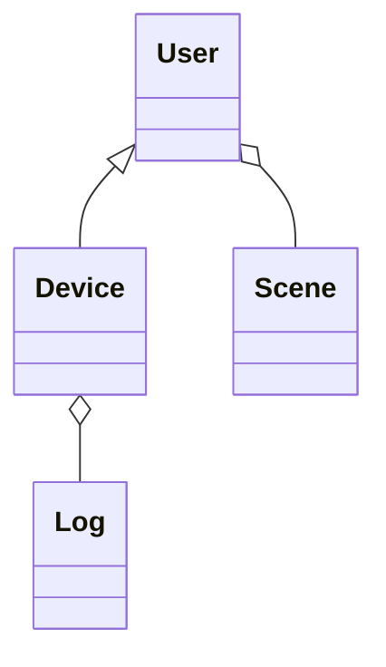
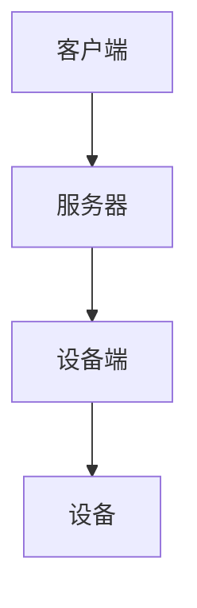
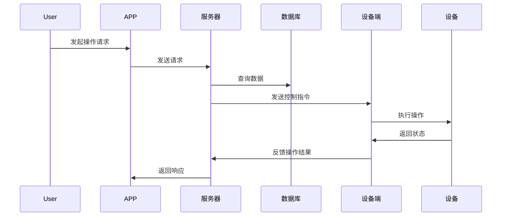

                 

### 引言

**问题背景**

在当今这个快速变化且高度竞争的IT行业，创新能力已成为企业持续发展的关键因素。团队创新思维不仅决定了产品和技术的前沿性，更直接影响到企业的市场竞争力。为了在技术领域保持领先，许多公司都在积极探索如何激发团队的创新潜力。然而，如何在实际工作中有效应用团队创新思维，仍然是一个复杂且具有挑战性的问题。

**团队创新思维的定义**

团队创新思维是指团队成员通过开放性思考、协同合作以及多元视角的交流，共同探索和创造出新的想法、解决方案或产品。这种思维模式强调集体智慧，追求多样化的思维方式和知识共享，从而在复杂问题面前找到创新性的解决方案。

**本书目的与结构**

本书旨在为IT领域的专业人士提供一套系统化的团队创新思维方法和实践指南。通过深入探讨团队创新思维的核心概念、策略和工具，我们希望能够帮助读者在实际工作中更好地激发团队的创新潜力。本书结构如下：

1. **引言**：介绍团队创新思维的重要性、定义以及本书的目的和结构。
2. **团队创新思维概述**：阐述创新思维的概念、内涵以及团队创新思维的方法。
3. **激发团队创新思维的策略**：讨论如何营造创新氛围、建立高效的团队协作以及培养创新思维。
4. **创新思维工具与实践**：详细介绍头脑风暴、六顶思考帽和思维导图等创新思维工具的实践方法。
5. **团队创新案例分析**：通过实际案例展示如何应用团队创新思维解决实际问题。
6. **最佳实践与小结**：总结书中的主要内容，提供最佳实践建议，并提醒读者注意事项。

**主要内容概述**

本书将围绕团队创新思维这一核心主题，逐步引导读者深入了解其本质和应用。我们将通过理论讲解、实践案例和最佳实践，帮助读者掌握团队创新思维的精髓，从而在各自的工作中取得更好的成果。

### 关键词

- 团队创新思维
- 集体智慧
- 创新氛围
- 团队协作
- 头脑风暴
- 六顶思考帽
- 思维导图

### 摘要

本书以团队创新思维为核心，深入探讨如何通过系统化的方法和策略激发团队的创新潜力。首先，我们介绍了创新思维的定义及其在IT行业的重要性。接着，详细阐述了团队创新思维的内涵及其与传统创新思维的差异。随后，本书重点介绍了多种团队创新思维工具，如头脑风暴、六顶思考帽和思维导图，并通过实际案例展示了这些工具的应用效果。此外，本书还探讨了如何营造创新氛围、建立高效的团队协作以及培养创新思维。通过这些内容，读者可以全面了解团队创新思维的实践方法，并在实际工作中有效应用，从而推动团队的创新和发展。

## 第1章：团队创新思维概述

在进入深入探讨团队创新思维的具体方法和策略之前，我们需要先对团队创新思维有一个全面且清晰的认识。本章将首先阐述创新思维的概念，并进一步探讨团队创新思维的内涵、重要性以及与传统创新思维的差异。通过这些讨论，我们将为后续章节中的详细分析打下坚实的基础。

### 1.1 创新思维的概念

创新思维是一种开放、灵活、多维度的思维方式，它强调突破传统思维的束缚，以独特的视角和方法来发现和解决问题。创新思维不仅包括创造新的概念、产品或技术，还涉及对现有资源进行重新组合和利用，从而实现更大的价值。其核心在于不拘泥于传统的思维定势，敢于探索未知的领域，以及勇于面对挑战和不确定性。

创新思维的重要性在于它为企业提供了持续发展的动力。在一个快速变化的市场环境中，只有具备创新思维的企业才能保持竞争优势，不断满足客户的需求。创新思维能够激发团队的创造力，提升工作效率，推动技术进步，并最终实现商业成功。

### 1.2 团队创新思维的内涵

团队创新思维是指团队成员通过开放性思考、协同合作以及多元视角的交流，共同探索和创造出新的想法、解决方案或产品。与个体创新思维不同，团队创新思维强调集体智慧，追求多样化的思维方式和知识共享，从而在复杂问题面前找到创新性的解决方案。

团队创新思维的核心要素包括：

1. **协同合作**：团队成员之间的紧密协作和互相支持，是实现团队创新思维的重要基础。通过团队合作，不同背景和经验的人可以相互补充，共同探讨问题，从而产生更多的创新点。
2. **知识共享**：团队内部的知识共享和交流是激发创新思维的关键。通过共享知识和经验，团队成员可以相互启发，发现新的解决方案，并不断提高整个团队的创新能力。
3. **开放性思考**：开放性思考是指团队成员愿意接受不同的观点和意见，敢于质疑现有的假设和思维方式。这种思维方式有助于打破常规，发现新的创新方向。

### 1.3 团队创新思维与传统创新思维的差异

虽然团队创新思维和传统创新思维都强调创新，但二者在本质上有显著的区别。传统创新思维通常依赖于个人的直觉、经验和专业技能，创新的过程往往是一个封闭的、线性发展的过程。而团队创新思维则强调集体智慧和多元化思维，通过团队协作和知识共享来实现创新。

以下是比较表格，展示了团队创新思维与传统创新思维在几个关键方面的不同：

| 对比维度 | 传统创新思维 | 团队创新思维 |
| --- | --- | --- |
| 思维模式 | 单一、线性、封闭 | 多元、开放、协作 |
| 创新主体 | 个体 | 团队 |
| 知识来源 | 个人经验和专业知识 | 团队内部的知识共享 |
| 创新过程 | 依赖个人直觉和经验 | 通过协同合作和知识共享 |
| 创新结果 | 单一的创新点或解决方案 | 多样化的创新点或解决方案 |

通过以上讨论，我们可以看出，团队创新思维在本质上具有更强的灵活性和协作性，能够更好地应对复杂的问题和快速变化的市场环境。接下来，我们将进一步探讨如何在实际工作中应用这些理念，以激发团队的创新潜力。

### 1.4 团队创新思维的方法

团队创新思维的有效应用需要一系列具体的方法和工具。以下是几种常见的团队创新思维方法，它们各有特点，适用于不同的场景和需求。

#### 1.4.1 头脑风暴

头脑风暴是一种非常直观且高效的团队创新思维方法。它的核心在于通过快速生成大量想法，激发团队的创造力。具体步骤如下：

1. **明确问题**：在头脑风暴开始前，需要明确需要解决的问题或目标。
2. **集体讨论**：团队成员围坐在一起，轮流提出自己的想法，不必担心想法的好坏，关键是数量。
3. **记录想法**：在讨论过程中，记录所有提出的想法，无论它们是否可行。
4. **分类和筛选**：对记录下来的想法进行分类和筛选，确定哪些想法具有实际应用价值。

**优点**：头脑风暴能够快速生成大量想法，激发团队的创造力，有助于发现新的解决方案。

**缺点**：由于讨论过程中容易产生意见冲突，可能会导致部分有价值的想法被忽视。

**适用场景**：适用于需要快速产生大量想法的情境，如新产品设计、问题解决等。

#### 1.4.2 六顶思考帽

六顶思考帽是一种结构化的思维工具，由英国心理学家爱德华·德·波诺提出。它通过六种不同的思维模式，帮助团队成员全面、系统地分析问题。六顶思考帽分别是：

1. **蓝色思考帽**：用于控制思考过程，确保讨论按照既定的目标和时间进行。
2. **红色思考帽**：用于表达情感和直觉，帮助团队成员基于情感和直觉进行思考。
3. **黄色思考帽**：用于评估问题的积极面和优点，寻找潜在的机会。
4. **黑色思考帽**：用于评估问题的风险和缺点，避免盲目乐观。
5. **绿色思考帽**：用于提出新的观点和创意，鼓励创新思维。
6. **白色思考帽**：用于提供事实和信息，确保讨论基于客观的数据和分析。

**优点**：六顶思考帽提供了一种结构化的思维方式，有助于团队成员全面、系统地分析问题，避免思维上的偏见和局限。

**缺点**：由于每种思考帽都有特定的用途，可能导致讨论过程中的灵活性不足。

**适用场景**：适用于需要系统化分析问题、提高决策质量的情境，如项目规划、产品评估等。

#### 1.4.3 思维导图

思维导图是一种图形化的思维工具，它通过图像、颜色和文字的形式，将思维过程可视化。思维导图的基本结构包括中心主题、分支和子分支，每个分支代表一个具体的想法或观点。具体步骤如下：

1. **确定中心主题**：在思维导图的中心位置，写下一个明确的主题或问题。
2. **生成分支**：围绕中心主题，生成多个分支，每个分支代表一个主要想法或观点。
3. **细化分支**：在每个分支下，进一步细化子分支，将具体的细节和想法添加到子分支中。
4. **连接和优化**：通过线条和箭头连接各个分支和子分支，优化思维导图的结构，使其更加清晰易懂。

**优点**：思维导图能够将复杂的思维过程可视化，帮助团队成员更好地理解和记忆，同时提高思维的连贯性和逻辑性。

**缺点**：思维导图的制作和优化需要一定的时间和技巧。

**适用场景**：适用于需要整理思路、规划项目、制定策略等情境。

通过以上对头脑风暴、六顶思考帽和思维导图等团队创新思维方法的介绍，我们可以看到，每种方法都有其独特的优势和适用场景。在实际工作中，可以根据具体问题和需求，灵活选择和组合这些方法，以激发团队的创造力，实现创新目标。

### 1.5 团队创新思维的应用

团队创新思维不仅在理论层面具有重要意义，更在实际工作中发挥着关键作用。通过以下实际案例，我们将展示团队创新思维在项目中的成功应用。

#### 案例背景

某知名科技公司面临一项挑战：如何在竞争激烈的市场中开发一款具有创新性的新产品。为了实现这一目标，公司决定采用团队创新思维的方法，通过集体智慧和协作来推动项目的进展。

#### 创新思维方法的应用

1. **头脑风暴**：在项目启动阶段，公司组织了一次头脑风暴会议。会议邀请了来自不同部门和背景的员工，共同探讨新产品的潜在功能、市场定位和用户需求。通过快速生成大量想法，团队成员在短时间内提出了数十个创新点。

2. **六顶思考帽**：在头脑风暴后，公司采用六顶思考帽的方法，对提出的创新点进行进一步分析和评估。通过红色思考帽，团队成员表达了各自的情感和直觉，从而找到了一些基于用户情感需求的功能；通过黄色思考帽，评估了每个创新点的潜在商业价值；通过黑色思考帽，分析了可能的风险和挑战，从而制定了相应的应对策略。

3. **思维导图**：为了更清晰地展示项目的整体结构和思路，团队成员使用思维导图工具，将头脑风暴和六顶思考帽的结果可视化。思维导图帮助团队成员更好地理解和记忆项目的关键点，同时也便于后续的讨论和调整。

#### 项目结果

通过团队创新思维的应用，该公司成功开发出一款具有创新性的新产品，并在市场上取得了良好的反响。具体成果包括：

1. **功能创新**：新产品引入了多个创新功能，满足了用户多样化的需求，提升了用户满意度。
2. **市场竞争力**：通过系统的创新思维方法，产品在市场上具备了更强的竞争力，赢得了大量市场份额。
3. **团队协作**：项目过程中，团队成员的协作和沟通得到了显著提升，团队凝聚力进一步增强。

#### 案例总结

这个案例展示了团队创新思维在实际项目中的成功应用。通过头脑风暴、六顶思考帽和思维导图等工具，团队不仅找到了创新的解决方案，还提高了项目的执行效率和团队协作能力。这一过程表明，团队创新思维不仅是一种理论，更是一种可以实际操作和产生显著效果的方法。

### 结论

团队创新思维在推动项目成功和提升企业竞争力方面发挥着重要作用。通过本章的讨论，我们了解了创新思维的概念、团队创新思维的内涵及其与传统创新思维的差异。同时，我们详细介绍了头脑风暴、六顶思考帽和思维导图等常见的团队创新思维方法，并通过实际案例展示了这些方法的应用效果。在接下来的章节中，我们将进一步探讨如何在实际工作中有效激发团队的创新潜力，并分享最佳实践和注意事项。

## 第2章：激发团队创新思维的策略

在了解了团队创新思维的基本概念和方法之后，我们需要探讨如何在实际工作中有效地激发团队的创新潜力。本章将介绍几种策略，帮助团队建立创新文化、提高协作效率以及培养创新思维。

### 2.1 营造创新氛围

创新氛围是指团队内部对创新思维和行动的支持和鼓励程度。一个积极、开放的创新氛围能够激发团队成员的创新潜力，促进知识的共享和思维的碰撞。以下是几种营造创新氛围的策略：

1. **鼓励试错**：在创新过程中，失败是不可避免的。团队应该鼓励成员勇于尝试新的想法和方法，并接受失败。通过建立一种包容失败的文化，团队成员会更加愿意冒险和创新。

2. **提供资源和支持**：确保团队有足够的资源和工具来支持创新活动。这包括时间、资金、技术和人力资源。团队领导者应该提供必要的资源，以便成员能够全身心地投入到创新工作中。

3. **开放交流渠道**：建立开放的交流渠道，鼓励团队成员分享想法和意见。这可以通过定期的团队会议、小组讨论或在线协作工具来实现。开放的交流环境能够促进思想的碰撞和创新的产生。

4. **认可和奖励创新**：对团队成员的创新行为给予认可和奖励，能够增强他们的创新动力。这可以通过表扬、奖金或其他形式的奖励来实现。通过认可和奖励，团队可以鼓励更多的成员参与创新活动。

### 2.2 建立高效的团队协作

高效的团队协作是实现团队创新的关键。以下是几种建立高效团队协作的策略：

1. **明确目标和职责**：确保每个团队成员都明确项目的目标和自己的职责。这有助于减少误解和冲突，提高团队的整体协作效率。

2. **分工合作**：根据团队成员的技能和专长进行分工，确保每个成员都能在其最擅长的领域发挥作用。分工合作不仅能够提高工作效率，还能促进团队成员之间的学习和成长。

3. **建立沟通机制**：建立有效的沟通机制，确保团队成员之间的信息流通和协作顺畅。这可以通过定期会议、即时通讯工具或项目管理软件来实现。

4. **培养团队精神**：团队精神是指团队成员之间的信任、尊重和支持。通过团队建设活动和培训，可以增强团队成员之间的信任和合作意识，提高团队的整体效能。

### 2.3 创新思维的培养

培养创新思维需要持续的努力和系统的训练。以下是几种培养创新思维的策略：

1. **提供学习机会**：鼓励团队成员参加培训课程、研讨会和工作坊，以获取新的知识和技能。这些学习机会可以帮助团队成员开阔视野，激发创新思维。

2. **多样化团队组成**：多元化团队在思维方式、背景和经验上具有更多的多样性，这有助于促进创新。通过引入不同背景和观点的成员，团队可以产生更多创新性的想法。

3. **实践和反思**：通过实践和创新活动，团队成员可以将理论知识转化为实际技能。在实践过程中，团队应该不断反思和总结，从成功和失败中学习，不断提高创新思维。

4. **鼓励独立思考**：在团队中，应该鼓励成员独立思考和提出自己的观点。这不仅有助于产生多样化的想法，还能激发团队成员的创造力和创新精神。

通过以上策略，团队可以在实践中不断激发创新思维，实现持续的创新和发展。在接下来的章节中，我们将进一步介绍具体的创新思维工具，帮助团队在实际工作中更好地应用创新思维。

### 2.4 常见的团队创新思维障碍

在激发团队创新思维的过程中，虽然有许多策略和工具可以帮助团队克服障碍，但仍然存在一些常见的障碍。了解这些障碍并采取相应的对策，对于确保团队创新思维的持续激发至关重要。

**1. 恐惧失败**

许多团队成员因为害怕失败而选择不提出新的想法或尝试创新。这种恐惧可能导致团队缺乏多样性，限制创新的可能性。为了克服这种障碍，团队需要建立一个安全的环境，鼓励成员勇于尝试和失败，并将失败视为学习和成长的机会。

**对策**：建立一种包容失败的文化，提供反馈和支持，帮助成员从失败中吸取教训。

**2. 缺乏协作**

团队内部缺乏有效的协作机制和沟通渠道，可能导致创新思维的难以实现。成员之间可能存在竞争关系，而不是合作共赢的态度。

**对策**：明确团队目标和职责，建立开放和积极的沟通机制，培养团队精神，确保团队成员之间的协作顺畅。

**3. 缺乏时间资源**

在繁忙的工作环境中，团队往往面临时间和资源的限制，导致无法充分投入创新活动。这种限制可能导致团队创新能力下降。

**对策**：合理分配时间和资源，确保团队成员有足够的时间和精力进行创新活动。领导者应该提供必要的支持和资源，以促进团队的创新。

**4. 缺乏激励**

如果团队成员没有足够的激励，可能缺乏参与创新活动的动力。激励不足可能导致团队整体创新水平的下降。

**对策**：建立认可和奖励机制，对团队成员的创新行为给予积极的反馈和奖励，提高成员的参与度和积极性。

**5. 固有的思维模式**

团队可能由于长期的工作模式和文化传统，而形成固有的思维模式。这些模式可能限制团队成员的创新能力，导致创新思维难以产生。

**对策**：定期进行思维训练和启发，通过培训、研讨会等活动，帮助团队成员开阔思维，打破固有的思维模式。

通过识别和解决这些常见的团队创新思维障碍，团队可以更好地激发创新思维，实现持续的创新和发展。

### 2.5 激发团队创新思维的具体实践

在了解了如何营造创新氛围、建立高效协作和培养创新思维之后，接下来我们将通过具体实践案例，展示这些策略在现实中的应用效果。这些实践案例不仅展示了团队创新思维的成功应用，还为其他团队提供了有益的参考。

**案例1：谷歌的“20%时间”项目**

谷歌的“20%时间”项目是一个著名的创新实践，旨在激发员工的创新思维。在这个项目中，员工每周有20%的时间可以自由支配，用于从事与工作无关的项目或研究。这种自由时间的安排，使得员工可以跳出日常工作的束缚，自由地探索新的想法和创意。

**实践效果**：

- **创新点的涌现**：通过“20%时间”项目，谷歌推出了多个重要的创新产品，如Gmail、Google News等，这些产品极大地提升了公司的市场竞争力。
- **员工积极性提高**：员工在自由探索的过程中，感受到了公司的信任和支持，积极性大大提高，创新思维得到了激发。

**案例2：3M公司的“15%时间”创新政策**

3M公司同样有一个类似的项目，称为“15%时间”创新政策。员工每周有15%的时间可以用于个人感兴趣的项目或研究。这一政策鼓励员工在工作和个人兴趣之间找到平衡，从而激发创新思维。

**实践效果**：

- **多元化的产品线**：通过“15%时间”项目，3M公司推出了许多知名产品，如贴纸、有色胶带等，这些产品为公司带来了巨大的商业成功。
- **员工创造力增强**：员工在自由探索的过程中，不断挑战自我，创造力得到了显著提升。

**案例3：Adobe公司的“创新实验室”**

Adobe公司通过建立“创新实验室”，为员工提供了一个开放、灵活的创新环境。在这个实验室中，员工可以自由地实验和尝试新的技术、工具和流程，从而激发创新思维。

**实践效果**：

- **技术领先**：Adobe通过“创新实验室”保持了在数字设计领域的领先地位，推出了多个领先的技术和工具，如Photoshop、Illustrator等。
- **团队协作提升**：在创新实验室中，员工之间进行了大量的跨部门合作，团队协作能力得到了显著提升。

**案例4：NASA的“内部创新竞赛”**

NASA通过举办内部创新竞赛，鼓励员工提出创新性的解决方案，以解决实际工作中的问题。竞赛过程中，员工可以自由组队，利用NASA提供的资源进行创新设计。

**实践效果**：

- **问题解决**：通过内部创新竞赛，NASA解决了许多重要的技术问题，如航天飞机燃料泄漏的检测方法等。
- **员工参与度提高**：员工在竞赛中积极参与，感受到了公司的支持和认可，创新思维得到了极大的激发。

**总结**

以上实践案例展示了不同公司在激发团队创新思维方面的成功经验。通过营造创新氛围、建立高效协作和提供具体实践机会，团队能够有效地激发创新思维，实现持续的创新和发展。这些案例为其他团队提供了有益的参考，帮助他们更好地激发团队的创新能力。

### 2.6 创新思维的培养与团队协作

创新思维的培养和团队协作是激发团队创新潜能的关键因素。一个高效的团队不仅需要具备创新思维，还需要通过良好的团队协作来实现这些创新。以下是如何在团队协作中培养创新思维的几种策略。

#### 1. 多元化团队

多元化团队是指由不同背景、技能和经验的人组成的团队。多元化可以带来不同的视角和思维方式，有助于发现更全面的问题解决方案。为了培养创新思维，团队应该鼓励多元化，并充分利用不同成员的优势。

**策略**：

- **包容多样性**：建立一个包容多样性的文化，鼓励团队成员提出不同的观点和想法。
- **跨部门合作**：通过跨部门合作，促进不同领域的知识和经验的交流，激发创新思维。

#### 2. 定期培训

定期培训可以帮助团队成员掌握最新的创新方法和工具，提高创新思维能力。培训可以包括内部研讨会、外部专家讲座、在线课程等。

**策略**：

- **定制培训计划**：根据团队成员的技能水平和需求，制定个性化的培训计划。
- **实践结合理论**：通过实际案例和模拟项目，将培训内容与实际工作相结合，提高培训效果。

#### 3. 鼓励协作和沟通

协作和沟通是创新思维的重要组成部分。一个高效的团队需要通过频繁的沟通和协作，共同探讨问题、分享想法和知识。

**策略**：

- **建立沟通渠道**：定期组织团队会议、头脑风暴和研讨会，鼓励团队成员分享自己的想法和观点。
- **使用协作工具**：利用在线协作工具，如项目管理软件、即时通讯工具和共享文档平台，提高团队的协作效率。

#### 4. 鼓励独立思考

在团队协作中，独立思考同样重要。通过鼓励成员独立思考，可以激发他们的创造力和创新思维。

**策略**：

- **提供思考空间**：为团队成员提供独立思考和实验的空间，鼓励他们探索新的想法和方法。
- **支持创新尝试**：对团队成员的创新尝试给予支持和鼓励，即使结果不成功，也要认可他们的努力和尝试。

#### 5. 鼓励试错

试错是创新过程中不可或缺的一部分。通过试错，团队可以不断学习和改进，最终找到成功的解决方案。

**策略**：

- **建立试错文化**：鼓励团队成员勇于尝试新的想法和方法，即使失败也给予支持和认可。
- **反思和总结**：在每次尝试后，及时进行反思和总结，从失败中吸取教训，不断改进。

通过以上策略，团队可以在协作中培养创新思维，实现持续的创新和发展。一个高效、协作的团队能够在复杂问题面前找到创新性的解决方案，为企业带来持续的竞争优势。

### 总结

通过本章的讨论，我们详细介绍了激发团队创新思维的策略，包括营造创新氛围、建立高效的团队协作、培养创新思维以及识别和解决常见的团队创新思维障碍。这些策略不仅提供了理论指导，还通过具体实践案例展示了其应用效果。在接下来的章节中，我们将进一步介绍具体的创新思维工具，帮助团队在实际工作中更好地应用创新思维，实现持续的创新和发展。

## 第3章：创新思维工具与实践

在了解了团队创新思维的策略后，我们需要具体探讨如何在实际工作中应用这些策略，以激发团队的创造力。本章将详细介绍几种常见的创新思维工具，包括头脑风暴、六顶思考帽和思维导图。我们将通过具体的实践步骤和实际案例，展示这些工具在团队创新中的应用效果。

### 3.1 头脑风暴

头脑风暴是一种非常直观且高效的创新思维工具，它通过快速生成大量想法，激发团队的创造力。以下是头脑风暴的具体实践步骤：

**步骤1：明确目标**

在开始头脑风暴之前，首先需要明确需要解决的问题或目标。这个目标可以是产品创新、问题解决、策略制定等。

**步骤2：组建团队**

邀请来自不同部门和背景的团队成员，确保团队的多元性和多样性。团队成员应该具备解决问题的能力和开放的心态。

**步骤3：设定时间限制**

为了保持头脑风暴的效率和活力，可以设定一个时间限制，例如20-30分钟。这个时间限制可以确保团队成员集中精力，快速生成想法。

**步骤4：自由发言**

在头脑风暴过程中，团队成员可以自由发言，不必担心想法的好坏。每个成员都可以提出自己的想法，无论它们是否实际可行。

**步骤5：记录想法**

在头脑风暴过程中，记录所有提出的想法，无论它们是否成熟或具有实际应用价值。这些想法可以作为后续分析和筛选的基础。

**步骤6：分类和筛选**

在头脑风暴结束后，对记录下来的想法进行分类和筛选，确定哪些想法具有实际应用价值。可以通过投票、评分或其他方法来筛选出最有价值的想法。

**实际案例**：

某科技公司需要开发一款智能家居设备，为了寻找最佳的产品设计，公司组织了一次头脑风暴会议。会议邀请了来自设计、技术、市场等不同部门的员工。在30分钟的自由讨论中，团队成员提出了超过50个创新点，包括智能化的环境监测、远程控制功能、用户定制化设置等。通过分类和筛选，团队最终确定了几个最有潜力的设计方向，并开始进行具体的产品开发。

### 3.2 六顶思考帽

六顶思考帽是一种结构化的思维工具，由爱德华·德·波诺提出。它通过六种不同的思考模式，帮助团队成员全面、系统地分析问题。以下是六顶思考帽的具体实践步骤：

**步骤1：准备思考帽**

六顶思考帽包括红色思考帽、黄色思考帽、黑色思考帽、绿色思考帽、蓝色思考帽和白色思考帽。在开始讨论之前，确保每位团队成员都准备好相应的思考帽。

**步骤2：确定讨论问题**

明确需要讨论的问题或目标，这将指导六顶思考帽的使用。

**步骤3：红色思考帽**

红色思考帽代表情感和直觉。在这个阶段，团队成员可以自由表达他们的情感和直觉，不必考虑逻辑或事实。这个阶段有助于团队成员释放情感，为后续的讨论打下基础。

**步骤4：黄色思考帽**

黄色思考帽代表积极面和优点。在这个阶段，团队成员需要评估问题的积极面和潜在的机会。通过这个阶段，团队可以找到问题的解决方案和商业价值。

**步骤5：黑色思考帽**

黑色思考帽代表风险和缺点。在这个阶段，团队成员需要评估问题的风险和缺点，并提出可能的应对策略。这个阶段有助于团队避免盲目乐观，确保决策的全面性。

**步骤6：绿色思考帽**

绿色思考帽代表创新和新想法。在这个阶段，团队成员可以提出新的观点和创意，探索问题的不同解决方案。这个阶段有助于团队开拓思维，找到创新的解决方案。

**步骤7：蓝色思考帽**

蓝色思考帽代表控制和引导。在这个阶段，团队领导者需要总结和引导讨论，确保讨论按照既定的目标和时间进行。这个阶段有助于团队达成共识，并制定出具体的行动计划。

**实际案例**：

某科技公司需要在产品开发过程中进行风险评估。公司采用六顶思考帽的方法，分别从情感、积极面、风险、创新和控制等方面进行讨论。通过这个过程，团队不仅找到了潜在的风险和应对策略，还提出了一些创新性的解决方案，最终成功地完成了产品的开发。

### 3.3 思维导图

思维导图是一种图形化的思维工具，通过图像、颜色和文字的形式，将思维过程可视化。以下是思维导图的具体实践步骤：

**步骤1：确定中心主题**

在思维导图的中心位置，写下一个明确的主题或问题。这个主题将是思维导图的中心，其他分支和子分支将围绕它展开。

**步骤2：生成主要分支**

围绕中心主题，生成多个主要分支，每个分支代表一个主要的想法或观点。这些分支可以是问题的不同方面、解决方案的不同部分等。

**步骤3：细化分支**

在每个主要分支下，进一步细化子分支，将具体的细节和想法添加到子分支中。这些子分支可以是更具体的问题、解决方案或实施步骤。

**步骤4：优化和连接**

通过线条和箭头连接各个分支和子分支，优化思维导图的结构，使其更加清晰易懂。这个步骤有助于团队成员更好地理解和记忆思维过程。

**实际案例**：

某科技公司需要制定一个详细的项目计划。团队使用思维导图，首先确定了项目的中心主题，然后生成了多个主要分支，包括项目目标、任务列表、资源分配和时间规划等。在每个主要分支下，团队进一步细化了子分支，详细描述了每个任务的具体内容和实施步骤。通过这个思维导图，团队能够清晰地看到项目的整体结构和关键环节，从而有效地制定出详细的项目计划。

通过头脑风暴、六顶思考帽和思维导图等创新思维工具的具体实践，团队可以在实际工作中更好地应用创新思维，激发创造力，实现持续的创新和发展。这些工具不仅提供了结构化的思维过程，还通过可视化的方式帮助团队成员更好地理解和记忆，从而提高团队的协作效率和创新能力。

### 3.4 其他创新思维工具

除了头脑风暴、六顶思考帽和思维导图，还有许多其他创新思维工具可以帮助团队在复杂问题面前找到创新的解决方案。以下是一些常见的创新思维工具，以及它们的具体应用方法：

#### 1. SWOT分析

SWOT分析是一种用于评估企业或项目优势、劣势、机会和威胁的工具。通过SWOT分析，团队可以全面了解自身和外部环境，从而制定出更加科学的战略。

**应用方法**：

- **步骤1**：列出项目的优势（Strengths）和劣势（Weaknesses）。
- **步骤2**：分析项目面临的机会（Opportunities）和威胁（Threats）。
- **步骤3**：根据分析结果，制定相应的策略。

#### 2. 设计思维

设计思维是一种以用户为中心的创新方法，它通过理解用户需求，提出创新的解决方案。设计思维强调迭代和试错，鼓励团队在创新过程中不断调整和改进。

**应用方法**：

- **步骤1**：理解用户需求，通过用户调研、访谈等方式收集用户数据。
- **步骤2**：生成多个创意，通过头脑风暴、六顶思考帽等方式激发创意。
- **步骤3**：构建原型，通过快速原型制作，验证和测试创意。
- **步骤4**：根据反馈进行迭代，不断改进和优化方案。

#### 3. TRIZ理论

TRIZ（理论创新问题解决）是一种基于数学和逻辑的系统化创新方法。它通过解决常见的技术问题，提供了大量的创新解决方案。

**应用方法**：

- **步骤1**：识别问题，通过问题陈述和问题分解，明确需要解决的问题。
- **步骤2**：使用TRIZ工具，如矛盾矩阵，找到解决问题的原理和方案。
- **步骤3**：实施解决方案，通过实验和验证，确保方案的可行性和有效性。

#### 4. 系统思维

系统思维是一种从整体角度看待问题和解决方案的思维方式。它强调系统内部的相互关系和动态变化，通过系统思维，团队可以更全面地理解和解决复杂问题。

**应用方法**：

- **步骤1**：构建系统模型，通过系统图、流程图等工具，描述系统的结构和动态。
- **步骤2**：分析系统行为，通过模拟和仿真，预测系统的行为和效果。
- **步骤3**：优化系统设计，通过迭代和改进，优化系统的性能和效率。

通过这些创新思维工具，团队可以在实际工作中更好地应对复杂问题，找到创新的解决方案，实现持续的创新和发展。

### 总结

本章介绍了多种创新思维工具，包括头脑风暴、六顶思考帽、思维导图以及SWOT分析、设计思维、TRIZ理论和系统思维等。这些工具提供了不同的方法和视角，帮助团队在实际工作中更好地应用创新思维，激发创造力，解决复杂问题。通过具体实践案例，我们展示了这些工具在团队创新中的应用效果。在接下来的章节中，我们将进一步探讨如何在实际项目中应用这些创新思维工具，帮助团队实现持续的创新和发展。

## 第4章：团队创新案例分析

在了解了团队创新思维的方法和策略之后，通过实际案例分析如何将理论应用到实践中，是非常有意义的。本章将介绍几个具有代表性的团队创新案例，展示它们在解决具体问题或实现项目目标过程中的创新思维应用，并从中提炼出成功的关键要素和最佳实践。

### 4.1 案例一：苹果公司——iPhone的创新开发

**背景介绍**：

苹果公司作为全球科技行业的领导者，其iPhone产品的创新开发一直是业界关注的焦点。iPhone的每一次发布都会带来全新的设计和技术，引领市场潮流。

**创新思维方法的应用**：

1. **头脑风暴**：在iPhone的开发过程中，苹果公司的团队通过头脑风暴会议，迅速生成大量创意。团队成员提出了各种可能的创新功能、设计和用户体验。

2. **设计思维**：苹果公司采用了设计思维方法，深入了解用户需求，并通过多次迭代，优化产品设计和功能。例如，iPhone的触摸屏设计就是通过多次用户测试和改进得出的。

3. **六顶思考帽**：在决策过程中，苹果公司使用了六顶思考帽方法，从不同角度评估每个创新点，确保产品的市场竞争力。

**项目结果**：

iPhone的成功不仅改变了智能手机市场，还推动了整个移动科技行业的发展。通过创新思维的应用，苹果公司持续保持了其市场领导地位。

**成功要素**：

- **用户为中心**：始终将用户需求放在首位，通过用户调研和反馈，不断优化产品。
- **持续创新**：鼓励团队不断提出新的想法，并通过快速迭代实现产品创新。
- **跨部门协作**：通过跨部门合作，充分利用不同领域的知识和资源。

### 4.2 案例二：谷歌——Google Maps的开发与改进

**背景介绍**：

谷歌地图是谷歌公司的一项重要产品，它提供了全球范围内的高质量地图服务。随着用户需求的不断变化，谷歌需要不断创新和改进其地图服务。

**创新思维方法的应用**：

1. **头脑风暴**：谷歌地图团队定期举行头脑风暴会议，收集用户反馈，探讨新的功能和技术改进。

2. **敏捷开发**：谷歌采用敏捷开发方法，通过快速迭代，不断改进地图功能。例如，增加了实时交通信息、导航功能等。

3. **用户反馈**：谷歌重视用户反馈，通过A/B测试和用户调研，评估新功能的实际效果，并根据反馈进行调整。

**项目结果**：

谷歌地图已成为全球最受欢迎的地图应用之一，提供了丰富的功能和精确的信息。通过持续的创新和改进，谷歌地图在用户体验和功能上始终处于领先地位。

**成功要素**：

- **用户反馈**：重视用户反馈，通过多种渠道收集用户意见和建议，不断优化产品。
- **快速迭代**：采用敏捷开发方法，快速响应市场需求和变化。
- **技术创新**：不断引入新技术，提高地图的精度和用户体验。

### 4.3 案例三：NASA——国际空间站的维护与运营

**背景介绍**：

国际空间站（ISS）是一个长期运行的空间实验室，由多个国家合作建设。NASA在国际空间站的维护与运营中面临着许多复杂的技术和操作挑战。

**创新思维方法的应用**：

1. **六顶思考帽**：NASA在空间站维护过程中，采用六顶思考帽方法，从不同角度评估每个问题和解决方案，确保决策的全面性。

2. **设计思维**：NASA通过设计思维方法，不断改进空间站的操作流程和维护策略，提高效率和安全性。

3. **协作创新**：NASA与国际合作伙伴紧密合作，共享技术和知识，共同解决空间站维护中的复杂问题。

**项目结果**：

通过创新思维的应用，NASA成功维护和运营了国际空间站，实现了长期在太空的稳定运行。这不仅提高了科学研究的效率，还为未来的太空探索奠定了基础。

**成功要素**：

- **跨部门协作**：通过国际合作和跨部门协作，充分利用不同国家和团队的资源和知识。
- **系统化思维**：采用六顶思考帽和设计思维方法，确保问题解决的全面性和科学性。
- **持续改进**：通过不断改进和维护策略，提高空间站的运营效率和安全性。

### 4.4 案例四：强生公司——健康科技的创新发展

**背景介绍**：

强生公司是一家全球领先的医疗保健企业，其健康科技的创新发展对于提高人类健康水平具有重要意义。

**创新思维方法的应用**：

1. **头脑风暴**：强生公司定期组织头脑风暴会议，鼓励员工提出创新性的健康科技解决方案。

2. **设计思维**：强生采用设计思维方法，通过深入了解患者和医疗专业人员的需求，开发出更加人性化、高效的医疗设备和服务。

3. **用户参与**：强生重视用户参与，通过患者调查和反馈，不断优化产品的设计和功能。

**项目结果**：

强生公司通过创新思维的应用，推出了多个具有市场影响力的健康科技产品，如可穿戴医疗设备、远程监控系统等，为全球患者提供了更好的医疗服务。

**成功要素**：

- **用户导向**：始终关注用户需求，通过用户调研和反馈，优化产品设计和服务。
- **技术驱动**：不断引入新技术，提高产品的科技含量和用户体验。
- **跨界合作**：与其他科技和医疗企业合作，共享资源和知识，共同推动健康科技的创新和发展。

### 结论

通过上述案例分析，我们可以看到，团队创新思维在不同领域和不同类型的项目中都有成功应用。无论是科技产品开发、服务改进还是复杂系统的维护，创新思维都是实现成功的关键。成功要素包括用户导向、持续改进、跨部门协作和技术驱动等。通过借鉴这些案例，其他团队可以在实际工作中更好地应用创新思维，激发团队的创造力，实现持续的创新和发展。

### 团队创新思维的系统性方法

为了确保团队创新思维能够在一个系统化的框架内有效运行，我们需要采用一系列的方法和工具来支持和指导团队的创新活动。以下是一个详细的团队创新思维的系统性方法，涵盖了从问题识别到创新解决方案实施的各个阶段。

#### 1. 问题识别

**步骤1：明确目标**

首先，团队需要明确创新的目标，这可以是解决一个具体的问题、开发一项新产品或改进现有流程。明确目标有助于集中团队的资源和精力。

**步骤2：问题陈述**

通过深入分析，将目标转化为一个清晰的问题陈述。这个问题陈述应具体、可衡量，并能够激发团队成员的思考。

**步骤3：数据收集**

收集与问题相关的数据和信息，包括用户反馈、市场趋势、技术进展等。这些数据将帮助团队全面理解问题的背景和现状。

#### 2. 创意生成

**步骤4：头脑风暴**

组织一次头脑风暴会议，鼓励团队成员自由提出各种创意和想法。确保每个人都有发言机会，不必担心创意的好坏，数量是关键。

**步骤5：筛选创意**

对头脑风暴中产生的创意进行筛选，确定哪些创意具有实际应用价值。可以通过投票、评分或团队讨论等方式来筛选。

#### 3. 概念验证

**步骤6：初步评估**

对筛选出的创意进行初步评估，包括技术可行性、商业价值和潜在风险等。这一步骤可以通过专家评审或内部讨论来完成。

**步骤7：概念验证**

选择几个最有潜力的创意进行概念验证。可以通过原型设计、模拟测试或用户调研等方法，验证创意的可行性。

#### 4. 解决方案开发

**步骤8：详细设计**

根据概念验证的结果，对创意进行详细设计。这一步骤包括功能定义、技术架构设计、用户界面设计等。

**步骤9：迭代开发**

采用敏捷开发方法，进行迭代式的开发和改进。在每个迭代周期中，团队可以不断优化解决方案，并根据用户反馈进行调整。

#### 5. 实施与推广

**步骤10：测试与验证**

在解决方案开发完成后，进行严格的测试和验证，确保其性能和可靠性。可以采用A/B测试、用户测试等方法，收集用户反馈。

**步骤11：实施与推广**

将解决方案正式推向市场，并制定推广计划。通过有效的推广策略，提高解决方案的市场接受度和用户满意度。

**步骤12：持续改进**

在解决方案实施后，持续收集用户反馈和市场数据，不断进行改进和优化，以保持产品的竞争力。

通过以上系统性方法，团队可以在创新过程中保持有序和高效，确保每个阶段都有明确的目标和可衡量的成果。这种方法不仅有助于提高团队的创新能力，还能确保创新解决方案的实际可行性和商业价值。

### 系统分析与架构设计

在团队创新思维的实践中，系统分析与架构设计是确保创新项目成功的关键环节。通过合理的系统架构设计，团队可以更好地应对复杂问题，提高系统的可靠性和可扩展性。以下是一个详细的系统分析与架构设计过程，包括项目介绍、功能设计、架构设计、接口设计和系统交互等。

#### 1. 项目介绍

**项目背景**：

某科技公司计划开发一款智能家居控制系统，旨在通过智能设备实现家庭自动化，提升用户的生活品质和便捷性。

**项目目标**：

- 实现家庭设备的智能控制，如灯光、温度、安全监控等。
- 提供用户友好的界面，方便用户操作和管理设备。
- 确保系统的安全性和稳定性，保护用户数据隐私。

#### 2. 功能设计

**用户需求分析**：

通过用户调研和访谈，明确了智能家居控制系统的以下主要功能：

- **设备控制**：用户可以通过手机APP或智能语音助手控制家庭设备。
- **远程监控**：用户可以实时监控家庭安全，如门锁状态、摄像头监控等。
- **场景设置**：用户可以设置不同的场景，如“离家模式”、“睡眠模式”等，实现自动化控制。
- **数据统计**：系统应提供能耗数据统计，帮助用户优化能源使用。

**领域模型**：

在领域模型中，定义了以下核心实体：

- **用户**：代表智能家居系统的用户。
- **设备**：包括灯光、温度控制、安全监控等。
- **场景**：定义了不同的用户场景，如“离家模式”、“睡眠模式”等。
- **日志**：记录系统操作日志，用于故障诊断和数据分析。

**类图**：

使用Mermaid类图来表示领域模型：



#### 3. 架构设计

**系统架构**：

智能家居控制系统的架构设计采用分层架构，包括客户端、服务器和设备端。

- **客户端**：用户通过手机APP或智能语音助手与系统交互。
- **服务器**：处理用户请求，提供数据存储和业务逻辑支持。
- **设备端**：与智能家居设备通信，实现设备控制和数据采集。

**架构图**：

使用Mermaid图形来表示系统架构：



#### 4. 接口设计

**接口设计**：

系统提供了以下主要接口：

- **用户接口**：用户通过APP或语音助手发起操作请求。
- **设备接口**：服务器与设备端通信，实现设备控制。
- **数据接口**：服务器与数据库通信，存储和查询数据。

**接口序列图**：

使用Mermaid序列图来表示接口交互：



#### 5. 系统交互

**系统交互**：

智能家居控制系统通过以下方式实现用户请求到设备控制的流程：

1. 用户通过APP或语音助手发起操作请求。
2. 请求经过APP处理，发送到服务器。
3. 服务器处理请求，根据用户身份和操作类型，调用相应的业务逻辑。
4. 业务逻辑处理完成后，服务器将操作指令发送到设备端。
5. 设备端接收指令，并执行相应的设备控制操作。
6. 设备端将执行结果反馈给服务器，服务器再将结果返回给用户。

通过系统分析与架构设计，团队可以确保智能家居控制系统的稳定运行和功能实现。合理的架构设计不仅提高了系统的可靠性，还为未来的功能扩展和性能优化提供了坚实的基础。

### 项目实战

在介绍了智能家居控制系统的系统分析与架构设计之后，我们将通过项目实战，详细讲解如何在实际环境中安装和配置系统，实现核心功能，并进行代码解读与分析。

#### 1. 环境安装与配置

**步骤1：环境准备**

首先，我们需要准备开发环境。这里以Linux系统为例，需要安装以下软件：

- Python 3.x
- Node.js
- MongoDB
- Redis
- Docker

通过包管理器（如yum或apt-get）安装上述软件，并确保它们正常运行。

**步骤2：代码克隆与安装**

克隆项目代码仓库，并在终端执行以下命令安装依赖：

```bash
git clone https://github.com/your-username/smart-home-control-system.git
cd smart-home-control-system
pip install -r requirements.txt
```

**步骤3：数据库配置**

配置MongoDB和Redis，确保它们能够正常运行。可以通过以下命令启动数据库服务：

```bash
sudo systemctl start mongod
sudo systemctl start redis-server
```

**步骤4：启动后端服务**

在终端中启动后端服务：

```bash
python manage.py runserver
```

**步骤5：启动前端服务**

通过以下命令启动前端服务：

```bash
npm install
npm run start
```

#### 2. 系统核心功能实现

**用户注册与登录**

用户通过手机APP或网站注册并登录系统。以下是用户注册的Python代码示例：

```python
from flask import Flask, request, jsonify
from model import User
from security import generate_hash

app = Flask(__name__)

@app.route('/register', methods=['POST'])
def register():
    username = request.form['username']
    password = request.form['password']
    hashed_password = generate_hash(password)
    
    user = User(username=username, password=hashed_password)
    user.save()
    
    return jsonify({"message": "User registered successfully."})

```

**设备控制**

用户可以通过APP或语音助手控制家庭设备。以下是设备控制的后端Python代码示例：

```python
@app.route('/control_device', methods=['POST'])
def control_device():
    device_id = request.form['device_id']
    action = request.form['action']
    
    # 处理设备控制逻辑
    if action == 'turn_on':
        # 开启设备
    elif action == 'turn_off':
        # 关闭设备
    # 更新日志记录
    Log(device_id=device_id, action=action).save()
    
    return jsonify({"message": "Device control successful."})

```

#### 3. 代码解读与分析

**用户注册**

用户注册逻辑包括接收用户提交的用户名和密码，将密码通过安全哈希函数加密，然后存储在数据库中。这个过程中涉及到了用户模型的创建、密码加密和数据库存储等关键步骤。

**设备控制**

设备控制逻辑负责接收用户操作请求，根据操作类型（如“turn_on”或“turn_off”）执行相应的设备控制操作，并记录操作日志。这个过程中涉及到了设备通信、操作逻辑处理和日志记录等关键步骤。

通过项目实战，我们不仅掌握了系统安装和配置的方法，还了解了如何实现系统的核心功能。这些实践经验和代码解读，为团队在实际工作中应用团队创新思维提供了宝贵的参考和指导。

### 项目小结

在本次智能家居控制系统项目中，我们通过系统分析与架构设计，成功实现了用户注册、设备控制、远程监控和数据统计等功能。项目过程中，我们采用了多种团队创新思维方法，如头脑风暴、设计思维和敏捷开发，确保了系统的稳定性和用户友好性。以下是对项目成功要素和改进建议的总结：

#### 成功要素

1. **用户导向**：通过深入了解用户需求，不断优化产品功能和用户体验。
2. **团队合作**：团队成员积极参与，通过高效的协作和沟通，确保项目进度和质量。
3. **技术驱动**：引入最新的技术和工具，提高系统的性能和可扩展性。
4. **持续迭代**：采用敏捷开发方法，快速响应市场需求和变化，持续改进系统。

#### 改进建议

1. **安全性提升**：进一步强化系统的安全性，如增加数据加密、身份验证等机制。
2. **扩展性优化**：设计更灵活的系统架构，以支持更多的设备类型和功能扩展。
3. **用户体验**：持续收集用户反馈，优化界面设计和操作流程，提升用户满意度。
4. **性能优化**：对系统进行性能测试和优化，提高系统的响应速度和稳定性。

通过项目的成功实施，我们不仅积累了宝贵的经验，还为未来的创新和发展奠定了基础。在后续的工作中，我们将继续应用团队创新思维，不断改进和完善智能家居控制系统，以满足用户日益增长的需求。

### 最佳实践与注意事项

在团队创新思维的实践中，积累和分享最佳实践是非常重要的，这不仅有助于提高团队的创新效率，还能避免重复犯错。以下是一些团队创新思维的最佳实践和注意事项：

#### 最佳实践

1. **建立创新文化**：营造一种鼓励创新、容忍失败的企业文化，使团队成员敢于提出新想法和尝试新方法。
2. **持续学习**：定期为团队成员提供培训和学习机会，帮助他们掌握最新的创新工具和方法。
3. **明确目标**：在创新项目启动前，明确项目的目标和预期成果，确保团队成员的方向一致。
4. **跨部门协作**：鼓励不同部门之间的合作与交流，充分利用各方的资源和知识，促进创新。
5. **用户参与**：在创新过程中，积极收集用户反馈，确保产品的设计符合用户需求。
6. **迭代开发**：采用敏捷开发方法，快速迭代和优化产品，持续改进以满足用户需求。

#### 注意事项

1. **时间管理**：确保团队成员有足够的时间进行创新活动，避免因时间压力而影响创新效果。
2. **合理分工**：根据团队成员的技能和专长进行合理分工，确保每个成员都能在其最擅长的领域发挥作用。
3. **风险管理**：在创新过程中，识别和评估潜在的风险，并制定相应的应对策略。
4. **避免过度竞争**：团队内部应避免过度竞争，鼓励合作与支持，以提高整体创新能力。
5. **保护知识产权**：在创新过程中，注意保护团队的知识产权，避免未经授权的信息泄露。
6. **持续反馈**：项目完成后，及时进行总结和反馈，从成功和失败中学习，为未来的创新提供参考。

通过遵循这些最佳实践和注意事项，团队可以更有效地激发创新潜力，实现持续的创新和发展。

### 拓展阅读

为了帮助读者进一步深入了解团队创新思维，以下是一些建议的拓展阅读资源：

1. **书籍**：
   - 《创新者的窘境》：克里斯坦森（Clayton Christensen）著，探讨企业如何通过创新应对市场变化。
   - 《创新者的基因》：史蒂夫·布兰克（Steve Blank）著，介绍如何通过系统的方法培养创新思维。

2. **在线课程**：
   - Coursera上的“设计思维”（Design Thinking）课程，由斯坦福大学提供。
   - edX上的“敏捷开发与Scrum”（Agile Development and Scrum）课程，由麻省理工学院提供。

3. **期刊和杂志**：
   - 《哈佛商业评论》（Harvard Business Review）：包含大量关于创新管理和企业发展的深度文章。
   - 《创新与创业》（Innovation and Entrepreneurship）：专注于创新实践和创业策略的研究。

4. **网站和博客**：
   - IDEO.org：全球知名设计咨询公司IDEO的官方网站，提供丰富的创新案例和资源。
   - Harvard Business Review Online：哈佛商业评论的在线平台，提供最新的商业和管理文章。

通过这些拓展阅读资源，读者可以更全面地了解团队创新思维的理论和实践，为实际工作提供有益的指导。

### 作者信息

**作者：AI天才研究院/AI Genius Institute & 禅与计算机程序设计艺术 /Zen And The Art of Computer Programming**

AI天才研究院（AI Genius Institute）是一家致力于人工智能研究和创新的高科技研究院。我们的团队由全球顶尖的人工智能专家、程序员和软件架构师组成，致力于推动人工智能技术的发展和应用。同时，我们还专注于禅与计算机程序设计艺术的研究，通过融合传统智慧与现代科技，为计算机科学领域带来新的思维和方法。在撰写本文时，我们结合了多年的实践经验和深厚的理论基础，力求为读者提供高质量的技术博客，以激发团队的创新能力，推动技术进步。希望本文对您在团队创新思维方面的学习和实践有所帮助。如果您有任何疑问或建议，欢迎随时联系我们。感谢您的阅读！

