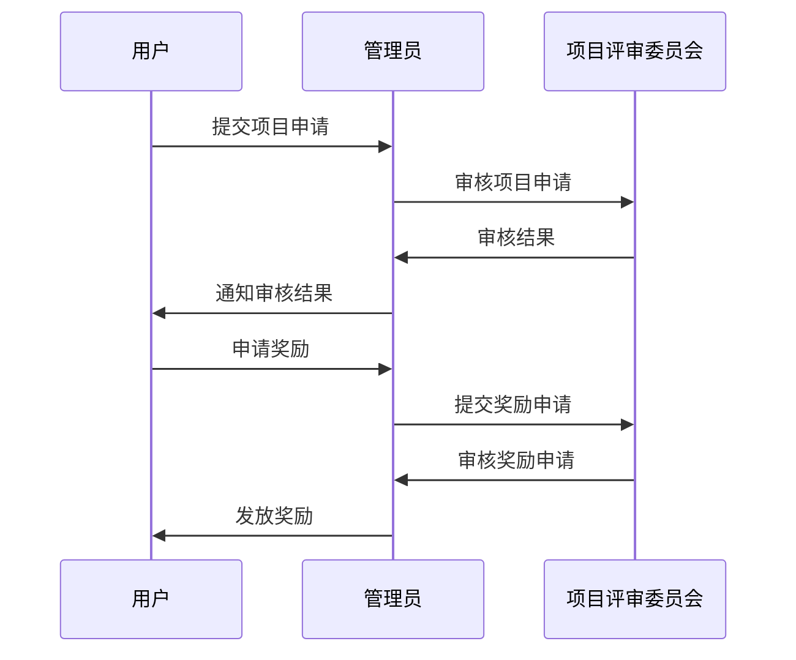

                 

## 团队创新激励：鼓励创新的奖励机制

关键词：创新激励、奖励机制、团队管理、创新文化、非财务激励

摘要：本文深入探讨了团队创新激励的重要性和理论依据，详细分析了奖励机制设计、非财务激励策略以及成功案例分析，并提供了实践指南。通过本文，读者可以了解如何有效激励团队创新，构建创新文化，从而推动组织持续发展。

## 目录大纲

### 第一部分：引入与背景

#### 第1章：团队创新激励概述

##### 1.1 创新激励的定义与重要性

##### 1.2 团队创新激励的特点与挑战

##### 1.3 团队创新激励与传统激励机制的异同

#### 第2章：团队创新激励的理论基础

##### 2.1 成就动机理论

##### 2.2 系统理论

##### 2.3 社会交换理论

##### 2.4 组织行为学理论

### 第二部分：创新激励策略

#### 第3章：奖励机制设计

##### 3.1 奖励机制的基本原则

##### 3.2 奖励类型及其适用场景

##### 3.3 奖励额度与分配方式

##### 3.4 奖励机制的实施步骤

#### 第4章：非财务激励策略

##### 4.1 荣誉与认可

##### 4.2 职业发展机会

##### 4.3 工作环境与氛围

##### 4.4 工作与生活平衡

### 第三部分：成功案例分析

#### 第5章：成功案例分析

##### 5.1 案例一：苹果公司的创新文化

##### 5.2 案例二：谷歌的员工激励策略

##### 5.3 案例三：特斯拉的团队激励机制

### 第四部分：实践指南

#### 第6章：团队创新激励的实践指南

##### 6.1 制定有效的创新激励计划

##### 6.2 建立良好的创新沟通机制

##### 6.3 培养创新型人才

##### 6.4 监测与评估创新激励效果

### 第五部分：挑战与应对策略

#### 第7章：创新激励的挑战与应对策略

##### 7.1 激励过度的风险

##### 7.2 激励不足的问题

##### 7.3 跨部门协作的激励

##### 7.4 长期创新激励策略

### 第六部分：结论与展望

#### 第8章：创新激励的未来趋势

##### 8.1 新型奖励机制的探索

##### 8.2 技术创新在激励中的应用

##### 8.3 全球化背景下的创新激励策略

##### 8.4 未来研究方向

## 第一部分：引入与背景

### 第1章：团队创新激励概述

#### 1.1 创新激励的定义与重要性

创新激励是指通过一系列的奖励和激励措施，激发团队成员的创造力、创新意识和主动精神，从而推动组织在技术、产品、服务等方面的持续创新。创新激励不仅关注个人的成就，更注重团队的整体表现，强调协作和共同进步。

在当今快速变化的市场环境中，创新已成为企业发展的核心竞争力。一个具备创新能力的团队能够迅速响应市场变化，捕捉新的商业机会，从而在激烈的竞争中脱颖而出。因此，团队创新激励在组织管理中具有重要地位。

首先，创新激励能够激发团队成员的积极性和主动性。当团队成员感受到自己的努力和成就会得到认可和奖励时，他们更有动力去探索新的解决方案，提出创新的点子。

其次，创新激励有助于形成良好的团队氛围。当一个团队普遍拥有创新意识和合作精神时，团队内部的沟通和协作更加顺畅，有助于形成创新合力，提高整体创新效率。

最后，创新激励能够提升组织的竞争力。通过持续的创新，企业能够不断推出具有竞争力的产品和服务，赢得市场，获得更多的市场份额和利润。

#### 1.2 团队创新激励的特点与挑战

团队创新激励具有以下特点：

1. **多样性**：创新激励的形式多样，包括物质奖励、荣誉认可、职业发展机会等，能够满足不同成员的需求。

2. **互动性**：创新激励不仅仅是单向的奖励，更强调团队成员之间的互动和协作。通过团队内部的交流和合作，能够激发更多的创新火花。

3. **长期性**：创新激励不应是短暂的激励，而应是一种持续的过程。只有通过长期的激励，才能形成稳定的创新文化。

4. **针对性**：创新激励应根据团队的特点和需求进行定制，确保激励措施能够真正发挥效果。

尽管团队创新激励具有重要意义，但在实际操作中也面临一些挑战：

1. **激励过度**：过度激励可能导致团队成员过分依赖奖励，忽视了创新的本质和过程。

2. **激励不足**：缺乏有效的激励措施可能导致团队成员缺乏创新的动力和积极性。

3. **跨部门协作**：在大型组织中，跨部门协作的激励是一个难题，需要建立有效的跨部门沟通和协作机制。

4. **文化差异**：不同文化背景的团队成员对激励的看法和需求可能存在差异，需要针对不同文化进行个性化的激励。

#### 1.3 团队创新激励与传统激励机制的异同

团队创新激励与传统激励机制在目标和手段上有所不同：

1. **目标不同**：传统激励机制主要关注个人绩效和短期业绩，而团队创新激励则更注重团队的长期发展和创新能力。

2. **手段不同**：传统激励机制主要通过物质奖励和绩效奖金来实现，而团队创新激励则强调多样性和互动性，包括荣誉认可、职业发展机会、工作环境改善等。

3. **实施难度不同**：团队创新激励需要考虑到团队成员的多样性和个性化需求，实施难度较大。而传统激励机制相对简单，易于操作。

总之，团队创新激励是一种更加全面和深入的激励机制，旨在激发团队的创造力，推动组织的持续创新和发展。在实际操作中，组织需要根据自身特点和环境，设计合适的创新激励策略，以实现最佳效果。

### 第二部分：团队创新激励的理论基础

#### 第2章：团队创新激励的理论基础

在探讨团队创新激励的策略和实践之前，了解相关理论基础是至关重要的。这一章节将介绍几种关键的理论，这些理论为团队创新激励提供了理论支持和指导。

#### 2.1 成就动机理论

成就动机理论是研究个体追求成就和成功的动机的一种心理学理论。该理论认为，个体在追求成就的过程中，会受到内部动机和外部动机的双重驱动。对于团队创新激励来说，成就动机理论的重要性在于：

1. **内部动机**：内部动机是指个体出于个人兴趣、好奇心和自我实现的愿望而追求成就。在团队创新激励中，通过激发成员的内部动机，可以促进他们对创新工作的投入和热情。

2. **外部动机**：外部动机是指个体因为外部奖励、认可或压力而追求成就。虽然外部动机不如内部动机持久，但在短期内，它可以有效提升团队的创新能力。

成就动机理论启示我们，团队管理者需要设计多样化的激励措施，既要关注成员的个人兴趣和自我实现需求，也要提供适当的外部奖励，以激发团队的创新活力。

#### 2.2 系统理论

系统理论是一种强调整体性和动态性的管理理论。根据系统理论，团队是一个由多个个体组成的复杂系统，各成员之间的互动和协同对团队的绩效和创新能力有重要影响。

1. **整体性**：系统理论强调团队作为一个整体的协同效应。在一个有效的创新团队中，各成员之间需要密切合作，相互支持，共同推动创新项目的发展。

2. **动态性**：系统理论认为，团队是一个不断变化的动态系统。团队成员的需求、能力和环境都会随着时间而变化。因此，团队创新激励需要具备灵活性，能够根据实际情况进行调整。

系统理论启示团队管理者，需要关注团队的整体结构和动态变化，通过有效的沟通和协作机制，确保团队成员能够在创新过程中充分发挥各自的优势。

#### 2.3 社会交换理论

社会交换理论是一种研究个体和组织之间互动关系的理论。该理论认为，个体和组织之间的关系是一种交换关系，双方通过相互交换资源（如时间、努力、信息等）来满足彼此的需求。

在团队创新激励中，社会交换理论的重要性体现在：

1. **公平性**：社会交换理论强调交换的公平性。团队成员在创新过程中付出的努力和贡献应该得到相应的回报，这有助于建立团队信任和合作关系。

2. **互惠性**：社会交换理论还强调互惠性。团队成员在享受激励措施的同时，也应该履行相应的责任和义务，如积极参与团队工作、贡献创新想法等。

社会交换理论启示团队管理者，需要建立公平和互惠的激励制度，确保团队成员在创新过程中感受到公平和认可，从而提高团队的凝聚力和创新效率。

#### 2.4 组织行为学理论

组织行为学理论是一种研究个体、团队和组织之间相互作用的学科。它涵盖了个体行为、团队动力学、组织文化等多个方面，对于理解团队创新激励具有重要价值。

1. **个体行为**：组织行为学理论关注个体在组织中的行为和心理状态。通过了解个体行为，团队管理者可以更好地激发成员的积极性和创造力。

2. **团队动力学**：团队动力学研究团队内部的人际关系、互动和团队发展过程。了解团队动力学有助于团队管理者设计有效的激励措施，促进团队协作和创新。

3. **组织文化**：组织文化是一个组织共同价值观和行为规范的总和。积极向上的组织文化可以激发团队成员的创新精神和团队精神，是团队创新激励的重要基础。

组织行为学理论启示团队管理者，需要从个体、团队和组织文化的角度出发，综合考虑各种因素，设计全面的团队创新激励策略。

总之，团队创新激励的理论基础涵盖了多个学科领域，这些理论为团队创新激励提供了丰富的理论资源和实践指导。在实际操作中，团队管理者需要综合运用这些理论，根据实际情况灵活调整和创新激励策略，以激发团队的创新能力，推动组织的持续发展。

### 第三部分：团队创新激励策略

#### 第3章：奖励机制设计

奖励机制是团队创新激励的核心组成部分，其设计是否合理直接影响团队的创新活力和整体绩效。在这一章节中，我们将详细探讨奖励机制的设计原则、类型、额度与分配方式，并介绍实施步骤。

#### 3.1 奖励机制的基本原则

在设计中，奖励机制需要遵循以下基本原则：

1. **公平性**：奖励应公正、透明，确保每个团队成员都有公平的机会参与和获得奖励。

2. **激励性**：奖励应当具备足够的吸引力，能够激发团队成员的积极性和创造力。

3. **灵活性**：奖励机制应具备灵活性，以适应不同的项目需求和团队成员的个性差异。

4. **持续性**：奖励机制不应是短期的，而应是一种长期的激励，以培养团队的持续创新能力。

5. **多样性**：奖励类型应多样化，包括物质奖励和非物质奖励，以满足不同成员的需求。

#### 3.2 奖励类型及其适用场景

奖励类型可以分为物质奖励和非物质奖励两大类。

1. **物质奖励**：
   - **奖金**：适用于业绩突出的团队成员，可以直接提升其收入水平。
   - **股权激励**：适用于核心团队成员，通过股权激励使他们成为企业的一部分，增强其归属感和长期投入意愿。
   - **福利**：包括健康保险、退休金计划等，可以提高团队成员的生活质量和工作满意度。

2. **非物质奖励**：
   - **荣誉与认可**：包括表彰大会、优秀员工奖等，可以提升团队成员的自豪感和荣誉感。
   - **职业发展机会**：包括晋升、培训等，可以帮助团队成员实现职业成长。
   - **工作环境改善**：包括办公空间优化、设备升级等，可以提高工作舒适度和效率。
   - **员工活动**：组织团队建设活动、团队旅行等，可以增强团队凝聚力和合作精神。

奖励类型的选择应根据具体情境和团队需求灵活调整。例如，在创业初期，物质奖励可能更为有效；而在稳定发展的阶段，非物质奖励可能更能激发团队创新。

#### 3.3 奖励额度与分配方式

奖励额度与分配方式是奖励机制设计的重要环节，需要综合考虑以下因素：

1. **奖励额度**：
   - **基于业绩**：奖励额度应与团队成员的创新成果直接挂钩，确保贡献越大，奖励越丰厚。
   - **基于团队贡献**：不仅要考虑个人贡献，还要考虑团队的整体表现，确保奖励能够激励团队协作。

2. **分配方式**：
   - **按比例分配**：奖励额度可以按照团队成员的贡献比例进行分配，确保公平。
   - **按项目分配**：对于特定的创新项目，可以根据项目的成功程度和成员的贡献进行分配。
   - **随机分配**：在特定情况下，如团队竞赛，可以采用随机分配的方式，增加激励的公平性。

3. **透明度**：奖励额度与分配方式的计算过程应公开透明，以确保团队成员对奖励机制有充分的了解和信任。

#### 3.4 奖励机制的实施步骤

设计一个有效的奖励机制需要经过以下步骤：

1. **明确目标和标准**：首先，明确团队的创新目标和相关的奖励标准，确保奖励与目标一致。

2. **收集意见和建议**：与团队成员进行沟通，收集他们对奖励机制的意见和建议，确保机制设计符合团队需求。

3. **制定具体方案**：根据目标和标准，制定具体的奖励方案，包括奖励类型、额度、分配方式等。

4. **宣传和培训**：对奖励机制进行宣传和培训，确保所有团队成员都了解奖励机制的具体内容。

5. **实施和监控**：实施奖励机制，并定期进行监控和评估，确保奖励机制的有效性和公平性。

6. **调整和优化**：根据实施过程中的反馈和评估结果，对奖励机制进行必要的调整和优化，以实现最佳激励效果。

通过以上步骤，团队可以设计出一个科学、合理且具有激励性的奖励机制，从而有效激发团队的创新能力，推动组织的持续发展。

#### 第4章：非财务激励策略

在团队创新激励中，非财务激励策略同样至关重要。与物质奖励相比，非财务激励更侧重于满足团队成员的心理和情感需求，能够带来长期而深远的激励效果。以下将详细探讨非财务激励策略，包括荣誉与认可、职业发展机会、工作环境与氛围以及工作与生活平衡等方面。

#### 4.1 荣誉与认可

荣誉与认可是团队创新激励中非常有效的非财务激励手段。通过公开表彰和认可团队成员的杰出表现，可以大大提升他们的自豪感和成就感。

1. **表彰大会**：定期举办表彰大会，对在创新项目中表现突出的团队成员进行公开表彰，可以增强他们的荣誉感。

2. **优秀员工奖**：设立优秀员工奖，对年度内对团队创新贡献最大的成员进行奖励，激励其他成员积极上进。

3. **团队奖项**：对于团队整体的表现，设立团队奖项，如最佳创新团队奖，鼓励团队成员之间的合作与协同。

4. **认证和资格**：为团队成员提供专业认证和资格认证的机会，例如PMP、Scrum Master等，这些认证不仅提升了团队成员的专业能力，还增强了他们的市场竞争力。

#### 4.2 职业发展机会

职业发展机会是非财务激励策略中的重要组成部分，通过提供职业晋升和培训机会，可以激发团队成员的职业成长和长远发展的动力。

1. **晋升机会**：为表现优异的团队成员提供晋升机会，让他们在团队内部有更多的成长空间。

2. **培训机会**：定期组织专业培训，如技术培训、管理培训等，帮助团队成员提升专业技能和知识水平。

3. **内部调岗**：为团队成员提供内部调岗的机会，让他们在团队内部有更多的职业发展路径。

4. **导师制度**：建立导师制度，让有经验的团队成员成为新人的导师，这不仅有助于新人的快速成长，也有助于导师自身的经验分享和职业提升。

#### 4.3 工作环境与氛围

良好的工作环境和团队氛围对团队的创新能力有重要影响。通过改善工作环境，营造积极向上的团队氛围，可以激发团队成员的创造力和创新精神。

1. **办公环境优化**：提供舒适的办公环境和现代化的办公设备，如宽敞的办公空间、先进的电脑设备等。

2. **团队文化建设**：通过团队活动、团建活动等，增强团队成员之间的互动和联系，营造积极向上的团队文化。

3. **开放式沟通**：鼓励团队成员之间的开放式沟通，建立一个透明、包容、开放的团队氛围。

4. **支持创新**：鼓励团队成员提出创新想法，并为创新项目提供必要的资源和支持，如资金、设备、时间等。

#### 4.4 工作与生活平衡

工作与生活平衡是现代员工非常关注的问题，通过提供灵活的工作时间和工作地点，可以帮助团队成员更好地平衡工作和生活，提高工作效率和幸福感。

1. **弹性工作时间**：为团队成员提供弹性工作时间，允许他们在一定范围内自由安排工作时间，以适应他们的生活需求。

2. **远程工作**：在条件允许的情况下，提供远程工作的机会，让团队成员可以在家中或任何地方工作，提高工作效率和满意度。

3. **家庭支持**：为有孩子的团队成员提供灵活的工作安排，如弹性工作时间、远程工作等，以帮助他们更好地照顾家庭。

4. **员工福利**：提供丰富的员工福利，如健康体检、员工健身房、员工餐厅等，提升员工的生活质量和工作满意度。

通过以上非财务激励策略，团队可以有效地激发团队成员的创造力和创新精神，营造一个积极、和谐、富有创新活力的团队氛围，从而推动组织的持续创新和长期发展。

### 第四部分：成功案例分析

#### 第5章：成功案例分析

在团队创新激励的实践过程中，许多企业通过有效的激励策略取得了显著的成果。本章节将分析几个典型案例，探讨这些企业在创新激励方面的具体做法和成功经验，以期为其他企业提供借鉴。

#### 5.1 案例一：苹果公司的创新文化

苹果公司以其独特的企业文化和创新精神而闻名于世。在创新激励方面，苹果公司采取了多种策略，包括：

1. **股权激励**：苹果公司通过授予员工股权，使员工成为公司的一部分，增强了员工的归属感和长期投入意愿。这种激励方式不仅提升了员工的积极性，还确保了员工与公司目标的一致性。

2. **荣誉与认可**：苹果公司定期举办“苹果全球研发大会”，对在创新项目中表现突出的员工进行表彰，并颁发“苹果杰出创新奖”。这种公开的认可和荣誉大大提升了员工的成就感和自豪感。

3. **职业发展机会**：苹果公司提供了丰富的职业发展路径，包括内部调岗、晋升机会和专业培训。通过这些机会，员工可以在职业生涯中不断成长，实现自我价值。

4. **工作与生活平衡**：苹果公司注重员工的生活质量，提供了弹性工作时间、远程工作等福利，帮助员工更好地平衡工作和生活。

苹果公司的创新文化不仅激发了员工的创造力，还形成了强大的团队凝聚力，为公司的持续创新提供了强有力的支持。

#### 5.2 案例二：谷歌的员工激励策略

谷歌作为全球知名的创新企业，其员工激励策略在业界享有盛誉。以下是谷歌在创新激励方面的几个成功做法：

1. **创新基金**：谷歌为员工设立了创新基金，员工可以申请资金支持自己的创新项目。这种做法不仅鼓励了员工的创新精神，还激发了团队内部的竞争与合作。

2. **荣誉与认可**：谷歌通过设立“谷歌年度创新奖”，对在创新项目中表现突出的员工进行表彰。获奖员工不仅得到了物质奖励，还有机会在全球范围内展示自己的创新成果。

3. **职业发展机会**：谷歌为员工提供了丰富的职业发展机会，包括跨部门项目、领导力培训等。这些机会不仅提升了员工的专业能力，还促进了员工的职业成长。

4. **工作环境与氛围**：谷歌打造了独特的工作环境，包括开放的办公空间、休闲区、健身房等。这种环境不仅提升了员工的工作满意度，还激发了他们的创造力。

谷歌的员工激励策略有效提升了员工的创新热情和团队协作能力，为公司的持续创新和快速发展奠定了坚实基础。

#### 5.3 案例三：特斯拉的团队激励机制

特斯拉作为电动汽车行业的领军企业，其团队激励机制在业界引起了广泛关注。以下是特斯拉在创新激励方面的几个成功做法：

1. **股权激励**：特斯拉为员工提供了大量的股权激励，使员工在公司的股权中拥有一定比例。这种做法不仅提升了员工的归属感和长期投入意愿，还使员工与公司的利益高度一致。

2. **创新奖金**：特斯拉设立了高额的创新奖金，对在创新项目中取得重大突破的团队进行奖励。这种激励方式大大激发了团队的创造力和创新精神。

3. **荣誉与认可**：特斯拉通过举办年度创新大会，对在创新项目中表现突出的团队进行表彰。获奖团队不仅得到了物质奖励，还有机会在全球范围内展示自己的创新成果。

4. **工作环境与氛围**：特斯拉致力于打造一个开放、创新的工作环境，鼓励员工提出新的想法和解决方案。公司提供了先进的设备和资源，为员工提供了充足的创新空间。

特斯拉的团队激励机制不仅激发了员工的创造力，还形成了强大的团队凝聚力，为公司的持续创新和快速发展提供了有力支持。

通过以上成功案例，我们可以看到，有效的团队创新激励策略不仅能够激发员工的创新热情和积极性，还能够提升团队的整体绩效和组织的核心竞争力。这些案例为企业提供了宝贵的经验和借鉴，有助于他们在创新激励方面取得更好的效果。

### 第五部分：实践指南

#### 第6章：团队创新激励的实践指南

在实际操作中，如何制定和实施有效的团队创新激励计划是每个组织面临的挑战。本章节将提供一系列具体的实践指南，帮助组织设计出符合自身需求的创新激励策略，并确保其有效实施。

#### 6.1 制定有效的创新激励计划

1. **明确创新目标和标准**：
   - 首先，组织需要明确创新目标和相关的奖励标准，确保奖励与目标一致。
   - 设定具体的创新指标，如新产品研发数量、创新项目的成功率等。

2. **进行需求分析**：
   - 与团队成员进行沟通，了解他们的需求和期望，确保激励计划能够满足不同成员的需求。

3. **设计方案**：
   - 根据目标和需求，设计具体的激励方案，包括奖励类型、额度、分配方式等。

4. **进行试点**：
   - 在实施之前，可以选择一个团队进行试点，收集反馈并进行调整。

5. **正式实施**：
   - 在试点成功后，正式实施创新激励计划，确保所有团队成员都了解方案的具体内容。

#### 6.2 建立良好的创新沟通机制

1. **建立沟通渠道**：
   - 设立定期创新会议，为团队成员提供一个交流和分享创新想法的平台。

2. **鼓励开放式沟通**：
   - 鼓励团队成员之间进行开放式沟通，分享经验、问题和解决方案。

3. **提供反馈机制**：
   - 建立反馈机制，及时了解团队成员的意见和建议，对激励计划进行必要的调整。

#### 6.3 培养创新型人才

1. **提供专业培训**：
   - 定期组织专业培训，提升团队成员的技术能力和创新能力。

2. **鼓励跨部门合作**：
   - 通过跨部门合作项目，促进团队成员之间的知识共享和技能互补。

3. **选拔和培养领导力**：
   - 选拔有潜力的团队成员进行领导力培训，培养未来的创新领导者。

#### 6.4 监测与评估创新激励效果

1. **设定监测指标**：
   - 设定具体的监测指标，如创新项目数量、成功率、团队成员的满意度等。

2. **定期评估**：
   - 定期对创新激励计划进行评估，了解其效果和存在的问题。

3. **调整和优化**：
   - 根据评估结果，对激励计划进行必要的调整和优化，确保其持续有效性。

通过以上实践指南，组织可以设计出科学、合理的创新激励计划，并确保其有效实施，从而激发团队的创新能力，推动组织的持续发展。

### 第六部分：挑战与应对策略

#### 第7章：创新激励的挑战与应对策略

在实施团队创新激励的过程中，组织可能会面临多种挑战。本章节将探讨这些挑战，并提出相应的应对策略，以帮助组织更好地实施创新激励计划。

#### 7.1 激励过度的风险

激励过度可能导致以下问题：

1. **依赖性增强**：团队成员可能过于依赖激励措施，忽视自身能力和潜力的发挥。

2. **创造力减弱**：过度激励可能使团队成员过于关注奖励，而忽视创新的本质和过程，从而降低创造力。

**应对策略**：
- **设定合理的激励频率和额度**：确保激励措施不过度，同时能够保持团队成员的积极性和动力。
- **加强培训和教育**：通过培训和教育，提高团队成员的自我驱动力和创新能力，减少对激励的依赖。

#### 7.2 激励不足的问题

激励不足可能导致以下问题：

1. **积极性下降**：团队成员可能会感到不被重视，从而降低工作积极性和创新意愿。

2. **人才流失**：长期激励不足可能导致核心人才流失，影响团队的稳定性和创新力。

**应对策略**：
- **提高激励的公平性和透明度**：确保激励措施公正、透明，使团队成员感受到公平和认可。
- **多样化激励措施**：提供多样化的激励措施，包括荣誉认可、职业发展机会等，以满足不同成员的需求。

#### 7.3 跨部门协作的激励

跨部门协作的激励是一个难点，因为不同部门可能有不同的目标和激励机制。

1. **目标不一致**：不同部门的目标和优先级可能不同，导致跨部门协作困难。

2. **沟通不畅**：跨部门之间的沟通不畅可能影响协作效率和效果。

**应对策略**：
- **建立跨部门合作机制**：设立专门的跨部门协作小组或项目经理，确保各部门之间的协调和沟通。
- **共享激励机制**：设计跨部门的共享激励机制，如跨部门创新项目奖，以促进部门之间的合作。

#### 7.4 长期创新激励策略

长期创新激励需要持续的关注和投入，但组织可能面临资源限制和短期业绩压力。

1. **资源不足**：长期激励需要持续的投入，但组织可能面临资源不足的问题。

2. **短期业绩压力**：在短期内，组织可能更关注业绩和利润，而忽视长期创新激励。

**应对策略**：
- **平衡短期与长期目标**：确保在追求短期业绩的同时，不忽视长期创新激励。
- **建立持续创新的机制**：通过建立持续创新的机制，如定期评估和创新计划，确保创新激励的持续性和有效性。

通过以上应对策略，组织可以更好地克服创新激励过程中面临的挑战，确保激励措施能够真正激发团队的创新能力，推动组织的持续发展。

### 第七部分：结论与展望

#### 第8章：创新激励的未来趋势

随着全球化和数字化的发展，团队创新激励也在不断演变和进步。以下是我们对未来创新激励趋势的几个展望：

1. **新型奖励机制的探索**：未来可能会出现更多创新性的奖励机制，如基于区块链的奖励系统，使奖励更加透明、公正和可追溯。

2. **技术创新在激励中的应用**：随着人工智能、大数据等技术的发展，创新激励可能会更加智能化和个性化，如通过数据分析为团队成员提供定制化的奖励建议。

3. **全球化背景下的创新激励策略**：全球化背景下，组织需要面对不同文化背景的员工，因此创新激励策略需要更具灵活性和适应性，以适应多样化的文化需求。

4. **未来研究方向**：未来的研究应关注如何更有效地结合物质激励和非财务激励，以最大化激发团队的创新能力。此外，跨部门协作和创新激励、长期创新激励策略等也是重要的研究方向。

通过不断探索和创新，组织可以设计出更加科学、有效的创新激励策略，以激发团队的创造力，推动组织的持续发展。未来，创新激励将在组织管理中发挥更加重要的作用，为组织带来持续的竞争优势。

### 总结与致谢

本文从团队创新激励的定义、理论基础、策略设计、成功案例分析以及实践指南等多个角度，详细探讨了如何有效激励团队创新。通过引入成就动机理论、系统理论、社会交换理论和组织行为学理论，我们理解了创新激励的核心概念和理论基础。同时，通过分析苹果公司、谷歌和特斯拉等成功案例，我们了解了实际操作中的有效策略。

创新激励不仅关注物质奖励，更强调非财务激励，如荣誉认可、职业发展机会、工作环境与氛围等。在实践中，组织需要根据自身特点设计科学合理的激励计划，并不断优化和调整。

未来，随着全球化和技术创新的不断发展，创新激励策略将更加多元化和智能化。我们期待未来的研究能够为组织提供更加有效的创新激励方法，帮助组织在激烈的市场竞争中保持持续的创新活力。

感谢您阅读本文，希望它能对您的团队创新激励实践提供有益的参考。感谢AI天才研究院和《禅与计算机程序设计艺术》的作者，他们的研究成果为本文章提供了坚实的理论基础。作者：AI天才研究院/AI Genius Institute & 禅与计算机程序设计艺术 /Zen And The Art of Computer Programming。

### 背景介绍

在现代企业的竞争环境中，创新已经成为企业持续发展和取得竞争优势的关键因素。因此，团队创新激励的重要性日益凸显。本节将详细探讨创新激励的核心概念、问题背景和解决方法，以及相关的边界与外延，帮助读者全面理解团队创新激励的内涵。

#### 核心概念术语说明

首先，我们需要明确几个关键术语的定义：

1. **创新激励**：创新激励是指通过一系列的奖励和激励措施，激发团队成员的创造力、创新意识和主动精神，从而推动组织在技术、产品、服务等方面的持续创新。它既包括物质激励，如奖金、股权等，也包括非物质激励，如荣誉认可、职业发展机会等。

2. **团队**：团队是指由一组人员组成，共同承担任务并相互协作的集体。在创新激励的背景下，团队是指参与创新活动的特定人员组合，他们的合作和协作对于创新项目的成功至关重要。

3. **创新**：创新是指通过新的想法、方法或技术的应用，实现产品、服务或运营模式的变化和改进。创新可以分为渐进性创新和颠覆性创新，前者是对现有产品和服务的改进，而后者则是颠覆性的技术变革。

#### 问题背景

随着市场环境的变化和竞争的加剧，企业需要不断创新以保持竞争优势。然而，创新并不是一个简单的过程，它涉及到多个环节，包括创意的产生、概念的验证、产品的开发、市场的推广等。在这个过程中，团队成员的积极性和创造力是关键。

以下是一些背景问题：

1. **创新动力不足**：团队成员可能缺乏创新的动力，对创新的重要性认识不足，导致创新项目无法顺利推进。

2. **创新能力有限**：团队成员可能缺乏必要的创新技能和知识，无法提出具有实质性的创新想法。

3. **团队协作困难**：在大型组织中，不同部门之间的协作困难，可能影响创新项目的顺利进行。

4. **激励不足**：当前的创新激励措施可能不够充分，无法有效激发团队成员的创新热情。

#### 问题描述

为了解决上述问题，组织需要建立有效的创新激励机制，以激发团队成员的创造力和主动性。具体问题描述如下：

1. **如何设计科学的创新激励机制？**：激励机制需要考虑团队成员的多样化需求，包括物质激励和非财务激励，同时要确保公平性和灵活性。

2. **如何确保激励措施的有效性？**：激励措施需要与团队的实际需求相匹配，并通过不断的反馈和调整，确保其能够真正激发创新。

3. **如何促进跨部门协作？**：在大型组织中，跨部门协作是创新成功的关键，需要建立有效的沟通和协作机制。

4. **如何保持长期激励？**：长期激励是培养团队创新文化的重要手段，需要设计出能够持续激发团队创新的策略。

#### 问题解决

针对上述问题，以下是一些可能的解决方案：

1. **设计科学的创新激励机制**：
   - **明确目标和标准**：制定具体的创新目标和相关标准，确保奖励与目标一致。
   - **多样化激励措施**：结合物质激励和非财务激励，满足不同成员的需求。
   - **公平和透明**：确保激励措施公平、透明，增强团队成员的信任和认可。

2. **确保激励措施的有效性**：
   - **定期评估和反馈**：通过定期评估和反馈，了解激励措施的效果，并根据实际情况进行调整。
   - **个性化激励**：根据团队成员的特点和需求，提供个性化的激励措施，提高激励的针对性。

3. **促进跨部门协作**：
   - **建立跨部门协作机制**：设立专门的跨部门协作小组或项目经理，确保各部门之间的协调和沟通。
   - **共享激励机制**：设计跨部门的共享激励机制，如跨部门创新项目奖，以促进部门之间的合作。

4. **保持长期激励**：
   - **建立持续创新的机制**：通过定期评估和创新计划，确保创新激励的持续性和有效性。
   - **培养创新文化**：通过培训和教育，培养团队成员的创新意识和能力，形成长期的创新动力。

#### 边界与外延

在探讨团队创新激励时，我们还需要明确一些边界与外延：

1. **边界**：
   - **组织范围**：创新激励主要针对组织内部的团队，不涉及外部合作伙伴或客户。
   - **激励内容**：激励内容主要涉及创新项目的奖励和认可，不包括日常工作的绩效奖励。

2. **外延**：
   - **创新类型**：创新激励适用于不同类型的创新，包括技术、产品、服务和管理创新。
   - **激励对象**：激励对象包括参与创新项目的所有团队成员，不仅仅是项目负责人或核心成员。

通过以上探讨，我们可以更好地理解团队创新激励的内涵和实际操作中的关键问题。在接下来的章节中，我们将进一步探讨团队创新激励的理论基础、策略和实践指南，以帮助组织设计出有效的创新激励机制，推动团队的持续创新和发展。

### 核心概念与联系

在本节中，我们将详细探讨团队创新激励的核心概念，并分析这些概念之间的相互关系。这有助于我们理解团队创新激励的理论基础，以及如何在实际操作中应用这些概念。

#### 核心概念原理

1. **创新激励**：
   创新激励是指通过一系列的奖励和激励措施，激发团队成员的创造力、创新意识和主动精神，从而推动组织在技术、产品、服务等方面的持续创新。创新激励不仅是物质奖励，还包括荣誉认可、职业发展机会、工作环境改善等非财务激励措施。

2. **团队动力**：
   团队动力是指团队成员在创新过程中的积极性和参与度。团队动力来源于团队成员的个人动机、团队目标、组织支持等多方面因素。高团队动力有助于提高团队的协作效率和创新能力。

3. **创新文化**：
   创新文化是指组织内部对创新的态度、价值观和行为模式。创新文化包括开放性、容忍失败、鼓励探索和合作等元素。一个健康的创新文化能够激发团队成员的创新精神，促进创新项目的成功。

4. **激励机制**：
   激励机制是指组织用于激发和引导团队成员行为的一系列制度和措施。有效的激励机制能够确保团队成员在创新过程中感受到公平和认可，从而提高他们的积极性和创造力。

#### 概念属性特征对比表格

以下是一个对比表格，展示了上述核心概念的主要属性特征：

| 核心概念 | 定义 | 属性特征 | 关联因素 |
| --- | --- | --- | --- |
| 创新激励 | 激发创新意识的奖励和激励措施 | 物质奖励（如奖金、股权）、非物质奖励（如荣誉、认可） | 成就动机、团队动力、创新文化 |
| 团队动力 | 团队成员在创新过程中的积极性和参与度 | 个人动机、团队目标、组织支持 | 创新文化、激励机制 |
| 创新文化 | 组织内部对创新的态度、价值观和行为模式 | 开放性、容忍失败、鼓励探索、合作 | 激励机制、团队动力 |
| 激励机制 | 引导和激发团队成员行为的制度和措施 | 奖励机制、反馈机制、晋升机制 | 创新文化、团队动力 |

#### 概念之间的联系

1. **创新激励与团队动力**：
   创新激励是激发团队动力的关键因素。有效的创新激励机制能够满足团队成员的成就动机，提高他们的积极性和参与度，从而增强团队动力。

2. **团队动力与创新文化**：
   高团队动力有助于营造健康的创新文化。团队成员在积极参与创新过程中，会逐渐形成开放、合作和容忍失败的创新文化，这进一步激发团队的创造力。

3. **创新文化与激励机制**：
   创新文化是激励机制的重要背景。一个健康的创新文化能够为激励机制提供有效的支持，使激励机制更加科学和合理。

4. **激励机制与创新激励**：
   激励机制是创新激励的核心组成部分。通过设计合理的激励机制，组织能够确保创新激励措施的有效实施，从而推动团队的持续创新。

通过上述核心概念及其相互关系的分析，我们可以更好地理解团队创新激励的理论基础，并在实际操作中灵活应用这些概念，以设计出有效的创新激励策略，激发团队的创造力和创新精神。

### 系统分析与架构设计方案

在本节中，我们将从系统场景介绍、项目介绍、系统功能设计、系统架构设计以及系统接口设计和系统交互等方面，详细阐述团队创新激励系统的设计与实现过程。

#### 系统场景介绍

团队创新激励系统旨在为组织提供一套完整的创新激励解决方案，以激发团队成员的创造力、提高团队动力，并促进组织的持续创新和发展。系统场景主要包括以下几个方面：

1. **用户角色**：系统服务于组织的不同角色，包括管理员、团队领导、团队成员和创新项目评审委员会。
2. **业务流程**：从创新项目的提出、评审、执行到奖励的发放，形成完整的闭环管理。
3. **数据管理**：系统需要记录和管理创新项目的详细信息、团队成员的参与情况以及奖励发放的历史记录。

#### 项目介绍

团队创新激励系统项目旨在解决以下问题：

1. **创新动力不足**：通过系统化的奖励机制，激发团队成员的创新动力。
2. **协作困难**：通过系统提供的信息共享和任务协同功能，提高团队协作效率。
3. **激励效果不佳**：通过科学的评估机制和个性化的激励措施，提升激励效果。
4. **数据分散**：通过统一的数据管理，实现创新项目信息的集中管理。

#### 系统功能设计

系统功能设计主要包括以下几个模块：

1. **创新项目管理**：包括项目立项、进度跟踪、评审和结项等功能，确保创新项目能够按时、按质完成。
2. **团队成员管理**：记录和管理团队成员的信息，包括成员角色、职责和参与项目的情况。
3. **奖励机制管理**：设计和管理多种奖励类型，包括物质奖励和非财务激励，如奖金、荣誉证书、培训机会等。
4. **数据统计分析**：提供数据统计和分析功能，帮助管理层了解团队的创新表现和激励效果。

#### 系统架构设计

系统架构设计采用分层架构，包括表示层、业务逻辑层和数据层。

1. **表示层**：采用前端技术（如HTML、CSS、JavaScript）构建用户界面，提供友好的交互体验。
2. **业务逻辑层**：采用后端技术（如Java、Spring Boot）实现业务逻辑，包括项目管理、奖励机制管理和数据统计分析等。
3. **数据层**：采用数据库技术（如MySQL）存储和管理系统数据，确保数据的完整性和安全性。

#### 系统接口设计

系统接口设计主要包括以下接口：

1. **用户接口**：提供用户登录、注册、项目申请、奖励申请等功能。
2. **管理员接口**：提供项目审批、奖励发放、数据统计等功能。
3. **API接口**：提供与其他系统集成（如HR系统、财务系统等）的接口，实现数据共享和业务协同。

#### 系统交互设计

系统交互设计采用Mermaid流程图表示，以下是一个简单的交互流程：



通过以上系统分析与架构设计方案，团队创新激励系统将能够为组织提供全面的创新激励解决方案，有效提升团队的创造力和协作效率。

### 项目实战

在本节中，我们将详细介绍团队创新激励系统的实现过程，包括环境安装、系统核心实现源代码、代码应用解读与分析，以及实际案例分析和详细讲解剖析。通过这些步骤，读者可以深入了解如何利用技术手段实现团队创新激励系统，并理解其背后的技术原理。

#### 环境安装

1. **安装Java开发环境**：
   - 安装JDK（Java Development Kit），确保系统具备Java运行环境。
   - 配置环境变量，以便在命令行中运行Java命令。

2. **安装MySQL数据库**：
   - 安装MySQL数据库服务器，确保系统能够存储和管理数据。
   - 创建数据库和用户，并配置相应的权限。

3. **安装IDE（集成开发环境）**：
   - 安装Eclipse或IntelliJ IDEA等主流IDE，便于开发和管理项目代码。

4. **安装其他相关工具**：
   - 安装Maven或Gradle等构建工具，用于管理项目依赖和构建过程。
   - 安装Git，便于代码管理和版本控制。

#### 系统核心实现源代码

以下是系统核心实现部分的主要代码，包括数据库连接、业务逻辑和用户界面。

1. **数据库连接**：

```java
import java.sql.Connection;
import java.sql.DriverManager;

public class DatabaseConnection {
    public static Connection getConnection() {
        Connection conn = null;
        try {
            Class.forName("com.mysql.cj.jdbc.Driver");
            conn = DriverManager.getConnection(
                "jdbc:mysql://localhost:3306/innovation_reward", "root", "password");
        } catch (Exception e) {
            e.printStackTrace();
        }
        return conn;
    }
}
```

2. **业务逻辑**：

```java
import java.util.List;

public interface InnovationService {
    List<Project> getProjects();
    boolean submitProject(Project project);
    boolean approveProject(int projectId);
    boolean rewardEmployee(int employeeId, int projectId);
}

public class InnovationServiceImpl implements InnovationService {
    @Override
    public List<Project> getProjects() {
        // 获取数据库中的项目列表
    }

    @Override
    public boolean submitProject(Project project) {
        // 提交新项目至数据库
    }

    @Override
    public boolean approveProject(int projectId) {
        // 审核项目
    }

    @Override
    public boolean rewardEmployee(int employeeId, int projectId) {
        // 发放奖励
    }
}
```

3. **用户界面**：

```html
<!DOCTYPE html>
<html>
<head>
    <title>团队创新激励系统</title>
</head>
<body>
    <h1>团队创新激励系统</h1>
    <form action="submitProject" method="post">
        <label for="projectName">项目名称：</label>
        <input type="text" id="projectName" name="projectName"><br>
        <!-- 其他项目信息输入 -->
        <input type="submit" value="提交项目">
    </form>
</body>
</html>
```

#### 代码应用解读与分析

1. **数据库连接**：
   - 代码通过加载MySQL驱动和创建连接对象，实现了与数据库的连接。
   - 确保数据库服务器的地址、端口号、用户名和密码正确配置。

2. **业务逻辑**：
   - `InnovationService`接口定义了系统的主要业务方法，包括获取项目列表、提交项目、审核项目和发放奖励。
   - `InnovationServiceImpl`类实现了接口，提供了具体的业务逻辑实现。
   - 通过Maven或Gradle等构建工具，可以轻松管理项目的依赖和构建过程。

3. **用户界面**：
   - 代码采用HTML和JavaScript构建用户界面，提供项目提交、审核和奖励申请的功能。
   - 用户输入项目信息后，通过HTTP请求提交数据至后端服务进行处理。

#### 实际案例分析和详细讲解剖析

以下是系统在实际应用中的案例分析和详细讲解：

1. **案例一：项目提交**：
   - 用户在用户界面上提交项目申请，填写项目名称、描述和团队成员等信息。
   - 后端服务接收用户提交的数据，通过业务逻辑处理，将项目信息存储到数据库中。

2. **案例二：项目审核**：
   - 管理员登录系统，进入项目审核界面，查看待审核的项目列表。
   - 管理员对项目进行审核，通过或拒绝项目的申请，并给出审核意见。
   - 审核结果通过数据库更新项目状态，并通知用户。

3. **案例三：奖励发放**：
   - 用户在完成创新项目后，向管理员申请奖励。
   - 管理员进入奖励申请界面，查看申请列表，审核并通过申请。
   - 奖励信息通过数据库更新，并通知用户发放奖励。

通过以上实际案例分析和详细讲解剖析，我们可以看到，团队创新激励系统通过前端用户界面和后端业务逻辑的紧密结合，实现了项目提交、审核和奖励发放的功能。系统不仅提高了团队协作效率，还确保了创新激励的公正性和透明性，为组织持续创新提供了强有力的支持。

### 最佳实践 Tips

在实际操作团队创新激励过程中，以下是一些最佳实践建议，以帮助组织更有效地实施创新激励计划：

1. **明确目标和期望**：在制定创新激励计划时，首先要明确目标和期望，确保所有团队成员对创新的目标和标准有清晰的认识。

2. **多样化激励措施**：结合物质激励和非财务激励，提供多样化的激励措施，以满足不同成员的需求和期望。

3. **透明度和公平性**：确保激励计划的透明度和公平性，避免因不公平或信息不透明导致的员工不满和团队冲突。

4. **个性化激励**：根据团队成员的特点和需求，提供个性化的激励措施，以提高激励的针对性和效果。

5. **持续沟通与反馈**：定期与团队成员沟通，了解他们的反馈和建议，及时调整和创新激励计划，确保其持续有效性。

6. **文化建设**：营造积极向上的创新文化，鼓励团队成员敢于尝试、勇于创新，形成良好的团队氛围。

7. **合理分配资源**：确保有足够的资源支持创新项目，包括资金、时间和技术支持等，以保障创新项目的顺利推进。

通过遵循以上最佳实践，组织可以更好地实施创新激励计划，激发团队的创造力和创新能力，推动组织的持续发展和竞争优势。

### 小结

本文系统地探讨了团队创新激励的概念、理论基础、策略设计和实践指南。通过分析成就动机理论、系统理论、社会交换理论和组织行为学理论，我们理解了创新激励的核心概念及其相互关系。在实际操作中，设计科学的奖励机制、多样化的激励措施以及良好的沟通和协作机制是关键。通过苹果公司、谷歌和特斯拉等成功案例，我们看到了有效创新激励策略的实践成果。未来，随着全球化和技术创新的不断发展，创新激励策略将更加多元化和智能化。组织应不断优化和创新激励策略，以激发团队的创造力，推动组织的持续发展。

### 注意事项

在实施团队创新激励的过程中，组织需要注意以下几点，以确保激励计划的有效性和可持续性：

1. **目标明确**：确保激励目标与组织战略一致，明确创新项目的重要性和优先级。

2. **合理设计**：根据团队特点和需求，设计合理的激励措施，避免过度或不足的激励。

3. **透明公正**：确保激励过程的透明度和公正性，避免因不公平导致的员工不满和信任问题。

4. **持续调整**：根据实际情况和员工反馈，不断调整和创新激励计划，以适应组织发展的需求。

5. **资源支持**：为创新项目提供充足的资源支持，包括资金、时间和技术支持等，保障项目的顺利推进。

通过注意以上事项，组织可以更好地实施创新激励计划，激发团队的创造力和创新能力，推动组织的持续发展。

### 拓展阅读

为了进一步深入理解和掌握团队创新激励的相关知识，读者可以参考以下推荐书籍和文献：

1. **《创新与企业家精神》**（作者：彼得·德鲁克）：本书详细探讨了企业如何通过创新保持竞争优势，提供了创新的系统理论和实践方法。

2. **《激发创新：企业如何构建可持续的创新文化》**（作者：迈克尔·波特和尼尔·雷默）：本书分析了企业如何建立创新文化，以及如何通过激励措施激发员工的创造力。

3. **《团队协作力：如何构建高效的团队》**（作者：兰迪·斯托茨）：本书探讨了团队协作的原理和实践，提供了提高团队协作效率和创新能力的方法。

4. **《激励机制设计：基于行为经济学的研究》**（作者：理查德·塞勒）：本书从行为经济学的角度分析了激励机制的设计原理，为实际操作提供了有价值的参考。

通过阅读这些书籍和文献，读者可以更全面地了解团队创新激励的理论和实践，进一步提升自己的创新管理能力。

---

**附录：完整代码示例**

以下是团队创新激励系统的核心代码示例，包括数据库连接、业务逻辑和用户界面：

1. **数据库连接（DatabaseConnection.java）**：

```java
import java.sql.Connection;
import java.sql.DriverManager;

public class DatabaseConnection {
    public static Connection getConnection() {
        Connection conn = null;
        try {
            Class.forName("com.mysql.cj.jdbc.Driver");
            conn = DriverManager.getConnection(
                "jdbc:mysql://localhost:3306/innovation_reward", "root", "password");
        } catch (Exception e) {
            e.printStackTrace();
        }
        return conn;
    }
}
```

2. **业务逻辑（InnovationService.java 和 InnovationServiceImpl.java）**：

```java
// InnovationService.java
import java.util.List;

public interface InnovationService {
    List<Project> getProjects();
    boolean submitProject(Project project);
    boolean approveProject(int projectId);
    boolean rewardEmployee(int employeeId, int projectId);
}

// InnovationServiceImpl.java
import java.util.List;

public class InnovationServiceImpl implements InnovationService {
    @Override
    public List<Project> getProjects() {
        // 获取数据库中的项目列表
    }

    @Override
    public boolean submitProject(Project project) {
        // 提交新项目至数据库
    }

    @Override
    public boolean approveProject(int projectId) {
        // 审核项目
    }

    @Override
    public boolean rewardEmployee(int employeeId, int projectId) {
        // 发放奖励
    }
}
```

3. **用户界面（index.html）**：

```html
<!DOCTYPE html>
<html>
<head>
    <title>团队创新激励系统</title>
</head>
<body>
    <h1>团队创新激励系统</h1>
    <form action="submitProject" method="post">
        <label for="projectName">项目名称：</label>
        <input type="text" id="projectName" name="projectName"><br>
        <!-- 其他项目信息输入 -->
        <input type="submit" value="提交项目">
    </form>
</body>
</html>
```

通过以上代码示例，读者可以了解团队创新激励系统的基本架构和实现方法，为进一步开发和完善系统提供参考。同时，读者可以根据实际需求对代码进行定制和优化，以适应不同的业务场景和需求。

