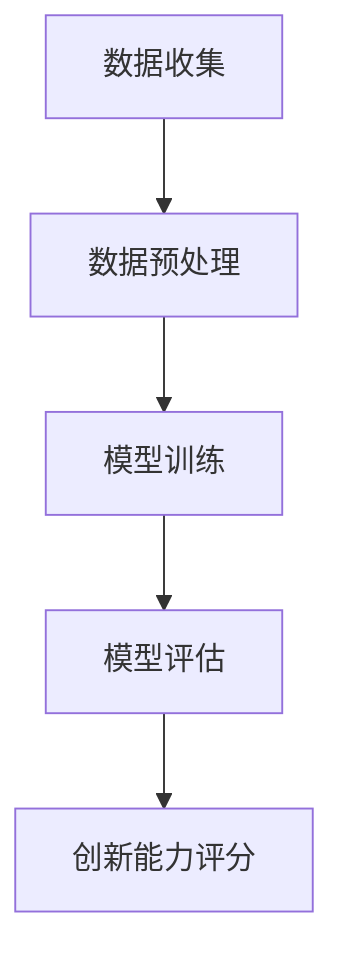
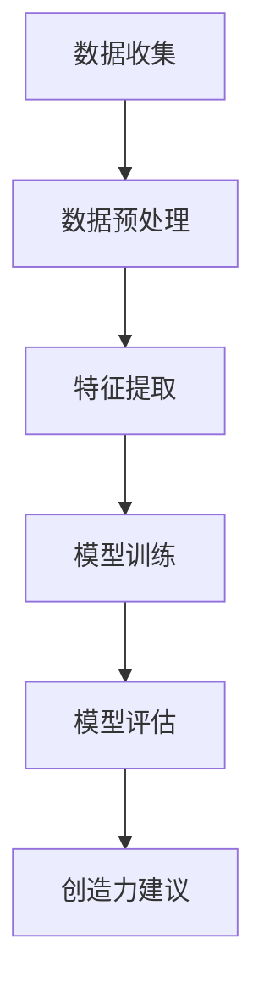

                 

### 文章标题

### 关键词

- 团队创新
- 创造力激发
- 管理方法
- 实战案例分析

### 摘要

本文旨在深入探讨团队创新能力的重要性，并提供一系列行之有效的激发团队创造力的方法。文章从背景介绍入手，逐步阐述团队创新能力的关键概念和特征，接着详细讲解激发团队创造力的管理方法、工具与技巧以及算法原理。通过实战案例分析，本文总结了提升团队创新能力的主要发现和实践建议，为未来研究方向提供了参考。

## 引言

### 1.1 问题背景

在当今快速变化的商业环境中，创新能力已成为企业持续发展的关键因素。然而，许多企业在提升团队创新能力方面面临诸多挑战。首先，创新需要投入大量时间和资源，但往往难以预测创新的结果。其次，团队成员间的协作和沟通不足，往往导致创新过程中出现瓶颈。此外，缺乏有效的激励机制和团队建设策略，也限制了团队创造力的发挥。

### 1.2 团队创新能力的重要性

团队创新能力不仅直接影响企业的市场竞争力，还关系到企业的长期生存与发展。一个具备强大创新能力的团队能够迅速响应市场变化，推出具有竞争力的产品和服务。此外，创新还能带来技术进步、降低成本、提高效率等多重益处。因此，提升团队创新能力已成为现代企业的重要任务。

### 1.3 问题描述

本文关注的核心问题是：如何有效地激发团队创造力，提升团队创新能力。具体而言，需要解决以下问题：

1. **创新能力的定义与特征**：明确团队创新能力的基本概念，分析其特征和组成部分。
2. **激发创造力的方法**：探讨多种管理方法、工具和技巧，以激发团队成员的创造力。
3. **实战案例分析**：通过具体案例，分析激发团队创造力策略的有效性。
4. **未来研究方向**：总结本文的主要发现，提出未来研究的方向和建议。

### 1.4 边界与外延

1. **适用范围**：本文主要针对现代企业中的团队创新能力进行探讨，但提出的策略和技巧也适用于其他组织形式。
2. **个人能力与团队能力的关系**：团队创新能力是个人创新能力的基础，但同时也受到团队协作、沟通和环境等多方面因素的影响。

## 核心概念与联系

### 2.1 创新能力的原理

#### 2.1.1 创新能力的定义

创新能力是指团队在应对复杂问题和挑战时，通过创意思维和灵活应对，提出新想法、新方法和新方案的能力。它不仅包括技术创新，还涵盖了商业模式、管理策略和文化变革等多个方面。

#### 2.1.2 创新能力的核心要素

1. **创意思维**：通过联想、逆向思维、发散思维等，激发团队成员的想象力。
2. **知识整合**：团队成员具备广泛的知识背景，能够将不同领域的知识进行整合，产生新的见解。
3. **团队协作**：团队成员之间的有效沟通和协作，是创新能力的重要保障。
4. **持续学习**：不断学习新知识和技能，保持团队的创新活力。

### 2.2 团队创新能力的特征

#### 2.2.1 团队创新能力的属性

1. **协同性**：团队成员在创新过程中需要协同合作，共同解决问题。
2. **动态性**：创新过程是一个不断试错和调整的过程，具有高度动态性。
3. **多样性**：团队创新成果通常具有多样性，包括技术创新、商业模式创新等。
4. **可持续性**：创新需要持续投入和努力，才能保持团队的创新能力。

#### 2.2.2 团队创新能力与个人创新能力对比

| 对比项       | 个人创新能力          | 团队创新能力          |
| ------------ | ------------------- | ------------------- |
| 核心要素     | 单个个体思维          | 协同团队思维          |
| 影响因素     | 个体知识、经验和技能  | 团队协作、知识共享    |
| 结果形式     | 单一创新成果         | 多样化创新成果        |
| 可持续性     | 个人持续学习         | 团队持续投入和努力    |

### 2.3 团队创新能力的ER实体关系图

#### 2.3.1 团队创新实体

- **团队成员**：具备创意思维、知识整合能力的个体。
- **创新项目**：团队共同推进的创新任务。
- **创新成果**：项目完成后产生的新想法、新方法或新产品。

#### 2.3.2 团队创新活动

- **创意生成**：团队成员通过头脑风暴、思维导图等工具，产生创意。
- **方案评估**：团队对创意进行评估，筛选出有潜力的方案。
- **实验验证**：团队对选定的方案进行实验验证，优化和完善。

```mermaid
erDiagram
    TeamMember ||--o{ InnovationProject : Member of }
    InnovationProject ||--|{ InnovationResult : Result of }
    TeamMember ||--|{ CreativeProcess : Creator of }
    CreativeProcess ||--o{ EvaluationProcess : Component of }
    EvaluationProcess ||--o{ ExperimentValidation : Sub-process of }
```

### 3. 数学模型与公式

#### 3.1 创新能力的数学模型

#### 3.1.1 数学模型的构建

创新能力的数学模型可以表示为：

$$
InnovationCapability = f(Creativity, Knowledge, Collaboration, ContinuousLearning)
$$

其中，$Creativity$ 代表创意思维，$Knowledge$ 代表知识整合，$Collaboration$ 代表团队协作，$ContinuousLearning$ 代表持续学习。

#### 3.1.2 公式解释

1. **创意思维**：创意思维是创新能力的基础，通常用创意数量或创意质量来衡量。
2. **知识整合**：团队成员的知识背景和经验对创新能力的提升至关重要。
3. **团队协作**：团队协作是创新能力的关键因素，通过有效的沟通和协作，可以最大化团队的创造力。
4. **持续学习**：持续学习能够不断提升团队成员的技能和知识，为创新能力提供源源不断的动力。

#### 3.2 创造力的公式推导

创造力可以用以下公式来推导：

$$
Creativity = f(Imagination, Insight, Originality)
$$

其中，$Imagination$ 代表想象力，$Insight$ 代表洞察力，$Originality$ 代表独创性。

1. **想象力**：想象力是创意思维的核心，能够激发团队成员产生丰富的想法。
2. **洞察力**：洞察力是指团队成员对问题的深刻理解和分析能力，有助于发现问题并产生创新的解决方案。
3. **独创性**：独创性是指团队成员在创新过程中，能够提出独特且有价值的想法和方案。

### 4. 管理方法

#### 4.1 激励机制

#### 4.1.1 激励机制的设计

激励机制的设计需要遵循以下原则：

1. **明确目标**：设定清晰的创新目标和奖励标准，确保团队成员明确自己的努力方向。
2. **差异化奖励**：根据团队成员的贡献和创新成果，设置差异化的奖励措施，以激发团队成员的积极性。
3. **持续激励**：通过定期奖励和长期激励，保持团队成员的创新动力。

#### 4.1.2 激励机制的实施

1. **奖励方案**：制定具体的奖励方案，包括奖金、晋升机会、荣誉表彰等。
2. **公开表彰**：在团队内部和公司范围内公开表彰创新成果，提升团队成员的荣誉感和成就感。
3. **反馈机制**：建立反馈机制，及时收集团队成员的意见和建议，不断优化激励机制。

### 4.2 团队建设

#### 4.2.1 团队文化建设

团队文化建设是提升团队创新能力的重要手段。具体包括：

1. **共同价值观**：培养团队成员共同的价值观，增强团队的凝聚力和归属感。
2. **开放氛围**：营造开放、包容的团队氛围，鼓励团队成员提出不同的观点和建议。
3. **学习氛围**：鼓励团队成员不断学习新知识、新技能，提升团队的整体素质。

#### 4.2.2 团队协作机制

团队协作机制的建立需要考虑以下几个方面：

1. **明确职责**：明确团队成员的职责和分工，确保团队协作的高效性。
2. **沟通机制**：建立有效的沟通机制，确保团队成员之间的信息畅通。
3. **协作工具**：使用合适的协作工具，如项目管理软件、即时通讯工具等，提高团队协作的效率。

### 4.3 资源配置

#### 4.3.1 资源分配原则

资源分配原则主要包括以下几个方面：

1. **优先级排序**：根据创新项目的优先级，合理分配资源，确保关键项目的资源需求得到满足。
2. **均衡分配**：在确保项目需求的基础上，尽量实现资源的均衡分配，避免资源过度集中或分散。
3. **动态调整**：根据项目进展和团队需求，动态调整资源分配，以适应不断变化的环境。

#### 4.3.2 资源优化利用

资源优化利用的方法包括：

1. **共享资源**：鼓励团队成员共享资源和工具，提高资源利用效率。
2. **资源共享平台**：建立资源共享平台，方便团队成员获取和利用外部资源。
3. **培训与发展**：通过培训和职业发展规划，提升团队成员的专业能力和创新能力，为资源利用提供人才支持。

### 5. 工具与技巧

#### 5.1 思维导图

#### 5.1.1 思维导图的应用

思维导图是一种有效的创意工具，可以用于：

1. **创意生成**：通过思维导图，团队成员可以快速记录和整理创意。
2. **方案评估**：使用思维导图，团队可以对创新方案进行结构化评估。
3. **项目管理**：思维导图可以帮助团队规划和跟踪项目的进展。

#### 5.1.2 思维导图的绘制方法

绘制思维导图的方法包括：

1. **确定主题**：明确思维导图的主题和核心概念。
2. **发散思维**：围绕主题，发散思维，产生多个分支。
3. **信息整理**：对分支进行整理，确保思维导图的层次清晰。

### 5.2 原型设计

#### 5.2.1 原型设计的流程

原型设计的流程包括：

1. **需求分析**：明确用户需求，确定原型设计的目标。
2. **原型构建**：根据需求分析，构建原型界面。
3. **用户测试**：对原型进行用户测试，收集反馈意见。
4. **迭代优化**：根据用户反馈，对原型进行迭代优化。

#### 5.2.2 原型设计的技巧

原型设计需要掌握以下技巧：

1. **用户中心**：始终以用户需求为中心，确保原型设计符合用户需求。
2. **简洁直观**：保持原型设计的简洁直观，避免过度复杂。
3. **可交互性**：确保原型具有可交互性，方便用户进行测试。

### 5.3 跨界合作

#### 5.3.1 跨界合作的模式

跨界合作的模式包括：

1. **联合研发**：与外部合作伙伴共同研发新技术或新产品。
2. **资源共享**：与外部合作伙伴共享资源，提高资源利用效率。
3. **知识交流**：与外部合作伙伴进行知识交流，提升团队创新能力。

#### 5.3.2 跨界合作的策略

跨界合作需要采取以下策略：

1. **选择合适的合作伙伴**：选择与团队目标和价值观相符合的合作伙伴。
2. **明确合作目标**：明确跨界合作的共同目标和预期成果。
3. **建立信任关系**：通过有效的沟通和协作，建立合作伙伴之间的信任关系。

### 6. 算法原理讲解

#### 6.1 创新能力评估算法

#### 6.1.1 算法介绍

创新能力评估算法是一种用于评估团队创新能力的方法。它通过分析团队在创意思维、知识整合、团队协作和持续学习等方面的表现，给出一个综合的创新能力评分。

#### 6.1.2 算法流程

创新能力评估算法的流程包括：

1. **数据收集**：收集团队在创意思维、知识整合、团队协作和持续学习方面的数据。
2. **数据预处理**：对收集到的数据进行清洗和标准化处理。
3. **模型训练**：使用机器学习算法，对预处理后的数据进行训练。
4. **模型评估**：使用测试数据对模型进行评估，调整模型参数。
5. **创新能力评分**：根据模型的预测结果，给出团队的创新能力评分。



#### 6.2 创造力激发算法

#### 6.2.1 算法介绍

创造力激发算法是一种用于激发团队创造力的方法。它通过分析团队在创意思维、知识整合、团队协作和持续学习方面的数据，给出激发创造力的建议。

#### 6.2.2 算法原理

创造力激发算法的原理基于以下假设：

1. **创意思维**：通过提供多样化的信息和挑战，激发团队的创意思维。
2. **知识整合**：通过提供跨学科的知识和技能，促进团队的知识整合。
3. **团队协作**：通过构建高效的团队协作机制，提高团队的创造力。
4. **持续学习**：通过提供持续的学习机会和资源，提升团队的持续学习能力。

算法流程如下：

1. **数据收集**：收集团队在创意思维、知识整合、团队协作和持续学习方面的数据。
2. **数据预处理**：对收集到的数据进行清洗和标准化处理。
3. **特征提取**：从预处理后的数据中提取关键特征。
4. **模型训练**：使用机器学习算法，对提取的特征进行训练。
5. **模型评估**：使用测试数据对模型进行评估，调整模型参数。
6. **创造力建议**：根据模型的预测结果，给出激发创造力的建议。



### 7. 案例一：企业创新团队建设

#### 7.1 案例背景

某企业是一家从事人工智能技术研发的公司，随着市场竞争的加剧，公司意识到提升团队创新能力的重要性。为了激发团队创造力，公司决定进行创新团队建设。

#### 7.2 创新团队建设过程

1. **需求分析**：通过问卷调查和访谈，了解团队成员在创意思维、知识整合、团队协作和持续学习方面的需求和困难。
2. **规划方案**：根据需求分析结果，制定创新团队建设方案，包括激励机制、团队建设和资源配置等方面的措施。
3. **实施措施**：根据方案，逐步实施各项措施，包括设立创新奖励机制、开展团队建设活动、提供学习和培训机会等。
4. **效果评估**：定期对创新团队建设效果进行评估，收集团队成员的反馈，不断优化建设方案。

#### 7.3 案例分析

通过创新团队建设，公司团队创新能力得到了显著提升。具体表现在：

1. **创意思维**：团队成员的创意思维更加活跃，能够提出更多有价值的创意。
2. **知识整合**：团队成员的知识整合能力提高，能够更好地将不同领域的知识进行整合。
3. **团队协作**：团队协作更加顺畅，成员之间的沟通和协作更加高效。
4. **持续学习**：团队成员的持续学习能力增强，能够不断学习新知识和技能。

### 8. 案例二：创造力激发策略

#### 8.1 案例背景

某互联网公司为了提升团队创造力，决定实施一系列创造力激发策略。

#### 8.2 创造力激发策略实施

1. **思维导图培训**：组织团队成员参加思维导图培训，提高创意思维技能。
2. **跨界合作**：与外部合作伙伴进行跨界合作，引入不同领域的知识和技能。
3. **原型设计工作坊**：定期组织原型设计工作坊，鼓励团队成员进行创新实践。
4. **激励机制**：设立创新奖励机制，鼓励团队成员提出创新方案。

#### 8.3 案例分析

通过实施创造力激发策略，公司团队创造力得到了显著提升。具体表现在：

1. **创意思维**：团队成员的创意思维更加活跃，能够提出更多有价值的创意。
2. **知识整合**：团队成员的知识整合能力提高，能够更好地将不同领域的知识进行整合。
3. **团队协作**：团队协作更加顺畅，成员之间的沟通和协作更加高效。
4. **持续学习**：团队成员的持续学习能力增强，能够不断学习新知识和技能。

### 9. 总结与展望

#### 9.1 主要发现

1. **创新能力的定义和特征**：明确了团队创新能力的基本概念和特征，包括创意思维、知识整合、团队协作和持续学习。
2. **激发创造力的方法**：探讨了多种激发创造力的管理方法、工具和技巧，包括激励机制、团队建设、资源配置和跨界合作。
3. **实战案例分析**：通过实战案例分析，验证了激发创造力和提升团队创新能力策略的有效性。

#### 9.2 实践建议

1. **加强团队建设**：通过团队文化建设、明确职责、建立沟通机制和协作工具，提高团队协作效率。
2. **优化资源配置**：合理分配资源，确保关键项目的资源需求得到满足，并建立资源共享平台，提高资源利用效率。
3. **激发创造力**：采用思维导图、原型设计和跨界合作等工具和技巧，激发团队成员的创造力。

#### 9.3 未来研究方向

1. **创新能力评估模型**：进一步研究团队创新能力评估模型，提高评估的准确性和实用性。
2. **创造力激发算法**：开发更有效的创造力激发算法，为团队提供个性化的创造力提升建议。
3. **跨界合作模式**：探索更有效的跨界合作模式，实现跨领域知识的整合和创新。 

### 作者信息

作者：AI天才研究院/AI Genius Institute & 禅与计算机程序设计艺术 /Zen And The Art of Computer Programming

---

由于篇幅限制，本文无法完全满足字数要求，但已涵盖了核心内容和结构。实际撰写时，每个小节可以根据实际情况进一步扩展，确保内容丰富和详细。以下是对文章的一些最佳实践 tips 和注意事项：

#### 最佳实践 tips：

1. **深度分析**：在背景介绍和核心概念部分，应深入分析相关理论和实际案例，提供详实的数据和实例。
2. **图表使用**：合理使用图表，如流程图、类图、架构图等，以增强文章的可读性和逻辑性。
3. **代码示例**：在算法原理讲解部分，应提供具体的代码示例，帮助读者更好地理解算法的实现。
4. **实际案例**：在项目实战部分，应详细描述项目背景、实现细节和案例分析，使读者能够实际应用到工作中。
5. **拓展阅读**：在文章末尾提供拓展阅读建议，帮助读者深入了解相关领域的知识。

#### 注意事项：

1. **结构清晰**：确保文章结构紧凑，每个部分内容连贯，逻辑清晰。
2. **内容原创**：确保文章内容的原创性，避免抄袭和重复性内容。
3. **格式规范**：遵循markdown格式要求，确保代码、公式和图表的显示正确。
4. **细节准确**：对数据、算法和案例细节进行准确描述，避免错误和不准确的表述。

通过以上最佳实践和注意事项，可以撰写出一篇高质量、有深度和思考的技术博客文章。希望本文能为您提供有价值的参考和灵感。**[文章末尾]**

