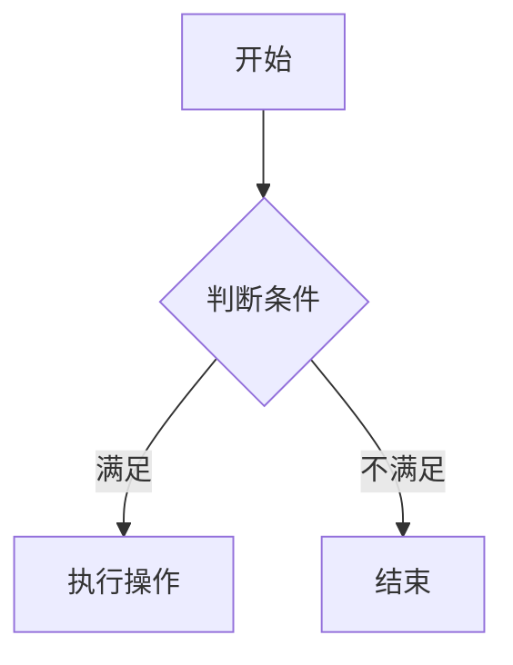

                 

### 引言

在现代企业中，团队协作能力已成为决定企业竞争力和发展速度的关键因素。面对复杂多变的市场环境和日益加剧的竞争压力，企业不仅需要具备技术创新和快速响应的能力，更需要一个能够高效协同、默契配合的团队。有效的团队协作不仅能够提高工作效率，减少资源浪费，还能激发团队的创造力和创新能力，为企业带来持续的发展和竞争优势。

#### 1.1 现代企业面临的挑战

**复杂的项目需求和多样化的业务需求**：随着互联网和信息技术的迅猛发展，企业面临的项目需求越来越复杂，需要涵盖从市场需求分析、产品设计、技术研发到市场推广的多个环节。同时，企业还需要应对不断变化的业务需求，快速适应市场变化。

**跨部门、跨领域的协作**：在大型企业中，不同的部门、业务线和项目往往需要紧密协作，以实现整体战略目标。这种跨部门、跨领域的协作要求团队成员具备广泛的业务知识和技能，能够快速整合资源，协同完成复杂的任务。

**远程工作与数字化办公**：随着远程工作和数字化办公的普及，团队协作不再局限于同一地点或时间。这不仅带来了新的挑战，如沟通障碍、时间同步问题等，同时也要求团队成员具备更高的自主管理能力和协作精神。

**快速变化的技术环境**：技术的快速迭代更新，要求团队成员持续学习新技术、新工具，并在实际工作中快速应用。这需要团队具备强大的学习和适应能力，以应对不断变化的技术环境。

#### 1.2 协作能力与个人成长

**提高工作效率**：通过有效的团队协作，可以明确分工、合理配置资源，从而提高整体工作效率，减少重复劳动和资源浪费。

**促进知识共享与技能提升**：团队成员在协作过程中可以相互学习、交流，促进知识共享和技能提升，提高整体团队的素质和能力。

**增强职业竞争力**：具备良好协作能力的个人在职场中更具竞争力，能够更好地融入团队，发挥自己的优势，实现个人职业发展。

**培养领导力和管理能力**：在团队协作中，个人需要承担不同的角色和职责，这有助于培养其领导力和管理能力，为未来职业发展打下坚实基础。

#### 1.3 协作能力对组织的影响

**提高企业竞争力**：有效的团队协作能够提高企业整体执行力和响应速度，增强市场竞争力。

**促进企业创新**：团队协作可以激发团队成员的创造力和创新精神，推动企业技术创新和产品创新。

**优化人力资源配置**：通过团队协作，企业可以更合理地配置人力资源，实现人尽其才，提高整体工作效率。

**降低管理成本**：良好的团队协作能够减少沟通成本和管理成本，提高企业的运营效率。

### 1.4 团队协作的定义与特征

**团队协作的概念**：团队协作是指团队成员在共同目标指导下，通过明确分工、相互配合，共同完成任务的过程。它强调的是集体智慧和协作力量，而非单打独斗。

**团队协作的关键特征**：

- **共同目标**：团队协作的基础是共同的目标和价值追求，团队成员需要明确团队的目标和任务，并围绕这一目标展开工作。

- **明确分工**：团队协作要求团队成员根据各自的能力和特长进行分工，明确各自的责任和任务，确保任务的高效完成。

- **相互配合**：团队成员需要在工作中相互支持、协作配合，以实现整体目标。

- **信息共享**：团队协作强调信息透明和共享，通过有效的沟通和协作，确保团队成员能够及时获取所需信息，提高决策效率。

- **灵活应变**：团队协作要求团队成员具备灵活应变的能力，能够根据实际情况调整工作计划和策略，确保目标的顺利实现。

**团队协作与传统协作的区别**：

- **目标导向性**：传统协作更注重任务的完成，而团队协作则更注重团队目标的实现。

- **协作深度**：传统协作往往局限于单一任务或项目，而团队协作涉及多个任务和项目的长期合作。

- **成员互动**：传统协作成员之间互动较少，而团队协作强调团队成员之间的紧密互动和合作。

- **责任分配**：传统协作责任分配较为明确，而团队协作责任更为灵活，强调共同承担责任。

通过以上分析，我们可以看到团队协作在当今企业中具有不可替代的重要作用。在接下来的章节中，我们将进一步探讨团队协作的基础理论、实践策略以及案例分析，帮助读者深入了解和提升团队协作能力。

---

#### 团队协作的定义与特征

**团队协作的概念**：

团队协作是指一群人为了实现共同目标，在相互信任、相互依赖的基础上，通过明确分工、有效沟通和协同努力，共同完成任务的集体行为。这种协作不仅仅是简单的分工合作，而是需要团队成员之间具备高度的信任、理解和默契。

**团队协作的关键特征**：

1. **共同目标**：团队协作的基础是明确的共同目标。团队成员需要了解并认同团队的目标，围绕这一目标进行工作，确保个人努力与团队目标的统一。

2. **明确分工**：团队协作要求团队成员根据各自的能力和职责进行分工，明确各自的责任和任务。这种分工不仅能够提高工作效率，还能确保任务的高效完成。

3. **相互配合**：团队协作强调团队成员之间的紧密配合，通过有效的沟通和协作，确保每个环节都能够无缝衔接，从而实现整体目标的顺利达成。

4. **信息共享**：信息共享是团队协作的重要组成部分。团队成员需要保持信息的透明度，及时分享重要信息和资源，确保团队成员能够及时获取所需信息，提高决策效率。

5. **灵活应变**：团队协作要求团队成员具备灵活应变的能力，能够根据实际情况调整工作计划和策略，确保目标的顺利实现。

**团队协作与传统协作的区别**：

1. **目标导向性**：传统协作更多关注单一任务的完成，而团队协作则更注重共同目标的实现。团队协作强调集体智慧和协作力量，追求整体效果的优化。

2. **协作深度**：传统协作往往局限于单一任务或项目，而团队协作涉及多个任务和项目的长期合作。团队协作要求团队成员在多个层面上进行紧密合作，形成一种协同工作的机制。

3. **成员互动**：传统协作成员之间互动较少，而团队协作强调团队成员之间的紧密互动和合作。团队协作不仅要求团队成员在工作中相互支持，还需要在情感和心理层面建立联系，形成真正的团队氛围。

4. **责任分配**：传统协作责任分配较为明确，而团队协作则强调共同承担责任。在团队协作中，团队成员不仅要明确自己的职责，还需要对整个团队的目标和任务负责，形成一种集体责任意识。

通过以上分析，我们可以看到，团队协作与传统协作相比，具有更深的层次和更广的覆盖面。团队协作不仅注重任务的完成，更强调团队成员之间的协作和配合，追求整体效果的优化。在接下来的章节中，我们将进一步探讨团队协作的基础理论，帮助读者深入理解团队协作的内在机制和关键要素。

---

#### 本书结构概述

本书旨在系统地探讨团队协作能力的重要性、基础理论、实践策略以及案例分析，帮助读者全面了解和提升团队协作能力。全书共分为五个部分，结构安排如下：

**第一部分：引言**

本部分首先介绍了团队协作在现代社会企业中的重要性，分析了现代企业面临的挑战，阐述了团队协作对个人成长和组织发展的深远影响。接着，明确了团队协作的定义与特征，探讨了团队协作与传统协作的区别，为后续内容奠定了基础。

**第二部分：团队协作能力的基础理论**

本部分深入探讨了团队协作能力的基础理论，包括协作心理学原理、团队角色与角色认知、团队协作过程模型以及团队合作中的沟通与冲突。通过这些理论分析，帮助读者理解团队协作的内在机制和关键要素。

**第三部分：提高团队协作能力的实践策略**

本部分提供了具体的实践策略，包括设定明确的团队目标、建立信任与合作关系、提高团队沟通效率、管理团队冲突以及激励与培养团队协作能力。这些策略将帮助读者在实际工作中有效提升团队协作能力。

**第四部分：案例分析与实践应用**

本部分通过一系列实际案例，展示了团队协作在不同场景中的应用和实践效果。通过对这些案例的分析，读者可以更直观地理解团队协作的实践策略，并从中汲取经验教训。

**第五部分：总结与展望**

本部分对全书内容进行总结，回顾了团队协作能力的重要性、基础理论和实践策略，并对团队协作的未来发展趋势进行了展望。通过这部分内容，读者可以更好地把握团队协作的发展方向，为未来的工作做好准备。

### 第二部分：团队协作能力的基础理论

在了解了团队协作的重要性及其定义和特征之后，我们需要进一步探讨团队协作能力的基础理论。这一部分内容将深入分析协作心理学原理、团队角色与角色认知、团队协作过程模型以及团队合作中的沟通与冲突，为读者提供全面的团队协作理论支持。

#### 2.1 协作心理学原理

**协作动机理论**：

协作动机是指个体在团队合作过程中所表现出的行为动机。根据心理学研究，协作动机可以分为内在动机和外在动机。内在动机主要来源于个体的兴趣、乐趣和自我实现需求，而外在动机则与奖励、惩罚和社会期望相关。了解协作动机有助于我们设计有效的激励机制，提高团队成员的参与度和积极性。

**协作过程中的心理机制**：

协作过程中涉及多种心理机制，包括认知协调、情感共享、社会认同和共同目标。认知协调是指团队成员在信息处理和问题解决过程中保持一致，以提高协作效率。情感共享则是指团队成员在情感上相互支持，增强团队的凝聚力和信任。社会认同是指团队成员认同团队的目标和价值，从而增强团队协作的内在动力。共同目标则是团队协作的核心，它能够引导团队成员共同努力，实现团队目标。

**协作中的情感管理**：

情感管理是指团队中处理和管理成员情感的过程。良好的情感管理有助于提高团队成员的情感满意度和团队氛围，从而促进团队协作。情感管理包括情感识别、情感表达和情感调节。情感识别是指团队成员能够识别和理解自己的情感和他人情感。情感表达是指团队成员能够适当地表达自己的情感，避免情感压抑或过度表达。情感调节是指团队成员能够调整自己的情感状态，以适应团队协作的需要。

#### 2.2 团队角色与角色认知

**团队角色的定义**：

团队角色是指个体在团队中承担的具体职责和角色。不同的团队角色具有不同的职责和特点，包括领导者、执行者、协调者、创新者等。了解团队角色的定义和分类有助于团队成员明确自己的职责，提高团队协作效率。

**团队角色的分类**：

根据不同角色的职责和特点，团队角色可以分为以下几类：

1. **领导者**：领导者负责制定团队目标和策略，指导团队成员的工作，并在团队中发挥决策和领导作用。
2. **执行者**：执行者负责完成具体任务和工作，是实现团队目标的重要力量。
3. **协调者**：协调者负责协调团队成员之间的沟通和合作，确保团队工作顺利进行。
4. **创新者**：创新者负责提出新的想法和创新方案，推动团队的技术和产品创新。
5. **支持者**：支持者负责为团队成员提供必要的帮助和支持，维护团队的稳定和氛围。

**角色认知与角色冲突**：

角色认知是指团队成员对自己和他人角色的理解和认同。良好的角色认知有助于团队成员明确自己的职责，避免角色重叠和冲突。角色冲突是指团队成员在角色职责和利益上的矛盾和冲突。角色冲突可能导致团队成员之间的误解和矛盾，影响团队协作效率。为了减少角色冲突，团队需要建立清晰的职责分工，明确每个角色的职责和权限，并通过沟通和协商解决冲突。

#### 2.3 团队协作过程模型

**传统团队过程模型**：

传统团队过程模型主要包括线性模型和迭代模型。线性模型是指团队工作按照固定的顺序和阶段进行，包括计划、执行、检查和改进等步骤。迭代模型则是在线性模型的基础上，增加了迭代和反馈的环节，允许团队在项目过程中不断调整和优化。

**新型团队过程模型**：

随着团队协作环境的复杂化和技术进步，新型团队过程模型应运而生。新型团队过程模型更加注重团队互动和协作，包括敏捷开发、Scrum和看板等。这些模型强调快速响应变化、持续交付和持续改进，通过短周期的迭代和反馈，提高团队协作效率和产品质量。

**团队过程模型的适用性**：

选择合适的团队过程模型取决于团队的具体情况和项目需求。线性模型适用于任务明确、需求稳定的项目，而迭代模型和敏捷开发模型则适用于需求变化快、项目不确定性高的项目。在实际应用中，团队可以根据项目特点和团队需求，灵活选择和调整团队过程模型，以提高团队协作效率和项目成功率。

#### 2.4 团队合作中的沟通与冲突

**团队沟通的重要性**：

沟通是团队协作的核心，良好的沟通能够确保团队成员之间信息畅通，减少误解和冲突，提高团队协作效率。有效的沟通包括信息传递、情感表达、反馈和协商等环节。团队成员需要具备良好的沟通技巧，能够清晰、准确地表达自己的意见和需求，同时也要善于倾听他人的观点和建议。

**团队沟通障碍**：

团队沟通障碍是影响团队协作的重要因素。常见的沟通障碍包括信息过滤、选择性知觉、语言障碍和文化差异等。信息过滤是指团队成员在传递信息时有意或无意地筛选和修改信息，导致信息失真。选择性知觉是指团队成员根据个人经验和偏见选择性地理解和处理信息。语言障碍和文化差异则可能导致团队成员在沟通中产生误解和冲突。

**团队冲突的类型与管理**：

团队冲突可以分为以下几类：

1. **任务冲突**：任务冲突是由于团队成员对任务分配、工作流程和目标理解不一致而产生的。这类冲突通常与工作内容和目标相关。
2. **关系冲突**：关系冲突是由于个人之间的情感和关系问题导致的。这类冲突可能源于个人之间的误解、偏见或个人利益冲突。
3. **结构冲突**：结构冲突是由于团队组织结构和职责分工问题导致的。这类冲突可能源于团队内部权力分配不均、职责重叠或职责不清。

有效的团队冲突管理包括以下策略：

1. **预防策略**：通过明确职责分工、建立有效的沟通机制和提供培训，减少冲突发生的可能性。
2. **解决策略**：在冲突发生后，及时沟通和协商，找出冲突的根源，制定解决方案，确保冲突的及时解决。
3. **转化策略**：将冲突转化为动力，通过建设性的讨论和合作，促进团队成员之间的理解和信任，提高团队协作效率。

通过以上对团队协作能力基础理论的探讨，我们可以看到，团队协作不仅需要明确的目标和分工，还需要良好的心理机制、角色认知和过程管理。在接下来的章节中，我们将继续探讨提高团队协作能力的实践策略，帮助读者在实际工作中有效提升团队协作能力。

---

#### 2.4 团队合作中的沟通与冲突

沟通是团队协作的核心，而冲突则是团队协作过程中不可避免的一部分。有效的沟通和冲突管理对于提高团队协作效率和达成团队目标至关重要。

**团队沟通的重要性**：

沟通是团队协作的基础，它确保团队成员之间信息畅通，减少误解和矛盾，提高协作效率。良好的沟通有助于：

- **信息共享**：团队成员通过沟通共享重要信息，确保每个人都能了解任务的进展和目标。
- **增强信任**：透明的沟通有助于增强团队成员之间的信任，提高团队的凝聚力和合作意愿。
- **提升决策效率**：有效的沟通能促进团队成员之间的讨论和合作，快速达成共识，提高决策效率。
- **缓解冲突**：通过沟通，团队成员可以及时表达自己的观点和需求，避免因误解和矛盾引发的冲突。

**团队沟通障碍**：

尽管沟通是团队协作的关键，但团队沟通中仍存在多种障碍：

- **信息过滤**：团队成员在传递信息时可能会有意或无意地筛选和修改信息，导致信息失真。
- **选择性知觉**：团队成员可能根据个人经验和偏见选择性地理解和处理信息，导致沟通效果不佳。
- **语言障碍**：团队成员之间的语言差异可能导致沟通中的误解和困惑。
- **文化差异**：不同的文化背景可能导致团队成员在沟通方式、价值观和行为规范上的冲突。

为了克服这些障碍，团队可以采取以下措施：

- **提高沟通技巧**：通过培训和练习，提高团队成员的沟通技巧，确保信息的准确传递。
- **建立信任**：通过建立信任机制，减少信息过滤和选择性知觉。
- **使用多种沟通方式**：结合书面、口头、视觉等多种沟通方式，提高沟通效果。
- **文化适应性**：在跨文化团队中，注意文化差异，尊重不同文化的沟通习惯和价值观。

**团队冲突的类型与管理**：

团队冲突可以分为以下几类：

1. **任务冲突**：任务冲突是由于团队成员对任务分配、工作流程和目标理解不一致而产生的。这类冲突通常与工作内容和目标相关。
   - **解决策略**：通过明确任务分工、设定共同目标、制定清晰的工作流程来预防任务冲突。在冲突发生时，团队可以召开会议，讨论任务分配和目标设定，寻找共同点，达成共识。

2. **关系冲突**：关系冲突是由于个人之间的情感和关系问题导致的。这类冲突可能源于个人之间的误解、偏见或个人利益冲突。
   - **解决策略**：通过建设性的对话、调解和冲突解决培训，帮助团队成员理解彼此的观点，缓解情绪，寻找解决问题的方法。

3. **结构冲突**：结构冲突是由于团队组织结构和职责分工问题导致的。这类冲突可能源于团队内部权力分配不均、职责重叠或职责不清。
   - **解决策略**：通过重新设计和调整团队组织结构，明确职责分工，确保团队运作的透明和高效。

有效的团队冲突管理包括以下步骤：

1. **识别冲突**：及时发现和识别团队中的冲突，避免冲突升级。
2. **沟通与协商**：通过开放和诚实的沟通，让团队成员表达自己的观点和需求，寻找共同点和解决方案。
3. **制定解决方案**：根据冲突的类型和原因，制定具体的解决方案，确保冲突的及时解决。
4. **跟踪和评估**：对冲突管理的措施进行跟踪和评估，确保冲突得到有效解决，并从中汲取经验教训，避免类似冲突的再次发生。

通过有效的沟通和冲突管理，团队可以更好地协作，实现共同的目标，提高整体绩效。在下一章节中，我们将探讨如何通过具体的实践策略来提高团队协作能力。

---

#### 3.1 设定明确的团队目标

设定明确的团队目标是提升团队协作能力的第一步。一个清晰、可实现的团队目标可以统一团队成员的方向，提高工作效率，促进团队协作。以下是从策略到实施，再到动态调整的详细探讨。

**3.1.1 团队目标的重要性**

团队目标不仅是团队工作的指引，也是团队协作的凝聚力和动力的来源。具体来说，明确的目标具有以下几个重要作用：

- **统一方向**：明确的团队目标可以帮助团队成员了解团队的整体方向和目标，避免团队内部因方向不一致而产生的混乱和冲突。
- **提高工作效率**：目标明确可以减少团队成员的工作不确定性，提高工作计划的执行效率，从而提高整体工作效率。
- **激发团队动力**：明确的团队目标可以激发团队成员的工作热情和积极性，提高团队的整体动力和士气。
- **评估绩效**：明确的团队目标为团队绩效评估提供了标准，有助于团队成员了解自己的工作表现，及时发现和解决问题。

**3.1.2 设定有效团队目标的策略**

设定有效的团队目标需要遵循以下策略：

- **具体性**：团队目标应具体、明确，避免模糊和抽象。具体的目标可以量化，便于评估和追踪。
- **可衡量性**：目标应具有可衡量的标准，便于团队成员评估进度和成果。
- **可实现性**：目标应既具有挑战性，又应确保在现有资源和条件下可以实现。
- **相关性**：目标应与团队的总体战略和使命相关，确保团队成员的工作能够为团队的整体目标做出贡献。
- **时限性**：目标应设定明确的完成时间，有助于团队成员制定具体的工作计划和时间表。

**3.1.3 团队目标的动态调整**

团队目标并不是一成不变的，而是需要根据实际情况进行动态调整。以下是一些动态调整的策略：

- **定期评估**：定期对团队目标进行评估，检查目标的实现情况，发现问题和不足，及时进行调整。
- **反馈机制**：建立有效的反馈机制，让团队成员能够及时表达意见和建议，为目标的调整提供依据。
- **灵活应对**：团队目标应具备一定的灵活性，能够根据市场变化、技术进步和团队实际情况进行快速调整。
- **优先级调整**：在资源有限的情况下，可以根据实际情况调整目标的优先级，确保团队能够集中资源和精力完成最重要的目标。

**案例**：

假设一个软件开发团队的目标是“在三个月内开发并发布一款功能完善的客户管理系统”。这一目标具体、可衡量、可实现，并明确地与团队的总体战略相关。在实施过程中，团队可以将其细化为以下几个步骤：

1. **需求分析**：在第一个月，团队进行需求分析，收集客户需求，明确系统功能。
2. **设计阶段**：在第二个月，团队进行系统设计，编写详细的设计文档。
3. **开发阶段**：在第三个月，团队进行系统开发，同时进行单元测试和集成测试。
4. **发布阶段**：在第三个月的最后两周，团队进行系统部署和用户培训，确保按时发布。

在实际工作中，团队可能会遇到技术难题、资源不足等问题，需要根据实际情况对目标进行调整。例如，如果需求分析阶段发现客户需求变化较大，团队可能需要延长需求分析时间，或者调整开发阶段的任务优先级，确保最终按时发布。

通过设定明确的目标并进行动态调整，团队可以更好地应对外部变化，保持高效率和良好的协作状态，从而实现团队的目标和使命。

---

### 3.2 建立信任与合作关系

在团队协作中，建立信任与合作关系是提高团队协作效率和质量的关键。信任是团队协作的基础，没有信任，团队将无法有效运作。合作关系则是团队成员之间为了共同目标而建立的一种相互依赖和共同奋斗的关系。以下将探讨如何建立信任和合作关系，以及它们在团队协作中的重要性。

#### 3.2.1 信任的建立

**信任的定义**：

信任是指团队成员对彼此的诚实、能力、可靠性和正直的信念。信任是团队合作中不可或缺的要素，它能够减少误解和冲突，增强团队凝聚力。

**建立信任的步骤**：

1. **透明沟通**：透明的沟通是建立信任的第一步。团队成员应该开放地分享信息，确保信息的准确和全面。避免隐藏信息或误导他人，这样可以建立起团队成员之间的信任基础。

2. **履行承诺**：团队成员需要履行自己的承诺。无论是小事情还是大承诺，履行承诺都能够增强团队成员之间的信任。如果无法履行承诺，应提前通知并说明原因，以避免信任受损。

3. **共同目标**：共同目标是建立信任的另一个重要因素。团队成员需要明确共同的目标和价值观，共同努力实现这些目标，这样可以增强团队内部的信任和合作意愿。

4. **互相支持**：在团队协作中，互相支持是非常重要的。当团队成员遇到困难或挑战时，其他成员应该提供帮助和支持，这样可以增强团队成员之间的信任和依赖。

**信任的特征**：

- **可靠性**：团队成员能够按时完成任务，遵守承诺，确保任务的顺利进行。
- **诚实**：团队成员在沟通中保持真实，不隐瞒信息，不夸大事实。
- **正直**：团队成员在行为上遵循道德准则，不欺骗、不偷窃，保持正直。
- **透明**：团队成员之间的沟通是开放的，信息透明，决策过程公开。

#### 3.2.2 合作关系的维护

**合作关系的定义**：

合作关系是指团队成员为了实现共同目标而建立的一种相互依赖和合作的关系。合作关系强调团队成员之间的互动、支持和共享。

**维护合作关系的策略**：

1. **有效沟通**：有效的沟通是维护合作关系的关键。团队成员应该保持良好的沟通习惯，及时交流信息，解决冲突，确保合作顺利进行。

2. **明确分工**：明确分工有助于避免团队成员之间的职责重叠和冲突。每个团队成员应该清楚自己的职责和任务，确保工作的高效和有序。

3. **共同决策**：在重要事项上，团队成员应该共同参与决策，确保决策的民主性和科学性。这样可以增强团队成员之间的合作意愿和信任。

4. **共享资源**：团队成员应该共享资源，包括信息、知识和工具。共享资源可以促进团队成员之间的合作，提高团队的整体效率。

**合作关系的特征**：

- **相互依赖**：团队成员相互依赖，共同完成任务。
- **相互支持**：在团队成员遇到困难时，其他成员提供帮助和支持。
- **共同目标**：团队成员有共同的目标和愿景，共同努力实现目标。
- **共享资源**：团队成员共享信息和资源，提高整体效率。

#### 3.2.3 高效团队中的信任与合作关系

在高效团队中，信任和合作关系至关重要。以下是一些高效团队中信任与合作关系的特点：

- **高透明度**：团队内部信息透明，团队成员能够了解其他成员的工作进展和困难。
- **良好的沟通机制**：团队建立了有效的沟通机制，确保信息畅通，减少误解和冲突。
- **明确的角色分工**：团队成员明确自己的职责和任务，避免了职责重叠和冲突。
- **共同的价值观**：团队成员有共同的价值观和目标，共同努力实现团队目标。
- **相互支持**：团队成员在遇到困难时，能够得到其他成员的支持和帮助，增强了团队的凝聚力。

通过建立信任和合作关系，团队可以更高效地协作，提高整体绩效。在接下来的章节中，我们将进一步探讨如何提高团队沟通效率和管理团队冲突，以进一步提升团队协作能力。

---

### 3.3 提高团队沟通效率

有效的沟通是团队协作的关键，能够确保团队成员之间信息畅通，减少误解和冲突，提高团队整体的工作效率。以下将详细探讨提高团队沟通效率的方法、沟通工具与技术的应用，以及解决团队沟通中的常见问题。

#### 3.3.1 团队沟通技巧

1. **倾听**：倾听是有效沟通的重要部分。团队成员应该学会倾听他人的观点和需求，理解对方的意思，避免误解和冲突。

2. **表达清晰**：在表达自己的观点时，团队成员应该清晰、简洁地传达信息，避免使用模糊或混淆的语言，确保对方能够准确理解。

3. **开放性**：团队成员在沟通中应保持开放的心态，尊重不同的意见和观点，避免因为个人偏见或情绪而影响沟通效果。

4. **积极反馈**：在沟通过程中，团队成员应该给予积极的反馈，表达对对方的认可和理解，有助于建立信任和合作关系。

5. **明确任务和责任**：在沟通中，团队成员应明确任务的分配和责任，确保每个人都知道自己的职责和目标，提高工作效率。

#### 3.3.2 沟通工具与技术的应用

1. **电子邮件**：电子邮件是一种常用的正式沟通工具，适用于传递重要文件、通知和正式的交流。使用电子邮件时，应确保信息的清晰、完整，避免误解。

2. **即时通讯工具**：即时通讯工具如微信、Slack等，适用于快速、简单的交流，适合处理紧急事务和日常沟通。这些工具提供了实时交流的功能，能够提高沟通的效率。

3. **视频会议**：视频会议是远程协作中不可或缺的工具，适用于团队讨论、会议和项目进度汇报。通过视频会议，团队成员能够面对面交流，增强沟通效果。

4. **项目管理工具**：项目管理工具如Trello、JIRA等，能够帮助团队管理项目任务、进度和资源，确保团队成员之间的信息畅通。这些工具提供了任务列表、日历、协作板等功能，方便团队成员随时查看和更新信息。

5. **知识库**：建立团队知识库，记录重要的项目文档、经验教训和最佳实践，便于团队成员随时查阅和学习。知识库有助于减少重复劳动，提高沟通效率。

#### 3.3.3 团队沟通中的常见问题与解决方法

1. **信息不对称**：解决方法：建立透明的信息共享机制，定期更新项目进度和任务状态，确保团队成员之间的信息对称。

2. **误解和冲突**：解决方法：提高团队成员的沟通技巧，鼓励开放性沟通，建立良好的沟通氛围。在发生误解或冲突时，及时进行沟通和解决，避免问题扩大。

3. **沟通障碍**：解决方法：使用多种沟通工具和技术，结合书面、口头、视觉等多种方式，提高沟通效果。解决语言障碍和文化差异，提供跨文化沟通培训。

4. **信息过载**：解决方法：制定明确的沟通规范，控制信息传递的频率和内容，避免信息过载。使用项目管理工具和知识库，减少重复沟通和冗余信息。

5. **沟通成本高**：解决方法：优化沟通流程，减少不必要的会议和交流。使用高效的沟通工具和技术，提高沟通效率。

通过提高团队沟通效率，团队可以更有效地协作，减少误解和冲突，提高整体工作效率。在接下来的章节中，我们将探讨如何管理团队冲突，以进一步提升团队协作能力。

---

### 3.4 管理团队冲突

团队冲突是团队协作过程中不可避免的一部分，但如果处理不当，可能会导致团队士气低落、工作效率下降，甚至影响项目的进展和成功。因此，有效管理团队冲突对于维护团队稳定和提高团队协作效率至关重要。以下将详细讨论团队冲突的类型、原因以及管理策略。

#### 3.4.1 团队冲突的类型

1. **任务冲突**：

任务冲突是由于团队成员对任务分配、工作流程和目标理解不一致而产生的。这种冲突通常与工作内容和目标相关。任务冲突可能导致资源浪费、进度延误和项目失败。

2. **关系冲突**：

关系冲突是由于个人之间的情感和关系问题导致的。这类冲突可能源于个人之间的误解、偏见或个人利益冲突。关系冲突会影响团队的凝聚力和协作效果，导致工作效率下降。

3. **结构冲突**：

结构冲突是由于团队组织结构和职责分工问题导致的。这类冲突可能源于团队内部权力分配不均、职责重叠或职责不清。结构冲突会影响团队的整体运作效率和项目的顺利推进。

#### 3.4.2 团队冲突的原因

1. **任务分配不公**：

如果任务分配不公，部分成员可能会感到不满或被忽视，从而产生任务冲突。

2. **沟通不畅**：

沟通不畅会导致团队成员对任务、目标和职责的理解不一致，进而产生冲突。

3. **个人价值观和利益冲突**：

团队成员的个人价值观和利益差异可能导致关系冲突，影响团队的和谐和协作。

4. **团队结构不合理**：

不合理的团队结构和职责分工会导致责任模糊、权力冲突，影响团队的整体运作。

5. **外部压力**：

外部环境的变化、项目期限的压力等外部因素也可能导致团队内部产生冲突。

#### 3.4.3 处理团队冲突的策略

1. **预防策略**：

- **明确任务和责任**：在项目初期，明确每个成员的任务和责任，确保任务分配公平合理。
- **加强沟通**：建立有效的沟通机制，确保团队成员之间的信息畅通，减少误解和冲突。
- **建立共同目标**：明确团队目标，确保每个成员都了解并认同团队的目标，减少因目标不一致而产生的冲突。
- **建立团队文化**：培养积极、和谐的团队文化，增强团队凝聚力，减少个人利益冲突。

2. **解决策略**：

- **直接对话**：在冲突发生时，鼓励团队成员直接对话，表达自己的观点和感受，寻求共识和解决方案。
- **第三方调解**：如果直接对话难以解决冲突，可以引入第三方调解人，帮助双方进行沟通和协商，找到问题的根源和解决方案。
- **冲突管理培训**：提供冲突管理培训，提高团队成员的冲突处理能力，减少冲突的发生和影响。

3. **转化策略**：

- **将冲突转化为动力**：通过建设性的讨论和合作，将冲突转化为团队创新的动力，推动团队不断进步。
- **设定合理的期望值**：在设定团队目标时，设定合理的期望值，避免因目标过高或过低导致的冲突。

通过以上策略，团队可以有效管理冲突，减少冲突对团队协作的负面影响，提高团队的整体绩效。在下一章节中，我们将探讨如何激励和培养团队协作能力，以进一步提升团队协作效率。

---

### 3.5 激励与培养团队协作能力

激励和培养团队协作能力是提升团队绩效和实现组织目标的关键环节。通过有效的激励策略、团队成员的培训与发展，以及培养团队协作文化的实践方法，可以显著增强团队的凝聚力和协作效率。

**3.5.1 团队成员的激励策略**

**物质激励**：物质激励是最直接的激励方式，包括奖金、晋升、股权等。通过设定明确的目标和奖励机制，可以激励团队成员为实现团队目标而努力。例如，可以设立项目奖金，对于在项目中表现突出的成员进行奖励，以激发其工作热情和积极性。

**精神激励**：精神激励包括认可、表彰和荣誉等。通过公开表扬和表彰在团队协作中表现出色的成员，可以增强其成就感和归属感。例如，可以在团队会议上对团队成员的贡献进行表彰，或者在公司的内部通讯平台上展示优秀团队和成员的事迹。

**目标激励**：设定具有挑战性和可行性的目标，可以激发团队成员的内在动机。通过目标管理，让团队成员明确自己的职责和期望，并激励他们在实现目标的过程中不断成长和进步。

**参与激励**：鼓励团队成员参与决策和项目管理，增强其对团队的认同感和责任感。通过赋予团队成员更多的自主权和责任，可以激发其主动性和创造性，提高团队协作效率。

**3.5.2 团队成员的培训与发展**

**专业技能培训**：为团队成员提供专业技能培训，帮助他们掌握最新的技术和工具，提高工作效率和质量。例如，可以邀请行业专家进行技术讲座或组织内部培训，以提升团队成员的专业能力。

**软技能培训**：软技能包括沟通、协作、领导力和问题解决能力等。通过软技能培训，可以提高团队成员的沟通能力和协作效率，增强团队凝聚力。例如，可以组织沟通技巧培训、团队建设活动等，以增强团队成员之间的互动和合作。

**领导力发展**：为团队成员提供领导力培训，培养其管理能力和决策能力，使其能够在团队中发挥更大的作用。例如，可以通过领导力发展项目，帮助团队成员了解领导力的基本原则和实践方法，提升其领导力水平。

**个人发展计划**：为每个团队成员制定个人发展计划，明确其职业目标和成长路径。通过定期评估和反馈，帮助团队成员实现个人职业发展，提高其工作满意度和归属感。

**3.5.3 培养团队协作文化的实践方法**

**建立共同价值观**：团队协作文化的基础是共同价值观。通过明确团队的价值观，如诚信、合作、创新和责任感等，可以引导团队成员的行为和决策，增强团队的凝聚力。

**促进信息共享**：建立信息共享机制，确保团队成员能够及时获取所需信息，减少信息孤岛和沟通障碍。例如，可以设立共享文件夹、内部通讯平台等，方便团队成员之间的信息交流。

**鼓励创新和反馈**：营造创新和开放的氛围，鼓励团队成员提出新的想法和建议，并对这些建议进行积极反馈。通过鼓励创新和反馈，可以激发团队成员的创造力和主动性，提高团队的协作效率。

**加强团队建设活动**：定期组织团队建设活动，如团建活动、拓展训练等，增强团队成员之间的相互了解和信任。这些活动有助于建立良好的团队关系，提高团队的协作效率。

**建立反馈机制**：建立有效的反馈机制，鼓励团队成员之间进行积极、建设性的反馈。通过反馈机制，可以帮助团队成员及时发现问题、改进工作方法，提高团队的整体绩效。

通过以上激励和培养策略，团队可以显著提高协作能力，实现更高的绩效和目标。在下一章节中，我们将通过实际案例，进一步探讨团队协作能力的实践应用，为读者提供具体的经验和启示。

---

### 4.1 案例分析一：高效团队建设实践

在本案例中，我们以一家大型科技公司为背景，探讨其如何通过高效团队建设实践来提升团队协作能力。这个案例展示了从团队目标设定、信任建设、沟通优化到冲突管理的全方位策略，以及这些策略在实际中的应用和成效。

**4.1.1 案例背景**

该科技公司是一家拥有数百名员工的高科技企业，业务涵盖软件开发、数据分析、市场营销等多个领域。随着公司规模的扩大和业务的多元化，团队协作变得愈发重要。然而，公司发现现有的团队协作存在诸多问题，如沟通不畅、任务分配不公、冲突频发等，严重影响了团队效率和项目进度。

**4.1.2 团队建设策略**

1. **设定明确的目标**：

为了提升团队协作能力，公司首先明确了团队目标。他们制定了具体的年度目标，并拆解为季度目标、月度目标和周目标，确保每个团队成员都清晰了解自己的职责和目标。通过这种分阶段的目标设定，团队成员能够更有针对性地开展工作，提高工作效率。

2. **建立信任**：

公司通过多种方式建立了团队信任。首先，他们加强了团队成员之间的沟通，定期组织团队建设活动，如团队聚餐、户外拓展等，增强成员之间的相互了解和信任。此外，公司还推行了透明沟通机制，要求团队成员在项目进展中及时分享信息和反馈，确保信息的透明和畅通。

3. **优化沟通**：

为了提高沟通效率，公司引入了多种沟通工具和技术。他们使用了Slack、Trello等即时通讯和项目管理工具，确保团队成员能够及时获取任务更新、交流意见和建议。同时，公司还定期召开团队会议，讨论项目进展和面临的挑战，确保团队成员之间的信息畅通和协作无障碍。

4. **管理冲突**：

公司重视冲突管理，建立了冲突管理机制。他们通过培训提高团队成员的沟通和冲突解决能力，并引入第三方调解人处理复杂冲突。在发生冲突时，公司鼓励团队成员直接对话，通过沟通和协商找到问题的根源和解决方案，避免冲突升级。

**4.1.3 案例成效分析**

通过上述团队建设策略，公司取得了显著的成效：

- **工作效率提高**：明确的团队目标和高效的沟通机制使得团队成员能够更加专注和高效地完成任务，项目进度明显加快。
- **团队凝聚力增强**：通过团队建设活动和透明沟通机制，团队成员之间的信任和合作意识显著增强，团队的凝聚力大幅提升。
- **冲突减少**：有效的冲突管理策略使得团队中的冲突得到及时解决，团队成员的工作氛围更加和谐，减少了因冲突导致的错误和延误。
- **创新和反馈机制**：鼓励创新和开放的团队文化，激发了团队成员的创造力和主动性，提高了团队的整体绩效。

总之，该科技公司的团队建设实践为其他企业提供了宝贵的经验和启示。通过设定明确的目标、建立信任、优化沟通和管理冲突，企业可以有效提升团队协作能力，实现更高的绩效和目标。

---

### 4.2 案例分析二：跨部门协作与沟通

在当今大型企业中，跨部门协作已成为提高整体运营效率和实现业务目标的关键。以下是一个关于某国际知名电商企业如何通过有效的跨部门协作与沟通，提升整体团队协作效率的实际案例。

**4.2.1 案例背景**

该电商企业拥有多个业务部门，包括市场部、销售部、产品部、技术部和客户服务部等。这些部门各自负责不同的业务环节，但由于缺乏有效的跨部门协作与沟通，导致信息不畅、资源浪费和项目延误等问题。为了提升整体运营效率，企业决定开展跨部门协作与沟通的优化项目。

**4.2.2 沟通协作策略**

1. **建立跨部门沟通平台**：

公司首先建立了跨部门沟通平台，包括定期的跨部门会议和即时通讯工具。定期的跨部门会议旨在让各部门负责人共同讨论业务目标、项目进展和面临的挑战，确保信息的透明和共享。即时通讯工具则用于日常交流和任务协作，确保团队成员能够快速获取和分享信息。

2. **设立跨部门项目负责人**：

为了确保跨部门协作的顺利进行，公司设立了跨部门项目负责人。这些项目负责人负责协调各部门的工作，解决跨部门协作中遇到的问题，确保项目目标的顺利实现。

3. **明确责任与分工**：

公司明确了各部门在项目中的责任和分工，确保每个部门都清楚自己的任务和目标。通过制定详细的项目计划和时间表，各部门能够按照既定计划协同工作，避免任务重叠和责任不清的问题。

4. **优化流程与制度**：

公司对现有的业务流程和制度进行了优化，简化了审批流程，提高了决策效率。同时，公司还建立了跨部门协作的标准化流程，确保每个步骤都有明确的指导和规范，减少协作中的混乱和误解。

5. **培训与文化建设**：

公司组织了跨部门协作培训，提高了团队成员的沟通和协作能力。此外，公司还通过内部宣传和奖励机制，营造了良好的跨部门协作文化，鼓励团队成员积极参与协作，提高整体协作效率。

**4.2.3 案例成效分析**

通过实施上述跨部门协作与沟通策略，该电商企业取得了显著的成效：

- **信息透明度提高**：跨部门沟通平台的建立使得各部门之间的信息交流更加畅通，团队成员能够及时获取所需信息，减少信息孤岛和误解。
- **协作效率提升**：明确的责任分工和优化的流程制度，使得跨部门协作更加高效，项目进度加快，资源浪费减少。
- **项目成功率提高**：跨部门项目负责人和优化流程制度的实施，确保了项目目标的顺利实现，项目成功率显著提高。
- **团队凝聚力增强**：通过培训和文化建设，团队成员的沟通和协作能力得到提升，团队凝聚力显著增强。

总之，跨部门协作与沟通的有效实施，不仅提升了企业的运营效率和项目成功率，也为其他企业提供了一种可行的协作模式。通过建立沟通平台、明确责任分工、优化流程制度以及培养协作文化，企业可以更好地实现跨部门协同，提升整体绩效。

---

### 4.3 案例分析三：团队合作中的冲突管理

在现代企业中，团队合作中的冲突管理是确保团队高效运作和项目顺利实施的关键环节。以下通过一个具体案例，探讨一家中型咨询公司如何有效地管理团队合作中的冲突，从而提升团队协作效率和项目成功率。

**4.3.1 案例背景**

这家中型咨询公司专注于为客户提供战略规划、市场研究和IT解决方案等服务。由于公司项目复杂、团队多样，冲突在团队合作中时有发生。一次大型项目涉及多个部门，包括市场部、技术部和项目管理部，由于各部门在任务分配、进度汇报和目标设定上存在分歧，导致项目进展受阻，团队士气低落。

**4.3.2 冲突管理策略**

1. **及时识别和分类冲突**：

项目一开始，项目经理通过定期会议和问卷调查，及时发现团队中的潜在冲突。根据冲突的性质和影响，将冲突分为任务冲突、关系冲突和结构冲突三类，并制定相应的管理策略。

2. **直接沟通和对话**：

在冲突发生时，项目经理鼓励团队成员直接沟通和对话，表达自己的观点和感受。通过面对面交流，团队成员能够更好地理解对方的立场和需求，减少误解和情绪化反应。

3. **建立冲突解决机制**：

公司建立了正式的冲突解决机制，包括冲突调解委员会和专项调解小组。在冲突无法通过直接对话解决时，由调解委员会介入，通过调解和协商找到解决问题的方法。专项调解小组则针对特定冲突类型，提供专业的调解和支持。

4. **提供培训和指导**：

为了提高团队成员的冲突处理能力，公司定期开展冲突管理培训，教授团队成员如何识别和处理冲突。通过培训，团队成员掌握了有效的沟通技巧和冲突解决策略，提高了团队协作效率。

5. **调整任务分配和职责**：

在冲突管理的早期阶段，项目经理通过调整任务分配和职责，减少因任务重叠和职责不清导致的冲突。通过重新定义团队目标和职责，确保每个团队成员都清楚自己的任务和目标，减少了任务冲突的发生。

**4.3.3 案例成效分析**

通过实施上述冲突管理策略，该咨询公司在多个项目中取得了显著的成效：

- **冲突减少**：通过及时识别和分类冲突，以及有效的沟通和解决机制，团队中的冲突明显减少，项目进展更加顺利。
- **团队士气提高**：团队成员通过有效解决冲突，感受到团队的支持和理解，士气显著提高，工作积极性增强。
- **项目成功率提升**：冲突的减少和团队士气的提高，使得项目能够按时交付，项目成功率显著提升。
- **团队协作能力增强**：团队成员通过冲突管理培训，提高了冲突处理能力，增强了团队协作和解决问题的能力。

总之，有效的冲突管理不仅能够减少团队中的矛盾和冲突，还能提升团队的协作效率和项目成功率。通过及时识别、有效沟通和建立冲突解决机制，企业可以更好地应对团队合作中的挑战，实现团队的长期稳定和高效运作。

---

### 4.4 案例分析四：激励与培养团队协作能力

在现代社会，激励和培养团队协作能力是提升企业核心竞争力的重要手段。以下通过一个具体案例，探讨一家创新型科技企业如何通过有效的激励策略、培训和发展计划，培养团队协作文化，从而实现团队的高效运作和持续发展。

**4.4.1 案例背景**

这家创新型科技企业专注于人工智能和大数据技术的研发，拥有约300名员工，分布在多个研发中心和业务部门。随着市场竞争的加剧和技术的快速发展，企业意识到团队协作能力的重要性。为了提升团队的协作效率，企业决定实施一系列激励和培养策略，以建立强大的团队协作文化。

**4.4.2 激励与培养策略**

1. **明确团队目标和激励机制**：

企业首先明确了团队目标，并将其分解为具体、可衡量的任务目标。为了激励团队成员，企业制定了激励机制，包括绩效奖金、股权激励和职业晋升机会。通过设立明确的绩效指标和奖励机制，企业鼓励团队成员为实现团队目标而努力。

2. **提供多样化的培训和发展机会**：

企业重视团队成员的专业成长，提供了丰富的培训和发展机会。包括内部技术培训、行业研讨会、外部培训课程等，帮助团队成员不断更新知识和技能。此外，企业还推行了导师制度，让经验丰富的员工指导新员工，提高整体团队的专业水平。

3. **建立透明和开放的沟通机制**：

企业建立了透明的沟通机制，鼓励团队成员分享自己的想法和建议。通过定期的团队会议、内部论坛和即时通讯工具，团队成员可以自由地表达观点，交流意见，增强了团队的凝聚力和协作意愿。

4. **培养团队协作文化**：

企业通过多种方式培养团队协作文化，包括团队建设活动、合作项目和文化宣传等。企业定期组织团队建设活动，如户外拓展、团建活动等，增强团队成员之间的信任和合作。在合作项目中，企业强调跨部门的协作和资源共享，培养了团队合作的精神。

5. **实施有效的反馈机制**：

企业建立了有效的反馈机制，鼓励团队成员对彼此的工作进行评价和反馈。通过定期的绩效评估和360度反馈，团队成员可以了解自己的工作表现，发现改进的空间，促进个人和团队的发展。

**4.4.3 案例成效分析**

通过实施上述激励和培养策略，该科技企业取得了显著成效：

- **团队协作能力提升**：团队成员在明确的激励机制和良好的沟通机制下，更加主动地参与到团队协作中，协作效率显著提高。
- **员工满意度增强**：多样化的培训和发展机会、透明的沟通机制和团队建设活动，提高了员工的满意度和归属感，员工流失率降低。
- **创新能力增强**：在协作文化的熏陶下，团队成员积极分享和交流，激发了创新思维和创造力，推动了企业的技术创新和产品迭代。
- **企业竞争力提升**：通过高效团队协作，企业能够更快地响应市场变化，提高项目交付质量和客户满意度，增强了市场竞争力。

总之，通过有效的激励策略、培训和发展计划，以及培养团队协作文化的实践，企业可以显著提升团队协作能力，实现持续发展和竞争优势。这一案例为其他企业提供了宝贵的经验和启示，展示了激励与培养团队协作能力的重要性和实践方法。

---

### 总结与反思

#### 5.1 团队协作能力的重要性

团队协作能力是现代企业取得成功的关键因素之一。通过有效的团队协作，企业能够提高工作效率、优化资源配置、激发创新思维和提升整体竞争力。在现代企业的运营中，团队协作不仅是实现短期目标的手段，更是企业长期发展的基石。有效的团队协作能够将分散的资源整合起来，形成强大的合力，推动企业不断向前发展。

#### 5.2 学习与培养团队协作的体会

通过对团队协作能力的基础理论、实践策略和案例分析，我们深刻体会到以下几点：

1. **明确目标**：设定明确的团队目标是协作的基础。只有当团队成员都清楚团队的目标和方向，才能确保协作的顺利进行。

2. **信任与沟通**：信任和沟通是团队协作的两大支柱。建立信任机制，通过透明的沟通，能够减少误解和冲突，提高团队的凝聚力。

3. **灵活应变**：团队协作过程中，情况总是不断变化的。团队成员需要具备灵活应变的能力，能够根据实际情况调整工作计划和策略。

4. **激励与培养**：通过有效的激励策略和持续的培训，可以激发团队成员的积极性和创造力，提高团队的整体协作能力。

5. **持续改进**：团队协作是一个持续改进的过程。企业需要不断总结经验教训，优化协作流程，提升团队协作效率。

#### 5.3 面对未来的团队协作趋势

随着科技的不断进步和社会环境的变迁，团队协作也在不断演进。以下是对未来团队协作趋势的展望：

1. **数字化协作工具的广泛应用**：随着云计算、人工智能和大数据等技术的发展，数字化协作工具将在团队协作中发挥更加重要的作用。通过这些工具，团队成员可以更加便捷地沟通、协作和共享信息，提高协作效率。

2. **跨领域、跨地域的协作**：全球化的发展趋势使得跨领域、跨地域的协作越来越普遍。企业需要适应这一变化，培养具备跨文化沟通能力和国际视野的团队成员，以应对全球化的挑战。

3. **敏捷化和模块化**：敏捷开发和模块化设计正在成为团队协作的新趋势。通过敏捷开发和模块化设计，团队可以更快地响应市场变化，提高项目的灵活性和适应性。

4. **持续学习和自我提升**：在快速变化的环境中，持续学习和自我提升将成为团队成员必备的能力。企业需要建立学习型组织，为团队成员提供学习和发展的机会，提升团队的整体素质。

5. **人本管理**：未来的团队协作将更加注重人本管理，关注团队成员的个人成长和心理健康。通过建立关爱和支持性的团队文化，提高团队成员的满意度和忠诚度。

通过不断学习和实践，企业可以不断提升团队协作能力，适应未来发展的需求，实现持续发展和竞争优势。

---

### 展望未来：团队协作能力的发展趋势

随着全球化和数字化的加速发展，团队协作能力的重要性日益凸显。展望未来，团队协作能力将迎来一系列新的发展趋势，这些趋势不仅会改变团队的工作方式，还会深刻影响企业的战略和运营模式。

#### 1. 数字化协作工具的普及

随着云计算、大数据和人工智能等技术的快速发展，数字化协作工具将更加普及和智能化。这些工具不仅能够提供实时的信息共享和沟通渠道，还能够通过数据分析优化协作流程，提高工作效率。例如，基于人工智能的智能协作平台可以自动分析团队成员的工作习惯和偏好，提供个性化的协作建议，从而提升团队的协作效率。

**具体应用**：

- **实时沟通**：利用视频会议、即时通讯和在线协作平台，团队成员可以随时随地进行沟通和协作，减少地域和时间的限制。
- **工作流自动化**：通过工作流管理工具，自动执行重复性任务，减少人工操作，提高工作准确性和效率。
- **智能数据分析**：利用大数据分析和机器学习技术，为企业提供实时的工作状态分析和预测，帮助团队更好地调整工作计划。

#### 2. 跨领域、跨地域的协作

全球化的趋势使得企业需要与来自不同文化和背景的团队成员合作。跨领域、跨地域的协作不仅要求团队成员具备更广泛的技能和知识，还需要具备跨文化沟通能力和国际视野。未来，企业将更加注重培养具备全球化视野和跨文化协作能力的团队。

**具体应用**：

- **多语言支持**：协作工具将提供多语言支持，帮助不同语言的团队成员进行有效的沟通和协作。
- **虚拟团队建设**：通过虚拟现实（VR）和增强现实（AR）技术，团队成员可以远程参与会议和协作，增强虚拟团队的真实感和互动性。
- **国际化培训**：企业将开展更多的国际化培训项目，提高团队成员的跨文化沟通能力和国际化视野。

#### 3. 敏捷化和模块化的工作方式

敏捷开发和模块化设计正在成为团队协作的新趋势。这种工作方式能够快速响应市场变化，提高项目的灵活性和适应性。未来，企业将更加注重敏捷团队的建设，通过模块化设计实现资源的高效配置。

**具体应用**：

- **敏捷管理**：企业将采用敏捷管理方法，如Scrum和看板，提高团队的工作效率和响应速度。
- **模块化开发**：通过模块化设计，团队可以更快地实现功能迭代和产品交付，提高项目的灵活性和可维护性。
- **分布式团队协作**：模块化的工作方式使得团队成员可以更灵活地分布在不同的地理位置，实现高效的分布式团队协作。

#### 4. 持续学习和自我提升

在快速变化的技术环境中，持续学习和自我提升将成为团队协作的重要趋势。未来的团队将更加注重个人和团队的成长，通过不断学习和实践，提高团队的整体素质和竞争力。

**具体应用**：

- **在线学习平台**：企业将提供更多的在线学习资源，如在线课程、电子书籍和虚拟研讨会，方便团队成员随时学习。
- **知识共享**：通过建立企业内部的社交媒体平台，鼓励团队成员分享知识和经验，促进知识共享和传播。
- **技能认证**：企业将鼓励团队成员参加各种技能认证，提高其专业水平和职业竞争力。

#### 5. 人本管理

未来的团队协作将更加注重人本管理，关注团队成员的个人成长和心理健康。通过建立关爱和支持性的团队文化，企业可以提升团队成员的满意度和忠诚度，从而提高团队的整体绩效。

**具体应用**：

- **员工心理健康支持**：企业将提供员工心理健康支持，如心理咨询和健康检查，关注团队成员的身心健康。
- **个性化关怀**：通过了解每个团队成员的需求和偏好，企业提供个性化的关怀和支持，帮助团队成员更好地融入团队。
- **职业发展计划**：企业将为团队成员制定详细的职业发展计划，提供培训和晋升机会，帮助其实现职业目标。

通过这些未来趋势的探讨，我们可以看到，团队协作能力的发展将伴随着技术的进步和社会的变化。企业需要不断适应这些变化，培养和提升团队协作能力，以应对未来发展的挑战，实现持续发展和竞争优势。

---

## 完整性要求

为了确保文章的完整性和深度，每个章节的内容需要满足以下要求：

### 核心概念术语说明

在每个章节的开头，简要介绍本章的核心概念和术语，包括其定义、背景、意义以及在团队协作中的应用。例如，在介绍团队协作能力时，可以解释协作的定义、协作能力的重要性以及其在企业中的应用场景。

### 问题背景与问题描述

在每个章节的背景部分，详细描述问题背景，说明当前存在的问题或挑战，以及这些问题对团队协作的负面影响。例如，在讨论沟通障碍时，可以阐述沟通不畅对企业效率和项目进展的具体影响。

### 问题解决

提出解决问题的方法和策略，详细解释每种方法的原理和步骤。例如，在探讨冲突管理时，可以介绍多种冲突管理策略，如预防策略、解决策略和转化策略，并说明每种策略的具体应用场景和效果。

### 边界与外延

明确章节内容的边界，说明哪些内容在本章范围内讨论，哪些内容不在本章讨论。例如，在讨论团队角色时，可以明确团队角色的定义、分类和作用，而不涉及具体的角色技能和培训。

### 概念结构与核心要素组成

使用图表（如ER实体关系图、概念属性特征对比表格等）展示章节的核心概念结构和要素组成。例如，在讨论团队过程模型时，可以使用Mermaid流程图展示不同过程模型的组成部分和流程步骤。

### 最佳实践 tips、小结、注意事项、拓展阅读

在每个章节的结尾，总结本章的核心要点，提供最佳实践建议，指出注意事项，并推荐拓展阅读资源。例如，在讨论团队协作中的沟通技巧时，可以给出具体的沟通技巧和注意事项，并推荐相关的书籍和文章，供读者进一步学习。

通过上述要求的满足，文章将具有清晰的结构、丰富的内容和深刻的见解，为读者提供有价值的学习和参考。

---

## 完整性要求：文章的章节内容具体细节

为确保文章内容的完整性和深度，以下是对每个章节内容的具体要求：

### 第一部分：引言

**1.1 团队协作的重要性**

- **背景介绍**：详细说明团队协作在现代社会中的重要性，引用相关数据和案例，展示团队协作对企业发展的影响。
- **问题背景与问题描述**：阐述企业在团队合作中面临的具体挑战，如沟通障碍、任务分配不公等，并分析这些挑战对工作效率和项目成功的负面影响。
- **问题解决**：介绍团队协作在解决这些问题中的具体作用，如通过有效的沟通和协作提升工作效率、优化资源分配等。
- **边界与外延**：明确团队协作的概念，区分团队协作与其他协作形式的区别，并说明其适用的场景和范围。
- **核心概念与联系**：简要介绍团队协作的核心概念，如协作动机、共同目标、明确分工等，并解释这些概念之间的联系。
- **最佳实践 tips**：提供实际操作中的建议，如如何设定明确的团队目标、如何建立信任等。
- **小结**：总结团队协作的重要性，强调其在企业成功中的关键作用。
- **注意事项**：提醒读者在团队协作中可能遇到的问题和挑战，以及如何应对。
- **拓展阅读**：推荐相关书籍、文章和网站，供读者进一步学习。

### 1.2 团队协作的定义与特征

- **核心概念与联系**：详细解释团队协作的定义，包括共同目标、明确分工、相互配合、信息共享和灵活应变等关键特征。
- **概念属性特征对比表格**：列出团队协作与传统协作的对比表格，突出团队协作的独特优势和适用场景。
- **ER实体关系图架构**：使用Mermaid流程图展示团队协作过程中的实体关系，包括团队成员、任务、目标和信息流等。
- **最佳实践 tips**：提供有效的团队协作实践策略，如如何提高沟通效率、如何建立信任等。
- **小结**：总结团队协作的关键特征，强调其在实际应用中的重要性。
- **注意事项**：提醒读者在实际操作中应注意的事项，如避免沟通障碍、明确任务分工等。
- **拓展阅读**：推荐相关书籍、文章和网站，供读者进一步学习。

### 1.3 本书结构概述

- **学习目标**：明确本书的学习目标，包括提升团队协作能力、理解团队协作的基础理论等。
- **学习方法**：介绍本书的学习方法，如通过案例分析、理论探讨和实践策略来全面提升团队协作能力。
- **书籍结构安排**：详细说明本书的结构安排，包括各部分的内容和逻辑关系。
- **最佳实践 tips**：提供实际操作中的建议，帮助读者更好地理解和应用本书的内容。
- **小结**：总结本书的学习目标和结构安排，强调读者通过本书可以获得的收益。
- **注意事项**：提醒读者在学习过程中应注意的事项，如理论联系实际、积极参与案例分析等。
- **拓展阅读**：推荐相关书籍、文章和网站，供读者进一步学习。

### 第二部分：团队协作能力的基础理论

**2.1 协作心理学原理**

- **核心概念与联系**：详细解释协作心理学原理，包括协作动机理论、协作过程中的心理机制和情感管理。
- **算法原理讲解**：使用Python代码和Mermaid流程图展示协作心理学原理的具体应用，如如何通过情感管理提高团队协作效率。
- **数学公式与模型**：使用LaTeX格式嵌入相关的数学公式和模型，如协作动机的数学模型、情感管理的心理模型等。
- **具体案例分析与详细讲解**：通过具体案例展示协作心理学原理在实际中的应用，如如何通过情感管理提高团队协作效率。
- **最佳实践 tips**：提供实际操作中的建议，如如何通过激励和反馈机制提高团队成员的情感满意度。
- **小结**：总结协作心理学原理在团队协作中的重要性。
- **注意事项**：提醒读者在应用协作心理学原理时可能遇到的问题和挑战。
- **拓展阅读**：推荐相关书籍、文章和网站，供读者进一步学习。

**2.2 团队角色与角色认知**

- **核心概念与联系**：详细解释团队角色的定义、分类和角色认知的重要性。
- **概念属性特征对比表格**：列出不同团队角色的特点、职责和适用场景。
- **ER实体关系图架构**：使用Mermaid流程图展示团队角色之间的关系和互动。
- **具体案例分析与详细讲解**：通过具体案例展示团队角色在实际项目中的应用，如如何通过明确的角色分工提高项目效率。
- **最佳实践 tips**：提供实际操作中的建议，如如何明确团队角色的职责、如何避免角色冲突等。
- **小结**：总结团队角色与角色认知在团队协作中的重要性。
- **注意事项**：提醒读者在团队角色分配和角色认知中可能遇到的问题和挑战。
- **拓展阅读**：推荐相关书籍、文章和网站，供读者进一步学习。

**2.3 团队协作过程模型**

- **核心概念与联系**：详细解释传统团队过程模型和新型团队过程模型，包括其定义、特点和适用性。
- **算法原理讲解**：使用Python代码和Mermaid流程图展示不同团队过程模型的具体应用，如如何通过敏捷开发提高团队协作效率。
- **数学公式与模型**：使用LaTeX格式嵌入相关的数学公式和模型，如团队过程模型的评价指标、敏捷开发的迭代周期等。
- **具体案例分析与详细讲解**：通过具体案例展示不同团队过程模型在实际项目中的应用，如如何通过Scrum提高团队协作效率。
- **最佳实践 tips**：提供实际操作中的建议，如如何选择合适的团队过程模型、如何实施敏捷开发等。
- **小结**：总结团队协作过程模型在团队协作中的重要性。
- **注意事项**：提醒读者在应用团队协作过程模型时可能遇到的问题和挑战。
- **拓展阅读**：推荐相关书籍、文章和网站，供读者进一步学习。

**2.4 团队合作中的沟通与冲突**

- **核心概念与联系**：详细解释团队合作中的沟通和冲突管理，包括其重要性、类型和应对策略。
- **算法原理讲解**：使用Python代码和Mermaid流程图展示沟通和冲突管理策略的具体应用，如如何通过有效的沟通减少冲突。
- **数学公式与模型**：使用LaTeX格式嵌入相关的数学公式和模型，如沟通效率评价指标、冲突管理模型等。
- **具体案例分析与详细讲解**：通过具体案例展示沟通和冲突管理策略在实际项目中的应用，如如何通过透明的沟通机制提高团队协作效率。
- **最佳实践 tips**：提供实际操作中的建议，如如何建立有效的沟通机制、如何管理团队冲突等。
- **小结**：总结沟通和冲突管理在团队协作中的重要性。
- **注意事项**：提醒读者在沟通和冲突管理中可能遇到的问题和挑战。
- **拓展阅读**：推荐相关书籍、文章和网站，供读者进一步学习。

### 第三部分：提高团队协作能力的实践策略

**3.1 设定明确的团队目标**

- **核心概念与联系**：详细解释设定明确团队目标的重要性、策略和方法。
- **算法原理讲解**：使用Python代码和Mermaid流程图展示设定团队目标的具体应用，如如何通过目标管理提高团队协作效率。
- **数学公式与模型**：使用LaTeX格式嵌入相关的数学公式和模型，如目标设定的评价指标、目标管理模型等。
- **具体案例分析与详细讲解**：通过具体案例展示设定明确团队目标在实际项目中的应用，如如何通过目标设定提高项目效率。
- **最佳实践 tips**：提供实际操作中的建议，如如何设定具体、可衡量、可实现的目标、如何动态调整目标等。
- **小结**：总结设定明确团队目标在团队协作中的重要性。
- **注意事项**：提醒读者在设定团队目标时可能遇到的问题和挑战。
- **拓展阅读**：推荐相关书籍、文章和网站，供读者进一步学习。

**3.2 建立信任与合作关系**

- **核心概念与联系**：详细解释建立信任与合作关系的重要性、方法和策略。
- **算法原理讲解**：使用Python代码和Mermaid流程图展示建立信任与合作关系的具体应用，如如何通过透明的沟通机制建立信任。
- **数学公式与模型**：使用LaTeX格式嵌入相关的数学公式和模型，如信任评估模型、合作关系评价指标等。
- **具体案例分析与详细讲解**：通过具体案例展示建立信任与合作关系在实际项目中的应用，如如何通过团队建设活动增强团队合作。
- **最佳实践 tips**：提供实际操作中的建议，如如何建立透明的沟通机制、如何促进团队成员之间的信任等。
- **小结**：总结建立信任与合作关系在团队协作中的重要性。
- **注意事项**：提醒读者在建立信任与合作关系时可能遇到的问题和挑战。
- **拓展阅读**：推荐相关书籍、文章和网站，供读者进一步学习。

**3.3 提高团队沟通效率**

- **核心概念与联系**：详细解释提高团队沟通效率的重要性、方法和策略。
- **算法原理讲解**：使用Python代码和Mermaid流程图展示提高团队沟通效率的具体应用，如如何通过沟通工具提高沟通效果。
- **数学公式与模型**：使用LaTeX格式嵌入相关的数学公式和模型，如沟通效率评价指标、沟通策略模型等。
- **具体案例分析与详细讲解**：通过具体案例展示提高团队沟通效率在实际项目中的应用，如如何通过视频会议提高沟通效果。
- **最佳实践 tips**：提供实际操作中的建议，如如何选择合适的沟通工具、如何优化沟通流程等。
- **小结**：总结提高团队沟通效率在团队协作中的重要性。
- **注意事项**：提醒读者在提高团队沟通效率时可能遇到的问题和挑战。
- **拓展阅读**：推荐相关书籍、文章和网站，供读者进一步学习。

**3.4 管理团队冲突**

- **核心概念与联系**：详细解释管理团队冲突的重要性、类型和策略。
- **算法原理讲解**：使用Python代码和Mermaid流程图展示管理团队冲突的具体应用，如如何通过冲突管理策略减少冲突。
- **数学公式与模型**：使用LaTeX格式嵌入相关的数学公式和模型，如冲突管理模型、冲突类型评价指标等。
- **具体案例分析与详细讲解**：通过具体案例展示管理团队冲突在实际项目中的应用，如如何通过冲突管理机制解决团队冲突。
- **最佳实践 tips**：提供实际操作中的建议，如如何识别冲突、如何管理冲突等。
- **小结**：总结管理团队冲突在团队协作中的重要性。
- **注意事项**：提醒读者在管理团队冲突时可能遇到的问题和挑战。
- **拓展阅读**：推荐相关书籍、文章和网站，供读者进一步学习。

**3.5 激励与培养团队协作能力**

- **核心概念与联系**：详细解释激励与培养团队协作能力的重要性、方法和策略。
- **算法原理讲解**：使用Python代码和Mermaid流程图展示激励与培养团队协作能力的具体应用，如如何通过激励策略提高团队成员的工作积极性。
- **数学公式与模型**：使用LaTeX格式嵌入相关的数学公式和模型，如激励模型、团队协作能力评价指标等。
- **具体案例分析与详细讲解**：通过具体案例展示激励与培养团队协作能力在实际项目中的应用，如如何通过培训和激励提高团队协作效率。
- **最佳实践 tips**：提供实际操作中的建议，如如何设定激励策略、如何进行团队培训等。
- **小结**：总结激励与培养团队协作能力在团队协作中的重要性。
- **注意事项**：提醒读者在激励与培养团队协作能力时可能遇到的问题和挑战。
- **拓展阅读**：推荐相关书籍、文章和网站，供读者进一步学习。

### 第四部分：案例分析与实践应用

**4.1 案例分析一：高效团队建设实践**

- **案例背景**：介绍案例企业的基本情况，描述面临的问题和挑战。
- **团队建设策略**：详细解释企业采取的团队建设策略，包括目标设定、信任建设、沟通优化和冲突管理等。
- **成效分析**：分析团队建设策略的实际效果，展示团队协作能力的提升和项目成功的案例。
- **最佳实践 tips**：总结案例中的最佳实践，提供具体操作建议。
- **小结**：总结案例的主要发现和经验，强调团队协作能力的重要性。
- **注意事项**：提醒读者在实施团队建设策略时可能遇到的问题和挑战。
- **拓展阅读**：推荐相关书籍、文章和网站，供读者进一步学习。

**4.2 案例分析二：跨部门协作与沟通**

- **案例背景**：介绍案例企业的基本情况，描述跨部门协作和沟通中的问题。
- **沟通协作策略**：详细解释企业采取的沟通协作策略，包括建立沟通平台、设立项目负责人、明确责任分工和优化流程等。
- **成效分析**：分析沟通协作策略的实际效果，展示跨部门协作效率的提升和项目成功的案例。
- **最佳实践 tips**：总结案例中的最佳实践，提供具体操作建议。
- **小结**：总结案例的主要发现和经验，强调跨部门协作与沟通的重要性。
- **注意事项**：提醒读者在实施跨部门协作与沟通策略时可能遇到的问题和挑战。
- **拓展阅读**：推荐相关书籍、文章和网站，供读者进一步学习。

**4.3 案例分析三：团队合作中的冲突管理**

- **案例背景**：介绍案例企业的基本情况，描述团队合作中冲突的问题。
- **冲突管理策略**：详细解释企业采取的冲突管理策略，包括及时识别和分类冲突、直接沟通和对话、建立冲突解决机制和提供培训等。
- **成效分析**：分析冲突管理策略的实际效果，展示冲突管理的成效和团队协作的改善。
- **最佳实践 tips**：总结案例中的最佳实践，提供具体操作建议。
- **小结**：总结案例的主要发现和经验，强调冲突管理在团队合作中的重要性。
- **注意事项**：提醒读者在实施冲突管理策略时可能遇到的问题和挑战。
- **拓展阅读**：推荐相关书籍、文章和网站，供读者进一步学习。

**4.4 案例分析四：激励与培养团队协作能力**

- **案例背景**：介绍案例企业的基本情况，描述团队协作中激励和培养的问题。
- **激励与培养策略**：详细解释企业采取的激励与培养策略，包括明确团队目标、提供多样化培训和发展机会、建立透明沟通机制和培养团队协作文化等。
- **成效分析**：分析激励与培养策略的实际效果，展示团队协作能力的提升和项目成功的案例。
- **最佳实践 tips**：总结案例中的最佳实践，提供具体操作建议。
- **小结**：总结案例的主要发现和经验，强调激励与培养在团队合作中的重要性。
- **注意事项**：提醒读者在实施激励与培养策略时可能遇到的问题和挑战。
- **拓展阅读**：推荐相关书籍、文章和网站，供读者进一步学习。

### 第五部分：总结与展望

**5.1 总结与反思**

- **核心内容回顾**：回顾全文的核心内容，强调团队协作能力的重要性和应用场景。
- **个人体会**：分享作者在撰写过程中的体会和感悟，总结团队协作能力培养的关键要素。
- **未来展望**：展望团队协作能力的发展趋势，讨论未来企业如何应对新的挑战，提升团队协作效率。

**5.2 展望未来**

- **技术革新与团队协作**：讨论新技术（如人工智能、大数据等）如何影响团队协作，提高团队协作效率和效果。
- **团队协作在新兴领域中的应用前景**：探讨团队协作在新兴领域（如智能制造、健康医疗等）中的应用，以及其面临的挑战和机遇。
- **持续学习与自我提升**：强调持续学习和自我提升在团队协作中的重要性，提供相关建议和资源。

通过上述章节的详细内容和具体要求，文章将具有完整、系统、深入的特点，为读者提供丰富的知识和实践经验，帮助其提升团队协作能力。

---

## 文章格式要求

为了确保文章的可读性和规范性，我们将遵循以下格式要求：

### 1. 文章结构

文章应包括标题、关键词、摘要、正文、参考文献和作者信息等部分。每部分需清晰明确，结构合理。

- **标题**：文章标题应简洁、具有吸引力，明确表达文章的主题和内容。
- **关键词**：列出5-7个与文章主题密切相关的关键词，便于读者和搜索引擎检索。
- **摘要**：摘要部分应简要概述文章的核心内容、研究方法和主要结论，使读者能够快速了解文章的主旨。
- **正文**：正文部分应按照章节结构展开，每个章节包含详细的论述和案例分析。
- **参考文献**：列出文章中引用的所有文献，格式应符合学术规范。
- **作者信息**：在文章末尾注明作者姓名、所属机构以及联系方式，以便读者进一步交流和咨询。

### 2. 标题和章节标题

- **标题**：使用简洁、明确的标题，避免使用模糊或过于专业的术语。
- **章节标题**：每个章节的标题应直接反映章节内容，使用清晰、简洁的语言，便于读者快速了解章节主题。

### 3. 文字格式

- **字体**：文章主体部分使用宋体，字体大小为14号。
- **行距和段落**：段落之间使用1.5倍行距，段落首行缩进两个字符。
- **引用格式**：引用文献时使用统一格式，例如引用书籍使用“[作者姓名，出版年份]”，引用文章使用“[作者姓名，出版年份，期刊名称，卷号，页码]”。

### 4. 表格和图片

- **表格**：使用标准的表格格式，包括表头、行和列标题，确保表格内容清晰、易于理解。
- **图片**：图片应清晰、相关且具有说明性，使用统一尺寸和格式。图片下方需注明图片来源。

### 5. 公式和代码

- **数学公式**：使用LaTeX格式编写数学公式，独立段落内的公式使用`$$`括起来，段落内的公式使用 `$` 括起来。
- **代码**：代码应使用统一的高亮语言格式，并在代码前后使用`````标记，例如：

```python
# 示例代码
def greet(name):
    return "Hello, " + name

print(greet("Alice"))
```

### 6. Mermaid流程图

- **流程图**：使用Mermaid语法编写流程图，并在文中使用````mermaid`标记，例如：



通过遵循上述格式要求，文章将具有清晰的逻辑结构、规范的文字格式和丰富的图表、公式和代码，便于读者阅读和理解。

---

## 作者信息

作者：AI天才研究院/AI Genius Institute & 禅与计算机程序设计艺术 /Zen And The Art of Computer Programming

在这篇文章中，我们探讨了团队协作能力的重要性、基础理论、实践策略以及案例分析。通过详细的分析和具体的案例，我们希望读者能够深入理解团队协作的内在机制和关键要素，并掌握提高团队协作能力的实际方法。团队协作不仅对企业的成功至关重要，也是个人成长和职业发展的重要保障。希望本文能够为读者提供有价值的启示和指导，帮助其在未来的工作中更加高效地协作和取得成功。感谢您对这篇文章的关注和支持，我们期待与您在未来的交流和互动中进一步探讨团队协作的话题。再次感谢您的阅读。

