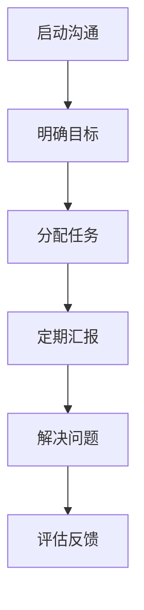
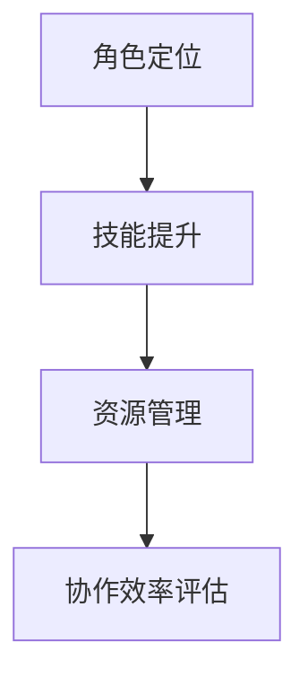
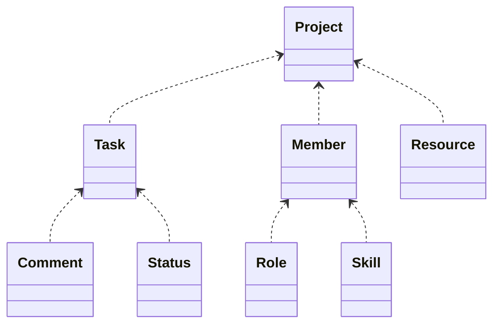
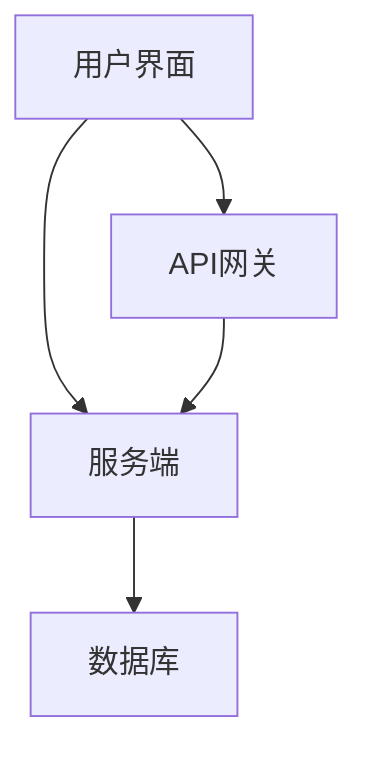
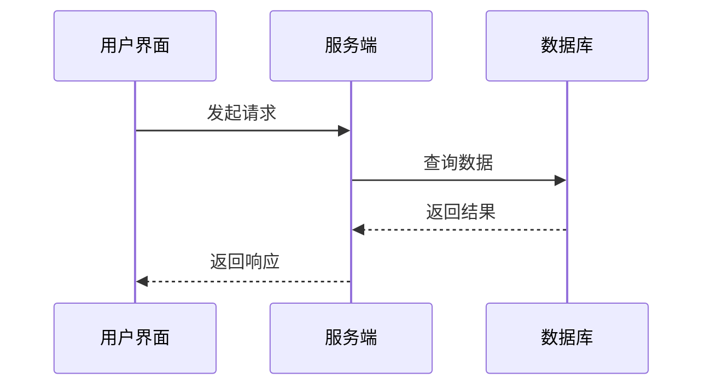

                 


# 团队协作：发挥1+1>2的效果

## 关键词：团队协作、效率、沟通、角色定位、资源管理、技能提升

> 摘要：本文深入探讨了团队协作的原理和实践方法，分析了团队协作中的核心概念和联系，并通过具体案例展示了如何通过优化沟通机制、明确角色定位、提升团队技能和资源管理等手段，实现团队协作的1+1>2的效果。

---

## 第一部分：背景介绍

### 1.1 问题背景

在现代企业中，团队协作扮演着至关重要的角色。随着信息技术和互联网的发展，企业面临着日益复杂的市场环境和快速变化的技术趋势。为了在这种动态环境中保持竞争力，企业需要更加高效和灵活地进行创新和业务拓展。团队协作是实现这一目标的关键途径，它不仅能够提高工作效率，还能够促进知识共享和经验传承。

### 1.2 问题描述

尽管团队协作的重要性不言而喻，但很多企业在实际操作中仍然面临诸多挑战。这些问题可能包括沟通不畅、角色定位不清、协作效率低下、资源分配不合理等。这些问题不仅影响了团队的整体绩效，还可能导致项目延期、质量下降，甚至影响企业的长期发展。

### 1.3 问题解决

为了解决这些问题，企业需要从多个方面入手，包括建立清晰的团队目标、优化沟通机制、明确角色职责、提升团队技能等。通过这些措施，可以有效地提高团队协作的效果，实现1+1>2的目标。

### 1.4 边界与外延

团队协作不仅涉及到团队成员之间的互动，还涉及到团队成员与外部合作伙伴、客户等的关系。因此，在探讨团队协作时，需要考虑这些外部因素对协作效果的影响。

### 1.5 概念结构与核心要素组成

团队协作的概念结构包括团队目标、角色定位、沟通机制、资源管理、技能提升等核心要素。这些要素相互作用，共同决定了团队协作的效果。

---

## 第二部分：核心概念与联系

### 2.1 核心概念

#### 2.1.1 团队

团队是指由两个或两个以上的个体组成的，为了达到共同目标而相互协作的群体。

#### 2.1.2 协作

协作是指团队成员为了实现共同目标而采取的相互配合和合作行为。

#### 2.1.3 团队协作效率

团队协作效率是指团队在协作过程中所取得的工作成果与投入的时间和资源之间的比率。

### 2.2 概念属性特征对比表格

| 概念         | 特征                     |
|--------------|------------------------|
| 团队         | 有共同目标、相互依赖、协作互动 |
| 协作         | 配合、共享、共同进步        |
| 团队协作效率 | 成果/投入               |

### 2.3 ER实体关系图架构

```mermaid
erDiagram
    Team ||--|{ Member }|| : has
    Member ||--|{ Role }|| : has
    Team ||--|{ Goal }|| : has
    Member ||--|{ Skill }|| : has
```

---

## 第三部分：团队协作的原理

### 3.1 团队协作原理概述

团队协作是基于个体之间相互依赖和协作来实现共同目标的过程。这一过程涉及到沟通、协调、分工和合作等多个方面。

### 3.2 团队协作的数学模型和公式

团队协作的效率可以用以下公式来表示：
$$ 效率 = \frac{成果}{投入} $$
其中，成果包括项目完成度、质量、创新性等；投入包括时间、资源、人力等。

### 3.3 算法原理讲解与举例说明

#### 3.3.1 沟通机制设计

沟通是团队协作的核心环节。设计有效的沟通机制，可以帮助团队成员更好地理解项目目标和任务要求，提高协作效率。

#### Mermaid流程图



#### Python源代码

```python
def communicate():
    print("启动沟通")
    print("明确目标")
    print("分配任务")
    print("定期汇报")
    print("解决问题")
    print("评估反馈")

communicate()
```

#### 3.3.2 协作效率提升策略

提升团队协作效率，需要从多个方面进行考虑，包括角色定位、技能提升、资源管理等。

#### Mermaid流程图



#### Python源代码

```python
def team_efficiency():
    print("角色定位")
    print("技能提升")
    print("资源管理")
    print("协作效率评估")

team_efficiency()
```

---

## 第四部分：系统分析与架构设计

### 4.1 问题场景介绍

在现代企业中，项目管理是一项至关重要的工作。随着项目复杂度的增加，传统的项目管理方式已经难以满足需求。为了提高项目管理效率，需要引入先进的团队协作工具和系统。

### 4.2 项目介绍

本项目旨在开发一款支持团队协作的项目管理工具。该工具应具备以下功能：

- 项目任务分配
- 项目进度跟踪
- 团队成员沟通与协作
- 项目资源管理

### 4.3 系统功能设计（领域模型Mermaid类图）



### 4.4 系统架构设计（Mermaid架构图）



### 4.5 系统接口设计和系统交互（Mermaid序列图）



---

## 第五部分：项目实战

### 5.1 环境安装

在本项目中，我们将使用Python和Django框架进行开发。以下是环境安装步骤：

1. 安装Python 3.8及以上版本
2. 安装Django 3.2及以上版本
3. 安装PostgreSQL数据库

### 5.2 系统核心实现源代码

以下是一个简单的任务分配接口的代码示例：

```python
from django.http import JsonResponse
from .models import Task, Member

def assign_task(request):
    task_id = request.GET.get('task_id')
    member_id = request.GET.get('member_id')

    task = Task.objects.get(id=task_id)
    member = Member.objects.get(id=member_id)

    task.assignee = member
    task.save()

    return JsonResponse({'status': 'success', 'message': 'Task assigned successfully.'})
```

### 5.3 代码应用解读与分析

上述代码定义了一个用于任务分配的接口。当用户发送一个包含任务ID和成员ID的请求时，接口将更新任务表的`assignee`字段，将任务分配给指定的成员。

### 5.4 实际案例分析和详细讲解剖析

为了更好地理解团队协作在项目管理中的应用，我们可以分析一个实际案例：一个软件开发团队正在开发一款新的应用程序。在这个项目中，团队成员需要协作完成多个任务，包括需求分析、设计、编码、测试等。

通过团队协作工具，团队成员可以实时跟踪项目进度，及时解决问题，确保项目按期完成。此外，团队成员还可以通过沟通机制，共享知识和经验，提高整体工作效率。

### 5.5 项目小结

在本项目中，我们介绍了团队协作的重要性，并通过一个实际案例展示了如何实现团队协作的1+1>2的效果。通过优化沟通机制、明确角色定位、提升团队技能和资源管理等手段，我们可以有效地提高团队协作效率，实现项目的成功。

---

## 第六部分：最佳实践 Tips

1. **明确团队目标**：确保所有团队成员都清楚地了解项目目标和预期成果，有助于提高协作效率。
2. **建立有效的沟通机制**：定期召开会议，使用即时通讯工具，确保团队成员之间保持畅通的沟通。
3. **明确角色定位**：为每个成员分配明确的职责，确保团队成员各司其职，避免重复劳动。
4. **提升团队技能**：定期进行技能培训，提高团队成员的专业能力，有助于提升团队协作效率。
5. **合理分配资源**：确保团队成员有足够的资源（如时间、工具等）来完成各自的任务。

---

## 第七部分：小结与注意事项

本文从多个方面探讨了团队协作的重要性，包括背景介绍、核心概念与联系、团队协作原理、系统分析与架构设计、项目实战等。通过实际案例分析和最佳实践Tips，我们了解了如何实现团队协作的1+1>2的效果。

需要注意的是，团队协作是一个复杂的过程，需要团队成员之间相互信任、尊重和合作。在实际操作中，企业需要根据自身情况，不断优化团队协作流程，提高团队协作效率。

---

## 第八部分：拓展阅读

1. 【百度百科】《团队协作》：https://baike.baidu.com/item/%E5%9B%A2%E9%98%9F%E5%8D%8F%E4%BD%9C
2. 【GitHub】《团队协作工具推荐》：https://github.com/topics/team-collaboration
3. 【简书】《团队协作技巧》：https://www.jianshu.com/p/77c5d4a46858

---

# 作者信息

作者：AI天才研究院/AI Genius Institute & 禅与计算机程序设计艺术 /Zen And The Art of Computer Programming

